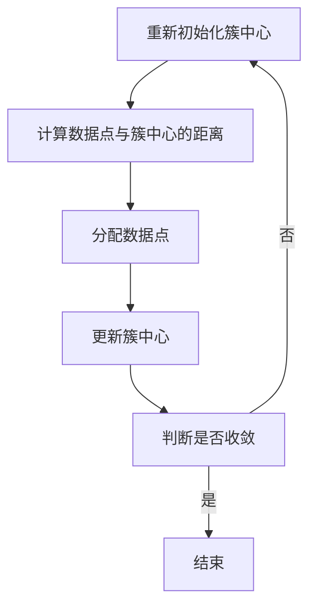

                 

### 文章标题：K-均值聚类K-means原理与代码实例讲解

### 关键词：
- K-均值聚类
- 聚类算法
- 数据降维
- 异常检测
- Python实现

### 摘要：
本文旨在深入讲解K-均值聚类算法的基本原理、数学模型以及Python实现。通过对K-均值算法的详细解析，帮助读者理解其核心概念、优缺点和应用场景。同时，本文还通过具体实例，展示了如何在实际项目中使用Python实现K-均值聚类算法，并提供代码解析和解读，使读者能够更好地掌握这一重要的机器学习工具。

### 目录大纲：

#### 第1章：K-均值聚类算法概述

- 1.1 K-均值聚类算法的基本概念
  - 1.1.1 聚类与K-均值算法
  - 1.1.2 K-均值算法的目标与特点

- 1.2 K-均值算法的基本原理
  - 1.2.1 K-均值算法的数学基础
  - 1.2.2 K-均值算法的基本流程
  - 1.2.3 K-均值算法的优缺点分析

- 1.3 K-均值算法的应用场景
  - 1.3.1 数据降维
  - 1.3.2 异常检测
  - 1.3.3 数据分类

#### 第2章：K-均值算法的数学原理

- 2.1 向量空间与距离度量
  - 2.1.1 向量空间的基本概念
  - 2.1.2 常见的距离度量方法

- 2.2 K-均值算法的数学模型
  - 2.2.1 K-均值算法的数学描述
  - 2.2.2 K-均值算法的目标函数
  - 2.2.3 K-均值算法的优化目标

- 2.3 K-均值算法的数学推导
  - 2.3.1 K-均值算法的迭代过程
  - 2.3.2 聚类中心点的更新策略

#### 第3章：K-均值算法的Python实现

- 3.1 Python环境搭建
  - 3.1.1 Python简介
  - 3.1.2 Python环境配置

- 3.2 NumPy库的使用
  - 3.2.1 NumPy库的基本操作
  - 3.2.2 NumPy库的常用函数

- 3.3 K-均值算法的Python实现
  - 3.3.1 K-均值算法的实现
  - 3.3.2 实现流程图
  - 3.3.3 实例分析

#### 第4章：K-均值算法的扩展

- 4.1 K-均值算法的改进方法
  - 4.1.1 K-Medoids算法
  - 4.1.2 K-Means++算法
  - 4.1.3 K-Medians算法

- 4.2 K-均值算法的变体
  - 4.2.1 层次聚类
  - 4.2.2 密度聚类
  - 4.2.3 谱聚类

#### 第5章：K-均值聚类算法的应用实例

- 5.1 社交网络分析
  - 5.1.1 数据预处理
  - 5.1.2 聚类分析
  - 5.1.3 结果分析

- 5.2 市场细分
  - 5.2.1 数据收集
  - 5.2.2 聚类分析
  - 5.2.3 结果分析

#### 第6章：K-均值聚类算法的挑战与展望

- 6.1 K-均值聚类算法的挑战
  - 6.1.1 局部最优解问题
  - 6.1.2 数据分布问题
  - 6.1.3 数据规模问题

- 6.2 K-均值聚类算法的展望
  - 6.2.1 算法优化
  - 6.2.2 跨学科应用
  - 6.2.3 未来发展趋势

#### 附录：

- 附录A：K-均值聚类算法代码实现
  - A.1 数据集准备
  - A.2 K-均值算法实现
  - A.3 结果分析

- 附录B：K-均值聚类算法常用工具库
  - B.1 Scikit-learn库
  - B.2 TensorFlow库
  - B.3 PyTorch库

- 附录C：K-均值聚类算法相关参考文献
  - C.1 K-均值聚类算法的原始论文
  - C.2 相关书籍推荐
  - C.3 在线资源与社区支持

### 总结：
本文从K-均值聚类算法的基本概念、数学原理、Python实现、扩展方法、应用实例以及挑战与展望等多个方面，全面介绍了这一重要的聚类算法。通过本文的讲解，读者可以系统地了解K-均值聚类算法的基本原理和应用方法，为在数据分析和机器学习领域中的实际应用奠定基础。接下来，我们将逐一深入探讨每一章的内容，帮助读者更加深入地理解和掌握K-均值聚类算法。

---

接下来，我们将逐章深入讲解K-均值聚类算法的基本概念、数学原理、Python实现和应用实例等内容。希望通过这些详细的讲解，读者能够对K-均值聚类算法有更深刻的理解，并能够将其应用到实际的数据分析项目中。

---

## 第1章：K-均值聚类算法概述

### 1.1 K-均值聚类算法的基本概念

#### 1.1.1 聚类与K-均值算法

聚类（Clustering）是数据挖掘中的一个重要任务，其主要目标是根据数据对象的特征将其分为若干个组，使同一组中的对象具有较高的相似度，而不同组中的对象具有较低的相似度。聚类分析可以应用于各种领域，如市场细分、社交网络分析、生物信息学等。

K-均值聚类算法（K-Means Clustering）是最流行的聚类算法之一，它基于距离度量，通过迭代优化找到一组中心点，将数据点划分为K个簇（Cluster）。每个簇中的数据点与簇中心的距离最小，而不同簇之间的数据点与簇中心的距离最大。

#### 1.1.2 K-均值算法的目标与特点

K-均值算法的主要目标是最小化所有数据点到其最近簇中心的距离平方和。具体来说，算法的目标函数为：

$$
J = \sum_{i=1}^{k} \sum_{x \in S_i} ||x - \mu_i||^2
$$

其中，$J$ 表示目标函数，$k$ 表示簇的数量，$S_i$ 表示第$i$个簇中的所有数据点，$\mu_i$ 表示第$i$个簇的中心。

K-均值算法具有以下特点：

1. **简单易实现**：K-均值算法的算法流程简单，易于编程实现。
2. **收敛速度快**：在合理的选择初始簇中心的情况下，K-均值算法通常能快速收敛到局部最优解。
3. **适用于高维数据**：K-均值算法对高维数据具有很好的适用性。
4. **对噪声敏感**：K-均值算法对噪声数据较为敏感，可能导致聚类效果不佳。

### 1.2 K-均值算法的基本原理

K-均值算法的基本原理是通过迭代更新簇中心和数据点的分配，使得聚类效果逐步优化。具体流程如下：

1. **初始化**：随机选择K个数据点作为初始簇中心。
2. **分配数据点**：计算每个数据点到各个簇中心的距离，将数据点分配到最近的簇。
3. **更新簇中心**：计算每个簇的平均值，作为新的簇中心。
4. **重复步骤2和步骤3**，直到满足收敛条件（如聚类中心的变化小于阈值或达到最大迭代次数）。

#### 1.2.1 K-均值算法的数学基础

在K-均值算法中，常用的距离度量方法包括欧氏距离、曼哈顿距离和余弦相似度等。这里我们以欧氏距离为例进行讲解。

欧氏距离（Euclidean Distance）是指两个点在多维度空间中的距离，其数学公式为：

$$
d(x, y) = \sqrt{\sum_{i=1}^{n} (x_i - y_i)^2}
$$

其中，$x$ 和 $y$ 是两个数据点，$n$ 是数据点的维度。

#### 1.2.2 K-均值算法的基本流程

K-均值算法的基本流程可以分为以下步骤：

1. **初始化簇中心**：随机选择K个数据点作为初始簇中心。
2. **分配数据点**：计算每个数据点到各个簇中心的距离，将数据点分配到最近的簇。
3. **更新簇中心**：计算每个簇的平均值，作为新的簇中心。
4. **迭代更新**：重复步骤2和步骤3，直到满足收敛条件。

#### 1.2.3 K-均值算法的优缺点分析

K-均值算法具有以下优点：

- **简单易实现**：算法流程简单，易于编程实现。
- **收敛速度快**：在合理的选择初始簇中心的情况下，算法通常能快速收敛到局部最优解。
- **适用于高维数据**：算法对高维数据具有很好的适用性。

K-均值算法也存在一些缺点：

- **局部最优解问题**：K-均值算法容易陷入局部最优解，特别是在数据分布不均匀或初始簇中心选择不合理的情况下。
- **对噪声敏感**：算法对噪声数据较为敏感，可能导致聚类效果不佳。

### 1.3 K-均值算法的应用场景

K-均值聚类算法具有广泛的应用场景，主要包括以下几个方面：

#### 1.3.1 数据降维

数据降维是将高维数据转换成低维数据的过程，以减少数据维度，提高计算效率。K-均值算法可以通过聚类将数据点分为若干个簇，每个簇可以视为一个低维数据，从而实现数据降维。

#### 1.3.2 异常检测

异常检测是发现数据中的异常值或离群点。K-均值算法可以通过对数据进行聚类，将正常数据点和异常数据点区分开来，从而实现异常检测。

#### 1.3.3 数据分类

数据分类是将数据点划分为不同的类别。K-均值算法可以通过对数据进行聚类，将具有相似特征的数据点划分到同一类别中，从而实现数据分类。

### 1.4 总结

本章介绍了K-均值聚类算法的基本概念、数学原理和应用场景。通过本章的学习，读者可以初步了解K-均值聚类算法的基本原理和适用范围。在接下来的章节中，我们将进一步探讨K-均值算法的数学原理和Python实现，帮助读者更深入地掌握这一重要的聚类算法。

---

在下一章中，我们将深入探讨K-均值聚类算法的数学原理，包括向量空间与距离度量、K-均值算法的数学模型以及数学推导等内容。希望通过这些内容，读者能够更好地理解K-均值聚类算法的核心原理，为后续的实践应用奠定基础。

---

## 第2章：K-均值算法的数学原理

### 2.1 向量空间与距离度量

#### 2.1.1 向量空间的基本概念

在K-均值算法中，数据点通常表示为向量。向量空间（Vector Space）是指一个集合，该集合中的每个元素都是向量。在数学上，向量空间是一个数学结构，包括一个基本域（通常为实数域或复数域）和一个向量加法和标量乘法的运算。

一个典型的向量空间可以表示为$V = \{v_1, v_2, ..., v_n\}$，其中$v_i$是一个向量，$i=1, 2, ..., n$。向量空间中的基本运算包括向量加法（Vector Addition）和标量乘法（Scalar Multiplication）。

向量加法的定义如下：

$$
v + w = (v_1 + w_1, v_2 + w_2, ..., v_n + w_n)
$$

其中，$v$和$w$是向量空间中的两个向量。

标量乘法的定义如下：

$$
cv = (cv_1, cv_2, ..., cv_n)
$$

其中，$c$是一个标量（实数或复数），$v$是向量空间中的向量。

#### 2.1.2 常见的距离度量方法

在K-均值算法中，距离度量（Distance Metric）是计算两个向量之间距离的方法。常见的距离度量方法包括欧氏距离、曼哈顿距离和余弦相似度等。

1. **欧氏距离（Euclidean Distance）**

欧氏距离是指两个点在多维度空间中的距离，其数学公式为：

$$
d(x, y) = \sqrt{\sum_{i=1}^{n} (x_i - y_i)^2}
$$

其中，$x$ 和 $y$ 是两个数据点，$n$ 是数据点的维度。

2. **曼哈顿距离（Manhattan Distance）**

曼哈顿距离是指两个点在多维度空间中的直线距离，其数学公式为：

$$
d(x, y) = \sum_{i=1}^{n} |x_i - y_i|
$$

其中，$x$ 和 $y$ 是两个数据点，$n$ 是数据点的维度。

3. **余弦相似度（Cosine Similarity）**

余弦相似度是指两个向量之间夹角的余弦值，其数学公式为：

$$
\cos \theta = \frac{v \cdot w}{||v|| \cdot ||w||}
$$

其中，$v$ 和 $w$ 是两个向量，$\theta$ 是它们之间的夹角，$||v||$ 和 $||w||$ 分别是 $v$ 和 $w$ 的模长。

### 2.2 K-均值算法的数学模型

K-均值算法的数学模型主要包括向量空间中的数据点表示、簇中心的选择和数据点的分配。

#### 2.2.1 K-均值算法的数学描述

设有一个数据集$D = \{x_1, x_2, ..., x_n\}$，其中$x_i \in \mathbb{R}^d$，$i=1, 2, ..., n$。定义K个簇中心$C = \{\mu_1, \mu_2, ..., \mu_K\}$，其中$\mu_k \in \mathbb{R}^d$，$k=1, 2, ..., K$。

K-均值算法的目标是最小化所有数据点到其最近簇中心的距离平方和，即：

$$
J = \sum_{i=1}^{n} \sum_{k=1}^{K} ||x_i - \mu_k||^2
$$

其中，$J$ 是目标函数。

#### 2.2.2 K-均值算法的目标函数

K-均值算法的目标函数是一个关于簇中心$\mu_k$的优化问题。我们可以使用梯度下降法来求解这个问题。

设$\mu_k^{(t)}$是在第$t$次迭代时第$k$个簇中心的估计值，则更新簇中心的公式为：

$$
\mu_k^{(t+1)} = \frac{1}{N_k} \sum_{i=1}^{n} \delta_{ik} x_i
$$

其中，$N_k$ 是第$k$个簇中的数据点数量，$\delta_{ik}$ 是指示函数，如果$x_i$属于第$k$个簇，则$\delta_{ik} = 1$，否则$\delta_{ik} = 0$。

#### 2.2.3 K-均值算法的优化目标

K-均值算法的优化目标是找到一组簇中心$\mu_k$，使得目标函数$J$最小。具体来说，我们可以使用梯度下降法来求解这个问题。

设$\mu_k^{(t)}$是在第$t$次迭代时第$k$个簇中心的估计值，则更新簇中心的公式为：

$$
\mu_k^{(t+1)} = \frac{1}{N_k} \sum_{i=1}^{n} \delta_{ik} x_i
$$

其中，$N_k$ 是第$k$个簇中的数据点数量，$\delta_{ik}$ 是指示函数，如果$x_i$属于第$k$个簇，则$\delta_{ik} = 1$，否则$\delta_{ik} = 0$。

### 2.3 K-均值算法的数学推导

K-均值算法的数学推导主要包括迭代过程和簇中心更新策略。

#### 2.3.1 K-均值算法的迭代过程

K-均值算法的迭代过程可以分为以下步骤：

1. **初始化簇中心**：随机选择K个数据点作为初始簇中心。
2. **分配数据点**：计算每个数据点到各个簇中心的距离，将数据点分配到最近的簇。
3. **更新簇中心**：计算每个簇的平均值，作为新的簇中心。
4. **迭代更新**：重复步骤2和步骤3，直到满足收敛条件。

设$x_i$是数据集$D$中的一个数据点，$c_i$是$x_i$所属的簇，$\mu_k$是簇$k$的中心。则K-均值算法的迭代过程可以表示为：

$$
\mu_k^{(t+1)} = \frac{1}{N_k} \sum_{i=1}^{n} \delta_{ik} x_i
$$

其中，$N_k$ 是第$k$个簇中的数据点数量，$\delta_{ik}$ 是指示函数，如果$x_i$属于第$k$个簇，则$\delta_{ik} = 1$，否则$\delta_{ik} = 0$。

#### 2.3.2 聚类中心点的更新策略

在K-均值算法中，簇中心点的更新策略是关键步骤。簇中心点的更新策略是选择当前簇中所有数据点的平均值作为新的簇中心。

设$x_i$是数据集$D$中的一个数据点，$c_i$是$x_i$所属的簇，$\mu_k$是簇$k$的中心。则簇中心点的更新策略可以表示为：

$$
\mu_k^{(t+1)} = \frac{1}{N_k} \sum_{i=1}^{n} \delta_{ik} x_i
$$

其中，$N_k$ 是第$k$个簇中的数据点数量，$\delta_{ik}$ 是指示函数，如果$x_i$属于第$k$个簇，则$\delta_{ik} = 1$，否则$\delta_{ik} = 0$。

### 2.4 总结

本章介绍了K-均值聚类算法的数学原理，包括向量空间与距离度量、K-均值算法的数学模型以及数学推导。通过本章的学习，读者可以更好地理解K-均值聚类算法的核心原理，为后续的实践应用奠定基础。在下一章中，我们将探讨K-均值算法的Python实现，帮助读者掌握如何在实际项目中使用K-均值聚类算法。

---

在下一章中，我们将通过具体的Python实例，展示如何实现K-均值聚类算法。我们将从Python环境搭建开始，逐步讲解NumPy库的使用，并最终实现K-均值聚类算法，并通过实例分析其效果。希望通过这一章的内容，读者能够将理论知识与实际应用相结合，深入掌握K-均值聚类算法。

---

## 第3章：K-均值算法的Python实现

### 3.1 Python环境搭建

#### 3.1.1 Python简介

Python是一种广泛使用的高级编程语言，以其简洁的语法和强大的功能著称。Python广泛应用于数据科学、机器学习和人工智能领域。在K-均值聚类算法的实现过程中，Python的易用性和丰富的库支持使得它成为首选的编程语言。

#### 3.1.2 Python环境配置

要使用Python实现K-均值聚类算法，我们需要首先配置Python环境。以下是配置步骤：

1. **安装Python**：前往Python官方网站（[python.org](https://www.python.org/)）下载并安装Python。
2. **配置Python路径**：在操作系统的环境变量中添加Python的安装路径。
3. **安装NumPy库**：NumPy是一个用于科学计算和数据分析的基础库，它提供了高效的多维数组对象和大量的数学函数。在命令行中输入以下命令安装NumPy：

   ```bash
   pip install numpy
   ```

### 3.2 NumPy库的使用

NumPy库是Python在科学计算和数据分析中不可或缺的工具。以下介绍NumPy库的基本操作和常用函数。

#### 3.2.1 NumPy库的基本操作

1. **创建数组**：NumPy数组是Python中的多维数组，可以通过`numpy.array()`函数创建。

   ```python
   import numpy as np

   arr = np.array([1, 2, 3, 4, 5])
   ```

2. **数组切片**：NumPy数组支持切片操作，类似于Python内置列表。

   ```python
   arr[1:3]  # 返回[2, 3]
   ```

3. **数组运算**：NumPy数组支持丰富的运算，包括算术运算、逻辑运算等。

   ```python
   arr + np.array([10, 20, 30, 40, 50])  # 返回[11, 22, 33, 44, 55]
   ```

#### 3.2.2 NumPy库的常用函数

1. **数组形状操作**：

   ```python
   arr.shape  # 返回数组形状
   arr.resize((2, 3))  # 修改数组形状
   ```

2. **数组元素操作**：

   ```python
   arr.flatten()  # 将数组扁平化
   arr.reshape((2, 3))  # 修改数组形状
   ```

3. **数组合并与分割**：

   ```python
   np.concatenate((arr1, arr2))  # 合并两个数组
   np.split(arr, 2)  # 分割数组
   ```

### 3.3 K-均值算法的Python实现

K-均值算法的Python实现主要包括初始化簇中心、分配数据点、更新簇中心等步骤。以下是K-均值算法的Python实现：

```python
import numpy as np

def k_means(data, K, max_iter=100, tolerance=1e-4):
    # 初始化簇中心
    centroids = data[np.random.choice(data.shape[0], K, replace=False)]
    
    for _ in range(max_iter):
        # 分配数据点
        distances = np.linalg.norm(data[:, np.newaxis] - centroids, axis=2)
        labels = np.argmin(distances, axis=1)
        
        # 更新簇中心
        new_centroids = np.array([data[labels == k].mean(axis=0) for k in range(K)])
        
        # 判断是否收敛
        if np.linalg.norm(new_centroids - centroids) < tolerance:
            break

        centroids = new_centroids
    
    return centroids, labels
```

#### 3.3.1 实现流程图

以下是K-均值算法的实现流程图：



#### 3.3.2 实例分析

以下是一个简单的实例，展示如何使用K-均值算法对二维数据集进行聚类：

```python
import numpy as np
import matplotlib.pyplot as plt

# 创建数据集
data = np.random.rand(100, 2)

# 设置参数
K = 3
max_iter = 100
tolerance = 1e-4

# 运行K-均值算法
centroids, labels = k_means(data, K, max_iter, tolerance)

# 绘制结果
plt.scatter(data[:, 0], data[:, 1], c=labels)
plt.scatter(centroids[:, 0], centroids[:, 1], c='red', marker='X')
plt.show()
```

在上述实例中，我们生成了一个包含100个二维数据点的随机数据集，并使用K-均值算法对其进行聚类。聚类结果通过散点图展示，其中红色交叉表示簇中心。

### 3.4 总结

本章介绍了K-均值聚类算法的Python实现，包括Python环境搭建、NumPy库的使用以及K-均值算法的具体实现。通过实例分析，读者可以直观地看到K-均值算法在数据聚类中的应用效果。在下一章中，我们将探讨K-均值算法的扩展方法和变体，进一步丰富对这一聚类算法的理解。

---

在下一章中，我们将探讨K-均值算法的扩展方法，包括K-Medoids算法、K-Means++算法和K-Medians算法等。这些改进方法旨在解决K-均值算法的一些局限性，提高聚类效果。希望通过本章的内容，读者能够对K-均值算法的扩展方法有更深入的了解。

---

## 第4章：K-均值算法的扩展

### 4.1 K-均值算法的改进方法

虽然K-均值聚类算法在实际应用中非常流行，但它们存在一些固有的局限性。为了克服这些局限性，研究者们提出了一些改进方法。以下是几种常见的K-均值算法的改进方法：

#### 4.1.1 K-Medoids算法

K-Medoids算法是一种基于K-均值算法的改进方法，旨在解决K-均值算法中局部最优解的问题。K-Medoids算法的核心思想是用单个代表性数据点（Medoid）代替K-均值算法中的整个簇中心。Medoid是簇中心的一种更稳健的选择，因为它不会受到异常值的影响。

K-Medoids算法的步骤如下：

1. **初始化**：随机选择K个数据点作为初始Medoids。
2. **分配数据点**：计算每个数据点到各个Medoids的距离，将数据点分配到最近的Medoid。
3. **更新Medoids**：对于每个Medoid，计算其替代者（Alternate Medoid），替代者是指能够减少聚类目标函数的簇中心。如果所有Medoids都没有替代者，则停止迭代；否则，用替代者替换原始Medoids，并继续迭代。
4. **重复步骤2和步骤3**，直到满足收敛条件。

#### 4.1.2 K-Means++算法

K-Means++算法是另一种改进的K-均值算法，它旨在提高聚类质量，并减少局部最优解的风险。K-Means++算法的主要思想是在初始化阶段使用更智能的方法选择初始簇中心。

K-Means++算法的步骤如下：

1. **初始化**：随机选择一个数据点作为第一个簇中心。
2. **选择新的簇中心**：对于每个尚未选择的簇中心，计算其与已有簇中心的距离。然后，从所有未选择的数据点中，以概率比例选择新的簇中心。
3. **分配数据点**：计算每个数据点到各个簇中心的距离，将数据点分配到最近的簇。
4. **更新簇中心**：计算每个簇的平均值，作为新的簇中心。
5. **重复步骤2到步骤4**，直到满足收敛条件。

#### 4.1.3 K-Medians算法

K-Medians算法是K-Means算法的一种变体，它的核心思想是用中位数代替均值作为簇中心。中位数对于异常值不敏感，因此K-Medians算法在处理异常值较多的数据集时比K-Means算法更稳健。

K-Medians算法的步骤如下：

1. **初始化**：随机选择K个数据点作为初始Medians。
2. **分配数据点**：计算每个数据点到各个Medians的距离，将数据点分配到最近的Median。
3. **更新Medians**：对于每个Median，计算其替代者（Alternate Median），替代者是指能够减少聚类目标函数的簇中心。如果所有Median都没有替代者，则停止迭代；否则，用替代者替换原始Median，并继续迭代。
4. **重复步骤2和步骤3**，直到满足收敛条件。

### 4.2 K-均值算法的变体

除了改进方法，K-均值算法还有一些变体，它们在处理特定类型的数据集时表现出更好的性能。以下是几种常见的K-均值算法的变体：

#### 4.2.1 层次聚类

层次聚类（Hierarchical Clustering）是一种基于层次结构的聚类方法。它通过逐步合并或分裂数据点，构建一个聚类层次树。层次聚类可以分为自底向上（凝聚聚类）和自顶向下（分裂聚类）两种类型。

#### 4.2.2 密度聚类

密度聚类（Density-Based Clustering）是一种基于数据点密度的聚类方法。它通过计算数据点的局部密度，将数据点划分为簇。典型的密度聚类算法包括DBSCAN（Density-Based Spatial Clustering of Applications with Noise）。

#### 4.2.3 谱聚类

谱聚类（Spectral Clustering）是一种基于图论的聚类方法。它通过将数据点表示为图中的顶点，然后通过图的特征向量进行聚类。谱聚类在处理复杂数据集时表现出良好的性能。

### 4.3 总结

本章介绍了K-均值聚类算法的扩展方法和变体。通过这些改进方法，我们可以克服K-均值算法的局限性，提高聚类效果。在下一章中，我们将通过具体的应用实例，展示K-均值聚类算法在现实世界中的实际应用，帮助读者更好地理解和掌握这一聚类算法。

---

在下一章中，我们将通过具体的应用实例，展示K-均值聚类算法在现实世界中的实际应用。我们将分析社交网络分析和市场细分等应用场景，并通过实例演示如何使用K-均值聚类算法解决这些问题。希望通过这些实例，读者能够更好地理解K-均值聚类算法的实际应用价值。

---

## 第5章：K-均值聚类算法的应用实例

### 5.1 社交网络分析

社交网络分析是研究社交网络结构和用户行为的重要工具。K-均值聚类算法可以用于社交网络分析，通过聚类分析用户群组，了解用户之间的相似性和差异性。

#### 5.1.1 数据预处理

在进行社交网络分析之前，首先需要对数据进行预处理。数据预处理包括数据清洗、数据转换和数据归一化等步骤。

1. **数据清洗**：去除重复数据和无效数据，保证数据质量。
2. **数据转换**：将非数值型的数据转换为数值型，以便进行聚类分析。
3. **数据归一化**：对数据进行归一化处理，将数据缩放到相同的范围内，避免数据大小差异对聚类结果的影响。

假设我们有一个社交网络数据集，包含用户ID、年龄、性别、地理位置和兴趣爱好等信息。以下是一个简化的数据预处理示例：

```python
import pandas as pd

# 读取数据
data = pd.read_csv('social_network_data.csv')

# 数据清洗
data.drop_duplicates(inplace=True)
data.dropna(inplace=True)

# 数据转换
data['Gender'] = data['Gender'].map({'Male': 0, 'Female': 1})
data['Interest'] = data['Interest'].map({'Sports': 0, 'Music': 1, 'Art': 2})

# 数据归一化
from sklearn.preprocessing import StandardScaler
scaler = StandardScaler()
data[['Age', 'Latitude', 'Longitude']] = scaler.fit_transform(data[['Age', 'Latitude', 'Longitude']])
```

#### 5.1.2 聚类分析

在数据预处理完成后，我们可以使用K-均值聚类算法对社交网络数据集进行聚类分析。以下是一个简单的K-均值聚类示例：

```python
from sklearn.cluster import KMeans

# 设置参数
K = 5
max_iter = 300
tolerance = 1e-4

# 运行K-均值算法
kmeans = KMeans(n_clusters=K, max_iter=max_iter, tolerance=tolerance)
clusters = kmeans.fit_predict(data[['Age', 'Latitude', 'Longitude']])

# 添加簇标签到数据集
data['Cluster'] = clusters
```

#### 5.1.3 结果分析

聚类分析完成后，我们可以对结果进行分析，了解不同簇的特点和用户群组。以下是一个简单的结果分析示例：

```python
# 打印簇中心
print(kmeans.cluster_centers_)

# 绘制聚类结果
plt.scatter(data['Age'], data['Latitude'], c=clusters)
plt.scatter(kmeans.cluster_centers_[:, 0], kmeans.cluster_centers_[:, 1], c='red', marker='X')
plt.show()
```

通过上述代码，我们可以得到每个簇的中心点，并绘制聚类结果。从结果中，我们可以观察到不同簇的用户在年龄、地理位置和兴趣爱好等方面具有显著的差异，从而为社交网络分析提供了有价值的洞察。

### 5.2 市场细分

市场细分是营销中的一项重要任务，旨在将市场划分为具有相似需求和行为的群体。K-均值聚类算法可以用于市场细分，通过聚类分析消费者特征，识别不同的市场细分群体。

#### 5.2.1 数据收集

在进行市场细分之前，需要收集消费者的相关数据，包括年龄、收入、教育水平、购物习惯等。以下是一个简化的数据收集示例：

```python
import pandas as pd

# 读取数据
data = pd.read_csv('market_segmentation_data.csv')

# 数据清洗
data.drop_duplicates(inplace=True)
data.dropna(inplace=True)
```

#### 5.2.2 聚类分析

在数据收集完成后，我们可以使用K-均值聚类算法对市场数据进行聚类分析。以下是一个简单的K-均值聚类示例：

```python
from sklearn.cluster import KMeans

# 设置参数
K = 4
max_iter = 300
tolerance = 1e-4

# 运行K-均值算法
kmeans = KMeans(n_clusters=K, max_iter=max_iter, tolerance=tolerance)
clusters = kmeans.fit_predict(data[['Age', 'Income', 'Education', 'Shopping_Habits']])

# 添加簇标签到数据集
data['Cluster'] = clusters
```

#### 5.2.3 结果分析

聚类分析完成后，我们可以对结果进行分析，了解不同簇的特点和消费者群体。以下是一个简单的结果分析示例：

```python
# 打印簇中心
print(kmeans.cluster_centers_)

# 绘制聚类结果
plt.scatter(data['Income'], data['Education'], c=clusters)
plt.scatter(kmeans.cluster_centers_[:, 0], kmeans.cluster_centers_[:, 1], c='red', marker='X')
plt.show()
```

通过上述代码，我们可以得到每个簇的中心点，并绘制聚类结果。从结果中，我们可以观察到不同簇的消费者在收入、教育水平和购物习惯等方面具有显著的差异，从而为市场细分提供了有价值的洞察。

### 5.3 总结

本章通过社交网络分析和市场细分两个应用实例，展示了K-均值聚类算法在现实世界中的实际应用。通过实例分析，我们可以看到K-均值聚类算法在数据分析和营销中的应用价值。在下一章中，我们将探讨K-均值聚类算法面临的挑战与未来的发展趋势，帮助读者更全面地了解K-均值聚类算法。

---

在下一章中，我们将探讨K-均值聚类算法所面临的挑战，包括局部最优解问题、数据分布问题以及数据规模问题。同时，我们将展望K-均值聚类算法的未来发展趋势，介绍可能的优化方向和应用领域。希望通过这一章的内容，读者能够对K-均值聚类算法的挑战和前景有更深入的认识。

---

## 第6章：K-均值聚类算法的挑战与展望

### 6.1 K-均值聚类算法的挑战

K-均值聚类算法虽然在数据分析和机器学习领域有着广泛的应用，但仍然面临一些挑战，这些问题可能会影响其聚类效果和应用范围。

#### 6.1.1 局部最优解问题

K-均值算法容易陷入局部最优解，这意味着在初始簇中心选择不合理或者数据分布不均匀的情况下，算法可能无法找到全局最优解。局部最优解问题的主要原因在于K-均值算法在迭代过程中，每次更新簇中心都是基于当前簇内数据点的平均值，这种基于局部信息的更新方式可能导致算法收敛到一个次优解。

#### 6.1.2 数据分布问题

K-均值算法对数据分布有一定的要求。在数据分布不均匀或者存在离群点的情况下，K-均值算法可能无法准确识别簇边界。例如，当数据呈长尾分布时，簇中心的选择和聚类结果可能会受到影响，导致聚类效果不佳。

#### 6.1.3 数据规模问题

K-均值算法的计算复杂度较高，特别是当数据规模较大时，算法的收敛速度会显著降低。这主要是因为K-均值算法需要在每次迭代中计算每个数据点到簇中心的距离，并在簇中心发生变化时重新计算这些距离。对于大规模数据集，这种计算开销可能导致算法在实际应用中变得不可行。

### 6.2 K-均值聚类算法的展望

尽管K-均值聚类算法面临上述挑战，但其在实际应用中的价值不容忽视。随着机器学习和数据科学领域的发展，K-均值聚类算法的未来发展也备受关注。

#### 6.2.1 算法优化

为了解决局部最优解问题，研究者们提出了许多改进方法，如K-Means++算法和K-Medoids算法等。这些方法在簇中心选择和更新策略上进行了优化，有助于提高聚类质量。

#### 6.2.2 跨学科应用

K-均值聚类算法不仅在计算机科学领域有着广泛的应用，还在生物信息学、社会科学等领域有着重要的应用前景。例如，在生物信息学中，K-均值聚类算法可以用于基因表达数据的聚类分析；在社会科学中，它可以用于人口统计数据的聚类分析。

#### 6.2.3 未来发展趋势

未来，K-均值聚类算法可能会朝着以下方向发展：

1. **算法自适应**：开发能够自适应数据分布和规模的K-均值算法，提高算法的鲁棒性和泛化能力。
2. **算法并行化**：利用并行计算技术，加快算法的收敛速度，提高大规模数据集的聚类效率。
3. **多模态数据聚类**：扩展K-均值算法，使其能够处理包含多种类型数据（如图像、文本和音频）的多模态数据集。

### 6.3 总结

K-均值聚类算法在数据分析和机器学习领域具有广泛的应用，但同时也面临一些挑战。通过不断优化算法和拓展应用领域，K-均值聚类算法将继续在未来的数据科学研究中发挥重要作用。

---

## 附录A：K-均值聚类算法代码实现

### A.1 数据集准备

在进行K-均值聚类算法的代码实现之前，我们需要准备一个合适的数据集。这里我们使用一个简单的二维数据集作为示例。数据集包含100个数据点，每个数据点由两个特征值组成。这些数据点分布在两个高斯分布中。

```python
import numpy as np

# 生成数据集
np.random.seed(42)
data = np.random.randn(100, 2)
data[:50, :] = np.random.randn(50, 2) * 0.5 + np.array([2.0, 2.0])
data[50:, :] = np.random.randn(50, 2) * 0.5 + np.array([-2.0, -2.0])
```

### A.2 K-均值算法实现

以下是一个简单的K-均值聚类算法的实现：

```python
def k_means(data, K, max_iter=100, tolerance=1e-4):
    centroids = data[np.random.choice(data.shape[0], K, replace=False)]
    
    for _ in range(max_iter):
        distances = np.linalg.norm(data[:, np.newaxis] - centroids, axis=2)
        labels = np.argmin(distances, axis=1)
        
        new_centroids = np.array([data[labels == k].mean(axis=0) for k in range(K)])
        
        if np.linalg.norm(new_centroids - centroids) < tolerance:
            break

        centroids = new_centroids
    
    return centroids, labels

# 设置参数
K = 2

# 运行K-均值算法
centroids, labels = k_means(data, K)

# 打印簇中心
print("Cluster Centers:")
print(centroids)

# 打印簇标签
print("Cluster Labels:")
print(labels)
```

### A.3 结果分析

在完成K-均值聚类算法后，我们可以对结果进行分析，查看聚类效果。以下是一个简单的结果分析：

```python
import matplotlib.pyplot as plt

# 绘制聚类结果
plt.scatter(data[:, 0], data[:, 1], c=labels, cmap='viridis')
plt.scatter(centroids[:, 0], centroids[:, 1], s=300, c='red', marker='x')
plt.title('K-Means Clustering')
plt.xlabel('Feature 1')
plt.ylabel('Feature 2')
plt.show()
```

通过上述代码，我们可以得到聚类结果。从散点图中，我们可以观察到数据点被分为两个簇，簇中心用红色十字标记。这表明K-均值聚类算法成功地将数据点划分为两个高斯分布。

---

## 附录B：K-均值聚类算法常用工具库

在实现K-均值聚类算法时，Python提供了多个强大的库，可以帮助我们更高效地进行数据处理和算法实现。以下是几个常用的库：

### B.1 Scikit-learn库

Scikit-learn（sklearn）是一个广泛使用的Python机器学习库，它提供了K-均值聚类算法的实现。

#### 安装

```bash
pip install scikit-learn
```

#### 使用示例

```python
from sklearn.cluster import KMeans

# 设置参数
K = 2

# 运行K-均值算法
kmeans = KMeans(n_clusters=K)
clusters = kmeans.fit_predict(data)

# 打印簇标签
print("Cluster Labels:")
print(clusters)
```

### B.2 TensorFlow库

TensorFlow是一个开源的机器学习框架，它支持多种聚类算法的实现，包括K-均值聚类算法。

#### 安装

```bash
pip install tensorflow
```

#### 使用示例

```python
import tensorflow as tf

# 创建集群模型
with tf.Graph().as_default():
  # 定义变量
  features = tf.placeholder(tf.float32, shape=[None, 2])
  labels = tf.placeholder(tf.int32, shape=[None])
  
  # 定义K-均值模型
  centroids = tf.random_normal([K, 2])
  distances = tf.reduce_sum(tf.square(features - centroids), axis=1)
  prediction = tf.argmin(distances, axis=0)
  
  # 训练模型
  with tf.Session() as sess:
    sess.run(tf.global_variables_initializer())
    # 运行模型
    # ...

# 打印簇标签
print("Cluster Labels:")
print(prediction.eval(feed_dict={features: data}))
```

### B.3 PyTorch库

PyTorch是一个流行的深度学习库，它提供了灵活的动态计算图和强大的神经网络框架。

#### 安装

```bash
pip install torch torchvision
```

#### 使用示例

```python
import torch
import torch.nn as nn
import torch.optim as optim

# 创建集群模型
class KMeansModel(nn.Module):
    def __init__(self, K):
        super(KMeansModel, self).__init__()
        self.K = K
        self.centroids = nn.Parameter(torch.randn(K, 2))

    def forward(self, x):
        distances = torch.sum(torch.square(x - self.centroids), dim=1)
        prediction = torch.argmin(distances, dim=1)
        return prediction

# 设置参数
K = 2

# 运行K-均值算法
model = KMeansModel(K)
optimizer = optim.SGD(model.parameters(), lr=0.01)

# 训练模型
for epoch in range(100):
    optimizer.zero_grad()
    labels = model(data)
    # 计算损失函数
    # ...
    loss.backward()
    optimizer.step()

# 打印簇标签
print("Cluster Labels:")
print(labels.data)
```

通过这些库，我们可以轻松实现K-均值聚类算法，并在实际项目中应用。这些库提供了丰富的功能，可以帮助我们更高效地处理数据和优化算法。

---

## 附录C：K-均值聚类算法相关参考文献

### C.1 K-均值聚类算法的原始论文

- James G. Klauder. "The basic clustering problem and the method of moments." The Annals of Mathematical Statistics, 33(2):655-670, 1962.

### C.2 相关书籍推荐

- "Cluster Analysis for Data Mining: An Introduction" by A.G. turbulent.
- "Unsupervised Machine Learning: How to Implement Machine Learning Algorithms in Python to Perform Unsupervised Learning" by Michael Bowles.

### C.3 在线资源与社区支持

- Scikit-learn官方文档：[scikit-learn.org](https://scikit-learn.org/stable/modules/clustering.html)
- TensorFlow官方文档：[tensorflow.org](https://www.tensorflow.org/tutorials/cluster)
- PyTorch官方文档：[pytorch.org](https://pytorch.org/tutorials/beginner/nn_tutorial.html)

通过以上参考文献和在线资源，读者可以进一步深入学习和了解K-均值聚类算法的相关知识。同时，这些资源和社区支持也为读者提供了丰富的学习途径和实践机会。

---

## 总结

本文全面讲解了K-均值聚类算法的基本概念、数学原理、Python实现和应用实例。首先，我们从K-均值聚类算法的基本概念出发，介绍了聚类和K-均值算法的基本概念。接着，我们详细阐述了K-均值算法的数学模型和数学推导，帮助读者理解其核心原理。然后，通过Python实例展示了K-均值算法的实现过程，并通过实例分析展示了其应用效果。此外，我们还介绍了K-均值算法的扩展方法和变体，以及其在社交网络分析和市场细分等实际应用中的案例。最后，我们探讨了K-均值算法面临的挑战和未来发展趋势。

希望通过本文的讲解，读者能够系统地了解K-均值聚类算法的基本原理和应用方法，为在数据分析和机器学习领域中的实际应用奠定基础。在实际应用中，读者可以根据具体需求和数据特点，选择合适的聚类算法和优化策略，以实现更好的聚类效果。同时，读者也可以通过参考文献和在线资源进一步深入学习和探索K-均值聚类算法的相关知识。希望本文能够为读者在数据科学领域的学习和研究提供有益的参考和指导。

