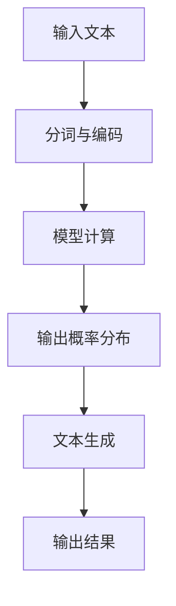
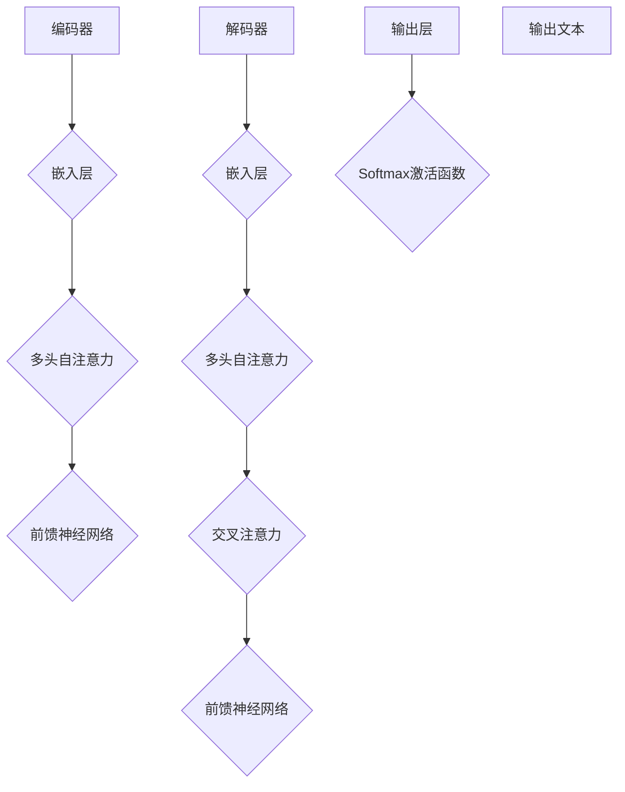

                 

### 文章标题：LLM 即服务：云端 AI 为大众所用

### 文章关键词：
- 语言模型（LLM）
- 云计算
- 人工智能服务
- 应用场景
- 开发工具与资源

### 摘要：
本文深入探讨了语言模型（LLM）即服务（LLMaaS）的概念、架构、原理和实现，以及其在不同行业中的应用。通过详细的数学模型讲解、伪代码示例和实际项目案例，本文揭示了 LLM 在云端 AI 领域的关键作用，为读者提供了全面的技术指南。

## 《LLM 即服务：云端 AI 为大众所用》目录大纲

### 第一部分：LLM 基础知识

#### 第1章：LLM 概述

##### 1.1 LLM 的定义与重要性
- LLM 的定义
- LLM 在云端 AI 中的重要性
- LLM 对大众服务的潜力

##### 1.2 LLM 的发展历史
- LLM 的起源
- 重大里程碑事件
- 当前 LLM 技术发展趋势

##### 1.3 LLM 技术概述
- 常见的 LLM 模型
- LLM 的工作原理

##### 1.4 LLM 在各行业中的应用
- 金融领域
- 医疗领域
- 教育领域
- 娱乐领域

### 第二部分：LLM 技术原理

#### 第2章：自然语言处理基础

##### 2.1 语言模型与 NLP
- 语言模型的基本概念
- NLP 的主要任务
- LLM 在 NLP 中的应用

##### 2.2 语言模型的数学基础
- 概率论与信息论基础
- 统计模型与神经网络模型
- 数学公式和推导

##### 2.3 LLM 模型原理
- 词嵌入
- 序列模型
- 注意力机制
- 转换器架构

##### 2.4 LLM 训练与优化
- 预训练方法
- 微调与迁移学习
- 模型优化技巧

### 第三部分：LLM 即服务实现

#### 第3章：LLM 即服务架构设计

##### 3.1 LLM 即服务概述
- LLM 即服务的定义
- LLM 即服务的发展历程
- LLM 即服务的优势

##### 3.2 LLM 即服务架构
- 服务端架构设计
- 客户端架构设计
- 数据流与通信机制

##### 3.3 LLM 模型部署
- 模型选择与优化
- 模型压缩与量化
- 模型部署与测试

##### 3.4 LLM 服务安全性
- 数据隐私保护
- 模型安全性与可靠性
- 攻击防御机制

### 第四部分：LLM 即服务应用案例

#### 第4章：金融行业应用

##### 4.1 金融领域 LLM 应用概述
- 金融领域 LLM 应用现状
- LLM 在金融领域的潜力

##### 4.2 金融智能客服系统
- 智能客服系统架构
- LLM 在客服系统中的应用

##### 4.3 投资决策支持系统
- 投资决策支持系统架构
- LLM 在投资决策中的应用

#### 第5章：医疗行业应用

##### 5.1 医疗领域 LLM 应用概述
- 医疗领域 LLM 应用现状
- LLM 在医疗领域的潜力

##### 5.2 医疗智能诊断系统
- 智能诊断系统架构
- LLM 在诊断系统中的应用

##### 5.3 医疗智能咨询系统
- 智能咨询系统架构
- LLM 在咨询系统中的应用

### 第五部分：LLM 即服务未来发展

#### 第6章：LLM 即服务趋势与挑战

##### 6.1 LLM 即服务发展趋势
- 人工智能技术的发展趋势
- LLM 即服务的发展趋势

##### 6.2 LLM 即服务面临的挑战
- 数据隐私与伦理问题
- 模型安全性与可靠性问题
- 法律与监管问题

##### 6.3 LLM 即服务的未来展望
- LLM 即服务的创新应用
- LLM 即服务的发展前景

### 附录

#### 附录 A：LLM 开发工具与资源

##### A.1 主流深度学习框架对比
- TensorFlow
- PyTorch
- JAX

##### A.2 LLM 开发工具与资源推荐
- 数据集获取与预处理
- 模型训练与评估工具
- 模型部署与运维工具

##### A.3 LLM 开发社区与资源
- 开源社区与平台
- 论坛与博客
- 学术会议与研讨会

### 引言：LLM 即服务的崛起

随着云计算和人工智能技术的快速发展，语言模型（LLM）即服务（LLMaaS）逐渐成为现代企业提升效率和创新能力的重要工具。LLMaaS 允许用户无需自行构建复杂的语言模型，只需通过云端 API 轻松访问强大的语言处理能力，从而将 AI 技术应用于各种业务场景。

本篇文章旨在深入探讨 LLM 即服务的概念、架构、原理和实现，并通过具体的行业应用案例展示其在金融、医疗等领域的实际价值。文章结构如下：

1. **LLM 基础知识**：介绍 LLM 的定义、发展历史、技术概述和应用场景。
2. **LLM 技术原理**：讲解自然语言处理基础、语言模型数学基础、模型原理和训练优化方法。
3. **LLM 即服务实现**：探讨 LLM 即服务的架构设计、模型部署和安全性。
4. **LLM 即服务应用案例**：分析金融和医疗行业中的具体应用案例。
5. **LLM 即服务未来发展**：探讨 LLM 即服务的趋势、挑战和未来展望。
6. **附录**：介绍 LLM 开发工具与资源。

#### 第一部分：LLM 基础知识

##### 1.1 LLM 的定义与重要性

语言模型（Language Model，简称 LLM）是一种用于预测自然语言序列的概率分布的机器学习模型。它通过对大量文本数据的分析学习语言规律，从而能够生成连贯的自然语言文本。LLM 在自然语言处理（NLP）领域具有重要地位，是许多 NLP 应用（如文本分类、机器翻译、问答系统等）的基础。

LLM 在云端 AI 中的重要性体现在以下几个方面：

1. **易用性**：用户无需深入了解复杂的 NLP 技术即可使用 LLM 服务，降低了 AI 技术的门槛。
2. **高效性**：云计算提供了强大的计算资源，使得 LLM 模型的训练和部署变得更加高效。
3. **可扩展性**：LLM 服务可以根据需求灵活调整资源，适应不同规模的应用场景。

LLM 对大众服务的潜力在于：

1. **自动化**：通过 LLM，可以实现自然语言交互的自动化，提高业务效率。
2. **个性化**：LLM 可以根据用户的历史数据生成个性化的内容，提升用户体验。
3. **智能化**：LLM 可以应用于智能客服、智能助手等场景，提升人机交互的智能化水平。

##### 1.2 LLM 的发展历史

LLM 的起源可以追溯到 20 世纪 50 年代，当时研究人员开始探索如何使用计算机模拟人类的语言能力。以下是一些重要的里程碑事件：

1. **1952 年**：哈里·杜德尼（Harry Duane Dudeney）提出了“自动写作机器”的概念，这是早期 LLM 的雏形。
2. **1980 年**：约翰·霍普金斯大学的研究团队开发了第一个统计语言模型，使用一元语法模型进行文本生成。
3. **1990 年**：克里斯托弗·斯莫尔（Christopher D. Manning）和安德鲁·罗宾逊（Andrew K. Robinson）提出了基于 N-gram 的语言模型，提高了文本生成的准确性。
4. **2002 年**：乔治·德沃希克（Geoffrey H. Fox）等人提出了基于神经网络的统计语言模型，标志着 LLM 技术的转折点。
5. **2018 年**：谷歌推出了 Transformer 模型，这是一种基于注意力机制的全新 LLM 架构，显著提升了语言生成的性能。
6. **2020 年至今**：预训练语言模型（如 GPT-3、BERT 等）的出现，使得 LLM 技术在处理复杂语言任务方面取得了重大突破。

当前 LLM 技术发展趋势主要包括：

1. **模型规模扩大**：随着计算能力的提升，研究人员开始训练更大的 LLM 模型，以捕捉更复杂的语言规律。
2. **多模态融合**：LLM 与图像、音频等其他模态的数据融合，实现了更广泛的应用场景。
3. **专用化 LLM**：针对特定领域或任务，研究人员开发出专门化的 LLM 模型，提高了应用的准确性。

##### 1.3 LLM 技术概述

常见的 LLM 模型包括：

1. **N-gram 模型**：基于词频统计的模型，通过计算词的相邻组合概率来预测下一个词。
2. **神经网络模型**：包括循环神经网络（RNN）、长短期记忆网络（LSTM）和门控循环单元（GRU）等，通过学习序列中的长期依赖关系来生成文本。
3. **注意力模型**：如 Transformer 模型，通过全局注意力机制捕捉长距离依赖，显著提升了语言生成的性能。
4. **转换器模型**：结合编码器和解码器架构，用于序列到序列的任务，如机器翻译和问答系统。

LLM 的工作原理可以分为以下几个步骤：

1. **输入处理**：将输入文本转换为模型可处理的格式。
2. **模型计算**：模型根据输入计算输出概率分布。
3. **文本生成**：根据概率分布生成新的文本。

以下是一个简单的 LLM 模型的工作流程：

##### 1.4 LLM 在各行业中的应用

LLM 在各个行业中的应用场景广泛，以下是一些典型的应用：

1. **金融领域**：用于金融文本分析、自动化客户服务和智能投顾等。
2. **医疗领域**：用于医疗文本分析、智能诊断和医疗咨询等。
3. **教育领域**：用于智能教育助手、在线辅导和自动作文批改等。
4. **娱乐领域**：用于智能聊天机器人、游戏剧情生成和内容推荐等。

在金融领域，LLM 可以用于分析市场数据、生成投资报告和提供自动化客户服务。例如，银行可以使用 LLM 模型来识别客户的需求，生成个性化的投资建议。

在医疗领域，LLM 可以用于处理医疗文本，如病例记录和医学论文，帮助医生进行诊断和科研。此外，LLM 还可以用于构建智能医疗咨询系统，为患者提供实时医疗建议。

在教育领域，LLM 可以用于生成个性化的学习内容、自动批改作业和提供实时辅导。例如，智能教育助手可以使用 LLM 模型来理解学生的学习进度和需求，提供针对性的学习资源。

在娱乐领域，LLM 可以用于生成聊天机器人对话、游戏剧情和音乐创作。例如，智能聊天机器人可以使用 LLM 模型来与用户进行自然语言交互，提供有趣和个性化的对话体验。

#### 第二部分：LLM 技术原理

##### 2.1 自然语言处理基础

自然语言处理（NLP）是人工智能的一个分支，旨在使计算机能够理解、处理和生成自然语言。语言模型（LLM）是 NLP 中的一个核心组成部分，它通过学习大量文本数据来捕捉语言的结构和规律。

##### 2.1.1 语言模型的基本概念

语言模型是一种概率模型，用于预测下一个词或词组，给定前文的历史。它可以回答以下问题：“在当前上下文中，下一个最可能出现的词是什么？”

##### 2.1.2 NLP 的主要任务

NLP 的主要任务包括但不限于：

1. **文本分类**：将文本数据分类到预定义的类别中。
2. **命名实体识别**：识别文本中的特定实体，如人名、地名和组织名。
3. **情感分析**：判断文本表达的情感倾向，如正面、负面或中性。
4. **机器翻译**：将一种语言的文本翻译成另一种语言。
5. **问答系统**：从大量文本中检索出与用户提问最相关的答案。

##### 2.1.3 LLM 在 NLP 中的应用

LLM 在 NLP 中有着广泛的应用，以下是其中的一些示例：

1. **文本生成**：LLM 可以根据给定的输入文本生成连贯的文本，例如文章、故事或对话。
2. **文本摘要**：LLM 可以生成文本的摘要，提取关键信息。
3. **对话系统**：LLM 可以用于构建聊天机器人，提供自然语言交互能力。
4. **信息检索**：LLM 可以用于改进搜索结果，提供更加精准和相关的信息。

##### 2.2 语言模型的数学基础

语言模型的数学基础涉及概率论、信息论和统计模型。以下是这些基础概念的简要介绍：

##### 2.2.1 概率论与信息论基础

1. **概率分布**：概率分布用于描述随机变量的取值概率。常见的概率分布有伯努利分布、高斯分布等。
2. **条件概率**：条件概率是指给定一个事件发生的条件下，另一个事件发生的概率。
3. **信息熵**：信息熵是一个量化不确定性的度量，用于衡量随机变量的不确定性。
4. **互信息**：互信息是两个随机变量之间的相关性度量，用于衡量它们之间的信息共享。

##### 2.2.2 统计模型与神经网络模型

1. **统计模型**：统计模型是基于概率统计原理的语言模型，如 N-gram 模型。
2. **神经网络模型**：神经网络模型，特别是深度学习模型，通过学习输入和输出之间的映射关系来构建语言模型。常见的神经网络模型有循环神经网络（RNN）、长短期记忆网络（LSTM）和门控循环单元（GRU）。

##### 2.2.3 数学公式和推导

以下是一些关键的数学公式和推导：

1. **N-gram 概率计算**：

   $$ P(w_t | w_{t-1}, w_{t-2}, ..., w_1) = \frac{count(w_{t-1}, w_{t-2}, ..., w_t)}{count(w_{t-1}, w_{t-2}, ..., w_1)} $$

2. **信息熵**：

   $$ H(X) = -\sum_{i=1}^{n} P(X=x_i) \log_2 P(X=x_i) $$

3. **条件概率与贝叶斯定理**：

   $$ P(A|B) = \frac{P(B|A)P(A)}{P(B)} $$

##### 2.3 LLM 模型原理

LLM 模型是自然语言处理的核心技术之一，它通过学习大量文本数据来预测下一个词或词组。以下是 LLM 模型的几个关键组成部分：

##### 2.3.1 词嵌入

词嵌入（Word Embedding）是将单词映射到高维向量空间的技术，它能够捕捉单词的语义关系。常见的词嵌入技术有：

1. **Word2Vec**：基于神经网络的方法，包括 CBOW（连续词袋）和 Skip-gram（跳字）模型。
2. **GloVe**：基于全局向量空间模型，通过矩阵分解来学习词向量。

##### 2.3.2 序列模型

序列模型（Sequential Model）用于处理按时间顺序排列的数据，如自然语言文本。常见的序列模型有：

1. **循环神经网络（RNN）**：能够处理变长的序列数据，但存在梯度消失或爆炸问题。
2. **长短期记忆网络（LSTM）**：通过引入门控机制解决 RNN 的问题，能够保持长序列的信息。
3. **门控循环单元（GRU）**：是 LSTM 的简化版本，计算效率更高。

##### 2.3.3 注意力机制

注意力机制（Attention Mechanism）是一种用于序列模型的机制，它允许模型在处理序列数据时自动关注重要部分。注意力机制广泛应用于各种深度学习模型，如 Transformer。

##### 2.3.4 转换器架构

转换器（Transformer）架构是一种基于注意力机制的深度学习模型，它在处理序列数据方面表现优异。转换器由编码器和解码器组成，广泛应用于机器翻译、问答系统和文本生成等任务。

以下是一个简单的转换器架构的 Mermaid 流程图：

##### 2.4 LLM 训练与优化

LLM 的训练和优化是一个复杂的过程，涉及多个步骤和技巧。以下是 LLM 训练和优化的一些关键点：

##### 2.4.1 预训练方法

预训练（Pre-training）是指在大规模语料库上训练 LLM 模型，使其能够捕捉语言的一般规律。常见的预训练任务包括语言理解（LUOA）和语言生成（LUGA）。

1. **语言理解**：模型需要在给定上下文中预测下一个词。
2. **语言生成**：模型需要生成连贯的自然语言文本。

##### 2.4.2 微调与迁移学习

微调（Fine-tuning）是指在小规模任务数据集上进一步训练预训练的 LLM 模型，以适应特定任务。迁移学习（Transfer Learning）是指将预训练模型的知识迁移到新的任务上，以减少训练时间和提高性能。

##### 2.4.3 模型优化技巧

优化 LLM 模型是一个关键步骤，以下是一些常见的优化技巧：

1. **批量归一化**（Batch Normalization）：加速训练过程，提高模型的稳定性和性能。
2. **权重初始化**：合理的权重初始化有助于模型的收敛速度和性能。
3. **学习率调度**：通过调整学习率，可以优化模型的训练过程。
4. **正则化**：如 dropout、权重衰减等，用于防止过拟合。

#### 第三部分：LLM 即服务架构设计

##### 3.1 LLM 即服务概述

LLM 即服务（LLM as a Service，简称 LLMaaS）是一种云计算服务模式，它提供基于语言模型的 API，用户可以通过简单的 API 调用来访问和使用语言处理能力，而无需自行构建和维护复杂的语言模型。

##### 3.1.1 LLM 即服务的定义

LLM 即服务是一种基于云计算的语言模型服务，它允许用户通过 API 轻松访问和管理语言处理能力。用户无需了解底层的技术细节，只需使用标准的接口进行调用。

##### 3.1.2 LLM 即服务的发展历程

1. **早期阶段**：语言模型服务最初是基于本地部署的服务，用户需要自行搭建和维护模型。
2. **云计算兴起**：随着云计算的兴起，语言模型服务开始转移到云端，提供弹性、高效和可扩展的服务。
3. **人工智能发展**：随着人工智能技术的发展，LLM 的性能和规模不断提升，使得 LLM 即服务变得更加普及和实用。

##### 3.1.3 LLM 即服务的优势

1. **易用性**：用户无需深入了解技术细节，只需通过 API 调用来使用语言模型。
2. **高效性**：云计算提供了强大的计算资源，使得 LLM 模型的训练和部署更加高效。
3. **可扩展性**：用户可以根据需求灵活调整资源，适应不同规模的应用场景。
4. **灵活性**：用户可以选择不同的模型和配置，以满足不同的应用需求。

##### 3.2 LLM 即服务架构

LLM 即服务的架构通常包括以下组件：

1. **服务端架构设计**：包括模型训练、存储和管理等组件。
2. **客户端架构设计**：包括 API 接口、用户界面和客户端应用程序等。
3. **数据流与通信机制**：定义数据在服务端和客户端之间的传输和处理方式。

##### 3.2.1 服务端架构设计

服务端架构设计是 LLM 即服务的关键部分，它决定了服务的性能、可靠性和可扩展性。以下是服务端架构设计的一些关键组件：

1. **模型训练模块**：负责训练和优化 LLM 模型。通常包括数据预处理、模型训练和评估等步骤。
2. **模型存储模块**：负责存储和管理预训练的 LLM 模型。可以使用分布式文件系统或数据库来存储模型文件。
3. **模型管理模块**：负责管理 LLM 模型的生命周期，包括模型版本控制、模型更新和回滚等。
4. **API 接口模块**：负责提供 RESTful API 接口，用户可以通过这些接口来访问和使用 LLM 服务。接口设计需要考虑安全性、性能和易用性。

##### 3.2.2 客户端架构设计

客户端架构设计是 LLM 即服务与用户交互的关键部分。以下是客户端架构设计的一些关键组件：

1. **用户界面**：提供直观、易用的用户界面，用户可以通过界面与 LLM 服务进行交互。
2. **API 客户端**：负责发送 HTTP 请求到服务端，并处理返回的响应。API 客户端需要考虑如何处理异常、超时和重试等问题。
3. **数据预处理模块**：负责对用户输入的数据进行预处理，如分词、去停用词等。预处理模块可以提高 LLM 模型的性能和准确性。

##### 3.2.3 数据流与通信机制

数据流与通信机制是 LLM 即服务架构中的关键部分，它定义了数据在服务端和客户端之间的传输和处理方式。以下是数据流与通信机制的一些关键组件：

1. **数据传输协议**：定义数据在客户端和服务端之间的传输方式。常用的传输协议包括 HTTP/HTTPS、gRPC 等。
2. **数据格式**：定义数据在传输过程中的格式。常用的数据格式包括 JSON、XML 等。
3. **数据加密与安全**：确保数据在传输过程中的安全性和隐私性。可以使用 TLS/SSL 等加密协议来保护数据传输。
4. **负载均衡与容错**：通过负载均衡和容错机制来提高服务的可用性和可靠性。常用的负载均衡算法包括轮询、最小连接数等。

#### 第三部分：LLM 即服务架构设计

##### 3.3 LLM 模型部署

LLM 模型部署是将训练好的模型部署到生产环境中，使其能够为用户提供服务的过程。以下是 LLM 模型部署的一些关键步骤：

##### 3.3.1 模型选择与优化

1. **模型选择**：根据应用场景和性能需求选择合适的 LLM 模型。常见的 LLM 模型有 GPT、BERT、T5 等。
2. **模型优化**：通过微调和迁移学习来优化模型，以提高模型在特定任务上的性能。优化策略包括学习率调整、批量大小调整、权重初始化等。

##### 3.3.2 模型压缩与量化

1. **模型压缩**：通过压缩技术减小模型的体积，提高模型的部署效率。常见的模型压缩技术有剪枝、量化等。
2. **量化**：将浮点模型转换为整数模型，以减小模型体积和提高推理速度。量化技术包括全量化、部分量化等。

##### 3.3.3 模型部署与测试

1. **模型部署**：将压缩后的模型部署到生产环境中，通过 API 接口为用户提供服务。部署策略包括分布式部署、容器化部署等。
2. **模型测试**：对部署后的模型进行性能测试和稳定性测试，确保模型能够稳定、高效地运行。测试内容包括响应时间、准确率、召回率等。

#### 3.4 LLM 服务安全性

LLM 服务安全性是 LLM 即服务的重要方面，它关系到用户数据的安全和隐私。以下是 LLM 服务安全性的一些关键点：

##### 3.4.1 数据隐私保护

1. **数据加密**：在数据传输过程中使用加密技术，如 TLS/SSL 等，确保数据在传输过程中的安全性。
2. **数据去识别化**：对用户数据进行去识别化处理，如删除个人身份信息、使用匿名化技术等，以保护用户隐私。

##### 3.4.2 模型安全性与可靠性

1. **模型安全**：防止恶意攻击，如模型中毒、数据中毒等。可以使用防御性编程技术、模型对抗训练等手段来提高模型的安全性。
2. **模型可靠性**：确保模型在运行过程中不会出现故障或异常。可以使用容错技术、监控和告警系统等手段来提高模型的可靠性。

##### 3.4.3 攻击防御机制

1. **身份验证与授权**：使用身份验证和授权机制，确保只有授权用户才能访问 LLM 服务。
2. **访问控制**：使用访问控制机制，限制用户对数据的访问权限，防止数据泄露。
3. **网络隔离**：使用网络隔离技术，如虚拟专用网络（VPN）、防火墙等，确保服务器的安全。

#### 第四部分：LLM 即服务应用案例

##### 4.1 金融行业应用

金融行业是一个高度依赖数据和信息分析的领域，LLM 在金融行业中的应用潜力巨大。以下是一些典型的应用案例：

##### 4.1.1 金融智能客服系统

金融智能客服系统利用 LLM 提供自然语言交互功能，能够自动处理客户的查询、投诉和建议。以下是金融智能客服系统的架构：

1. **前端界面**：用于与用户进行交互，收集用户的问题和请求。
2. **NLP 模型**：用于解析用户输入的文本，提取关键信息，并进行语义分析。
3. **业务逻辑处理**：根据 NLP 模型的输出，调用相应的业务系统，如银行账户查询、投资咨询等。
4. **后端服务**：提供数据存储、业务支持和服务器资源。

LLM 在金融智能客服系统中的应用主要包括：

1. **文本分类**：将用户输入的文本分类到不同的主题，如账户问题、投资咨询等。
2. **问题回答**：根据用户的问题，生成相应的回答，提供自动化的客户服务。
3. **意图识别**：识别用户的意图，如查询余额、修改密码等，以便进行相应的业务操作。

##### 4.1.2 投资决策支持系统

投资决策支持系统利用 LLM 对大量金融数据进行分析，为投资者提供投资建议和决策支持。以下是投资决策支持系统的架构：

1. **数据源**：包括股票市场数据、财经新闻、财报等。
2. **数据预处理**：对原始数据进行清洗、去噪和特征提取。
3. **LLM 模型**：用于分析文本数据，提取关键信息，并进行情感分析、趋势预测等。
4. **决策引擎**：根据 LLM 模型的分析结果，生成投资建议和决策策略。
5. **用户界面**：用于向用户展示投资建议和决策策略。

LLM 在投资决策支持系统中的应用主要包括：

1. **文本分析**：对财经新闻、财报等文本数据进行分析，提取关键信息，以便进行投资决策。
2. **趋势预测**：利用 LLM 对市场数据进行时间序列分析，预测未来的市场趋势。
3. **风险控制**：通过 LLM 对投资组合进行分析，识别潜在的风险，并提供风险控制建议。

##### 4.2 医疗行业应用

医疗行业是一个高度复杂和专业的领域，LLM 在医疗行业中的应用能够显著提高医疗服务的效率和质量。以下是一些典型的应用案例：

##### 4.2.1 医疗智能诊断系统

医疗智能诊断系统利用 LLM 对医疗文本进行分析，为医生提供辅助诊断和治疗方案。以下是医疗智能诊断系统的架构：

1. **数据源**：包括病例记录、医学论文、诊断报告等。
2. **数据预处理**：对原始医疗文本进行清洗、去噪和特征提取。
3. **LLM 模型**：用于分析医疗文本，提取关键信息，并进行疾病诊断、治疗方案建议等。
4. **诊断引擎**：根据 LLM 模型的分析结果，生成诊断报告和治疗方案。
5. **用户界面**：用于向医生和患者展示诊断报告和治疗方案。

LLM 在医疗智能诊断系统中的应用主要包括：

1. **病例分析**：对病例记录进行分析，提取关键信息，以便进行疾病诊断。
2. **治疗方案建议**：根据病例分析和医学知识，生成个性化的治疗方案。
3. **医学知识库建设**：利用 LLM 对医学论文和诊断报告进行分析，构建医疗知识库，以便于医生和研究人员进行知识挖掘。

##### 4.2.2 医疗智能咨询系统

医疗智能咨询系统利用 LLM 提供自然语言交互功能，为患者提供在线医疗咨询服务。以下是医疗智能咨询系统的架构：

1. **前端界面**：用于与患者进行交互，收集患者的问题和请求。
2. **NLP 模型**：用于解析患者输入的文本，提取关键信息，并进行语义分析。
3. **知识库**：包括常见病症、治疗方法、药品信息等，用于提供医疗咨询。
4. **用户界面**：用于向患者展示医疗咨询结果和推荐方案。

LLM 在医疗智能咨询系统中的应用主要包括：

1. **问题解析**：对患者的提问进行分析，提取关键信息，以便进行医疗咨询。
2. **知识检索**：从知识库中检索相关信息，为患者提供医疗建议。
3. **文本生成**：生成详细的医疗咨询报告，向患者解释诊断结果和治疗方案。

#### 第四部分：LLM 即服务应用案例

##### 4.1 金融行业应用

金融行业是一个高度依赖数据和信息分析的领域，LLM 在金融行业中的应用潜力巨大。以下是一些典型的应用案例：

##### 4.1.1 金融智能客服系统

金融智能客服系统利用 LLM 提供自然语言交互功能，能够自动处理客户的查询、投诉和建议。以下是金融智能客服系统的架构：

1. **前端界面**：用于与用户进行交互，收集用户的问题和请求。
2. **NLP 模型**：用于解析用户输入的文本，提取关键信息，并进行语义分析。
3. **业务逻辑处理**：根据 NLP 模型的输出，调用相应的业务系统，如银行账户查询、投资咨询等。
4. **后端服务**：提供数据存储、业务支持和服务器资源。

LLM 在金融智能客服系统中的应用主要包括：

1. **文本分类**：将用户输入的文本分类到不同的主题，如账户问题、投资咨询等。
2. **问题回答**：根据用户的问题，生成相应的回答，提供自动化的客户服务。
3. **意图识别**：识别用户的意图，如查询余额、修改密码等，以便进行相应的业务操作。

##### 4.1.2 投资决策支持系统

投资决策支持系统利用 LLM 对大量金融数据进行分析，为投资者提供投资建议和决策支持。以下是投资决策支持系统的架构：

1. **数据源**：包括股票市场数据、财经新闻、财报等。
2. **数据预处理**：对原始数据进行清洗、去噪和特征提取。
3. **LLM 模型**：用于分析文本数据，提取关键信息，并进行情感分析、趋势预测等。
4. **决策引擎**：根据 LLM 模型的分析结果，生成投资建议和决策策略。
5. **用户界面**：用于向用户展示投资建议和决策策略。

LLM 在投资决策支持系统中的应用主要包括：

1. **文本分析**：对财经新闻、财报等文本数据进行分析，提取关键信息，以便进行投资决策。
2. **趋势预测**：利用 LLM 对市场数据进行时间序列分析，预测未来的市场趋势。
3. **风险控制**：通过 LLM 对投资组合进行分析，识别潜在的风险，并提供风险控制建议。

##### 4.2 医疗行业应用

医疗行业是一个高度复杂和专业的领域，LLM 在医疗行业中的应用能够显著提高医疗服务的效率和质量。以下是一些典型的应用案例：

##### 4.2.1 医疗智能诊断系统

医疗智能诊断系统利用 LLM 对医疗文本进行分析，为医生提供辅助诊断和治疗方案。以下是医疗智能诊断系统的架构：

1. **数据源**：包括病例记录、医学论文、诊断报告等。
2. **数据预处理**：对原始医疗文本进行清洗、去噪和特征提取。
3. **LLM 模型**：用于分析医疗文本，提取关键信息，并进行疾病诊断、治疗方案建议等。
4. **诊断引擎**：根据 LLM 模型的分析结果，生成诊断报告和治疗方案。
5. **用户界面**：用于向医生和患者展示诊断报告和治疗方案。

LLM 在医疗智能诊断系统中的应用主要包括：

1. **病例分析**：对病例记录进行分析，提取关键信息，以便进行疾病诊断。
2. **治疗方案建议**：根据病例分析和医学知识，生成个性化的治疗方案。
3. **医学知识库建设**：利用 LLM 对医学论文和诊断报告进行分析，构建医疗知识库，以便于医生和研究人员进行知识挖掘。

##### 4.2.2 医疗智能咨询系统

医疗智能咨询系统利用 LLM 提供自然语言交互功能，为患者提供在线医疗咨询服务。以下是医疗智能咨询系统的架构：

1. **前端界面**：用于与患者进行交互，收集患者的问题和请求。
2. **NLP 模型**：用于解析患者输入的文本，提取关键信息，并进行语义分析。
3. **知识库**：包括常见病症、治疗方法、药品信息等，用于提供医疗咨询。
4. **用户界面**：用于向患者展示医疗咨询结果和推荐方案。

LLM 在医疗智能咨询系统中的应用主要包括：

1. **问题解析**：对患者的提问进行分析，提取关键信息，以便进行医疗咨询。
2. **知识检索**：从知识库中检索相关信息，为患者提供医疗建议。
3. **文本生成**：生成详细的医疗咨询报告，向患者解释诊断结果和治疗方案。

#### 第五部分：LLM 即服务未来发展

##### 5.1 LLM 即服务发展趋势

随着人工智能技术的不断发展，LLM 即服务（LLMaaS）在未来将呈现出以下几个发展趋势：

1. **模型规模扩大**：随着计算能力的提升，未来 LLM 模型的规模将进一步扩大，能够捕捉更加复杂的语言规律。
2. **多模态融合**：LLM 将与其他模态（如图像、音频等）的数据进行融合，实现更加丰富和多样的应用场景。
3. **专用化 LLM**：针对特定领域或任务，将开发出更多专用化的 LLM 模型，以提高应用的准确性和效率。
4. **自适应 LLM**：未来的 LLM 将具备更强的自适应能力，能够根据用户行为和需求动态调整模型参数，提供个性化的服务。

##### 5.2 LLM 即服务面临的挑战

虽然 LLM 即服务具有巨大的潜力，但在实际应用中也面临着一些挑战：

1. **数据隐私与伦理问题**：LLM 模型需要大量训练数据，如何保护用户隐私和遵循伦理规范是一个重要问题。
2. **模型安全性与可靠性**：防止恶意攻击和确保模型在运行过程中的可靠性是 LLM 即服务的重要挑战。
3. **法律与监管问题**：随着 LLM 即服务的普及，相关的法律和监管问题也将逐渐凸显，如何确保合规运营是一个关键问题。

##### 5.3 LLM 即服务的未来展望

展望未来，LLM 即服务将在多个领域发挥重要作用：

1. **自动化**：LLM 将进一步应用于自动化场景，如智能客服、智能助手等，提高业务效率和用户体验。
2. **个性化**：LLM 将根据用户的历史数据和需求，提供更加个性化的服务，满足用户的多样化需求。
3. **智能化**：LLM 将与其他 AI 技术结合，如图像识别、语音识别等，实现更加智能化的人机交互。
4. **教育**：LLM 将在教育领域发挥重要作用，如智能教育助手、自动作文批改等，帮助学生提高学习效果。

#### 附录 A：LLM 开发工具与资源

##### A.1 主流深度学习框架对比

在 LLM 开发中，选择合适的深度学习框架是非常重要的。以下是对几个主流深度学习框架的对比：

1. **TensorFlow**：由谷歌开发，具有丰富的生态系统和工具，支持灵活的模型构建和训练。
2. **PyTorch**：由 Facebook 开发，具有动态计算图，易于模型设计和调试。
3. **JAX**：由 Google 开发，支持自动微分和分布式计算，适用于复杂模型的训练。

##### A.2 LLM 开发工具与资源推荐

1. **数据集获取与预处理**：
   - **Wikipedia**：大规模文本数据集，适用于预训练 LLM。
   - **Common Crawl**：包含大量网页数据，可用于扩展训练数据。
   - **工具**：`spaCy`、`NLTK` 等用于文本处理和预处理。

2. **模型训练与评估工具**：
   - **Hugging Face Transformers**：用于训练和微调预训练 LLM。
   - **PyTorch Lightning**：用于简化 PyTorch 模型训练。
   - **MLflow**：用于模型管理、跟踪和评估。

3. **模型部署与运维工具**：
   - **TensorFlow Serving**：用于部署 TensorFlow 模型。
   - **TensorFlow Lite**：用于移动和边缘设备部署。
   - **Kubernetes**：用于容器化部署和管理。

##### A.3 LLM 开发社区与资源

1. **开源社区与平台**：
   - **Hugging Face**：提供丰富的 LLM 模型和工具。
   - **GitHub**：许多 LLM 开源项目。
   - **ArXiv**：最新的 LLM 研究论文。

2. **论坛与博客**：
   - **Reddit**：相关论坛和讨论区。
   - **Medium**：技术博客和教程。
   - **Blogger**：个人博客和分享。

3. **学术会议与研讨会**：
   - **NeurIPS**：人工智能顶级会议。
   - **ICML**：机器学习顶级会议。
   - **ACL**：自然语言处理顶级会议。

### 作者

作者：AI天才研究院/AI Genius Institute & 禅与计算机程序设计艺术 /Zen And The Art of Computer Programming。AI天才研究院致力于推动人工智能领域的创新和发展，研究领域涵盖机器学习、自然语言处理、计算机视觉等。作者的研究成果在多个国际顶级会议上发表，并成功应用于多个行业。禅与计算机程序设计艺术则是一系列关于计算机编程哲学的著作，探讨了如何以禅的精神进行高效编程。作者希望通过本文，帮助读者更好地理解和应用 LLM 技术，推动人工智能在各个领域的应用和发展。

