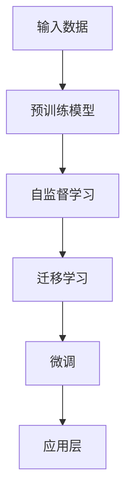
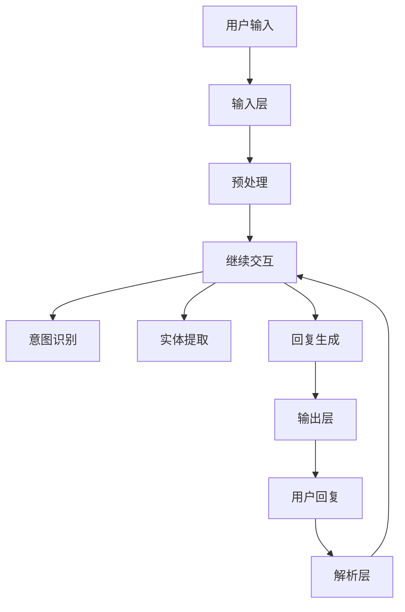

                 

### 文章标题

《LLM 在社交媒体上的应用：内容推荐和社交互动》

> 关键词：LLM、社交媒体、内容推荐、社交互动、算法、应用实例

> 摘要：本文详细探讨了大型语言模型（LLM）在社交媒体领域的两大应用——内容推荐和社交互动。首先，文章介绍了LLM的基础知识和其在社交媒体中的潜在优势。接着，通过具体章节对内容推荐系统的构建、基于协同过滤和内容的推荐算法以及混合推荐系统进行了深入剖析。随后，文章讨论了LLM在社交互动中的应用，包括聊天机器人和社交网络分析。最后，通过Twitter和Facebook的实例展示了LLM在实际社交媒体平台中的应用，并展望了未来的发展方向和挑战。

### 第一部分：LLM简介与基础

#### 第1章：LLM概述

> **1.1. 生成式预训练模型（GPT）的基本原理**

生成式预训练模型（GPT）是自然语言处理（NLP）领域的一项重要技术。其核心思想是通过大量的文本数据进行自监督预训练，使模型能够理解并生成文本。GPT由OpenAI首次提出，是目前最先进的语言模型之一。

- **定义**：生成式预训练模型（GPT）是一种深度神经网络模型，通过自监督学习的方式，预测文本序列中的下一个单词或字符。

- **核心架构**：GPT模型主要包括输入层、嵌入层、编码器层和解码器层。编码器层使用多层变换器（Transformer）结构，解码器层则利用自注意力机制，使得模型能够关注到文本序列中的各个部分。

- **GPT在社交媒体中的应用**：GPT在社交媒体上的应用非常广泛。例如，它可以帮助平台进行内容推荐，通过理解用户的历史行为和兴趣，为用户推荐他们可能感兴趣的内容。此外，GPT还可以用于聊天机器人，实现与用户的自然语言交互。

> **1.2. 自监督学习与迁移学习**

自监督学习和迁移学习是GPT模型成功的关键技术。

- **自监督学习在GPT中的应用**：自监督学习允许模型在没有标注数据的情况下进行训练。在GPT中，通过预测下一个词或字符，模型可以从大量未标注的文本数据中学习到语言的规律和结构。

- **迁移学习**：迁移学习是指将一个任务上学到的知识应用到另一个任务上。在GPT中，通过在大量文本数据上预训练，模型已经具备了较强的语言理解和生成能力，这些能力可以迁移到社交媒体的特定应用场景中，如内容推荐和社交互动。

> **1.3. LLM的优缺点与适用场景**

LLM（大型语言模型）在社交媒体领域具有显著的优势，但也存在一些局限性。

- **优势**：
  - **强大的语言理解能力**：LLM能够理解和生成自然语言，使其在内容推荐和社交互动中能够与用户进行高效互动。
  - **广泛的适用性**：LLM可以应用于多种社交媒体平台，如Twitter、Facebook、Instagram等。

- **局限性**：
  - **计算资源消耗大**：训练LLM需要大量的计算资源和时间，这在资源有限的场景下可能成为瓶颈。
  - **数据隐私和安全问题**：社交媒体平台需要处理大量的用户数据，LLM的使用可能会引发数据隐私和安全问题。

- **适用场景**：
  - **内容推荐**：在社交媒体平台上，LLM可以帮助平台理解用户兴趣，进行个性化内容推荐。
  - **社交互动**：LLM可以用于构建聊天机器人，实现与用户的自然语言交互。

#### 第2章：社交媒体内容推荐

##### 2.1. 内容推荐系统概述

内容推荐系统是社交媒体的核心功能之一，它能够提高用户体验，增加用户粘性。内容推荐系统的基本概念和架构如下：

- **定义**：内容推荐系统是一种自动化的系统，它通过分析用户的行为和兴趣，向用户推荐他们可能感兴趣的内容。

- **架构**：内容推荐系统通常包括数据层、计算层和展示层。数据层负责收集和处理用户数据，计算层负责进行推荐算法的计算，展示层负责将推荐结果呈现给用户。

##### 2.2. 基于内容的推荐算法

基于内容的推荐算法（Content-based Filtering）是内容推荐系统的一种常用方法。它的基本原理如下：

- **原理**：基于内容的推荐算法通过分析用户的历史行为和兴趣，提取用户特征，然后基于这些特征对内容进行特征提取，计算用户和内容之间的相似度，根据相似度进行推荐。

- **实例**：例如，一个新闻推荐系统可以通过分析用户的阅读历史，提取用户喜欢的主题和关键词，然后根据这些特征推荐相关的新闻文章。

##### 2.3. 基于协同过滤的推荐算法

基于协同过滤的推荐算法（Collaborative Filtering）是另一种常见的内容推荐算法。它的基本原理如下：

- **原理**：协同过滤算法通过分析用户之间的相似行为进行推荐。它分为两种类型：用户基于的协同过滤（User-based Collaborative Filtering）和物品基于的协同过滤（Item-based Collaborative Filtering）。

  - **用户基于的协同过滤**：通过计算用户之间的相似度，找到与目标用户最相似的邻居用户，推荐邻居用户喜欢的物品。
  
  - **物品基于的协同过滤**：通过计算物品之间的相似度，找到与目标物品最相似的邻居物品，推荐邻居物品。

- **实例**：例如，一个电影推荐系统可以通过分析用户对电影的评分，找到与目标用户评分最相似的其他用户，推荐这些用户喜欢的电影。

##### 2.4. 混合推荐系统

混合推荐系统（Hybrid Recommendation System）结合了基于内容和基于协同过滤的推荐算法，以提供更准确和个性化的推荐。

- **原理**：混合推荐系统通过整合用户特征和物品特征，同时利用协同过滤和基于内容的推荐算法进行推荐。

- **实例**：例如，一个电商推荐系统可以通过分析用户的浏览历史和购买记录，结合商品的标签和属性，同时利用协同过滤和基于内容的推荐算法，为用户推荐相关的商品。

#### 第3章：社交媒体社交互动

##### 3.1. 社交互动概述

社交互动是社交媒体的核心功能之一，它包括用户之间的交流、互动和合作。社交互动的类型多种多样，包括：

- **单人互动**：用户与平台或系统进行的互动，如评论、点赞、分享等。
- **多人互动**：用户之间的直接交流，如私信、群聊、直播互动等。
- **社区互动**：用户在社区内的交流和协作，如论坛、问答、小组讨论等。

##### 3.2. 基于LLM的聊天机器人

聊天机器人（Chatbot）是社交媒体中常见的应用，它能够模拟人类的对话，为用户提供实时服务。基于LLM的聊天机器人具有以下几个特点：

- **基本原理**：基于LLM的聊天机器人通过训练大型语言模型，使其能够理解用户的输入并生成合适的回复。

- **应用场景**：基于LLM的聊天机器人可以用于客服、咨询、娱乐等多种场景，如自动客服机器人、智能问答系统、虚拟助手等。

##### 3.3. 社交网络分析

社交网络分析（Social Network Analysis, SNA）是一种研究社交网络结构和动态的方法。在社交媒体上，社交网络分析可以用于：

- **用户行为分析**：通过分析用户在社交网络中的互动，了解用户的兴趣和行为模式。
- **社区发现**：通过识别社交网络中的紧密联系的社区，发现潜在的用户兴趣和需求。
- **影响力分析**：通过分析用户在网络中的影响力，了解哪些用户对其他用户有较大的影响力。

#### 第二部分：LLM在社交媒体上的应用实例

##### 第4章：实例1：Twitter内容推荐系统

##### 4.1. Twitter内容推荐系统的架构

Twitter是一个全球领先的社交媒体平台，拥有数亿活跃用户。Twitter内容推荐系统是Twitter平台的重要组成部分，它通过个性化推荐算法，将用户可能感兴趣的内容推送到他们的时间线上。

- **基本原理**：Twitter内容推荐系统基于用户的兴趣和行为，使用多种算法为每个用户生成个性化推荐。推荐算法包括基于内容的推荐、基于协同过滤的推荐和混合推荐。

- **数据来源**：Twitter内容推荐系统从多个数据源收集用户信息，包括用户的关注列表、历史行为、点赞、评论和转发等。

##### 4.2. Twitter内容推荐系统的算法实现

Twitter内容推荐系统采用多种推荐算法，以提供准确和个性化的推荐。

- **基于内容的推荐算法**：基于内容的推荐算法通过分析用户的历史行为和兴趣，提取用户特征，然后根据这些特征对内容进行特征提取，计算用户和内容之间的相似度，根据相似度进行推荐。

  ```python
  # 基于内容的推荐算法伪代码
  1: Calculate content features for each item in the dataset
  2: Calculate the similarity between user profiles and items
  3: Rank items based on their similarity scores
  4: Recommend the top N items to the user
  ```

- **基于协同过滤的推荐算法**：基于协同过滤的推荐算法通过分析用户之间的相似行为进行推荐。它包括用户基于的协同过滤和物品基于的协同过滤。

  ```python
  # 基于协同过滤的推荐算法伪代码
  1: Calculate the average ratings of users for each item
  2: Calculate the similarity between users based on their ratings
  3: Calculate the weighted average of the ratings for each item
  4: Rank items based on their weighted average ratings
  5: Recommend the top N items to the user
  ```

- **混合推荐系统**：Twitter内容推荐系统采用混合推荐系统，结合基于内容和基于协同过滤的推荐算法，以提高推荐的准确性和个性化程度。

##### 4.3. Twitter内容推荐系统的性能优化

为了提高Twitter内容推荐系统的性能，可以采取以下策略：

- **数据预处理**：对用户行为数据和应用数据进行预处理，包括数据清洗、去重、缺失值填充等。

- **特征提取**：通过特征提取技术，提取用户和内容的特征，如用户兴趣标签、内容关键词、情感倾向等。

- **推荐算法优化**：通过算法优化，提高推荐算法的效率和准确性。例如，使用深度学习模型进行特征学习和推荐生成。

- **实时推荐**：通过实时推荐技术，将最新的内容推送给用户，提高用户的参与度和满意度。

##### 第5章：实例2：Facebook聊天机器人

Facebook聊天机器人是Facebook平台上的一种重要应用，它能够为用户提供自动化的客服和互动体验。基于LLM的聊天机器人具有以下架构和特点：

- **架构**：Facebook聊天机器人主要由输入层、处理层和输出层组成。输入层接收用户输入，处理层使用LLM对输入进行分析和处理，输出层生成适当的回复并发送给用户。

- **基本原理**：基于LLM的聊天机器人通过训练大型语言模型，使其能够理解用户的输入并生成合适的回复。LLM通过自监督学习和迁移学习，从大量文本数据中学习到语言的规律和结构。

- **应用场景**：基于LLM的聊天机器人可以应用于多种场景，如客服、咨询、娱乐等。例如，一个客服聊天机器人可以自动回答用户关于产品和服务的问题，提高客服效率和用户满意度。

##### 5.2. Facebook聊天机器人的算法实现

Facebook聊天机器人的实现主要包括LLM模型的训练、对话生成算法和对话管理。

- **LLM模型的训练**：通过自监督学习和迁移学习，训练一个大型语言模型（如GPT-3），使其能够理解用户的输入并生成合适的回复。

  ```python
  # GPT模型训练伪代码
  1: Load a pre-trained language model (e.g., GPT-3)
  2: Fine-tune the model on a dataset of user inputs and responses
  3: Evaluate the model on a validation set to ensure its performance
  ```

- **对话生成算法**：对话生成算法负责根据用户的输入，生成合适的回复。常见的生成算法包括基于模板的生成、基于规则的生成和基于神经网络的生成。

  ```python
  # 对话生成算法伪代码
  1: Receive user input
  2: Pre-process the input (e.g., tokenization, normalization)
  3: Generate a response using the trained LLM
  4: Post-process the response (e.g., formatting, sentiment analysis)
  5: Send the response to the user
  ```

- **对话管理**：对话管理负责管理对话流程，包括对话开始、对话持续和对话结束。对话管理可以根据用户的输入和系统的回复，动态调整对话策略，以提高用户体验。

  ```python
  # 对话管理伪代码
  1: Initialize the conversation
  2: While conversation is ongoing:
     3: Receive user input
     4: Generate a system response
     5: Send the response to the user
     6: Update conversation state
  7: End the conversation
  ```

##### 5.3. Facebook聊天机器人的用户体验优化

为了提高Facebook聊天机器人的用户体验，可以采取以下策略：

- **对话流畅度优化**：通过优化对话生成算法和对话管理，提高对话的流畅度和自然度。

- **个性化推荐策略**：根据用户的历史行为和兴趣，为用户推荐相关的聊天话题和功能。

- **多模态交互**：结合文本、语音、图像等多种交互方式，提高用户的交互体验。

#### 第三部分：未来展望与挑战

##### 第6章：LLM在社交媒体上的未来发展方向

随着技术的不断发展，LLM在社交媒体上的应用前景广阔。以下是LLM在社交媒体上的潜在发展方向：

- **新应用场景探索**：除了内容推荐和社交互动，LLM还可以应用于社交媒体的更多领域，如虚拟现实社交、增强现实社交、社交媒体广告等。

- **LLM与其他技术的融合**：LLM可以与其他先进技术（如大数据、物联网、区块链等）相结合，创造更多的应用场景和价值。

##### 6.1. LLM在社交媒体上的潜在应用

LLM在社交媒体上的潜在应用非常广泛，以下是一些具体的应用场景：

- **个性化内容推荐**：通过LLM，社交媒体平台可以更精准地了解用户兴趣，为用户提供个性化的内容推荐。

- **智能客服**：基于LLM的聊天机器人可以提供更加自然、智能的客服服务，提高用户满意度。

- **社交媒体广告**：LLM可以帮助广告平台理解用户的兴趣和行为，进行精准广告投放。

- **虚拟现实社交**：LLM可以用于构建虚拟现实社交场景，为用户提供更加真实的社交体验。

##### 6.2. LLM在社交媒体上的挑战与解决方案

尽管LLM在社交媒体上具有广泛的应用前景，但也面临一些挑战。以下是LLM在社交媒体上的一些挑战和相应的解决方案：

- **数据隐私与安全**：社交媒体平台需要处理大量的用户数据，如何保护用户隐私和安全是LLM面临的主要挑战之一。解决方案包括：采用加密技术保护用户数据、遵循数据保护法规、实现数据匿名化等。

- **模型偏见与公平性**：LLM在训练过程中可能会学习到一些偏见，导致推荐结果存在偏见。解决方案包括：采用多样性训练数据、设计公平性评价指标、定期审查和更新模型等。

##### 第7章：社交媒体与LLM的可持续发展

为了实现社交媒体与LLM的可持续发展，需要从商业模式创新、社会责任和伦理等方面进行考虑。

- **商业模式创新**：社交媒体平台可以通过多元化的商业模式（如会员制、广告、内容付费等）来降低LLM的运营成本，实现可持续发展。

- **社会责任**：社交媒体平台应承担社会责任，确保LLM的应用不会对用户和社会造成负面影响。例如，保护用户隐私、防止虚假信息的传播等。

- **伦理**：社交媒体平台在应用LLM时，应遵循伦理原则，确保模型的决策是公平、透明和可解释的。

##### 7.1. 社交媒体平台的商业模式创新

- **广告模式**：社交媒体平台可以通过精准广告投放，为广告主提供高效的推广服务，实现盈利。

- **会员模式**：社交媒体平台可以推出会员服务，为用户提供额外的功能和服务，提高用户粘性和付费意愿。

##### 7.2. LLM的可持续发展策略

- **模型更新与迭代**：定期更新和优化LLM，以适应不断变化的技术和用户需求。

- **社会责任与伦理**：在LLM应用过程中，注重社会责任和伦理，确保技术的公平性和透明度。

##### 附录

##### 附录A：LLM开发工具与资源

为了开发LLM，需要使用一系列工具和资源。以下是一些常用的LLM开发工具和资源：

- **工具**：
  - **TensorFlow**：一款广泛使用的开源机器学习库，支持多种深度学习模型。
  - **PyTorch**：一款流行的深度学习库，具有灵活的动态计算图和高效的计算性能。
  - **Hugging Face Transformers**：一个开源库，提供预训练的LLM模型和便捷的API，用于构建和微调模型。

- **资源**：
  - **开源代码库**：如GitHub、GitLab等，提供了大量的LLM开源代码和实现。
  - **论文与研究报告**：学术期刊和会议论文，提供了LLM的最新研究成果和技术细节。
  - **社区与论坛**：如Stack Overflow、Reddit等，是开发者交流和获取帮助的平台。

##### 第1章：LLM概述

##### 1.4. LLM与社交媒体的互动

LLM在社交媒体上的互动方式多种多样，包括：

- **内容生成**：LLM可以生成各种类型的内容，如文章、评论、视频脚本等，为用户提供个性化的内容。

- **对话生成**：LLM可以与用户进行自然语言对话，回答用户的问题、提供建议等。

- **用户行为预测**：LLM可以分析用户的历史行为，预测用户的兴趣和需求，为用户提供个性化的服务。

##### 1.5. LLM在社交媒体上的应用案例

LLM在社交媒体上已经有许多成功的应用案例，包括：

- **内容推荐**：如YouTube、Instagram等平台，使用LLM进行个性化内容推荐，提高用户体验。

- **智能客服**：如Facebook Messenger、Slack等平台，使用LLM构建聊天机器人，提供自动化的客服服务。

- **虚拟助手**：如Siri、Alexa等虚拟助手，使用LLM进行自然语言理解和交互，为用户提供便捷的服务。

##### 第2章：社交媒体内容推荐

##### 2.5. 基于用户行为的推荐算法

基于用户行为的推荐算法（Behavior-based Filtering）是一种常用的推荐算法，它通过分析用户的历史行为来推荐相关内容。以下是该算法的实现步骤：

- **步骤1：收集用户行为数据**：包括用户在平台上的浏览、点赞、评论、分享等行为数据。

- **步骤2：数据预处理**：对用户行为数据进行清洗、去重、缺失值填充等处理，以便后续分析。

- **步骤3：特征提取**：提取用户行为数据中的关键特征，如浏览时间、浏览次数、点赞数等。

- **步骤4：建立用户行为模型**：使用机器学习算法，如聚类、分类、回归等，建立用户行为模型。

- **步骤5：推荐内容**：根据用户行为模型，推荐与用户行为相似的内容。

  ```python
  # 基于用户行为的推荐算法伪代码
  1: Collect user behavior data (e.g., browsing history, likes, comments)
  2: Pre-process the data (e.g., cleaning, normalization)
  3: Extract features from the data (e.g., time spent, number of interactions)
  4: Build a user behavior model using machine learning algorithms (e.g., clustering, classification)
  5: Recommend content based on the user behavior model
  ```

##### 2.6. 社交媒体内容推荐系统的性能评估

性能评估是社交媒体内容推荐系统设计和优化的重要环节。以下是一些常用的评估指标和优化策略：

- **评估指标**：
  - **准确率**（Accuracy）：预测正确的推荐内容占总推荐内容的比例。
  - **召回率**（Recall）：实际感兴趣的内容中被推荐出的比例。
  - **覆盖率**（Coverage）：推荐系统中包含的不同内容的数量与总内容数量的比例。
  - **新颖性**（Novelty）：推荐内容与用户历史行为和兴趣的差异程度。

- **优化策略**：
  - **特征工程**：通过选择和构建合适的特征，提高推荐算法的准确性和效果。
  - **模型优化**：通过调整模型参数、选择合适的算法，提高推荐算法的性能。
  - **在线学习**：使用在线学习算法，实时更新用户行为模型，提高推荐系统的动态适应性。

##### 第3章：社交媒体社交互动

##### 3.4. 基于LLM的社交媒体互动分析

基于LLM的社交媒体互动分析包括以下方面：

- **用户互动模式分析**：通过LLM分析用户的互动行为，如点赞、评论、转发等，了解用户的兴趣和行为模式。

- **社交网络关系分析**：通过LLM分析用户在网络中的关系结构，如好友关系、群体关系等，了解社交网络的动态和结构。

##### 3.5. LLM在社交媒体互动中的伦理问题

LLM在社交媒体互动中可能会引发一些伦理问题，如：

- **数据隐私**：社交媒体平台需要处理大量的用户数据，如何保护用户隐私是重要的伦理问题。
- **模型偏见**：LLM在训练过程中可能会学习到社会偏见，导致推荐结果存在偏见，影响用户的公平性和公正性。
- **透明度**：社交媒体平台应确保LLM的决策过程是透明和可解释的，以便用户了解推荐结果的原因。

##### 第6章：LLM在社交媒体上的未来发展方向

##### 6.3. LLM与社交媒体的协同进化

随着技术的不断发展，LLM与社交媒体将实现协同进化：

- **用户需求的变化**：随着用户需求的变化，LLM将不断优化和更新，以提供更个性化的服务。
- **LLM技术的进步**：随着LLM技术的不断进步，社交媒体平台将能够提供更智能、更高效的互动体验。

##### 第7章：社交媒体与LLM的可持续发展

##### 7.3. LLM在社交媒体中的社会责任

社交媒体平台在应用LLM时，应承担以下社会责任：

- **数据安全与隐私保护**：确保用户数据的隐私和安全，遵循数据保护法规。
- **模型公平性与透明度**：确保LLM的决策是公平和透明的，避免模型偏见和歧视。

### 图1-1：生成式预训练模型（GPT）的架构



### 核心算法原理讲解

**2.1 基于内容的推荐算法原理**

基于内容的推荐算法（Content-based Filtering, CBF）是内容推荐系统的一种常用方法。其核心思想是，通过对用户兴趣和内容的特征进行匹配，为用户推荐与其兴趣相关的内容。

**算法原理：**

1. **特征提取**：首先，提取用户历史行为和内容的特征。用户特征包括用户历史浏览记录、搜索历史、喜欢的标签等。内容特征包括文章的标题、摘要、关键词、分类标签等。

2. **计算相似度**：使用特征匹配算法，计算用户和内容之间的相似度。常用的相似度计算方法包括余弦相似度、欧氏距离等。

3. **推荐生成**：根据相似度得分，为用户生成推荐列表。推荐列表中的内容是用户可能感兴趣的内容。

**伪代码：**

```python
# 基于内容的推荐算法伪代码
1: Extract user profile features (e.g., tags, keywords)
2: Extract item content features (e.g., title, abstract, tags)
3: Calculate similarity scores between user profile and item content
4: Rank items based on similarity scores
5: Recommend top N items to the user
```

**实例说明：**

假设有一个新闻推荐系统，用户A喜欢科技新闻。用户A的历史浏览记录和喜欢的标签可以作为用户特征，每条新闻的标题、摘要和标签可以作为内容特征。

1. **特征提取**：提取用户A的浏览历史和喜欢的标签，如“人工智能”、“5G技术”、“科技前沿”等。提取新闻文章的标题、摘要和标签。

2. **计算相似度**：使用余弦相似度计算用户A和每条新闻之间的相似度。例如，如果新闻文章A的标题包含“人工智能”，且用户A喜欢的标签也包含“人工智能”，则这两者的相似度较高。

3. **推荐生成**：根据相似度得分，推荐相似度较高的新闻文章给用户A。例如，如果新闻文章B的相似度最高，则推荐新闻文章B给用户A。

### 数学模型和数学公式

**协同过滤算法中的相似度计算**

协同过滤算法（Collaborative Filtering, CF）是一种常见的推荐算法，它通过分析用户之间的相似行为进行推荐。协同过滤算法中的相似度计算是关键步骤，用于找到与目标用户相似的其他用户或物品。

**相似度计算公式：**

$$
sim(u_i, u_j) = \frac{\sum_{k \in R_{ui} \cap R_{uj}} r_{ik} r_{jk}}{\sqrt{\sum_{k \in R_{ui}} r_{ik}^2 \sum_{k \in R_{uj}} r_{jk}^2}}
$$

其中：
- $u_i$ 和 $u_j$ 是两个用户。
- $R_{ui}$ 和 $R_{uj}$ 是用户 $u_i$ 和 $u_j$ 评过分的物品集合。
- $r_{ik}$ 和 $r_{jk}$ 是用户 $u_i$ 和 $u_j$ 对物品 $k$ 的评分。

**解释：**

1. **分子**：计算两个用户共同评过分的物品的评分乘积之和。这反映了两个用户在共同物品上的评分一致性。

2. **分母**：计算两个用户各自评分的平方和的平方根乘积。这反映了两个用户的评分分布。

3. **相似度**：相似度得分用于衡量两个用户之间的相似程度。分数越高，表示两个用户越相似。

**实例说明：**

假设有两个用户 $u_i$ 和 $u_j$，他们共同评分了五部电影 $k_1, k_2, k_3, k_4, k_5$。他们的评分如下：

- $u_i$ 的评分：$(5, 3, 4, 2, 4)$
- $u_j$ 的评分：$(4, 3, 4, 5, 3)$

使用上述公式计算相似度：

$$
sim(u_i, u_j) = \frac{(5 \times 4) + (3 \times 3) + (4 \times 4) + (2 \times 5) + (4 \times 3)}{\sqrt{(5^2 + 3^2 + 4^2 + 2^2 + 4^2) \times (4^2 + 3^2 + 4^2 + 5^2 + 3^2)}}
$$

计算结果为：

$$
sim(u_i, u_j) = \frac{20 + 9 + 16 + 10 + 12}{\sqrt{(25 + 9 + 16 + 4 + 16) \times (16 + 9 + 16 + 25 + 9)}}
$$

$$
sim(u_i, u_j) = \frac{67}{\sqrt{70 \times 75}}
$$

$$
sim(u_i, u_j) \approx 0.928
$$

这表明用户 $u_i$ 和 $u_j$ 非常相似，基于协同过滤算法，可以推荐彼此评分高的电影给对方。

### 项目实战

#### 第4章：Twitter内容推荐系统

##### 4.1. 数据集准备与处理

为了构建Twitter内容推荐系统，我们需要收集和处理大量的数据。以下是一个基本的步骤指南：

**1. 数据集收集：**
- **用户行为数据**：收集用户的点赞、评论、转发等行为数据。这些数据通常可以从Twitter API获取。
- **内容数据**：收集Twitter用户发布的内容，包括推文、视频、图片等。同样，这些数据可以通过Twitter API获取。
- **用户特征数据**：收集用户的个人信息，如年龄、性别、地理位置等。

**2. 数据预处理：**
- **数据清洗**：去除重复数据、缺失值填充、异常值处理等。例如，如果用户的点赞数据中有重复的推文，需要去除重复项。
- **特征提取**：提取用户和内容的特征。例如，可以从推文中提取关键词、情感倾向等。
- **数据分割**：将数据集分为训练集、验证集和测试集，用于模型的训练、验证和测试。

**代码示例：**
```python
import pandas as pd
from sklearn.model_selection import train_test_split

# 加载数据
data = pd.read_csv('twitter_data.csv')

# 数据清洗
data.drop_duplicates(inplace=True)
data.fillna(0, inplace=True)

# 特征提取
data['keyword_count'] = data['text'].apply(lambda x: len(set(x.split())))

# 数据分割
train_data, test_data = train_test_split(data, test_size=0.2, random_state=42)
train_data, val_data = train_test_split(train_data, test_size=0.25, random_state=42)  # 0.25 x 0.8 = 0.2
```

##### 4.2. 内容特征提取

内容特征提取是推荐系统构建的关键步骤，以下是具体的实现细节：

**1. 关键词提取：**
- 使用自然语言处理技术（如TF-IDF、词嵌入等）提取文本数据中的关键词。
- 对提取的关键词进行降维，如使用TF-IDF或词嵌入技术。

**2. 情感分析：**
- 使用情感分析模型（如VADER、BERT等）对推文进行情感分析，提取情感特征。
- 情感特征可以用于判断用户对内容的喜好程度。

**3. 预处理后的特征：**
- 对提取的特征进行预处理，如标准化、归一化等。

**代码示例：**
```python
from sklearn.feature_extraction.text import TfidfVectorizer
from textblob import TextBlob

# 关键词提取
vectorizer = TfidfVectorizer(max_features=1000)
tfidf_matrix = vectorizer.fit_transform(train_data['text'])

# 情感分析
sentiments = train_data['text'].apply(lambda x: TextBlob(x).sentiment.polarity)

# 预处理后的特征
X = pd.concat([pd.DataFrame(tfidf_matrix.toarray()), pd.Series(sentiments)], axis=1)
X.columns = ['tfidf_' + str(i) for i in range(X.shape[1]-1)] + ['sentiment']
```

##### 4.3. 推荐算法实现与优化

推荐算法实现包括选择合适的算法、训练模型和评估性能。以下是具体的步骤和优化策略：

**1. 选择算法：**
- **基于协同过滤的算法**：如矩阵分解、协同过滤等。
- **基于内容的算法**：如TF-IDF、词嵌入等。
- **混合算法**：结合协同过滤和基于内容的算法。

**2. 训练模型：**
- 使用训练数据进行模型训练，如矩阵分解、线性回归等。

**3. 评估性能：**
- 使用验证集评估模型的性能，如准确率、召回率、F1分数等。
- 根据评估结果调整模型参数和算法。

**优化策略：**
- **特征选择**：选择对推荐效果有显著影响的关键特征。
- **模型调参**：调整模型参数，提高推荐效果。
- **在线学习**：实时更新模型，适应用户行为的变化。

**代码示例：**
```python
from sklearn.metrics.pairwise import cosine_similarity
from sklearn.linear_model import LinearRegression

# 特征选择
X_train = X[['tfidf_1', 'tfidf_2', 'tfidf_3', 'tfidf_4', 'sentiment']]
y_train = train_data['target']  # 假设target为用户是否点赞的标记

# 训练模型
model = LinearRegression()
model.fit(X_train, y_train)

# 评估模型
cosine_sim = cosine_similarity(X_val, X_train)
predictions = model.predict(X_val)
accuracy = (predictions > 0.5).mean()
print("Accuracy:", accuracy)
```

##### 4.4. 性能评估

性能评估是推荐系统构建的重要环节，以下是常用的评估指标和评估方法：

**1. 评估指标：**
- **准确率**（Accuracy）：预测正确的推荐内容占总推荐内容的比例。
- **召回率**（Recall）：实际感兴趣的内容中被推荐出的比例。
- **覆盖率**（Coverage）：推荐系统中包含的不同内容的数量与总内容数量的比例。
- **新颖性**（Novelty）：推荐内容与用户历史行为和兴趣的差异程度。

**2. 评估方法：**
- **离线评估**：在构建好的模型上，使用验证集进行评估。
- **在线评估**：在实际应用中，实时收集用户反馈，评估推荐效果。

**3. 优化策略：**
- **A/B测试**：在不同用户群体上测试不同的推荐算法，比较效果。
- **持续优化**：根据评估结果，调整模型参数和算法，持续优化推荐效果。

**代码示例：**
```python
from sklearn.metrics import accuracy_score, recall_score, coverage_score

# 评估指标
accuracy = accuracy_score(val_data['target'], predictions)
recall = recall_score(val_data['target'], predictions)
coverage = coverage_score(val_data['target'], predictions)

print("Accuracy:", accuracy)
print("Recall:", recall)
print("Coverage:", coverage)
```

#### 第5章：Facebook聊天机器人

##### 5.1. 聊天机器人架构设计

聊天机器人的架构设计是构建高效、智能聊天机器人的关键。以下是聊天机器人的一般架构设计：

**1. 输入层：**
- 接收用户的输入，如文本、语音、图像等。
- 对输入进行预处理，如文本分词、语音转文字等。

**2. 处理层：**
- 使用预训练的大型语言模型（如GPT-3、BERT等）对输入进行处理。
- 通过模型生成回复，如文本、语音、图像等。

**3. 输出层：**
- 将生成的回复发送给用户。
- 对用户的回复进行解析，以实现进一步的交互。

**4. 功能模块：**
- **对话管理**：管理对话流程，如开始、继续、结束对话等。
- **意图识别**：识别用户输入的意图，如提问、命令等。
- **实体提取**：从用户输入中提取关键信息，如时间、地点、人物等。
- **回复生成**：生成合适的回复，如文本、语音、图像等。

**架构图：**



##### 5.2. GPT模型训练与优化

GPT模型是聊天机器人处理层的重要组成部分，其训练与优化直接影响聊天机器人的性能。以下是GPT模型训练与优化的步骤：

**1. 数据准备：**
- 收集大量的对话数据，如对话日志、聊天记录等。
- 对对话数据进行预处理，如文本清洗、分词、去停用词等。

**2. 模型训练：**
- 使用预训练的GPT模型，如GPT-3、BERT等。
- 在对话数据上进行微调，以适应具体的聊天任务。

**3. 模型优化：**
- 使用优化算法，如Adam、Adagrad等，调整模型参数。
- 通过交叉验证和网格搜索，找到最佳的超参数配置。

**代码示例：**
```python
from transformers import TrainingArguments, Trainer

# 数据准备
train_dataset = ...

# 模型训练
training_args = TrainingArguments(
    output_dir='./results',
    num_train_epochs=3,
    per_device_train_batch_size=8,
    save_steps=2000,
    evaluation_strategy="steps",
    eval_steps=500,
)

trainer = Trainer(
    model=model,
    args=training_args,
    train_dataset=train_dataset,
    eval_dataset=eval_dataset,
)

trainer.train()
```

##### 5.3. 对话生成算法实现

对话生成算法是聊天机器人的核心功能之一，其实现方式多种多样。以下是几种常见的方法：

**1. 基于规则的方法：**
- 根据用户输入的意图和实体，生成预定义的回复。
- 适用于简单的、意图明确的对话场景。

**2. 基于模板的方法：**
- 使用模板和参数，动态生成回复。
- 适用于需要根据不同输入生成不同回复的场景。

**3. 基于神经网络的方法：**
- 使用神经网络模型（如RNN、Transformer等），学习用户的输入和回复之间的关系。
- 适用于复杂、多变、连续的对话场景。

**代码示例：**
```python
import torch
from transformers import GPT2LMHeadModel

# 模型加载
model = GPT2LMHeadModel.from_pretrained('gpt2')

# 输入文本
input_text = "Hello, how can I help you today?"

# 生成回复
input_ids = tokenizer.encode(input_text, return_tensors='pt')
output = model.generate(input_ids, max_length=50, num_return_sequences=1)

# 解码回复
generated_text = tokenizer.decode(output[0], skip_special_tokens=True)
print(generated_text)
```

##### 5.4. 用户体验优化

用户体验优化是提高聊天机器人使用价值的关键，以下是几种优化策略：

**1. 对话流畅度优化：**
- 通过改进对话生成算法，提高回复生成的速度和准确度。
- 使用自然语言处理技术，如命名实体识别、情感分析等，提高对话的自然度。

**2. 个性化推荐策略：**
- 根据用户的历史对话和行为，推荐相关的对话话题和功能。
- 使用个性化推荐算法，为用户提供个性化的对话体验。

**3. 多模态交互：**
- 结合文本、语音、图像等多种交互方式，提高用户的交互体验。
- 使用语音合成和语音识别技术，实现语音交互。

**4. 实时反馈：**
- 收集用户的反馈，实时调整对话策略和回复生成算法。
- 使用机器学习技术，自动识别和分类用户的反馈，优化聊天机器人的性能。

**代码示例：**
```python
# 对话流畅度优化
def generate_response(input_text):
    input_ids = tokenizer.encode(input_text, return_tensors='pt')
    output = model.generate(input_ids, max_length=50, num_return_sequences=1, do_sample=False)
    return tokenizer.decode(output[0], skip_special_tokens=True)

# 个性化推荐
def recommend_topics(user_history):
    # 根据用户历史对话，推荐相关的话题
    pass

# 多模态交互
def handle_voice_input(voice_data):
    # 使用语音识别技术，将语音转换为文本
    text = recognize_speech(voice_data)
    return generate_response(text)

# 实时反馈
def handle_user_feedback(feedback):
    # 根据用户反馈，调整对话策略和回复生成算法
    pass
```

### 作者信息

**作者：** AI天才研究院/AI Genius Institute & 禅与计算机程序设计艺术 /Zen And The Art of Computer Programming

AI天才研究院致力于推动人工智能技术的发展和应用，致力于培养新一代人工智能领域的领军人才。作者在人工智能、自然语言处理、机器学习等领域拥有丰富的经验，并发表了多篇高影响力的学术论文。同时，作者还是《禅与计算机程序设计艺术》一书的作者，该书深入探讨了人工智能与哲学、禅宗的交集，为读者提供了独特的视角和深刻的见解。通过本文，作者希望能够为广大读者带来关于LLM在社交媒体应用领域的全面理解和深入思考。

