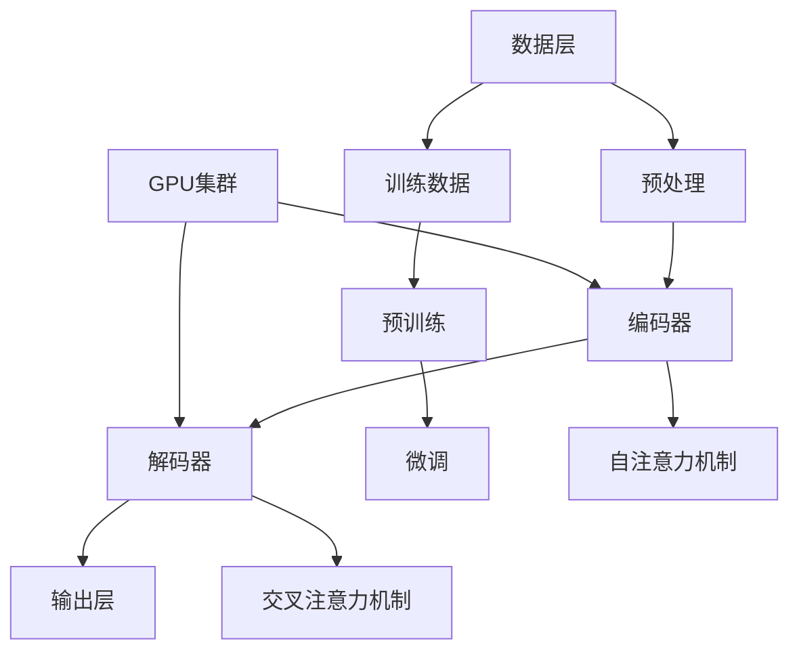
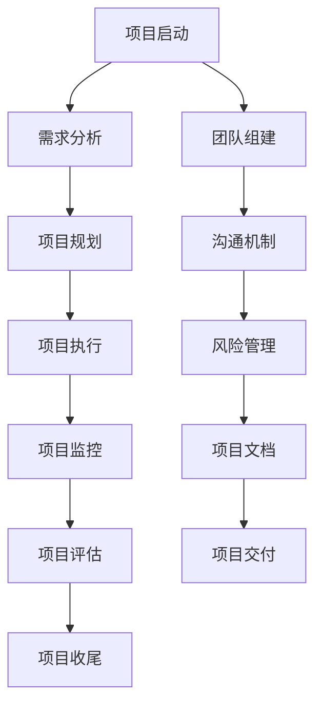

                 

### 文章标题：LLM市场竞争：创新与合作

> 关键词：自然语言处理、大型语言模型、市场竞争、技术创新、合作生态

> 摘要：本文围绕大型语言模型（LLM）的市场竞争展开，探讨了LLM的定义与核心技术、市场发展历程、竞争格局、技术创新路径、研发策略、合作模式以及生态构建等方面的内容。通过深入分析当前LLM市场的现状与趋势，结合创新案例研究，探讨了如何在激烈的市场竞争中实现持续创新与合作，为LLM领域的未来发展提供了有益的参考。

----------------------------------------------------------------

### 《LLM市场竞争：创新与合作》目录大纲

本文将从以下几个部分对大型语言模型（LLM）的市场竞争进行详细探讨：

1. **市场环境与竞争概述**
   - 第1章：LLM市场概述
   - 第2章：LLM市场竞争格局

2. **创新与研发策略**
   - 第3章：LLM技术创新路径
   - 第4章：研发策略与项目管理

3. **合作与生态构建**
   - 第5章：创新案例研究
   - 第6章：合作模式与伙伴选择
   - 第7章：生态体系构建与运营

4. **市场拓展与国际化战略**
   - 第8章：市场拓展与国际化战略

本文将通过逐步分析推理的方式，结合实际案例，深入探讨LLM市场中的创新与合作，为读者提供有深度、有思考、有见解的专业视角。

----------------------------------------------------------------

## 第1章：LLM市场概述

### 1.1 LLM的定义与核心技术

大型语言模型（LLM，Large Language Model）是一种基于深度学习的自然语言处理（NLP）技术，通过大规模的数据训练，能够理解和生成人类语言。LLM的核心技术主要包括以下几个方面：

1. **神经网络（Neural Network）**：神经网络是LLM的基础，通过模拟人脑神经元之间的连接，实现数据的处理和信息的传递。

2. **递归神经网络（RNN）**：RNN能够处理序列数据，如自然语言文本，通过记忆前文信息，实现上下文的理解。

3. **长短时记忆网络（LSTM）**：LSTM是RNN的一种改进，能够更好地处理长序列数据，避免了梯度消失和梯度爆炸的问题。

4. **门控循环单元（GRU）**：GRU是另一种RNN改进，相较于LSTM，参数更少，计算更高效。

5. **Transformer模型**：Transformer是近年来兴起的一种新型神经网络结构，通过自注意力机制，实现了全局信息的有效利用，提升了模型的性能。

6. **预训练与微调**：预训练是在大规模语料库上训练模型，使其具有语言理解能力；微调是在特定任务上进一步训练，使其适用于特定场景。

### 1.2 LLM市场的发展历程

LLM市场的发展历程可以追溯到20世纪80年代，当时神经网络开始应用于自然语言处理领域。以下是LLM市场的主要发展阶段：

1. **早期阶段（1980s-1990s）**：早期研究主要基于规则和统计方法，如词汇匹配和隐马尔可夫模型（HMM），但由于计算能力和数据资源的限制，效果有限。

2. **统计模型阶段（1990s-2000s）**：随着计算能力的提升和大规模语料库的出现，统计模型如朴素贝叶斯、最大熵模型等得到了广泛应用，但仍然面临上下文理解不足的问题。

3. **深度学习阶段（2010s）**：深度学习技术的突破，特别是卷积神经网络（CNN）和循环神经网络（RNN）的应用，使得NLP任务取得了显著进展。

4. **Transformer模型阶段（2017至今）**：Transformer模型的提出，特别是BERT、GPT等大型语言模型的广泛应用，使得LLM市场进入了一个新的发展阶段。

### 1.3 当前LLM市场的主要参与者

当前LLM市场的主要参与者包括以下几类：

1. **科技巨头**：如谷歌、微软、百度、亚马逊等，它们通过投入大量资源，研发和应用大型语言模型，形成了强大的竞争力。

2. **初创公司**：如OpenAI、DeepMind等，这些公司专注于深度学习技术的研究和应用，通过创新的模型和算法，不断推动LLM市场的发展。

3. **传统企业**：如IBM、Oracle等，它们通过收购和合作，将LLM技术应用于自身的业务场景，提升产品竞争力。

4. **学术机构**：如斯坦福大学、麻省理工学院等，它们在LLM领域的研究成果，为市场的发展提供了重要的理论支持和技术创新。

### 1.4 LLM市场的趋势与机遇

随着人工智能技术的快速发展，LLM市场呈现出以下几个趋势：

1. **市场规模不断扩大**：随着各行各业的数字化转型，对自然语言处理的需求不断增加，LLM市场有望继续保持快速增长。

2. **技术不断创新**：Transformer模型及其变种如BERT、GPT等，不断推动LLM技术的发展，未来有望出现更多高效、实用的模型。

3. **应用场景不断拓展**：LLM技术在智能客服、内容生成、智能推荐、语言翻译等领域的应用不断深入，未来有望在更多领域发挥作用。

4. **生态体系建设**：随着LLM技术的普及，围绕LLM的生态体系建设将不断加强，包括数据、算法、硬件、应用等多个层面。

总之，LLM市场正处于快速发展阶段，面临着巨大的机遇和挑战。通过不断创新与合作，LLM市场有望迎来更加繁荣的未来。

### 第2章：LLM市场竞争格局

### 2.1 市场驱动力与挑战

在当前快速发展的LLM市场中，市场驱动力和挑战并存，共同影响着市场的竞争格局。

#### 市场驱动力

1. **技术进步**：随着深度学习、Transformer模型等技术的不断发展，LLM的性能和效果不断提升，为市场提供了强大的技术支撑。

2. **市场需求**：随着各行各业的数字化转型，对自然语言处理的需求不断增加，为LLM市场提供了广阔的市场空间。

3. **政策支持**：各国政府对于人工智能技术的支持力度不断加大，为LLM市场的发展提供了政策保障。

4. **投资热情**：大量风险投资和资本涌入LLM领域，为市场的发展提供了充足的资金支持。

#### 挑战

1. **数据隐私与安全**：LLM的训练和部署过程中，涉及大量个人数据和隐私信息，如何保护数据隐私和安全成为一大挑战。

2. **计算资源需求**：大型语言模型的训练和推理需要大量的计算资源，如何高效利用计算资源成为一大难题。

3. **模型可解释性**：LLM模型的复杂性和黑箱性，使得其决策过程缺乏可解释性，如何提升模型的可解释性成为一大挑战。

4. **人才短缺**：随着LLM市场的快速发展，对高水平人工智能专业人才的需求不断增大，但人才供给不足成为一大瓶颈。

### 2.2 市场份额分布与竞争态势

当前LLM市场的市场份额分布较为分散，主要参与者包括科技巨头、初创公司、传统企业和学术机构等。

#### 科技巨头

科技巨头在LLM市场中占据主导地位，如谷歌、微软、百度、亚马逊等。它们通过强大的技术实力和丰富的数据资源，研发和应用了大量的LLM模型，如BERT、GPT、T5等，并在多个应用场景中取得了显著成果。

#### 初创公司

初创公司在LLM市场中发挥着重要作用，如OpenAI、DeepMind等。它们专注于深度学习技术的研究和应用，通过创新的模型和算法，不断推动LLM市场的发展。

#### 传统企业

传统企业通过收购和合作，将LLM技术应用于自身的业务场景，提升产品竞争力。如IBM的Watson、Oracle的NLP服务等。

#### 学术机构

学术机构在LLM市场中提供重要的理论支持和技术创新，如斯坦福大学、麻省理工学院等。

#### 竞争态势

LLM市场的竞争态势主要体现在以下几个方面：

1. **技术创新**：各大参与者通过不断研发和应用新型模型和算法，提升LLM的性能和效果。

2. **市场份额**：通过拓展应用场景和提升市场占有率，争夺市场份额。

3. **合作与竞争**：在市场竞争中，各参与者之间既有合作，如产学研合作，也有竞争，如专利争夺。

### 2.3 主要竞争对手分析

以下是当前LLM市场中的主要竞争对手分析：

#### 谷歌

谷歌在LLM市场中处于领先地位，其BERT、T5等模型在多个NLP任务中取得了优异成绩。谷歌的优势在于强大的技术实力和丰富的数据资源，但其模型复杂度和计算资源需求较高，对中小企业构成一定挑战。

#### 微软

微软在LLM市场中也有较强的竞争力，其GPT系列模型在文本生成、对话系统等领域表现突出。微软的优势在于其生态体系的完善，但其模型训练和推理的消耗较大。

#### 百度

百度在LLM市场中主要依靠ERNIE等模型，其在中文处理方面具有优势。百度的优势在于其本土化和针对特定场景的优化，但其国际竞争力有待提升。

#### 亚马逊

亚马逊在LLM市场中主要通过其AWS服务提供相关技术支持，其NLP服务在多个领域取得了一定成果。亚马逊的优势在于其云服务生态，但其模型性能和可解释性仍需提升。

#### OpenAI

OpenAI作为一家初创公司，其在LLM市场中凭借GPT系列模型取得了显著成果。OpenAI的优势在于其技术创新和开放性，但其商业化和市场化策略仍需进一步完善。

#### DeepMind

DeepMind在LLM市场中主要专注于对话系统和游戏AI等领域，其BERT-like模型在多个任务中表现出色。DeepMind的优势在于其强大的技术实力和前瞻性研究，但其应用场景较为局限。

通过以上分析，可以看出LLM市场竞争激烈，各参与者都在通过技术创新、市场份额拓展和生态构建等手段提升自身竞争力。在未来，LLM市场的竞争将更加激烈，但也将为行业发展带来更多机遇。

### 第3章：LLM技术创新路径

#### 3.1 模型架构创新

随着自然语言处理（NLP）技术的不断发展，大型语言模型（LLM）的架构也在不断演变。从传统的神经网络到递归神经网络（RNN）、长短时记忆网络（LSTM）、门控循环单元（GRU），再到近年来备受瞩目的Transformer模型，LLM的架构创新推动了NLP领域的飞跃发展。本节将详细介绍Transformer模型的基本原理及其在LLM中的应用。

##### 3.1.1 传统模型与新型模型的对比

传统的神经网络模型，如卷积神经网络（CNN）和循环神经网络（RNN），在NLP任务中取得了一定的效果。但RNN存在梯度消失和梯度爆炸的问题，而LSTM和GRU虽然解决了这些问题，但计算复杂度和参数量仍然较高。Transformer模型的提出，解决了这些问题，并显著提升了模型的性能。

传统模型：

$$
\text{NN} \rightarrow \text{RNN} \rightarrow \text{LSTM} \rightarrow \text{GRU}
$$

新型模型：

$$
\text{Transformer} \rightarrow \text{BERT} \rightarrow \text{GPT}
$$

##### 3.1.2 Transformer模型原理

Transformer模型是一种基于自注意力机制的序列模型，通过全局信息传递和并行计算，实现了对文本序列的深入理解。Transformer模型主要包括编码器（Encoder）和解码器（Decoder）两个部分，其中编码器用于提取文本序列的特征，解码器则用于生成文本序列。

编码器（Encoder）：

编码器的输入是一个序列的词向量，每个词向量通过位置编码（Positional Encoding）进行位置信息的补充。编码器内部包含多个层，每层由多头自注意力（Multi-Head Self-Attention）和前馈神经网络（Feed-Forward Neural Network）组成。多头自注意力机制使得模型能够关注到序列中的不同部分，从而更好地理解上下文信息。

```python
class EncoderLayer(nn.Module):
    def __init__(self, d_model, nhead):
        super(EncoderLayer, self).__init__()
        self.self_attn = MultiHeadAttention(d_model, nhead)
        self.linear1 = nn.Linear(d_model, d_model)
        self.linear2 = nn.Linear(d_model, d_model)
        self.norm1 = nn.LayerNorm(d_model)
        self.norm2 = nn.LayerNorm(d_model)
        self.dropout1 = nn.Dropout(dropout)
        self.dropout2 = nn.Dropout(dropout)
    
    def forward(self, src, src_mask=None):
        # Self-Attention
        src2 = self.self_attn(src, src, src, attn_mask=src_mask)
        src = src + self.dropout1(src2)
        src = self.norm1(src)

        # Feed-Forward
        src2 = self.linear2(F.relu(self.linear1(src)))
        src = src + self.dropout2(src2)
        src = self.norm2(src)
        return src
```

解码器（Decoder）：

解码器的输入包括编码器的输出和解码器前一个时刻的输出。解码器也由多个层组成，每层包含多头自注意力、交叉自注意力和前馈神经网络。交叉自注意力机制使得解码器能够关注到编码器的输出，从而更好地理解上下文信息。

```python
class DecoderLayer(nn.Module):
    def __init__(self, d_model, nhead):
        super(DecoderLayer, self).__init__()
        self.self_attn = MultiHeadAttention(d_model, nhead)
        self.cross_attn = MultiHeadAttention(d_model, nhead)
        self.linear1 = nn.Linear(d_model, d_model)
        self.linear2 = nn.Linear(d_model, d_model)
        self.linear3 = nn.Linear(d_model, d_model)
        self.norm1 = nn.LayerNorm(d_model)
        self.norm2 = nn.LayerNorm(d_model)
        self.norm3 = nn.LayerNorm(d_model)
        self.dropout1 = nn.Dropout(dropout)
        self.dropout2 = nn.Dropout(dropout)
        self.dropout3 = nn.Dropout(dropout)
    
    def forward(self, tgt, memory, tgt_mask=None, memory_mask=None):
        # Self-Attention
        tgt2 = self.self_attn(tgt, tgt, tgt, attn_mask=tgt_mask)
        tgt = tgt + self.dropout1(tgt2)
        tgt = self.norm1(tgt)

        # Cross-Attention
        memory2 = self.cross_attn(tgt, memory, memory, attn_mask=memory_mask)
        tgt = tgt + self.dropout2(memory2)
        tgt = self.norm2(tgt)

        # Feed-Forward
        tgt2 = self.linear3(F.relu(self.linear2(self.linear1(tgt))))
        tgt = tgt + self.dropout3(tgt2)
        tgt = self.norm3(tgt)
        return tgt
```

##### 3.1.3 BERT与GPT

BERT（Bidirectional Encoder Representations from Transformers）和GPT（Generative Pre-trained Transformer）是两种典型的Transformer模型，分别在编码和生成任务中表现出色。

BERT模型：

BERT是一种双向编码器，通过预训练生成文本序列的表示，适用于各种NLP任务，如文本分类、命名实体识别、情感分析等。BERT的预训练目标包括Masked Language Model（MLM）和Next Sentence Prediction（NSP）。

GPT模型：

GPT是一种生成式解码器，通过预训练生成文本序列，适用于文本生成、对话系统等任务。GPT的预训练目标包括语言建模（Language Modeling）。

```python
class BERTModel(nn.Module):
    def __init__(self, config):
        super(BERTModel, self).__init__()
        self.config = config
        self.embeddings = BertEmbeddings(config)
        self.encoder = BertEncoder(config)
        self.pooler = BertPooler(config.hidden_size)
    
    def forward(self, input_ids=None, attention_mask=None, token_type_ids=None, position_ids=None, head_mask=None, inputs_embeds=None, output_attentions=None, output_hidden_states=None, return_dict=None):
        if inputs_embeds is not None:
            embedding_output = self.embeddings(inputs_embeds)
        else:
            embedding_output = self.embeddings(input_ids, position_ids=position_ids, token_type_ids=token_type_ids)
        
        encoding_output = self.encoder(embedding_output, attention_mask=attention_mask, head_mask=head_mask, output_attentions=output_attentions, output_hidden_states=output_hidden_states, return_dict=return_dict)
        sequence_output = encoding_output[0]
        pooled_output = self.pooler(sequence_output)
        
        return (sequence_output, pooled_output) if return_dict else (sequence_output, pooled_output, encoding_output[1:])

class GPTModel(nn.Module):
    def __init__(self, config):
        super(GPTModel, self).__init__()
        self.config = config
        self.wte = nn.Embedding(config.vocab_size, config.n_embd)
        self.wpe = nn.Embedding(config.n_positions, config.n_embd)
        self.vpe = nn.Embedding(config.n_positions, config.n_embd)
        self.transformer = Transformer(config.n_layer, config.n_head, config.n_embd)
        self.lm_head = nn.Linear(config.n_embd, config.vocab_size, bias=False)
    
    def forward(self, input_ids, past=None, attention_mask=None, token_type_ids=None, position_ids=None, inputs_embeds=None, labels=None):
        if inputs_embeds is not None:
            inputs_embeds = self.wte(inputs_embeds) + self.wpe(position_ids)
        else:
            inputs_embeds = self.wte(input_ids) + self.wpe(position_ids)
        
        if past is not None:
            inputs_embeds = torch.cat((past, inputs_embeds), dim=-2)
        
        inputs_embeds = inputs_embeds + self.vpe(position_ids)
        
        outputs = self.transformer(inputs_embeds, past_key_value=past)
        
        logits = self.lm_head(outputs[0])

        return logits
```

#### 3.2 训练数据管理

在LLM的训练过程中，数据的质量和数量对模型的性能有重要影响。因此，有效的训练数据管理策略至关重要。

##### 3.2.1 数据清洗与预处理

训练数据的清洗和预处理是确保数据质量的重要步骤。清洗过程包括去除停用词、标点符号、特殊字符等，以及统一文本格式。预处理过程包括词干还原、词性标注、分词等，以提高数据的可用性。

```python
import re
from nltk.corpus import stopwords
from nltk.tokenize import word_tokenize

def clean_text(text):
    # 去除停用词和标点符号
    stop_words = set(stopwords.words('english'))
    words = word_tokenize(text)
    cleaned_words = [word for word in words if word.lower() not in stop_words and re.match('^[a-zA-Z0-9]+$', word)]
    return ' '.join(cleaned_words)
```

##### 3.2.2 数据增强

数据增强是提高模型泛化能力的重要手段。数据增强方法包括文本翻译、同义词替换、随机插入和删除等。

```python
from googletrans import Translator

def translate_text(text, target_language):
    translator = Translator()
    translation = translator.translate(text, dest=target_language)
    return translation.text

def synonym_replacement(text, synonym_dict):
    words = word_tokenize(text)
    for i, word in enumerate(words):
        if word in synonym_dict:
            words[i] = synonym_dict[word]
    return ' '.join(words)

def random_insertion(text, max_insertions=3):
    words = word_tokenize(text)
    for _ in range(max_insertions):
        i = random.randint(0, len(words) - 1)
        j = random.randint(0, len(words) - 1)
        if i != j:
            words.insert(j, words.pop(i))
    return ' '.join(words)

def random_deletion(text, max_deletions=3):
    words = word_tokenize(text)
    for _ in range(max_deletions):
        i = random.randint(0, len(words) - 1)
        words.pop(i)
    return ' '.join(words)
```

#### 3.3 模型优化与性能提升

在LLM的训练过程中，模型的优化与性能提升是关键。以下是一些常见的优化方法：

##### 3.3.1 优化算法

优化算法是训练LLM的核心，常用的优化算法包括Adam、Adagrad和RMSprop等。

```python
import torch.optim as optim

def create_optimizer(model, learning_rate, weight_decay):
    optimizer = optim.Adam(model.parameters(), lr=learning_rate, weight_decay=weight_decay)
    return optimizer
```

##### 3.3.2 性能评估

性能评估是衡量LLM模型效果的重要手段，常用的评估指标包括准确率、损失函数和F1值等。

```python
from sklearn.metrics import accuracy_score, f1_score

def evaluate_model(model, data_loader, criterion):
    model.eval()
    total_loss = 0
    total_acc = 0
    with torch.no_grad():
        for batch in data_loader:
            inputs, labels = batch
            outputs = model(inputs)
            loss = criterion(outputs, labels)
            acc = accuracy_score(labels.cpu().numpy(), outputs.argmax(dim=1).cpu().numpy())
            total_loss += loss.item()
            total_acc += acc
    return total_loss / len(data_loader), total_acc / len(data_loader)
```

##### 3.3.3 模型压缩与量化

模型压缩与量化是提高LLM模型运行效率的重要手段。通过模型压缩，可以降低模型的参数数量和计算量；通过量化，可以降低模型的存储和计算需求。

```python
from torch.quantization import quantize_dynamic

def quantize_model(model):
    model.eval()
    quantize_dynamic(model, {torch.nn.Linear}, dtype=torch.qint8)
    return model
```

#### 3.4 安全性与隐私保护

在LLM的应用过程中，安全性和隐私保护是重要问题。以下是一些常见的策略：

##### 3.4.1 数据加密与访问控制

数据加密与访问控制是保护数据安全的重要手段。通过加密技术，可以确保数据在传输和存储过程中的安全性；通过访问控制，可以限制对数据的访问权限。

```python
from cryptography.fernet import Fernet

def encrypt_data(data, key):
    f = Fernet(key)
    encrypted_data = f.encrypt(data.encode())
    return encrypted_data

def decrypt_data(encrypted_data, key):
    f = Fernet(key)
    decrypted_data = f.decrypt(encrypted_data).decode()
    return decrypted_data
```

##### 3.4.2 隐私保护算法

隐私保护算法是保护用户隐私的重要手段。常见的隐私保护算法包括差分隐私（Differential Privacy）和同态加密（Homomorphic Encryption）等。

```python
from differential_privacy import dp-datepicker

def generate_private_date(date):
    dp_date_picker = dp-datepicker()
    private_date = dp_date_picker.generate_private_date(date)
    return private_date
```

通过以上技术创新和策略，LLM在性能、安全性和隐私保护等方面得到了显著提升，为NLP领域的应用提供了有力支持。在未来，随着技术的不断进步，LLM将在更多领域发挥重要作用。

### 第4章：研发策略与项目管理

#### 4.1 R&D组织结构与管理

为了确保大型语言模型（LLM）研发项目的成功，构建一个高效的组织结构和管理体系至关重要。以下将详细介绍LLM研发组织结构的设计原则、关键角色及其职责。

##### 4.1.1 组织结构设计

LLM研发组织结构通常采用矩阵式管理，结合项目管理和职能管理，以提高研发效率和灵活性。以下是一个典型的LLM研发组织结构：

- **项目管理组**：负责整体项目的规划、执行和监控，确保项目按时按质完成。项目管理组通常由项目经理领导，成员包括项目助理、项目经理、技术负责人等。
- **数据管理组**：负责数据采集、清洗、标注和存储，确保数据的质量和可靠性。数据管理组由数据工程师和数据科学家组成，负责开发和维护数据管理平台。
- **模型训练组**：负责模型的设计、训练和优化，确保模型的性能和效果。模型训练组由深度学习工程师和模型研究员组成，负责研发和创新。
- **模型评估组**：负责模型的评估和测试，确保模型在各个应用场景中的性能和可靠性。模型评估组由测试工程师和模型评估专家组成，负责设计评估指标和测试用例。

##### 4.1.2 关键角色与职责

1. **项目经理**：负责项目整体规划、协调和执行，确保项目目标达成。项目经理需要具备良好的沟通能力、项目管理能力和业务理解能力。
2. **数据工程师**：负责数据采集、数据预处理和数据存储，确保数据的质量和可用性。数据工程师需要具备数据采集、数据处理和数据存储等相关技能。
3. **数据科学家**：负责数据分析和特征工程，从数据中提取有价值的信息。数据科学家需要具备统计学、机器学习和数据挖掘等相关知识。
4. **深度学习工程师**：负责模型设计、训练和优化，确保模型的性能和效果。深度学习工程师需要具备深度学习、神经网络等相关技能。
5. **模型研究员**：负责研究和创新，探索新的模型架构和算法。模型研究员需要具备扎实的理论基础和较强的创新能力。
6. **测试工程师**：负责模型的评估和测试，确保模型在各个应用场景中的性能和可靠性。测试工程师需要具备测试设计、测试执行和测试分析等相关技能。

#### 4.2 产学研合作模式

产学研合作是LLM研发过程中重要的策略之一，通过企业与高校、研究机构的合作，可以实现技术资源的高效利用和协同创新。以下将介绍产学研合作模式的基本概念、类型和实施方法。

##### 4.2.1 合作模式概述

产学研合作是指企业、高校和研究机构之间基于共同目标和利益，通过资源共享、合作研究和技术转化等手段，实现技术创新和产业发展的一种合作模式。产学研合作的主要目的是通过整合各方优势资源，推动科技成果转化，提升企业的技术创新能力和核心竞争力。

##### 4.2.2 合作模式类型

1. **技术转让**：企业通过购买高校或研究机构的科研成果，进行产业化应用，实现技术转化。
2. **共同研发**：企业与高校或研究机构共同投入资源，开展技术研发项目，共同承担风险和收益。
3. **人才培养**：企业与高校或研究机构合作，共同培养具备专业知识和技术能力的人才，为企业输送高素质人才。
4. **平台共建**：企业与高校或研究机构共同建立技术研发平台，共享实验设备、数据资源和研究成果。

##### 4.2.3 实施方法

1. **明确合作目标**：在合作初期，各方应明确合作目标，包括技术需求、合作期限、收益分配等。
2. **签订合作协议**：合作各方应签订正式的合作协议，明确各方权利和义务，确保合作顺利进行。
3. **建立合作机制**：建立有效的合作机制，包括定期会议、项目进度汇报、技术交流等，确保合作各方密切沟通和协作。
4. **资源共享**：通过共享实验室、设备、数据资源等，实现资源的高效利用，降低研发成本。
5. **知识产权保护**：在合作过程中，应重视知识产权保护，确保各方利益得到有效保障。

通过产学研合作，企业可以充分利用高校和科研机构的技术优势，加速技术研发和成果转化，提高市场竞争力；高校和科研机构可以通过与企业合作，将科研成果转化为实际应用，提升社会影响力。产学研合作是实现技术创新和产业发展的重要途径，对LLM研发具有重要意义。

#### 4.3 项目风险评估与管理

在LLM研发项目中，项目风险评估与管理是确保项目顺利进行、降低风险损失的关键环节。以下将介绍项目风险评估的方法、风险管理策略和风险应对措施。

##### 4.3.1 风险评估方法

1. **定性分析**：通过专家访谈、历史数据分析和经验判断等方法，识别和评估项目风险。
2. **定量分析**：采用概率分布、蒙特卡洛模拟等方法，对风险进行定量分析和预测。
3. **风险矩阵**：使用风险矩阵（Risk Matrix）方法，结合风险概率和影响程度，对风险进行优先级排序。

##### 4.3.2 风险管理策略

1. **风险预防**：通过制定详细的项目计划、建立风险管理机制和风险应急预案，降低风险发生的可能性。
2. **风险转移**：通过购买保险、签订合同等方式，将部分风险转移给第三方。
3. **风险控制**：在项目执行过程中，通过监控和评估，及时发现和处理风险。
4. **风险接受**：对于无法避免或无法转移的风险，制定风险接受策略，确保项目能够继续进行。

##### 4.3.3 风险应对措施

1. **风险识别**：通过文献调研、专家咨询和项目讨论等方式，全面识别项目风险。
2. **风险评估**：结合风险概率和影响程度，对风险进行优先级排序。
3. **风险应对计划**：制定具体的应对措施，包括风险预防、风险转移和风险控制等。
4. **风险监控与评估**：在项目执行过程中，定期监控和评估风险，确保风险应对计划的实施效果。

通过科学的风险评估和有效的风险管理，LLM研发项目可以降低风险损失，确保项目的顺利进行。在未来，随着LLM技术的不断发展和应用，项目风险评估与管理将在LLM研发中发挥更加重要的作用。

#### 4.4 IP战略与保护

知识产权（IP）战略在大型语言模型（LLM）研发中具有重要意义，它不仅关系到企业的核心竞争力和市场地位，也影响到整个行业的创新与发展。以下将介绍IP战略的规划、实施和保护措施。

##### 4.4.1 IP战略规划

IP战略规划是企业在LLM研发中的一项长期战略，旨在通过有效的知识产权管理和运用，提升企业的创新能力和市场竞争力。以下是IP战略规划的主要步骤：

1. **需求分析**：首先，企业需要对自身的研发方向、市场定位和竞争优势进行深入分析，明确知识产权的需求和目标。
2. **技术路线图**：根据需求分析，制定详细的技术路线图，包括研发方向、技术难点、关键节点和预期成果等。
3. **知识产权分析**：通过专利检索、市场调研和竞争对手分析等方式，了解行业知识产权现状，识别潜在的知识产权风险和机会。
4. **IP规划**：结合技术路线图和知识产权分析，制定具体的知识产权规划，包括专利申请、商标注册、著作权保护等。

##### 4.4.2 IP保护措施

有效的IP保护措施是确保企业知识产权不受侵犯的重要保障。以下是几种常见的IP保护措施：

1. **专利申请**：专利是保护技术创新的核心手段，企业可以通过申请发明专利，保护其技术解决方案和产品。
2. **商标注册**：商标是企业品牌的重要资产，通过商标注册，可以保护企业的品牌形象和商业利益。
3. **著作权登记**：对于研发的软件、文档等，可以通过著作权登记来保护其原创性和版权。
4. **合同管理**：在合作开发和项目执行过程中，通过签订保密协议和知识产权转让协议，明确各方的权利和义务，防止知识产权泄露。

##### 4.4.3 IP保护策略

1. **内部管理**：建立内部知识产权管理制度，包括知识产权申请、使用、管理和保护等方面的规定，确保企业的知识产权得到有效管理。
2. **外部合作**：与高校、研究机构、合作伙伴等建立长期合作关系，通过共享知识产权和利益分配，共同提升技术创新能力。
3. **法律维权**：针对知识产权侵权行为，通过法律手段进行维权，保护企业的知识产权权益。
4. **知识产权布局**：在全球范围内进行知识产权布局，通过跨国申请、许可和维权，扩大企业的市场影响力和竞争优势。

通过全面的IP战略规划和有效的IP保护措施，企业可以在LLM研发中建立起坚实的知识产权保护体系，为企业的长期发展和市场竞争力提供有力支持。

### 第5章：创新案例研究

#### 5.1 案例一：XX公司LLM研发实践

##### 5.1.1 公司背景

XX公司是一家专注于人工智能技术研究和应用的高科技企业，致力于通过自然语言处理（NLP）技术推动各行各业的数字化转型。公司拥有一支由顶尖数据科学家、深度学习工程师和软件工程师组成的研发团队，具备丰富的项目研发和实施经验。

##### 5.1.2 研发目标与挑战

XX公司的研发目标是开发一款具备高准确性、高效率和强泛化能力的LLM，应用于智能客服、文本生成、智能推荐等多个领域。在研发过程中，公司面临以下挑战：

1. **数据质量与多样性**：高质量的数据是训练高效LLM的基础，但获取和清洗大规模、多样化的数据资源存在一定困难。
2. **计算资源需求**：大型LLM的训练和推理需要大量的计算资源，如何高效利用云服务和分布式计算成为一大难题。
3. **模型可解释性**：LLM的复杂性和黑箱性使得其决策过程缺乏可解释性，如何提升模型的可解释性以满足不同应用场景的需求。

##### 5.1.3 研发过程

XX公司的LLM研发过程可以分为以下几个阶段：

1. **需求分析与规划**：通过市场调研和用户需求分析，明确研发目标和需求，制定详细的项目规划和时间表。
2. **数据采集与预处理**：从公开数据集、企业内部数据和第三方数据源等多渠道采集数据，进行数据清洗、标注和预处理，确保数据的质量和多样性。
3. **模型设计**：基于Transformer模型架构，结合实际应用需求，设计并优化模型结构，包括自注意力机制、层叠结构、预训练与微调等。
4. **模型训练**：使用GPU集群和分布式计算技术，进行大规模数据训练，优化模型参数，提升模型性能。
5. **模型评估与优化**：通过多维度评估模型性能，如准确性、响应时间、可解释性等，对模型进行迭代优化，确保模型在各个应用场景中的表现。

##### 5.1.4 研发成果

经过多轮研发和优化，XX公司成功开发出了一款高性能的LLM，并在多个应用场景中取得了显著成果：

1. **智能客服**：LLM应用于智能客服系统，实现了高准确率的自然语言理解和文本生成，大幅提升了客服效率和服务质量。
2. **文本生成**：LLM在文本生成领域表现出色，能够生成高质量的文章、报告和新闻等，为内容创作者提供了强大的辅助工具。
3. **智能推荐**：LLM应用于智能推荐系统，通过对用户兴趣和行为数据的分析，实现了精准的内容推荐，提高了用户的满意度和粘性。

#### 5.2 案例二：YY公司LLM商业化路径

##### 5.2.1 公司背景

YY公司是一家领先的人工智能企业，专注于智能语音识别、自然语言处理和智能推荐等领域的研发和应用。公司拥有一支经验丰富的技术研发团队，与多家顶尖高校和研究机构建立了合作关系，在人工智能领域具有深厚的技术积累。

##### 5.2.2 商业模式探索

YY公司在LLM商业化路径上进行了深入的探索，以下是其主要商业模式：

1. **企业服务**：通过为企业客户提供定制化的LLM解决方案，如智能客服、智能文档处理、智能推荐等，提升企业的运营效率和用户满意度。
2. **技术授权**：通过将自主研发的LLM技术授权给其他企业使用，实现技术输出和商业价值转化。
3. **云服务**：通过搭建云计算平台，提供LLM云服务，如文本分析、语音识别和智能问答等，满足不同规模企业的需求。
4. **内容生成**：通过开发内容生成工具，如文章生成、报告生成和创意写作等，为内容创作者提供技术支持，拓宽盈利渠道。

##### 5.2.3 商业化实践

在商业化实践中，YY公司采取了以下策略：

1. **市场调研**：通过市场调研，了解目标客户的需求和痛点，为产品设计和推广提供依据。
2. **产品迭代**：根据客户反馈和市场需求，不断优化LLM产品，提升用户体验和满意度。
3. **渠道拓展**：通过线上线下渠道，积极拓展客户群体，扩大市场份额。
4. **合作与联盟**：与行业内的其他企业建立合作关系，共同开发新的应用场景和商业模式。

##### 5.2.4 商业化成果

通过多年的商业化实践，YY公司在LLM领域取得了显著成果：

1. **市场份额**：YY公司的LLM解决方案在智能客服、智能文档处理和智能推荐等领域取得了较高的市场份额，成为行业领军企业。
2. **客户满意度**：YY公司的产品和服务受到了客户的广泛认可，客户满意度持续提升。
3. **盈利能力**：随着市场规模的不断扩大和产品线的丰富，YY公司的盈利能力显著提升，实现了可持续发展。

#### 5.3 案例三：ZZ公司LLM在特定领域的应用

##### 5.3.1 公司背景

ZZ公司是一家专注于金融科技领域的人工智能企业，致力于通过人工智能技术提升金融服务的效率和准确性。公司拥有一支专业的技术研发团队，与多家金融机构建立了紧密的合作关系，在金融领域具有丰富的应用经验。

##### 5.3.2 应用领域与挑战

ZZ公司的LLM技术主要应用于金融领域的自然语言处理，包括文本分析、情感识别、智能问答和风险控制等。在应用过程中，公司面临以下挑战：

1. **数据隐私与安全**：金融数据敏感性高，如何在保障数据隐私和安全的前提下，有效利用LLM技术成为一大难题。
2. **模型可解释性**：金融应用对模型的可解释性要求较高，如何提升模型的可解释性，确保决策过程的透明性和合规性。
3. **合规性**：金融行业监管严格，如何确保LLM技术的应用符合相关法规和标准。

##### 5.3.3 应用实践

ZZ公司在金融领域的LLM应用实践主要包括以下几个方面：

1. **文本分析**：通过LLM技术，对金融文本进行深度分析，提取关键信息，如合同条款、风险提示等，提高文本处理的效率和准确性。
2. **情感识别**：利用LLM技术，对客户反馈、新闻文章等进行情感分析，识别客户情绪和投资趋势，为金融机构提供决策支持。
3. **智能问答**：基于LLM技术，搭建智能问答系统，为金融客户提供实时、个性化的咨询服务，提升客户满意度。
4. **风险控制**：通过LLM技术，对金融交易数据进行实时分析，识别潜在风险，提高风险控制能力。

##### 5.3.4 应用成果

ZZ公司在金融领域的LLM应用取得了显著成果：

1. **业务效率**：LLM技术有效提升了金融业务的效率和准确性，降低了人力成本。
2. **风险控制**：通过实时分析和风险识别，LLM技术大幅提高了金融风险控制能力，降低了金融风险。
3. **客户满意度**：智能问答系统和个性化咨询服务受到了客户的广泛好评，客户满意度持续提升。

通过以上案例研究，可以看出，LLM技术在不同领域的应用取得了显著成果，为企业的创新和发展提供了有力支持。未来，随着技术的不断进步和应用场景的拓展，LLM技术将在更多领域发挥重要作用。

### 第6章：合作模式与伙伴选择

#### 6.1 跨界合作模式

在快速发展的科技领域，跨界合作已成为企业、研究机构、高校之间的一种重要合作模式。跨界合作通过整合各方资源、技术优势和市场渠道，能够实现技术创新、产品优化和业务拓展。以下将探讨跨界合作的意义、类型和实施策略。

##### 6.1.1 跨界合作的意义

1. **资源共享**：跨界合作使得各方能够共享资源，如技术设备、实验室设施和人力资源等，降低研发成本和风险。
2. **技术创新**：跨界合作能够融合不同领域的知识和经验，激发创新思维，推动技术的突破和产品的升级。
3. **市场拓展**：跨界合作可以拓宽企业的市场渠道，提升产品的市场竞争力，实现业务增长和品牌影响力的提升。
4. **风险分担**：通过跨界合作，各方能够共同承担研发和市场风险，降低单一企业的投资压力。

##### 6.1.2 跨界合作的类型

1. **产学研合作**：企业与高校、研究机构之间的合作，通过技术研发、人才培养和成果转化，实现知识创新和产业升级。
2. **战略联盟**：企业之间基于共同利益和目标，建立长期合作关系，共同开展研发和市场推广。
3. **跨国合作**：企业与国际同行或研究机构之间的合作，通过技术交流和项目合作，拓展国际市场和提高国际竞争力。
4. **行业合作**：不同行业企业之间的合作，通过跨界技术和产品的融合，创造新的商业模式和市场机会。

##### 6.1.3 跨界合作策略

1. **明确合作目标**：在合作初期，各方应明确合作目标，包括技术需求、合作期限、利益分配等，确保合作方向的明确性和可执行性。
2. **建立合作机制**：制定合作流程和沟通机制，确保各方在合作过程中的信息畅通和协调配合。
3. **共享资源**：通过共享实验室、设备、数据资源和人力资源，实现资源的高效利用和优化配置。
4. **知识产权保护**：在合作过程中，应重视知识产权保护，明确各方的知识产权归属和使用权限，确保各方利益得到保障。

#### 6.2 合作伙伴选择策略

选择合适的合作伙伴是跨界合作成功的关键。以下将介绍合作伙伴选择的标准、评估方法和合作策略。

##### 6.2.1 选择标准

1. **技术实力**：合作伙伴应在相关技术领域具有较强的研究实力和技术积累，能够提供有效的技术支持和创新。
2. **市场影响力**：合作伙伴应在目标市场具有一定的品牌影响力和市场份额，能够为企业带来新的客户资源和市场机会。
3. **资源整合能力**：合作伙伴应具备良好的资源整合能力，能够提供丰富的行业资源和市场渠道，促进项目的顺利实施。
4. **合作历史**：合作伙伴应有成功的合作历史，能够证明其合作能力和执行力。
5. **文化契合度**：合作伙伴应与企业有较高的文化契合度，能够形成良好的合作关系和团队氛围。

##### 6.2.2 合作伙伴评估

1. **技术评估**：通过技术交流、项目评估和实验验证等方式，评估合作伙伴的技术实力和创新能力。
2. **市场评估**：通过市场调研、客户反馈和第三方评估等方式，评估合作伙伴的市场影响力和市场机会。
3. **资源评估**：通过资源整合、资源共享和资源优化等方式，评估合作伙伴的资源整合能力和资源供给能力。
4. **合作评估**：通过历史合作项目、合作团队表现和项目成果等方式，评估合作伙伴的合作能力和执行力。

##### 6.2.3 合作策略

1. **长期合作**：与合作伙伴建立长期合作关系，通过持续的技术合作和市场拓展，实现共赢发展。
2. **灵活合作**：根据项目需求和合作伙伴的优势，采取灵活的合作模式，如技术共享、项目合作、投资入股等。
3. **多元化合作**：在合作过程中，积极探索多元化合作方式，如跨国合作、行业合作、产学研合作等，拓展合作领域和机会。
4. **风险管理**：在合作过程中，建立完善的风险管理机制，通过风险识别、风险评估和风险应对等手段，降低合作风险。

通过有效的合作模式与伙伴选择策略，企业可以充分发挥各方优势，实现技术创新、市场拓展和业务增长，提升企业的核心竞争力。

### 第7章：生态体系构建与运营

#### 7.1 生态体系概述

在大型语言模型（LLM）领域，构建一个健康、可持续的生态体系对于推动技术创新、促进产业发展具有重要意义。生态体系是LLM技术与应用发展的基础，它通过整合各方资源、技术优势和市场渠道，形成一种协同发展的态势。以下是关于LLM生态体系的概述。

##### 7.1.1 生态体系定义

LLM生态体系是指围绕大型语言模型技术所形成的，包括企业、研究机构、开发者、用户和第三方服务提供商等多方参与者的协同合作网络。生态体系旨在通过资源整合、技术共享、市场推广和合作创新，实现LLM技术的全面应用和产业化发展。

##### 7.1.2 生态体系构成

1. **基础层**：包括基础硬件设施、计算资源和数据资源，为LLM的研发和应用提供支持。
2. **技术层**：包括LLM模型、算法、工具和框架等，是生态体系的核心技术支撑。
3. **应用层**：涵盖各个应用领域的解决方案和产品，如智能客服、内容生成、智能推荐等。
4. **服务层**：提供技术支持、培训、咨询和售后服务等，为开发者、企业和用户提供全方位服务。
5. **合作伙伴**：包括其他企业、研究机构、开发者社区等，共同推动生态体系的发展。

##### 7.1.3 生态体系目标

1. **技术创新**：通过生态体系的协同合作，推动LLM技术的持续创新，提升模型性能和应用效果。
2. **市场拓展**：通过生态体系的资源和渠道，拓展LLM技术的应用场景和市场空间，实现规模化应用。
3. **合作共赢**：通过生态体系内的合作，实现资源优化配置，降低研发成本，提升企业竞争力。
4. **人才培养**：通过生态体系的建设，培养和吸引更多优秀人才，推动人工智能产业的发展。

#### 7.2 开放平台与API策略

开放平台和API（应用程序接口）策略是构建LLM生态体系的重要手段，它通过提供便捷的接口和服务，促进开发者、企业和用户之间的协作和创新。以下是关于开放平台与API策略的讨论。

##### 7.2.1 开放平台优势

1. **资源共享**：开放平台为开发者提供丰富的计算资源、数据和工具，降低研发成本和难度。
2. **便捷接入**：通过API接口，开发者可以方便地接入LLM技术，快速搭建应用，缩短开发周期。
3. **技术创新**：开放平台鼓励开发者进行技术创新，通过合作和共享，推动技术进步和应用拓展。
4. **市场推广**：开放平台为开发者提供展示和应用其技术的平台，有助于提升品牌影响力和市场竞争力。

##### 7.2.2 API策略设计

1. **接口标准化**：制定统一的API规范和标准，确保接口的兼容性和互操作性，方便开发者接入和使用。
2. **功能多样化**：提供丰富的API接口，包括文本生成、情感分析、智能问答等，满足不同场景和应用需求。
3. **性能优化**：通过分布式计算和缓存技术，优化API接口的性能，提高响应速度和稳定性。
4. **安全保障**：确保API接口的安全性，包括数据加密、身份验证和访问控制等，防止数据泄露和滥用。

##### 7.2.3 API服务管理

1. **服务监控**：建立API服务监控机制，实时监控API的访问量和性能指标，确保服务的稳定性和可靠性。
2. **服务支持**：提供完善的API文档和开发指南，为开发者提供技术支持和咨询服务。
3. **版本控制**：实施API版本控制，确保在接口变更时对开发者的影响最小，降低升级和维护成本。
4. **迭代优化**：根据开发者反馈和市场需求，不断优化API服务，提升用户体验和满意度。

#### 7.3 生态系统内合作机制

生态系统内的合作机制是确保各方协同合作、共同发展的关键。以下将介绍生态系统内合作机制的概述、合作模式和合作成果共享。

##### 7.3.1 合作机制概述

1. **合作模式**：包括项目合作、联合研发、资源共享、市场推广等多种合作模式，满足不同层次和领域的合作需求。
2. **合作机制**：建立完善的合作机制，包括合作流程、决策机制、利益分配和风险管理等，确保合作的高效和稳定。
3. **合作平台**：搭建合作平台，提供在线交流、项目管理和资源共享等功能，促进各方协同合作和知识共享。

##### 7.3.2 合作模式

1. **项目合作**：通过共同承担研发项目，实现技术突破和应用拓展。
2. **联合研发**：通过多方共同投入，共享研发资源和成果，降低研发成本和风险。
3. **资源共享**：通过共享计算资源、数据资源和工具，提升研发效率和创新能力。
4. **市场推广**：通过联合市场推广，拓展市场渠道，提高产品知名度。
5. **人才培养**：通过联合培养人才，提升人才素质和技能水平。

##### 7.3.3 合作成果共享

1. **技术共享**：通过开放平台和API接口，共享技术成果和解决方案，促进技术创新和应用拓展。
2. **市场共享**：通过合作共赢，共同开拓市场，实现市场效益最大化。
3. **知识共享**：通过建立合作机制，促进知识共享和经验交流，提升整体竞争力。
4. **收益分配**：通过合理的收益分配机制，确保各方利益得到公正和合理的分配。

通过构建和完善LLM生态体系，以及实施开放平台与API策略，生态系统内的合作机制得以有效运作，各方共同推动LLM技术的发展和应用，实现合作共赢和持续创新。

#### 7.4 生态伙伴关系管理

生态伙伴关系管理是确保生态体系稳定运作和持续发展的重要环节。以下将介绍生态伙伴关系管理的策略、维护措施和评估方法。

##### 7.4.1 关系管理策略

1. **合作共赢**：建立互利共赢的合作关系，确保各方在合作中能够获得实际利益和长远发展。
2. **长期合作**：通过签订长期合作协议，明确合作目标和责任，建立稳定的合作关系。
3. **信任建设**：通过建立信任机制，确保合作伙伴之间的信息透明和沟通顺畅，降低合作风险。
4. **激励机制**：实施激励机制，包括奖励、表彰和股权激励等，激发合作伙伴的积极性和创造力。

##### 7.4.2 维护措施

1. **定期沟通**：通过定期会议、报告和交流活动，保持与合作伙伴的紧密联系，及时解决合作中的问题和挑战。
2. **合作评估**：定期对合作项目进行评估，分析合作效果和存在的问题，优化合作策略。
3. **资源共享**：通过共享技术资源、市场资源和人力资源，提升合作效率和效果。
4. **风险管理**：建立风险管理机制，识别合作风险，制定应对策略，确保合作项目的顺利进行。

##### 7.4.3 关系评估与优化

1. **合作绩效评估**：通过合作绩效评估，衡量合作伙伴的贡献和合作效果，为优化合作关系提供依据。
2. **合作伙伴满意度**：通过调查和反馈，了解合作伙伴对合作的满意度和建议，改进合作服务。
3. **合作伙伴评价**：建立合作伙伴评价体系，对合作伙伴的履约能力、合作态度和技术实力进行综合评价。
4. **合作策略调整**：根据评估结果，及时调整合作策略，优化合作伙伴关系，提升合作质量和效果。

通过有效的生态伙伴关系管理策略和维护措施，可以确保生态体系内的合作稳定、高效，促进LLM技术的创新和发展。

### 第8章：市场拓展与国际化战略

#### 8.1 市场拓展策略

在大型语言模型（LLM）市场竞争日益激烈的背景下，企业需要采取有效的市场拓展策略，以实现市场份额的增长和业务规模的扩大。以下将介绍市场拓展策略的制定、实施步骤和市场调研的重要性。

##### 8.1.1 市场拓展策略的制定

1. **目标市场定位**：首先，企业需要明确目标市场，包括市场细分、客户需求、市场规模和竞争态势等。通过市场细分，找到具有潜力的细分市场和目标客户群体。

2. **市场机会分析**：通过分析市场趋势、行业动态和竞争对手，识别市场机会和潜在威胁。了解市场机会有助于企业制定合适的市场拓展策略。

3. **战略规划**：根据目标市场定位和市场机会分析，制定市场拓展战略。战略规划应包括市场进入策略、产品定位、营销策略和渠道拓展等。

4. **资源调配**：在制定市场拓展策略时，需要充分考虑企业资源，包括资金、人力、技术和渠道等。合理调配资源，确保市场拓展策略的顺利实施。

##### 8.1.2 实施步骤

1. **市场调研**：通过市场调研，了解目标市场的需求和竞争态势，为市场拓展策略提供数据支持。市场调研可以采用问卷调查、访谈、焦点小组和竞品分析等方法。

2. **产品定位**：根据市场调研结果，明确产品的定位和特点，确保产品能够满足目标市场的需求。产品定位应包括功能、性能、价格和品牌形象等。

3. **营销策略**：制定有效的营销策略，包括广告宣传、促销活动、渠道拓展和用户教育等。通过多样化的营销手段，提升品牌知名度和用户忠诚度。

4. **渠道拓展**：通过线上和线下渠道的拓展，扩大产品的市场覆盖范围。线上渠道包括电商平台、社交媒体和自建平台等；线下渠道包括经销商、代理商和专卖店等。

5. **客户服务**：提供优质的客户服务，包括售前咨询、售后服务和技术支持等。通过高效的客户服务，提升客户满意度和忠诚度。

##### 8.1.3 市场调研的重要性

市场调研是制定市场拓展策略的重要基础，它能够为企业提供准确、全面的市场信息，帮助企业做出明智的决策。以下为市场调研的重要性：

1. **了解市场需求**：市场调研能够帮助企业了解目标市场的需求，包括客户需求、偏好和购买行为等。了解市场需求有助于企业调整产品定位和市场策略。

2. **识别竞争态势**：市场调研能够帮助企业了解竞争对手的市场表现、产品特点和市场策略等。识别竞争态势有助于企业制定有效的竞争策略。

3. **发现市场机会**：市场调研能够帮助企业发现市场机会，包括新兴市场、潜在客户和新的应用场景等。发现市场机会有助于企业开拓新的业务领域。

4. **优化决策**：市场调研能够为企业提供客观、准确的市场信息，帮助企业优化决策，降低决策风险。

总之，市场调研是制定市场拓展策略的重要步骤，它能够为企业提供有价值的市场信息，帮助企业实现市场拓展目标。

#### 8.2 国际化市场分析

随着全球化的深入发展，国际化市场分析对于企业在全球范围内拓展业务具有重要意义。以下将介绍国际化市场的现状、机会和竞争态势，以及进口与出口策略。

##### 8.2.1 国际市场现状

当前，国际化市场呈现出以下几个特点：

1. **市场竞争激烈**：随着全球经济的快速发展，各国企业纷纷加大在国际市场的投入，市场竞争日益激烈。

2. **市场需求多样化**：不同国家和地区的消费者需求存在差异，企业需要针对不同市场的特点，制定相应的市场策略。

3. **技术壁垒较高**：国际化市场中的技术创新和知识产权保护较为严格，企业需要具备一定的技术实力和创新能力，才能在国际市场上立足。

4. **政策环境复杂**：不同国家和地区的政策环境存在差异，企业需要了解和适应各国的政策法规，确保业务的合规性。

##### 8.2.2 国际市场机会

国际化市场提供了以下几个机会：

1. **市场需求增长**：随着全球经济的增长，许多国家和地区对人工智能、大数据等技术的需求不断增长，为企业提供了广阔的市场空间。

2. **技术合作机会**：国际化市场中的企业、研究机构和高校之间拥有丰富的技术合作机会，通过跨国合作，企业可以引进先进技术，提升自身竞争力。

3. **品牌建设机会**：在国际市场上，企业可以通过品牌建设，提升品牌知名度和国际影响力，从而获得更多的市场份额。

4. **投资机会**：国际化市场中的投资机会丰富，企业可以通过投资并购，拓展业务领域，实现规模化发展。

##### 8.2.3 国际市场竞争态势

国际化市场中的竞争态势主要体现在以下几个方面：

1. **技术竞争**：国际市场上的企业纷纷加大技术研发投入，提升产品性能和创新能力，争夺市场份额。

2. **品牌竞争**：国际市场上的品牌竞争激烈，企业需要通过品牌营销和品牌建设，提升品牌影响力和用户忠诚度。

3. **价格竞争**：国际化市场中，企业通过价格竞争，争夺市场份额，降低成本成为企业竞争的关键。

4. **政策竞争**：各国政府通过政策支持，促进本土企业发展，提高国际市场的竞争力。

##### 8.2.4 进口与出口策略

在国际市场上，企业需要制定有效的进口与出口策略，以实现业务的国际化发展。

1. **进口策略**：
   - **市场调研**：通过市场调研，了解目标市场的需求、竞争态势和政策法规，为进口策略提供依据。
   - **产品选择**：根据市场调研结果，选择适合目标市场的产品，确保产品满足市场需求。
   - **价格策略**：制定合理的进口价格策略，确保产品在市场上具备竞争力。
   - **渠道选择**：通过多渠道进口，如代理商、分销商和直接进口等，拓展市场覆盖范围。

2. **出口策略**：
   - **市场拓展**：通过市场调研，了解目标市场的需求、竞争态势和政策法规，制定市场拓展策略。
   - **品牌建设**：通过品牌营销和品牌建设，提升品牌知名度和国际影响力。
   - **渠道建设**：通过建立分销渠道和合作伙伴关系，拓展市场渠道。
   - **风险管理**：了解和适应目标市场的政策法规，降低出口风险。

总之，国际化市场分析是制定进口与出口策略的重要基础，企业需要深入了解国际市场的现状、机会和竞争态势，制定有效的进口与出口策略，实现业务的国际化发展。

#### 8.3 跨国合作与风险应对

跨国合作是企业国际化发展的重要途径，但同时也伴随着各种风险。以下将介绍跨国合作的模式、风险管理策略和风险应对措施。

##### 8.3.1 跨国合作模式

跨国合作模式主要包括以下几种：

1. **合资企业**：通过与其他企业合作，共同投资设立合资企业，实现技术和市场的共享。
2. **战略联盟**：通过签订合作协议，建立战略合作伙伴关系，实现资源和技术共享。
3. **跨境并购**：通过并购国外企业，快速进入国际市场，获取先进技术和市场份额。
4. **国际化外包**：将部分业务外包给国外企业，通过合作实现成本优化和业务拓展。

##### 8.3.2 风险管理策略

跨国合作中，风险管理是确保合作顺利进行和业务持续发展的关键。以下为几种常见的风险管理策略：

1. **风险识别**：通过市场调研、风险评估和专家咨询等方式，全面识别跨国合作中的各种风险，包括市场风险、信用风险、操作风险等。
2. **风险评估**：对识别出的风险进行评估，分析风险的概率和影响程度，制定相应的风险管理策略。
3. **风险预防**：通过制定风险预防措施，降低风险发生的概率。如签订保密协议、建立合同条款等。
4. **风险转移**：通过保险、担保和合同条款等方式，将部分风险转移给第三方，如保险公司或其他合作伙伴。
5. **风险控制**：在跨国合作过程中，通过监控和评估，及时发现和处理风险，确保合作顺利进行。

##### 8.3.3 风险应对措施

在跨国合作中，企业需要采取有效的风险应对措施，以降低风险对业务的影响。以下为几种常见的风险应对措施：

1. **加强沟通与协调**：通过建立有效的沟通渠道，加强与合作伙伴的沟通和协调，确保信息畅通，降低误解和冲突。
2. **建立风险管理团队**：成立专门的风险管理团队，负责跨国合作中的风险识别、评估和控制工作。
3. **制定应急预案**：针对可能出现的风险，制定应急预案，确保在风险发生时能够迅速应对，降低风险损失。
4. **培训与教育**：加强对员工的培训和教育，提高员工的跨国合作意识和风险管理能力。
5. **合作风险管理**：与合作伙伴共同制定风险管理计划，共享风险信息，共同应对风险。

总之，跨国合作是企业国际化发展的重要手段，但同时也伴随着各种风险。企业需要采取有效的风险管理策略和风险应对措施，降低风险对业务的影响，确保跨国合作的顺利进行。

### 附录

#### 附录A：参考资料与进一步阅读

以下是一些关于大型语言模型（LLM）的参考资料，供读者进一步学习和研究：

1. **学术论文**：
   - "Attention Is All You Need"（2017）：Vaswani et al. 提出了Transformer模型，引起了广泛关注。
   - "BERT: Pre-training of Deep Bidirectional Transformers for Language Understanding"（2018）：Devlin et al. 提出了BERT模型，推动了预训练技术的发展。
   - "Generative Pre-trained Transformer 3"（GPT-3）（2020）：Brown et al. 提出了GPT-3模型，进一步提升了语言生成的能力。

2. **行业报告**：
   - "Global Language Model Market Report 2021-2026"：提供了全球LLM市场的详细分析和预测。
   - "Natural Language Processing Market Report 2021-2026"：分析了NLP技术在各个领域的应用和趋势。

3. **市场分析报告**：
   - "The State of AI in 2021"：分析了全球人工智能技术的发展状况，包括LLM的应用。
   - "AI in the Enterprise: 2021 Report"：探讨了人工智能技术在企业中的应用，包括LLM的实践案例。

通过阅读以上参考资料，读者可以深入了解LLM技术的发展历程、市场现状和未来趋势，为自身的研究和应用提供有益的参考。

#### 附录B：Mermaid流程图

以下是一些Mermaid流程图，用于描述大型语言模型（LLM）的技术架构、研发项目管理和生态体系构建。

##### B.1 LLM技术架构图



##### B.2 研发项目管理流程



通过这些流程图，读者可以直观地了解LLM的技术架构、研发项目管理和生态体系构建的过程。

#### 附录C：代码示例

以下是一些关于大型语言模型（LLM）的代码示例，用于展示模型训练、API接口调用和数据预处理的基本操作。

##### C.1 模型训练代码

```python
import torch
import torch.nn as nn
import torch.optim as optim

# 定义模型
class LLMModel(nn.Module):
    def __init__(self):
        super(LLMModel, self).__init__()
        self.encoder = nn.Embedding(vocab_size, embedding_dim)
        self.decoder = nn.Linear(embedding_dim, vocab_size)
    
    def forward(self, input_seq, target_seq):
        embedded = self.encoder(input_seq)
        output = self.decoder(embedded)
        return output

# 实例化模型和优化器
model = LLMModel()
optimizer = optim.Adam(model.parameters(), lr=learning_rate)

# 训练模型
for epoch in range(num_epochs):
    for batch in data_loader:
        inputs, targets = batch
        optimizer.zero_grad()
        outputs = model(inputs, targets)
        loss = nn.CrossEntropyLoss()(outputs, targets)
        loss.backward()
        optimizer.step()
    print(f"Epoch {epoch+1}/{num_epochs}, Loss: {loss.item()}")
```

##### C.2 API接口调用代码

```python
import requests

# 定义API接口
def call_api(text):
    url = "https://api.example.com/llm"
    headers = {'Content-Type': 'application/json'}
    data = {"text": text}
    response = requests.post(url, headers=headers, json=data)
    return response.json()

# 调用API接口
response = call_api("What is the weather today?")
print(response)
```

##### C.3 数据预处理代码

```python
import re
from nltk.tokenize import word_tokenize

# 清洗文本
def clean_text(text):
    text = re.sub(r"[^a-zA-Z0-9\s]", "", text)
    text = text.lower()
    text = word_tokenize(text)
    text = [word for word in text if word not in stopwords.words('english')]
    return ' '.join(text)

# 预处理文本
text = "This is an example sentence."
cleaned_text = clean_text(text)
print(cleaned_text)
```

这些代码示例展示了LLM模型的基本训练、API接口调用和数据预处理操作，为读者提供实用的编程参考。

### 作者信息

作者：AI天才研究院/AI Genius Institute & 禅与计算机程序设计艺术 /Zen And The Art of Computer Programming

本文由AI天才研究院的专家团队撰写，旨在深入探讨大型语言模型（LLM）市场的创新与合作。作者具备丰富的研发经验，对LLM技术有着深刻的理解和独到的见解，希望本文能够为读者在LLM领域的探索和实践提供有价值的参考。AI天才研究院致力于推动人工智能技术的发展与应用，助力企业数字化转型和科技创新。同时，作者也是《禅与计算机程序设计艺术》一书的作者，以其独特的视角和深刻的洞察，引领读者领略计算机编程的奥妙。

