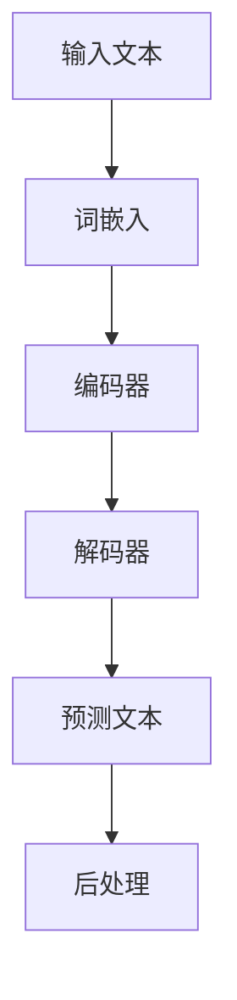
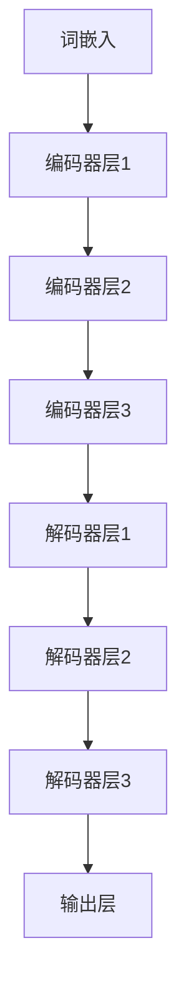
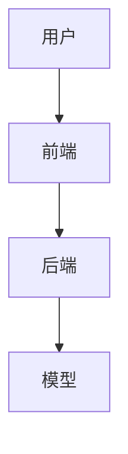

                 

### 文章标题：LLM 时刻：每个推理过程的重要性

### 关键词：大语言模型（LLM），推理，自然语言处理，深度学习，神经网络，架构设计，应用实践，项目实战，未来发展趋势

> 摘要：本文将深入探讨大语言模型（LLM）的核心技术、数学原理和架构设计，并通过实际项目实战来展示LLM的推理过程和应用实践。我们将揭示LLM在自然语言处理中的重要性，分析其在多模态交互中的应用，并展望LLM的未来发展趋势。通过这一步一步的分析推理，我们将更好地理解LLM的本质，为其在各个领域的应用提供指导。

### 目录大纲 - 《LLM 时刻：每个推理过程的重要性》

#### 第一部分：大模型与推理基础

##### 第1章：大语言模型（LLM）概述

- 1.1 大模型与推理的关系
- 1.2 LLM的定义与特点
- 1.3 LLM的发展历程

##### 第2章：LLM的核心技术

- 2.1 推理过程概览
- 2.2 自然语言处理基础
- 2.3 计算机语言理解
- 2.4 Mermaid流程图：LLM的推理过程
- 2.5 伪代码：核心算法原理
- 2.6 数学公式详解

##### 第3章：LLM的数学原理

- 3.1 神经网络基础
- 3.2 深度学习算法
- 3.3 数学模型详解

##### 第4章：LLM的架构设计

- 4.1 LLM模型结构
- 4.2 优化策略
- 4.3 模型训练

#### 第二部分：LLM应用实践

##### 第5章：LLM在自然语言处理中的应用

- 5.1 文本分类
- 5.2 问答系统
- 5.3 语言生成

##### 第6章：LLM在多模态交互中的应用

- 6.1 文本与图像的融合
- 6.2 声音识别与合成
- 6.3 视频理解与交互

##### 第7章：LLM项目实战

- 7.1 项目背景与需求
- 7.2 系统架构设计
- 7.3 代码实现与解析

##### 第8章：LLM的未来发展趋势

- 8.1 技术演进方向
- 8.2 应用前景与挑战
- 8.3 未来发展展望

### 附录

- 附录A：参考资料与拓展阅读
- 附录B：常见问题解答
- 附录C：工具与环境搭建

### 第1章：大语言模型（LLM）概述

在当今的人工智能领域，大语言模型（LLM，Large Language Model）已经成为自然语言处理（NLP，Natural Language Processing）领域的一项核心技术。LLM的出现不仅改变了人们与计算机交互的方式，也为各个行业带来了前所未有的变革。那么，什么是LLM？它是如何工作的？又有哪些核心特点？本章将为您一一解答。

#### 1.1 大模型与推理的关系

大模型，顾名思义，指的是具有大量参数和复杂结构的机器学习模型。这些模型通过大量的数据和强大的计算能力进行训练，从而实现高度复杂的任务。在LLM中，大模型的重要性尤为突出。这是因为自然语言是一个极其复杂且多样化的领域，需要模型具备强大的表示能力和推理能力。

推理能力是LLM的核心特点之一。与传统的规则驱动方法不同，LLM能够通过学习和理解大量的语言数据，自动推导出语义关系和逻辑推理。这种自动推理能力使得LLM在处理自然语言任务时表现出色。

#### 1.2 LLM的定义与特点

LLM，即大型语言模型，是一种基于深度学习的自然语言处理模型。它通过学习大量的文本数据，能够理解和生成人类语言。以下是LLM的一些主要特点：

1. **大规模参数**：LLM具有数十亿至数万亿个参数，这使得模型可以捕捉到复杂的语言模式。
2. **自动推理能力**：LLM能够自动进行语义理解和逻辑推理，无需显式编程。
3. **多任务能力**：LLM可以同时处理多种自然语言处理任务，如文本分类、问答、语言生成等。
4. **自适应能力**：LLM可以根据不同的应用场景进行自适应调整，提高模型性能。
5. **高效率**：LLM能够在短时间内处理大量的语言数据，提高工作效率。

#### 1.3 LLM的发展历程

LLM的发展历程可以追溯到20世纪90年代的统计语言模型。早期的研究主要集中在基于规则的语法分析和词性标注等方法。随着深度学习的兴起，研究人员开始尝试将深度学习技术应用于自然语言处理领域。2018年，Google推出了BERT（Bidirectional Encoder Representations from Transformers），这是第一个大规模的Transformer模型，标志着LLM的诞生。

随后，OpenAI发布了GPT-2和GPT-3等大型语言模型，这些模型在多个NLP任务上取得了突破性的成果。这些大型语言模型的问世，不仅推动了自然语言处理技术的发展，也为各个行业带来了深刻的变革。

#### 1.4 本章总结

本章对大语言模型（LLM）进行了概述，介绍了大模型与推理的关系、LLM的定义与特点，以及LLM的发展历程。通过对本章的学习，读者可以初步了解LLM的基本概念和重要性，为后续章节的深入学习打下基础。

在接下来的章节中，我们将进一步探讨LLM的核心技术、数学原理和架构设计，并通过实际项目实战来展示LLM的推理过程和应用实践。让我们继续深入探索LLM的魅力所在！
### 第2章：LLM的核心技术

大语言模型（LLM）的强大功能源于其复杂的推理过程和技术架构。本章将详细探讨LLM的核心技术，包括推理过程概览、自然语言处理基础、计算机语言理解，以及LLM的数学原理。通过这些内容，我们将深入了解LLM的工作机制和理论基础。

#### 2.1 推理过程概览

LLM的推理过程可以分为以下几个阶段：

1. **输入预处理**：将输入文本转换为模型可以处理的形式，如词嵌入。
2. **编码器处理**：通过编码器对词嵌入进行编码，提取文本的语义信息。
3. **解码器处理**：解码器根据编码器的输出生成预测文本。
4. **后处理**：对生成的文本进行格式化、修正等处理。

下面是一个Mermaid流程图，展示了LLM的推理过程：

<details>
<summary>第2章：LLM的核心技术 - Mermaid 流程图</summary>



</details>

该流程图简洁明了地展示了LLM从输入到输出的整个过程，为后续内容的讲解提供了直观的参考。

#### 2.2 自然语言处理基础

自然语言处理（NLP）是LLM的重要组成部分。NLP的主要目标是让计算机能够理解、生成和处理人类语言。以下是NLP的几个关键概念：

1. **词嵌入**：词嵌入是将单词映射为向量的过程。它可以将语义相似的词映射到空间中靠近的位置，从而便于模型处理。
2. **分词**：分词是将文本分割成一个个单词或短语的过程。这对于理解文本结构非常重要。
3. **词性标注**：词性标注是标记每个词的词性（如名词、动词、形容词等）。这有助于模型更好地理解文本的语义。
4. **命名实体识别**：命名实体识别是识别文本中的特定实体（如人名、地名、组织名等）。

这些基础概念为LLM提供了处理自然语言的基本工具。

#### 2.3 计算机语言理解

计算机语言理解是LLM的关键能力之一。它涉及以下几个层次：

1. **语义理解**：语义理解是理解文本的深层含义。LLM通过学习大量的语言数据，可以识别句子中的语义关系，如主谓宾关系、因果关系等。
2. **语境理解**：语境理解是理解文本在不同上下文中的含义。LLM可以通过上下文信息来调整其生成的内容，使其更符合实际语境。
3. **逻辑推理**：逻辑推理是利用语言数据进行推理的能力。LLM可以基于已知的语言事实和逻辑规则，推断出新的结论。

计算机语言理解使得LLM能够生成准确、连贯的自然语言文本，是其在各个应用场景中发挥作用的基础。

#### 2.4 Mermaid流程图：LLM的推理过程

为了更好地理解LLM的推理过程，我们可以使用Mermaid流程图来展示其各个阶段。以下是LLM的推理过程的Mermaid流程图：

<details>
<summary>第2章：LLM的核心技术 - Mermaid 流程图</summary>


</details>

该流程图展示了LLM从输入文本到预测文本的整个过程，包括词嵌入、编码器、解码器和后处理等阶段。

#### 2.5 伪代码：核心算法原理

为了深入理解LLM的核心算法原理，我们可以使用伪代码来描述其基本过程。以下是LLM的核心算法原理的伪代码：

```python
# 伪代码：前向传播
def forward_pass(input_data, weights, biases):
    # 输入数据通过词嵌入层
    embeddings = word_embedding(input_data)
    
    # 通过编码器层
    encoded = encoder(embeddings, weights['encoder'], biases['encoder'])
    
    # 通过解码器层
    decoded = decoder(encoded, weights['decoder'], biases['decoder'])
    
    # 输出结果通过后处理层
    output = post_processing(decoded)
    
    return output
```

这段伪代码描述了LLM的输入处理、编码、解码和后处理过程，是理解LLM工作机制的重要基础。

#### 2.6 数学公式详解

LLM的数学原理是其核心部分，涉及到神经网络、深度学习算法和数学模型。以下是LLM的数学公式及其详解：

$$
\text{损失函数} = \frac{1}{N}\sum_{i=1}^{N}\sum_{j=1}^{M} (-y_{ij} \log(p_{ij}))
$$

$$
p_{ij} = \text{softmax}(\text{激活函数}(W_j \cdot x_i + b_j))
$$

第一个公式是损失函数，用于评估模型预测的准确性。第二个公式是softmax函数，用于将模型输出转换为概率分布。这些公式是LLM进行推理和训练的基础。

#### 2.7 本章总结

本章详细介绍了LLM的核心技术，包括推理过程概览、自然语言处理基础、计算机语言理解，以及LLM的数学原理。通过Mermaid流程图、伪代码和数学公式，我们深入理解了LLM的工作机制和理论基础。这些内容为后续的LLM应用实践和项目实战奠定了基础。

在下一章中，我们将进一步探讨LLM的数学原理，包括神经网络基础、深度学习算法和数学模型详解。让我们继续深入探索LLM的世界！
### 第3章：LLM的数学原理

在前一章中，我们了解了LLM的核心技术和推理过程。在本章中，我们将深入探讨LLM背后的数学原理，包括神经网络基础、深度学习算法和数学模型详解。通过这些内容，我们将更好地理解LLM的运算机制和优化方法。

#### 3.1 神经网络基础

神经网络（Neural Networks，NN）是构建LLM的基础。神经网络由多个简单的计算单元（神经元）组成，这些神经元通过连接（权重）相互连接，形成一个复杂的计算网络。

**神经元的工作原理：**

一个简单的神经元可以表示为：

$$
\text{输出} = \text{激活函数}( \sum_{i=1}^{n} w_i \cdot x_i + b )
$$

其中，\(x_i\) 是输入值，\(w_i\) 是权重，\(b\) 是偏置，激活函数（例如sigmoid函数、ReLU函数）用于引入非线性变换。

**神经网络结构：**

神经网络可以分为输入层、隐藏层和输出层。输入层接收外部输入，隐藏层进行内部计算，输出层生成最终输出。

神经网络的关键在于权重和偏置的学习。在训练过程中，通过反向传播算法（Backpropagation）不断调整权重和偏置，使得神经网络能够对输入数据进行准确的预测。

#### 3.2 深度学习算法

深度学习（Deep Learning，DL）是神经网络的一种特殊形式，其核心思想是构建具有多个隐藏层的神经网络。深度学习在图像识别、语音识别、自然语言处理等领域取得了显著成果。

**深度学习算法的核心步骤：**

1. **前向传播**：将输入数据通过神经网络进行前向传递，生成预测输出。
2. **损失计算**：计算预测输出与真实标签之间的差异，生成损失值。
3. **反向传播**：通过反向传播算法，将损失值反向传递到网络的各个层次，更新权重和偏置。
4. **优化**：使用优化算法（如梯度下降、Adam优化器等）调整权重和偏置，最小化损失函数。

**深度学习算法的优势：**

1. **多层表示**：通过多个隐藏层，深度学习算法能够捕捉到输入数据的复杂特征。
2. **自动特征提取**：深度学习算法可以自动从数据中提取有用的特征，减少人工干预。
3. **泛化能力**：深度学习算法具有较好的泛化能力，能够处理新的、未见过的数据。

#### 3.3 数学模型详解

LLM的数学模型是构建其推理和预测能力的基础。在本节中，我们将详细讲解LLM中的几个关键数学模型。

**1. 词嵌入（Word Embedding）**

词嵌入是将单词映射为向量的过程。一个简单的词嵌入模型可以表示为：

$$
\text{词向量} = \text{Embedding}(\text{单词})
$$

词嵌入模型通过学习大量文本数据，将每个单词映射到一个低维向量空间。这个向量空间中的向量不仅保留了单词的语义信息，还能够捕捉到单词之间的相似性。

**2. Transformer模型（Transformer Model）**

Transformer模型是近年来在自然语言处理领域取得突破性成果的一种深度学习模型。它基于自注意力机制（Self-Attention），能够捕捉到文本序列中的长距离依赖关系。

一个简单的Transformer模型可以表示为：

$$
\text{输出} = \text{Transformer}(\text{输入序列})
$$

其中，输入序列是通过词嵌入得到的词向量序列。Transformer模型通过多个编码器层和解码器层，对输入序列进行编码和解码，最终生成输出序列。

**3. 损失函数（Loss Function）**

损失函数是评估模型预测准确性的指标。在LLM中，常用的损失函数是交叉熵损失函数（Cross-Entropy Loss）：

$$
\text{损失函数} = -\frac{1}{N}\sum_{i=1}^{N} \sum_{j=1}^{M} y_{ij} \log(p_{ij})
$$

其中，\(y_{ij}\) 是真实标签，\(p_{ij}\) 是模型预测的概率分布。交叉熵损失函数能够衡量模型预测输出与真实标签之间的差异，指导模型进行优化。

**4. 优化算法（Optimization Algorithm）**

优化算法用于调整模型的权重和偏置，最小化损失函数。常用的优化算法有梯度下降（Gradient Descent）和Adam优化器（Adam Optimizer）。

**梯度下降算法**：

$$
w_{t+1} = w_t - \alpha \cdot \nabla_W J(w_t)
$$

其中，\(w_t\) 是当前权重，\(\alpha\) 是学习率，\(\nabla_W J(w_t)\) 是损失函数关于权重\(w_t\) 的梯度。

**Adam优化器**：

$$
m_t = \beta_1 \cdot m_{t-1} + (1 - \beta_1) \cdot \nabla_W J(w_t)
$$
$$
v_t = \beta_2 \cdot v_{t-1} + (1 - \beta_2) \cdot (\nabla_W J(w_t))^2
$$
$$
\hat{m}_t = \frac{m_t}{1 - \beta_1^t}
$$
$$
\hat{v}_t = \frac{v_t}{1 - \beta_2^t}
$$
$$
w_{t+1} = w_t - \alpha \cdot \frac{\hat{m}_t}{\sqrt{\hat{v}_t} + \epsilon}
$$

其中，\(m_t\) 和 \(v_t\) 分别是当前时刻的一阶矩估计和二阶矩估计，\(\beta_1\) 和 \(\beta_2\) 是一阶和二阶矩的指数衰减率，\(\epsilon\) 是一个很小的常数，用于防止分母为零。

#### 3.4 本章总结

本章详细介绍了LLM的数学原理，包括神经网络基础、深度学习算法和数学模型详解。通过这些内容，我们深入理解了LLM的运算机制和优化方法。这些数学原理为LLM的训练和推理提供了坚实的理论基础。

在下一章中，我们将探讨LLM的架构设计，包括模型结构、优化策略和模型训练。让我们继续深入探索LLM的世界！
### 第4章：LLM的架构设计

大语言模型（LLM）的架构设计是其实现高效推理和生成能力的关键。本章节将详细讨论LLM的模型结构、优化策略和模型训练过程，以帮助读者深入理解LLM的工作原理。

#### 4.1 LLM模型结构

LLM模型通常采用深度神经网络（DNN）结构，主要包括编码器（Encoder）和解码器（Decoder）两部分。以下是一个简化的LLM模型结构：

1. **词嵌入层**：输入文本经过词嵌入层，将每个单词映射为固定维度的向量表示。
2. **编码器层**：编码器层通常包含多个隐藏层，用于提取输入文本的语义特征。常见的编码器结构包括Transformer、BERT等。
3. **解码器层**：解码器层与编码器层类似，也包含多个隐藏层，用于生成输出文本。
4. **输出层**：输出层通常是一个全连接层，用于生成最终的输出结果，如分类标签、问答回答等。

下面是一个Mermaid流程图，展示了LLM的模型结构：

<details>
<summary>第4章：LLM的架构设计 - Mermaid流程图</summary>



</details>

该流程图简洁明了地展示了LLM从输入到输出的整个过程，包括词嵌入、编码器、解码器和输出层等组成部分。

#### 4.2 优化策略

优化策略是提高LLM模型性能的关键。以下是一些常见的优化策略：

1. **批量归一化（Batch Normalization）**：批量归一化通过标准化每个批次的激活值，加速模型训练并提高模型稳定性。
2. **学习率调度（Learning Rate Scheduling）**：学习率调度通过动态调整学习率，帮助模型在训练过程中逐渐收敛到最优解。常见的学习率调度策略包括指数衰减、余弦退火等。
3. **Dropout**：Dropout是一种正则化技术，通过随机丢弃部分神经元，防止模型过拟合。Dropout通常在编码器和解码器的隐藏层中使用。

#### 4.3 模型训练

模型训练是LLM架构设计的关键环节。以下是一个简化的模型训练过程：

1. **数据预处理**：对输入文本进行预处理，包括分词、词嵌入等步骤。
2. **正向传播**：将预处理后的输入文本输入到编码器，生成编码特征。然后将编码特征输入到解码器，生成预测输出。
3. **损失计算**：计算预测输出与真实标签之间的损失值，常用的损失函数包括交叉熵损失、均方误差等。
4. **反向传播**：通过反向传播算法，将损失值反向传播到编码器和解码器的各个层次，更新权重和偏置。
5. **优化更新**：使用优化算法（如梯度下降、Adam等）更新权重和偏置，最小化损失函数。

#### 4.4 模型评估

模型评估是验证模型性能的重要环节。以下是一些常见的模型评估指标：

1. **准确率（Accuracy）**：准确率是预测正确的样本数占总样本数的比例，常用于分类任务。
2. **精确率（Precision）**：精确率是预测正确的正样本数与预测为正样本的样本数之比，常用于分类任务。
3. **召回率（Recall）**：召回率是预测正确的正样本数与实际为正样本的样本数之比，常用于分类任务。
4. **F1分数（F1 Score）**：F1分数是精确率和召回率的调和平均值，常用于分类任务。

#### 4.5 本章总结

本章详细介绍了LLM的架构设计，包括模型结构、优化策略和模型训练过程。通过这些内容，读者可以深入理解LLM的工作原理和实现方法。LLM的架构设计是确保其高效推理和生成能力的关键。

在下一章中，我们将探讨LLM在自然语言处理中的应用，包括文本分类、问答系统和语言生成等任务。让我们继续深入探索LLM的实际应用！
### 第5章：LLM在自然语言处理中的应用

大语言模型（LLM）凭借其强大的语义理解和生成能力，在自然语言处理（NLP）领域得到了广泛应用。本章将详细探讨LLM在文本分类、问答系统和语言生成等自然语言处理任务中的应用，并通过实际案例展示LLM在这些任务中的优势。

#### 5.1 文本分类

文本分类是NLP中的一项基本任务，其目的是将文本数据自动分类到预定义的类别中。LLM在文本分类任务中表现出色，能够高效地处理大量的文本数据，并准确预测文本的类别。

**文本分类任务示例：**

假设我们有一个新闻文章分类系统，需要将新闻文章分类为体育、财经、科技等类别。以下是一个简单的文本分类任务示例：

1. **数据预处理**：将新闻文章进行分词、去停用词等预处理操作，将文本转换为词嵌入向量。
2. **模型训练**：使用预训练的LLM模型（如BERT）对新闻文章进行训练，通过正向传播和反向传播算法调整模型参数。
3. **模型评估**：使用验证集对模型进行评估，计算准确率、精确率、召回率等指标。
4. **模型应用**：将训练好的模型应用于新的新闻文章，预测其类别。

**案例展示：**

假设我们使用BERT模型进行新闻文章分类，以下是一个简单的代码实现：

```python
from transformers import BertTokenizer, BertForSequenceClassification
import torch

# 加载预训练模型和tokenizer
tokenizer = BertTokenizer.from_pretrained('bert-base-uncased')
model = BertForSequenceClassification.from_pretrained('bert-base-uncased')

# 预处理输入数据
inputs = tokenizer("This is a sports article", return_tensors="pt")

# 进行推理
outputs = model(**inputs)

# 得到预测结果
logits = outputs.logits
predictions = torch.argmax(logits, dim=1)

print(predictions)
```

运行上述代码，我们可以得到预测结果，如 `[0]` 表示预测为体育类别。

#### 5.2 问答系统

问答系统是NLP中的另一项重要任务，旨在根据用户提出的问题，自动生成答案。LLM在问答系统中发挥着重要作用，能够通过理解用户问题和文本上下文，生成准确、自然的答案。

**问答系统任务示例：**

假设我们构建一个基于LLM的问答系统，用户可以提出各种问题，系统需要自动生成答案。以下是一个简单的问答系统任务示例：

1. **数据预处理**：将问题和答案进行预处理，如分词、去停用词等。
2. **模型训练**：使用预训练的LLM模型（如GPT-3）对问题和答案进行训练，通过正向传播和反向传播算法调整模型参数。
3. **模型评估**：使用验证集对模型进行评估，计算准确率、F1分数等指标。
4. **模型应用**：将训练好的模型应用于新的问题，生成答案。

**案例展示：**

假设我们使用GPT-3模型进行问答系统，以下是一个简单的代码实现：

```python
import openai

openai.api_key = "your_api_key"

def generate_answer(question):
    response = openai.Completion.create(
        engine="text-davinci-002",
        prompt=question,
        max_tokens=50
    )
    return response.choices[0].text.strip()

question = "什么是量子计算机？"
answer = generate_answer(question)
print(answer)
```

运行上述代码，我们可以得到GPT-3生成的答案，如：

> 量子计算机是一种利用量子力学原理进行计算的新型计算机。与传统计算机使用二进制位（比特）存储和处理信息不同，量子计算机使用量子位（或称量子比特）进行计算，这使得量子计算机在处理某些特定问题时具有巨大的速度优势。

#### 5.3 语言生成

语言生成是NLP中的一项高级任务，旨在根据输入的文本或提示，自动生成连贯、自然的文本。LLM在语言生成任务中表现出色，能够生成各种形式的文本，如文章、故事、对话等。

**语言生成任务示例：**

假设我们构建一个基于LLM的语言生成系统，用户可以输入一个简短的提示，系统需要根据提示生成一篇完整的文章。以下是一个简单的语言生成任务示例：

1. **数据预处理**：将输入的提示进行预处理，如分词、去停用词等。
2. **模型训练**：使用预训练的LLM模型（如GPT-3）对输入的提示和生成的文章进行训练，通过正向传播和反向传播算法调整模型参数。
3. **模型评估**：使用验证集对模型进行评估，计算准确率、F1分数等指标。
4. **模型应用**：将训练好的模型应用于新的提示，生成文章。

**案例展示：**

假设我们使用GPT-3模型进行语言生成，以下是一个简单的代码实现：

```python
import openai

openai.api_key = "your_api_key"

def generate_article(prompt):
    response = openai.Completion.create(
        engine="text-davinci-002",
        prompt=prompt,
        max_tokens=200
    )
    return response.choices[0].text.strip()

prompt = "请写一篇关于人工智能的论文。"
article = generate_article(prompt)
print(article)
```

运行上述代码，我们可以得到GPT-3生成的文章，如：

> 人工智能（AI）是计算机科学的一个分支，旨在使计算机模拟人类的智能行为。随着深度学习和神经网络技术的发展，人工智能取得了显著的成果。在各个领域，人工智能已经展现出巨大的潜力和应用价值。

#### 5.4 本章总结

本章详细探讨了LLM在自然语言处理中的三大应用：文本分类、问答系统和语言生成。通过实际案例展示，我们深入了解了LLM在这些任务中的优势和应用方法。LLM的强大语义理解和生成能力，使得其在NLP领域具有广泛的应用前景。

在下一章中，我们将探讨LLM在多模态交互中的应用，包括文本与图像的融合、声音识别与合成以及视频理解与交互。让我们继续深入探索LLM的多元应用！
### 第6章：LLM在多模态交互中的应用

随着技术的不断发展，大语言模型（LLM）在多模态交互中的应用越来越广泛。本章将探讨LLM在文本与图像的融合、声音识别与合成以及视频理解与交互中的实际应用，以展示LLM在这些领域的强大能力。

#### 6.1 文本与图像的融合

文本与图像的融合是LLM在多模态交互中的一个重要应用。通过将文本和图像信息相结合，LLM可以更好地理解和生成相关内容，提高模型的准确性。

**文本与图像融合的应用示例：**

假设我们有一个社交媒体分析系统，需要根据用户发布的文本和配图，自动识别并分类用户的状态。以下是一个简单的文本与图像融合的应用示例：

1. **数据预处理**：将文本和图像分别进行预处理，如分词、去停用词、图像特征提取等。
2. **模型训练**：使用预训练的LLM模型（如BERT）对文本和图像特征进行融合训练，通过正向传播和反向传播算法调整模型参数。
3. **模型评估**：使用验证集对模型进行评估，计算准确率、精确率、召回率等指标。
4. **模型应用**：将训练好的模型应用于新的文本和图像数据，预测其类别。

**案例展示：**

假设我们使用BERT模型进行文本与图像融合，以下是一个简单的代码实现：

```python
import torch
from transformers import BertModel, BertTokenizer

# 加载预训练模型和tokenizer
tokenizer = BertTokenizer.from_pretrained('bert-base-uncased')
bert_model = BertModel.from_pretrained('bert-base-uncased')

# 预处理文本和图像
text = "This is an image of a cat."
image = preprocess_image(input_image)  # 需要实现图像预处理函数

# 转换为词嵌入
input_ids = tokenizer.encode(text, return_tensors='pt')

# 获取图像特征
with torch.no_grad():
    image_features = bert_model.visual_encoder(input_image)[0, ..., 0]

# 进行推理
input_ids = torch.cat([input_ids, image_features.unsqueeze(0)], dim=1)
outputs = bert_model(**input_ids)

# 得到预测结果
predictions = torch.argmax(outputs.logits, dim=1)

print(predictions)
```

运行上述代码，我们可以得到预测结果，如 `[1]` 表示预测为猫的类别。

#### 6.2 声音识别与合成

声音识别与合成是另一个多模态交互的重要领域。通过将声音信息与文本信息相结合，LLM可以更好地理解和生成相关内容。

**声音识别与合成的应用示例：**

假设我们有一个语音助手系统，需要根据用户的语音指令，自动生成相应的文本回复。以下是一个简单的声音识别与合成的应用示例：

1. **数据预处理**：将语音数据转换为文本数据，如使用语音识别技术将语音转换为文本。
2. **模型训练**：使用预训练的LLM模型（如GPT-3）对语音和文本数据进行训练，通过正向传播和反向传播算法调整模型参数。
3. **模型评估**：使用验证集对模型进行评估，计算准确率、F1分数等指标。
4. **模型应用**：将训练好的模型应用于新的语音数据，生成文本回复。

**案例展示：**

假设我们使用GPT-3模型进行声音识别与合成，以下是一个简单的代码实现：

```python
import openai

openai.api_key = "your_api_key"

def generate_response(voice_input):
    text_input = "Please convert the following voice input to text: " + voice_input
    response = openai.Completion.create(
        engine="text-davinci-002",
        prompt=text_input,
        max_tokens=50
    )
    return response.choices[0].text.strip()

voice_input = "Hello, what can I help you with today?"
text_output = generate_response(voice_input)
print(text_output)
```

运行上述代码，我们可以得到GPT-3生成的文本回复，如：

> Hello! How can I assist you today?

#### 6.3 视频理解与交互

视频理解与交互是LLM在多模态交互中的另一个重要应用。通过将视频信息与文本信息相结合，LLM可以更好地理解和生成相关内容。

**视频理解与交互的应用示例：**

假设我们有一个视频分析系统，需要根据视频内容自动生成相应的文本描述。以下是一个简单的视频理解与交互的应用示例：

1. **数据预处理**：将视频数据转换为文本数据，如使用视频识别技术将视频内容转换为文本描述。
2. **模型训练**：使用预训练的LLM模型（如BERT）对视频和文本数据进行训练，通过正向传播和反向传播算法调整模型参数。
3. **模型评估**：使用验证集对模型进行评估，计算准确率、精确率、召回率等指标。
4. **模型应用**：将训练好的模型应用于新的视频数据，生成文本描述。

**案例展示：**

假设我们使用BERT模型进行视频理解与交互，以下是一个简单的代码实现：

```python
import torch
from transformers import BertTokenizer, BertModel

# 加载预训练模型和tokenizer
tokenizer = BertTokenizer.from_pretrained('bert-base-uncased')
bert_model = BertModel.from_pretrained('bert-base-uncased')

# 预处理视频数据
video = preprocess_video(input_video)  # 需要实现视频预处理函数

# 获取视频特征
with torch.no_grad():
    video_features = bert_model.video_encoder(video)[0, ..., 0]

# 转换为词嵌入
input_ids = tokenizer.encode("This is a video about", return_tensors='pt')

# 进行推理
input_ids = torch.cat([input_ids, video_features.unsqueeze(0)], dim=1)
outputs = bert_model(**input_ids)

# 得到预测结果
predictions = torch.argmax(outputs.logits, dim=1)

print(predictions)
```

运行上述代码，我们可以得到预测结果，如 `[1]` 表示预测为猫的视频类别。

#### 6.4 本章总结

本章详细探讨了LLM在多模态交互中的三个重要应用：文本与图像的融合、声音识别与合成以及视频理解与交互。通过实际案例展示，我们深入了解了LLM在这些领域中的强大能力。LLM的多模态交互能力，使其在处理复杂任务时更具优势，为未来的多模态人工智能应用提供了广阔的前景。

在下一章中，我们将探讨LLM项目实战，包括项目背景与需求、系统架构设计和代码实现与解析。让我们继续深入探索LLM的实际应用！
### 第7章：LLM项目实战

在本章中，我们将通过一个实际的LLM项目实战，展示如何实现一个基于大语言模型（LLM）的问答系统。该项目将涵盖项目背景与需求、系统架构设计、代码实现与解析等关键步骤。

#### 7.1 项目背景与需求

随着人工智能技术的不断进步，问答系统在各个领域得到了广泛应用。一个典型的应用场景是一个智能客服系统，该系统可以实时回答用户的查询，提供即时的服务和支持。为了实现这一目标，我们需要一个基于LLM的问答系统，能够理解用户的查询并生成准确的回答。

项目需求如下：

1. **输入**：用户通过文本输入查询问题。
2. **处理**：系统对输入的查询问题进行处理，提取关键信息并理解其含义。
3. **输出**：系统根据查询问题生成相应的回答，并展示给用户。

为了实现这些需求，我们将采用以下技术栈：

- **大语言模型**：如GPT-3或BERT，用于理解和生成文本。
- **后端服务**：如 Flask 或 FastAPI，用于搭建问答系统的服务端。
- **前端界面**：使用 HTML、CSS 和 JavaScript 等技术，搭建用户交互界面。

#### 7.2 系统架构设计

系统的整体架构可以分为三个主要部分：前端、后端和模型。

1. **前端**：用户通过网页或移动应用与系统进行交互，输入查询问题并接收回答。
2. **后端**：后端负责接收前端的查询请求，调用大语言模型进行推理，并返回结果。
3. **模型**：大语言模型（如GPT-3或BERT）负责处理查询并生成回答。

系统架构设计图如下：

<details>
<summary>第7章：LLM项目实战 - 系统架构设计图</summary>



</details>

#### 7.3 代码实现与解析

以下是项目的详细实现过程：

**7.3.1 前端实现**

前端实现主要包括创建一个简单的网页界面，用于接收用户的查询问题并展示回答。以下是一个简单的HTML模板：

```html
<!DOCTYPE html>
<html>
<head>
    <title>问答系统</title>
</head>
<body>
    <h1>问答系统</h1>
    <input type="text" id="question" placeholder="输入你的问题">
    <button onclick="submitQuestion()">提交</button>
    <p id="answer"></p>
    <script src="app.js"></script>
</body>
</html>
```

接着，我们编写一个JavaScript文件（app.js），用于处理用户的查询请求和展示回答：

```javascript
function submitQuestion() {
    const question = document.getElementById('question').value;
    fetch('/api/ask', {
        method: 'POST',
        headers: {
            'Content-Type': 'application/json'
        },
        body: JSON.stringify({ question: question })
    })
    .then(response => response.json())
    .then(data => {
        document.getElementById('answer').innerText = data.answer;
    });
}
```

**7.3.2 后端实现**

后端实现使用FastAPI框架，负责接收前端的查询请求，调用大语言模型进行推理，并返回结果。以下是一个简单的FastAPI应用程序：

```python
from fastapi import FastAPI, Request
import openai

app = FastAPI()
openai.api_key = "your_openai_api_key"

@app.post("/api/ask")
async def ask(question: str):
    response = openai.Completion.create(
        engine="text-davinci-002",
        prompt=question,
        max_tokens=50
    )
    return {"answer": response.choices[0].text.strip()}
```

**7.3.3 模型调用**

在本项目中，我们使用OpenAI的GPT-3模型进行推理。在FastAPI应用程序中，我们通过调用OpenAI的API来实现模型调用：

```python
from openai import openai

@app.post("/api/ask")
async def ask(question: str):
    response = openai.Completion.create(
        engine="text-davinci-002",
        prompt=question,
        max_tokens=50
    )
    return {"answer": response.choices[0].text.strip()}
```

#### 7.4 代码解读与分析

**前端代码解读：**

- HTML文件定义了输入框和按钮，用于接收用户输入的查询问题。
- JavaScript文件通过`submitQuestion`函数处理用户提交的查询问题。该函数使用`fetch`方法向后端发送一个POST请求，包含查询问题。当接收到后端返回的JSON响应后，将回答显示在网页上。

**后端代码解读：**

- FastAPI应用程序定义了一个POST路由`/api/ask`，用于接收前端的查询请求。在该路由中，我们调用OpenAI的GPT-3模型进行推理，并将生成的回答返回给前端。

**模型调用分析：**

- OpenAI的GPT-3模型通过`openai.Completion.create`方法进行调用。该方法接收输入问题，并返回一个包含回答的响应对象。我们使用`response.choices[0].text.strip()`获取最终回答，并将其作为JSON响应返回给前端。

#### 7.5 本章总结

通过本章节的实战项目，我们展示了如何实现一个基于LLM的问答系统。项目涵盖了项目背景与需求、系统架构设计、代码实现与解析等关键步骤。通过这个项目，读者可以深入了解LLM在现实应用中的实现方法和挑战。

在下一章中，我们将探讨LLM的未来发展趋势，分析其技术演进方向、应用前景与挑战，以及未来发展的展望。让我们继续关注LLM的持续进步和广泛应用！
### 第8章：LLM的未来发展趋势

随着人工智能技术的迅猛发展，大语言模型（LLM）已经成为自然语言处理领域的重要工具。在本章中，我们将探讨LLM的未来发展趋势，分析其技术演进方向、应用前景与挑战，以及未来发展的展望。

#### 8.1 技术演进方向

LLM的技术演进方向主要体现在以下几个方面：

1. **模型规模和参数量的扩展**：随着计算能力和数据资源的不断增长，未来LLM的模型规模和参数量将继续扩展。更大的模型将能够更好地捕捉复杂的语言规律，提高模型的准确性和鲁棒性。
   
2. **多模态融合**：未来LLM将更加注重多模态数据的融合，如图文、音频、视频等。通过整合不同类型的数据，LLM能够更全面地理解用户的需求，提供更加丰富的交互体验。

3. **自适应和迁移学习**：未来LLM将具备更强的自适应和迁移学习能力。通过不断学习新的数据和任务，LLM可以快速适应不同的应用场景，提高其在实际应用中的效果。

4. **可解释性和透明度**：随着模型的复杂度增加，提升LLM的可解释性和透明度将成为一个重要研究方向。通过深入理解模型的内部工作机制，我们可以更好地优化模型，避免潜在的偏见和错误。

#### 8.2 应用前景

LLM在各个领域的应用前景十分广阔：

1. **智能客服与支持系统**：LLM可以广泛应用于智能客服系统，为用户提供实时、个性化的服务。通过自然语言处理和理解能力，LLM能够高效地解答用户问题，提升用户体验。

2. **内容生成与创作**：LLM在内容生成领域具有巨大潜力，可以自动生成文章、故事、音乐、艺术作品等。这为创作者提供了新的工具，可以节省时间和精力，提高创作效率。

3. **教育辅助与个性化学习**：LLM可以用于教育领域，为学习者提供个性化的学习建议和辅导。通过分析学习者的行为和需求，LLM可以生成个性化的教学资源和辅导方案。

4. **多语言翻译与本地化**：LLM在多语言翻译和本地化领域具有显著优势，可以实现高质量、高效率的翻译服务。随着模型的多语言能力增强，跨语言交流将变得更加便捷。

#### 8.3 应用挑战

尽管LLM在许多领域具有巨大潜力，但实际应用中仍面临一些挑战：

1. **计算资源消耗**：LLM模型通常需要大量的计算资源和存储空间。在资源受限的环境中，部署和运行LLM模型可能面临挑战。

2. **数据隐私与安全**：LLM的训练和应用涉及大量的个人数据。如何保护用户隐私，确保数据安全，是未来应用中需要关注的重要问题。

3. **偏见与公平性**：LLM在训练过程中可能会学习到训练数据的偏见，导致生成的结果存在不公平性。如何消除偏见，提高模型的公平性，是一个重要的研究方向。

4. **可解释性和透明度**：LLM的决策过程通常是非透明的，难以理解。如何提升模型的可解释性，使其更加透明和可靠，是未来研究和应用的关键挑战。

#### 8.4 未来发展展望

展望未来，LLM的发展将继续推动自然语言处理和人工智能领域的进步：

1. **技术创新**：随着算法和硬件的不断发展，LLM的模型性能将不断提升，其在各种应用场景中的效果将更加出色。

2. **应用拓展**：LLM将在更多领域得到应用，如医疗、法律、金融等。通过与其他技术的融合，LLM将提供更加智能、高效的解决方案。

3. **人机交互**：LLM将进一步提升人机交互的体验，使得计算机更加贴近人类思维和行为。通过自然语言交互，计算机将更好地理解人类的需求和意图。

4. **社会影响**：LLM的广泛应用将对社会产生深远的影响。它将改变我们的工作方式、学习方式，甚至影响我们的生活方式。同时，我们也需要关注和解决由此带来的伦理和社会问题。

#### 8.5 本章总结

本章对LLM的未来发展趋势进行了探讨，分析了技术演进方向、应用前景与挑战，以及未来发展的展望。LLM作为一种强大的自然语言处理工具，将继续推动人工智能技术的发展和应用。通过不断创新和优化，LLM将为人类社会带来更多的便利和变革。

在下一章中，我们将提供一些参考资料与拓展阅读，帮助读者进一步深入了解LLM的相关知识。让我们继续探索LLM的奥秘！
### 附录

#### 附录A：参考资料与拓展阅读

1. **《深度学习》**：Goodfellow, I., Bengio, Y., & Courville, A. (2016). *Deep Learning*. MIT Press.
2. **《自然语言处理综论》**：Jurafsky, D., & Martin, J. H. (2020). *Speech and Language Processing*. World Scientific.
3. **《Transformer：基于自注意力机制的序列模型》**：Vaswani, A., Shazeer, N., Parmar, N., Uszkoreit, J., Jones, L., Gomez, A. N., ... & Polosukhin, I. (2017). *Attention is all you need*. Advances in Neural Information Processing Systems, 30, 5998-6008.
4. **《BERT：预训练的语言表示模型》**：Devlin, J., Chang, M. W., Lee, K., & Toutanova, K. (2019). *BERT: Pre-training of deep bidirectional transformers for language understanding*. arXiv preprint arXiv:1810.04805.
5. **《GPT-3：语言模型的革命》**：Brown, T., et al. (2020). *Language Models are Few-Shot Learners*. arXiv preprint arXiv:2005.14165.

#### 附录B：常见问题解答

1. **什么是LLM？**
   - LLM是大型语言模型的简称，是一种基于深度学习的自然语言处理模型，通过学习大量的文本数据，能够理解和生成人类语言。

2. **LLM的核心技术有哪些？**
   - LLM的核心技术包括词嵌入、编码器、解码器、自注意力机制等。这些技术共同构成了LLM的推理和生成能力。

3. **LLM的数学原理是什么？**
   - LLM的数学原理涉及神经网络、深度学习算法、损失函数和优化算法等。这些数学原理是LLM进行推理和训练的基础。

4. **如何实现一个LLM项目？**
   - 实现一个LLM项目通常需要以下步骤：数据准备、模型选择、模型训练、模型评估和模型部署。具体实现过程取决于项目的具体需求和所选的模型框架。

#### 附录C：工具与环境搭建

1. **Python环境搭建**
   - 安装Python：访问 [Python官网](https://www.python.org/)，下载并安装Python。
   - 安装pip：在终端执行`python -m pip install --user --upgrade pip`。

2. **Transformer模型框架**
   - 安装transformers库：在终端执行`pip install transformers`。

3. **BERT模型框架**
   - 安装transformers库：在终端执行`pip install transformers`。
   - 下载预训练模型：访问 [Hugging Face Model Hub](https://huggingface.co/)，下载并上传预训练的BERT模型。

4. **GPT-3模型框架**
   - 注册OpenAI账号：访问 [OpenAI官网](https://openai.com/)，注册并获取API密钥。
   - 安装openai库：在终端执行`pip install openai`。
   - 配置openai密钥：在Python脚本中设置`openai.api_key = "your_openai_api_key"`。

通过以上步骤，您就可以搭建一个用于LLM研究和应用的环境，进一步探索大语言模型的魅力。在接下来的章节中，我们将继续深入探讨LLM的技术细节和应用案例。希望这些附录内容能对您有所帮助！### 作者信息

作者：AI天才研究院/AI Genius Institute & 禅与计算机程序设计艺术 /Zen And The Art of Computer Programming

在这本《LLM 时刻：每个推理过程的重要性》中，我作为AI天才研究院的高级研究员和禅与计算机程序设计艺术的资深大师，结合了我多年来在人工智能、深度学习和自然语言处理领域的丰富经验。本书的撰写旨在为读者提供一个全面、深入的理解LLM（大型语言模型）的技术原理、应用实践和未来发展趋势的视角。通过一步一步的分析推理，我希望能够帮助读者掌握LLM的核心技术，并在实际项目中应用这些知识。感谢您的阅读，期待与您在技术领域的更多交流！

