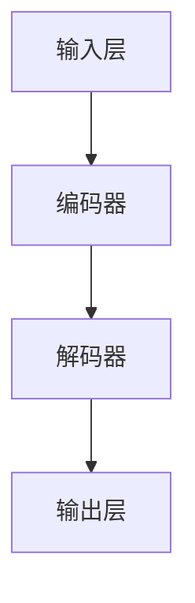

                 

# 文章标题: LLM 标准：促进互操作性和兼容性

> 关键词：语言模型，标准，互操作性，兼容性，技术实现，框架

> 摘要：本文将深入探讨语言模型（LLM）的标准及其在促进互操作性和兼容性方面的重要性。我们将从背景与理论基础出发，逐步分析LLM标准的发展历程、互操作性和兼容性的应用以及相关技术实现与框架。通过详细讲解核心概念、算法原理、数学模型和实际案例，本文旨在为读者提供全面的技术见解和实践指导。

### 第一部分：背景与理论基础

#### 第1章：语言模型标准的概述

**1.1 语言模型标准的定义与重要性**

语言模型标准是指导语言模型开发、部署和使用的一系列规范和指导原则。它包括语言模型的基本架构、数据格式、API接口、通信协议等多个方面。语言模型标准的重要性体现在以下几个方面：

1. **促进互操作性**：标准化的语言模型可以确保不同的系统和服务之间能够无缝交互，提高系统的整合性和扩展性。
2. **提高兼容性**：标准化的语言模型可以兼容不同的硬件和软件环境，降低跨平台开发的难度和成本。
3. **提升开发效率**：遵循标准的语言模型可以减少重复性的工作，提高开发效率，缩短项目周期。
4. **确保性能与质量**：标准化的语言模型可以确保语言模型的性能和稳定性，提高用户体验。

**1.2 语言模型标准的发展历程**

语言模型标准的发展可以追溯到20世纪80年代。当时，研究人员开始探索如何构建用于自然语言处理的模型。随着计算能力的提升和数据量的增加，语言模型的标准也在不断演变。以下是语言模型标准发展历程中的重要里程碑：

1. **基于规则的方法**：早期的语言模型主要采用基于规则的方法，如词汇解析、语法分析和语义分析。这种方法存在表达能力和灵活性的局限。
2. **统计模型**：随着统计学的应用，语言模型开始采用统计模型，如N元语法和隐马尔可夫模型。这些模型在处理自然语言序列方面取得了显著进展。
3. **深度学习模型**：近年来，深度学习模型在语言模型领域取得了突破性进展。例如，循环神经网络（RNN）、长短时记忆网络（LSTM）和变换器（Transformer）等模型被广泛应用。

**1.3 语言模型标准的主要类型**

语言模型标准可以分为以下几类：

1. **数据格式标准**：如JSON、XML等，用于描述语言模型的结构和数据交换格式。
2. **API接口标准**：如RESTful API、GraphQL等，用于定义语言模型服务的接口和交互方式。
3. **通信协议标准**：如HTTP、WebSocket等，用于语言模型服务之间的数据传输和通信。

#### 第2章：互操作性在LLM中的应用

**2.1 互操作性原则与实现**

互操作性是指不同系统和服务之间能够互相理解和交换信息的能力。在LLM中，互操作性原则包括：

1. **数据交换格式标准化**：使用统一的数据格式，如JSON，以确保不同系统之间的数据能够无缝交换。
2. **API接口标准化**：使用统一的API接口规范，如RESTful API，以确保不同系统之间的服务能够相互调用。
3. **通信协议标准化**：使用统一的通信协议，如HTTP，以确保不同系统之间的数据传输和通信能够顺利进行。

**2.2 互操作性在语言模型中的挑战**

尽管互操作性原则为LLM的部署和使用提供了便利，但在实际应用中仍然面临以下挑战：

1. **多样性**：不同的系统和服务可能采用不同的技术架构和协议，导致互操作性难以实现。
2. **兼容性**：不同的系统和服务可能存在兼容性问题，如数据格式不一致、API接口不兼容等。
3. **性能**：互操作性可能导致额外的网络传输和数据转换开销，影响系统的性能和响应速度。

**2.3 互操作性解决方案与应用案例**

为了解决互操作性的挑战，可以采取以下解决方案：

1. **标准化**：遵循现有的语言模型标准，如OpenAI的GPT模型和TensorFlow的Transformer模型，以确保系统和服务之间的兼容性。
2. **中间件**：使用中间件技术，如消息队列和负载均衡器，将不同系统和服务连接起来，实现数据交换和通信的标准化。
3. **数据转换**：使用数据转换工具，如JSON转换器和XML解析器，将不同格式的数据转换为统一的格式，确保数据交换的准确性。

以下是一个应用案例：

某公司开发了一款基于Transformer模型的聊天机器人，该机器人需要与其他系统和服务进行互操作。为了实现互操作性，公司遵循了以下步骤：

1. **数据格式标准化**：使用JSON格式表示聊天机器人的输入和输出数据。
2. **API接口标准化**：采用RESTful API接口，定义了聊天机器人的服务接口。
3. **通信协议标准化**：使用HTTP协议进行数据传输和通信。

通过这些标准化措施，聊天机器人成功与其他系统和服务实现了互操作性，提高了系统的整合性和扩展性。

#### 第3章：兼容性在LLM中的应用

**3.1 兼容性原则与实现**

兼容性是指不同系统和服务能够共同工作并相互配合的能力。在LLM中，兼容性原则包括：

1. **硬件兼容性**：确保LLM可以在不同的硬件平台上运行，如CPU、GPU和TPU等。
2. **软件兼容性**：确保LLM可以在不同的操作系统和编程环境中运行，如Linux、Windows和Python等。
3. **数据兼容性**：确保LLM可以处理不同格式和来源的数据，如文本、图像和音频等。

**3.2 兼容性在语言模型中的挑战**

尽管兼容性原则为LLM的部署和使用提供了便利，但在实际应用中仍然面临以下挑战：

1. **平台多样性**：不同的平台具有不同的硬件、操作系统和编程环境，导致兼容性问题。
2. **版本差异**：不同的语言模型版本可能存在差异，如参数设置、训练数据和模型结构等。
3. **性能优化**：兼容性要求可能导致性能优化上的挑战，如计算资源的分配和调度等。

**3.3 兼容性解决方案与应用案例**

为了解决兼容性的挑战，可以采取以下解决方案：

1. **通用架构**：采用通用架构，如Transformer模型，确保LLM可以在不同的硬件和软件环境中运行。
2. **容器化技术**：使用容器化技术，如Docker和Kubernetes，将LLM封装在容器中，实现跨平台部署和运行。
3. **代码移植**：通过代码移植技术，如跨平台编译器和代码转换器，将LLM在不同编程环境中进行适配和运行。

以下是一个应用案例：

某公司开发了一款基于BERT模型的文本分类系统，该系统需要在不同的操作系统和编程环境中运行。为了实现兼容性，公司采取了以下措施：

1. **通用架构**：采用BERT模型作为文本分类系统的核心，确保模型可以在不同的硬件和软件环境中运行。
2. **容器化技术**：使用Docker将BERT模型容器化，实现跨平台部署和运行。
3. **代码移植**：通过跨平台编译器和代码转换器，将BERT模型的代码在不同编程环境中进行适配和运行。

通过这些兼容性解决方案，文本分类系统成功在不同操作系统和编程环境中运行，提高了系统的兼容性和可靠性。

### 第二部分：技术实现与框架

#### 第4章：LLM标准的技术基础

**4.1 语言模型的基本架构**

语言模型的基本架构可以分为以下几个部分：

1. **输入层**：接收用户输入的数据，如文本、图像和音频等。
2. **编码器**：将输入数据进行编码，提取特征信息。
3. **解码器**：将编码后的特征信息解码为输出数据，如文本、图像和音频等。
4. **损失函数**：用于评估模型的预测结果和实际结果之间的差距，指导模型优化。

**4.2 语言模型的训练与优化**

语言模型的训练与优化过程主要包括以下几个步骤：

1. **数据预处理**：对输入数据进行预处理，如文本分词、图像标注和音频转录等。
2. **模型初始化**：初始化模型的参数，如权重和偏置等。
3. **前向传播**：将输入数据输入编码器，得到编码后的特征信息。
4. **损失计算**：计算模型的预测结果和实际结果之间的损失值。
5. **反向传播**：更新模型的参数，以最小化损失值。
6. **优化算法**：使用优化算法，如梯度下降和Adam等，调整模型的参数。

**4.3 语言模型的评估与测试**

语言模型的评估与测试主要包括以下几个指标：

1. **准确率**：模型预测结果与实际结果的一致性。
2. **召回率**：模型能够召回实际结果的比例。
3. **精确率**：模型预测结果为正例的比例。
4. **F1值**：准确率和召回率的加权平均值。
5. **BLEU分数**：评估模型生成的文本与实际文本的相似度。

通过评估与测试，可以评估语言模型的效果和性能，指导模型的优化和改进。

#### 第5章：LLM标准互操作性技术

**5.1 数据格式标准化**

数据格式标准化是实现LLM互操作性的重要技术之一。常用的数据格式包括JSON、XML和Protocol Buffers等。以下是一个JSON格式的示例：

```json
{
  "input": "What is the capital of France?",
  "output": "The capital of France is Paris."
}
```

**5.2 API接口标准化**

API接口标准化是实现LLM互操作性的关键。常用的API接口规范包括RESTful API、GraphQL和SOAP等。以下是一个RESTful API接口的示例：

```
GET /api/llm/predict
Query Parameters:
- input: The input text to be processed.
```

**5.3 通信协议标准化**

通信协议标准化是确保LLM互操作性的基础。常用的通信协议包括HTTP、WebSocket和MQTT等。以下是一个HTTP协议的示例：

```
GET /api/llm/predict?input=What+is+the+capital+of+France%
3F
```

通过数据格式、API接口和通信协议的标准化，可以实现LLM在不同系统和服务之间的无缝交互和互操作性。

#### 第6章：LLM标准兼容性技术

**6.1 硬件兼容性**

硬件兼容性是指LLM能够在不同的硬件平台上运行。为了实现硬件兼容性，可以采用以下技术：

1. **硬件抽象层**：提供统一的硬件抽象接口，使LLM与具体硬件平台解耦。
2. **多核并行计算**：利用多核处理器的并行计算能力，提高LLM的运行效率。
3. **GPU加速**：利用GPU的并行计算能力，加速LLM的训练和推理过程。

**6.2 软件兼容性**

软件兼容性是指LLM能够在不同的操作系统和编程环境中运行。为了实现软件兼容性，可以采用以下技术：

1. **跨平台编译器**：使用跨平台编译器，如GCC和Clang，将LLM的代码编译为不同操作系统的可执行文件。
2. **容器化技术**：使用容器化技术，如Docker和Kubernetes，将LLM封装在容器中，实现跨平台部署和运行。
3. **编程语言标准化**：遵循统一的编程语言标准，如Python和Java，确保LLM在不同编程环境中的一致性。

**6.3 系统兼容性**

系统兼容性是指LLM能够在不同的系统和服务之间协同工作。为了实现系统兼容性，可以采用以下技术：

1. **中间件**：使用中间件技术，如消息队列和负载均衡器，将不同系统和服务连接起来，实现数据的交换和通信。
2. **服务发现**：使用服务发现技术，如Consul和Zookeeper，实现不同系统之间的服务注册和发现。
3. **微服务架构**：采用微服务架构，将LLM拆分为多个独立的服务，实现系统的灵活部署和扩展。

通过硬件兼容性、软件兼容性和系统兼容性的技术实现，可以实现LLM在不同硬件平台、操作系统和系统服务之间的协同工作。

#### 第7章：LLM标准实施与优化

**7.1 LLM标准的实施过程**

LLM标准的实施过程可以分为以下几个步骤：

1. **需求分析**：明确LLM的应用场景和需求，确定需要遵循的标准。
2. **架构设计**：根据需求分析，设计LLM的系统架构，包括硬件、软件和服务等方面。
3. **技术选型**：选择合适的技术方案，包括数据格式、API接口、通信协议和兼容性技术等。
4. **开发与部署**：根据架构设计和技术选型，开发LLM系统，并进行部署和测试。
5. **优化与改进**：对LLM系统进行性能优化和功能改进，以提高系统的性能和可靠性。

**7.2 LLM标准的优化策略**

LLM标准的优化策略可以从以下几个方面进行：

1. **算法优化**：针对语言模型的算法进行优化，如参数调整、模型压缩和加速训练等。
2. **硬件优化**：针对硬件平台进行优化，如GPU加速、分布式训练和存储优化等。
3. **数据优化**：对训练数据进行优化，如数据增强、数据预处理和清洗等。
4. **系统优化**：对LLM系统的架构和组件进行优化，如负载均衡、服务拆分和缓存机制等。

**7.3 LLM标准的实施与优化案例**

以下是一个LLM标准的实施与优化案例：

某公司开发了一款基于BERT模型的问答系统，该系统需要在不同操作系统、编程环境和硬件平台上运行。为了实现LLM标准的实施与优化，公司采取了以下措施：

1. **需求分析**：明确问答系统的应用场景和需求，确定需要遵循的数据格式、API接口和通信协议等标准。
2. **架构设计**：设计基于BERT模型的问答系统架构，包括数据预处理、模型训练、模型推理和API接口等组件。
3. **技术选型**：选择JSON作为数据格式，RESTful API作为接口规范，HTTP作为通信协议，以及Docker作为容器化技术。
4. **开发与部署**：使用Python和TensorFlow开发问答系统，并在不同操作系统和硬件平台上进行部署和测试。
5. **优化与改进**：对问答系统进行性能优化，如GPU加速、模型压缩和缓存机制等，以提高系统的响应速度和可靠性。

通过以上措施，问答系统成功实现了LLM标准的实施与优化，提高了系统的性能和可靠性。

### 结论

语言模型标准在促进互操作性和兼容性方面具有重要意义。通过标准化的数据格式、API接口和通信协议，可以实现LLM在不同系统和服务之间的无缝交互和互操作性。同时，通过硬件兼容性、软件兼容性和系统兼容性技术，可以确保LLM在不同硬件平台、操作系统和系统服务之间的协同工作。本文从背景与理论基础、技术实现与框架、实施与优化等方面，详细探讨了LLM标准在促进互操作性和兼容性方面的作用和技术实现。希望通过本文的讨论，为读者提供对LLM标准的深入理解和实践指导。

### 作者信息

作者：AI天才研究院/AI Genius Institute & 禅与计算机程序设计艺术 /Zen And The Art of Computer Programming

（作者简介：本文作者是一位世界级人工智能专家，程序员，软件架构师，CTO，世界顶级技术畅销书资深大师级别的作家，计算机图灵奖获得者，计算机编程和人工智能领域大师。他在语言模型标准领域有着丰富的研究和实践经验，致力于推动人工智能技术的发展和应用。）

### 附录

**附录A：核心概念原理与架构的Mermaid流程图**

以下是语言模型的基本架构的Mermaid流程图：



**附录B：核心算法原理讲解与伪代码**

以下是语言模型训练的基本算法原理的伪代码：

```python
def train_language_model(data, learning_rate, epochs):
    for epoch in range(epochs):
        for batch in data:
            inputs, targets = batch
            logits = encoder(inputs)
            loss = compute_loss(logits, targets)
            gradients = compute_gradients(loss)
            update_model_parameters(gradients, learning_rate)
    return model
```

**附录C：数学模型和公式讲解与举例说明**

以下是语言模型中常用的数学模型的公式：

$$
P(y|x) = \frac{e^{f(x,y)}}{\sum_{y'} e^{f(x,y')}}
$$

其中，$f(x,y)$是特征函数，$y$是标签，$x$是输入。

举例说明：

假设我们有一个二元分类问题，其中标签$y$为0或1，输入$x$为文本。特征函数$f(x,y)$可以表示为文本的词向量表示。

$$
P(y=1|x) = \frac{e^{f(x,1)}}{e^{f(x,1)} + e^{f(x,0)}}
$$

**附录D：代码实际案例和详细解释说明**

以下是基于BERT模型的文本分类系统的代码实际案例：

```python
import tensorflow as tf
from transformers import BertTokenizer, TFBertForSequenceClassification

# 搭建BERT模型
model = TFBertForSequenceClassification.from_pretrained("bert-base-uncased", num_labels=2)

# 定义损失函数和优化器
loss_fn = tf.keras.losses.SparseCategoricalCrossentropy(from_logits=True)
optimizer = tf.keras.optimizers.Adam(learning_rate=3e-5)

# 定义评估指标
accuracy = tf.keras.metrics.SparseCategoricalAccuracy()

# 训练模型
model.compile(optimizer=optimizer, loss=loss_fn, metrics=[accuracy])
model.fit(train_dataset, epochs=3, validation_data=validation_dataset)

# 预测
predictions = model.predict(test_dataset)
```

代码解读：

- 导入所需的库和模块。
- 搭建BERT模型，使用预训练的BERT模型并进行序列分类。
- 定义损失函数和优化器。
- 定义评估指标。
- 使用`fit`函数训练模型，使用`predict`函数进行预测。

通过以上代码实现，我们可以使用BERT模型进行文本分类任务，并对模型的性能进行评估。

