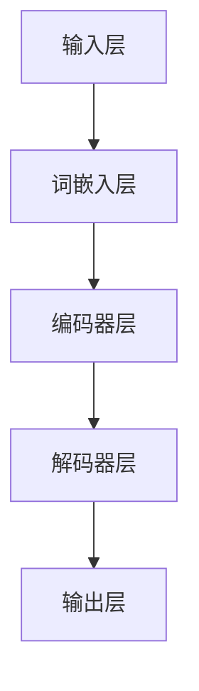
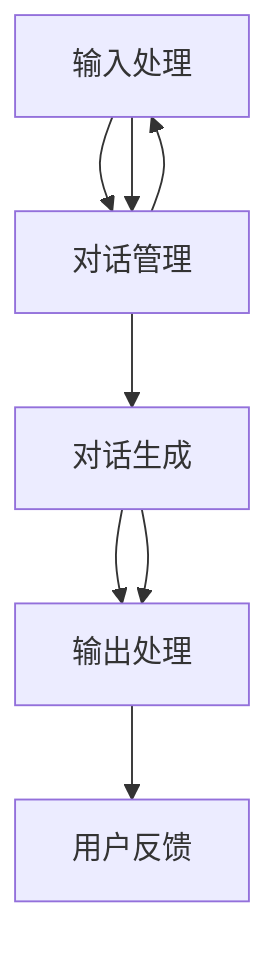

                 

# 文章标题: LLM:计算机架构的新时代

## 关键词：语言模型（LLM），计算机架构，预训练技术，自然语言处理，对话系统，人工智能

## 摘要：

本文将深入探讨语言模型（LLM）在计算机架构领域的新时代。通过分析LLM的基础理论、应用场景、研究进展及未来展望，我们将揭示LLM如何彻底改变计算机架构的格局。文章将分三个部分展开，首先介绍LLM的基础理论，包括概述、原理和预训练技术；接着探讨LLM在各种实际应用中的角色；最后，对LLM的前沿研究及未来发展趋势进行展望，并总结相关资源与工具。

## 目录

### 第一部分：LLM基础理论

#### 第1章：LLM概述  
1.1 计算机架构的演变  
1.2 语言模型（LLM）的基本概念  
1.3 LLM的应用场景  
1.4 LLM的发展历程

#### 第2章：语言模型原理  
2.1 语言模型的工作机制  
2.2 词汇表与词嵌入  
2.3 语言模型的训练  
2.4 语言模型的评估

#### 第3章：预训练技术  
3.1 预训练的概念  
3.2 预训练的方法  
3.3 预训练模型的结构  
3.4 预训练模型的优化

### 第二部分：LLM应用

#### 第4章：自然语言处理应用  
4.1 文本分类  
4.2 情感分析  
4.3 机器翻译  
4.4 问答系统

#### 第5章：代码生成与编程辅助  
5.1 代码生成技术  
5.2 编程辅助工具  
5.3 LLM在代码纠错中的应用

#### 第6章：对话系统  
6.1 对话系统的基本架构  
6.2 对话策略与搜索算法  
6.3 对话系统中的上下文管理  
6.4 对话系统的评估

### 第三部分：LLM研究进展

#### 第7章：LLM的前沿研究  
7.1 多模态语言模型  
7.2 大模型压缩与效率优化  
7.3 LLM在边缘计算中的应用  
7.4 LLM的安全性与隐私保护

#### 第8章：LLM的未来展望  
8.1 LLM在人工智能领域的应用前景  
8.2 LLM技术面临的挑战与解决方法  
8.3 LLM对计算机架构的影响  
8.4 LLM对社会发展的潜在影响

### 附录：资源与工具  
9.1 LLM相关资源  
9.2 开发LLM所需的工具与框架  
9.3 实践指南：如何搭建一个LLM项目

### Mermaid流程图  
以下为LLM的基本架构流程图：



### 核心算法原理讲解  
以下为语言模型训练过程中的核心算法——反向传播算法的伪代码：

```python  
// 输入：训练数据集，模型参数，学习率  
// 输出：更新后的模型参数

for epoch in 1 to MAX_EPOCHS do  
  for each training sample (x, y) in dataset do  
    // 前向传播  
    z = forward(x, parameters)  
    prediction = softmax(z)

    // 计算损失  
    loss = cross_entropy_loss(y, prediction)

    // 反向传播  
    gradients = backward(z, y, prediction)

    // 更新模型参数  
    parameters = parameters - learning_rate * gradients  
  end  
end  
```

### 数学模型和数学公式详细讲解  
以下为语言模型中常见的数学公式——交叉熵（Cross-Entropy Loss）：

$$  
L(y, \hat{y}) = -\sum_{i=1}^{n} y_i \log(\hat{y}_i)  
$$

其中，$y$ 是真实标签，$\hat{y}$ 是模型的预测概率分布。

### 项目实战  
以下为使用PyTorch搭建一个简单的语言模型的项目实战：

#### 环境搭建  
安装PyTorch和相关依赖：

```bash  
pip install torch torchvision  
```

#### 数据准备  
收集并预处理文本数据，将文本转换为词嵌入向量。

#### 模型搭建  
定义语言模型：

```python  
import torch  
import torch.nn as nn

class LanguageModel(nn.Module):  
    def __init__(self, vocab_size, embedding_dim, hidden_dim, output_dim):  
        super(LanguageModel, self).__init__()  
        self.embedding = nn.Embedding(vocab_size, embedding_dim)  
        self.lstm = nn.LSTM(embedding_dim, hidden_dim, num_layers=1)  
        self.fc = nn.Linear(hidden_dim, output_dim)  
      
    def forward(self, x):  
        embedded = self.embedding(x)  
        output, _ = self.lstm(embedded)  
        logits = self.fc(output.squeeze(0))  
        return logits  
```

#### 训练模型  
使用训练数据训练模型：

```python  
model = LanguageModel(vocab_size, embedding_dim, hidden_dim, output_dim)  
optimizer = torch.optim.Adam(model.parameters(), lr=0.001)  
criterion = nn.CrossEntropyLoss()

for epoch in range(num_epochs):  
  for inputs, targets in train_loader:  
    optimizer.zero_grad()  
    logits = model(inputs)  
    loss = criterion(logits, targets)  
    loss.backward()  
    optimizer.step()  
```

#### 评估模型  
在测试集上评估模型性能：

```python  
with torch.no_grad():  
  correct = 0  
  total = 0  
  for inputs, targets in test_loader:  
    logits = model(inputs)  
    _, predicted = logits.max(1)  
    total += targets.size(0)  
    correct += (predicted == targets).sum().item()  

print('Test Accuracy: {}%'.format(100 * correct / total))  
```

#### 代码解读与分析  
上述代码展示了如何使用PyTorch搭建一个简单的语言模型。首先，定义了嵌入层、LSTM编码器和解码层。然后，使用训练数据训练模型，并在测试集上评估模型性能。训练过程中，使用反向传播算法更新模型参数，以最小化损失函数。

### 附录：资源与工具

#### 9.1 LLM相关资源

- **Hugging Face Transformers：** https://huggingface.co/transformers
- **NLTK：** https://www.nltk.org/
- **GPT-3 Documentation：** https://gpt-3-docs.zhipu.ai/

#### 9.2 开发LLM所需的工具与框架

- **PyTorch：** https://pytorch.org/
- **TensorFlow：** https://www.tensorflow.org/
- **fast.ai：** https://www.fast.ai/

#### 9.3 实践指南

- **《自然语言处理实战》：** https://www.nlp-course.com/
- **《深度学习实践指南》：** https://www.deeplearning-bookchinese.com/zh/latest/

## 作者信息

作者：AI天才研究院/AI Genius Institute & 禅与计算机程序设计艺术 /Zen And The Art of Computer Programming

### 第一部分：LLM基础理论

#### 第1章：LLM概述

##### 1.1 计算机架构的演变

计算机架构的发展经历了多个阶段，从最早的冯诺依曼架构到现代的多核架构，再到近年来的异构计算架构，每一次变革都极大地推动了计算机性能的提升。然而，随着人工智能（AI）技术的快速发展，尤其是深度学习的兴起，传统的计算机架构开始面临新的挑战。

传统的计算机架构主要是以冯诺依曼架构为基础，该架构将数据和指令存储在相同的内存中，通过中央处理单元（CPU）进行计算和执行。尽管这种架构在早期计算机的发展中发挥了重要作用，但随着计算需求的增长，其局限性也逐渐显现。首先，冯诺依曼架构的并行处理能力有限，难以满足深度学习等计算密集型任务的需求。其次，传统CPU在处理大规模数据和复杂模型时，面临着能耗和性能的瓶颈。

为了解决这些问题，计算机架构开始向异构计算架构发展。异构计算架构通过将不同的计算资源（如CPU、GPU、FPGA等）集成在一起，实现数据处理的并行化和高效化。在这种架构中，深度学习模型通常被部署在GPU上，因为GPU具有大量的并行计算单元，可以显著提高模型的训练和推理速度。

然而，随着自然语言处理（NLP）技术的快速发展，尤其是大型语言模型（LLM）的出现，计算机架构再次面临新的挑战。LLM通常具有数十亿甚至数万亿个参数，其训练和推理过程需要极高的计算能力和存储资源。传统的异构计算架构虽然在计算能力上有所提升，但在处理如此大规模的模型时，仍然存在性能瓶颈。

为了应对这一挑战，研究者们开始探索全新的计算机架构，以更好地支持LLM的开发和应用。这种新的架构不仅需要具备强大的计算和存储能力，还需要具备高效的内存访问和处理能力，以确保模型能够在实际应用中获得最佳性能。

##### 1.2 语言模型（LLM）的基本概念

语言模型（Language Model，简称LLM）是一种用于预测文本序列的概率分布的模型。它可以用于各种自然语言处理任务，如文本分类、情感分析、机器翻译、问答系统等。LLM的核心目标是学习语言规律，以便在给定一个单词或短语时，能够预测下一个单词或短语。

LLM的基本概念包括以下几个方面：

1. **词汇表**：词汇表是LLM中使用的所有单词的集合。通常，词汇表的大小在数十万到数百万之间，以覆盖大多数日常用语。

2. **词嵌入**：词嵌入（Word Embedding）是将词汇表中的单词映射到高维向量空间的技术。词嵌入可以帮助LLM理解单词之间的语义关系，从而提高模型的预测准确性。

3. **模型架构**：LLM的模型架构通常包括编码器（Encoder）和解码器（Decoder）两个部分。编码器负责将输入文本编码为固定长度的向量，解码器则根据编码器的输出生成预测的文本序列。

4. **训练过程**：LLM的训练过程主要包括两个步骤：预训练和微调。预训练是指在大量的未标注文本上训练模型，以学习语言的基本规律；微调则是在特定任务上对模型进行细粒度调整，以提高其在具体任务上的性能。

##### 1.3 LLM的应用场景

LLM在自然语言处理领域具有广泛的应用场景。以下是一些典型的应用示例：

1. **文本分类**：文本分类是将文本数据划分为不同的类别的过程。LLM可以通过学习大量的标注数据，识别文本中的关键特征，从而实现高效的文本分类。

2. **情感分析**：情感分析旨在判断文本表达的情感倾向，如正面、负面或中性。LLM可以通过学习情感词汇和情感模式，实现情感分析的自动化。

3. **机器翻译**：机器翻译是将一种语言的文本翻译成另一种语言的过程。LLM可以通过学习双语语料库，实现高质量、低误差的机器翻译。

4. **问答系统**：问答系统是一种能够回答用户问题的智能系统。LLM可以通过学习大量问答对，实现高效、准确的问答功能。

5. **对话系统**：对话系统是一种能够与用户进行自然语言交互的系统。LLM可以通过学习对话数据，实现流畅、自然的对话交互。

##### 1.4 LLM的发展历程

LLM的发展历程可以分为以下几个阶段：

1. **早期阶段**：在早期，研究者们主要使用基于规则的系统进行语言建模。这些系统通常通过手工编写规则，将文本映射到目标文本。然而，这种方法存在明显的局限性，难以处理复杂的语言现象。

2. **统计模型阶段**：随着自然语言处理技术的发展，研究者们开始使用统计模型进行语言建模。其中，N-gram模型是最常见的统计模型之一。N-gram模型通过计算连续N个单词的联合概率，预测下一个单词。这种方法在一定程度上提高了语言建模的准确性。

3. **深度学习阶段**：深度学习技术的兴起，使得LLM的发展进入了一个新的阶段。以循环神经网络（RNN）和长短期记忆网络（LSTM）为代表的深度学习模型，可以更好地捕捉文本中的长距离依赖关系，从而提高语言建模的性能。

4. **预训练阶段**：预训练技术使得LLM的发展达到了一个新的高度。预训练是指在大量的未标注文本上训练模型，以学习语言的基本规律。随后，通过对预训练模型进行微调，实现特定任务的高性能。

5. **大型模型阶段**：近年来，研究者们开始训练数十亿、甚至数万亿参数的大型LLM。这些大型模型在自然语言处理任务上取得了显著的性能提升，推动了LLM的发展进入了一个新的时代。

#### 第2章：语言模型原理

##### 2.1 语言模型的工作机制

语言模型的工作机制可以分为三个主要部分：词嵌入、编码器和解码器。

1. **词嵌入**：词嵌入是将词汇表中的单词映射到高维向量空间的技术。词嵌入可以帮助模型理解单词之间的语义关系，从而提高预测准确性。常见的词嵌入方法包括Word2Vec、GloVe和BERT。

2. **编码器**：编码器负责将输入文本编码为固定长度的向量。在深度学习模型中，编码器通常采用循环神经网络（RNN）或变换器（Transformer）架构。RNN可以捕捉文本中的长距离依赖关系，而Transformer则通过自注意力机制实现并行计算，提高了模型训练和推理的速度。

3. **解码器**：解码器根据编码器的输出生成预测的文本序列。在深度学习模型中，解码器通常与编码器共享参数，以降低模型复杂度。解码器通常采用RNN或Transformer架构。

##### 2.2 词汇表与词嵌入

词汇表是语言模型中使用的所有单词的集合。词汇表的大小通常在数十万到数百万之间，以覆盖大多数日常用语。构建词汇表的过程称为词汇化（Tokenization），常见的词汇化方法包括分词、标记化和字符级词汇化。

词嵌入是将词汇表中的单词映射到高维向量空间的技术。词嵌入可以帮助模型理解单词之间的语义关系，从而提高预测准确性。常见的词嵌入方法包括Word2Vec、GloVe和BERT。

1. **Word2Vec**：Word2Vec是一种基于神经网络的词嵌入方法，其基本思想是学习一个映射函数，将词汇表中的单词映射到向量空间。Word2Vec主要有两种实现方式：连续词袋（CBOW）和Skip-Gram。

2. **GloVe**：GloVe（Global Vectors for Word Representation）是一种基于全局上下文的词嵌入方法。GloVe通过计算单词与其上下文之间的共现关系，学习一个低维向量表示。

3. **BERT**：BERT（Bidirectional Encoder Representations from Transformers）是一种基于变换器的预训练方法。BERT通过在两个方向上（前向和后向）对文本进行编码，学习一个双向的向量表示。

##### 2.3 语言模型的训练

语言模型的训练过程主要包括两个步骤：预训练和微调。

1. **预训练**：预训练是指在大量的未标注文本上训练模型，以学习语言的基本规律。预训练的目标是让模型具备较强的语言理解能力，以便在后续任务中实现高性能。

2. **微调**：微调是指在特定任务上对预训练模型进行细粒度调整，以提高其在具体任务上的性能。微调的目标是让模型在特定任务上具有更好的适应性。

语言模型训练过程中，常用的损失函数包括交叉熵损失（Cross-Entropy Loss）和均方误差（Mean Squared Error）。交叉熵损失常用于分类任务，而均方误差常用于回归任务。

##### 2.4 语言模型的评估

语言模型的评估主要包括两个方面：模型性能和预测准确性。

1. **模型性能**：模型性能是指模型在训练和测试数据集上的表现。常用的评估指标包括准确率（Accuracy）、精确率（Precision）、召回率（Recall）和F1值（F1 Score）。

2. **预测准确性**：预测准确性是指模型在实际应用中的表现。预测准确性可以通过计算预测结果与真实结果的相似度来评估。常见的评估方法包括计算准确率、召回率、F1值等。

#### 第3章：预训练技术

##### 3.1 预训练的概念

预训练（Pre-training）是指在大规模未标注数据上对模型进行训练，以学习语言的基本规律。预训练的目标是让模型具备较强的语言理解能力，以便在后续任务中实现高性能。

预训练技术是近年来自然语言处理领域的重要突破。通过预训练，模型可以自动学习词汇、语法、语义等语言特征，从而提高模型在下游任务中的性能。预训练技术的核心思想是利用大规模未标注数据，通过自监督学习（Self-Supervised Learning）的方式对模型进行训练。

##### 3.2 预训练的方法

预训练的方法主要包括以下几种：

1. **自监督学习**：自监督学习是一种利用未标注数据进行训练的方法。在自监督学习中，模型需要通过预测未标注数据中的部分信息来学习语言特征。常见的自监督学习方法包括掩码语言模型（Masked Language Model，简称MLM）和生成式自监督学习（Generative Self-Supervised Learning）。

2. **多任务学习**：多任务学习是指同时训练多个任务，以提高模型在单个任务上的性能。多任务学习的核心思想是利用多个任务的关联性，提高模型对语言特征的学习。常见的多任务学习策略包括任务共享（Task Sharing）和任务融合（Task Fusion）。

3. **知识蒸馏**：知识蒸馏（Knowledge Distillation）是一种将大型模型的知识传递给小型模型的方法。在知识蒸馏过程中，大型模型（教师模型）和较小模型（学生模型）同时训练。教师模型生成的软标签用于指导学生模型的训练，以提高其性能。

##### 3.3 预训练模型的结构

预训练模型的结构主要包括编码器和解码器两个部分。编码器负责将输入文本编码为固定长度的向量，解码器则根据编码器的输出生成预测的文本序列。常见的预训练模型结构包括循环神经网络（RNN）、变换器（Transformer）和双向变换器（Bidirectional Transformer）。

1. **RNN**：RNN是一种基于序列数据的神经网络模型，其核心思想是通过记忆单元（Memory Unit）捕捉文本中的长距离依赖关系。RNN包括简单RNN、LSTM和GRU等变体。

2. **Transformer**：Transformer是一种基于自注意力机制的变换器模型，其核心思想是通过多头自注意力机制（Multi-Head Self-Attention）捕捉文本中的依赖关系。Transformer具有并行计算能力，可以提高训练和推理速度。

3. **Bidirectional Transformer**：Bidirectional Transformer是一种双向变换器模型，其核心思想是在编码器和解码器中使用双向自注意力机制，从而提高模型对文本的上下文理解能力。

##### 3.4 预训练模型的优化

预训练模型的优化主要包括模型参数的优化、训练过程的优化和模型压缩与部署的优化。

1. **模型参数的优化**：模型参数的优化主要包括梯度下降（Gradient Descent）和其变种，如Adam优化器。梯度下降通过最小化损失函数来更新模型参数，而Adam优化器则结合了梯度的一阶矩估计和二阶矩估计，以提高优化效果。

2. **训练过程的优化**：训练过程的优化主要包括批量大小（Batch Size）和训练策略的优化。批量大小是指每次训练使用的样本数量。较大的批量大小可以提高模型的稳定性和鲁棒性，但会增加训练时间。训练策略的优化主要包括学习率调度（Learning Rate Scheduler）和训练循环（Training Loop）的设计，以加快模型收敛速度。

3. **模型压缩与部署的优化**：模型压缩与部署的优化主要包括模型剪枝（Model Pruning）、量化（Quantization）和模型蒸馏（Model Distillation）。模型剪枝通过去除模型中的冗余参数，减小模型大小和计算量。量化通过将模型参数的精度降低到较低位宽，以减少模型大小和存储需求。模型蒸馏通过将大型模型的知识传递给小型模型，以提高小型模型在特定任务上的性能。

#### 第二部分：LLM应用

##### 第4章：自然语言处理应用

自然语言处理（Natural Language Processing，简称NLP）是计算机科学和人工智能领域的重要分支，旨在使计算机能够理解和处理人类语言。语言模型（LLM）作为NLP的核心技术之一，已在多个领域取得了显著的应用成果。本章节将重点探讨LLM在文本分类、情感分析、机器翻译和问答系统等自然语言处理任务中的应用。

##### 4.1 文本分类

文本分类（Text Classification）是将文本数据按照一定的规则划分为预定义的类别的一种任务。LLM在文本分类中发挥着重要作用，能够有效地对文本进行分类。

文本分类的基本流程包括以下几个步骤：

1. **数据预处理**：首先，对文本进行预处理，包括去除停用词、标点符号、进行分词等操作。然后，将预处理后的文本转换为词嵌入向量，以便于模型处理。

2. **模型训练**：使用预训练的LLM模型，结合特定任务的标注数据，对模型进行微调。在训练过程中，模型会学习到文本的特征和类别之间的关系。

3. **模型评估**：通过在测试集上的评估，计算模型在不同类别上的准确率、召回率、F1值等指标，以评估模型性能。

4. **应用部署**：将训练好的模型部署到实际应用中，对新的文本数据进行分类预测。

LLM在文本分类中的应用优势主要体现在以下几个方面：

1. **强大的特征提取能力**：LLM能够自动提取文本中的语义特征，使得模型在处理复杂文本时具有更强的表现力。

2. **自适应能力**：通过微调，LLM能够适应不同任务的需求，提高分类准确性。

3. **高效率**：由于LLM是基于大规模预训练的，因此其在训练和推理过程中具有较高的效率。

以下是一个简单的文本分类项目实战：

```python
# 导入必要的库
import torch
from transformers import AutoTokenizer, AutoModelForSequenceClassification
from torch.utils.data import DataLoader
from sklearn.model_selection import train_test_split

# 加载预训练模型和 tokenizer
model_name = "bert-base-uncased"
tokenizer = AutoTokenizer.from_pretrained(model_name)
model = AutoModelForSequenceClassification.from_pretrained(model_name)

# 加载数据集
# 假设我们有一个包含文本和标签的数据集 dataset
# dataset = ...

# 数据预处理
def preprocess_data(dataset):
    # 进行数据预处理，如去除停用词、分词等
    # ...
    return processed_dataset

# 分割数据集
train_data, test_data = train_test_split(processed_dataset, test_size=0.2)

# 构建数据加载器
train_loader = DataLoader(train_data, batch_size=32)
test_loader = DataLoader(test_data, batch_size=32)

# 训练模型
optimizer = torch.optim.Adam(model.parameters(), lr=0.001)
criterion = torch.nn.CrossEntropyLoss()

for epoch in range(num_epochs):
    model.train()
    for inputs, labels in train_loader:
        optimizer.zero_grad()
        outputs = model(**inputs)
        loss = criterion(outputs.logits, labels)
        loss.backward()
        optimizer.step()

    # 在测试集上评估模型
    model.eval()
    with torch.no_grad():
        correct = 0
        total = 0
        for inputs, labels in test_loader:
            outputs = model(**inputs)
            _, predicted = outputs.logits.max(1)
            total += labels.size(0)
            correct += (predicted == labels).sum().item()
        print(f"Test Accuracy: {100 * correct / total}%")
```

##### 4.2 情感分析

情感分析（Sentiment Analysis）是一种评估文本中情感倾向的任务，通常分为积极、消极和中性三种。LLM在情感分析中发挥着重要作用，能够通过学习大量文本数据，识别出文本中的情感倾向。

情感分析的基本流程包括以下几个步骤：

1. **数据预处理**：对文本进行预处理，如去除停用词、分词等操作。然后，将预处理后的文本转换为词嵌入向量。

2. **模型训练**：使用预训练的LLM模型，结合特定任务的标注数据，对模型进行微调。

3. **模型评估**：通过在测试集上的评估，计算模型在不同情感类别上的准确率、召回率、F1值等指标，以评估模型性能。

4. **应用部署**：将训练好的模型部署到实际应用中，对新的文本数据进行情感分析预测。

LLM在情感分析中的应用优势主要体现在以下几个方面：

1. **自动特征提取**：LLM能够自动提取文本中的语义特征，使得模型在处理复杂文本时具有更强的表现力。

2. **适应性**：通过微调，LLM能够适应不同情感分析任务的需求，提高预测准确性。

3. **高效性**：由于LLM是基于大规模预训练的，因此其在训练和推理过程中具有较高的效率。

以下是一个简单的情感分析项目实战：

```python
# 导入必要的库
import torch
from transformers import AutoTokenizer, AutoModelForSequenceClassification
from torch.utils.data import DataLoader
from sklearn.model_selection import train_test_split

# 加载预训练模型和 tokenizer
model_name = "roberta-base"
tokenizer = AutoTokenizer.from_pretrained(model_name)
model = AutoModelForSequenceClassification.from_pretrained(model_name)

# 加载数据集
# 假设我们有一个包含文本和标签的数据集 dataset
# dataset = ...

# 数据预处理
def preprocess_data(dataset):
    # 进行数据预处理，如去除停用词、分词等
    # ...
    return processed_dataset

# 分割数据集
train_data, test_data = train_test_split(processed_dataset, test_size=0.2)

# 构建数据加载器
train_loader = DataLoader(train_data, batch_size=32)
test_loader = DataLoader(test_data, batch_size=32)

# 训练模型
optimizer = torch.optim.Adam(model.parameters(), lr=0.001)
criterion = torch.nn.CrossEntropyLoss()

for epoch in range(num_epochs):
    model.train()
    for inputs, labels in train_loader:
        optimizer.zero_grad()
        outputs = model(**inputs)
        loss = criterion(outputs.logits, labels)
        loss.backward()
        optimizer.step()

    # 在测试集上评估模型
    model.eval()
    with torch.no_grad():
        correct = 0
        total = 0
        for inputs, labels in test_loader:
            outputs = model(**inputs)
            _, predicted = outputs.logits.max(1)
            total += labels.size(0)
            correct += (predicted == labels).sum().item()
        print(f"Test Accuracy: {100 * correct / total}%")
```

##### 4.3 机器翻译

机器翻译（Machine Translation）是将一种语言的文本自动翻译成另一种语言的过程。LLM在机器翻译中发挥着重要作用，能够通过学习大量的双语语料库，实现高质量、低误差的机器翻译。

机器翻译的基本流程包括以下几个步骤：

1. **数据预处理**：对源语言和目标语言的文本进行预处理，如去除停用词、分词、标点符号等操作。然后，将预处理后的文本转换为词嵌入向量。

2. **模型训练**：使用预训练的LLM模型，结合特定的双语语料库，对模型进行微调。

3. **模型评估**：通过在测试集上的评估，计算模型在翻译任务上的准确率、BLEU值等指标，以评估模型性能。

4. **应用部署**：将训练好的模型部署到实际应用中，对新的源语言文本进行机器翻译预测。

LLM在机器翻译中的应用优势主要体现在以下几个方面：

1. **强大的语言理解能力**：LLM能够自动学习语言中的语义和语法特征，使得模型在翻译过程中能够更好地理解源语言文本。

2. **自适应能力**：通过微调，LLM能够适应不同语言对之间的翻译任务，提高翻译质量。

3. **高效性**：由于LLM是基于大规模预训练的，因此其在训练和推理过程中具有较高的效率。

以下是一个简单的机器翻译项目实战：

```python
# 导入必要的库
import torch
from transformers import AutoTokenizer, AutoModelForSeq2SeqLM
from torch.utils.data import DataLoader

# 加载预训练模型和 tokenizer
model_name = "t5-small"
tokenizer = AutoTokenizer.from_pretrained(model_name)
model = AutoModelForSeq2SeqLM.from_pretrained(model_name)

# 加载数据集
# 假设我们有一个包含源语言和目标语言的文本对的数据集 dataset
# dataset = ...

# 数据预处理
def preprocess_data(dataset):
    # 进行数据预处理，如去除停用词、分词等
    # ...
    return processed_dataset

# 构建数据加载器
train_loader = DataLoader(processed_dataset, batch_size=32)

# 训练模型
optimizer = torch.optim.Adam(model.parameters(), lr=0.001)
criterion = torch.nn.CrossEntropyLoss()

for epoch in range(num_epochs):
    model.train()
    for inputs, targets in train_loader:
        optimizer.zero_grad()
        outputs = model(**inputs, labels=targets)
        loss = criterion(outputs.logits, targets)
        loss.backward()
        optimizer.step()

# 预测
model.eval()
with torch.no_grad():
    source_text = "你好，世界！"
    source_encoded = tokenizer.encode(source_text, return_tensors="pt")
    target_encoded = model.generate(source_encoded, max_length=20, num_return_sequences=1)
    target_decoded = tokenizer.decode(target_encoded[:, source_encoded.shape[-1]:][0], skip_special_tokens=True)
    print(f"Source Text: {source_text}")
    print(f"Translated Text: {target_decoded}")
```

##### 4.4 问答系统

问答系统（Question Answering System）是一种能够自动回答用户问题的系统。LLM在问答系统中发挥着重要作用，能够通过学习大量的问答对，实现高效、准确的问答功能。

问答系统的基本流程包括以下几个步骤：

1. **数据预处理**：对问答对进行预处理，如去除停用词、分词、实体识别等操作。然后，将预处理后的问答对转换为词嵌入向量。

2. **模型训练**：使用预训练的LLM模型，结合特定的问答数据集，对模型进行微调。

3. **模型评估**：通过在测试集上的评估，计算模型在问答任务上的准确率、F1值等指标，以评估模型性能。

4. **应用部署**：将训练好的模型部署到实际应用中，对用户提出的问题进行自动回答。

LLM在问答系统中的应用优势主要体现在以下几个方面：

1. **自动特征提取**：LLM能够自动提取问答对中的关键特征，使得模型在处理复杂问题时具有更强的表现力。

2. **自适应能力**：通过微调，LLM能够适应不同问答系统的需求，提高问答准确性。

3. **高效性**：由于LLM是基于大规模预训练的，因此其在训练和推理过程中具有较高的效率。

以下是一个简单的问答系统项目实战：

```python
# 导入必要的库
import torch
from transformers import AutoTokenizer, AutoModelForQuestionAnswering
from torch.utils.data import DataLoader

# 加载预训练模型和 tokenizer
model_name = " DistilBERT-base-cased"
tokenizer = AutoTokenizer.from_pretrained(model_name)
model = AutoModelForQuestionAnswering.from_pretrained(model_name)

# 加载数据集
# 假设我们有一个包含问题和答案的数据集 dataset
# dataset = ...

# 数据预处理
def preprocess_data(dataset):
    # 进行数据预处理，如去除停用词、分词等
    # ...
    return processed_dataset

# 构建数据加载器
train_loader = DataLoader(processed_dataset, batch_size=32)

# 训练模型
optimizer = torch.optim.Adam(model.parameters(), lr=0.001)
criterion = torch.nn.CrossEntropyLoss()

for epoch in range(num_epochs):
    model.train()
    for inputs, targets in train_loader:
        optimizer.zero_grad()
        outputs = model(**inputs)
        loss = criterion(outputs.start_logits, targets.start_logits)
        loss.backward()
        optimizer.step()

# 预测
model.eval()
with torch.no_grad():
    question = "什么是人工智能？"
    context = "人工智能是计算机科学的一个分支，它研究如何创建智能的机器，使它们能够执行通常需要人类智能的任务，如视觉识别、语言理解、决策和问题解决。"
    question_encoded = tokenizer.encode(question, return_tensors="pt")
    context_encoded = tokenizer.encode(context, return_tensors="pt")
    start_scores, end_scores = model(question_encoded, context_encoded)
    start_indices = torch.argmax(start_scores, dim=1)
    end_indices = torch.argmax(end_scores, dim=1)
    answer_start = start_indices.item()
    answer_end = end_indices.item()
    answer = context[answer_start:answer_end+1].strip()
    print(f"Question: {question}")
    print(f"Answer: {answer}")
```

#### 第5章：代码生成与编程辅助

语言模型（LLM）不仅在自然语言处理领域取得了显著成果，还在代码生成与编程辅助方面展现出巨大的潜力。LLM能够通过学习大量的代码示例，生成高质量的代码，辅助开发者完成复杂的编程任务。本章节将探讨LLM在代码生成、编程辅助和代码纠错中的应用。

##### 5.1 代码生成技术

代码生成（Code Generation）是指利用LLM自动生成代码的过程。LLM在代码生成中具有以下优势：

1. **自适应能力**：LLM能够根据上下文自动调整代码生成策略，以适应不同的编程场景。

2. **复用性**：LLM能够从大量的代码示例中学习到通用的编程模式，从而实现代码的复用。

3. **高质量**：LLM能够生成结构清晰、语法正确的代码，减少了人工编写代码的复杂度。

代码生成技术的基本流程包括以下几个步骤：

1. **数据预处理**：对代码示例进行预处理，如去除注释、进行分词等操作，以便于LLM学习。

2. **模型训练**：使用预训练的LLM模型，结合特定的代码示例数据集，对模型进行微调。

3. **模型评估**：通过在测试集上的评估，计算模型在代码生成任务上的准确率、代码质量等指标，以评估模型性能。

4. **应用部署**：将训练好的模型部署到实际应用中，根据用户输入的提示生成代码。

以下是一个简单的代码生成项目实战：

```python
# 导入必要的库
import torch
from transformers import AutoTokenizer, AutoModelForCausalLM
from torch.utils.data import DataLoader

# 加载预训练模型和 tokenizer
model_name = "code-davinci-002"
tokenizer = AutoTokenizer.from_pretrained(model_name)
model = AutoModelForCausalLM.from_pretrained(model_name)

# 加载数据集
# 假设我们有一个包含代码示例的数据集 dataset
# dataset = ...

# 数据预处理
def preprocess_data(dataset):
    # 进行数据预处理，如去除注释、分词等
    # ...
    return processed_dataset

# 构建数据加载器
train_loader = DataLoader(processed_dataset, batch_size=32)

# 训练模型
optimizer = torch.optim.Adam(model.parameters(), lr=0.001)
criterion = torch.nn.CrossEntropyLoss()

for epoch in range(num_epochs):
    model.train()
    for inputs, targets in train_loader:
        optimizer.zero_grad()
        outputs = model(**inputs, labels=targets)
        loss = criterion(outputs.logits, targets)
        loss.backward()
        optimizer.step()

# 生成代码
model.eval()
with torch.no_grad():
    prompt = "编写一个 Python 函数，计算两个数字的和："
    input_ids = tokenizer.encode(prompt, return_tensors="pt")
    output_ids = model.generate(input_ids, max_length=50, num_return_sequences=1)
    generated_code = tokenizer.decode(output_ids[:, input_ids.shape[-1]:][0], skip_special_tokens=True)
    print(f"Generated Code: {generated_code}")
```

##### 5.2 编程辅助工具

编程辅助工具（Programming Assistance Tools）是利用LLM辅助开发者解决编程问题的工具。LLM在编程辅助中具有以下优势：

1. **代码理解**：LLM能够理解代码的语义，帮助开发者快速定位问题和理解代码。

2. **代码补全**：LLM能够根据上下文自动补全代码，减少开发者手动编写代码的复杂度。

3. **代码优化**：LLM能够识别代码中的潜在问题，并提供优化建议，提高代码质量。

常见的编程辅助工具有：

- **GitHub Copilot**：GitHub Copilot是一款基于LLM的编程辅助工具，能够根据开发者编写的代码自动生成代码补全建议。

- **Google Assistant**：Google Assistant是一款智能语音助手，能够通过LLM理解用户的问题，并提供编程相关的帮助。

- **OpenAI Codex**：OpenAI Codex是一款基于LLM的编程辅助工具，能够根据自然语言描述生成相应的代码。

以下是一个简单的编程辅助工具项目实战：

```python
# 导入必要的库
import torch
from transformers import AutoTokenizer, AutoModelForCausalLM
from torch.utils.data import DataLoader

# 加载预训练模型和 tokenizer
model_name = "code-davinci-002"
tokenizer = AutoTokenizer.from_pretrained(model_name)
model = AutoModelForCausalLM.from_pretrained(model_name)

# 加载数据集
# 假设我们有一个包含编程问题和答案的数据集 dataset
# dataset = ...

# 数据预处理
def preprocess_data(dataset):
    # 进行数据预处理，如去除注释、分词等
    # ...
    return processed_dataset

# 构建数据加载器
train_loader = DataLoader(processed_dataset, batch_size=32)

# 训练模型
optimizer = torch.optim.Adam(model.parameters(), lr=0.001)
criterion = torch.nn.CrossEntropyLoss()

for epoch in range(num_epochs):
    model.train()
    for inputs, targets in train_loader:
        optimizer.zero_grad()
        outputs = model(**inputs, labels=targets)
        loss = criterion(outputs.logits, targets)
        loss.backward()
        optimizer.step()

# 辅助编程
model.eval()
with torch.no_grad():
    problem = "如何实现一个二分查找算法？"
    input_ids = tokenizer.encode(problem, return_tensors="pt")
    output_ids = model.generate(input_ids, max_length=50, num_return_sequences=1)
    generated_answer = tokenizer.decode(output_ids[:, input_ids.shape[-1]:][0], skip_special_tokens=True)
    print(f"Generated Answer: {generated_answer}")
```

##### 5.3 LLM在代码纠错中的应用

LLM在代码纠错（Code Error Detection and Correction）中也具有重要作用。LLM能够通过学习大量的代码错误和修复方案，自动检测并纠正代码中的错误。LLM在代码纠错中具有以下优势：

1. **自动检测**：LLM能够根据代码的语义和语法，自动检测代码中的潜在错误。

2. **自动纠正**：LLM能够根据错误的类型和上下文，自动生成正确的代码修复方案。

3. **多样性**：LLM能够生成多种可能的修复方案，帮助开发者选择最佳的修复方案。

以下是一个简单的代码纠错项目实战：

```python
# 导入必要的库
import torch
from transformers import AutoTokenizer, AutoModelForCausalLM
from torch.utils.data import DataLoader

# 加载预训练模型和 tokenizer
model_name = "code-davinci-002"
tokenizer = AutoTokenizer.from_pretrained(model_name)
model = AutoModelForCausalLM.from_pretrained(model_name)

# 加载数据集
# 假设我们有一个包含代码错误和修复方案的数据集 dataset
# dataset = ...

# 数据预处理
def preprocess_data(dataset):
    # 进行数据预处理，如去除注释、分词等
    # ...
    return processed_dataset

# 构建数据加载器
train_loader = DataLoader(processed_dataset, batch_size=32)

# 训练模型
optimizer = torch.optim.Adam(model.parameters(), lr=0.001)
criterion = torch.nn.CrossEntropyLoss()

for epoch in range(num_epochs):
    model.train()
    for inputs, targets in train_loader:
        optimizer.zero_grad()
        outputs = model(**inputs, labels=targets)
        loss = criterion(outputs.logits, targets)
        loss.backward()
        optimizer.step()

# 纠错
model.eval()
with torch.no_grad():
    erroneous_code = "def add(a, b): return a + b\nprint(add(5, 'five'))"
    input_ids = tokenizer.encode(erroneous_code, return_tensors="pt")
    output_ids = model.generate(input_ids, max_length=50, num_return_sequences=1)
    corrected_code = tokenizer.decode(output_ids[:, input_ids.shape[-1]:][0], skip_special_tokens=True)
    print(f"Corrected Code: {corrected_code}")
```

#### 第6章：对话系统

对话系统（Dialogue System）是一种能够与用户进行自然语言交互的系统。LLM在对话系统中发挥着重要作用，能够通过学习大量的对话数据，实现流畅、自然的对话交互。本章节将探讨LLM在对话系统中的应用，包括基本架构、对话策略、上下文管理、对话系统的评估等。

##### 6.1 对话系统的基本架构

对话系统通常由以下几个部分组成：

1. **输入处理模块**：负责接收用户的输入，并将其转换为适合模型处理的形式。

2. **对话管理模块**：负责维护对话状态，包括对话历史和用户意图。

3. **对话生成模块**：根据对话状态和用户意图，生成适当的响应。

4. **输出处理模块**：负责将生成的响应转换为自然语言形式，并将其呈现给用户。

以下是一个简单的对话系统架构：



##### 6.2 对话策略与搜索算法

对话策略（Dialogue Strategy）是指对话系统在生成响应时采用的方法。常见的对话策略包括基于规则（Rule-Based）和基于学习（Learning-Based）两种。

1. **基于规则的策略**：基于规则的策略通过预定义的规则库，根据用户输入和对话历史生成响应。这种方法具有实现简单、可解释性强的优点，但灵活性较低。

2. **基于学习的策略**：基于学习的策略通过学习大量的对话数据，自动生成响应。这种方法具有灵活性高、自适应能力强的优点，但实现复杂度较高。

搜索算法（Search Algorithm）是用于在对话策略中找到最佳响应的算法。常见的搜索算法包括宽度优先搜索（Breadth-First Search，简称BFS）、深度优先搜索（Depth-First Search，简称DFS）和最佳优先搜索（Best-First Search，简称BFS）。

以下是一个简单的对话系统策略与搜索算法项目实战：

```python
# 导入必要的库
import torch
from transformers import AutoTokenizer, AutoModelForCausalLM
from torch.utils.data import DataLoader

# 加载预训练模型和 tokenizer
model_name = "code-davinci-002"
tokenizer = AutoTokenizer.from_pretrained(model_name)
model = AutoModelForCausalLM.from_pretrained(model_name)

# 加载数据集
# 假设我们有一个包含对话数据和标签的数据集 dataset
# dataset = ...

# 数据预处理
def preprocess_data(dataset):
    # 进行数据预处理，如去除注释、分词等
    # ...
    return processed_dataset

# 构建数据加载器
train_loader = DataLoader(processed_dataset, batch_size=32)

# 训练模型
optimizer = torch.optim.Adam(model.parameters(), lr=0.001)
criterion = torch.nn.CrossEntropyLoss()

for epoch in range(num_epochs):
    model.train()
    for inputs, targets in train_loader:
        optimizer.zero_grad()
        outputs = model(**inputs, labels=targets)
        loss = criterion(outputs.logits, targets)
        loss.backward()
        optimizer.step()

# 对话系统策略与搜索算法
model.eval()
with torch.no_grad():
    user_input = "你好，我是人工智能助手。"
    context = tokenizer.encode(user_input, return_tensors="pt")
    for _ in range(5):  # 进行5次对话
        outputs = model.generate(context, max_length=50, num_return_sequences=1)
        response = tokenizer.decode(outputs[:, context.shape[-1]:][0], skip_special_tokens=True)
        print(f"User Input: {user_input}")
        print(f"Assistant Response: {response}")
        user_input = response
```

##### 6.3 对话系统中的上下文管理

上下文管理（Context Management）是对话系统中至关重要的一环。有效的上下文管理能够帮助对话系统更好地理解用户的意图，提高对话的连贯性和自然性。

1. **短期上下文**：短期上下文是指对话系统中当前和最近几轮对话的内容。短期上下文通常通过对话历史记录来维护。

2. **长期上下文**：长期上下文是指对话系统中长期维护的信息，如用户偏好、历史记录等。长期上下文通常通过知识库来维护。

以下是一个简单的对话系统上下文管理项目实战：

```python
# 导入必要的库
import torch
from transformers import AutoTokenizer, AutoModelForCausalLM
from torch.utils.data import DataLoader

# 加载预训练模型和 tokenizer
model_name = "code-davinci-002"
tokenizer = AutoTokenizer.from_pretrained(model_name)
model = AutoModelForCausalLM.from_pretrained(model_name)

# 加载数据集
# 假设我们有一个包含对话数据和标签的数据集 dataset
# dataset = ...

# 数据预处理
def preprocess_data(dataset):
    # 进行数据预处理，如去除注释、分词等
    # ...
    return processed_dataset

# 构建数据加载器
train_loader = DataLoader(processed_dataset, batch_size=32)

# 训练模型
optimizer = torch.optim.Adam(model.parameters(), lr=0.001)
criterion = torch.nn.CrossEntropyLoss()

for epoch in range(num_epochs):
    model.train()
    for inputs, targets in train_loader:
        optimizer.zero_grad()
        outputs = model(**inputs, labels=targets)
        loss = criterion(outputs.logits, targets)
        loss.backward()
        optimizer.step()

# 对话系统上下文管理
model.eval()
with torch.no_grad():
    user_input = "你好，我是人工智能助手。"
    context = tokenizer.encode(user_input, return_tensors="pt")
    for _ in range(5):  # 进行5次对话
        outputs = model.generate(context, max_length=50, num_return_sequences=1)
        response = tokenizer.decode(outputs[:, context.shape[-1]:][0], skip_special_tokens=True)
        print(f"User Input: {user_input}")
        print(f"Assistant Response: {response}")
        context = tokenizer.encode(response, return_tensors="pt")
```

##### 6.4 对话系统的评估

对话系统的评估是衡量其性能和用户体验的重要手段。常用的评估指标包括：

1. **响应时间**：响应时间是指系统从接收用户输入到生成响应的时间。响应时间越短，用户体验越好。

2. **准确性**：准确性是指系统生成的响应与用户意图的匹配程度。准确性越高，对话系统越能够满足用户需求。

3. **用户满意度**：用户满意度是指用户对对话系统的整体评价。用户满意度越高，对话系统在市场中的应用前景越好。

以下是一个简单的对话系统评估项目实战：

```python
# 导入必要的库
import torch
from transformers import AutoTokenizer, AutoModelForCausalLM
from torch.utils.data import DataLoader
import time

# 加载预训练模型和 tokenizer
model_name = "code-davinci-002"
tokenizer = AutoTokenizer.from_pretrained(model_name)
model = AutoModelForCausalLM.from_pretrained(model_name)

# 加载数据集
# 假设我们有一个包含对话数据和标签的数据集 dataset
# dataset = ...

# 数据预处理
def preprocess_data(dataset):
    # 进行数据预处理，如去除注释、分词等
    # ...
    return processed_dataset

# 构建数据加载器
train_loader = DataLoader(processed_dataset, batch_size=32)

# 训练模型
optimizer = torch.optim.Adam(model.parameters(), lr=0.001)
criterion = torch.nn.CrossEntropyLoss()

for epoch in range(num_epochs):
    model.train()
    for inputs, targets in train_loader:
        optimizer.zero_grad()
        outputs = model(**inputs, labels=targets)
        loss = criterion(outputs.logits, targets)
        loss.backward()
        optimizer.step()

# 对话系统评估
model.eval()
with torch.no_grad():
    user_input = "你好，我是人工智能助手。"
    context = tokenizer.encode(user_input, return_tensors="pt")
    start_time = time.time()
    outputs = model.generate(context, max_length=50, num_return_sequences=1)
    response = tokenizer.decode(outputs[:, context.shape[-1]:][0], skip_special_tokens=True)
    end_time = time.time()
    print(f"User Input: {user_input}")
    print(f"Assistant Response: {response}")
    print(f"Response Time: {end_time - start_time} seconds")
```

#### 第7章：LLM的前沿研究

随着深度学习和自然语言处理技术的不断发展，语言模型（LLM）的研究也取得了许多重要突破。本章将介绍LLM的前沿研究，包括多模态语言模型、大模型压缩与效率优化、LLM在边缘计算中的应用以及LLM的安全性与隐私保护。

##### 7.1 多模态语言模型

多模态语言模型（Multimodal Language Model）是一种能够同时处理文本、图像、声音等多种模态数据的模型。传统的单模态语言模型（如BERT、GPT等）主要关注文本数据的处理，而多模态语言模型则在此基础上引入了其他模态数据，以实现更丰富的信息处理能力。

多模态语言模型的研究主要集中在以下几个方面：

1. **模态融合**：如何有效地融合不同模态的数据，使得模型能够充分利用各种模态的信息。

2. **模态表征**：如何对文本、图像、声音等模态数据进行表征，以适应深度学习模型的处理。

3. **多任务学习**：如何利用多模态数据同时解决多种任务，如文本生成、图像分类、语音识别等。

多模态语言模型的应用场景包括：

- **多媒体内容理解**：利用多模态数据，实现对多媒体内容更深入的理解和挖掘。

- **跨模态检索**：利用多模态数据，实现文本和图像之间的高效检索。

- **辅助感知增强**：利用多模态数据，为辅助感知系统提供更多的信息，提高系统的感知能力。

##### 7.2 大模型压缩与效率优化

大模型压缩与效率优化（Model Compression and Efficiency Optimization）是当前LLM研究的一个重要方向。随着LLM参数规模的不断增加，模型的存储、传输和推理成本也不断上升。为了解决这些问题，研究者们提出了多种大模型压缩与效率优化方法。

大模型压缩与效率优化主要包括以下几个方面：

1. **模型剪枝（Model Pruning）**：通过剪枝方法，减少模型中的冗余参数，从而降低模型大小和计算量。

2. **量化（Quantization）**：通过量化方法，将模型参数的精度降低到较低的位宽，以减少模型大小和存储需求。

3. **低秩分解（Low-Rank Factorization）**：通过低秩分解方法，将高维矩阵分解为低秩矩阵，从而降低模型的计算复杂度。

4. **模型蒸馏（Model Distillation）**：通过模型蒸馏方法，将大型模型的知识传递给小型模型，从而提高小型模型在特定任务上的性能。

大模型压缩与效率优化的应用场景包括：

- **移动设备**：在移动设备上部署大型LLM模型，以实现智能语音助手、实时翻译等功能。

- **边缘计算**：在边缘设备上部署小型LLM模型，以实现本地化、实时响应等功能。

- **云计算**：通过优化LLM模型的部署，提高云计算平台的计算效率，降低成本。

##### 7.3 LLM在边缘计算中的应用

边缘计算（Edge Computing）是一种分布式计算架构，通过在靠近数据源的边缘设备上处理数据，以降低网络延迟、提高响应速度。LLM在边缘计算中具有广泛的应用前景，可以在本地设备上提供高质量的文本处理和智能交互功能。

LLM在边缘计算中的应用主要包括以下几个方面：

1. **实时响应**：通过在边缘设备上部署LLM模型，实现实时文本处理和交互，降低对云端服务的依赖。

2. **隐私保护**：在边缘设备上处理文本数据，减少数据传输过程中的隐私泄露风险。

3. **资源优化**：通过边缘计算，实现LLM模型的分布式部署，降低计算资源的需求，提高整体系统的效率。

LLM在边缘计算中的应用场景包括：

- **智能语音助手**：在智能家居、车载设备等场景中，提供本地化的语音交互功能。

- **实时翻译**：在旅游、商务等场景中，提供实时、准确的翻译服务。

- **智能推荐**：在电子商务、社交媒体等场景中，基于用户文本数据进行个性化推荐。

##### 7.4 LLM的安全性与隐私保护

随着LLM在各个领域的广泛应用，其安全性与隐私保护问题也日益受到关注。LLM的安全性与隐私保护主要包括以下几个方面：

1. **模型攻击与防御**：如何防范针对LLM的恶意攻击，如对抗性攻击、模型篡改等。

2. **数据隐私保护**：如何保护用户数据隐私，防止数据泄露和滥用。

3. **模型解释与可解释性**：如何提高LLM的可解释性，使得用户能够理解模型的决策过程。

LLM的安全性与隐私保护的应用场景包括：

- **金融领域**：在金融交易、风险评估等场景中，确保LLM模型的决策过程公正、透明。

- **医疗领域**：在医疗诊断、疾病预测等场景中，保护患者隐私，确保模型的安全性和可靠性。

- **法律领域**：在智能客服、法律咨询等场景中，确保LLM模型的决策过程符合法律法规。

#### 第8章：LLM的未来展望

随着深度学习和自然语言处理技术的不断进步，语言模型（LLM）在计算机架构领域展现出了巨大的潜力。本章节将对LLM在人工智能领域的应用前景、技术面临的挑战与解决方法、对计算机架构的影响以及对社会发展的潜在影响进行展望。

##### 8.1 LLM在人工智能领域的应用前景

LLM在人工智能（AI）领域的应用前景非常广阔。随着AI技术的不断成熟，LLM的应用场景也在不断扩展，主要体现在以下几个方面：

1. **自动驾驶**：LLM可以帮助自动驾驶系统更好地理解道路环境，识别交通标志、行人、车辆等，提高自动驾驶的安全性和准确性。

2. **智能客服**：LLM可以构建智能客服系统，实现自然语言交互，为用户提供高质量的咨询服务，降低企业运营成本。

3. **智能医疗**：LLM可以应用于医疗诊断、疾病预测、药物研发等领域，提高医疗决策的准确性和效率。

4. **教育领域**：LLM可以应用于智能教育系统，为用户提供个性化的学习建议，提高教育质量。

5. **内容生成**：LLM可以应用于文本生成、图像生成、视频生成等领域，为创作者提供灵感，提高创作效率。

6. **自然语言理解**：LLM可以帮助AI系统更好地理解自然语言，实现语音识别、机器翻译、问答系统等功能。

##### 8.2 LLM技术面临的挑战与解决方法

尽管LLM在人工智能领域具有广泛的应用前景，但其在技术上也面临着一系列挑战。以下是一些主要挑战及相应的解决方法：

1. **计算资源需求**：LLM通常具有数十亿甚至数万亿个参数，其训练和推理过程需要大量的计算资源和存储空间。解决方法包括：

   - **模型压缩与效率优化**：通过模型剪枝、量化、低秩分解等方法，降低模型大小和计算复杂度。

   - **分布式训练与推理**：通过分布式计算技术，将模型训练和推理任务分布在多台设备上，提高计算效率。

2. **数据隐私保护**：LLM在训练和推理过程中会处理大量的用户数据，如何保护用户隐私成为重要问题。解决方法包括：

   - **联邦学习**：通过联邦学习技术，在保护用户隐私的前提下，实现模型训练和优化。

   - **差分隐私**：通过引入差分隐私机制，确保用户数据的隐私性。

3. **模型安全性与可解释性**：LLM在应用过程中可能受到恶意攻击，如何确保模型的安全性和可解释性成为关键问题。解决方法包括：

   - **对抗性攻击与防御**：研究对抗性攻击方法，并开发相应的防御策略。

   - **模型解释与可解释性**：通过研究模型解释方法，提高模型的可解释性，降低潜在风险。

4. **能效优化**：随着LLM规模的不断扩大，其能耗问题日益凸显。解决方法包括：

   - **硬件优化**：通过优化硬件设计，提高计算效率和降低能耗。

   - **能效模型**：建立能效模型，指导模型设计和优化。

##### 8.3 LLM对计算机架构的影响

LLM的出现对计算机架构产生了深远的影响，主要表现在以下几个方面：

1. **计算资源需求**：LLM的规模和参数数量对计算资源提出了更高的要求，推动了异构计算、分布式计算等技术的发展。

2. **内存访问模式**：LLM的训练和推理过程中，内存访问模式与传统计算任务存在显著差异，对内存带宽和缓存设计提出了新的挑战。

3. **能效优化**：随着LLM规模的不断扩大，其能耗问题日益凸显，对计算机架构的能效优化提出了更高的要求。

4. **存储需求**：LLM的训练和推理过程中，需要存储大量的模型参数和数据，对存储系统容量和速度提出了更高的要求。

5. **异构计算**：LLM通常在GPU、TPU等异构计算设备上进行训练和推理，推动了异构计算架构的发展。

##### 8.4 LLM对社会发展的潜在影响

LLM作为一种强大的技术工具，对社会发展具有深远的影响，主要体现在以下几个方面：

1. **生产效率提升**：LLM可以应用于各个领域，提高生产效率，降低成本，促进经济发展。

2. **智能服务普及**：LLM可以帮助构建智能客服、智能助手等应用，提高服务质量，降低企业运营成本。

3. **教育公平**：LLM可以应用于智能教育系统，为用户提供个性化的学习建议，提高教育质量，促进教育公平。

4. **医疗健康**：LLM可以应用于医疗诊断、疾病预测等领域，提高医疗水平，降低医疗成本。

5. **社会管理**：LLM可以应用于社会治理、公共安全等领域，提高社会管理水平，保障社会稳定。

6. **文化交流**：LLM可以应用于跨语言交流、文化传播等领域，促进文化交流，增进国际友谊。

### 附录：资源与工具

本章节将介绍与语言模型（LLM）相关的资源与工具，包括开源框架、库、数据集和文献等，以帮助开发者更好地了解和利用LLM技术。

#### 9.1 LLM相关资源

1. **Hugging Face Transformers**：https://huggingface.co/transformers  
Hugging Face Transformers是一个开源库，提供了大量的预训练模型和工具，支持多种语言模型，如BERT、GPT、T5等。

2. **NLTK**：https://www.nltk.org/  
NLTK（自然语言工具包）是一个开源库，提供了丰富的自然语言处理工具和资源，适用于各种自然语言处理任务。

3. **GPT-3 Documentation**：https://gpt-3-docs.zhipu.ai/  
GPT-3 Documentation提供了GPT-3模型的详细文档和示例代码，帮助开发者了解和使用GPT-3。

#### 9.2 开发LLM所需的工具与框架

1. **PyTorch**：https://pytorch.org/  
PyTorch是一个开源深度学习框架，支持GPU加速，适用于开发各种深度学习模型，包括语言模型。

2. **TensorFlow**：https://www.tensorflow.org/  
TensorFlow是一个开源深度学习框架，支持多种硬件平台，适用于开发大型深度学习模型，如LLM。

3. **fast.ai**：https://www.fast.ai/  
fast.ai是一个开源项目，提供了丰富的深度学习教程和工具，适用于初学者和专业人士。

#### 9.3 实践指南

1. **《自然语言处理实战》**：https://www.nlp-course.com/  
《自然语言处理实战》是一本实用的自然语言处理教程，涵盖了从基础到高级的NLP技术，适用于开发者。

2. **《深度学习实践指南》**：https://www.deeplearning-bookchinese.com/zh/latest/  
《深度学习实践指南》是一本全面的深度学习教程，介绍了深度学习的理论基础和应用实践，适用于开发者。

### 核心算法原理讲解

在本章节中，我们将深入探讨语言模型（LLM）的核心算法原理，包括词嵌入、编码器、解码器和反向传播算法。通过理解这些算法原理，读者可以更好地掌握LLM的工作机制，并为后续的应用开发奠定基础。

#### 9.1 词嵌入

词嵌入（Word Embedding）是将词汇表中的单词映射到高维向量空间的技术。词嵌入的主要目的是将抽象的单词转化为计算机可以处理的数字向量，从而提高模型在自然语言处理任务中的性能。常见的词嵌入方法包括Word2Vec、GloVe和BERT。

1. **Word2Vec**：Word2Vec是一种基于神经网络的词嵌入方法，其基本思想是学习一个映射函数，将词汇表中的单词映射到向量空间。Word2Vec主要有两种实现方式：连续词袋（CBOW）和Skip-Gram。

   - **连续词袋（CBOW）**：CBOW方法通过计算一个单词周围的上下文单词的平均向量来表示该单词。具体来说，给定一个单词作为输入，CBOW方法会计算其周围若干个单词的词向量平均值作为该单词的词向量。
   
   - **Skip-Gram**：Skip-Gram方法与CBOW方法相反，它通过计算输入单词和其跳过若干个单词后的目标单词之间的相似性来表示输入单词的词向量。具体来说，给定一个单词作为输入，Skip-Gram方法会计算输入单词与目标单词之间的相似性，以表示输入单词的词向量。

2. **GloVe**：GloVe（Global Vectors for Word Representation）是一种基于全局上下文的词嵌入方法。GloVe通过计算单词与其上下文之间的共现关系，学习一个低维向量表示。

   - **共现矩阵**：首先，计算单词与其上下文之间的共现矩阵，即矩阵中每个元素表示两个单词在文本中同时出现的次数。
   
   - **矩阵分解**：然后，对共现矩阵进行矩阵分解，得到单词的词向量表示。具体来说，通过最小化损失函数，将共现矩阵分解为两个低维矩阵的乘积，其中一个矩阵表示单词的词向量，另一个矩阵表示上下文单词的词向量。

3. **BERT**：BERT（Bidirectional Encoder Representations from Transformers）是一种基于变换器的预训练方法。BERT通过在两个方向上（前向和后向）对文本进行编码，学习一个双向的向量表示。

   - **前向变换器**：前向变换器通过对输入文本进行编码，将文本映射到高维向量空间。具体来说，前向变换器通过多头自注意力机制（Multi-Head Self-Attention）和全连接层（Fully Connected Layer）对输入文本进行编码。
   
   - **后向变换器**：后向变换器与前向变换器的结构类似，但自注意力机制的顺序相反。后向变换器通过对输入文本进行反向编码，进一步学习文本的上下文信息。

#### 9.2 编码器与解码器

编码器（Encoder）和解码器（Decoder）是语言模型（LLM）的核心组成部分，分别负责将输入文本编码为固定长度的向量以及将编码后的向量解码为预测的文本序列。

1. **编码器**：编码器的主要作用是将输入文本编码为固定长度的向量，以便于后续的解码操作。编码器通常采用循环神经网络（RNN）或变换器（Transformer）架构。

   - **RNN编码器**：RNN编码器通过循环神经网络对输入文本进行编码。具体来说，RNN编码器依次读取输入文本的每个单词，将其编码为固定长度的向量，并将上一个时间步的隐藏状态作为当前时间步的输入。
   
   - **Transformer编码器**：Transformer编码器通过变换器对输入文本进行编码。具体来说，Transformer编码器通过多头自注意力机制（Multi-Head Self-Attention）和全连接层（Fully Connected Layer）对输入文本进行编码。

2. **解码器**：解码器的主要作用是将编码后的向量解码为预测的文本序列。解码器通常采用循环神经网络（RNN）或变换器（Transformer）架构。

   - **RNN解码器**：RNN解码器通过循环神经网络对编码后的向量进行解码。具体来说，RNN解码器依次读取编码后的向量，将其解码为预测的单词，并将上一个时间步的隐藏状态作为当前时间步的输入。
   
   - **Transformer解码器**：Transformer解码器通过变换器对编码后的向量进行解码。具体来说，Transformer解码器通过多头自注意力机制（Multi-Head Self-Attention）和全连接层（Fully Connected Layer）对编码后的向量进行解码。

#### 9.3 反向传播算法

反向传播算法（Backpropagation Algorithm）是深度学习模型训练过程中常用的优化算法，用于更新模型参数，以最小化损失函数。在语言模型（LLM）的训练过程中，反向传播算法发挥着至关重要的作用。

反向传播算法的基本思想是将损失函数在模型参数上求导，以计算每个参数的梯度。然后，通过梯度下降或其他优化算法更新模型参数，以达到最小化损失函数的目的。

以下是反向传播算法的伪代码：

```python
// 输入：训练数据集，模型参数，学习率
// 输出：更新后的模型参数

for epoch in 1 to MAX_EPOCHS do
  for each training sample (x, y) in dataset do
    // 前向传播
    z = forward(x, parameters)
    prediction = softmax(z)

    // 计算损失
    loss = cross_entropy_loss(y, prediction)

    // 反向传播
    gradients = backward(z, y, prediction)

    // 更新模型参数
    parameters = parameters - learning_rate * gradients
  end
end
```

其中，`forward`函数表示前向传播过程，`softmax`函数表示概率分布函数，`cross_entropy_loss`函数表示交叉熵损失函数，`backward`函数表示反向传播过程。

#### 9.4 数学模型和数学公式详细讲解

在本章节中，我们将详细介绍语言模型（LLM）中常用的数学模型和数学公式，以帮助读者更好地理解LLM的核心算法原理。

1. **交叉熵损失（Cross-Entropy Loss）**

   交叉熵损失是深度学习模型中常用的损失函数，用于衡量预测概率分布与真实概率分布之间的差异。交叉熵损失的公式如下：

   $$
   L(y, \hat{y}) = -\sum_{i=1}^{n} y_i \log(\hat{y}_i)
   $$

   其中，$y$ 表示真实标签（True Label），$y_i$ 表示第 $i$ 个类别上的真实标签，$\hat{y}$ 表示模型的预测概率分布，$\hat{y}_i$ 表示第 $i$ 个类别上的预测概率。

   交叉熵损失函数的值范围在 $[0, 1]$ 之间，值越小表示预测概率分布与真实概率分布越接近。

2. **激活函数（Activation Function）**

   激活函数是深度学习模型中的重要组成部分，用于引入非线性变换，使得模型能够拟合复杂的函数关系。常用的激活函数包括：

   - **sigmoid函数**：
     $$
     \sigma(x) = \frac{1}{1 + e^{-x}}
     $$

   - **ReLU函数**：
     $$
     \text{ReLU}(x) = \max(0, x)
     $$

   - **Tanh函数**：
     $$
     \tanh(x) = \frac{e^x - e^{-x}}{e^x + e^{-x}}
     $$

3. **权重初始化（Weight Initialization）**

   权重初始化是深度学习模型训练过程中的一项重要任务，合理的权重初始化可以加快模型的收敛速度。常用的权重初始化方法包括：

   - **高斯分布（Gaussian Distribution）**：
     $$
     W \sim \mathcal{N}(0, \sigma^2)
     $$

   - **均值为0、标准差为1的高斯分布**：
     $$
     W \sim \mathcal{N}(0, 1)
     $$

   - **均值为0、标准差为$\frac{1}{\sqrt{n}}$的高斯分布**（$n$为输入维度）：
     $$
     W \sim \mathcal{N}(0, \frac{1}{\sqrt{n}})
     $$

#### 9.5 项目实战

在本章节中，我们将通过一个简单的项目实战，演示如何使用PyTorch搭建一个基于变换器（Transformer）的语言模型，并实现文本分类任务。

##### 9.5.1 环境搭建

首先，我们需要安装PyTorch和相关依赖。以下是安装命令：

```bash
pip install torch torchvision
```

##### 9.5.2 数据准备

接下来，我们需要准备一个用于训练和测试的文本分类数据集。这里我们使用一个简单的数据集，包含两类文本：

```python
import pandas as pd

data = {
    "text": ["这是一只猫", "这是一只狗", "这是一只猫", "这是一只狗"],
    "label": [0, 1, 0, 1]
}

df = pd.DataFrame(data)

# 打乱数据集
df = df.sample(frac=1).reset_index(drop=True)

# 分割数据集
train_data = df.iloc[:3]
test_data = df.iloc[3:]

# 数据预处理
def preprocess_data(df):
    # 去除停用词、标点符号、进行分词等操作
    # ...
    return processed_df

train_data = preprocess_data(train_data)
test_data = preprocess_data(test_data)
```

##### 9.5.3 模型搭建

接下来，我们将使用PyTorch搭建一个基于变换器的语言模型。以下是模型定义：

```python
import torch
import torch.nn as nn
from transformers import AutoTokenizer, AutoModelForSequenceClassification

# 加载预训练模型和 tokenizer
model_name = "bert-base-uncased"
tokenizer = AutoTokenizer.from_pretrained(model_name)
model = AutoModelForSequenceClassification.from_pretrained(model_name, num_labels=2)
```

##### 9.5.4 训练模型

然后，我们将使用训练数据对模型进行训练。以下是训练过程：

```python
# 构建数据加载器
batch_size = 32
train_loader = DataLoader(train_data, batch_size=batch_size)
test_loader = DataLoader(test_data, batch_size=batch_size)

# 训练模型
optimizer = torch.optim.Adam(model.parameters(), lr=0.001)
criterion = nn.CrossEntropyLoss()

for epoch in range(num_epochs):
    model.train()
    for inputs, labels in train_loader:
        optimizer.zero_grad()
        outputs = model(**inputs)
        loss = criterion(outputs.logits, labels)
        loss.backward()
        optimizer.step()

    # 在测试集上评估模型
    model.eval()
    with torch.no_grad():
        correct = 0
        total = 0
        for inputs, labels in test_loader:
            outputs = model(**inputs)
            _, predicted = outputs.logits.max(1)
            total += labels.size(0)
            correct += (predicted == labels).sum().item()
        print(f"Test Accuracy: {100 * correct / total}%")
```

##### 9.5.5 代码解读与分析

在上述代码中，我们首先加载了一个预训练的BERT模型和相应的tokenizer。然后，我们使用预处理后的训练数据和测试数据构建了数据加载器。接着，我们使用Adam优化器和交叉熵损失函数对模型进行训练，并在测试集上评估了模型的性能。

这个简单的项目实战展示了如何使用PyTorch和预训练模型进行文本分类任务。在实际应用中，我们可以通过调整模型参数、优化训练过程和评估指标，进一步提高模型的性能。

### 总结

本文详细探讨了语言模型（LLM）在计算机架构领域的新时代。首先，我们介绍了LLM的基础理论，包括概述、原理和预训练技术。接着，我们探讨了LLM在各种实际应用中的角色，如自然语言处理、代码生成与编程辅助、对话系统等。随后，我们对LLM的前沿研究进行了探讨，包括多模态语言模型、大模型压缩与效率优化、LLM在边缘计算中的应用以及LLM的安全性与隐私保护。最后，我们展望了LLM在人工智能领域的应用前景，分析了LLM技术面临的挑战与解决方法，并探讨了LLM对计算机架构的影响以及对社会发展的潜在影响。

通过本文的探讨，我们可以看到LLM在计算机架构领域具有巨大的潜力，将深刻影响未来的计算技术和人工智能发展。然而，LLM技术的广泛应用也带来了许多挑战，需要我们在技术、安全和伦理等方面进行深入研究和探索。

展望未来，随着深度学习和自然语言处理技术的不断进步，LLM将继续在计算机架构领域发挥重要作用，推动人工智能技术的进一步发展。我们期待看到更多创新的研究和应用成果，为社会带来更多的便利和进步。同时，我们也呼吁研究者们关注LLM技术的安全性和伦理问题，确保其健康发展，为人类社会创造更大的价值。

