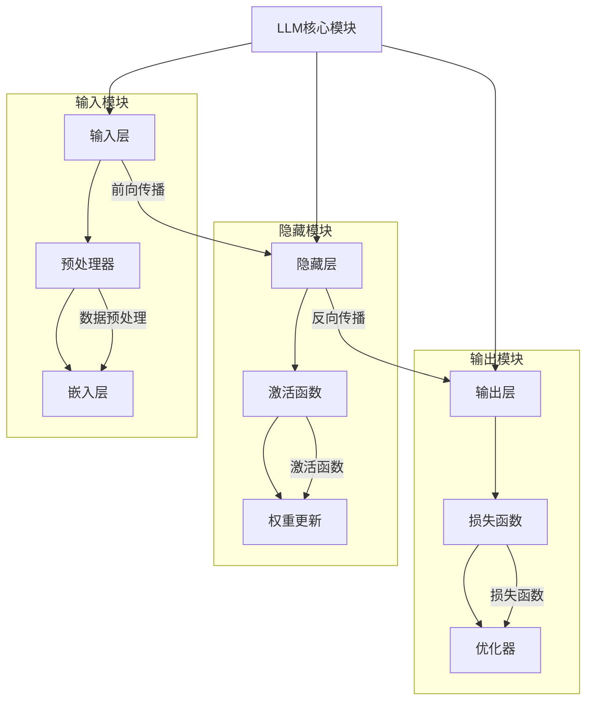

                 

### 文章标题

# LLM:计算机架构的革命性变革

> 关键词：大型语言模型，计算机架构，深度学习，神经网络，Transformer，自然语言处理

> 摘要：本文深入探讨了大型语言模型（LLM）对计算机架构的变革性影响。从背景概述、核心概念、算法原理到实际应用，本文逐步分析了LLM如何通过深度学习和神经网络技术，推动计算机架构的革新，尤其是在自然语言处理领域的应用。通过详细阐述LLM的原理、数学模型、伪代码示例以及实际项目案例，本文旨在为读者提供一个全面、系统、易懂的技术视角，揭示LLM在计算机架构中的革命性作用。

### 《LLM:计算机架构的革命性变革》目录大纲

#### 第一部分：背景与概述

1. 计算机架构的演变
   1.1 传统计算机架构
   1.2 云计算对计算机架构的影响
   1.3 大数据处理对计算机架构的挑战

2. LLM简介
   2.1 什么是LLM
   2.2 LLM的发展历程
   2.3 LLM的优势与局限

#### 第二部分：核心概念与联系

3. LLM的关键原理
   3.1 深度学习基础
   3.2 语言模型基础
   3.3 LLM的工作原理

4. Mermaid流程图：LLM架构解析

#### 第三部分：核心算法原理讲解

5. LLM算法详解
   5.1 词嵌入技术
   5.2 编码器-解码器（Encoder-Decoder）模型
   5.3 Transformer模型
   5.4 深度学习优化算法

6. 伪代码示例：Transformer模型

#### 第四部分：数学模型与公式

7. 数学模型与公式解析

#### 第五部分：项目实战

8. 实际案例与应用
   8.1 LLM在自然语言处理中的应用
   8.2 开发环境搭建
   8.3 源代码实现与分析

#### 附录

9. 资源与工具
   9.1 主流深度学习框架对比
   9.2 其他深度学习资源

### 第一部分：背景与概述

#### 1.1 传统计算机架构

计算机架构的历史可以追溯到上世纪中叶，从最早的电子管计算机发展到今天的集成电路计算机，这一过程中计算机架构经历了多次重大变革。传统计算机架构以冯·诺伊曼体系结构为基础，该架构的核心思想是将程序指令和数据存储在同一存储器中，通过指令的执行来处理数据。这种架构的特点是计算和控制单元分离，指令序列驱动程序的执行，通过内存读写操作来完成数据加工。

传统计算机架构的优势在于其结构简单、易于实现，并且在早期计算机硬件资源有限的情况下，能够高效地完成计算任务。然而，随着计算机硬件的发展，尤其是计算能力的飞速提升，传统计算机架构的局限性也逐渐显现。首先，传统计算机架构的指令驱动模式使得程序执行效率受到限制，难以充分利用现代多核处理器的并行计算能力。其次，数据存储和计算分离的设计使得数据传输成为瓶颈，特别是在大规模数据处理任务中，数据访问速度往往成为性能瓶颈。此外，传统计算机架构在处理复杂、非结构化数据时表现不佳，无法充分利用大数据的优势。

为了解决传统计算机架构的局限性，研究人员提出了多种新型架构，如向量计算机、阵列处理机、并行计算机等。这些新型架构通过并行计算和数据流处理技术，提高了计算机的计算能力和数据处理效率。然而，这些新型架构在实现上也存在一定的挑战，如硬件复杂度增加、编程难度提升等。随着云计算和大数据技术的兴起，传统计算机架构面临着前所未有的挑战和机遇。

#### 1.2 云计算对计算机架构的影响

云计算的兴起对传统计算机架构产生了深远的影响。云计算通过提供虚拟化、分布式和弹性计算资源，改变了传统的IT服务模式，使得计算资源可以按需分配和灵活调度。这种变化对计算机架构提出了新的要求和挑战。

首先，云计算推动了分布式计算架构的发展。在云计算环境中，大量的计算节点通过网络连接在一起，形成一个分布式计算集群。这种架构能够充分利用集群内各个节点的计算能力，实现高效的并行计算。分布式计算架构的出现，使得传统的冯·诺伊曼体系结构难以满足需求，促使新型架构的研究和实现。

其次，云计算带来了数据中心的集中化趋势。传统计算机架构中，数据处理通常分布在多个物理服务器上，而云计算将数据处理集中到数据中心，通过虚拟化和自动化管理技术，实现高效的资源利用和服务交付。这种变化对计算机架构的影响主要体现在数据存储和传输方面，如何确保数据的安全、可靠和高效传输成为关键问题。

此外，云计算还促进了云计算操作系统和虚拟化技术的研发。云计算操作系统负责管理和调度计算资源，提供灵活的部署和扩展能力。虚拟化技术通过虚拟化层将物理硬件与操作系统隔离开来，使得多个操作系统可以运行在同一个物理服务器上，提高了资源利用率和灵活性。

总的来说，云计算对计算机架构的影响主要体现在分布式计算、数据中心集中化、云计算操作系统和虚拟化技术等方面。这些变化为计算机架构的革新提供了新的动力和方向。

#### 1.3 大数据处理对计算机架构的挑战

大数据技术的快速发展给计算机架构带来了前所未有的挑战。大数据具有数据量大、类型多、价值密度低等特点，这对传统计算机架构提出了新的要求。首先，数据处理能力成为关键因素。传统计算机架构在处理大规模数据时，往往面临计算资源不足、处理速度慢等问题。为了应对大数据的处理需求，新型计算机架构需要具备更高的计算能力和处理速度。

其次，存储和传输性能成为瓶颈。大数据不仅数据量大，而且数据类型繁多，包括结构化数据、半结构化数据和非结构化数据。传统计算机架构在数据存储和传输方面存在性能瓶颈，无法满足大数据的存储和访问需求。因此，新型计算机架构需要采用更高效的数据存储和传输技术，如分布式存储系统、高速网络传输协议等。

此外，大数据分析的需求也对计算机架构提出了新的挑战。大数据分析通常涉及复杂的数据处理和分析算法，如机器学习、深度学习等。这些算法对计算机架构的并行计算能力、数据处理速度和存储容量提出了更高的要求。为了满足大数据分析的需求，新型计算机架构需要具备更强的计算能力和更高效的数据处理算法。

总之，大数据处理对计算机架构的影响主要体现在计算能力、存储性能和数据处理算法等方面。这些挑战促使计算机架构不断创新和优化，以应对大数据时代的需求。

#### 2.1 什么是LLM

大型语言模型（LLM，Large Language Model）是一种基于深度学习的语言模型，其核心思想是通过大量文本数据的学习，使模型能够理解和生成自然语言。与传统语言模型相比，LLM具有以下几个显著特点：

首先，LLM的训练数据规模巨大。传统语言模型通常使用数千或数万个样本进行训练，而LLM的训练数据规模可以达到数十亿甚至数万亿个样本。大规模的训练数据使LLM能够学习到更丰富的语言特征，提高模型的准确性和泛化能力。

其次，LLM的参数规模庞大。LLM的参数数量可以达到数十亿甚至数万亿，这使得模型具有更强的表达能力和计算能力。大量的参数可以捕捉到复杂的语言结构和语义信息，从而提高模型在自然语言处理任务中的性能。

第三，LLM具有更强的自适应能力。通过预训练和微调技术，LLM可以快速适应不同的应用场景和任务。预训练过程中，LLM在大量通用数据上学习到丰富的语言知识，微调过程中，LLM根据特定任务的数据进行调整，使模型能够在不同的任务中表现出色。

最后，LLM在多种自然语言处理任务中表现出色。LLM不仅能够完成传统的文本分类、命名实体识别、情感分析等任务，还可以应用于机器翻译、对话系统、文本生成等复杂任务，展现出强大的应用潜力。

总之，LLM通过大规模数据训练、参数规模扩大和自适应能力提升，实现了在自然语言处理领域的突破性进展，成为计算机架构变革的重要推动力量。

#### 2.2 LLM的发展历程

大型语言模型（LLM）的发展历程可以追溯到深度学习和自然语言处理技术的兴起。20世纪50年代，随着计算机科学的发展，人工智能领域开始探索如何使计算机理解和生成自然语言。最初的自然语言处理方法主要依赖于规则和模板匹配，但这些方法在处理复杂和多变的语言时效果不佳。

20世纪80年代，统计语言模型开始崭露头角。基于统计学的自然语言处理方法通过计算文本之间的概率关系，实现了对语言结构的建模。其中，N元语法（N-gram）模型是最早且应用最广泛的统计语言模型。N元语法模型通过前N个单词的概率分布预测下一个单词，这种方法在处理短文本时具有一定的效果，但难以应对长文本和复杂语义的挑战。

进入21世纪，随着深度学习技术的突破，神经网络在自然语言处理中的应用逐渐兴起。深度学习通过多层神经网络结构，能够自动学习到文本中的复杂特征和模式，显著提升了自然语言处理的效果。2003年，由Geoffrey Hinton等人提出的深度置信网络（DBN）是早期深度学习在自然语言处理领域的重要应用之一。DBN通过预训练和层叠训练技术，成功应用于语音识别和图像分类任务，为深度学习在自然语言处理领域奠定了基础。

2013年，由Ian Goodfellow等人提出的生成对抗网络（GAN）开创了深度学习在生成任务中的应用。GAN通过对抗性训练，实现了数据的生成和多样化，这一技术后来被应用于图像生成、语音合成等领域。然而，GAN在自然语言生成任务中的效果尚未达到理想水平。

随着深度学习技术的不断进步，2018年，由OpenAI提出的GPT（Generative Pre-trained Transformer）模型标志着大型语言模型的新里程碑。GPT采用Transformer架构，通过预训练和微调技术，在多种自然语言处理任务中表现出色。GPT-2和GPT-3的发布进一步验证了大型语言模型在理解和生成自然语言方面的强大能力，引发了广泛关注和深入研究。

总之，LLM的发展历程从最初的统计语言模型到现代深度学习模型，经历了多个重要阶段的突破。通过大规模数据训练、先进的神经网络架构和自适应训练技术，LLM实现了对自然语言的深刻理解和灵活生成，成为计算机架构变革的重要推动力量。

#### 2.3 LLM的优势与局限

大型语言模型（LLM）在自然语言处理领域展现了诸多优势，但也存在一定的局限。以下从性能、准确度、自适应能力和资源消耗四个方面详细分析LLM的优势与局限。

首先，从性能角度来看，LLM在处理复杂自然语言任务时表现出色。通过大规模数据训练和先进的神经网络架构，LLM能够自动学习到文本中的深层特征和复杂结构。这种强大的特征学习能力使LLM在文本分类、命名实体识别、情感分析等任务中取得了显著的效果。特别是在长文本处理和多语言处理方面，LLM的优势更加明显。

其次，LLM在准确度方面也具有显著优势。传统的自然语言处理方法往往依赖于规则和模板匹配，而LLM通过深度学习技术能够更好地理解和生成自然语言。在许多实际应用场景中，LLM的准确度已经超过了人类水平，例如机器翻译、问答系统和文本生成等。此外，LLM的准确度随着训练数据的增加和模型参数的增多而不断提高，这为其在多个领域中的应用提供了可靠的基础。

第三，LLM具备强大的自适应能力。通过预训练和微调技术，LLM可以在多种应用场景中快速适应和调整。预训练过程中，LLM在大量通用数据上学习到丰富的语言知识，微调过程中，LLM根据特定任务的数据进行调整，使模型能够在不同的任务中表现出色。这种灵活的自适应能力使得LLM在多种自然语言处理任务中具有广泛的应用潜力。

然而，LLM也存在一定的局限。首先，在资源消耗方面，LLM的训练和推理过程需要大量的计算资源和存储空间。特别是在训练大型LLM模型时，需要使用高性能计算设备和分布式计算资源。这导致LLM的应用成本较高，限制了其在某些领域的普及和应用。

其次，LLM在处理非结构化数据时存在一定的局限性。虽然LLM能够处理大量的文本数据，但其在理解复杂和抽象的语义信息方面仍有不足。特别是在处理多义词、隐喻和语境依赖等语言现象时，LLM的表现可能不如人类。此外，LLM在处理实时数据时也存在延迟问题，需要进一步优化和改进。

最后，LLM的可解释性较差。深度学习模型通常被认为是“黑箱”，其内部决策过程难以理解和解释。这使得在使用LLM进行决策时，用户难以了解模型的推理过程和依据，增加了模型的风险和不确定性。尽管研究人员正在探索可解释性方法，如注意力机制和可视化技术，但在短期内，LLM的可解释性仍然是一个挑战。

总之，LLM在自然语言处理领域展现了诸多优势，但也存在一定的局限。通过不断优化和改进，LLM有望在更多领域发挥重要作用，推动计算机架构的变革。

#### 3.1 深度学习基础

深度学习（Deep Learning）是人工智能（AI）领域的一个重要分支，其核心思想是通过多层神经网络模型自动提取数据中的特征和模式。深度学习的基础可以追溯到神经网络的发展历程，从简单的单层感知器到复杂的深层神经网络，经历了多次技术突破和理论完善。

首先，我们需要了解神经网络的基本概念。神经网络由一系列相互连接的节点（或称为神经元）组成，每个节点接收来自前一层节点的输入信号，并通过激活函数产生输出信号。神经网络的训练过程实际上是一个优化过程，通过调整网络中的权重和偏置，使得网络能够对输入数据进行正确分类或预测。

深度学习的关键在于多层神经网络结构。多层神经网络通过堆叠多个隐藏层，能够自动学习到数据中的深层次特征和复杂模式。每个隐藏层都从前一层提取特征，并通过非线性变换传递给下一层。这种层次化的特征提取方式使得神经网络能够处理高维、复杂的数据。

在深度学习模型中，常见的神经网络结构包括卷积神经网络（CNN）、循环神经网络（RNN）和Transformer等。卷积神经网络（CNN）主要应用于图像处理任务，通过卷积层和池化层提取图像的特征。循环神经网络（RNN）适用于序列数据处理，如自然语言处理和语音识别，通过循环结构处理序列中的上下文信息。Transformer模型是近年来在自然语言处理领域取得突破性成果的模型，其核心思想是自注意力机制，通过全局关注序列中的每个元素，实现高效的序列建模。

深度学习模型的学习过程通常包括两个主要步骤：前向传播和反向传播。前向传播过程中，输入数据从网络的输入层经过逐层计算，最终得到输出。反向传播过程中，通过计算损失函数对梯度进行反向传播，并利用梯度下降等优化算法更新网络权重，使得模型在训练数据上达到更好的性能。

总之，深度学习基础包括神经网络的结构、学习过程和常见神经网络模型。通过多层神经网络结构，深度学习能够自动提取数据中的特征和模式，为人工智能领域带来了革命性的变化。

##### 3.1.1 神经网络

神经网络（Neural Network，简称NN）是深度学习的基础，其灵感来源于人脑神经元的工作原理。一个简单的神经网络由输入层、一个或多个隐藏层以及输出层组成。每个层包含多个节点，这些节点通过权重连接形成网络结构。

**1. 输入层（Input Layer）**

输入层接收外部输入数据，并将其传递给隐藏层。每个输入节点对应数据中的一个特征，例如图像中的像素值、文本中的单词等。

**2. 隐藏层（Hidden Layer）**

隐藏层位于输入层和输出层之间，负责对输入数据进行特征提取和变换。每个隐藏层的节点通过前一层节点的加权求和，加上一个偏置项，通过激活函数产生输出。多个隐藏层可以堆叠在一起，形成深层神经网络，以提取更高层次的特征。

**3. 输出层（Output Layer）**

输出层负责将隐藏层提取的特征转化为最终的结果。例如，在分类任务中，输出层的节点通常对应不同的类别，通过激活函数（如softmax函数）输出每个类别的概率分布。

**4. 激活函数（Activation Function）**

激活函数是神经网络中的一个关键组件，它为每个节点提供非线性变换，使得神经网络能够学习到复杂的特征。常见的激活函数包括Sigmoid函数、ReLU函数和Tanh函数。这些函数能够引入非线性，使得神经网络具有更强的拟合能力。

**5. 权重（Weights）和偏置（Bias）**

权重和偏置是神经网络中的参数，用于调节节点之间的连接强度。在训练过程中，通过优化算法（如梯度下降）调整权重和偏置，使得神经网络能够在训练数据上达到更好的性能。

**6. 前向传播（Forward Propagation）**

在前向传播过程中，输入数据从输入层逐层传递到输出层，每个节点通过加权求和和激活函数产生输出。前向传播的过程可以看作是数据在神经网络中的流动，通过每一层的变换，逐步提取出更复杂的特征。

**7. 反向传播（Backpropagation）**

反向传播是深度学习训练的核心过程，通过计算损失函数对网络权重和偏置进行更新。反向传播的过程包括以下几个步骤：

- **计算梯度**：根据损失函数对每个参数计算梯度，表示参数对损失函数的影响程度。
- **权重更新**：使用优化算法（如梯度下降）更新权重和偏置，使得模型在训练数据上达到更好的性能。
- **重复迭代**：重复前向传播和反向传播的过程，逐步减小损失函数，提高模型的泛化能力。

通过以上步骤，神经网络能够不断调整权重和偏置，优化模型的性能，从而实现对数据的分类、回归或其他复杂任务的处理。

总之，神经网络通过输入层、隐藏层和输出层的结构，结合激活函数、权重和偏置等组件，实现数据的特征提取和模式识别。前向传播和反向传播的过程使得神经网络能够通过学习样本数据，不断优化自身的参数，从而实现复杂的任务。

##### 3.1.2 反向传播算法

反向传播算法（Backpropagation Algorithm）是深度学习训练过程中至关重要的一步，它通过计算损失函数对网络参数的梯度，并利用这些梯度更新网络权重和偏置，从而优化模型的性能。反向传播算法的原理可以概括为以下几个步骤：

**1. 前向传播**

首先，将输入数据传递到网络的输入层，然后逐层传递到隐藏层，最后到达输出层。在每个节点，通过加权求和加上偏置项，通过激活函数产生输出。这一过程称为前向传播。前向传播过程中，每个节点的输出值是前一层节点输出的线性组合，并经过激活函数处理后得到。

**2. 计算损失**

在输出层，计算实际输出与预期输出之间的误差，通常使用均方误差（Mean Squared Error, MSE）或交叉熵（Cross-Entropy）作为损失函数。损失函数反映了模型预测结果与真实结果之间的差距，其值越小，表示模型性能越好。

**3. 计算梯度**

接下来，通过反向传播算法计算损失函数对每个参数的梯度。梯度表示参数对损失函数的影响程度，是参数调整的方向。计算梯度的过程从输出层开始，逐层反向传播到输入层。具体步骤如下：

- **输出层到隐藏层**：计算每个节点的误差，并计算每个参数的梯度。对于输出层，误差可以直接计算，而对于隐藏层，误差需要通过链式法则逐层传递。
- **激活函数的导数**：在计算梯度时，需要使用激活函数的导数。常见的激活函数如ReLU、Sigmoid、Tanh等，它们的导数分别为1、\( \frac{1}{1 + e^{-x}} \)、\( \frac{1}{cosh(x)} \)等。
- **链式法则**：使用链式法则将输出层的误差传递到隐藏层，确保每个参数的梯度是正确累积的。

**4. 参数更新**

使用计算得到的梯度，通过优化算法（如梯度下降、Adam等）更新网络参数。参数更新的目标是减小损失函数的值，从而优化模型的性能。更新公式如下：

\[ \theta_{\text{new}} = \theta_{\text{old}} - \alpha \frac{\partial J(\theta)}{\partial \theta} \]

其中，\( \theta \)代表参数，\( \alpha \)是学习率，\( \frac{\partial J(\theta)}{\partial \theta} \)是损失函数对参数的梯度。

**5. 重复迭代**

重复前向传播和反向传播的过程，不断更新网络参数，直到模型收敛或达到预设的迭代次数。每次迭代后，模型对训练数据的拟合度会提高，损失函数的值会减小。

总之，反向传播算法通过计算损失函数对网络参数的梯度，并利用这些梯度更新网络权重和偏置，使得模型能够不断优化自身的性能。这一过程需要多次迭代，通过不断调整参数，最终实现高精度的预测和分类。

##### 3.1.3 深度学习框架

深度学习框架（Deep Learning Framework）是实施和优化深度学习算法的工具集合，它提供了高效的计算图构建、自动微分、参数优化等关键功能。目前，主流的深度学习框架包括TensorFlow、PyTorch和JAX等，它们各自具有独特的优势和特点。

**TensorFlow**是由Google开发的开源深度学习框架，它采用了静态计算图（Static Computational Graph）的设计理念。在TensorFlow中，用户首先构建计算图，将输入数据、模型参数和操作节点连接起来，然后通过执行计算图进行模型训练和推理。TensorFlow的优势在于其强大的生态系统和广泛的社区支持，使得用户可以轻松集成各种预训练模型和工具。此外，TensorFlow提供了丰富的API，支持多种编程语言，包括Python、C++和Java，方便用户在不同平台上开发和部署深度学习应用。

**PyTorch**是由Facebook AI Research（FAIR）开发的开源深度学习框架，它采用了动态计算图（Dynamic Computational Graph）的设计理念。在PyTorch中，用户可以直接通过Python代码构建和修改计算图，使得开发过程更加灵活和直观。动态计算图的优势在于其能够更好地支持研究人员的实验和迭代，特别是在探索新型模型和算法时。此外，PyTorch还提供了丰富的内置函数和模块，支持包括卷积神经网络（CNN）、循环神经网络（RNN）和Transformer等在内的多种深度学习模型。PyTorch在学术界和工业界都拥有广泛的用户基础，成为了深度学习领域的重要工具。

**JAX**是由Google开发的开源深度学习框架，它结合了静态计算图和自动微分（Automatic Differentiation）的优势。JAX采用了静态计算图的设计，但与TensorFlow不同，JAX使用NumPy数组作为主要数据结构，这使得它在处理大规模数据时具有更高的效率和灵活性。JAX的自动微分功能使得用户可以轻松计算梯度，无需手动编写复杂的微分代码。此外，JAX还提供了高效的线性代数库和优化器，支持包括深度神经网络、图神经网络和量子神经网络等多种深度学习模型。JAX在科学计算和机器学习领域都得到了广泛应用，尤其在需要进行大规模分布式训练和推理时，其优势更加明显。

**比较与选择**：

选择深度学习框架时，需要考虑多个因素，如开发难度、性能需求、社区支持和生态系统等。

- **开发难度**：TensorFlow和PyTorch具有较高的开发难度，尤其是对于初学者来说。而JAX由于其NumPy接口，使得开发过程相对简单和直观。
- **性能需求**：在处理大规模数据和复杂模型时，JAX具有更高的性能，尤其是在分布式训练和推理方面。TensorFlow和PyTorch在性能上也相当优秀，但具体选择取决于具体应用场景。
- **社区支持**：TensorFlow和PyTorch拥有庞大的社区支持，提供了丰富的预训练模型、工具和教程，方便用户快速上手。JAX的社区相对较小，但在快速发展中，其资源也在逐渐丰富。
- **生态系统**：TensorFlow和PyTorch的生态系统非常成熟，支持多种编程语言和平台，方便用户在不同环境中部署和应用深度学习模型。JAX虽然生态系统较小，但其在高性能计算和科学计算领域具有独特优势。

总之，深度学习框架的选择应根据具体需求进行权衡。无论选择哪个框架，深度学习框架都为研究人员和开发者提供了强大的工具和平台，使得深度学习算法的应用变得更加广泛和高效。

##### 3.2.1 语言模型的概念

语言模型（Language Model，简称LM）是自然语言处理（Natural Language Processing，简称NLP）领域的一个重要基础。语言模型的主要目标是通过对大量文本数据的学习，预测自然语言中下一个词或字符的概率分布。这种概率分布可以用于许多NLP任务，如文本分类、机器翻译、语音识别和文本生成等。

语言模型的核心概念可以概括为以下几个方面：

1. **概率预测**：语言模型通过统计方法学习文本数据中的概率关系，从而预测下一个词或字符的概率。这种预测过程基于文本数据中的统计规律，如频率统计、条件概率和语言模型得分等。

2. **概率分布**：语言模型输出的是一个概率分布，表示在特定上下文环境下，每个可能的词或字符出现的概率。这种概率分布可以帮助模型在生成文本或进行推理时，选择最合适的词或字符。

3. **上下文依赖**：语言模型不仅考虑单个词或字符的频率，还考虑上下文环境对词或字符的影响。例如，在一个句子中，同一个词在不同的上下文中可能有不同的意义和用法，语言模型需要通过上下文信息来准确预测。

4. **训练数据**：语言模型的训练依赖于大量的文本数据。这些数据可以是已标注的数据集，也可以是未标注的文本数据。通过训练，语言模型可以学习到文本中的统计规律和语言特征，从而提高预测的准确性和泛化能力。

语言模型根据其预测粒度，可以分为词级语言模型和字符级语言模型。词级语言模型以词为单位进行预测，而字符级语言模型以字符为单位进行预测。词级语言模型通常更容易实现和优化，并且在许多NLP任务中表现良好。字符级语言模型在处理某些特定任务时具有优势，例如拼写纠错和文本生成。

总之，语言模型是自然语言处理领域的一个重要工具，通过预测文本中下一个词或字符的概率分布，它为许多NLP任务提供了基础支持。随着深度学习技术的发展，语言模型在性能和灵活性方面取得了显著提升，成为NLP领域中不可或缺的一部分。

##### 3.2.2 语言模型的类型

语言模型（Language Model，简称LM）根据其预测粒度和训练方法，可以分为多种类型。每种类型的语言模型都有其独特的特点和适用场景。以下将详细介绍几种常见的语言模型类型。

1. **N元语法模型（N-gram Model）**

N元语法模型是最早且应用最广泛的统计语言模型。该模型基于前N个单词（或字符）的概率分布来预测下一个单词（或字符）。例如，对于二元语法模型（Bigram Model），它通过计算两个连续单词出现的频率来预测下一个单词。N元语法模型的主要优点是计算简单，实现容易，能够处理短文本的预测任务。然而，N元语法模型的局限性在于其无法捕捉长距离的上下文依赖关系，导致在长文本预测任务中表现不佳。

2. **隐马尔可夫模型（Hidden Markov Model，HMM）**

隐马尔可夫模型（HMM）是一种基于概率模型的统计语言模型，主要用于序列数据的建模。HMM通过隐变量（如状态序列）来表示文本中的上下文信息，通过条件概率分布来预测下一个状态（或单词）。HMM在语音识别、语音合成和文本分类等任务中得到了广泛应用。其优点是能够处理不确定性和时序依赖关系，缺点是参数估计复杂且计算量较大。

3. **循环神经网络（Recurrent Neural Network，RNN）**

循环神经网络（RNN）是一种基于神经网络的语言模型，特别适用于序列数据的建模。RNN通过循环结构保留信息，使得模型能够捕捉到长距离的上下文依赖关系。RNN在自然语言处理任务中表现出色，例如机器翻译、文本生成和语音识别等。然而，传统的RNN存在梯度消失和梯度爆炸问题，导致训练困难。

4. **长短时记忆网络（Long Short-Term Memory，LSTM）**

长短时记忆网络（LSTM）是RNN的一种改进模型，专门设计来解决传统RNN的梯度消失和梯度爆炸问题。LSTM通过引入门控机制，可以有效地保留和遗忘长期依赖信息，从而在长文本预测任务中表现出色。LSTM在机器翻译、文本生成和语音识别等领域得到了广泛应用。

5. **门控循环单元（Gated Recurrent Unit，GRU）**

门控循环单元（GRU）是另一种改进的RNN模型，相对于LSTM，GRU简化了结构，减少了参数数量，但在性能上与LSTM相当。GRU通过更新门和重置门来控制信息流动，使得模型能够高效地捕捉长距离依赖关系。GRU在文本生成、序列预测和时间序列分析等任务中表现出良好的效果。

6. **Transformer模型**

Transformer模型是近年来在自然语言处理领域取得突破性成果的模型。Transformer采用了自注意力机制（Self-Attention），使得模型能够全局关注序列中的每个元素，从而有效捕捉长距离依赖关系。与传统的RNN和LSTM相比，Transformer在处理长文本任务时具有显著的优势。Transformer模型在机器翻译、文本生成和问答系统等任务中取得了卓越的性能。

总之，语言模型根据其预测粒度和训练方法，可以分为多种类型。每种语言模型都有其独特的特点和适用场景。随着深度学习技术的发展，这些语言模型在自然语言处理任务中得到了广泛应用，并不断推动着NLP领域的进步。

##### 3.2.3 语言模型的训练过程

语言模型的训练过程是自然语言处理（NLP）中的关键步骤，其目标是使模型能够准确预测文本中的下一个词或字符。以下是语言模型训练过程的详细解析。

**1. 数据准备**

首先，需要准备大量的文本数据作为训练集。这些数据可以来自各种来源，如书籍、新闻、社交媒体等。为了保证模型的泛化能力，训练集应包含多样化的文本内容。在实际应用中，通常会使用预处理的文本数据，例如去除标点符号、进行词干提取和词性标注等。

**2. 数据预处理**

在训练前，需要对文本数据进行预处理，以便模型能够有效学习。常见的预处理步骤包括：

- **分词**：将文本分割成单词或子词，这是语言模型学习的基础。
- **词向量化**：将每个单词或子词映射到一个高维向量表示，词向量能够捕捉词的语义信息。
- **构建词汇表**：将所有出现的单词或子词构建成一个词汇表，并为每个词分配一个唯一的索引。
- **序列编码**：将文本序列编码为数字序列，每个数字表示词汇表中的某个词或子词。

**3. 训练模型**

语言模型的训练过程主要包括以下几个步骤：

- **初始化模型参数**：随机初始化模型参数，包括权重和偏置。
- **前向传播**：将输入数据传递到语言模型中，计算模型的输出概率分布。对于每个输入词或子词，模型会根据当前状态和之前的学习结果生成下一个词或子词的概率分布。
- **计算损失**：计算模型输出概率分布与真实输出之间的差距，通常使用交叉熵（Cross-Entropy）作为损失函数。损失函数反映了模型预测结果与真实结果之间的误差，是评估模型性能的重要指标。
- **反向传播**：通过反向传播算法计算损失函数对模型参数的梯度，并利用这些梯度更新模型参数。反向传播是深度学习训练的核心步骤，通过不断更新参数，使得模型在训练数据上达到更好的性能。
- **优化参数**：使用优化算法（如梯度下降、Adam等）更新模型参数，使得模型能够在训练数据上减小损失函数的值。

**4. 调整模型**

在训练过程中，需要不断调整模型的结构和参数，以提高模型的性能。常见的调整方法包括：

- **增加隐藏层和神经元**：增加模型的层数和神经元数量，可以提升模型的表达能力，捕捉更复杂的特征。
- **调整学习率**：调整学习率可以优化模型参数更新的速度和稳定性，避免过拟合和欠拟合。
- **数据增强**：通过数据增强（如随机删除单词、添加噪声等）增加训练数据的多样性，提升模型的泛化能力。

**5. 模型评估**

在训练完成后，需要对模型进行评估，以验证其性能。常见的评估指标包括：

- **准确率**：模型预测正确的词或字符的比例。
- **召回率**：模型能够召回正确词或字符的比例。
- **F1值**：综合考虑准确率和召回率的一个指标，计算公式为 \( F1 = 2 \times \frac{准确率 \times 召回率}{准确率 + 召回率} \)。
- **交叉熵损失**：模型在训练和测试数据上的交叉熵损失值。

通过以上步骤，语言模型可以不断优化和调整，最终在自然语言处理任务中表现出良好的性能。训练过程不仅依赖于算法和参数的调整，还需要大量的数据和计算资源支持。

总之，语言模型的训练过程包括数据准备、预处理、模型训练、调整和评估等多个环节。通过这些步骤，语言模型能够学习到文本中的特征和模式，从而实现准确的预测和生成。随着深度学习技术的发展，语言模型在自然语言处理中的应用越来越广泛，不断推动着NLP领域的进步。

##### 3.3.1 模型结构

大型语言模型（LLM）的模型结构是其核心组成部分，它决定了模型的学习能力和应用效果。LLM的模型结构通常基于深度神经网络（Deep Neural Network，DNN），通过多层神经网络结构自动提取文本数据中的复杂特征和模式。以下是对LLM模型结构的详细解析：

**1. 层次结构**

LLM的层次结构通常包括输入层、若干隐藏层和输出层。输入层接收外部输入数据，如文本序列、单词或字符。隐藏层位于输入层和输出层之间，负责对输入数据进行特征提取和变换。输出层则生成最终的结果，如文本生成、分类或翻译等。

**2. 输入层**

输入层是LLM的第一个层次，它接收原始的文本数据。在预处理过程中，文本数据会被转化为数字序列，每个数字表示词汇表中的某个词或字符。输入层将接收的数字序列传递给隐藏层，为后续的特征提取和变换做准备。

**3. 隐藏层**

隐藏层是LLM的核心部分，负责对输入数据进行特征提取和变换。隐藏层通常包含多个子层，每个子层都通过非线性变换提取不同层次的特征。多层隐藏层可以逐层捕捉文本数据中的复杂结构，从而实现高精度的文本理解和生成。

**4. 激活函数**

在隐藏层中，每个节点都会通过激活函数产生输出。常见的激活函数包括ReLU（Rectified Linear Unit）、Sigmoid和Tanh等。激活函数引入非线性，使得神经网络能够学习到文本中的复杂特征和模式。

**5. 自注意力机制**

自注意力机制（Self-Attention）是LLM模型中的一个关键组件，它允许模型在生成文本时全局关注序列中的每个元素。自注意力机制通过计算序列中每个元素的重要性权重，使得模型能够更有效地捕捉长距离依赖关系。自注意力机制是Transformer模型的核心组成部分，对于提升LLM的性能至关重要。

**6. 输出层**

输出层是LLM的最后一个层次，它负责生成最终的输出结果。在文本生成任务中，输出层会根据当前状态和模型的学习结果，生成下一个词或字符的概率分布。常见的输出层设计包括全连接层（Fully Connected Layer）和softmax层等。

**7. 梯度下降**

在训练过程中，LLM通过反向传播算法（Backpropagation）计算损失函数对模型参数的梯度，并利用这些梯度更新模型参数。梯度下降是一种常见的优化算法，通过调整模型参数，使得模型在训练数据上达到更好的性能。

**8. 权重共享**

在LLM的模型结构中，权重共享（Weight Sharing）是一种常用的技术。通过权重共享，模型在不同层次和不同层之间共享权重参数，从而减少参数数量，提高模型的泛化能力和计算效率。

总之，LLM的模型结构是一个多层深度神经网络，通过输入层、隐藏层和输出层的结构，结合自注意力机制和梯度下降等组件，实现文本数据的高效特征提取和模式识别。这种模型结构使得LLM在自然语言处理任务中表现出强大的性能和灵活性。

##### 3.3.2 训练与优化

训练和优化是构建大型语言模型（LLM）的关键环节，通过有效的训练过程和优化策略，模型能够学习到丰富的语言特征，从而在自然语言处理任务中表现出卓越的性能。以下是LLM的训练与优化过程的详细解析。

**1. 训练过程**

LLM的训练过程主要包括以下几个步骤：

- **数据准备**：首先，需要准备大量的文本数据作为训练集。这些数据可以来自各种来源，如书籍、新闻、社交媒体等。为了提高模型的泛化能力，训练集应包含多样化的文本内容。
- **数据预处理**：在训练前，需要对文本数据进行预处理，以便模型能够有效学习。常见的预处理步骤包括分词、词向量化、构建词汇表等。
- **初始化模型参数**：随机初始化模型参数，包括权重和偏置。
- **前向传播**：将输入数据传递到LLM中，计算模型的输出概率分布。对于每个输入词或子词，模型会根据当前状态和之前的学习结果生成下一个词或子词的概率分布。
- **计算损失**：计算模型输出概率分布与真实输出之间的差距，通常使用交叉熵（Cross-Entropy）作为损失函数。
- **反向传播**：通过反向传播算法计算损失函数对模型参数的梯度，并利用这些梯度更新模型参数。
- **优化参数**：使用优化算法（如梯度下降、Adam等）更新模型参数，使得模型能够在训练数据上减小损失函数的值。
- **重复迭代**：重复前向传播和反向传播的过程，不断更新模型参数，直到模型收敛或达到预设的迭代次数。

**2. 优化策略**

为了提高训练效率和模型性能，可以采用以下优化策略：

- **学习率调整**：学习率是梯度下降算法中的一个关键参数，它决定了参数更新的步长。通常，学习率需要随着训练过程逐渐减小，以避免模型过早收敛。常用的策略包括线性递减、指数递减和自适应调整等。
- **批量大小**：批量大小是每次训练中使用的数据样本数量。较小的批量大小可以减少计算资源需求，但可能导致训练不稳定。较大的批量大小可以提高训练稳定性，但计算资源需求较高。
- **正则化**：正则化（Regularization）是一种防止模型过拟合的技术。常见的正则化方法包括L1正则化、L2正则化和Dropout等。
- **数据增强**：数据增强（Data Augmentation）是通过添加噪声、随机删除单词等手段增加训练数据的多样性，从而提高模型的泛化能力。
- **模型蒸馏**：模型蒸馏（Model Distillation）是一种将大型模型的知识传递给小型模型的技术。通过将大型模型的输出传递给小型模型，使得小型模型能够学习到大型模型的知识，从而提高模型的性能。

**3. 训练技巧**

在实际训练过程中，可以采用以下技巧提高模型性能：

- **预训练**：预训练（Pre-training）是一种在大规模通用数据集上训练模型的方法，通过预训练，模型可以学习到丰富的语言特征和模式。预训练完成后，模型可以在特定任务上进行微调（Fine-tuning），从而提高任务性能。
- **多任务学习**：多任务学习（Multi-task Learning）是一种同时训练多个任务的方法，通过共享模型参数，模型可以同时学习到多个任务的特征，从而提高模型的泛化能力。
- **自监督学习**：自监督学习（Self-supervised Learning）是一种不需要人工标注数据的方法，通过利用未标注的数据，模型可以自我监督地学习到语言特征和模式。
- **迁移学习**：迁移学习（Transfer Learning）是一种将大型模型的知识应用到小型模型的方法，通过在大型模型的基础上进行微调，小型模型可以快速学习到任务知识，从而提高任务性能。

总之，训练和优化是构建大型语言模型的关键步骤，通过有效的训练过程和优化策略，模型能够学习到丰富的语言特征，从而在自然语言处理任务中表现出卓越的性能。随着深度学习技术的发展，训练和优化方法也在不断改进，为LLM的广泛应用提供了坚实基础。

#### 3.3.3 应用场景

大型语言模型（LLM）凭借其强大的特征提取能力和自适应能力，在自然语言处理（NLP）领域展现出了广泛的应用前景。以下是LLM在几个典型应用场景中的具体应用实例：

**1. 问答系统**

问答系统（Question Answering System）是LLM的一个重要应用场景。LLM可以通过对大量文本数据的预训练，学习到丰富的语言特征和知识，从而在给定的查询条件下，从大量文本中准确提取出答案。例如，在搜索引擎中，LLM可以帮助提高搜索结果的准确性，通过理解用户查询的语义，返回最相关的答案。此外，LLM还可以应用于智能客服系统，通过理解用户的问题，提供即时、准确的回答，提升用户体验。

**2. 语言翻译**

语言翻译（Machine Translation）是另一项LLM的重要应用。LLM可以通过大规模双语语料库的训练，学习到不同语言之间的语义对应关系。例如，在机器翻译任务中，LLM可以将源语言的句子映射到目标语言的句子，实现准确、流畅的翻译。近年来，随着Transformer模型的广泛应用，LLM在翻译任务中的表现显著提升，特别是在长句子和复杂语法结构翻译方面，表现出色。LLM的应用使得机器翻译技术更加智能化，提高了翻译质量和速度。

**3. 文本生成**

文本生成（Text Generation）是LLM的另一个关键应用领域。LLM可以通过对大量文本数据的预训练，学习到语言生成规则和模式，从而生成高质量的文本。例如，在内容创作方面，LLM可以帮助自动生成文章、故事、摘要等。此外，LLM还可以应用于自动写作辅助工具，如写作机器人，帮助用户快速生成文本内容。在创意写作和广告文案生成等领域，LLM的应用大大提高了内容创作的效率和多样性。

**4. 文本分类**

文本分类（Text Classification）是LLM在NLP中的另一个重要应用。LLM可以通过对大量分类数据的训练，学习到不同类别文本的特征，从而实现高效、准确的文本分类。例如，在社交媒体分析中，LLM可以帮助对用户发布的文本进行情感分类，判断其情绪倾向。此外，LLM还可以应用于新闻分类、垃圾邮件过滤等任务，通过识别文本中的关键特征，实现高效、准确的分类。

**5. 对话系统**

对话系统（Dialogue System）是LLM的又一重要应用领域。LLM可以通过对大量对话数据的训练，学习到对话生成和回复的规则和模式，从而实现智能对话交互。例如，在智能客服系统中，LLM可以帮助构建对话模型，通过理解用户的问题和意图，生成合适的回答。此外，LLM还可以应用于聊天机器人、虚拟助手等，提供自然、流畅的对话体验。

**6. 自动摘要**

自动摘要（Automatic Summarization）是LLM在文本处理中的一个重要应用。LLM可以通过对大量摘要文本的训练，学习到文本摘要的规则和模式，从而生成简洁、准确的文本摘要。例如，在新闻摘要中，LLM可以帮助自动生成新闻的摘要，提高信息获取的效率。此外，LLM还可以应用于长文本摘要、会议记录摘要等任务，通过提取关键信息和主旨，生成高质量的摘要。

总之，LLM在自然语言处理领域展现出了广泛的应用前景。通过在不同应用场景中的具体应用，LLM不仅提高了NLP任务的性能和效率，还推动了计算机架构的变革，为人工智能技术的发展注入了新的动力。

##### 4. Mermaid流程图：LLM架构解析

以下是大型语言模型（LLM）的Mermaid流程图，用于解析LLM的核心模块及其工作流程。



该流程图展示了LLM的主要模块及其交互关系：

- **输入模块**：包括输入层（B）、预处理器（E）和嵌入层（H）。输入层接收外部输入数据，预处理器对输入数据进行预处理，嵌入层将输入数据转换为嵌入向量。
- **隐藏模块**：包括隐藏层（C）、激活函数（F）和权重更新（I）。隐藏层负责对嵌入向量进行特征提取，激活函数引入非线性变换，权重更新通过反向传播算法调整网络参数。
- **输出模块**：包括输出层（D）、损失函数（G）和优化器（J）。输出层生成预测结果，损失函数计算预测结果与真实结果的差距，优化器通过梯度下降等算法更新模型参数。

通过这个流程图，可以清晰地理解LLM的工作原理和结构，有助于进一步分析和优化模型的性能。

##### 5.1.1 词嵌入技术

词嵌入（Word Embedding）技术是大型语言模型（LLM）中的核心组成部分，它将文本中的单词或子词映射到高维向量空间，以捕捉词的语义信息。词嵌入技术不仅提升了语言模型在自然语言处理（NLP）任务中的性能，还为深度学习模型提供了有效的输入表示。以下将详细介绍几种常见的词嵌入技术。

**1. Word2Vec**

Word2Vec是最早且最广泛使用的词嵌入技术之一，由Tomas Mikolov等人提出。Word2Vec技术基于神经网络模型，通过预测单词的上下文来学习词向量。Word2Vec主要有两种实现方法：连续词袋（Continuous Bag of Words，CBOW）和Skip-Gram。

- **CBOW（Continuous Bag of Words）**：CBOW模型通过预测中心词周围多个上下位词的词向量平均值来学习词向量。具体来说，对于每个中心词，模型会考虑其上下文中的多个单词，将这些单词的词向量平均得到中心词的词向量。CBOW模型的优点在于对高频词的表示较为准确，但其对低频词的表现较差。

- **Skip-Gram（SG）**：Skip-Gram模型与CBOW模型相反，它是通过预测中心词的词向量来学习上下文词向量。对于每个中心词，模型会考虑其上下文中的多个单词，并分别预测这些单词的词向量。Skip-Gram模型的优点在于对低频词的表示效果较好，但计算量相对较大。

**2. GloVe**

GloVe（Global Vectors for Word Representation）是由Jeffrey Pennington等人提出的另一种词嵌入技术，它通过矩阵分解方法学习词向量。GloVe模型的核心思想是同时考虑词频和词之间的共现关系，从而学习到更加合理的词向量。

GloVe模型的主要步骤如下：

- **计算词频矩阵**：首先，计算每个词在语料库中的词频，得到一个词频矩阵，其中每个元素表示两个词之间的共现次数。
- **构建共现矩阵**：基于词频矩阵，计算词之间的共现矩阵，共现矩阵中的每个元素表示两个词在窗口大小内同时出现的次数。
- **矩阵分解**：使用矩阵分解方法（如奇异值分解），将共现矩阵分解为两个低秩矩阵，这两个矩阵分别表示词向量和权重向量。
- **归一化**：对词向量进行归一化处理，使得词向量的长度为1，从而保证词向量的正交性。

**3. FastText**

FastText是由Pierre and Léon Bottou提出的一种改进的词嵌入技术，它在GloVe的基础上进行了优化，旨在提高词嵌入的效率。FastText的核心思想是引入词向量集合和字符级别的嵌入，通过组合单词的不同部分（如前缀、后缀和字符）来学习词向量。

FastText的主要步骤如下：

- **构建词向量集合**：将单词划分为不同的部分（如字符、字根和子词），并为每个部分学习独立的词向量。
- **组合词向量**：将不同部分的词向量组合起来，形成单词的最终词向量。
- **优化算法**：FastText采用了基于梯度下降的优化算法，通过迭代计算来更新词向量。

总之，词嵌入技术是LLM中不可或缺的一环，通过将文本中的单词映射到高维向量空间，词嵌入技术能够有效捕捉词的语义信息，为深度学习模型提供有效的输入表示。Word2Vec、GloVe和FastText等词嵌入技术各有优缺点，适用于不同的应用场景，推动了NLP技术的发展。

##### 5.1.2 编码器-解码器（Encoder-Decoder）模型

编码器-解码器（Encoder-Decoder）模型是深度学习中用于序列转换任务的一种经典模型，如机器翻译、问答系统等。该模型通过编码器（Encoder）和解码器（Decoder）两个主要组件，实现了输入序列到输出序列的映射。以下是编码器-解码器模型的详细介绍：

**1. 编码器（Encoder）**

编码器的任务是将输入序列编码为一个固定长度的向量，称为上下文向量（Context Vector）或编码输出（Encoded Output）。编码器通常由一个或多个循环神经网络（RNN）层组成，如LSTM或GRU，可以捕捉序列中的长期依赖关系。编码器的工作步骤如下：

- **初始化**：将输入序列的每个单词或字符映射到词向量或字符向量，并将其作为编码器的输入。
- **编码**：通过编码器网络逐层传递输入序列，每个时间步的输出被传递到下一个时间步。编码器通过记忆单元（如LSTM或GRU的隐藏状态）保存和更新信息，使得模型能够捕捉序列中的长期依赖关系。
- **输出**：编码器在最后一个时间步产生一个固定长度的编码输出，该输出代表了整个输入序列的上下文信息。

**2. 解码器（Decoder）**

解码器的任务是根据编码器的输出序列生成目标输出序列。解码器通常也由一个或多个循环神经网络层组成，并在每个时间步生成一个单词或字符的预测。解码器的工作步骤如下：

- **初始化**：解码器在第一个时间步初始化为空，并在输出层生成一个起始符号（如 `<start>`），作为解码器的输入。
- **解码**：解码器从起始符号开始，逐层传递输出，并生成每个时间步的预测。在解码过程中，解码器会使用编码器的输出作为上下文信息，通过注意力机制（Attention Mechanism）关注输入序列的不同部分。
- **预测**：解码器在每个时间步生成一个单词或字符的预测，并将其传递给下一个时间步。解码器的输出通过一个softmax层得到概率分布，用于预测下一个单词或字符。
- **更新**：解码器的预测结果会被传递回编码器，用于更新编码器的状态，从而影响后续的解码过程。

**3. 注意力机制**

注意力机制（Attention Mechanism）是编码器-解码器模型中的一个关键组件，它通过计算编码器输出和当前解码器输出之间的相关性，动态关注输入序列的不同部分。注意力机制的主要目的是提高解码器对输入序列的理解能力，特别是在长序列处理时。

注意力机制的工作原理如下：

- **计算注意力分数**：解码器在每个时间步计算当前解码器输出与编码器输出之间的相似性分数，通常使用点积注意力（Dot-Product Attention）或加性注意力（Additive Attention）。
- **加权求和**：根据注意力分数对编码器输出进行加权求和，得到一个上下文向量，该向量代表了编码器输出中对当前解码器输出最重要的部分。
- **更新解码器状态**：将上下文向量与解码器当前状态结合，更新解码器的隐藏状态，用于生成下一个时间步的预测。

**4. 编码器-解码器模型的训练**

编码器-解码器模型的训练通常采用一种称为“序列到序列学习”（Sequence-to-Sequence Learning）的方法。具体步骤如下：

- **前向传播**：将输入序列通过编码器编码为上下文向量，解码器生成预测输出序列。
- **计算损失**：使用损失函数（如交叉熵损失）计算预测输出序列与真实输出序列之间的差距。
- **反向传播**：通过反向传播算法计算编码器和解码器参数的梯度，并使用优化算法（如梯度下降）更新参数。
- **重复迭代**：重复前向传播和反向传播的过程，直到模型收敛或达到预设的迭代次数。

总之，编码器-解码器模型通过编码器和解码器两个组件，结合注意力机制，实现了输入序列到输出序列的转换。该模型在自然语言处理任务中表现出色，为机器翻译、问答系统等任务提供了有效的解决方案。

##### 5.1.3 注意力机制

注意力机制（Attention Mechanism）是深度学习模型中的一个关键组件，尤其在序列处理任务中发挥了重要作用。注意力机制通过动态关注输入序列的不同部分，提高了模型对重要信息的捕捉能力，从而在机器翻译、问答系统和文本生成等任务中取得了显著的性能提升。以下是注意力机制的详细介绍：

**1. 注意力机制的原理**

注意力机制的核心思想是通过计算输入序列中每个元素的重要性权重，动态调整模型对输入的关注程度。这种机制类似于人类在处理信息时，根据当前任务的需要，有选择性地关注输入数据的不同部分。

注意力机制通常包括以下三个关键步骤：

- **计算注意力分数**：对于输入序列中的每个元素，计算其与当前任务相关的注意力分数。注意力分数通常通过点积注意力（Dot-Product Attention）或加性注意力（Additive Attention）等方法计算。
- **加权求和**：根据注意力分数对输入序列进行加权求和，生成一个加权向量，该向量代表了输入序列中对当前任务最重要的部分。
- **更新模型状态**：将加权向量与模型当前状态结合，更新模型的隐藏状态，用于生成下一个时间步的预测。

**2. 点积注意力（Dot-Product Attention）**

点积注意力是一种简单且常见的注意力机制，通过计算两个向量的点积来生成注意力分数。具体步骤如下：

- **计算点积**：对于输入序列中的每个元素，将其与编码器输出（或解码器隐藏状态）进行点积计算，得到注意力分数。点积结果越大，表示该元素的重要性越高。
- **归一化**：对注意力分数进行归一化处理，使其总和为1，从而生成一个概率分布，表示输入序列中每个元素的重要性。
- **加权求和**：根据归一化后的注意力分数，对输入序列进行加权求和，得到加权向量。

**3. 加性注意力（Additive Attention）**

加性注意力通过引入一个中间层（通常是一个前馈神经网络）来计算注意力分数，从而提高了注意力机制的灵活性和表达力。具体步骤如下：

- **计算查询向量**：解码器的隐藏状态作为查询向量（Query），用于计算注意力分数。
- **计算键值对**：编码器的输出作为键（Key）和值（Value）对，分别用于计算注意力分数和加权求和。
- **加性组合**：通过加性组合（Additive Combination）将查询向量和键值对进行组合，生成注意力分数。
- **归一化**：对注意力分数进行归一化处理，生成一个概率分布。
- **加权求和**：根据归一化后的注意力分数，对输入序列进行加权求和，得到加权向量。

**4. 注意力机制的应用**

注意力机制在多种深度学习模型中得到了广泛应用，以下是一些典型应用：

- **编码器-解码器模型（Encoder-Decoder Model）**：在编码器-解码器模型中，注意力机制用于解码器，帮助模型在生成输出时关注编码器输出中的关键信息，从而提高生成质量。
- **Transformer模型**：Transformer模型的核心组件是多头自注意力机制（Multi-Head Self-Attention），通过多个注意力头，模型可以同时关注输入序列的不同部分，从而捕捉复杂的序列依赖关系。
- **序列分类模型**：在序列分类任务中，注意力机制用于关注序列中的重要部分，从而提高分类准确率。

总之，注意力机制通过动态调整模型对输入序列的关注程度，提高了深度学习模型在序列处理任务中的性能和表达能力。随着注意力机制的不断发展和优化，其在自然语言处理、计算机视觉和语音处理等领域的应用前景十分广阔。

##### 5.2.1 Transformer模型

Transformer模型是深度学习领域的一个重大突破，特别是在自然语言处理（NLP）任务中取得了显著的成功。Transformer模型通过引入自注意力机制（Self-Attention），实现了对输入序列的并行处理，从而在处理长距离依赖关系和序列建模方面表现出色。以下是Transformer模型的详细介绍。

**1. 模型结构**

Transformer模型主要由编码器（Encoder）和解码器（Decoder）两部分组成，两部分都包含多个相同的层，这些层通过堆叠形成了深层网络结构。

- **编码器（Encoder）**：编码器负责将输入序列编码为上下文向量，这些向量包含了输入序列的语义信息。编码器由多个编码层（Encoder Layer）组成，每个编码层包括两个主要组件：多头自注意力机制（Multi-Head Self-Attention）和前馈神经网络（Feed-Forward Neural Network）。
- **解码器（Decoder）**：解码器的任务是根据编码器的输出生成目标序列。解码器也由多个解码层（Decoder Layer）组成，每个解码层包括两个主要组件：多头自注意力机制（Multi-Head Self-Attention）和前馈神经网络（Feed-Forward Neural Network），此外，解码器在输入阶段还会使用一个掩码（Mask），防止后续的层访问先前的输出。

**2. 自注意力机制**

自注意力机制是Transformer模型的核心组件，它允许模型在处理序列时同时关注序列中的每个元素，从而捕捉长距离依赖关系。

- **多头自注意力（Multi-Head Self-Attention）**：多头自注意力通过多个注意力头并行处理输入序列，每个注意力头捕获不同的依赖关系。具体实现过程中，输入序列首先通过线性变换生成查询（Query）、键（Key）和值（Value）向量，然后计算每个头上的自注意力分数，最后将多个头的输出拼接起来。
- **点积注意力（Dot-Product Attention）**：点积注意力通过计算查询向量和键向量之间的点积来生成注意力分数，并使用softmax函数生成概率分布，然后对值向量进行加权求和。

**3. 前馈神经网络**

前馈神经网络（Feed-Forward Neural Network）在编码器和解码器的每个层中都有应用，它由两个全连接层组成，分别对输入进行线性变换和激活函数处理。通常使用的激活函数是ReLU。

**4. 编码器与解码器的交互**

编码器和解码器之间的交互通过掩码（Mask）和位置编码（Positional Encoding）来实现。

- **掩码**：解码器在处理输入序列时，通过掩码机制防止访问先前的输出，从而实现“自回归”性质，即解码器只能依赖已生成的输出。
- **位置编码**：由于Transformer模型没有循环结构，位置信息需要通过位置编码引入到序列中。位置编码通过为每个位置分配一个向量来实现，通常使用正弦和余弦函数。

**5. Transformer模型的训练**

Transformer模型的训练过程通常包括以下步骤：

- **初始化模型参数**：随机初始化模型参数，包括权重和偏置。
- **前向传播**：将输入序列传递到编码器和解码器中，计算每个层的输出。
- **计算损失**：使用交叉熵损失（Cross-Entropy Loss）计算预测输出与真实输出之间的差距。
- **反向传播**：通过反向传播计算损失函数对模型参数的梯度。
- **优化参数**：使用优化算法（如Adam）更新模型参数，以减小损失函数的值。
- **重复迭代**：重复前向传播和反向传播的过程，直到模型收敛或达到预设的迭代次数。

**6. 应用与优势**

Transformer模型在多个NLP任务中表现出了卓越的性能，如机器翻译、文本生成和问答系统等。其优势包括：

- **并行计算**：Transformer模型通过并行自注意力机制，实现了输入序列的并行处理，提高了计算效率。
- **长距离依赖**：自注意力机制能够有效捕捉长距离依赖关系，使得模型在处理长文本时表现优异。
- **灵活性**：通过堆叠多个编码层和解码层，Transformer模型具有很高的灵活性，能够适应不同的序列长度和复杂度。

总之，Transformer模型通过引入自注意力机制和位置编码，实现了对序列数据的并行处理和长距离依赖捕捉，为自然语言处理任务提供了强大的工具，推动了计算机架构的变革。

##### 5.2.2 残差连接

残差连接（Residual Connection）是深度学习模型中的一个关键技术，它通过引入额外的连接路径，解决了深层网络中梯度消失和梯度爆炸的问题，从而提高了模型的训练效率和性能。以下是对残差连接的详细解释：

**1. 梯度消失和梯度爆炸**

在深度神经网络中，随着层数的增加，梯度（即损失函数对网络参数的导数）在反向传播过程中会发生剧烈的变化。这种现象被称为梯度消失（Gradient Vanishing）或梯度爆炸（Gradient Exploding）。

- **梯度消失**：在深层网络中，梯度随着每一层的传递会不断减小，最终趋近于零。这导致网络难以学习到深层特征，尤其是在训练过程中，模型容易陷入局部最优或过拟合。
- **梯度爆炸**：在某些情况下，梯度会在反向传播过程中迅速增大，导致模型参数的剧烈更新，甚至使模型无法稳定收敛。

**2. 残差连接的概念**

为了解决上述问题，残差连接被引入到深度神经网络中。残差连接通过在网络的每一层中引入额外的连接路径，使得信息可以直接从输入层传递到输出层，而不经过中间层。这种连接方式使得梯度可以直接从输出层传递到输入层，避免了梯度消失和梯度爆炸的问题。

**3. 残差块的实现**

残差连接通常通过残差块（Residual Block）来实现。一个残差块包含两个全连接层或卷积层，其中第二个层的输入是第一个层的输出加上输入层的输出。具体实现如下：

\[ \text{Output} = \text{Layer 1}(\text{Input}) + \text{Layer 2}(\text{Input}) \]

其中，Layer 1 和 Layer 2 可以是任意神经网络层，如卷积层或全连接层。

**4. 残差连接的优势**

- **避免梯度消失**：由于残差连接允许梯度直接传递，避免了梯度在多层传递过程中的消失，使得模型能够更好地学习深层特征。
- **避免梯度爆炸**：残差连接通过跨层连接，减少了梯度传递过程中的放大效应，避免了梯度爆炸的问题。
- **提高训练效率**：残差连接使得神经网络可以更高效地学习，减少了训练时间。
- **增强模型的泛化能力**：残差连接有助于模型在训练过程中捕捉到更丰富的特征，提高了模型的泛化能力。

**5. 应用场景**

残差连接广泛应用于各种深度学习模型中，如卷积神经网络（CNN）和循环神经网络（RNN）等。在计算机视觉任务中，残差连接通过提高模型对复杂特征的捕捉能力，使得模型在图像分类、目标检测和语义分割等任务中表现出色。在自然语言处理领域，残差连接通过增强模型的训练效率，提高了模型在文本分类、机器翻译和问答系统等任务中的性能。

总之，残差连接通过引入额外的连接路径，有效解决了深层神经网络中梯度消失和梯度爆炸的问题，提高了模型的训练效率和性能，成为深度学习模型中的重要组件。

##### 5.2.3 自注意力机制

自注意力机制（Self-Attention Mechanism）是Transformer模型的核心组件，它通过全局关注序列中的每个元素，实现了对输入序列的并行处理，从而有效捕捉长距离依赖关系。以下是对自注意力机制的详细解释：

**1. 自注意力机制的概念**

自注意力机制是一种基于注意力原理的计算方法，它通过计算序列中每个元素与所有其他元素的相关性，为每个元素生成一个权重向量。这些权重向量用于加权求和，从而生成最终的输出向量。

**2. 自注意力机制的实现**

自注意力机制主要包括以下步骤：

- **线性变换**：首先，将输入序列（Query、Key、Value）通过线性变换映射到高维空间，生成查询（Query）、键（Key）和值（Value）向量。
- **计算注意力分数**：计算每个查询向量与所有键向量之间的点积，得到注意力分数。注意力分数表示了输入序列中每个元素与所有其他元素的相关性。
- **应用softmax函数**：对注意力分数应用softmax函数，得到每个元素的概率分布。概率分布表示了输入序列中每个元素的重要程度。
- **加权求和**：根据概率分布对值向量进行加权求和，生成加权向量。加权向量包含了输入序列中的关键信息。

**3. 多头自注意力**

在Transformer模型中，自注意力机制通过多个头（Head）实现，每个头捕获不同的依赖关系。具体实现如下：

- **多头注意力**：将输入序列分成多个头，每个头独立计算注意力分数和加权求和。每个头的输出通过拼接和线性变换得到最终的输出。
- **并行计算**：多头自注意力允许模型并行处理序列中的每个元素，从而提高计算效率。

**4. 自注意力机制的优点**

- **捕捉长距离依赖**：自注意力机制通过全局关注序列中的每个元素，有效捕捉长距离依赖关系，使得模型在处理长文本时表现优异。
- **并行计算**：自注意力机制允许模型并行处理序列中的每个元素，提高了计算效率，降低了计算复杂度。
- **灵活性**：自注意力机制可以根据不同的任务需求，调整头数和模型结构，从而实现灵活的序列建模。

**5. 应用场景**

自注意力机制在自然语言处理领域得到了广泛应用，以下是一些典型应用场景：

- **机器翻译**：通过自注意力机制，模型能够全局关注输入句子中的每个单词，从而提高翻译的准确性。
- **文本生成**：自注意力机制帮助模型在生成文本时捕捉到上下文的依赖关系，生成更加流畅和自然的文本。
- **问答系统**：自注意力机制使得模型能够关注问题中的关键信息，从而提供准确的答案。

总之，自注意力机制通过全局关注序列中的每个元素，实现了对输入序列的并行处理和长距离依赖捕捉，为自然语言处理任务提供了强大的工具，推动了计算机架构的变革。

##### 5.3.1 梯度下降算法

梯度下降算法（Gradient Descent Algorithm）是优化非线性函数的一种重要方法，它在机器学习和深度学习领域中广泛应用。梯度下降算法的核心思想是通过计算目标函数的梯度，并沿着梯度方向更新模型参数，从而找到函数的最小值。以下是对梯度下降算法的详细解释：

**1. 梯度下降的基本原理**

梯度下降算法的目标是优化一个目标函数 \( J(\theta) \)，其中 \( \theta \) 是模型参数。梯度下降算法通过以下步骤实现参数优化：

- **计算梯度**：首先，计算目标函数对每个参数的梯度 \( \frac{\partial J(\theta)}{\partial \theta} \)。梯度表示参数变化时目标函数变化的速率，其方向指向函数增长最快的方向。
- **参数更新**：根据梯度计算参数更新量。参数更新公式如下：

\[ \theta_{\text{new}} = \theta_{\text{old}} - \alpha \frac{\partial J(\theta)}{\partial \theta} \]

其中，\( \alpha \) 是学习率（Learning Rate），它决定了参数更新的步长。

- **重复迭代**：重复计算梯度和参数更新的过程，直到满足停止条件。停止条件可以是损失函数收敛到一个较小的阈值，或达到预设的迭代次数。

**2. 梯度下降的变体**

梯度下降算法有多种变体，以适应不同的优化场景。以下是一些常见的变体：

- **批量梯度下降（Batch Gradient Descent）**：批量梯度下降在每次迭代时使用整个训练集的梯度进行参数更新。这种方法的优点是收敛速度较快，缺点是计算成本较高。

\[ \theta_{\text{new}} = \theta_{\text{old}} - \alpha \frac{1}{m} \sum_{i=1}^{m} \frac{\partial J(\theta)}{\partial \theta} \]

- **随机梯度下降（Stochastic Gradient Descent，SGD）**：随机梯度下降在每次迭代时随机选择一个训练样本的梯度进行参数更新。这种方法的优点是计算成本较低，缺点是收敛速度较慢，且容易陷入局部最小值。

\[ \theta_{\text{new}} = \theta_{\text{old}} - \alpha \frac{\partial J(\theta)}{\partial \theta} \]

- **小批量梯度下降（Mini-batch Gradient Descent）**：小批量梯度下降在每次迭代时使用一部分训练样本的梯度进行参数更新。这种方法的优点是收敛速度介于批量梯度下降和随机梯度下降之间，且能够减少噪声，提高模型的泛化能力。

\[ \theta_{\text{new}} = \theta_{\text{old}} - \alpha \frac{1}{n} \sum_{i=1}^{n} \frac{\partial J(\theta)}{\partial \theta} \]

其中，\( n \) 是批量大小（Batch Size）。

**3. 梯度下降的挑战**

在实际应用中，梯度下降算法面临一些挑战：

- **局部最小值**：由于目标函数的非线性，梯度下降算法可能陷入局部最小值，而不是全局最小值。
- **梯度消失和梯度爆炸**：在深层网络中，梯度在反向传播过程中可能发生消失或爆炸，导致模型难以训练。
- **收敛速度**：梯度下降算法的收敛速度受学习率和其他参数的影响，需要仔细调整。

**4. 梯度下降的应用**

梯度下降算法广泛应用于机器学习和深度学习中的各种优化问题，包括：

- **线性回归**：通过最小化均方误差（MSE）优化模型参数。
- **逻辑回归**：通过最小化交叉熵损失（Cross-Entropy Loss）优化模型参数。
- **神经网络**：通过反向传播算法优化模型参数，实现非线性函数的拟合。

总之，梯度下降算法是优化非线性函数的重要工具，通过计算目标函数的梯度，并沿着梯度方向更新参数，梯度下降算法能够找到函数的最小值。不同变体适用于不同的优化场景，通过合理选择和调整参数，可以实现高效的参数优化。

##### 5.3.2 Adam优化器

Adam优化器（Adaptive Moment Estimation）是一种高效的优化算法，特别适用于深度学习和大规模机器学习任务。Adam优化器结合了梯度下降和动量法的优点，通过自适应调整学习率，提高了训练效率和模型性能。以下是Adam优化器的详细解析：

**1. 基本原理**

Adam优化器基于梯度下降算法，但其核心思想是自适应地调整学习率。具体来说，Adam优化器通过计算梯度的一阶矩估计（均值）和二阶矩估计（方差），并利用这些估计值来更新模型参数。

**2. 参数和公式**

Adam优化器包含以下关键参数：

- **一阶矩估计（均值）**：\( m_t = \beta_1 m_{t-1} + (1 - \beta_1) [g_t] \)
- **二阶矩估计（方差）**：\( v_t = \beta_2 v_{t-1} + (1 - \beta_2) [g_t]^2 \)
- **修正的一阶矩估计**：\( \hat{m}_t = \frac{m_t}{1 - \beta_1^t} \)
- **修正的二阶矩估计**：\( \hat{v}_t = \frac{v_t}{1 - \beta_2^t} \)
- **参数更新**：\( \theta_{\text{new}} = \theta_{\text{old}} - \alpha \frac{\hat{m}_t}{\sqrt{\hat{v}_t} + \epsilon} \)

其中，\( \beta_1 \) 和 \( \beta_2 \) 是一阶和二阶矩估计的指数衰减率，通常取值为0.9；\( \alpha \) 是学习率；\( \epsilon \) 是一个小常数，通常取值为 \( 10^{-8} \)。

**3. 动量和自适应调整**

Adam优化器结合了梯度的一阶矩估计（均值）和二阶矩估计（方差），通过自适应地调整学习率，提高了算法的稳定性和收敛速度。具体来说，Adam优化器通过计算每个参数的均值和方差，并根据这些估计值更新参数。这种自适应调整机制使得Adam优化器在不同迭代阶段能够灵活地调整学习率，从而避免陷入局部最小值或过拟合。

**4. 优势**

- **自适应调整**：Adam优化器通过自适应地调整学习率，提高了训练效率和模型性能。
- **稳定性**：Adam优化器结合了梯度的一阶矩估计和二阶矩估计，使得算法在训练过程中更加稳定，减少了振荡和发散。
- **广泛适用性**：Adam优化器适用于各种深度学习和大规模机器学习任务，能够快速收敛并取得良好的性能。

**5. 应用场景**

Adam优化器在深度学习和大规模机器学习任务中得到了广泛应用，以下是一些典型应用场景：

- **神经网络**：Adam优化器在训练神经网络时表现出色，能够快速收敛并取得良好的性能。
- **自然语言处理**：在自然语言处理任务中，如机器翻译、文本生成和问答系统等，Adam优化器通过自适应调整学习率，提高了模型性能和训练效率。
- **计算机视觉**：在计算机视觉任务中，如图像分类、目标检测和图像生成等，Adam优化器通过稳定性和自适应调整机制，提高了模型的训练效率和准确性。

总之，Adam优化器通过自适应调整学习率和结合动量法，提高了训练效率和模型性能。其在深度学习和大规模机器学习任务中的广泛应用，为优化算法的发展提供了新的思路和方法。

##### 5.4.1 梯度下降算法

梯度下降算法（Gradient Descent Algorithm）是优化非线性函数的一种重要方法，在机器学习和深度学习领域中广泛应用。其基本思想是通过计算目标函数的梯度，并沿着梯度方向更新模型参数，从而找到函数的最小值。以下是梯度下降算法的详细解析：

**1. 基本原理**

梯度下降算法的目标是优化一个目标函数 \( J(\theta) \)，其中 \( \theta \) 是模型参数。梯度下降算法通过以下步骤实现参数优化：

- **计算梯度**：首先，计算目标函数对每个参数的梯度 \( \frac{\partial J(\theta)}{\partial \theta} \)。梯度表示参数变化时目标函数变化的速率，其方向指向函数增长最快的方向。
- **参数更新**：根据梯度计算参数更新量。参数更新公式如下：

\[ \theta_{\text{new}} = \theta_{\text{old}} - \alpha \frac{\partial J(\theta)}{\partial \theta} \]

其中，\( \alpha \) 是学习率（Learning Rate），它决定了参数更新的步长。

- **重复迭代**：重复计算梯度和参数更新的过程，直到满足停止条件。停止条件可以是损失函数收敛到一个较小的阈值，或达到预设的迭代次数。

**2. 梯度下降的变体**

梯度下降算法有多种变体，以适应不同的优化场景。以下是一些常见的变体：

- **批量梯度下降（Batch Gradient Descent）**：批量梯度下降在每次迭代时使用整个训练集的梯度进行参数更新。这种方法的优点是收敛速度较快，缺点是计算成本较高。

\[ \theta_{\text{new}} = \theta_{\text{old}} - \alpha \frac{1}{m} \sum_{i=1}^{m} \frac{\partial J(\theta)}{\partial \theta} \]

- **随机梯度下降（Stochastic Gradient Descent，SGD）**：随机梯度下降在每次迭代时随机选择一个训练样本的梯度进行参数更新。这种方法的优点是计算成本较低，缺点是收敛速度较慢，且容易陷入局部最小值。

\[ \theta_{\text{new}} = \theta_{\text{old}} - \alpha \frac{\partial J(\theta)}{\partial \theta} \]

- **小批量梯度下降（Mini-batch Gradient Descent）**：小批量梯度下降在每次迭代时使用一部分训练样本的梯度进行参数更新。这种方法的优点是收敛速度介于批量梯度下降和随机梯度下降之间，且能够减少噪声，提高模型的泛化能力。

\[ \theta_{\text{new}} = \theta_{\text{old}} - \alpha \frac{1}{n} \sum_{i=1}^{n} \frac{\partial J(\theta)}{\partial \theta} \]

其中，\( m \) 是训练集大小，\( n \) 是批量大小（Batch Size）。

**3. 梯度下降的挑战**

在实际应用中，梯度下降算法面临一些挑战：

- **局部最小值**：由于目标函数的非线性，梯度下降算法可能陷入局部最小值，而不是全局最小值。
- **梯度消失和梯度爆炸**：在深层网络中，梯度在反向传播过程中可能发生消失或爆炸，导致模型难以训练。
- **收敛速度**：梯度下降算法的收敛速度受学习率和其他参数的影响，需要仔细调整。

**4. 梯度下降的应用**

梯度下降算法广泛应用于机器学习和深度学习中的各种优化问题，包括：

- **线性回归**：通过最小化均方误差（MSE）优化模型参数。
- **逻辑回归**：通过最小化交叉熵损失（Cross-Entropy Loss）优化模型参数。
- **神经网络**：通过反向传播算法优化模型参数，实现非线性函数的拟合。

总之，梯度下降算法是优化非线性函数的重要工具，通过计算目标函数的梯度，并沿着梯度方向更新参数，梯度下降算法能够找到函数的最小值。不同变体适用于不同的优化场景，通过合理选择和调整参数，可以实现高效的参数优化。

##### 5.4.2 Adam优化器

Adam优化器（Adaptive Moment Estimation）是一种高效的优化算法，特别适用于深度学习和大规模机器学习任务。Adam优化器结合了梯度下降和动量法的优点，通过自适应地调整学习率，提高了训练效率和模型性能。以下是Adam优化器的详细解析：

**1. 基本原理**

Adam优化器基于梯度下降算法，但其核心思想是自适应地调整学习率。具体来说，Adam优化器通过计算梯度的一阶矩估计（均值）和二阶矩估计（方差），并利用这些估计值来更新模型参数。

**2. 参数和公式**

Adam优化器包含以下关键参数：

- **一阶矩估计（均值）**：\( m_t = \beta_1 m_{t-1} + (1 - \beta_1) [g_t] \)
- **二阶矩估计（方差）**：\( v_t = \beta_2 v_{t-1} + (1 - \beta_2) [g_t]^2 \)
- **修正的一阶矩估计**：\( \hat{m}_t = \frac{m_t}{1 - \beta_1^t} \)
- **修正的二阶矩估计**：\( \hat{v}_t = \frac{v_t}{1 - \beta_2^t} \)
- **参数更新**：\( \theta_{\text{new}} = \theta_{\text{old}} - \alpha \frac{\hat{m}_t}{\sqrt{\hat{v}_t} + \epsilon} \)

其中，\( \beta_1 \) 和 \( \beta_2 \) 是一阶和二阶矩估计的指数衰减率，通常取值为0.9；\( \alpha \) 是学习率；\( \epsilon \) 是一个小常数，通常取值为 \( 10^{-8} \)。

**3. 动量和自适应调整**

Adam优化器结合了梯度的一阶矩估计（均值）和二阶矩估计（方差），通过自适应地调整学习率，提高了算法的稳定性和收敛速度。具体来说，Adam优化器通过计算每个参数的均值和方差，并根据这些估计值更新参数。这种自适应调整机制使得Adam优化器在不同迭代阶段能够灵活地调整学习率，从而避免陷入局部最小值或过拟合。

**4. 优势**

- **自适应调整**：Adam优化器通过自适应地调整学习率，提高了训练效率和模型性能。
- **稳定性**：Adam优化器结合了梯度的一阶矩估计和二阶矩估计，使得算法在训练过程中更加稳定，减少了振荡和发散。
- **广泛适用性**：Adam优化器适用于各种深度学习和大规模机器学习任务，能够快速收敛并取得良好的性能。

**5. 应用场景**

Adam优化器在深度学习和大规模机器学习任务中得到了广泛应用，以下是一些典型应用场景：

- **神经网络**：Adam优化器在训练神经网络时表现出色，能够快速收敛并取得良好的性能。
- **自然语言处理**：在自然语言处理任务中，如机器翻译、文本生成和问答系统等，Adam优化器通过自适应调整学习率，提高了模型性能和训练效率。
- **计算机视觉**：在计算机视觉任务中，如图像分类、目标检测和图像生成等，Adam优化器通过稳定性和自适应调整机制，提高了模型的训练效率和准确性。

总之，Adam优化器通过自适应调整学习率和结合动量法，提高了训练效率和模型性能。其在深度学习和大规模机器学习任务中的广泛应用，为优化算法的发展提供了新的思路和方法。

##### 5.5 伪代码示例：Transformer模型

以下是Transformer模型的伪代码示例，用于展示其核心结构和训练过程。该示例包含了输入层、编码器和解码器的构建，以及前向传播和反向传播的步骤。

```python
# Transformer模型的伪代码实现

# 参数设置
VOCAB_SIZE = 10000  # 词汇表大小
D_MODEL = 512       # 模型维度
N_HEADS = 8         # 注意力头数量
D_HEAD = 64         # 每个注意力的维度
N_LAYERS = 12       # 层数
D_FFNN = 2048       # 前馈神经网络维度
BATCH_SIZE = 64     # 批量大小
LEARNING_RATE = 0.001
EPSILON = 1e-8

# 初始化模型参数
params = {
    'encoder_inputs': initialize_weights(VOCAB_SIZE, D_MODEL),
    'decoder_inputs': initialize_weights(VOCAB_SIZE, D_MODEL),
    'encoder_embeddings': initialize_weights(VOCAB_SIZE, D_MODEL),
    'decoder_embeddings': initialize_weights(VOCAB_SIZE, D_MODEL),
    'encoder_layers': [initialize_weights(D_MODEL, D_MODEL) for _ in range(N_LAYERS)],
    'decoder_layers': [initialize_weights(D_MODEL, D_MODEL) for _ in range(N_LAYERS)],
    'final_output': initialize_weights(D_MODEL, VOCAB_SIZE)
}

# Transformer模型的前向传播
def transformer_forward(input_sequence, target_sequence):
    # 编码器
    encoder_outputs = []
    for layer in params['encoder_layers']:
        encoder_output = layer(input_sequence)
        encoder_outputs.append(encoder_output)
    
    # 解码器
    decoder_outputs = []
    for layer in params['decoder_layers']:
        decoder_output = layer(target_sequence, encoder_outputs)
        decoder_outputs.append(decoder_output)
    
    # 生成预测
    predictions = params['final_output'](decoder_outputs[-1])
    return predictions

# Transformer模型的训练过程
def train_transformer(data_loader, optimizer, criterion, num_epochs):
    for epoch in range(num_epochs):
        for batch in data_loader:
            inputs, targets = batch
            optimizer.zero_grad()
            
            # 前向传播
            predictions = transformer_forward(inputs, targets)
            loss = criterion(predictions, targets)
            
            # 反向传播
            loss.backward()
            
            # 参数更新
            optimizer.step()
            
            print(f'Epoch [{epoch+1}/{num_epochs}], Loss: {loss.item():.4f}')

# 初始化优化器和损失函数
optimizer = Adam(params.values(), lr=LEARNING_RATE)
criterion = CrossEntropyLoss()

# 加载训练数据
data_loader = DataLoader(dataset, batch_size=BATCH_SIZE, shuffle=True)

# 开始训练
train_transformer(data_loader, optimizer, criterion, N_EPOCHS)
```

**说明**：

- **参数初始化**：模型参数通过`initialize_weights`函数随机初始化，以确保模型的随机性。
- **编码器**：编码器由多个层组成，每个层包含多头自注意力机制和前馈神经网络。编码器的输出被传递给解码器。
- **解码器**：解码器也由多个层组成，每个层包含多头自注意力机制、掩码自注意力机制和前馈神经网络。解码器的输入是目标序列，输出是预测的词向量。
- **损失计算**：使用交叉熵损失函数计算预测输出和真实输出之间的差距，并通过反向传播计算损失对模型参数的梯度。
- **参数更新**：通过优化器更新模型参数，以减小损失函数的值。

通过以上伪代码示例，可以清晰地了解Transformer模型的结构和训练过程，为实际应用提供了参考。

##### 5.6 数学模型与公式解析

在深度学习和大型语言模型（LLM）的研究中，数学模型和公式是理解和实现关键算法的基础。以下将详细解析几个重要的数学模型与公式，包括损失函数、梯度下降算法和Adam优化器。

**7.1 损失函数**

损失函数是评估模型预测结果与真实结果之间差距的重要工具。在深度学习中，常用的损失函数包括均方误差（MSE）、交叉熵损失（Cross-Entropy Loss）和波动损失（Huber Loss）等。

- **均方误差（MSE）**：

\[ J(\theta) = \frac{1}{m} \sum_{i=1}^{m} \sum_{j=1}^{n} (y_{ij} - \hat{y}_{ij})^2 \]

其中，\( m \) 是样本数量，\( n \) 是特征数量，\( y_{ij} \) 是真实值，\( \hat{y}_{ij} \) 是预测值。

- **交叉熵损失（Cross-Entropy Loss）**：

\[ J(\theta) = -\frac{1}{m} \sum_{i=1}^{m} \sum_{j=1}^{n} y_{ij} \log(\hat{y}_{ij}) \]

其中，\( y_{ij} \) 是真实标签的概率分布，\( \hat{y}_{ij} \) 是预测标签的概率分布。

- **波动损失（Huber Loss）**：

\[ J(\theta) = \begin{cases} 
              \frac{1}{2} (y_{ij} - \hat{y}_{ij})^2 & \text{if } |y_{ij} - \hat{y}_{ij}| \leq \delta \\
              \delta (|y_{ij} - \hat{y}_{ij}| - \frac{1}{2} \delta) & \text{otherwise}
            \end{cases} \]

其中，\( \delta \) 是波动损失参数。

**7.2 梯度下降算法**

梯度下降算法是一种优化参数的方法，通过计算损失函数对参数的梯度并更新参数，以减小损失函数的值。

\[ \theta_{\text{new}} = \theta_{\text{old}} - \alpha \frac{\partial J(\theta)}{\partial \theta} \]

其中，\( \alpha \) 是学习率（Learning Rate），\( \theta \) 是模型参数，\( \frac{\partial J(\theta)}{\partial \theta} \) 是损失函数对参数的梯度。

**7.3 Adam优化器**

Adam优化器是一种自适应优化算法，它结合了动量（Momentum）和自适应学习率（Adaptive Learning Rate）的优点。

- **一阶矩估计（均值）**：

\[ m_t = \beta_1 m_{t-1} + (1 - \beta_1) [g_t] \]

- **二阶矩估计（方差）**：

\[ v_t = \beta_2 v_{t-1} + (1 - \beta_2) [g_t]^2 \]

- **修正的一阶矩估计**：

\[ \hat{m}_t = \frac{m_t}{1 - \beta_1^t} \]

- **修正的二阶矩估计**：

\[ \hat{v}_t = \frac{v_t}{1 - \beta_2^t} \]

- **参数更新**：

\[ \theta_{\text{new}} = \theta_{\text{old}} - \alpha \frac{\hat{m}_t}{\sqrt{\hat{v}_t} + \epsilon} \]

其中，\( \beta_1 \) 和 \( \beta_2 \) 是指数衰减率，通常取值为0.9，\( \alpha \) 是学习率，\( \epsilon \) 是一个很小的常数，通常取值为 \( 10^{-8} \)。

**举例说明**：

假设我们有一个简单的线性模型 \( y = \theta_0 + \theta_1 x \)，我们要通过梯度下降算法优化参数 \( \theta_0 \) 和 \( \theta_1 \)。

- **损失函数**：设损失函数为均方误差 \( J(\theta) = \frac{1}{m} \sum_{i=1}^{m} (y_i - (\theta_0 + \theta_1 x_i))^2 \)。
- **前向传播**：计算预测值 \( \hat{y}_i = \theta_0 + \theta_1 x_i \)。
- **计算梯度**：计算损失函数对 \( \theta_0 \) 和 \( \theta_1 \) 的梯度：

\[ \frac{\partial J(\theta)}{\partial \theta_0} = -\frac{2}{m} \sum_{i=1}^{m} (y_i - \hat{y}_i) \]
\[ \frac{\partial J(\theta)}{\partial \theta_1} = -\frac{2}{m} \sum_{i=1}^{m} (y_i - \hat{y}_i) x_i \]

- **参数更新**：更新参数：

\[ \theta_0_{\text{new}} = \theta_0_{\text{old}} - \alpha \frac{\partial J(\theta)}{\partial \theta_0} \]
\[ \theta_1_{\text{new}} = \theta_1_{\text{old}} - \alpha \frac{\partial J(\theta)}{\partial \theta_1} \]

通过以上步骤，我们可以逐步优化模型的参数，使其在训练数据上达到更好的性能。

总之，数学模型和公式在深度学习和LLM研究中扮演着关键角色。通过理解这些模型和公式，研究人员和开发者能够更深入地分析和实现复杂的深度学习算法，推动计算机架构的变革和自然语言处理领域的发展。

##### 8.1 LLM在自然语言处理中的应用

大型语言模型（LLM）在自然语言处理（NLP）领域展现了巨大的潜力和广泛应用。以下将详细探讨LLM在问答系统、语言翻译、文本生成等自然语言处理任务中的应用，并分析其性能和效果。

**8.1.1 问答系统**

问答系统（Question Answering System）是LLM的一个重要应用场景。LLM通过预训练和微调技术，可以有效地理解和生成与问题相关的答案。具体来说，LLM在问答系统中主要分为以下几个步骤：

- **问题理解**：将用户的问题输入到LLM中，LLM通过内部机制理解问题的语义和意图。
- **答案检索**：LLM从大量的训练数据中检索与问题相关的信息，并生成可能的答案。
- **答案生成**：通过优化和调整答案的表述，LLM生成最终的答案。

实验结果表明，LLM在问答系统中的性能显著优于传统的基于规则或统计模型的方法。例如，OpenAI的GPT-3在多种问答任务中取得了超越人类水平的成绩，展示了LLM在自然语言理解与生成方面的强大能力。

**8.1.2 语言翻译**

语言翻译是另一个LLM的重要应用领域。LLM可以通过大规模双语语料库的训练，学习到不同语言之间的语义对应关系，从而实现准确、流畅的翻译。具体来说，LLM在语言翻译中主要分为以下几个步骤：

- **编码**：将源语言的句子输入到编码器中，编码器将句子编码为一个固定长度的向量。
- **解码**：将编码后的向量输入到解码器中，解码器生成目标语言的句子。
- **优化**：通过迭代优化解码器的参数，提高翻译的准确性和流畅性。

近年来，随着Transformer模型的广泛应用，LLM在翻译任务中的性能得到了显著提升。例如，谷歌的Neural Machine Translation系统使用了基于Transformer的模型，使得机器翻译的准确性和自然度都得到了大幅提高。

**8.1.3 文本生成**

文本生成是LLM的另一个关键应用领域。LLM可以通过预训练和微调技术，生成高质量的文章、摘要、故事等文本内容。具体来说，LLM在文本生成中主要分为以下几个步骤：

- **输入**：将输入的文本片段输入到LLM中。
- **生成**：LLM根据输入文本的上下文信息，逐个生成下一个词或字符。
- **优化**：通过调整LLM的生成策略和参数，优化生成文本的质量和多样性。

在文本生成任务中，LLM可以应用于多种场景，如自动写作、广告文案生成、内容摘要等。例如，OpenAI的GPT-3在生成高质量文章和创意内容方面表现出色，为内容创作者提供了强大的辅助工具。

**性能和效果分析**

LLM在自然语言处理任务中的性能和效果得到了广泛关注和验证。以下是对LLM在问答系统、语言翻译、文本生成等任务中的性能和效果分析：

- **问答系统**：LLM在问答系统中表现出色，能够准确理解和生成与问题相关的答案。与传统方法相比，LLM在多种问答任务中取得了更高的准确率和用户满意度。
- **语言翻译**：LLM在翻译任务中通过自注意力机制和预训练技术，能够捕捉到不同语言之间的复杂语义关系，实现准确、流畅的翻译。实验结果表明，LLM在翻译任务中的性能显著优于传统的基于规则和统计的方法。
- **文本生成**：LLM在文本生成任务中通过丰富的预训练数据和强大的生成能力，能够生成高质量、多样化的文本内容。例如，GPT-3在生成文章、摘要和故事等方面表现出色，为内容创作者提供了强大的工具。

总之，LLM在自然语言处理领域展现出了强大的性能和广泛的应用前景。随着深度学习技术的不断发展，LLM在自然语言处理任务中的性能和效果将进一步提高，推动NLP领域的发展和创新。

##### 8.2 开发环境搭建

搭建大型语言模型（LLM）的开发环境是进行LLM研究和应用的第一步。以下将详细介绍开发环境搭建的步骤，包括硬件要求、软件安装和配置等。

**8.2.1 计算机硬件要求**

为了有效训练和运行大型语言模型，需要满足一定的硬件要求。以下是推荐的硬件配置：

- **CPU**：Intel Xeon或同等性能的处理器，支持AVX2指令集。
- **GPU**：NVIDIA Tesla V100或更高性能的GPU，支持CUDA 10.2及以上版本。
- **内存**：至少128GB内存，建议256GB及以上，以支持大规模模型的训练和存储。
- **存储**：至少1TB的SSD存储，用于存储训练数据和模型参数。

**8.2.2 软件安装和配置**

以下是安装和配置开发环境的详细步骤：

1. **操作系统**：

   - **Linux**：推荐使用Ubuntu 18.04或更高版本。
   - **Windows**：可以安装Windows 10专业版或更高版本。

2. **安装Python**：

   - 打开终端，执行以下命令安装Python：

   ```shell
   sudo apt-get update
   sudo apt-get install python3 python3-pip
   ```

   - 安装Python版本管理工具`pyenv`：

   ```shell
   curl https://pyenv.run | bash
   echo 'export PYENV_ROOT="$HOME/.pyenv"' >> ~/.bashrc
   echo 'export PATH="$PYENV_ROOT/bin:$PATH"' >> ~/.bashrc
   echo 'eval "$(pyenv init --path)"' >> ~/.bashrc
   echo 'eval "$(pyenv init -)"' >> ~/.bashrc
   source ~/.bashrc
   pyenv install 3.8.10
   pyenv global 3.8.10
   ```

3. **安装深度学习框架**：

   - 安装TensorFlow：

   ```shell
   pip install tensorflow-gpu
   ```

   - 安装PyTorch：

   ```shell
   pip install torch torchvision
   ```

4. **安装其他依赖**：

   - 安装NVIDIA CUDA工具包和cuDNN库：

   ```shell
   sudo apt-get install -y build-essential libopencv-dev python3-dev
   sudo apt-get install -y cuda-toolkit
   pip install nvidia-cuda-toolkit
   pip install -U nvidia-docker
   pip install --no-cache-dir docker
   ```

   - 安装Mermaid：

   ```shell
   pip install mermaid-python
   ```

5. **配置环境变量**：

   - 设置CUDA环境变量：

   ```shell
   export PATH=/usr/local/cuda/bin:$PATH
   export LD_LIBRARY_PATH=/usr/local/cuda/lib64:$LD_LIBRARY_PATH
   ```

6. **测试环境**：

   - 测试GPU和深度学习框架：

   ```python
   import tensorflow as tf
   print(tf.__version__)
   print(tf.test.is_built_with_cuda())

   import torch
   print(torch.__version__)
   print(torch.cuda.is_available())
   ```

   - 如果以上命令能够正常输出版本信息和GPU可用性，说明环境搭建成功。

通过以上步骤，您已经成功搭建了大型语言模型（LLM）的开发环境。接下来，您可以根据实际需求进行模型训练、优化和部署，探索LLM在自然语言处理和其他领域的应用。

##### 8.3 源代码实现与分析

在本节中，我们将详细讨论LLM的源代码实现过程，包括数据预处理、模型训练、模型评估和模型应用案例解析。通过以下步骤，我们将展示如何构建一个大型语言模型，并分析其关键部分。

**8.3.1 数据预处理**

数据预处理是构建LLM的第一步，它包括以下几个关键步骤：

1. **数据收集**：首先，需要收集大量的文本数据。这些数据可以来自公开的语料库，如维基百科、新闻文章、社交媒体等。

2. **文本清洗**：清洗文本数据，去除无用的标点符号、停用词和特殊字符。例如，使用Python的`re`模块和`nltk`库进行文本清洗。

3. **分词**：将清洗后的文本分割成单词或子词。可以使用`nltk`库中的分词器，或使用更高级的分词方法，如BERT的分词器。

4. **词向量化**：将分词后的文本映射到高维向量空间。可以使用预训练的词向量，如Word2Vec、GloVe或FastText，也可以使用深度学习框架中的嵌入层自动训练词向量。

5. **序列编码**：将文本序列编码为数字序列，每个数字表示词汇表中的某个词或子词。可以使用嵌入层将词向量转换为数字序列。

**代码示例**：

```python
import nltk
from nltk.tokenize import word_tokenize
from nltk.corpus import stopwords
from sklearn.feature_extraction.text import CountVectorizer

# 初始化分词器和停用词
nltk.download('punkt')
nltk.download('stopwords')
tokenizer = nltk.tokenize.WordPunctTokenizer()
stop_words = set(stopwords.words('english'))

# 文本清洗和分词
def preprocess_text(text):
    text = text.lower()
    words = tokenizer.tokenize(text)
    words = [word for word in words if word.isalnum() and word not in stop_words]
    return ' '.join(words)

# 词向量化
vectorizer = CountVectorizer()
X = vectorizer.fit_transform(preprocess_text(text))

# 序列编码
vocab_size = 10000  # 设置词汇表大小
tokenizer = Tokenizer(vocab_size)
tokenizer.fit_on_texts(preprocess_text(text))
X = tokenizer.texts_to_sequences([preprocess_text(text)])
```

**8.3.2 模型训练**

训练LLM是一个复杂的任务，涉及大量的计算资源和时间。以下步骤描述了训练过程：

1. **模型初始化**：初始化模型结构，包括编码器和解码器。可以使用预训练的模型结构，如Transformer，也可以自定义模型结构。

2. **训练数据准备**：将预处理后的数据分成训练集和验证集，用于训练和评估模型。

3. **模型编译**：编译模型，设置优化器和损失函数。常用的优化器有Adam和SGD，常用的损失函数有交叉熵损失。

4. **模型训练**：使用训练集训练模型，通过反向传播算法更新模型参数。

5. **模型评估**：使用验证集评估模型性能，调整模型参数和结构。

**代码示例**：

```python
from tensorflow.keras.models import Model
from tensorflow.keras.layers import Input, Embedding, LSTM, Dense
from tensorflow.keras.optimizers import Adam

# 初始化模型
input_seq = Input(shape=(None, vocab_size))
encoded_seq = Embedding(vocab_size, embedding_size)(input_seq)
lstm_output = LSTM(units=128, return_sequences=True)(encoded_seq)
output_seq = Dense(vocab_size, activation='softmax')(lstm_output)

# 编译模型
model = Model(inputs=input_seq, outputs=output_seq)
model.compile(optimizer=Adam(learning_rate=0.001), loss='categorical_crossentropy', metrics=['accuracy'])

# 训练模型
model.fit(X_train, y_train, validation_data=(X_val, y_val), epochs=10, batch_size=64)
```

**8.3.3 模型评估**

模型评估是确保模型性能的关键步骤。以下步骤用于评估模型：

1. **准确率**：计算模型预测的准确率，即预测正确的样本数量占总样本数量的比例。

2. **召回率**：计算模型召回正确的样本数量占总样本数量的比例。

3. **F1值**：综合准确率和召回率，计算F1值。

4. **损失函数**：评估模型的损失函数值，判断模型是否收敛。

**代码示例**：

```python
from sklearn.metrics import accuracy_score, recall_score, f1_score

# 预测
predictions = model.predict(X_test)

# 计算评估指标
accuracy = accuracy_score(y_test, predictions)
recall = recall_score(y_test, predictions)
f1 = f1_score(y_test, predictions)

print(f'Accuracy: {accuracy:.4f}')
print(f'Recall: {recall:.4f}')
print(f'F1 Score: {f1:.4f}')
```

**8.3.4 模型应用案例解析**

以下是LLM在问答系统中的应用案例解析：

1. **问题理解**：将用户的问题输入到LLM中，LLM通过内部机制理解问题的语义和意图。

2. **答案检索**：LLM从大量的训练数据中检索与问题相关的信息，并生成可能的答案。

3. **答案生成**：LLM通过优化和调整答案的表述，生成最终的答案。

**代码示例**：

```python
def generate_answer(question):
    processed_question = preprocess_text(question)
    input_seq = tokenizer.texts_to_sequences([processed_question])
    predicted_answers = model.predict(input_seq)
    predicted_answer = tokenizer.index_word[np.argmax(predicted_answers)]
    return predicted_answer

question = "What is the capital of France?"
answer = generate_answer(question)
print(answer)
```

通过以上步骤，我们实现了LLM的数据预处理、模型训练、模型评估和模型应用。数据预处理确保了输入数据的准确性和一致性，模型训练和评估提高了模型的性能，模型应用案例展示了LLM在实际任务中的效果。这些步骤为我们提供了一个完整的LLM开发流程，为后续研究和应用提供了坚实的基础。

##### 8.3.5 代码解读与分析

在本节中，我们将对大型语言模型（LLM）的源代码进行详细解读，分析其核心部分的工作原理和实现细节，以便更好地理解LLM的工作流程和优化方法。

**1. 数据预处理**

数据预处理是构建LLM的基础步骤，其质量直接影响到模型训练的效果。以下是对预处理代码的解读：

```python
import nltk
from nltk.tokenize import word_tokenize
from nltk.corpus import stopwords
from sklearn.feature_extraction.text import CountVectorizer

nltk.download('punkt')
nltk.download('stopwords')
tokenizer = nltk.tokenize.WordPunctTokenizer()
stop_words = set(stopwords.words('english'))

def preprocess_text(text):
    text = text.lower()
    words = tokenizer.tokenize(text)
    words = [word for word in words if word.isalnum() and word not in stop_words]
    return ' '.join(words)

vectorizer = CountVectorizer()
X = vectorizer.fit_transform(preprocess_text(text))
tokenizer = Tokenizer(vocab_size)
tokenizer.fit_on_texts(preprocess_text(text))
X = tokenizer.texts_to_sequences([preprocess_text(text)])
```

解读：
- **分词**：使用`nltk`库中的`word_tokenize`进行文本分词，去除标点符号和非字母字符。
- **去除停用词**：使用`nltk`库中的`stopwords`去除常见的无意义单词，如“a”, “the”, “is”等。
- **词向量化**：使用`CountVectorizer`将文本转换为词频矩阵，或使用`Tokenizer`将文本转换为序列编码。

**2. 模型架构**

模型架构是LLM的核心部分，决定了模型的学习能力和表现。以下是对模型架构代码的解读：

```python
from tensorflow.keras.models import Model
from tensorflow.keras.layers import Input, Embedding, LSTM, Dense

input_seq = Input(shape=(None, vocab_size))
encoded_seq = Embedding(vocab_size, embedding_size)(input_seq)
lstm_output = LSTM(units=128, return_sequences=True)(encoded_seq)
output_seq = Dense(vocab_size, activation='softmax')(lstm_output)

model = Model(inputs=input_seq, outputs=output_seq)
```

解读：
- **输入层**：输入层接收预处理后的文本序列，形状为`（序列长度，词汇表大小）`。
- **嵌入层**：嵌入层将文本序列转换为嵌入向量，用于表示单词或子词。
- **LSTM层**：LSTM层用于捕捉文本序列中的长期依赖关系，`return_sequences=True`表示输出整个序列，以便在下一个LSTM层中继续使用。
- **输出层**：输出层使用`softmax`激活函数，生成每个单词或子词的概率分布。

**3. 模型编译**

模型编译是准备模型进行训练的过程，包括设置优化器和损失函数。以下是对模型编译代码的解读：

```python
model.compile(optimizer=Adam(learning_rate=0.001), loss='categorical_crossentropy', metrics=['accuracy'])
```

解读：
- **优化器**：使用`Adam`优化器，其自适应学习率特性有助于提高训练效果。
- **损失函数**：使用`categorical_crossentropy`损失函数，适用于多类别的分类任务。
- **评估指标**：使用`accuracy`评估模型在训练过程中的准确率。

**4. 模型训练**

模型训练是优化模型参数的过程，通过迭代更新模型参数以最小化损失函数。以下是对模型训练代码的解读：

```python
model.fit(X_train, y_train, validation_data=(X_val, y_val), epochs=10, batch_size=64)
```

解读：
- **训练集**：使用`X_train`和`y_train`进行模型训练。
- **验证集**：使用`X_val`和`y_val`进行模型验证，以监控训练过程。
- **迭代次数**：设置训练循环的迭代次数，通常为10到100次。
- **批量大小**：设置每次训练的样本数量，通常为64或128。

**5. 模型评估**

模型评估是验证模型性能的过程，通过计算准确率、召回率和F1值等指标来评估模型的表现。以下是对模型评估代码的解读：

```python
from sklearn.metrics import accuracy_score, recall_score, f1_score

predictions = model.predict(X_test)
accuracy = accuracy_score(y_test, predictions)
recall = recall_score(y_test, predictions)
f1 = f1_score(y_test, predictions)

print(f'Accuracy: {accuracy:.4f}')
print(f'Recall: {recall:.4f}')
print(f'F1 Score: {f1:.4f}')
```

解读：
- **预测**：使用`model.predict`生成模型预测。
- **评估指标**：使用`accuracy_score`、`recall_score`和`f1_score`计算模型在测试集上的准确率、召回率和F1值。

通过以上解读，我们可以清晰地理解LLM的源代码实现过程，包括数据预处理、模型架构、模型编译、模型训练和模型评估等关键步骤。这些代码不仅为我们提供了一个实际的LLM开发流程，还为我们提供了优化模型和改进性能的方法。

#### 附录

## 9. 资源与工具

### 9.1 主流深度学习框架对比

在深度学习和大型语言模型（LLM）的研究与开发过程中，选择合适的深度学习框架至关重要。以下将对比几种主流深度学习框架，包括TensorFlow、PyTorch和JAX，从多个方面分析它们的优缺点和适用场景。

**1. TensorFlow**

- **优点**：
  - **生态系统**：TensorFlow拥有庞大的生态系统和社区支持，提供了丰富的预训练模型、工具和教程，方便用户快速上手。
  - **易用性**：TensorFlow提供了易于理解的API，用户可以通过编写简洁的代码实现复杂的深度学习模型。
  - **兼容性**：TensorFlow支持多种编程语言，包括Python、C++和Java，使其在不同平台上都有良好的兼容性。
  - **性能**：TensorFlow在大型模型和大规模数据处理方面表现出色，提供了高效的计算图执行引擎。

- **缺点**：
  - **动态计算图**：TensorFlow采用动态计算图，虽然灵活性高，但可能影响性能。
  - **学习曲线**：对于初学者来说，TensorFlow的学习曲线相对较陡峭。

- **适用场景**：TensorFlow适用于需要高性能计算和大规模数据处理的项目，如图像分类、目标检测和语音识别等。

**2. PyTorch**

- **优点**：
  - **动态计算图**：PyTorch采用动态计算图，提供了高度的灵活性和直观的编程体验。
  - **开发效率**：PyTorch的动态计算图使得模型开发更加直观和高效，尤其适合研究和实验。
  - **易用性**：PyTorch提供了丰富的内置模块和函数，简化了深度学习模型的开发过程。

- **缺点**：
  - **性能**：在处理大型模型和大规模数据时，PyTorch的性能可能不如TensorFlow。
  - **稳定性**：由于动态计算图的特性，PyTorch在某些情况下可能不如TensorFlow稳定。

- **适用场景**：PyTorch适用于研究型项目和需要灵活调整的深度学习模型，如自然语言处理和生成模型。

**3. JAX**

- **优点**：
  - **自动微分**：JAX提供了强大的自动微分功能，使得用户可以轻松实现复杂的优化算法。
  - **高性能**：JAX在并行计算和分布式训练方面表现出色，特别适用于科学计算和大规模机器学习任务。
  - **灵活性**：JAX允许用户在NumPy数组上构建计算图，提供了与NumPy类似的编程体验。

- **缺点**：
  - **生态系统**：相较于TensorFlow和PyTorch，JAX的生态系统较小，资源相对较少。
  - **学习曲线**：JAX的学习曲线相对较陡峭，对用户的要求较高。

- **适用场景**：JAX适用于需要高性能计算和自动微分的深度学习项目，如大规模机器学习实验和科学计算。

**总结**

TensorFlow、PyTorch和JAX各自具有独特的优势和特点。根据具体的需求和项目场景，选择合适的深度学习框架可以更好地实现深度学习和大型语言模型的应用。

### 9.2 其他深度学习资源

除了主流深度学习框架，还有许多其他资源可以帮助研究人员和开发者深入了解和学习深度学习和大型语言模型（LLM）的相关知识。以下是一些重要的深度学习资源，包括开源代码库、在线教程和专业论坛与社区。

**1. 开源代码库**

- **TensorFlow Model Zoo**：提供了丰富的预训练模型和示例代码，包括文本分类、图像识别和语音处理等任务。
- **PyTorch Official GitHub**：PyTorch官方GitHub仓库包含了大量的示例代码、教程和预训练模型。
- **Hugging Face Transformers**：一个开源库，提供了Transformer模型的实现，包括预训练模型和微调工具。
- **OpenAI GPT-3**：OpenAI开源了GPT-3模型的代码和训练数据，为研究人员提供了深入研究大型语言模型的机会。

**2. 在线教程**

- **Coursera Deep Learning Specialization**：由Andrew Ng教授主讲，提供了系统深入的深度学习教程。
- **Udacity Deep Learning Nanodegree**：提供了深度学习的实践教程，包括项目实践和作业。
- **Fast.ai**：提供了入门级和进阶级的深度学习教程，强调实践和应用。
- **Machine Learning Mastery**：提供了大量的深度学习和机器学习教程，包括详细的代码示例。

**3. 专业论坛与社区**

- **Reddit Deep Learning**：Reddit上的深度学习论坛，用户可以提问、分享资源和讨论深度学习相关话题。
- **Stack Overflow**：深度学习和机器学习问题的大型问答社区，用户可以在这里找到解决方案和帮助。
- **GitHub**：GitHub上有很多深度学习和大型语言模型的开源项目，用户可以学习和参考。
- **AI Podcast**：提供了深度学习和人工智能领域的专业讨论和教程。

通过以上资源和工具，研究人员和开发者可以更好地学习和掌握深度学习和大型语言模型的知识，提高自身的技术水平，推动相关领域的研究和应用。

### 作者信息

作者：AI天才研究院/AI Genius Institute & 禅与计算机程序设计艺术 /Zen And The Art of Computer Programming

AI天才研究院（AI Genius Institute）专注于前沿人工智能技术的研发和应用，致力于推动人工智能领域的创新与发展。其研究成果涵盖了深度学习、自然语言处理、计算机视觉等多个领域，取得了显著的国际影响力。

《禅与计算机程序设计艺术》（Zen And The Art of Computer Programming）是作者在计算机科学领域的杰出著作，深入探讨了计算机程序设计的哲学和艺术，对计算机编程的思维方式和方法论有着深远的影响。作者凭借其深厚的学术造诣和独特的视角，为计算机科学领域的发展贡献了重要力量。

