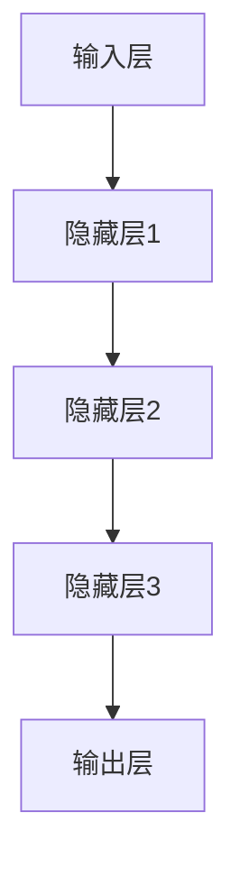
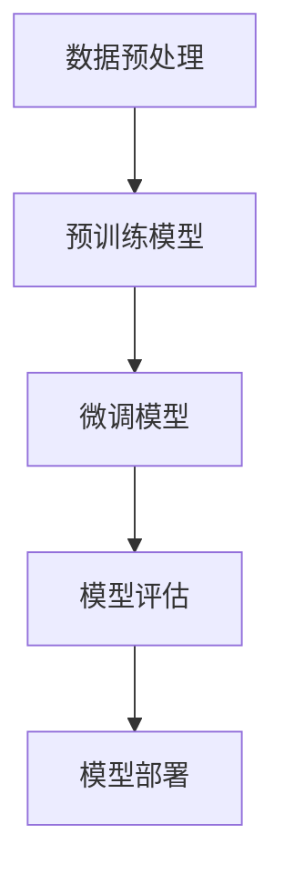

                 

# LLAMA: 重新定义计算机架构

## 关键词

- 大型语言模型（Large Language Models, LLMs）
- 计算机架构
- 神经网络
- 人工智能
- 预训练语言模型

## 摘要

本文旨在探讨大型语言模型（LLM）如何重新定义计算机架构。首先，我们介绍了LLM的背景、定义及其研究意义。接着，我们回顾了计算机架构的基础知识，包括硬件与软件、系统层次结构以及CPU架构。随后，我们深入探讨了神经网络基础、LLM算法原理以及LLM架构设计。在应用与实践部分，我们分析了LLM在自然语言处理和计算机架构优化中的应用。最后，我们展望了LLM的未来发展及其面临的挑战和解决策略。通过本文，我们希望能够帮助读者理解LLM对计算机架构的深远影响，并启发新的研究方向。

## 第一部分：引言

### 第1章：LLM概述

#### 1.1 LLM的定义与背景

大型语言模型（LLM）是一种基于深度学习技术的自然语言处理模型，其核心目标是模拟人类的语言理解和生成能力。LLM通过在大量文本数据上预训练，学习到丰富的语言知识和规律，从而能够实现高度准确的文本分类、机器翻译、问答系统等任务。

LLM的发展可以追溯到20世纪80年代，当时研究人员开始探索使用神经网络来处理自然语言。随着计算能力的提升和大数据技术的发展，LLM在近年来取得了显著的突破。尤其是在2018年，谷歌发布了BERT模型，标志着LLM在自然语言处理领域进入了一个全新的阶段。此后，一系列大型LLM模型如GPT、Turing-NLG等相继问世，其性能和规模不断刷新纪录。

#### 1.2 LLM的研究意义

LLM的研究具有重要的理论和实践意义。从理论层面来看，LLM的发展推动了人工智能领域的前沿研究，为深度学习、自然语言处理、认知计算等学科提供了新的研究方法和思路。从实践层面来看，LLM在许多实际应用场景中展现出了卓越的性能，如搜索引擎、智能客服、自动摘要、机器翻译等。这些应用不仅提高了生产效率，还改变了人们的生活方式。

此外，LLM的研究还有助于推动计算机架构的优化和变革。传统的计算机架构主要针对通用计算任务进行设计，而LLM的兴起要求计算机体系结构能够更好地支持大规模数据并行处理和高效存储。因此，LLM的研究不仅对自然语言处理领域具有重要意义，也对整个计算机科学领域产生了深远影响。

#### 1.3 LLM的发展历程

LLM的发展历程可以分为以下几个阶段：

1. **早期探索阶段**（1980s-1990s）：这一阶段，研究人员开始尝试使用神经网络来处理自然语言。例如，HMM（隐马尔可夫模型）和n-gram模型在文本分类和语言建模中取得了一定的成功。

2. **神经网络复兴阶段**（2000s）：随着深度学习技术的兴起，神经网络在图像识别、语音识别等领域取得了显著成果。这一时期，研究人员开始将深度学习技术应用于自然语言处理，提出了诸如Word2Vec、GloVe等词向量模型。

3. **大规模预训练阶段**（2018年至今）：2018年，谷歌发布了BERT模型，标志着LLM进入了一个新的阶段。此后，一系列大型LLM模型如GPT、Turing-NLG等相继问世，其性能和规模不断刷新纪录。

4. **应用拓展阶段**：随着LLM性能的提升，其在各个领域的应用逐渐拓展。例如，在自然语言处理领域，LLM被应用于文本分类、机器翻译、问答系统等任务。在计算机架构领域，LLM推动了硬件加速器设计、分布式计算系统设计等研究方向。

## 第二部分：计算机架构基础

### 第2章：计算机架构基础

#### 2.1 计算机硬件与软件

计算机系统由硬件和软件两部分组成。硬件部分包括中央处理器（CPU）、内存、输入输出设备等。软件部分则包括操作系统、应用程序和系统库等。

- **中央处理器（CPU）**：CPU是计算机的核心部件，负责执行计算机程序中的指令。它通常包含多个核心，每个核心都能独立执行指令。
- **内存**：内存是计算机用于临时存储数据和指令的存储器。根据存储速度和容量，内存可以分为缓存、RAM和硬盘等。
- **输入输出设备**：输入输出设备用于与外部设备进行数据交换。常见的输入设备有键盘、鼠标等，输出设备有显示器、打印机等。

#### 2.2 计算机系统的层次结构

计算机系统可以分为以下几个层次：

- **硬件层次**：包括CPU、内存、输入输出设备等。
- **操作系统层次**：操作系统负责管理计算机硬件资源，提供用户界面和应用程序接口。
- **应用程序层次**：应用程序是用户可以直接使用的软件，如文字处理、电子表格、网页浏览器等。
- **系统库层次**：系统库是一系列预编译的代码，用于简化应用程序开发过程。
- **用户层次**：用户通过操作系统和应用程序与计算机系统进行交互。

#### 2.3 CPU架构基础

CPU架构是指CPU内部各个部件的组织方式和数据流动方式。常见的CPU架构有冯·诺依曼架构和哈佛架构。

- **冯·诺依曼架构**：冯·诺依曼架构将程序指令和数据存储在同一内存中，通过程序计数器来控制指令的执行顺序。该架构的优点是设计简单、易于扩展，但缺点是数据访问速度较慢。
- **哈佛架构**：哈佛架构将程序指令和数据存储在两个独立的内存中，分别由程序计数器和数据计数器控制。该架构的优点是数据访问速度快，但缺点是设计复杂、成本较高。

## 第二部分：LLM技术原理

### 第3章：神经网络基础

#### 3.1 神经网络概述

神经网络（Neural Networks）是一种基于生物神经系统的计算模型，由大量简单单元（神经元）互联而成。神经网络通过学习输入和输出之间的映射关系，实现对复杽数据的处理和预测。

- **神经元**：神经元是神经网络的基本单元，负责接收输入信号、计算输出值并传递给下一层神经元。
- **层**：神经网络由输入层、隐藏层和输出层组成。输入层接收外部输入，隐藏层负责处理和变换数据，输出层生成最终输出。
- **权重和偏置**：权重和偏置是神经网络中的参数，用于调节神经元之间的连接强度和偏差。通过调整权重和偏置，神经网络可以学习到输入和输出之间的映射关系。

#### 3.2 前馈神经网络

前馈神经网络（Feedforward Neural Network）是一种简单的神经网络模型，其中数据从输入层流向输出层，没有循环或反馈。前馈神经网络通常由多个层次组成，每个层次包含多个神经元。

- **正向传播**：在正向传播过程中，输入数据依次通过各层神经元，每一层神经元将结果传递给下一层。最终，输出层生成最终输出。
- **反向传播**：在反向传播过程中，网络根据输出误差，反向调整权重和偏置。这一过程通过梯度下降算法实现，使得网络能够逐步逼近输入和输出之间的映射关系。

#### 3.3 反向传播算法

反向传播算法（Backpropagation Algorithm）是一种用于训练神经网络的优化算法。其核心思想是通过计算输出误差的梯度，反向调整网络中的权重和偏置。

- **梯度计算**：在反向传播过程中，网络计算每一层神经元输出误差关于权重和偏置的梯度。这些梯度用于更新权重和偏置，以减小输出误差。
- **梯度下降**：梯度下降算法通过沿着梯度方向更新权重和偏置，以逐步减小输出误差。梯度下降算法有多种变体，如随机梯度下降（SGD）、批量梯度下降（BGD）和小批量梯度下降（MBGD）。

#### 3.4 深度神经网络

深度神经网络（Deep Neural Network, DNN）是一种包含多个隐藏层的神经网络。与单层神经网络相比，深度神经网络具有更强的建模能力，能够学习到更复杂的函数关系。

- **多层感知机**：多层感知机（Multilayer Perceptron, MLP）是一种常见的深度神经网络模型，包含多个隐藏层和输出层。
- **卷积神经网络**：卷积神经网络（Convolutional Neural Network, CNN）是一种专门用于处理图像数据的深度神经网络，通过卷积操作和池化操作实现对图像的特征提取。
- **递归神经网络**：递归神经网络（Recurrent Neural Network, RNN）是一种能够处理序列数据的神经网络，通过循环结构实现对序列的建模。

### 第4章：LLM算法原理

#### 4.1 语言模型基础

语言模型（Language Model）是一种用于预测自然语言中下一个词或字符的概率分布的模型。语言模型在自然语言处理任务中具有重要作用，如文本分类、机器翻译、语音识别等。

- **N-gram模型**：N-gram模型是一种简单的语言模型，通过统计相邻N个词（或字符）的联合概率来预测下一个词（或字符）。
- **神经网络语言模型**：神经网络语言模型通过学习输入和输出之间的映射关系，实现对语言概率分布的建模。深度神经网络语言模型（DNNLM）是一种常见的神经网络语言模型，具有更强的建模能力。

#### 4.2 预训练语言模型

预训练语言模型（Pre-trained Language Model）是一种在大规模语料库上预训练的神经网络语言模型。预训练语言模型在自然语言处理任务中具有显著优势，能够提高模型的性能和泛化能力。

- **预训练过程**：预训练过程通常包括两个阶段：数据预处理和模型训练。数据预处理包括文本清洗、分词、词向量化等操作。模型训练则使用大规模语料库，通过优化语言模型损失函数，逐步调整网络参数。
- **微调与优化策略**：在预训练后，预训练语言模型可以用于特定自然语言处理任务。微调过程包括在特定任务数据集上调整模型参数，以优化模型在目标任务上的性能。常见的优化策略有正则化、dropout、学习率调整等。

#### 4.3 微调与优化策略

微调和优化策略是在特定任务数据集上调整预训练语言模型参数的过程，以优化模型在目标任务上的性能。

- **微调**：微调过程通过在特定任务数据集上训练预训练语言模型，逐步调整网络参数，以优化模型在目标任务上的性能。微调过程可以使用部分预训练层或全部预训练层，具体策略取决于任务需求和模型架构。
- **优化策略**：优化策略包括正则化、dropout、学习率调整等。正则化通过添加惩罚项，防止模型过拟合；dropout通过随机丢弃部分神经元，增强模型泛化能力；学习率调整则通过调整学习率，控制模型训练过程。

### 第5章：LLM架构设计

#### 5.1 常见的LLM架构

常见的LLM架构主要包括基于Transformer的模型和基于Transformer的模型。

- **基于Transformer的模型**：Transformer模型是一种基于自注意力机制的深度神经网络模型，具有强大的建模能力。常见的基于Transformer的LLM模型有BERT、GPT、Turing-NLG等。
- **基于Transformer的模型**：基于Transformer的模型通过自注意力机制，能够捕捉输入序列中任意两个位置之间的依赖关系。自注意力机制的核心思想是计算每个位置的重要度，并根据重要度对输入进行加权求和。

#### 5.2 计算机架构适配LLM

为了适应LLM的需求，计算机架构需要进行相应的调整和优化。

- **并行计算**：LLM模型通常包含大量参数和计算量，通过并行计算可以提高模型训练和推理速度。常见的并行计算技术包括GPU并行计算、分布式计算等。
- **存储优化**：LLM模型的存储需求较大，通过存储优化可以提高模型训练和推理效率。常见的存储优化技术包括压缩存储、数据并行等。
- **通信优化**：在分布式计算场景下，优化通信开销可以提高模型训练和推理性能。常见的通信优化技术包括局部通信、流水线通信等。

#### 5.3 存储与通信优化

存储与通信优化是提高LLM模型训练和推理性能的关键技术。

- **存储优化**：存储优化包括压缩存储和数据并行等技术。压缩存储通过减少存储空间需求，降低存储成本；数据并行通过将数据分布到多个计算节点，提高数据访问速度和计算效率。
- **通信优化**：通信优化包括局部通信和流水线通信等技术。局部通信通过将计算任务分配到相邻的计算节点，减少通信开销；流水线通信通过将计算任务有序分配到计算节点，减少等待时间。

## 第三部分：LLM应用与实践

### 第6章：LLM在自然语言处理中的应用

#### 6.1 文本分类

文本分类（Text Classification）是一种将文本数据按照特定类别进行划分的任务。LLM在文本分类任务中具有显著优势，能够实现高度准确的分类效果。

- **任务描述**：文本分类任务的目标是将给定的文本数据归类到预定义的类别中。常见的文本分类任务包括情感分析、主题分类、垃圾邮件检测等。
- **模型实现**：在文本分类任务中，LLM可以用于文本特征提取和分类模型训练。首先，将文本数据转换为词向量表示，然后通过预训练的LLM模型提取特征，最后使用分类模型（如SVM、逻辑回归等）进行分类。

#### 6.2 机器翻译

机器翻译（Machine Translation）是一种将一种语言的文本翻译成另一种语言的文本的任务。LLM在机器翻译任务中具有强大的生成能力，能够实现高质量的翻译效果。

- **任务描述**：机器翻译任务的目标是将一种语言的文本翻译成另一种语言的文本。常见的机器翻译任务包括中英文翻译、日英翻译等。
- **模型实现**：在机器翻译任务中，LLM可以用于编码器和解码器两部分。编码器将输入文本编码为序列向量，解码器将序列向量解码为输出文本。常用的编码器和解码器模型分别为Transformer编码器和解码器。

#### 6.3 问答系统

问答系统（Question Answering System）是一种根据用户提出的问题，从给定文本中抽取答案的智能系统。LLM在问答系统任务中具有优秀的问答能力，能够实现高效准确的回答。

- **任务描述**：问答系统任务的目标是根据用户提出的问题，从给定文本中抽取答案。常见的问答系统任务包括开放域问答、领域特定问答等。
- **模型实现**：在问答系统任务中，LLM可以用于构建问答模型。首先，将用户问题和给定文本编码为序列向量，然后通过预训练的LLM模型生成答案。

### 第7章：LLM在计算机架构中的应用

#### 7.1 计算机体系结构优化

LLM在计算机体系结构优化中具有重要作用，能够提高计算机性能和能效。

- **任务描述**：计算机体系结构优化旨在提高计算机性能和能效。常见的优化任务包括指令级并行性、内存层次结构优化、功耗优化等。
- **模型实现**：在计算机体系结构优化任务中，LLM可以用于建模和分析计算机体系结构。通过训练LLM模型，可以预测不同优化策略对计算机性能和能效的影响，从而选择最优的优化方案。

#### 7.2 硬件加速器设计

LLM在硬件加速器设计中具有重要作用，能够提高硬件加速器的性能和能效。

- **任务描述**：硬件加速器设计旨在提高计算机系统的性能和能效。常见的硬件加速器包括GPU、FPGA、ASIC等。
- **模型实现**：在硬件加速器设计任务中，LLM可以用于建模和分析硬件加速器。通过训练LLM模型，可以优化硬件加速器的结构，提高计算速度和能效。

#### 7.3 分布式计算系统设计

LLM在分布式计算系统设计中具有重要作用，能够提高分布式计算系统的性能和可靠性。

- **任务描述**：分布式计算系统设计旨在提高计算机系统的性能和可靠性。常见的分布式计算系统包括集群计算、网格计算、边缘计算等。
- **模型实现**：在分布式计算系统设计任务中，LLM可以用于建模和分析分布式计算系统。通过训练LLM模型，可以优化分布式计算系统的结构，提高计算速度和可靠性。

### 第8章：LLM开发与部署

#### 8.1 开发环境搭建

在开发LLM模型时，需要搭建合适的环境。

- **硬件环境**：搭建LLM开发环境需要高性能计算硬件，如GPU、TPU等。
- **软件环境**：搭建LLM开发环境需要安装深度学习框架、编程语言、编译器等软件。
- **数据集**：搭建LLM开发环境需要准备大规模、高质量的文本数据集。

#### 8.2 模型训练与优化

在模型训练与优化过程中，需要遵循以下步骤：

- **数据预处理**：对文本数据集进行清洗、分词、词向量化等预处理操作。
- **模型训练**：使用深度学习框架训练LLM模型，包括数据加载、模型配置、训练过程等。
- **模型优化**：通过调整模型参数、优化策略等，提高模型性能和泛化能力。

#### 8.3 模型评估与部署

在模型评估与部署过程中，需要遵循以下步骤：

- **模型评估**：使用验证集和测试集评估模型性能，包括准确率、召回率、F1值等指标。
- **模型部署**：将训练好的LLM模型部署到生产环境中，如服务器、云平台等。

### 第9章：LLM的未来发展

#### 9.1 LLM在行业中的应用前景

LLM在行业中的应用前景广阔，如自然语言处理、计算机架构优化、智能客服、自动摘要、机器翻译等。随着LLM性能的提升，其在更多领域的应用潜力将不断释放。

#### 9.2 LLM面临的挑战与解决策略

LLM在发展过程中面临一系列挑战，如计算资源需求、数据隐私、模型可解释性等。解决这些挑战需要技术创新和政策引导。

- **计算资源需求**：随着LLM模型规模的扩大，计算资源需求急剧增加。解决策略包括优化算法、分布式计算等。
- **数据隐私**：LLM训练过程中涉及大量敏感数据，保护数据隐私至关重要。解决策略包括数据加密、隐私保护算法等。
- **模型可解释性**：提高模型可解释性有助于理解模型行为，增强用户信任。解决策略包括可视化技术、模型解释算法等。

#### 9.3 LLM的发展趋势与未来方向

LLM的发展趋势包括模型规模扩大、多模态学习、知识增强等。未来，LLM将在更多领域发挥作用，推动人工智能技术不断进步。

- **模型规模扩大**：随着计算能力的提升，LLM模型规模将不断扩大，实现更强大的语义理解和生成能力。
- **多模态学习**：未来，LLM将融合多模态数据（如文本、图像、音频等），实现更丰富的语义理解和应用场景。
- **知识增强**：通过引入外部知识库和知识图谱，LLM将实现知识增强，提高模型在特定领域的表现。

## 附录

### 附录A：常用工具与资源

- **深度学习框架**：TensorFlow、PyTorch、MXNet等。
- **算法实现代码**：GitHub、GitLab等代码托管平台。
- **参考资料**：《深度学习》（Goodfellow et al.）、《神经网络与深度学习》（邱锡鹏）等。

### 附录B：Mermaid流程图示例

#### B.1 神经网络结构



#### B.2 预训练语言模型流程



### 附录C：伪代码示例

#### C.1 反向传播算法

```python
# 定义反向传播算法
def backpropagation(inputs, weights, biases, outputs, expected_outputs):
    # 计算输出误差
    error = expected_outputs - outputs

    # 计算梯度
    d_outputs = error
    d_weights = inputs
    d_biases = 1

    # 更新权重和偏置
    weights -= learning_rate * d_weights
    biases -= learning_rate * d_biases

    # 返回梯度
    return d_weights, d_biases
```

#### C.2 语言模型训练流程

```python
# 定义语言模型训练流程
def train_language_model(data, model):
    # 预处理数据
    preprocessed_data = preprocess_data(data)

    # 循环迭代
    for epoch in range(num_epochs):
        # 正向传播
        inputs, labels = next_batch(preprocessed_data)
        outputs = model.forward(inputs)

        # 反向传播
        d_weights, d_biases = backpropagation(inputs, model.weights, model.biases, outputs, labels)

        # 更新模型参数
        model.weights -= learning_rate * d_weights
        model.biases -= learning_rate * d_biases

    # 返回训练好的模型
    return model
```

## 作者

作者：AI天才研究院/AI Genius Institute & 禅与计算机程序设计艺术 /Zen And The Art of Computer Programming。

