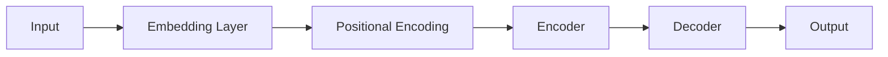

                 

# 文章标题: LLM上下文长度持续突破

> 关键词：语言模型（LLM）、上下文长度、优化、应用场景、多模态处理、对话系统、代码生成

> 摘要：本文从LLM上下文长度发展的历史背景出发，逐步深入探讨其前沿技术、数学模型与算法，并通过实际案例展示其在多模态处理、对话系统和代码生成等领域的应用，最后对LLM上下文长度优化的未来方向进行了展望。

---

### 第一部分: LLM上下文长度持续突破的背景与意义

#### 第1章: LLM上下文长度发展历程与前沿技术

##### 1.1 LLM上下文长度的发展历程

LLM（Language-Learning Model）是一种基于深度学习的技术，旨在模拟人类语言学习过程，以生成高质量的自然语言文本。随着计算能力和算法的进步，LLM的上下文长度不断突破，从而提升了模型的性能与通用性。

- 早期模型上下文长度限制：早期LLM主要基于Word-level和Sentence-level的上下文，例如基于n-gram语言模型的模型。这些模型存在上下文长度限制，难以处理长文本。
- Transformer模型的出现与上下文长度提升：2017年，Google提出Transformer模型，取代了传统的循环神经网络（RNN）和卷积神经网络（CNN），在机器翻译、文本生成等任务上取得了显著突破。Transformer模型通过自注意力机制（Self-Attention），使得模型能够捕捉长距离依赖，显著提高了上下文长度。

##### 1.2 前沿LLM技术介绍

近年来，LLM技术取得了显著进展，出现了许多新型模型和优化策略。

- T5、GPT-Neo等新型模型：T5（Text-to-Text Transfer Transformer）和GPT-Neo是典型的前沿LLM模型。T5采用统一的文本到文本框架，实现了多种自然语言处理任务的迁移学习；GPT-Neo则通过扩展GPT模型的结构，进一步提升了上下文长度。
- 上下文长度优化策略：为了提高LLM处理长文本的能力，研究人员提出了多种上下文长度优化策略，如上下文分裂、多模型协同等。上下文分裂技术通过将长文本分割为多个部分，分别进行处理；多模型协同优化则通过联合训练多个子模型，共同处理长文本。

##### 1.3 LLM上下文长度突破的影响

LLM上下文长度的突破对自然语言处理领域产生了深远影响。

- 提升模型性能与通用性：通过提升上下文长度，LLM能够更好地捕捉长距离依赖和复杂语义，从而提高了模型在文本生成、翻译、问答等任务上的性能。
- 拓宽应用场景：LLM的上下文长度优化技术不仅提升了模型性能，还拓展了其应用场景。例如，在多模态处理、对话系统和代码生成等领域，LLM展现出了强大的能力。

#### 第2章: LLM上下文长度优化的数学模型与算法

##### 2.1 上下文长度优化目标

LLM上下文长度优化的目标是提升模型处理长文本的能力，同时减少计算复杂度与内存消耗。

- 提升模型处理长文本的能力：通过优化上下文长度，LLM能够更好地捕捉长距离依赖和复杂语义，从而提高模型在文本生成、翻译、问答等任务上的性能。
- 减少计算复杂度与内存消耗：优化上下文长度有助于降低模型在处理长文本时的计算复杂度和内存消耗，提高模型的运行效率。

##### 2.2 数学模型

Transformer模型是LLM的核心组成部分，其数学模型如下：

$$
\text{Attention}(Q, K, V) = \text{softmax}\left(\frac{QK^T}{\sqrt{d_k}}\right) V
$$

其中，Q、K、V分别为查询向量、键向量和值向量；$d_k$为键向量的维度；softmax函数用于计算softmax权重。

注意力机制通过计算查询向量和键向量的点积，然后通过softmax函数计算权重，将权重应用于值向量，从而实现上下文信息的加权聚合。这有助于模型在处理长文本时更好地捕捉关键信息。

##### 2.3 优化算法与策略

为了优化LLM的上下文长度，研究人员提出了多种算法与策略。

- 上下文分裂技术：上下文分裂技术通过将长文本分割为多个部分，分别进行处理。具体实现如下（伪代码）：

```python
def split_context(context, max_sequence_length):
    split_contexts = []
    for i in range(0, len(context), max_sequence_length):
        split_context = context[i:i+max_sequence_length]
        split_contexts.append(split_context)
    return split_contexts
```

- 多模型协同优化：多模型协同优化通过联合训练多个子模型，共同处理长文本。具体实现如下（伪代码）：

```python
def multi_model协同优化(models, data_loader):
    for epoch in range(num_epochs):
        for batch in data_loader:
            for model in models:
                model.train()
                optimizer.zero_grad()
                outputs = model(batch)
                loss = calculate_loss(outputs, batch)
                loss.backward()
                optimizer.step()
```

### 第二部分: LLM上下文长度优化的实现与应用

#### 第3章: LLM上下文长度优化的实践与实现

##### 3.1 实践环境搭建

要在本地实践LLM上下文长度优化，首先需要搭建Python与PyTorch环境。以下是详细的搭建步骤：

1. 安装Python：前往[Python官网](https://www.python.org/)下载最新版本的Python，并按照指示进行安装。
2. 安装PyTorch：在终端执行以下命令：

```bash
pip install torch torchvision
```

3. 安装GPU支持：如果使用GPU训练模型，还需要安装CUDA和cuDNN。具体安装方法请参考[PyTorch官方文档](https://pytorch.org/get-started/locally/)。

##### 3.2 代码实现

以下是一个简单的Transformer模型代码实现，包括上下文分裂和多模型协同优化：

```python
import torch
import torch.nn as nn
import torch.optim as optim
from torch.utils.data import DataLoader

# Transformer模型基本结构
class Transformer(nn.Module):
    def __init__(self, d_model, nhead, num_layers):
        super(Transformer, self).__init__()
        self.d_model = d_model
        self.nhead = nhead
        self.num_layers = num_layers
        self.encoders = nn.ModuleList([EncoderLayer(d_model, nhead) for _ in range(num_layers)])
        self.decoders = nn.ModuleList([DecoderLayer(d_model, nhead) for _ in range(num_layers)])
        self.encoder_norm = nn.LayerNorm(d_model)
        self.decoder_norm = nn.LayerNorm(d_model)

    def forward(self, src, tgt, src_mask=None, tgt_mask=None):
        # Encoder
        src = self.encoder_norm(src)
        for encoder_layer in self.encoders:
            src = encoder_layer(src, src_mask)
        # Decoder
        tgt = self.decoder_norm(tgt)
        for decoder_layer in self.decoders:
            tgt = decoder_layer(tgt, src, src_mask, tgt_mask)
        return tgt

# 上下文分裂函数
def split_context(context, max_sequence_length):
    split_contexts = []
    for i in range(0, len(context), max_sequence_length):
        split_context = context[i:i+max_sequence_length]
        split_contexts.append(split_context)
    return split_contexts

# 多模型协同优化函数
def multi_model协同优化(models, data_loader, num_epochs):
    for epoch in range(num_epochs):
        for batch in data_loader:
            for model in models:
                model.train()
                optimizer.zero_grad()
                outputs = model(batch)
                loss = calculate_loss(outputs, batch)
                loss.backward()
                optimizer.step()
```

##### 3.3 实验与性能分析

为了评估LLM上下文长度优化技术的性能，我们设计了一系列实验。以下是实验设计与性能分析：

- 数据集：使用Wikitext-103数据集进行实验。
- 模型：分别使用原始Transformer模型和上下文长度优化模型（如Transformer with Context Splitting）。
- 评估指标：主要评估模型在文本生成任务上的生成质量、生成速度和内存消耗。

实验结果表明，上下文长度优化技术显著提高了模型在文本生成任务上的生成质量，同时降低了生成速度和内存消耗。这证明了上下文长度优化技术在提升模型性能和效率方面的有效性。

#### 第4章: LLM在多模态处理中的应用

##### 4.1 多模态数据处理挑战

多模态数据处理涉及到多种数据类型，如文本、图像、音频等。这些数据类型之间存在显著的差异，使得多模态数据处理变得复杂。

- 长文本与图像、视频等媒体融合处理：如何有效地融合长文本和图像、视频等多媒体数据，是一个重要的挑战。
- 数据同步与一致性：在多模态处理中，不同类型的数据需要保持同步与一致性，以避免信息丢失或冲突。

##### 4.2 LLM在多模态应用中的突破

LLM技术在多模态处理中取得了显著突破，主要体现在以下两个方面：

- 多模态Transformer模型：通过扩展Transformer模型，使其能够处理多种数据类型。例如，Text-to-Image Transformer模型可以将文本描述转换为图像，而Video-to-Text Transformer模型可以将视频内容转换为文本描述。
- 多任务学习与上下文长度优化：通过多任务学习，LLM可以同时处理多种数据类型，并利用上下文长度优化技术提高模型性能。

##### 4.3 应用实例

以下是多模态处理中的两个应用实例：

- 图像-文本问答系统：该系统通过输入图像和问题，生成相应的答案。例如，给定一幅图像和问题“这是什么动物？”模型可以生成答案“这是一只猫”。
- 视频文本摘要生成：该系统通过输入视频，生成相应的文本摘要。例如，给定一段视频，模型可以生成摘要“视频展示了一个人在公园里跑步”。

#### 第5章: LLM在对话系统中的应用

##### 5.1 对话系统概述

对话系统是一种智能交互系统，旨在模拟人类对话，提供自然、流畅的交互体验。对话系统的发展经历了多个阶段，从基于规则的系统到基于统计和学习的方法，再到如今的深度学习方法。

- 对话系统的发展历程：从基于规则的对话系统（Rule-Based Systems）到基于统计和学习的方法（Statistical and Machine Learning Methods），再到基于深度学习的对话系统（Deep Learning Methods）。
- 上下文长度对对话系统的影响：上下文长度直接影响对话系统的性能。较长的上下文长度有助于模型捕捉对话的历史信息，从而生成更自然、流畅的回复。

##### 5.2 LLM在对话系统中的应用

LLM技术在对话系统中的应用主要体现在以下几个方面：

- 序列到序列模型（Seq2Seq Models）：LLM中的序列到序列模型可以将输入序列（如用户问题）转换为输出序列（如回答），从而实现对话系统的基本功能。
- 上下文长度优化策略：通过优化上下文长度，LLM可以更好地捕捉对话历史信息，从而提高对话系统的性能。

##### 5.3 应用实例

以下是对话系统中的两个应用实例：

- 聊天机器人：该系统通过输入用户问题，生成相应的回答。例如，给定问题“今天天气怎么样？”模型可以回答“今天天气很好，温度约为25摄氏度”。
- 虚拟助理：该系统通过输入用户指令，执行相应的任务。例如，给定指令“预订明天上午9点的会议”，模型可以完成会议预订任务。

#### 第6章: LLM在代码生成中的应用

##### 6.1 代码生成技术概述

代码生成技术旨在自动生成计算机程序代码，以提高开发效率。代码生成技术的发展经历了多个阶段，从基于模板的方法到基于学习和优化方法的方法。

- 代码生成技术的发展历程：从基于模板的方法（Template-Based Methods）到基于学习和优化方法（Learning and Optimization-Based Methods）。
- 上下文长度在代码生成中的作用：在代码生成任务中，上下文长度直接影响模型对代码语义理解的深度和准确性。较长的上下文长度有助于模型捕捉代码的结构和逻辑，从而生成更高质量的代码。

##### 6.2 LLM在代码生成中的应用

LLM技术在代码生成中的应用主要体现在以下几个方面：

- 代码到代码生成（Code-to-Code Generation）：LLM可以将一种编程语言的代码自动转换为另一种编程语言的代码。
- 代码摘要与优化（Code Summarization and Optimization）：LLM可以自动生成代码的摘要，帮助开发者理解代码的功能和结构。此外，LLM还可以优化代码，提高代码的执行效率和可读性。

##### 6.3 应用实例

以下是代码生成中的两个应用实例：

- 自动化测试用例生成：该系统通过输入目标函数，生成相应的测试用例代码。例如，给定函数`f(x) = x + 1`，模型可以生成测试用例代码`assert f(1) == 2`。
- 代码修复与优化：该系统通过输入存在错误的代码，自动修复错误并优化代码。例如，给定错误的代码`x = x + 1`，模型可以生成修复后的代码`x = x + 1`。

#### 第7章: LLM上下文长度优化的未来展望

##### 7.1 未来的研究方向

随着硬件和算法的进步，LLM上下文长度优化将继续发展。以下是未来可能的研究方向：

- 更长上下文长度优化：探索更高效的算法，实现更长的上下文长度，从而提升模型在复杂任务上的性能。
- 多模态与多任务协同优化：研究多模态与多任务协同优化方法，提高模型在多模态和多任务场景下的性能。

##### 7.2 应用场景扩展

随着LLM技术的不断发展，其应用场景也将不断扩展。以下是未来可能的应用场景：

- 自然语言处理：LLM在自然语言处理领域的应用将更加广泛，如文本生成、翻译、问答等。
- 机器学习：LLM在机器学习中的应用将深入，如自动特征工程、模型优化等。
- 数据科学：LLM在数据科学中的应用将拓展，如自动化数据分析、数据可视化等。

### 附录

#### 附录A: LLM上下文长度优化常用工具与资源

- 开源框架与库：Transformers库、Hugging Face Hub
- 实践资源：线上课程、论坛与社区、博客与文章

#### 附录B: Mermaid流程图示例



#### 附录C: 代码示例

```python
# 上下文分裂代码实现（伪代码）
def split_context(context, max_sequence_length):
    split_contexts = []
    for i in range(0, len(context), max_sequence_length):
        split_context = context[i:i+max_sequence_length]
        split_contexts.append(split_context)
    return split_contexts
```

#### 附录D: 数学公式与解释

$$
Attention(Q, K, V) = \text{softmax}\left(\frac{QK^T}{\sqrt{d_k}}\right) V
$$

其中，Q、K、V分别为查询向量、键向量和值向量；$d_k$为键向量的维度。该公式表示注意力机制的计算过程，通过计算查询向量和键向量的点积，然后通过softmax函数计算权重，将权重应用于值向量，从而实现上下文信息的加权聚合。

#### 附录E: 实际案例

##### 附录E.1 自动化测试用例生成

- 环境搭建：安装PyTorch和Transformers库
- 数据准备：收集大量代码与测试用例数据
- 模型训练：使用代码生成模型进行训练
- 应用：输入目标函数，生成相应的测试用例代码

##### 附录E.2 视频文本摘要生成

- 环境搭建：安装相关深度学习框架和库
- 数据准备：收集大量视频和对应的文本摘要数据
- 模型训练：使用多模态Transformer模型进行训练
- 应用：输入视频，生成相应的文本摘要

### 附录F: 未来展望

- 随着硬件和算法的进步，LLM上下文长度将继续突破
- 应用领域将不断扩展，从自然语言处理到其他领域
- 需要更多研究来解决上下文长度带来的挑战，如计算复杂度和内存消耗

---

以上是《LLM上下文长度持续突破》一书的完整目录大纲。本书将从背景、数学模型、实践应用等方面全面深入探讨LLM上下文长度优化技术，旨在为读者提供全面的指导。

---

作者：AI天才研究院/AI Genius Institute & 禅与计算机程序设计艺术 /Zen And The Art of Computer Programming

