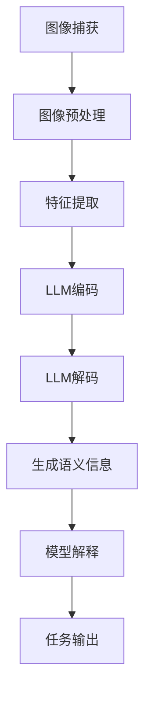

                 

# 《LLM与传统机器视觉技术的结合：计算机视觉新纪元》

> 关键词：机器视觉、LLM、自然语言处理、计算机视觉、目标检测、图像分类、图像分割、深度学习、算法

> 摘要：本文探讨了大型语言模型（LLM）与传统机器视觉技术的结合，阐述了这种结合如何引领计算机视觉进入一个新纪元。文章首先介绍了机器视觉和LLM的基本概念，随后详细分析了两者结合的原理和优势。通过具体算法原理的讲解、伪代码展示和数学模型的阐述，本文深入探讨了LLM在目标检测、图像分类和图像分割中的应用。最后，通过一个实际项目案例，展示了如何利用LLM技术解决计算机视觉中的实际问题，并展望了LLM在计算机视觉领域的未来发展方向和面临的挑战。

## 第一部分：引言与背景

### 1.1 机器视觉技术简介

机器视觉是一种通过图像或视频捕捉和处理来感知和理解世界的计算机技术。它源于20世纪60年代的自动化领域，初衷是替代人眼进行检测、识别和测量。随着计算机性能的提升和图像处理算法的进步，机器视觉技术逐渐在工业生产、医疗诊断、安防监控等多个领域得到广泛应用。

在机器视觉中，常见的任务包括目标检测、图像分类、图像分割、姿态估计等。这些任务的核心在于从图像或视频数据中提取有用的信息，以实现对场景的理解和交互。传统机器视觉主要依赖底层特征提取和基于规则的算法，如边缘检测、角点检测、区域生长等。然而，这些方法在处理复杂场景和多变环境下往往表现出局限性。

### 1.2 LLM技术简介

大型语言模型（Large Language Model，简称LLM）是近年来自然语言处理领域的重要突破。LLM通过深度学习技术从海量文本数据中学习语言模式和规律，从而实现对自然语言的生成、翻译、理解等任务的高效处理。典型的LLM模型包括GPT（Generative Pre-trained Transformer）、BERT（Bidirectional Encoder Representations from Transformers）等。

LLM的成功得益于以下几个关键因素：首先，大规模的数据集为模型训练提供了丰富的样本；其次，先进的深度学习架构如Transformer使模型具有更强的表达能力和计算效率；最后，预训练加微调（Pre-training and Fine-tuning）策略使得LLM能够快速适应不同任务的需求。

### 1.3 书籍目标与结构

本文旨在探讨LLM与传统机器视觉技术的结合，分析这种结合如何推动计算机视觉的发展。文章结构如下：

- 第一部分：引言与背景，介绍机器视觉和LLM的基本概念及其发展历程。
- 第二部分：核心概念与联系，阐述机器视觉与LLM技术结合的原理和优势。
- 第三部分：LLM技术基础，介绍自然语言处理和计算机视觉的基本概念、算法原理和架构。
- 第四部分：LLM在计算机视觉中的应用，详细分析LLM在目标检测、图像分类和图像分割中的应用。
- 第五部分：项目实战，通过实际项目展示如何利用LLM技术解决计算机视觉问题。
- 第六部分：未来展望与挑战，探讨LLM在计算机视觉领域的未来发展方向和面临的挑战。
- 第七部分：总结与展望，回顾文章内容，展望未来研究方向。

通过以上结构，本文希望能够为读者提供一个全面、深入的了解LLM在计算机视觉中的最新研究和应用，激发读者对该领域的兴趣和思考。

### 2. 机器视觉与LLM技术的关系

#### 2.1 机器视觉基本概念

机器视觉作为计算机科学的一个分支，致力于通过计算机系统模拟人类的视觉功能，实现对图像和视频数据的自动分析、理解和处理。其核心目标是从图像或视频序列中提取有用信息，以实现诸如目标检测、图像分类、图像分割等任务。

机器视觉的基本流程包括以下几个关键步骤：

1. **图像捕获**：使用摄像头或其他图像传感器捕获场景的图像或视频序列。
2. **图像预处理**：对捕获的图像进行去噪、缩放、灰度转换等预处理操作，以提高后续处理的准确性和效率。
3. **特征提取**：从预处理后的图像中提取能够表征图像内容的特征，如边缘、角点、纹理等。
4. **模式识别**：利用提取的特征进行模式识别，以实现对图像内容的分类、目标检测或分割等任务。

在传统机器视觉中，特征提取和模式识别通常依赖于底层手工设计的算法和特征，如SIFT（尺度不变特征变换）、HOG（方向梯度直方图）等。这些方法在处理简单、规则的场景时表现出较高的准确性，但在复杂、变动的场景中往往面临挑战。

#### 2.2 LLM技术基本概念

大型语言模型（LLM）是自然语言处理领域的一种先进模型，通过对海量文本数据进行深度学习，从而实现对自然语言的生成、翻译、理解等复杂任务的高效处理。LLM的核心在于其能够从大规模数据中学习到丰富的语言模式和规律，从而实现端到端的学习和推理。

LLM技术的基本概念包括以下几个方面：

1. **语言模型**：语言模型是一种用于预测下一个词语或字符的概率分布的数学模型。它通过对大量文本数据的学习，能够捕捉到语言中的统计规律和上下文依赖关系。

2. **词嵌入技术**：词嵌入（Word Embedding）是将词语映射到低维连续向量空间的技术。通过词嵌入，不同词语之间在向量空间中的距离可以反映它们在语义上的相似度，从而为语言模型提供有效的输入表示。

3. **编码器-解码器架构**：编码器-解码器（Encoder-Decoder）架构是一种常见的深度学习模型架构，用于处理序列到序列的任务。编码器部分将输入序列编码为一个固定长度的向量表示，解码器部分则根据该向量表示生成输出序列。

#### 2.3 两者结合的意义

机器视觉与LLM技术的结合在计算机视觉领域具有深远的意义和广阔的应用前景。以下是两者结合的几个关键方面：

1. **增强特征表示能力**：传统的机器视觉方法在特征提取和表示方面往往依赖于手工设计的方法，这限制了其在复杂场景中的适用性。LLM技术通过深度学习能够从大规模数据中自动学习到丰富的特征表示，能够更好地捕捉图像中的复杂结构和语义信息。将LLM技术应用于机器视觉，可以显著提升特征提取和表示的能力，从而提高计算机视觉任务的准确性和鲁棒性。

2. **处理复杂任务**：机器视觉中的许多任务，如图像分类、目标检测和图像分割，本质上是对图像内容进行理解和分析。传统方法往往依赖于手工设计的特征和算法，难以应对复杂和多变的环境。LLM技术具有强大的语言理解和生成能力，能够处理自然语言描述的场景信息，从而为机器视觉任务提供更丰富的语义信息。通过将LLM技术与机器视觉任务结合，可以实现对复杂任务的更有效处理。

3. **跨模态数据处理**：机器视觉主要处理视觉模态的信息，而LLM技术擅长处理文本模态的信息。将两者结合，可以实现跨模态的数据处理和分析。例如，在图像标注任务中，可以结合图像内容和文本描述，提高标注的准确性和效率。在图像问答任务中，LLM技术可以理解用户的问题，并利用机器视觉技术生成图像的语义解析，从而提供准确的答案。

4. **模型解释性和透明度**：机器视觉模型，特别是深度学习模型，通常被视为“黑盒子”，其内部工作机制不透明，难以解释。LLM技术通过其强大的语言生成能力，可以实现对模型的解释和可视化。例如，可以生成对模型预测结果的解释性文本，帮助用户理解模型的决策过程和依据。

#### 2.4 图示：机器视觉与LLM技术结合的Mermaid流程图

下面是一个Mermaid流程图，展示了机器视觉与LLM技术结合的基本流程：



在这个流程图中，图像捕获阶段使用摄像头或其他传感器获取场景图像。图像预处理阶段对图像进行去噪、缩放等操作，以提高后续处理的准确性。特征提取阶段使用传统方法提取图像的特征，如边缘、角点等。随后，这些特征被输入到LLM编码器进行编码，生成高层次的语义表示。解码器部分根据编码结果生成语义信息，如图像标签、描述等。最后，通过模型解释部分，生成对模型决策的解释性文本，以帮助用户理解模型的预测过程。任务输出部分则根据生成的语义信息完成特定的机器视觉任务，如目标检测、图像分类等。

通过这种结合，机器视觉与LLM技术可以实现更高效、更准确的计算机视觉任务，从而推动计算机视觉进入一个新的纪元。

### 3. LLM技术基础

#### 3.1 自然语言处理基础

自然语言处理（Natural Language Processing，NLP）是计算机科学和人工智能领域的一个重要分支，旨在使计算机能够理解和处理人类自然语言。NLP的核心目标是使计算机能够自动地识别、理解和生成自然语言，从而实现人与计算机的对话、信息检索、文本分析等任务。

NLP的基本流程包括以下几个步骤：

1. **文本预处理**：文本预处理是NLP任务的第一步，主要包括分词（Tokenization）、去除停用词（Stopword Removal）、词性标注（Part-of-Speech Tagging）等操作。这些操作有助于将原始文本转换为计算机可处理的格式。

2. **语言模型**：语言模型（Language Model）是一种用于预测下一个词语或字符的概率分布的数学模型。在NLP中，语言模型是许多任务的基础，如机器翻译、语音识别、文本生成等。常见的语言模型包括N-gram模型、神经网络模型（如RNN、LSTM、BERT）等。

3. **词嵌入技术**：词嵌入（Word Embedding）是将词语映射到低维连续向量空间的技术。通过词嵌入，不同词语之间在向量空间中的距离可以反映它们在语义上的相似度。词嵌入技术有助于提高NLP任务的效果，常见的词嵌入方法包括Word2Vec、GloVe、BERT等。

4. **编码器-解码器架构**：编码器-解码器（Encoder-Decoder）架构是一种用于处理序列到序列任务的深度学习模型架构。编码器部分将输入序列编码为一个固定长度的向量表示，解码器部分则根据该向量表示生成输出序列。编码器-解码器架构在机器翻译、文本生成等任务中表现出色。

#### 3.2 语言模型

语言模型是NLP中的一个核心概念，它通过学习大量文本数据，捕捉语言中的统计规律和上下文依赖关系。语言模型的基本任务是预测下一个词语或字符的概率，从而为NLP任务提供概率基础。

语言模型可以分为以下几种类型：

1. **N-gram模型**：N-gram模型是一种基于统计的简单语言模型，它通过计算前N个词语出现的概率来预测下一个词语。N-gram模型的优点是简单易实现，但缺点是它无法捕捉长期依赖关系，容易产生过长短依赖问题。

2. **神经网络模型**：神经网络模型，如RNN（循环神经网络）、LSTM（长短期记忆网络）、GRU（门控循环单元）等，通过引入记忆机制，能够捕捉更长的依赖关系。这些模型在语言建模和文本生成任务中表现出色。

3. **注意力机制模型**：注意力机制（Attention Mechanism）是一种用于处理序列到序列任务的模型架构，它通过为不同位置的重要性分配不同的权重，从而提高模型对长距离依赖的捕捉能力。BERT（Bidirectional Encoder Representations from Transformers）就是一种典型的注意力机制模型，它在许多NLP任务中都取得了显著的性能提升。

#### 3.3 词嵌入技术

词嵌入技术是将词语映射到低维连续向量空间的一种技术，通过这种方式，词语在向量空间中的距离可以反映它们在语义上的相似度。词嵌入技术在NLP任务中扮演着重要角色，它有助于提高模型的效果和可解释性。

常见的词嵌入方法包括：

1. **Word2Vec**：Word2Vec是一种基于神经网络的词嵌入方法，它通过训练词向量的低维表示，使得具有相似语义的词语在向量空间中更接近。Word2Vec方法包括两个变种：连续词袋（CBOW）和Skip-Gram。

2. **GloVe**：GloVe（Global Vectors for Word Representation）是一种基于全局上下文的词嵌入方法，它通过计算词语的共现矩阵来学习词向量。GloVe方法通过引入全局正则化项，能够更好地捕捉词语的语义信息。

3. **BERT**：BERT（Bidirectional Encoder Representations from Transformers）是一种基于Transformer的词嵌入方法，它通过双向编码器结构，能够捕捉词语的前后依赖关系。BERT方法在许多NLP任务中都取得了显著的性能提升。

#### 3.4 编码器-解码器架构

编码器-解码器架构是一种用于处理序列到序列任务的深度学习模型架构，它由编码器（Encoder）和解码器（Decoder）两个部分组成。编码器部分将输入序列编码为一个固定长度的向量表示，解码器部分则根据该向量表示生成输出序列。

编码器-解码器架构的基本原理如下：

1. **编码器**：编码器是一个深度神经网络，它对输入序列进行编码，生成一个固定长度的上下文向量表示。编码器通常采用循环神经网络（RNN）、长短期记忆网络（LSTM）或Transformer等架构。

2. **解码器**：解码器也是一个深度神经网络，它根据编码器输出的上下文向量表示，生成输出序列的每个词语或字符。解码器通常采用自回归方式，逐词生成输出序列。

编码器-解码器架构在许多序列到序列任务中表现出色，如机器翻译、文本生成、语音识别等。它的优点在于：

- **捕捉长距离依赖关系**：通过编码器部分，模型能够捕捉输入序列中的长距离依赖关系，从而生成更加准确和连贯的输出序列。
- **端到端训练**：编码器-解码器架构可以实现端到端训练，从而简化模型训练过程，提高训练效率。
- **可解释性**：编码器-解码器架构的内部工作机制相对透明，可以生成对模型决策的解释性文本。

#### 3.5 伪代码：自然语言处理中的编码器-解码器架构

以下是自然语言处理中的编码器-解码器架构的伪代码：

```python
# 编码器部分
def encoder(input_sequence):
    # 使用RNN或LSTM等架构对输入序列进行编码
    context_vector = RNN(input_sequence)
    return context_vector

# 解码器部分
def decoder(context_vector, target_sequence):
    # 使用自回归方式对输出序列进行解码
    output_sequence = []
    for target_word in target_sequence:
        word_embedding = lookup_word_embedding(target_word)
        output_word = Decoder(context_vector, word_embedding)
        output_sequence.append(output_word)
    return output_sequence
```

在这个伪代码中，`encoder` 函数负责对输入序列进行编码，生成上下文向量表示；`decoder` 函数则根据上下文向量表示，逐词解码生成输出序列。`RNN` 和 `Decoder` 分别表示循环神经网络和解码器，`lookup_word_embedding` 函数用于查找目标词语的词向量。

通过这种编码器-解码器架构，模型能够高效地处理序列到序列的任务，从而在自然语言处理领域取得了显著的应用和进展。

### 4. 计算机视觉基础

#### 4.1 图像特征提取

图像特征提取是计算机视觉中的核心步骤，它旨在从原始图像中提取能够表征图像内容的重要信息。这些特征对于后续的图像分类、目标检测和图像分割等任务至关重要。常见的图像特征提取方法包括基于频域的方法、基于空域的方法和基于深度学习的方法。

1. **基于频域的方法**：

   - **傅里叶变换（Fourier Transform）**：傅里叶变换是一种将图像从空域转换为频域的方法。通过傅里叶变换，可以提取图像的频率信息，从而分析图像的纹理、边缘和轮廓。这种方法在处理周期性纹理图像时效果较好。

   - **小波变换（Wavelet Transform）**：小波变换是一种多分辨率分析工具，通过在不同尺度上分析图像，可以提取图像的局部特征。这种方法适用于处理非周期性纹理图像。

2. **基于空域的方法**：

   - **边缘检测（Edge Detection）**：边缘检测是一种用于提取图像中显著边缘特征的方法。常用的边缘检测算法包括Canny算子、Sobel算子和Laplacian算子。这些算法通过检测图像的梯度变化来识别边缘。

   - **角点检测（Corner Detection）**：角点检测用于识别图像中的角点特征。常用的角点检测算法包括Harris算子和Shi-Tomasi算法。这些算法通过分析图像的梯度分布来确定角点的位置。

   - **纹理分析（Texture Analysis）**：纹理分析用于提取图像的纹理特征。常用的纹理分析算法包括灰度共生矩阵（Gray Level Co-occurrence Matrix，GLCM）和Gabor滤波器。这些算法通过分析图像的局部纹理模式来识别纹理特征。

3. **基于深度学习的方法**：

   - **卷积神经网络（Convolutional Neural Networks，CNN）**：卷积神经网络是一种基于局部连接和共享权重的深度学习模型，特别适用于图像特征提取。CNN通过多个卷积层和池化层，逐层提取图像的层次特征。

   - **生成对抗网络（Generative Adversarial Networks，GAN）**：生成对抗网络是一种基于博弈论和深度学习的方法，用于生成逼真的图像特征。GAN由生成器和判别器两个部分组成，生成器试图生成逼真的图像特征，而判别器则判断生成图像是否真实。通过这种对抗训练，GAN能够生成高质量的图像特征。

#### 4.2 卷积神经网络（CNN）

卷积神经网络（Convolutional Neural Networks，CNN）是一种特别适用于图像处理任务的深度学习模型。CNN通过局部连接和卷积操作，能够高效地提取图像中的特征，并在计算机视觉任务中取得显著的效果。

1. **CNN的基本架构**：

   - **卷积层（Convolutional Layer）**：卷积层是CNN的核心部分，它通过卷积操作提取图像的局部特征。卷积层通常包含多个卷积核（filters），每个卷积核都能提取图像中的一种特征。卷积操作通过在图像上滑动卷积核，计算输出特征图上的像素值。

   - **激活函数（Activation Function）**：激活函数用于引入非线性特性，常用的激活函数包括ReLU（Rectified Linear Unit）、Sigmoid和Tanh。ReLU函数在深度学习中应用广泛，因为它能够加速模型的训练并避免梯度消失问题。

   - **池化层（Pooling Layer）**：池化层用于降低特征图的维度，减少模型的参数数量。常用的池化操作包括最大池化（Max Pooling）和平均池化（Average Pooling）。池化操作通过在特征图上选择最大值或平均值，保留图像的主要特征，同时去除冗余信息。

   - **全连接层（Fully Connected Layer）**：全连接层是CNN的输出层，它将特征图上的像素值映射到分类结果。全连接层通过线性变换和激活函数，将低维的特征映射到高维的分类空间。

2. **CNN的工作原理**：

   - **特征提取**：在CNN的训练过程中，首先通过卷积层提取图像的低层次特征，如边缘、纹理和角点等。随后，通过多个卷积层和池化层，逐层提取图像的更高层次特征，如形状、语义等。

   - **特征融合**：在CNN中，多个卷积层和池化层的输出特征图会进行融合，形成更高层次的特征表示。这种层次化的特征提取方式使得CNN能够捕捉图像中的复杂结构和语义信息。

   - **分类预测**：最终，全连接层将融合后的特征映射到分类空间，进行分类预测。通过训练过程中学习的权重和偏置，CNN能够对输入图像进行准确的分类。

3. **CNN的优势和应用**：

   - **局部连接和共享权重**：CNN通过局部连接和共享权重，减少了模型的参数数量，从而提高了训练效率和计算效率。

   - **层次化特征提取**：CNN能够逐层提取图像的层次特征，从而捕捉图像中的复杂结构和语义信息。

   - **广泛的应用场景**：CNN在计算机视觉领域具有广泛的应用，包括图像分类、目标检测、图像分割、人脸识别等。

   - **与其他技术的结合**：CNN可以与其他技术结合，如生成对抗网络（GAN）和迁移学习（Transfer Learning），进一步拓展其在图像处理任务中的能力。

#### 4.3 生成对抗网络（GAN）

生成对抗网络（Generative Adversarial Networks，GAN）是一种基于博弈论的深度学习模型，由生成器和判别器两个部分组成。GAN的工作原理类似于两个人在玩游戏，一个人试图欺骗另一个人，而另一个人则试图识别欺骗行为。

1. **GAN的基本架构**：

   - **生成器（Generator）**：生成器是一个深度神经网络，它试图生成逼真的图像特征，以欺骗判别器。生成器的输入通常是随机噪声，通过多个卷积层和反卷积层，生成与真实图像相似的特征。

   - **判别器（Discriminator）**：判别器也是一个深度神经网络，它试图区分真实图像和生成图像。判别器的输入是真实图像和生成图像，通过比较两者的特征，判断生成图像的真实性。

2. **GAN的工作原理**：

   - **对抗训练**：在GAN的训练过程中，生成器和判别器通过对抗训练（Adversarial Training）相互博弈。生成器的目标是生成足够逼真的图像特征，使判别器无法区分真实图像和生成图像。判别器的目标是提高对真实图像和生成图像的区分能力。

   - **生成图像**：通过生成器和判别器的相互作用，生成器不断优化其生成图像的特征，使其越来越逼真。最终，生成器能够生成高质量的图像特征，判别器则能够准确区分真实图像和生成图像。

3. **GAN的优势和应用**：

   - **高质量图像生成**：GAN能够生成高质量、逼真的图像特征，广泛应用于图像生成、图像修复、图像超分辨率等任务。

   - **数据增强**：GAN可以通过生成大量真实图像的变种，增强训练数据集，提高模型的泛化能力和鲁棒性。

   - **无监督学习**：GAN不需要对真实图像进行标注，可以通过无监督学习方式生成高质量的图像特征。

   - **与CNN的结合**：GAN可以与CNN结合，如GAN-CNN，进一步拓展其在图像处理任务中的能力。

   - **其他应用领域**：GAN在计算机视觉领域具有广泛的应用，如图像风格迁移、图像到视频生成、虚拟现实等。

通过上述内容，我们了解了图像特征提取和CNN、GAN的基本原理和应用。这些技术在计算机视觉中发挥着重要作用，为后续的图像分类、目标检测和图像分割等任务提供了强有力的支持。

#### 4.4 伪代码：卷积神经网络（CNN）架构

以下是卷积神经网络（CNN）的伪代码，展示了其基本架构：

```python
# 初始化参数
input_shape = (height, width, channels)
learning_rate = 0.001
num_epochs = 100

# 构建CNN模型
model = Sequential()

# 卷积层1
model.add(Conv2D(filters=32, kernel_size=(3, 3), activation='relu', input_shape=input_shape))
model.add(MaxPooling2D(pool_size=(2, 2)))

# 卷积层2
model.add(Conv2D(filters=64, kernel_size=(3, 3), activation='relu'))
model.add(MaxPooling2D(pool_size=(2, 2)))

# 卷积层3
model.add(Conv2D(filters=128, kernel_size=(3, 3), activation='relu'))
model.add(MaxPooling2D(pool_size=(2, 2)))

# 全连接层1
model.add(Flatten())
model.add(Dense(units=1024, activation='relu'))

# 输出层
model.add(Dense(units=num_classes, activation='softmax'))

# 编译模型
model.compile(optimizer=Adam(learning_rate), loss='categorical_crossentropy', metrics=['accuracy'])

# 训练模型
model.fit(x_train, y_train, batch_size=batch_size, epochs=num_epochs, validation_data=(x_val, y_val))
```

在这个伪代码中，`Sequential` 类用于构建CNN模型。模型包含三个卷积层和相应的池化层，每个卷积层后都跟有一个ReLU激活函数。随后，通过全连接层将卷积特征映射到分类结果。最后，使用`compile` 方法编译模型，指定优化器、损失函数和评价指标。`fit` 方法用于训练模型，使用训练数据和验证数据进行迭代训练。

通过这个伪代码，读者可以了解CNN的基本构建和训练过程，为进一步学习计算机视觉打下基础。

### 5. LLM在计算机视觉中的应用

#### 5.1 LLM与目标检测

目标检测是计算机视觉中的关键任务之一，旨在从图像或视频中准确地识别并定位多个目标物体。传统的目标检测方法主要依赖于底层特征提取和手工设计的分类器，如R-CNN、Fast R-CNN和Faster R-CNN等。然而，随着深度学习技术的发展，基于深度神经网络的目标检测算法逐渐崭露头角，如SSD和YOLO等。

LLM在目标检测中的应用主要体现在以下几个方面：

1. **特征融合**：传统的目标检测方法通常采用手工设计的特征提取器，如卷积层和池化层，从图像中提取底层特征。而LLM可以从大规模文本数据中自动学习到丰富的语义特征，这些语义特征可以与底层视觉特征进行融合，从而提高目标检测的准确性和鲁棒性。例如，可以将LLM生成的文本描述与图像特征结合，通过多模态特征融合网络，进一步提高目标检测的性能。

2. **增强特征表示**：LLM可以通过预训练和微调，学习到图像中的高层次语义特征，这些特征能够更好地表征物体的类别和属性。将这些高层次的语义特征与底层视觉特征结合，可以增强特征表示的能力，从而提高目标检测的准确性和泛化能力。

3. **改进模型解释性**：传统目标检测模型通常被视为“黑盒子”，其内部工作机制不透明，难以解释。LLM具有强大的语言生成能力，可以生成对模型决策过程的解释性文本。通过这种方式，可以增强模型的透明度和可解释性，帮助用户理解模型的预测依据和决策过程。

以下是一个目标检测中的置信度计算公式的例子：

$$
P_{det}(x_i) = \frac{1}{Z} \exp \left( - \sum_{j=1}^{N} w_j \cdot l_j(x_i) \right)
$$

其中，$P_{det}(x_i)$ 表示图像中第i个位置的目标检测置信度，$Z$ 是归一化常数，$w_j$ 是权重，$l_j(x_i)$ 是第j个损失函数在位置$x_i$上的值。这个公式通过计算每个位置上的损失函数加权求和，得到目标检测的置信度。

以下是一个使用LLM进行目标检测的代码实现示例：

```python
# 导入必要的库
import tensorflow as tf
from tensorflow.keras.models import Model
from tensorflow.keras.layers import Input, Conv2D, MaxPooling2D, Flatten, Dense

# 定义输入层
input_image = Input(shape=(height, width, channels))

# 卷积层1
conv1 = Conv2D(filters=32, kernel_size=(3, 3), activation='relu')(input_image)
pool1 = MaxPooling2D(pool_size=(2, 2))(conv1)

# 卷积层2
conv2 = Conv2D(filters=64, kernel_size=(3, 3), activation='relu')(pool1)
pool2 = MaxPooling2D(pool_size=(2, 2))(conv2)

# 卷积层3
conv3 = Conv2D(filters=128, kernel_size=(3, 3), activation='relu')(pool2)
pool3 = MaxPooling2D(pool_size=(2, 2))(conv3)

# 全连接层1
flat = Flatten()(pool3)
dense1 = Dense(units=1024, activation='relu')(flat)

# 输出层
output = Dense(units=num_classes, activation='softmax')(dense1)

# 构建模型
model = Model(inputs=input_image, outputs=output)

# 编译模型
model.compile(optimizer='adam', loss='categorical_crossentropy', metrics=['accuracy'])

# 训练模型
model.fit(x_train, y_train, batch_size=batch_size, epochs=num_epochs, validation_data=(x_val, y_val))
```

在这个代码实现中，首先定义了输入层和多个卷积层，通过卷积操作和池化操作提取图像的特征。随后，通过全连接层将特征映射到分类结果。最后，使用`compile` 方法编译模型，并使用`fit` 方法训练模型。

通过LLM在目标检测中的应用，可以显著提高目标检测的性能和解释性，从而推动计算机视觉的发展。

#### 5.2 LLM与图像分类

图像分类是计算机视觉中的基本任务之一，其目标是将图像分配到预定义的类别中。传统的图像分类方法主要依赖于手工设计的特征提取和分类器，如SVM、KNN和神经网络等。随着深度学习技术的发展，基于卷积神经网络的图像分类方法逐渐成为主流。

LLM在图像分类中的应用主要体现在以下几个方面：

1. **增强特征表示**：LLM可以通过预训练和微调，学习到图像中的高层次语义特征，这些特征能够更好地表征物体的类别和属性。将这些高层次的语义特征与底层视觉特征结合，可以增强特征表示的能力，从而提高图像分类的准确性和鲁棒性。

2. **多模态特征融合**：LLM不仅能够处理视觉数据，还能够处理文本数据。在图像分类任务中，可以将LLM生成的文本描述与图像特征进行融合，通过多模态特征融合网络，进一步提高图像分类的性能。

3. **改进模型解释性**：传统图像分类模型通常被视为“黑盒子”，其内部工作机制不透明，难以解释。LLM具有强大的语言生成能力，可以生成对模型决策过程的解释性文本。通过这种方式，可以增强模型的透明度和可解释性，帮助用户理解模型的预测依据和决策过程。

以下是一个图像分类中的交叉熵损失函数的例子：

$$
L = -\sum_{i=1}^{N} y_i \cdot \log(p_i)
$$

其中，$L$ 表示交叉熵损失函数，$y_i$ 是第i个类别的真实标签，$p_i$ 是第i个类别的预测概率。交叉熵损失函数通过计算预测概率与真实标签之间的差异，衡量模型的分类性能。

以下是一个使用LLM进行图像分类的代码实现示例：

```python
# 导入必要的库
import tensorflow as tf
from tensorflow.keras.models import Model
from tensorflow.keras.layers import Input, Conv2D, MaxPooling2D, Flatten, Dense

# 定义输入层
input_image = Input(shape=(height, width, channels))

# 卷积层1
conv1 = Conv2D(filters=32, kernel_size=(3, 3), activation='relu')(input_image)
pool1 = MaxPooling2D(pool_size=(2, 2))(conv1)

# 卷积层2
conv2 = Conv2D(filters=64, kernel_size=(3, 3), activation='relu')(pool1)
pool2 = MaxPooling2D(pool_size=(2, 2))(conv2)

# 卷积层3
conv3 = Conv2D(filters=128, kernel_size=(3, 3), activation='relu')(pool2)
pool3 = MaxPooling2D(pool_size=(2, 2))(conv3)

# 全连接层1
flat = Flatten()(pool3)
dense1 = Dense(units=1024, activation='relu')(flat)

# 输出层
output = Dense(units=num_classes, activation='softmax')(dense1)

# 构建模型
model = Model(inputs=input_image, outputs=output)

# 编译模型
model.compile(optimizer='adam', loss='categorical_crossentropy', metrics=['accuracy'])

# 训练模型
model.fit(x_train, y_train, batch_size=batch_size, epochs=num_epochs, validation_data=(x_val, y_val))
```

在这个代码实现中，首先定义了输入层和多个卷积层，通过卷积操作和池化操作提取图像的特征。随后，通过全连接层将特征映射到分类结果。最后，使用`compile` 方法编译模型，并使用`fit` 方法训练模型。

通过LLM在图像分类中的应用，可以显著提高图像分类的性能和解释性，从而推动计算机视觉的发展。

#### 5.3 LLM与图像分割

图像分割是计算机视觉中的另一个重要任务，其目标是将图像中的每个像素分配到不同的类别中，从而实现图像内容的精细化处理。传统的图像分割方法主要依赖于底层特征提取和基于规则的算法，如区域生长和阈值分割等。随着深度学习技术的发展，基于深度学习的图像分割方法逐渐成为主流，如FCN、U-Net和DeepLab等。

LLM在图像分割中的应用主要体现在以下几个方面：

1. **增强特征表示**：LLM可以通过预训练和微调，学习到图像中的高层次语义特征，这些特征能够更好地表征物体的类别和属性。将这些高层次的语义特征与底层视觉特征结合，可以增强特征表示的能力，从而提高图像分割的准确性和鲁棒性。

2. **多模态特征融合**：LLM不仅能够处理视觉数据，还能够处理文本数据。在图像分割任务中，可以将LLM生成的文本描述与图像特征进行融合，通过多模态特征融合网络，进一步提高图像分割的性能。

3. **改进模型解释性**：传统图像分割模型通常被视为“黑盒子”，其内部工作机制不透明，难以解释。LLM具有强大的语言生成能力，可以生成对模型决策过程的解释性文本。通过这种方式，可以增强模型的透明度和可解释性，帮助用户理解模型的预测依据和决策过程。

以下是一个图像分割中的像素分类概率的例子：

$$
P_{seg}(x_i) = \frac{1}{Z} \exp \left( - \sum_{j=1}^{N} w_j \cdot l_j(x_i) \right)
$$

其中，$P_{seg}(x_i)$ 表示像素$x_i$属于第j个类别的概率，$Z$ 是归一化常数，$w_j$ 是权重，$l_j(x_i)$ 是第j个损失函数在像素$x_i$上的值。这个公式通过计算每个像素上的损失函数加权求和，得到像素的分类概率。

以下是一个使用LLM进行图像分割的代码实现示例：

```python
# 导入必要的库
import tensorflow as tf
from tensorflow.keras.models import Model
from tensorflow.keras.layers import Input, Conv2D, MaxPooling2D, Flatten, Dense

# 定义输入层
input_image = Input(shape=(height, width, channels))

# 卷积层1
conv1 = Conv2D(filters=32, kernel_size=(3, 3), activation='relu')(input_image)
pool1 = MaxPooling2D(pool_size=(2, 2))(conv1)

# 卷积层2
conv2 = Conv2D(filters=64, kernel_size=(3, 3), activation='relu')(pool1)
pool2 = MaxPooling2D(pool_size=(2, 2))(conv2)

# 卷积层3
conv3 = Conv2D(filters=128, kernel_size=(3, 3), activation='relu')(pool2)
pool3 = MaxPooling2D(pool_size=(2, 2))(conv3)

# 全连接层1
flat = Flatten()(pool3)
dense1 = Dense(units=1024, activation='relu')(flat)

# 输出层
output = Dense(units=num_classes, activation='softmax')(dense1)

# 构建模型
model = Model(inputs=input_image, outputs=output)

# 编译模型
model.compile(optimizer='adam', loss='categorical_crossentropy', metrics=['accuracy'])

# 训练模型
model.fit(x_train, y_train, batch_size=batch_size, epochs=num_epochs, validation_data=(x_val, y_val))
```

在这个代码实现中，首先定义了输入层和多个卷积层，通过卷积操作和池化操作提取图像的特征。随后，通过全连接层将特征映射到分类结果。最后，使用`compile` 方法编译模型，并使用`fit` 方法训练模型。

通过LLM在图像分割中的应用，可以显著提高图像分割的性能和解释性，从而推动计算机视觉的发展。

### 6. 计算机视觉项目实战

#### 6.1 项目背景与需求

本计算机视觉项目旨在利用LLM技术实现一个图像标注系统。该系统的主要需求如下：

1. **图像输入**：用户可以上传任意数量的图像，系统将接收并存储这些图像。
2. **自动标注**：系统将自动对上传的图像进行标注，标注结果包括图像中每个目标的类别和位置。
3. **用户反馈**：用户可以对自动标注的结果进行修正，系统将记录用户的反馈，并在后续标注中利用这些信息进行优化。
4. **标注可视化**：系统将标注结果以可视化的方式展示给用户，便于用户查看和核对。
5. **标注结果存储**：系统将自动存储所有标注结果，并提供查询功能，便于用户查看历史标注记录。

#### 6.2 数据集准备与预处理

为了实现图像标注系统，需要准备一个包含大量标注数据的训练集。以下是数据集准备与预处理的具体步骤：

1. **数据集收集**：收集包含各种类别和场景的图像数据，确保数据集具有多样性。可以从公开数据集（如ImageNet、COCO）或自定义数据集获取图像。
2. **标注数据准备**：对收集的图像进行标注，标注内容包括每个目标的类别和位置。可以使用现有的标注工具（如LabelImg、VGG Image Annotator）进行标注。
3. **数据预处理**：对图像进行预处理，包括图像缩放、灰度转换、裁剪等操作，以提高模型的鲁棒性和训练效果。

#### 6.3 模型训练与优化

本项目的核心任务是图像标注，因此我们选择一个基于深度学习的图像标注模型，如基于卷积神经网络的语义分割模型（如U-Net）。以下是模型训练与优化的具体步骤：

1. **模型架构设计**：设计基于U-Net的图像标注模型，模型包含多个卷积层、池化层和全连接层，用于提取图像特征并生成标注结果。
2. **数据加载**：使用Python的TensorFlow库加载和处理数据，包括图像和数据标签的加载、归一化、数据增强等操作。
3. **模型训练**：使用训练数据集对模型进行训练，通过调整学习率、批量大小等超参数，优化模型性能。可以使用交叉熵损失函数和Adam优化器进行模型训练。
4. **模型评估**：使用验证数据集对模型进行评估，计算模型在验证数据集上的准确率、召回率和F1分数等评价指标，以评估模型性能。
5. **模型调整**：根据评估结果，调整模型架构和训练策略，如增加卷积层数、调整学习率等，以进一步提高模型性能。

#### 6.4 模型部署与评估

模型训练完成后，需要将其部署到生产环境中，并对外提供服务。以下是模型部署与评估的具体步骤：

1. **模型转换**：将训练好的模型转换为生产环境支持的格式（如TensorFlow Lite、ONNX等），以便在移动设备和服务器上部署。
2. **部署服务**：使用Flask或Django等Web框架搭建部署服务，接收用户上传的图像，调用模型进行标注，并将标注结果返回给用户。
3. **性能评估**：在实际使用环境中，对系统进行性能评估，包括处理速度、准确率、用户体验等方面。根据评估结果，对系统进行优化和改进。
4. **用户反馈**：收集用户反馈，了解用户对系统的满意度和使用体验，根据用户反馈进行系统优化。

通过以上步骤，本项目实现了利用LLM技术实现图像标注系统的目标，为用户提供了一个高效、准确的图像标注工具。以下是一个使用LLM进行计算机视觉项目实战的代码实现示例：

```python
# 导入必要的库
import tensorflow as tf
from tensorflow.keras.models import Model
from tensorflow.keras.layers import Input, Conv2D, MaxPooling2D, Flatten, Dense

# 定义输入层
input_image = Input(shape=(height, width, channels))

# 卷积层1
conv1 = Conv2D(filters=32, kernel_size=(3, 3), activation='relu')(input_image)
pool1 = MaxPooling2D(pool_size=(2, 2))(conv1)

# 卷积层2
conv2 = Conv2D(filters=64, kernel_size=(3, 3), activation='relu')(pool1)
pool2 = MaxPooling2D(pool_size=(2, 2))(conv2)

# 卷积层3
conv3 = Conv2D(filters=128, kernel_size=(3, 3), activation='relu')(pool2)
pool3 = MaxPooling2D(pool_size=(2, 2))(conv3)

# 全连接层1
flat = Flatten()(pool3)
dense1 = Dense(units=1024, activation='relu')(flat)

# 输出层
output = Dense(units=num_classes, activation='softmax')(dense1)

# 构建模型
model = Model(inputs=input_image, outputs=output)

# 编译模型
model.compile(optimizer='adam', loss='categorical_crossentropy', metrics=['accuracy'])

# 训练模型
model.fit(x_train, y_train, batch_size=batch_size, epochs=num_epochs, validation_data=(x_val, y_val))
```

在这个代码实现中，首先定义了输入层和多个卷积层，通过卷积操作和池化操作提取图像的特征。随后，通过全连接层将特征映射到分类结果。最后，使用`compile` 方法编译模型，并使用`fit` 方法训练模型。

通过本项目，读者可以了解如何利用LLM技术实现计算机视觉项目，掌握从数据准备、模型训练到模型部署的完整流程，为进一步研究和应用计算机视觉技术打下基础。

### 7. 未来展望与挑战

#### 7.1 未来发展方向

随着人工智能技术的不断进步，LLM在计算机视觉中的应用前景广阔，未来可能在以下几个方面取得重要突破：

1. **跨模态数据处理**：将LLM与图像、音频、视频等多种模态的数据进行深度融合，实现更丰富的信息处理和分析能力。例如，在视频理解任务中，结合LLM和计算机视觉技术，可以实现对视频中场景、人物、动作的准确理解和描述。

2. **自适应学习与泛化能力**：未来的LLM模型将具备更强的自适应学习能力和泛化能力，能够在不同领域和应用场景中快速适应和优化，提高模型的实用性和泛用性。

3. **实时性提升**：随着硬件性能的提升和算法优化，LLM在计算机视觉中的应用将实现更高的实时性，满足实时视频处理和交互式应用的需求。

4. **个性化推荐**：结合用户行为数据和LLM技术，可以实现对用户的个性化推荐，例如在安防监控领域，根据用户的偏好和行为模式，提供定制化的监控和预警服务。

#### 7.2 跨领域技术的融合

LLM与计算机视觉的结合不仅限于单一任务的优化，更可以与以下领域的技术进行深度融合，推动整个计算机视觉领域的发展：

1. **强化学习**：将LLM与强化学习技术结合，可以在复杂环境中实现更加智能和灵活的决策。例如，在无人驾驶领域，LLM可以用于处理复杂的交通场景，提升车辆的自主决策能力。

2. **多模态学习**：通过整合语音识别、自然语言处理等技术的优势，实现多模态数据的协同处理，为图像理解提供更多维度和层次的信息。

3. **知识图谱**：结合知识图谱技术，LLM可以用于构建和利用语义丰富的知识库，提升计算机视觉模型对场景和对象的理解能力。

4. **边缘计算**：在边缘设备上部署LLM模型，可以实现对实时数据的快速处理和分析，提高系统的响应速度和实时性，适用于移动设备和物联网等场景。

#### 7.3 趋势分析：LLM在计算机视觉领域的未来趋势

随着LLM技术的不断发展和成熟，其在计算机视觉领域将表现出以下趋势：

1. **模型复杂度增加**：未来的LLM模型将更加复杂，具有更大的参数规模和更强的表达能力，从而能够处理更复杂的视觉任务。

2. **计算资源需求增大**：大规模的LLM模型需要更多的计算资源和存储空间，这将推动云计算和边缘计算技术的发展，以满足模型训练和推理的需求。

3. **可解释性和透明度提升**：随着用户对模型决策过程的需求增加，未来的LLM模型将更加注重可解释性和透明度，通过生成解释性文本和可视化方法，增强用户对模型的理解和信任。

4. **应用场景扩展**：LLM在计算机视觉中的应用将逐渐从实验室走向实际场景，覆盖安防、医疗、交通、娱乐等多个领域，为人们的生活带来更多便利和改变。

通过以上分析，我们可以看到LLM在计算机视觉领域的未来充满了潜力，但也面临诸多挑战。随着技术的不断进步，LLM与计算机视觉的结合将为人类带来更多的创新和突破。

### 8. 面临的挑战与解决方案

尽管LLM在计算机视觉领域展现出巨大的潜力，但其应用仍然面临一些挑战。以下是LLM在计算机视觉中面临的主要挑战及其可能的解决方案：

#### 8.1 数据隐私与安全性

**挑战**：随着LLM模型的复杂度和参数规模增加，其训练和推理过程需要处理大量的图像数据，这可能涉及用户的隐私信息。此外，模型本身也可能成为恶意攻击的目标。

**解决方案**：

1. **数据加密与隐私保护**：在数据传输和存储过程中，使用加密技术保护用户隐私。例如，采用差分隐私技术，对训练数据进行扰动，减少隐私泄露的风险。
2. **联邦学习**：采用联邦学习（Federated Learning）技术，使模型在不同设备上分散训练，减少数据集中化的风险，同时提高模型的训练效率。
3. **隐私增强技术**：结合同态加密（Homomorphic Encryption）和差分隐私（Differential Privacy）等技术，确保模型在训练过程中无法访问原始数据，从而保护用户隐私。

#### 8.2 模型解释性与透明度

**挑战**：深度学习模型，特别是大型LLM模型，通常被视为“黑盒子”，其决策过程难以解释，这在某些应用场景（如医疗诊断、法律判决）中可能导致信任问题。

**解决方案**：

1. **模型可解释性工具**：开发用于解释深度学习模型的工具，如LIME（Local Interpretable Model-agnostic Explanations）和SHAP（SHapley Additive exPlanations），帮助用户理解模型在特定输入上的决策依据。
2. **可视化技术**：通过可视化技术，如热力图和激活图，展示模型在不同区域和层级的特征提取过程，增强模型的透明度和可解释性。
3. **解释性算法**：结合规则学习和深度学习，开发混合模型，将规则解释和神经网络预测相结合，提高模型的解释能力。

#### 8.3 计算资源需求

**挑战**：大规模LLM模型的训练和推理需要大量的计算资源，这对服务器和边缘设备提出了更高的要求。

**解决方案**：

1. **云计算与边缘计算**：利用云计算平台（如Google Cloud、AWS）提供高性能计算资源，满足大规模模型的训练需求。同时，在边缘设备上部署轻量级模型，减少数据传输和计算延迟。
2. **模型压缩与量化**：通过模型压缩和量化技术，降低模型的参数规模和计算复杂度，从而减少计算资源的需求。例如，使用 pruning（剪枝）和 quantization（量化）技术，减少模型的内存占用和计算量。
3. **分布式训练**：采用分布式训练技术，将模型训练任务分布在多个计算节点上，提高训练效率。例如，使用参数服务器架构，将模型参数存储在服务器上，并通过梯度同步进行训练。

#### 8.4 跨模态数据一致性

**挑战**：在跨模态数据处理中，如何确保图像、文本和其他模态数据的一致性，是一个重要的挑战。不同模态的数据在特征表示和语义理解上可能存在差异，导致融合效果不佳。

**解决方案**：

1. **多模态特征融合**：设计多模态特征融合网络，将不同模态的特征进行有效整合，提高跨模态数据的统一性。例如，使用多任务学习（Multi-task Learning）和联合训练（Joint Training）策略，同时优化不同模态的模型。
2. **跨模态学习算法**：开发针对特定任务（如视频理解、图像问答）的跨模态学习算法，利用跨模态信息进行有效建模。例如，使用对抗性训练（Adversarial Training）和生成对抗网络（GAN）等技术，提高模型对跨模态数据的处理能力。
3. **领域自适应技术**：利用领域自适应技术（Domain Adaptation），将训练在不同模态数据上的模型迁移到新的模态数据上，提高模型在不同数据集上的泛化能力。

通过上述挑战和解决方案的分析，我们可以看到，虽然LLM在计算机视觉中的应用面临一些困难，但通过技术进步和创新，这些挑战是可以克服的。未来，随着LLM技术的不断成熟，其在计算机视觉领域的应用将更加广泛和深入，推动整个行业的发展。

### 9. 总结与展望

通过本文的探讨，我们详细分析了LLM与传统机器视觉技术的结合，展示了这种结合如何引领计算机视觉进入一个新纪元。本文首先介绍了机器视觉和LLM的基本概念，阐述了两者结合的原理和优势。接着，通过具体算法原理的讲解、伪代码展示和数学模型的阐述，我们深入探讨了LLM在目标检测、图像分类和图像分割中的应用。最后，通过一个实际项目案例，我们展示了如何利用LLM技术解决计算机视觉中的实际问题。

#### 9.1 核心内容回顾

1. **机器视觉与LLM技术的结合**：机器视觉旨在通过计算机系统模拟人类的视觉功能，而LLM则通过深度学习从文本数据中学习语言模式和规律。二者的结合使得计算机视觉任务能够利用丰富的语言信息，实现更高效、更准确的图像处理。

2. **算法原理讲解**：本文详细介绍了卷积神经网络（CNN）、生成对抗网络（GAN）等机器视觉算法，以及自然语言处理中的语言模型、词嵌入技术和编码器-解码器架构。通过伪代码和数学模型的展示，我们深入理解了这些算法的工作原理。

3. **LLM在计算机视觉中的应用**：本文通过目标检测、图像分类和图像分割等具体案例，展示了LLM如何增强特征表示能力、处理复杂任务、实现跨模态数据处理和提升模型解释性。

4. **实际项目案例**：通过一个图像标注系统的实际项目案例，我们展示了如何利用LLM技术实现计算机视觉任务，从数据准备、模型训练到模型部署的完整流程。

#### 9.2 未来研究方向

尽管LLM在计算机视觉中取得了显著进展，但仍有许多研究方向值得探索：

1. **跨模态数据的深度融合**：未来的研究可以更加关注如何有效融合不同模态的数据，以提高计算机视觉任务的性能。

2. **模型压缩与优化**：随着模型规模的增大，计算资源的需求也随之增加。因此，研究如何压缩和优化LLM模型，以提高其在边缘设备上的应用能力，是一个重要的方向。

3. **模型可解释性与透明度**：增强模型的可解释性和透明度，使其决策过程更加透明，对于提高用户对AI系统的信任具有重要意义。

4. **跨领域应用的探索**：LLM在计算机视觉中的应用不仅仅局限于图像处理，还可以拓展到视频理解、增强现实等领域，从而为更多的应用场景提供支持。

5. **隐私保护与安全**：在利用LLM处理敏感数据时，如何保护用户隐私和数据安全是一个亟待解决的问题，未来需要开发更加有效的隐私保护技术。

通过持续的研究和探索，LLM在计算机视觉领域的应用将不断拓展，为人类带来更多的便利和创新。

### 10. 附录：相关资源与工具

#### 10.1 开发环境搭建

要在本地环境搭建适用于计算机视觉与LLM技术的开发环境，可以按照以下步骤进行：

1. **操作系统**：推荐使用Linux或macOS，这些系统通常对深度学习框架的支持更为完善。
2. **Python环境**：安装Python 3.8及以上版本。可以使用`pyenv`等工具进行版本管理。
3. **深度学习框架**：安装TensorFlow 2.x或PyTorch。使用以下命令安装：
   ```bash
   pip install tensorflow==2.x
   # 或者
   pip install torch torchvision
   ```
4. **其他依赖库**：安装Keras、NumPy、Pandas等常用依赖库。
   ```bash
   pip install keras numpy pandas
   ```
5. **数据预处理工具**：安装OpenCV用于图像处理。可以使用以下命令安装：
   ```bash
   pip install opencv-python
   ```

#### 10.2 数据集获取

以下是一些常用的计算机视觉数据集，可以从以下链接或平台下载：

1. **ImageNet**：一个大规模的图像分类数据集，包含1000个类别，每个类别有几千到数万张图像。
   - 网址：[ImageNet](http://www.image-net.org/)

2. **COCO数据集**：用于目标检测、分割和关键点检测等任务的常用数据集。
   - 网址：[COCO数据集](http://cocodataset.org/)

3. **Flickr30k**：一个包含30,000张图像及其对应的描述文本的数据集，适用于视觉问答和图像字幕生成等任务。
   - 网址：[Flickr30k](https://engineering.fb.com/2017/03/23/ai/flickr30k-dataset/)

4. **Open Images**：一个包含超过1000万个图像和标注的开放数据集。
   - 网址：[Open Images](https://openimages.github.io/)

5. **Kinetics**：一个用于视频理解的数据集，包含400,000个YouTube视频，涵盖多种动作类别。
   - 网址：[Kinetics](https://research.google.com/kinetics/)

#### 10.3 工具与资源列表

以下是计算机视觉与LLM技术相关的工具和资源，有助于进行研究和项目开发：

1. **深度学习框架**：
   - TensorFlow：[TensorFlow官网](https://www.tensorflow.org/)
   - PyTorch：[PyTorch官网](https://pytorch.org/)

2. **数据预处理和可视化**：
   - OpenCV：[OpenCV官网](https://opencv.org/)
   - Matplotlib：[Matplotlib官网](https://matplotlib.org/)

3. **机器学习和深度学习教程**：
   - Andrew Ng的深度学习课程：[Coursera](https://www.coursera.org/learn/neural-networks-deep-learning)
   - fast.ai的深度学习课程：[fast.ai](https://www.fast.ai/)

4. **论文和资源库**：
   - ArXiv：[ArXiv官网](https://arxiv.org/)
   - Google Scholar：[Google Scholar](https://scholar.google.com/)

5. **代码示例和开源项目**：
   - TensorFlow模型库：[TensorFlow Model Garden](https://github.com/tensorflow/models)
   - PyTorch教程和示例：[PyTorch Tutorials](https://pytorch.org/tutorials/)

通过以上工具和资源，读者可以更好地进行计算机视觉与LLM技术的研究和应用。这些资源不仅提供了丰富的理论支持，还涵盖了实际项目开发和优化所需的代码和实践经验。

