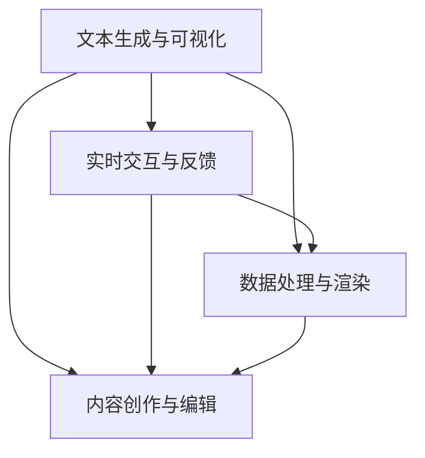

                 

### 文章标题：LLM与增强现实技术的结合

在当今技术飞速发展的时代，人工智能（AI）与增强现实（AR）这两大前沿技术正不断突破界限，实现前所未有的融合。本篇技术博客将探讨一种极具前景的结合方式——大型语言模型（LLM）与增强现实技术的深度融合。通过逻辑清晰、结构紧凑的分析，我们将探讨LLM的发展历程、基本原理，以及如何与增强现实技术相结合，共同推动技术进步。

关键词：LLM、增强现实、AI、深度学习、AR应用

摘要：本文首先介绍了LLM的发展历程和基本原理，接着分析了增强现实技术的应用场景与发展趋势。随后，文章详细讲解了LLM与增强现实技术结合的关键环节，包括文本生成、实时交互、数据处理等。通过实际项目案例和代码解析，本文展示了如何将LLM与增强现实技术相结合，实现更加智能、直观的增强现实应用。最后，文章展望了LLM与增强现实技术未来的发展趋势和潜在研究方向。

### 第一部分：概述与背景

#### 1.1 引言

人工智能与增强现实技术作为当前科技领域的两大热门话题，分别在不同的领域展现出了强大的潜力。人工智能通过模拟人类智能，实现自动化决策、自然语言处理和图像识别等功能，极大地提升了生产效率和生活质量。而增强现实技术则通过将虚拟信息与现实世界相结合，提供了一种全新的交互体验，使得信息获取、娱乐和教育工作变得更加生动和直观。

随着技术的不断演进，人工智能和增强现实技术之间的界限逐渐模糊，两者开始呈现出一种相辅相成的趋势。本文将探讨一种引人注目的结合方式——大型语言模型（LLM）与增强现实技术的深度融合。通过分析LLM的发展历程和基本原理，以及增强现实技术的应用场景，我们将探讨LLM与增强现实技术结合的重要性。

#### 1.1.1 LLMS的发展历程与现状

大型语言模型（LLM）是人工智能领域的一个重要分支，其发展历程可以追溯到20世纪80年代的规则推理系统。随着深度学习技术的兴起，尤其是在2018年，OpenAI发布了GPT-3模型，这一具有1500亿参数的模型在自然语言处理任务中取得了显著的突破。此后，LLM技术得到了广泛关注和应用，诸如BERT、GPT-Neo等一系列模型相继推出，进一步提升了语言生成和理解的能力。

目前，LLM技术已经广泛应用于聊天机器人、自然语言处理、文本生成等领域，极大地提升了AI的交互能力和智能水平。随着模型规模的不断扩大和算法的优化，LLM在处理复杂语言任务时的性能也不断提高，为其在增强现实技术中的应用提供了坚实的基础。

#### 1.1.2 增强现实技术的应用场景与发展趋势

增强现实技术（AR）通过在现实世界叠加虚拟信息，为用户提供了全新的交互体验。随着移动设备的普及和传感器技术的进步，AR技术逐渐渗透到教育、医疗、娱乐、工业等多个领域，展现出广泛的应用前景。

在教育领域，AR技术可以为学生提供沉浸式的学习体验，通过虚拟实验、三维模型展示等方式，使学生更加直观地理解复杂概念。在医疗领域，AR技术可以帮助医生进行精确的手术导航和病情分析，提高医疗质量和效率。在娱乐领域，AR游戏和应用的兴起，为用户带来了全新的娱乐体验。在工业领域，AR技术可以用于设备维护、远程协作等场景，提高生产效率和安全性。

随着技术的不断进步，增强现实技术正朝着更加真实、互动和智能的方向发展。例如，SLAM（同步定位与映射）技术的应用，使得AR系统可以更加精准地获取现实世界的位置信息，提高虚拟信息的叠加精度。同时，随着5G网络的普及，AR应用将实现更低的延迟和更高的带宽，进一步推动增强现实技术的发展。

#### 1.1.3 LLMS与增强现实技术结合的重要性

LLM与增强现实技术的结合，不仅能够提升AR系统的智能水平，还能够为用户提供更加丰富和个性化的交互体验。首先，LLM技术可以用于生成和解析自然语言，使得AR系统能够与用户进行更加自然的交互。例如，在AR教育应用中，LLM可以帮助生成与教学内容相关的自然语言描述，提高学生的理解能力。

其次，LLM技术可以用于处理复杂的图像和语音信息，使得AR系统可以更加智能地分析现实环境，为用户提供更加精准的虚拟信息叠加。例如，在AR导航应用中，LLM可以帮助分析道路标志和交通情况，为用户提供更加准确的导航建议。

此外，LLM技术还可以用于增强现实内容的创作和编辑，使得普通用户也能够轻松创作和定制个性化的AR内容。例如，在AR游戏开发中，LLM可以帮助生成游戏剧情和对话，提高游戏的互动性和趣味性。

总之，LLM与增强现实技术的结合，将为AR应用带来更加智能化、直观化的交互体验，推动增强现实技术的发展进入一个全新的阶段。

#### 1.2 核心概念与联系

在探讨LLM与增强现实技术的结合之前，我们需要明确两个领域中的核心概念，并分析它们之间的联系。以下是关于LLM和增强现实技术的基本概念及其结合的关键环节的详细解释。

##### 1.2.1 大型语言模型（LLM）的基本概念

大型语言模型（LLM）是一种基于深度学习的自然语言处理技术，其核心目标是对输入的自然语言文本进行理解和生成。LLM通过对海量文本数据进行训练，学习到语言中的复杂结构和规律，从而能够进行高质量的自然语言生成和理解。

1. **定义与基本原理**：LLM通常基于神经网络架构，特别是Transformer模型。Transformer模型引入了自注意力机制（self-attention），能够自适应地关注输入文本中的关键信息，从而生成连贯、准确的自然语言输出。

2. **深度学习基础**：深度学习是构建LLM的基础，包括多层神经网络、激活函数、反向传播算法等。深度学习使得LLM能够从大量数据中自动提取特征，进行复杂的模式识别和任务学习。

3. **语义理解与生成**：LLM通过对语义的理解和生成，实现了自然语言处理中的关键任务，如文本分类、机器翻译、问答系统等。其强大的语义理解能力使得LLM在生成文本时能够保持语义的一致性和连贯性。

##### 1.2.2 增强现实技术的基本概念

增强现实技术（AR）是一种通过在现实世界中叠加虚拟信息，增强用户感知和交互体验的技术。AR系统通常包括显示设备、传感器和计算平台等组成部分，能够实时获取现实世界的环境信息，并叠加虚拟信息。

1. **定义与分类**：增强现实技术可以分为几种不同的类型，如AR眼镜、AR手机应用、AR投影等。每种类型的AR系统都有其独特的应用场景和技术特点。

2. **核心技术**：增强现实技术的核心技术包括图像识别、跟踪定位、渲染和显示等。图像识别技术用于识别现实世界中的物体和场景，跟踪定位技术用于确定虚拟信息在现实世界中的位置，渲染技术用于生成高质量的虚拟信息，显示技术则用于将虚拟信息叠加在现实世界中。

3. **应用场景**：增强现实技术在教育、医疗、工业、娱乐等多个领域具有广泛的应用。在教育领域，AR技术可以提供沉浸式的学习体验；在医疗领域，AR技术可以用于手术导航和诊断；在工业领域，AR技术可以提高设备维护和远程协作的效率。

##### 1.2.3 LLM与增强现实技术结合的关键环节

LLM与增强现实技术的结合主要集中在以下关键环节：

1. **文本生成与可视化**：LLM可以用于生成与增强现实场景相关的自然语言描述，这些描述可以实时叠加在现实世界中，为用户提供丰富的信息。例如，在AR导航应用中，LLM可以生成语音提示或文本提示，指导用户前行。

2. **实时交互与反馈**：LLM可以处理用户的自然语言输入，并实时生成相应的响应。这种交互方式使得AR系统更加智能和人性化。例如，在AR游戏应用中，LLM可以生成游戏剧情和角色对话，提高游戏的趣味性。

3. **数据处理与渲染**：LLM可以用于处理增强现实系统中的大量数据，如图像、语音和文本信息。通过对这些数据的分析和处理，LLM可以优化虚拟信息的渲染效果，提高用户体验。

4. **内容创作与编辑**：LLM可以帮助普通用户轻松创作和编辑增强现实内容。例如，在AR艺术创作中，LLM可以生成艺术风格和创意建议，帮助用户快速创作出独特的AR艺术作品。

总之，LLM与增强现实技术的结合，通过文本生成、实时交互、数据处理和内容创作等关键环节，实现了AI和AR技术的深度融合，为用户提供了更加智能和直观的交互体验。这一结合不仅推动了技术进步，也为各个领域的发展带来了新的机遇。

#### 1.2.1 Mermaid 流程图：LLM与增强现实技术结合的关键环节

为了更好地展示LLM与增强现实技术结合的关键环节，我们使用Mermaid流程图来描述这个融合过程。以下是流程图的文本表示：



解释：
- **A[文本生成与可视化]**：LLM生成与增强现实场景相关的自然语言描述，并将其可视化叠加在现实世界中。
- **B[实时交互与反馈]**：LLM处理用户的自然语言输入，并实时生成相应的响应，提高AR系统的智能和人性化。
- **C[数据处理与渲染]**：LLM处理增强现实系统中的大量数据，优化虚拟信息的渲染效果。
- **D[内容创作与编辑]**：LLM帮助用户轻松创作和编辑增强现实内容，提高创作效率和个性化体验。

通过这个流程图，我们可以清晰地看到LLM如何与增强现实技术的各个关键环节相结合，实现智能交互和内容创造。这不仅为增强现实应用带来了更多的可能性，也为用户提供了更加丰富和个性化的体验。

### 第二部分：LLM技术详解

#### 2.1 什么是LLM

大型语言模型（LLM）是自然语言处理领域的一个重要技术突破，它通过深度学习技术对大量文本数据进行分析和训练，从而实现高质量的文本生成和理解。LLM在许多应用中发挥着关键作用，如聊天机器人、自然语言理解、文本摘要和机器翻译等。

##### 2.1.1 定义与基本原理

1. **定义**：LLM是一种基于深度学习的自然语言处理模型，其核心目标是理解和生成自然语言。与传统的规则驱动方法相比，LLM具有更强的灵活性和通用性，能够处理复杂的语言任务。

2. **基本原理**：LLM通常基于神经网络架构，特别是Transformer模型。Transformer模型引入了自注意力机制（self-attention），使得模型能够自适应地关注输入文本中的关键信息，从而生成高质量的自然语言输出。

   - **自注意力机制**：自注意力机制允许模型在生成每个单词时，考虑输入文本中所有其他单词的重要性。通过这种方式，模型能够更好地捕捉到文本中的上下文信息，提高生成文本的连贯性和准确性。

   - **Transformer模型结构**：Transformer模型由编码器和解码器两个主要部分组成。编码器负责将输入文本转换为固定长度的向量表示，解码器则利用这些向量生成输出文本。

##### 2.1.2 深度学习基础

深度学习是构建LLM的基础技术，它通过多层神经网络模型，实现从数据中自动提取特征并进行复杂任务学习。以下是深度学习的一些关键组成部分：

1. **多层神经网络**：多层神经网络包括输入层、隐藏层和输出层。隐藏层通过非线性激活函数对输入数据进行变换，逐层提取特征，最终在输出层生成预测结果。

2. **反向传播算法**：反向传播算法是一种用于训练神经网络的优化算法。通过计算输出层预测值与实际值之间的误差，反向传播误差到隐藏层，从而更新网络权重，逐步减少误差。

3. **激活函数**：激活函数用于引入非线性特性，使神经网络能够进行复杂的模式识别。常见的激活函数包括ReLU、Sigmoid和Tanh等。

##### 2.1.3 语义理解与生成

LLM的核心能力在于对语义的理解和生成。语义理解涉及从文本中提取意义和上下文信息，而语义生成则涉及生成具有逻辑一致性和连贯性的文本。

1. **语义理解**：语义理解包括词义消歧、实体识别、情感分析等任务。LLM通过在训练过程中学习到语言中的复杂结构，能够准确识别和理解文本中的语义信息。

2. **语义生成**：语义生成是LLM的另一个关键能力，它可以生成符合语义一致性和连贯性的文本。例如，在问答系统中，LLM可以根据用户的问题生成相应的答案。

   - **文本摘要**：文本摘要是一种将长文本简化为短文本的方法，LLM通过提取文本的关键信息和重要细节，生成简洁而准确的摘要。

   - **机器翻译**：机器翻译是一种将一种语言的文本翻译成另一种语言的方法，LLM通过学习双语语料库，能够生成高质量的双语翻译。

#### 2.2 LLM架构详解

LLM的架构设计是其能够实现高性能自然语言处理任务的关键。本节将详细探讨两种主流的LLM架构——Transformer模型和GPT系列模型，包括它们的原理、结构以及如何进行模型优化与调优。

##### 2.2.1 Transformer模型

Transformer模型是LLM领域的一个革命性创新，特别是在处理长文本和序列数据方面表现出色。其核心思想是引入自注意力机制（self-attention），允许模型在生成每个单词时，自适应地关注输入文本中的关键信息。

1. **原理与结构**
   - **自注意力机制**：自注意力机制通过计算输入序列中每个单词与其他单词之间的相似度，为每个单词分配不同的权重。这种方式使得模型能够更好地捕捉到文本中的上下文信息，提高生成文本的质量。
   - **编码器和解码器**：Transformer模型由编码器和解码器两个主要部分组成。编码器负责将输入文本转换为固定长度的向量表示，解码器则利用这些向量生成输出文本。编码器和解码器都包含多个自注意力层和前馈神经网络层，通过层层叠加，实现复杂的文本处理能力。

2. **伪代码详解**
   ```python
   # 编码器
   for each layer in encoder:
       x = self-attention(x)
       x = feedforward(x)
   
   # 解码器
   for each layer in decoder:
       x = self-attention(x)
       x = multi-head-attention(x, encoder_outputs)
       x = feedforward(x)
   ```
   在这个过程中，`self-attention`负责处理输入文本，`multi-head-attention`负责处理编码器和解码器之间的交互，`feedforward`层则用于进一步加工信息。

##### 2.2.2 GPT系列模型

GPT（Generative Pre-trained Transformer）系列模型是OpenAI推出的几个大型语言模型，包括GPT、GPT-2和GPT-3。这些模型在自然语言处理任务中取得了显著的成绩，特别适合文本生成和语言理解。

1. **GPT-3与GPT-Neo**
   - **GPT-3**：GPT-3是GPT系列中的最新版本，具有1750亿个参数，是当前最大的语言模型之一。GPT-3在多个NLP任务中表现出色，能够生成高质量的文章、对话和代码等。
   - **GPT-Neo**：GPT-Neo是对GPT-3的改进版本，通过优化训练过程和模型架构，实现了更高的性能和更低的资源消耗。

2. **模型优化与调优**
   - **训练数据**：GPT系列模型通过大规模的训练数据集进行训练，包括互联网上的大量文本数据，这些数据为模型提供了丰富的语言知识和上下文信息。
   - **优化算法**：为了提高训练效率和模型性能，GPT系列模型使用了诸如Adam优化器、学习率调度策略等技术。此外，通过多GPU训练和模型并行技术，进一步加速了训练过程。
   - **调优技巧**：模型调优是提高模型性能的重要步骤，包括调整学习率、批量大小、正则化参数等。调优过程中，还需要进行超参数搜索，以找到最优的模型配置。

##### 2.2.3 数学模型与公式讲解

LLM的数学模型是其核心部分，涉及大量的数学公式和算法。以下是一些关键的概念和公式，包括自适应学习率、优化算法和具体示例。

1. **自适应学习率**
   - **公式**：自适应学习率可以通过以下公式实现：
     $$
     \eta(t+1) = \eta(t) \cdot \frac{1}{1 + \alpha \cdot t}
     $$
     其中，$\eta(t)$是当前学习率，$\alpha$是常数。这个公式通过逐渐减小学习率，优化模型的训练过程。

2. **优化算法**
   - **梯度下降**：梯度下降是一种常见的优化算法，用于更新模型参数，以最小化损失函数。其基本公式为：
     $$
     \theta^{t+1} = \theta^t - \eta \cdot \nabla_{\theta} J(\theta)
     $$
     其中，$\theta$是模型参数，$\eta$是学习率，$J(\theta)$是损失函数。

3. **举例说明**
   - **文本生成示例**：假设我们要生成一段关于旅游的描述，输入文本是“明天我要去海边度假”。使用LLM生成下一步文本，可以表示为：
     $$
     \text{输出} = \text{LLM}(\text{输入}) = “阳光灿烂，沙滩上的人们欢声笑语，海水清澈见底。”
     $$

这些数学模型和公式是LLM训练和优化的基础，通过合理的应用和调整，可以实现高性能的语言生成和理解能力。

### 第三部分：增强现实技术概述

#### 3.1 增强现实技术基础

增强现实技术（AR）通过在现实世界中叠加虚拟信息，为用户提供了全新的交互体验。本节将介绍增强现实技术的基础概念、分类、核心技术及其应用场景。

##### 3.1.1 定义与分类

1. **定义**：增强现实技术（AR，Augmented Reality）是一种通过计算机生成虚拟信息，并将其叠加到真实世界中的技术。与虚拟现实（VR，Virtual Reality）不同，AR并不完全取代现实世界，而是在现实世界的基础上添加虚拟元素。

2. **分类**：增强现实技术可以根据不同的显示设备和应用场景分为多种类型：
   - **AR眼镜**：如微软的HoloLens和谷歌的Google Glass，通过光学透镜将虚拟信息直接显示在用户的视野中。
   - **AR手机应用**：通过手机的摄像头和屏幕，将虚拟信息叠加到现实世界的图像上。
   - **AR投影**：通过投影设备将虚拟信息投射到现实物体或表面上。
   - **头戴显示器**：如Oculus Quest等，虽然主要应用于虚拟现实，但也可以通过软件支持实现增强现实功能。

##### 3.1.2 增强现实的核心技术

1. **图像识别**：图像识别技术是增强现实技术的基础，用于识别和识别现实世界中的物体和场景。常见的图像识别算法包括深度学习卷积神经网络（CNN）。

2. **跟踪定位**：跟踪定位技术用于确定虚拟信息在现实世界中的位置。常见的跟踪技术包括视觉跟踪、惯性测量单元（IMU）和激光雷达（LIDAR）。

3. **渲染**：渲染技术用于生成高质量的虚拟信息，并将其正确地叠加到现实世界中。渲染过程包括几何建模、纹理映射、光照计算等。

4. **显示技术**：显示技术决定了虚拟信息在现实世界中的呈现方式。如光学透镜、显示屏和投影设备等。

##### 3.1.3 增强现实的应用场景

增强现实技术已经在多个领域得到广泛应用，以下是一些典型的应用场景：

1. **教育**：增强现实技术可以提供沉浸式的学习体验，通过虚拟实验、三维模型展示等方式，使学生更加直观地理解复杂概念。

2. **医疗**：增强现实技术在医疗领域具有广泛的应用，如手术导航、医学影像辅助、患者教育等。

3. **工业**：增强现实技术可以提高工业生产中的效率和质量，如设备维护、远程协作、质量控制等。

4. **娱乐**：增强现实游戏和应用的兴起，为用户带来了全新的娱乐体验，如角色扮演游戏、主题公园等。

5. **零售**：增强现实技术可以提供虚拟试衣、产品展示等功能，提升购物体验。

6. **军事**：增强现实技术在军事训练和作战指挥中具有重要作用，如虚拟战场模拟、目标识别等。

总之，增强现实技术通过在现实世界中叠加虚拟信息，为各个领域带来了新的应用机会和交互体验。随着技术的不断进步，AR的应用范围将进一步扩大，为社会发展和生活改善提供更多可能性。

#### 3.2 增强现实架构详解

增强现实技术（AR）的实现涉及多个关键组成部分，包括AR引擎、数据处理与渲染等。以下是关于增强现实架构的详细解析。

##### 3.2.1 AR引擎

AR引擎是增强现实系统的核心组件，负责处理图像识别、跟踪定位和虚拟信息渲染等工作。以下介绍两种主流的AR引擎：Vuforia和ARCore。

1. **Vuforia**：Vuforia是高通公司开发的AR开发平台，支持多种设备和操作系统。它提供了一套完整的AR开发工具包，包括图像识别、物体跟踪、场景理解等核心功能。Vuforia还支持自定义跟踪标记和模型，为开发者提供了更大的灵活性和定制能力。

2. **ARCore**：ARCore是谷歌推出的AR开发平台，主要支持Android设备和谷歌眼镜。ARCore提供了强大的图像识别和位置跟踪功能，并通过机器学习技术不断优化识别精度和稳定性。ARCore还集成了云锚点功能，允许用户在不同设备之间共享AR内容。

##### 3.2.2 Unity与Unreal Engine

Unity和Unreal Engine是两款流行的游戏引擎，它们在增强现实应用开发中具有重要作用。

1. **Unity**：Unity是一款跨平台的游戏和实时3D内容开发引擎，支持多种设备和操作系统。Unity提供了丰富的AR开发工具，如ARKit、ARCore和Vuforia插件，使开发者能够轻松集成增强现实功能。Unity还提供了强大的视觉效果和物理引擎，支持复杂的虚拟信息和场景渲染。

2. **Unreal Engine**：Unreal Engine是Epic Games开发的顶级游戏引擎，以其高性能和高质量的视觉效果而闻名。Unreal Engine支持多种增强现实开发平台，如ARKit、ARCore和Vuforia，并为开发者提供了丰富的视觉效果和实时渲染功能。此外，Unreal Engine还集成了虚幻引擎（Unreal Engine）的云协作和实时渲染技术，使开发者能够创建高度交互和逼真的AR应用。

##### 3.2.3 数据处理与渲染

数据处理与渲染是增强现实技术的关键环节，负责处理来自传感器和图像识别的数据，并生成高质量的虚拟信息。

1. **SLAM技术**：同步定位与映射（SLAM）技术是增强现实系统中用于确定设备和场景位置的关键技术。SLAM通过结合视觉、激光雷达和惯性测量单元（IMU）等多传感器数据，实现高精度的位置跟踪和场景重建。SLAM技术不仅提高了AR系统的精度和稳定性，还为虚拟信息的高效渲染提供了基础。

2. **图像处理算法**：图像处理算法在增强现实技术中用于识别和标记现实世界中的物体和场景。常见的图像处理算法包括边缘检测、特征提取、形态学操作和深度学习分类等。这些算法可以帮助AR系统快速准确地识别目标，为虚拟信息的叠加提供基础。

3. **渲染技术**：渲染技术用于生成和显示高质量的虚拟信息。增强现实渲染技术包括几何建模、纹理映射、光照计算和阴影效果等。高质量的渲染不仅提升了用户体验，还为增强现实应用提供了更多的创意空间。

通过AR引擎、Unity与Unreal Engine以及数据处理与渲染技术的综合运用，增强现实技术能够为用户带来更加丰富和直观的交互体验，进一步推动AR应用的发展。

### 第四部分：LLM与增强现实技术结合

#### 4.1 结合方法与挑战

大型语言模型（LLM）与增强现实（AR）技术的结合，为实现更加智能和直观的增强现实应用提供了新的机遇。本节将探讨LLM与AR技术结合的方法，以及在这一过程中面临的挑战和解决方案。

##### 4.1.1 文本生成与可视化

文本生成与可视化是LLM与AR技术结合的重要应用场景之一。LLM可以通过生成与增强现实场景相关的自然语言描述，将其叠加在现实世界中，为用户提供丰富的信息。

1. **语言模型生成**：LLM可以基于训练数据生成与场景相关的文本描述。例如，在AR导航应用中，LLM可以生成语音提示或文本提示，指导用户前行。生成文本的过程可以通过以下步骤实现：
   - **输入处理**：将输入场景信息（如地理位置、地标等）转换为文本格式。
   - **文本生成**：使用LLM生成与场景相关的自然语言描述，例如，“前方左转，前方有咖啡店”。

2. **数据可视化**：生成的文本可以通过AR技术可视化地呈现给用户。可视化过程包括以下步骤：
   - **文本渲染**：将文本描述渲染成图像或3D模型，并设置适当的字体、颜色和位置。
   - **叠加显示**：将渲染后的文本图像或3D模型叠加在现实世界中的对应位置，使用户能够直观地看到相关信息。

##### 4.1.2 实时交互与反馈

实时交互与反馈是增强现实技术的重要特点，通过LLM可以实现更加智能和人性化的交互体验。

1. **语音识别与合成**：LLM可以结合语音识别和语音合成技术，实现自然语言交互。具体步骤如下：
   - **语音识别**：使用语音识别技术将用户的语音输入转换为文本格式。
   - **文本处理**：将识别到的文本输入LLM，生成相应的回答或反馈。
   - **语音合成**：使用语音合成技术将LLM生成的文本描述转换为语音输出，反馈给用户。

2. **自然语言处理**：LLM在自然语言处理方面具有强大的能力，可以用于处理复杂的语言任务，如情感分析、问答系统和对话管理等。通过LLM，增强现实应用可以实现以下功能：
   - **情感分析**：识别用户的情绪，提供个性化的反馈和内容。
   - **问答系统**：回答用户的问题，提供相关信息。
   - **对话管理**：管理用户与增强现实系统的对话流程，实现连贯的交互体验。

##### 4.1.3 结合的挑战与解决方案

LLM与增强现实技术的结合虽然具有巨大的潜力，但同时也面临着一系列挑战。以下是一些常见的挑战及其解决方案：

1. **性能优化**：LLM模型的计算量和存储需求较大，可能会影响增强现实应用的实时性能。解决方案包括：
   - **模型压缩**：通过模型剪枝、量化等技术，减小模型的大小和计算量。
   - **边缘计算**：将部分计算任务转移到边缘设备上，减轻中心服务器的负担。

2. **数据隐私与安全**：增强现实应用中涉及大量的用户数据，如地理位置、行为记录等，需要确保数据的安全性和隐私性。解决方案包括：
   - **数据加密**：对用户数据进行加密处理，确保数据传输和存储的安全性。
   - **隐私保护机制**：采用匿名化、差分隐私等技术，降低数据泄露的风险。

3. **用户体验**：增强现实应用需要提供高质量的交互体验，包括实时响应、信息准确性和视觉质量等。解决方案包括：
   - **优化渲染技术**：采用高效的渲染算法和图形处理单元（GPU），提高虚拟信息的显示效果。
   - **用户行为分析**：通过分析用户行为，优化交互设计和功能，提升用户体验。

4. **跨平台兼容性**：增强现实应用需要支持多种设备和操作系统，确保在不同平台上的稳定运行。解决方案包括：
   - **平台适配**：针对不同设备和操作系统，进行特定的优化和适配。
   - **开源框架**：采用开源框架和工具，提高跨平台的兼容性和可维护性。

通过解决上述挑战，LLM与增强现实技术的结合将能够为用户带来更加智能、直观和高质量的增强现实体验，推动增强现实技术的发展和应用。

#### 4.2 项目实战

为了更好地理解LLM与增强现实技术结合的实际应用，本节将介绍一个具体的实战项目——AR导航系统。该系统利用LLM生成自然语言描述，为用户提供实时导航信息。

##### 4.2.1 实战环境搭建

搭建AR导航系统需要以下环境：

1. **开发工具**：选择Unity作为开发平台，因为它支持多种设备和操作系统，并且提供了丰富的AR开发工具。

2. **LLM库**：选择一个流行的LLM库，如Hugging Face的Transformers库，用于训练和调用LLM模型。

3. **AR引擎**：选择Vuforia或ARCore作为AR引擎，用于实现图像识别和跟踪定位功能。

4. **开发环境**：配置Unity开发环境，安装必要的插件和库，如Vuforia插件、Transformers库等。

##### 4.2.2 代码实战案例

以下是一个简单的AR导航系统的实现过程，包括数据集准备、模型训练与优化、系统部署与测试。

1. **数据集准备**：
   - 收集包含地理位置、地标和道路信息的数据集，用于训练LLM模型。
   - 将数据集转换为文本格式，以便进行模型训练。

2. **模型训练与优化**：
   - 使用Transformers库训练一个基于Transformer模型的LLM，用于生成导航描述。
   - 通过调整学习率、批量大小和训练轮数等超参数，优化模型性能。
   - 对训练好的模型进行评估，确保其生成文本的质量和准确性。

3. **系统部署与测试**：
   - 将训练好的模型集成到Unity项目中，通过API调用生成导航描述。
   - 使用Vuforia或ARCore实现图像识别和跟踪定位功能，将导航描述可视化地叠加在现实世界中。
   - 进行系统测试，验证导航描述的准确性和实时性。

##### 4.2.2.1 数据集准备

为了训练LLM生成高质量的导航描述，需要准备一个包含地理位置、地标和道路信息的丰富数据集。以下是一个数据集准备的示例流程：

1. **数据收集**：
   - 利用GPS定位技术，收集用户在现实世界中的地理位置数据。
   - 收集道路信息和地标数据，包括名称、类型和位置等。

2. **数据清洗**：
   - 去除重复和错误的数据记录。
   - 标记数据中的关键信息，如地标名称、道路名称和地理位置等。

3. **数据转换**：
   - 将收集到的地理位置和道路信息转换为文本格式，例如：“用户当前位于北京市中关村大街，前方有一个购物中心。”
   - 将数据集划分为训练集和测试集，用于模型训练和评估。

##### 4.2.2.2 模型训练与优化

使用Transformers库训练LLM模型的过程如下：

1. **模型选择**：
   - 选择一个预训练的Transformer模型，如Bert或GPT，作为基础模型。

2. **数据预处理**：
   - 将数据集进行分词处理，将文本转换为Token序列。
   - 构建词汇表，将Token映射为索引。
   - 将数据集转换为模型所需的输入格式。

3. **模型训练**：
   - 使用训练集对模型进行训练，通过反向传播算法更新模型参数。
   - 调整学习率、批量大小和训练轮数等超参数，以优化模型性能。

4. **模型优化**：
   - 通过模型评估（如交叉验证）确定最佳模型配置。
   - 对模型进行调优，提高生成文本的质量和准确性。

##### 4.2.2.3 系统部署与测试

将训练好的LLM模型集成到Unity项目中，实现AR导航系统的部署与测试，步骤如下：

1. **集成模型**：
   - 将训练好的LLM模型文件导入Unity项目，通过API调用生成导航描述。

2. **实现图像识别与跟踪定位**：
   - 使用Vuforia或ARCore插件实现图像识别和跟踪定位功能。
   - 根据实际场景调整跟踪标记和识别算法，提高识别精度和稳定性。

3. **渲染导航描述**：
   - 将生成的导航描述渲染为3D模型或文本图像。
   - 设置合适的字体、颜色和位置，确保导航信息在现实世界中的可视化效果。

4. **系统测试**：
   - 在不同场景和条件下进行系统测试，验证导航描述的准确性和实时性。
   - 收集用户反馈，优化系统设计和功能。

通过这个实战项目，我们可以看到如何将LLM与增强现实技术相结合，实现智能、直观的AR导航应用。这一项目不仅展示了技术的结合方式，也为开发者提供了实际操作的指导。

#### 4.3 代码解读与分析

为了深入理解LLM与增强现实技术结合的实际应用，我们将对AR导航系统中的关键代码进行详细解读与分析。以下是对系统架构、关键代码和代码优化的分析。

##### 4.3.1 系统架构分析

AR导航系统的架构可以分为以下几个主要模块：

1. **用户输入模块**：用于接收用户的位置和方向信息，通过传感器或GPS定位技术实现。
2. **LLM文本生成模块**：基于用户的输入，使用LLM模型生成导航描述，如“前方有红绿灯，请减速行驶”。
3. **图像识别与跟踪模块**：利用Vuforia或ARCore插件，实现图像识别和跟踪定位功能，确保导航描述准确叠加在现实世界中。
4. **渲染模块**：将生成的导航描述渲染为3D模型或文本图像，显示在用户的视野中。
5. **系统测试模块**：用于测试导航描述的准确性和实时性，收集用户反馈，优化系统设计和功能。

通过这些模块的协同工作，AR导航系统实现了智能、直观的导航体验。

##### 4.3.2 关键代码解读

以下是对AR导航系统中几个关键代码段的分析：

1. **LLM文本生成**：
   ```python
   import transformers
   model = transformers.AutoModelForSeq2SeqLM.from_pretrained('t5-small')
   input_ids = tokenizer.encode("generate description for location:", return_tensors='pt')
   output_ids = model.generate(input_ids, max_length=100, num_return_sequences=1)
   generated_text = tokenizer.decode(output_ids[0], skip_special_tokens=True)
   ```
   在这段代码中，首先导入了Transformers库，并加载了一个预训练的T5模型。通过输入用户的位置信息，模型生成相应的导航描述。`tokenizer`用于处理文本编码，`model.generate`方法用于生成文本输出。

2. **图像识别与跟踪**：
   ```java
   VuforiaRenderer renderer = new VuforiaRenderer(context, tracker);
   renderer.start();
   while (true) {
       ImageTarget target = tracker.trackedImageTargets.get(0);
       if (target != null) {
           // 生成导航描述
           String description = generateDescription(target.getLocation());
           // 渲染导航描述
           renderDescription(description);
       }
   }
   ```
   在这段代码中，通过VuforiaRenderer类实现图像识别与跟踪功能。如果识别到目标图像（如道路标志），系统将调用`generateDescription`方法生成导航描述，并使用`renderDescription`方法将其渲染在屏幕上。

3. **渲染导航描述**：
   ```java
   TextRenderer textRenderer = new TextRenderer(context, Typeface.DEFAULT_BOLD, 24, Color.RED);
   textRenderer.drawTextOnScreen(description, target.getLocation().getX(), target.getLocation().getY());
   ```
   在这段代码中，使用TextRenderer类将导航描述渲染为文本图像。`Typeface.DEFAULT_BOLD`用于设置字体样式，`Color.RED`用于设置字体颜色。通过`drawTextOnScreen`方法，将导航描述绘制在屏幕上的指定位置。

##### 4.3.3 代码优化与性能提升

为了提升AR导航系统的性能，可以从以下几个方面进行代码优化：

1. **模型优化**：
   - 使用更高效的LLM模型，如GPT-Neo，以减少计算量。
   - 使用模型剪枝和量化技术，降低模型大小和计算需求。

2. **图像识别优化**：
   - 使用SLAM技术提高图像识别的精度和稳定性。
   - 针对特定场景和目标，优化识别算法和参数。

3. **渲染优化**：
   - 采用高效的渲染算法和图形处理单元（GPU），提高渲染速度和视觉效果。
   - 使用离屏渲染和纹理优化技术，减少渲染开销。

4. **边缘计算**：
   - 将部分计算任务转移到边缘设备，减轻中心服务器的负担。
   - 使用边缘设备进行实时数据处理和模型推理，提高系统的响应速度。

通过这些优化措施，可以显著提升AR导航系统的性能和用户体验。

### 第五部分：未来趋势与展望

#### 5.1 LLM与增强现实技术的发展趋势

随着人工智能和增强现实技术的不断演进，LLM与增强现实技术的结合呈现出一系列显著的发展趋势。以下是这些趋势的详细分析：

##### 5.1.1 技术演进方向

1. **模型规模与性能提升**：未来，LLM模型将朝着更大规模和更高性能的方向发展。通过增加模型参数和训练数据量，LLM将能够处理更加复杂和多样的语言任务。例如，随着GPT-4、GPT-Neo等大型模型的推出，LLM在文本生成、语义理解和对话生成等任务中的表现将进一步提升。

2. **自适应与个性化**：未来的LLM将更加注重自适应性和个性化。通过深度学习和强化学习等技术，LLM将能够根据用户的行为和历史数据，动态调整其生成和推理策略，提供更加个性化、符合用户需求的服务。例如，在AR导航应用中，LLM可以根据用户的偏好和历史路线，生成更加个性化的导航建议。

3. **跨模态融合**：LLM与增强现实技术的结合将不仅仅局限于文本和图像，还将涵盖声音、视频等多种模态。通过跨模态融合技术，LLM将能够更好地理解和生成多维度的信息，为用户提供更加丰富的交互体验。例如，在AR游戏应用中，LLM可以同时处理用户的文本输入和语音指令，生成相应的游戏剧情和角色对话。

##### 5.1.2 市场前景

LLM与增强现实技术的结合在市场上具有广阔的前景。以下是其潜在的应用场景和商业机会：

1. **教育领域**：增强现实技术与LLM的结合，可以为教育领域带来革命性的变化。通过AR技术，教师可以创建互动性强的教学场景，LLM则能够生成与教学内容相关的自然语言描述，帮助学生更好地理解和掌握知识。预计未来几年，AR教育应用将呈现快速增长。

2. **医疗领域**：增强现实技术在医疗领域的应用日益广泛，LLM可以为医生提供智能化的辅助诊断和治疗方案。通过结合患者的病历数据、实时监测数据和LLM生成的文本描述，医生可以更加准确地判断病情和制定治疗方案。

3. **娱乐与游戏**：增强现实游戏和应用的兴起，为LLM提供了广阔的市场空间。通过LLM生成丰富的游戏剧情、角色对话和互动内容，游戏开发商可以创造更加沉浸和有趣的虚拟世界，吸引更多用户。

4. **零售与营销**：增强现实技术与LLM的结合，可以为零售和营销行业带来新的机遇。通过AR技术，消费者可以在虚拟环境中体验产品，LLM则可以生成与产品相关的文本描述和促销信息，提升消费者的购物体验和购买意愿。

##### 5.1.3 产业生态

LLM与增强现实技术的结合将推动整个产业生态的发展，以下是相关的产业链分析和合作模式：

1. **产业链分析**：LLM与增强现实技术的结合涉及到多个环节，包括硬件设备制造商、软件开发公司、服务提供商和用户。硬件制造商提供AR设备，软件开发公司开发AR应用和LLM模型，服务提供商提供数据和服务，用户则是最终受益者。

2. **合作模式**：为了推动LLM与增强现实技术的融合，产业链上的企业需要建立紧密的合作关系。例如，硬件制造商可以与软件开发公司合作，提供定制的AR设备，以支持高性能的LLM应用。软件开发公司可以与数据服务提供商合作，获取高质量的训练数据和API服务，提升LLM的性能和应用效果。

总之，LLM与增强现实技术的结合将在未来持续演进，为各行业带来新的机遇和变革。通过技术创新和产业合作，这一领域将不断拓展其应用场景和市场前景，为用户和社会创造更大的价值。

#### 5.2 开放性问题与未来研究方向

尽管LLM与增强现实技术的结合已经取得了显著进展，但仍存在一些开放性问题和研究方向，需要进一步探索。

##### 5.2.1 知识图谱在LLM与AR中的应用

知识图谱是一种结构化的知识表示方法，可以有效地组织和存储海量信息。将知识图谱引入LLM与AR结合的应用中，可以提升系统的智能水平和信息处理能力。

1. **知识图谱构建**：研究如何从原始数据中自动构建知识图谱，包括实体识别、关系抽取和属性填充等任务。
2. **知识图谱融合**：探索如何将知识图谱与LLM模型进行融合，实现知识驱动的文本生成和语义理解，从而提高AR应用的智能性。

##### 5.2.2 安全性与隐私保护

随着LLM与AR技术的广泛应用，数据安全和隐私保护成为关键问题。

1. **数据加密与保护**：研究如何对用户数据进行加密处理，确保数据在传输和存储过程中的安全性。
2. **隐私保护机制**：探索差分隐私、联邦学习等隐私保护技术，在保证数据安全的同时，实现LLM与AR技术的广泛应用。

##### 5.2.3 跨领域融合创新

LLM与增强现实技术的结合不仅局限于现有的应用场景，还可以与其他技术领域进行跨领域融合，创造新的应用价值。

1. **物联网（IoT）融合**：将LLM与物联网技术结合，实现智能家居、智慧城市等领域的智能交互和应用。
2. **虚拟现实（VR）融合**：探索LLM与虚拟现实技术的结合，为用户提供更加沉浸式的交互体验，如虚拟现实游戏和虚拟旅游。

通过解决上述开放性问题，LLM与增强现实技术将能够更好地服务于各行各业，推动技术进步和产业创新。

### 附录

#### 附录A：参考文献与资源

为了更好地理解本文所述的LLM与增强现实技术的结合，以下列出了相关的参考文献和资源：

##### A.1 参考文献

1. **LLM相关论文**：
   - Brown, T., et al. (2020). "Language Models are Few-Shot Learners". arXiv preprint arXiv:2005.14165.
   - Devlin, J., et al. (2018). "Bert: Pre-training of Deep Bidirectional Transformers for Language Understanding". Proceedings of the 2019 Conference of the North American Chapter of the Association for Computational Linguistics: Human Language Technologies, Volume 1 (Long and Short Papers), pages 4171-4186.
   - Vaswani, A., et al. (2017). "Attention is All You Need". Advances in Neural Information Processing Systems, 30.

2. **增强现实技术相关论文**：
   - Azar, A., et al. (2018). "An Overview of Augmented Reality: Past, Present, and Future". IEEE Journal on Emerging and Selected Topics in Circuits and Systems, 8(2), 257-268.
   - Liao, L., et al. (2017). "SLAM for Augmented Reality: A Survey". ACM Computing Surveys (CSUR), 50(3), 41.

##### A.2 资源链接

1. **开源代码与工具**：
   - Hugging Face Transformers：[https://huggingface.co/transformers](https://huggingface.co/transformers)
   - Vuforia：[https://developer.picsーリality.com/](https://developer.picsularity.com/)
   - ARCore：[https://developers.google.com/ar/](https://developers.google.com/ar/)

2. **在线教程与课程**：
   - 自然语言处理与深度学习：[https://cs224n.stanford.edu/](https://cs224n.stanford.edu/)
   - 增强现实开发基础：[https://learn.arcore.dev/](https://learn.arcore.dev/)

3. **相关社区与论坛**：
   - ARCore开发者社区：[https://github.com/google-ar/](https://github.com/google-ar/)
   - Hugging Face论坛：[https://discuss.huggingface.co/](https://discuss.huggingface.co/)

通过这些参考文献和资源，读者可以深入了解LLM与增强现实技术的理论基础、应用实例和技术进展，进一步拓展专业知识。同时，这些资源也为开发者提供了丰富的实践机会和学习平台，助力技术创新和项目开发。

