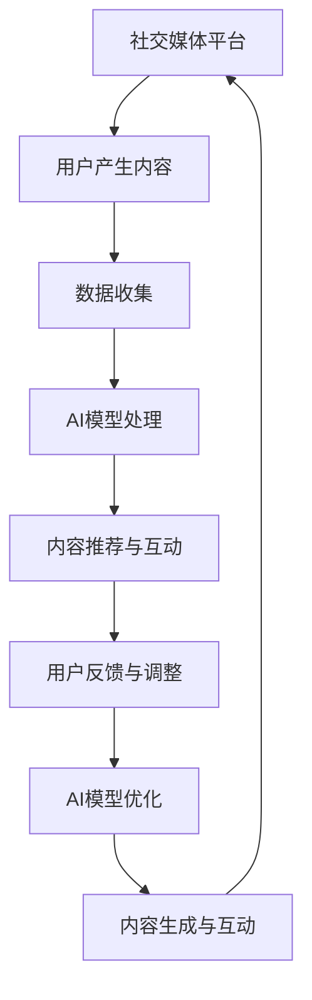
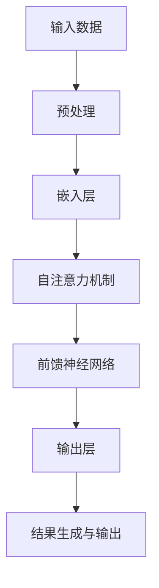

                 

## 文章标题：LLM与社交媒体：重塑在线交互

### 关键词：大型语言模型（LLM）、社交媒体、在线交互、人工智能、算法、数据分析、用户行为、隐私保护

### 摘要：

本文探讨了大型语言模型（LLM）在社交媒体平台中的应用，如何通过人工智能技术重塑在线交互体验。文章首先介绍了LLM的核心概念和与社交媒体的融合机制，随后详细讲解了LLM的工作原理和核心算法，包括语言模型训练算法、生成式对抗网络（GAN）在内容生成中的应用，以及数学模型和公式。接着，文章通过实际项目实战展示了如何在社交媒体内容生成和互动中应用LLM。随后，文章分析了LLM在社交媒体中的应用场景，如内容创作、内容审核、用户互动预测等，并探讨了自监督学习和多模态学习在LLM中的应用。文章最后展望了LLM与社交媒体互动的未来趋势，提出了优化策略和算法，以及可能面临的挑战与解决方案。

## 第一部分：核心概念与联系

### 1.1.1 AI大模型与社交媒体的融合

在当前的技术环境下，人工智能大模型（如大型语言模型（LLM））的应用已经成为社交媒体领域的重要趋势。LLM是一种能够理解和生成人类语言的高级人工智能模型，通过深度学习技术训练而成，具有强大的语言理解和生成能力。社交媒体平台，如Facebook、Twitter和Instagram等，正逐渐利用LLM技术来增强用户交互体验和平台内容分发。

#### 社交媒体平台的工作机制

在社交媒体平台上，用户产生内容（如文本、图片、视频等），这些内容会被平台收集并存储。随后，平台会对这些数据进行分析和处理，以提取出有用的信息，如用户的兴趣偏好、行为模式等。这些信息被用来优化内容推荐、广告投放和用户互动。

**Mermaid流程图：**



#### 数据处理与分析

收集到的用户数据经过预处理后，会被输入到AI模型中进行处理。LLM通过自注意力机制和递归神经网络结构，能够有效地理解和生成文本，从而实现个性化的内容推荐和互动。例如，GPT-3可以生成符合用户兴趣的帖子、评论和回复，从而提高用户的参与度和满意度。

#### 用户反馈与模型优化

用户在与平台互动的过程中，会通过点赞、评论、分享等行为表达自己的喜好和不满。这些反馈被收集并用于模型的优化。通过不断调整和优化模型参数，AI系统能够更好地理解用户需求，提供更加个性化的内容和服务。

### 1.1.2 LLM的工作原理与架构

LLM的工作原理主要基于深度学习技术，特别是递归神经网络（RNN）和Transformer架构。以下是一个简化的LLM工作流程和架构图：

**Mermaid流程图：**



#### 输入数据预处理

LLM的输入通常是文本数据。在输入模型之前，文本数据需要进行预处理，包括分词、去停用词、词向量嵌入等步骤。预处理后的文本会被转换成模型可以处理的数字形式。

#### 嵌入层

嵌入层将文本数据转换成高维向量表示。这些向量包含了文本的语义信息。常用的嵌入层包括Word2Vec、GloVe等。

#### 自注意力机制

自注意力机制是Transformer架构的核心组件。它通过计算输入文本中每个词与其他词之间的相关性，从而实现全局上下文信息的有效捕捉。自注意力机制的公式如下：

$$
\text{Attention}(Q, K, V) = \frac{1}{\sqrt{d_k}} \text{softmax}\left(\frac{QK^T}{d_k}\right) V
$$

其中，$Q$、$K$和$V$分别是查询、键和值矩阵，$d_k$是键或值的维度。

#### 前馈神经网络

在自注意力机制之后，文本数据会经过前馈神经网络进行进一步处理。前馈神经网络由多个全连接层组成，可以捕捉更复杂的非线性关系。

#### 输出层与结果生成

输出层将处理后的文本数据转换成模型需要生成的形式，如文本、回答或建议。输出层的输出通常是一个概率分布，通过softmax函数转换为具体的输出结果。

### 总结

AI大模型与社交媒体的融合正在改变我们的在线交互方式。通过LLM技术，社交媒体平台能够提供更加个性化、智能化的服务，从而提高用户的参与度和满意度。LLM的工作原理和架构使得这种融合成为可能，同时也为我们带来了许多新的挑战和机会。

## 第一部分：核心算法原理讲解

在深入了解大型语言模型（LLM）在社交媒体中的应用之前，我们首先需要了解LLM的核心算法原理。LLM的核心算法主要包括语言模型训练算法、生成式对抗网络（GAN）在内容生成中的应用，以及相关的数学模型与公式。以下是对这些算法的详细讲解。

### 2.1 语言模型训练算法

语言模型（Language Model, LM）是一种用于预测文本序列的概率分布的模型。训练语言模型的目的是使模型能够学会自然语言中的语法和语义规则，从而能够生成或理解自然语言文本。常见的语言模型训练算法包括基于循环神经网络（RNN）的模型和基于Transformer的模型。

#### 语言模型训练算法伪代码：

```python
def train_language_model(data):
    for epoch in range(num_epochs):
        for sentence in data:
            # 预处理句子
            preprocessed_sentence = preprocess(sentence)
            
            # 计算损失
            loss = calculate_loss(preprocessed_sentence)
            
            # 反向传播
            backward_pass(loss)
            
            # 更新模型参数
            update_model_params()
```

在训练过程中，每个句子都会被编码为数字序列，然后输入到模型中进行预测。模型会根据预测结果和实际标签计算损失，并通过反向传播更新模型参数。

#### 训练过程详细说明：

1. **预处理句子**：将输入的文本句子进行分词、去停用词、词向量嵌入等处理，将其转换为一个数字序列。
2. **计算损失**：使用损失函数（如交叉熵损失函数）计算模型预测的输出和实际标签之间的差距。
3. **反向传播**：通过计算梯度，将损失反向传播到模型的每一层，以更新模型的参数。
4. **更新模型参数**：根据梯度更新模型的权重和偏置，使模型更接近真实数据的分布。

### 2.2 生成式对抗网络（GAN）在内容生成中的应用

生成式对抗网络（Generative Adversarial Network, GAN）是一种由两个神经网络组成的框架，一个生成器（Generator）和一个判别器（Discriminator）。生成器的任务是生成尽可能真实的样本，而判别器的任务是区分真实样本和生成器生成的样本。GAN在图像生成、文本生成等领域有广泛的应用。

#### GAN训练算法伪代码：

```python
def train_gan(generator, discriminator, data):
    for epoch in range(num_epochs):
        for real_sentence in data:
            # 生成虚假句子
            fake_sentence = generator.generate(real_sentence)
            
            # 训练判别器
            real_output = discriminator(real_sentence)
            fake_output = discriminator(fake_sentence)
            discriminator_loss = calculate_discriminator_loss(real_output, fake_output)
            
            # 训练生成器
            generator_loss = calculate_generator_loss(fake_output)
            
            # 反向传播
            backward_pass(generator_loss, discriminator_loss)
            
            # 更新模型参数
            update_model_params(generator, discriminator)
```

#### GAN训练过程详细说明：

1. **生成虚假句子**：生成器根据真实的句子生成新的句子。
2. **训练判别器**：判别器接收真实的句子和生成器生成的句子，并计算两者的损失。
   - **计算判别器损失**：判别器的目标是最大化真实句子和生成句子之间的差异。常用的损失函数是二元交叉熵损失函数。
3. **训练生成器**：生成器的目标是使判别器无法区分真实句子和生成句子。生成器的损失函数通常也是二元交叉熵损失函数。
4. **反向传播**：通过计算梯度，将损失反向传播到生成器和判别器的每一层，以更新模型的参数。
5. **更新模型参数**：根据梯度更新生成器和判别器的权重和偏置，以优化生成器和判别器的性能。

### 2.3 数学模型与公式

#### 3.1 语言模型的损失函数

语言模型常用的损失函数是交叉熵损失函数（Cross-Entropy Loss），它用于衡量模型预测的输出分布和实际标签分布之间的差距。交叉熵损失函数的公式如下：

$$
L = -\sum_{i=1}^{N} y_i \log(p(y_i|x_i))
$$

其中，$L$是总损失，$N$是序列中的单词数，$y_i$是实际单词的标签，$p(y_i|x_i)$是模型预测的单词的概率。

#### 3.2 自注意力机制

自注意力机制（Self-Attention Mechanism）是Transformer模型中的一个关键组件，它通过计算输入序列中每个词与其他词之间的相关性，实现全局上下文信息的捕捉。自注意力机制的公式如下：

$$
\text{Attention}(Q, K, V) = \frac{1}{\sqrt{d_k}} \text{softmax}\left(\frac{QK^T}{d_k}\right) V
$$

其中，$Q$、$K$和$V$分别是查询（Query）、键（Key）和值（Value）矩阵，$d_k$是键或值的维度。

#### 3.3 前馈神经网络

前馈神经网络（Feedforward Neural Network）是神经网络中的一种基本结构，由多个全连接层组成。前馈神经网络通过逐层传递输入数据，每一层对输入数据进行加权求和处理，然后应用激活函数，最终得到输出。前馈神经网络的公式如下：

$$
h_{l+1} = \sigma(W_{l+1} \cdot h_l + b_{l+1})
$$

其中，$h_{l+1}$是下一层的激活值，$\sigma$是激活函数（如ReLU函数），$W_{l+1}$和$b_{l+1}$分别是权重和偏置。

### 总结

大型语言模型（LLM）的核心算法包括语言模型训练算法和生成式对抗网络（GAN）在内容生成中的应用。语言模型训练算法通过预

