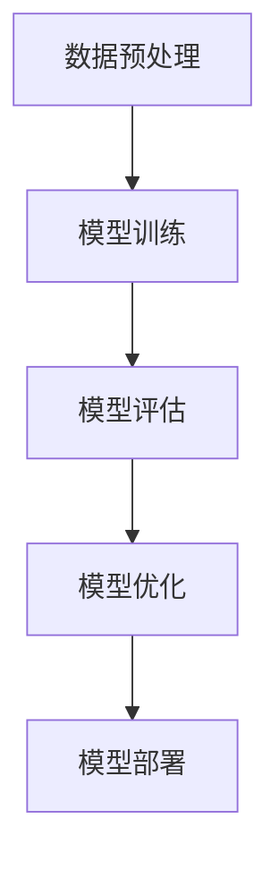
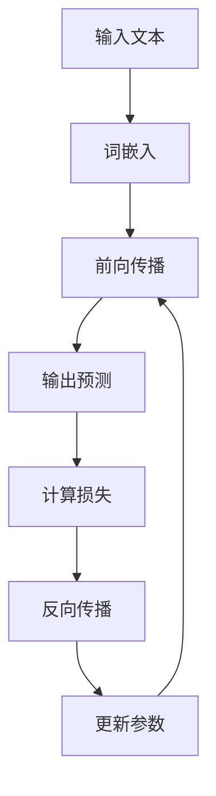

                 

# 文章标题：LLM产业链生态：从无到有的演进

> 关键词：LLM，语言模型，产业链，生态建设，技术演进

> 摘要：本文从LLM的基本概念出发，探讨了LLM在行业中的应用现状及产业链的组成。通过剖析LLM的技术基础，阐述了LLM模型开发与应用服务的关键技术。进一步，本文分析了LLM产业链中的企业角色与协作，以及国内外LLM产业链生态案例。最后，展望了LLM产业链的未来发展趋势，并提出了相应的对策建议。

### 《LLM产业链生态：从无到有的演进》目录大纲

- **第一部分: LLM产业链生态概述**
  - 第1章: LLM基本概念与行业背景
    - 1.1 什么是LLM
      - 1.1.1 LLM的定义
      - 1.1.2 LLM与NLP的关系
      - 1.1.3 LLM的应用场景
    - 1.2 行业背景
      - 1.2.1 语言模型发展的历程
      - 1.2.2 LLM在行业中的应用现状
      - 1.2.3 LLM产业链的组成部分
    - 1.3 LLM产业链的价值与挑战
      - 1.3.1 LLM产业链的价值分析
      - 1.3.2 LLM产业链的挑战与问题

- **第二部分: LLM技术基础**
  - 第2章: 语言模型的数学基础
    - 2.1 概率论与信息论基础
    - 2.2 概率分布与建模方法
    - 2.3 语言模型的评估指标
  - 第3章: 语言模型的算法原理
    - 3.1 语言模型的生成算法
    - 3.2 语言模型的学习算法
    - 3.3 语言模型的优化算法
  - 第4章: LLM在NLP中的应用
    - 4.1 文本分类
    - 4.2 命名实体识别
    - 4.3 机器翻译

- **第三部分: LLM产业链生态建设**
  - 第5章: LLM产业链的上下游环节
    - 5.1 数据集与数据预处理
    - 5.2 LLM模型开发
    - 5.3 LLM应用服务
  - 第6章: LLM产业链生态中的企业角色与协作
    - 6.1 开源与商业的平衡
    - 6.2 企业间的合作与竞争
    - 6.3 政策法规与社会责任

- **第四部分: LLM产业链生态案例研究**
  - 第7章: 国内外LLM产业链生态案例
    - 7.1 国内LLM产业链生态案例
    - 7.2 国际LLM产业链生态案例

- **第五部分: LLM产业链生态的未来发展趋势**
  - 第8章: 技术发展趋势
    - 8.1 大模型与小样本学习
    - 8.2 多模态语言模型
    - 8.3 智能化与自动化
  - 第9章: 应用场景拓展
    - 9.1 金融领域的应用
    - 9.2 医疗健康领域的应用
    - 9.3 教育与培训领域的应用
  - 第10章: 社会影响与伦理挑战
    - 10.1 LLM的社会影响力
    - 10.2 数据隐私与安全
    - 10.3 伦理与道德问题

- **附录**
  - 附录 A: LLM产业链相关资源与工具
  - 附录 B: Mermaid流程图示例

## 第一部分: LLM产业链生态概述

### 第1章: LLM基本概念与行业背景

### 第1章: LLM基本概念与行业背景

#### 1.1 什么是LLM

##### 1.1.1 LLM的定义

语言模型(Language Model, LLM)是一种基于统计或神经网络的方法，用于对自然语言进行建模。它能够根据输入的文本序列预测下一个单词或字符的概率分布。LLM是自然语言处理(Natural Language Processing, NLP)的核心技术之一。

##### 1.1.2 LLM与NLP的关系

自然语言处理（NLP）是一个涉及多种技术的领域，它致力于使计算机能够理解和处理人类语言。语言模型（LLM）作为NLP的核心技术之一，与其他NLP技术如文本分类、情感分析、命名实体识别等密切相关。

##### 1.1.3 LLM的应用场景

LLM在各种应用场景中发挥着重要作用，如自动问答系统、智能客服、机器翻译、文本生成等。

#### 1.2 行业背景

##### 1.2.1 语言模型发展的历程

从最早的统计语言模型（如N-gram模型）到现代的深度神经网络语言模型（如BERT、GPT系列），语言模型经历了数十年的发展。近年来，随着计算能力和数据量的提升，深度神经网络语言模型取得了显著的突破。

##### 1.2.2 LLM在行业中的应用现状

LLM在金融、医疗、教育、客服等多个行业得到了广泛应用，成为推动行业智能化的重要技术。

##### 1.2.3 LLM产业链的组成部分

LLM产业链主要包括数据集与数据预处理、LLM模型开发、LLM应用服务三个环节。

#### 1.3 LLM产业链的价值与挑战

##### 1.3.1 LLM产业链的价值分析

LLM产业链在推动行业智能化、提升效率、降低成本等方面具有显著价值。

##### 1.3.2 LLM产业链的挑战与问题

LLM产业链面临数据隐私、伦理问题、模型优化、技术应用等挑战。

### 第2章: LLM技术基础

#### 2.1 语言模型的数学基础

##### 2.1.1 概率论与信息论基础

概率论和信息论是语言模型构建的基础。概率分布、条件概率、熵等概念在语言模型中有着广泛应用。

##### 2.1.2 概率分布与建模方法

常用的概率分布包括高斯分布、伯努利分布等。建模方法包括统计语言模型和深度神经网络语言模型。

##### 2.1.3 语言模型的评估指标

评估语言模型的指标包括 perplexity、accuracy、BLEU等。

#### 2.2 语言模型的算法原理

##### 2.2.1 语言模型的生成算法

生成算法包括采样法、贪心法等。

##### 2.2.2 语言模型的学习算法

学习算法包括最小化交叉熵损失函数、梯度下降法等。

##### 2.2.3 语言模型的优化算法

优化算法包括Adam、RMSprop等。

#### 2.3 LLM在NLP中的应用

##### 2.3.1 文本分类

文本分类是一种常见应用，用于对文本进行分类标签。

##### 2.3.2 命名实体识别

命名实体识别用于识别文本中的特定实体，如人名、地名等。

##### 2.3.3 机器翻译

机器翻译是一种将一种语言翻译成另一种语言的技术。

### 第3章: LLM产业链的上下游环节

#### 3.1 数据集与数据预处理

##### 3.1.1 常见语言数据集介绍

常见语言数据集包括英文数据集（如Wikipedia、Google Books Ngrams）和中文数据集（如CWSO、LCB-Dirb）。

##### 3.1.2 数据预处理方法与工具

数据预处理方法包括分词、词性标注、去除停用词等。常用工具包括jieba、NLTK等。

#### 3.2 LLM模型开发

##### 3.2.1 模型选择与训练

模型选择包括统计语言模型和深度神经网络语言模型。训练方法包括批训练、在线训练等。

##### 3.2.2 模型评估与优化

评估指标包括perplexity、accuracy、BLEU等。优化方法包括交叉熵损失函数、梯度下降法等。

##### 3.2.3 模型部署与运维

模型部署包括在线部署、离线部署等。运维方法包括监控系统、日志分析等。

#### 3.3 LLM应用服务

##### 3.3.1 应用服务的模式

应用服务模式包括API服务、Web服务、嵌入式服务等。

##### 3.3.2 应用服务的关键技术

关键技术包括负载均衡、缓存机制、分布式计算等。

##### 3.3.3 应用服务的案例分析

案例分析包括金融客服、智能问答、机器翻译等。

### 第4章: LLM产业链生态中的企业角色与协作

#### 4.1 开源与商业的平衡

##### 4.1.1 开源模型的发展趋势

开源模型在LLM产业链中占据重要地位。开源模型的发展趋势包括大模型、多语言、多模态等。

##### 4.1.2 商业模型的竞争力分析

商业模型在LLM产业链中具有竞争力，主要体现在模型优化、应用场景拓展等方面。

##### 4.1.3 开源与商业的共赢模式

开源与商业可以通过合作实现共赢，如开源模型与商业服务的结合。

#### 4.2 企业间的合作与竞争

##### 4.2.1 产业链上下游企业的合作模式

产业链上下游企业可以通过合作实现资源整合、优势互补，如数据集共享、技术合作等。

##### 4.2.2 企业间的竞争态势分析

企业间的竞争主要体现在技术、市场、品牌等方面。

##### 4.2.3 合作与竞争的平衡策略

企业需要制定合适的平衡策略，以在竞争中保持优势。

#### 4.3 政策法规与社会责任

##### 4.3.1 LLM产业链的政策环境

政策法规对LLM产业链的发展具有重要影响，如数据隐私法规、网络安全法规等。

##### 4.3.2 数据隐私与伦理问题

数据隐私和伦理问题是LLM产业链面临的重要挑战。

##### 4.3.3 社会责任与可持续发展

LLM产业链需要关注社会责任和可持续发展，如公平竞争、环境保护等。

### 第5章: 国内外LLM产业链生态案例

#### 5.1 国内LLM产业链生态案例

##### 5.1.1 百度文心一言

百度文心一言是百度自主研发的大规模预训练语言模型，应用于搜索引擎、智能客服、内容审核等领域。

##### 5.1.2 阿里巴巴千言

阿里巴巴千言是阿里巴巴自主研发的大规模预训练语言模型，应用于电商搜索、智能客服、内容审核等领域。

##### 5.1.3 腾讯混元AI

腾讯混元AI是腾讯自主研发的大规模预训练语言模型，应用于搜索引擎、智能客服、内容审核等领域。

#### 5.2 国际LLM产业链生态案例

##### 5.2.1 Google BERT

Google BERT是谷歌自主研发的大规模预训练语言模型，应用于搜索引擎、问答系统、机器翻译等领域。

##### 5.2.2 OpenAI GPT系列

OpenAI GPT系列是OpenAI自主研发的大规模预训练语言模型，应用于文本生成、对话系统、机器翻译等领域。

##### 5.2.3 Microsoft Turing

Microsoft Turing是微软自主研发的大规模预训练语言模型，应用于搜索引擎、问答系统、机器翻译等领域。

### 第6章: LLM产业链生态的未来发展趋势

#### 6.1 技术发展趋势

##### 6.1.1 大模型与小样本学习

大模型与小样本学习是LLM技术发展的关键方向。

##### 6.1.2 多模态语言模型

多模态语言模型是LLM技术的另一重要方向，如图像-文本、语音-文本等。

##### 6.1.3 智能化与自动化

智能化与自动化是LLM技术发展的必然趋势，如自动化问答系统、自动化内容审核等。

#### 6.2 应用场景拓展

##### 6.2.1 金融领域的应用

金融领域是LLM技术的重点应用领域，如智能投顾、风险控制、欺诈检测等。

##### 6.2.2 医疗健康领域的应用

医疗健康领域是LLM技术的另一个重要应用领域，如智能诊断、智能问诊、医疗知识图谱等。

##### 6.2.3 教育与培训领域的应用

教育与培训领域是LLM技术的广泛应用领域，如智能教育、个性化学习、在线教育等。

#### 6.3 社会影响与伦理挑战

##### 6.3.1 LLM的社会影响力

LLM技术的发展对社会产生深远影响，如提高生产效率、促进知识传播等。

##### 6.3.2 数据隐私与安全

数据隐私与安全是LLM产业链面临的重要挑战。

##### 6.3.3 伦理与道德问题

伦理与道德问题是LLM产业链需要关注的重要问题，如算法歧视、数据滥用等。

### 附录

#### 附录 A: LLM产业链相关资源与工具

##### A.1 开源框架与工具

- Hugging Face Transformers
- TensorFlow
- PyTorch

##### A.2 商业平台与解决方案

- 百度文心一言
- 阿里巴巴千言
- 腾讯混元AI

##### A.3 行业报告与资料

- 报告名称1
- 报告名称2
- 报告名称3

#### 附录 B: Mermaid流程图示例

##### B.1 LLM模型训练流程

##### B.2 语言模型生成算法

### 作者

本文作者为AI天才研究院/AI Genius Institute，专注于人工智能领域的理论研究和技术创新。同时，作者还是《禅与计算机程序设计艺术/Zen And The Art of Computer Programming》一书的作者，该书在计算机编程领域具有广泛影响力。本文旨在探讨LLM产业链生态的演进，为读者提供有价值的参考资料。如需进一步了解作者研究成果，请访问作者官方网站。

