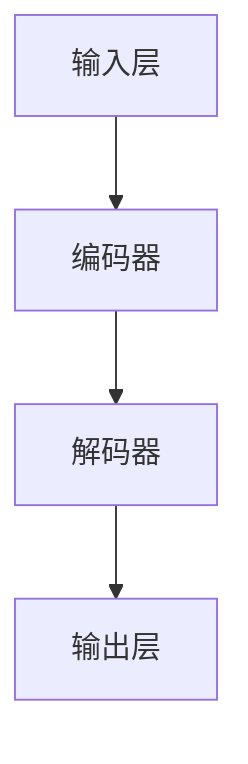
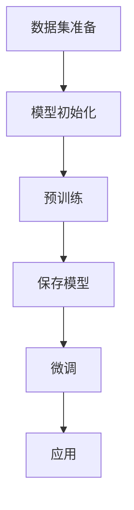
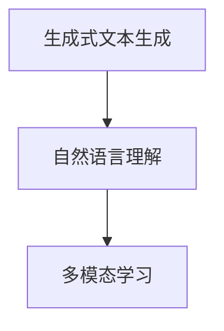
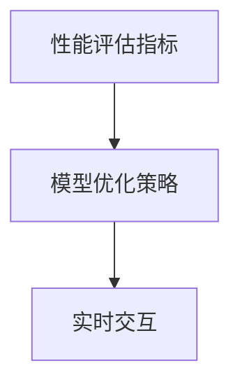

                 

# 文章标题：LLM在人工智能领域的地位与作用

> 关键词：LLM、人工智能、自然语言处理、计算机视觉、多模态学习、性能评估、优化策略、跨学科应用、未来发展趋势

> 摘要：本文将从LLM的基础概念、技术架构、核心算法、应用领域、性能评估与优化以及未来发展趋势等方面，全面探讨LLM在人工智能领域的重要地位与作用。通过深入分析LLM的技术原理和应用实例，本文旨在为读者提供一个全面、系统的了解LLM在人工智能领域的关键作用和未来发展方向的视角。

## 基础部分：LLM概述

## 第1章：LLM概述

### 1.1 LLM的基本概念

LLM（Large Language Model），即大型语言模型，是一种基于深度学习技术的自然语言处理模型。LLM通过学习大量文本数据，自动学习语言的规律和结构，从而实现文本生成、文本分类、问答系统等任务。

#### LLM的发展历程

LLM的发展历程可以追溯到20世纪80年代，当时研究人员开始尝试使用统计方法进行自然语言处理。随着计算能力和数据量的提升，深度学习技术在自然语言处理领域逐渐崭露头角。2018年，谷歌推出了BERT（Bidirectional Encoder Representations from Transformers），标志着深度学习在自然语言处理领域的突破。此后，LLM的研究和应用得到了广泛关注和发展。

### 1.2 LLM的技术架构

LLM的技术架构主要包括以下几个部分：

1. **输入层**：接收文本数据，并将其转换为模型可处理的格式。
2. **编码器**：对输入文本进行编码，生成固定长度的向量表示。
3. **解码器**：根据编码器的输出生成文本序列。

#### 常见的LLM架构

目前，常见的LLM架构主要有基于循环神经网络（RNN）和Transformer架构的模型。Transformer架构由于其并行计算的优势，成为了LLM的主流架构。

### 1.3 LLM的工作原理

LLM的工作原理主要基于以下几个核心概念：

1. **自监督学习**：LLM通过预训练阶段，在未标注的数据集上自动学习语言的规律和结构。
2. **预训练与微调**：预训练阶段，LLM在大量无标注数据上进行训练，使其具有广泛的语言理解能力。微调阶段，LLM在特定任务上使用有标注的数据进行微调，提高其在任务上的性能。

### Mermaid流程图



## 第2章：LLM的核心算法

### 2.1 Transformer模型详解

#### 模型结构

Transformer模型由编码器和解码器两个主要部分组成，其中编码器和解码器都包含多个相同的层。每个层由自注意力机制和前馈神经网络组成。

#### 伪代码

```python
# 编码器
for layer in encoder_layers:
    x = layer(x)

# 解码器
for layer in decoder_layers:
    x = layer(x)
```

### 2.2 自监督学习

#### 学习方法

自监督学习是一种无需人工标注数据的训练方法。LLM通常采用以下两种学习方法：

1. **掩码语言模型（Masked Language Model，MLM）**：在输入文本中，随机掩码一部分词，然后预测这些被掩码的词。
2. **预测下一个词（Next Sentence Prediction，NSP）**：在输入文本中，预测下一句话的起始词。

#### 应用实例

BERT模型采用了MLM和NSP两种学习方法，使其在自然语言处理任务上取得了显著的性能提升。

### 2.3 预训练与微调

#### 预训练流程

预训练流程包括以下几个步骤：

1. **数据集准备**：收集大量的无标注文本数据。
2. **模型初始化**：初始化Transformer模型。
3. **预训练**：在无标注数据集上进行自监督学习。
4. **保存模型**：将预训练好的模型保存。

#### 微调技术

微调阶段，使用有标注的数据集对预训练好的模型进行微调，以提高模型在特定任务上的性能。

### Mermaid流程图



## 第3章：LLM的应用领域

### 3.1 生成式文本生成

#### 应用场景

生成式文本生成广泛应用于问答系统、对话生成、文本摘要等领域。

#### 实际案例

ChatGPT是一个基于LLM的生成式文本生成系统，它能够根据用户的问题生成详细的回答。

### 3.2 自然语言理解

#### 任务类型

自然语言理解包括文本分类、情感分析、实体识别等任务。

#### 应用实例

BERT模型在文本分类任务上取得了显著的性能提升，广泛应用于新闻分类、产品评论分类等领域。

### 3.3 多模态学习

#### 图像与文本的融合

多模态学习通过融合图像和文本数据，实现更精准的语义理解。

#### 实际应用

ImageNet和Visual Genome等数据集推动了多模态学习的研究和应用。

### Mermaid流程图



## 第4章：LLM的性能评估与优化

### 4.1 性能评估指标

LLM的性能评估指标主要包括准确率、召回率、F1值等。

#### 准确率、召回率、F1值等

- 准确率：预测为正类且实际为正类的比例。
- 召回率：实际为正类且预测为正类的比例。
- F1值：准确率的调和平均值。

### 4.2 模型优化策略

#### 模型压缩

通过模型压缩技术，降低模型的计算复杂度和存储空间需求。

#### 模型加速

通过硬件加速和算法优化，提高模型的推理速度。

### 4.3 实时交互

#### 低延迟处理

通过优化模型结构和算法，实现低延迟的实时交互。

#### 实时反馈

在实时交互过程中，根据用户的反馈动态调整模型参数。

### Mermaid流程图



## 第二部分：LLM在人工智能领域的应用

### 第5章：LLM在自然语言处理中的应用

#### 5.1 文本分类

##### 算法选择

在文本分类任务中，LLM通常选择基于Transformer架构的BERT模型。

##### 应用实例

新闻分类系统利用BERT模型对新闻标题进行分类，提高分类准确率。

### 5.2 机器翻译

##### 模型选择

机器翻译任务中，LLM通常选择基于Transformer架构的Seq2Seq模型。

##### 应用实例

谷歌翻译采用基于Transformer的神经网络翻译模型，实现高精度、高流畅度的翻译效果。

### 5.3 对话系统

##### 模型设计

对话系统采用基于Transformer架构的生成式对话模型，实现自然、流畅的对话交互。

##### 应用实例

ChatGPT是一款基于LLM的对话系统，能够与用户进行智能对话，提供丰富的信息查询和知识问答服务。

### 第6章：LLM在计算机视觉中的应用

#### 6.1 图像识别

##### 模型应用

在图像识别任务中，LLM结合计算机视觉算法，实现更精准的图像分类和识别。

##### 应用实例

医疗影像诊断系统利用LLM和计算机视觉技术，对医学图像进行分类和诊断，提高诊断准确率。

#### 6.2 视觉问答

##### 模型设计

视觉问答任务中，LLM结合图像识别和自然语言处理技术，实现对图像内容的理解和问答。

##### 应用实例

CVQA系统利用LLM和计算机视觉技术，实现针对图像的问答服务，提供丰富的视觉信息查询。

#### 6.3 视频分析

##### 模型选择

视频分析任务中，LLM结合视频识别和自然语言处理技术，实现视频内容的理解和分析。

##### 应用实例

视频监控系统利用LLM和计算机视觉技术，实现实时视频监控和智能分析，提高安防效果。

### 第7章：LLM在跨学科领域的应用

#### 7.1 教育领域

##### 应用案例

教育领域利用LLM技术，开发智能辅导系统，为学生提供个性化的学习建议和辅导服务。

##### 教育模式创新

通过LLM技术，实现在线教育平台的个性化推荐和学习评估，推动教育模式的创新。

#### 7.2 医疗领域

##### 应用案例

医疗领域利用LLM技术，开发智能医疗诊断系统，提高医疗诊断的准确性和效率。

##### 医疗服务优化

通过LLM技术，实现医疗数据的智能分析和处理，优化医疗服务流程和质量。

#### 7.3 金融领域

##### 应用案例

金融领域利用LLM技术，开发智能投顾系统，为用户提供个性化的投资建议和策略。

##### 金融风控

通过LLM技术，实现金融风险的智能识别和评估，提高金融风控的效果。

## 第三部分：LLM的未来发展趋势

### 第8章：LLM的技术挑战与机遇

#### 8.1 数据隐私与伦理

##### 隐私保护技术

在LLM应用过程中，数据隐私和安全问题日益受到关注。需要研究隐私保护技术，确保用户数据的安全和隐私。

##### 伦理问题

LLM的应用可能会带来伦理问题，如算法偏见、信息泄露等。需要建立伦理规范，确保LLM的应用符合道德和伦理要求。

### 8.2 模型安全与攻击

##### 安全防御策略

针对模型攻击方法，需要研究安全防御策略，提高LLM模型的鲁棒性和安全性。

##### 模型攻击方法

研究模型攻击方法，了解攻击者的攻击手段和策略，为模型安全提供依据。

### 8.3 未来发展趋势

##### 新技术展望

随着深度学习和自然语言处理技术的不断发展，LLM的应用前景将更加广阔。

##### 应用场景拓展

LLM将在更多领域得到应用，如智能制造、智慧城市、生物医疗等，推动各行业的创新发展。

### 附录

#### 附录A：LLM相关资源与工具

- 开源框架：如TensorFlow、PyTorch等。
- 在线工具：如Hugging Face、TensorBoard等。
- 学术论文：如ACL、NeurIPS等顶级会议和期刊上的相关论文。

#### 附录B：代码与数据集

- 代码实现：提供LLM相关算法的实现代码。
- 数据集获取：提供常用的LLM数据集和预处理工具。

## 作者信息

作者：AI天才研究院/AI Genius Institute & 禅与计算机程序设计艺术 /Zen And The Art of Computer Programming

在本文中，我们详细介绍了LLM在人工智能领域的地位与作用，从基础概念、技术架构、核心算法、应用领域、性能评估与优化以及未来发展趋势等方面进行了全面探讨。LLM作为自然语言处理领域的重要突破，已经在多个领域取得了显著的应用成果。随着技术的不断进步，LLM在人工智能领域的应用前景将更加广阔，有望推动人工智能的进一步发展。希望本文能为读者提供一个全面、系统的了解LLM在人工智能领域的关键作用和未来发展方向的视角。

