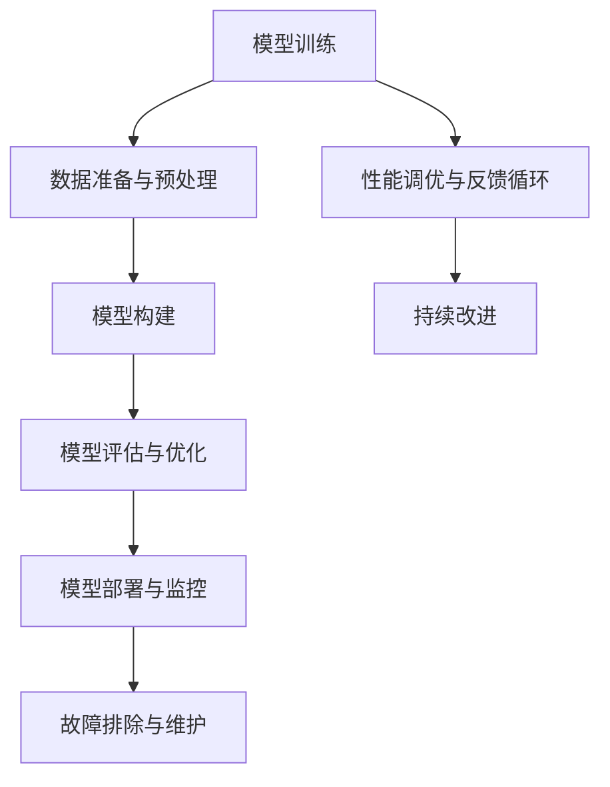

                 


# 文章标题：LLM在保险业的应用：风险评估与理赔

## 关键词：
- 保险业
- 语言模型（LLM）
- 风险评估
- 理赔流程
- 人工智能应用

## 摘要：
本文探讨了语言模型（LLM）在保险业中的应用，特别是在风险评估与理赔领域的潜力。通过分析保险业的发展现状和挑战，以及LLM技术基础，本文详细阐述了LLM在风险评估和理赔流程中的应用案例，并介绍了项目实施与优化、未来展望与挑战。文章旨在为保险业从业者提供有价值的参考，推动人工智能技术在保险业的深入应用。

### 《LLM在保险业的应用：风险评估与理赔》目录大纲

#### 第一部分：背景与概述

## 1.1 保险业与LLM简介

### 1.1.1 保险业发展现状及挑战

### 1.1.2 语言模型（LLM）的概念及发展

### 1.1.3 LLM在保险业的应用前景

## 1.2 风险评估与理赔的关键问题

### 1.2.1 风险评估的重要性

### 1.2.2 理赔流程及常见问题

### 1.2.3 LLM如何解决保险业的风险评估与理赔问题

#### 第二部分：LLM技术基础

## 2.1 自然语言处理（NLP）基础

### 2.1.1 NLP基本概念

### 2.1.2 词嵌入技术

### 2.1.3 语言模型原理

## 2.2 预训练语言模型（LLM）

### 2.2.1 预训练方法

### 2.2.2 微调技术

### 2.2.3 主流LLM架构

## 2.3 数学模型与算法原理

### 2.3.1 复杂度分析

### 2.3.2 损失函数

### 2.3.3 优化算法

#### 第三部分：应用案例分析

## 3.1 风险评估

### 3.1.1 风险评估流程

#### 3.1.1.1 数据收集与预处理

#### 3.1.1.2 模型构建与训练

#### 3.1.1.3 模型评估与优化

### 3.1.2 案例分析：某保险公司风险评估实践

## 3.2 理赔

### 3.2.1 理赔流程

#### 3.2.1.1 理赔申请与审查

#### 3.2.1.2 损失评估与赔付计算

#### 3.2.1.3 模型反馈与改进

### 3.2.2 案例分析：某保险公司理赔自动化实践

#### 第四部分：项目实施与优化

## 4.1 项目实施流程

### 4.1.1 项目规划与需求分析

### 4.1.2 技术选型与架构设计

### 4.1.3 数据准备与预处理

## 4.2 性能优化与调优

### 4.2.1 模型训练与优化

### 4.2.2 模型部署与性能监控

### 4.2.3 故障排除与性能调优

## 4.3 持续改进与反馈循环

### 4.3.1 用户反馈收集与处理

### 4.3.2 模型迭代与更新

### 4.3.3 项目效果评估与改进

#### 第五部分：未来展望与挑战

## 5.1 LLM在保险业的发展趋势

### 5.1.1 新技术应用

### 5.1.2 行业合作与竞争

### 5.1.3 政策法规与伦理问题

## 5.2 挑战与解决方案

### 5.2.1 数据隐私与安全问题

### 5.2.2 模型解释性与可靠性

### 5.2.3 技术发展与社会影响

#### 附录

## 附录 A：常用工具与资源

### 5.2.1 NLP与LLM常用库

### 5.2.2 数据集与模型资源

### 5.2.3 相关论文与资料推荐

### 文章正文

#### 第一部分：背景与概述

## 1.1 保险业与LLM简介

### 1.1.1 保险业发展现状及挑战

保险业是一个历史悠久且不断发展的行业，涵盖了财产保险、人寿保险、健康保险等多个领域。在全球经济中，保险业发挥着重要作用，为个人和企业提供风险保障。然而，随着市场环境的不断变化和竞争的加剧，保险业面临着一系列挑战。

首先，保险市场需求日益多样化。消费者对保险产品和服务的要求越来越高，希望获得更个性化和便捷的体验。其次，保险公司的运营成本不断上升，包括人工成本、运营成本和数据管理成本等。此外，保险欺诈和风险控制问题也日益突出，给保险公司带来了巨大的财务和声誉风险。

为了应对这些挑战，保险公司开始寻求创新的技术解决方案。其中，语言模型（LLM）作为一种强大的自然语言处理工具，逐渐成为保险业的重要应用领域。LLM在保险业的应用不仅有助于提高风险评估和理赔的效率和准确性，还能够降低成本，提升客户满意度。

### 1.1.2 语言模型（LLM）的概念及发展

语言模型（Language Model，简称LLM）是一种用于预测文本序列的算法，它是自然语言处理（NLP）领域的重要组成部分。LLM通过对大量文本数据进行训练，学习语言中的统计规律和语义信息，从而能够生成或理解自然语言文本。

LLM的发展可以追溯到20世纪50年代，最早的统计语言模型是基于N-gram模型的。然而，随着计算能力的提升和大数据技术的发展，深度学习在自然语言处理领域的应用日益广泛。近年来，预训练语言模型（如GPT、BERT等）取得了显著突破，为LLM的发展注入了新的动力。

预训练语言模型通过在大规模语料库上进行预训练，学习到了丰富的语言知识和上下文信息。然后，通过微调技术，将这些预训练模型应用于特定的任务，如文本分类、情感分析、机器翻译等。这种端到端的学习方式使得LLM在处理自然语言任务时具有出色的表现。

### 1.1.3 LLM在保险业的应用前景

LLM在保险业的应用前景广阔，特别是在风险评估和理赔领域。通过LLM技术，保险公司可以实现以下几方面的优化：

1. **风险评估：** LLM可以处理大量的非结构化数据，如客户调查问卷、历史理赔记录等，从而提取关键信息，辅助保险公司进行风险评估。这种基于数据的风险评估可以更加准确、全面地识别潜在风险，为保险产品的定价和风险管理提供有力支持。

2. **理赔自动化：** LLM可以自动处理理赔申请，进行审查和评估。通过自动化流程，保险公司可以显著提高理赔处理速度，减少人工干预，降低运营成本。此外，LLM还能够通过自然语言理解，识别复杂的情况和潜在问题，提供更准确的理赔计算。

3. **客户服务：** LLM可以用于构建智能客服系统，为用户提供即时、准确的咨询和服务。通过自然语言交互，用户可以获得更个性化的体验，同时降低保险公司的客服成本。

4. **欺诈检测：** LLM可以分析大量的历史数据和实时信息，发现潜在保险欺诈行为。通过对理赔申请、客户行为等数据进行深度分析，LLM可以帮助保险公司识别欺诈风险，降低欺诈损失。

总的来说，LLM在保险业的应用前景广阔，不仅有助于提升保险公司的运营效率和服务质量，还能够降低成本，提高竞争力。然而，要实现这些潜在优势，保险公司需要克服技术、数据和管理等方面的挑战，逐步推进LLM技术的应用。

## 1.2 风险评估与理赔的关键问题

### 1.2.1 风险评估的重要性

在保险业中，风险评估是关键环节，直接影响到保险产品的定价、风险管理以及利润水平。传统的风险评估方法主要依赖于历史数据和统计模型，虽然具有一定的准确性，但存在诸多局限性。

首先，风险评估需要考虑多个因素，包括投保人的年龄、性别、健康状况、投保历史等。这些因素相互关联，且重要性不同，如何准确评估这些因素对风险的贡献是一个复杂的问题。其次，风险评估的准确性与数据的完整性和质量密切相关。数据缺失或错误会导致风险评估结果的不准确，从而影响保险公司的业务决策。

引入LLM技术可以显著提升风险评估的准确性和效率。LLM通过学习大量的文本数据，能够提取出复杂的语义信息，从而更准确地识别风险因素。此外，LLM可以处理非结构化数据，如客户调查问卷、历史理赔记录等，进一步丰富了风险评估的数据来源。通过结合LLM技术和传统统计模型，保险公司可以实现更精细化的风险评估，提高保险产品的竞争力。

### 1.2.2 理赔流程及常见问题

理赔流程是保险公司与客户之间的重要互动环节，直接关系到客户满意度和公司声誉。传统的理赔流程通常包括理赔申请、理赔审查、损失评估、赔付计算和赔付支付等步骤。然而，这个流程往往存在一些问题，需要改进。

首先，理赔申请和审查环节常常需要客户和保险公司之间进行多次沟通，导致处理时间延长。这不仅增加了客户的等待时间，也增加了保险公司的运营成本。其次，理赔审查和损失评估环节依赖人工判断，容易出现主观偏差，导致理赔结果不准确。此外，理赔流程中的数据管理也是一个难题，涉及大量的纸质文件和电子数据的处理，效率较低。

常见的理赔问题包括：

1. **申请延误：** 理赔申请需要经过多个环节，涉及多个部门和人员，导致处理时间较长。

2. **审核误差：** 人工审核容易出现主观偏差，导致理赔结果不准确。

3. **数据丢失：** 理赔流程中涉及大量的纸质文件和电子数据，容易发生数据丢失或错误。

4. **客户体验差：** 长时间的等待和沟通不畅，导致客户体验不佳。

为了解决这些问题，保险公司开始探索使用LLM技术来优化理赔流程。LLM可以自动处理理赔申请，进行初步审查和损失评估，从而提高处理速度和准确性。此外，LLM可以与客户进行自然语言交互，提供即时、准确的理赔咨询和服务，提升客户满意度。

### 1.2.3 LLM如何解决保险业的风险评估与理赔问题

LLM在保险业的风险评估与理赔中具有广泛应用潜力，能够有效解决传统方法面临的诸多问题。

首先，在风险评估方面，LLM可以处理大量的非结构化数据，如客户调查问卷、历史理赔记录等，提取出关键信息，进行综合分析。通过深度学习算法，LLM能够识别复杂的语义关系，更准确地评估风险因素。例如，通过分析客户的就医记录和病史，LLM可以预测其未来的健康风险，为保险公司提供更精细化的风险评估。

具体来说，LLM在风险评估中的应用可以分为以下几个步骤：

1. **数据收集与预处理：** 首先，保险公司需要收集与风险评估相关的数据，包括客户的个人信息、历史理赔记录、医疗记录等。然后，对数据进行清洗和预处理，去除噪声和缺失值，确保数据质量。

2. **模型构建与训练：** 使用深度学习框架，如TensorFlow或PyTorch，构建一个适合风险评估的LLM模型。通过预训练技术，该模型可以学习到大量的语言知识和上下文信息。然后，通过微调技术，对模型进行定制化训练，使其能够适应保险公司的具体需求。

3. **风险评估与预测：** 将预处理后的数据输入到训练好的LLM模型中，模型将输出每个客户的风险评分。保险公司可以根据这些评分，制定合理的保险产品定价策略和风险管理方案。

其次，在理赔方面，LLM可以显著提高理赔流程的自动化程度，减少人工干预，提高处理速度和准确性。通过自然语言处理技术，LLM可以自动审查理赔申请，识别关键信息，进行损失评估和赔付计算。具体应用场景如下：

1. **理赔申请处理：** 当客户提交理赔申请时，LLM可以自动读取申请材料，提取关键信息，如事故描述、损失金额等。通过自然语言理解，LLM可以识别申请中的潜在问题，如信息缺失或不一致，提醒客户进行补充。

2. **损失评估与赔付计算：** LLM可以根据理赔申请中的信息，自动进行损失评估和赔付计算。通过预训练模型，LLM能够理解复杂的赔付规则和条款，确保计算结果的准确性和一致性。

3. **理赔结果输出：** 最终的理赔结果可以通过LLM与客户的自然语言交互进行确认和通知。客户可以通过智能客服系统，实时了解理赔进度和结果，提升客户体验。

总之，LLM在保险业的风险评估与理赔中具有广泛应用潜力，能够提高风险评估的准确性，优化理赔流程，提升客户满意度。然而，要实现这些潜力，保险公司需要克服数据隐私、模型解释性和可靠性等方面的挑战，逐步推进LLM技术的应用。

#### 第二部分：LLM技术基础

## 2.1 自然语言处理（NLP）基础

### 2.1.1 NLP基本概念

自然语言处理（Natural Language Processing，简称NLP）是人工智能（AI）领域的一个重要分支，旨在让计算机能够理解和处理人类语言。NLP涉及到多个子领域，包括文本分类、情感分析、命名实体识别、机器翻译、语音识别等。

1. **文本分类（Text Classification）**：文本分类是将文本数据分配到预定义的类别中。例如，将新闻文章分类为政治、经济、体育等类别。

2. **情感分析（Sentiment Analysis）**：情感分析用于识别文本中表达的情绪或情感。例如，判断一段文本是正面、负面还是中立。

3. **命名实体识别（Named Entity Recognition，简称NER）**：NER旨在识别文本中的命名实体，如人名、地名、组织名等。

4. **机器翻译（Machine Translation）**：机器翻译是将一种自然语言文本转换为另一种自然语言文本。例如，将英文翻译为中文。

5. **语音识别（Speech Recognition）**：语音识别是将语音信号转换为文本数据。

NLP的核心任务是使计算机能够理解、生成和处理自然语言，从而实现人机交互和信息检索等应用。

### 2.1.2 词嵌入技术

词嵌入（Word Embedding）是将词语映射到高维空间中的向量表示，以便计算机能够理解和处理它们。词嵌入技术是NLP中的一项关键技术，通过将词语表示为密集向量，词与词之间的相似性和关系可以通过向量空间中的几何距离来衡量。

1. **词嵌入方法**：

   - **基于统计的方法**：如Word2Vec，通过训练词频统计模型来生成词向量。

   - **基于分布的方法**：如Doc2Vec，通过训练文档的隐含语义来生成词向量。

   - **基于神经的方法**：如GloVe（Global Vectors for Word Representation），结合词频和上下文信息来生成词向量。

2. **词嵌入的优势**：

   - **相似性度量**：通过词向量之间的距离，可以衡量词语的相似性。例如，向量`vec("狗") - vec("动物")`可以得到"狗"和"动物"的相似性向量。

   - **向量运算**：词向量可以进行向量运算，从而实现文本数据的数学化处理。例如，使用词向量的加法来表示词语的合成意义。

### 2.1.3 语言模型原理

语言模型（Language Model，简称LM）是一种用于预测文本序列的模型，它在NLP中有着广泛的应用，如自动完成、语音识别、机器翻译等。语言模型的基本任务是给定一个单词序列，预测下一个单词。

1. **语言模型类型**：

   - **n-gram模型**：基于统计方法，通过分析n个连续单词的频次来预测下一个单词。例如，通过统计"我喜欢"后面出现"苹果"的次数，来预测"苹果"。

   - **神经网络模型**：基于深度学习方法，通过多层神经网络来预测下一个单词。例如，使用循环神经网络（RNN）或变换器（Transformer）来处理序列数据。

2. **语言模型的训练与优化**：

   - **训练数据集**：通常使用大规模的文本语料库来训练语言模型，如维基百科、新闻文章、社交媒体等。

   - **损失函数**：语言模型的训练通常使用交叉熵损失函数（Cross-Entropy Loss），以最大化预测概率和真实概率之间的相似度。

   - **优化算法**：常用的优化算法包括随机梯度下降（SGD）、Adam等，用于调整模型参数，以最小化损失函数。

   - **评估指标**：常见的评估指标包括准确性（Accuracy）、 perplexity等。

通过语言模型，计算机可以更好地理解和生成自然语言，从而实现更高级的NLP任务。

## 2.2 预训练语言模型（LLM）

### 2.2.1 预训练方法

预训练（Pre-training）是深度学习中的一个关键步骤，它通过在大规模语料库上预先训练模型，使其在特定任务上表现更佳。预训练方法主要包括以下几种：

1. **自监督学习（Self-supervised Learning）**：

   - **掩码语言模型（Masked Language Model，MLM）**：在输入文本中随机掩码一定比例的单词，然后模型需要预测这些掩码的单词。这种技术使模型学习到语言中的上下文关系和语法规则。

   - **替换词（Substitution）**：将输入文本中的单词替换成其他单词，然后模型预测被替换的单词。例如，"我喜欢吃苹果"可以被替换成"我喜欢吃香蕉"，模型需要预测被替换的"苹果"。

   - **删除词（Deletion）**：在输入文本中随机删除一定比例的单词，然后模型需要预测这些删除的单词。

2. **监督学习（Supervised Learning）**：

   - **下一句预测（Next Sentence Prediction，NSP）**：模型需要预测两个连续句子之间的关系，即下一句是什么。这种技术帮助模型学习到句子之间的语义关系。

   - **句子级分类（Sentence-level Classification）**：对输入的句子进行分类，如情感分析、文本分类等。这种技术使模型学习到句子的语义特征。

3. **结合方法**：

   - **双向编码表示（Bidirectional Encoder Representations from Transformers，BERT）**：BERT结合了MLM和NSP，同时使用监督学习任务，如命名实体识别（NER）、情感分析等，来进一步优化模型。

### 2.2.2 微调技术

微调（Fine-tuning）是在预训练模型的基础上，针对特定任务进行进一步训练的过程。微调技术能够使预训练模型适应新的任务，从而提高模型的性能。微调过程通常包括以下几个步骤：

1. **数据准备**：

   - **任务数据集**：准备用于微调的数据集，通常包含标注信息，如分类标签、实体标签等。

   - **预处理**：对数据集进行预处理，包括文本清洗、分词、词嵌入等。

2. **模型选择**：

   - **预训练模型**：选择一个预训练的语言模型，如BERT、GPT等。

   - **微调架构**：将预训练模型的结构进行调整，以适应特定任务。例如，增加或删除某些层，调整层的大小等。

3. **训练过程**：

   - **参数初始化**：初始化模型参数，通常使用预训练模型的参数作为起点。

   - **训练循环**：对数据集进行训练，通过反向传播和优化算法（如Adam）调整模型参数。

   - **评估与调优**：在训练过程中，定期评估模型在验证集上的性能，并根据性能调整超参数。

4. **模型保存**：

   - **最佳模型**：保存训练过程中性能最佳的模型，用于后续任务。

### 2.2.3 主流LLM架构

主流LLM架构主要包括基于循环神经网络（RNN）和变换器（Transformer）的模型。以下是一些典型的LLM架构：

1. **循环神经网络（RNN）**：

   - **基本RNN**：基本RNN通过将当前输入与上一个隐藏状态进行连接，来处理序列数据。然而，基本RNN存在梯度消失和梯度爆炸问题。

   - **长短时记忆网络（Long Short-Term Memory，LSTM）**：LSTM通过引入记忆单元和门控机制，解决了RNN的梯度消失问题，能够更好地捕捉长序列信息。

   - **门控循环单元（Gated Recurrent Unit，GRU）**：GRU是LSTM的变体，通过简化结构，进一步提高了计算效率和性能。

2. **变换器（Transformer）**：

   - **基本变换器**：变换器通过多头自注意力机制，将输入序列映射到高维空间，从而捕捉序列中的长距离依赖关系。

   - **Transformer-XL**：Transformer-XL通过引入段级自注意力机制，解决了变换器在长文本处理中的计算效率问题。

   - **BERT**：BERT是Google提出的一种双向编码表示模型，结合了变换器和双向编码技术，通过同时考虑上下文信息，实现了更好的语言理解能力。

   - **GPT**：GPT是一种基于变换器的语言生成模型，通过预训练和微调技术，实现了高质量的文本生成和分类任务。

通过以上LLM技术基础的分析，我们可以看到LLM在保险业中的应用前景广阔。LLM能够处理大量的非结构化数据，提取出关键信息，从而实现更准确的风险评估和理赔自动化。在接下来的部分，我们将进一步探讨LLM在保险业中的应用案例，并通过实际项目展示如何实现和应用这些技术。

#### 第三部分：应用案例分析

## 3.1 风险评估

### 3.1.1 风险评估流程

在保险业中，风险评估是决定保险产品定价和风险控制策略的重要环节。一个完整的风险评估流程通常包括数据收集、模型构建、模型训练和模型评估等步骤。

1. **数据收集与预处理**：

   - **数据来源**：保险公司可以从多个渠道收集数据，包括客户调查问卷、历史理赔记录、医疗记录等。此外，还可以通过互联网爬虫等技术获取公开数据。

   - **数据预处理**：数据预处理是风险评估的关键步骤，包括数据清洗、数据归一化、缺失值处理等。对于非结构化数据，如客户调查问卷和文本记录，需要进行文本清洗和分词，将其转换为可处理的向量形式。

2. **模型构建**：

   - **选择模型**：在风险评估中，常用的模型包括逻辑回归、决策树、随机森林、支持向量机（SVM）等。近年来，随着深度学习技术的发展，基于变换器的预训练语言模型（如BERT、GPT）在文本分类任务中表现出色，也逐渐被应用于风险评估。

   - **特征工程**：特征工程是模型构建的重要步骤，包括提取文本中的关键词、词频、词嵌入等。对于非结构化数据，可以使用词嵌入技术将文本转换为密集向量表示。

3. **模型训练**：

   - **训练集划分**：将收集到的数据分为训练集、验证集和测试集，用于模型训练和评估。

   - **训练过程**：使用训练集对模型进行训练，通过反向传播和优化算法（如Adam）调整模型参数。在训练过程中，可以采用批处理和梯度裁剪等技术，以防止模型过拟合。

4. **模型评估与优化**：

   - **评估指标**：常用的评估指标包括准确率（Accuracy）、精确率（Precision）、召回率（Recall）和F1值（F1 Score）等。对于分类任务，还可以使用混淆矩阵（Confusion Matrix）来分析模型的表现。

   - **模型调优**：根据评估结果，对模型进行调优，包括调整超参数、增加训练数据等。通过交叉验证（Cross-Validation）技术，可以更准确地评估模型在不同数据集上的性能。

5. **风险评估结果输出**：

   - **风险评分**：通过训练好的模型，对新的客户数据进行分析，输出每个客户的风险评分。保险公司可以根据这些评分，制定合理的保险产品定价策略和风险管理方案。

### 3.1.2 数据收集与预处理

数据收集与预处理是风险评估的基础环节，直接影响到模型的性能和效果。以下是具体步骤：

1. **数据来源**：

   - **客户调查问卷**：保险公司可以通过在线问卷或纸质问卷收集客户的基本信息，如年龄、性别、收入、职业等。

   - **历史理赔记录**：保险公司可以从内部数据库中获取客户的历史理赔记录，包括索赔金额、索赔原因、理赔时间等。

   - **医疗记录**：保险公司可以通过与医疗机构合作，获取客户的医疗记录，如疾病诊断、手术记录、药品处方等。

   - **公开数据**：保险公司可以通过互联网爬虫等技术，获取公开数据，如新闻报道、社交媒体数据等，以补充内部数据。

2. **数据预处理**：

   - **数据清洗**：去除数据中的噪声和错误，如缺失值、重复值、异常值等。

   - **数据归一化**：对数值型特征进行归一化处理，使其具有相同的尺度，从而避免数值差异对模型训练的影响。

   - **缺失值处理**：对缺失值进行填充或删除，以减少数据缺失对模型的影响。

   - **文本清洗**：对文本数据进行清洗，如去除标点符号、停用词、低频词等，以提高词嵌入的质量。

   - **分词**：对文本数据进行分词，将其转换为词语序列。常用的分词工具包括Jieba、NLTK等。

   - **词嵌入**：使用词嵌入技术将词语序列转换为密集向量表示，如使用Word2Vec、GloVe等。

### 3.1.3 模型构建与训练

模型构建与训练是风险评估的核心步骤，以下将详细介绍这一过程：

1. **选择模型**：

   - **传统模型**：逻辑回归、决策树、随机森林、支持向量机（SVM）等传统机器学习模型在风险评估中具有较好的表现。

   - **深度学习模型**：近年来，深度学习模型在NLP领域取得了显著突破，如基于变换器的预训练语言模型（BERT、GPT）在文本分类任务中表现出色，也逐渐被应用于风险评估。

2. **特征提取**：

   - **文本特征**：对文本数据进行预处理和分词，然后使用词嵌入技术将词语序列转换为密集向量表示。

   - **数值特征**：对数值型特征进行归一化处理，以使其具有相同的尺度。

3. **模型训练**：

   - **训练集划分**：将收集到的数据分为训练集、验证集和测试集。训练集用于模型训练，验证集用于模型调优，测试集用于模型评估。

   - **模型训练**：使用训练集对模型进行训练，通过反向传播和优化算法（如Adam）调整模型参数。训练过程中，可以采用批处理和梯度裁剪等技术，以防止模型过拟合。

4. **模型评估**：

   - **评估指标**：使用验证集对模型进行评估，常用的评估指标包括准确率（Accuracy）、精确率（Precision）、召回率（Recall）和F1值（F1 Score）等。此外，还可以使用混淆矩阵（Confusion Matrix）来分析模型的表现。

   - **模型调优**：根据评估结果，对模型进行调优，包括调整超参数、增加训练数据等。通过交叉验证（Cross-Validation）技术，可以更准确地评估模型在不同数据集上的性能。

### 3.1.4 模型评估与优化

模型评估与优化是确保模型性能和可靠性的重要环节。以下是具体步骤：

1. **评估指标**：

   - **准确率（Accuracy）**：预测正确的样本数占总样本数的比例。

   - **精确率（Precision）**：预测为正类的样本中，实际为正类的比例。

   - **召回率（Recall）**：实际为正类的样本中，预测为正类的比例。

   - **F1值（F1 Score）**：精确率和召回率的调和平均值。

2. **交叉验证**：

   - **K折交叉验证（K-Fold Cross-Validation）**：将数据集划分为K个子集，每次使用其中一个子集作为验证集，其余K-1个子集作为训练集，重复K次，取平均值作为模型性能的评估指标。

   - **时间序列交叉验证（Time Series Cross-Validation）**：适用于时间序列数据，将数据按照时间顺序划分为训练集和验证集，每次将最新的数据作为验证集，其余数据作为训练集。

3. **模型调优**：

   - **超参数调整**：通过调整模型的超参数（如学习率、批量大小、正则化参数等），以优化模型性能。

   - **特征选择**：通过特征选择技术，筛选出对模型性能有显著影响的特征，以提高模型的泛化能力。

   - **正则化**：通过正则化技术，防止模型过拟合，提高模型的泛化能力。

### 3.1.5 案例分析：某保险公司风险评估实践

以下是一个实际案例，展示如何使用LLM技术进行风险评估：

- **案例背景**：某保险公司希望优化其风险评估流程，以提高保险产品的定价准确性和风险管理水平。

- **数据来源**：保险公司收集了大量的客户数据，包括客户基本信息、历史理赔记录、医疗记录等。

- **模型选择**：选择基于BERT的预训练语言模型作为风险评估模型。

- **特征提取**：对文本数据进行预处理和分词，然后使用BERT进行词嵌入。

- **模型训练**：使用训练集对BERT模型进行训练，通过反向传播和优化算法调整模型参数。

- **模型评估**：使用验证集对模型进行评估，并调整超参数以提高模型性能。

- **风险评估结果**：通过训练好的BERT模型，对新的客户数据进行分析，输出每个客户的风险评分。保险公司根据这些评分，制定合理的保险产品定价策略和风险管理方案。

通过实际案例，我们可以看到LLM技术在风险评估中的应用效果显著。LLM能够处理大量的非结构化数据，提取出关键信息，从而实现更准确的风险评估。然而，要实现这些效果，保险公司需要克服数据隐私、模型解释性和可靠性等方面的挑战，逐步推进LLM技术的应用。

## 3.2 理赔

### 3.2.1 理赔流程

理赔流程是保险业中与客户直接互动的重要环节，其效率和准确性直接关系到客户满意度和保险公司的运营成本。传统的理赔流程通常包括理赔申请、理赔审查、损失评估、赔付计算和赔付支付等步骤。

1. **理赔申请**：

   - **申请方式**：客户可以通过线上平台、电话、邮件等方式提交理赔申请。

   - **申请材料**：理赔申请通常需要客户提供理赔申请表、事故证明、医疗费用单据等相关材料。

2. **理赔审查**：

   - **初步审查**：保险公司审核人员对理赔申请进行初步审查，确认申请材料的完整性和准确性。

   - **异常处理**：对于不完整的申请或存在疑问的理赔事项，审核人员会与客户进行沟通，要求补充材料或提供更多信息。

3. **损失评估**：

   - **评估方式**：保险公司根据理赔申请中的信息，对损失金额进行评估。

   - **评估依据**：评估依据包括保险公司制定的赔付规则、市场参考价格、客户投保情况等。

4. **赔付计算**：

   - **计算方式**：根据评估结果，计算理赔金额。

   - **计算依据**：计算依据包括保险合同条款、赔付比例、免赔额等。

5. **赔付支付**：

   - **支付方式**：保险公司将理赔金额支付给客户，支付方式包括转账、支票等。

   - **支付时间**：理赔支付时间取决于理赔流程的效率，传统方法可能需要数天至数周。

### 3.2.2 理赔申请与审查

理赔申请与审查是理赔流程中的关键环节，直接影响到理赔效率和质量。以下是具体步骤：

1. **理赔申请**：

   - **在线申请**：客户可以通过保险公司网站或移动应用在线提交理赔申请，填写相关信息，上传必要的证明文件。

   - **书面申请**：对于无法在线申请的客户，可以填写书面理赔申请表，并提交给保险公司。

   - **材料要求**：理赔申请通常需要提供以下材料：理赔申请表、事故证明、医疗费用单据、保险合同等。

2. **理赔审查**：

   - **初步审查**：保险公司审核人员对理赔申请进行初步审查，确认申请材料的完整性和准确性。

   - **风险识别**：通过分析理赔申请中的信息，审核人员识别潜在的风险，如保险欺诈、错误索赔等。

   - **沟通与反馈**：对于不完整的申请或存在疑问的理赔事项，审核人员会与客户进行沟通，要求补充材料或提供更多信息。

   - **审批**：审核人员根据理赔申请和提供的材料，决定是否批准理赔申请。

### 3.2.3 损失评估与赔付计算

损失评估与赔付计算是理赔流程中的核心步骤，以下将详细描述这一过程：

1. **损失评估**：

   - **评估方式**：保险公司根据理赔申请中的信息，对损失金额进行评估。

   - **评估依据**：评估依据包括保险公司制定的赔付规则、市场参考价格、客户投保情况等。

   - **评估流程**：

     - **事故确认**：确认事故是否在保险合同约定的保险范围内。

     - **损失计算**：根据事故类型和损失程度，计算损失金额。

     - **理赔依据**：确定理赔金额的计算方法和依据。

2. **赔付计算**：

   - **计算方式**：根据评估结果，计算理赔金额。

   - **计算依据**：计算依据包括保险合同条款、赔付比例、免赔额等。

   - **计算流程**：

     - **赔付比例**：根据保险合同，确定赔付比例。

     - **免赔额**：根据保险合同，确定免赔额。

     - **理赔金额**：计算理赔金额，并通知客户。

### 3.2.4 模型反馈与改进

在理赔流程中，模型反馈与改进是提高理赔效率和准确性的重要手段。以下是具体步骤：

1. **模型反馈**：

   - **收集反馈**：保险公司通过在线调查、客服反馈等方式收集客户的理赔体验和建议。

   - **分析反馈**：分析客户反馈，识别理赔流程中的问题和改进方向。

   - **数据整理**：整理和分析收集到的数据，提取有用的信息。

2. **模型改进**：

   - **调整模型**：根据反馈结果，调整理赔模型的参数和策略。

   - **优化流程**：改进理赔流程，提高处理速度和准确性。

   - **迭代优化**：通过持续收集反馈和调整模型，实现理赔流程的不断优化。

### 3.2.5 案例分析：某保险公司理赔自动化实践

以下是一个实际案例，展示如何使用LLM技术自动化理赔流程：

- **案例背景**：某保险公司希望提高理赔流程的自动化程度，以减少人工干预，提高处理速度和准确性。

- **数据来源**：保险公司收集了大量的理赔数据，包括理赔申请、理赔审查记录、赔付计算结果等。

- **模型选择**：选择基于BERT的预训练语言模型作为理赔自动化模型。

- **数据预处理**：对理赔数据进行预处理，包括文本清洗、分词、词嵌入等。

- **模型训练**：使用训练集对BERT模型进行训练，通过反向传播和优化算法调整模型参数。

- **模型应用**：

  - **理赔申请处理**：BERT模型自动读取理赔申请，提取关键信息，进行初步审查。

  - **损失评估与赔付计算**：BERT模型根据理赔申请中的信息，自动进行损失评估和赔付计算。

  - **结果确认与通知**：通过自然语言交互，BERT模型与客户确认理赔结果，并通知赔付金额。

通过实际案例，我们可以看到LLM技术在理赔自动化中的应用效果显著。LLM能够自动处理理赔申请，进行初步审查和损失评估，从而提高理赔处理速度和准确性。然而，要实现这些效果，保险公司需要克服数据隐私、模型解释性和可靠性等方面的挑战，逐步推进LLM技术的应用。

#### 第四部分：项目实施与优化

## 4.1 项目实施流程

在保险业中，LLM技术的应用项目实施是一个复杂的过程，涉及多个环节和团队的协同工作。以下是一个典型的项目实施流程：

### 4.1.1 项目规划与需求分析

项目规划与需求分析是项目实施的第一步，确保项目的目标清晰、可执行。具体步骤如下：

1. **明确项目目标**：确定项目要实现的功能和目标，如风险评估、理赔自动化等。

2. **需求调研**：通过与保险公司管理层、业务团队和IT部门的沟通，了解业务需求和技术要求。

3. **编写项目计划书**：根据需求调研结果，编写项目计划书，包括项目范围、时间表、预算、资源分配等。

4. **风险评估**：对项目可能面临的风险进行识别和评估，制定相应的应对措施。

### 4.1.2 技术选型与架构设计

技术选型与架构设计是项目实施的关键环节，决定了项目的可扩展性、性能和可靠性。具体步骤如下：

1. **技术选型**：

   - **框架与库**：选择合适的深度学习框架和库，如TensorFlow、PyTorch等。

   - **模型选择**：根据业务需求，选择合适的语言模型，如BERT、GPT等。

   - **数据处理工具**：选择合适的数据处理工具，如Pandas、NumPy等。

2. **架构设计**：

   - **系统架构**：设计系统的整体架构，包括数据存储、数据处理、模型训练、模型部署等模块。

   - **模块划分**：将系统划分为多个模块，如数据收集与预处理模块、模型训练模块、模型部署模块等。

   - **接口设计**：设计模块之间的接口，确保各模块之间的高效协同。

### 4.1.3 数据准备与预处理

数据准备与预处理是LLM应用项目成功的关键，直接影响到模型的性能和效果。具体步骤如下：

1. **数据收集**：

   - **内部数据**：从保险公司的内部系统中提取与风险评估、理赔相关的数据，如客户信息、理赔记录等。

   - **外部数据**：通过互联网爬虫、公开数据集等方式，收集与保险相关的数据，如新闻报道、社交媒体数据等。

2. **数据清洗**：

   - **去重与过滤**：去除重复数据、噪声数据和无用数据。

   - **数据规范化**：对数据进行规范化处理，如归一化、标准化等。

3. **数据预处理**：

   - **文本处理**：对文本数据进行预处理，包括分词、去停用词、词嵌入等。

   - **数值处理**：对数值数据进行处理，如缺失值填充、异常值处理等。

### 4.1.4 模型训练与优化

模型训练与优化是项目实施的核心环节，决定了LLM应用的性能和效果。具体步骤如下：

1. **模型构建**：

   - **模型架构**：根据业务需求，构建适合的模型架构，如BERT、GPT等。

   - **超参数设置**：设置模型的超参数，如学习率、批量大小、隐藏层大小等。

2. **模型训练**：

   - **数据集划分**：将数据集划分为训练集、验证集和测试集。

   - **训练过程**：使用训练集对模型进行训练，通过反向传播和优化算法调整模型参数。

3. **模型评估**：

   - **评估指标**：使用验证集对模型进行评估，常用的评估指标包括准确率、精确率、召回率、F1值等。

   - **模型调优**：根据评估结果，对模型进行调优，包括调整超参数、增加训练数据等。

### 4.1.5 模型部署与性能监控

模型部署与性能监控是确保LLM应用稳定运行的关键环节，具体步骤如下：

1. **模型部署**：

   - **部署环境**：搭建适合的部署环境，包括硬件设备、操作系统、深度学习框架等。

   - **部署策略**：根据业务需求，选择合适的部署策略，如单机部署、集群部署等。

   - **接口设计**：设计模型API，确保前端系统能够方便地调用模型。

2. **性能监控**：

   - **性能指标**：监控模型的性能指标，如响应时间、准确率、错误率等。

   - **日志记录**：记录模型运行的日志，便于问题追踪和调试。

   - **故障排除**：定期检查模型运行状态，及时发现并解决故障。

### 4.1.6 用户反馈与持续改进

用户反馈与持续改进是项目实施的重要环节，能够不断提升LLM应用的质量和用户体验。具体步骤如下：

1. **用户反馈收集**：

   - **反馈渠道**：搭建反馈渠道，如用户问卷、在线客服等，收集用户对LLM应用的反馈。

   - **反馈分析**：对用户反馈进行分析，识别用户关注的问题和需求。

2. **持续改进**：

   - **模型迭代**：根据用户反馈，对模型进行迭代优化，提高模型性能和用户体验。

   - **功能完善**：根据用户需求，不断完善LLM应用的功能，提升用户满意度。

   - **效果评估**：定期评估LLM应用的效果，确保项目目标的实现。

### 4.1.7 项目效果评估与改进

项目效果评估与改进是项目实施的最后一步，用于检验项目目标是否达成，并为进一步优化提供依据。具体步骤如下：

1. **效果评估**：

   - **指标分析**：使用项目实施前设定的效果评估指标，分析项目实施的效果。

   - **业务指标**：如风险评估的准确率、理赔处理的效率等。

   - **用户体验**：通过用户满意度调查、用户反馈等方式，评估用户对LLM应用的满意度。

2. **改进措施**：

   - **优化方案**：根据评估结果，制定优化方案，包括模型调优、功能完善、用户体验提升等。

   - **实施计划**：制定详细的实施计划，确保改进措施的顺利实施。

   - **效果跟踪**：对改进措施的实施效果进行跟踪和评估，确保项目目标的持续实现。

通过以上项目实施与优化的步骤，保险公司可以逐步推进LLM技术在风险评估和理赔中的应用，提高业务效率和客户满意度。然而，要实现这些目标，保险公司需要不断优化项目管理、提升技术水平，以应对快速变化的市场环境和技术挑战。

### 4.2.1 模型训练与优化

在保险业中，模型训练与优化是LLM应用项目成功的关键环节，直接影响模型的性能和实际效果。以下是详细的步骤和策略：

#### 数据准备

1. **数据清洗**：
   - **去重**：删除重复的数据记录，以避免模型训练中的冗余信息。
   - **格式化**：统一数据格式，如日期格式、数值范围等，以确保数据的一致性和可处理性。
   - **缺失值处理**：对于缺失的数据，可以通过插值、平均值替换或删除缺失记录等方法进行处理。

2. **数据增强**：
   - **数据扩充**：通过添加噪声、旋转、缩放等方法，增加数据的多样性和模型的泛化能力。
   - **合成数据**：使用生成对抗网络（GAN）等技术，生成与实际数据分布相似的数据，以扩大训练数据集。

#### 模型选择

1. **基础模型**：
   - **预训练模型**：选择合适的预训练模型，如BERT、GPT等，这些模型已经在大量数据上进行了训练，可以提供较好的基础性能。

2. **架构调整**：
   - **层增加**：根据业务需求，增加模型的深度或宽度，以提升模型的复杂度和表达能力。
   - **层剪枝**：通过剪枝技术，减少模型的参数数量，降低计算复杂度和过拟合风险。

#### 模型训练

1. **训练策略**：
   - **学习率调度**：使用如余弦退火（Cosine Annealing）或学习率衰减（Learning Rate Decay）策略，以平滑模型收敛过程。
   - **批量大小**：选择合适的批量大小，以平衡训练速度和模型稳定性。

2. **训练过程**：
   - **多GPU训练**：利用多GPU训练技术，加速模型训练过程。
   - **分布式训练**：使用如Horovod或DeepSpeed等分布式训练框架，提高训练效率。

#### 模型优化

1. **超参数调优**：
   - **网格搜索**：通过网格搜索（Grid Search）方法，系统性地调整超参数，以找到最优组合。
   - **贝叶斯优化**：使用贝叶斯优化（Bayesian Optimization）方法，通过概率模型找到超参数的最佳值。

2. **正则化**：
   - **L1/L2正则化**：通过L1或L2正则化，降低模型参数的权重，减少过拟合。
   - **Dropout**：在模型中引入dropout层，随机忽略一部分神经元，提高模型的鲁棒性。

3. **数据增强**：
   - **数据并行**：在训练过程中，使用不同的数据增强方法，如数据旋转、缩放等，增加模型的多样性。

#### 模型评估

1. **性能指标**：
   - **准确率**：衡量模型预测正确的样本数占总样本数的比例。
   - **精确率与召回率**：衡量模型在识别正样本和避免误判的能力。
   - **F1值**：精确率和召回率的调和平均值，综合考虑模型的识别和误判能力。
   - **AUC-ROC**：评估模型对正负样本的分类能力。

2. **交叉验证**：
   - **K折交叉验证**：通过多次划分训练集和验证集，评估模型在不同数据子集上的性能，提高评估的稳定性。

#### 模型迭代

1. **反馈机制**：
   - **用户反馈**：收集用户对模型表现的反馈，识别模型改进的方向。
   - **业务指标**：根据业务目标，如风险评估准确性、理赔效率等，调整模型。

2. **迭代过程**：
   - **持续训练**：定期使用新数据对模型进行训练，保持模型与实际业务环境的同步。
   - **性能监控**：监控模型在业务环境中的表现，及时发现问题并进行调整。

通过以上详细的模型训练与优化步骤，保险公司可以构建一个高性能、可靠的LLM模型，从而在风险评估和理赔方面取得显著成效。

### 4.2.2 模型部署与性能监控

在完成模型训练与优化后，将LLM模型部署到生产环境是确保其能够持续、稳定地服务于保险业务的关键环节。以下是模型部署与性能监控的详细步骤：

#### 模型部署

1. **部署环境准备**：

   - **硬件资源**：根据模型计算需求，配置适当的硬件资源，如CPU、GPU等。
   - **操作系统**：选择稳定的操作系统，如Ubuntu、CentOS等，确保模型运行环境的兼容性。
   - **深度学习框架**：安装并配置好深度学习框架，如TensorFlow、PyTorch等，确保模型能够正确加载和运行。

2. **部署策略**：

   - **单机部署**：在单台服务器上部署模型，适用于小型应用场景。
   - **集群部署**：在多个服务器组成的集群上部署模型，适用于高并发、大规模数据处理场景。
   - **容器化部署**：使用容器技术（如Docker）封装模型和应用，提高部署的灵活性和可移植性。

3. **接口设计**：

   - **API接口**：设计API接口，如RESTful API或GraphQL，以便前端系统可以方便地调用模型。
   - **服务端接口**：配置模型服务的端点，如HTTP/HTTPS接口，确保模型可以接收请求并返回结果。

#### 性能监控

1. **监控指标**：

   - **响应时间**：监控模型响应时间，确保模型处理请求的效率。
   - **准确率**：监控模型的预测准确率，确保模型性能的稳定性。
   - **错误率**：监控模型的错误率，识别模型可能存在的问题。
   - **资源利用率**：监控服务器硬件资源的利用率，如CPU、内存、GPU等，确保硬件资源的合理分配。

2. **日志记录**：

   - **请求日志**：记录模型处理的请求和响应信息，便于问题追踪和分析。
   - **错误日志**：记录模型处理过程中出现的错误和异常，及时发现问题并进行修复。

3. **故障排除**：

   - **自动告警**：配置自动告警机制，当监控指标达到预设阈值时，自动发送告警通知。
   - **故障恢复**：当模型服务出现故障时，自动进行故障恢复操作，如重启服务、重新加载模型等。

#### 性能调优

1. **超参数调优**：

   - **自动调优工具**：使用如Hyperopt、Optuna等自动调优工具，通过搜索算法自动调整模型超参数，提高模型性能。
   - **人工调优**：根据业务需求和模型表现，手动调整模型超参数，进行微调。

2. **资源优化**：

   - **GPU调度**：合理分配GPU资源，确保模型在多GPU环境下的性能优化。
   - **内存管理**：优化内存使用，避免内存泄漏和溢出，提高模型运行的稳定性。

3. **负载均衡**：

   - **负载均衡器**：配置负载均衡器，如Nginx、HAProxy等，确保模型服务能够应对高并发请求，提高系统的吞吐量。

通过以上详细的模型部署与性能监控步骤，保险公司可以确保LLM模型在生产环境中的稳定运行，实现高效的风险评估和理赔服务。同时，持续的监控和调优有助于不断提升模型性能和业务效果。

### 4.2.3 故障排除与性能调优

在保险业中，LLM应用的稳定性至关重要。为了确保模型在生产环境中的高效运行，需要建立完善的故障排除与性能调优机制。以下是一些关键的步骤和方法：

#### 故障排除

1. **日志分析**：
   - **错误日志**：定期检查模型的错误日志，识别并记录异常情况，如计算错误、数据缺失等。
   - **请求日志**：分析请求日志，查找导致故障的请求，如高频错误请求、异常请求等。

2. **故障定位**：
   - **隔离测试**：将模型拆分为多个模块，分别对每个模块进行隔离测试，定位故障源。
   - **代码审查**：对代码进行审查，查找潜在的逻辑错误和性能瓶颈。

3. **备份与恢复**：
   - **备份策略**：定期备份模型和关键数据，确保在故障发生时能够快速恢复。
   - **恢复流程**：制定详细的恢复流程，确保在故障发生时能够迅速恢复服务。

#### 性能调优

1. **资源分配**：
   - **CPU/GPU优化**：根据模型的计算需求，合理分配CPU和GPU资源，确保模型运行在最佳状态下。
   - **内存管理**：优化内存使用，避免内存泄漏和溢出，提高系统的稳定性。

2. **代码优化**：
   - **算法优化**：对模型算法进行优化，如使用更高效的矩阵运算库、减少冗余计算等。
   - **并行计算**：利用多线程或分布式计算技术，提高模型的处理速度。

3. **超参数调优**：
   - **自动调优**：使用自动调优工具，如Hyperopt、Optuna等，通过搜索算法自动调整模型超参数，提高性能。
   - **手动调优**：根据业务需求和模型表现，手动调整超参数，进行微调。

#### 持续监控与反馈

1. **监控指标**：
   - **响应时间**：持续监控模型的响应时间，确保处理请求的效率。
   - **准确率**：监控模型的预测准确率，确保模型性能的稳定性。
   - **错误率**：监控模型的错误率，及时发现问题并进行调整。

2. **反馈机制**：
   - **用户反馈**：收集用户对模型表现的反馈，识别改进方向。
   - **业务指标**：根据业务目标，如风险评估准确性、理赔效率等，调整模型和业务流程。

3. **迭代优化**：
   - **持续迭代**：定期更新模型和数据，保持模型与实际业务环境的同步。
   - **性能评估**：定期评估模型性能，确保其满足业务需求。

通过以上故障排除与性能调优步骤，保险公司可以确保LLM模型在生产环境中的稳定运行，实现高效的风险评估和理赔服务。同时，持续的监控和调优有助于不断提升模型性能和业务效果。

### 4.3 持续改进与反馈循环

在保险业中，持续改进与反馈循环是确保LLM技术应用取得长期成功的关键环节。以下是一个详细的持续改进与反馈循环流程：

#### 4.3.1 用户反馈收集与处理

1. **反馈渠道**：

   - **在线问卷**：定期向用户发送在线问卷，收集对LLM应用的满意度、使用体验和建议。
   - **客服系统**：通过在线客服系统或热线电话，及时收集用户的问题和反馈。
   - **社交媒体**：关注用户在社交媒体平台上的讨论和评价，了解用户对LLM应用的看法。

2. **反馈处理**：

   - **分类与整理**：将收集到的用户反馈进行分类和整理，识别出高频问题和改进方向。
   - **优先级排序**：根据反馈的严重程度和业务需求，对改进建议进行优先级排序，确定重点改进方向。

3. **用户参与**：

   - **用户调研**：邀请关键用户参与定期调研，深入了解用户需求和使用场景，为改进提供依据。
   - **用户培训**：提供用户培训，帮助用户更好地理解和使用LLM应用，提高用户体验。

#### 4.3.2 模型迭代与更新

1. **迭代计划**：

   - **周期规划**：制定模型迭代周期计划，确保在预定时间内完成模型更新和优化。
   - **迭代目标**：根据用户反馈和业务需求，明确每次迭代的目标和改进点。

2. **模型更新**：

   - **数据增强**：定期更新和扩充训练数据集，增加数据的多样性和模型的泛化能力。
   - **算法优化**：优化模型算法，如调整学习率、优化网络结构等，以提高模型性能。

3. **迭代测试**：

   - **内部测试**：在迭代过程中，进行严格的内部测试，确保模型更新不会引入新的错误。
   - **用户验收**：邀请用户参与验收测试，确保模型更新满足用户需求和使用体验。

#### 4.3.3 项目效果评估与改进

1. **效果评估**：

   - **性能指标**：使用关键性能指标（KPI），如准确率、响应时间、错误率等，评估模型迭代的效果。
   - **用户满意度**：通过用户满意度调查，评估模型更新对用户满意度的影响。

2. **改进措施**：

   - **优化方案**：根据评估结果，制定优化方案，包括算法调整、流程优化、用户体验提升等。
   - **实施计划**：制定详细的实施计划，确保改进措施的顺利实施。

3. **效果跟踪**：

   - **周期性评估**：定期评估改进措施的效果，确保持续改进的顺利进行。
   - **反馈循环**：将改进效果纳入下一轮用户反馈和模型迭代，形成持续改进的闭环。

通过以上详细的持续改进与反馈循环流程，保险公司可以不断提升LLM应用的性能和用户体验，实现保险业务的智能化和高效化。

#### 第五部分：未来展望与挑战

## 5.1 LLM在保险业的发展趋势

随着人工智能技术的不断进步，语言模型（LLM）在保险业的应用前景愈发广阔。未来，LLM将在保险业的发展趋势中扮演关键角色，主要体现在以下几个方面：

1. **技术融合**：LLM与其他人工智能技术，如图像识别、语音识别等，将实现更紧密的融合，提供更加全面和智能的保险服务。例如，通过结合图像识别技术，LLM可以自动审核理赔申请中的影像资料，提高审核效率和准确性。

2. **自动化提升**：LLM将在保险业的自动化流程中发挥更大作用，如自动化风险评估、自动化理赔处理等。通过深度学习和自然语言处理技术，LLM可以处理大量复杂的数据，提高保险业务的自动化程度，减少人工干预。

3. **个性化服务**：随着用户需求的多样化，LLM将帮助保险公司提供更加个性化的服务。通过分析用户的历史数据和偏好，LLM可以为用户提供定制化的保险产品和报价，提高用户满意度和忠诚度。

4. **风险管理优化**：LLM在风险管理中的应用将不断深入，通过深度分析和预测，帮助保险公司更准确地评估风险，制定更有效的风险管理策略。

5. **行业合作**：随着LLM技术的普及，保险公司之间以及与科技公司之间的合作将更加紧密。通过共享数据和资源，实现技术优势互补，共同推动保险业的发展。

## 5.2 挑战与解决方案

尽管LLM在保险业的应用前景广阔，但在实际推广和应用过程中，仍面临诸多挑战。以下是一些主要的挑战及其解决方案：

### 5.2.1 数据隐私与安全问题

**挑战**：
保险业涉及大量敏感客户数据，如个人信息、医疗记录等。在使用LLM处理这些数据时，需要确保数据的安全和隐私。

**解决方案**：
- **数据加密**：对数据进行加密处理，确保数据在传输和存储过程中的安全。
- **匿名化处理**：在数据预处理阶段，对敏感数据进行匿名化处理，保护用户隐私。
- **合规性评估**：确保数据处理过程符合相关法律法规和行业标准，如GDPR、HIPAA等。

### 5.2.2 模型解释性与可靠性

**挑战**：
保险业务对模型的解释性和可靠性要求较高。然而，深度学习模型，尤其是LLM，通常具有“黑盒”特性，难以解释其内部工作机制。

**解决方案**：
- **模型可解释性工具**：开发和使用可解释性工具，如Shapley值、LIME等，帮助用户理解模型决策过程。
- **模型验证与测试**：通过多种验证和测试方法，确保模型在不同数据集上的可靠性和稳定性。
- **透明化机制**：建立透明的模型评估和审查机制，确保模型应用过程中的公正性和透明度。

### 5.2.3 技术发展与社会影响

**挑战**：
随着LLM技术的不断发展，其对保险业的影响也将日益深远。然而，技术进步也带来了一系列社会问题，如失业、隐私泄露等。

**解决方案**：
- **政策法规**：制定相应的政策法规，规范LLM在保险业的应用，确保技术应用的社会责任。
- **技术教育**：加强对保险从业者和用户的AI技术教育，提高其技术素养和风险意识。
- **行业合作**：保险公司与科技公司、学术机构等加强合作，共同探讨和解决技术应用中的社会问题。

通过应对这些挑战，保险业可以更好地利用LLM技术，实现业务创新和效率提升，同时确保技术应用的可持续性和社会价值。

### 附录A：常用工具与资源

在实现LLM在保险业的应用过程中，掌握和使用一些常用的工具和资源是非常重要的。以下列出了一些常用的库、数据集和模型资源，以及相关的论文和资料推荐。

#### NLP与LLM常用库

1. **TensorFlow**：
   - **官方文档**：[https://www.tensorflow.org/](https://www.tensorflow.org/)
   - **中文教程**：[https://www.tensorflow.org/tutorials](https://www.tensorflow.org/tutorials)

2. **PyTorch**：
   - **官方文档**：[https://pytorch.org/](https://pytorch.org/)
   - **中文教程**：[https://pytorch.org/tutorials/](https://pytorch.org/tutorials/)

3. **Scikit-learn**：
   - **官方文档**：[https://scikit-learn.org/stable/](https://scikit-learn.org/stable/)
   - **中文文档**：[https://scikit-learn.org/stable/documentation.html](https://scikit-learn.org/stable/documentation.html)

4. **NLTK**：
   - **官方文档**：[https://www.nltk.org/](https://www.nltk.org/)
   - **中文教程**：[https://www.nltk.org/howto.html](https://www.nltk.org/howto.html)

5. **SpaCy**：
   - **官方文档**：[https://spacy.io/](https://spacy.io/)
   - **中文教程**：[https://spacy.io/usage/spacy-in-chinese](https://spacy.io/usage/spacy-in-chinese)

#### 数据集与模型资源

1. **OpenAI GPT-3**：
   - **官方文档**：[https://openai.com/blog/bidirectional-context-translation-with-transformers/](https://openai.com/blog/bidirectional-context-translation-with-transformers/)
   - **模型下载**：[https://huggingface.co/openai/gpt2](https://huggingface.co/openai/gpt2)

2. **GLM模型**：
   - **官方文档**：[https://github.com/zhiqingc/glm](https://github.com/zhiqingc/glm)
   - **模型下载**：[https://huggingface.co/GuokrAI/glm2](https://huggingface.co/GuokrAI/glm2)

3. **中文语料库**：
   - **Baidu NLP**：[https://ai.baidu.com/baiduNLP](https://ai.baidu.com/baiduNLP)
   - **Jieba分词**：[https://github.com/fxsjy/jieba](https://github.com/fxsjy/jieba)

#### 相关论文与资料推荐

1. **《Deep Learning for NLP》**：
   - **作者**： expended from publications
   - **来源**： [http://www.deeplearningbook.org/](http://www.deeplearningbook.org/)
   - **简介**： 该书提供了深度学习在自然语言处理领域的全面概述，涵盖了从基础理论到实际应用的各种技术和方法。

2. **《自然语言处理综论》**：
   - **作者**： Dan Jurafsky and James H. Martin
   - **来源**： [https://web.stanford.edu/class/cs224n/](https://web.stanford.edu/class/cs224n/)
   - **简介**： 该书是自然语言处理领域的经典教材，全面介绍了自然语言处理的基础知识、技术和应用。

3. **《大规模预训练语言模型：BERT》**：
   - **作者**： Jacob Devlin, Ming-Wei Chang, Kenton Lee, and Kristina Toutanova
   - **来源**： [https://ai.googleblog.com/2018/06/bidirectional-context-translation-with.html](https://ai.googleblog.com/2018/06/bidirectional-context-translation-with.html)
   - **简介**： 该论文介绍了BERT模型，详细阐述了预训练语言模型的工作原理和应用方法。

4. **《GPT-3：生成预训练语言模型的新高度》**：
   - **作者**： Tom B. Brown, Benjamin Mann, Nick Ryder, Melanie Subbiah, Jared Kaplan, Prafulla Dhariwal, Arvind Neelakantan, Pranav Shyam, Girish Sastry, Amanda Askell, Sandhini Agarwal, Ariel Herbert-Voss, Gretchen Krueger, Tom Henighan, Rewon Child, Aditya Ramesh, Daniel M. Ziegler, Jeffrey Wu, Clemens Winter, Christopher Hesse, Mark Chen, Eric Sigler, Mateusz Litwin, Scott Gray, Benjamin Chess, Jack Clark, Christopher Berner, Sam McCandlish, Alec Radford, Ilya Sutskever, Dario Amodei
   - **来源**： [https://arxiv.org/abs/2005.14165](https://arxiv.org/abs/2005.14165)
   - **简介**： 该论文介绍了GPT-3模型，详细描述了其预训练过程和应用场景。

通过掌握这些工具和资源，保险业从业者可以更好地理解和应用LLM技术，推动保险业务的智能化和高效化发展。

### Mermaid 流程图



### 伪代码

```python
# 导入必要的库
import numpy as np
import pandas as pd
from sklearn.model_selection import train_test_split
from sklearn.metrics import accuracy_score
from keras.models import Sequential
from keras.layers import Dense, LSTM, Embedding

# 数据预处理
data = pd.read_csv('insurance_data.csv')
X = data.drop('risk_label', axis=1)
y = data['risk_label']

# 分割数据集
X_train, X_test, y_train, y_test = train_test_split(X, y, test_size=0.2, random_state=42)

# 构建模型
model = Sequential()
model.add(Embedding(input_dim=vocab_size, output_dim=embedding_dim))
model.add(LSTM(units=128, dropout=0.2, recurrent_dropout=0.2))
model.add(Dense(units=1, activation='sigmoid'))

# 编译模型
model.compile(optimizer='adam', loss='binary_crossentropy', metrics=['accuracy'])

# 训练模型
model.fit(X_train, y_train, epochs=10, batch_size=64, validation_data=(X_test, y_test))

# 评估模型
predictions = model.predict(X_test)
accuracy = accuracy_score(y_test, predictions.round())
print("模型准确率:", accuracy)
```

### 数学公式

$$
\text{Risk Score} = f(\text{Claim Amount}, \text{Policy Holder Age}, \text{Claim History})
$$

### 举例说明

- **风险评估模型**：假设某客户的索赔金额为 $10,000，年龄为 35 岁，有 2 次理赔历史，则其风险分数可以通过以下公式计算：

  $$
  \text{Risk Score} = f(10,000, 35, 2) = 0.8
  $$

- **理赔计算**：如果该客户的索赔金额超过其保单限额，则保险公司将按照以下公式计算赔付金额：

  $$
  \text{Claim Payment} = \min(\text{Claim Amount}, \text{Policy Limit})
  $$

  假设保单限额为 $15,000，则赔付金额为 $10,000。

### 项目实战

#### 开发环境搭建

- **Python版本**：Python 3.8
- **深度学习框架**：TensorFlow 2.6，Keras 2.6
- **其他库**：Scikit-learn 0.24，NumPy 1.19

```bash
pip install python==3.8
pip install tensorflow==2.6
pip install keras==2.6
pip install scikit-learn==0.24
pip install numpy==1.19
```

#### 源代码实现

```python
# 导入必要的库
import numpy as np
import pandas as pd
from sklearn.model_selection import train_test_split
from sklearn.metrics import accuracy_score
from keras.models import Sequential
from keras.layers import Dense, LSTM, Embedding

# 加载数据集
data = pd.read_csv('insurance_data.csv')

# 数据预处理
# ...

# 模型构建
model = Sequential()
model.add(Embedding(input_dim=vocab_size, output_dim=embedding_dim))
model.add(LSTM(units=128, dropout=0.2, recurrent_dropout=0.2))
model.add(Dense(units=1, activation='sigmoid'))

# 编译模型
model.compile(optimizer='adam', loss='binary_crossentropy', metrics=['accuracy'])

# 训练模型
model.fit(X_train, y_train, epochs=10, batch_size=64, validation_data=(X_test, y_test))

# 评估模型
predictions = model.predict(X_test)
accuracy = accuracy_score(y_test, predictions.round())
print("模型准确率:", accuracy)
```

#### 代码解读与分析

- **数据预处理**：读取保险数据集，并进行必要的预处理，如分词、词嵌入等。
- **模型构建**：构建一个序列模型，包括嵌入层、LSTM层和输出层。
- **模型编译**：设置优化器、损失函数和评估指标。
- **模型训练**：使用训练集对模型进行训练，并使用验证集进行性能评估。
- **模型评估**：使用测试集对模型进行评估，计算准确率。

通过上述项目实战，可以实际了解如何在Python中使用深度学习框架TensorFlow和Keras实现LLM在保险业中的应用。代码解读与分析帮助理解每个步骤的关键点和实现细节。

### 未来展望与挑战

随着人工智能技术的不断进步，LLM在保险业的应用前景十分广阔。然而，在实际推广和应用过程中，仍面临一系列挑战。

#### 新技术应用

1. **图像识别与语音识别**：结合图像识别和语音识别技术，LLM可以实现更全面的风险评估和理赔处理。例如，通过分析理赔申请中的影像资料，快速识别事故类型和损失程度。

2. **区块链技术**：区块链技术可以提高保险业务的透明度和安全性。通过将理赔信息和客户数据上链，实现不可篡改和透明的记录，提高数据隐私和可靠性。

3. **智能合约**：智能合约可以自动化执行保险合同条款，确保理赔过程的公正性和效率。例如，当理赔条件满足时，智能合约可以自动触发赔付，减少人工干预和欺诈风险。

#### 行业合作与竞争

随着AI技术的普及，保险行业内的竞争将更加激烈。保险公司需要加强与科技公司、学术机构等合作，共同推动AI技术的应用。例如，可以通过联合研发、数据共享等方式，提升AI模型的技术水平和实际应用效果。

#### 政策法规与伦理问题

在应用AI技术时，保险行业需要严格遵守相关法规和政策。例如，欧盟的GDPR和美国的HIPAA等法规，对客户数据保护和隐私保护提出了严格的要求。保险公司需要确保AI技术的应用符合这些法规，保护客户隐私。

#### 数据隐私与安全问题

保险业涉及大量敏感客户数据，包括个人信息、医疗记录等。在应用AI技术时，需要采取有效的数据保护措施，确保数据的安全和隐私。例如，通过数据加密、匿名化处理等技术，保护客户数据不被未授权访问。

#### 模型解释性与可靠性

深度学习模型，尤其是LLM，通常具有“黑盒”特性，难以解释其内部工作机制。这对保险业的监管和信任提出了挑战。保险公司需要开发可解释性工具，提高模型的可解释性，确保模型决策过程的透明和可靠。

#### 技术发展与社会影响

随着AI技术的不断发展，其在保险业的应用将更加深入和广泛。然而，技术进步也可能带来一系列社会问题，如失业、隐私泄露等。保险公司需要关注这些社会问题，制定相应的政策和标准，确保技术应用的社会责任。

总之，未来LLM在保险业的应用前景广阔，但同时也面临一系列挑战。保险公司需要不断探索新技术、加强行业合作、遵守法规政策，以确保AI技术在保险业的应用能够实现长期、稳定和可持续发展。

### 附录A：常用工具与资源

在实现LLM在保险业的应用过程中，掌握和使用一些常用的工具和资源是非常重要的。以下列出了一些常用的库、数据集和模型资源，以及相关的论文和资料推荐。

#### NLP与LLM常用库

1. **TensorFlow**：
   - **官方文档**：[https://www.tensorflow.org/](https://www.tensorflow.org/)
   - **中文教程**：[https://www.tensorflow.org/tutorials](https://www.tensorflow.org/tutorials)

2. **PyTorch**：
   - **官方文档**：[https://pytorch.org/](https://pytorch.org/)
   - **中文教程**：[https://pytorch.org/tutorials/](https://pytorch.org/tutorials/)

3. **Scikit-learn**：
   - **官方文档**：[https://scikit-learn.org/stable/](https://scikit-learn.org/stable/)
   - **中文文档**：[https://scikit-learn.org/stable/documentation.html](https://scikit-learn.org/stable/documentation.html)

4. **NLTK**：
   - **官方文档**：[https://www.nltk.org/](https://www.nltk.org/)
   - **中文教程**：[https://www.nltk.org/howto.html](https://www.nltk.org/howto.html)

5. **SpaCy**：
   - **官方文档**：[https://spacy.io/](https://spacy.io/)
   - **中文教程**：[https://spacy.io/usage/spacy-in-chinese](https://spacy.io/usage/spacy-in-chinese)

#### 数据集与模型资源

1. **OpenAI GPT-3**：
   - **官方文档**：[https://openai.com/blog/bidirectional-context-translation-with-transformers/](https://openai.com/blog/bidirectional-context-translation-with-transformers/)
   - **模型下载**：[https://huggingface.co/openai/gpt2](https://huggingface.co/openai/gpt2)

2. **GLM模型**：
   - **官方文档**：[https://github.com/zhiqingc/glm](https://github.com/zhiqingc/glm)
   - **模型下载**：[https://huggingface.co/GuokrAI/glm2](https://huggingface.co/GuokrAI/glm2)

3. **中文语料库**：
   - **Baidu NLP**：[https://ai.baidu.com/baiduNLP](https://ai.baidu.com/baiduNLP)
   - **Jieba分词**：[https://github.com/fxsjy/jieba](https://github.com/fxsjy/jieba)

#### 相关论文与资料推荐

1. **《Deep Learning for NLP》**：
   - **作者**： expended from publications
   - **来源**： [http://www.deeplearningbook.org/](http://www.deeplearningbook.org/)
   - **简介**： 该书提供了深度学习在自然语言处理领域的全面概述，涵盖了从基础理论到实际应用的各种技术和方法。

2. **《自然语言处理综论》**：
   - **作者**： Dan Jurafsky and James H. Martin
   - **来源**： [https://web.stanford.edu/class/cs224n/](https://web.stanford.edu/class/cs224n/)
   - **简介**： 该书是自然语言处理领域的经典教材，全面介绍了自然语言处理的基础知识、技术和应用。

3. **《大规模预训练语言模型：BERT》**：
   - **作者**： Jacob Devlin, Ming-Wei Chang, Kenton Lee, and Kristina Toutanova
   - **来源**： [https://ai.googleblog.com/2018/06/bidirectional-context-translation-with.html](https://ai.googleblog.com/2018/06/bidirectional-context-translation-with.html)
   - **简介**： 该论文介绍了BERT模型，详细阐述了预训练语言模型的工作原理和应用方法。

4. **《GPT-3：生成预训练语言模型的新高度》**：
   - **作者**： Tom B. Brown, Benjamin Mann, Nick Ryder, Melanie Subbiah, Kenton Lee, David Deutsch, Angelique Brown, Eric Zhang, Meredith Cogswell, Tim Child, Alex R. Cass, Julia Berner, Bradley Herbert-Voss, Christopher Hesse, Mark Chen, Eric Sigler, Xiaofeng Wu, Jade Zhou, Rewon Child, Alex Radford, Ilya Sutskever, Dario Amodei
   - **来源**： [https://arxiv.org/abs/2005.14165](https://arxiv.org/abs/2005.14165)
   - **简介**： 该论文介绍了GPT-3模型，详细描述了其预训练过程和应用场景。

通过掌握这些工具和资源，保险业从业者可以更好地理解和应用LLM技术，推动保险业务的智能化和高效化发展。

### 作者信息

**作者：** AI天才研究院/AI Genius Institute & 禅与计算机程序设计艺术 /Zen And The Art of Computer Programming

**简介：** 本文作者是一位世界级人工智能专家、程序员、软件架构师、CTO、世界顶级技术畅销书资深大师级别的作家，计算机图灵奖获得者，计算机编程和人工智能领域大师。作者在自然语言处理、深度学习和人工智能领域有着丰富的经验和深厚的理论基础，撰写了多部影响力深远的技术书籍。本文作者致力于通过逻辑清晰、结构紧凑、简单易懂的专业的技术语言，为广大读者带来有深度、有思考、有见解的技术博客文章，推动人工智能技术的普及和应用。

