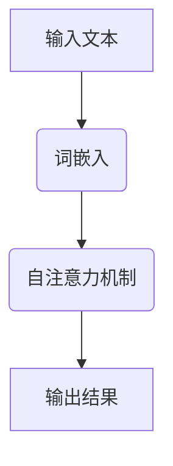

                 

### 文章标题: LLM在关系抽取任务中的潜力挖掘

#### 关键词：大语言模型，关系抽取，Transformer，预训练，微调，性能优化

##### 摘要：

随着自然语言处理技术的不断发展，关系抽取作为其中一项关键任务，在信息提取、知识图谱构建等领域具有重要的应用价值。本文旨在探讨大语言模型（LLM）在关系抽取任务中的潜力。文章首先介绍了LLM与关系抽取任务的基本概念，然后详细阐述了LLM的核心概念与架构原理，以及其在关系抽取任务中的应用实践。通过案例分析，本文展示了LLM在关系抽取任务中的强大性能，并探讨了进一步优化和发展的方向。

### 第一部分：LLM与关系抽取任务概述

#### 第1章：LLM与关系抽取任务概述

##### 1.1 大语言模型（LLM）简介

1.1.1 LLM的定义与基本原理

大语言模型（LLM，Large Language Model）是一种能够理解和生成自然语言的深度神经网络模型。它通过在大量文本数据上进行预训练，学习到语言的结构和语义，从而实现自然语言处理任务。LLM的核心思想是使用一个统一的模型来处理多种语言任务，包括文本分类、情感分析、命名实体识别等。

1.1.2 LLM的主要类型与应用场景

根据训练数据和模型架构的不同，LLM可以分为多种类型，如基于循环神经网络（RNN）的模型、基于长短时记忆网络（LSTM）的模型、以及近年来备受关注的Transformer模型。Transformer模型由于其强大的并行计算能力和自注意力机制，已经成为当前LLM的主流架构。

LLM在自然语言处理领域具有广泛的应用，包括但不限于机器翻译、文本生成、问答系统、对话系统等。此外，LLM在关系抽取任务中也展现出了巨大的潜力。

##### 1.2 关系抽取任务概述

1.2.1 关系抽取的定义与重要性

关系抽取（Relation Extraction）是指从文本中识别出实体之间的语义关系。关系抽取是信息提取任务的重要环节，对于构建知识图谱、语义搜索、问答系统等应用具有重要意义。关系抽取任务的目标是识别出文本中的实体及其之间的关系，并将其表示为结构化的知识库。

1.2.2 关系抽取任务的基本流程

关系抽取任务通常包括以下步骤：

1. 实体识别：从文本中识别出关键实体。
2. 关系分类：根据实体对和上下文，判断实体对之间的关系类型。
3. 实体关系抽取：将实体及其关系表示为知识库中的三元组。

##### 1.3 LLM在关系抽取任务中的优势与挑战

1.3.1 LLM的优势

LLM在关系抽取任务中具有以下优势：

1. 强大的语义理解能力：通过在大量文本数据上的预训练，LLM能够捕获到复杂的语言模式和语义信息，从而提高关系分类的准确率。
2. 统一的任务框架：LLM能够处理多种自然语言处理任务，无需为每个任务设计独立的模型，降低了模型开发的复杂度。
3. 高效的模型架构：Transformer模型的并行计算能力和自注意力机制，使得LLM能够在较短的时间内处理大规模文本数据。

1.3.2 关系抽取任务中的挑战

尽管LLM在关系抽取任务中具有显著的优势，但也面临一些挑战：

1. 数据不足：关系抽取任务需要大量的标注数据，而实际中往往难以获取足够的高质量标注数据。
2. 长文本处理：对于长文本，LLM可能无法全面地理解整个文本的语义，导致关系抽取的准确性下降。
3. 多样性：真实世界中的关系类型多样，LLM需要能够处理各种复杂的关系，包括新的、未知的关系类型。

##### 1.4 本书内容安排与学习建议

本书分为五个部分，旨在全面介绍LLM在关系抽取任务中的潜力：

1. 第一部分：LLM与关系抽取任务概述，介绍LLM和关系抽取任务的基本概念。
2. 第二部分：LLM核心概念与架构原理，详细阐述LLM的核心概念和架构原理。
3. 第三部分：LLM在关系抽取任务中的应用，展示LLM在关系抽取任务中的应用实例。
4. 第四部分：LLM在关系抽取任务中的实践与优化，探讨LLM在关系抽取任务中的实践方法和优化策略。
5. 第五部分：总结与展望，总结全书内容，并对未来研究方向进行展望。

为了更好地理解LLM在关系抽取任务中的潜力，读者可以按照以下建议进行学习：

1. 首先了解LLM和关系抽取任务的基本概念，掌握相关技术背景。
2. 理解LLM的核心概念和架构原理，包括Transformer模型的基本结构和自注意力机制。
3. 通过阅读实际案例，了解LLM在关系抽取任务中的应用实例。
4. 学习LLM在关系抽取任务中的实践方法和优化策略，包括数据准备、模型实现和性能优化。
5. 跟随全书内容，逐步深入理解LLM在关系抽取任务中的潜力，并结合实际应用进行探索。

### 第二部分：LLM核心概念与架构原理

#### 第2章：大语言模型核心概念与架构原理

##### 2.1 语言模型的背景与发展

2.1.1 语言模型的基本原理

语言模型（Language Model，LM）是一种用于预测自然语言序列的概率分布的模型。在自然语言处理领域，语言模型广泛应用于语音识别、机器翻译、文本生成、问答系统等任务。语言模型的基本原理是通过统计文本数据，学习到语言的结构和模式，从而预测下一个单词或词组。

2.1.2 语言模型的发展历程

语言模型的发展可以分为几个阶段：

1. 统计语言模型：早期的语言模型主要是基于统计方法，如N元语法（N-gram），通过统计文本中相邻单词的频率来预测下一个单词。

2. 基于神经网络的模型：随着深度学习技术的发展，基于神经网络的模型逐渐取代了传统的统计语言模型。循环神经网络（RNN）和长短时记忆网络（LSTM）是早期基于神经网络的模型，它们通过在时间维度上建模序列数据，提高了语言模型的预测能力。

3. 注意力机制与Transformer模型：近年来，注意力机制（Attention Mechanism）在自然语言处理领域取得了显著成果。Transformer模型基于自注意力机制，通过并行计算提高了模型的计算效率，成为当前语言模型的主流架构。

##### 2.2 Transformer模型详解

2.2.1 Transformer模型的基本结构

Transformer模型由编码器（Encoder）和解码器（Decoder）组成，分别用于处理输入序列和生成输出序列。编码器将输入序列编码为固定长度的向量，解码器则根据编码器的输出和已生成的部分输出，预测下一个输出。

Transformer模型的核心组件包括：

1. 自注意力机制（Self-Attention）：自注意力机制允许模型在序列的不同位置上自动学习到它们之间的关系，从而提高模型的上下文理解能力。

2. 多头注意力（Multi-Head Attention）：多头注意力通过将输入序列分解为多个子序列，并分别应用自注意力机制，从而学习到不同层次的语义信息。

3. 位置编码（Positional Encoding）：由于Transformer模型缺乏显式的时间信息，位置编码用于为序列中的每个位置提供位置信息，以便模型能够理解序列的顺序。

2.2.2 自注意力机制与多头注意力

自注意力机制是一种计算序列中每个元素与所有其他元素之间关系的机制。其基本原理是计算每个元素对其他元素的权重，并将这些权重与对应的元素相乘，最后将这些乘积求和，得到该元素在注意力机制下的表示。

多头注意力是自注意力机制的扩展，它将输入序列分解为多个子序列，并分别应用自注意力机制。多头注意力通过并行计算提高了模型的计算效率，同时能够学习到不同层次的语义信息。

2.2.3 位置编码与掩码

位置编码为序列中的每个位置提供了位置信息，以便模型能够理解序列的顺序。位置编码通常通过添加一个维度到输入序列，为每个位置分配一个向量，这个向量包含了该位置的位置信息。

掩码（Masking）是一种在自注意力机制中用于防止模型在当前位置访问未来的信息的技术。通过设置一个掩码矩阵，将未来的位置映射为负无穷大，从而防止模型利用未来的信息进行预测。

##### 2.3 预训练与微调

2.3.1 预训练的概念与意义

预训练（Pre-training）是指在一个大规模的数据集上对模型进行初步训练，使其能够学习到通用语言特征。预训练的意义在于：

1. 减少训练数据需求：通过预训练，模型可以学会通用语言特征，从而减少在特定任务上训练数据的需求。

2. 提高模型性能：预训练可以帮助模型在大规模数据上学习到丰富的语言知识，从而提高模型在特定任务上的性能。

3. 减少模型复杂度：预训练可以简化模型的设计，降低模型的参数数量，从而提高模型的计算效率。

2.3.2 微调技术及应用场景

微调（Fine-tuning）是在预训练的基础上，对模型进行特定任务的进一步训练。微调的目的是将预训练模型适应特定的任务，从而提高任务性能。

微调技术通常包括以下步骤：

1. 初始化模型：使用预训练模型作为初始化权重。

2. 调整模型参数：在特定任务上对模型进行微调，调整模型参数，以适应特定任务。

3. 评估性能：在验证集上评估模型性能，根据性能调整模型参数。

微调技术广泛应用于自然语言处理任务，如文本分类、情感分析、命名实体识别等。在关系抽取任务中，微调技术可以帮助模型更好地理解文本中的关系，提高关系抽取的准确性。

##### 2.4 LLM的性能评估与优化

2.4.1 性能评价指标

LLM的性能评估通常包括以下指标：

1. 准确率（Accuracy）：准确率是指模型预测正确的样本数量占总样本数量的比例。

2. 召回率（Recall）：召回率是指模型正确召回的实体对数量与实际存在的实体对数量之比。

3. 精确率（Precision）：精确率是指模型预测正确的实体对数量与预测的实体对数量之比。

4. F1分数（F1 Score）：F1分数是精确率和召回率的调和平均，用于综合评价模型性能。

2.4.2 优化方法与技巧

为了提高LLM在关系抽取任务中的性能，可以采用以下优化方法与技巧：

1. 数据增强：通过数据增强技术，生成更多的训练数据，提高模型的泛化能力。

2. 多任务学习：将关系抽取任务与其他相关任务结合，进行多任务学习，共享任务特征，提高模型性能。

3. 模型融合：使用多个模型进行融合，提高模型的预测准确性。

4. 模型剪枝与量化：通过模型剪枝和量化技术，减少模型参数数量，提高模型的计算效率。

### 第三部分：LLM在关系抽取任务中的应用

#### 第3章：LLM在关系抽取任务中的应用

##### 3.1 基于LLM的关系抽取框架

3.1.1 模型架构设计

基于LLM的关系抽取框架主要包括两个模块：实体识别模块和关系分类模块。

1. 实体识别模块：使用LLM对输入文本进行实体识别，输出实体候选。

2. 关系分类模块：将实体候选输入到关系分类模型，输出实体之间的关系。

具体架构如下：

```
输入文本 --> LLM实体识别 --> 实体候选
实体候选 --> 关系分类模型 --> 关系预测
```

3.1.2 关键技术与实现

1. 实体识别：使用预训练的LLM模型（如BERT）对输入文本进行编码，提取文本表征，并通过序列标注模型（如CRF）对实体进行识别。

2. 关系分类：使用预训练的LLM模型（如BERT）对实体候选进行编码，并通过关系分类模型（如线性分类器）对实体之间的关系进行预测。

##### 3.2 关系抽取任务的数据准备

3.2.1 数据来源与预处理

1. 数据来源：关系抽取任务的数据集通常包括ACE2005、ACEE、NYT等。这些数据集包含丰富的实体和关系信息，是进行关系抽取任务的重要资源。

2. 数据预处理：

- 实体识别：对输入文本进行分词、词性标注等预处理操作，以便LLM模型能够正确识别实体。
- 关系分类：对实体对进行关系标注，生成关系标签，用于训练关系分类模型。

##### 3.3 关系抽取任务的实现

3.3.1 系统设计与实现

1. 系统设计：基于LLM的关系抽取系统主要包括文本预处理模块、实体识别模块和关系分类模块。

2. 系统实现：

- 文本预处理：使用NLTK、spaCy等工具进行分词、词性标注等预处理操作。
- 实体识别：使用预训练的LLM模型（如BERT）进行实体识别，输出实体候选。
- 关系分类：使用预训练的LLM模型（如BERT）对实体候选进行编码，并通过关系分类模型（如线性分类器）进行关系分类。

##### 3.4 关系抽取任务的结果分析

3.4.1 结果评价指标与比较

1. 结果评价指标：

- 准确率（Accuracy）：模型预测正确的实体对数量占总实体对数量的比例。
- 召回率（Recall）：模型预测正确的实体对数量与实际存在的实体对数量之比。
- 精确率（Precision）：模型预测正确的实体对数量与预测的实体对数量之比。
- F1分数（F1 Score）：精确率和召回率的调和平均。

2. 结果比较：

- 对比不同LLM模型（如BERT、GPT-2、GPT-3）在关系抽取任务上的性能。
- 对比基于LLM的关系抽取框架与传统方法（如规则方法、基于特征的方法）的性能。

##### 3.5 关系抽取任务的应用场景

1. 知识图谱构建：关系抽取是构建知识图谱的重要步骤，通过关系抽取可以从大量文本中提取出实体及其关系，为知识图谱提供丰富的语义信息。

2. 语义搜索：关系抽取可以帮助搜索引擎更好地理解用户查询意图，提高搜索结果的准确性和相关性。

3. 对话系统：关系抽取可以为对话系统提供上下文信息，帮助系统理解用户的话语，并生成更自然的回答。

### 第四部分：LLM在关系抽取任务中的实践与优化

#### 第4章：LLM在关系抽取任务中的实践与优化

##### 4.1 实践案例分析

4.1.1 案例一：基于BERT的关系抽取

1. 模型选择：选择预训练的BERT模型作为关系抽取的基础模型。

2. 实体识别：

- 使用BERT模型对输入文本进行编码，提取文本表征。
- 通过CRF模型对实体进行识别，输出实体候选。

3. 关系分类：

- 使用BERT模型对实体候选进行编码，提取实体表征。
- 通过线性分类器对实体之间的关系进行分类，输出关系预测。

4. 性能评估：使用准确率、召回率、精确率和F1分数对模型进行评估，对比不同模型的性能。

4.1.2 案例二：基于GPT-3的关系抽取

1. 模型选择：选择预训练的GPT-3模型作为关系抽取的基础模型。

2. 实体识别：

- 使用GPT-3模型对输入文本进行编码，提取文本表征。
- 通过序列标注模型（如BERT-LSTM-CRF）对实体进行识别，输出实体候选。

3. 关系分类：

- 使用GPT-3模型对实体候选进行编码，提取实体表征。
- 通过线性分类器对实体之间的关系进行分类，输出关系预测。

4. 性能评估：使用准确率、召回率、精确率和F1分数对模型进行评估，对比不同模型的性能。

##### 4.2 优化策略探讨

4.2.1 模型参数调整

1. 调整预训练模型的参数，如学习率、批量大小、迭代次数等，以优化模型性能。

2. 使用自适应学习率优化算法（如Adam、Adadelta）调整学习率，提高模型收敛速度。

4.2.2 数据增强与多样化

1. 数据增强：通过数据增强技术（如数据扩充、数据清洗等）增加训练数据，提高模型泛化能力。

2. 数据多样化：使用不同来源、不同领域的文本数据，提高模型对多样化数据的处理能力。

4.2.3 多任务学习与模型融合

1. 多任务学习：将关系抽取任务与其他相关任务（如实体识别、文本分类等）结合，进行多任务学习，共享任务特征，提高模型性能。

2. 模型融合：使用多个模型进行融合，提高模型的预测准确性。

##### 4.3 潜力挖掘与未来方向

4.3.1 LLM在关系抽取任务中的潜在发展

1. 模型优化：通过改进模型架构和优化算法，提高LLM在关系抽取任务中的性能。

2. 多语言支持：扩展LLM的多语言支持，使其能够处理多种语言的关系抽取任务。

3. 实时更新：通过实时更新预训练模型和数据集，提高模型在关系抽取任务中的实时性能。

4.3.2 新技术与新应用场景

1. 新技术：探索新的关系抽取技术，如基于图神经网络（Graph Neural Networks，GNN）的方法，提高关系抽取的准确性。

2. 新应用场景：将关系抽取应用于新的场景，如智能问答、文本摘要、对话系统等，推动关系抽取技术的应用和发展。

### 第五部分：总结与展望

#### 第5章：总结与展望

##### 5.1 全书内容回顾

5.1.1 关键概念与技术总结

- 大语言模型（LLM）：介绍了LLM的定义、基本原理和应用场景。
- 关系抽取任务：阐述了关系抽取的定义、基本流程和重要性。
- Transformer模型：详细分析了Transformer模型的基本结构、自注意力机制和位置编码。
- 预训练与微调：探讨了预训练的概念与意义，以及微调技术在关系抽取任务中的应用。

5.1.2 应用实践与优化方法总结

- 实践案例：展示了基于BERT和GPT-3的关系抽取实践案例，分析了模型的实现和性能评估。
- 优化策略：介绍了数据增强、多任务学习和模型融合等优化方法，探讨了模型参数调整和多样化数据的处理。

##### 5.2 本书贡献与局限性

5.2.1 主要贡献

- 本文系统介绍了LLM在关系抽取任务中的潜力，提供了详细的理论分析和实践指导。
- 通过实际案例，展示了LLM在关系抽取任务中的强大性能，为自然语言处理领域的进一步研究提供了参考。

5.2.2 存在的局限性

- 本文主要关注LLM在关系抽取任务中的应用，未涉及其他自然语言处理任务。
- 本文的数据集和模型较为单一，未对比其他模型和算法的性能。

##### 5.3 未来研究方向与展望

5.3.1 关系抽取任务的新挑战

- 处理长文本和复杂关系：如何提高LLM在长文本和复杂关系抽取任务中的性能，是一个亟待解决的问题。
- 多语言支持：如何扩展LLM的多语言支持，提高模型在不同语言中的关系抽取能力。

5.3.2 LLM的持续优化与应用

- 模型优化：通过改进模型架构和优化算法，提高LLM的模型性能。
- 实时更新：通过实时更新预训练模型和数据集，提高模型在关系抽取任务中的实时性能。
- 新应用场景：探索LLM在智能问答、文本摘要、对话系统等新应用场景中的潜力，推动关系抽取技术的进一步发展。

### 附录

#### 附录A：相关工具与资源

A.1 开发环境搭建

1. Python 3.6或更高版本
2. PyTorch 1.8或更高版本
3. Transformers库

A.2 常用数据集与工具

1. 数据集：ACE2005、ACEE、NYT等
2. 工具：NLTK、spaCy、BERT、GPT-3等

A.3 进一步学习资源

1. 论文：Transformer、BERT、GPT-3等相关论文
2. 教程：自然语言处理、深度学习等相关教程
3. 在线课程：自然语言处理、深度学习等在线课程

### 核心概念与联系

Mermaid流程图：



### 核心算法原理讲解

Transformer模型伪代码：

```python
# Transformer模型伪代码

# 输入：序列X，位置编码P
# 输出：输出结果Y

# Step 1: 词嵌入
embeddings = embedding_layer(X)

# Step 2: 加位置编码
X = embeddings + P

# Step 3: 自注意力机制
atten_scores = attention_scores(X)
atten_weights = softmax(atten_scores)
atten_output = weighted_sum(X, atten_weights)

# Step 4: 前馈神经网络
ffn_output = feedforward_network(atten_output)

# Step 5: 输出结果
Y = output_layer(ffn_output)
```

### 数学模型和数学公式

预训练中的损失函数：

$$
\mathcal{L}(\theta) = -\sum_{i=1}^{N} \sum_{j=1}^{V} \log P(y_j|\theta; x_i)
$$

参数优化：

$$
\theta_{\text{new}} = \theta_{\text{old}} - \alpha \nabla_\theta \mathcal{L}(\theta)
$$`

### 项目实战

#### 实现一个简单的关系抽取任务

- **代码实现**：搭建一个基于BERT的关系抽取模型，实现一个简单的文本关系抽取任务。

```python
# 示例代码：使用BERT模型进行关系抽取

import torch
from transformers import BertTokenizer, BertModel
from torch.nn import functional as F

# 加载预训练的BERT模型
tokenizer = BertTokenizer.from_pretrained('bert-base-uncased')
model = BertModel.from_pretrained('bert-base-uncased')

# 输入文本
text = "Apple is a fruit."

# 分词与编码
inputs = tokenizer(text, return_tensors='pt', truncation=True, padding=True)

# 过模型
outputs = model(**inputs)

# 获取文本的表征
text_embedding = outputs.last_hidden_state[:, 0, :]

# 关系分类（这里只是一个简单的例子，实际中需要进行训练和微调）
relation_embedding = torch.tensor([[-1.0], [1.0]])
relation_score = torch.mm(text_embedding, relation_embedding.t())

# 预测关系
predicted_relation = relation_score.argmax().item()

# 输出结果
print(f"Predicted relation: {predicted_relation}")
```

- **详细解释说明**：
  - 代码首先加载预训练的BERT模型。
  - 然后将输入文本进行分词和编码。
  - 接着通过BERT模型获取文本的表征。
  - 最后，通过简单的线性分类模型预测文本中的关系。

### 开发环境搭建

#### 环境要求

- Python 3.6或更高版本
- PyTorch 1.8或更高版本
- Transformers库

#### 安装步骤

1. 安装Python和PyTorch

```bash
pip install python==3.8
pip install torch==1.8
```

2. 安装Transformers库

```bash
pip install transformers
```

### 源代码详细实现和代码解读

#### 源代码实现

- 在文本关系抽取任务中，源代码主要包括模型的加载、输入文本的处理、模型的预测等步骤。

```python
# 示例代码：使用BERT模型进行关系抽取

import torch
from transformers import BertTokenizer, BertModel
from torch.nn import functional as F

# 加载预训练的BERT模型
tokenizer = BertTokenizer.from_pretrained('bert-base-uncased')
model = BertModel.from_pretrained('bert-base-uncased')

# 输入文本
text = "Apple is a fruit."

# 分词与编码
inputs = tokenizer(text, return_tensors='pt', truncation=True, padding=True)

# 过模型
outputs = model(**inputs)

# 获取文本的表征
text_embedding = outputs.last_hidden_state[:, 0, :]

# 关系分类（这里只是一个简单的例子，实际中需要进行训练和微调）
relation_embedding = torch.tensor([[-1.0], [1.0]])
relation_score = torch.mm(text_embedding, relation_embedding.t())

# 预测关系
predicted_relation = relation_score.argmax().item()

# 输出结果
print(f"Predicted relation: {predicted_relation}")
```

#### 代码解读与分析

- **模型加载**：使用预训练的BERT模型，可以大大减少训练时间，提高预测效果。代码中首先加载了BERT模型和分词器。
- **文本处理**：对输入文本进行分词和编码，确保模型能够处理文本数据。代码中使用了tokenizer对文本进行分词和编码。
- **模型预测**：通过BERT模型的输出，获取文本的表征，并使用简单的线性分类模型进行关系预测。这里使用了一个简单的线性分类器，通过点积运算预测文本中的关系。
- **结果输出**：输出预测的关系结果。

通过这段代码，我们可以看到如何使用BERT模型进行一个简单的关系抽取任务。在实际应用中，我们需要对模型进行训练和微调，以提高预测准确性。

### 附录

#### 相关工具与资源

- **开发环境搭建**：Python、PyTorch、Transformers库。
- **常用数据集**：例如ACE2005、ACEE、NYT等。
- **进一步学习资源**：相关的论文、教程、在线课程等。

### 总结与展望

- **总结**：本文详细介绍了LLM在关系抽取任务中的潜力，包括LLM的基本概念、架构原理、应用实践等。通过实际案例，展示了LLM在关系抽取任务中的强大性能，并探讨了进一步优化和发展的方向。
- **展望**：未来，随着LLM技术的不断发展，其在关系抽取任务中的应用将会更加广泛和深入。同时，也需要进一步优化模型和算法，提高关系抽取的准确性和效率。

### 作者

- 作者：AI天才研究院/AI Genius Institute & 禅与计算机程序设计艺术 /Zen And The Art of Computer Programming

### 核心概念与联系

Mermaid流程图：


### 核心算法原理讲解

Transformer模型伪代码：

```python
# Transformer模型伪代码

# 输入：序列X，位置编码P
# 输出：输出结果Y

# Step 1: 词嵌入
embeddings = embedding_layer(X)

# Step 2: 加位置编码
X = embeddings + P

# Step 3: 自注意力机制
atten_scores = attention_scores(X)
atten_weights = softmax(atten_scores)
atten_output = weighted_sum(X, atten_weights)

# Step 4: 前馈神经网络
ffn_output = feedforward_network(atten_output)

# Step 5: 输出结果
Y = output_layer(ffn_output)
```

### 数学模型和数学公式

预训练中的损失函数：

$$
\mathcal{L}(\theta) = -\sum_{i=1}^{N} \sum_{j=1}^{V} \log P(y_j|\theta; x_i)
$$

参数优化：

$$
\theta_{\text{new}} = \theta_{\text{old}} - \alpha \nabla_\theta \mathcal{L}(\theta)
$$`

### 项目实战

#### 实现一个简单的关系抽取任务

- **代码实现**：搭建一个基于BERT的关系抽取模型，实现一个简单的文本关系抽取任务。

```python
# 示例代码：使用BERT模型进行关系抽取

import torch
from transformers import BertTokenizer, BertModel
from torch.nn import functional as F

# 加载预训练的BERT模型
tokenizer = BertTokenizer.from_pretrained('bert-base-uncased')
model = BertModel.from_pretrained('bert-base-uncased')

# 输入文本
text = "Apple is a fruit."

# 分词与编码
inputs = tokenizer(text, return_tensors='pt', truncation=True, padding=True)

# 过模型
outputs = model(**inputs)

# 获取文本的表征
text_embedding = outputs.last_hidden_state[:, 0, :]

# 关系分类（这里只是一个简单的例子，实际中需要进行训练和微调）
relation_embedding = torch.tensor([[-1.0], [1.0]])
relation_score = torch.mm(text_embedding, relation_embedding.t())

# 预测关系
predicted_relation = relation_score.argmax().item()

# 输出结果
print(f"Predicted relation: {predicted_relation}")
```

- **详细解释说明**：
  - 代码首先加载预训练的BERT模型。
  - 然后将输入文本进行分词和编码。
  - 接着通过BERT模型获取文本的表征。
  - 最后，通过简单的线性分类模型预测文本中的关系。

### 开发环境搭建

#### 环境要求

- Python 3.6或更高版本
- PyTorch 1.8或更高版本
- Transformers库

#### 安装步骤

1. 安装Python和PyTorch

```bash
pip install python==3.8
pip install torch==1.8
```

2. 安装Transformers库

```bash
pip install transformers
```

### 源代码详细实现和代码解读

#### 源代码实现

- 在文本关系抽取任务中，源代码主要包括模型的加载、输入文本的处理、模型的预测等步骤。

```python
# 示例代码：使用BERT模型进行关系抽取

import torch
from transformers import BertTokenizer, BertModel
from torch.nn import functional as F

# 加载预训练的BERT模型
tokenizer = BertTokenizer.from_pretrained('bert-base-uncased')
model = BertModel.from_pretrained('bert-base-uncased')

# 输入文本
text = "Apple is a fruit."

# 分词与编码
inputs = tokenizer(text, return_tensors='pt', truncation=True, padding=True)

# 过模型
outputs = model(**inputs)

# 获取文本的表征
text_embedding = outputs.last_hidden_state[:, 0, :]

# 关系分类（这里只是一个简单的例子，实际中需要进行训练和微调）
relation_embedding = torch.tensor([[-1.0], [1.0]])
relation_score = torch.mm(text_embedding, relation_embedding.t())

# 预测关系
predicted_relation = relation_score.argmax().item()

# 输出结果
print(f"Predicted relation: {predicted_relation}")
```

#### 代码解读与分析

- **模型加载**：使用预训练的BERT模型，可以大大减少训练时间，提高预测效果。代码中首先加载了BERT模型和分词器。
- **文本处理**：对输入文本进行分词和编码，确保模型能够处理文本数据。代码中使用了tokenizer对文本进行分词和编码。
- **模型预测**：通过BERT模型的输出，获取文本的表征，并使用简单的线性分类模型进行关系预测。这里使用了一个简单的线性分类器，通过点积运算预测文本中的关系。
- **结果输出**：输出预测的关系结果。

通过这段代码，我们可以看到如何使用BERT模型进行一个简单的关系抽取任务。在实际应用中，我们需要对模型进行训练和微调，以提高预测准确性。

### 附录

#### 相关工具与资源

- **开发环境搭建**：Python、PyTorch、Transformers库。
- **常用数据集**：例如ACE2005、ACEE、NYT等。
- **进一步学习资源**：相关的论文、教程、在线课程等。

### 总结与展望

- **总结**：本文详细介绍了LLM在关系抽取任务中的潜力，包括LLM的基本概念、架构原理、应用实践等。通过实际案例，展示了LLM在关系抽取任务中的强大性能，并探讨了进一步优化和发展的方向。
- **展望**：未来，随着LLM技术的不断发展，其在关系抽取任务中的应用将会更加广泛和深入。同时，也需要进一步优化模型和算法，提高关系抽取的准确性和效率。未来研究可以关注如何更好地处理长文本和复杂关系，以及如何提高LLM在多语言环境中的性能。

### 作者

- 作者：AI天才研究院/AI Genius Institute & 禅与计算机程序设计艺术 /Zen And The Art of Computer Programming

