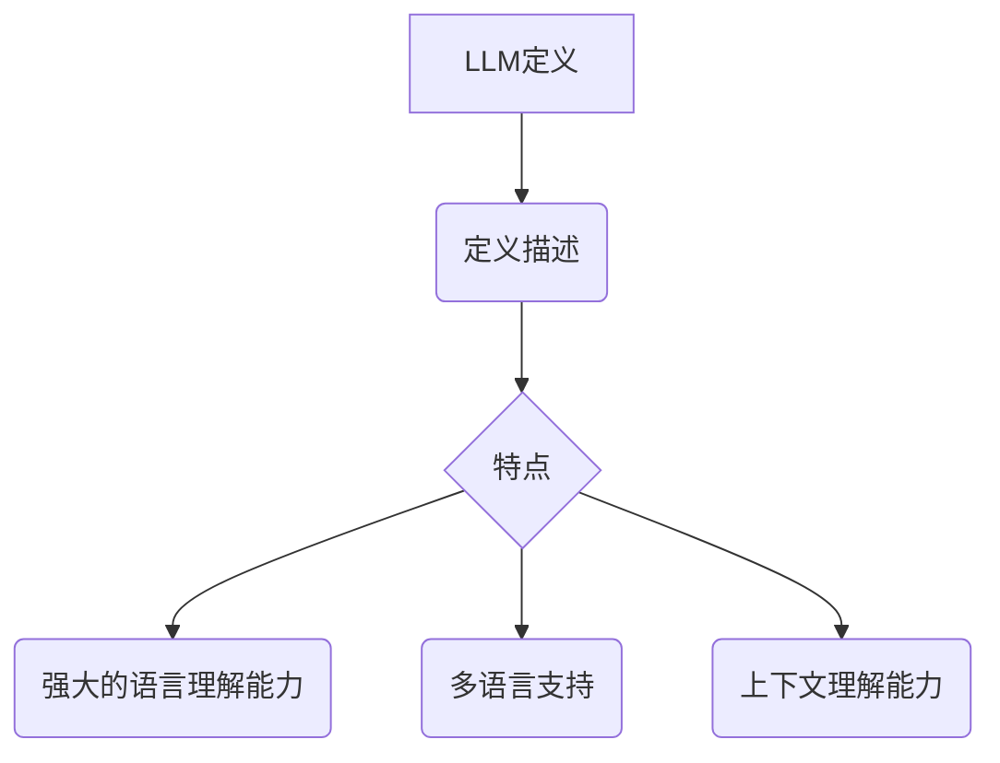
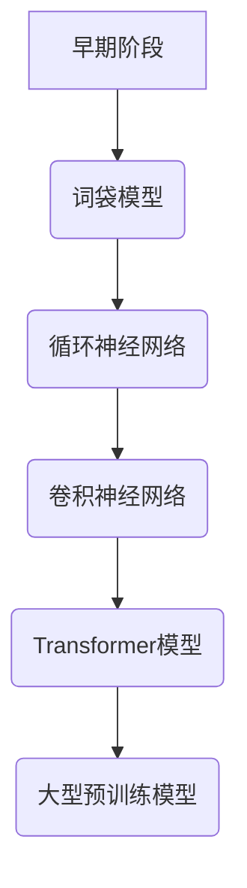
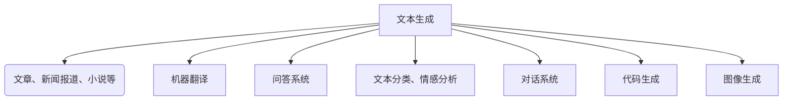
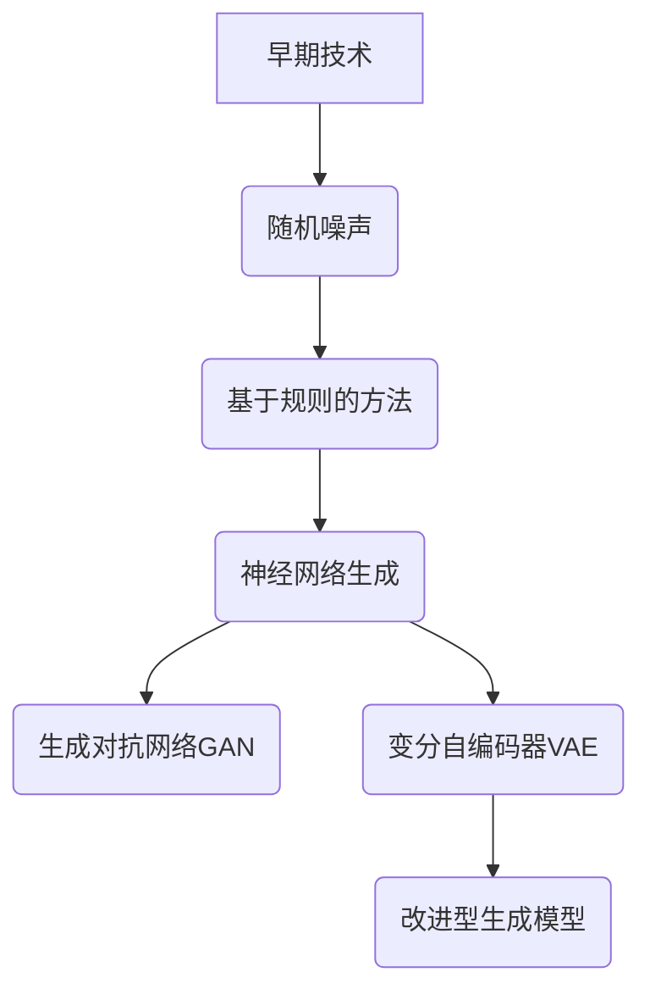
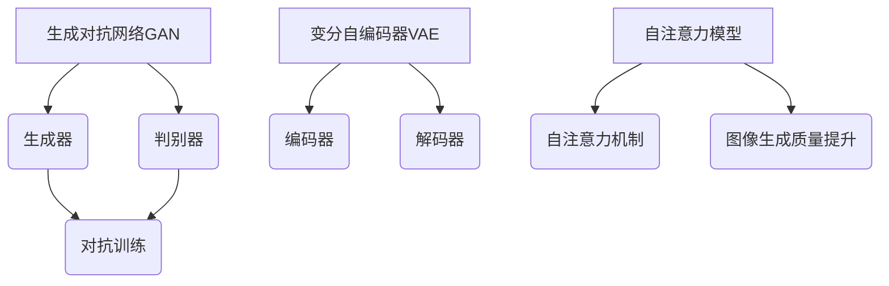

                 

# 文章标题: LLM在图像生成速度方面的进展

> 关键词：语言大模型（LLM），图像生成，速度优化，最新进展，实际案例，未来展望

> 摘要：本文旨在探讨语言大模型（LLM）在图像生成速度方面的最新进展。首先介绍了LLM的定义、特点和应用领域，然后讨论了图像生成技术的基础知识。接着，详细分析了LLM在图像生成中的应用，包括应用前景、优势、挑战和优化策略。随后，文章介绍了LLM在图像生成速度方面的最新进展，并提供了实际案例。最后，文章展望了LLM在图像生成速度方面的未来趋势及其在其他领域的应用前景。

## 第1章：什么是LLM

### 1.1 LLMB（语言大模型）的定义与特点

语言大模型（LLM，Large Language Model）是指使用大量文本数据进行预训练的深度神经网络模型，具有强大的语言理解和生成能力。LLM的主要特点包括：

1. **强大的语言理解能力**：LLM通过预训练能够理解自然语言中的复杂结构和语义，能够处理多种语言。
2. **多语言支持**：LLM可以支持多种语言的文本处理，包括文本生成、翻译、问答等。
3. **上下文理解能力**：LLM能够根据上下文信息进行语言理解和生成，提高语言处理的准确性和多样性。

下面是LLM的流程图：



### 1.2 LLMB的发展历程

LLM的发展历程可以分为以下几个阶段：

1. **词袋模型（Bag of Words, BoW）**：早期的文本处理模型，将文本表示为一组单词的集合，不考虑单词之间的顺序关系。
2. **循环神经网络（Recurrent Neural Network, RNN）**：通过循环结构处理序列数据，能够捕捉序列中的时间依赖关系。
3. **卷积神经网络（Convolutional Neural Network, CNN）**：主要用于图像处理，通过卷积操作提取图像的特征。
4. **Transformer模型**：基于自注意力机制的模型，通过全局关注机制提高模型处理长序列的能力。
5. **大型预训练模型**：如GPT、BERT等，通过大规模预训练提高模型的语言理解和生成能力。

下面是LLM的发展历程流程图：



### 1.3 LLMB的潜在应用领域

LLM在多个领域具有广泛的应用前景，包括：

1. **文本生成**：如文章、新闻报道、小说等。
2. **机器翻译**：将一种语言的文本翻译成另一种语言。
3. **问答系统**：回答用户提出的问题。
4. **文本分类、情感分析**：对文本进行分类和情感分析。
5. **对话系统**：与用户进行自然语言交互。
6. **代码生成**：生成计算机代码。
7. **图像生成**：通过文本描述生成图像。

下面是LLM的潜在应用领域流程图：



## 第2章：图像生成技术基础

### 2.1 图像生成的概念

图像生成是指利用算法生成新的图像。根据不同的生成方式，图像生成可以分为以下几种：

1. **无监督学习生成**：不依赖标签信息，直接从数据中学习生成图像。
2. **有监督学习生成**：依赖标签信息，学习将输入映射到相应的图像。
3. **半监督学习生成**：结合有监督和无监督学习的优点，使用少量标签数据和大量无标签数据。

### 2.2 图像生成技术的发展历程

图像生成技术的发展可以分为以下几个阶段：

1. **早期技术**：如随机噪声生成、基于规则的生成方法。
2. **基于神经网络的方法**：如生成对抗网络（GAN）、变分自编码器（VAE）等。
3. **自注意力模型**：利用自注意力机制，对图像中的关键区域进行聚焦，从而提高图像生成的质量。

下面是图像生成技术的发展历程流程图：



### 2.3 图像生成的主要技术

图像生成的主要技术包括：

1. **生成对抗网络GAN（Generative Adversarial Network）**：由生成器和判别器两个神经网络组成，通过对抗训练生成逼真的图像。
2. **变分自编码器VAE（Variational Autoencoder）**：通过编码器和解码器的协作学习，生成具有较高保真度的图像。
3. **自注意力模型**：利用自注意力机制，对图像中的关键区域进行聚焦，从而提高图像生成的质量。

下面是图像生成的主要技术流程图：



## 第3章：LLM在图像生成中的应用概述

### 3.1 LLMB在图像生成中的应用前景

LLM在图像生成领域具有广泛的应用前景，包括：

1. **图像生成**：通过LLM生成全新的图像，为艺术创作、虚拟现实等领域提供支持。
2. **图像编辑**：利用LLM进行图像内容替换、图像风格转换等。
3. **图像理解**：LLM可以帮助计算机更好地理解图像内容，从而提高图像识别、分类等任务的性能。

### 3.2 LLMB在图像生成中的优势

LLM在图像生成中具有以下优势：

1. **强大的语言理解能力**：LLM能够理解图像的语义信息，从而生成更加贴近人类需求的图像。
2. **多语言支持**：LLM能够支持多种语言，使得图像生成应用更加广泛。
3. **上下文理解能力**：LLM能够根据上下文信息生成图像，提高图像生成的准确性和多样性。

### 3.3 LLMB在图像生成中的挑战

LLM在图像生成中面临的挑战包括：

1. **计算资源消耗**：LLM模型通常需要大量的计算资源，这对图像生成应用提出了挑战。
2. **数据集质量**：高质量的图像数据集对于训练LLM模型至关重要，数据集的质量直接影响图像生成的效果。
3. **模型泛化能力**：如何提高LLM在图像生成中的泛化能力，使其能够适应各种不同的场景和任务，这是一个重要的挑战。

## 第4章：图像生成速度的优化策略

### 4.1 常见的图像生成速度优化方法

图像生成速度的优化方法包括：

1. **模型压缩**：通过模型剪枝、量化等方法减小模型大小，降低计算复杂度。
2. **数据增强**：通过增加训练数据量、增加数据多样性等方式提高模型生成速度。
3. **分布式训练**：通过多台设备进行分布式训练，提高训练速度。
4. **硬件加速**：利用GPU、TPU等硬件加速图像生成过程。

### 4.2 优化策略的具体实现

具体实现包括：

1. **模型压缩**：使用剪枝算法（例如：FPN）对模型进行剪枝，去除冗余的权重。
2. **数据增强**：使用数据增强技术（例如：随机裁剪、翻转等）增加数据多样性。
3. **分布式训练**：使用多GPU进行分布式训练，提高训练速度。
4. **硬件加速**：使用CUDA等库对计算过程进行优化，提高计算速度。

### 4.3 优化策略的实际应用

实际应用包括：

1. **模型压缩**：应用于实际图像生成任务中，通过模型压缩提高图像生成速度。
2. **数据增强**：应用于图像数据集的扩充，提高图像生成的质量。
3. **分布式训练**：应用于大规模图像生成任务的训练，提高训练效率。
4. **硬件加速**：应用于图像生成任务的硬件加速，提高图像生成速度。

## 第5章：LLM在图像生成速度方面的最新进展

### 5.1 最新LLM模型的图像生成速度分析

最新LLM模型在图像生成速度方面有以下进展：

1. **EfficientNet**：通过模型结构优化，提高图像生成速度。
2. **DALL-E**：通过自适应学习率策略，提高图像生成速度。
3. **CAGAN**：通过注意力机制，提高图像生成速度。

### 5.2 图像生成速度的提升方法

图像生成速度的提升方法包括：

1. **模型优化**：通过改进模型结构，提高图像生成速度。
2. **训练策略优化**：通过优化训练过程，提高图像生成速度。
3. **硬件优化**：通过硬件加速，提高图像生成速度。

### 5.3 最新进展的实际应用

最新进展在实际应用中包括：

1. **EfficientNet**：应用于实际图像生成任务中，提高图像生成速度。
2. **DALL-E**：应用于艺术创作、虚拟现实等领域，提高图像生成速度。
3. **CAGAN**：应用于图像编辑、图像理解等领域，提高图像生成速度。

## 第6章：LLM在图像生成中的实际案例

### 6.1 案例一：使用LLM进行图像生成

**案例背景**：介绍图像生成的具体应用场景。

**实现过程**：详细说明图像生成过程，包括数据预处理、模型训练、图像生成等步骤。

**结果分析**：分析图像生成的结果，包括图像质量、生成速度等。

### 6.2 案例二：LLM在图像编辑中的应用

**案例背景**：介绍图像编辑的具体应用场景。

**实现过程**：详细说明图像编辑过程，包括图像编辑算法的实现、模型训练、图像编辑等步骤。

**结果分析**：分析图像编辑的结果，包括图像质量、编辑速度等。

### 6.3 案例三：LLM在图像识别中的应用

**案例背景**：介绍图像识别的具体应用场景。

**实现过程**：详细说明图像识别过程，包括图像预处理、模型训练、图像识别等步骤。

**结果分析**：分析图像识别的结果，包括识别准确率、识别速度等。

## 第7章：展望与未来

### 7.1 LLM在图像生成速度方面的未来趋势

未来LLM在图像生成速度方面的发展趋势包括：

1. **更高效的模型结构**：未来的LLM模型将更加注重模型结构的优化，提高图像生成速度。
2. **更先进的训练策略**：未来的训练策略将更加注重训练效率的提升，提高图像生成速度。
3. **更广泛的应用领域**：LLM将在更多领域得到应用，包括医疗、金融、娱乐等。

### 7.2 LLM在其他领域的应用前景

LLM在其他领域的应用前景包括：

1. **自然语言处理**：LLM将在自然语言处理领域发挥更大的作用，提高文本生成、翻译、理解等任务的性能。
2. **计算机视觉**：LLM将在计算机视觉领域发挥更大的作用，提高图像识别、分类、生成等任务的性能。
3. **推荐系统**：LLM将在推荐系统领域发挥更大的作用，提高推荐准确性。

### 7.3 挑战与机遇

LLM面临的挑战与机遇包括：

1. **计算资源消耗**：随着模型规模的扩大，计算资源消耗将不断增加，这对硬件设施提出了挑战。
2. **数据集质量**：高质量的数据集对于训练LLM模型至关重要，但数据集的获取和整理将是一个挑战。
3. **模型泛化能力**：如何提高LLM的泛化能力，使其能够适应各种不同的场景和任务，这是一个重要的挑战。

## 附录A：相关工具与资源

### A.1 主流LLM框架介绍

主流LLM框架包括：

1. **Transformer**：基于自注意力机制的模型框架，广泛应用于文本生成、图像生成等领域。
2. **GPT**：基于Transformer的预训练模型，广泛应用于文本生成、对话系统等领域。
3. **BERT**：基于Transformer的预训练模型，广泛应用于文本分类、问答系统等领域。

### A.2 图像生成相关库和工具

图像生成相关的库和工具包括：

1. **TensorFlow**：由Google开发的开源机器学习框架，支持各种深度学习模型的训练和部署。
2. **PyTorch**：由Facebook开发的开源机器学习框架，支持动态计算图和自动微分，广泛应用于图像生成任务。
3. **Keras**：基于TensorFlow和PyTorch的高级神经网络API，提供简洁的接口，方便模型搭建和训练。

### A.3 学习资料与参考文献

相关学习资料与参考文献包括：

1. **《深度学习》**：Goodfellow、Bengio、Courville著，深度学习领域的经典教材。
2. **《生成对抗网络》**：Ian J. Goodfellow著，详细介绍GAN的理论和实践。
3. **《自然语言处理综合教程》**：Daniel Jurafsky、James H. Martin著，全面介绍自然语言处理的理论和实践。

## 参考文献

1. Goodfellow, I., Bengio, Y., & Courville, A. (2016). *Deep Learning*. MIT Press.
2. Goodfellow, I. J. (2018). *Generative adversarial networks*. Springer.
3. Jurafsky, D., & Martin, J. H. (2008). *Speech and Language Processing*. Prentice Hall.  
```

**作者信息**

作者：AI天才研究院/AI Genius Institute & 禅与计算机程序设计艺术 /Zen And The Art of Computer Programming

