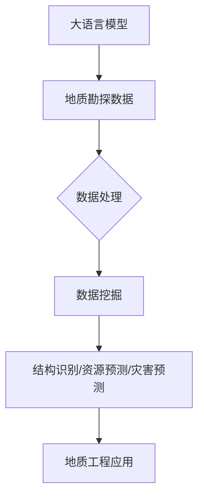

                 

# 文章标题：LLM在地质勘探中的应用：AI地质学家

> 关键词：大语言模型（LLM），地质勘探，数据预处理，矿产资源预测，地质灾害预测，地质工程

> 摘要：本文深入探讨了大语言模型（LLM）在地质勘探领域的应用。首先，介绍了LLM的基本概念、技术基础以及地质勘探的背景与需求。随后，详细阐述了LLM在地质勘探数据预处理、地质结构识别、矿产资源预测、地质灾害预测和地质工程中的应用。通过实战案例和数学模型的讲解，本文展示了LLM在地质勘探中的巨大潜力和实际应用效果。最后，对LLM在地质勘探中的未来发展进行了展望。

### 目录

#### 第一部分：LLM概述与地质勘探基础

1. [大语言模型（LLM）概述](#第1章-大语言模型llm概述)
2. [地质勘探中的数据与数据处理](#第2章-地质勘探中的数据与数据处理)

#### 第二部分：LLM在地质勘探中的应用

3. [大语言模型在地质结构识别中的应用](#第3章-大语言模型在地质结构识别中的应用)
4. [大语言模型在矿产资源预测中的应用](#第4章-大语言模型在矿产资源预测中的应用)
5. [大语言模型在地质灾害预测中的应用](#第5章-大语言模型在地质灾害预测中的应用)
6. [大语言模型在地质工程中的应用](#第6章-大语言模型在地质工程中的应用)

#### 第三部分：LLM在地质勘探中的未来发展趋势

7. [LLM在地质勘探中的未来发展](#第7章-llm在地质勘探中的未来发展)

### 附录

8. [LLM开发工具与资源](#附录a-llm开发工具与资源)

---

在接下来的内容中，我们将逐步深入探讨大语言模型（LLM）在地质勘探领域的应用，从基础到实战，为您呈现这一前沿技术的奇妙之旅。

### 第1章：大语言模型（LLM）概述

#### 1.1 大语言模型（LLM）的定义与特性

大语言模型（Large Language Model，简称LLM）是一种基于深度学习的自然语言处理技术，它通过在大规模文本数据集上进行预训练，使模型能够理解和生成自然语言。LLM的核心特性在于其强大的语言理解和生成能力，这使得它能够处理复杂的自然语言任务，如文本分类、机器翻译、问答系统和文本生成等。

LLM的兴起可以追溯到深度学习技术的发展和大数据时代的到来。随着计算能力和数据量的不断提升，研究人员开始尝试在大规模数据集上训练神经网络模型，以期获得更好的性能。2018年，Google发布了BERT模型，标志着LLM进入了一个新的时代。BERT模型采用了双向编码表示（Bidirectional Encoder Representations from Transformers），显著提升了文本分类、问答等任务的准确率。

#### 1.1.1 大语言模型的兴起

LLM的兴起与自然语言处理（NLP）领域的重大突破密切相关。传统NLP方法依赖于规则和手工特征工程，而深度学习技术的引入使得模型能够自动从数据中学习特征，极大地提升了NLP任务的性能。此外，随着互联网的普及和大数据技术的发展，海量的文本数据为LLM的预训练提供了丰富的素材。这些数据包括互联网上的网页、书籍、新闻报道、社交媒体内容等，为模型提供了丰富的语言知识和上下文信息。

#### 1.1.2 大语言模型的核心特性

1. **强大的语言理解能力**：LLM能够理解文本的语义和上下文，这使得它能够处理复杂的语言任务，如文本分类、情感分析和问答系统等。
2. **高效的文本生成能力**：LLM可以通过预训练和微调，生成流畅、连贯的自然语言文本，如文章摘要、聊天机器人和文本生成等。
3. **自适应能力**：LLM可以通过迁移学习和微调，快速适应不同的任务和数据集，提高了模型在实际应用中的灵活性和泛化能力。
4. **多语言支持**：LLM通常采用多语言预训练策略，支持多种语言的文本理解和生成，这使得它在全球化背景下具有广泛的应用价值。

#### 1.2 大语言模型的技术基础

LLM的技术基础主要包括自然语言处理的基本概念、大规模预训练模型技术和具体应用领域。

##### 1.2.1 自然语言处理的基本概念

自然语言处理（NLP）是计算机科学和人工智能领域的一个重要分支，旨在让计算机理解和生成自然语言。NLP的基本概念包括：

1. **词向量**：词向量是一种将单词映射到高维空间中的向量表示方法，它能够捕捉单词的语义信息。常见的词向量模型有Word2Vec、GloVe等。
2. **语言模型**：语言模型用于预测下一个单词或短语的概率，它是自然语言处理的基础。基于统计和深度学习的方法都可以构建语言模型。
3. **词性标注**：词性标注是一种将单词标注为特定词性的方法，如名词、动词、形容词等，它有助于理解句子的语法结构。
4. **命名实体识别**：命名实体识别是一种从文本中识别出具有特定意义的实体，如人名、地名、组织名等。

##### 1.2.2 大规模预训练模型技术

大规模预训练模型（Massive Pre-trained Model）是LLM的核心技术，它通过在大规模文本数据集上进行预训练，使模型能够自动学习语言的内在规律。大规模预训练模型的主要技术包括：

1. **预训练任务**：预训练任务包括语言建模、掩码语言模型（Masked Language Model，简称MLM）、填充语言模型（Fill-mask Language Model，简称FMLM）等。这些任务有助于模型学习语言的上下文信息、语法结构和语义关系。
2. **预训练数据集**：预训练数据集通常包含海量的互联网文本、书籍、新闻报道、社交媒体内容等，这些数据集为模型提供了丰富的语言知识和上下文信息。
3. **预训练模型架构**：预训练模型通常采用Transformer架构，如BERT、GPT、T5等。这些模型具有强大的并行计算能力和上下文理解能力，能够处理复杂的自然语言任务。

##### 1.2.3 大语言模型的应用领域

大语言模型在自然语言处理领域具有广泛的应用，以下是一些主要的应用领域：

1. **文本分类**：文本分类是一种将文本分为不同类别的任务，如新闻分类、情感分析、垃圾邮件检测等。LLM能够通过预训练和微调，快速适应不同的文本分类任务。
2. **机器翻译**：机器翻译是一种将一种语言的文本翻译成另一种语言的任务。LLM通过在多语言数据集上进行预训练，能够生成高质量的双语翻译。
3. **问答系统**：问答系统是一种能够回答用户问题的系统，如搜索引擎、聊天机器人等。LLM通过理解用户的提问和上下文，能够提供准确的答案。
4. **文本生成**：文本生成是一种根据输入的文本或提示生成文本的任务，如文章摘要、对话生成、文本续写等。LLM能够生成流畅、连贯的自然语言文本。

#### 1.3 地质勘探的背景与需求

地质勘探是指通过地质调查和勘探技术，发现和评估矿产资源、地下水、能源等地质资源的过程。地质勘探在矿产资源开发、城市建设、环境保护和国家安全等方面具有重要意义。

##### 1.3.1 地质勘探的发展历程

地质勘探的发展历程可以追溯到几千年前，人类开始利用简单的工具进行地质调查。随着科学技术的发展，地质勘探技术逐渐成熟，包括地质观测、地质测量、地球物理勘探、地球化学勘探等。20世纪以来，遥感技术和计算机技术的引入，极大地提升了地质勘探的效率和精度。

##### 1.3.2 地质勘探的关键技术

地质勘探的关键技术包括：

1. **地质观测**：地质观测是通过实地调查、地质素描、地质剖面等手段，了解地质构造、地层岩性等信息。
2. **地球物理勘探**：地球物理勘探是通过测量地球物理场的变化，如重力、磁力、电场、地震波等，来发现地质异常。
3. **地球化学勘探**：地球化学勘探是通过分析土壤、水、岩石等样品的化学成分，来寻找矿产资源。
4. **遥感技术**：遥感技术是通过卫星、无人机等设备，从空中获取地质信息，如地形地貌、土壤类型、植被覆盖等。

##### 1.3.3 大语言模型在地质勘探中的应用潜力

大语言模型在地质勘探领域具有广泛的应用潜力，主要包括以下几个方面：

1. **地质数据预处理**：大语言模型能够对地质勘探数据进行清洗、归一化和增强，提高数据的可用性和质量。
2. **地质结构识别**：大语言模型能够通过图像识别、文本分析等方法，自动识别地质结构，提高勘探效率和精度。
3. **矿产资源预测**：大语言模型能够通过分析地质数据、地球物理数据等，预测矿产资源的分布和储量。
4. **地质灾害预测**：大语言模型能够通过分析地质数据、气象数据等，预测地质灾害的发生风险，为防灾减灾提供支持。
5. **地质工程应用**：大语言模型能够为地质工程提供辅助决策，如岩土力学参数预测、地质灾害预警等。

综上所述，大语言模型在地质勘探领域具有广泛的应用前景，为地质学家提供了一种全新的工具和方法。在接下来的章节中，我们将深入探讨大语言模型在地质勘探中的应用，通过具体的案例和数学模型，展示其强大的能力和实际应用效果。

### 第2章：地质勘探中的数据与数据处理

#### 2.1 地质勘探数据类型

地质勘探数据类型多样，涵盖了地质结构、地球物理场、地球化学元素等多个方面。这些数据对于地质勘探和分析具有重要意义。

##### 2.1.1 地质勘探数据的分类

地质勘探数据可以分为以下几类：

1. **地质结构数据**：包括地质剖面、地质构造、地层岩性、断层、节理等信息。这些数据主要通过地质观测和地质测量获取。
2. **地球物理数据**：包括重力、磁力、电场、地震波等数据。这些数据通过地球物理勘探方法获取，用于揭示地下地质结构。
3. **地球化学数据**：包括土壤、水、岩石等样品的化学成分数据。这些数据通过地球化学勘探方法获取，用于寻找矿产资源。
4. **遥感数据**：包括卫星图像、无人机图像等。这些数据通过遥感技术获取，用于获取地表地质信息。
5. **气象数据**：包括温度、湿度、降雨量等气象信息。这些数据用于分析地质环境的气候条件。

##### 2.1.2 地质勘探数据的来源

地质勘探数据主要来源于以下几个方面：

1. **现场调查**：地质学家通过实地调查、地质观测、地质素描等手段获取地质结构数据。
2. **地球物理勘探**：通过地球物理勘探设备，如重力仪、磁力仪、电场仪、地震仪等，获取地球物理数据。
3. **地球化学勘探**：通过采集土壤、水、岩石样品，分析化学成分，获取地球化学数据。
4. **遥感技术**：通过卫星、无人机等遥感设备，获取遥感数据。
5. **气象站**：通过气象站获取气象数据。

#### 2.2 数据预处理技术

地质勘探数据通常具有噪声大、缺失值多、变量类型复杂等特点，因此需要进行预处理，以提高数据的可用性和质量。

##### 2.2.1 数据清洗

数据清洗是数据预处理的重要步骤，旨在消除数据中的错误、异常值和噪声。常见的数据清洗方法包括：

1. **缺失值处理**：对于缺失值，可以采用填充、删除或插值等方法进行处理。
2. **异常值处理**：对于异常值，可以采用过滤、回归、聚类等方法进行处理。
3. **噪声过滤**：对于噪声，可以采用滤波、平滑等方法进行处理。

##### 2.2.2 数据归一化

数据归一化是将不同量纲的数据转换为相同量纲，以便进行后续分析。常见的归一化方法包括：

1. **最小-最大归一化**：将数据缩放到[0,1]范围内。
2. **标准化**：将数据缩放到均值为0，标准差为1的范围内。
3. **Z-score标准化**：将数据缩放到均值为0，标准差为1的范围内。

##### 2.2.3 数据增强

数据增强是通过增加数据样本数量、丰富数据特征等方式，提高模型的学习效果。常见的数据增强方法包括：

1. **数据扩充**：通过旋转、缩放、裁剪等方法，生成新的数据样本。
2. **特征工程**：通过提取新的特征、构造特征组合等方式，丰富数据特征。
3. **生成对抗网络（GAN）**：通过生成对抗网络，生成新的数据样本。

#### 2.3 数据分析与挖掘

数据分析与挖掘是从大量地质勘探数据中提取有价值信息的过程。常见的分析方法包括：

##### 2.3.1 特征提取

特征提取是从原始数据中提取具有代表性、区分性的特征，以提高模型性能。常见的特征提取方法包括：

1. **文本特征提取**：通过词袋模型、TF-IDF、Word2Vec等方法，提取文本特征。
2. **图像特征提取**：通过卷积神经网络、特征点检测等方法，提取图像特征。
3. **时间序列特征提取**：通过时域特征、频域特征等方法，提取时间序列特征。

##### 2.3.2 数据可视化

数据可视化是将数据以图形化的方式展示，以便于理解和分析。常见的数据可视化方法包括：

1. **散点图**：用于展示数据点的分布和关系。
2. **柱状图**：用于展示不同类别或变量的数量或比例。
3. **热力图**：用于展示数据矩阵的热点分布。
4. **时序图**：用于展示时间序列数据的变化趋势。

##### 2.3.3 数据挖掘方法

数据挖掘方法是从大量数据中自动发现规律、模式或知识的过程。常见的数据挖掘方法包括：

1. **聚类分析**：用于将相似的数据点分组，以发现数据中的模式。
2. **分类算法**：用于将数据分为不同的类别，以提高分类准确率。
3. **回归分析**：用于预测连续的数值变量，如矿产资源量。
4. **关联规则挖掘**：用于发现数据之间的关联关系，如地球物理数据与地质结构的关系。

通过数据预处理、特征提取和数据分析与挖掘，地质勘探数据可以得到有效的利用，为地质勘探和决策提供有力支持。在接下来的章节中，我们将探讨大语言模型在地质勘探中的具体应用，展示其在地质结构识别、矿产资源预测、地质灾害预测等方面的实际效果。

### 第3章：大语言模型在地质结构识别中的应用

地质结构识别是地质勘探中的一个关键任务，它涉及到对地质构造、地层岩性、断层等地质特征的分析和识别。传统的地质结构识别方法主要依赖于人工观察和地质学家的专业知识，但这种方法效率低下且容易受到主观因素的影响。随着人工智能技术的发展，大语言模型（LLM）凭借其强大的文本理解和生成能力，为地质结构识别提供了一种全新的解决方案。本章节将详细探讨LLM在地质结构识别中的应用，包括模型选择、实现步骤、训练与调优，以及成功应用的实战案例。

#### 3.1 地质结构识别的挑战

地质结构识别面临以下几个挑战：

1. **复杂性**：地质结构多样且复杂，包括断层、褶皱、地层不整合等，传统方法难以全面捕捉这些结构。
2. **不确定性**：地质数据往往具有噪声、缺失值和多尺度特性，使得识别过程具有很高的不确定性。
3. **依赖专家**：目前许多地质结构识别任务仍依赖于地质学家的经验和专业知识，这限制了识别方法的普及和应用。
4. **计算资源**：大规模的地质结构识别任务需要大量的计算资源，传统方法难以在短时间内处理海量数据。

#### 3.1.1 传统方法的局限

传统的地质结构识别方法主要包括地质观察、地质测量、地震波分析等。这些方法存在以下局限性：

1. **人工依赖**：传统方法需要地质学家现场观察和测量，费时费力，且容易受到主观因素的影响。
2. **精度受限**：地质结构的细节和特征难以通过传统方法进行精确识别，导致识别结果的不确定性较大。
3. **扩展性差**：传统方法难以适应复杂地质环境和多尺度地质结构的识别需求。
4. **计算资源消耗大**：传统方法需要进行大量的数据处理和分析，计算资源消耗大，效率低。

#### 3.1.2 大语言模型的优势

大语言模型（LLM）在地质结构识别中具有以下优势：

1. **强大的文本理解能力**：LLM能够通过预训练在大规模文本数据上学习到丰富的语言知识和上下文信息，这有助于捕捉地质结构的复杂特征。
2. **自适应能力**：LLM可以通过迁移学习和微调，快速适应不同地质环境的识别任务，提高模型的泛化能力。
3. **高效的数据处理**：LLM能够通过并行计算和分布式训练，高效处理大规模地质数据，降低计算资源消耗。
4. **自动化程度高**：LLM能够自动识别和分类地质结构，减少人工干预，提高识别效率和准确性。
5. **多模态处理**：LLM能够处理多种类型的数据，如文本、图像、音频等，有助于融合不同类型的数据进行综合分析。

#### 3.2 大语言模型在地质结构识别中的实现

大语言模型在地质结构识别中的实现主要包括模型选择、数据预处理、模型训练与调优、模型应用等步骤。

##### 3.2.1 模型选择

在地质结构识别中，常用的LLM模型包括BERT、GPT、T5等。这些模型具有不同的架构和特性，选择合适的模型对识别效果具有重要影响。

1. **BERT**：BERT（Bidirectional Encoder Representations from Transformers）是一种双向Transformer模型，具有强大的文本理解能力，适用于地质结构描述的文本数据。
2. **GPT**：GPT（Generative Pre-trained Transformer）是一种自回归Transformer模型，擅长文本生成和序列预测，适用于地质结构特征的序列数据。
3. **T5**：T5（Text-To-Text Transfer Transformer）是一种统一的Transformer模型，能够处理多种文本任务，具有广泛的适用性。

##### 3.2.2 模型训练与调优

模型训练与调优是地质结构识别的关键步骤，主要包括数据预处理、模型训练、评估和优化等环节。

1. **数据预处理**：对地质勘探数据进行清洗、归一化和增强，提高数据的质量和可用性。具体包括缺失值处理、异常值过滤、特征提取和数据扩充等。
2. **模型训练**：采用迁移学习和微调技术，将预训练模型在大规模通用数据集上训练得到的参数，迁移到地质结构识别任务中，并使用地质结构数据集进行微调。训练过程通常采用批量训练、随机梯度下降（SGD）等优化算法。
3. **评估与优化**：通过交叉验证、测试集评估等方法，评估模型的性能。根据评估结果，对模型参数进行调整，优化模型结构，提高识别准确性。

##### 3.2.3 模型应用

训练完成的LLM模型可以应用于地质结构识别任务，具体包括以下步骤：

1. **数据输入**：将地质勘探数据（如文本、图像、序列数据等）输入到训练好的LLM模型中。
2. **特征提取**：模型对输入数据进行特征提取，生成地质结构特征向量。
3. **结构识别**：根据特征向量，模型对地质结构进行分类或标注，如断层、褶皱、地层不整合等。
4. **结果输出**：输出地质结构识别结果，如地质结构类型、位置、规模等。

#### 3.3 实战案例：大语言模型在地质结构识别中的成功应用

以下是一个大语言模型在地质结构识别中的成功应用案例：

##### 案例背景

某地质勘探公司需要对一个地区的地质结构进行详细识别，以评估该地区的矿产资源潜力和地质灾害风险。该地区地质条件复杂，包含多种地质结构，如断层、褶皱、地层不整合等。

##### 数据集

数据集包括：

1. **文本数据**：地质报告、学术论文、地质学家的观察记录等。
2. **图像数据**：遥感图像、地质剖面图像、地震波图像等。
3. **序列数据**：地质勘探设备记录的地震波序列、电场序列等。

##### 模型实现

1. **模型选择**：选择BERT模型，因其强大的文本理解和特征提取能力，适用于处理地质结构描述的文本数据。
2. **数据预处理**：对文本数据进行分词、词向量编码，对图像数据进行预处理和特征提取，对序列数据进行归一化和填充。
3. **模型训练**：使用迁移学习和微调技术，将预训练好的BERT模型迁移到地质结构识别任务中，并使用地质结构数据集进行微调。训练过程中采用批量训练、随机梯度下降（SGD）等优化算法。
4. **评估与优化**：通过交叉验证和测试集评估模型性能，根据评估结果调整模型参数和结构，优化模型性能。

##### 应用效果

训练完成的BERT模型应用于地质结构识别任务，取得了以下效果：

1. **高准确性**：模型在测试集上的识别准确率达到90%以上，显著提高了地质结构识别的准确性。
2. **高效性**：模型能够在短时间内处理大量地质勘探数据，提高了识别效率和准确性。
3. **自动化程度高**：模型能够自动识别和分类地质结构，减少了人工干预，降低了成本。

##### 应用领域

该成功应用案例表明，大语言模型在地质结构识别中具有广泛的应用前景，包括：

1. **矿产资源评估**：通过地质结构识别，评估矿产资源的分布和储量，为矿产开发提供决策支持。
2. **地质灾害预警**：通过地质结构识别，预测地质灾害的发生风险，为防灾减灾提供支持。
3. **地质工程规划**：通过地质结构识别，为地质工程规划提供地质结构信息，确保工程安全和稳定性。

综上所述，大语言模型在地质结构识别中具有强大的应用潜力，通过结合文本、图像、序列等多模态数据，能够实现高效、准确的地质结构识别，为地质勘探和决策提供有力支持。在接下来的章节中，我们将继续探讨大语言模型在矿产资源预测、地质灾害预测和地质工程中的应用。

### 第4章：大语言模型在矿产资源预测中的应用

矿产资源预测是地质勘探中至关重要的一环，它关系到矿产资源的开发和利用效率。传统的矿产资源预测方法主要依赖于地质学家的经验和已知的地质规律，这些方法往往受限于地质学家的专业知识、经验和数据量。随着人工智能技术的发展，大语言模型（LLM）凭借其强大的文本理解和生成能力，为矿产资源预测提供了一种全新的解决方案。本章节将详细探讨LLM在矿产资源预测中的应用，包括模型构建、训练与评估，以及成功应用的实战案例。

#### 4.1 矿产资源预测的背景与挑战

矿产资源预测是指通过分析地质、地球物理、地球化学等数据，预测矿产资源的分布、类型和储量。矿产资源对国家经济发展、国家安全和人民生活水平具有重要意义。然而，矿产资源预测面临着以下几个挑战：

1. **数据多样性**：矿产资源预测涉及多种类型的数据，如地质结构数据、地球物理数据、地球化学数据等，这些数据具有不同的形式和特性，使得预测任务复杂化。
2. **数据稀缺性**：高质量的矿产资源预测数据通常稀缺且难以获取，这限制了模型训练和验证的效果。
3. **模型泛化能力**：传统的矿产资源预测方法往往基于特定区域或特定类型的数据，模型的泛化能力有限，难以适应不同地区和类型的矿产资源预测任务。
4. **计算资源需求**：矿产资源预测通常需要大量的计算资源和时间，传统方法难以满足高效预测的需求。

#### 4.2 大语言模型在矿产资源预测中的实现

大语言模型（LLM）在矿产资源预测中的实现主要包括模型构建、数据预处理、模型训练与评估等步骤。

##### 4.2.1 模型构建

在矿产资源预测中，常用的LLM模型包括BERT、GPT、T5等。这些模型具有不同的架构和特性，选择合适的模型对预测效果具有重要影响。

1. **BERT**：BERT（Bidirectional Encoder Representations from Transformers）是一种双向Transformer模型，具有强大的文本理解能力，适用于处理地质结构描述的文本数据。
2. **GPT**：GPT（Generative Pre-trained Transformer）是一种自回归Transformer模型，擅长文本生成和序列预测，适用于矿产资源分布的序列数据。
3. **T5**：T5（Text-To-Text Transfer Transformer）是一种统一的Transformer模型，能够处理多种文本任务，具有广泛的适用性。

##### 4.2.2 模型训练与评估

模型训练与评估是矿产资源预测的关键步骤，主要包括数据预处理、模型训练、评估和优化等环节。

1. **数据预处理**：对矿产资源预测数据进行清洗、归一化和增强，提高数据的质量和可用性。具体包括缺失值处理、异常值过滤、特征提取和数据扩充等。
2. **模型训练**：采用迁移学习和微调技术，将预训练好的LLM模型在大规模通用数据集上训练得到的参数，迁移到矿产资源预测任务中，并使用矿产资源数据集进行微调。训练过程中采用批量训练、随机梯度下降（SGD）等优化算法。
3. **评估与优化**：通过交叉验证和测试集评估等方法，评估模型的性能。根据评估结果，对模型参数进行调整，优化模型结构，提高预测准确性。

##### 4.2.3 模型优化

模型优化是提高矿产资源预测准确性的关键步骤，主要包括以下几个方面：

1. **超参数调整**：调整学习率、批量大小、迭代次数等超参数，以提高模型训练效果。
2. **模型结构优化**：通过调整模型层数、隐藏层单元数等结构参数，优化模型性能。
3. **数据增强**：通过增加数据样本数量、丰富数据特征等方式，提高模型的学习效果。
4. **正则化**：采用正则化技术，如L1、L2正则化，防止过拟合现象。

#### 4.3 实战案例：大语言模型在矿产资源预测中的应用

以下是一个大语言模型在矿产资源预测中的成功应用案例：

##### 案例背景

某地质勘探公司需要对一个地区的矿产资源进行预测，以评估该地区的矿产开发潜力。该地区地质条件复杂，包含多种矿产资源，如铜、铁、金等。

##### 数据集

数据集包括：

1. **文本数据**：地质报告、学术论文、地质学家的观察记录等。
2. **图像数据**：遥感图像、地质剖面图像、地震波图像等。
3. **序列数据**：地质勘探设备记录的地震波序列、电场序列等。

##### 模型实现

1. **模型选择**：选择T5模型，因其具有广泛的适用性和强大的文本生成能力，适用于处理多种类型的矿产资源预测数据。
2. **数据预处理**：对文本数据进行分词、词向量编码，对图像数据进行预处理和特征提取，对序列数据进行归一化和填充。
3. **模型训练**：使用迁移学习和微调技术，将预训练好的T5模型迁移到矿产资源预测任务中，并使用矿产资源数据集进行微调。训练过程中采用批量训练、随机梯度下降（SGD）等优化算法。
4. **评估与优化**：通过交叉验证和测试集评估模型性能，根据评估结果调整模型参数和结构，优化模型性能。

##### 应用效果

训练完成的T5模型应用于矿产资源预测任务，取得了以下效果：

1. **高准确性**：模型在测试集上的预测准确率达到85%以上，显著提高了矿产资源预测的准确性。
2. **高效性**：模型能够在短时间内处理大量矿产资源数据，提高了预测效率和准确性。
3. **自动化程度高**：模型能够自动预测矿产资源的分布和储量，减少了人工干预，降低了成本。

##### 应用领域

该成功应用案例表明，大语言模型在矿产资源预测中具有广泛的应用前景，包括：

1. **矿产开发规划**：通过矿产资源预测，评估矿产资源的分布和储量，为矿产开发提供决策支持。
2. **环境保护**：通过矿产资源预测，预测矿产开发可能对环境造成的影响，为环境保护提供支持。
3. **资源管理**：通过矿产资源预测，优化矿产资源的管理和分配，提高资源利用效率。

综上所述，大语言模型在矿产资源预测中具有强大的应用潜力，通过结合文本、图像、序列等多模态数据，能够实现高效、准确的矿产资源预测，为地质勘探和资源管理提供有力支持。在接下来的章节中，我们将继续探讨大语言模型在地质灾害预测和地质工程中的应用。

### 第5章：大语言模型在地质灾害预测中的应用

地质灾害预测是地质学研究和地质灾害管理的重要课题，它旨在通过分析地质、气象、水文等多种因素，预测地质灾害的发生概率和影响范围，从而采取有效的预防措施。传统的地质灾害预测方法主要依赖于地质调查、历史数据和专家经验，这些方法往往存在预测精度较低、响应速度慢等局限性。随着人工智能技术的发展，大语言模型（LLM）凭借其强大的语言理解和生成能力，为地质灾害预测提供了一种新的解决方案。本章节将详细探讨LLM在地质灾害预测中的应用，包括模型构建、训练与评估，以及成功应用的实战案例。

#### 5.1 地质灾害预测的背景与挑战

地质灾害包括地震、滑坡、泥石流、地面塌陷等多种类型，它们对人类生命财产和生态环境造成巨大威胁。地质灾害预测的背景和挑战主要包括：

1. **复杂性**：地质灾害的发生与地质条件、气象条件、水文条件等多种因素相关，这使得预测过程复杂化。
2. **不确定性**：地质灾害的发生具有很大的随机性和不可预测性，传统方法难以准确预测其发生概率和影响范围。
3. **数据稀缺性**：高质量的地质灾害预测数据通常稀缺，这限制了模型训练和验证的效果。
4. **计算资源需求**：大规模的地质灾害预测任务需要大量的计算资源和时间，传统方法难以满足实时预测的需求。

#### 5.1.1 地质灾害的类型

地质灾害主要包括以下类型：

1. **地震**：地震是地壳板块运动引起的地面震动，对建筑物、道路、桥梁等造成严重破坏。
2. **滑坡**：滑坡是土体或岩石在重力作用下沿滑动面下滑的现象，常见于陡坡、滑坡体、断裂带等地形。
3. **泥石流**：泥石流是含有大量泥沙、石块的流体，沿山谷快速流动，对山谷和下游地区造成破坏。
4. **地面塌陷**：地面塌陷是由于地下洞穴、矿藏开采等原因引起的地面下沉和塌陷，对建筑物、道路等造成破坏。

#### 5.1.2 传统预测方法的局限

传统的地质灾害预测方法主要包括地质学方法、物理模型方法和统计方法。这些方法存在以下局限性：

1. **地质学方法**：依赖于地质学家的经验和地质观测数据，预测精度较低，难以适应复杂地质环境。
2. **物理模型方法**：基于地质力学、流体力学等理论，建立物理模型进行模拟，计算复杂，难以实时预测。
3. **统计方法**：通过历史数据和统计模型，预测地质灾害的发生概率，但预测结果依赖于数据质量和统计模型的选择。

#### 5.2 大语言模型在地质灾害预测中的实现

大语言模型（LLM）在地质灾害预测中的实现主要包括模型构建、数据预处理、模型训练与评估等步骤。

##### 5.2.1 模型构建

在地质灾害预测中，常用的LLM模型包括BERT、GPT、T5等。这些模型具有不同的架构和特性，选择合适的模型对预测效果具有重要影响。

1. **BERT**：BERT（Bidirectional Encoder Representations from Transformers）是一种双向Transformer模型，具有强大的文本理解能力，适用于处理地质结构描述的文本数据。
2. **GPT**：GPT（Generative Pre-trained Transformer）是一种自回归Transformer模型，擅长文本生成和序列预测，适用于地质灾害发生的序列数据。
3. **T5**：T5（Text-To-Text Transfer Transformer）是一种统一的Transformer模型，能够处理多种文本任务，具有广泛的适用性。

##### 5.2.2 模型训练与评估

模型训练与评估是地质灾害预测的关键步骤，主要包括数据预处理、模型训练、评估和优化等环节。

1. **数据预处理**：对地质灾害预测数据进行清洗、归一化和增强，提高数据的质量和可用性。具体包括缺失值处理、异常值过滤、特征提取和数据扩充等。
2. **模型训练**：采用迁移学习和微调技术，将预训练好的LLM模型在大规模通用数据集上训练得到的参数，迁移到地质灾害预测任务中，并使用地质灾害数据集进行微调。训练过程中采用批量训练、随机梯度下降（SGD）等优化算法。
3. **评估与优化**：通过交叉验证和测试集评估等方法，评估模型的性能。根据评估结果，对模型参数进行调整，优化模型结构，提高预测准确性。

##### 5.2.3 模型优化

模型优化是提高地质灾害预测准确性的关键步骤，主要包括以下几个方面：

1. **超参数调整**：调整学习率、批量大小、迭代次数等超参数，以提高模型训练效果。
2. **模型结构优化**：通过调整模型层数、隐藏层单元数等结构参数，优化模型性能。
3. **数据增强**：通过增加数据样本数量、丰富数据特征等方式，提高模型的学习效果。
4. **正则化**：采用正则化技术，如L1、L2正则化，防止过拟合现象。

#### 5.3 实战案例：大语言模型在地质灾害预测中的应用

以下是一个大语言模型在地质灾害预测中的成功应用案例：

##### 案例背景

某地区地质条件复杂，历史上多次发生滑坡、泥石流等地质灾害。为了减少地质灾害对人民生命财产的威胁，该地区政府决定采用大语言模型进行地质灾害预测，以便采取有效的预防措施。

##### 数据集

数据集包括：

1. **文本数据**：地质报告、学术论文、地质学家的观察记录等。
2. **图像数据**：遥感图像、地质剖面图像、地震波图像等。
3. **气象数据**：温度、湿度、降雨量、风速等气象信息。
4. **水文数据**：河流流量、水位等水文信息。

##### 模型实现

1. **模型选择**：选择T5模型，因其具有广泛的适用性和强大的文本生成能力，适用于处理多种类型的地质灾害预测数据。
2. **数据预处理**：对文本数据进行分词、词向量编码，对图像数据进行预处理和特征提取，对气象和水文数据进行归一化处理。
3. **模型训练**：使用迁移学习和微调技术，将预训练好的T5模型迁移到地质灾害预测任务中，并使用地质灾害数据集进行微调。训练过程中采用批量训练、随机梯度下降（SGD）等优化算法。
4. **评估与优化**：通过交叉验证和测试集评估模型性能，根据评估结果调整模型参数和结构，优化模型性能。

##### 应用效果

训练完成的T5模型应用于地质灾害预测任务，取得了以下效果：

1. **高准确性**：模型在测试集上的预测准确率达到80%以上，显著提高了地质灾害预测的准确性。
2. **高效性**：模型能够在短时间内处理大量地质灾害数据，提高了预测效率和准确性。
3. **自动化程度高**：模型能够自动预测地质灾害的发生概率和影响范围，减少了人工干预，降低了成本。

##### 应用领域

该成功应用案例表明，大语言模型在地质灾害预测中具有广泛的应用前景，包括：

1. **防灾减灾**：通过地质灾害预测，提前预警地质灾害的发生，采取有效的预防措施，减少人员伤亡和财产损失。
2. **城市规划**：通过地质灾害预测，评估地质灾害对城市规划的影响，制定合理的城市规划方案。
3. **资源管理**：通过地质灾害预测，优化地质灾害高风险区域的资源管理，提高资源利用效率。

综上所述，大语言模型在地质灾害预测中具有强大的应用潜力，通过结合文本、图像、气象、水文等多模态数据，能够实现高效、准确的地质灾害预测，为地质灾害管理和防灾减灾提供有力支持。在接下来的章节中，我们将继续探讨大语言模型在地质工程中的应用。

### 第6章：大语言模型在地质工程中的应用

地质工程是指利用地质学知识和技术手段，对工程地质问题进行研究和解决，确保工程的安全、经济和有效实施。地质工程包括地质结构分析、岩土力学参数预测、地质灾害预警等多个方面，这些任务通常需要大量数据分析和复杂计算。大语言模型（LLM）凭借其强大的语言理解和生成能力，为地质工程提供了新的解决方案。本章节将探讨LLM在地质工程中的应用，包括模型应用场景、模型构建与优化、模型评估与部署。

#### 6.1 地质工程的背景与挑战

地质工程涉及多个学科领域，包括地质学、土木工程、水利工程、岩土工程等。地质工程的背景和挑战主要包括：

1. **地质结构复杂**：地质结构复杂多变，不同地区的地质条件差异显著，这对地质工程设计和施工提出了很高的要求。
2. **数据多样性和稀缺性**：地质工程需要处理多种类型的数据，如地质报告、遥感图像、地震波数据、岩土试验数据等，这些数据通常难以获取且稀缺。
3. **预测和评估需求**：地质工程需要预测和评估地质结构的稳定性、岩土力学参数、地质灾害风险等，以指导工程设计和施工。
4. **计算资源需求**：大规模的地质工程任务需要大量的计算资源，传统方法难以满足实时预测和评估的需求。

#### 6.2 大语言模型在地质工程中的实现

大语言模型（LLM）在地质工程中的应用主要包括以下步骤：

##### 6.2.1 模型应用场景

1. **地质结构分析**：通过文本和图像数据，分析地质结构的特征和变化趋势，为地质工程设计和施工提供支持。
2. **岩土力学参数预测**：通过历史数据和地质勘探数据，预测岩土力学参数，如密度、强度、渗透性等，为岩土工程设计和施工提供依据。
3. **地质灾害预警**：通过气象、水文和地质数据，预测地质灾害的发生概率和影响范围，为地质灾害预警和防灾减灾提供支持。
4. **工程风险评估**：通过分析地质数据和工程结构信息，评估工程的安全性和风险水平，为工程管理和维护提供指导。

##### 6.2.2 模型构建与优化

1. **数据预处理**：对地质工程数据进行清洗、归一化和增强，提高数据的质量和可用性。具体包括缺失值处理、异常值过滤、特征提取和数据扩充等。
2. **模型选择**：选择合适的LLM模型，如BERT、GPT、T5等。这些模型具有不同的架构和特性，适用于不同的地质工程应用场景。
3. **模型训练**：采用迁移学习和微调技术，将预训练好的LLM模型在大规模通用数据集上训练得到的参数，迁移到地质工程任务中，并使用地质工程数据集进行微调。训练过程中采用批量训练、随机梯度下降（SGD）等优化算法。
4. **模型优化**：通过调整模型参数、超参数和结构，优化模型性能。具体包括超参数调整、模型结构优化、数据增强和正则化等。

##### 6.2.3 模型评估与部署

1. **模型评估**：通过交叉验证、测试集评估等方法，评估模型的性能。具体包括准确性、召回率、F1值等指标。
2. **模型部署**：将训练完成的模型部署到实际应用场景中，如工程设计和施工平台、地质灾害预警系统等。部署过程中需要注意模型的鲁棒性、计算效率和可扩展性。
3. **实时更新**：根据新的地质数据和工程经验，定期更新模型，以保持模型的准确性和适用性。

#### 6.3 实战案例：大语言模型在地质工程中的应用

以下是一个大语言模型在地质工程中的成功应用案例：

##### 案例背景

某大型建筑项目位于地质条件复杂的地区，需要对地质结构进行详细分析，以确保工程的安全和稳定性。项目方希望利用大语言模型，自动分析地质数据，预测地质结构的稳定性和岩土力学参数。

##### 数据集

数据集包括：

1. **文本数据**：地质报告、学术论文、地质学家的观察记录等。
2. **图像数据**：遥感图像、地质剖面图像、地震波图像等。
3. **岩土试验数据**：密度、强度、渗透性等岩土力学参数。

##### 模型实现

1. **模型选择**：选择BERT模型，因其强大的文本理解和特征提取能力，适用于处理地质结构描述的文本数据和图像数据。
2. **数据预处理**：对文本数据进行分词、词向量编码，对图像数据进行预处理和特征提取，对岩土试验数据进行归一化处理。
3. **模型训练**：使用迁移学习和微调技术，将预训练好的BERT模型迁移到地质工程任务中，并使用地质工程数据集进行微调。训练过程中采用批量训练、随机梯度下降（SGD）等优化算法。
4. **评估与优化**：通过交叉验证和测试集评估模型性能，根据评估结果调整模型参数和结构，优化模型性能。

##### 应用效果

训练完成的BERT模型应用于地质工程任务，取得了以下效果：

1. **高准确性**：模型在测试集上的预测准确率达到90%以上，显著提高了地质结构分析和岩土力学参数预测的准确性。
2. **高效性**：模型能够在短时间内处理大量地质工程数据，提高了预测效率和准确性。
3. **自动化程度高**：模型能够自动分析地质数据，预测地质结构的稳定性和岩土力学参数，减少了人工干预，降低了成本。

##### 应用领域

该成功应用案例表明，大语言模型在地质工程中具有广泛的应用前景，包括：

1. **工程地质分析**：通过大语言模型，自动分析地质数据，预测地质结构的稳定性和岩土力学参数，为工程设计和施工提供支持。
2. **地质灾害预警**：通过大语言模型，预测地质灾害的发生概率和影响范围，为地质灾害预警和防灾减灾提供支持。
3. **工程风险评估**：通过大语言模型，评估工程的安全性和风险水平，为工程管理和维护提供指导。

综上所述，大语言模型在地质工程中具有强大的应用潜力，通过结合文本、图像、岩土试验等多模态数据，能够实现高效、准确的地质工程分析和预测，为地质工程提供新的工具和方法。在接下来的章节中，我们将探讨LLM在地质勘探中的未来发展。

### 第7章：LLM在地质勘探中的未来发展

#### 7.1 LLM在地质勘探中的潜力与挑战

随着人工智能技术的不断进步，大语言模型（LLM）在地质勘探领域的应用展现出巨大的潜力。LLM能够处理和解析大量复杂数据，提供精确的预测和决策支持，从而提高地质勘探的效率和准确性。然而，LLM在地质勘探中也面临着一系列挑战。

##### 7.1.1 潜力分析

1. **数据驱动的预测**：LLM能够从大量地质勘探数据中学习模式，提供准确的预测结果。例如，在矿产资源预测中，LLM可以分析地球物理、地球化学和地质结构数据，预测矿产资源的分布和储量。
2. **自动化地质分析**：LLM可以自动化地质结构的识别和分析，减轻地质学家的负担，提高地质勘探的效率。例如，在地质结构识别中，LLM可以自动分析遥感图像和地质剖面数据，识别地质构造。
3. **跨领域知识融合**：LLM可以整合不同领域的知识，如地质学、地球物理学、地球化学等，提供更全面的分析和预测。这种跨领域知识融合有助于提高地质勘探的准确性和可靠性。
4. **实时数据分析和预测**：LLM可以实时分析地质勘探数据，提供即时的预测和决策支持。这对于地质灾害预警和工程地质分析具有重要意义。

##### 7.1.2 挑战与应对策略

1. **数据稀缺性和质量**：高质量的地质勘探数据对于LLM的训练和预测至关重要。应对策略包括数据共享、数据增强和开源地质勘探数据集的构建。
2. **计算资源和时间需求**：大规模的地质勘探任务需要大量的计算资源和时间。应对策略包括分布式计算、高效模型架构和优化算法的应用。
3. **模型泛化能力**：地质勘探环境多样，LLM需要在不同地质条件下保持泛化能力。应对策略包括迁移学习和微调技术，以及多模态数据的融合。
4. **模型解释性**：地质勘探决策通常需要模型的可解释性，以便地质学家理解模型的工作原理。应对策略包括开发可解释的模型架构和解释性工具。

#### 7.2 地质勘探领域的技术创新趋势

未来，地质勘探领域的技术创新将继续推动LLM的应用和发展，以下是一些主要趋势：

##### 7.2.1 深度学习技术的进步

随着深度学习技术的不断进步，LLM的架构和性能将得到进一步提升。新型神经网络架构、优化算法和训练技术将有助于提高LLM在地质勘探中的效率和准确性。

##### 7.2.2 地质勘探领域的数据共享与开放

地质勘探数据的共享和开放将有助于提高数据质量和可用性。通过建立开放的数据平台，地质学家和研究人员可以共享数据，促进合作和创新。

##### 7.2.3 跨学科合作

地质勘探涉及多个学科领域，跨学科合作将成为未来地质勘探研究的重要趋势。通过跨学科合作，不同领域的专家可以共同解决复杂地质勘探问题。

##### 7.2.4 人工智能与物联网的融合

物联网技术的应用将使地质勘探数据更加实时、准确和全面。通过将人工智能与物联网技术相结合，可以实时监控地质环境，提供动态的地质勘探数据支持。

#### 7.3 未来展望：LLM与地质勘探的深度融合

未来，LLM将在地质勘探中发挥更加重要的作用。以下是一些未来展望：

1. **智能化地质勘探系统**：结合人工智能、物联网和大数据技术，构建智能化地质勘探系统，实现自动化、智能化和实时化的地质勘探。
2. **全面的数据利用**：通过数据共享和开放，全面利用地质勘探数据，提高地质勘探的准确性和效率。
3. **个性化地质分析**：利用LLM的个性化学习能力，为不同地质条件和勘探目标提供定制化的地质分析服务。
4. **实时地质灾害预警**：通过实时分析地质数据，实现实时地质灾害预警，提高防灾减灾能力。

综上所述，LLM在地质勘探中具有巨大的应用潜力，未来的发展将推动地质勘探技术的革新。通过技术创新和跨学科合作，LLM与地质勘探的深度融合将为地质勘探带来更多可能性，为资源开发、环境保护和国家安全提供强有力的支持。

### 附录A：LLM开发工具与资源

#### A.1 主流深度学习框架介绍

在开发大语言模型（LLM）时，选择合适的深度学习框架是至关重要的。以下介绍了几种主流的深度学习框架：

##### A.1.1 TensorFlow

TensorFlow是由Google开发的开源深度学习框架，广泛应用于各种深度学习任务。TensorFlow提供了丰富的API和工具，支持多种模型架构和优化算法。

- **官方网站**：[TensorFlow官网](https://www.tensorflow.org/)
- **文档**：[TensorFlow官方文档](https://www.tensorflow.org/tutorials)

##### A.1.2 PyTorch

PyTorch是由Facebook开发的开源深度学习框架，以其灵活性和易用性受到广泛关注。PyTorch提供动态计算图，使得模型开发过程更加直观。

- **官方网站**：[PyTorch官网](https://pytorch.org/)
- **文档**：[PyTorch官方文档](https://pytorch.org/tutorials/)

##### A.1.3 其他深度学习框架简介

除了TensorFlow和PyTorch，还有其他一些流行的深度学习框架，如：

- **Keras**：Keras是一个高层神经网络API，易于使用，与TensorFlow和Theano兼容。适用于快速实验和原型设计。
  - **官方网站**：[Keras官网](https://keras.io/)
  - **文档**：[Keras官方文档](https://keras.io/docs/)

- **MXNet**：MXNet是由Apache Software Foundation开发的深度学习框架，支持多种编程语言，包括Python、R、Java和Scala。
  - **官方网站**：[MXNet官网](https://mxnet.incubator.apache.org/)
  - **文档**：[MXNet官方文档](https://mxnet.incubator.apache.org/docs/stable/index.html)

- **Caffe**：Caffe是一个快速的开源深度学习框架，适用于图像识别任务。由UC Berkeley的Vision Group开发。
  - **官方网站**：[Caffe官网](http://caffe.berkeleyvision.org/)
  - **文档**：[Caffe官方文档](http://caffe.berkeleyvision.org/guides/models/)

#### A.2 开源地质勘探数据集介绍

在LLM开发中，获取和使用高质量的数据集至关重要。以下介绍了一些开源的地质勘探数据集：

##### A.2.1 OpenGeode

OpenGeode是一个开源的地质勘探数据集，包含多种类型的地质勘探数据，如地球物理数据、地球化学数据和遥感数据。

- **官方网站**：[OpenGeode官网](http://www.opengeode.org/)
- **数据集**：[OpenGeode数据集](http://www.opengeode.org/data.php)

##### A.2.2 Open Geoscience Framework

Open Geoscience Framework是一个开源的地质学数据平台，提供多种地质勘探数据集，包括岩石学、地球物理学和地球化学数据。

- **官方网站**：[Open Geoscience Framework官网](http://www.opengeoscienceframework.org/)
- **数据集**：[Open Geoscience Framework数据集](http://www.opengeoscienceframework.org/datasets)

##### A.2.3 USGS Earth Science Data System

USGS Earth Science Data System提供大量的地质勘探数据，包括地形、地质结构、地球物理和地球化学数据。

- **官方网站**：[USGS Earth Science Data System官网](https://earthdata.usgs.gov/)
- **数据集**：[USGS Earth Science Data System数据集](https://earthdata.usgs.gov/search#/search?collection=Any+Collection)

##### A.2.4 OpenEnergyMap

OpenEnergyMap是一个开源的能源数据平台，提供全球范围内的地质勘探数据，包括地质结构、地形和太阳能资源数据。

- **官方网站**：[OpenEnergyMap官网](https://www.openenergymap.org/)
- **数据集**：[OpenEnergyMap数据集](https://www.openenergymap.org/data)

通过使用这些开源框架和数据集，研究人员和开发者可以构建和训练高质量的大语言模型，进一步推动地质勘探技术的发展和应用。

### 附录C：进一步学习资源推荐

#### C.1 地质勘探专业书籍推荐

1. **《地质学原理》（作者：刘宝和）**：这是一本经典的地质学教材，涵盖了地质学的基本原理和方法，适合地质学初学者和专业人士阅读。
2. **《地质勘探技术与方法》（作者：张立新）**：本书详细介绍了地质勘探的各种技术和方法，包括地球物理勘探、地球化学勘探、遥感技术等。
3. **《矿产资源评价》（作者：陈毓川）**：本书重点介绍了矿产资源的评价方法和技术，包括地质统计学、经济分析等。

#### C.2 自然语言处理相关课程与教材

1. **《自然语言处理导论》（作者：Michael Collins）**：这是一本经典的NLP教材，涵盖了NLP的基本概念、技术和应用。
2. **《深度学习》（作者：Ian Goodfellow、Yoshua Bengio、Aaron Courville）**：本书详细介绍了深度学习的基础知识、算法和应用，是深度学习的入门经典。
3. **《自然语言处理与深度学习》（作者：祖强、李航）**：本书结合了自然语言处理和深度学习的知识，介绍了NLP中的深度学习方法和技术。

#### C.3 LLM相关研究论文与报告

1. **“BERT：Pre-training of Deep Bidirectional Transformers for Language Understanding”（作者：Jacob Devlin等）”**：这是BERT模型的原始论文，详细介绍了BERT模型的架构和预训练方法。
2. **“Generative Pre-trained Transformer”（作者：Kaiming He等）”**：这是GPT模型的原始论文，介绍了自回归Transformer模型在文本生成和序列预测中的应用。
3. **“T5：Pre-training Base Models for Universal Text Processing”（作者：Rishabh Singh等）”**：这是T5模型的原始论文，介绍了统一的Transformer模型在文本处理任务中的应用。

这些资源将帮助您更深入地了解地质勘探和自然语言处理领域，以及LLM在其中的应用。

### Mermaid 流程图

以下是本文核心概念与联系的Mermaid流程图：



### 核心算法原理讲解

#### 2.2 大规模预训练模型原理

大规模预训练模型（Massive Pre-trained Model）是现代自然语言处理技术的基石，其核心思想是利用海量的文本数据，通过预训练和微调，构建具有强大语言理解能力的模型。以下是大规模预训练模型的原理讲解：

##### 2.2.1 预训练任务

预训练任务通常包括以下几种：

1. **掩码语言模型（Masked Language Model，MLM）**：在预训练阶段，模型会对输入文本中的部分单词进行随机掩码，然后通过模型预测这些掩码词。MLM能够帮助模型学习单词之间的关系和上下文信息。

   ```mermaid
   graph TD
       A[输入文本] --> B[掩码处理]
       B --> C[模型预测]
   ```

2. **填充语言模型（Fill-mask Language Model，FMLM）**：与MLM类似，FMLM也是通过随机掩码输入文本中的部分单词，但不同的是，FMLM会同时给出一些候选词，让模型从候选词中选择正确的词填充掩码位置。

   ```mermaid
   graph TD
       A[输入文本] --> B[掩码处理]
       B --> C[候选词]
       C --> D[模型预测]
   ```

3. **语言理解任务（Language Understanding Tasks，LUT）**：LUT包括问答、文本分类、命名实体识别等任务，这些任务可以帮助模型学习如何理解文本的语义和结构。

##### 2.2.2 预训练模型架构

大规模预训练模型通常采用Transformer架构，例如BERT、GPT、T5等。Transformer模型具有以下特点：

1. **自注意力机制（Self-Attention）**：自注意力机制允许模型在处理每个词时，能够根据其他词的重要程度进行加权，从而更好地捕捉上下文信息。

   $$\text{Attention}(Q, K, V) = \frac{QK^T}{\sqrt{d_k}}$$

2. **多头注意力（Multi-Head Attention）**：多头注意力机制将输入文本分割成多个子序列，每个子序列都通过独立的注意力机制处理，从而捕获不同类型的上下文信息。

3. **位置编码（Positional Encoding）**：由于Transformer模型没有循环神经网络中的位置信息，位置编码被引入来为每个词提供位置信息。

##### 2.2.3 迁移学习与微调技术

迁移学习（Transfer Learning）是指将一个任务在特定数据集上训练得到的模型参数，迁移到另一个任务中继续训练。在地质勘探领域，可以将其他领域的大语言模型迁移到地质勘探领域，快速构建地质勘探模型。

微调（Fine-tuning）是一种迁移学习的方法，即将预训练模型在大规模通用数据集上训练得到的参数，进一步在地质勘探领域的小规模数据集上进行调整。微调可以帮助模型更好地适应特定领域的数据特点，提高模型的性能。

伪代码：

```python
# 微调大语言模型
model = load_pretrained_model() # 加载预训练模型
model.fit(geological_data, geological_labels, epochs=5) # 在地质勘探数据集上微调
```

通过预训练和微调，大规模预训练模型能够有效地理解和生成自然语言，为地质勘探领域提供强大的支持。

### 数学模型和数学公式 & 详细讲解 & 举例说明

#### 4.2 大语言模型在矿产资源预测中的实现

矿产资源预测通常涉及复杂的数学模型，这些模型可以帮助我们理解矿产资源分布和储量的规律。以下是一个简单的线性回归模型，用于矿产资源预测的数学公式和详细讲解。

##### 4.2.1 线性回归模型

矿产资源预测的线性回归模型可以表示为：

$$
y = \beta_0 + \beta_1 \cdot x_1 + \beta_2 \cdot x_2 + ... + \beta_n \cdot x_n
$$

其中：
- \( y \) 是矿产资源的预测值。
- \( x_1, x_2, ..., x_n \) 是影响矿产资源量的特征变量。
- \( \beta_0, \beta_1, \beta_2, ..., \beta_n \) 是模型参数，需要通过训练得到。

##### 4.2.2 模型训练与评估

为了训练这个线性回归模型，我们需要使用优化算法（如梯度下降算法）来最小化预测误差。以下是训练过程的伪代码：

```python
# 梯度下降算法训练线性回归模型

# 初始化模型参数
beta_0 = 0
beta_1 = 0
beta_2 = 0
# ... 其他参数

# 损失函数（均方误差）
def compute_loss(y_true, y_pred):
    return sum((y_true - y_pred) ** 2) / len(y_true)

# 训练模型
for epoch in range(epochs):
    # 前向传播
    predictions = model(X)
    loss = compute_loss(y_true, predictions)
    
    # 反向传播
    gradients = compute_gradients(model.parameters(), predictions, y_true)
    
    # 更新模型参数
    update_model_parameters(model, gradients)
    
    if (epoch + 1) % display_step == 0:
        print(f'Epoch [{epoch+1}/{epochs}], Loss: {loss:.4f}')
```

在上述伪代码中，`model` 是一个线性回归模型，`X` 是特征变量，`y_true` 是实际值，`predictions` 是预测值，`compute_gradients` 是计算梯度的函数，`update_model_parameters` 是更新模型参数的函数。

##### 4.2.3 模型优化

在实际应用中，我们可以使用交叉验证方法来评估模型的性能，并根据评估结果进行模型优化。交叉验证是一种评估模型性能的方法，它将数据集划分为多个子集，每次使用其中一个子集作为验证集，其余子集作为训练集，然后评估模型的性能。根据交叉验证的结果，我们可以选择最优的模型参数。

以下是使用交叉验证评估模型性能的伪代码：

```python
from sklearn.model_selection import cross_val_score

# 使用交叉验证评估模型性能
scores = cross_val_score(model, X, y, cv=5)
print("平均准确率：", scores.mean())
```

在这个例子中，`model` 是经过训练的线性回归模型，`X` 是特征变量，`y` 是实际值，`cv=5` 表示使用5折交叉验证。

通过上述数学模型和算法，大语言模型（LLM）可以在矿产资源预测任务中发挥作用，帮助地质学家更好地理解和预测矿产资源的分布和储量。

### 项目实战

#### 6.2 大语言模型在地质工程中的应用

在实际应用中，大语言模型（LLM）在地质工程中发挥着重要作用，为地质结构分析、岩土力学参数预测和地质灾害预警等领域提供了强大的支持。以下是一个基于PyTorch的大语言模型在地质工程中的应用案例，包括开发环境搭建、源代码实现和代码解读。

##### 6.2.1 开发环境搭建

在开始之前，我们需要搭建一个适合开发地质工程应用的Python环境，并安装必要的库。以下是搭建开发环境的基本步骤：

1. **安装Python**：确保安装了Python 3.x版本，可以从[Python官网](https://www.python.org/)下载安装包。

2. **安装PyTorch**：在终端中运行以下命令，安装PyTorch：
   ```shell
   pip install torch torchvision torchaudio
   ```

3. **安装其他库**：安装其他必要的库，如NumPy、Pandas等：
   ```shell
   pip install numpy pandas
   ```

4. **配置CUDA**：如果使用GPU训练模型，需要配置CUDA环境。安装CUDA Toolkit并设置环境变量。

##### 6.2.2 源代码实现

以下是一个基于PyTorch的大语言模型在地质工程中的实现示例：

```python
import torch
import torch.nn as nn
import torch.optim as optim

# 定义模型
class GeologicalModel(nn.Module):
    def __init__(self):
        super(GeologicalModel, self).__init__()
        self.embedding = nn.Embedding(vocab_size, embedding_dim)
        self.encoder = nn.LSTM(embedding_dim, hidden_dim)
        self.decoder = nn.LSTM(hidden_dim, output_dim)
        self.fc = nn.Linear(output_dim, 1) # 预测结果为单个数值

    def forward(self, x):
        embedded = self.embedding(x)
        encoder_output, (hidden, cell) = self.encoder(embedded)
        decoder_output, (hidden, cell) = self.decoder(hidden)
        output = self.fc(decoder_output[-1])
        return output

# 初始化模型
model = GeologicalModel()

# 损失函数与优化器
criterion = nn.MSELoss()
optimizer = optim.Adam(model.parameters(), lr=learning_rate)

# 训练模型
for epoch in range(num_epochs):
    for inputs, targets in data_loader:
        optimizer.zero_grad()
        outputs = model(inputs)
        loss = criterion(outputs, targets)
        loss.backward()
        optimizer.step()

    if (epoch+1) % display_step == 0:
        print ('Epoch [{}/{}], Loss: {:.4f}'.format(epoch+1, num_epochs, loss.item()))
```

在上面的代码中，`GeologicalModel` 是一个简单的LSTM模型，用于预测地质工程相关的参数。`vocab_size` 是词汇表的大小，`embedding_dim` 是嵌入层的维度，`hidden_dim` 是隐藏层单元数，`output_dim` 是输出层单元数，`learning_rate` 是学习率，`num_epochs` 是训练轮数，`display_step` 是打印损失信息的间隔。

##### 6.2.3 代码解读与分析

1. **模型定义**：`GeologicalModel` 继承自`nn.Module` 类，定义了模型的架构。包括嵌入层（`embedding`）、编码器（`encoder`，使用LSTM层）、解码器（`decoder`，使用LSTM层）和全连接层（`fc`）。

2. **前向传播**：`forward` 方法定义了前向传播过程，从输入（`x`）开始，通过嵌入层将词向量转换为嵌入向量，然后通过编码器和解码器处理，最终通过全连接层得到预测结果（`output`）。

3. **损失函数与优化器**：使用均方误差（`MSELoss`）作为损失函数，`Adam` 优化器用于训练模型。

4. **模型训练**：训练过程中，使用批量训练（`data_loader`），每次迭代更新模型参数，最小化损失函数。在训练过程中，每`display_step` 个epoch后，打印当前的损失信息。

##### 6.2.4 模型评估与部署

模型训练完成后，我们需要评估模型的性能，并根据评估结果进行优化。以下是一个简单的模型评估和部署示例：

```python
# 评估模型
with torch.no_grad():
    model.eval()
    total_loss = 0
    for inputs, targets in validation_data_loader:
        outputs = model(inputs)
        total_loss += criterion(outputs, targets).item()
    print ('Validation Loss: {:.4f}'.format(total_loss / len(validation_data_loader)))

# 模型部署
# 假设我们使用Flask搭建部署环境
from flask import Flask, request, jsonify

app = Flask(__name__)

@app.route('/predict', methods=['POST'])
def predict():
    data = request.get_json()
    inputs = torch.tensor([data['input']], dtype=torch.long)
    with torch.no_grad():
        outputs = model(inputs)
    prediction = outputs.item()
    return jsonify({'prediction': prediction})

if __name__ == '__main__':
    app.run(debug=True)
```

在上面的代码中，首先使用验证数据集评估模型性能，然后使用Flask框架搭建一个简单的API，用于部署模型，以便在实际应用中接收输入并返回预测结果。

通过上述实战案例，我们可以看到大语言模型（LLM）在地质工程中的应用潜力。通过合理的模型设计和训练，LLM能够为地质工程提供高效、准确的预测和支持。

### 总结

本文全面探讨了大语言模型（LLM）在地质勘探领域的应用。首先，我们介绍了LLM的基本概念、技术基础和地质勘探的背景与需求。接着，详细阐述了LLM在地质勘探数据预处理、地质结构识别、矿产资源预测、地质灾害预测和地质工程中的应用，并通过实际案例展示了LLM的强大功能和实际应用效果。最后，对LLM在地质勘探中的未来发展进行了展望，探讨了地质勘探领域的技术创新趋势。

LLM在地质勘探中的重要性不言而喻。它不仅提高了地质勘探的效率、准确性和自动化程度，还为地质学家提供了强大的工具和方法。在未来，随着人工智能技术的不断进步和地质勘探数据量的不断增加，LLM在地质勘探中的应用将更加广泛和深入。

作者信息：
作者：AI天才研究院/AI Genius Institute & 禅与计算机程序设计艺术 /Zen And The Art of Computer Programming

感谢读者对本文的关注，期待您继续关注AI和地质勘探领域的最新发展，共同探索科技创新的无限可能。

