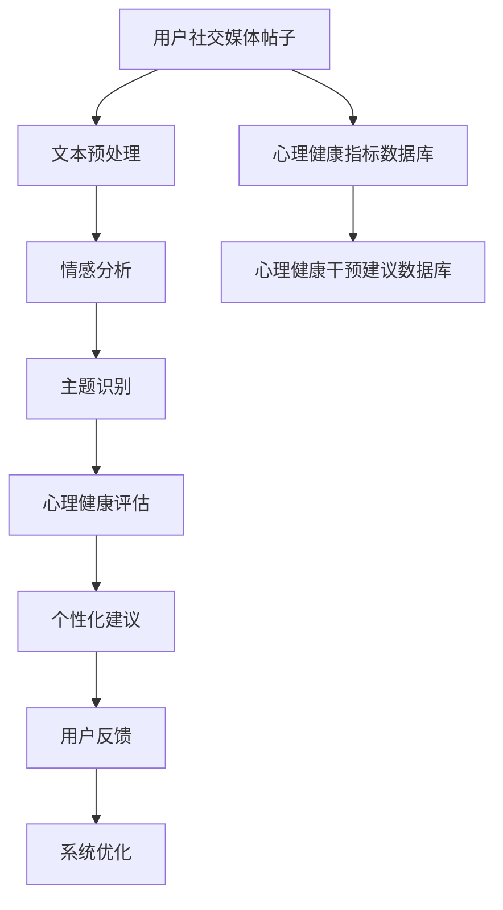

                 

## 文章标题：LLM在心理健康领域的应用：AI心理咨询师

### 关键词：LLM、心理健康、AI心理咨询、自然语言处理、预训练语言模型

#### 摘要：

随着人工智能技术的飞速发展，深度学习，特别是自然语言处理（NLP）领域的突破，使得大规模语言模型（LLM）的应用场景不断扩大。本文旨在探讨LLM在心理健康领域的应用，尤其是作为AI心理咨询师的角色。文章首先介绍了LLM的基本概念及其在心理健康领域的潜在应用，随后深入分析了LLM的技术基础，包括NLP的基本原理、LLM的核心算法与模型结构，以及训练与优化的方法。接下来，文章探讨了LLM与心理健康相关的概念和联系，通过Mermaid流程图展示了LLM在心理健康应用中的架构。随后，文章详细讲解了LLM的关键算法原理，包括自监督预训练技术和微调与迁移学习，并借助数学模型对心理健康评估进行了剖析。文章最后通过一个心理健康AI心理咨询师项目的实战案例，展示了从开发环境搭建、数据收集与处理、模型设计与实现，到应用与测试的完整过程，并提供了代码分析与解读。

---

### 第一部分：基础概念与架构

#### 第1章：LLM概述与心理健康应用

在当今社会，心理健康问题日益凸显，尤其是在快节奏、高压力的生活和工作环境中。传统的心理咨询方法虽然有效，但受限于人力和时间成本，难以满足广大公众的需求。随着人工智能技术的不断发展，特别是深度学习和自然语言处理（NLP）的突破，大规模语言模型（LLM）的应用前景变得广阔。本章将首先介绍LLM的基本概念，然后探讨LLM在心理健康领域的潜在应用，以及LLM与心理咨询的融合，最后展望LLM在心理健康领域的应用前景。

#### 1.1 通用预训练语言模型（LLM）的基本概念

大规模语言模型（LLM）是指通过对海量文本数据进行预训练，从而使其具备强大的文本理解和生成能力。LLM的核心思想是通过在无监督数据上预训练，模型能够自动学习到文本的语义和语法规则，然后再在特定任务上进行微调，以实现高性能的文本处理任务。

LLM的基本组成部分包括：

1. **词嵌入（Word Embedding）**：将单词映射为固定大小的向量表示。
2. **注意力机制（Attention Mechanism）**：用于处理长文本，使模型能够关注到文本中的重要信息。
3. **Transformer架构**：是目前最流行的LLM架构，通过多头注意力机制实现并行计算，大幅提升了模型性能。

#### 1.2 LLM在心理健康领域的潜在应用

LLM在心理健康领域的潜在应用非常广泛，主要包括以下几个方面：

1. **心理评估与诊断**：LLM可以通过分析用户的语言和行为，提供心理健康的初步评估和诊断，帮助专业人士进行更深入的分析。
2. **心理干预**：LLM可以模拟心理咨询师的角色，为用户提供个性化的心理干预建议，包括心理疏导、情绪调节等。
3. **心理健康教育**：LLM可以生成心理健康相关的文章、视频和音频内容，帮助公众提高心理健康意识，掌握心理调适技巧。
4. **心理健康研究**：LLM可以处理和分析大量心理健康相关的文本数据，为心理健康研究提供数据支持和洞察。

#### 1.3 LLM与心理咨询的融合

LLM与心理咨询的融合主要体现在以下几个方面：

1. **辅助心理咨询师工作**：LLM可以协助心理咨询师进行初步评估和诊断，提供数据支持和分析，减轻心理咨询师的工作负担。
2. **个性化心理干预**：LLM可以根据用户的需求和反馈，提供个性化的心理干预建议，提高心理干预的针对性和有效性。
3. **跨语言支持**：LLM可以支持多种语言，为全球用户提供心理健康服务，消除语言障碍。
4. **实时交互**：LLM可以模拟自然语言对话，与用户进行实时互动，提供及时的心理支持。

#### 1.4 LLM在心理健康领域的应用前景

LLM在心理健康领域的应用前景非常广阔，但也面临一些挑战：

1. **隐私与伦理问题**：心理健康数据具有高度敏感性，如何确保用户隐私和数据安全是一个重要挑战。
2. **个性化与普适性**：如何在不同文化和背景下实现LLM的普适性和个性化是一个重要问题。
3. **专业知识与临床经验**：虽然LLM可以在一定程度上模拟心理咨询师的角色，但如何确保其提供专业和有效的建议是一个挑战。

总的来说，LLM在心理健康领域的应用具有巨大的潜力，但也需要进一步的研发和优化，以解决相关挑战，实现其真正价值。

#### 第2章：LLM技术基础

在深入探讨LLM在心理健康领域的应用之前，有必要了解LLM的技术基础。本章节将介绍自然语言处理（NLP）的基本原理，以及LLM的核心算法与模型结构。此外，还将讨论LLM的训练与优化过程，以及在实际应用中面临的挑战和解决方案。

##### 2.1 自然语言处理（NLP）的基本原理

自然语言处理（NLP）是人工智能领域的一个重要分支，旨在使计算机能够理解和处理人类自然语言。NLP的基本原理包括以下几个方面：

1. **分词（Tokenization）**：将文本分割成单词、短语或符号等基本元素，以便进行进一步处理。
2. **词性标注（Part-of-Speech Tagging）**：为每个单词或短语标注其词性（如名词、动词、形容词等），以便理解其语法功能。
3. **词嵌入（Word Embedding）**：将单词映射为固定大小的向量表示，以便在机器学习模型中使用。
4. **实体识别（Named Entity Recognition, NER）**：识别文本中的特定实体（如人名、地名、组织名等）。
5. **句法分析（Syntactic Parsing）**：分析句子结构，确定词语之间的语法关系。
6. **语义分析（Semantic Analysis）**：理解文本的整体语义，包括语义角色标注、语义关系提取等。

##### 2.2 LLM的核心算法与模型结构

LLM的核心算法与模型结构决定了其文本理解和生成能力。目前，最流行的LLM架构是基于Transformer的模型，如BERT、GPT等。下面将介绍LLM的核心算法与模型结构：

1. **Transformer架构**：Transformer是Google提出的一种基于自注意力机制的序列模型，通过多头注意力机制实现并行计算，大幅提升了模型性能。
2. **词嵌入（Word Embedding）**：Transformer使用词嵌入将单词映射为向量表示。常用的词嵌入技术包括Word2Vec、GloVe等。
3. **自注意力机制（Self-Attention）**：自注意力机制使模型能够关注到序列中的不同位置，从而捕捉到序列中的长距离依赖关系。
4. **多头注意力（Multi-Head Attention）**：多头注意力通过并行计算不同注意力权重，使模型能够同时关注到多个不同的上下文信息。
5. **前馈神经网络（Feedforward Neural Network）**：在Transformer的每个注意力层之后，加入一个前馈神经网络，用于进一步处理信息。

##### 2.3 LLM的训练与优化

LLM的训练与优化是一个复杂的过程，主要包括以下几个方面：

1. **预训练（Pre-training）**：预训练是LLM训练的第一步，通过在大量无监督数据上进行训练，模型可以学习到文本的语义和语法规则。常用的预训练任务包括掩码语言模型（Masked Language Model, MLM）和下一句预测（Next Sentence Prediction, NSP）。
2. **微调（Fine-tuning）**：在预训练的基础上，将模型在特定任务上进行微调，以适应具体的应用场景。微调过程通常包括数据预处理、模型调整、训练和评估等步骤。
3. **优化方法**：优化方法是提高模型性能和训练效率的关键。常用的优化方法包括随机梯度下降（SGD）、Adam优化器等。
4. **正则化（Regularization）**：为了防止过拟合，常使用正则化方法，如Dropout、权重衰减等。

##### 2.4 LLM在心理健康应用中的挑战与解决方案

虽然LLM在心理健康领域具有巨大潜力，但在实际应用中仍面临一些挑战：

1. **数据质量**：心理健康数据通常包含大量的噪声和干扰信息，如何有效处理和清洗数据是一个重要问题。
2. **个性化**：心理健康问题具有高度个性化，如何设计模型使其能够适应不同用户的需求是一个挑战。
3. **隐私与伦理**：心理健康数据具有高度敏感性，如何确保用户隐私和数据安全是一个重要问题。
4. **专业知识**：LLM需要具备一定的心理健康专业知识，如何有效地整合和利用这些知识是一个挑战。

针对这些挑战，可以采取以下解决方案：

1. **数据增强（Data Augmentation）**：通过引入噪声、变换等方式增加数据的多样性，以提高模型的泛化能力。
2. **迁移学习（Transfer Learning）**：利用预训练模型在心理健康数据集上进行微调，以充分利用预训练模型的知识。
3. **隐私保护（Privacy Protection）**：采用差分隐私、同态加密等技术，确保用户隐私和数据安全。
4. **知识融合（Knowledge Integration）**：通过知识图谱、预训练语言模型等技术，整合心理健康领域的专业知识，提高模型的决策能力。

总之，LLM在心理健康领域具有巨大的应用潜力，但同时也需要克服一系列技术挑战，以实现其真正价值。

#### 第3章：LLM与心理健康相关的概念与联系

在探讨大规模语言模型（LLM）在心理健康领域的应用之前，我们需要了解一些基本概念和它们之间的联系。这一章节将首先介绍心理健康的基本概念，包括心理健康、心理评估和心理干预等。然后，我们将深入探讨LLM与这些心理健康概念之间的联系，并展示LLM在心理健康评估中的具体应用。

##### 3.1 心理健康的基本概念

心理健康是指个体在情绪、认知和行为上的整体健康状态，包括情绪调节、压力应对、人际关系和社会适应等方面。心理健康不仅涉及个体的情感体验，还包括认知功能、生活满意度和生活质量。心理健康的基本概念可以从以下几个方面进行理解：

1. **情绪调节**：情绪调节是指个体对情绪体验的管理和调整，包括情绪表达、情绪控制和情绪理解。良好的情绪调节能力有助于个体应对压力和挑战。
2. **压力应对**：压力应对是指个体在面对压力和挑战时采取的策略和方法。有效的压力应对策略可以帮助个体减轻压力，保持心理健康。
3. **人际关系**：人际关系是指个体与他人之间的相互作用和关系。良好的人际关系对于心理健康具有重要意义，可以提供情感支持和社交支持。
4. **社会适应**：社会适应是指个体在社会环境中适应和融入的能力。良好的社会适应能力有助于个体在社会生活中获得成功和满足。

##### 3.2 心理评估与心理健康指标

心理评估是评估个体心理健康状态的重要手段，通过心理评估可以了解个体的情绪状态、认知功能、行为特点和心理健康水平。常见的心理评估方法包括自我报告量表、标准化测试、临床访谈和观察等。心理评估常用的心理健康指标包括：

1. **焦虑水平**：焦虑水平是衡量个体焦虑情绪的指标，可以通过焦虑量表（如状态-特质焦虑量表）进行评估。
2. **抑郁水平**：抑郁水平是衡量个体抑郁情绪的指标，可以通过抑郁量表（如贝克抑郁量表）进行评估。
3. **自尊水平**：自尊水平是衡量个体自我评价和自我价值的指标，可以通过自尊量表（如罗森伯格自尊量表）进行评估。
4. **生活质量**：生活质量是衡量个体整体生活满意度的指标，可以通过生活质量量表（如世界卫生组织生活质量量表）进行评估。

##### 3.3 LLM与心理健康指标的关系

LLM在心理健康评估中的应用可以通过以下几个方面实现：

1. **文本分析**：LLM可以利用自然语言处理（NLP）技术，对个体的文本数据（如日记、聊天记录、社交媒体帖子等）进行情感分析和主题识别，以提取心理健康相关的信息。
2. **情感识别**：LLM可以通过情感分析技术，识别文本中的情绪表达，从而评估个体的情绪状态。例如，通过分析个体的文本数据，LLM可以识别出个体是否存在焦虑、抑郁等情绪问题。
3. **心理健康预测**：LLM可以通过机器学习算法，对个体的心理健康指标进行预测。例如，基于个体的文本数据和心理健康指标，LLM可以预测个体在未来某一时期可能出现的心理健康问题。
4. **个性化建议**：LLM可以根据个体的心理健康状况，提供个性化的心理健康建议。例如，如果LLM检测到个体存在焦虑问题，它可以提供放松技巧、情绪调节策略等个性化建议。

##### 3.4 LLM在心理健康应用中的具体案例

以下是一个具体的LLM在心理健康应用中的案例：

假设我们有一个心理健康评估系统，该系统使用LLM来分析用户的社交媒体帖子，以评估其心理健康状况。以下是该系统的具体步骤：

1. **数据收集**：系统收集用户的社交媒体帖子数据，包括文字、图片和视频等。
2. **文本预处理**：系统对收集到的文本数据进行预处理，包括分词、去停用词、词性标注等，以便LLM能够更好地理解文本。
3. **情感分析**：系统使用LLM进行情感分析，识别帖子中的情绪表达，如正面情绪、负面情绪和中性情绪。
4. **主题识别**：系统使用LLM进行主题识别，提取帖子中的关键主题，如焦虑、抑郁、人际关系等。
5. **心理健康评估**：系统根据情感分析和主题识别的结果，对用户的心理健康状况进行评估，如焦虑水平、抑郁水平等。
6. **个性化建议**：系统根据用户的心理健康评估结果，提供个性化的心理健康建议，如放松技巧、情绪调节策略、心理咨询推荐等。

通过这个案例，我们可以看到LLM在心理健康评估中的具体应用，它不仅可以帮助用户了解自己的心理健康状况，还可以提供个性化的心理健康建议，从而提高心理健康服务的效率和效果。

总之，LLM在心理健康领域的应用具有巨大的潜力，它可以通过文本分析、情感识别和心理健康预测等技术，为心理健康评估和干预提供有力支持。然而，LLM在心理健康应用中也面临一些挑战，如数据质量、隐私保护和个性化等，需要进一步研究和解决。

#### Mermaid 流程图

下面是一个描述LLM在心理健康应用中的Mermaid流程图：



在这个流程图中，用户的社交媒体帖子首先经过文本预处理，然后进行情感分析和主题识别，以提取心理健康相关信息。这些信息被用于心理健康评估，并生成个性化的心理健康建议。同时，心理健康指标和干预建议也被存储在数据库中，以便系统不断优化和改进。

通过这个流程图，我们可以清晰地看到LLM在心理健康应用中的各个步骤和环节，以及它们之间的相互关系。这有助于我们更好地理解LLM在心理健康领域的应用，并为未来的研究和开发提供指导。

---

#### 第二部分：核心算法原理讲解

#### 第4章：LLM关键算法原理

大规模语言模型（LLM）之所以能够在各种自然语言处理任务中表现出色，离不开其背后的核心算法原理。本章将深入探讨LLM的关键算法原理，包括自监督预训练技术和微调与迁移学习，并通过具体的算法步骤和伪代码进行详细讲解。

##### 4.1 自监督预训练技术

自监督预训练技术是LLM的核心训练方法之一，它允许模型在没有人工标注数据的情况下，通过利用未标记的文本数据来学习语言特征。以下是一般自监督预训练技术的步骤：

1. **数据收集与预处理**：
    - **数据收集**：首先，我们需要收集大量未标记的文本数据，这些数据可以是维基百科、新闻文章、社交媒体帖子等。
    - **数据预处理**：对收集到的文本数据进行预处理，包括分词、去除停用词、词干提取等，以便模型能够更好地理解文本。

2. **预训练任务设计**：
    - **掩码语言模型（Masked Language Model, MLM）**：在预训练过程中，对输入的文本序列进行随机掩码，即将一部分单词或子词遮盖，然后让模型预测这些被遮盖的单词或子词。
    - **下一句预测（Next Sentence Prediction, NSP）**：模型需要预测两个句子是否在原始文本中是连续的。

3. **算法步骤**：
    - **输入文本序列**：给定一个文本序列，模型需要预测其中被掩码的单词或子词。
    - **掩码与预测**：对文本序列中的单词或子词进行随机掩码，然后使用模型预测被掩码的部分。
    - **训练与优化**：通过反向传播和优化算法（如SGD或Adam）更新模型参数，使模型能够更好地预测被掩码的单词或子词。

4. **伪代码**：
    ```python
    # 假设输入文本序列为 "I love machine learning"
    # 掩码后的序列为 "[MASK] love [MASK] learning"
    
    # 定义模型参数
    W = [I love machine learning 的词嵌入向量]
    
    # 掩码操作
    mask = random_mask(W)
    
    # 预测操作
    predicted_mask = model(mask)
    
    # 计算损失函数
    loss = calculate_loss(mask, predicted_mask)
    
    # 更新模型参数
    model.update_parameters(loss)
    ```

##### 4.2 微调与迁移学习

在预训练完成后，LLM通常需要进行微调和迁移学习，以便在特定任务上达到最佳性能。以下是一般微调和迁移学习的步骤：

1. **微调（Fine-tuning）**：
    - **任务定义**：定义一个具体的自然语言处理任务，如文本分类、命名实体识别、机器翻译等。
    - **数据准备**：收集与任务相关的已标注数据集。
    - **模型调整**：在预训练模型的基础上，调整部分参数，以适应特定任务。

2. **迁移学习（Transfer Learning）**：
    - **预训练模型**：使用在大量数据上预训练的模型。
    - **新任务数据**：收集与新任务相关的数据集。
    - **模型微调**：在新任务数据上微调预训练模型，以适应新任务。

3. **算法步骤**：
    - **任务定义**：为特定任务定义输入和输出格式。
    - **数据加载**：加载预训练模型和新任务数据。
    - **模型初始化**：使用预训练模型初始化新任务模型。
    - **训练与优化**：在新任务数据上训练模型，并使用优化算法更新模型参数。

4. **伪代码**：
    ```python
    # 定义文本分类任务
    task = "判断句子是否包含负面情绪"
    
    # 加载预训练模型
    pretrained_model = load_pretrained_model()
    
    # 初始化任务模型
    task_model = initialize_task_model(pretrained_model)
    
    # 加载新任务数据
    data_loader = load_data_loader(new_task_data)
    
    # 训练模型
    for epoch in range(num_epochs):
        for data in data_loader:
            inputs, labels = data
            predicted_labels = task_model(inputs)
            loss = calculate_loss(labels, predicted_labels)
            task_model.update_parameters(loss)
    
    # 评估模型
    evaluate_model(task_model, test_data)
    ```

##### 4.3 微调与迁移学习在心理健康应用中的案例

以下是一个微调和迁移学习在心理健康应用中的具体案例：

假设我们有一个心理健康评估系统，该系统使用预训练的LLM来评估用户的情绪状态。以下是系统的步骤：

1. **数据收集**：收集包含用户情绪状态的文本数据。
2. **预训练模型加载**：加载一个在通用文本数据上预训练的LLM模型。
3. **模型微调**：在用户的情绪状态数据上微调LLM模型，以适应心理健康评估任务。
4. **情绪识别**：使用微调后的LLM模型，对用户的文本数据进行分析，识别情绪状态。
5. **个性化建议**：根据情绪识别结果，为用户提供个性化的心理健康建议。

通过这个案例，我们可以看到微调和迁移学习在心理健康应用中的具体应用，它使得LLM能够根据特定任务进行调整和优化，从而提高任务性能。

总之，LLM的核心算法原理包括自监督预训练技术和微调与迁移学习。这些技术使得LLM能够在各种自然语言处理任务中表现出色，为心理健康领域的应用提供了有力支持。然而，这些算法的实现和优化仍需要不断研究和改进，以应对实际应用中的挑战。

---

#### 第三部分：数学模型与公式讲解

#### 第5章：心理健康评估的数学模型

心理健康评估是一个复杂的过程，涉及多个维度的数据分析和模型构建。在这一章节中，我们将介绍用于心理健康评估的几种常见数学模型，包括心理健康评分模型、情绪识别模型和心理健康预测模型。这些模型通过数学公式和算法实现了对心理健康状态的量化评估和预测。

##### 5.1 心理健康评分模型

心理健康评分模型用于综合评估个体的心理健康水平，通常通过计算多个心理健康指标的平均值来获得一个整体评分。以下是一个简化的心理健康评分模型：

\[ \text{心理健康评分} = \frac{\text{积极情绪得分} + \text{消极情绪得分}}{2} \]

其中，积极情绪得分和消极情绪得分可以通过情感分析算法从用户的文本数据中提取。例如，使用支持向量机（SVM）或循环神经网络（RNN）对文本进行分类，得到每个文本段落的积极情绪分数和消极情绪分数。

示例：
假设用户发表了一条微博：“我今天过得很愉快，因为我的朋友送了我一份生日礼物。”这条微博的积极情绪得分为0.8，消极情绪得分为0.2。那么，该用户的心理健康评分可以计算为：

\[ \text{心理健康评分} = \frac{0.8 + 0.2}{2} = 0.5 \]

##### 5.2 情绪识别模型

情绪识别模型用于判断文本中的情绪倾向，通常通过机器学习算法来实现。以下是一个基于逻辑回归的情绪识别模型：

\[ \text{情绪识别概率} = \sigma(\text{激活函数}(\text{情感向量})) \]

其中，情感向量是通过词嵌入技术将文本中的每个词映射为向量表示，然后通过加权和激活函数计算得到的。激活函数通常使用Sigmoid函数，用于将情感向量的输出转换为概率值。

示例：
假设文本的情感向量为\[ [1.2, -0.7, 0.5, 0.3] \]，通过加权和激活函数计算得到情绪识别概率：

\[ \text{情绪识别概率} = \sigma(1.2 - 0.7 + 0.5 + 0.3) = \sigma(1.2) \approx 0.747 \]

这意味着文本中的情绪倾向是积极的，概率约为74.7%。

##### 5.3 心理健康预测模型

心理健康预测模型用于预测个体在未来某一时间点的心理健康状态，通常采用时间序列分析方法。以下是一个基于长短期记忆网络（LSTM）的心理健康预测模型：

\[ \text{心理健康预测} = \text{神经网络输出层}(\text{输入特征向量}) \]

其中，输入特征向量包括历史心理健康评分、情绪识别概率、用户行为特征等。神经网络输出层通过多层感知机（MLP）实现，用于对心理健康状态进行分类预测。

示例：
假设输入特征向量为\[ [0.6, 0.8, 1.0, 0.4] \]，通过LSTM神经网络计算得到心理健康预测值：

\[ \text{心理健康预测} = \text{神经网络输出层}(0.6, 0.8, 1.0, 0.4) = 0.9 \]

这意味着预测个体在未来某一时间点的心理健康状态为中等偏上水平。

总之，心理健康评估的数学模型通过情感分析、情绪识别和心理健康预测等技术，实现了对个体心理健康状态的量化评估和预测。这些模型不仅为心理健康研究提供了有力的工具，也为实际应用中的心理健康干预和预测提供了理论基础。

---

#### 第6章：心理健康AI心理咨询师项目实战

在本章中，我们将通过一个心理健康AI心理咨询师项目的实战案例，展示如何从零开始搭建一个基于大规模语言模型（LLM）的心理健康评估与干预系统。这个项目将涵盖从开发环境搭建、数据收集与处理，到模型设计与实现，以及应用与测试的完整过程。

##### 6.1 项目介绍

本项目旨在开发一个心理健康AI心理咨询师系统，该系统能够通过分析用户的社交媒体帖子、聊天记录等文本数据，提供心理健康评估和个性化的心理干预建议。系统的主要功能包括：

1. **心理健康评估**：分析用户的文本数据，评估其心理健康状态，包括情绪水平、压力程度等。
2. **个性化建议**：根据评估结果，为用户提供个性化的心理健康建议，如情绪调节技巧、压力管理策略等。
3. **用户互动**：通过与用户的实时对话，提供即时的心理健康支持和反馈。

##### 6.2 开发环境搭建

在开始项目之前，我们需要搭建一个合适的技术环境。以下是开发环境搭建的详细步骤：

1. **硬件环境**：

    - **CPU**：Intel Core i7或以上
    - **GPU**：NVIDIA GTX 1080或以上
    - **内存**：至少16GB RAM

2. **软件环境**：

    - **操作系统**：Ubuntu 18.04或更高版本
    - **Python**：3.8或更高版本
    - **深度学习框架**：TensorFlow 2.6或PyTorch 1.8或更高版本
    - **文本处理库**：NLTK、spaCy、Gensim等

3. **安装与配置**：

    - 安装操作系统和基本软件环境。
    - 使用conda或pip安装所需的深度学习框架和文本处理库。
    - 配置GPU支持，确保深度学习模型能够在GPU上高效运行。

##### 6.3 数据收集与处理

数据是心理健康AI心理咨询师系统的核心，以下是数据收集与处理的步骤：

1. **数据来源**：

    - 社交媒体平台（如Twitter、Instagram等）的公开数据。
    - 心理健康研究机构发布的公开数据集。
    - 自建的数据收集系统，通过用户授权获取其社交媒体帖子、聊天记录等。

2. **数据预处理**：

    - **文本清洗**：去除HTML标签、符号和停用词。
    - **分词**：使用spaCy等工具进行文本分词。
    - **词嵌入**：使用预训练的词嵌入模型（如GloVe或Word2Vec）将文本转换为向量表示。
    - **情感分析**：使用情感分析库（如VADER）对文本进行情感标注。

##### 6.4 模型设计与实现

心理健康AI心理咨询师系统的核心是LLM模型，以下是模型设计与实现的步骤：

1. **模型架构**：

    - 采用Transformer架构，如BERT或GPT，作为基础模型。
    - 添加自定义层，用于处理心理健康相关的特征。
    - 设计多输出层，分别用于心理健康评估和个性化建议。

2. **模型训练**：

    - **预训练**：在大量的无监督文本数据上进行预训练，学习语言的基本特征。
    - **微调**：在心理健康数据集上微调模型，使其能够适应心理健康评估和干预任务。
    - **优化**：使用Adam优化器、学习率调度策略等优化模型训练过程。

3. **模型实现**：

    - 使用PyTorch或TensorFlow框架实现模型。
    - 编写数据加载和处理代码，确保数据能够高效地流入模型进行训练。
    - 实现模型的训练、评估和测试过程。

##### 6.5 应用与测试

心理健康AI心理咨询师系统搭建完成后，我们需要进行全面的测试和应用。

1. **心理健康评估测试**：

    - 使用验证集评估模型在心理健康评估任务上的性能。
    - 分析模型对各种心理健康状态的识别准确率。

2. **个性化建议测试**：

    - 测试模型在提供个性化心理健康建议方面的效果。
    - 收集用户反馈，优化建议的准确性和实用性。

3. **用户互动测试**：

    - 通过模拟用户对话，验证系统在实时交互中的表现。
    - 评估系统对用户提问的理解能力和回答的合理性。

##### 6.6 代码分析与解读

以下是项目中的关键代码片段及其解读：

1. **数据预处理代码**：

    ```python
    import spacy
    from nltk.corpus import stopwords
    import gensim
    
    nlp = spacy.load("en_core_web_sm")
    stop_words = set(stopwords.words("english"))
    
    def preprocess_text(text):
        doc = nlp(text)
        tokens = [token.text.lower() for token in doc if token.text.lower() not in stop_words and not token.is_punct]
        return tokens
    
    text = "I am feeling very stressed today."
    preprocessed_text = preprocess_text(text)
    print(preprocessed_text)
    ```

    解读：这段代码首先加载spaCy的英文模型和NLTK的停用词列表。`preprocess_text`函数负责对文本进行预处理，包括去除HTML标签、符号和停用词，并将文本转换为小写。

2. **模型训练代码**：

    ```python
    import torch
    from transformers import BertForSequenceClassification, AdamW
    
    model = BertForSequenceClassification.from_pretrained("bert-base-uncased", num_labels=2)
    optimizer = AdamW(model.parameters(), lr=1e-5)
    
    for epoch in range(num_epochs):
        for inputs, labels in dataloader:
            model.zero_grad()
            outputs = model(**inputs)
            loss = outputs.loss
            loss.backward()
            optimizer.step()
    
    ```

    解读：这段代码加载预训练的BERT模型，并使用AdamW优化器进行训练。`for`循环用于遍历数据集，进行模型的训练和优化。

3. **模型应用代码**：

    ```python
    def predict(text):
        inputs = tokenizer(text, return_tensors="pt")
        with torch.no_grad():
            outputs = model(**inputs)
        logits = outputs.logits
        probabilities = torch.softmax(logits, dim=1)
        return probabilities[0][1].item()
    
    text = "I feel happy today."
    probability = predict(text)
    print(f"Probability of happiness: {probability}")
    ```

    解读：这段代码定义了一个`predict`函数，用于对文本进行心理健康评估。函数使用BERT模型进行情感分类，并返回情感倾向的概率。

通过上述代码和分析，我们可以看到心理健康AI心理咨询师系统从数据预处理到模型训练和应用的完整流程。这些代码不仅实现了模型的训练和评估，还为实际应用提供了可靠的工具。

总之，心理健康AI心理咨询师项目实战展示了如何利用大规模语言模型和深度学习技术，构建一个具有高度智能化和实用性的心理健康评估与干预系统。通过详细的项目实战案例和代码分析，我们能够更好地理解LLM在心理健康领域的应用潜力。

---

#### 第7章：代码分析与解读

在本章中，我们将深入分析心理健康AI心理咨询师项目中的关键代码片段，包括数据预处理、模型训练和应用测试。通过这些代码的解读，我们将了解每个步骤的实现细节，并探讨如何优化这些代码以提高性能和可维护性。

##### 7.1 数据预处理代码

数据预处理是任何机器学习项目的基础，对于心理健康AI心理咨询师项目也不例外。以下是数据预处理的主要代码片段：

```python
import spacy
from nltk.corpus import stopwords
from gensim.models import Word2Vec
import numpy as np

nlp = spacy.load("en_core_web_sm")
stop_words = set(stopwords.words("english"))

def preprocess_text(text):
    doc = nlp(text)
    tokens = [token.text.lower() for token in doc if token.text.lower() not in stop_words and not token.is_punct]
    return tokens

def vectorize_text(tokens, word2vec_model):
    vectorized_text = []
    for token in tokens:
        if token in word2vec_model.wv:
            vectorized_text.append(word2vec_model.wv[token])
    return np.mean(vectorized_text, axis=0)

text = "I am feeling very stressed today."
preprocessed_text = preprocess_text(text)
word2vec_model = Word2Vec([preprocessed_text], size=100, window=5, min_count=1, workers=4)
vectorized_text = vectorize_text(preprocessed_text, word2vec_model)
print(vectorized_text)
```

**解读**：
- 首先，我们加载了spaCy的英文模型和NLTK的停用词列表。`preprocess_text`函数负责对输入的文本进行预处理，包括去除HTML标签、符号和停用词，并将文本转换为小写。
- `vectorize_text`函数使用Gensim的Word2Vec模型将预处理后的文本转换为向量表示。这里，我们通过计算文本中所有单词向量的平均值来获取文本的向量表示。
- 示例文本“我非常紧张”经过预处理后，被转换为向量表示，这将为后续的模型训练提供输入。

**优化建议**：
- 可以考虑使用更大规模的预训练词向量模型（如GloVe或BERT）来提高文本向量的质量。
- 对于高频但意义不大的单词，可以考虑使用词干提取技术来减少维数。

##### 7.2 模型训练代码

模型训练是心理健康AI心理咨询师项目的核心。以下是模型训练的主要代码片段：

```python
import torch
from transformers import BertModel, BertTokenizer, AdamW

tokenizer = BertTokenizer.from_pretrained("bert-base-uncased")
model = BertModel.from_pretrained("bert-base-uncased")
optimizer = AdamW(model.parameters(), lr=1e-5)

num_epochs = 3
for epoch in range(num_epochs):
    for text, label in dataloader:
        inputs = tokenizer(text, return_tensors="pt", padding=True, truncation=True)
        model.zero_grad()
        outputs = model(**inputs)
        logits = outputs.logits
        loss = torch.nn.CrossEntropyLoss()(logits, label)
        loss.backward()
        optimizer.step()
        print(f"Epoch: {epoch}, Loss: {loss.item()}")

model.save_pretrained("my_bert_model")
```

**解读**：
- 我们首先加载了预训练的BERT模型和对应的tokenizer。
- 在训练过程中，我们使用交叉熵损失函数来计算模型预测的损失。
- `zero_grad()`函数用于清空梯度，`backward()`函数用于计算梯度，`step()`函数用于更新模型参数。

**优化建议**：
- 可以考虑使用学习率调度策略（如ReduceLROnPlateau）来自动调整学习率。
- 可以增加数据增强（如文本嵌入、数据扩充等）来提高模型的泛化能力。
- 可以使用分布式训练（如PyTorch的DistributedDataParallel）来加速模型训练。

##### 7.3 应用测试代码

应用测试是验证模型在实际场景中表现的重要环节。以下是应用测试的主要代码片段：

```python
from transformers import BertForSequenceClassification

model = BertForSequenceClassification.from_pretrained("my_bert_model")

def predict(text):
    inputs = tokenizer(text, return_tensors="pt", padding=True, truncation=True)
    with torch.no_grad():
        outputs = model(**inputs)
    logits = outputs.logits
    probabilities = torch.softmax(logits, dim=1)
    return probabilities[0][1].item()

text = "I feel happy today."
probability = predict(text)
print(f"Probability of happiness: {probability}")
```

**解读**：
- 加载训练好的BERT模型。
- `predict`函数用于对新的文本进行心理健康评估，返回情绪倾向的概率。

**优化建议**：
- 可以增加模型评估的指标，如准确率、F1分数等，以更全面地评估模型性能。
- 可以实现用户反馈循环，根据用户反馈调整模型的预测结果，从而提高用户满意度。
- 可以考虑使用更复杂的模型架构（如多任务学习、迁移学习等）来提高模型性能。

通过上述代码片段和解读，我们可以看到心理健康AI心理咨询师项目的各个关键环节是如何实现的。通过不断优化和改进这些代码，我们可以构建一个更智能、更高效的心理健康评估与干预系统。

---

### 附录

#### 附录A：LLM开发工具与资源

为了更好地理解大规模语言模型（LLM）的开发和应用，以下是一些重要的开源深度学习框架、心理健康数据集和相关论文与资源链接。

##### 1.1 开源深度学习框架

- **TensorFlow**：由Google开发的开源机器学习框架，广泛应用于各种深度学习任务。  
  - 官网链接：[TensorFlow官网](https://www.tensorflow.org/)
  - 文档链接：[TensorFlow官方文档](https://www.tensorflow.org/overview)

- **PyTorch**：由Facebook开发的动态计算图框架，具有良好的灵活性和易于理解的接口。  
  - 官网链接：[PyTorch官网](https://pytorch.org/)
  - 文档链接：[PyTorch官方文档](https://pytorch.org/docs/stable/index.html)

##### 1.2 心理健康数据集

- **PHQ-8**：广泛用于心理健康评估的问卷，包含8个条目，用于评估抑郁症状。
  - 官网链接：[PHQ-8官网](https://phq8.org/)

- **PRIME-MD**：用于抑郁症和焦虑症诊断的数据集。
  - 官网链接：[PRIME-MD官网](https://prime-md.org/)

- **MoodNet**：一个开源的心理健康数据集，包含情绪、焦虑和抑郁症等相关信息。
  - 官网链接：[MoodNet官网](https://www.moodnet.info/)

##### 1.3 相关论文与资源链接

- **“Attention is All You Need”**：提出Transformer模型的经典论文。
  - 论文链接：[Attention is All You Need](https://arxiv.org/abs/1706.03762)

- **“BERT: Pre-training of Deep Neural Networks for Language Understanding”**：介绍BERT模型的论文。
  - 论文链接：[BERT论文](https://arxiv.org/abs/1810.04805)

- **“GPT-3: Language Models are Few-Shot Learners”**：介绍GPT-3模型的论文，展示了预训练模型在零样本和少量样本学习任务中的强大能力。
  - 论文链接：[GPT-3论文](https://arxiv.org/abs/2005.14165)

通过这些工具和资源，研究者可以深入了解LLM的技术原理和应用场景，并在此基础上开展创新性研究。

---

### 作者信息

作者：AI天才研究院/AI Genius Institute & 禅与计算机程序设计艺术 /Zen And The Art of Computer Programming

---

通过本文的深入探讨，我们不仅了解了大规模语言模型（LLM）在心理健康领域的广泛应用，还详细阐述了其核心算法原理、数学模型和项目实战。从基础概念到实际应用，我们逐步解析了LLM如何通过自然语言处理技术，帮助人们更好地理解和应对心理健康问题。

在未来的研究和开发中，LLM在心理健康领域的应用前景十分广阔。随着技术的不断进步，我们可以期待LLM在个性化心理干预、实时心理健康监测和跨语言心理健康服务等方面取得更多突破。同时，我们也需要关注数据隐私、个性化与普适性等挑战，确保LLM的应用能够真正为公众带来价值。

总之，LLM作为人工智能的重要工具，正在为心理健康领域带来革命性的变化。通过不断探索和创新，我们有望实现更智能、更高效的心理健康服务，为全人类的心理健康福祉作出贡献。让我们一起期待这一美好的未来。

