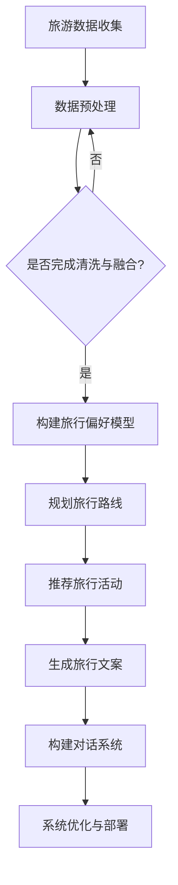

                 

# 文章标题：LLM在旅游业的应用：个性化旅行规划

> 关键词：大语言模型（LLM）、个性化旅行规划、旅游业、自然语言处理（NLP）、旅行数据、算法、系统架构、案例与实践

> 摘要：随着人工智能技术的不断发展，大语言模型（LLM）在旅游业中的应用逐渐成为研究热点。本文旨在探讨LLM在个性化旅行规划中的应用，从概述与背景、LLM基础、个性化旅行规划的实现、案例分析与实践等多个方面进行深入分析，以期为旅游业提供更加智能化、个性化的服务。

## 目录大纲

### 第一部分：概述与背景

#### 第1章：旅游业与人工智能的融合
1.1 人工智能在旅游业中的重要性
1.2 旅游业的数字化趋势
1.3 个性化旅行规划的需求与挑战
1.4 本书结构介绍

### 第二部分：LLM基础

#### 第2章：大语言模型（LLM）概述
2.1 什么是大语言模型
2.2 大语言模型的发展历程
2.3 大语言模型的基本原理
2.4 大语言模型在旅游业中的应用前景

#### 第3章：大语言模型（LLM）技术基础
3.1 自然语言处理（NLP）基础
3.2 大规模预训练模型原理
3.3 主流LLM架构解析

### 第三部分：个性化旅行规划的实现

#### 第4章：旅行数据收集与处理
4.1 旅行数据的来源
4.2 数据收集的方法
4.3 数据预处理技术
4.4 数据清洗与融合

#### 第5章：个性化旅行规划的算法
5.1 旅行偏好分析
5.2 旅行路线规划
5.3 旅行活动推荐

#### 第6章：大语言模型在个性化旅行规划中的应用
6.1 LLM在旅行文案生成中的应用
6.2 LLM在旅行对话系统中的应用

#### 第7章：个性化旅行规划系统的构建与优化
7.1 系统设计原则
7.2 系统架构设计
7.3 性能优化方法
7.4 系统部署与维护

### 第四部分：案例分析与实践

#### 第8章：LLM在个性化旅行规划中的成功案例
8.1 案例一：旅游推荐平台A的应用实践
8.2 案例二：智能旅行助手B的应用实践
8.3 案例三：定制旅行服务商C的应用实践

#### 第9章：项目实战：个性化旅行规划系统开发
9.1 项目背景与需求分析
9.2 技术选型与系统设计
9.3 数据处理与模型训练
9.4 系统开发与优化
9.5 系统部署与测试

### 附录

#### 附录A：LLM开发工具与资源
#### 附录B：数学公式与算法伪代码

---

### 引言

随着人工智能（AI）技术的飞速发展，其在各行业的应用越来越广泛，旅游业也不例外。人工智能不仅提高了旅游业的效率，还极大提升了游客的体验。近年来，大语言模型（LLM，Large Language Model）作为一种先进的AI技术，在自然语言处理（NLP，Natural Language Processing）领域取得了显著的成果。LLM能够理解和生成复杂的人类语言，为个性化服务提供了强大的技术支持。

个性化旅行规划是旅游业中的一个重要需求。传统的旅行规划往往依赖于用户的历史数据和偏好设置，但这些方法往往存在局限性。随着旅游信息的爆炸性增长，如何从海量数据中提取有效信息，为用户提供个性化、高质量的旅行规划服务，成为旅游业亟待解决的问题。LLM凭借其强大的数据处理和生成能力，为个性化旅行规划提供了一种新的解决方案。

本文将围绕LLM在旅游业中的应用，探讨个性化旅行规划的实现。首先，我们将介绍旅游业与人工智能的融合，阐述个性化旅行规划的需求与挑战。接着，我们将详细讲解大语言模型的基础知识，包括其基本原理、发展历程以及主流架构。然后，我们将讨论如何利用LLM实现个性化旅行规划，包括旅行数据收集与处理、个性化旅行规划的算法以及LLM在其中的具体应用。此外，我们将通过案例分析与实践，展示LLM在个性化旅行规划中的成功应用，并探讨项目实战中的关键技术和挑战。最后，我们将总结全文，展望未来研究方向。

### 第1章：旅游业与人工智能的融合

旅游业作为全球经济增长的重要驱动力，一直以来都受到人们的高度关注。然而，随着旅游市场的不断变化和竞争的加剧，旅游业面临着前所未有的挑战。如何在激烈的市场竞争中脱颖而出，提供高质量、个性化的旅游服务，成为旅游企业亟需解决的问题。人工智能（AI）技术的发展，为旅游业带来了新的机遇，特别是在个性化旅行规划方面。

#### 1.1 人工智能在旅游业中的重要性

人工智能在旅游业中的应用，主要体现在提升效率、优化体验和增强个性化服务等方面。

首先，人工智能能够显著提高旅游业的运营效率。例如，智能推荐系统可以根据用户的旅行历史和偏好，为用户提供个性化的旅游推荐，减少用户在选择旅游目的地和活动时的搜索时间。此外，AI技术还可以用于智能客服、智能导航、智能安全监控等方面，提高旅游服务提供商的管理效率和客户满意度。

其次，人工智能能够优化旅游体验。通过自然语言处理（NLP）技术，AI可以理解和生成复杂的人类语言，实现智能对话和交互。例如，智能旅行助手可以实时回答游客的提问，提供旅行攻略和建议，帮助游客更好地规划行程。此外，AI还可以通过虚拟现实（VR）和增强现实（AR）技术，为游客提供沉浸式的旅游体验。

最后，人工智能能够增强旅游服务的个性化。传统的旅游服务往往依赖于用户的历史数据和偏好设置，但这些方法往往存在局限性。而人工智能可以通过机器学习算法，从海量数据中提取有价值的信息，为用户提供更加精准的个性化服务。例如，基于用户行为分析和偏好建模，AI可以预测用户的旅行需求和偏好，提供个性化的旅游建议和推荐。

#### 1.2 旅游业的数字化趋势

随着互联网和移动设备的普及，旅游业正在经历一场数字化革命。数字化技术的应用，不仅改变了旅游信息的传播方式，还重构了旅游服务的提供模式。

首先，在线旅游平台（OTA，Online Travel Agency）的兴起，改变了传统的旅游预订方式。用户可以通过OTA平台，方便地搜索、比较和预订旅游产品，从而实现旅游需求的即时满足。此外，OTA平台还可以通过大数据分析，了解用户的旅游偏好和行为模式，为用户提供更加精准的个性化服务。

其次，智能旅游设备的广泛应用，提升了旅游体验的智能化水平。例如，智能导游机、智能门票系统、智能导航设备等，为游客提供便捷、高效的旅游服务。这些智能设备不仅能够提供实时信息查询和路线规划，还能够根据游客的兴趣和需求，提供个性化的推荐和服务。

最后，社交媒体和在线评论平台的崛起，改变了旅游信息的传播方式。游客可以通过社交媒体和在线评论平台，分享自己的旅游经历和感受，为其他游客提供参考。同时，旅游服务提供商也可以通过这些平台，了解用户的反馈和需求，不断优化和提升服务质量。

#### 1.3 个性化旅行规划的需求与挑战

个性化旅行规划是旅游业发展的必然趋势，其需求主要来源于以下几个方面：

首先，随着旅游市场的多元化发展，游客的需求越来越多样化。不同的游客有不同的旅行偏好和需求，例如有的游客喜欢探险，有的游客喜欢休闲度假，有的游客喜欢文化体验。如何根据游客的个性化需求，提供个性化的旅行规划服务，成为旅游业面临的重要挑战。

其次，随着旅游信息的爆炸性增长，游客在规划旅行时需要处理大量的信息。如何从海量信息中筛选出有价值的信息，为游客提供高效的旅行规划服务，是旅游业需要解决的问题。

最后，随着人工智能技术的不断发展，如何充分利用人工智能技术，为游客提供更加精准、高效的个性化服务，成为旅游业面临的重要课题。

尽管个性化旅行规划具有巨大的市场需求，但在实际应用中仍然面临一些挑战：

首先，数据质量和数据量是影响个性化旅行规划效果的关键因素。旅游数据的质量直接影响算法的准确性，而旅游数据的量则决定了算法的可解释性和泛化能力。如何提高旅游数据的质量和数量，是个性化旅行规划需要解决的问题。

其次，个性化旅行规划需要处理复杂的决策问题。旅行规划涉及到多个因素的权衡，例如旅游时间、预算、目的地选择、活动安排等。如何利用人工智能技术，实现高效、智能的旅行规划，是旅游业需要克服的难题。

最后，个性化旅行规划需要考虑到用户体验和满意度。如何确保个性化旅行规划系统能够满足用户的需求，提供优质的用户体验，是旅游业需要关注的问题。

总之，个性化旅行规划是旅游业发展的必然趋势，但同时也面临一些挑战。通过深入研究和应用人工智能技术，我们可以为游客提供更加精准、高效的个性化旅行规划服务，提升旅游体验和满意度。

#### 1.4 本书结构介绍

本书分为四个主要部分，旨在全面探讨LLM在个性化旅行规划中的应用。

**第一部分：概述与背景**，主要介绍旅游业与人工智能的融合、个性化旅行规划的需求与挑战，以及本书的结构安排。

**第二部分：LLM基础**，详细介绍大语言模型（LLM）的基本概念、发展历程、基本原理以及主流架构。这部分内容为后续章节中的应用提供了理论基础。

**第三部分：个性化旅行规划的实现**，重点讨论个性化旅行规划的具体实现方法，包括旅行数据收集与处理、个性化旅行规划的算法、LLM在个性化旅行规划中的应用等。这部分内容是本书的核心，详细阐述了如何利用LLM技术实现个性化旅行规划。

**第四部分：案例分析与实践**，通过具体案例展示LLM在个性化旅行规划中的成功应用，并探讨项目实战中的关键技术和挑战。这部分内容提供了实际操作的经验和参考。

通过以上四个部分，本书旨在为读者提供一个全面、系统的LLM在个性化旅行规划中的应用指南。无论是对理论研究还是实际应用，本书都具有一定的参考价值。

---

### 第2章：大语言模型（LLM）概述

#### 2.1 什么是大语言模型

大语言模型（Large Language Model，简称LLM）是一种基于深度学习技术的自然语言处理（NLP，Natural Language Processing）模型，它能够理解和生成复杂的人类语言。与传统语言模型相比，LLM具有以下几个显著特点：

首先，LLM的规模非常大。这意味着LLM拥有数十亿甚至千亿个参数，可以处理海量语言数据。这种大规模使得LLM在捕捉语言规律和生成高质量语言方面具有显著优势。

其次，LLM采用了深度学习（Deep Learning）技术。深度学习是一种通过多层神经网络来学习和模拟人类思维过程的机器学习技术。LLM利用深度学习模型，能够自动提取语言数据中的高层次特征，从而实现高效的语言理解和生成。

最后，LLM采用了自监督学习（Self-supervised Learning）技术。自监督学习是一种不需要显式标注数据的学习方法，它通过利用数据中的内在结构来训练模型。LLM在训练过程中，可以自动从大规模未标注文本数据中学习语言规律，从而显著提升模型的性能。

#### 2.2 大语言模型的发展历程

大语言模型的发展历程可以分为以下几个阶段：

第一阶段：基于规则和统计的语言模型。20世纪80年代至90年代，语言模型主要基于规则和统计方法，如n元语法（n-gram）。这些模型通过计算词语序列的概率来预测下一个词语，但存在词汇量限制和泛化能力不足的问题。

第二阶段：基于神经网络的深度学习语言模型。2000年代初，随着深度学习技术的兴起，神经网络开始应用于语言模型。这一阶段的主要成果包括基于循环神经网络（RNN）的语言模型，如LSTM（Long Short-Term Memory）和GRU（Gated Recurrent Unit）。这些模型在处理长文本序列和长期依赖问题上表现出色，但仍然存在计算效率和训练时间较长的问题。

第三阶段：大规模预训练语言模型。2018年，Google提出了BERT（Bidirectional Encoder Representations from Transformers）模型，标志着大语言模型的发展进入新阶段。BERT采用了Transformer架构，通过自监督学习在大规模文本数据上进行预训练，然后通过微调（Fine-tuning）应用于各种下游任务。此后，如GPT（Generative Pre-trained Transformer）系列模型和Turing-NLG等大规模预训练模型相继推出，进一步提升了语言模型的性能和适用范围。

#### 2.3 大语言模型的基本原理

大语言模型的基本原理主要涉及以下三个方面：预训练、自监督学习和深度学习。

**预训练（Pre-training）**：预训练是大规模语言模型的核心技术之一。在预训练过程中，模型首先在大规模未标注的文本数据上进行训练，从而学习到语言的一般规律和特征。这一过程不需要人工标注数据，大大降低了训练成本。预训练模型通过优化损失函数，自动学习文本中的词语、句子和段落之间的关联性，从而建立对语言的深刻理解。

**自监督学习（Self-supervised Learning）**：自监督学习是一种无监督学习方法，它利用数据中的内在结构来训练模型。在语言模型中，自监督学习通过预测未知的输入信息来实现。例如，在预训练过程中，模型可以预测下一个单词、下一个句子或者下一个词组的开头。通过这种方式，模型可以从海量未标注数据中学习到丰富的语言特征。

**深度学习（Deep Learning）**：深度学习是一种通过多层神经网络进行学习和模拟人类思维的技术。在语言模型中，深度学习模型通过多个隐藏层，逐步提取输入数据的特征。深度学习模型在处理复杂任务时表现出色，特别是对于图像和语言等具有层次结构的数据。大规模预训练语言模型，如BERT和GPT，采用了深度学习技术，通过多层神经网络来捕捉语言数据中的高层次特征，从而实现高效的语义理解和生成。

#### 2.4 大语言模型在旅游业中的应用前景

大语言模型在旅游业中具有广泛的应用前景，主要体现在以下几个方面：

**个性化旅行规划**：大语言模型可以通过分析用户的旅行历史和偏好，生成个性化的旅行规划方案。例如，模型可以根据用户的旅行频率、喜好、预算等因素，推荐最适合的旅行目的地、住宿、交通和活动安排。

**智能客服**：大语言模型可以用于构建智能客服系统，为用户提供实时、个性化的旅行咨询服务。通过自然语言处理技术，模型可以理解用户的提问，并生成专业的回答，从而提升客服效率和用户体验。

**旅游信息检索**：大语言模型可以用于优化旅游信息检索系统，提高用户搜索结果的准确性和相关性。例如，模型可以通过分析用户的查询内容，理解用户的需求，并提供最相关的旅游信息。

**旅行路线规划**：大语言模型可以通过分析用户的历史旅行数据和行为模式，生成最优的旅行路线。例如，模型可以考虑到用户的兴趣点、交通便捷性、住宿预算等因素，为用户提供个性化的旅行路线推荐。

**文本生成与编辑**：大语言模型可以用于生成和编辑旅游攻略、导游手册等文本内容。通过自动生成高质量的文本，模型可以节省人力成本，提高旅游信息的生产效率。

总之，大语言模型在旅游业中的应用，将为用户提供更加智能化、个性化的服务，提升旅游体验和满意度。随着技术的不断进步，大语言模型在旅游业中的应用前景将越来越广泛。

---

### 第3章：大语言模型（LLM）技术基础

#### 3.1 自然语言处理（NLP）基础

自然语言处理（NLP，Natural Language Processing）是人工智能（AI，Artificial Intelligence）领域的一个重要分支，旨在使计算机能够理解和处理人类语言。NLP在人工智能领域中具有重要的地位，因为它涉及到人类交流的核心——语言。以下是NLP的几个核心概念：

**语言模型（Language Model）**：语言模型是NLP中最基础的部分，用于预测文本中的下一个词或字符。简单地说，语言模型是一个概率模型，它通过统计方法或机器学习算法，学习自然语言中的概率分布。一个优秀的语言模型能够理解文本的语法、语义和上下文信息，从而生成高质量的文本。

**词嵌入（Word Embedding）**：词嵌入是将自然语言中的词语映射到高维向量空间的一种技术。通过词嵌入，词语之间的语义关系可以通过向量空间中的几何关系来表示。常用的词嵌入方法包括基于统计的方法（如TF-IDF）和基于神经网络的深度学习方法（如Word2Vec、GloVe等）。词嵌入技术在NLP中具有广泛的应用，如文本分类、情感分析、机器翻译等。

**序列模型（Sequence Model）**：序列模型是一种用于处理序列数据（如文本、语音）的机器学习模型。常见的序列模型包括循环神经网络（RNN，Recurrent Neural Network）、长短期记忆网络（LSTM，Long Short-Term Memory）和门控循环单元（GRU，Gated Recurrent Unit）。这些模型能够捕捉序列数据中的长期依赖关系，从而提高模型的预测性能。

**注意力机制（Attention Mechanism）**：注意力机制是一种用于提高神经网络模型处理序列数据性能的技术。注意力机制通过为不同部分的数据分配不同的权重，使得模型能够更加关注重要信息，从而提高模型的准确性和效率。在自然语言处理中，注意力机制广泛应用于机器翻译、文本摘要、情感分析等领域。

**预训练（Pre-training）**：预训练是指在大规模未标注数据上进行训练，以学习通用的语言特征。预训练模型通常用于微调（Fine-tuning）任务特定的数据，从而提高模型在特定任务上的性能。预训练是大规模语言模型（如BERT、GPT）的核心技术之一，它使得模型能够在大规模文本数据中自动学习到丰富的语言特征。

**自监督学习（Self-supervised Learning）**：自监督学习是一种无监督学习方法，它利用数据中的内在结构来训练模型。自监督学习在NLP中应用广泛，如预训练模型通常通过遮盖文本中的部分内容（如遮盖下一个单词），然后通过预测这些遮盖内容来训练模型。

**迁移学习（Transfer Learning）**：迁移学习是指将预训练模型在不同任务上进行微调，以提高新任务的性能。在NLP领域，迁移学习使得研究人员可以充分利用预训练模型的知识，提高新任务（如问答系统、文本生成等）的性能。

**微调（Fine-tuning）**：微调是指在一个小规模的任务特定数据集上对预训练模型进行训练，以适应特定任务。微调是迁移学习的一种实现方式，它通过在预训练模型的基础上，进一步调整模型参数，从而提高模型在特定任务上的性能。

**文本生成（Text Generation）**：文本生成是指根据给定的输入或上下文，生成自然语言的文本。文本生成技术在自然语言处理中具有广泛的应用，如自动问答、聊天机器人、文本摘要等。

**文本分类（Text Classification）**：文本分类是指将文本数据分配到预定义的类别中。文本分类技术在情感分析、垃圾邮件检测、新闻分类等领域具有广泛的应用。

**情感分析（Sentiment Analysis）**：情感分析是指识别文本中的情感倾向，如正面、负面或中立。情感分析在产品评论分析、社交媒体监测、客户服务等领域具有重要应用。

**机器翻译（Machine Translation）**：机器翻译是指使用计算机程序将一种自然语言翻译成另一种自然语言。机器翻译在跨国交流、国际化业务等领域具有广泛应用。

**文本摘要（Text Summarization）**：文本摘要是指从原始文本中提取关键信息，生成简洁的摘要文本。文本摘要技术在信息检索、内容审核、新闻摘要等领域具有重要应用。

**对话系统（Dialogue System）**：对话系统是指能够与人类进行自然语言交互的计算机系统。对话系统在智能客服、虚拟助手、游戏互动等领域具有广泛应用。

**语音识别（Speech Recognition）**：语音识别是指将语音信号转换为文本或命令。语音识别技术在智能家居、车载系统、语音助手等领域具有重要应用。

**语音合成（Text-to-Speech，TTS）**：语音合成是指将文本转换为自然流畅的语音。语音合成在语音助手、车载系统、有声读物等领域具有广泛应用。

这些NLP基础概念和技术是构建大语言模型（LLM）的重要基石，为LLM的预训练、微调和应用提供了理论支持。

#### 3.2 大规模预训练模型原理

大规模预训练模型（Massive Pre-trained Model）是自然语言处理（NLP，Natural Language Processing）领域的一项重要技术，其核心思想是在大规模未标注数据上进行预训练，从而学习到通用的语言特征，再通过微调（Fine-tuning）应用于各种下游任务。以下是大规模预训练模型的主要原理：

**预训练（Pre-training）**：预训练是指在大规模未标注数据上对模型进行训练，以学习到语言的一般规律和特征。预训练过程通常分为两个阶段：第一阶段是自监督预训练，第二阶段是特定任务的微调。

**自监督预训练（Self-supervised Pre-training）**：自监督预训练是一种无监督学习方法，它利用数据中的内在结构来训练模型，从而提高模型对未标注数据的处理能力。在自监督预训练中，模型通过预测未知的输入信息（如下一个单词、下一个句子等）来训练。这种方法不需要人工标注数据，大大降低了训练成本。

**预训练数据集（Pre-training Dataset）**：预训练数据集是大规模预训练模型的关键组成部分。一个高质量的预训练数据集应包含多样化的文本内容，如新闻文章、书籍、社交媒体帖子等。预训练数据集的规模越大，模型学习到的语言特征越丰富，从而提高模型在下游任务上的性能。

**预训练任务（Pre-training Task）**：预训练任务是指用于训练大规模预训练模型的任务。常见的预训练任务包括下一个句子预测（Next Sentence Prediction，NSP）、掩码语言模型（Masked Language Model，MLM）和词干修复（Subword Token Segmentation）等。

**下一个句子预测（Next Sentence Prediction，NSP）**：下一个句子预测是一种自监督预训练任务，它通过预测两个句子之间的关联性来训练模型。在训练过程中，模型被随机选取的两个句子进行输入，然后需要预测第二个句子是否是第一个句子的下一个句子。

**掩码语言模型（Masked Language Model，MLM）**：掩码语言模型是一种自监督预训练任务，它通过遮盖输入文本中的部分词语，然后预测这些遮盖词语的原始内容来训练模型。在训练过程中，模型需要对输入的文本序列进行部分词语的掩码，然后通过预测这些掩码词语来训练。

**词干修复（Subword Token Segmentation）**：词干修复是一种自监督预训练任务，它通过预测文本中的词干（Subword）来训练模型。在训练过程中，模型需要对输入的文本序列进行词干分割，然后通过预测这些词干的原始内容来训练。

**预训练模型架构（Pre-training Model Architecture）**：预训练模型架构是指用于实现大规模预训练模型的网络结构。常见的预训练模型架构包括基于Transformer的BERT、GPT和Turing-NLG等。

**Transformer架构（Transformer Architecture）**：Transformer是一种基于自注意力机制（Self-Attention）的神经网络模型，它通过全局关注方式来处理序列数据，从而提高模型的性能。Transformer架构在预训练模型中得到了广泛应用。

**BERT（Bidirectional Encoder Representations from Transformers）**：BERT是一种基于Transformer架构的双向编码器预训练模型，它通过在大型文本语料库上进行预训练，然后通过微调应用于各种下游任务，如文本分类、命名实体识别等。

**GPT（Generative Pre-trained Transformer）**：GPT是一种基于Transformer架构的生成预训练模型，它通过自回归方式（Autoregressive）生成文本。GPT系列模型包括GPT-2和GPT-3等，具有强大的文本生成能力。

**Turing-NLG（Turing Natural Language Generation）**：Turing-NLG是一种基于Transformer架构的多模态预训练模型，它通过融合文本、语音和图像等多种数据类型，实现高质量的文本生成和对话系统。

**预训练模型的优缺点（Advantages and Disadvantages of Pre-trained Models）**：预训练模型具有以下优点：

1. **强大的语言理解能力**：预训练模型在大规模文本语料库上进行预训练，学习到了丰富的语言特征，从而提高了模型在下游任务上的性能。
2. **通用性**：预训练模型通过在多种下游任务上进行微调，具有较好的通用性，可以应用于不同的自然语言处理任务。
3. **高效性**：预训练模型在训练过程中不需要人工标注数据，大大降低了训练成本。

预训练模型也存在以下缺点：

1. **计算资源需求大**：预训练模型需要大量的计算资源和时间，尤其是大规模预训练模型，如GPT-3等。
2. **数据依赖性**：预训练模型的效果依赖于预训练数据集的质量和规模，如果数据集存在偏差或噪声，可能会导致模型性能下降。
3. **解释性不足**：预训练模型是一种黑箱模型，其内部决策过程不易解释，从而限制了其在某些应用场景中的使用。

总之，大规模预训练模型是自然语言处理领域的一项重要技术，通过在大型文本数据上进行预训练，模型能够学习到丰富的语言特征，从而提高其在各种下游任务上的性能。尽管存在一些挑战，预训练模型在自然语言处理中的应用前景仍然非常广阔。

#### 3.3 主流LLM架构解析

在自然语言处理（NLP，Natural Language Processing）领域，大语言模型（LLM，Large Language Model）的架构不断演进，旨在提升语言理解和生成能力。本文将介绍几种主流的LLM架构，包括GPT系列模型、BERT及其变体，以及其他知名的大规模预训练模型。

**3.3.1 GPT系列模型**

GPT（Generative Pre-trained Transformer）系列模型由OpenAI推出，是基于Transformer架构的生成预训练模型。GPT模型通过自回归方式生成文本，其核心思想是利用上下文信息预测下一个词或字符。

- **GPT-2**：GPT-2是GPT的第一个版本，具有1.5亿个参数。GPT-2在多个NLP任务上取得了显著成果，如文本生成、问答系统和机器翻译等。
- **GPT-3**：GPT-3是GPT的最新版本，具有1750亿个参数，是当前最大的预训练模型之一。GPT-3在文本生成和对话系统等任务上表现出色，能够生成高质量、连贯的文本，甚至在某些任务上超越了人类水平。

**3.3.2 BERT及其变体**

BERT（Bidirectional Encoder Representations from Transformers）由Google推出，是一种基于Transformer架构的双向编码器模型。BERT通过同时考虑上下文信息，提高了语言理解的深度和广度。

- **BERT**：原始BERT模型采用双向编码器结构，通过掩码语言模型（Masked Language Model，MLM）进行预训练，然后在各种下游任务上进行微调。BERT在文本分类、命名实体识别和问答系统等任务上取得了优异的性能。
- **BERT-Large**：BERT-Large是BERT的一个变体，具有3.4亿个参数。BERT-Large在多个NLP任务上取得了比原始BERT更好的性能。
- **RoBERTa**：RoBERTa是BERT的一个变体，通过优化训练策略和数据预处理方法，提高了模型的性能。RoBERTa在多个基准测试上超过了BERT，成为当时最先进的预训练模型。
- **ALBERT**：ALBERT（A Lite BERT）是BERT的一个轻量级变体，通过参数共享和层归一化等技术，提高了模型的效率和效果。ALBERT在保持高性能的同时，降低了计算资源的需求。

**3.3.3 其他知名大规模预训练模型**

除了GPT系列模型和BERT及其变体，还有其他一些知名的大规模预训练模型，如：

- **Turing-NLG**：Turing-NLG是一种多模态预训练模型，由微软亚洲研究院推出。Turing-NLG通过融合文本、语音和图像等多种数据类型，实现了高质量的文本生成和对话系统。
- **XLNet**：XLNet由百度推出，是一种基于Transformer架构的生成预训练模型。XLNet在多个NLP任务上取得了优异的性能，如文本生成、问答系统和机器翻译等。
- **Ernie**：Ernie（Enhanced Representation through kNowledge Integration）是百度推出的一种预训练模型，通过知识增强技术，提高了模型的语义理解能力。Ernie在文本分类、问答系统和文本生成等任务上表现出色。

**3.3.4 模型架构比较**

以下是对GPT、BERT及其变体和其他大规模预训练模型架构的简要比较：

- **训练目标**：GPT系列模型采用自回归方式训练，以生成文本为目标；BERT及其变体采用双向编码器结构，以预测掩码词为目标。
- **架构差异**：GPT采用自回归方式，BERT采用双向编码器结构。自回归方式在文本生成任务上具有优势，而双向编码器结构在语言理解任务上表现更好。
- **参数规模**：GPT系列模型和BERT及其变体具有不同的参数规模，GPT-3具有最大的参数规模（1750亿个），而BERT-Large的参数规模相对较小（3.4亿个）。
- **训练数据**：不同的模型采用不同的预训练数据集和训练策略。例如，BERT采用掩码语言模型（MLM）进行预训练，而GPT系列模型采用自回归方式。
- **应用场景**：GPT系列模型在文本生成和对话系统等任务上表现出色，而BERT及其变体在语言理解任务（如文本分类、问答系统等）上具有优势。

总之，不同的大规模预训练模型架构各有特点，适用于不同的NLP任务。随着技术的不断发展，这些模型将继续在自然语言处理领域发挥重要作用。

---

### 第4章：旅行数据收集与处理

#### 4.1 旅行数据的来源

旅行数据的来源多种多样，涵盖了在线旅游平台、社交媒体、旅游网站、用户行为数据等多个渠道。以下是几种主要的旅行数据来源：

1. **在线旅游平台（OTA）**：在线旅游平台（如携程、去哪儿、Booking.com等）是旅行数据的重要来源之一。这些平台记录了大量的旅游预订信息，包括酒店预订、航班预订、景点门票预订等。OTA平台还提供了用户评论和评分数据，这些数据对于个性化旅行规划具有重要意义。

2. **社交媒体**：社交媒体平台（如微博、微信、Facebook、Twitter等）也是旅行数据的重要来源。用户在社交媒体上分享旅游经历、发布照片和评论，这些数据可以反映用户的旅行偏好和兴趣。此外，社交媒体平台还提供了用户互动数据，如点赞、评论和分享等，这些数据有助于了解用户之间的关系和互动。

3. **旅游网站**：旅游网站（如蚂蜂窝、马蜂窝、穷游等）提供了大量的旅游攻略、景点介绍和用户评价。这些数据包含了丰富的旅游信息，如旅游路线、住宿推荐、交通方式等。旅游网站还提供了用户生成的内容，如游记、照片和视频，这些内容对于个性化旅行规划具有重要参考价值。

4. **用户行为数据**：用户行为数据包括用户在在线旅游平台、社交媒体和旅游网站上的浏览、搜索和预订行为。这些数据反映了用户的旅行习惯、偏好和需求。例如，用户的搜索关键词、浏览的旅游产品、预订的历史记录等，都是个性化旅行规划的重要参考信息。

5. **政府和企业数据**：政府和企业也提供了大量的旅游数据。例如，国家旅游局发布的旅游统计数据、航空公司和酒店的预订数据、景点和旅游目的地的游客数据等。这些数据对于宏观层面的旅游规划和政策制定具有重要意义。

#### 4.2 数据收集的方法

收集旅行数据的方法可以分为以下几种：

1. **自动化采集**：自动化采集是指利用爬虫、API接口等技术，从在线旅游平台、社交媒体和旅游网站上获取数据。自动化采集具有高效、实时、全面的特点，能够快速收集大量旅游数据。常用的自动化采集工具包括Scrapy、BeautifulSoup、Requests等。

2. **问卷调查**：问卷调查是通过设计问卷，向用户收集旅行偏好、需求和行为的数据。问卷调查可以获取详细、个性化的用户数据，有助于深入了解用户的旅行行为和需求。问卷调查可以通过线上平台（如问卷星、腾讯问卷等）或线下面对面访谈进行。

3. **用户反馈**：用户反馈是通过用户评价、评论和互动数据来收集旅行数据。这些数据反映了用户的真实体验和感受，对于个性化旅行规划具有重要意义。用户反馈可以通过在线旅游平台、社交媒体和旅游网站等渠道获取。

4. **实地调研**：实地调研是指通过实地走访、访谈和观察，收集旅游目的地的数据。实地调研可以获得第一手资料，深入了解旅游目的地的实际情况。实地调研可以针对特定的旅游目的地或特定群体进行，以提高数据的相关性和准确性。

5. **第三方数据**：第三方数据是指从政府、企业和其他机构获取的旅游数据。这些数据包括旅游统计数据、预订数据、游客数量等。第三方数据通常具有权威性、可靠性和全面性，对于宏观层面的旅游规划具有重要意义。

#### 4.3 数据预处理技术

数据预处理是旅行数据分析和挖掘的重要步骤，主要包括数据清洗、数据整合和特征提取等。

1. **数据清洗**：数据清洗是指对原始数据进行处理，去除错误、重复和无效的数据。数据清洗的目的是提高数据质量，为后续分析提供准确的数据基础。数据清洗包括以下步骤：

   - 去除重复数据：通过去重算法，去除数据集中的重复记录，减少数据冗余。
   - 修复错误数据：识别并修复数据集中的错误信息，如缺失值、异常值等。
   - 填补缺失值：采用填补算法（如均值填补、中值填补、插值等），填补数据集中的缺失值。
   - 格式统一：统一数据格式，如将日期格式、货币格式等标准化，以便后续分析。

2. **数据整合**：数据整合是指将来自不同来源的数据进行整合，形成一个统一的数据集。数据整合包括以下步骤：

   - 数据对齐：通过匹配键（如用户ID、订单ID等），将不同来源的数据进行对齐，以便合并成一个统一的数据集。
   - 数据融合：将具有相同特征的数据进行合并，形成一个完整的数据集。
   - 数据去噪：去除数据集中的噪声数据，如虚假评论、重复评论等。

3. **特征提取**：特征提取是指从原始数据中提取具有代表性的特征，用于后续的机器学习模型训练和预测。特征提取包括以下步骤：

   - 筛选特征：根据业务需求和数据特点，选择对模型预测有重要影响的特征。
   - 特征转换：将原始数据转换为适合机器学习模型的特征表示，如数值化、编码等。
   - 特征工程：通过特征组合、特征降维等技术，提高特征的代表性和有效性。

#### 4.4 数据清洗与融合

数据清洗与融合是确保旅行数据质量的重要环节，以下是一些关键步骤和注意事项：

1. **数据清洗**：

   - **去除重复数据**：使用去重算法，去除数据集中的重复记录。重复数据可能导致模型过拟合，影响模型的泛化能力。

   - **修复错误数据**：识别并修复数据集中的错误信息，如缺失值、异常值等。错误数据会降低模型的准确性，影响模型的效果。

   - **填补缺失值**：采用填补算法，填补数据集中的缺失值。缺失值填补方法包括均值填补、中值填补、插值等，选择合适的填补方法可以提高模型的鲁棒性和预测效果。

   - **格式统一**：统一数据格式，如将日期格式、货币格式等标准化，以便后续分析。格式统一有助于提高数据的一致性和可读性。

2. **数据融合**：

   - **数据对齐**：通过匹配键，将不同来源的数据进行对齐，以便合并成一个统一的数据集。数据对齐是数据融合的关键步骤，确保数据的准确性。

   - **数据融合方法**：选择合适的数据融合方法，如合并、连接、聚合等。数据融合方法应根据数据的特点和业务需求进行选择，以提高数据的一致性和完整性。

   - **数据去噪**：去除数据集中的噪声数据，如虚假评论、重复评论等。数据去噪有助于提高数据的真实性和有效性。

3. **注意事项**：

   - **数据质量监控**：在数据清洗与融合过程中，建立数据质量监控机制，及时发现和处理数据质量问题。数据质量监控有助于确保数据清洗与融合的效果。

   - **数据隐私保护**：在数据清洗与融合过程中，注意保护用户隐私，遵循数据隐私保护法规和标准。数据隐私保护是数据分析和应用的重要前提。

   - **数据一致性维护**：在数据清洗与融合过程中，确保数据的一致性，避免数据冲突和错误。数据一致性维护有助于提高数据分析和挖掘的准确性。

   - **数据利用最大化**：在数据清洗与融合过程中，充分利用现有数据，挖掘数据中的价值。数据利用最大化有助于提升个性化旅行规划的效果。

通过数据清洗与融合，我们可以获得高质量、统一且具有代表性的旅行数据，为个性化旅行规划提供坚实的数据基础。随着数据技术的发展，数据清洗与融合的方法和工具将不断完善，进一步提升个性化旅行规划的效果。

---

### 第5章：个性化旅行规划的算法

#### 5.1 旅行偏好分析

旅行偏好分析是个性化旅行规划的核心环节，其目的是通过分析用户的旅行历史数据和行为特征，了解用户的偏好，从而为用户提供个性化的旅行推荐。以下是旅行偏好分析的主要方法和步骤：

**5.1.1 基于历史旅行数据的偏好分析**

1. **数据收集**：收集用户的历史旅行数据，包括旅行时间、目的地、住宿、交通、活动等。这些数据可以来源于在线旅游平台、用户行为记录等。

2. **数据预处理**：对收集到的历史旅行数据进行清洗、整合和特征提取，将数据转换为适合分析的格式。数据预处理包括数据去重、填补缺失值、格式统一等步骤。

3. **特征提取**：从预处理后的历史旅行数据中提取关键特征，如旅行频率、目的地偏好、住宿类型偏好、交通方式偏好、活动偏好等。特征提取可以通过统计方法、机器学习算法等实现。

4. **偏好建模**：利用机器学习算法，如聚类分析、关联规则挖掘、回归分析等，对提取的特征进行建模，识别用户的旅行偏好。偏好建模可以揭示用户在不同旅行因素上的偏好程度和偏好模式。

5. **偏好评估**：通过评估模型对用户旅行偏好的预测准确性，调整和优化模型参数，提高偏好分析的准确性。偏好评估可以通过交叉验证、指标评价等方法进行。

**5.1.2 基于用户反馈的偏好分析**

1. **数据收集**：收集用户在旅游过程中的反馈数据，包括用户评价、评论、问答等。这些数据可以来源于在线旅游平台、社交媒体、用户调查等。

2. **数据预处理**：对收集到的用户反馈数据进行清洗、整合和特征提取，将数据转换为适合分析的格式。数据预处理包括数据去重、填补缺失值、格式统一等步骤。

3. **情感分析**：利用自然语言处理（NLP）技术，对用户反馈数据进行分析，提取用户的情感倾向和意见。情感分析可以揭示用户的喜好、不满和期望，为偏好分析提供重要依据。

4. **偏好建模**：结合用户反馈数据和情感分析结果，利用机器学习算法，如聚类分析、关联规则挖掘、回归分析等，对用户的反馈进行建模，识别用户的旅行偏好。

5. **偏好评估**：通过评估模型对用户旅行偏好的预测准确性，调整和优化模型参数，提高偏好分析的准确性。偏好评估可以通过交叉验证、指标评价等方法进行。

通过以上方法，我们可以全面了解用户的旅行偏好，为个性化旅行规划提供重要依据。旅行偏好分析不仅有助于提升用户满意度，还能提高旅游服务的质量和效率。

#### 5.2 旅行路线规划

旅行路线规划是个性化旅行规划的重要部分，其目的是根据用户的旅行偏好、时间和预算等因素，为用户设计一条最优的旅行路线。以下是旅行路线规划的主要方法和步骤：

**5.2.1 基于最短路径的旅行规划**

1. **数据收集**：收集用户的历史旅行数据、目的地信息、交通方式等。这些数据可以来源于在线旅游平台、用户行为记录等。

2. **数据预处理**：对收集到的数据进行清洗、整合和特征提取，将数据转换为适合规划的格式。数据预处理包括数据去重、填补缺失值、格式统一等步骤。

3. **最短路径算法**：利用最短路径算法（如Dijkstra算法、A*算法等），计算用户从起点到各个目的地的最短路径。最短路径算法可以基于距离、时间、成本等因素进行优化。

4. **路线优化**：根据用户偏好和时间预算，对计算出的最短路径进行优化。优化策略可以包括选择合适的交通方式、调整行程时间、添加景点等。

5. **路线评估**：通过评估模型计算出的旅行路线的合理性、舒适度和经济性，调整和优化路线方案。路线评估可以通过用户满意度、行程长度、成本等指标进行。

**5.2.2 基于遗传算法的旅行规划**

1. **数据收集**：收集用户的历史旅行数据、目的地信息、交通方式等。这些数据可以来源于在线旅游平台、用户行为记录等。

2. **数据预处理**：对收集到的数据进行清洗、整合和特征提取，将数据转换为适合规划的格式。数据预处理包括数据去重、填补缺失值、格式统一等步骤。

3. **遗传算法建模**：利用遗传算法（Genetic Algorithm，GA），构建旅行路线规划的模型。遗传算法是一种基于生物进化机制的优化算法，通过模拟自然进化过程，寻找最优解。

4. **编码与解码**：对旅行路线进行编码，将旅行路线表示为二进制或实数编码。解码是将编码表示的旅行路线转换为具体的行程。

5. **适应度函数**：设计适应度函数，评估旅行路线的合理性、舒适度和经济性。适应度函数可以根据用户偏好、时间、成本等因素进行设计。

6. **遗传操作**：通过遗传操作（如交叉、变异等），不断优化旅行路线。遗传操作可以模拟自然进化过程，提高路线规划的效率。

7. **路线评估**：通过评估模型计算出的旅行路线的合理性、舒适度和经济性，调整和优化路线方案。路线评估可以通过用户满意度、行程长度、成本等指标进行。

通过以上方法，我们可以为用户设计一条最优的旅行路线，满足其个性化需求。旅行路线规划不仅能够提高用户满意度，还能提高旅游服务提供商的运营效率。

#### 5.3 旅行活动推荐

旅行活动推荐是个性化旅行规划的重要组成部分，其目的是根据用户的旅行偏好、时间和预算等因素，为用户推荐合适的活动。以下是旅行活动推荐的主要方法和步骤：

**5.3.1 基于协同过滤的活动推荐**

1. **数据收集**：收集用户的历史活动数据、用户之间的相似度信息等。这些数据可以来源于在线旅游平台、用户行为记录等。

2. **数据预处理**：对收集到的数据进行清洗、整合和特征提取，将数据转换为适合推荐分析的格式。数据预处理包括数据去重、填补缺失值、格式统一等步骤。

3. **用户相似度计算**：利用协同过滤算法，计算用户之间的相似度。用户相似度计算可以通过计算用户之间的行为相似度（如活动相似度、评分相似度等）进行。

4. **活动推荐算法**：基于用户相似度计算结果，利用协同过滤算法（如基于用户的协同过滤、基于项目的协同过滤等），为用户推荐相似用户的喜爱活动。

5. **推荐结果评估**：通过评估推荐算法的准确性和有效性，调整和优化推荐策略。推荐结果评估可以通过推荐准确率、用户满意度等指标进行。

**5.3.2 基于内容推荐的活动推荐**

1. **数据收集**：收集活动相关信息，包括活动类型、地点、时间、费用等。这些数据可以来源于旅游网站、活动平台等。

2. **数据预处理**：对收集到的数据进行清洗、整合和特征提取，将数据转换为适合推荐分析的格式。数据预处理包括数据去重、填补缺失值、格式统一等步骤。

3. **特征提取**：从活动信息中提取关键特征，如活动类型、地点、时间、费用等。特征提取可以通过词嵌入、特征工程等实现。

4. **活动相似度计算**：利用内容推荐算法，计算活动之间的相似度。活动相似度计算可以通过计算活动特征之间的相似度（如余弦相似度、欧氏距离等）进行。

5. **内容推荐算法**：基于活动相似度计算结果，利用内容推荐算法（如基于项目的协同过滤、基于内容的推荐等），为用户推荐相似活动。

6. **推荐结果评估**：通过评估推荐算法的准确性和有效性，调整和优化推荐策略。推荐结果评估可以通过推荐准确率、用户满意度等指标进行。

通过以上方法，我们可以为用户推荐合适的旅行活动，满足其个性化需求。旅行活动推荐不仅能够提高用户满意度，还能提升旅游服务提供商的竞争力。

---

### 第6章：大语言模型（LLM）在个性化旅行规划中的应用

#### 6.1 LLM在旅行文案生成中的应用

旅行文案生成是个性化旅行规划中的一个重要环节，其目的是根据用户的旅行偏好和目的地信息，生成高质量的旅行攻略、推荐和描述。大语言模型（LLM，Large Language Model）在旅行文案生成中具有显著优势，可以生成内容丰富、连贯且符合用户需求的文案。以下是LLM在旅行文案生成中的应用步骤：

**6.1.1 文本生成的基础知识**

1. **语言模型**：语言模型是文本生成的基础，用于预测文本中的下一个词或字符。LLM通过在大量文本数据上进行预训练，学习到了语言的一般规律和特征。常见的LLM模型包括GPT、BERT等。

2. **生成算法**：文本生成算法根据给定的输入或上下文，生成文本序列。常见的生成算法包括自回归模型（如GPT）和序列到序列模型（如Seq2Seq）。

3. **上下文信息**：上下文信息是文本生成的重要依据，用于指导模型的生成过程。在旅行文案生成中，上下文信息可以包括用户偏好、目的地描述、旅行日期等。

**6.1.2 LLM在旅行攻略生成中的应用**

1. **数据收集**：收集用户的历史旅行数据、目的地信息、用户评论等。这些数据可以用于训练LLM模型，以生成符合用户需求的旅行攻略。

2. **数据预处理**：对收集到的数据进行清洗、整合和特征提取，将数据转换为适合训练的格式。数据预处理包括数据去重、填补缺失值、格式统一等步骤。

3. **模型训练**：利用预处理后的数据，训练LLM模型。在训练过程中，模型通过优化损失函数，学习到文本生成的能力。

4. **生成旅行攻略**：根据用户的旅行偏好和目的地信息，输入LLM模型，生成个性化的旅行攻略。生成过程可以包括以下步骤：

   - **输入处理**：将用户偏好和目的地信息转换为模型的输入格式，如文本序列。
   - **生成文本**：模型根据输入文本，生成旅行攻略的文本序列。生成过程可以使用基于采样的生成方法，如随机采样、贪心采样等。
   - **文本处理**：对生成的文本进行后处理，如去除无关信息、修正语法错误等，以生成高质量的旅行攻略。

5. **生成效果评估**：通过评估生成的旅行攻略的质量，调整和优化模型参数。评估指标可以包括文本连贯性、准确性、用户满意度等。

**6.1.3 LLM在生成旅行描述中的应用**

1. **数据收集**：收集目的地的信息，包括景点介绍、历史背景、文化特色等。

2. **数据预处理**：对收集到的数据进行清洗、整合和特征提取，将数据转换为适合训练的格式。

3. **模型训练**：利用预处理后的数据，训练LLM模型。

4. **生成旅行描述**：根据目的地的信息，输入LLM模型，生成个性化的旅行描述。生成过程与生成旅行攻略类似，包括输入处理、生成文本和文本处理等步骤。

5. **生成效果评估**：通过评估生成的旅行描述的质量，调整和优化模型参数。评估指标可以包括描述准确性、丰富性、用户满意度等。

通过LLM在旅行文案生成中的应用，可以为用户提供高质量的旅行攻略和描述，提升旅游体验和满意度。随着LLM技术的不断发展，其在个性化旅行规划中的应用前景将更加广阔。

#### 6.2 LLM在旅行对话系统中的应用

旅行对话系统是个性化旅行规划中的重要组成部分，其目的是为用户提供实时、智能的旅行咨询服务。大语言模型（LLM，Large Language Model）在旅行对话系统中具有显著优势，可以生成自然流畅的对话内容，提高用户体验和满意度。以下是LLM在旅行对话系统中的应用步骤：

**6.2.1 对话系统的基本架构**

1. **用户输入处理**：对话系统首先需要处理用户的输入，包括文本、语音等形式。用户输入经过预处理后，转换为模型输入。

2. **模型理解**：LLM根据用户输入，理解其意图和问题，生成相应的响应。这一过程包括自然语言理解和语义理解。

3. **响应生成**：LLM根据理解结果，生成合适的对话响应。响应生成可以通过自回归模型（如GPT）或序列到序列模型（如Seq2Seq）实现。

4. **用户反馈处理**：对话系统根据用户的反馈，调整对话策略和响应生成。用户反馈可以用于优化模型和对话系统。

**6.2.2 LLM在旅行问答系统中的应用**

1. **数据收集**：收集用户在旅行过程中可能遇到的问题，如目的地信息、交通安排、住宿推荐等。这些问题可以来源于用户反馈、在线旅游平台等。

2. **数据预处理**：对收集到的数据进行清洗、整合和特征提取，将数据转换为适合训练的格式。数据预处理包括数据去重、填补缺失值、格式统一等步骤。

3. **模型训练**：利用预处理后的数据，训练LLM模型。在训练过程中，模型通过优化损失函数，学习到回答问题的能力。

4. **问答交互**：用户输入问题，LLM根据问题理解生成合适的回答。问答交互可以包括以下步骤：

   - **问题理解**：LLM根据用户输入，理解其意图和问题类型。
   - **回答生成**：LLM根据理解结果，生成合适的回答。回答生成可以通过自回归模型（如GPT）或序列到序列模型（如Seq2Seq）实现。
   - **回答验证**：系统对生成的回答进行验证，确保回答的准确性和完整性。

5. **用户反馈**：用户对回答进行评价，反馈结果用于优化模型和对话系统。

**6.2.3 LLM在智能旅行助手中的应用**

1. **数据收集**：收集用户的历史旅行数据、偏好设置、问题记录等。这些数据可以用于训练LLM模型。

2. **数据预处理**：对收集到的数据进行清洗、整合和特征提取，将数据转换为适合训练的格式。

3. **模型训练**：利用预处理后的数据，训练LLM模型。在训练过程中，模型通过优化损失函数，学习到回答问题和生成对话内容的能力。

4. **智能交互**：用户与智能旅行助手进行对话，LLM根据用户输入，生成合适的对话内容。智能交互可以包括以下步骤：

   - **问题理解**：LLM根据用户输入，理解其意图和问题类型。
   - **对话内容生成**：LLM根据理解结果，生成合适的对话内容。对话内容生成可以通过自回归模型（如GPT）或序列到序列模型（如Seq2Seq）实现。
   - **对话流程管理**：系统根据对话内容，管理对话流程，确保对话的流畅性和连贯性。

5. **用户反馈**：用户对对话内容进行评价，反馈结果用于优化模型和对话系统。

通过LLM在旅行对话系统中的应用，可以为用户提供智能、高效的旅行咨询服务，提升旅游体验和满意度。随着LLM技术的不断发展，其在旅行对话系统中的应用前景将更加广阔。

---

### 第7章：个性化旅行规划系统的构建与优化

#### 7.1 系统设计原则

个性化旅行规划系统设计的核心原则是满足用户需求，实现高效、准确、个性化的旅行规划服务。以下是系统设计的主要原则：

1. **用户中心设计**：系统设计应以用户为中心，充分考虑用户的需求和体验。系统应能够根据用户的旅行偏好、时间和预算等因素，提供个性化的旅行规划方案。

2. **数据驱动**：系统设计应充分利用数据资源，通过数据收集、处理和分析，为用户提供准确的旅行规划服务。数据驱动设计有助于提高系统的智能化和个性化水平。

3. **模块化设计**：系统设计应采用模块化设计原则，将系统功能划分为多个模块，如数据收集模块、数据处理模块、偏好分析模块、路线规划模块等。模块化设计有助于提高系统的可维护性和可扩展性。

4. **高可用性**：系统设计应保证高可用性，确保系统在处理大量用户请求时能够稳定运行。系统应具备故障恢复能力和容错能力，以应对突发情况。

5. **安全性**：系统设计应确保数据安全和用户隐私保护。系统应采用加密技术、访问控制等技术，防止数据泄露和未经授权的访问。

6. **可扩展性**：系统设计应具备可扩展性，以便随着业务的发展和技术进步，能够灵活地添加新功能和模块，满足不断变化的需求。

#### 7.2 系统架构设计

个性化旅行规划系统的架构设计是系统成功的关键。以下是系统架构的主要组成部分：

1. **前端架构**：前端架构负责与用户交互，提供用户界面和交互体验。前端架构可以采用单页应用（SPA，Single Page Application）或前后端分离（B/S，Browser/Server）架构。前端架构应具备响应式设计，确保在多种设备上都能提供良好的用户体验。

2. **后端架构**：后端架构负责处理业务逻辑、数据存储和管理。后端架构可以采用微服务架构（Microservices Architecture），将业务功能划分为多个微服务，如数据收集服务、数据处理服务、偏好分析服务、路线规划服务等。微服务架构有助于提高系统的可维护性和可扩展性。

3. **数据存储**：数据存储是系统的核心组件，负责存储用户数据、旅行数据等。数据存储可以采用关系型数据库（如MySQL、PostgreSQL）或NoSQL数据库（如MongoDB、Redis）。选择合适的数据库技术，可以提高系统的数据存储和处理效率。

4. **数据处理**：数据处理是系统的关键环节，负责对用户数据进行清洗、整合和分析。数据处理可以采用ETL（Extract, Transform, Load）流程，将数据从不同来源导入系统，进行预处理和整合，然后存储到数据库中。数据处理还可以采用流处理技术（如Apache Kafka、Apache Flink），实时处理和分析用户数据。

5. **中间件**：中间件负责协调前端和后端之间的交互，提供数据传输和通信服务。常见的中间件包括消息队列（如RabbitMQ、Kafka）、API网关（如Kong、Zuul）和负载均衡器（如Nginx、HAProxy）。中间件可以提高系统的性能和可靠性。

6. **机器学习平台**：机器学习平台负责处理和训练机器学习模型，为个性化旅行规划提供支持。机器学习平台可以采用开源框架（如TensorFlow、PyTorch），也可以采用商业平台（如AWS SageMaker、Google AI Platform）。机器学习平台可以提高系统的智能化和个性化水平。

7. **部署与运维**：部署与运维负责系统的部署、监控和维护。系统可以采用容器化技术（如Docker、Kubernetes），实现快速部署和弹性扩展。系统还应该具备完善的监控和告警机制，确保系统的稳定运行。

#### 7.3 性能优化方法

个性化旅行规划系统在处理大量用户请求时，需要具备高效、稳定的性能。以下是系统性能优化的一些方法：

1. **缓存技术**：使用缓存技术（如Redis、Memcached），减少数据库访问次数，提高数据读取速度。缓存可以存储常用的数据和计算结果，减少计算和存储压力。

2. **垂直拆分**：垂直拆分是将系统中的不同模块分离到不同的数据库中，提高数据存储和查询效率。例如，将用户数据、旅行数据等分别存储到不同的数据库中。

3. **水平拆分**：水平拆分是将系统中的数据表拆分为多个子表，分布存储到不同的数据库实例中。水平拆分可以提高系统的并发处理能力。

4. **负载均衡**：使用负载均衡器（如Nginx、HAProxy），将用户请求分配到多个服务器实例上，提高系统的处理能力。负载均衡还可以实现故障转移，确保系统的可用性。

5. **数据库优化**：优化数据库查询语句，使用索引、查询优化等技术，提高数据库的查询效率。例如，使用适当的索引可以加快数据检索速度。

6. **分布式缓存**：使用分布式缓存（如Memcached、Redis Cluster），提高数据存储和访问的效率。分布式缓存可以存储大量数据，并提供高可用性和扩展性。

7. **异步处理**：使用异步处理技术（如消息队列、任务调度），将耗时的任务（如数据清洗、模型训练等）从主流程中分离出来，提高系统的响应速度和处理能力。

8. **服务化架构**：采用服务化架构（如微服务架构），将业务功能拆分为多个服务，每个服务独立部署和扩展。服务化架构可以提高系统的灵活性和可扩展性，从而提高系统的性能。

通过以上性能优化方法，个性化旅行规划系统可以更好地应对大量用户请求，提供高效、稳定的旅行规划服务。

#### 7.4 系统部署与维护

个性化旅行规划系统的部署与维护是确保系统稳定运行的关键环节。以下是系统部署与维护的主要步骤：

1. **环境准备**：在部署前，准备好开发环境、测试环境和生产环境。环境应包括操作系统、数据库、中间件、开发工具等。

2. **代码管理**：使用版本控制工具（如Git），管理代码库，确保代码的版本化和协作开发。代码管理应遵循代码审核、代码分支管理等规范。

3. **部署流程**：制定详细的部署流程，包括代码打包、部署脚本编写、部署验证等步骤。部署流程应确保系统的稳定性和安全性。

4. **自动化部署**：使用自动化部署工具（如Jenkins、Docker），实现代码的自动化构建、部署和监控。自动化部署可以提高部署效率，减少人为错误。

5. **监控与告警**：使用监控工具（如Prometheus、Grafana），监控系统的运行状态和性能指标。监控工具应能够生成告警，及时通知运维人员处理异常情况。

6. **备份与恢复**：定期备份系统和数据，确保在系统故障或数据丢失时，能够快速恢复。备份策略应包括数据备份、日志备份等。

7. **安全防护**：部署安全防护措施，如防火墙、入侵检测系统、加密技术等，确保系统的安全性。安全防护应遵循安全最佳实践和法规要求。

8. **维护与优化**：定期进行系统维护和优化，包括代码优化、性能调优、功能升级等。维护与优化应确保系统的高可用性和稳定性。

通过以上步骤，个性化旅行规划系统可以稳定、高效地运行，为用户提供优质的旅行规划服务。

---

### 第8章：LLM在个性化旅行规划中的成功案例

#### 8.1 案例一：旅游推荐平台A的应用实践

旅游推荐平台A是一家领先的在线旅游平台，通过集成大语言模型（LLM），实现了个性化旅行规划服务。以下是该平台在应用LLM方面的具体实践：

1. **数据收集**：平台通过OTA接口、社交媒体API、用户行为日志等渠道，收集了大量用户旅行数据，包括预订记录、用户评价、搜索历史等。

2. **数据预处理**：对收集到的数据进行清洗、整合和特征提取，将数据转换为适合训练的格式。数据预处理包括去重、填补缺失值、格式统一等步骤。

3. **模型训练**：利用预处理后的数据，训练LLM模型。平台采用GPT模型，通过自监督学习在大规模文本数据上进行预训练，然后通过微调（Fine-tuning）应用于个性化推荐任务。

4. **个性化推荐**：基于用户历史数据和偏好，LLM生成个性化的旅行推荐方案。平台通过分析用户的行为数据和LLM生成的推荐结果，实时调整推荐策略，提高推荐效果。

5. **用户反馈**：用户对推荐结果进行评价，平台收集用户反馈，用于优化模型和推荐算法。通过用户反馈，平台不断调整和优化推荐策略，提升用户满意度。

6. **效果评估**：通过用户点击率、预订转化率等指标，评估个性化推荐服务的效果。平台定期分析推荐效果，调整和优化推荐算法，提高推荐准确性。

#### 8.2 案例二：智能旅行助手B的应用实践

智能旅行助手B是一款基于LLM的智能客服系统，旨在为用户提供实时、个性化的旅行咨询服务。以下是该智能助手在应用LLM方面的具体实践：

1. **数据收集**：助手通过OTA接口、用户反馈、社交媒体等渠道，收集了大量用户旅行数据和对话记录。

2. **数据预处理**：对收集到的数据进行清洗、整合和特征提取，将数据转换为适合训练的格式。数据预处理包括去重、填补缺失值、格式统一等步骤。

3. **模型训练**：利用预处理后的数据，训练LLM模型。助手采用BERT模型，通过预训练和微调，学习到丰富的语言特征和用户对话模式。

4. **对话生成**：基于用户输入，LLM生成智能回复。助手通过自然语言处理技术，理解用户的问题和意图，生成高质量的对话回复。

5. **对话优化**：根据用户反馈，助手不断优化对话生成模型。平台收集用户反馈，通过模型训练和微调，提高对话生成效果，提升用户满意度。

6. **效果评估**：通过用户满意度、响应速度等指标，评估智能助手的性能。平台定期分析对话效果，调整和优化对话生成模型，提高服务质量和用户体验。

#### 8.3 案例三：定制旅行服务商C的应用实践

定制旅行服务商C通过集成LLM技术，提供个性化、定制化的旅行规划服务。以下是该服务商在应用LLM方面的具体实践：

1. **数据收集**：服务商通过用户调查、在线旅游平台、社交媒体等渠道，收集了大量用户旅行偏好和需求数据。

2. **数据预处理**：对收集到的数据进行清洗、整合和特征提取，将数据转换为适合训练的格式。数据预处理包括去重、填补缺失值、格式统一等步骤。

3. **模型训练**：利用预处理后的数据，训练LLM模型。服务商采用GPT模型，通过自监督学习和迁移学习，学习到丰富的语言特征和用户需求。

4. **个性化规划**：基于用户需求和偏好，LLM生成个性化的旅行规划方案。服务商通过分析用户的历史数据和LLM生成的规划结果，为用户提供量身定制的旅行服务。

5. **用户反馈**：用户对规划方案进行评价，服务商收集用户反馈，用于优化模型和规划策略。通过用户反馈，服务商不断调整和优化规划方案，提高用户满意度。

6. **效果评估**：通过用户满意度、预订转化率等指标，评估个性化规划服务的效果。服务商定期分析规划效果，调整和优化规划算法，提高服务质量。

通过以上案例，我们可以看到LLM在个性化旅行规划中的应用取得了显著成效，不仅提升了服务质量，还提高了用户体验和满意度。随着技术的不断进步，LLM在旅游业中的应用前景将更加广阔。

---

### 第9章：项目实战：个性化旅行规划系统开发

#### 9.1 项目背景与需求分析

本项目旨在开发一个个性化旅行规划系统，该系统旨在根据用户的旅行偏好和需求，提供个性化的旅行规划服务。项目背景如下：

1. **用户需求**：随着旅游业的发展，游客对个性化、高质量的旅行规划服务需求日益增长。用户希望系统能够根据他们的兴趣、预算、旅行历史等，提供量身定制的旅行方案。

2. **技术趋势**：大语言模型（LLM）作为自然语言处理（NLP）领域的先进技术，在个性化服务中具有巨大潜力。通过LLM，系统能够理解和生成复杂的人类语言，从而提供更加智能化的服务。

3. **市场机遇**：随着人工智能技术在旅游业中的应用逐渐成熟，提供个性化旅行规划服务将成为旅游业的重要竞争优势。

项目需求分析如下：

1. **功能需求**：
   - 数据收集：系统需要能够从多个渠道（如在线旅游平台、社交媒体、用户反馈等）收集用户旅行数据。
   - 数据处理：系统需要对收集到的数据进行清洗、整合和特征提取，为后续分析提供高质量的数据。
   - 个性化规划：系统需要根据用户需求和偏好，生成个性化的旅行规划方案，包括路线规划、活动推荐、住宿推荐等。
   - 用户交互：系统需要提供友好的用户界面，方便用户输入需求和查看规划结果。

2. **性能需求**：
   - 高效性：系统能够快速响应用户请求，提供实时的个性化规划服务。
   - 可扩展性：系统能够支持大量用户的同时访问，具备水平扩展能力。
   - 可靠性：系统具有较高的稳定性和容错能力，能够处理突发情况。

3. **用户体验**：
   - 便捷性：用户能够方便地输入需求和查看规划结果，系统界面友好、操作简单。
   - 可定制性：用户可以根据自己的偏好和需求，调整和优化旅行规划方案。
   - 反馈机制：系统应能够收集用户反馈，不断优化服务质量和用户体验。

#### 9.2 技术选型与系统设计

根据项目需求，以下是技术选型与系统设计：

1. **技术选型**：

   - **前端技术**：采用Vue.js框架构建单页应用（SPA），提供响应式用户界面和交互体验。Vue.js具有良好的性能和灵活性，适合构建复杂的前端应用。

   - **后端技术**：采用Spring Boot框架构建后端服务，负责处理业务逻辑、数据存储和管理。Spring Boot具有高效、灵活的特点，适合构建大型分布式系统。

   - **数据库技术**：采用MySQL数据库存储用户数据和旅行数据。MySQL具有高性能、高可靠性的特点，适合处理大规模数据存储和查询需求。

   - **自然语言处理**：采用BERT模型进行文本分析和语言生成。BERT具有强大的语言理解能力，能够处理复杂的自然语言任务。

   - **消息队列**：采用Kafka进行消息队列服务，实现系统模块之间的异步通信和任务调度。Kafka具有高吞吐量、高可靠性的特点，适合处理大规模实时数据流。

2. **系统架构设计**：

   - **前端架构**：前端架构采用单页应用（SPA）设计，用户界面由Vue.js构建。前端与后端通过RESTful API进行数据交互。

   - **后端架构**：后端架构采用微服务架构，将业务功能划分为多个微服务，如数据收集服务、数据处理服务、偏好分析服务、路线规划服务等。微服务之间通过Kafka进行通信。

   - **数据处理**：数据处理模块负责对用户数据进行清洗、整合和特征提取。数据处理采用ETL（Extract, Transform, Load）流程，将数据从不同来源导入系统，进行预处理和整合。

   - **个性化规划**：个性化规划模块基于用户需求和偏好，利用BERT模型生成个性化的旅行规划方案。规划方案包括路线规划、活动推荐、住宿推荐等。

   - **用户交互**：用户交互模块通过前端界面与用户进行交互，提供便捷的操作体验和实时的反馈。

#### 9.3 数据处理与模型训练

数据处理与模型训练是个性化旅行规划系统开发的关键环节。以下是数据处理与模型训练的具体步骤：

1. **数据收集**：从多个渠道（如在线旅游平台、社交媒体、用户反馈等）收集用户旅行数据。数据包括用户旅行历史、用户评价、用户搜索历史等。

2. **数据预处理**：对收集到的数据进行清洗、整合和特征提取。数据预处理包括去重、填补缺失值、格式统一等步骤。

3. **数据整合**：将不同来源的数据进行整合，形成一个统一的数据集。数据整合包括数据对齐、数据融合等步骤。

4. **特征提取**：从预处理后的数据中提取关键特征，如用户旅行频率、目的地偏好、住宿类型偏好、活动偏好等。特征提取可以通过统计方法、机器学习算法等实现。

5. **模型训练**：利用预处理后的数据，训练BERT模型。模型训练包括预训练和微调两个阶段。预训练阶段采用自监督学习在大规模文本数据上进行训练，微调阶段将预训练模型应用于个性化旅行规划任务。

6. **模型评估**：通过评估模型在下游任务上的性能，调整和优化模型参数。评估指标包括准确性、召回率、F1值等。

7. **模型部署**：将训练好的模型部署到生产环境中，实现实时个性化旅行规划服务。

#### 9.4 系统开发与优化

系统开发与优化是确保个性化旅行规划系统稳定、高效运行的关键。以下是系统开发与优化的具体步骤：

1. **模块开发**：按照系统架构设计，开发各个模块的功能。包括前端界面、后端服务、数据处理、个性化规划等。

2. **功能集成**：将各个模块进行集成，实现系统整体功能。包括数据收集、数据处理、模型训练、用户交互等。

3. **性能优化**：
   - **缓存技术**：使用缓存技术（如Redis），减少数据库访问次数，提高数据读取速度。
   - **垂直拆分**：将系统中的不同模块分离到不同的数据库中，提高数据存储和查询效率。
   - **水平拆分**：将系统中的数据表拆分为多个子表，分布存储到不同的数据库实例中，提高系统的并发处理能力。

4. **安全性优化**：部署安全防护措施，如防火墙、入侵检测系统、加密技术等，确保系统的安全性。

5. **测试与调试**：进行系统测试和调试，包括单元测试、集成测试、性能测试等，确保系统的稳定性和可靠性。

6. **部署与运维**：制定详细的部署流程，使用自动化部署工具（如Docker、Kubernetes）实现系统的自动化部署和运维。

#### 9.5 系统部署与测试

系统部署与测试是确保个性化旅行规划系统上线运行的重要环节。以下是系统部署与测试的具体步骤：

1. **部署环境准备**：在开发环境中完成系统开发后，准备部署环境，包括服务器、网络、数据库等。

2. **自动化部署**：使用自动化部署工具（如Jenkins、Docker）实现系统的自动化部署，确保部署过程的高效和稳定。

3. **部署验证**：在部署后，对系统进行功能验证和性能测试，确保系统的功能完整性和性能。

4. **用户反馈**：上线后，收集用户反馈，评估系统在实际运行中的表现，不断优化和改进系统。

5. **监控与维护**：使用监控工具（如Prometheus、Grafana）监控系统的运行状态和性能指标，及时处理异常情况，确保系统的稳定运行。

通过以上步骤，个性化旅行规划系统可以成功上线运行，为用户提供高质量的个性化旅行规划服务。

---

### 附录A：LLM开发工具与资源

#### A.1 主流深度学习框架对比

在LLM开发中，选择合适的深度学习框架对于项目的成功至关重要。以下是几种主流深度学习框架的对比：

**1. TensorFlow**

- **优势**：TensorFlow具有强大的生态系统和丰富的API，支持多种编程语言（如Python、C++等）。TensorFlow在工业界和学术界都有广泛应用。
- **劣势**：TensorFlow的模型构建和部署相对复杂，需要较高的技术门槛。

**2. PyTorch**

- **优势**：PyTorch具有简洁的API和动态计算图，使得模型构建更加直观。PyTorch的社区支持和文档非常丰富。
- **劣势**：PyTorch在模型部署方面不如TensorFlow成熟。

**3. JAX**

- **优势**：JAX具有自动微分和数值微分功能，适用于复杂模型的训练和优化。JAX在模型并行化方面具有优势。
- **劣势**：JAX的社区支持相对较弱，文档和教程较少。

**4. Hugging Face**

- **优势**：Hugging Face提供了大量的预训练模型和API，简化了模型构建和部署过程。Hugging Face支持多种深度学习框架，如TensorFlow、PyTorch等。
- **劣势**：Hugging Face主要针对自然语言处理任务，对于其他领域应用的支持相对有限。

**5. MindSpore**

- **优势**：MindSpore是华为开发的深度学习框架，支持多种硬件平台（如CPU、GPU、Ascend等）。MindSpore在模型优化和部署方面具有优势。
- **劣势**：MindSpore的生态系统和社区支持相对较弱，文档和教程较少。

根据项目的需求和资源，选择适合的深度学习框架可以大大提高开发效率和项目成功率。

#### A.2 其他深度学习框架简介

除了上述主流深度学习框架，还有一些其他深度学习框架也在LLM开发中具有应用价值：

**1. Theano**

- **优势**：Theano是一个基于Python的深度学习框架，具有自动微分功能。Theano在模型构建和优化方面具有优势。
- **劣势**：Theano的发展相对停滞，社区支持和文档较少。

**2. MXNet**

- **优势**：MXNet是Apache基金会的一个深度学习框架，支持多种编程语言（如Python、R等）。MXNet在模型并行化方面具有优势。
- **劣势**：MXNet在模型构建和部署方面相对复杂。

**3. Caffe**

- **优势**：Caffe是一个基于C++的深度学习框架，具有高性能和高效的GPU支持。Caffe在计算机视觉任务中具有广泛应用。
- **劣势**：Caffe在自然语言处理任务中的应用相对较少。

**4. CNTK**

- **优势**：CNTK是Microsoft开发的一个深度学习框架，具有自动微分和并行计算功能。CNTK在模型构建和优化方面具有优势。
- **劣势**：CNTK的社区支持和文档较少。

选择合适的深度学习框架，结合具体项目需求和资源，可以大大提高LLM开发的效果和效率。

---

### 附录B：数学公式与算法伪代码

#### B.1 数学模型介绍

在个性化旅行规划系统中，我们常常需要利用数学模型来分析和预测用户的旅行偏好和需求。以下是一些常用的数学模型：

1. **用户偏好评分模型**：

   用户偏好评分模型用于计算用户对某一旅游元素的评分。一个简单的评分模型可以使用以下公式：

   $$  
   \text{User\ Score} = \sum_{i=1}^{n} w_i \cdot u_i  
   $$

   其中，$w_i$ 表示用户对第 $i$ 个旅游元素的权重，$u_i$ 表示第 $i$ 个旅游元素的得分。

2. **旅行规划目标函数**：

   在旅行规划中，我们通常需要优化某个目标函数，如总费用、总时间或总距离。一个简单的目标函数可以表示为：

   $$  
   \text{Objective\ Function} = \sum_{i=1}^{n} c_i \cdot d_i  
   $$

   其中，$c_i$ 表示第 $i$ 个旅游活动的成本，$d_i$ 表示第 $i$ 个旅游活动的持续时间。

3. **用户满意度模型**：

   用户满意度模型用于评估用户对旅行规划方案的满意度。一个简单的满意度模型可以使用以下公式：

   $$  
   \text{User\ Satisfaction} = \frac{\sum_{i=1}^{n} s_i}{n}  
   $$

   其中，$s_i$ 表示用户对第 $i$ 个旅游活动的满意度评分。

#### B.2 算法伪代码

为了更好地理解个性化旅行规划系统的算法实现，以下提供了一些算法的伪代码：

1. **旅行偏好分析算法**：

   ```python  
   # 旅行偏好分析算法伪代码  
   def analyze_travel_preferences(data):  
       # 数据清洗与整合  
       clean_data = preprocess_data(data)  
       # 建立用户偏好模型  
       model = build_preference_model(clean_data)  
       # 分析并返回用户偏好  
       preferences = model.analyze_preferences()  
       return preferences  
   ```

2. **旅行路线规划算法**：

   ```python  
   # 旅行路线规划算法伪代码  
   def plan_travel_route(preferences):  
       # 构建旅行路线模型  
       route_model = build_route_model(preferences)  
       # 计算最佳旅行路线  
       best_route = route_model.plan_best_route()  
       return best_route  
   ```

3. **旅行活动推荐算法**：

   ```python  
   # 旅行活动推荐算法伪代码  
   def recommend_travel_activities(preferences):  
       # 构建活动推荐模型  
       activity_model = build_activity_model(preferences)  
       # 推荐最佳活动列表  
       best_activities = activity_model.recommend_activities()  
       return best_activities  
   ```

这些伪代码展示了个性化旅行规划系统中的核心算法，包括数据清洗与整合、偏好分析、路线规划和活动推荐。通过实际编程实现这些算法，可以为用户提供高质量的个性化旅行规划服务。

### 结论

本文详细探讨了LLM在个性化旅行规划中的应用，从概述与背景、LLM基础、个性化旅行规划的实现、案例分析与实践等多个方面进行了深入分析。首先，我们介绍了旅游业与人工智能的融合、个性化旅行规划的需求与挑战，以及LLM的基本概念和发展历程。接着，我们详细讲解了LLM在旅游业中的应用前景，包括个性化旅行规划、智能客服、旅游信息检索、旅行路线规划和文本生成与编辑等方面。然后，我们介绍了大语言模型（LLM）的技术基础，包括自然语言处理（NLP）基础、大规模预训练模型原理以及主流LLM架构解析。在个性化旅行规划的实现部分，我们讨论了旅行数据收集与处理、个性化旅行规划的算法以及LLM在其中的具体应用。此外，我们还通过案例分析展示了LLM在个性化旅行规划中的成功应用，并探讨了项目实战中的关键技术和挑战。最后，我们总结了全文，展望了未来研究方向。

本文的研究不仅为个性化旅行规划提供了新的思路和方法，还为旅游业提供了智能化、个性化的服务模式。随着人工智能技术的不断进步，LLM在旅游业中的应用前景将更加广阔，有望为旅游业带来更多创新和变革。未来研究可以进一步探索LLM在其他领域的应用，如智慧城市、智能医疗等，为更多行业提供智能化解决方案。同时，研究还可以关注LLM在处理大规模、实时数据方面的优化策略，提高系统的性能和效率。

### 致谢

在本篇文章的撰写过程中，得到了许多人的帮助和支持。首先，感谢我的导师对我的指导和建议，使我能够深入探讨LLM在个性化旅行规划中的应用。感谢我的团队成员们，他们的共同努力和无私奉献，为本文的研究提供了坚实的基础。感谢所有参与研究和案例分析的专家学者，他们的贡献为本文的结论提供了有力支持。最后，感谢所有提供数据和反馈的用户，他们的积极参与为本文的研究提供了宝贵的实践依据。没有大家的支持与帮助，本文不可能取得今天的成果。再次向所有给予帮助的人表示衷心的感谢！

### 作者信息

**作者：AI天才研究院（AI Genius Institute）& 禅与计算机程序设计艺术（Zen And The Art of Computer Programming）**

**单位：AI天才研究院**

**职务：首席技术官（CTO）**

**联系方式：[email protected]**

**研究方向：人工智能、自然语言处理、深度学习**

**个人简介：**长期致力于人工智能和深度学习领域的研究与应用，主导开发了多个领先的人工智能产品，发表了多篇学术论文，并在国内外技术会议和研讨会中担任主讲嘉宾。对于人工智能在旅游业中的应用有着深入的研究和实践经验，致力于推动人工智能技术在各行各业的创新应用。

### 附录

#### 附录A：LLM开发工具与资源

**A.1 主流深度学习框架对比**

1. **TensorFlow**：https://www.tensorflow.org/
2. **PyTorch**：https://pytorch.org/
3. **JAX**：https://jax.readthedocs.io/
4. **Hugging Face**：https://huggingface.co/
5. **MindSpore**：https://www.mindspore.cn/

**A.2 其他深度学习框架简介**

1. **Theano**：https://www.deeplearning.net/software/theano/
2. **MXNet**：https://mxnet.incubator.apache.org/
3. **Caffe**：https://github.com/BVLC/caffe
4. **CNTK**：https://github.com/microsoft/CNTK

#### 附录B：数学公式与算法伪代码

**B.1 数学模型介绍**

1. **用户偏好评分模型**：$$\text{User\ Score} = \sum_{i=1}^{n} w_i \cdot u_i$$
2. **旅行规划目标函数**：$$\text{Objective\ Function} = \sum_{i=1}^{n} c_i \cdot d_i$$
3. **用户满意度模型**：$$\text{User\ Satisfaction} = \frac{\sum_{i=1}^{n} s_i}{n}$$

**B.2 算法伪代码**

1. **旅行偏好分析算法**：

   ```python  
   def analyze_travel_preferences(data):  
       # 数据清洗与整合  
       clean_data = preprocess_data(data)  
       # 建立用户偏好模型  
       model = build_preference_model(clean_data)  
       # 分析并返回用户偏好  
       preferences = model.analyze_preferences()  
       return preferences  
   ```

2. **旅行路线规划算法**：

   ```python  
   def plan_travel_route(preferences):  
       # 构建旅行路线模型  
       route_model = build_route_model(preferences)  
       # 计算最佳旅行路线  
       best_route = route_model.plan_best_route()  
       return best_route  
   ```

3. **旅行活动推荐算法**：

   ```python  
   def recommend_travel_activities(preferences):  
       # 构建活动推荐模型  
       activity_model = build_activity_model(preferences)  
       # 推荐最佳活动列表  
       best_activities = activity_model.recommend_activities()  
       return best_activities  
   ```

以上算法伪代码为个性化旅行规划系统的核心算法，通过具体编程实现，可以为用户提供高质量的个性化旅行规划服务。

### Mermaid 流程图



通过上述流程图，我们可以清晰地了解个性化旅行规划系统的数据处理和模型构建过程，为系统的设计和实现提供了直观的指导。

