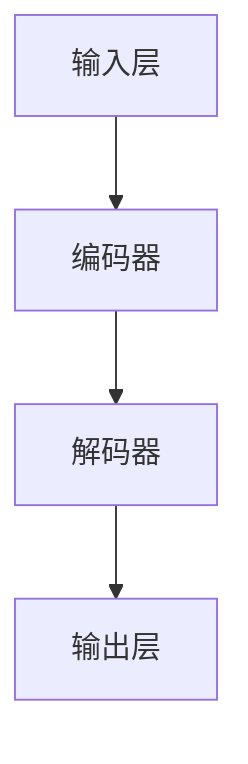
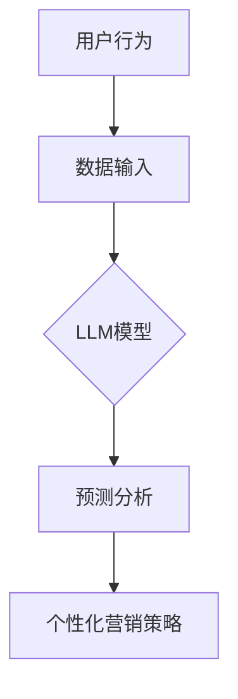

                 

# 文章标题: LLM在智能个性化营销中的应用探索

> 关键词：语言生成模型（LLM）、个性化营销、智能客服、多模态交互、算法原理、数学模型、项目实战

> 摘要：本文将深入探讨语言生成模型（LLM）在智能个性化营销中的应用。通过分析LLM的基本概念、架构和应用场景，详细讲解其核心算法原理，介绍数学模型和公式，并通过实际项目案例展示其在个性化营销中的具体应用。文章旨在为读者提供一个全面、系统的理解，帮助把握LLM在个性化营销中的潜力与挑战。

## 第一部分：核心概念与联系

### 1.1 LLM概述

语言生成模型（LLM）是一种能够从大规模文本数据中学习语言模式，生成文本的高级模型。其核心目标是模拟人类语言处理能力，实现自然语言生成和对话系统。

#### 定义
LLM是一种生成式模型，通过学习大量文本数据，能够理解并生成具有人类语言特征的文本。它通常用于文本生成任务，如问答系统、自动摘要、机器翻译和对话生成等。

#### 架构
LLM的典型架构包括输入层、编码器、解码器和输出层。输入层接收原始文本数据，编码器将文本转化为密集的向量表示，解码器使用这些向量表示生成文本序列，输出层将解码器的输出转换为最终生成的文本。

#### 流程图
下面是一个LLM的流程图，展示了其基本架构：



### 1.2 LLM与个性化营销

#### 关联
LLM能够分析用户历史行为和偏好，预测用户需求，实现精准的个性化营销。通过理解用户行为数据，LLM可以生成个性化的营销内容，提高用户满意度和转化率。

#### 联系图
下面是一个LLM与个性化营销的联系图，展示了数据流和交互过程：



### 1.3 LLM在个性化营销中的应用场景

#### 场景1：用户画像生成
通过分析用户历史行为数据，LLM可以生成详细的用户画像，包括兴趣爱好、购买倾向和需求预测。这些画像为个性化营销提供了重要的参考。

#### 场景2：营销内容推荐
LLM可以根据用户画像和内容库，生成个性化的营销内容推荐。例如，为每位用户推荐他们可能感兴趣的产品、优惠信息和广告。

#### 场景3：智能客服
LLM可以用于智能客服系统，通过与用户交互，自动生成回复，提高客服效率和用户满意度。智能客服系统可以处理大量用户咨询，快速响应，并提供建议和解决方案。

## 第二部分：核心算法原理讲解

### 2.1 生成式模型原理

生成式模型（如LLM）通过学习数据概率分布，生成新的数据。以下是一个简单的伪代码，展示了生成式模型生成文本的过程：

```python
function generate_text(model, seed_text, max_length):
    context = seed_text
    while not finished:
        tokens = model.sample(context, max_length=max_length)
        context = append(tokens, context)
        if tokens are stop tokens:
            finished = True
    return ''.join(tokens)
```

### 2.2 指代消解原理

指代消解是自然语言处理中的一个关键问题，它涉及确定文本中词语的指代对象。以下是一个简单的伪代码，展示了指代消解的过程：

```python
function resolve_references(text, model):
    entities = model.extract_entities(text)
    for entity in entities:
        references = model.find_references(entity, text)
        for reference in references:
            target_entity = model.resolve_reference(reference, entities)
            text = replace_reference_with_entity(reference, target_entity, text)
    return text
```

### 2.3 多模态交互原理

多模态交互是指模型能够处理和生成多种类型的输入和输出，如文本、图像和声音。以下是一个简单的伪代码，展示了多模态交互的过程：

```python
function interactive multimodal(model, user_input, modalities):
    if modalities contains "text":
        response = model.respond_to_text(user_input)
    if modalities contains "image":
        response = model.respond_to_image(user_input)
    if modalities contains "voice":
        response = model.respond_to_voice(user_input)
    return response
```

## 第三部分：数学模型和数学公式

### 3.1 概率模型

概率模型是LLM中的重要组成部分，用于文本生成和指代消解。以下是一些常用的概率模型和数学公式：

#### 贝叶斯公式

$$
P(A|B) = \frac{P(B|A) \cdot P(A)}{P(B)}
$$

贝叶斯公式用于计算在给定条件B下，事件A发生的概率。

#### KL散度

$$
D_{KL}(P||Q) = \sum_x P(x) \cdot \log\left(\frac{P(x)}{Q(x)}\right)
$$

KL散度是衡量两个概率分布差异的一种指标。

### 3.2 深度学习损失函数

在深度学习中，损失函数用于评估模型预测的误差。以下是一些常用的损失函数：

#### 交叉熵损失

$$
-\sum_{i} y_i \cdot \log(p_i)
$$

交叉熵损失用于分类问题，其中\(y_i\)是真实标签，\(p_i\)是模型预测的概率。

### 3.3 梯度下降

梯度下降是一种优化算法，用于调整模型参数以最小化损失函数。以下是一个简单的梯度下降更新公式：

$$
\theta = \theta - \alpha \cdot \nabla_\theta J(\theta)
$$

其中，\(\theta\)是模型参数，\(\alpha\)是学习率，\(\nabla_\theta J(\theta)\)是损失函数关于参数\(\theta\)的梯度。

## 第四部分：项目实战

### 4.1 实战1：用户画像生成

#### 环境搭建

```python
# Python 3.8
# TensorFlow 2.6
```

#### 代码实现

```python
# Load pre-trained LLM model
model = load_model('path/to/llm_model')

# Generate user profile based on user interactions
user_interactions = get_user_interactions(user_id)
user_profile = model.generate_profile(user_interactions)
```

#### 解读与分析

- 用户交互数据输入到模型中，通过预训练的LLM模型生成用户画像。
- 分析用户画像的生成过程，重点关注文本数据的预处理、嵌入和生成。

### 4.2 实战2：智能客服

#### 环境搭建

```python
# Flask
# Elasticsearch
# Redis
```

#### 代码实现

```python
from flask import Flask, request, jsonify
app = Flask(__name__)

@app.route('/chat', methods=['POST'])
def chat():
    user_input = request.json['user_input']
    response = get_response(user_input)
    return jsonify({'response': response})

def get_response(user_input):
    # Use LLM model to generate a response
    response = llm_model.generate_response(user_input)
    return response

if __name__ == '__main__':
    app.run(debug=True)
```

#### 解读与分析

- Flask框架搭建智能客服API，接收用户输入，通过LLM模型生成响应。
- 实现响应生成功能，展示LLM模型在智能客服中的应用。

## 第五部分：扩展内容

### 5.1 LLM与个性化推荐

LLM可以用于个性化推荐系统，通过分析用户行为和偏好，预测用户兴趣，生成个性化的推荐列表。以下是一个简化的实现过程：

```python
# Load pre-trained LLM model
model = load_model('path/to/llm_model')

# Analyze user behavior data
user_behavior = get_user_behavior(user_id)

# Generate personalized recommendations
recommendations = model.generate_recommendations(user_behavior)
```

### 5.2 LLM与社交媒体分析

LLM可以用于社交媒体分析，通过处理大量社交媒体数据，提取关键信息，进行情感分析和趋势预测。以下是一个简化的实现过程：

```python
# Load pre-trained LLM model
model = load_model('path/to/llm_model')

# Process social media data
social_media_data = get_social_media_data()

# Analyze data and generate insights
insights = model.analyze_social_media_data(social_media_data)
```

### 5.3 LLM与内容创作

LLM可以辅助内容创作，通过生成高质量文本内容，提高创作效率和内容质量。以下是一个简化的实现过程：

```python
# Load pre-trained LLM model
model = load_model('path/to/llm_model')

# Generate original content
content = model.generate_content(prompt)
```

## 第六部分：总结与展望

### 6.1 LLM在个性化营销中的优势

LLM在个性化营销中具有以下优势：

- **高效性**：自动化分析用户数据，提高营销效率。
- **精准性**：精准预测用户需求，实现个性化营销。

### 6.2 LLM面临的挑战与未来展望

LLM在个性化营销中面临的挑战包括：

- **数据隐私保护**：确保用户数据的安全性和隐私性。
- **模型解释性**：提高模型的透明度和可解释性。
- **计算资源需求**：优化模型结构，降低计算资源需求。

未来展望：

- 进一步优化LLM模型，提升生成文本的质量和解释性。
- 探索跨模态交互的新应用，如结合图像、声音和文本的智能营销系统。

## 作者信息

作者：AI天才研究院/AI Genius Institute & 禅与计算机程序设计艺术 /Zen And The Art of Computer Programming

