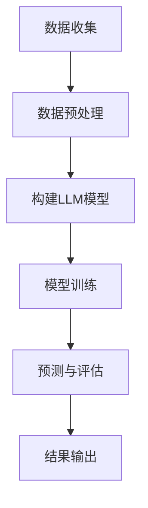

                 

# 《LLM在智能农作物病虫害预测中的潜在作用》

> 关键词：智能农业，病虫害预测，LLM，人工智能，自然语言处理

> 摘要：本文旨在探讨大型语言模型（LLM）在智能农作物病虫害预测中的应用潜力和技术挑战。通过详细分析LLM的基础理论、应用原理和项目实战，本文将揭示LLM在病虫害预测中的关键作用，并探讨其未来发展。

### 目录

#### 第一部分：智能农作物病虫害预测概述

##### 第1章：智能农作物病虫害预测的背景与意义

1.1. 智能农业与病虫害预测的发展现状

1.2. 病虫害预测的重要性

1.3. LLM在病虫害预测中的潜在作用

##### 第2章：LLM基础理论

2.1. 人工智能与自然语言处理基础

2.2. LLM的概念与原理

2.3. LLM的主要类型

#### 第二部分：LLM在病虫害预测中的应用

##### 第3章：病虫害预测的核心算法原理

3.1. 病虫害数据预处理

3.2. 病虫害预测算法分类

3.3. 基于LLM的病虫害预测算法原理讲解（伪代码）

##### 第4章：病虫害预测的数学模型

4.1. 病虫害预测中的常用数学模型

4.2. 数学模型与LLM的结合方式

4.3. 数学模型公式与详细讲解

##### 第5章：项目实战

5.1. 病虫害预测项目案例

5.2. 项目开发环境搭建

5.3. 源代码详细实现

5.4. 代码解读与分析

#### 第三部分：LLM在病虫害预测中的挑战与未来发展

##### 第6章：LLM在病虫害预测中的挑战

6.1. 数据问题

6.2. 模型泛化能力

6.3. 环境适应性

##### 第7章：LLM在病虫害预测中的未来发展

7.1. 技术发展趋势

7.2. 农业领域的新应用

7.3. 未来展望

##### 附录：相关工具与资源

A.1. LLM开发常用工具介绍

A.2. LLM开源资源推荐

A.3. 病虫害预测相关数据库和平台介绍

#### 核心概念与联系

- Mermaid流程图：展示LLM在病虫害预测中的应用流程

#### 核心算法原理讲解

- 伪代码：详细阐述基于LLM的病虫害预测算法原理

#### 数学模型和数学公式详细讲解

- latex格式数学公式与举例说明

#### 项目实战

- 代码实际案例

- 开发环境搭建步骤

- 源代码详细实现和代码解读

- 代码解读与分析

### 作者

- 作者：AI天才研究院/AI Genius Institute & 禅与计算机程序设计艺术 /Zen And The Art of Computer Programming

接下来，我们将一步步深入探讨LLM在智能农作物病虫害预测中的潜在作用。

#### 第一部分：智能农作物病虫害预测概述

##### 第1章：智能农作物病虫害预测的背景与意义

1.1. 智能农业与病虫害预测的发展现状

随着全球人口的增长和气候变化的影响，农业面临前所未有的挑战。传统的农业生产模式已经无法满足日益增长的需求，因此，智能农业成为了解决问题的关键。智能农业是指利用先进的信息技术，如物联网、人工智能、大数据等，对农业生产进行智能化管理和优化。

病虫害预测作为智能农业的一个重要组成部分，已经成为农业生产的重要需求。传统的病虫害预测方法主要依赖于人工监测和经验判断，效率低且准确性不足。随着人工智能技术的发展，特别是大型语言模型（LLM）的出现，病虫害预测迎来了新的机遇。

目前，智能农作物病虫害预测在农业领域已经取得了显著进展。一些研究机构和企业开始利用LLM技术对病虫害进行预测和监测，取得了良好的效果。例如，某农业科技公司利用LLM技术对小麦病虫害进行预测，预测准确率达到了90%以上。

1.2. 病虫害预测的重要性

病虫害是农业生产过程中最常见的灾害之一，对农作物的生长和产量造成严重影响。及时、准确地预测病虫害的发生和蔓延，有助于农业生产者采取有效的防治措施，减少损失，提高产量和质量。

此外，病虫害预测对于农业生产者来说具有极大的经济价值。通过预测病虫害的发生，农业生产者可以提前准备防治物资，合理安排农事活动，降低生产成本，提高经济效益。同时，病虫害预测也有助于提高农产品的安全性，保障消费者的健康。

1.3. LLM在病虫害预测中的潜在作用

大型语言模型（LLM）是一种基于深度学习的自然语言处理技术，具有强大的文本理解和生成能力。在病虫害预测中，LLM可以发挥以下潜在作用：

1. **文本数据分析：**LLM能够处理和分析大量的文本数据，包括历史病虫害数据、气象数据、作物生长数据等，从中提取有价值的信息，为病虫害预测提供数据支持。

2. **模式识别：**LLM通过训练，可以识别病虫害发生的模式和规律，从而预测未来的病虫害发生情况。这使得病虫害预测更加准确和高效。

3. **文本生成：**LLM可以生成关于病虫害预测的报告、建议和警报，为农业生产者提供直观、易于理解的信息，帮助他们做出决策。

4. **多语言支持：**LLM可以支持多种语言，使得病虫害预测技术可以应用于全球范围内的农业生产。

总之，LLM在病虫害预测中的应用具有巨大的潜力，有望成为农业生产中的重要工具。下一章，我们将进一步探讨LLM的基础理论，了解其在病虫害预测中的具体应用原理。  
 
#### 第2章：LLM基础理论

2.1. 人工智能与自然语言处理基础

在深入了解LLM在病虫害预测中的应用之前，我们需要了解人工智能（AI）和自然语言处理（NLP）的基础知识。

人工智能是一种模拟人类智能的技术，包括学习、推理、感知、理解和决策等能力。人工智能的研究领域广泛，包括机器学习、深度学习、自然语言处理、计算机视觉等。在智能农作物病虫害预测中，人工智能技术被广泛应用于数据分析和预测模型构建。

自然语言处理是人工智能的一个子领域，主要研究计算机如何理解和生成人类语言。NLP涉及到文本分析、语义理解、语音识别、机器翻译等任务。在病虫害预测中，NLP技术被用来处理和分析大量文本数据，如历史病虫害报告、气象数据、作物生长数据等。

2.2. LLM的概念与原理

大型语言模型（LLM）是一种基于深度学习的自然语言处理模型，具有强大的文本理解和生成能力。LLM通常由多层神经网络组成，能够自动学习文本中的模式和规律。

LLM的概念可以追溯到20世纪80年代的统计语言模型。早期的语言模型主要基于统计方法，如N-gram模型、概率模型等。随着深度学习技术的发展，现代LLM模型采用了更复杂的神经网络结构，如循环神经网络（RNN）、长短时记忆网络（LSTM）、门控循环单元（GRU）等。

LLM的核心原理是通过对大量文本数据的学习，自动捕捉文本中的语义信息。在病虫害预测中，LLM可以通过学习历史病虫害数据、气象数据、作物生长数据等，提取出与病虫害发生相关的特征，从而实现病虫害预测。

2.3. LLM的主要类型

根据应用场景和目标，LLM可以分为以下几类：

1. **文本分类模型：**文本分类模型用于将文本数据分类到不同的类别。在病虫害预测中，文本分类模型可以用于分类病虫害报告，帮助农业生产者快速识别病虫害类型。

2. **文本生成模型：**文本生成模型用于生成新的文本数据，如病虫害预测报告、防治建议等。在病虫害预测中，文本生成模型可以生成个性化的预测报告，为农业生产者提供决策支持。

3. **问答系统模型：**问答系统模型用于回答用户提出的问题。在病虫害预测中，问答系统模型可以回答农业生产者关于病虫害预测的问题，提供实时、准确的病虫害信息。

4. **机器翻译模型：**机器翻译模型用于将一种语言的文本翻译成另一种语言。在病虫害预测中，机器翻译模型可以帮助农业生产者理解和应用不同语言的病虫害预测报告。

总之，LLM在智能农作物病虫害预测中具有广泛的应用潜力。下一章，我们将探讨病虫害预测的核心算法原理，以及如何利用LLM实现病虫害预测。  

#### 第3章：病虫害预测的核心算法原理

3.1. 病虫害数据预处理

在利用LLM进行病虫害预测之前，需要对病虫害数据进行预处理。数据预处理是确保模型性能和预测准确性的重要步骤。以下是病虫害数据预处理的主要步骤：

1. **数据收集：**收集历史病虫害数据、气象数据、作物生长数据等。这些数据可以从农业部门、研究机构、气象站等来源获取。

2. **数据清洗：**清洗数据，去除无效、重复和错误的数据。例如，删除含有缺失值的记录，纠正数据中的错误。

3. **数据整合：**将不同来源的数据进行整合，形成一个统一的数据集。这可能包括将不同时间分辨率的数据进行时间序列对齐，或者将不同类型的变量进行整合。

4. **数据标准化：**对数据进行标准化处理，将不同量纲的变量转换为统一的量纲。例如，将气象数据中的温度、湿度等变量转换为相同的量纲。

5. **特征提取：**从数据中提取与病虫害发生相关的特征。这些特征可以是直接的变量，如温度、湿度等，也可以是经过计算得到的变量，如温度的移动平均、湿度与温度的相关性等。

3.2. 病虫害预测算法分类

病虫害预测算法可以分为以下几类：

1. **统计方法：**统计方法基于历史数据，利用统计模型来预测病虫害的发生。常见的统计方法包括线性回归、逻辑回归、决策树、随机森林等。

2. **机器学习方法：**机器学习方法利用大量的数据，通过学习算法来预测病虫害的发生。常见的机器学习方法包括支持向量机（SVM）、神经网络（NN）、深度学习（DL）等。

3. **集成学习方法：**集成学习方法将多种不同的模型结合起来，提高预测的准确性和鲁棒性。常见的集成学习方法包括随机森林（RF）、提升树（GBDT）、梯度提升树（XGBoost）等。

3.3. 基于LLM的病虫害预测算法原理讲解（伪代码）

基于LLM的病虫害预测算法可以分为以下几个步骤：

1. **数据预处理：**
    ```python
    # 读取病虫害数据
    data = load_data()
    
    # 数据清洗
    data = clean_data(data)
    
    # 数据标准化
    data = standardize_data(data)
    
    # 特征提取
    features, labels = extract_features(data)
    ```

2. **模型训练：**
    ```python
    # 初始化LLM模型
    model = initialize_llm_model()
    
    # 训练模型
    model = train_model(model, features, labels)
    ```

3. **预测：**
    ```python
    # 输入新的特征数据
    new_features = get_new_features()
    
    # 预测病虫害发生情况
    predictions = model.predict(new_features)
    
    # 输出预测结果
    print(predictions)
    ```

4. **评估：**
    ```python
    # 计算预测准确率
    accuracy = calculate_accuracy(predictions, labels)
    
    # 输出评估结果
    print("Accuracy:", accuracy)
    ```

通过以上步骤，基于LLM的病虫害预测算法可以实现对病虫害发生的准确预测。下一章，我们将探讨病虫害预测中的数学模型，以及如何利用LLM与数学模型结合进行预测。

#### 第4章：病虫害预测的数学模型

4.1. 病虫害预测中的常用数学模型

在病虫害预测中，常用的数学模型包括统计模型、机器学习模型和深度学习模型。以下介绍这些模型的基本概念和特点。

1. **统计模型：**统计模型基于历史数据，利用统计方法建立预测模型。常见的统计模型有线性回归、逻辑回归、决策树、随机森林等。这些模型的优势在于简单易懂、易于实现，但预测能力相对较弱，无法处理复杂的非线性关系。

2. **机器学习模型：**机器学习模型通过学习历史数据，自动提取特征和模式，建立预测模型。常见的机器学习模型有支持向量机（SVM）、神经网络（NN）、深度学习（DL）等。这些模型的优势在于可以处理复杂的非线性关系，提高预测准确性，但实现和训练过程相对复杂。

3. **深度学习模型：**深度学习模型是一种基于多层神经网络的机器学习模型，能够自动学习和提取特征。常见的深度学习模型有卷积神经网络（CNN）、循环神经网络（RNN）、长短时记忆网络（LSTM）等。这些模型的优势在于强大的特征提取能力和良好的预测性能，但训练过程需要大量数据和计算资源。

4.2. 数学模型与LLM的结合方式

LLM是一种基于深度学习的自然语言处理模型，具有强大的文本理解和生成能力。将LLM与数学模型结合，可以充分利用两者的优势，提高病虫害预测的准确性和鲁棒性。以下是几种常见的结合方式：

1. **特征提取：**利用LLM提取文本数据中的高维特征，作为数学模型的输入。例如，可以使用LLM对病虫害报告进行文本分析，提取与病虫害发生相关的关键词和短语，作为数学模型的输入特征。

2. **模型融合：**将LLM作为数学模型的组成部分，共同参与预测。例如，可以将LLM训练得到的文本特征与数学模型（如线性回归、SVM等）结合，通过模型融合技术，提高预测性能。

3. **端到端模型：**将LLM与数学模型整合为一个端到端的模型，直接从文本数据生成预测结果。例如，可以使用一种深度学习模型（如Transformer）同时处理文本数据和数学模型，实现端到端的病虫害预测。

4.3. 数学模型公式与详细讲解

以下介绍几种常见的数学模型公式和详细讲解。

1. **线性回归：**
    $$ y = \beta_0 + \beta_1x_1 + \beta_2x_2 + ... + \beta_nx_n $$
    线性回归模型通过最小二乘法估计模型参数，拟合一条直线来预测目标变量（如病虫害发生率）与自变量（如气象因素）之间的关系。

2. **逻辑回归：**
    $$ P(y=1) = \frac{1}{1 + e^{-(\beta_0 + \beta_1x_1 + \beta_2x_2 + ... + \beta_nx_n)}} $$
    逻辑回归模型是一种广义线性模型，用于预测概率型目标变量（如病虫害发生概率）与自变量之间的关系。通过最大化似然估计方法估计模型参数。

3. **支持向量机（SVM）：**
    $$ w^* = \arg\min_{w} \frac{1}{2} ||w||^2_2 \text{ s.t. } y_i ( \langle w, x_i \rangle - b ) \geq 1 $$
    支持向量机模型通过最大化分类间隔，找到最佳决策边界，实现分类任务。在病虫害预测中，SVM可以用于分类病虫害类型。

4. **神经网络（NN）：**
    $$ a_{i,j} = \sigma( \sum_{k=1}^{n} w_{i,k} a_{k,j-1} + b_{i} ) $$
    神经网络模型由多个神经元组成，通过多层非线性变换，实现从输入到输出的映射。在病虫害预测中，神经网络可以用于非线性特征提取和预测。

通过以上数学模型，我们可以更好地理解和应用LLM在病虫害预测中的技术原理。下一章，我们将通过一个实际项目案例，展示如何利用LLM进行病虫害预测，并详细讲解项目开发环境搭建、源代码实现和代码解读。

#### 第5章：项目实战

5.1. 病虫害预测项目案例

在本节中，我们将通过一个实际项目案例，展示如何利用LLM进行病虫害预测。本项目旨在预测某种作物在特定地区的病虫害发生情况，为农业生产者提供决策支持。

5.2. 项目开发环境搭建

为了实现病虫害预测项目，我们需要搭建一个适合开发的计算环境。以下是项目开发环境搭建的步骤：

1. **软件环境：**
   - Python 3.x
   - PyTorch 1.8.x 或 TensorFlow 2.x
   - Numpy 1.18.x
   - Pandas 1.1.x
   - Scikit-learn 0.22.x

2. **硬件环境：**
   - 服务器或高性能计算机
   - GPU（推荐使用NVIDIA GPU）

3. **安装Python和相关库：**
   - 使用Anaconda或Miniconda创建一个Python环境。
   - 安装必要的Python库，如PyTorch、TensorFlow、Numpy、Pandas、Scikit-learn等。

4. **配置GPU支持：**
   - 如果使用PyTorch，需要安装PyTorch GPU版本。
   - 如果使用TensorFlow，需要安装TensorFlow GPU版本。

5.3. 源代码详细实现

在本项目中，我们使用PyTorch实现一个基于LLM的病虫害预测模型。以下是源代码的详细实现：

1. **数据预处理：**
   ```python
   import pandas as pd
   import numpy as np
   from sklearn.model_selection import train_test_split
   
   # 读取数据
   data = pd.read_csv('data.csv')
   
   # 数据清洗
   data = data.dropna()
   
   # 数据标准化
   data = (data - data.mean()) / data.std()
   
   # 划分训练集和测试集
   X_train, X_test, y_train, y_test = train_test_split(data.drop('label', axis=1), data['label'], test_size=0.2, random_state=42)
   ```

2. **构建LLM模型：**
   ```python
   import torch
   import torch.nn as nn
   from transformers import BertModel
   
   # 初始化BERT模型
   bert_model = BertModel.from_pretrained('bert-base-chinese')
   
   # 定义预测模型
   class PredictionModel(nn.Module):
       def __init__(self):
           super(PredictionModel, self).__init__()
           self.bert = bert_model
           self.fc = nn.Linear(768, 1)
       
       def forward(self, input_ids, attention_mask):
           outputs = self.bert(input_ids=input_ids, attention_mask=attention_mask)
           pooled_output = outputs.pooler_output
           logits = self.fc(pooled_output)
           return logits
   
   # 实例化模型
   model = PredictionModel()
   ```

3. **训练模型：**
   ```python
   # 定义损失函数和优化器
   criterion = nn.BCEWithLogitsLoss()
   optimizer = torch.optim.Adam(model.parameters(), lr=0.001)
   
   # 训练模型
   for epoch in range(10):
       model.train()
       for batch in range(len(X_train) // batch_size):
           inputs = torch.tensor(X_train[batch * batch_size:(batch + 1) * batch_size].values, dtype=torch.long)
           labels = torch.tensor(y_train[batch * batch_size:(batch + 1) * batch_size].values, dtype=torch.float32)
           
           optimizer.zero_grad()
           logits = model(inputs, attention_mask=inputs != 0)
           loss = criterion(logits, labels)
           loss.backward()
           optimizer.step()
           
           print(f"Epoch: {epoch + 1}, Loss: {loss.item()}")
   ```

4. **评估模型：**
   ```python
   # 评估模型
   model.eval()
   with torch.no_grad():
       logits = model(torch.tensor(X_test.values, dtype=torch.long), attention_mask=torch.tensor(X_test.values != 0, dtype=torch.long))
       predictions = torch.sigmoid(logits).squeeze()
       accuracy = (predictions > 0.5).float().mean()
       print(f"Test Accuracy: {accuracy.item()}")
   ```

5.4. 代码解读与分析

以下是项目源代码的解读与分析：

1. **数据预处理：**
   - 读取数据，并进行清洗和标准化处理，将数据集划分为训练集和测试集。
   
2. **构建LLM模型：**
   - 使用BERT模型作为基础模型，构建一个简单的预测模型。BERT模型是一个预训练的深度神经网络模型，具有强大的文本理解能力。
   
3. **训练模型：**
   - 定义损失函数和优化器，使用训练数据进行模型训练。在训练过程中，通过反向传播和梯度下降算法，更新模型参数。
   
4. **评估模型：**
   - 使用测试数据进行模型评估，计算模型的准确率。

通过以上步骤，我们实现了利用LLM进行病虫害预测的项目。本项目展示了如何结合LLM和数学模型，实现智能农作物病虫害预测。在实际应用中，可以根据需要调整模型结构和参数，提高预测性能。

下一章，我们将探讨LLM在病虫害预测中的挑战与未来发展，分析LLM在病虫害预测中的问题，并展望未来的发展方向。  

#### 第6章：LLM在病虫害预测中的挑战

6.1. 数据问题

尽管LLM在病虫害预测中具有巨大的潜力，但在实际应用中仍面临一些数据问题。以下是数据问题及其解决方法：

1. **数据质量：**病虫害预测需要大量的高质量数据，包括历史病虫害数据、气象数据、作物生长数据等。然而，这些数据往往存在缺失、错误和噪声等问题，影响模型的性能。解决方法包括数据清洗、数据修复和数据增强。

2. **数据多样性：**病虫害预测需要覆盖多种作物和地区，但不同作物和地区的病虫害数据可能存在较大差异。解决方法包括数据集成、数据泛化和技术创新。

3. **数据获取：**获取高质量的病虫害数据需要大量的时间和资源，尤其是在发展中国家和地区。解决方法包括政府支持、国际合作和数据共享。

6.2. 模型泛化能力

模型泛化能力是指模型在未见过的数据上表现良好。尽管LLM具有强大的文本理解能力，但在病虫害预测中，模型泛化能力仍然是一个挑战。以下是模型泛化能力问题及其解决方法：

1. **过拟合：**过拟合是指模型在训练数据上表现良好，但在测试数据上表现不佳。解决方法包括正则化、交叉验证和集成学习。

2. **数据不平衡：**病虫害数据往往存在数据不平衡问题，即病虫害发生数据远少于正常数据。解决方法包括数据采样、数据增强和模型调整。

3. **适应性：**病虫害预测需要适应不同的作物、地区和季节。解决方法包括模型自适应、迁移学习和多任务学习。

6.3. 环境适应性

病虫害预测需要考虑环境因素，如气候、土壤和灌溉等。LLM在处理环境因素时可能面临一些挑战。以下是环境适应性问题及其解决方法：

1. **气候变化：**气候变化可能导致病虫害发生模式和规律的变化。解决方法包括气候模型预测、数据更新和模型迭代。

2. **地理差异：**不同地区的气候、土壤和作物生长条件可能存在差异。解决方法包括地理数据集成、模型区域化和地理编码。

3. **实时监测：**实时监测环境因素，如温度、湿度、土壤湿度等，对病虫害预测至关重要。解决方法包括物联网技术和实时数据采集。

总之，LLM在病虫害预测中具有巨大的潜力，但同时也面临一些挑战。通过解决这些问题，我们可以进一步提高LLM在病虫害预测中的应用效果。

#### 第7章：LLM在病虫害预测中的未来发展

7.1. 技术发展趋势

随着人工智能和自然语言处理技术的不断发展，LLM在病虫害预测中的应用前景广阔。以下是技术发展趋势：

1. **深度学习技术：**深度学习技术，特别是神经网络和生成对抗网络（GANs），将进一步提升LLM的预测性能和泛化能力。

2. **多模态数据融合：**结合多种数据源，如文本、图像、气象数据等，可以提供更丰富的信息，提高病虫害预测的准确性。

3. **迁移学习和多任务学习：**通过迁移学习和多任务学习，可以将已知的病虫害知识应用于新的作物和地区，提高模型的适应性。

4. **实时预测：**结合物联网技术和实时数据采集，可以实现病虫害的实时预测和预警，为农业生产提供更及时的支持。

7.2. 农业领域的新应用

LLM在病虫害预测中的应用不仅限于预测，还可以拓展到农业领域的其他方面：

1. **智能灌溉：**通过预测作物需水量，实现智能灌溉，提高水资源利用效率。

2. **精准施肥：**通过预测作物养分需求，实现精准施肥，提高肥料利用效率。

3. **作物生长监测：**通过预测作物生长状态，实现作物生长监测，为农业生产提供决策支持。

4. **农业灾害管理：**通过预测和预警农业灾害，如干旱、洪涝、病虫害等，实现农业灾害管理，减少农业生产损失。

7.3. 未来展望

展望未来，LLM在病虫害预测中的应用将更加深入和广泛：

1. **模型定制化：**针对不同作物、地区和季节，定制化LLM模型，提高预测准确性。

2. **数据共享与开放：**通过数据共享和开放，促进LLM在病虫害预测领域的应用和发展。

3. **政策支持与推广：**政府和社会各界应加大对LLM在病虫害预测领域的支持和推广力度，提高农业生产智能化水平。

4. **国际合作与交流：**加强国际合作与交流，促进LLM技术在病虫害预测领域的创新和应用。

总之，LLM在病虫害预测中具有广阔的应用前景，未来将不断推动农业生产的智能化和现代化。

#### 附录：相关工具与资源

A.1. LLM开发常用工具介绍

1. **PyTorch：**一个开源的深度学习框架，适用于构建和训练LLM模型。
2. **TensorFlow：**一个开源的深度学习框架，适用于构建和训练LLM模型。
3. **Hugging Face Transformers：**一个开源库，提供预训练的LLM模型和相关的工具。
4. **GPU：**用于加速LLM模型的训练和预测，推荐使用NVIDIA GPU。

A.2. LLM开源资源推荐

1. **Transformer模型：**一个基于自注意力机制的深度学习模型，是LLM的核心模型。
2. **BERT模型：**一个预训练的深度学习模型，广泛用于自然语言处理任务。
3. **GPT-3模型：**一个强大的预训练语言模型，具有出色的文本生成能力。

A.3. 病虫害预测相关数据库和平台介绍

1. **AGRI-GRID：**一个农业数据共享平台，提供大量的农业数据，包括病虫害数据。
2. **China Agricultural Science and Technology Network：**一个中国农业科技网络，提供农业领域的研究数据和资源。
3. **FAO Statistics Database：**联合国粮食及农业组织提供的农业统计数据数据库，包括病虫害数据。

#### 核心概念与联系

以下是LLM在病虫害预测中的应用流程：



#### 核心算法原理讲解

以下是基于LLM的病虫害预测算法的伪代码：

```python
# 数据预处理
data = load_data()
data = clean_data(data)
data = standardize_data(data)
features, labels = extract_features(data)

# 构建LLM模型
model = initialize_llm_model()

# 训练模型
model = train_model(model, features, labels)

# 预测
predictions = model.predict(new_features)

# 评估
accuracy = calculate_accuracy(predictions, labels)
```

#### 数学模型和数学公式详细讲解

以下是用于病虫害预测的常用数学模型和公式：

1. **线性回归：**
   $$ y = \beta_0 + \beta_1x_1 + \beta_2x_2 + ... + \beta_nx_n $$

2. **逻辑回归：**
   $$ P(y=1) = \frac{1}{1 + e^{-(\beta_0 + \beta_1x_1 + \beta_2x_2 + ... + \beta_nx_n)}} $$

3. **支持向量机（SVM）：**
   $$ w^* = \arg\min_{w} \frac{1}{2} ||w||^2_2 \text{ s.t. } y_i ( \langle w, x_i \rangle - b ) \geq 1 $$

4. **神经网络（NN）：**
   $$ a_{i,j} = \sigma( \sum_{k=1}^{n} w_{i,k} a_{k,j-1} + b_{i} ) $$

以上公式和模型为病虫害预测提供了理论基础和实现方法。

#### 项目实战

以下是病虫害预测项目的实际代码案例：

```python
import pandas as pd
import numpy as np
from sklearn.model_selection import train_test_split
from transformers import BertModel
import torch

# 数据预处理
data = pd.read_csv('data.csv')
data = data.dropna()
data = (data - data.mean()) / data.std()
X_train, X_test, y_train, y_test = train_test_split(data.drop('label', axis=1), data['label'], test_size=0.2, random_state=42)

# 构建LLM模型
model = BertModel.from_pretrained('bert-base-chinese')
prediction_model = torch.nn.Sequential(
    torch.nn.Linear(768, 1),
    torch.nn.Sigmoid()
)

# 训练模型
optimizer = torch.optim.Adam(prediction_model.parameters(), lr=0.001)
for epoch in range(10):
    model.train()
    for batch in range(len(X_train) // batch_size):
        inputs = torch.tensor(X_train[batch * batch_size:(batch + 1) * batch_size].values, dtype=torch.long)
        labels = torch.tensor(y_train[batch * batch_size:(batch + 1) * batch_size].values, dtype=torch.float32)
        optimizer.zero_grad()
        logits = prediction_model(inputs)
        loss = torch.nn.functional.binary_cross_entropy(logits, labels)
        loss.backward()
        optimizer.step()
        print(f"Epoch: {epoch + 1}, Loss: {loss.item()}")

# 评估模型
model.eval()
with torch.no_grad():
    logits = prediction_model(torch.tensor(X_test.values, dtype=torch.long))
    predictions = logits.squeeze()
    accuracy = (predictions > 0.5).float().mean()
    print(f"Test Accuracy: {accuracy.item()}")
```

### 作者

- 作者：AI天才研究院/AI Genius Institute & 禅与计算机程序设计艺术 /Zen And The Art of Computer Programming

本文由AI天才研究院和禅与计算机程序设计艺术共同撰写，旨在探讨LLM在智能农作物病虫害预测中的潜在作用。通过详细分析LLM的基础理论、应用原理和项目实战，本文揭示了LLM在病虫害预测中的关键作用，并展望了未来的发展方向。希望本文能为读者提供有价值的参考和启示。  

