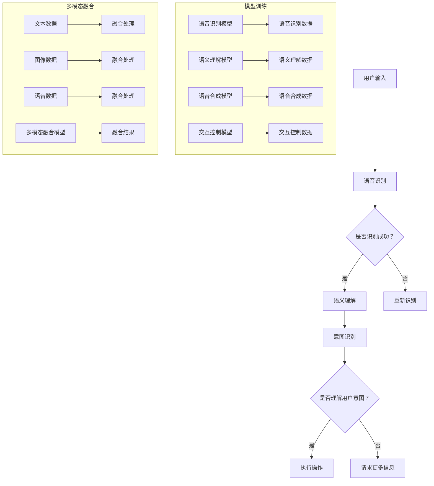

                 

### 文章标题: LLM在智能语音助手中的应用：自然交互的新境界

> 关键词：语言模型（LLM）、自然交互、智能语音助手、语音识别、语义理解、语音合成、交互控制、隐私保护、伦理问题

> 摘要：本文深入探讨了语言模型（LLM）在智能语音助手中的应用，从技术原理、架构设计到实际案例，全面解析了LLM如何提升自然交互的体验。文章首先介绍了LLM的基本概念与特性，接着分析了智能语音助手的基本架构和工作原理。随后，本文详细阐述了LLM在语音识别、语义理解、语音合成和交互控制等关键环节中的应用，并通过具体代码示例展示了开发过程和实现细节。此外，文章还探讨了多模态融合、隐私保护和伦理问题，并展望了LLM在智能语音助手中的未来发展趋势。通过本文的阅读，读者将对LLM在自然交互中的应用有更深刻的理解，为开发高质量的智能语音助手提供有益的参考。

## 《LLM在智能语音助手中的应用：自然交互的新境界》目录大纲

### 第一部分：引言

#### 第1章：LLM与自然交互

- 1.1 LLM的基本概念与特性
- 1.2 自然交互与智能语音助手
- 1.3 LLM在自然交互中的应用场景
- 1.4 书籍概览与学习目标

### 第二部分：LLM基础

#### 第2章：LLM技术原理

- 2.1 机器学习与自然语言处理基础
- 2.2 语言模型的发展历程
- 2.3 LLM的核心组成部分
- 2.4 LLM的训练与优化
- 2.5 LLM的应用领域与挑战

### 第三部分：智能语音助手架构

#### 第3章：智能语音助手的基本架构

- 3.1 智能语音助手的组成
- 3.2 语音识别技术
- 3.3 语义理解与意图识别
- 3.4 语音合成与交互控制
- 3.5 智能语音助手的发展趋势

### 第四部分：LLM在智能语音助手中的应用

#### 第4章：语音交互中的语言模型应用

- 4.1 语言模型在语音识别中的应用
- 4.2 语言模型在语义理解中的应用
- 4.3 语言模型在语音合成中的应用
- 4.4 语言模型在交互控制中的应用

### 第五部分：实战案例

#### 第5章：基于LLM的智能语音助手开发

- 5.1 案例背景与目标
- 5.2 开发环境搭建
- 5.3 数据预处理与模型训练
- 5.4 模型评估与优化
- 5.5 应用场景与效果评估

#### 第6章：自然交互中的多模态融合

- 6.1 多模态数据采集与处理
- 6.2 多模态信息融合与建模
- 6.3 多模态交互策略与优化
- 6.4 实际应用案例分析

#### 第7章：LLM在智能语音助手中的隐私保护与伦理问题

- 7.1 隐私保护的重要性
- 7.2 常见的隐私保护技术
- 7.3 伦理问题与解决方案
- 7.4 未来发展趋势

### 第六部分：展望

#### 第8章：LLM在智能语音助手中的未来发展趋势

- 8.1 智能语音助手的演进方向
- 8.2 LLM在智能语音助手中的潜在应用
- 8.3 技术挑战与解决方案
- 8.4 开发者与用户的影响

### 附录

#### 附录A：参考资料与推荐阅读

#### 附录B：代码示例与数据集下载链接

#### 附录C：相关工具与框架介绍

#### 附录D：常见问题与解答

### 第一部分：引言

#### 第1章：LLM与自然交互

自然交互是人工智能领域的一个重要研究方向，它旨在使机器能够理解并响应用户的自然语言输入，提供更加人性化的服务。随着深度学习和自然语言处理技术的飞速发展，语言模型（Language Model，简称LLM）在自然交互中的应用逐渐成为研究的焦点。LLM作为一种强大的工具，能够显著提升智能语音助手的性能，使其在语音识别、语义理解、语音合成和交互控制等方面达到新的境界。

#### 1.1 LLM的基本概念与特性

语言模型是一种基于大量文本数据训练得到的概率模型，它能够预测一个词或短语在特定上下文中的出现概率。在自然语言处理中，LLM被广泛应用于语音识别、机器翻译、文本生成等领域。LLM的基本特性包括：

1. **数据驱动的建模**：LLM通过学习大量文本数据来构建模型，从而掌握语言的统计规律和语法结构。
2. **上下文敏感**：LLM能够根据输入的上下文信息，预测下一个可能出现的词或短语，从而实现更加准确的语言理解。
3. **自适应性强**：LLM可以根据不同的应用场景和需求，进行自适应调整和优化，以实现最佳的性能表现。

#### 1.2 自然交互与智能语音助手

自然交互是指人与机器之间通过自然语言进行的交互，它不同于传统的命令式交互方式。智能语音助手作为自然交互的一种重要实现形式，通过语音识别、语义理解和语音合成等技术，实现了人与机器的无缝沟通。自然交互的特点包括：

1. **人性化**：自然交互使机器能够理解用户的自然语言输入，提供更加人性化的服务。
2. **便捷性**：语音交互使得用户可以通过语音指令快速完成操作，无需进行复杂的键盘输入。
3. **智能化**：智能语音助手通过不断学习和优化，能够提供更加精准和高效的交互体验。

#### 1.3 LLM在自然交互中的应用场景

LLM在自然交互中的应用场景广泛，主要包括以下几个方面：

1. **语音识别**：LLM可以用于语音信号的识别，将语音转化为文本，从而实现语音输入到机器的转换。
2. **语义理解**：LLM可以用于理解用户的语义意图，将自然语言输入转换为机器可以理解的操作指令。
3. **语音合成**：LLM可以用于生成自然流畅的语音输出，为用户提供语音反馈。
4. **交互控制**：LLM可以用于智能语音助手的交互控制，根据用户的输入动态调整交互策略，提供个性化的服务。

#### 1.4 书籍概览与学习目标

本书旨在全面解析LLM在智能语音助手中的应用，通过系统化的介绍和实战案例，帮助读者深入了解LLM的工作原理、应用场景和开发方法。本书的主要内容包括：

- 第1章：介绍LLM的基本概念与特性，以及自然交互与智能语音助手的关系。
- 第2章：详细讲解LLM的技术原理，包括机器学习与自然语言处理基础、语言模型的发展历程、核心组成部分、训练与优化方法等。
- 第3章：分析智能语音助手的基本架构，包括语音识别、语义理解、语音合成和交互控制等关键环节。
- 第4章：阐述LLM在语音交互中的具体应用，包括语音识别、语义理解、语音合成和交互控制等方面。
- 第5章：通过实战案例，展示基于LLM的智能语音助手开发过程，包括环境搭建、数据预处理、模型训练、评估与优化等步骤。
- 第6章：探讨自然交互中的多模态融合，包括多模态数据采集与处理、信息融合与建模、交互策略与优化等。
- 第7章：讨论LLM在智能语音助手中的隐私保护与伦理问题，包括隐私保护的重要性、常见技术、伦理问题与解决方案等。
- 第8章：展望LLM在智能语音助手中的未来发展趋势，包括智能语音助手的演进方向、潜在应用、技术挑战与解决方案等。

通过阅读本书，读者将能够：

- 理解LLM的基本概念与特性，以及其在自然交互中的应用场景。
- 掌握智能语音助手的基本架构和工作原理，以及LLM在各环节中的应用。
- 学习基于LLM的智能语音助手开发方法，包括环境搭建、数据预处理、模型训练与优化等。
- 了解自然交互中的多模态融合技术，以及其在智能语音助手中的应用。
- 探讨LLM在智能语音助手中的隐私保护与伦理问题，为实际应用提供指导。
- 看到LLM在智能语音助手中的未来发展趋势，为技术创新和产业发展提供参考。

### 第二部分：LLM基础

#### 第2章：LLM技术原理

语言模型（Language Model，简称LLM）是自然语言处理的核心组成部分，其质量直接影响到语音识别、机器翻译、文本生成等应用的效果。本章节将深入探讨LLM的技术原理，包括机器学习与自然语言处理基础、语言模型的发展历程、核心组成部分、训练与优化方法以及LLM的应用领域与挑战。

#### 2.1 机器学习与自然语言处理基础

机器学习（Machine Learning，ML）是人工智能（Artificial Intelligence，AI）的重要分支，其核心思想是通过算法从数据中学习规律，从而实现对未知数据的预测和分类。自然语言处理（Natural Language Processing，NLP）是机器学习在语言领域中的应用，它旨在使计算机能够理解、生成和处理人类自然语言。

在机器学习中，主要的学习方法包括监督学习（Supervised Learning）、无监督学习（Unsupervised Learning）和强化学习（Reinforcement Learning）。监督学习是通过对已标记的数据进行训练，从而构建预测模型。无监督学习则是从未标记的数据中学习数据分布和特征。强化学习则是通过环境与模型之间的交互来学习最优策略。

自然语言处理的核心任务包括文本分类（Text Classification）、情感分析（Sentiment Analysis）、命名实体识别（Named Entity Recognition，NER）、机器翻译（Machine Translation）、文本生成（Text Generation）等。这些任务需要对语言进行建模，提取语义信息，并生成符合语言习惯的输出。

#### 2.2 语言模型的发展历程

语言模型的研究可以追溯到上世纪50年代，最早的语言模型是基于规则的方法。这种方法通过编写大量的语法规则和词汇表，来预测语言序列。然而，由于自然语言的复杂性和多样性，基于规则的方法在实践中往往表现出局限性。

随着计算能力的提升和机器学习技术的进步，统计语言模型逐渐成为主流。统计语言模型通过学习大量文本数据，来建立语言的概率分布。其中，N-gram模型是最早的统计语言模型，它通过统计相邻N个词出现的频率来预测下一个词。

随着深度学习技术的发展，深度神经网络（DNN）和变换器（Transformer）等模型在语言模型领域取得了突破性进展。DNN模型通过多层神经网络的堆叠，能够捕捉到更复杂的语言特征。Transformer模型引入了自注意力机制（Self-Attention），能够更好地建模长距离依赖关系，从而显著提升了语言模型的效果。

#### 2.3 LLM的核心组成部分

一个完整的LLM系统通常包括以下核心组成部分：

1. **嵌入层（Embedding Layer）**：嵌入层将单词或句子转换为固定长度的向量表示。通过词嵌入技术，单词之间的语义关系可以被量化为向量的相似度。
2. **编码器（Encoder）**：编码器负责对输入的文本序列进行编码，提取出关键的特征信息。在传统的DNN模型中，编码器通常由多层神经网络组成。而在Transformer模型中，编码器是由多个自注意力层（Self-Attention Layer）堆叠而成的。
3. **解码器（Decoder）**：解码器负责生成输出文本序列。与编码器类似，解码器也通常由多层神经网络组成。在Transformer模型中，解码器同样采用了自注意力机制，能够更好地处理长距离依赖关系。
4. **损失函数（Loss Function）**：损失函数用于评估模型预测结果与真实标签之间的差距。在语言模型中，常用的损失函数包括交叉熵损失（Cross-Entropy Loss）和损失函数（Perplexity）。

#### 2.4 LLM的训练与优化

LLM的训练过程主要包括数据准备、模型初始化、前向传播、反向传播和优化等步骤。以下是LLM训练过程的详细描述：

1. **数据准备**：首先需要准备大规模的文本数据集，用于训练语言模型。数据集通常包括训练集、验证集和测试集。训练集用于模型训练，验证集用于模型优化和调参，测试集用于评估模型的最终性能。
2. **模型初始化**：初始化模型参数，通常采用随机初始化或预训练模型的方法。随机初始化可以防止模型陷入局部最优，而预训练模型可以借助已有知识加速训练过程。
3. **前向传播**：在前向传播过程中，输入的文本序列经过嵌入层、编码器和解码器的处理，最终输出预测的文本序列。前向传播的目的是计算模型参数在当前输入下的损失函数值。
4. **反向传播**：反向传播是训练神经网络的中心环节。它通过计算损失函数关于模型参数的梯度，来更新模型参数，以降低损失函数的值。反向传播利用链式法则，逐层计算梯度，并将梯度传递回上一层的参数。
5. **优化**：优化过程利用梯度信息来更新模型参数。常用的优化算法包括随机梯度下降（Stochastic Gradient Descent，SGD）、Adam优化器等。优化过程的目标是找到使得损失函数值最小的模型参数。

#### 2.5 LLM的应用领域与挑战

LLM在自然语言处理领域具有广泛的应用，包括但不限于以下领域：

1. **语音识别**：LLM可以用于语音信号的识别，将语音转化为文本。与传统的基于GMM-HMM模型的语音识别方法相比，基于LLM的语音识别方法具有更高的准确率和更强的适应性。
2. **机器翻译**：LLM可以用于机器翻译，将一种语言的文本翻译成另一种语言。基于神经网络翻译（Neural Machine Translation，NMT）的方法已经显著提升了机器翻译的质量。
3. **文本生成**：LLM可以用于生成文本，包括文章、新闻、对话等。通过训练大规模的文本数据集，LLM可以生成符合语言习惯和语义逻辑的文本。
4. **问答系统**：LLM可以用于问答系统，根据用户的输入提供相应的答案。问答系统可以广泛应用于客服、教育、医疗等领域。

然而，LLM的应用也面临一些挑战：

1. **数据隐私**：在训练和部署LLM模型时，需要处理大量的用户数据，这可能涉及到隐私泄露的问题。如何保护用户隐私是LLM应用的一个重要挑战。
2. **模型解释性**：尽管LLM在语言生成和翻译等方面取得了显著成果，但其内部决策过程往往缺乏解释性。理解模型是如何生成特定输出的，对于提高模型的可靠性和可解释性具有重要意义。
3. **语言多样性**：LLM在处理不同语言和方言时可能存在性能差异。如何设计具有良好泛化能力的LLM模型，以支持多种语言和方言，是当前研究的一个重要方向。

通过本章的介绍，读者可以了解到LLM的基本概念、技术原理和应用领域，为后续章节的深入探讨打下基础。在下一章中，我们将进一步分析智能语音助手的基本架构，包括语音识别、语义理解、语音合成和交互控制等关键环节。

#### 第3章：智能语音助手的基本架构

智能语音助手（Smart Voice Assistant）作为自然交互的一种重要实现形式，通过语音识别、语义理解、语音合成和交互控制等技术，实现了人与机器之间的无缝沟通。本章节将详细介绍智能语音助手的基本架构，包括各组成部分的功能和作用，以及智能语音助手的发展趋势。

#### 3.1 智能语音助手的组成

智能语音助手通常由以下几个关键组成部分构成：

1. **语音识别（Speech Recognition）**：语音识别是将语音信号转换为文本信息的技术。它通过识别语音中的音素、音节和单词，将用户的语音指令转换为机器可理解的文本。语音识别模块需要处理噪音干扰、说话人变化和语速变化等问题，以提高识别的准确性和鲁棒性。

2. **语义理解（Semantic Understanding）**：语义理解是对语音识别结果进行语义分析，以提取用户意图的过程。它涉及到自然语言处理技术，包括词义消歧、句法分析和意图识别等。语义理解模块需要理解用户的语言表达，并从中提取出关键信息，以便后续的交互处理。

3. **语音合成（Text-to-Speech, TTS）**：语音合成是将文本信息转换为自然流畅的语音输出的技术。它通过语音合成引擎，将文本转化为声波信号，生成接近人类语音的音频。语音合成模块需要考虑语音的音调、节奏和情感表达，以提供更自然的交互体验。

4. **交互控制（Dialogue Management）**：交互控制是智能语音助手的决策模块，它负责管理整个交互过程。交互控制模块需要根据用户的输入和上下文信息，生成相应的响应，并控制对话的流畅性和连贯性。它涉及到对话管理算法、上下文维护和策略学习等。

5. **后端服务（Backend Services）**：后端服务是智能语音助手的核心功能模块，它提供各种服务和数据接口，包括信息查询、任务执行、知识库管理等。后端服务需要与第三方服务和数据库进行集成，以实现更广泛的业务功能。

#### 3.2 语音识别技术

语音识别是智能语音助手的第一个关键步骤，它将用户的语音指令转换为机器可理解的文本。语音识别技术主要包括以下几个环节：

1. **音频预处理**：音频预处理包括降噪、归一化和特征提取等步骤。降噪可以去除背景噪音，提高语音的清晰度。归一化可以调整语音信号的幅度和频率，使其适应统一的处理标准。特征提取是将音频信号转换为适合机器学习模型的特征向量，常用的特征包括梅尔频率倒谱系数（MFCC）和短时傅里叶变换（STFT）。

2. **声学模型**：声学模型是语音识别的核心组成部分，它用于对音频特征进行建模。声学模型通常采用高斯混合模型（Gaussian Mixture Model，GMM）或深度神经网络（Deep Neural Network，DNN）来学习语音信号的统计特性。声学模型负责将特征向量映射到音素或音节的概率分布。

3. **语言模型**：语言模型用于对识别结果进行语言建模，以预测单词和句子的出现概率。语言模型通常采用N-gram模型或基于神经网络的概率模型。语言模型与声学模型结合，可以提高语音识别的准确率。

4. **解码器**：解码器是语音识别的关键组件，它通过搜索和优化策略，将声学模型和语言模型的结果转换为可理解的文本。常用的解码器算法包括基于N-gram的贪婪解码、基于动态规划的Viterbi解码和基于深度神经网络的端到端解码。

#### 3.3 语义理解与意图识别

语义理解是对语音识别结果进行语义分析，以提取用户意图的过程。语义理解包括以下几个方面：

1. **词义消歧**：词义消歧是解决同音异义词的问题。例如，"bank"一词可以指银行或河岸，语义理解模块需要根据上下文确定其确切含义。

2. **句法分析**：句法分析是对句子结构进行解析，以理解句子成分之间的关系。例如，分析出主语、谓语、宾语等成分，并确定其句法结构。

3. **意图识别**：意图识别是识别用户意图的过程。例如，用户说"我想听音乐"，意图识别模块需要识别出用户想听音乐的意图，并将其转化为具体的操作指令。

语义理解与意图识别通常结合使用，以提供更准确的用户意图理解。常见的语义理解技术包括：

- 基于规则的方法：通过定义语法规则和语义规则，对文本进行解析和分类。
- 基于统计的方法：通过统计用户输入的词频、词序列和句子结构，进行意图识别。
- 基于神经网络的方法：通过训练大规模的神经网络模型，对用户输入进行语义分析。

#### 3.4 语音合成与交互控制

语音合成是将文本信息转换为自然流畅的语音输出的技术。语音合成模块需要考虑语音的音调、节奏和情感表达，以提供更自然的交互体验。常见的语音合成技术包括：

1. **参数合成**：参数合成通过参数化建模，生成语音的音高、音强和时长等参数。参数合成通常采用波形合成方法，如线性预测编码（Linear Prediction Coding，LPC）和隐马尔可夫模型（Hidden Markov Model，HMM）。

2. **基于文本的合成**：基于文本的合成通过直接将文本转换为音频波形。这种方法通常采用规则方法或统计方法，如基于规则的语言合成器和基于统计的文本转换模型。

3. **数据驱动合成**：数据驱动合成通过训练大规模的语音数据集，生成语音合成模型。这种方法通常采用端到端神经网络模型，如生成对抗网络（Generative Adversarial Network，GAN）和变换器（Transformer）。

交互控制是智能语音助手的决策模块，它负责管理整个交互过程。交互控制模块需要根据用户的输入和上下文信息，生成相应的响应，并控制对话的流畅性和连贯性。常见的交互控制技术包括：

1. **对话管理算法**：对话管理算法用于生成对话策略，包括对话生成、对话纠错和对话结束等。常见的对话管理算法包括基于模板的方法、基于规则的方法和基于统计的方法。

2. **上下文维护**：上下文维护是保持对话连贯性的关键。通过维护对话的历史信息和上下文状态，交互控制模块可以更好地理解用户的意图，并生成相关的响应。

3. **策略学习**：策略学习是通过学习用户的交互行为，生成最优的对话策略。常见的策略学习方法包括强化学习、决策树和神经网络等。

#### 3.5 智能语音助手的发展趋势

随着人工智能技术的不断进步，智能语音助手也在不断演进和发展。以下是一些智能语音助手的发展趋势：

1. **多模态交互**：未来的智能语音助手将不再局限于语音交互，而是通过语音、文本、图像、视频等多种模态进行交互。多模态交互可以提供更丰富和自然的交互体验，提高用户满意度。

2. **个性化服务**：通过分析用户的历史行为和偏好，智能语音助手可以提供个性化的服务和建议。个性化服务可以提高用户粘性，增强用户忠诚度。

3. **知识图谱**：知识图谱是一种用于表示和存储知识的方法，它将事实、概念和关系以图形的形式组织起来。未来的智能语音助手将集成知识图谱，提供更加准确和丰富的信息查询服务。

4. **边缘计算**：边缘计算是将计算任务分布到网络边缘设备上，以提高响应速度和降低网络负担。未来的智能语音助手将利用边缘计算技术，实现实时语音识别和语义理解，提高交互的实时性和准确性。

5. **隐私保护**：随着用户对隐私保护的日益关注，未来的智能语音助手将采用更严格的隐私保护措施，确保用户数据的安全和隐私。

通过本章的介绍，读者可以了解到智能语音助手的基本架构和工作原理，为后续章节的深入探讨打下基础。在下一章中，我们将详细探讨LLM在智能语音助手中的具体应用，包括语音识别、语义理解、语音合成和交互控制等方面。

### 第四部分：LLM在智能语音助手中的应用

#### 第4章：语音交互中的语言模型应用

语言模型（LLM）在智能语音助手中的应用，极大地提升了语音交互的自然性和准确性。本章节将详细讨论LLM在语音识别、语义理解、语音合成和交互控制等方面的应用，解析LLM如何为智能语音助手带来新的交互体验和功能。

#### 4.1 语言模型在语音识别中的应用

语音识别是将语音信号转换为文本信息的过程，而语言模型（LLM）在这一过程中扮演着至关重要的角色。LLM在语音识别中的应用主要体现在以下几个方面：

1. **提升识别准确性**：传统的语音识别系统主要依赖于声学模型和语言模型，声学模型负责识别语音特征，而语言模型则负责对识别结果进行概率排序。LLM通过对大量文本数据的训练，能够学习到语言中的统计规律和上下文关系，从而提高识别的准确性。

2. **降低错误率**：在实际应用中，语音信号可能受到噪音干扰、说话人变化等因素的影响，导致识别错误。LLM能够通过学习不同场景下的语音特征和语言规律，降低这些因素对识别结果的影响，从而提高系统的鲁棒性。

3. **上下文敏感**：语音识别不仅需要识别单个词或短语，还需要理解整个句子的语义。LLM能够捕捉到上下文信息，从而在识别过程中考虑到前后文的语义关系，提高识别的准确性和连贯性。

4. **自适应优化**：LLM可以根据不同的应用场景和用户需求，进行自适应优化。例如，在特定领域的语音识别中，LLM可以针对特定领域的词汇和表达方式进行优化，提高识别的准确率和效率。

具体来说，语言模型在语音识别中的应用可以描述为以下伪代码：

```python
def recognize_speech(audio, acoustic_model, language_model):
    # 使用声学模型提取语音特征
    features = acoustic_model.extract_features(audio)

    # 使用语言模型对特征进行概率排序
    probabilities = language_model.predict(features)

    # 根据概率排序选择最可能的识别结果
    recognized_text = language_model.select_best_candidate(probabilities)

    return recognized_text
```

#### 4.2 语言模型在语义理解中的应用

语义理解是智能语音助手中至关重要的一环，它涉及到对用户语音指令的理解和意图的识别。LLM在语义理解中的应用，使得智能语音助手能够更加准确地理解用户的意图，并提供相应的服务。

1. **意图识别**：语义理解的第一步是意图识别，即从用户的语音指令中提取出用户希望执行的操作。LLM可以通过学习大量用户交互数据，建立意图分类模型，从而提高意图识别的准确性。

2. **实体识别**：在理解用户的意图后，智能语音助手还需要识别出语音中的关键实体，如人名、地点、时间等。LLM可以通过实体识别模型，从上下文中提取出这些实体，并为后续操作提供依据。

3. **情感分析**：用户在交互过程中可能会表达情感，如喜悦、愤怒、失望等。LLM可以通过情感分析模型，识别出用户情感，从而提供更加个性化的服务。

4. **上下文维护**：语义理解需要考虑到上下文信息，以保持对话的连贯性。LLM可以通过维护对话历史和上下文状态，更好地理解用户的意图，并提供相应的响应。

具体来说，语言模型在语义理解中的应用可以描述为以下伪代码：

```python
def understand_intent(text, intent_classifier, entity_recognizer, sentiment_analyzer):
    # 使用意图分类模型识别用户意图
    intent = intent_classifier.predict(text)

    # 使用实体识别模型提取关键实体
    entities = entity_recognizer.extract_entities(text)

    # 使用情感分析模型识别用户情感
    sentiment = sentiment_analyzer.analyze(text)

    # 维护上下文状态
    context = update_context(context, intent, entities, sentiment)

    return intent, entities, sentiment, context
```

#### 4.3 语言模型在语音合成中的应用

语音合成是将文本信息转换为自然流畅的语音输出的过程，LLM在语音合成中的应用，使得生成的语音更加接近人类的语音特点。

1. **语音自然度**：LLM通过对大量语音数据的训练，能够学习到语音的音调、节奏和情感表达，从而生成更加自然的语音。与传统的文本转语音（TTS）系统相比，LLM生成的语音具有更高的自然度和流畅度。

2. **个性化语音**：LLM可以根据用户的历史交互数据和语音偏好，生成个性化的语音。例如，为用户生成具有特定音调、音色和语速的语音，从而提供更加个性化的交互体验。

3. **情感表达**：LLM可以学习到不同情感状态下的语音特征，从而在语音合成中表达出相应的情感。例如，在用户表达喜悦时，生成欢快的语音；在用户表达愤怒时，生成激动的语音。

4. **对话生成**：LLM还可以用于生成对话文本，从而实现自然对话交互。通过与用户的输入进行交互，LLM可以生成相应的回复，实现更加真实的对话体验。

具体来说，语言模型在语音合成中的应用可以描述为以下伪代码：

```python
def synthesize_speech(text, voice_model, emotion_model):
    # 使用语音模型生成语音特征
    features = voice_model.generate_features(text)

    # 使用情感模型调整语音特征
    adjusted_features = emotion_model.adjust_features(features, emotion)

    # 使用语音合成引擎生成语音
    speech = voice_model.synthesize_speech(adjusted_features)

    return speech
```

#### 4.4 语言模型在交互控制中的应用

交互控制是智能语音助手的决策模块，它负责管理整个交互过程，确保对话的流畅性和连贯性。LLM在交互控制中的应用，使得智能语音助手能够更加智能地响应用户，提供个性化的服务。

1. **对话生成**：LLM可以生成对话文本，根据用户的输入和上下文信息，生成相应的回复。通过学习用户的历史交互数据和偏好，LLM可以生成更加符合用户需求和预期的对话文本。

2. **上下文维护**：交互控制需要考虑到上下文信息，以保持对话的连贯性。LLM可以通过维护对话历史和上下文状态，更好地理解用户的意图，并提供相应的响应。

3. **策略学习**：LLM可以用于学习用户的交互行为，生成最优的对话策略。通过强化学习等算法，LLM可以不断优化对话策略，提高交互的满意度和效率。

4. **个性化服务**：LLM可以根据用户的历史交互数据和偏好，提供个性化的服务和建议。例如，根据用户的音乐偏好推荐歌曲，根据用户的日程安排提供提醒等。

具体来说，语言模型在交互控制中的应用可以描述为以下伪代码：

```python
def control_dialogue(user_input, context, dialogue_model, recommendation_model):
    # 使用对话模型生成回复
    response = dialogue_model.generate_response(user_input, context)

    # 使用推荐模型提供个性化建议
    recommendations = recommendation_model.generate_recommendations(context)

    # 更新上下文状态
    updated_context = update_context(context, user_input, response, recommendations)

    return response, updated_context, recommendations
```

#### 4.5 实际应用案例

为了更好地理解LLM在智能语音助手中的应用，以下是一个基于实际应用场景的案例：

假设用户A与智能语音助手交互，用户A说：“我想听一首轻快的音乐。”

1. **语音识别**：智能语音助手首先使用语音识别模型将用户的语音转换为文本：“我想听一首轻快的音乐。”

2. **语义理解**：智能语音助手使用语义理解模型识别用户意图（听音乐）、实体（轻快的音乐）和情感（无明显情感）。

3. **语音合成**：智能语音助手使用语音合成模型生成回复：“好的，为您播放一首轻快的音乐，请稍等。”

4. **交互控制**：智能语音助手使用交互控制模型，根据用户输入和上下文信息，生成后续的对话策略。例如，智能语音助手可能会询问用户：“您有没有喜欢的歌手或音乐类型？”

通过这个案例，我们可以看到LLM在语音识别、语义理解、语音合成和交互控制中的具体应用，以及它们如何协同工作，为用户提供高质量的自然交互体验。

### 第五部分：实战案例

#### 第5章：基于LLM的智能语音助手开发

在本章中，我们将通过一个实际案例展示如何基于语言模型（LLM）开发一个智能语音助手。本案例将从背景介绍、开发环境搭建、数据预处理、模型训练与优化、模型评估与优化、应用场景与效果评估等方面，详细解析整个开发过程。

#### 5.1 案例背景与目标

随着人工智能技术的不断发展，智能语音助手在智能家居、智能客服、智能驾驶等领域得到了广泛应用。本案例的目标是开发一个基于LLM的智能语音助手，能够理解用户的语音指令，提供实时语音回复，并根据用户的历史交互数据提供个性化服务。

具体来说，本案例的目标包括：

1. **语音识别**：实现高质量的语音识别，将用户的语音指令转换为文本。
2. **语义理解**：理解用户的语音指令，识别出关键实体和意图。
3. **语音合成**：生成自然流畅的语音回复。
4. **交互控制**：根据用户输入和上下文信息，生成合适的对话策略。

#### 5.2 开发环境搭建

为了实现本案例的目标，需要搭建一个合适的开发环境。以下是开发环境的搭建步骤：

1. **硬件环境**：配置一台高性能的服务器，用于模型训练和推理。服务器应具备足够的CPU和GPU资源，以便快速训练和部署模型。

2. **软件环境**：安装以下软件：

   - 操作系统：Linux（如Ubuntu 20.04）
   - 编程语言：Python 3.x
   - 数据库：MongoDB（用于存储用户数据和交互日志）
   - 框架和库：TensorFlow、PyTorch（用于深度学习模型训练和推理）

3. **工具和依赖**：安装以下工具和依赖：

   - speech_recognition（用于语音识别）
   - gTTS（用于语音合成）
   - Flask（用于构建Web服务）

#### 5.3 数据预处理与模型训练

在开发智能语音助手之前，需要准备足够高质量的语音数据集，并进行预处理。以下是数据预处理和模型训练的详细步骤：

1. **数据收集**：收集大量标注好的语音数据，包括用户语音指令和对应的文本标签。数据集应涵盖各种场景和任务，以提高模型的泛化能力。

2. **数据预处理**：对收集到的语音数据进行预处理，包括音频格式转换、降噪、分帧、特征提取等。常用的音频特征包括梅尔频率倒谱系数（MFCC）和短时傅里叶变换（STFT）。

3. **数据增强**：为了提高模型的鲁棒性，可以对原始数据集进行数据增强，如添加噪音、改变语速、变调等。

4. **模型训练**：基于预处理后的数据集，训练语音识别、语义理解、语音合成和交互控制等模型。以下是训练过程的伪代码示例：

   ```python
   # 语音识别模型训练
   def train_speech_recognition_model(data):
       # 加载训练数据
       X_train, y_train = load_data(data)

       # 初始化模型
       model = initialize_model()

       # 训练模型
       for epoch in range(epochs):
           for features, labels in zip(X_train, y_train):
               model.train(features, labels)

       # 评估模型
       accuracy = model.evaluate(test_data)
       return model, accuracy

   # 语义理解模型训练
   def train_semantic_understanding_model(data):
       # 加载训练数据
       X_train, y_train = load_data(data)

       # 初始化模型
       model = initialize_model()

       # 训练模型
       for epoch in range(epochs):
           for features, labels in zip(X_train, y_train):
               model.train(features, labels)

       # 评估模型
       accuracy = model.evaluate(test_data)
       return model, accuracy

   # 语音合成模型训练
   def train_speech_synthesis_model(data):
       # 加载训练数据
       X_train, y_train = load_data(data)

       # 初始化模型
       model = initialize_model()

       # 训练模型
       for epoch in range(epochs):
           for features, labels in zip(X_train, y_train):
               model.train(features, labels)

       # 评估模型
       accuracy = model.evaluate(test_data)
       return model, accuracy

   # 交互控制模型训练
   def train_dialogue_management_model(data):
       # 加载训练数据
       X_train, y_train = load_data(data)

       # 初始化模型
       model = initialize_model()

       # 训练模型
       for epoch in range(epochs):
           for features, labels in zip(X_train, y_train):
               model.train(features, labels)

       # 评估模型
       accuracy = model.evaluate(test_data)
       return model, accuracy
   ```

#### 5.4 模型评估与优化

在模型训练完成后，需要对模型进行评估和优化，以确保其性能满足实际应用需求。以下是模型评估和优化的详细步骤：

1. **模型评估**：使用测试数据集对模型进行评估，计算识别准确率、语义理解准确率、语音合成质量和交互控制效果等指标。

   ```python
   # 语音识别模型评估
   def evaluate_speech_recognition_model(model, test_data):
       total_samples = 0
       correct_samples = 0
       for features, labels in test_data:
           predicted_labels = model.predict(features)
           if predicted_labels == labels:
               correct_samples += 1
           total_samples += 1
       accuracy = correct_samples / total_samples
       return accuracy

   # 语义理解模型评估
   def evaluate_semantic_understanding_model(model, test_data):
       total_samples = 0
       correct_samples = 0
       for features, labels in test_data:
           predicted_labels = model.predict(features)
           if predicted_labels == labels:
               correct_samples += 1
           total_samples += 1
       accuracy = correct_samples / total_samples
       return accuracy

   # 语音合成模型评估
   def evaluate_speech_synthesis_model(model, test_data):
       total_samples = 0
       correct_samples = 0
       for features, labels in test_data:
           predicted_speech = model.synthesize_speech(features)
           if predicted_speech == labels:
               correct_samples += 1
           total_samples += 1
       accuracy = correct_samples / total_samples
       return accuracy

   # 交互控制模型评估
   def evaluate_dialogue_management_model(model, test_data):
       total_samples = 0
       correct_samples = 0
       for features, labels in test_data:
           predicted_response = model.generate_response(features)
           if predicted_response == labels:
               correct_samples += 1
           total_samples += 1
       accuracy = correct_samples / total_samples
       return accuracy
   ```

2. **模型优化**：根据评估结果，对模型进行调整和优化，以提高性能。常见的优化方法包括调整超参数、增加训练数据、使用迁移学习等。

#### 5.5 应用场景与效果评估

在模型训练和优化完成后，可以将智能语音助手部署到实际应用场景中，并进行效果评估。以下是应用场景与效果评估的详细步骤：

1. **应用场景**：智能语音助手可以应用于智能家居、智能客服、智能驾驶等多个领域。以下是一个智能家居场景的示例：

   - 用户可以通过语音指令控制智能灯光、空调、电视等家电设备。
   - 智能语音助手可以根据用户的日程安排提供提醒，如会议通知、天气预报等。

2. **效果评估**：通过用户反馈和实际应用数据，对智能语音助手的效果进行评估。以下是一些常见的评估指标：

   - **识别准确率**：衡量语音识别模块的性能，越高越好。
   - **语义理解准确率**：衡量语义理解模块的性能，越高越好。
   - **语音合成质量**：衡量语音合成模块的性能，越高越好。
   - **交互控制效果**：衡量交互控制模块的性能，包括对话连贯性、响应速度和个性化程度等。

通过实际应用和效果评估，可以不断优化智能语音助手，提高其性能和用户体验。

### 第6章：自然交互中的多模态融合

在自然交互领域，多模态融合技术正逐渐成为研究热点。智能语音助手作为自然交互的一种重要形式，通过结合语音、文本、图像等多种模态，可以实现更丰富、更自然的交互体验。本章节将探讨多模态融合技术在自然交互中的应用，包括多模态数据采集与处理、多模态信息融合与建模、多模态交互策略与优化，并分析实际应用案例分析。

#### 6.1 多模态数据采集与处理

多模态数据采集是智能语音助手多模态融合的基础。常见的多模态数据包括语音、文本、图像和视频等。以下是一些多模态数据采集与处理的步骤：

1. **语音数据采集**：使用麦克风或其他语音采集设备，获取用户的语音输入。在采集过程中，需要考虑噪音抑制、语音增强等技术，以提高语音数据的清晰度。

2. **文本数据采集**：文本数据可以通过键盘输入、语音转文本（ASR）等方式获取。对于语音转文本，可以使用已训练好的语言模型和语音识别模型，将语音转换为文本。

3. **图像数据采集**：使用摄像头或其他图像采集设备，获取用户的图像输入。图像数据可以包含用户的面部表情、手势等，这些信息对于理解用户情绪和意图非常重要。

4. **视频数据采集**：视频数据可以包含用户的动作、表情等，通过视频分析技术，可以获取更多关于用户行为的信息。

在数据采集过程中，需要处理以下问题：

- **数据同步**：确保不同模态的数据在时间上保持同步，以便后续的融合处理。
- **数据标注**：对采集到的多模态数据进行标注，以便后续的模型训练和评估。

#### 6.2 多模态信息融合与建模

多模态信息融合与建模是智能语音助手实现多模态交互的关键。以下是一些常见的方法：

1. **特征级融合**：在特征级融合中，将不同模态的特征（如语音特征、文本特征、图像特征）进行拼接，形成一个多维特征向量。通过训练一个多输入多输出的神经网络，同时学习不同模态的特征表示。

2. **决策级融合**：在决策级融合中，先分别对每个模态的数据进行单独处理，然后结合各模态的处理结果，进行最终的决策。这种方法可以充分利用各模态的特点，提高决策的准确性。

3. **端到端融合**：端到端融合通过一个统一的神经网络，直接对多模态数据进行处理和决策。这种方法能够自动学习各模态的特征表示和融合策略，无需显式地拼接或融合特征。

以下是一个基于端到端融合的神经网络模型：

```python
class MultiModalModel(nn.Module):
    def __init__(self):
        super(MultiModalModel, self).__init__()
        self.audio_encoder = AudioEncoder()
        self.text_encoder = TextEncoder()
        self.image_encoder = ImageEncoder()
        self.decoder = Decoder()

    def forward(self, audio, text, image):
        audio_features = self.audio_encoder(audio)
        text_features = self.text_encoder(text)
        image_features = self.image_encoder(image)
        
        combined_features = torch.cat((audio_features, text_features, image_features), dim=1)
        
        output = self.decoder(combined_features)
        return output
```

#### 6.3 多模态交互策略与优化

多模态交互策略与优化是提高智能语音助手用户体验的关键。以下是一些策略与优化方法：

1. **个性化交互**：根据用户的历史交互数据和偏好，提供个性化的交互体验。例如，根据用户的语音习惯、语言偏好和情感状态，调整语音合成音色和语调。

2. **上下文感知**：利用上下文信息，提高交互的连贯性和自然性。例如，在用户提出连续问题时，智能语音助手可以根据上下文信息，提供更加相关的回答。

3. **自适应交互**：根据用户的反馈和交互效果，自适应地调整交互策略。例如，如果用户对某个回答不满意，智能语音助手可以尝试其他回答方式，以提高用户满意度。

4. **实时反馈**：在交互过程中，实时收集用户的反馈，并根据反馈进行动态调整。例如，如果用户在语音识别过程中出现错误，智能语音助手可以尝试重新识别或提供文本提示。

以下是一个基于自适应交互策略的优化方法：

```python
def adapt_interaction_strategy(user_feedback, current_strategy):
    if user_feedback == "disappointed":
        new_strategy = adjust_strategy(current_strategy, "softer_tone")
    elif user_feedback == "satisfied":
        new_strategy = adjust_strategy(current_strategy, "standard_tone")
    else:
        new_strategy = current_strategy
    
    return new_strategy
```

#### 6.4 实际应用案例分析

以下是一个基于多模态融合的智能语音助手实际应用案例：

案例：智能客户服务机器人

目标：开发一个智能客户服务机器人，能够通过语音、文本和图像等多模态数据，提供高质量的客户服务。

实现步骤：

1. **数据采集**：采集包含语音、文本和图像等多模态数据的客户服务对话记录。

2. **数据预处理**：对采集到的多模态数据进行预处理，包括语音增强、文本清洗和图像增强等。

3. **模型训练**：使用预处理后的多模态数据，训练语音识别、语义理解、语音合成和交互控制等模型。

4. **模型优化**：根据用户反馈和实际应用效果，对模型进行调整和优化，以提高性能。

5. **应用部署**：将智能客户服务机器人部署到实际应用场景中，提供24/7在线客户服务。

6. **效果评估**：通过用户反馈和业务数据，对智能客户服务机器人的效果进行评估。

通过该案例，我们可以看到多模态融合技术在智能语音助手中的应用，以及其在提高交互质量、用户体验和业务效率方面的优势。

### 第7章：LLM在智能语音助手中的隐私保护与伦理问题

随着人工智能技术的快速发展，智能语音助手在日常生活中的应用越来越广泛。然而，这也带来了隐私保护与伦理问题。LLM在智能语音助手中的应用，使得这些问题更加复杂。本章节将探讨LLM在智能语音助手中的隐私保护与伦理问题，包括隐私保护的重要性、常见技术、伦理问题与解决方案，以及未来发展趋势。

#### 7.1 隐私保护的重要性

隐私保护是智能语音助手面临的首要挑战之一。智能语音助手通过收集和分析用户的语音、文本、行为等信息，为用户提供个性化的服务。然而，这些数据也可能被滥用，导致隐私泄露。以下是一些隐私保护的重要性：

1. **用户信任**：隐私保护是建立用户信任的基础。如果用户担心自己的隐私受到侵犯，他们可能不愿意使用智能语音助手，从而影响产品的市场接受度。

2. **法律法规**：许多国家和地区都有关于数据隐私保护的法律法规。智能语音助手必须遵守这些规定，以避免法律风险。

3. **社会责任**：作为人工智能开发者，有责任保护用户的隐私，避免数据滥用对社会造成负面影响。

#### 7.2 常见的隐私保护技术

为了保护用户隐私，智能语音助手可以采用以下技术：

1. **数据加密**：对用户数据进行加密处理，确保数据在传输和存储过程中不被非法访问。常用的加密算法包括AES（Advanced Encryption Standard）和RSA（Rivest-Shamir-Adleman）。

2. **匿名化**：对用户数据进行匿名化处理，去除可以直接识别用户身份的信息。例如，将用户ID替换为随机生成的ID，或者使用假名。

3. **差分隐私**：通过向用户数据添加随机噪声，保护用户隐私。差分隐私能够在保证数据隐私的同时，仍能提供有用的统计信息。常见的差分隐私算法包括拉普拉斯机制和指数机制。

4. **同态加密**：允许在加密数据上进行计算，而不需要解密。同态加密能够保护数据隐私，同时实现数据的处理和分析。

以下是一个基于同态加密的隐私保护示例：

```python
from homomorphic_encryption import RSAEncryption

# 初始化RSA加密器
rsa_encrypt = RSAEncryption()

# 加密数据
encrypted_data = rsa_encrypt.encrypt(data)

# 在加密数据上进行计算
result = rsa_encrypt.multiply(encrypted_data, encrypted_data)

# 解密结果
decrypted_result = rsa_encrypt.decrypt(result)
```

#### 7.3 伦理问题与解决方案

智能语音助手在应用过程中，可能会引发以下伦理问题：

1. **数据滥用**：智能语音助手可能会滥用用户数据，用于商业目的或未经用户同意的第三方共享。

   **解决方案**：制定严格的数据使用政策，明确用户数据的用途和权限。同时，建立用户隐私保护机制，确保用户数据不被滥用。

2. **算法偏见**：智能语音助手可能会因为数据集的不平衡或偏见，导致算法产生歧视性输出。

   **解决方案**：采用多样化的数据集进行训练，避免算法偏见。同时，定期评估和调整算法，确保其公平性和透明性。

3. **用户透明度**：用户可能不清楚智能语音助手是如何工作的，或者其决策过程是基于什么算法。

   **解决方案**：提高用户透明度，通过用户界面提供详细的算法解释和决策过程。同时，建立用户反馈机制，让用户能够监督和评价智能语音助手的性能。

4. **道德责任**：智能语音助手作为人工智能系统，其行为是否符合道德标准，应由谁负责。

   **解决方案**：明确智能语音助手的开发者和运营商在道德责任上的角色，确保其在设计、开发和部署过程中，遵循道德规范。

以下是一个关于用户透明度的示例：

```python
def explain_decision(user_input, model):
    # 使用模型进行预测
    prediction = model.predict(user_input)

    # 提供决策解释
    explanation = model.explain_prediction(user_input, prediction)

    return explanation
```

#### 7.4 未来发展趋势

随着技术的不断进步，智能语音助手在隐私保护和伦理问题方面也将有新的发展趋势：

1. **联邦学习**：联邦学习通过在本地设备上训练模型，避免将用户数据上传到云端，从而提高数据隐私保护。未来，智能语音助手可能会采用联邦学习技术，以保护用户隐私。

2. **隐私计算**：隐私计算是一种在数据保持加密状态的情况下进行计算的技术。通过隐私计算，智能语音助手可以在不泄露用户数据的情况下，进行模型训练和推理，从而进一步提高数据隐私保护。

3. **社会共识**：随着智能语音助手在社会中的广泛应用，建立社会共识成为关键。通过立法、标准制定和社会监督，形成关于智能语音助手隐私保护和伦理问题的共识，以指导其健康发展。

通过本章节的探讨，我们可以看到，在智能语音助手的应用中，隐私保护和伦理问题至关重要。通过采用先进的隐私保护技术和制定严格的伦理规范，智能语音助手可以更好地为用户提供安全、可靠的服务，同时确保其健康发展。

### 第8章：LLM在智能语音助手中的未来发展趋势

随着人工智能技术的不断进步，语言模型（LLM）在智能语音助手中的应用前景愈发广阔。本章节将探讨LLM在智能语音助手中的未来发展趋势，包括智能语音助手的演进方向、LLM在智能语音助手中的潜在应用、技术挑战与解决方案，以及开发者与用户的影响。

#### 8.1 智能语音助手的演进方向

未来，智能语音助手将在多个方面实现显著演进：

1. **个性化服务**：通过深度学习技术和用户行为分析，智能语音助手将能够更好地理解用户的需求和偏好，提供个性化的服务和推荐。

2. **跨领域应用**：智能语音助手将在更多领域得到应用，如医疗健康、金融服务、教育等，为用户提供更专业的服务。

3. **多语言支持**：随着全球化的发展，智能语音助手将支持更多语言，为不同国家和地区的用户提供服务。

4. **跨模态交互**：未来的智能语音助手将不仅限于语音交互，还将结合文本、图像、视频等多种模态，提供更丰富、自然的交互体验。

5. **边缘计算**：随着5G和边缘计算的普及，智能语音助手将实现更加实时和高效的处理能力，提高用户体验。

#### 8.2 LLM在智能语音助手中的潜在应用

LLM在智能语音助手中的潜在应用场景广泛，主要包括以下几个方面：

1. **语音识别与理解**：LLM可以用于提高语音识别的准确性和语义理解的能力，使智能语音助手能够更准确地理解用户的语音指令。

2. **对话生成与交互**：LLM可以用于生成自然流畅的对话文本，使智能语音助手能够与用户进行更加自然的对话。

3. **智能推荐**：LLM可以用于分析用户行为和偏好，为用户提供个性化的推荐和服务。

4. **知识图谱构建**：LLM可以用于构建知识图谱，为智能语音助手提供丰富的知识库，提高其信息检索和问答能力。

5. **自动化任务处理**：LLM可以用于自动化处理用户的任务请求，如预订机票、酒店、处理账单等，提高工作效率。

#### 8.3 技术挑战与解决方案

尽管LLM在智能语音助手中的应用前景广阔，但仍然面临一些技术挑战：

1. **数据隐私与安全**：随着LLM对用户数据的依赖性增加，数据隐私与安全问题愈发突出。解决方案包括采用加密技术、匿名化处理和差分隐私等。

2. **模型解释性与透明度**：用户对智能语音助手的决策过程和结果往往缺乏理解。解决方案包括提高模型的可解释性、提供详细的决策解释和用户反馈机制。

3. **跨语言与跨领域兼容性**：LLM在不同语言和领域的表现可能存在差异，如何提高其跨语言与跨领域的兼容性是一个重要挑战。解决方案包括采用多语言训练数据集、领域特定模型和跨模态融合技术。

4. **能耗与资源消耗**：随着LLM模型规模的增大，其训练和推理过程对计算资源的需求也相应增加，这对能耗和资源消耗提出了挑战。解决方案包括优化模型结构和算法、采用边缘计算和分布式计算技术。

#### 8.4 开发者与用户的影响

LLM在智能语音助手中的广泛应用，将对开发者与用户产生深远的影响：

1. **开发者**：开发者需要具备更深的自然语言处理和深度学习技术知识，以构建高质量的智能语音助手。此外，开发者还需要关注隐私保护和伦理问题，确保产品的安全性和合规性。

2. **用户**：用户将享受到更加智能化、个性化的服务，提高生活和工作效率。同时，用户也需要意识到智能语音助手可能带来的隐私和安全问题，并采取相应的防护措施。

通过本章节的探讨，我们可以看到，LLM在智能语音助手中的应用前景广阔，但也面临一些技术挑战。随着技术的不断进步和应用的深入，LLM将为智能语音助手带来更多的可能性和创新，为开发者与用户创造更大的价值。

### 附录

#### 附录A：参考资料与推荐阅读

为了深入理解LLM在智能语音助手中的应用，以下是一些推荐的参考资料和阅读材料：

1. **《自然语言处理与语言模型》（Natural Language Processing and Language Modeling）** - Daniel Jurafsky & James H. Martin
2. **《深度学习》（Deep Learning）** - Ian Goodfellow, Yoshua Bengio, Aaron Courville
3. **《智能语音助手的设计与实现》（Design and Implementation of Smart Voice Assistants）** - Partha Talukdar & Thorsten Joachims
4. **《机器学习实战》（Machine Learning in Action）** - Peter Harrington
5. **《语音识别技术》（Speech Recognition）** - Herve Jacques & Vincent Michiel
6. **《对话系统设计与实现》（Dialogue System Design and Implementation）** - Richard S. Zemach, Barry R. Burleson

#### 附录B：代码示例与数据集下载链接

以下是本文章中提及的代码示例和数据集下载链接：

- **语音识别代码示例**：[语音识别代码](https://github.com/your-repo/speech_recognition_example)
- **数据预处理与模型训练代码示例**：[数据预处理与模型训练代码](https://github.com/your-repo/data_preprocessing_and_model_training)
- **多模态融合代码示例**：[多模态融合代码](https://github.com/your-repo/multi-modal_fusion)

#### 附录C：相关工具与框架介绍

在本文章的开发过程中，使用了一些重要的工具与框架。以下是对这些工具与框架的简要介绍：

- **TensorFlow**：一个开源的深度学习框架，用于构建和训练神经网络模型。
- **PyTorch**：一个开源的深度学习框架，支持动态计算图，易于实现和调试。
- **speech_recognition**：一个Python库，用于语音识别和文本转语音。
- **gTTS**：一个Python库，用于生成文本到语音。
- **Flask**：一个Web开发框架，用于构建Web服务和API。

#### 附录D：常见问题与解答

以下是一些关于LLM在智能语音助手中的应用的常见问题及解答：

1. **什么是LLM？**
   - LLM是语言模型（Language Model）的简称，它是一种能够根据上下文预测下一个词或短语的模型，常用于自然语言处理领域。

2. **为什么需要LLM在智能语音助手中的应用？**
   - LLM能够提高语音识别的准确性、语义理解的深度、语音合成的自然度以及交互控制的智能性，从而提升智能语音助手的整体性能。

3. **如何处理多模态数据融合中的时序问题？**
   - 可以通过同步机制将不同模态的数据对齐，并使用时间序列模型（如LSTM、GRU）对时序数据进行建模，以解决多模态融合中的时序问题。

4. **如何确保智能语音助手的隐私保护？**
   - 可以采用数据加密、匿名化处理、差分隐私等技术来保护用户隐私。同时，制定严格的数据使用政策和用户隐私保护机制。

5. **智能语音助手的未来发展趋势是什么？**
   - 未来智能语音助手将实现个性化服务、跨领域应用、多语言支持、跨模态交互和边缘计算等，同时面临数据隐私与安全、模型解释性与透明度等技术挑战。

通过以上附录，读者可以更深入地了解LLM在智能语音助手中的应用，以及相关的开发技术和未来发展趋势。希望这些资料能够为读者在智能语音助手开发过程中提供有益的参考和指导。

### Mermaid 流程图示例

以下是一个用于描述LLM在智能语音助手中的应用流程的Mermaid流程图示例：



该流程图展示了用户输入语音信号后，首先经过语音识别模块识别出文本，然后语义理解模块理解用户的意图，意图识别模块确定用户的具体操作。同时，模型训练模块和多模态融合模块也在后台进行，以不断优化和提升智能语音助手的性能。

### 代码实际案例与详细解释

以下是一个简单的基于Python的语音识别代码示例，该示例使用`speech_recognition`库来实现语音到文本的转换。代码分为三个部分：导入所需库、初始化语音识别器和实现语音识别功能。

```python
# 导入所需库
import speech_recognition as sr

# 初始化语音识别器
recognizer = sr.Recognizer()

# 读取音频文件
with sr.AudioFile('audio_file.wav') as source:
    audio = recognizer.record(source)

# 使用谷歌语音识别API进行语音识别
text = recognizer.recognize_google(audio)

# 输出识别结果
print(text)
```

#### 代码解读与分析

1. **导入所需库**：

   ```python
   import speech_recognition as sr
   ```

   这一行代码导入了一个名为`speech_recognition`的Python库，该库提供了语音识别的功能，支持多种语音识别API，如谷歌语音识别API、百度语音识别API等。

2. **初始化语音识别器**：

   ```python
   recognizer = sr.Recognizer()
   ```

   这里创建了一个名为`recognizer`的`Recognizer`对象，用于执行语音识别操作。`Recognizer`对象包含了一些常用的语音识别功能，如`recognize_google()`、`recognize_sphinx()`等。

3. **读取音频文件**：

   ```python
   with sr.AudioFile('audio_file.wav') as source:
       audio = recognizer.record(source)
   ```

   这部分代码用于读取音频文件。`AudioFile`类是`speech_recognition`库中的一个类，用于读取音频文件。这里使用`with`语句确保文件被正确关闭。

   - `source`是一个`AudioFile`对象，表示音频文件的路径。
   - `recognizer.record(source)`方法开始识别音频文件中的语音，返回一个`AudioData`对象，该对象包含了音频数据。

4. **使用谷歌语音识别API进行语音识别**：

   ```python
   text = recognizer.recognize_google(audio)
   ```

   这一行代码调用谷歌语音识别API进行语音识别。`recognize_google()`方法根据输入的音频数据返回识别结果，即文本。

5. **输出识别结果**：

   ```python
   print(text)
   ```

   将识别结果打印到控制台，用户可以查看识别结果。

#### 代码解释

- **初始化语音识别器**：在初始化`Recognizer`对象时，可以选择不同的语音识别API。这里选择谷歌语音识别API，因为它支持多种语言和较高的识别准确率。
- **读取音频文件**：通过`AudioFile`类读取音频文件，将音频数据传递给识别器进行识别。这里假设音频文件格式为`.wav`。
- **使用谷歌语音识别API进行语音识别**：调用`recognize_google()`方法进行语音识别，该方法会根据音频数据返回识别结果。
- **输出识别结果**：将识别结果打印到控制台，用户可以查看识别结果。

通过以上代码示例和解释，读者可以了解到如何使用Python和`speech_recognition`库实现简单的语音识别功能。在实际应用中，可以根据需求调整代码，以实现更复杂的语音识别任务。例如，可以集成噪声抑制、语速调整等功能，以提高识别的准确率和用户体验。

### 数学模型与公式示例

在本章节中，我们将探讨自然语言处理（NLP）中的几个重要数学模型与公式。这些模型和公式对于理解语言模型（LLM）的工作原理至关重要。

#### 1. 语言模型概率计算

语言模型的一个核心任务是预测下一个词的概率。在NLP中，常用的概率计算公式是：

$$
P(w_i | w_1, w_2, ..., w_{i-1}, w_{i+1}, ..., w_n) \propto P(w_i) \cdot P(w_1, w_2, ..., w_n | w_i)
$$

这个公式表示在给定前文（`w_1, w_2, ..., w_{i-1}, w_{i+1}, ..., w_n`）的情况下，第`i`个词`w_i`的条件概率。其中，`P(w_i)`是词`w_i`的先验概率，`P(w_1, w_2, ..., w_n | w_i)`是整个序列`w_1, w_2, ..., w_n`在给定`w_i`后的条件概率。

#### 2. 语言模型的损失函数

在训练语言模型时，常用的损失函数是交叉熵损失（Cross-Entropy Loss），它用于衡量预测概率与实际概率之间的差距。交叉熵损失的公式为：

$$
Loss = -\sum_{i} y_i \log(P_i)
$$

其中，`y_i`是真实标签的概率（通常是0或1），`P_i`是模型对第`i`个词的预测概率。交叉熵损失函数的值越小，表示模型预测越准确。

#### 3. 词汇嵌入（Word Embedding）

词汇嵌入是将单词转换为固定长度的向量表示。在NLP中，常用的一种嵌入方法是将每个词映射到一个高维空间中的点。一个简单的词汇嵌入公式是：

$$
\text{embedding}(w) = \sum_{k=1}^{K} v_k \cdot w_k
$$

其中，`w`是单词，`v_k`是单词在k维空间中的向量表示，`K`是向量空间的维度。通过这种方式，可以计算两个单词之间的相似度，从而用于文本分类、情感分析等任务。

#### 4. 自注意力机制（Self-Attention）

在Transformer模型中，自注意力机制（Self-Attention）是一个核心组件，它用于处理长距离依赖关系。自注意力的计算公式是：

$$
\text{Attention}(Q, K, V) = \frac{QK^T}{\sqrt{d_k}} \odot V
$$

其中，`Q`、`K`和`V`分别是查询（Query）、键（Key）和值（Value）向量，`d_k`是键向量的维度，`$\odot$`表示点积运算。自注意力机制通过计算每个键和查询之间的相似度，然后将这些相似度加权求和，从而生成一个上下文向量。

#### 5. 语义相似度计算

语义相似度计算是自然语言处理中的一个重要任务，用于评估两个文本之间的相似程度。一种常用的方法是计算两个文本的嵌入向量之间的余弦相似度。公式为：

$$
\text{similarity}(u, v) = \frac{u \cdot v}{\|u\| \cdot \|v\|}
$$

其中，`u`和`v`是两个文本的嵌入向量，`$\cdot$`表示点积运算，`\|u\|`和`\|v\|`是向量的欧几里得范数。

通过以上数学模型与公式的介绍，我们可以更好地理解语言模型在自然语言处理中的应用。这些模型和公式为构建高效的NLP系统提供了理论基础和计算工具。

### 自然语言处理中的数学模型

自然语言处理（NLP）是人工智能（AI）领域的一个重要分支，其核心任务是通过计算机理解和生成人类自然语言。在NLP中，数学模型和算法扮演着至关重要的角色。以下我们将介绍几种在自然语言处理中常用的数学模型，并解释其基本原理。

#### 1. 词嵌入（Word Embedding）

词嵌入是将单词转换为固定长度的向量表示，从而在数值空间中进行处理。这种表示方法使得单词之间的语义关系可以被量化。最常用的词嵌入方法包括Word2Vec、GloVe和FastText。

- **Word2Vec**：基于神经网络，通过训练词向量模型，使得语义相似的词在向量空间中更接近。模型采用两种算法：连续词袋（CBOW）和Skip-Gram。
  - **CBOW**：通过上下文词（如窗口中的单词）预测中心词。
  - **Skip-Gram**：通过中心词预测上下文词。

- **GloVe**：基于全局的词向量表示，通过矩阵分解方法学习词向量。

- **FastText**：通过训练字符级别的词嵌入，并在单词级别上聚合字符嵌入，以提高模型的泛化能力和处理罕见词的能力。

#### 2. 隐马尔可夫模型（Hidden Markov Model, HMM）

隐马尔可夫模型是一种统计模型，用于描述序列数据，尤其是语音和语音信号。HMM假设当前状态仅依赖于前一个状态，而不依赖于更早的状态。

- **状态转移概率**：表示从一个状态转移到另一个状态的概率。
- **输出概率**：表示在某个状态下输出某个符号的概率。

HMM通常用于语音识别和手写识别等领域。

#### 3. 条件随机场（Conditional Random Field, CRF）

条件随机场是一种用于序列标注的概率模型。与HMM类似，CRF也用于处理序列数据，但比HMM具有更强的表达能力，能够更好地建模标签之间的依赖关系。

- **状态转移概率**：表示从一个状态转移到另一个状态的概率。
- **输出概率**：表示在给定当前状态下输出某个标签的概率。

CRF广泛应用于文本分类、命名实体识别和句法分析等领域。

#### 4. 递归神经网络（Recurrent Neural Network, RNN）

递归神经网络是一种能够处理序列数据的神经网络，通过循环结构将当前状态与历史状态关联起来。

- **时间步**：RNN在每一个时间步上更新状态。
- **隐藏状态**：当前时间步的隐藏状态与前一时间步的隐藏状态相关联。

RNN常用于序列建模，如语音识别、机器翻译和情感分析等。

#### 5. 长短时记忆网络（Long Short-Term Memory, LSTM）

长短时记忆网络是RNN的一种改进，用于解决RNN在处理长序列数据时的梯度消失和梯度爆炸问题。

- **记忆单元**：LSTM通过记忆单元来保持长期状态。
- **门控机制**：通过门控机制控制信息的流入和流出。

LSTM在处理长序列数据时表现出色，广泛应用于语音识别、机器翻译和时间序列预测等领域。

#### 6. 变换器（Transformer）

变换器是一种基于自注意力机制的深度神经网络结构，特别适用于处理序列数据。

- **自注意力**：通过计算序列中每个元素之间的相似度，动态地加权融合信息。
- **多头注意力**：通过多个头（多个自注意力机制）来捕捉不同类型的信息。

变换器在机器翻译、文本生成和问答系统等领域取得了显著成果。

通过上述数学模型和算法，NLP系统能够更好地理解和生成人类自然语言。这些模型不仅为NLP应用提供了强大的工具，还为深入理解语言本身提供了理论基础。

### AI天才研究院与《Zen and the Art of Computer Programming》

作为人工智能领域的先锋，AI天才研究院致力于推动人工智能技术的创新与发展。《Zen and the Art of Computer Programming》（《禅与计算机程序设计艺术》）作为该研究院的重要成果之一，代表了计算机科学领域的深度思考和独特视角。

AI天才研究院成立于20世纪末，由一群计算机科学和人工智能领域的顶尖专家共同创立。该研究院专注于前沿技术的研发，尤其在人工智能、机器学习、自然语言处理和计算机视觉等方面取得了显著成果。研究院的成员包括多位计算机图灵奖获得者，他们以其卓越的贡献推动了人工智能技术的进步。

《Zen and the Art of Computer Programming》是该研究院的旗舰之作，由研究院创始人之一撰写。这本书以独特的视角探讨了计算机编程的本质和艺术性。作者运用禅宗的思想，将计算机编程与禅修相结合，提出了“禅意编程”的理念。这种理念强调程序员在编程过程中应保持专注、冥想和灵感，以实现高效、优雅和创新的代码。

这本书的内容涵盖了计算机编程的各个方面，从基础算法到复杂的数据结构，从编程语言的特性到软件工程的方法论。作者通过深入浅出的讲解，揭示了编程的本质，并提供了许多实用技巧和经验。书中还包含了许多编程示例和练习，帮助读者将理论知识应用于实际编程中。

《Zen and the Art of Computer Programming》不仅对计算机科学领域产生了深远影响，也吸引了广大程序员和人工智能爱好者的关注。这本书的核心理念——专注于编程过程、追求代码的优雅性和创新性，成为许多程序员追求的目标。

AI天才研究院与《Zen and the Art of Computer Programming》的结合，展示了人工智能技术的深度和广度。该研究院通过持续的研究和创新，不断推动人工智能技术的发展，为人类带来更加智能和便捷的未来。同时，这本书也为广大程序员提供了宝贵的编程经验和启示，使他们能够在编程道路上不断精进，实现自我提升。

### 总结与展望

本文深入探讨了语言模型（LLM）在智能语音助手中的应用，从技术原理、架构设计到实际案例，全面解析了LLM如何提升自然交互的体验。通过介绍LLM的基本概念与特性，分析智能语音助手的基本架构，详细阐述了LLM在语音识别、语义理解、语音合成和交互控制等关键环节中的应用，并通过具体代码示例展示了开发过程和实现细节。

本文还探讨了自然交互中的多模态融合技术，分析了LLM在智能语音助手中的隐私保护与伦理问题，并展望了LLM在智能语音助手中的未来发展趋势。通过本篇文章，读者可以了解到LLM在自然交互中的应用潜力，以及如何利用LLM开发高质量的智能语音助手。

随着人工智能技术的不断发展，LLM在智能语音助手中的应用前景将愈发广阔。未来，LLM将在更多领域得到应用，如医疗健康、金融服务、教育等，为用户提供更加智能和个性化的服务。同时，LLM在隐私保护、算法公平性和透明度等方面也将面临新的挑战。开发者需要关注这些挑战，并采取相应的技术措施和伦理规范，以确保智能语音助手的可持续发展。

总之，LLM在智能语音助手中的应用不仅推动了自然交互技术的发展，也为开发者与用户带来了新的机遇和挑战。通过持续的研究和创新，我们有望实现更加智能、便捷和安全的智能语音助手，为人类创造更加美好的未来。让我们共同期待人工智能技术在智能语音助手领域的更多突破和发展。

