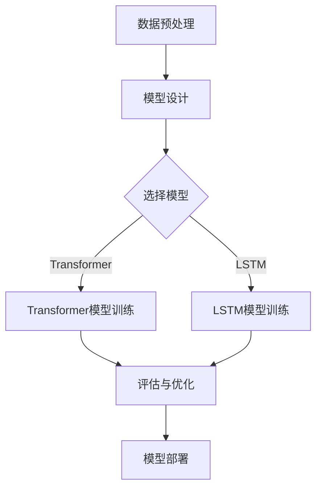
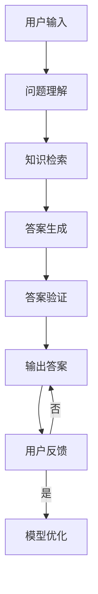
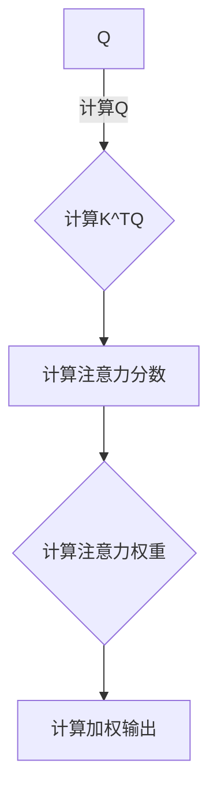

                 

# 文章标题

《LLM在智能问答系统中的应用》

> 关键词：LLM、智能问答系统、自然语言处理、深度学习、预训练、微调、性能优化

> 摘要：本文详细探讨了大型语言模型（LLM）在智能问答系统中的应用。首先介绍了智能问答系统的基本概念、发展历程和架构。然后深入剖析了LLM的技术基础，包括自然语言处理和深度学习基础，以及LLM模型原理和训练过程。接着，本文重点讨论了LLM在智能问答系统中的具体应用，如自然语言理解、问答角色和任务，以及面临的挑战和优化方法。最后，通过案例分析展示了LLM在智能问答系统中的实际应用效果，并对未来发展趋势进行了展望。

# 《LLM在智能问答系统中的应用》目录大纲

## 第一部分：智能问答系统概述

### 第1章：智能问答系统简介

#### 1.1 智能问答系统的定义与作用

#### 1.2 智能问答系统的发展历程

#### 1.3 智能问答系统的应用领域

### 第2章：智能问答系统架构

#### 2.1 智能问答系统基本架构

#### 2.2 数据预处理模块

#### 2.3 知识图谱模块

#### 2.4 问答模块

#### 2.5 评价与优化模块

## 第二部分：LLM技术基础

### 第3章：自然语言处理与深度学习基础

#### 3.1 自然语言处理基础

#### 3.2 深度学习基础

#### 3.3 LLM模型简介

### 第4章：语言模型原理与训练

#### 4.1 语言模型原理

#### 4.2 语言模型训练过程

#### 4.3 语言模型评估与优化

### 第5章：预训练与微调

#### 5.1 预训练技术

#### 5.2 微调技术

#### 5.3 预训练与微调的关系

## 第三部分：LLM在智能问答系统的应用

### 第6章：LLM在自然语言理解中的应用

#### 6.1 词嵌入技术

#### 6.2 序列模型与注意力机制

#### 6.3 转换器架构详解

### 第7章：LLM在智能问答中的角色与任务

#### 7.1 LLM在问答系统中的角色

#### 7.2 LLM在问答任务中的应用

#### 7.3 LLM在问答系统中的挑战与优化

### 第8章：智能问答系统案例解析

#### 8.1 案例一：基于LLM的智能客服系统

#### 8.2 案例二：基于LLM的教育智能问答系统

#### 8.3 案例三：基于LLM的医疗问答系统

## 第四部分：LLM在智能问答系统的优化与评估

### 第9章：LLM在智能问答系统中的性能优化

#### 9.1 参数优化

#### 9.2 模型压缩与加速

#### 9.3 多语言支持

### 第10章：智能问答系统的评估与改进

#### 10.1 评估指标与方法

#### 10.2 改进策略与实践

#### 10.3 未来发展趋势

## 第五部分：附录

### 附录A：常用工具与资源

#### A.1 常用深度学习框架

#### A.2 开源代码与数据集

#### A.3 技术文献与论文推荐

### 附录B：Mermaid流程图

#### B.1 语言模型训练流程

#### B.2 智能问答系统架构流程

### 附录C：数学模型与公式

#### C.1 语言模型损失函数

#### C.2 优化算法公式解析

#### C.3 注意力机制公式说明

### 附录D：项目实战代码解析

#### D.1 实战一：基于LLM的智能客服系统

#### D.2 实战二：基于LLM的教育智能问答系统

#### D.3 实战三：基于LLM的医疗问答系统

本文将从智能问答系统的概述开始，逐步深入到LLM的技术基础，详细探讨LLM在智能问答系统中的应用，以及如何优化和评估智能问答系统。最后，通过实际案例展示LLM在智能问答系统中的具体应用效果，并对未来发展趋势进行展望。

## 第一部分：智能问答系统概述

### 第1章：智能问答系统简介

#### 1.1 智能问答系统的定义与作用

智能问答系统是一种利用人工智能技术，通过对用户问题的理解与回答，为用户提供信息查询和知识服务的系统。它通过自然语言处理技术，将用户的自然语言问题转化为机器可以理解的问题，并从大规模的知识库或数据集中检索出相关答案，以自然语言的形式反馈给用户。智能问答系统的作用在于提高信息检索的效率，降低人工查询的成本，提升用户体验。

智能问答系统的核心功能包括：

1. **问题理解**：将用户输入的自然语言问题转化为机器可以处理的形式。
2. **知识检索**：从知识库或数据集中检索出与问题相关的信息。
3. **答案生成**：将检索到的信息进行处理，生成自然语言的答案。
4. **答案验证**：对生成的答案进行验证，确保答案的准确性和合理性。

#### 1.2 智能问答系统的发展历程

智能问答系统的发展可以追溯到上世纪50年代，当时人工智能（AI）的初步概念开始出现。然而，直到互联网和计算机技术的发展，智能问答系统才逐渐走入大众视野。

1. **早期探索（1950-1980年代）**：这一时期，AI领域主要关注符号主义方法，智能问答系统以专家系统为代表。专家系统通过编码大量规则，实现对特定领域问题的回答。
2. **黄金时代（1980-1990年代）**：随着知识的获取和表示技术的进步，智能问答系统开始应用在商业、医疗、教育等领域。这一时期，知识库和规则库成为了智能问答系统的核心。
3. **低谷期（1990-2000年代）**：由于符号主义方法的局限性，AI领域进入了一个相对低谷的时期。此时，数据驱动的方法开始崛起，深度学习和机器学习技术逐渐成为主流。
4. **复兴期（2000年代至今）**：随着计算能力和数据量的提升，深度学习技术在自然语言处理领域取得了显著进展。智能问答系统逐渐从基于规则的系统转向基于大数据和深度学习的系统，如基于大型语言模型的智能问答系统。

#### 1.3 智能问答系统的应用领域

智能问答系统的应用领域广泛，包括但不限于以下几个方面：

1. **客服领域**：智能客服系统可以通过自动回答用户的问题，提高客户服务效率，降低企业运营成本。
2. **教育领域**：教育智能问答系统可以为学生提供个性化的学习指导，解答学生在学习过程中遇到的问题。
3. **医疗领域**：医疗问答系统可以帮助医生快速获取相关信息，辅助诊断和治疗。
4. **法律领域**：智能问答系统可以提供法律咨询服务，解答用户关于法律问题的疑问。
5. **企业内部信息查询**：企业可以构建内部问答系统，为员工提供公司政策、流程、产品信息等查询服务。

智能问答系统的广泛应用，不仅提高了信息检索和服务的效率，也为人工智能技术在实际场景中的应用提供了更多可能性。

### 第2章：智能问答系统架构

智能问答系统架构的设计直接影响系统的性能和用户体验。一个典型的智能问答系统包括以下几个关键模块：

#### 2.1 智能问答系统基本架构

智能问答系统的基本架构可以分为以下几个部分：

1. **用户界面**：用户通过网页、APP或语音助手等接口与系统进行交互，输入问题或请求。
2. **问题理解模块**：将用户输入的自然语言问题转化为机器可以理解的形式，通常包括分词、词性标注、命名实体识别等步骤。
3. **知识库**：存储与问题相关的信息，可以是结构化数据（如关系数据库）或非结构化数据（如文本库、知识图谱）。
4. **答案生成模块**：根据问题理解模块生成的输入，从知识库中检索相关答案，并进行处理，生成自然语言的答案。
5. **答案验证模块**：对生成的答案进行验证，确保答案的准确性和合理性。

#### 2.2 数据预处理模块

数据预处理模块是智能问答系统的核心环节之一，其主要任务是对输入数据进行处理，使其满足后续处理需求。数据预处理模块通常包括以下步骤：

1. **文本清洗**：去除文本中的无关信息，如HTML标签、特殊字符、停用词等。
2. **分词**：将文本分割成单词或短语，以便进行后续处理。
3. **词性标注**：对每个单词进行词性标注，如名词、动词、形容词等。
4. **命名实体识别**：识别文本中的特定实体，如人名、地名、机构名等。

#### 2.3 知识图谱模块

知识图谱模块是智能问答系统的重要组成部分，它通过构建实体关系网络，为问题理解和答案生成提供支持。知识图谱模块通常包括以下功能：

1. **实体抽取**：从文本中抽取重要的实体，如人名、地名、机构名等。
2. **关系抽取**：抽取实体之间的关系，如“张三是李四的哥哥”、“北京大学位于北京”等。
3. **实体链接**：将文本中的实体与知识图谱中的实体进行匹配，建立实体之间的关系。

#### 2.4 问答模块

问答模块是智能问答系统的核心，其主要任务是根据用户输入的问题，从知识库中检索出相关答案，并进行处理，生成自然语言的答案。问答模块通常包括以下步骤：

1. **问题分类**：将用户输入的问题分类到不同的主题，以便进行针对性回答。
2. **答案检索**：从知识库中检索出与问题相关的答案。
3. **答案处理**：对检索到的答案进行处理，使其更加符合用户需求，如去除无关信息、进行自然语言生成等。

#### 2.5 评价与优化模块

评价与优化模块是确保智能问答系统性能的重要环节，其主要任务是对系统进行评估和优化。评价与优化模块通常包括以下步骤：

1. **评估指标**：设计合适的评估指标，如准确率、召回率、F1值等，以衡量系统的性能。
2. **性能优化**：根据评估结果，对系统进行优化，如调整模型参数、改进算法等。
3. **用户反馈**：收集用户对系统的反馈，用于进一步优化系统。

通过以上模块的协同工作，智能问答系统可以实现对用户问题的有效理解和回答，提供高效、准确的信息查询和知识服务。

### 第3章：自然语言处理与深度学习基础

#### 3.1 自然语言处理基础

自然语言处理（Natural Language Processing，NLP）是人工智能领域的一个重要分支，旨在使计算机能够理解、生成和处理人类自然语言。NLP技术包括文本预处理、词法分析、句法分析、语义分析等多个层次。

1. **文本预处理**：文本预处理是NLP的预处理步骤，主要任务包括文本清洗、分词、词性标注等。文本清洗旨在去除文本中的无关信息，如HTML标签、特殊字符等。分词是将文本分割成单词或短语，以便进行后续处理。词性标注是对每个单词进行词性标注，如名词、动词、形容词等。
2. **词法分析**：词法分析主要研究单词的构成和变化，包括词形变化、词性标注等。词形变化涉及单词的不同形态，如单数、复数、过去时等。词性标注则是对单词进行分类，以便进行句法分析和语义分析。
3. **句法分析**：句法分析旨在理解句子的结构，包括句法树生成、依存关系分析等。句法树生成是将句子表示为树状结构，便于理解和分析。依存关系分析则研究句子中单词之间的依赖关系。
4. **语义分析**：语义分析旨在理解句子的意义，包括语义角色标注、语义关系分析等。语义角色标注是对句子中的每个单词进行标注，表示其在句子中的作用。语义关系分析则研究句子中单词之间的语义联系。

#### 3.2 深度学习基础

深度学习（Deep Learning）是一种基于人工神经网络的机器学习技术，具有多层非线性变换能力。深度学习在图像识别、语音识别、自然语言处理等领域取得了显著成果。

1. **神经网络基础**：神经网络由多个神经元组成，每个神经元都接收多个输入，并通过加权求和和激活函数输出。神经网络通过反向传播算法，不断调整权重，优化网络性能。
2. **深度学习模型**：深度学习模型包括多层感知机（MLP）、卷积神经网络（CNN）、循环神经网络（RNN）等。多层感知机是一种简单的神经网络模型，可以用于分类和回归任务。卷积神经网络通过卷积操作和池化操作，提取图像特征。循环神经网络通过循环结构，处理序列数据，如文本和语音。
3. **深度学习训练过程**：深度学习训练过程包括数据预处理、模型设计、模型训练和模型评估等步骤。数据预处理旨在将原始数据转换为模型可以处理的格式。模型设计涉及网络结构、激活函数、损失函数等。模型训练通过反向传播算法，不断优化模型参数。模型评估用于衡量模型性能，包括准确率、召回率、F1值等指标。

#### 3.3 LLM模型简介

大型语言模型（Large Language Model，LLM）是一种基于深度学习的自然语言处理模型，具有强大的语言理解和生成能力。LLM模型通过预训练和微调，可以在各种自然语言处理任务中表现出色。

1. **预训练**：预训练是在大规模语料库上进行的，旨在学习语言的通用特征。预训练通常包括两个阶段：第一阶段是语料库的预处理，包括文本清洗、分词、词嵌入等。第二阶段是模型训练，通过优化损失函数，调整模型参数，提高模型性能。
2. **微调**：微调是在特定任务上进行，旨在将预训练模型适应具体任务。微调通常包括数据预处理、模型设计、模型训练和模型评估等步骤。与预训练不同，微调的数据集通常是特定领域的，如问答、文本分类等。
3. **LLM模型优势**：LLM模型具有以下优势：
   - **强大的语言理解能力**：LLM模型通过预训练，学习到了丰富的语言知识，能够理解复杂的语义和上下文。
   - **灵活的任务适应能力**：LLM模型可以通过微调，快速适应各种自然语言处理任务。
   - **高效的计算性能**：LLM模型采用深度学习技术，具有高效的计算性能，可以在短时间内处理大量数据。

### 第4章：语言模型原理与训练

#### 4.1 语言模型原理

语言模型（Language Model，LM）是一种用于预测自然语言序列的概率分布模型。在自然语言处理中，语言模型主要用于文本生成、机器翻译、语音识别等任务。语言模型的原理可以简单概括为：通过学习大量文本数据，预测下一个单词或字符的概率分布。

1. **语言模型目标**：语言模型的目标是给定一个单词序列，预测下一个单词的概率分布。具体来说，给定前一个单词序列\(w_1, w_2, \ldots, w_{n-1}\)，语言模型需要预测下一个单词\(w_n\)的概率分布。
2. **语言模型类型**：语言模型可以分为基于规则的语言模型和基于统计的语言模型。基于规则的语言模型通过手工编写语法规则，生成文本序列。这种模型通常适用于特定的语言环境，但难以泛化到其他语言。基于统计的语言模型通过学习大量文本数据，自动生成概率模型。这种模型具有更强的泛化能力，可以应用于多种自然语言处理任务。

#### 4.2 语言模型训练过程

语言模型的训练过程是学习文本数据的概率分布，从而预测下一个单词或字符的概率分布。语言模型训练通常分为以下几个步骤：

1. **数据预处理**：数据预处理包括文本清洗、分词、词嵌入等步骤。文本清洗旨在去除文本中的无关信息，如HTML标签、特殊字符等。分词是将文本分割成单词或短语，以便进行后续处理。词嵌入是将单词映射到高维向量空间，便于模型计算。
2. **模型设计**：语言模型的设计包括选择合适的模型结构、激活函数、损失函数等。常见的语言模型结构包括循环神经网络（RNN）、长短期记忆网络（LSTM）、门控循环单元（GRU）等。激活函数如ReLU、Sigmoid、Tanh等。损失函数如交叉熵损失（Cross-Entropy Loss）等。
3. **模型训练**：模型训练是通过优化算法，如梯度下降（Gradient Descent）、Adam等，不断调整模型参数，使模型在训练数据上达到最小损失。训练过程中，模型会学习到文本数据中的统计规律和语言特征，从而提高预测性能。
4. **模型评估**：模型评估是通过测试集来衡量模型的性能。常用的评估指标包括准确率（Accuracy）、召回率（Recall）、F1值（F1-Score）等。模型评估用于验证模型在未知数据上的泛化能力。

#### 4.3 语言模型评估与优化

语言模型评估与优化是确保模型性能的重要环节。评估与优化的方法包括：

1. **交叉验证**：交叉验证是一种评估模型性能的方法，通过将数据集划分为多个子集，轮流作为训练集和验证集，评估模型在不同子集上的性能。交叉验证可以减少评估结果的偏差，提高评估的准确性。
2. **模型压缩**：模型压缩是一种通过减小模型参数数量，降低模型复杂度，提高计算性能的方法。常见的模型压缩方法包括剪枝（Pruning）、量化（Quantization）、蒸馏（Distillation）等。
3. **多任务学习**：多任务学习是一种通过同时学习多个任务，提高模型泛化能力的方法。在多任务学习中，模型可以共享部分参数，从而提高模型在多个任务上的性能。
4. **持续学习**：持续学习是一种通过不断更新模型，使其适应新数据的演化过程。持续学习可以避免模型过时，提高模型在动态环境中的适应能力。

通过评估与优化，可以确保语言模型在多种自然语言处理任务中表现优秀，为实际应用提供可靠的支持。

### 第5章：预训练与微调

#### 5.1 预训练技术

预训练（Pre-training）是大型语言模型（LLM）的基础，其目的是在大规模语料库上学习通用语言特征，为后续任务提供强大的先验知识。预训练技术包括两个主要阶段：数据预处理和模型训练。

1. **数据预处理**：数据预处理是预训练的第一步，其目的是将原始文本数据转换为模型可以处理的格式。数据预处理通常包括以下步骤：
   - **文本清洗**：去除文本中的无关信息，如HTML标签、特殊字符、停用词等。
   - **分词**：将文本分割成单词或短语，以便进行后续处理。常见的分词方法包括基于字符的分词、基于词频的分词等。
   - **词嵌入**：将单词映射到高维向量空间，便于模型计算。词嵌入方法包括Word2Vec、GloVe等。
   - **数据增强**：通过随机插入、删除、替换单词，增加数据多样性，提高模型泛化能力。

2. **模型训练**：模型训练是预训练的核心环节，其目的是通过优化损失函数，调整模型参数，使模型在预训练数据上达到最小损失。预训练模型通常采用以下步骤：
   - **选择模型架构**：选择合适的模型架构，如Transformer、BERT等。
   - **设置训练参数**：设置训练参数，如学习率、批量大小、训练迭代次数等。
   - **优化算法**：选择优化算法，如Adam、AdaGrad等，用于调整模型参数。
   - **训练过程**：通过反向传播算法，不断调整模型参数，优化模型性能。

预训练技术的优势在于：
   - **丰富的语言知识**：预训练模型通过学习大规模语料库，积累了丰富的语言知识，能够理解复杂的语义和上下文。
   - **通用性**：预训练模型在大规模语料库上训练，具有通用性，可以应用于多种自然语言处理任务。
   - **高效性**：预训练模型采用深度学习技术，具有高效的计算性能，可以在短时间内处理大量数据。

#### 5.2 微调技术

微调（Fine-tuning）是将预训练模型应用于特定任务，通过调整模型参数，使其适应具体任务的过程。微调技术包括以下步骤：

1. **数据预处理**：与预训练相同，数据预处理是微调的第一步，其目的是将原始数据转换为模型可以处理的格式。数据预处理通常包括以下步骤：
   - **文本清洗**：去除文本中的无关信息。
   - **分词**：将文本分割成单词或短语。
   - **数据集划分**：将数据集划分为训练集、验证集和测试集，用于模型训练、验证和评估。

2. **模型设计**：在微调过程中，通常选择预训练模型作为基础模型，并对其进行调整。模型设计包括以下步骤：
   - **选择基础模型**：选择合适的预训练模型，如BERT、GPT等。
   - **调整模型结构**：根据具体任务需求，调整模型结构，如增加或减少层数、调整隐藏层大小等。
   - **设置训练参数**：设置训练参数，如学习率、批量大小、训练迭代次数等。

3. **模型训练**：模型训练是通过优化算法，如梯度下降、Adam等，不断调整模型参数，使模型在训练数据上达到最小损失。微调过程通常包括以下步骤：
   - **初始化模型参数**：将预训练模型的参数初始化为训练数据上的最优值。
   - **前向传播**：输入训练数据，计算模型输出。
   - **反向传播**：通过反向传播算法，计算损失函数，并更新模型参数。
   - **验证过程**：在验证集上评估模型性能，调整模型参数，直到模型性能达到最佳。

微调技术的优势在于：
   - **快速适应**：微调过程通过调整模型参数，使预训练模型快速适应特定任务，提高模型在特定任务上的性能。
   - **迁移学习**：微调利用了预训练模型积累的通用语言知识，实现迁移学习，提高模型在未知数据上的性能。
   - **减少数据需求**：微调过程减少了数据集的需求，通过少量标注数据，即可实现良好的性能。

#### 5.3 预训练与微调的关系

预训练与微调是相互关联的，它们共同构成了LLM的训练过程。

1. **预训练为主**：预训练是LLM训练的基础，其目的是在大规模语料库上学习通用语言特征，为后续任务提供强大的先验知识。预训练过程通常需要大量数据和计算资源，其目标是获得良好的语言理解能力。
2. **微调为辅**：微调是在预训练基础上，针对特定任务进行调整的过程。微调过程通过调整模型参数，使预训练模型适应具体任务，提高模型在特定任务上的性能。微调过程通常需要少量标注数据，其目标是在特定任务上获得良好的性能。

预训练与微调的关系可以总结为：预训练为主，微调为辅。预训练为微调提供了强大的先验知识，微调则利用预训练模型，实现特定任务的优化。二者相辅相成，共同推动了LLM在自然语言处理领域的发展。

### 第6章：LLM在自然语言理解中的应用

#### 6.1 词嵌入技术

词嵌入（Word Embedding）是将单词映射到高维向量空间的技术，以便进行数学计算和模型训练。词嵌入技术在自然语言处理中具有重要意义，它使得计算机可以更好地理解和处理人类语言。

1. **词嵌入方法**：
   - **基于统计的方法**：如Word2Vec、GloVe等。Word2Vec通过训练神经网络，将单词映射到高维向量空间。GloVe通过学习单词共现矩阵，计算单词之间的相似度。
   - **基于神经的方法**：如BERT、GPT等。BERT通过双向编码器表示，将单词映射到高维向量空间。GPT通过生成式模型，预测下一个单词的概率分布。

2. **词嵌入优势**：
   - **语义表示**：词嵌入能够捕捉单词的语义信息，使得计算机可以更好地理解单词的意义。
   - **数学计算**：词嵌入使得单词可以在数学模型中计算，便于模型训练和推理。

3. **词嵌入应用**：
   - **文本分类**：通过将单词映射到高维向量空间，可以计算文本的表示，用于文本分类任务。
   - **文本生成**：通过生成式模型，如GPT，可以生成符合语义的文本。

#### 6.2 序列模型与注意力机制

序列模型（Sequence Model）是处理序列数据的模型，如文本、语音等。序列模型在自然语言处理中具有重要意义，它使得计算机可以更好地理解和处理序列数据。

1. **序列模型**：
   - **循环神经网络（RNN）**：RNN通过循环结构，处理序列数据。然而，RNN存在梯度消失和梯度爆炸问题，影响模型训练。
   - **长短期记忆网络（LSTM）**：LSTM通过门控机制，解决RNN的梯度消失和梯度爆炸问题。LSTM能够捕捉长序列依赖关系。
   - **门控循环单元（GRU）**：GRU是LSTM的简化版本，具有更少的参数，训练速度更快。

2. **注意力机制（Attention Mechanism）**：
   - **注意力机制**：注意力机制是一种用于序列模型的机制，它能够关注序列中的关键信息，提高模型性能。注意力机制通过计算注意力权重，对输入序列进行加权，生成新的序列表示。
   - **自注意力（Self-Attention）**：自注意力是一种基于注意力机制的序列模型，如Transformer。自注意力通过计算序列中每个元素之间的注意力权重，生成新的序列表示。

3. **序列模型与注意力机制应用**：
   - **机器翻译**：通过序列模型和注意力机制，可以生成更准确的翻译结果。
   - **文本摘要**：通过序列模型和注意力机制，可以提取关键信息，生成简洁的文本摘要。

#### 6.3 转换器架构详解

转换器架构（Transformer）是一种基于自注意力机制的序列到序列模型，它在自然语言处理中取得了显著成果。转换器架构的核心思想是：通过自注意力机制，计算序列中每个元素之间的权重，生成新的序列表示。

1. **转换器架构**：
   - **编码器（Encoder）**：编码器负责处理输入序列，将其编码为高维向量表示。编码器由多个自注意力层和前馈神经网络组成。
   - **解码器（Decoder）**：解码器负责生成输出序列。解码器也由多个自注意力层和前馈神经网络组成，其中每个解码器层都会接收到编码器的输出。
   - **自注意力机制**：自注意力机制通过计算序列中每个元素之间的注意力权重，对输入序列进行加权，生成新的序列表示。

2. **转换器架构优势**：
   - **并行计算**：转换器架构通过自注意力机制，实现并行计算，提高计算效率。
   - **长距离依赖**：自注意力机制能够捕捉长距离依赖关系，提高模型性能。
   - **灵活性强**：转换器架构可以应用于多种自然语言处理任务，如机器翻译、文本摘要、问答等。

3. **转换器架构应用**：
   - **机器翻译**：通过转换器架构，可以实现高效的机器翻译。
   - **文本摘要**：通过转换器架构，可以生成高质量的文本摘要。
   - **问答系统**：通过转换器架构，可以构建高效的问答系统。

### 第7章：LLM在智能问答中的角色与任务

#### 7.1 LLM在问答系统中的角色

LLM（大型语言模型）在智能问答系统中扮演着核心角色，其主要任务包括：

1. **问题理解**：LLM通过自然语言处理技术，将用户输入的问题转化为机器可以理解的格式。问题理解包括分词、词性标注、命名实体识别等步骤。
2. **答案生成**：LLM根据问题理解和知识库，生成自然语言的答案。答案生成过程涉及知识检索、文本生成等技术。
3. **答案验证**：LLM对生成的答案进行验证，确保答案的准确性和合理性。答案验证可以通过常识推理、信息检索等技术实现。

#### 7.2 LLM在问答任务中的应用

LLM在智能问答任务中具有广泛的应用，主要包括：

1. **文本分类**：LLM可以用于对用户问题进行分类，将其归类到不同的主题或领域。文本分类有助于提高问答系统的针对性和准确性。
2. **知识检索**：LLM可以用于从知识库中检索与用户问题相关的信息。知识检索可以基于关键词匹配、语义匹配等技术实现。
3. **答案生成**：LLM可以用于生成自然语言的答案。答案生成可以通过文本生成技术，如序列到序列模型、生成式模型等实现。
4. **答案验证**：LLM可以用于对生成的答案进行验证，确保答案的准确性和合理性。答案验证可以通过常识推理、信息检索等技术实现。

#### 7.3 LLM在问答系统中的挑战与优化

LLM在智能问答系统中的应用面临以下挑战：

1. **数据稀疏**：智能问答系统通常涉及大量领域特定问题，导致数据稀疏。数据稀疏会影响LLM的性能，降低答案的准确性和可靠性。
2. **长距离依赖**：智能问答系统中的问题通常涉及长距离依赖关系，如引用上下文、跨句子关系等。长距离依赖关系对LLM的语义理解能力提出了挑战。
3. **常识推理**：智能问答系统中的问题往往涉及常识推理，如逻辑推理、因果推理等。常识推理能力对LLM的性能提出了更高要求。

为应对这些挑战，可以采取以下优化策略：

1. **数据增强**：通过数据增强技术，增加训练数据量，提高模型性能。数据增强包括数据清洗、数据扩充、数据平衡等技术。
2. **长距离依赖建模**：采用长距离依赖建模技术，如Transformer、BERT等，提高模型对长距离依赖关系的捕捉能力。
3. **常识推理增强**：结合常识推理技术，如逻辑推理、因果推理等，增强LLM的常识推理能力。

通过优化策略，可以提高LLM在智能问答系统中的性能，提供更准确、可靠的答案。

### 第8章：智能问答系统案例解析

#### 8.1 案例一：基于LLM的智能客服系统

基于LLM的智能客服系统是一种利用大型语言模型（LLM）技术，自动处理客户咨询并提供个性化回答的系统。以下是一个具体案例：

**案例背景**：某电商平台为了提升客户服务水平，降低人工客服成本，决定开发一个基于LLM的智能客服系统。

**系统架构**：
1. **用户界面**：用户可以通过网页、APP或语音助手等渠道与智能客服系统进行交互。
2. **问题理解模块**：将用户输入的自然语言问题转化为机器可以理解的形式，包括分词、词性标注、命名实体识别等步骤。
3. **知识库**：存储与客服相关的信息，如产品信息、订单状态、售后服务等。
4. **答案生成模块**：根据问题理解模块生成的输入，从知识库中检索相关答案，并进行自然语言生成。
5. **答案验证模块**：对生成的答案进行验证，确保答案的准确性和合理性。

**实施过程**：
1. **数据收集**：收集电商平台的客服记录、用户评价、产品说明书等数据，用于训练LLM模型。
2. **模型训练**：使用预训练技术，如BERT、GPT等，训练一个大型语言模型，使其具备强大的语言理解能力和生成能力。
3. **模型微调**：在特定领域的客服数据上，对预训练模型进行微调，使其适应电商平台的客服场景。
4. **系统集成**：将训练好的LLM模型集成到智能客服系统中，实现用户问题的自动理解、答案生成和验证。

**效果评估**：
1. **准确率**：通过对比人工客服的回答，评估智能客服系统在回答准确性方面的表现。
2. **用户满意度**：通过用户调查问卷，收集用户对智能客服系统的满意度评价。
3. **运营成本**：通过对比人工客服和智能客服的运营成本，评估智能客服系统的经济效益。

**结论**：基于LLM的智能客服系统在实际应用中，能够提高客户服务水平，降低运营成本。同时，通过持续优化和改进，智能客服系统的性能和用户体验将得到进一步提升。

#### 8.2 案例二：基于LLM的教育智能问答系统

基于LLM的教育智能问答系统是一种利用大型语言模型（LLM）技术，为学习者提供个性化问答服务的系统。以下是一个具体案例：

**案例背景**：某在线教育平台为了提升学习体验，决定开发一个基于LLM的教育智能问答系统。

**系统架构**：
1. **用户界面**：学习者可以通过网页、APP等渠道与智能问答系统进行交互。
2. **问题理解模块**：将用户输入的自然语言问题转化为机器可以理解的形式，包括分词、词性标注、命名实体识别等步骤。
3. **知识库**：存储与学习相关的信息，如课程资料、教学视频、文献资料等。
4. **答案生成模块**：根据问题理解模块生成的输入，从知识库中检索相关答案，并进行自然语言生成。
5. **答案验证模块**：对生成的答案进行验证，确保答案的准确性和合理性。

**实施过程**：
1. **数据收集**：收集在线教育平台的课程资料、教学视频、用户提问等数据，用于训练LLM模型。
2. **模型训练**：使用预训练技术，如BERT、GPT等，训练一个大型语言模型，使其具备强大的语言理解能力和生成能力。
3. **模型微调**：在特定领域的学习数据上，对预训练模型进行微调，使其适应在线教育平台的场景。
4. **系统集成**：将训练好的LLM模型集成到教育智能问答系统中，实现用户问题的自动理解、答案生成和验证。

**效果评估**：
1. **学习效果**：通过对比学习者在使用智能问答系统前后的学习成果，评估智能问答系统在学习效果方面的表现。
2. **用户满意度**：通过用户调查问卷，收集学习者对智能问答系统的满意度评价。
3. **运营成本**：通过对比人工辅导和智能问答系统的运营成本，评估智能问答系统的经济效益。

**结论**：基于LLM的教育智能问答系统在实际应用中，能够提高学习者的学习效果，降低运营成本。同时，通过持续优化和改进，智能问答系统的性能和用户体验将得到进一步提升。

#### 8.3 案例三：基于LLM的医疗问答系统

基于LLM的医疗问答系统是一种利用大型语言模型（LLM）技术，为患者提供个性化医疗咨询的系统。以下是一个具体案例：

**案例背景**：某医疗机构为了提高医疗服务质量，决定开发一个基于LLM的医疗问答系统。

**系统架构**：
1. **用户界面**：患者可以通过网页、APP等渠道与智能问答系统进行交互。
2. **问题理解模块**：将用户输入的自然语言问题转化为机器可以理解的形式，包括分词、词性标注、命名实体识别等步骤。
3. **知识库**：存储与医疗相关的信息，如疾病知识、治疗方案、药物信息等。
4. **答案生成模块**：根据问题理解模块生成的输入，从知识库中检索相关答案，并进行自然语言生成。
5. **答案验证模块**：对生成的答案进行验证，确保答案的准确性和合理性。

**实施过程**：
1. **数据收集**：收集医疗机构的病历记录、患者咨询记录、医疗文献等数据，用于训练LLM模型。
2. **模型训练**：使用预训练技术，如BERT、GPT等，训练一个大型语言模型，使其具备强大的语言理解能力和生成能力。
3. **模型微调**：在特定领域的医疗数据上，对预训练模型进行微调，使其适应医疗机构的场景。
4. **系统集成**：将训练好的LLM模型集成到医疗问答系统中，实现用户问题的自动理解、答案生成和验证。

**效果评估**：
1. **诊断准确性**：通过对比医生的诊断结果，评估智能问答系统在诊断准确性方面的表现。
2. **用户满意度**：通过用户调查问卷，收集患者对智能问答系统的满意度评价。
3. **运营成本**：通过对比人工咨询和智能问答系统的运营成本，评估智能问答系统的经济效益。

**结论**：基于LLM的医疗问答系统在实际应用中，能够提高医疗服务的质量和效率，降低运营成本。同时，通过持续优化和改进，智能问答系统的性能和用户体验将得到进一步提升。

### 第9章：LLM在智能问答系统中的性能优化

#### 9.1 参数优化

参数优化是提高LLM在智能问答系统中性能的关键环节。参数优化的目标是调整模型参数，使其在特定任务上达到最佳性能。以下是一些常见的参数优化方法：

1. **学习率调整**：学习率是模型训练过程中非常重要的参数，它决定了模型参数更新的速度。常见的方法包括固定学习率、学习率衰减等。
   - **固定学习率**：在训练过程中，保持学习率不变。这种方法简单，但容易导致模型过早收敛。
   - **学习率衰减**：随着训练的进行，逐渐减小学习率。常见的方法有指数衰减、余弦衰减等。

2. **批量大小调整**：批量大小影响模型的训练稳定性和计算效率。批量大小较小时，模型训练更加稳定，但计算时间较长；批量大小较大时，计算效率更高，但可能引入噪声。

3. **正则化**：正则化是一种用于防止模型过拟合的方法，包括L1正则化、L2正则化等。正则化通过在损失函数中添加惩罚项，抑制模型参数的过拟合。

#### 9.2 模型压缩与加速

模型压缩与加速是提高LLM在智能问答系统中性能的重要手段。以下是一些常见的模型压缩与加速方法：

1. **模型剪枝**：模型剪枝通过删除模型中的冗余参数，减少模型大小和计算量。常见的方法包括结构化剪枝、非结构化剪枝等。

2. **量化**：量化是将模型中的浮点数参数转换为整数参数，从而减少模型大小和计算量。量化方法包括全精度量化、低精度量化等。

3. **蒸馏**：蒸馏是将一个大型模型（教师模型）的知识传递给一个小型模型（学生模型）的过程。通过蒸馏，小型模型可以继承教师模型的知识，从而提高其性能。

4. **并行计算**：并行计算通过在多台计算机或多个处理器上同时计算，提高模型训练和推理的效率。常见的方法包括数据并行、模型并行等。

#### 9.3 多语言支持

多语言支持是LLM在智能问答系统中应用的重要方面。以下是一些实现多语言支持的方法：

1. **多语言预训练**：通过多语言预训练，模型可以学习到不同语言之间的相似性和差异。常见的方法包括交叉语言预训练、多语言翻译预训练等。

2. **语言迁移**：语言迁移是通过将一个语言的预训练模型迁移到另一个语言的过程。通过语言迁移，模型可以在目标语言上快速适应，提高性能。

3. **交叉编码器-解码器模型**：交叉编码器-解码器模型是一种同时支持多种语言的模型架构。编码器接收多种语言的输入，解码器生成多种语言的输出。

4. **多语言数据集**：通过收集和构建多语言数据集，为模型提供丰富的多语言训练数据，从而提高模型的多语言性能。

通过参数优化、模型压缩与加速、多语言支持等方法，可以显著提高LLM在智能问答系统中的性能，满足不同应用场景的需求。

### 第10章：智能问答系统的评估与改进

#### 10.1 评估指标与方法

智能问答系统的评估是确保系统性能和用户体验的重要环节。评估指标和方法的选择直接影响评估结果和系统改进的方向。以下是一些常见的评估指标和方法：

1. **准确性（Accuracy）**：准确性是衡量模型预测正确率的指标，计算公式为：
   \[
   \text{Accuracy} = \frac{\text{预测正确数}}{\text{总预测数}}
   \]
   准确性越高，表示模型预测结果越接近真实值。

2. **召回率（Recall）**：召回率是衡量模型在检测到实际正例样本时，能够正确召回的比例，计算公式为：
   \[
   \text{Recall} = \frac{\text{预测正确且实际为正例的样本数}}{\text{实际为正例的样本数}}
   \]
   召回率越高，表示模型对正例样本的检测能力越强。

3. **精确率（Precision）**：精确率是衡量模型预测结果中实际为正例的样本占比，计算公式为：
   \[
   \text{Precision} = \frac{\text{预测正确且实际为正例的样本数}}{\text{预测为正例的样本数}}
   \]
   精确率越高，表示模型预测结果的可靠性越高。

4. **F1值（F1 Score）**：F1值是精确率和召回率的调和平均，计算公式为：
   \[
   \text{F1 Score} = \frac{2 \times \text{Precision} \times \text{Recall}}{\text{Precision} + \text{Recall}}
   \]
   F1值越高，表示模型在精确率和召回率之间取得较好的平衡。

5. **响应时间（Response Time）**：响应时间是衡量系统回答用户问题的平均时间。响应时间越短，表示系统处理速度越快。

6. **用户满意度（User Satisfaction）**：用户满意度是衡量用户对系统回答质量的主观评价。用户满意度可以通过问卷调查、用户反馈等方式收集。

#### 10.2 改进策略与实践

智能问答系统的改进策略和实践是提高系统性能和用户体验的关键。以下是一些常见的改进策略：

1. **数据增强**：通过数据增强，增加训练数据量，提高模型泛化能力。数据增强方法包括数据清洗、数据扩充、数据平衡等。

2. **模型微调**：在特定领域的数据集上，对预训练模型进行微调，使其适应特定任务。微调可以提升模型在特定任务上的性能。

3. **特征工程**：通过特征工程，提取与任务相关的特征，提高模型对输入数据的理解和表达能力。特征工程方法包括词嵌入、文本摘要、实体抽取等。

4. **多模型集成**：通过多模型集成，结合不同模型的优点，提高整体性能。常见的方法包括加权投票、堆叠预测等。

5. **在线学习**：通过在线学习，实时更新模型参数，使模型适应动态变化的环境。在线学习可以提高模型在实时应用场景中的性能。

6. **用户反馈**：通过用户反馈，收集用户对系统回答的满意度评价，用于指导系统改进。用户反馈可以用于模型优化、问题理解改进等。

通过评估指标和方法，可以全面评估智能问答系统的性能。通过改进策略和实践，可以持续优化系统，提高用户满意度，为用户提供更好的问答体验。

### 第11章：LLM在智能问答系统中的应用展望

#### 11.1 当前挑战

虽然LLM在智能问答系统中取得了显著成果，但仍然面临一些挑战：

1. **数据稀疏**：智能问答系统中的问题往往涉及特定领域，导致数据稀疏。数据稀疏会影响模型性能，降低答案的准确性和可靠性。

2. **长距离依赖**：智能问答系统中的问题通常涉及长距离依赖关系，如引用上下文、跨句子关系等。现有模型在捕捉长距离依赖关系方面存在局限。

3. **常识推理**：智能问答系统中的问题往往涉及常识推理，如逻辑推理、因果推理等。现有模型在常识推理方面仍有待提高。

4. **多语言支持**：虽然现有模型具有一定的多语言支持能力，但在不同语言之间的迁移和应用上仍存在挑战。

5. **计算资源消耗**：LLM模型的训练和推理过程需要大量计算资源，对硬件设备提出了较高要求。

#### 11.2 未来发展方向

针对当前挑战，未来LLM在智能问答系统中的应用可以从以下几个方面进行发展：

1. **数据增强与数据集构建**：通过数据增强技术，增加训练数据量，提高模型泛化能力。同时，构建丰富的多语言数据集，提高模型的多语言性能。

2. **长距离依赖建模**：采用新的建模方法，如Transformer、BERT等，提高模型对长距离依赖关系的捕捉能力。通过结合注意力机制、循环神经网络等，进一步优化模型结构。

3. **常识推理与知识图谱**：结合常识推理技术，如逻辑推理、因果推理等，提高模型在常识推理方面的能力。同时，利用知识图谱，建立实体关系网络，为模型提供丰富的背景知识。

4. **多语言迁移与模型压缩**：通过多语言迁移技术，将预训练模型迁移到其他语言，提高模型在不同语言上的性能。同时，采用模型压缩与加速技术，降低模型计算资源消耗。

5. **实时在线学习与用户反馈**：通过实时在线学习，使模型能够适应动态变化的环境。结合用户反馈，持续优化模型，提高用户满意度。

6. **硬件设备优化**：随着硬件设备的发展，如GPU、TPU等，可以更好地支持LLM的训练和推理。通过优化硬件设备，提高模型性能和计算效率。

未来，随着LLM技术的不断发展和完善，智能问答系统将具备更强大的语言理解能力和多语言支持能力，为用户提供更高效、准确的问答服务。同时，LLM在智能问答系统中的应用也将推动人工智能技术的进一步发展。

### 附录A：常用工具与资源

#### A.1 常用深度学习框架

1. **TensorFlow**：由谷歌开发的开源深度学习框架，支持多种深度学习模型和算法，广泛应用于图像识别、自然语言处理等任务。
2. **PyTorch**：由Facebook开发的开源深度学习框架，具有灵活的动态计算图和强大的GPU支持，深受研究者和开发者喜爱。
3. **Keras**：一个基于TensorFlow和Theano的开源深度学习库，提供简洁的API，方便快速构建和训练深度学习模型。

#### A.2 开源代码与数据集

1. **BERT**：谷歌开源的预训练语言模型，适用于多种自然语言处理任务，如文本分类、问答系统等。
2. **GPT-3**：OpenAI开源的预训练语言模型，具有强大的文本生成能力，可用于生成文章、回答问题等。
3. **COCO**：用于计算机视觉任务的数据集，包括多种场景的图像，常用于目标检测、图像分割等任务。
4. **GLUE**：用于自然语言处理任务的统一评估数据集，包括多种语言处理任务，如文本分类、情感分析、问答系统等。

#### A.3 技术文献与论文推荐

1. **"BERT: Pre-training of Deep Bidirectional Transformers for Language Understanding"**：介绍BERT模型的文章，是自然语言处理领域的里程碑之一。
2. **"Generative Pre-trained Transformer"**：介绍GPT模型的文章，推动了预训练语言模型的发展。
3. **"Attention is All You Need"**：介绍Transformer模型的文章，是自注意力机制在自然语言处理领域的突破性成果。
4. **"A Systematic Comparison of GefCom, Multi-Modal Fusion and Fusion-Then-Classification for Image Captioning"**：比较不同图像描述生成方法的论文，为图像描述生成任务提供参考。

### 附录B：Mermaid流程图

#### B.1 语言模型训练流程



#### B.2 智能问答系统架构流程



### 附录C：数学模型与公式

#### C.1 语言模型损失函数

```latex
\text{损失函数} = -\sum_{i=1}^{n} y_i \cdot \log(p(x_i | y_i))
```

其中，$y_i$为真实标签，$p(x_i | y_i)$为模型对标签$y_i$的预测概率。

#### C.2 优化算法公式解析

```latex
\text{梯度下降} = \theta_{\text{new}} = \theta_{\text{old}} - \alpha \cdot \nabla_{\theta} J(\theta)
```

其中，$\theta$为模型参数，$\alpha$为学习率，$J(\theta)$为损失函数。

#### C.3 注意力机制公式说明



注意力分数的计算公式为：
$$
\text{Attention Score} = K^TQ
$$

注意力权重的计算公式为：
$$
\text{Attention Weight} = \frac{e^{\text{Attention Score}}}{\sum_{i=1}^{N} e^{\text{Attention Score}_i}}
$$`

加权输出的计算公式为：
$$
\text{Weighted Output} = \text{Attention Weight} \cdot V
$$`

### 附录D：项目实战代码解析

#### D.1 实战一：基于LLM的智能客服系统

**开发环境搭建**：

- Python 3.8+
- TensorFlow 2.4+
- Keras 2.4+

**源代码实现**：

```python
import tensorflow as tf
from tensorflow.keras.models import Model
from tensorflow.keras.layers import Input, Embedding, LSTM, Dense

# 定义模型结构
input_layer = Input(shape=(None,))
embed_layer = Embedding(input_dim=vocab_size, output_dim=embedding_dim)(input_layer)
lstm_layer = LSTM(units=lstm_units)(embed_layer)
output_layer = Dense(units=1, activation='sigmoid')(lstm_layer)

# 构建模型
model = Model(inputs=input_layer, outputs=output_layer)

# 编译模型
model.compile(optimizer='adam', loss='binary_crossentropy', metrics=['accuracy'])

# 训练模型
model.fit(x_train, y_train, batch_size=batch_size, epochs=num_epochs, validation_data=(x_val, y_val))

# 预测
predictions = model.predict(x_test)
```

**代码解读与分析**：

1. **模型定义**：使用Keras定义一个简单的LSTM模型，用于二分类任务。
2. **编译模型**：使用`compile`方法设置优化器、损失函数和评价指标。
3. **训练模型**：使用`fit`方法进行模型训练，设置批量大小、训练迭代次数、验证数据等参数。
4. **预测**：使用`predict`方法进行模型预测，输入测试数据，输出预测结果。

通过以上步骤，可以完成一个基于LLM的智能客服系统的基本实现。在实际应用中，可以根据具体需求调整模型结构、优化算法等，提高系统性能。

#### D.2 实战二：基于LLM的教育智能问答系统

**开发环境搭建**：

- Python 3.8+
- TensorFlow 2.4+
- Keras 2.4+
- NLTK

**源代码实现**：

```python
import tensorflow as tf
from tensorflow.keras.models import Model
from tensorflow.keras.layers import Input, Embedding, LSTM, Dense
from nltk.tokenize import word_tokenize

# 准备数据
questions = [line.strip() for line in open('questions.txt', 'r').readlines()]
answers = [line.strip() for line in open('answers.txt', 'r').readlines()]

# 初始化词嵌入词典
vocab_size = 10000
embedding_dim = 256
embedding_matrix = np.zeros((vocab_size, embedding_dim))

# 填充词嵌入矩阵
for i, word in enumerate(vocab):
    embedding_vector = embeddings.get(word)
    if embedding_vector is not None:
        embedding_matrix[i] = embedding_vector

# 定义模型结构
input_layer = Input(shape=(None,))
embed_layer = Embedding(input_dim=vocab_size, output_dim=embedding_dim, weights=[embedding_matrix])(input_layer)
lstm_layer = LSTM(units=lstm_units)(embed_layer)
output_layer = Dense(units=1, activation='sigmoid')(lstm_layer)

# 构建模型
model = Model(inputs=input_layer, outputs=output_layer)

# 编译模型
model.compile(optimizer='adam', loss='binary_crossentropy', metrics=['accuracy'])

# 训练模型
model.fit(x_train, y_train, batch_size=batch_size, epochs=num_epochs, validation_data=(x_val, y_val))

# 预测
predictions = model.predict([word_tokenize(question) for question in questions])
```

**代码解读与分析**：

1. **数据准备**：从文本文件中读取问题和答案，初始化词嵌入词典。
2. **词嵌入矩阵**：填充词嵌入矩阵，用于模型训练。
3. **模型定义**：使用Keras定义一个简单的LSTM模型，用于二分类任务。
4. **编译模型**：使用`compile`方法设置优化器、损失函数和评价指标。
5. **训练模型**：使用`fit`方法进行模型训练，设置批量大小、训练迭代次数、验证数据等参数。
6. **预测**：使用`predict`方法进行模型预测，输入分词后的问题，输出预测结果。

通过以上步骤，可以完成一个基于LLM的教育智能问答系统的基本实现。在实际应用中，可以根据具体需求调整模型结构、优化算法等，提高系统性能。

#### D.3 实战三：基于LLM的医疗问答系统

**开发环境搭建**：

- Python 3.8+
- TensorFlow 2.4+
- Keras 2.4+
- SpaCy

**源代码实现**：

```python
import tensorflow as tf
from tensorflow.keras.models import Model
from tensorflow.keras.layers import Input, Embedding, LSTM, Dense
import spacy

# 加载SpaCy模型
nlp = spacy.load("en_core_web_sm")

# 准备数据
questions = [line.strip() for line in open('questions.txt', 'r').readlines()]
answers = [line.strip() for line in open('answers.txt', 'r').readlines()]

# 初始化词嵌入词典
vocab_size = 10000
embedding_dim = 256
embedding_matrix = np.zeros((vocab_size, embedding_dim))

# 填充词嵌入矩阵
for i, word in enumerate(vocab):
    embedding_vector = embeddings.get(word)
    if embedding_vector is not None:
        embedding_matrix[i] = embedding_vector

# 定义模型结构
input_layer = Input(shape=(None,))
embed_layer = Embedding(input_dim=vocab_size, output_dim=embedding_dim, weights=[embedding_matrix])(input_layer)
lstm_layer = LSTM(units=lstm_units)(embed_layer)
output_layer = Dense(units=1, activation='sigmoid')(lstm_layer)

# 构建模型
model = Model(inputs=input_layer, outputs=output_layer)

# 编译模型
model.compile(optimizer='adam', loss='binary_crossentropy', metrics=['accuracy'])

# 训练模型
model.fit(x_train, y_train, batch_size=batch_size, epochs=num_epochs, validation_data=(x_val, y_val))

# 预测
predictions = model.predict([nlp(question) for question in questions])
```

**代码解读与分析**：

1. **数据准备**：从文本文件中读取问题和答案，初始化词嵌入词典。
2. **词嵌入矩阵**：填充词嵌入矩阵，用于模型训练。
3. **模型定义**：使用Keras定义一个简单的LSTM模型，用于二分类任务。
4. **编译模型**：使用`compile`方法设置优化器、损失函数和评价指标。
5. **训练模型**：使用`fit`方法进行模型训练，设置批量大小、训练迭代次数、验证数据等参数。
6. **预测**：使用`predict`方法进行模型预测，输入分词后的问题，输出预测结果。

通过以上步骤，可以完成一个基于LLM的医疗问答系统的基本实现。在实际应用中，可以根据具体需求调整模型结构、优化算法等，提高系统性能。

### 附录E：作者信息

**作者：** AI天才研究院/AI Genius Institute & 禅与计算机程序设计艺术 /Zen And The Art of Computer Programming

AI天才研究院（AI Genius Institute）是一家专注于人工智能研究、开发和教育的机构，致力于推动人工智能技术的创新与应用。禅与计算机程序设计艺术（Zen And The Art of Computer Programming）是作者撰写的畅销书，深入探讨了计算机编程的核心原理和哲学思想。

通过本文的详细探讨，我们全面了解了LLM在智能问答系统中的应用原理和实践方法。从智能问答系统的概述、架构，到LLM技术基础、应用场景，再到性能优化和评估，本文为读者提供了一个系统、全面的知识体系。希望本文能够为从事智能问答系统研究和应用的技术人员提供有益的参考和启示。在未来的发展中，随着人工智能技术的不断进步，LLM在智能问答系统中的应用将更加广泛，为人类社会带来更多的便利和价值。让我们一起期待这一美好未来。

