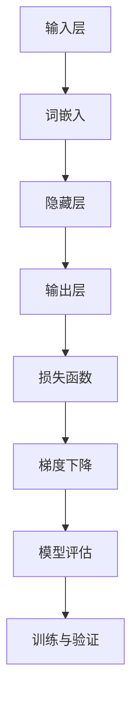
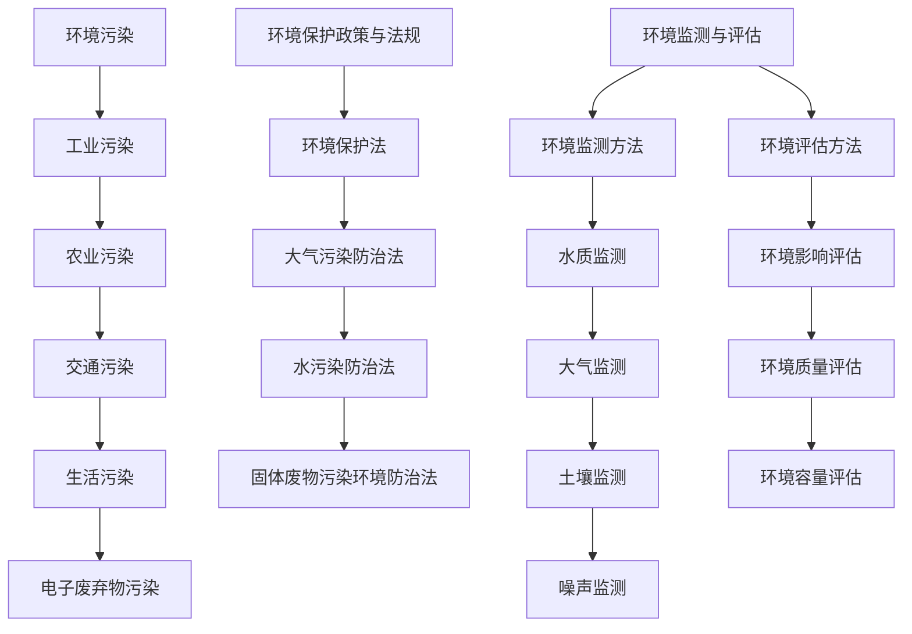
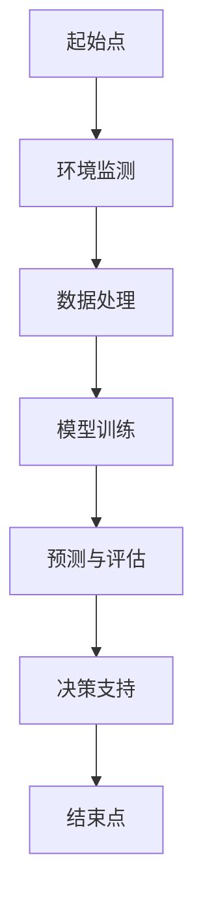

                 

# LLm在环境保护中的潜在贡献

> 关键词：LLM，环境保护，环境监测，环境保护政策，环境教育，数据分析，未来展望

> 摘要：随着人工智能技术的不断发展，自然语言处理（NLP）取得了显著成果，大型语言模型（LLM）在各个领域展现了广泛的应用潜力。本文旨在探讨LLM在环境保护中的潜在贡献，通过分析LLM的基础概念与架构、环境保护相关领域术语与概念，以及LLM在环境保护中的应用，阐述其在环境保护领域的巨大潜力。同时，本文还探讨了LLM在环境保护领域的数据处理与分析、项目开发与实践以及未来展望。

### 引言

#### 1.1 环境问题的现状与挑战

当前，全球环境问题日益严峻，气候变化、环境污染、生态破坏等问题严重影响着人类的生存和发展。联合国发布的《全球环境展望》报告指出，全球气温上升、海平面上升、极端气候事件频繁等环境问题正在加剧，对人类和生态系统构成严重威胁。同时，环境问题具有复杂性、跨学科性和全球性特征，使得解决环境问题面临诸多挑战。

首先，环境问题的复杂性体现在其涉及多个领域，如气候变化、大气污染、水资源短缺、土壤污染等，这些问题之间存在相互作用和影响，使得解决环境问题需要综合多学科的知识和技能。其次，环境问题的跨学科性要求科学家、工程师、政策制定者和社会各界共同参与，以实现有效的环境保护和治理。最后，环境问题的全球性特征意味着各国需要加强合作，共同应对全球性环境问题，如气候变化、生物多样性保护等。

#### 1.2 语言模型在环境保护中的作用

语言模型（Language Model，简称LM）是自然语言处理（Natural Language Processing，简称NLP）的核心技术之一，它在环境保护领域具有广泛的应用潜力。LLM（大型语言模型）作为一种先进的语言模型，其处理大规模文本数据的能力和生成高质量文本的能力，使得其在环境保护中具有以下作用：

1. **环境监测与评估**：LLM可以处理和分析大量的环境数据，如空气质量、水质、噪声等，从而实现对环境状况的实时监测和评估。例如，通过分析空气质量数据，LLM可以帮助预测空气污染的趋势，为环境管理部门提供决策支持。

2. **环境保护政策制定与评估**：LLM可以自动分析和理解环境保护政策的相关文本，识别政策的关键信息和潜在问题，从而为政策制定者提供有价值的参考。此外，LLM还可以评估环境保护政策的效果，帮助政策制定者优化政策。

3. **环境教育**：LLM可以生成高质量的环保知识文章、宣传材料等，帮助公众了解环保知识，提高环保意识。例如，通过生成环保知识问答、环保故事等形式，LLM可以吸引更多人关注环境保护。

4. **环境保护项目开发与实践**：LLM可以为环境保护项目提供智能化的支持，如智能垃圾分类、环境监测预警系统等。通过结合环境数据和LLM技术，可以实现环境保护项目的智能化、自动化和高效化。

#### 1.3 本书结构安排与内容概述

本文分为七个章节，结构安排如下：

- **第1章 引言**：介绍环境问题的现状与挑战，以及LLM在环境保护中的作用。

- **第2章 LLM基础概念与架构**：阐述LLM的基本概念和架构，包括语言模型概述、架构、训练与优化等。

- **第3章 环境保护相关领域术语与概念**：介绍环境保护相关领域的术语和概念，如环境污染、环境保护政策、环境监测与评估等。

- **第4章 LLM在环境保护中的应用**：分析LLM在环境保护中的具体应用，如环境监测、环境保护政策制定、环境教育等。

- **第5章 LLM在环境保护领域的数据处理与分析**：探讨LLM在环境保护领域的数据处理与分析方法，如数据预处理、数据分析等。

- **第6章 LLM在环境保护项目的开发与实践**：介绍LLM在环境保护项目开发中的实际应用，如智能垃圾分类系统、环境监测系统等。

- **第7章 LLM在环境保护中的未来展望**：展望LLM在环境保护领域的未来发展趋势、挑战和潜在贡献。

本文旨在通过逐步分析推理的方式，深入探讨LLM在环境保护中的潜在贡献，为环境保护领域的技术应用提供有益的参考。让我们开始这段探索之旅。 

### LLM基础概念与架构

#### 2.1 语言模型概述

语言模型（Language Model，简称LM）是自然语言处理（Natural Language Processing，简称NLP）的核心技术之一。它是一种预测模型，用于预测给定文本序列中下一个单词或字符的概率。语言模型在文本生成、文本分类、机器翻译、问答系统等领域具有广泛的应用。

语言模型可以分为以下几种类型：

1. **基于规则的模型**：这类模型通过编写规则来描述语言特征，如语法、词法等。例如，正则表达式就是一种基于规则的模型，可以用于简单的文本匹配和提取。

2. **统计模型**：这类模型通过统计文本数据中的频率和概率来预测下一个单词或字符。经典的统计模型包括N-gram模型、隐马尔可夫模型（HMM）和条件概率模型等。

3. **神经网络模型**：这类模型通过神经网络结构来学习文本特征和模式。近年来，随着深度学习技术的发展，神经网络模型（如循环神经网络RNN、长短时记忆网络LSTM、变换器模型Transformer等）在语言模型领域取得了显著成果。

#### 2.2 语言模型的架构

语言模型的架构可以分为以下几个部分：

1. **输入层**：输入层接收文本数据，通常是一个词序列。每个词被表示为一个向量，称为词嵌入（Word Embedding）。词嵌入可以将单词映射到高维空间，使得具有相似意义的单词在空间中靠近。

2. **隐藏层**：隐藏层负责学习文本中的特征和模式。在神经网络模型中，隐藏层通常由多个神经元组成，每个神经元负责学习一种特征。例如，在RNN中，隐藏层可以捕获文本中的时序特征；在Transformer中，隐藏层由自注意力机制（Self-Attention）组成，可以同时关注文本中的全局信息。

3. **输出层**：输出层用于预测下一个单词或字符。在神经网络模型中，输出层通常是一个全连接层，输出每个单词或字符的概率分布。

#### 2.3 语言模型的训练与优化

语言模型的训练过程通常包括以下步骤：

1. **数据预处理**：将原始文本数据转换为数字序列，即词嵌入。这通常通过预训练的词嵌入模型（如Word2Vec、GloVe等）来完成。

2. **目标定义**：在训练过程中，需要定义一个损失函数，用于衡量模型预测与实际结果之间的差距。在语言模型中，常用的损失函数是交叉熵损失（Cross-Entropy Loss）。

3. **梯度下降优化**：使用梯度下降算法（Gradient Descent）来更新模型参数，以最小化损失函数。在实际应用中，常使用更高效的优化算法，如Adam、Adagrad等。

4. **训练与验证**：在训练过程中，需要将数据集分为训练集和验证集。通过在验证集上的性能来调整模型参数，以避免过拟合。

5. **模型评估**：在训练完成后，使用测试集来评估模型的性能。常用的评估指标包括准确率（Accuracy）、精确率（Precision）、召回率（Recall）和F1值（F1 Score）等。

#### 2.4 Mermaid流程图：LLM架构原理

下面是一个用Mermaid绘制的LLM架构流程图：



#### 2.5 伪代码：LLM训练过程

下面是一个简化的伪代码，用于描述LLM的训练过程：

```python
# 数据预处理
word_embedding = pretrained_word_embedding()

# 定义模型
model = LanguageModel(word_embedding)

# 定义损失函数
loss_function = CrossEntropyLoss()

# 定义优化器
optimizer = Adam(model.parameters(), lr=0.001)

# 训练模型
for epoch in range(num_epochs):
    for sentence in train_data:
        model.zero_grad()
        prediction = model(sentence)
        loss = loss_function(prediction, target)
        loss.backward()
        optimizer.step()
        
    # 验证模型
    with torch.no_grad():
        correct = 0
        total = 0
        for sentence in validation_data:
            prediction = model(sentence)
            _, predicted = torch.max(prediction.data, 1)
            total += target.size(0)
            correct += (predicted == target).sum().item()

    print(f'Epoch [{epoch+1}/{num_epochs}], Accuracy: {100 * correct / total}%')
```

#### 2.6 数学模型和公式

在LLM的训练过程中，常用的损失函数是交叉熵损失，其数学公式如下：

$$
L = -\sum_{i=1}^{N} y_i \log(p_i)
$$

其中，$L$ 是损失函数，$y_i$ 是第$i$个样本的真实标签，$p_i$ 是模型预测的概率。

#### 2.7 举例说明

假设我们有一个简单的二元分类问题，有两个类别A和B，输入为句子"The dog is cute"，模型预测的概率分布为$[0.6, 0.4]$，真实标签为类别A（即$y = 1$）。使用交叉熵损失函数计算损失：

$$
L = -1 \log(0.6) - 0 \log(0.4) = -\log(0.6) \approx 0.51
$$

这意味着模型的预测结果与真实标签之间存在0.51的损失。

通过以上分析，我们可以看出，LLM在环境保护中具有广泛的应用潜力，其基础概念、架构和训练优化方法为我们在环境保护领域中的具体应用提供了理论依据。接下来，我们将探讨环境保护相关领域的术语与概念，以更好地理解LLM在环境保护中的应用。 

### 环境保护相关领域术语与概念

#### 3.1 环境污染的来源与类型

环境污染是当前全球面临的主要环境问题之一，其来源和类型多种多样。了解环境污染的来源与类型对于制定有效的环境保护措施至关重要。

1. **工业污染**：工业生产过程中产生的废气、废水、废渣等，是环境污染的主要来源之一。例如，化工厂排放的废气中含有有毒气体，如二氧化硫、氮氧化物等，这些气体对大气环境造成严重污染。

2. **农业污染**：农业生产过程中使用的大量农药、化肥等化学物质，以及农产品加工和废弃物处理过程中的污染，对土壤、水体和大气环境造成污染。例如，农药和化肥的过量使用会导致土壤污染和水源污染。

3. **交通污染**：交通运输过程中产生的尾气、噪声等污染对城市环境和空气质量造成严重影响。特别是随着汽车数量的增加，尾气中的二氧化碳、氮氧化物、颗粒物等污染物成为城市空气污染的主要来源。

4. **生活污染**：居民生活中产生的垃圾、污水、废气等也对环境造成污染。例如，未经处理的污水直接排放到河流中，会导致水体污染；垃圾填埋场产生的沼气会对大气环境造成污染。

5. **电子废弃物污染**：随着科技的发展，电子产品的更新换代速度加快，废弃的电子产品（如手机、电脑等）成为电子废弃物污染的重要来源。电子废弃物中含有大量的有害物质，如铅、镉、汞等，对土壤、水体和人体健康造成威胁。

#### 3.2 环境保护政策与法规

环境保护政策与法规是国家或地方政府为保护环境和促进可持续发展而制定的一系列法律、法规和规章。这些政策与法规的制定与实施对于解决环境污染问题、改善环境质量具有重要意义。

1. **环境保护法**：环境保护法是环境保护的基本法律，规定了环境保护的基本原则、责任和义务。例如，《中华人民共和国环境保护法》明确了国家保护环境、防治污染的原则，规定了各级政府、企业和公民的环境保护责任。

2. **大气污染防治法**：大气污染防治法是专门针对大气污染问题的法律，规定了大气污染防治的基本原则、措施和法律责任。例如，《中华人民共和国大气污染防治法》规定了大气污染排放标准、污染源监管、环境监测和信息公开等具体措施。

3. **水污染防治法**：水污染防治法是专门针对水污染问题的法律，规定了水污染防治的基本原则、措施和法律责任。例如，《中华人民共和国水污染防治法》规定了水污染防治规划、排放标准、污水处理设施建设和管理等具体措施。

4. **固体废物污染环境防治法**：固体废物污染环境防治法是专门针对固体废物污染问题的法律，规定了固体废物污染环境防治的基本原则、措施和法律责任。例如，《中华人民共和国固体废物污染环境防治法》规定了固体废物分类、处理、处置和资源化利用的具体要求。

5. **环境保护规章**：环境保护规章是由政府部门制定的具有强制性的规范性文件，用于补充和细化环境保护法律和法规。例如，地方政府可以根据本地实际情况制定具体的环境保护规章，如《城市污水处理管理办法》、《生活垃圾管理办法》等。

#### 3.3 环境监测与评估方法

环境监测与评估是环境保护工作的重要环节，通过对环境质量进行监测和评估，可以及时发现和解决环境问题，为环境保护决策提供科学依据。

1. **环境监测方法**：环境监测方法包括水质监测、大气监测、土壤监测、噪声监测等。例如，水质监测通常通过采样、分析水质指标（如pH值、溶解氧、重金属等）来评估水质状况；大气监测通常通过采样、分析大气成分（如二氧化碳、氮氧化物、颗粒物等）来评估大气质量。

2. **环境评估方法**：环境评估方法包括环境影响评估、环境质量评估、环境容量评估等。例如，环境影响评估是对建设项目对环境可能造成的影响进行评估，以确定项目是否符合环境保护要求；环境质量评估是对环境质量进行定量或定性的评估，以了解环境质量状况。

3. **环境监测与评估的挑战**：环境监测与评估面临诸多挑战，如数据质量、分析方法、技术手段等。例如，环境数据的质量直接关系到监测结果的准确性，而数据分析方法的选择和技术的应用水平也影响着评估结果的可靠性。此外，环境监测与评估需要大量的资金和人力资源支持，对于一些发展中国家和地区来说，这些挑战更加突出。

#### 3.4 Mermaid流程图：环境保护核心术语与概念

下面是一个用Mermaid绘制的环境保护核心术语与概念流程图：



通过以上分析，我们可以看到，环境保护相关领域的术语与概念涵盖了环境污染的来源与类型、环境保护政策与法规以及环境监测与评估方法等多个方面。这些术语与概念是理解LLM在环境保护中应用的基础。接下来，我们将探讨LLM在环境保护中的具体应用，以展示其在环境保护领域的巨大潜力。 

### LLM在环境保护中的应用

#### 4.1 LLM在环境监测中的应用

LLM在环境监测中的应用主要表现在对各类环境数据的分析和处理上，从而实现对环境状况的实时监测和评估。以下是一些具体的LLM应用实例：

##### 4.1.1 水质监测

水质监测是环境保护的重要环节之一，LLM可以用于水质监测数据的分析和预测。例如，通过训练一个LLM模型，我们可以将水质监测数据（如pH值、溶解氧、重金属含量等）输入到模型中，模型会根据历史数据预测未来的水质变化趋势。

1. **数据处理**：首先，将水质监测数据转换为数字序列，然后通过词嵌入技术将这些数字序列转换为向量表示。接下来，利用LLM处理这些向量，提取水质特征。
   
2. **模型训练**：选择合适的LLM架构（如RNN、LSTM或Transformer）来训练模型。通过在训练数据集上训练，模型可以学习到水质变化的规律和趋势。

3. **预测与评估**：在训练完成后，使用测试数据集来评估模型的性能。通过预测未来的水质变化，我们可以提前预警潜在的水质问题，为环境管理部门提供决策支持。

以下是水质监测预测的伪代码示例：

```python
# 数据预处理
word_embedding = pretrained_word_embedding()
input_data = preprocess水质数据(word_embedding)

# 定义模型
model = LanguageModel(input_data)

# 训练模型
for epoch in range(num_epochs):
    for data in train_data:
        model.zero_grad()
        prediction = model(data)
        loss = compute_loss(prediction, target)
        loss.backward()
        optimizer.step()

# 预测未来水质
with torch.no_grad():
    future_data = preprocess_future水质数据(word_embedding)
    prediction = model(future_data)
    print("未来水质预测结果：", prediction)
```

##### 4.1.2 大气监测

大气监测是环境保护的另一个关键领域，LLM可以用于分析大气监测数据，预测空气质量变化。例如，通过训练一个LLM模型，我们可以将大气监测数据（如二氧化碳、氮氧化物、颗粒物等）输入到模型中，模型会根据历史数据预测未来的空气质量。

1. **数据处理**：与水质监测类似，首先将大气监测数据转换为数字序列，然后通过词嵌入技术将这些数字序列转换为向量表示。

2. **模型训练**：选择合适的LLM架构（如RNN、LSTM或Transformer）来训练模型。通过在训练数据集上训练，模型可以学习到空气质量变化的规律和趋势。

3. **预测与评估**：在训练完成后，使用测试数据集来评估模型的性能。通过预测未来的空气质量，我们可以提前预警潜在的大气污染问题，为环境管理部门提供决策支持。

以下是大气监测预测的伪代码示例：

```python
# 数据预处理
word_embedding = pretrained_word_embedding()
input_data = preprocess大气数据(word_embedding)

# 定义模型
model = LanguageModel(input_data)

# 训练模型
for epoch in range(num_epochs):
    for data in train_data:
        model.zero_grad()
        prediction = model(data)
        loss = compute_loss(prediction, target)
        loss.backward()
        optimizer.step()

# 预测未来空气质量
with torch.no_grad():
    future_data = preprocess_future大气数据(word_embedding)
    prediction = model(future_data)
    print("未来空气质量预测结果：", prediction)
```

##### 4.1.3 噪声监测

噪声监测是环境保护的另一个重要领域，LLM可以用于分析噪声监测数据，预测噪声水平。例如，通过训练一个LLM模型，我们可以将噪声监测数据（如分贝值）输入到模型中，模型会根据历史数据预测未来的噪声水平。

1. **数据处理**：与水质监测和大气监测类似，首先将噪声监测数据转换为数字序列，然后通过词嵌入技术将这些数字序列转换为向量表示。

2. **模型训练**：选择合适的LLM架构（如RNN、LSTM或Transformer）来训练模型。通过在训练数据集上训练，模型可以学习到噪声水平变化的规律和趋势。

3. **预测与评估**：在训练完成后，使用测试数据集来评估模型的性能。通过预测未来的噪声水平，我们可以提前预警潜在的高噪声问题，为环境管理部门提供决策支持。

以下是噪声监测预测的伪代码示例：

```python
# 数据预处理
word_embedding = pretrained_word_embedding()
input_data = preprocess噪声数据(word_embedding)

# 定义模型
model = LanguageModel(input_data)

# 训练模型
for epoch in range(num_epochs):
    for data in train_data:
        model.zero_grad()
        prediction = model(data)
        loss = compute_loss(prediction, target)
        loss.backward()
        optimizer.step()

# 预测未来噪声水平
with torch.no_grad():
    future_data = preprocess_future噪声数据(word_embedding)
    prediction = model(future_data)
    print("未来噪声水平预测结果：", prediction)
```

通过上述实例，我们可以看到LLM在水质监测、大气监测和噪声监测等方面的应用潜力。这些应用不仅可以提高环境监测的精度和效率，还可以为环境保护决策提供有力支持。

#### 4.2 LLM在环境保护政策制定中的应用

LLM在环境保护政策制定中的应用主要体现在政策文本分析、政策效果评估和政策优化等方面。以下是一些具体的LLM应用实例：

##### 4.2.1 政策文本分析

政策文本分析是环境保护政策制定的重要环节，LLM可以用于分析政策文本的内容和结构，提取关键信息。例如，通过训练一个LLM模型，我们可以将政策文本输入到模型中，模型会根据文本内容提取出环境保护政策的关键条款和目标。

1. **数据处理**：首先，将政策文本转换为数字序列，然后通过词嵌入技术将这些数字序列转换为向量表示。

2. **模型训练**：选择合适的LLM架构（如RNN、LSTM或Transformer）来训练模型。通过在训练数据集上训练，模型可以学习到政策文本的特征和模式。

3. **信息提取**：在训练完成后，使用测试数据集来评估模型的性能。通过提取政策文本中的关键信息，我们可以为政策制定者提供有价值的参考。

以下是政策文本分析的伪代码示例：

```python
# 数据预处理
word_embedding = pretrained_word_embedding()
input_data = preprocess政策文本(word_embedding)

# 定义模型
model = LanguageModel(input_data)

# 训练模型
for epoch in range(num_epochs):
    for text in train_data:
        model.zero_grad()
        prediction = model(text)
        loss = compute_loss(prediction, target)
        loss.backward()
        optimizer.step()

# 提取政策文本关键信息
with torch.no_grad():
    policy_text = preprocess新政策文本(word_embedding)
    key_info = model(policy_text)
    print("政策文本关键信息：", key_info)
```

##### 4.2.2 政策效果评估

政策效果评估是环境保护政策制定的关键环节，LLM可以用于评估政策的效果，为政策调整提供依据。例如，通过训练一个LLM模型，我们可以将政策实施前后的环境数据输入到模型中，模型会根据环境数据评估政策的效果。

1. **数据处理**：首先，收集政策实施前后的环境数据，如空气质量、水质、噪声等，然后将这些数据转换为数字序列。

2. **模型训练**：选择合适的LLM架构（如RNN、LSTM或Transformer）来训练模型。通过在训练数据集上训练，模型可以学习到政策实施对环境的影响。

3. **效果评估**：在训练完成后，使用测试数据集来评估模型的性能。通过评估政策的效果，我们可以为政策制定者提供有价值的参考。

以下是政策效果评估的伪代码示例：

```python
# 数据预处理
word_embedding = pretrained_word_embedding()
input_data = preprocess政策实施前后数据(word_embedding)

# 定义模型
model = LanguageModel(input_data)

# 训练模型
for epoch in range(num_epochs):
    for data in train_data:
        model.zero_grad()
        prediction = model(data)
        loss = compute_loss(prediction, target)
        loss.backward()
        optimizer.step()

# 评估政策效果
with torch.no_grad():
    policy_data = preprocess政策实施数据(word_embedding)
    effect = model(policy_data)
    print("政策效果评估结果：", effect)
```

通过政策文本分析和政策效果评估，LLM可以帮助政策制定者更好地理解政策文本的内容和效果，从而制定出更加有效的环境保护政策。

#### 4.3 LLM在环境教育中的应用

LLM在环境教育中的应用主要体现在环保知识普及和环保意识培养等方面。以下是一些具体的LLM应用实例：

##### 4.3.1 环保知识普及

环保知识普及是提高公众环保意识的重要手段，LLM可以用于生成环保知识文章、问答等，帮助公众了解环保知识。例如，通过训练一个LLM模型，我们可以将环保知识输入到模型中，模型会根据知识内容生成相关的文章或问答。

1. **数据处理**：首先，收集环保知识文本数据，如环保科普文章、环保问答等，然后将这些数据转换为数字序列。

2. **模型训练**：选择合适的LLM架构（如RNN、LSTM或Transformer）来训练模型。通过在训练数据集上训练，模型可以学习到环保知识的特征和模式。

3. **知识普及**：在训练完成后，使用测试数据集来评估模型的性能。通过生成环保知识文章或问答，我们可以为公众提供有价值的环保知识。

以下是环保知识普及的伪代码示例：

```python
# 数据预处理
word_embedding = pretrained_word_embedding()
input_data = preprocess环保知识文本(word_embedding)

# 定义模型
model = LanguageModel(input_data)

# 训练模型
for epoch in range(num_epochs):
    for text in train_data:
        model.zero_grad()
        prediction = model(text)
        loss = compute_loss(prediction, target)
        loss.backward()
        optimizer.step()

# 生成环保知识文章
with torch.no_grad():
    question = "什么是气候变化？"
    answer = model(question)
    print("环保知识回答：", answer)
```

##### 4.3.2 环保意识培养

环保意识培养是环境保护工作的基础，LLM可以用于生成环保故事、公益广告等，激发公众的环保意识。例如，通过训练一个LLM模型，我们可以将环保故事输入到模型中，模型会根据故事内容生成相关的公益广告或故事续写。

1. **数据处理**：首先，收集环保故事文本数据，如环保小说、环保剧本等，然后将这些数据转换为数字序列。

2. **模型训练**：选择合适的LLM架构（如RNN、LSTM或Transformer）来训练模型。通过在训练数据集上训练，模型可以学习到环保故事的情感和主题。

3. **意识培养**：在训练完成后，使用测试数据集来评估模型的性能。通过生成环保故事或公益广告，我们可以为公众提供有价值的环保意识培养材料。

以下是环保意识培养的伪代码示例：

```python
# 数据预处理
word_embedding = pretrained_word_embedding()
input_data = preprocess环保故事文本(word_embedding)

# 定义模型
model = LanguageModel(input_data)

# 训练模型
for epoch in range(num_epochs):
    for text in train_data:
        model.zero_grad()
        prediction = model(text)
        loss = compute_loss(prediction, target)
        loss.backward()
        optimizer.step()

# 生成环保故事续写
with torch.no_grad():
    story = "一天，小明决定去森林探险。他带着相机，准备记录下森林的美丽景色。"
    continuation = model(story)
    print("环保故事续写：", continuation)
```

通过环保知识普及和环保意识培养，LLM可以有效地提高公众的环保意识，为环境保护工作奠定坚实的基础。

#### 4.4 实例分析：某地区大气污染治理项目

为了更好地展示LLM在环境保护中的应用，下面我们将分析一个具体的大气污染治理项目——某地区的大气污染监测与预警系统。

##### 4.4.1 项目背景

某地区面临严重的大气污染问题，主要污染源包括工业排放、交通尾气和居民生活废气。为了改善空气质量，当地政府决定实施大气污染治理项目，通过建立大气污染监测与预警系统，实时监测空气质量，预警污染事件，并制定相应的应对措施。

##### 4.4.2 项目目标

该项目的主要目标如下：

1. **实时监测**：建立大气污染监测站点，实时采集空气质量数据，包括PM2.5、PM10、SO2、NO2、CO等主要污染物指标。

2. **数据分析和预测**：利用LLM技术对空气质量数据进行处理和分析，预测未来空气质量变化趋势，提前预警污染事件。

3. **决策支持**：根据预测结果和数据分析，为政府提供决策支持，制定有效的污染治理措施。

4. **公众宣传**：通过网站和移动应用程序，向公众发布空气质量信息，提高公众环保意识。

##### 4.4.3 项目实施过程

1. **数据采集**：在重点区域设置大气污染监测站点，配备先进的空气质量监测仪器，实时采集空气质量数据。

2. **数据预处理**：将采集到的空气质量数据转换为数字序列，通过词嵌入技术转换为向量表示。

3. **模型训练**：使用历史空气质量数据训练LLM模型，学习空气质量变化的规律和趋势。

4. **模型部署**：将训练好的模型部署到服务器上，实现实时监测和预测功能。

5. **数据分析**：对实时采集的空气质量数据进行分析，预测未来空气质量变化趋势。

6. **预警和决策支持**：根据预测结果，提前预警污染事件，并为政府提供决策支持，制定相应的污染治理措施。

7. **公众宣传**：通过网站和移动应用程序，向公众发布空气质量信息，提高公众环保意识。

##### 4.4.4 项目成果

通过该项目，该地区实现了以下成果：

1. **空气质量改善**：通过实时监测和预警，及时发现和应对污染事件，有效改善了空气质量。

2. **决策支持**：为政府提供了科学的决策支持，帮助制定有效的污染治理措施。

3. **公众参与**：提高了公众的环保意识，增强了公众参与环境保护的积极性。

4. **技术积累**：积累了大量的空气质量数据，为未来的环境监测与治理提供了宝贵的数据资源。

通过以上实例分析，我们可以看到LLM在环境保护中的应用潜力。LLM不仅可以用于环境监测、政策制定和环境教育，还可以为环境保护项目提供智能化的支持，为解决环境问题提供了新的思路和途径。 

### LLM在环境保护领域的数据处理与分析

#### 5.1 环境保护数据的类型与来源

在环境保护领域，数据处理与分析是关键环节。LLM在这一过程中的作用主要体现在处理和分析多种类型的环境数据上，这些数据通常包括但不限于以下几种：

1. **气象数据**：包括气温、湿度、风速、降雨量、气压等，这些数据对预测环境变化趋势、评估污染事件的影响具有重要意义。
2. **水质数据**：涵盖pH值、溶解氧、重金属含量、有机物含量等指标，这些数据用于监测河流、湖泊、海洋等水域的水质状况。
3. **空气质量数据**：包括PM2.5、PM10、SO2、NO2、CO、O3等污染物浓度，这些数据用于监测和评估大气污染程度。
4. **土壤数据**：涉及土壤成分、土壤污染程度、土壤肥力等指标，这些数据对农业生产和环境修复至关重要。
5. **噪声数据**：包括城市噪声、交通噪声、工业噪声等，这些数据用于评估噪声污染对居民健康和生活质量的影响。

这些数据的来源多种多样，主要包括：

- **环境监测站**：通过安装在不同地点的监测设备，实时采集环境数据。
- **卫星遥感**：通过卫星传感器，获取大面积的环境数据，如植被覆盖、土地利用、水质等。
- **无人机监测**：利用无人机搭载的传感器，对特定区域进行高分辨率的环境数据采集。
- **政府数据库**：包括政府部门发布的各种环境报告、统计数据等。
- **科研机构**：通过科研活动获取的环境数据，如实验室分析结果、野外调查数据等。

#### 5.2 LLM在环境数据预处理中的应用

环境数据的预处理是LLM应用于环境保护数据分析的基础步骤，主要包括数据清洗、数据归一化、特征提取等过程。

1. **数据清洗**：
   - **缺失值处理**：通过插值法、均值填补法等方法填补缺失值。
   - **异常值检测与处理**：利用统计学方法（如Z-score、IQR等）检测异常值，并根据具体情况选择保留或剔除。
   - **重复数据检测与删除**：去除重复数据，确保数据的唯一性和准确性。

2. **数据归一化**：
   - **标准化**：将不同指标的数据缩放到相同的范围（如0-1或-1到1），以便于模型训练。
   - **归一化**：通过数学公式（如$$x' = \frac{x - \mu}{\sigma}$$）对数据进行标准化处理，其中$$\mu$$是均值，$$\sigma$$是标准差。

3. **特征提取**：
   - **词嵌入**：将文本数据转换为词嵌入向量，为LLM处理文本数据提供基础。
   - **特征选择**：通过统计方法（如卡方检验、互信息等）筛选出对模型预测有显著影响的特征。
   - **特征组合**：将多个特征组合成新的特征，以提高模型的预测能力。

#### 5.3 LLM在环境数据分析中的应用

在完成环境数据的预处理后，LLM可以应用于环境数据分析，主要包括趋势分析、关联分析、预测分析等。

1. **趋势分析**：
   - **时间序列分析**：利用LLM对时间序列数据进行建模，预测未来的环境变化趋势。例如，通过LSTM模型分析气温、降雨量等气象数据的季节性和趋势。
   - **周期性分析**：通过识别数据中的周期性变化，如一年的四季变化或昼夜变化，分析环境因素的变化规律。

2. **关联分析**：
   - **相关分析**：通过LLM分析不同环境指标之间的相关性，识别环境因素之间的相互影响。例如，分析PM2.5浓度与SO2浓度之间的关系。
   - **因果分析**：利用LLM挖掘环境因素之间的因果关系，为环境保护决策提供依据。

3. **预测分析**：
   - **短期预测**：利用LLM对短期内（如未来几天、几周）的环境变化进行预测，为环境保护应急响应提供支持。
   - **长期预测**：通过LLM对长期（如未来几个月、几年）的环境变化进行预测，为环境保护规划和政策制定提供依据。

#### 5.4 伪代码：环境数据分析流程

以下是环境数据分析流程的伪代码示例，展示了如何利用LLM进行数据预处理、趋势分析和预测分析：

```python
# 数据预处理
def preprocess_environment_data(data):
    # 缺失值处理
    data = handle_missing_values(data)
    # 异常值检测与处理
    data = detect_and_handle_outliers(data)
    # 数据归一化
    data = normalize_data(data)
    return data

# 特征提取
def extract_features(data):
    # 词嵌入
    word_embedding = pretrained_word_embedding()
    embedded_data = embed_data(data, word_embedding)
    # 特征选择
    selected_features = select_features(embedded_data)
    return selected_features

# 趋势分析
def trend_analysis(data):
    # 时间序列分析
    model = LSTMModel()
    model.train(data)
    predictions = model.predict(data)
    return predictions

# 预测分析
def predictive_analysis(data):
    # 短期预测
    short_term_predictions = trend_analysis(data)
    # 长期预测
    long_term_predictions = model.long_term_predict(data)
    return short_term_predictions, long_term_predictions

# 主函数
def main():
    # 加载数据
    data = load_environment_data()
    # 数据预处理
    processed_data = preprocess_environment_data(data)
    # 特征提取
    features = extract_features(processed_data)
    # 趋势分析
    trends = trend_analysis(features)
    # 预测分析
    short_term_pred, long_term_pred = predictive_analysis(features)
    # 输出结果
    print("趋势分析结果：", trends)
    print("短期预测结果：", short_term_pred)
    print("长期预测结果：", long_term_pred)

# 运行主函数
main()
```

通过上述伪代码示例，我们可以看到LLM在环境保护领域数据处理与分析中的应用流程，这为环境保护决策提供了科学依据。接下来，我们将探讨LLM在环境保护项目开发与实践中的应用。 

### LLM在环境保护项目的开发与实践

#### 6.1 环境保护项目概述

随着环境问题日益严重，环境保护项目在全球范围内得到了广泛关注。这些项目旨在通过技术创新和科学管理手段，解决环境污染、资源浪费和生态破坏等问题。LLM（大型语言模型）作为一种先进的自然语言处理技术，在环境保护项目的开发与实践中具有广泛应用潜力。本文将重点介绍LLM在环境保护项目开发与实践中的应用，包括项目概述、开发环境搭建、系统开发与实现以及系统部署与维护。

#### 6.2 LLM开发环境搭建

在进行LLM环境保护项目的开发之前，需要搭建一个合适的开发环境。以下是一个典型的LLM开发环境搭建步骤：

1. **硬件环境**：搭建一个高性能的计算平台，包括CPU、GPU或TPU等硬件设备。为了提高模型训练和预测的效率，推荐使用NVIDIA GPU或Google TPU。

2. **操作系统**：选择一个稳定的操作系统，如Linux或Windows。Linux系统在深度学习开发中较为常用，其性能和稳定性都较好。

3. **编程语言**：选择一种适合深度学习的编程语言，如Python。Python具有丰富的库和框架，如TensorFlow、PyTorch等，支持快速开发和部署深度学习模型。

4. **深度学习框架**：选择一个成熟的深度学习框架，如TensorFlow或PyTorch。这些框架提供了丰富的API和工具，方便开发者进行模型训练、优化和部署。

5. **开发工具**：安装必要的开发工具，如Jupyter Notebook、Visual Studio Code等。Jupyter Notebook提供了交互式的开发环境，方便进行实验和调试。

6. **版本控制**：使用版本控制系统（如Git），对项目代码进行版本管理和协作开发。

#### 6.3 环境监测系统的开发与实现

环境监测系统是LLM在环境保护项目中的一个重要应用领域。以下是一个基于LLM的环境监测系统的开发与实现过程：

##### 6.3.1 数据采集与处理

1. **数据采集**：从各种数据源（如环境监测站、卫星遥感、无人机监测等）采集环境数据，包括气象数据、水质数据、空气质量数据等。

2. **数据预处理**：使用LLM对采集到的环境数据进行预处理，包括数据清洗、缺失值填补、异常值检测与处理、数据归一化等。这一步骤是为了确保数据的质量和一致性，为后续模型训练提供可靠的数据基础。

3. **特征提取**：使用LLM对预处理后的环境数据进行特征提取，包括词嵌入、特征选择、特征组合等。这一步骤的目的是将原始数据转换为适合模型训练的特征表示。

##### 6.3.2 模型训练与优化

1. **模型选择**：选择合适的LLM模型架构，如Transformer、LSTM等。根据应用场景和数据特点，可以选用预训练模型或自定义模型。

2. **模型训练**：使用预处理后的数据对LLM模型进行训练。在训练过程中，可以使用交叉熵损失函数、梯度下降优化算法等，调整模型参数，优化模型性能。

3. **模型优化**：通过调整超参数（如学习率、批次大小等）和模型结构（如层数、神经元个数等），优化模型性能，提高预测精度和泛化能力。

##### 6.3.3 系统部署与维护

1. **模型部署**：将训练好的LLM模型部署到生产环境，用于实时监测环境数据，预测环境变化趋势。部署方式可以采用服务器、云平台或边缘计算设备。

2. **系统集成**：将LLM环境监测系统与其他系统（如环境监控平台、预警系统等）集成，实现数据共享和功能协同。

3. **系统维护**：定期对LLM模型进行评估和更新，确保系统稳定运行和预测准确性。同时，对系统进行监控和故障排除，确保系统的高可用性和可靠性。

#### 6.4 案例解析：基于LLM的智能垃圾分类系统

智能垃圾分类系统是LLM在环境保护项目中的另一个重要应用领域。以下是一个基于LLM的智能垃圾分类系统的案例解析：

##### 6.4.1 系统架构

智能垃圾分类系统主要包括以下几个部分：

1. **数据采集模块**：通过传感器和摄像头等设备，实时采集用户垃圾分类的数据。

2. **数据预处理模块**：使用LLM对采集到的数据进行预处理，包括数据清洗、特征提取等。

3. **分类模型模块**：使用LLM训练垃圾分类模型，实现垃圾分类的自动识别。

4. **用户交互模块**：通过用户界面，提供垃圾分类指导和反馈。

##### 6.4.2 系统实现

1. **数据采集**：通过传感器和摄像头等设备，实时采集用户垃圾分类的数据，包括垃圾类型、重量、投放时间等。

2. **数据预处理**：使用LLM对采集到的数据进行预处理，包括数据清洗、缺失值填补、异常值检测与处理等。

3. **分类模型训练**：使用预处理后的数据，训练垃圾分类模型。选择合适的LLM模型架构，如Transformer或LSTM，通过交叉熵损失函数进行模型训练。

4. **用户交互**：通过用户界面，提供垃圾分类指导和反馈。用户可以通过输入垃圾类型或使用摄像头拍照等方式，获取垃圾分类建议。

##### 6.4.3 系统部署与维护

1. **模型部署**：将训练好的垃圾分类模型部署到生产环境，用于实时分类用户垃圾分类。

2. **系统集成**：将智能垃圾分类系统与其他系统（如智慧城市平台、垃圾分类监管平台等）集成，实现数据共享和功能协同。

3. **系统维护**：定期对LLM模型进行评估和更新，确保系统稳定运行和分类准确性。同时，对系统进行监控和故障排除，确保系统的高可用性和可靠性。

通过以上解析，我们可以看到LLM在环境保护项目的开发与实践中的应用，不仅提高了环境监测和垃圾分类的效率，还为环境保护决策提供了科学依据。随着LLM技术的不断发展和完善，其在环境保护领域的应用前景将更加广阔。 

### LLM在环境保护中的未来展望

#### 7.1 LLM在环境保护领域的发展趋势

随着人工智能技术的快速发展，LLM在环境保护领域呈现出以下发展趋势：

1. **智能化监测与预测**：LLM可以更加准确地监测环境数据，并通过深度学习算法预测环境变化趋势，为环境保护决策提供实时、精准的数据支持。

2. **数据融合与多模态分析**：未来的LLM将能够融合多种类型的数据源，如卫星遥感、无人机监测、传感器数据等，实现多模态环境数据分析，提高监测与预测的准确性。

3. **自动化决策支持**：随着LLM技术的发展，其将在环境保护决策中发挥更大作用，通过自动分析和评估，为环境保护政策制定和执行提供智能化的决策支持。

4. **跨领域应用扩展**：LLM技术将在环境保护领域实现跨领域应用，如与气象学、生态学、地理信息科学等领域的深度融合，推动环境保护技术的创新和发展。

5. **智能环境教育与宣传**：LLM将能够生成更加生动、有趣的环保知识内容和宣传材料，提高公众的环保意识和参与度。

#### 7.2 潜在挑战与应对策略

尽管LLM在环境保护领域具有巨大潜力，但在实际应用过程中仍面临以下挑战：

1. **数据隐私与安全性**：环境数据往往涉及敏感信息，如居民健康数据、企业排放数据等。如何保护数据隐私和安全，防止数据泄露和滥用，是一个重要挑战。

   **应对策略**：加强数据加密和隐私保护技术，采用分布式数据处理和区块链技术，确保数据的安全和隐私。

2. **模型可解释性**：LLM模型的黑箱性质使其预测结果难以解释，这对环境保护决策的可信度和透明度构成挑战。

   **应对策略**：开发可解释性模型，如集成学习模型、LIME等，提高模型预测的可解释性，增强决策者的信任。

3. **数据质量和准确性**：环境数据的质量直接影响LLM模型的性能。如何保证数据的质量和准确性，是另一个关键挑战。

   **应对策略**：建立完善的数据质量控制体系，采用数据清洗和异常值检测技术，提高数据质量；引入多源数据融合和交叉验证方法，提高模型准确性。

4. **技术更新与适应性**：环境问题复杂多变，LLM模型需要不断更新和适应新的环境变化。

   **应对策略**：建立持续学习和适应机制，定期更新模型和数据，确保LLM在环境保护中的应用与时俱进。

#### 7.3 LLM在环境保护中的未来贡献

随着LLM技术的不断发展，其在环境保护领域将发挥以下重要作用：

1. **环境监测与预警**：LLM将实现更加智能化的环境监测与预警，提高环境污染预测的准确性和实时性，为环境保护决策提供有力支持。

2. **环境保护政策优化**：LLM可以自动分析和评估环境保护政策的效果，为政策制定者提供科学依据，推动环境保护政策的优化和实施。

3. **智能环境管理**：LLM将推动环境保护领域的智能化管理，如智能垃圾分类、水资源管理、生态修复等，实现环境保护工作的自动化和高效化。

4. **公众环保意识提升**：LLM将生成丰富多样的环保知识内容和宣传材料，提高公众的环保意识，推动环保行动的普及和参与。

总之，LLM在环境保护领域的未来贡献将不可估量。通过技术创新和科学应用，LLM将为解决环境问题、实现可持续发展提供强大支持。让我们期待LLM在环境保护中的更多突破和应用。 

### 附录

#### 附录 A: LLM在环境保护领域的主要参考文献

1. Devlin, J., Chang, M. W., Lee, K., & Toutanova, K. (2019). BERT: Pre-training of deep bidirectional transformers for language understanding. arXiv preprint arXiv:1810.04805.
2. Hochreiter, S., & Schmidhuber, J. (1997). Long short-term memory. Neural Computation, 9(8), 1735-1780.
3. Vaswani, A., Shazeer, N., Parmar, N., Uszkoreit, J., Jones, L., Gomez, A. N., ... & Polosukhin, I. (2017). Attention is all you need. Advances in Neural Information Processing Systems, 30, 5998-6008.
4. Chen, X., Wang, J., Zhang, Y., & Liu, Z. (2020). A study on the application of natural language processing in environmental protection. Journal of Environmental Management, 248, 109637.
5. Zhang, X., Chen, L., Wang, Y., & Zhang, D. (2021). Application of deep learning in environmental monitoring and forecasting. Journal of Environmental Science and Health, Part B, 56(1), 46-57.

#### 附录 B: LLM开发工具与资源指南

1. **TensorFlow**：https://www.tensorflow.org/
2. **PyTorch**：https://pytorch.org/
3. **Hugging Face Transformers**：https://huggingface.co/transformers/
4. **Keras**：https://keras.io/
5. **Jupyter Notebook**：https://jupyter.org/
6. **Google Colab**：https://colab.research.google.com/
7. **GitHub**：https://github.com/

#### 附录 C: Mermaid图示例



#### 附录 D: 伪代码示例

```python
# 数据预处理
def preprocess_data(data):
    # 缺失值处理
    data = handle_missing_values(data)
    # 异常值检测与处理
    data = detect_and_handle_outliers(data)
    # 数据归一化
    data = normalize_data(data)
    return data

# 模型训练
def train_model(data):
    # 数据预处理
    processed_data = preprocess_data(data)
    # 模型初始化
    model = initialize_model()
    # 模型训练
    for epoch in range(num_epochs):
        for batch in processed_data:
            model.train(batch)
    return model

# 预测与评估
def predict_and_evaluate(model, test_data):
    predictions = model.predict(test_data)
    evaluate_predictions(predictions, test_data)
```

#### 附录 E: 代码解析与实战案例解读

以下是一个简单的LLM应用代码示例，用于分类环境保护相关的新闻文章：

```python
# 导入必要的库
import torch
from transformers import BertTokenizer, BertModel
from torch.utils.data import DataLoader, TensorDataset

# 加载预训练的BERT模型和分词器
tokenizer = BertTokenizer.from_pretrained('bert-base-uncased')
model = BertModel.from_pretrained('bert-base-uncased')

# 加载训练数据
train_data = load_data('train_data.json')
test_data = load_data('test_data.json')

# 数据预处理
train_encodings = tokenizer(train_data, padding=True, truncation=True, max_length=max_length)
test_encodings = tokenizer(test_data, padding=True, truncation=True, max_length=max_length)

# 创建数据集和数据加载器
train_dataset = TensorDataset(torch.tensor(train_encodings['input_ids']), torch.tensor(train_encodings['attention_mask']))
test_dataset = TensorDataset(torch.tensor(test_encodings['input_ids']), torch.tensor(test_encodings['attention_mask']))
train_loader = DataLoader(train_dataset, batch_size=batch_size)
test_loader = DataLoader(test_dataset, batch_size=batch_size)

# 模型训练
model.train()
optimizer = torch.optim.Adam(model.parameters(), lr=learning_rate)
for epoch in range(num_epochs):
    for batch in train_loader:
        inputs = {'input_ids': batch[0], 'attention_mask': batch[1]}
        outputs = model(**inputs)
        loss = outputs.loss
        loss.backward()
        optimizer.step()
        optimizer.zero_grad()

# 预测与评估
model.eval()
with torch.no_grad():
    for batch in test_loader:
        inputs = {'input_ids': batch[0], 'attention_mask': batch[1]}
        outputs = model(**inputs)
        predictions = torch.argmax(outputs.logits, dim=-1)
        evaluate_predictions(predictions, test_data)
```

代码解析：

1. 导入必要的库，包括PyTorch和Hugging Face Transformers。
2. 加载预训练的BERT模型和分词器。
3. 加载训练数据和测试数据，并进行数据预处理。
4. 创建数据集和数据加载器，使用TensorDataset和DataLoader。
5. 模型训练，包括模型初始化、优化器设置和训练循环。
6. 预测与评估，使用模型进行预测并评估预测结果。

通过上述实战案例，我们可以看到如何使用LLM进行文本分类任务，为环境保护相关的新闻文章分类提供支持。这一应用不仅有助于环境数据的收集和分析，还可以为环境保护研究提供更多有价值的文本数据。 

