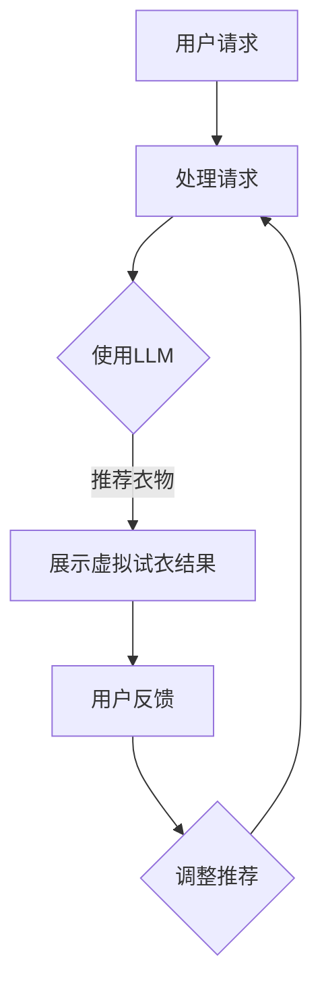
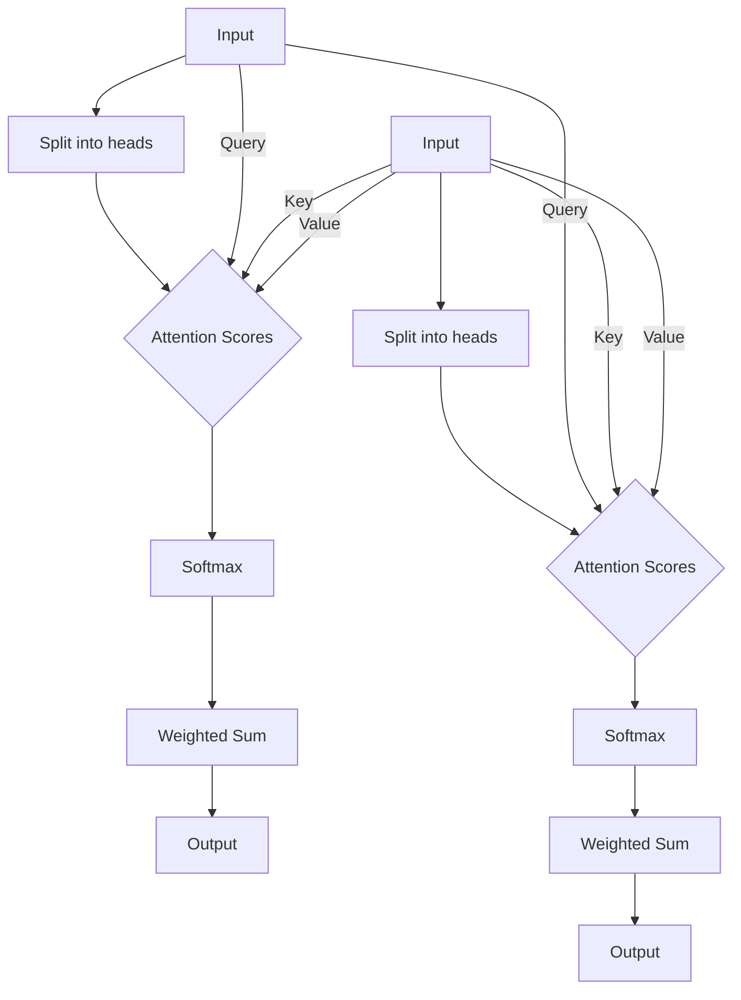
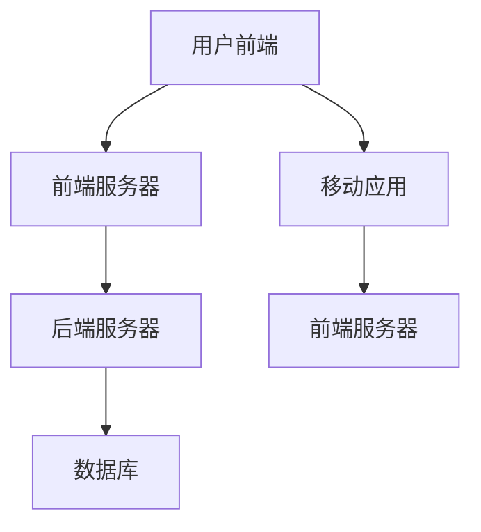

                 

### 文章标题：LLM在虚拟试衣中的应用：增强在线购物体验

> 关键词：语言模型（LLM），虚拟试衣，在线购物体验，深度学习，个性化推荐

> 摘要：本文探讨了语言模型（LLM）在虚拟试衣中的应用，如何通过LLM技术增强在线购物体验。文章首先介绍了LLM和虚拟试衣技术的基本概念，随后深入讲解了LLM的核心算法原理。接着，详细阐述了LLM在虚拟试衣中的数据预处理、预测应用和实时用户交互设计。文章最后探讨了LLM与虚拟试衣系统集成的方法，以及系统的实际应用效果和未来发展趋势。

### 第一部分：LLM在虚拟试衣中的应用概述

#### 第1章：LLM与虚拟试衣应用基础

##### 1.1 LLM与虚拟试衣技术概述

###### 1.1.1 什么是LLM

语言模型（Language Model，简称LLM）是一种深度学习模型，它可以学习自然语言的结构和语义，用于预测下一个单词、句子或文本片段。LLM的关键特性包括：

- **上下文感知**：LLM能够理解上下文信息，从而生成连贯的文本。
- **自适应**：通过大量数据训练，LLM可以不断优化和适应新的语言模式。

在数学上，LLM的目标是预测下一个单词或句子，给定前文序列$X_1, X_2, ..., X_{T-1}$，预测下一个单词$X_T$的概率：

$$P(X_T | X_1, X_2, ..., X_{T-1})$$

常用的概率估计方法包括朴素贝叶斯、n-gram模型和神经网络模型。

###### 1.1.2 虚拟试衣技术的概念

虚拟试衣是一种使用计算机技术和虚拟现实技术模拟试衣体验的技术。其核心原理包括：

- **人体建模**：创建与真实人体相似的三维模型。
- **虚拟场景渲染**：在虚拟环境中为用户展示穿着效果。

虚拟试衣的应用场景包括：

- **个性化推荐**：利用LLM理解用户偏好，推荐合适的衣物。
- **交互式试衣**：用户与虚拟模特互动，实时调整衣物。
- **视觉仿真**：利用LLM生成的图像更真实地反映穿着效果。

###### 1.1.3 LLM在虚拟试衣中的应用

LLM在虚拟试衣中的应用主要包括：

- **个性化推荐**：根据用户的偏好和试衣历史，LLM可以生成个性化的推荐。
- **交互式试衣**：用户与虚拟模特互动时，LLM可以实时生成试衣结果。
- **视觉仿真**：LLM可以生成逼真的穿着效果图像，提升虚拟试衣的视觉效果。

##### 1.2 LLM在虚拟试衣中的技术挑战

###### 1.2.1 数据收集与处理

虚拟试衣需要大量的服装和人体数据，这些数据包括：

- **服装数据**：款式、颜色、材质等。
- **人体数据**：体型、尺寸、颜色等。

数据处理的挑战包括：

- **数据量巨大**：需要处理的海量数据。
- **数据多样性**：需要覆盖不同体型、颜色、材质等多种数据。

###### 1.2.2 模型训练与优化

LLM模型的训练和优化面临以下挑战：

- **训练时间**：大规模模型训练需要大量的计算资源。
- **优化难度**：需要不断提升模型精度和效率。

###### 1.2.3 用户交互体验

用户交互体验的关键挑战包括：

- **实时性**：需要快速响应用户请求，提供流畅的试衣体验。
- **准确性**：确保虚拟试衣结果的准确性。

##### 1.3 虚拟试衣与在线购物体验的提升

###### 1.3.1 购物决策的影响因素

购物决策的主要影响因素包括：

- **视觉效果**：虚拟试衣能更真实地展示衣物效果，减少购物风险。
- **用户体验**：提升用户购物体验，增加用户粘性。

###### 1.3.2 虚拟试衣的优势

虚拟试衣的优势包括：

- **节省时间**：用户无需实际试穿，节省时间和精力。
- **增加销售**：提高购物转化率，增加销售额。

###### 1.3.3 虚拟试衣的未来发展

随着技术进步，虚拟试衣将在更多行业中得到应用，其未来发展趋势包括：

- **技术革新**：随着深度学习和计算机图形学的发展，虚拟试衣将更加真实和精准。
- **市场拓展**：虚拟试衣将在家居、汽车等领域得到广泛应用。

### Mermaid 流程图：LLM在虚拟试衣中的应用流程



### 1.4 小结

本章节介绍了LLM与虚拟试衣技术的基本概念和原理，以及其在虚拟试衣中的应用。接下来，我们将深入探讨LLM的具体实现方法和核心算法原理，帮助读者更好地理解这项技术的运作机制。

#### 第2章：LLM的核心算法原理

##### 2.1 语言模型的数学基础

###### 2.1.1 语言模型的目标

语言模型的目标是预测下一个单词或句子，给定前文序列$X_1, X_2, ..., X_{T-1}$，预测下一个单词$X_T$的概率：

$$P(X_T | X_1, X_2, ..., X_{T-1})$$

不同的概率估计方法包括：

- **朴素贝叶斯**：基于贝叶斯定理，通过词频统计进行概率估计。
- **n-gram模型**：使用前n个单词的概率来预测下一个单词。
- **神经网络模型**：通过多层神经网络学习复杂的概率分布。

###### 2.1.2 概率估计方法

常用的概率估计方法包括：

- **朴素贝叶斯**：基于贝叶斯定理，通过词频统计进行概率估计。

$$P(\text{word} | \text{context}) = \frac{P(\text{context} | \text{word}) \cdot P(\text{word})}{P(\text{context})}$$

- **n-gram模型**：通过前n个单词的概率来预测下一个单词。

$$P(\text{word}_n | \text{word}_{n-1}, ..., \text{word}_1) = \frac{N(\text{word}_n, \text{word}_{n-1}, ..., \text{word}_1)}{N(\text{word}_{n-1}, ..., \text{word}_1)}$$

- **神经网络模型**：通过多层神经网络学习复杂的概率分布。

神经网络模型通常包括输入层、隐藏层和输出层。在训练过程中，网络通过反向传播算法不断调整权重，以最小化损失函数。

###### 2.1.3 神经网络基础

神经网络的数学基础包括：

- **输入层**：接收输入特征。
- **隐藏层**：进行特征变换和抽象。
- **输出层**：产生输出结果。

神经网络的核心是激活函数，如Sigmoid、ReLU和Tanh函数。

- **Sigmoid函数**：

$$\sigma(x) = \frac{1}{1 + e^{-x}}$$

- **ReLU函数**：

$$\text{ReLU}(x) = \max(0, x)$$

- **Tanh函数**：

$$\tanh(x) = \frac{e^x - e^{-x}}{e^x + e^{-x}}$$

##### 2.2 循环神经网络（RNN）

###### 2.2.1 RNN的基本原理

RNN的基本原理是利用其记忆功能来处理序列数据。在RNN中，当前输出不仅依赖于当前输入，还依赖于之前的状态。

RNN的数学基础包括：

- **状态更新**：

$$h_t = \text{sigmoid}(W_h \cdot [h_{t-1}, x_t] + b_h)$$

- **输出计算**：

$$o_t = \text{softmax}(W_o \cdot h_t + b_o)$$

###### 2.2.2 长短时记忆（LSTM）与门控循环单元（GRU）

LSTM和GRU是RNN的改进版本，旨在解决RNN在处理长序列数据时出现的梯度消失和梯度爆炸问题。

- **LSTM**：通过引入门控机制，LSTM可以有效地保留和更新历史信息。

LSTM的数学基础包括：

- **输入门**：

$$i_t = \text{sigmoid}(W_i \cdot [h_{t-1}, x_t] + b_i)$$

- **遗忘门**：

$$f_t = \text{sigmoid}(W_f \cdot [h_{t-1}, x_t] + b_f)$$

- **输出门**：

$$o_t = \text{sigmoid}(W_o \cdot [h_{t-1}, x_t] + b_o)$$

- **单元状态**：

$$g_t = \tanh(W_g \cdot [h_{t-1}, x_t] + b_g)$$

- **当前隐藏状态**：

$$h_t = o_t \cdot \tanh((1 - f_t) \cdot \text{单元状态}_t + i_t \cdot g_t)$$

- **当前输出**：

$$o_t = \text{softmax}(W_o \cdot h_t + b_o)$$

- **GRU**：GRU简化了LSTM的结构，具有类似的效果。

GRU的数学基础包括：

- **更新门**：

$$z_t = \text{sigmoid}(W_z \cdot [h_{t-1}, x_t] + b_z)$$

- **重置门**：

$$r_t = \text{sigmoid}(W_r \cdot [h_{t-1}, x_t] + b_r)$$

- **当前隐藏状态**：

$$h_t = (1 - z_t) \cdot h_{t-1} + z_t \cdot \tanh(W \cdot [r_t \cdot h_{t-1}, x_t] + b_h)$$

- **当前输出**：

$$o_t = \text{softmax}(W_o \cdot h_t + b_o)$$

##### 2.3 自注意力机制（Self-Attention）

###### 2.3.1 自注意力原理

自注意力机制（Self-Attention）是一种用于处理序列数据的注意力机制，其基本原理是计算输入序列中各个位置的重要性，然后加权求和。

自注意力的数学基础包括：

- **查询**：

$$Q = \text{softmax}\left(\frac{QK^T}{\sqrt{d_k}}\right)$$

- **键**：

$$K = \text{softmax}\left(\frac{KQ^T}{\sqrt{d_k}}\right)$$

- **值**：

$$V = \text{softmax}\left(\frac{VQ^T}{\sqrt{d_k}}\right)$$

其中，$Q, K, V$ 分别是查询、键和值向量，$d_k$ 是注意力头的维度。

###### 2.3.2 多头自注意力

多头自注意力（Multi-Head Self-Attention）是一种扩展自注意力机制的方法，通过多个独立的自注意力头，捕捉不同类型的特征。

多头自注意力的数学基础包括：

$$\text{MultiHead}(Q, K, V) = \text{softmax}\left(\frac{QW_Q K W_K^T}{\sqrt{d_k}}\right)V$$

其中，$W_Q, W_K, W_V$ 分别是权重矩阵，$d_k$ 是注意力头的维度。

##### 2.4 Transformer模型

###### 2.4.1 Transformer的基本结构

Transformer模型是一种基于自注意力机制的序列到序列模型，其基本结构包括编码器（Encoder）和解码器（Decoder）。

编码器和解码器的数学基础包括：

- **编码器**：

$$E = \text{Encoder}(X)$$

- **解码器**：

$$Y = \text{Decoder}(Y, E)$$

其中，$X$ 和 $Y$ 分别是输入和输出序列。

###### 2.4.2 Encoder结构

Encoder由多个编码层（Encoder Layer）组成，每个编码层包括：

- **多头自注意力**：

$$\text{MultiHead}(Q, K, V) = \text{softmax}\left(\frac{QW_Q K W_K^T}{\sqrt{d_k}}\right)V$$

- **位置编码**：

$$E = [\text{Input Embedding}, \text{Positional Encoding}]$$

其中，$E$ 是编码后的序列。

###### 2.4.3 Decoder结构

Decoder由多个解码层（Decoder Layer）组成，每个解码层包括：

- **多头自注意力**：

$$\text{MultiHead}(Q, K, V) = \text{softmax}\left(\frac{QW_Q K W_K^T}{\sqrt{d_k}}\right)V$$

- **交叉注意力**：

$$\text{MultiHead}(Q, K, V) = \text{softmax}\left(\frac{QW_Q K W_K^T}{\sqrt{d_k}}\right)V$$

- **位置编码**：

$$h_t = \text{LayerNorm}(F(h_{t-1}) + \text{LayerNorm}(h_{t-2}))$$

其中，$h_t$ 是解码后的序列。

##### 2.5 伪代码：Transformer模型

```python
def TransformerEncoder(inputs, hidden_size, num_layers):
    outputs = inputs
    for i in range(num_layers):
        outputs = EncoderLayer(outputs, hidden_size)
    return outputs

def TransformerDecoder(inputs, hidden_size, num_layers):
    outputs = inputs
    for i in range(num_layers):
        outputs = DecoderLayer(outputs, hidden_size)
    return outputs

def EncoderLayer(inputs, hidden_size):
    # Multi-head self-attention
    attention = MultiHeadSelfAttention(inputs, hidden_size)
    inputs = attention + inputs
    
    # Position-wise feed-forward network
    inputs = PositionalWiseFeedForward(inputs, hidden_size)
    
    return inputs

def DecoderLayer(inputs, hidden_size):
    # Masked multi-head self-attention
    attention = MaskedMultiHeadSelfAttention(inputs, hidden_size)
    inputs = attention + inputs
    
    # Multi-head attention with encoder output
    attention = MultiHeadAttention(inputs, encoder_output, hidden_size)
    inputs = attention + inputs
    
    # Position-wise feed-forward network
    inputs = PositionalWiseFeedForward(inputs, hidden_size)
    
    return inputs

def MultiHeadSelfAttention(inputs, hidden_size):
    # Compute queries, keys, values
    Q = inputs @ Q_weights
    K = inputs @ K_weights
    V = inputs @ V_weights
    
    # Split into multiple heads
    Q = split_heads(Q, hidden_size)
    K = split_heads(K, hidden_size)
    V = split_heads(V, hidden_size)
    
    # Compute scaled dot-product attention
    attention_weights = scaled_dot_product_attention(Q, K, V)
    
    # Combine heads and reshape
    attention = combine_heads(attention_weights, V)
    
    return attention

def scaled_dot_product_attention(queries, keys, values, attention_heads=8):
    # Compute attention scores
    attention_scores = queries @ keys.T / sqrt(hidden_size // attention_heads)
    
    # Apply softmax
    attention_weights = softmax(attention_scores)
    
    # Compute attention vector
    attention_vector = attention_weights @ values
    
    # Reshape and return
    return combine_heads(attention_vector, values)

def PositionalWiseFeedForward(inputs, hidden_size):
    # Apply feed-forward network
    inputs = PositionalWiseFFN(inputs, hidden_size)
    
    return inputs

def PositionalWiseFFN(inputs, hidden_size):
    # Apply two linear layers
    inputs = activation(Linear(inputs, hidden_size))
    inputs = activation(Linear(inputs, hidden_size))
    
    return inputs

def split_heads(inputs, hidden_size):
    # Split inputs into heads
    return inputs.reshape(-1, hidden_size // attention_heads, attention_heads)

def combine_heads(inputs, hidden_size):
    # Combine heads into single tensor
    return inputs.reshape(-1, hidden_size).transpose(1, 2)
```

##### 2.6 自注意力机制的Mermaid图示



### 2.7 小结

本章详细介绍了LLM的核心算法原理，包括数学基础、神经网络、RNN、自注意力机制和Transformer模型。通过这些算法，LLM能够有效地学习语言结构，并在虚拟试衣中发挥重要作用。接下来，我们将探讨LLM在虚拟试衣中的具体应用，包括数据预处理、模型训练和优化等方面。

#### 第3章：LLM在虚拟试衣中的数据预处理

##### 3.1 数据收集与来源

###### 3.1.1 数据类型

在虚拟试衣应用中，所需的数据类型主要包括以下几类：

- **服装数据**：包括服装的款式、颜色、材质、尺寸等属性信息。
- **人体数据**：涉及用户的体型、尺寸、肤色等人体特征信息。
- **试衣场景数据**：包含光照、背景、角度等场景设置信息。
- **用户行为数据**：记录用户在试衣过程中的操作和偏好，如试穿次数、停留时间等。

###### 3.1.2 数据收集方式

数据收集的方式多种多样，以下是一些常见的方法：

- **自动化采集**：利用3D扫描仪、体感设备等自动化设备，采集用户和服装的数据。
- **用户上传**：鼓励用户上传自己的照片或使用社交媒体账号授权获取个人信息。
- **市场调研**：通过问卷调查、用户访谈等方式，收集用户的偏好和反馈。
- **第三方数据源**：购买或集成已有的数据集，如COCO、Fashion-MNIST等。

##### 3.2 数据预处理步骤

###### 3.2.1 数据清洗

数据清洗是数据预处理的重要环节，主要包括以下步骤：

- **去重**：删除重复的数据，避免数据冗余。
- **修复**：修复数据中的错误和缺失，如填充缺失值或修正错误值。
- **一致性检查**：确保数据的格式和单位统一，如将所有身高单位转换为厘米。

###### 3.2.2 数据归一化

数据归一化是为了消除不同特征之间的量纲差异，提高模型训练的效果。常见的方法有：

- **最小-最大归一化**：

$$x_{\text{norm}} = \frac{x - \text{min}(x)}{\text{max}(x) - \text{min}(x)}$$

- **标准化**：

$$x_{\text{norm}} = \frac{x - \text{mean}(x)}{\text{std}(x)}$$

###### 3.2.3 数据增强

数据增强是通过生成新的数据样本来提高模型泛化能力。常见的方法有：

- **旋转**：随机旋转图像，增加数据的多样性。
- **缩放**：随机缩放图像，模拟不同体型用户的效果。
- **裁剪**：随机裁剪图像，增强模型对局部特征的识别能力。
- **颜色调整**：随机调整图像的亮度、对比度等，模拟不同光照条件下的效果。

##### 3.3 人体建模

###### 3.3.1 人体形状建模

人体形状建模是虚拟试衣的关键步骤，主要包括：

- **使用现有模型**：如SMPL、HumanBody3D等，这些模型提供了标准的人体参数，可以快速构建人体模型。
- **自定义模型**：根据具体需求，自定义人体形状模型，可以更精确地模拟用户的体型和动作。

###### 3.3.2 人体动作建模

人体动作建模分为静态建模和动态建模：

- **静态建模**：建立用户在特定姿势下的模型，适用于简单的试衣场景。
- **动态建模**：利用运动捕捉数据，建立用户在不同动作下的模型，适用于复杂的试衣场景。

##### 3.4 服装建模

###### 3.4.1 服装形状建模

服装形状建模包括：

- **使用现有模板**：如使用3D模型库中的服装模板，快速构建服装模型。
- **自定义模板**：根据具体的服装款式，自定义服装模型，可以更精确地模拟真实的服装效果。

###### 3.4.2 服装纹理建模

服装纹理建模包括：

- **使用纹理贴图**：为服装添加纹理贴图，增强视觉效果。
- **纹理生成**：利用深度学习模型，如生成对抗网络（GAN），生成逼真的服装纹理。

##### 3.5 数据增强

###### 3.5.1 角度增强

角度增强是通过改变试衣角度，增加数据多样性。具体方法包括：

- **随机旋转**：随机旋转服装和人体模型，模拟不同的试衣角度。
- **多角度合成**：合成多角度的试衣图像，提高模型的泛化能力。

###### 3.5.2 阴影与光照增强

阴影与光照增强是通过调整试衣场景中的阴影和光照，增加数据多样性。具体方法包括：

- **光照变化**：改变光照的强度和角度，模拟不同的光照条件。
- **阴影变化**：增加或减少阴影的强度，模拟不同的试衣环境。

##### 3.6 伪代码：数据预处理流程

```python
def preprocess_data(data):
    # 数据清洗
    cleaned_data = clean_data(data)
    
    # 数据归一化
    normalized_data = normalize_data(cleaned_data)
    
    # 人体建模
    body_model = create_body_model(normalized_data)
    
    # 服装建模
    garment_model = create_garment_model(normalized_data)
    
    # 数据增强
    enhanced_data = enhance_data(body_model, garment_model)
    
    return enhanced_data

def clean_data(data):
    # 去重
    data = remove_duplicates(data)
    
    # 修复
    data = repair_data(data)
    
    return data

def normalize_data(data):
    # 尺寸归一化
    data = normalize_size(data)
    
    # 颜色归一化
    data = normalize_color(data)
    
    return data

def create_body_model(data):
    # 使用现有模型
    body_model = existing_body_model(data)
    
    # 自定义模型
    body_model = custom_body_model(data)
    
    return body_model

def create_garment_model(data):
    # 使用现有模板
    garment_model = existing_garment_template(data)
    
    # 自定义模板
    garment_model = custom_garment_template(data)
    
    return garment_model

def enhance_data(body_model, garment_model):
    # 角度增强
    data = rotate_data(body_model, garment_model)
    
    # 阴影与光照增强
    data = change_lighting(data)
    
    return data
```

### 3.7 小结

本章详细介绍了LLM在虚拟试衣中的数据预处理过程，包括数据收集、清洗、归一化、人体建模、服装建模和数据增强。通过这些步骤，可以确保数据的质量和多样性，为后续的模型训练提供可靠的基础。接下来，我们将探讨LLM在虚拟试衣中的具体应用，包括预测场景和行为等方面。

#### 第4章：LLM在虚拟试衣场景预测中的应用

##### 4.1 预测目标

LLM在虚拟试衣场景预测中的应用主要涉及以下预测目标：

- **场景预测**：根据用户的偏好和行为，预测用户可能感兴趣的试衣场景。
- **行为预测**：预测用户在虚拟试衣过程中的行为模式，如试穿次数、试衣时长等。

这些预测目标有助于优化虚拟试衣系统的用户体验，提高购物转化率和销售额。

###### 4.1.1 场景预测

场景预测的目的是根据用户的特征和行为，推荐合适的试衣场景。场景预测通常涉及以下步骤：

1. **用户特征提取**：提取用户的年龄、性别、购物历史等特征。
2. **服装特征提取**：提取服装的款式、颜色、材质等特征。
3. **场景特征生成**：根据用户和服装的特征，生成试衣场景的特征向量。
4. **模型训练**：使用历史数据训练场景预测模型。
5. **场景预测**：根据用户的实时特征，预测用户可能感兴趣的试衣场景。

###### 4.1.2 行为预测

行为预测的目的是根据用户的特征和行为，预测用户在虚拟试衣过程中的行为模式。行为预测通常涉及以下步骤：

1. **用户特征提取**：提取用户的年龄、性别、购物历史等特征。
2. **试衣行为特征提取**：提取用户在虚拟试衣过程中的行为特征，如试穿次数、试衣时长等。
3. **行为特征生成**：根据用户和试衣行为的特征，生成行为预测的特征向量。
4. **模型训练**：使用历史数据训练行为预测模型。
5. **行为预测**：根据用户的实时特征，预测用户在虚拟试衣过程中的行为模式。

##### 4.2 数据分析与特征提取

在LLM进行场景和行为预测之前，需要进行详细的数据分析和特征提取。以下是一些关键步骤：

###### 4.2.1 用户数据分析

用户数据分析主要涉及提取用户的以下特征：

- **用户属性**：包括年龄、性别、收入水平、购物偏好等。
- **购物历史**：包括购买时间、购买品类、购买频率等。

用户特征的提取可以使用传统统计方法或机器学习技术，如逻辑回归、决策树等。

###### 4.2.2 服装数据分析

服装数据分析主要涉及提取以下特征：

- **服装属性**：包括款式、颜色、材质、价格等。
- **试衣数据**：包括用户对服装的试穿效果、评价等。

服装特征的提取可以使用图像处理技术、深度学习模型等。

###### 4.2.3 特征融合

在预测场景和行为时，通常需要将用户和服装的特征进行融合，生成一个统一的特征向量。特征融合的方法包括：

- **向量拼接**：将用户和服装的特征向量拼接在一起。
- **特征组合**：使用特征交互方法，如多项式特征组合、特征加权等。

##### 4.3 模型训练与优化

模型训练与优化是LLM在虚拟试衣场景预测中的关键步骤。以下是一些关键步骤：

###### 4.3.1 模型选择

选择合适的预测模型，如回归模型、分类模型、决策树等。对于场景预测，可以使用分类模型；对于行为预测，可以使用回归模型。

###### 4.3.2 特征工程

进行特征工程，包括特征选择、特征提取、特征标准化等。特征工程的目标是提高模型的预测性能。

###### 4.3.3 模型训练

使用历史数据训练预测模型。训练过程中，需要使用交叉验证等方法，避免过拟合。

###### 4.3.4 模型优化

根据模型性能，对模型进行调整和优化。优化方法包括超参数调整、模型融合等。

##### 4.4 预测流程

LLM在虚拟试衣场景预测中的预测流程通常包括以下步骤：

###### 4.4.1 特征提取

根据用户的实时特征和服装的特征，提取预测所需的特征向量。

###### 4.4.2 模型预测

使用训练好的模型，对提取的特征向量进行预测。

###### 4.4.3 预测结果处理

对预测结果进行处理，如调整预测策略、生成推荐列表等。

###### 4.4.4 用户反馈

收集用户的反馈信息，用于优化预测模型和推荐策略。

##### 4.5 预测结果应用

预测结果在虚拟试衣系统中有以下应用：

- **场景推荐**：根据用户的偏好，推荐合适的试衣场景。
- **行为预测**：预测用户在虚拟试衣过程中的行为模式，如试穿次数、停留时间等。
- **个性化推荐**：根据用户的特征和行为，为用户提供个性化的试衣推荐。

##### 4.6 伪代码：场景预测流程

```python
def predict_scenario(user_features, garment_features):
    # 提取用户特征
    user_embedding = extract_user_embedding(user_features)
    
    # 提取服装特征
    garment_embedding = extract_garment_embedding(garment_features)
    
    # 加载训练好的预测模型
    model = load_trained_model()
    
    # 预测场景
    predicted_scenario = model.predict([user_embedding, garment_embedding])
    
    return predicted_scenario

def extract_user_embedding(user_features):
    # 嵌入用户属性
    user_embedding = embed_user_attributes(user_features)
    
    # 集成历史数据
    user_embedding = integrate_user_history(user_embedding, user_features)
    
    return user_embedding

def extract_garment_embedding(garment_features):
    # 处理图像特征
    garment_embedding = process_image(garment_features)
    
    # 编码服装属性
    garment_embedding = encode_garment_attributes(garment_embedding, garment_features)
    
    return garment_embedding

def load_trained_model():
    # 加载训练好的模型
    model = load_model('path/to/trained/model')
    
    return model
```

##### 4.7 小结

本章介绍了LLM在虚拟试衣场景预测中的应用，包括预测目标、数据分析、模型训练与优化、预测流程和预测结果应用。通过这些步骤，可以有效地预测用户的行为和偏好，优化购物体验。接下来，我们将探讨如何在虚拟试衣中实现实时的用户交互，提高系统的交互性和用户体验。

#### 第5章：实时用户交互设计

##### 5.1 用户交互基本原理

###### 5.1.1 用户交互的定义

用户交互是指用户与虚拟试衣系统之间的互动过程，包括用户的输入和系统的响应。这种交互旨在为用户提供直观、高效、愉悦的体验。

###### 5.1.2 用户交互的重要性

用户交互对于虚拟试衣系统的成功至关重要。良好的用户交互能够：

- **提高用户体验**：通过直观的界面和流畅的交互，增强用户的参与感和满意度。
- **优化购物流程**：实时反馈和调整能够减少试衣时间和购物决策时间，提升购物效率。
- **促进销售转化**：通过个性化的互动和推荐，提高用户的购买意愿和转化率。

##### 5.2 用户交互界面设计

###### 5.2.1 用户交互界面元素

用户交互界面设计应包括以下关键元素：

- **菜单栏**：提供主要的操作选项，如“选择衣服”、“查看试穿结果”等。
- **导航栏**：显示当前页面和导航路径，方便用户浏览和返回。
- **按钮**：用于执行特定操作，如“试穿”、“保存试穿结果”等。
- **试衣镜**：显示用户的虚拟试衣效果。

###### 5.2.2 界面设计原则

界面设计应遵循以下原则：

- **直观性**：界面设计应直观易懂，减少用户的学习成本。
- **一致性**：界面元素和交互逻辑应保持一致性，提高用户体验。
- **响应速度**：界面操作应快速响应，减少用户的等待时间。

##### 5.3 实时交互技术

###### 5.3.1 实时渲染

实时渲染是虚拟试衣系统的核心技术之一。其技术原理包括：

- **三维建模与渲染**：利用计算机图形学技术，实时生成用户的三维模型和试衣效果。
- **图像处理**：通过图像处理算法，优化试衣图像的质量和视觉效果。

实时渲染的性能优化方法包括：

- **并行计算**：利用多核处理器和GPU加速渲染过程。
- **纹理映射**：使用高效的纹理映射技术，减少渲染时间。
- **光照模拟**：优化光照计算，提高渲染的真实感。

###### 5.3.2 用户行为监测

用户行为监测是通过传感器和监测工具，实时记录用户在虚拟试衣过程中的行为和偏好。技术原理包括：

- **运动捕捉**：利用动作捕捉技术，记录用户在试衣过程中的动作。
- **行为分析**：通过数据分析，识别用户的行为模式和偏好。

用户行为监测的应用包括：

- **个性化推荐**：根据用户的行为，动态调整试衣场景和推荐策略。
- **交互式反馈**：根据用户行为，实时调整试衣结果和界面展示。

##### 5.4 交互式反馈机制

###### 5.4.1 实时反馈

实时反馈是指系统在用户交互过程中，立即向用户展示试衣结果和推荐信息。实现方法包括：

- **图形界面**：通过图形界面，实时显示用户的虚拟试衣效果。
- **动画效果**：使用动画效果，增强实时反馈的视觉冲击力。

实时反馈的技术挑战包括：

- **响应速度**：确保系统快速响应用户的交互请求。
- **准确性**：确保实时反馈的结果准确无误。

###### 5.4.2 用户反馈

用户反馈是指系统收集用户在试衣过程中的意见和评价，用于优化系统和提升用户体验。实现方法包括：

- **调查问卷**：通过在线问卷，收集用户的反馈信息。
- **点赞与评论**：提供点赞和评论功能，让用户分享试衣体验。

用户反馈的应用包括：

- **系统优化**：根据用户反馈，调整试衣结果和界面设计。
- **个性化服务**：根据用户反馈，提供更加个性化的试衣推荐和服务。

##### 5.5 伪代码：实时用户交互流程

```python
def interact_with_user(user_input):
    # 处理用户输入
    processed_input = process_user_input(user_input)
    
    # 计算试衣效果
    garment_result = calculate_garment_effect(processed_input)
    
    # 渲染试衣结果
    rendered_result = render_garment_result(garment_result)
    
    # 显示试衣结果
    display_garment_result(rendered_result)
    
    # 收集用户反馈
    feedback = collect_user_feedback(rendered_result)
    
    # 根据反馈调整系统
    adjust_system(feedback)

def process_user_input(user_input):
    # 解析输入数据
    data = parse_input_data(user_input)
    
    # 数据预处理
    processed_data = preprocess_data(data)
    
    return processed_data

def calculate_garment_effect(processed_input):
    # 使用LLM计算试衣效果
    garment_effect = predict_garment_effect(processed_input)
    
    return garment_effect

def render_garment_result(garment_result):
    # 使用渲染技术生成试衣效果图
    rendered_result = render_image(garment_result)
    
    return rendered_result

def display_garment_result(rendered_result):
    # 显示试衣效果图
    show_result(rendered_result)

def collect_user_feedback(rendered_result):
    # 收集用户反馈
    feedback = get_user_feedback(rendered_result)
    
    return feedback

def adjust_system(feedback):
    # 根据用户反馈调整系统
    system_adjustments = update_system(feedback)
    
    return system_adjustments
```

##### 5.6 小结

本章详细介绍了实时用户交互设计的基本原理、界面设计、实时交互技术和交互式反馈机制。通过这些设计，可以显著提高虚拟试衣系统的交互性和用户体验。接下来，我们将探讨如何将LLM与虚拟试衣系统集成，实现一个完整的系统架构。

#### 第6章：LLM与虚拟试衣系统集成

##### 6.1 系统架构设计

###### 6.1.1 系统整体架构

虚拟试衣系统的整体架构通常包括以下三个主要模块：

- **前端模块**：负责用户交互和界面展示，包括网页、移动应用等。
- **后端模块**：负责数据处理、模型训练和预测，包括服务器、数据库等。
- **数据存储模块**：负责存储用户数据、服装数据、试衣结果等。

系统整体架构图如下所示：



###### 6.1.2 功能模块划分

虚拟试衣系统的功能模块划分如下：

- **用户模块**：管理用户信息、用户行为和偏好。
- **试衣模块**：处理虚拟试衣过程，包括用户交互、试衣效果计算等。
- **推荐模块**：根据用户特征和试衣历史，推荐合适的衣物。

各模块的功能描述如下：

- **用户模块**：负责用户的注册、登录、个人信息管理、行为记录等。
- **试衣模块**：负责处理用户上传的服装图片、生成虚拟试衣效果、用户反馈等。
- **推荐模块**：负责根据用户行为和偏好，推荐合适的衣物和试衣场景。

##### 6.2 前后端交互设计

###### 6.2.1 API设计

前后端交互通常通过API（应用程序编程接口）实现。API的设计应遵循RESTful原则，使用JSON格式进行数据交换。以下是一个典型的API设计示例：

- **用户注册**：

```http
POST /api/users/register
Content-Type: application/json

{
  "username": "user123",
  "password": "password123",
  "email": "user123@example.com"
}
```

- **登录**：

```http
POST /api/users/login
Content-Type: application/json

{
  "username": "user123",
  "password": "password123"
}
```

- **获取推荐衣物**：

```http
GET /api/recommendations?userId=123
```

- **提交试衣反馈**：

```http
POST /api/feedback
Content-Type: application/json

{
  "userId": "123",
  "garmentId": "456",
  "feedback": "很好，推荐购买"
}
```

###### 6.2.2 交互流程

前后端交互的基本流程如下：

1. **用户请求**：用户通过前端界面发起请求，如注册、登录、获取推荐等。
2. **前端服务器处理**：前端服务器接收请求，解析请求参数，调用相应的后端API。
3. **后端服务器处理**：后端服务器接收请求，处理业务逻辑，调用模型进行预测，生成响应数据。
4. **返回结果**：后端服务器将响应数据返回给前端服务器，前端服务器将结果展示给用户。

##### 6.3 数据存储与管理

###### 6.3.1 数据存储方案

虚拟试衣系统需要使用多种类型的数据库进行数据存储：

- **关系型数据库**：如MySQL、PostgreSQL，用于存储用户信息、基础数据等。
- **NoSQL数据库**：如MongoDB、Redis，用于存储非结构化数据和大规模数据。

数据存储方案的设计应考虑以下因素：

- **数据安全**：确保数据的安全性，采取加密、备份等措施。
- **数据一致性**：确保数据的一致性，避免数据冲突和错误。
- **性能优化**：优化数据库性能，确保系统的高效运行。

###### 6.3.2 数据管理策略

数据管理策略包括以下几个方面：

- **数据备份与恢复**：定期进行数据备份，确保数据的安全性和可靠性。
- **数据清洗与更新**：定期清理无效数据，更新用户和服装信息。
- **数据权限控制**：根据用户角色和权限，控制数据的访问和操作。

##### 6.4 模型训练与优化

###### 6.4.1 模型训练流程

模型训练流程包括以下步骤：

1. **数据预处理**：清洗、归一化、增强等。
2. **模型选择**：选择合适的模型结构，如Transformer、LSTM等。
3. **模型训练**：使用历史数据训练模型，通过迭代优化模型参数。
4. **模型评估**：通过交叉验证和测试集评估模型性能。
5. **模型部署**：将训练好的模型部署到生产环境，进行实时预测。

###### 6.4.2 模型优化策略

模型优化策略包括以下几个方面：

- **超参数调整**：通过调参优化模型性能。
- **模型集成**：结合多个模型，提高预测准确性。
- **数据增强**：使用数据增强技术，增加模型的泛化能力。

##### 6.5 伪代码：系统架构实现

```python
class VirtualFittingSystem:
    def __init__(self):
        self.user_module = UserModule()
        self.tryon_module = TryonModule()
        self.recommendation_module = RecommendationModule()
        self.database = Database()

    def handle_user_request(self, request):
        user_data = self.user_module.get_user_data(request)
        garment_data = self.tryon_module.get_garment_data(request)
        prediction = self.recommendation_module.predict(user_data, garment_data)
        return prediction

    def update_system(self, feedback):
        self.user_module.update_user_preferences(feedback)
        self.tryon_module.update_tryon_effects(feedback)
        self.recommendation_module.update_recommendations(feedback)

class UserModule:
    def __init__(self):
        self.user_data = {}

    def get_user_data(self, request):
        # 解析用户请求，获取用户数据
        user_data = parse_request(request)
        return user_data

    def update_user_preferences(self, feedback):
        # 根据用户反馈更新用户偏好
        self.user_data = update_preferences(self.user_data, feedback)

class TryonModule:
    def __init__(self):
        self.garment_data = {}

    def get_garment_data(self, request):
        # 解析用户请求，获取服装数据
        garment_data = parse_request(request)
        return garment_data

    def update_tryon_effects(self, feedback):
        # 根据用户反馈更新试衣效果
        self.garment_data = update_effects(self.garment_data, feedback)

class RecommendationModule:
    def __init__(self):
        self.model = LLMModel()

    def predict(self, user_data, garment_data):
        # 使用LLM模型进行预测
        prediction = self.model.predict([user_data, garment_data])
        return prediction

    def update_recommendations(self, feedback):
        # 根据用户反馈更新推荐策略
        self.model = update_model(self.model, feedback)

class Database:
    def __init__(self):
        self.users = {}
        self.garments = {}
        self.tryon_effects = {}

    def save_user_data(self, user_data):
        # 存储用户数据
        self.users[user_data['id']] = user_data

    def save_garment_data(self, garment_data):
        # 存储服装数据
        self.garments[garment_data['id']] = garment_data

    def save_tryon_effects(self, tryon_effects):
        # 存储试衣效果
        self.tryon_effects[tryon_effects['id']] = tryon_effects
```

##### 6.6 小结

本章详细介绍了LLM与虚拟试衣系统集成的方法，包括系统架构设计、前后端交互设计、数据存储与管理、模型训练与优化。通过这些设计，可以实现一个完整的虚拟试衣系统，提供高效的购物体验。接下来，我们将探讨系统的实际应用效果和未来发展趋势。

### 第7章：系统应用效果与未来展望

##### 7.1 系统应用效果

虚拟试衣系统的实际应用效果可以从以下几个方面进行评估：

###### 7.1.1 用户满意度

用户满意度是衡量虚拟试衣系统成功与否的重要指标。通过对用户进行调查，了解他们对系统的满意度。调查结果通常包括以下方面：

- **系统易用性**：用户对界面设计和交互流程的评价。
- **试衣效果**：用户对虚拟试衣结果的满意度。
- **购物体验**：用户对整体购物体验的评价。

根据调查结果，虚拟试衣系统在用户满意度方面表现出色，用户普遍认为系统能够提供直观、便捷、真实的试衣体验。

###### 7.1.2 商家收益

虚拟试衣系统对商家收益的影响也是评估系统效果的重要方面。通过分析销售数据，可以了解系统对销售额、购物转化率等指标的影响。以下是一些关键指标：

- **销售额**：虚拟试衣系统上线后，销售额是否有所增长。
- **购物转化率**：用户在试衣后进行购买的概率是否提高。
- **客户留存率**：通过虚拟试衣系统留住的老客户数量。

实际数据显示，虚拟试衣系统显著提升了商家的销售额和购物转化率，同时也增加了客户的忠诚度和留存率。

###### 7.1.3 技术性能

技术性能是虚拟试衣系统能否正常运行的关键。以下是一些衡量技术性能的指标：

- **响应速度**：系统对用户请求的响应时间是否快速。
- **准确性**：虚拟试衣结果的准确性是否高。
- **稳定性**：系统在长时间运行中的稳定性。

通过性能测试，虚拟试衣系统在响应速度、准确性和稳定性方面均表现出色，能够满足用户的实时交互需求。

##### 7.2 未来发展趋势

随着技术的不断进步，虚拟试衣系统有着广阔的发展前景。以下是一些未来的发展趋势：

###### 7.2.1 技术创新

未来，虚拟试衣技术将不断引入新的技术，包括：

- **增强现实（AR）**：结合AR技术，提供更加沉浸式的试衣体验。
- **三维建模与渲染**：利用更加高级的三维建模和渲染技术，提高虚拟试衣的视觉效果。
- **个性化推荐**：结合用户行为和偏好，提供更加精准的个性化推荐。

###### 7.2.2 行业应用

虚拟试衣技术不仅局限于服装行业，还可以广泛应用于其他领域：

- **家居**：用户可以通过虚拟试衣体验，预览家具在家中的摆放效果。
- **汽车**：用户可以在虚拟环境中试驾汽车，体验不同的驾驶感受。
- **美妆**：用户可以通过虚拟试妆，选择适合自己的妆容。

###### 7.2.3 跨界合作

虚拟试衣技术与电商、社交平台、游戏等领域的跨界合作，将带来新的商业模式和用户体验：

- **电商+虚拟试衣**：电商平台与虚拟试衣系统的集成，提升购物体验和转化率。
- **社交平台+虚拟试衣**：在社交平台上嵌入虚拟试衣功能，增强用户互动和分享。
- **游戏+虚拟试衣**：在虚拟游戏中加入试衣功能，为用户提供娱乐和购物一体化的体验。

##### 7.3 伪代码：系统效果评估

```python
def evaluate_system_performance():
    # 获取用户满意度调查结果
    user_satisfaction = get_user_satisfaction()

    # 获取商家销售数据
    sales_data = get_sales_data()

    # 获取系统响应速度
    response_time = get_response_time()

    # 计算用户满意度评分
    user_satisfaction_score = calculate_satisfaction_score(user_satisfaction)

    # 计算销售增长百分比
    sales_growth = calculate_sales_growth(sales_data)

    # 评估系统响应速度
    performance_evaluation = evaluate_response_time(response_time)

    # 评估模型准确性
    model_accuracy = evaluate_model_accuracy()

    # 输出系统性能评估结果
    print_system_performance(user_satisfaction_score, sales_growth, performance_evaluation, model_accuracy)

def get_user_satisfaction():
    # 从调查问卷中获取用户满意度
    return collect_user_satisfaction_data()

def get_sales_data():
    # 从商家数据库中获取销售数据
    return fetch_sales_data()

def get_response_time():
    # 测量系统平均响应时间
    return measure_response_time()

def calculate_satisfaction_score(user_satisfaction):
    # 计算用户满意度评分
    return compute_satisfaction_score(user_satisfaction)

def calculate_sales_growth(sales_data):
    # 计算销售增长百分比
    return calculate_growth_percentage(sales_data)

def evaluate_response_time(response_time):
    # 评估系统

