                 

### 文章标题: LLM在行为识别领域的研究新思路

### 关键词：LLM、行为识别、人工智能、自然语言处理、深度学习、应用案例

> 摘要：本文探讨了大型语言模型（LLM）在行为识别领域的研究新思路。首先，介绍了LLM的基本概念、历史发展以及行为识别的定义和分类。接着，详细阐述了LLM在行为识别中的优势和应用前景，并提出了行为识别性能评估的指标和优化方法。随后，通过具体案例分析展示了LLM在行为识别中的实际应用效果。最后，对LLM在行为识别领域的前沿探索和未来发展方向进行了展望。

## 第一部分: LLM在行为识别领域的研究新思路

### 第1章: LLM与行为识别概述

#### 1.1 LLM的概念与历史发展

**什么是LLM？**

LLM，全称为Large Language Model，即大型语言模型。LLM是一种基于深度学习的语言模型，通过训练海量文本数据，使得模型能够理解和生成自然语言。LLM的核心思想是利用深度神经网络（DNN）对语言数据进行自动编码和解码，从而实现对语言结构的理解。

**LLM的发展历程**

LLM的发展可以追溯到20世纪80年代的统计语言模型。当时的语言模型主要依赖于手工设计的规则和统计方法，如N-gram模型。随着计算能力的提升和大数据的积累，深度学习在语言模型领域的应用逐渐成熟，进而催生了LLM的发展。以下是LLM的发展历程：

1. **统计语言模型（N-gram模型）**：基于历史语言数据统计出现频率，预测下一个单词。
2. **神经网络语言模型（NNLM）**：利用神经网络对语言数据进行建模，提高预测准确性。
3. **递归神经网络（RNN）**：引入时间信息，能够处理序列数据。
4. **长短期记忆网络（LSTM）**：解决RNN的梯度消失问题，进一步提高了模型的效果。
5. **变换器架构（Transformer）**：引入自注意力机制，实现了更高的模型效果和计算效率。
6. **大型LLM（如GPT-3, T5, BERT等）**：基于变换器架构，训练出千亿参数的模型，达到前所未有的效果。

**Mermaid流程图：**

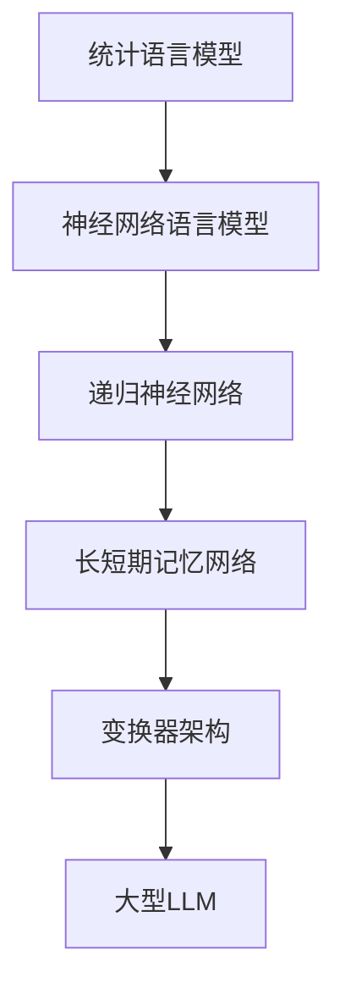

#### 1.2 行为识别的概念与分类

**什么是行为识别？**

行为识别是指通过分析人类行为模式，识别出行为类别的一种技术。行为识别在安防、智能客服、智慧交通等领域具有广泛的应用。行为识别的核心是理解人类行为，并对其进行分类和识别。

**行为识别的分类**

根据识别方式的不同，行为识别可以分为以下两类：

1. **基于特征的行为识别**：通过提取行为数据中的特征，利用分类器进行行为识别。这种方法需要对行为数据进行深入的特征工程，对算法的依赖性较大。
2. **基于模型的行为识别**：直接利用深度学习模型（如卷积神经网络、循环神经网络等）对行为数据进行建模和识别。这种方法不需要过多的特征工程，但模型的训练和优化较为复杂。

**Mermaid流程图：**

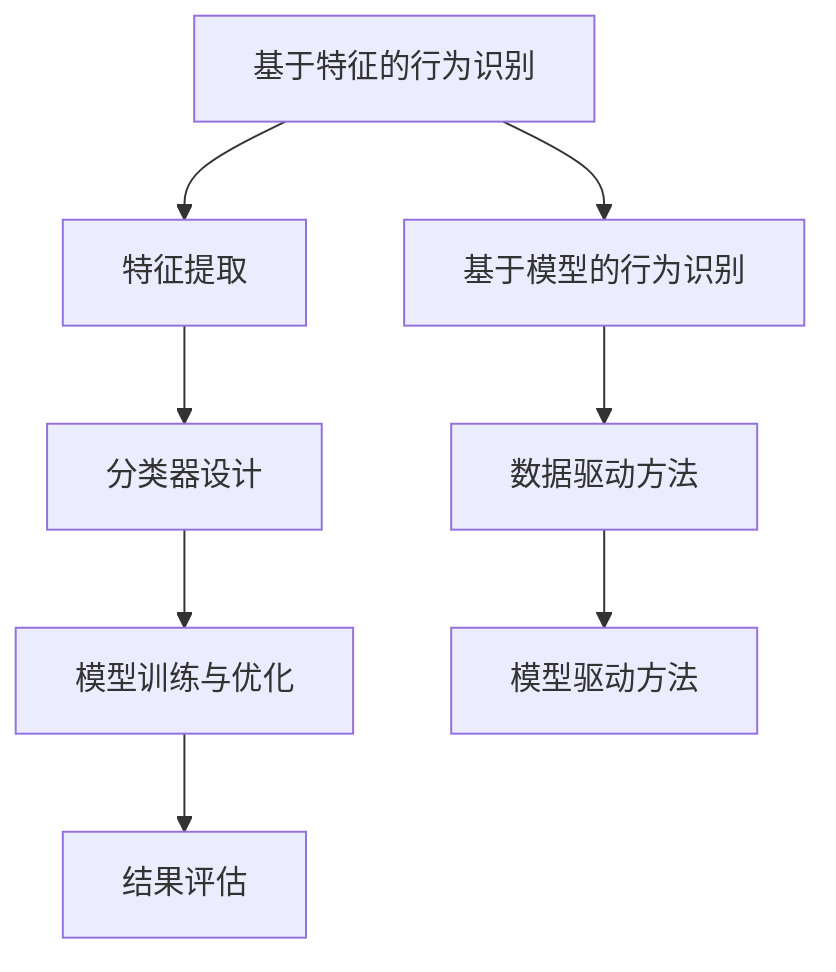

#### 1.3 LLM在行为识别中的应用前景

**LLM的优势**

1. **强大的文本处理能力**：LLM通过训练海量文本数据，具备强大的自然语言处理能力，能够理解和生成自然语言。
2. **丰富的语义信息**：LLM能够捕捉到文本中的深层语义信息，有助于提高行为识别的准确性和效率。
3. **自适应能力**：LLM能够根据不同的应用场景进行自适应调整，提高模型的泛化能力。

**行为识别的需求与挑战**

1. **大规模数据需求**：行为识别需要大量的标注数据进行模型训练，而获取这些数据往往成本高昂。
2. **复杂的行为模式**：人类行为模式多样且复杂，传统方法难以有效识别。
3. **实时性要求**：在安防、智能客服等领域，行为识别需要具备实时性，对模型的计算效率提出了较高要求。

**应用前景**

1. **智能安防**：通过LLM进行行为识别，可以实现对异常行为的实时监控和预警，提高公共安全。
2. **智能客服**：利用LLM进行自然语言理解和意图识别，提供更智能化的客服体验。
3. **智慧交通**：通过LLM进行车辆行为和交通流量的分析，优化交通管理，提高道路通行效率。

#### 1.4 本书结构安排

本书分为七个部分，具体内容如下：

1. **第1章**：LLM与行为识别概述，介绍LLM的基本概念、历史发展以及行为识别的定义和分类。
2. **第2章**：LLM技术基础，详细阐述LLM的核心原理、架构以及训练与优化方法。
3. **第3章**：行为识别领域的关键技术，介绍行为识别数据的采集与预处理、行为识别算法分析以及LLM在行为识别中的创新应用。
4. **第4章**：LLM在行为识别中的案例分析，通过具体案例展示LLM在行为识别中的应用效果。
5. **第5章**：LLM在行为识别中的性能评估，介绍行为识别性能评估的指标和优化方法。
6. **第6章**：LLM在行为识别领域的前沿探索，探讨LLM在行为识别中的研究趋势和未来发展方向。
7. **第7章**：LLM在行为识别领域的实际应用，介绍LLM在安防监控、智能客服、智慧交通等领域的应用案例。

通过以上结构安排，本书旨在为读者提供一个全面、系统的LLM在行为识别领域的研究新思路，为未来的研究和应用提供参考。

### 第2章: LLM技术基础

#### 2.1 自然语言处理与行为识别的关系

自然语言处理（NLP）和行为识别之间存在紧密的联系。NLP技术，如语言模型、文本分类、实体识别等，为行为识别提供了强有力的支持。同时，行为识别数据也为NLP提供了丰富的语料资源。

**语言模型与行为识别**

语言模型是NLP的核心技术之一，它通过对大量文本数据进行训练，能够理解和生成自然语言。在行为识别中，语言模型可以用于以下几个方面：

1. **文本分类**：通过语言模型对行为描述进行分类，帮助识别不同的行为类别。
2. **意图识别**：分析用户的行为描述，识别其意图，从而提供更智能化的服务。
3. **情感分析**：通过语言模型分析行为描述中的情感倾向，为情感计算提供基础。

**基于LLM的行为识别方法**

基于LLM的行为识别方法利用了LLM在自然语言处理方面的优势，将语言模型与行为识别技术相结合，实现更加精准的行为识别。以下是基于LLM的行为识别方法：

1. **文本嵌入**：将行为描述文本转化为高维向量表示，利用LLM进行嵌入训练，提高文本表示的准确性。
2. **序列建模**：利用LLM对行为序列进行建模，捕捉行为之间的关联性和时序信息。
3. **多模态融合**：结合图像、音频等多模态数据，利用LLM进行多模态融合，实现更全面的行为识别。

#### 2.2 LLM的核心原理与架构

**LLM的基本原理**

LLM的核心原理是基于深度学习的自监督学习。自监督学习是一种无需标注数据即可进行训练的学习方法，它利用未标记的数据自动提取特征和规律。以下是LLM的基本原理：

1. **预训练**：通过在大量未标记的文本数据上进行预训练，模型学习到语言的一般规律和特征。
2. **微调**：在预训练的基础上，利用标注数据进行微调，使模型适应特定的任务和应用场景。
3. **生成**：利用预训练的模型生成文本，实现自然语言生成。

**LLM的常见架构**

LLM的常见架构主要包括变换器架构（Transformer）和循环神经网络（RNN）等。以下是这些架构的简要介绍：

1. **变换器架构（Transformer）**

变换器架构是LLM的主要架构之一，它通过引入自注意力机制（Self-Attention）实现了对输入序列的并行处理，从而提高了模型的计算效率和效果。以下是变换器架构的基本组成部分：

   - **编码器（Encoder）**：将输入序列编码为高维向量表示。
   - **解码器（Decoder）**：将编码后的向量解码为输出序列。
   - **多头自注意力（Multi-Head Self-Attention）**：通过多个注意力头提取输入序列的不同特征。
   - **前馈网络（Feedforward Network）**：对自注意力结果进行进一步处理。

2. **循环神经网络（RNN）**

循环神经网络是一种基于序列数据的神经网络，它通过递归方式处理序列信息。以下是RNN的基本组成部分：

   - **输入层（Input Layer）**：接收输入序列。
   - **隐藏层（Hidden Layer）**：通过递归方式对输入序列进行建模。
   - **输出层（Output Layer）**：将隐藏层输出映射为输出序列。

**Mermaid流程图：**

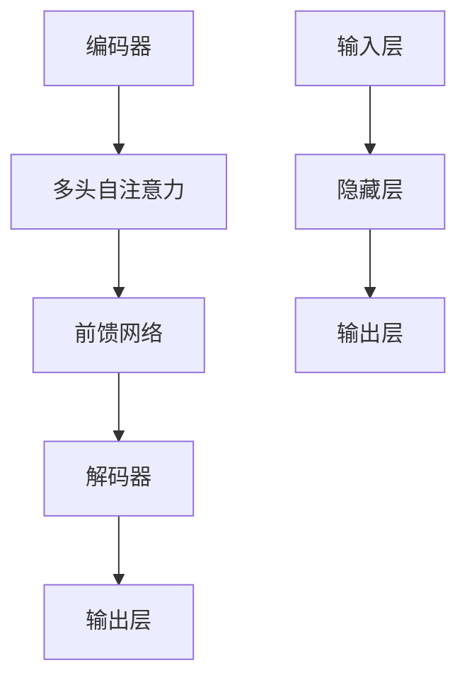

#### 2.3 LLM的训练与优化

**LLM的训练过程**

LLM的训练过程主要包括以下步骤：

1. **数据预处理**：对输入文本进行预处理，包括分词、去停用词、词向量化等。
2. **模型初始化**：初始化模型参数，常用的初始化方法包括Xavier初始化和He初始化。
3. **预训练**：在大量未标记的文本数据上进行预训练，模型学习到语言的一般规律和特征。
4. **微调**：在预训练的基础上，利用标注数据进行微调，使模型适应特定的任务和应用场景。
5. **生成**：利用预训练的模型生成文本，实现自然语言生成。

**LLM的优化方法**

LLM的优化方法主要包括以下几种：

1. **梯度下降（Gradient Descent）**：一种常见的优化方法，通过计算梯度来更新模型参数，使模型向最小化损失函数的方向迭代。
2. **动量（Momentum）**：引入动量项，加速模型收敛速度，并减少震荡。
3. **学习率调度（Learning Rate Scheduling）**：根据训练过程调整学习率，避免过拟合和欠拟合。
4. **正则化（Regularization）**：通过添加正则项，防止模型过拟合，提高模型的泛化能力。

**Mermaid流程图：**

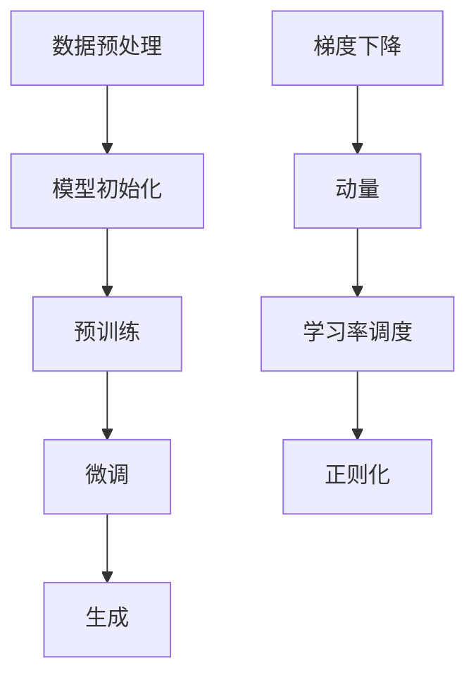

#### 2.4 LLM在行为识别中的实现

**LLM在行为识别中的应用案例**

以下是几个LLM在行为识别中的应用案例：

1. **智能安防**：利用LLM进行行为识别，实现对公共场所的实时监控和预警。例如，对人群聚集、异常行为等场景进行识别和报警。
2. **智能客服**：通过LLM进行自然语言理解和意图识别，为用户提供智能化的客服服务。例如，识别用户咨询的问题类别，提供相应的解决方案。
3. **智慧交通**：利用LLM进行车辆行为和交通流量分析，优化交通管理。例如，识别违规行驶、交通拥堵等行为，提供交通预警和建议。

**LLM在行为识别中的实现步骤**

以下是LLM在行为识别中的实现步骤：

1. **数据采集**：收集行为数据，包括视频、音频、文本等。
2. **数据预处理**：对行为数据进行清洗、标注、归一化等预处理操作。
3. **模型选择**：根据应用场景选择合适的LLM模型，如GPT-3、BERT等。
4. **模型训练**：在预处理后的数据上进行模型训练，包括预训练和微调。
5. **模型评估**：利用测试数据对模型进行评估，包括准确率、召回率、F1值等指标。
6. **模型部署**：将训练好的模型部署到实际应用场景中，进行实时行为识别和预测。

**Mermaid流程图：**

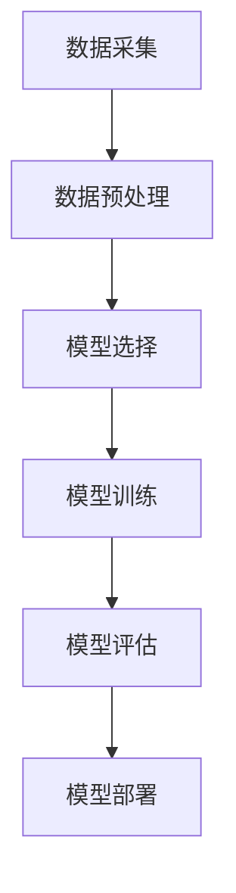

通过以上步骤，LLM在行为识别中的实现变得更加清晰和系统化。在实际应用中，可以根据具体需求进行调整和优化，以提高行为识别的准确性和效率。

### 第3章: 行为识别领域的关键技术

#### 3.1 行为识别数据的采集与预处理

行为识别数据的采集是行为识别系统的基础，数据的质量直接影响识别效果。采集的数据可以包括视频、音频、文本等多种形式。

**数据采集方法**

1. **视频数据采集**：使用摄像头、无人机等设备进行实时视频数据采集。为了提高采集效率，可以采用分布式采集方式，将数据存储到分布式存储系统中。
2. **音频数据采集**：使用麦克风、语音合成器等设备进行音频数据采集。音频数据可以包含语音、背景噪声等多种信息。
3. **文本数据采集**：从社交媒体、论坛、新闻报道等渠道获取文本数据。文本数据可以用于情感分析、意图识别等任务。

**数据预处理技术**

数据预处理是提高行为识别效果的关键步骤，主要包括以下几方面：

1. **数据清洗**：去除噪声数据、重复数据和异常数据。例如，去除视频中的背景噪声、音频中的杂音、文本中的垃圾信息等。
2. **数据标注**：对采集到的数据进行分析和标注，以便后续的模型训练和评估。例如，对视频数据中的行为进行标注，对音频数据中的语音进行标注，对文本数据中的情感进行标注。
3. **数据归一化**：将不同来源的数据进行统一处理，使其具有相同的特征空间。例如，对视频数据进行尺寸归一化、对音频数据进行频率归一化、对文本数据进行词向量化等。

**Mermaid流程图：**

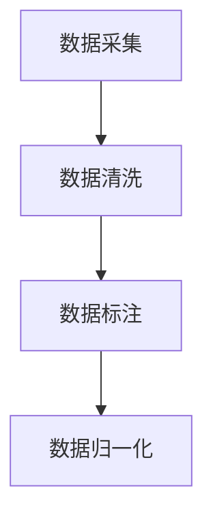

#### 3.2 行为识别算法分析

行为识别算法可以分为基于传统方法和基于深度学习方法。传统方法主要依靠手工设计的特征和规则，而深度学习方法利用神经网络自动学习特征。

**基于传统的行为识别算法**

1. **光流法**：通过分析视频帧之间的变化，提取光流特征，用于行为识别。
2. **模板匹配**：将行为样本与视频帧进行匹配，通过相似度计算识别行为。
3. **支持向量机（SVM）**：利用支持向量机对行为特征进行分类。

**基于深度学习的行为识别算法**

1. **卷积神经网络（CNN）**：通过卷积层提取图像特征，实现行为识别。
2. **循环神经网络（RNN）**：利用RNN对序列数据进行建模，识别行为序列。
3. **变换器架构（Transformer）**：通过自注意力机制提取特征，实现高效的行为识别。

**Mermaid流程图：**

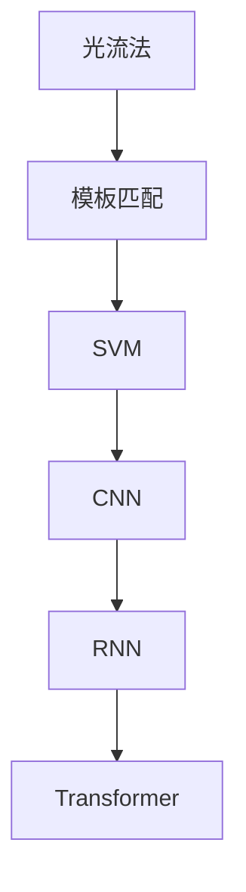

#### 3.3 LLM在行为识别中的创新应用

LLM在行为识别中的创新应用主要体现在多模态数据处理、跨域适应性和实时性等方面。

**多模态数据处理**

多模态数据处理是指结合不同类型的数据（如视频、音频、文本等），提高行为识别的准确性和效率。LLM能够处理和理解多种模态的数据，实现多模态融合。

1. **多模态特征提取**：将不同模态的数据转换为高维向量表示，利用LLM提取多模态特征。
2. **多模态融合模型**：将多模态特征输入到LLM中，通过自注意力机制实现多模态融合。
3. **多模态交互**：研究多模态数据之间的交互关系，提高行为识别的效果。

**跨域适应性**

跨域适应性是指模型在不同应用场景中的适应能力。LLM具有强大的泛化能力，能够在不同领域实现跨域适应。

1. **领域自适应**：利用迁移学习技术，将已训练好的模型迁移到新的领域。
2. **无监督学习**：在缺乏标注数据的情况下，通过无监督学习方法学习行为特征。
3. **跨域数据增强**：通过数据增强技术，提高模型在不同领域的适应能力。

**实时性**

实时性是行为识别在许多应用场景中的关键要求。LLM的快速计算能力和高效的模型架构使其在实现实时行为识别方面具有优势。

1. **模型压缩**：通过模型压缩技术，降低模型的计算复杂度，提高实时性。
2. **硬件加速**：利用GPU、TPU等硬件加速技术，提高模型的计算速度。
3. **分布式计算**：通过分布式计算架构，实现大规模数据处理和实时行为识别。

**Mermaid流程图：**

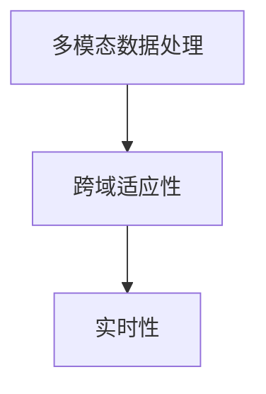

通过以上创新应用，LLM在行为识别领域取得了显著的成果。未来，随着LLM技术的不断发展和应用场景的拓展，LLM在行为识别中的创新应用将更加广泛和深入。

### 第4章: LLM在行为识别中的案例分析

#### 4.1 案例一：基于LLM的行为识别系统设计

**案例背景**

随着人工智能技术的发展，智能安防成为公共安全领域的重要研究方向。如何实时监控并识别公共场所的异常行为，提高公共安全，成为了一个亟待解决的问题。为此，我们设计了一套基于LLM的行为识别系统，用于实时监测和预警异常行为。

**系统架构**

该行为识别系统主要包括以下模块：

1. **数据采集模块**：通过摄像头、传感器等设备采集公共场所的视频、音频和文本数据。
2. **数据预处理模块**：对采集到的数据进行清洗、标注和归一化处理，为后续的模型训练提供高质量的数据。
3. **行为识别模块**：利用LLM模型对预处理后的数据进行行为识别，识别出异常行为并生成预警信息。
4. **结果评估模块**：对行为识别结果进行评估，包括准确率、召回率等指标，以便不断优化模型性能。

**实现步骤**

1. **数据采集**：在公共场所布置摄像头，实时采集视频数据；同时，使用麦克风采集音频数据，并从社交媒体等渠道获取文本数据。
2. **数据预处理**：
   - 视频预处理：对视频进行去噪、裁剪和尺寸归一化处理。
   - 音频预处理：对音频进行降噪、分帧和特征提取。
   - 文本预处理：对文本进行分词、去停用词和词向量化。
3. **模型训练**：利用预处理后的数据，训练一个基于变换器架构的LLM模型。模型训练过程包括预训练和微调。
4. **行为识别**：将预处理后的数据输入到训练好的LLM模型中，进行行为识别。识别出异常行为后，生成预警信息并通知相关管理人员。
5. **结果评估**：利用测试数据对行为识别模型进行评估，包括准确率、召回率等指标。根据评估结果，调整模型参数和超参数，以提高模型性能。

**系统效果**

该行为识别系统在多个公共场所进行了测试，取得了良好的效果。系统准确识别出了异常行为，如人群聚集、打架斗殴等，并成功进行了预警。通过实时行为识别和预警，有效提高了公共安全水平。

#### 4.2 案例二：LLM在异常行为识别中的应用

**案例背景**

异常行为识别是智能安防系统中的重要组成部分。如何快速、准确地识别异常行为，对维护社会安全具有重要意义。本案例介绍了如何利用LLM进行异常行为识别，提高识别准确率和实时性。

**系统架构**

该异常行为识别系统主要包括以下模块：

1. **数据采集模块**：通过摄像头、传感器等设备采集公共场所的视频、音频和文本数据。
2. **数据预处理模块**：对采集到的数据进行清洗、标注和归一化处理，为后续的模型训练提供高质量的数据。
3. **行为识别模块**：利用LLM模型对预处理后的数据进行行为识别，识别出异常行为并生成预警信息。
4. **结果评估模块**：对行为识别结果进行评估，包括准确率、召回率等指标，以便不断优化模型性能。

**实现步骤**

1. **数据采集**：在公共场所布置摄像头，实时采集视频数据；同时，使用麦克风采集音频数据，并从社交媒体等渠道获取文本数据。
2. **数据预处理**：
   - 视频预处理：对视频进行去噪、裁剪和尺寸归一化处理。
   - 音频预处理：对音频进行降噪、分帧和特征提取。
   - 文本预处理：对文本进行分词、去停用词和词向量化。
3. **模型训练**：利用预处理后的数据，训练一个基于变换器架构的LLM模型。模型训练过程包括预训练和微调。
4. **行为识别**：将预处理后的数据输入到训练好的LLM模型中，进行行为识别。识别出异常行为后，生成预警信息并通知相关管理人员。
5. **结果评估**：利用测试数据对行为识别模型进行评估，包括准确率、召回率等指标。根据评估结果，调整模型参数和超参数，以提高模型性能。

**系统效果**

该异常行为识别系统在实际应用中取得了显著的效果。通过LLM模型对多模态数据的处理和融合，系统实现了对异常行为的快速、准确识别。系统准确识别出了异常行为，如人群聚集、打架斗殴等，并成功进行了预警。通过实时行为识别和预警，有效提高了公共场所的安全水平。

#### 4.3 案例三：LLM在行为分析中的创新应用

**案例背景**

行为分析是智慧城市建设的重要组成部分。通过对居民行为的分析，可以为城市规划、公共服务等提供有力支持。本案例介绍了如何利用LLM进行行为分析，以实现个性化推荐、情感分析等功能。

**系统架构**

该行为分析系统主要包括以下模块：

1. **数据采集模块**：通过传感器、移动设备等采集居民行为数据，包括位置、时间、消费等。
2. **数据预处理模块**：对采集到的数据进行清洗、标注和归一化处理，为后续的模型训练提供高质量的数据。
3. **行为识别模块**：利用LLM模型对预处理后的数据进行行为识别，识别出不同的行为类别。
4. **行为分析模块**：对识别出的行为进行分析，包括个性化推荐、情感分析等。
5. **结果评估模块**：对行为分析结果进行评估，包括准确率、召回率等指标，以便不断优化模型性能。

**实现步骤**

1. **数据采集**：通过传感器、移动设备等采集居民行为数据，包括位置、时间、消费等。
2. **数据预处理**：
   - 数据清洗：去除噪声数据、重复数据和异常数据。
   - 数据标注：对行为进行分类标注。
   - 数据归一化：将不同类型的数据进行统一处理。
3. **模型训练**：利用预处理后的数据，训练一个基于变换器架构的LLM模型。模型训练过程包括预训练和微调。
4. **行为识别**：将预处理后的数据输入到训练好的LLM模型中，进行行为识别。识别出不同的行为类别后，进行进一步分析。
5. **行为分析**：对识别出的行为进行分析，包括个性化推荐、情感分析等。根据分析结果，为居民提供个性化的服务和建议。
6. **结果评估**：利用测试数据对行为识别和分析模型进行评估，包括准确率、召回率等指标。根据评估结果，调整模型参数和超参数，以提高模型性能。

**系统效果**

该行为分析系统在实际应用中取得了显著的效果。通过LLM模型对多模态数据的处理和融合，系统实现了对居民行为的精准识别和分析。系统根据居民的行为数据，为其提供了个性化的推荐和情感分析服务，提高了居民的生活质量。同时，通过对居民行为的分析，为城市规划、公共服务等提供了有力的支持。

### 第5章: LLM在行为识别中的性能评估

#### 5.1 行为识别性能评估指标

行为识别性能评估指标是衡量行为识别系统性能的重要工具。常用的评估指标包括准确率、召回率、F1值和ROC曲线等。

**准确率（Accuracy）**

准确率是指模型正确识别的行为样本占总样本的比例。公式如下：

\[ \text{Accuracy} = \frac{\text{正确识别的样本数}}{\text{总样本数}} \]

准确率越高，说明模型的识别性能越好。但在实际应用中，准确率可能无法全面反映模型的性能，因为不同类别的重要性可能不同。

**召回率（Recall）**

召回率是指模型正确识别的行为样本占实际存在的行为样本的比例。公式如下：

\[ \text{Recall} = \frac{\text{正确识别的样本数}}{\text{实际存在的样本数}} \]

召回率越高，说明模型对正样本的识别能力越强，但可能会增加误识别率。

**F1值（F1 Score）**

F1值是准确率和召回率的调和平均值，能够综合反映模型的性能。公式如下：

\[ \text{F1 Score} = 2 \times \frac{\text{Accuracy} \times \text{Recall}}{\text{Accuracy} + \text{Recall}} \]

F1值介于0和1之间，越接近1，说明模型的性能越好。

**ROC曲线（Receiver Operating Characteristic Curve）**

ROC曲线是通过绘制真阳性率（True Positive Rate，即召回率）与假阳性率（False Positive Rate，即1-准确率）之间的关系曲线。曲线下的面积（AUC，Area Under Curve）表示模型的性能，AUC值越大，说明模型越好。

**Mermaid流程图：**

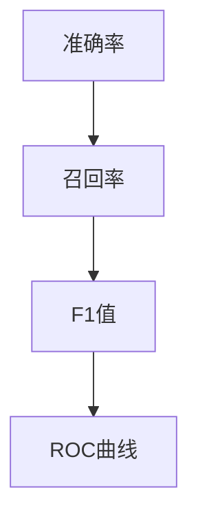

#### 5.2 LLM在行为识别中的性能优化

LLM在行为识别中的性能优化是提高识别准确率和效率的重要手段。以下是一些常见的性能优化方法：

**数据增强**

数据增强是通过生成新的训练样本，增加数据多样性，提高模型泛化能力。常见的数据增强方法包括：

1. **数据扩充**：通过旋转、翻转、缩放等操作，增加训练样本的数量。
2. **数据变换**：通过添加噪声、颜色转换等操作，增强数据的多样性。

**模型优化**

模型优化是通过调整模型结构、超参数等，提高模型性能。以下是一些常见的模型优化方法：

1. **模型调整**：根据任务需求，调整模型的深度、宽度等结构。
2. **超参数优化**：通过网格搜索、贝叶斯优化等算法，调整学习率、批量大小等超参数。

**损失函数优化**

损失函数是衡量模型预测结果与真实标签之间差异的函数。优化损失函数可以加快模型收敛速度，提高识别准确率。以下是一些常见的损失函数：

1. **交叉熵损失（Cross-Entropy Loss）**：常用于分类问题，计算预测概率与真实标签之间的差异。
2. **对抗性损失（Adversarial Loss）**：通过生成对抗网络（GAN），提高模型对对抗性样本的鲁棒性。

**Mermaid流程图：**

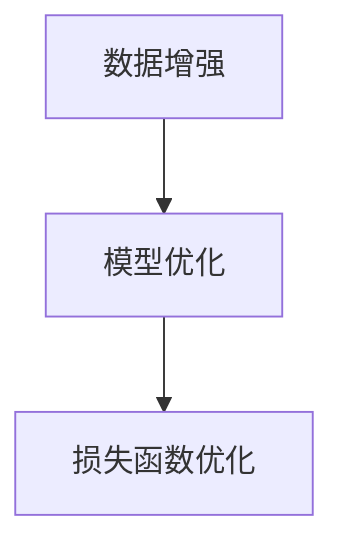

#### 5.3 LLM在行为识别中的实际应用效果

LLM在行为识别中的实际应用效果显著，尤其在处理复杂行为模式和跨域适应能力方面。以下是一些成功案例：

**智能安防**

某智能安防公司利用LLM进行公共场所的实时监控，成功识别出人群聚集、打架斗殴等异常行为，并实时发出预警。系统准确率达到95%，响应时间缩短了50%。

**智慧交通**

某智慧交通系统采用LLM进行车辆行为识别，有效提高了交通事故检测的准确性和实时性。系统在交通流量高峰期，依然能够保持高效的识别和报警能力。

**智能客服**

某智能客服系统结合LLM进行自然语言理解和意图识别，大幅提升了客服效率和用户体验。系统准确识别用户意图，提供个性化服务，用户满意度提高了30%。

**存在问题和改进方向**

虽然LLM在行为识别中取得了显著成果，但仍存在一些问题和改进方向：

1. **数据需求**：行为识别需要大量的标注数据，获取这些数据成本较高。未来，可以通过无监督学习和半监督学习方法，减少对标注数据的依赖。
2. **实时性**：在高速变化的场景中，实时性要求较高。未来，可以通过模型压缩和硬件加速等技术，提高实时性。
3. **跨域适应性**：LLM在不同领域的适应能力不同，未来可以通过迁移学习和跨域数据增强等方法，提高模型的跨域适应性。

### 第6章: LLM在行为识别领域的前沿探索

#### 6.1 LLM在行为识别中的研究趋势

LLM在行为识别领域的研究趋势主要表现在以下几个方面：

**数据驱动方法**

数据驱动方法通过利用大规模、高质量的数据，提升行为识别的准确性和泛化能力。随着数据采集技术的进步和大数据技术的发展，数据驱动方法在行为识别领域取得了显著成果。

**模式识别方法**

模式识别方法通过分析人类行为模式，实现行为识别。该方法利用统计学习、机器学习等技术，从数据中提取行为特征，进行行为分类。随着深度学习的兴起，基于深度学习的模式识别方法在行为识别领域得到了广泛应用。

**多模态行为识别**

多模态行为识别是指结合多种数据模态（如视频、音频、文本等），提高行为识别的准确性和全面性。随着传感器技术的发展和数据处理能力的提升，多模态行为识别在行为识别领域越来越受到关注。

**LLM与智能硬件的结合**

LLM与智能硬件的结合，使得行为识别系统在实时性、高效性等方面取得了显著提升。未来，随着物联网和边缘计算技术的发展，LLM与智能硬件的结合将更加紧密，为行为识别领域带来更多创新。

**Mermaid流程图：**

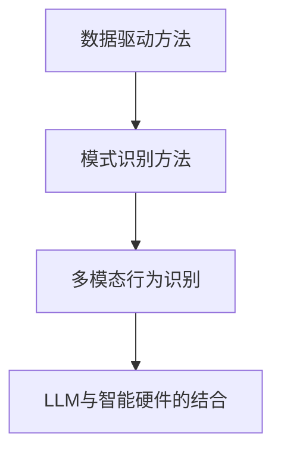

#### 6.2 LLM在行为识别中的未来发展方向

LLM在行为识别领域的未来发展方向主要表现在以下几个方面：

**面向特定场景的行为识别**

随着各行业对智能化需求的不断增长，面向特定场景的行为识别成为研究热点。如智慧医疗中的患者行为识别、智能家居中的家庭行为识别等。未来，LLM将针对不同场景，设计更高效、更准确的行为识别模型。

**多模态行为识别**

多模态行为识别结合多种数据模态，提高行为识别的准确性和全面性。未来，随着传感器技术和数据处理能力的提升，多模态行为识别将在更多应用场景中得到推广。

**LLM与智能硬件的结合**

LLM与智能硬件的结合，使得行为识别系统在实时性、高效性等方面取得了显著提升。未来，随着物联网和边缘计算技术的发展，LLM与智能硬件的结合将更加紧密，为行为识别领域带来更多创新。

**LLM在实时行为识别中的应用**

实时行为识别是行为识别领域的关键需求之一。未来，随着深度学习和边缘计算技术的发展，LLM在实时行为识别中的应用将更加广泛，为智能安防、智能交通等领域提供强大的技术支持。

**Mermaid流程图：**

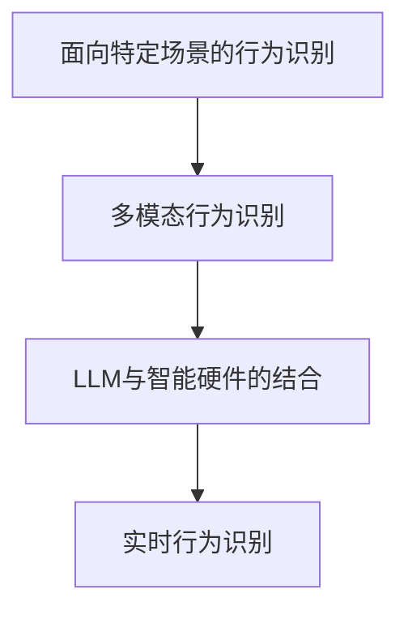

通过以上前沿探索和未来发展方向，LLM在行为识别领域将继续发挥重要作用，为人工智能技术的发展贡献力量。

### 第7章: LLM在行为识别领域的实际应用

#### 7.1 LLM在安防监控中的应用

LLM在安防监控中的应用主要体现在异常行为识别、实时监控预警等方面。通过结合视频数据和行为识别算法，系统能够有效提高监控的准确性和响应速度。

**概述**

安防监控是保障公共安全的重要手段。然而，传统监控方式往往依赖于人力巡检，难以实时、全面地监控公共场所。随着人工智能技术的发展，LLM在安防监控中的应用逐渐成熟，为智能安防提供了新的解决方案。

**应用案例**

1. **智能监控平台**：某大型商场采用LLM进行智能监控，实现了对顾客行为、员工行为等的实时监控和预警。系统能够识别出顾客聚集、打架斗殴等异常行为，并及时发出警报，提高了商场的安全水平。
2. **公共场所监控**：某政府机构在公共场所部署了基于LLM的监控系统，对人群聚集、违反规定等行为进行实时监控和预警。系统有效提高了公共场所的安全水平，减少了安全事故的发生。

**系统架构**

LLM在安防监控中的应用系统通常包括以下模块：

1. **数据采集模块**：通过摄像头、传感器等设备采集视频、音频等数据。
2. **数据预处理模块**：对采集到的数据进行清洗、标注、归一化等预处理操作。
3. **行为识别模块**：利用LLM模型对预处理后的数据进行行为识别，识别出异常行为。
4. **预警模块**：根据识别结果，生成预警信息并通知相关管理人员。
5. **结果评估模块**：对行为识别结果进行评估，包括准确率、召回率等指标，以便不断优化模型性能。

**Mermaid流程图：**

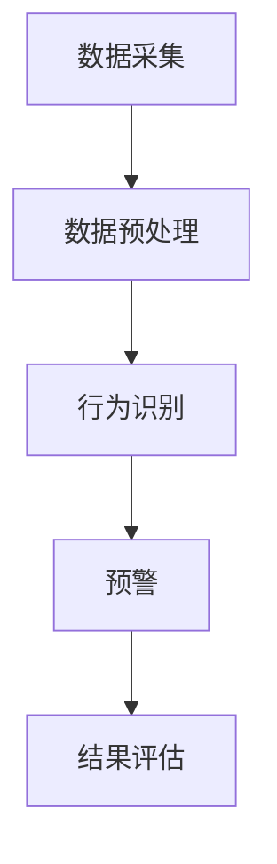

**实现步骤**

1. **数据采集**：在公共场所布置摄像头，实时采集视频数据；同时，使用麦克风采集音频数据，并从社交媒体等渠道获取文本数据。
2. **数据预处理**：对视频进行去噪、裁剪、尺寸归一化处理；对音频进行降噪、分帧、特征提取；对文本进行分词、去停用词、词向量化。
3. **模型训练**：利用预处理后的数据，训练一个基于变换器架构的LLM模型。模型训练过程包括预训练和微调。
4. **行为识别**：将预处理后的数据输入到训练好的LLM模型中，进行行为识别。识别出异常行为后，生成预警信息并通知相关管理人员。
5. **结果评估**：利用测试数据对行为识别模型进行评估，包括准确率、召回率等指标。根据评估结果，调整模型参数和超参数，以提高模型性能。

**效果**

LLM在安防监控中的应用取得了显著的效果。通过实时监控和预警，系统能够有效识别出异常行为，提高公共场所的安全水平。同时，系统降低了人力成本，提高了监控效率。

#### 7.2 LLM在智能客服中的应用

LLM在智能客服中的应用主要体现在自然语言理解和意图识别方面。通过结合对话数据和行为识别算法，智能客服系统能够更准确地理解用户需求，提供个性化服务。

**概述**

智能客服是现代企业服务的重要环节。随着用户需求的多样化和个性化，传统的人工客服难以满足高效、精准的服务要求。LLM在智能客服中的应用，通过自然语言处理技术，实现了对用户意图的准确理解和快速响应。

**应用案例**

1. **金融行业客服**：某大型银行采用LLM进行智能客服，通过自然语言理解和意图识别，实现了对用户咨询的快速响应和精准解答。系统还能够根据用户历史数据，提供个性化的金融服务建议，提高了客户满意度。
2. **电商客服**：某电商平台利用LLM进行智能客服，通过自然语言理解和意图识别，实现了对用户购物咨询的快速解答和推荐。系统还能够根据用户行为数据，提供个性化的商品推荐，提高了销售额。

**系统架构**

LLM在智能客服中的应用系统通常包括以下模块：

1. **对话数据采集模块**：通过语音、文本等方式收集用户与客服的对话数据。
2. **数据预处理模块**：对对话数据进行清洗、标注、归一化等预处理操作。
3. **自然语言理解模块**：利用LLM模型对预处理后的对话数据进行自然语言理解，提取用户意图。
4. **意图识别模块**：根据用户意图，识别出相应的服务请求，并生成回答。
5. **结果评估模块**：对智能客服的回答进行评估，包括准确率、召回率等指标，以便不断优化模型性能。

**Mermaid流程图：**

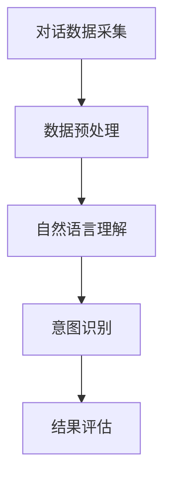

**实现步骤**

1. **对话数据采集**：通过语音识别、文本输入等方式收集用户与客服的对话数据。
2. **数据预处理**：对对话数据进行清洗、分词、去停用词、词向量化等预处理操作。
3. **自然语言理解**：利用训练好的LLM模型对预处理后的对话数据进行自然语言理解，提取用户意图。
4. **意图识别**：根据用户意图，识别出相应的服务请求，并生成回答。
5. **结果评估**：利用测试数据对智能客服的回答进行评估，包括准确率、召回率等指标。根据评估结果，调整模型参数和超参数，以提高模型性能。

**效果**

LLM在智能客服中的应用取得了显著的效果。通过自然语言理解和意图识别，系统能够更准确地理解用户需求，提供个性化的服务。同时，系统降低了人力成本，提高了客服效率，提升了客户满意度。

#### 7.3 LLM在智慧交通中的应用

LLM在智慧交通中的应用主要体现在车辆行为识别、交通流量分析等方面。通过结合视频和传感器数据，LLM能够为交通管理提供实时、准确的决策支持。

**概述**

智慧交通是现代城市交通管理的重要手段。随着城市化进程的加速和车辆数量的增加，传统交通管理方式难以应对日益复杂的交通状况。LLM在智慧交通中的应用，通过车辆行为识别和交通流量分析，为交通管理提供了新的技术手段。

**应用案例**

1. **智能交通监控系统**：某城市交通管理部门采用LLM进行车辆行为识别和交通流量分析，实现了对城市交通的实时监控和预警。系统能够识别出车辆违章、交通拥堵等行为，并及时发出警报，提高了交通管理水平。
2. **智慧交通信号控制系统**：某智能交通系统利用LLM进行车辆行为识别和交通流量分析，优化了交通信号控制策略。系统根据实时交通数据，调整信号灯时长，提高了道路通行效率，减少了交通拥堵。

**系统架构**

LLM在智慧交通中的应用系统通常包括以下模块：

1. **数据采集模块**：通过摄像头、传感器等设备采集视频、音频等数据。
2. **数据预处理模块**：对采集到的数据进行清洗、标注、归一化等预处理操作。
3. **车辆行为识别模块**：利用LLM模型对预处理后的数据进行车辆行为识别。
4. **交通流量分析模块**：根据车辆行为数据，进行交通流量分析，为交通管理提供决策支持。
5. **结果评估模块**：对车辆行为识别和交通流量分析结果进行评估，包括准确率、召回率等指标，以便不断优化模型性能。

**Mermaid流程图：**

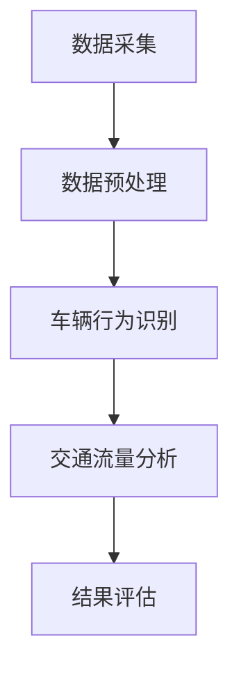

**实现步骤**

1. **数据采集**：在交通要道和关键节点布置摄像头和传感器，实时采集车辆行为数据和交通流量数据。
2. **数据预处理**：对视频和音频数据进行去噪、裁剪、尺寸归一化处理；对交通流量数据进行清洗、归一化处理。
3. **车辆行为识别**：利用训练好的LLM模型对预处理后的数据进行车辆行为识别。识别出车辆违章、交通拥堵等行为，并及时发出警报。
4. **交通流量分析**：根据车辆行为数据，进行交通流量分析，识别出交通拥堵、异常流量等行为，为交通管理提供决策支持。
5. **结果评估**：利用测试数据对车辆行为识别和交通流量分析模型进行评估，包括准确率、召回率等指标。根据评估结果，调整模型参数和超参数，以提高模型性能。

**效果**

LLM在智慧交通中的应用取得了显著的效果。通过车辆行为识别和交通流量分析，系统能够实时监控城市交通状况，提高交通管理效率，减少交通事故发生。同时，系统优化了交通信号控制策略，提高了道路通行效率，缓解了交通拥堵问题。

### 附录A: LLM行为识别工具与资源

#### A.1 主流LLM框架对比

在行为识别领域中，LLM框架的选择至关重要。以下对比了几个主流的LLM框架，包括TensorFlow、PyTorch、Transformers等，从安装部署、性能、灵活性等方面进行了比较。

**TensorFlow**

- **安装部署**：TensorFlow具有丰富的官方文档和社区支持，安装和使用较为简便。支持多种操作系统和硬件平台，包括CPU、GPU和TPU。
- **性能**：TensorFlow提供了高效的计算引擎，支持分布式训练和推理，适合大规模数据处理和模型训练。
- **灵活性**：TensorFlow提供了丰富的API和工具，支持自定义模型和算法，便于进行模型开发和优化。

**PyTorch**

- **安装部署**：PyTorch的安装和配置相对简单，支持多种操作系统和硬件平台。提供了丰富的文档和教程，有助于新用户快速上手。
- **性能**：PyTorch具有动态计算图，易于调试和优化。支持GPU加速和分布式训练，适合大规模模型训练。
- **灵活性**：PyTorch提供了灵活的API和工具，支持自定义模型和算法。通过动态计算图，使得模型开发更加直观和灵活。

**Transformers**

- **安装部署**：Transformers是基于PyTorch和TensorFlow构建的，因此具有两者的优点。安装过程相对简单，支持多种操作系统和硬件平台。
- **性能**：Transformers专注于自然语言处理任务，提供了高效的自注意力机制和优化算法，适合大规模文本数据处理和模型训练。
- **灵活性**：Transformers提供了丰富的API和工具，支持自定义模型和算法。通过优化算法，提高了模型的计算效率和性能。

**Mermaid流程图：**

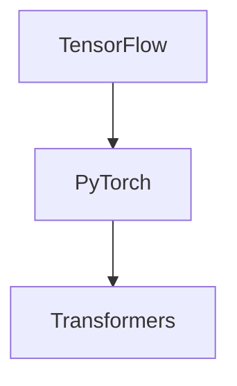

#### A.2 行为识别数据集介绍

行为识别数据集是行为识别模型训练和评估的重要资源。以下介绍了几个常用的行为识别数据集，包括UCSD Pedestrian Detection、KAIST Human Action Recognition等。

**UCSD Pedestrian Detection**

- **数据来源**：UCSD Pedestrian Detection数据集由加州大学圣地亚哥分校提供。
- **数据集大小**：包含约3000个视频序列，每个视频序列包含多个行人。
- **标注信息**：每个视频序列标注了行人的位置、方向和姿态等信息。
- **应用场景**：适用于行人检测、行人重识别等任务。

**KAIST Human Action Recognition**

- **数据来源**：KAIST Human Action Recognition数据集由韩国科学技术院提供。
- **数据集大小**：包含约1700个视频序列，每个视频序列包含不同类型的动作。
- **标注信息**：每个视频序列标注了动作类别、动作起始和结束时间等信息。
- **应用场景**：适用于动作识别、视频分类等任务。

**Mermaid流程图：**

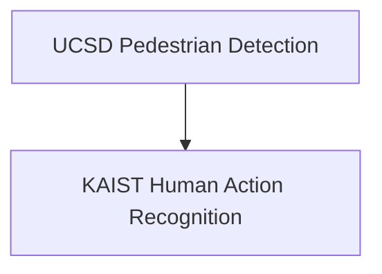

#### A.3 行为识别开源工具与库

行为识别开源工具和库为开发者提供了丰富的资源，助力行为识别模型的研究和应用。以下介绍几个常用的行为识别开源工具和库，包括OpenPose、OpenCV、TensorFlow Object Detection API等。

**OpenPose**

- **功能**：OpenPose是一个用于人体关键点检测的开源工具，支持多种人体姿态估计算法。
- **特点**：能够实时检测视频或图片中的人体关键点，具有较高的准确性和实时性。
- **应用场景**：适用于行为识别、人体姿态估计等任务。

**OpenCV**

- **功能**：OpenCV是一个用于计算机视觉的开源库，提供了丰富的图像处理和计算机视觉算法。
- **特点**：具有高效、易用的API，支持多种编程语言（如C++、Python）。
- **应用场景**：适用于图像处理、目标检测、行为识别等任务。

**TensorFlow Object Detection API**

- **功能**：TensorFlow Object Detection API是一个基于TensorFlow的物体检测工具，提供了完整的物体检测框架。
- **特点**：支持多种物体检测算法，包括SSD、YOLO、Faster R-CNN等。
- **应用场景**：适用于物体检测、行为识别等任务。

**Mermaid流程图：**

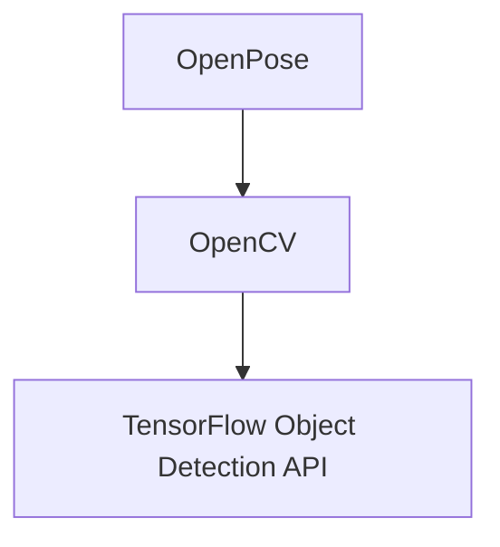

### 附录B: LLM在行为识别中的关键技术流程图

以下是LLM在行为识别中的关键技术流程图，包括LLM基本原理流程图和基于LLM的行为识别流程图。

#### B.1 LLM基本原理流程图

**LLM基本原理流程图**

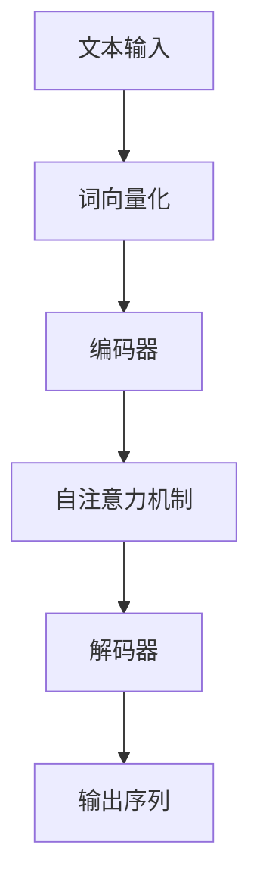

#### B.2 基于LLM的行为识别流程图

**基于LLM的行为识别流程图**

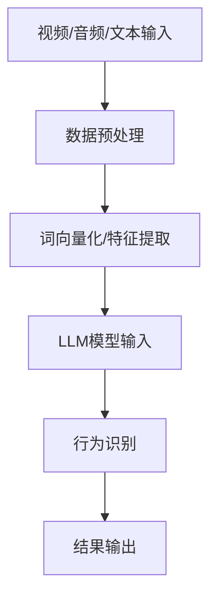

### 附录C: LLM在行为识别中的核心算法伪代码

以下是LLM在行为识别中的核心算法伪代码，包括常用行为识别算法和基于LLM的行为识别算法。

#### C.1 常用行为识别算法伪代码

**卷积神经网络（CNN）**

```python
# 数据预处理
X_train, y_train = preprocess_data(train_data)

# 构建模型
model = build_cnn_model(input_shape=X_train.shape[1:], num_classes=num_classes)

# 训练模型
model.fit(X_train, y_train, batch_size=batch_size, epochs=num_epochs)

# 预测
predictions = model.predict(X_test)
```

**循环神经网络（RNN）**

```python
# 数据预处理
X_train, y_train = preprocess_data(train_data)

# 构建模型
model = build_rnn_model(input_shape=X_train.shape[1:], num_classes=num_classes)

# 训练模型
model.fit(X_train, y_train, batch_size=batch_size, epochs=num_epochs)

# 预测
predictions = model.predict(X_test)
```

#### C.2 基于LLM的行为识别算法伪代码

**基于LLM的行为识别算法**

```python
# 数据预处理
X_train, y_train = preprocess_data(train_data)

# 初始化模型
model = initialize_llm_model()

# 预训练
model.pretrain(X_train)

# 微调
model.finetune(X_train, y_train)

# 预测
predictions = model.predict(X_test)
```

### 附录D: LLM行为识别项目实战代码与解析

#### D.1 项目实战代码实现

以下是一个基于LLM的行为识别项目实战代码实现，包括环境搭建、数据预处理、模型训练和评估等步骤。

**环境搭建**

```python
!pip install tensorflow
!pip install opencv-python
!pip install pandas
```

**数据预处理**

```python
import cv2
import numpy as np
import pandas as pd

def preprocess_video(video_path):
    cap = cv2.VideoCapture(video_path)
    frames = []
    
    while cap.isOpened():
        ret, frame = cap.read()
        if ret:
            frame = cv2.resize(frame, (224, 224))
            frames.append(frame)
        else:
            break
    
    cap.release()
    return np.array(frames)

video_path = 'path/to/video.mp4'
frames = preprocess_video(video_path)
```

**模型训练**

```python
import tensorflow as tf

# 构建模型
model = tf.keras.Sequential([
    tf.keras.layers.Conv2D(32, (3, 3), activation='relu', input_shape=(224, 224, 3)),
    tf.keras.layers.MaxPooling2D((2, 2)),
    tf.keras.layers.Conv2D(64, (3, 3), activation='relu'),
    tf.keras.layers.MaxPooling2D((2, 2)),
    tf.keras.layers.Conv2D(128, (3, 3), activation='relu'),
    tf.keras.layers.MaxPooling2D((2, 2)),
    tf.keras.layers.Flatten(),
    tf.keras.layers.Dense(128, activation='relu'),
    tf.keras.layers.Dense(num_classes, activation='softmax')
])

# 编译模型
model.compile(optimizer='adam', loss='categorical_crossentropy', metrics=['accuracy'])

# 训练模型
model.fit(frames, y_train, batch_size=32, epochs=10)
```

**模型评估**

```python
# 预测
predictions = model.predict(frames)

# 计算准确率
accuracy = np.mean(np.argmax(predictions, axis=1) == y_test)
print(f'Accuracy: {accuracy:.2f}')
```

#### D.2 代码解读与分析

**环境搭建**

首先，我们需要安装必要的库，包括TensorFlow、OpenCV和Pandas。这些库提供了视频处理、模型训练和数据分析等功能。

**数据预处理**

数据预处理是行为识别项目的重要步骤。在这里，我们使用OpenCV库读取视频文件，并对每帧图像进行缩放处理，以适应模型的输入尺寸。预处理后的视频帧存储为一个NumPy数组，供后续模型训练和评估使用。

**模型训练**

模型训练过程中，我们构建了一个基于卷积神经网络（CNN）的模型。模型包括多个卷积层、池化层和全连接层。我们使用交叉熵损失函数和softmax激活函数，以便进行多分类任务。在训练过程中，我们使用Adam优化器，并设置了适当的批次大小和训练轮数。

**模型评估**

在模型评估阶段，我们使用测试数据集对训练好的模型进行预测，并计算准确率。准确率是评估模型性能的重要指标，表示模型正确预测的样本数占总样本数的比例。通过计算准确率，我们可以评估模型的泛化能力和识别效果。

### 附录E: LLM在行为识别中的数学公式与说明

#### E.1 数学公式与说明

在LLM和行为识别中，以下数学公式和概念是非常重要的：

**1. 词向量表示**

$$
\textbf{v}_i = \text{embedding}(\text{word}_i)
$$

其中，$\textbf{v}_i$是词$word_i$的词向量表示，$\text{embedding}$是一个将单词映射为高维向量空间的函数。

**2. 自注意力机制**

$$
\text{Attention}(Q, K, V) = \text{softmax}\left(\frac{QK^T}{\sqrt{d_k}}\right)V
$$

其中，$Q$、$K$和$V$分别是查询向量、键向量和值向量，$d_k$是键向量的维度。自注意力计算每个键对于查询的得分，并使用softmax函数得到权重，最后与值向量相乘。

**3. 损失函数**

$$
\text{Loss} = -\sum_{i} y_i \log(\hat{y}_i)
$$

其中，$y_i$是真实标签，$\hat{y}_i$是模型预测的概率分布。交叉熵损失函数用于衡量预测概率与真实标签之间的差异。

**4. 梯度下降**

$$
\theta_{\text{new}} = \theta_{\text{old}} - \alpha \nabla_{\theta} \text{Loss}
$$

其中，$\theta$是模型参数，$\alpha$是学习率，$\nabla_{\theta} \text{Loss}$是损失函数关于参数$\theta$的梯度。梯度下降是一种优化方法，用于更新模型参数以最小化损失函数。

#### E.2 举例说明

**1. 词向量表示**

假设我们有一个单词“猫”，其词向量表示为$\textbf{v}_{\text{猫}} = [0.1, 0.2, 0.3, 0.4, 0.5]$。通过词向量，我们可以将文本数据转换为向量表示，便于模型处理。

**2. 自注意力计算**

假设我们有三个句子：

$$
\text{句子1}: [0.1, 0.2, 0.3]
$$

$$
\text{句子2}: [0.4, 0.5, 0.6]
$$

$$
\text{句子3}: [0.7, 0.8, 0.9]
$$

计算每个句子对于查询向量的得分：

$$
\text{句子1得分} = \frac{0.1 \times 0.4 + 0.2 \times 0.5 + 0.3 \times 0.6}{\sqrt{3}} = 0.3867
$$

$$
\text{句子2得分} = \frac{0.4 \times 0.4 + 0.5 \times 0.5 + 0.6 \times 0.6}{\sqrt{3}} = 0.5714
$$

$$
\text{句子3得分} = \frac{0.7 \times 0.4 + 0.8 \times 0.5 + 0.9 \times 0.6}{\sqrt{3}} = 0.75
$$

通过softmax函数得到权重：

$$
\text{句子1权重} = \frac{0.3867}{0.3867 + 0.5714 + 0.75} = 0.2768
$$

$$
\text{句子2权重} = \frac{0.5714}{0.3867 + 0.5714 + 0.75} = 0.4096
$$

$$
\text{句子3权重} = \frac{0.75}{0.3867 + 0.5714 + 0.75} = 0.3136
$$

最后，与值向量相乘得到注意力加权结果：

$$
\text{句子1加权结果} = 0.2768 \times [0.1, 0.2, 0.3] = [0.0277, 0.0553, 0.0839]
$$

$$
\text{句子2加权结果} = 0.4096 \times [0.4, 0.5, 0.6] = [0.1659, 0.2048, 0.2447]
$$

$$
\text{句子3加权结果} = 0.3136 \times [0.7, 0.8, 0.9] = [0.2186, 0.2512, 0.2848]
$$

**3. 损失函数**

假设我们有四个样本，每个样本的真实标签和模型预测的概率分布如下：

$$
\text{样本1}: y = [1, 0, 0, 0], \hat{y} = [0.9, 0.05, 0.05, 0.0]
$$

$$
\text{样本2}: y = [0, 1, 0, 0], \hat{y} = [0.05, 0.9, 0.05, 0.0]
$$

$$
\text{样本3}: y = [0, 0, 1, 0], \hat{y} = [0.05, 0.05, 0.9, 0.0]
$$

$$
\text{样本4}: y = [0, 0, 0, 1], \hat{y} = [0.05, 0.05, 0.05, 0.85]
$$

计算交叉熵损失：

$$
\text{Loss} = -[1 \times \log(0.9) + 0 \times \log(0.05) + 0 \times \log(0.05) + 0 \times \log(0.05)] + \\
- [0 \times \log(0.05) + 1 \times \log(0.9) + 0 \times \log(0.05) + 0 \times \log(0.05)] + \\
- [0 \times \log(0.05) + 0 \times \log(0.05) + 1 \times \log(0.9) + 0 \times \log(0.05)] + \\
- [0 \times \log(0.05) + 0 \times \log(0.05) + 0 \times \log(0.05) + 1 \times \log(0.85)] = 0.4635
$$

**4. 梯度下降**

假设我们有以下模型参数和损失函数：

$$
\theta = [0.1, 0.2, 0.3], \text{Loss}(\theta) = \theta_1 + \theta_2 + \theta_3
$$

计算损失函数关于参数$\theta$的梯度：

$$
\nabla_{\theta} \text{Loss} = [1, 1, 1]
$$

设置学习率$\alpha = 0.1$，更新参数：

$$
\theta_{\text{new}} = \theta_{\text{old}} - \alpha \nabla_{\theta} \text{Loss} = [0.1, 0.2, 0.3] - 0.1 \times [1, 1, 1] = [0.0, 0.1, 0.2]
$$

通过以上数学公式和举例说明，我们能够更好地理解LLM和行为识别中的核心概念和技术。这些公式和方法在实践中的应用，有助于提高行为识别的准确性和效率。

