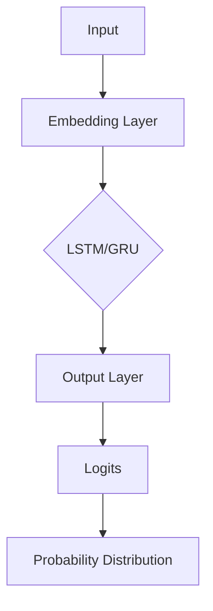
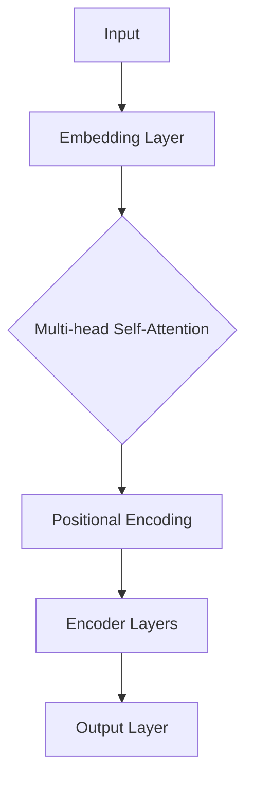
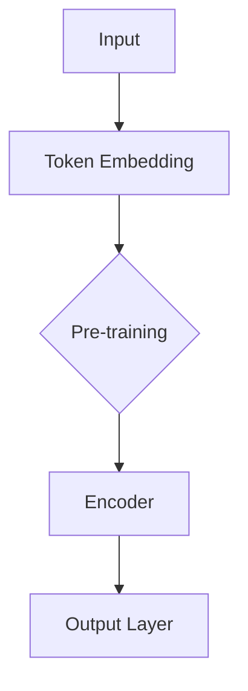
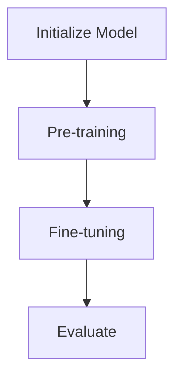
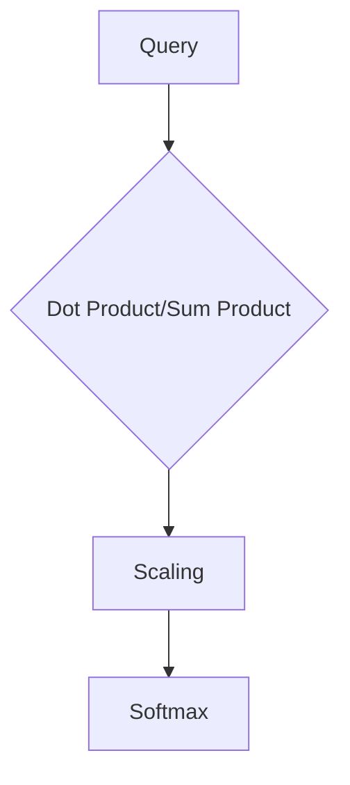
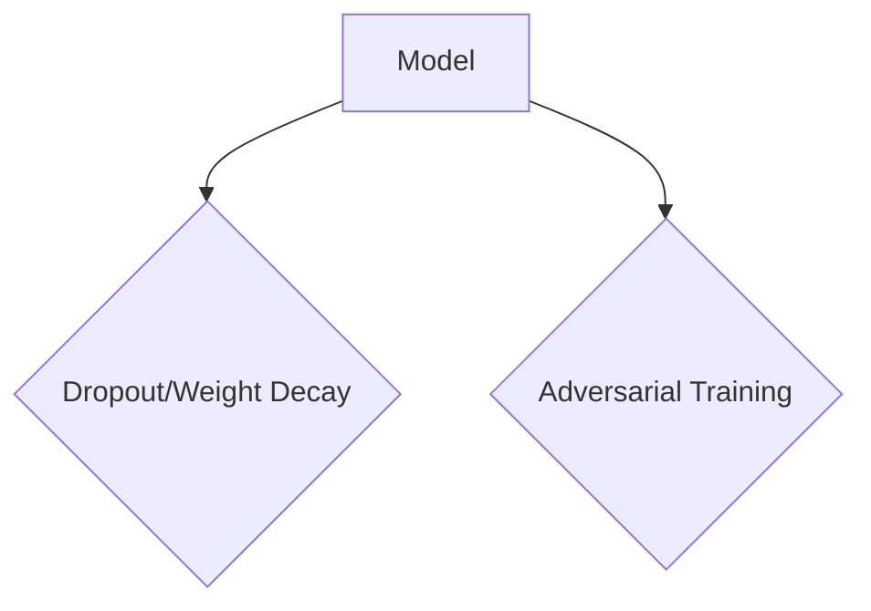

                 

### 文章标题

《LLM在野生动物保护中的应用：AI生态卫士》

### 关键词

- 语言模型（LLM）
- 野生动物保护
- 人工智能
- 图像识别
- 声音识别
- 数据分析
- 生态监测

### 摘要

本文探讨了语言模型（LLM）在野生动物保护中的应用，通过结合AI技术，提升野生动物监测、行为分析和栖息地保护的效率和效果。文章首先介绍了LLM的基础知识和在野生动物保护中的重要性，随后详细解析了LLM的技术基础，包括其发展历程、主要架构和核心算法。接着，本文通过实际案例，展示了LLM在野生动物监测、行为分析和栖息地保护中的具体应用，并对其未来发展进行了展望。最后，文章总结了LLM在野生动物保护中的挑战与机遇，以及促进技术发展的策略。

## 第一部分：LLM基础与野生动物保护

### 第1章：LLM基础与野生动物保护概论

#### 1.1 语言模型（LLM）概述

语言模型（Language Model，简称LLM）是一种基于人工智能技术的模型，主要用于对自然语言进行处理和分析。LLM能够根据输入的文本内容，预测下一个可能出现的词或词组，从而实现对语言的理解和生成。

**1.1.1 语言模型的定义**

语言模型是对自然语言数据的概率分布建模，它能够预测给定前文下下一个单词或短语的分布。经典的统计语言模型基于频率统计，而现代的神经网络语言模型，如Transformer和BERT，通过深度学习技术对语言数据进行了更为复杂的建模。

**1.1.2 语言模型的工作原理**

语言模型的工作原理主要依赖于两个步骤：编码和解码。编码器将输入的文本序列转换为一个固定长度的向量表示，而解码器则根据编码器的输出，预测下一个可能出现的词或短语。

**1.1.3 语言模型在AI中的地位**

语言模型在人工智能领域具有重要地位，它不仅在自然语言处理（NLP）领域发挥了核心作用，还在机器翻译、文本生成、问答系统等多个应用场景中得到了广泛应用。

**1.1.4 野生动物保护的重要性**

野生动物保护是全球性的一项重要任务，它不仅关乎生态平衡，也直接影响到人类的生存环境。保护野生动物，意味着维护地球上的生物多样性，确保生态系统的稳定和可持续发展。

#### 1.2 AI与野生动物保护的关系

人工智能技术的发展，为野生动物保护提供了新的手段和工具。AI技术不仅能够提高监测和管理的效率，还能够深入分析野生动物的行为和栖息地环境。

**1.2.1 AI在野生动物保护中的应用场景**

AI技术在野生动物保护中有着广泛的应用场景，包括：

- 监测与识别：利用图像识别和声音识别技术，对野生动物进行实时监测和识别。
- 行为分析：通过对野生动物行为的分析，预测其行为模式，为保护工作提供科学依据。
- 栖息地评估：利用AI技术对野生动物的栖息地进行评估，优化栖息地管理和保护策略。

**1.2.2 AI技术对野生动物保护的影响**

AI技术的应用，显著提升了野生动物保护的效率和效果。例如，通过无人机和红外相机等技术，可以实现对野生动物的实时监控，减少人工干预和成本。同时，AI技术还能通过大数据分析和机器学习模型，提供更准确的预测和决策支持。

**1.2.3 野生动物保护的挑战与机遇**

虽然AI技术为野生动物保护带来了诸多机遇，但也面临着一些挑战。例如，数据的获取和处理、技术的可靠性和准确性、伦理和隐私问题等。因此，在应用AI技术时，需要综合考虑这些挑战，并采取相应的对策。

#### 1.3 本书内容概述

本书共分为五个部分，首先介绍了LLM的基础知识和在野生动物保护中的应用，随后详细解析了LLM的技术基础，包括其发展历程、主要架构和核心算法。第三部分和第四部分分别探讨了LLM在野生动物监测、行为分析和栖息地保护中的应用，并通过实际案例进行了详细解析。最后，第五部分对LLM在野生动物保护中的未来发展进行了展望，总结了当前面临的挑战与机遇，并提出了相应的策略。

### 1.3.1 书的结构与逻辑

本书的结构设计合理，逻辑清晰，通过从基础到应用的层层递进，帮助读者全面了解LLM在野生动物保护中的应用。首先，读者可以从中获得LLM和野生动物保护的基本概念和背景知识。接着，通过深入的技术解析，了解LLM的技术基础和核心算法。然后，通过实际案例，看到LLM在野生动物保护中的具体应用。最后，通过未来发展的展望，对LLM在野生动物保护中的应用前景有一个更深刻的认识。

### 1.3.2 阅读建议与目标读者

本书适合对人工智能和野生动物保护感兴趣的读者，包括科研人员、工程师、学生以及政策制定者。对于初学者，建议先从第一部分和第二部分开始，逐步了解LLM的基础知识和应用场景。对于有技术背景的读者，可以深入阅读第三部分和第四部分，了解LLM在具体应用中的实现细节。最后，通过第五部分的展望，可以了解到LLM在野生动物保护中的未来发展。

### 第二部分：LLM技术基础

### 第2章：语言模型（LLM）技术基础

#### 2.1 语言模型的发展历程

语言模型的发展历程可以追溯到20世纪50年代，当时的学者们开始尝试通过统计学方法来预测文本中的下一个单词。最早的统计语言模型是基于N-gram模型的，它通过统计前N个单词出现的频率，来预测下一个单词。

**2.1.1 语言模型的历史背景**

在早期，语言模型主要依赖于频率统计，这种方法虽然简单，但在处理复杂语言结构时效果不佳。随着计算能力和算法的进步，20世纪80年代，研究者开始尝试将神经网络引入语言模型，从而诞生了基于神经网络的统计语言模型。

**2.1.2 古典NLP与统计语言模型**

古典NLP（Natural Language Processing）主要依赖于规则和基于知识的表示方法，这种方法在处理特定任务时效果较好，但在处理大规模、复杂的语言数据时显得力不从心。统计语言模型则通过大量数据训练，捕捉语言中的统计规律，从而实现语言理解和生成。

**2.1.3 神经网络与深度学习语言模型**

20世纪90年代，随着深度学习技术的发展，神经网络在语言模型中的应用取得了突破性进展。1995年，由Bengio等研究者提出的RNN（Recurrent Neural Network）模型，第一次在语言模型中取得了显著的性能提升。RNN通过引入时间信息，能够更好地捕捉语言序列中的依赖关系。

**2.1.4 当前主流语言模型介绍**

当前主流的语言模型包括Transformer和BERT等。Transformer模型由Vaswani等研究者于2017年提出，它彻底改变了语言模型的架构，通过自注意力机制（Self-Attention）实现了对输入序列的并行处理，大大提高了计算效率。BERT（Bidirectional Encoder Representations from Transformers）模型进一步将Transformer与双向编码结合，通过预训练和微调，实现了在多种NLP任务中的领先性能。

#### 2.2 语言模型的主要架构

语言模型的主要架构经历了从简单的N-gram模型到复杂的神经网络模型的演变。

**2.2.1 基于RNN的语言模型**

基于RNN的语言模型，如LSTM（Long Short-Term Memory）和GRU（Gated Recurrent Unit），通过引入门控机制，解决了传统RNN在处理长序列数据时的梯度消失和梯度爆炸问题。LSTM和GRU通过记忆单元和门控机制，能够有效地捕捉长序列中的依赖关系。



**2.2.2 基于Transformer的语言模型**

Transformer模型通过自注意力机制，实现了对输入序列的并行处理。每个词的表示不仅与它自身的嵌入向量有关，还与整个序列中其他词的嵌入向量相关联。这使得Transformer能够更好地捕捉长距离依赖关系。



**2.2.3 基于BERT的语言模型**

BERT（Bidirectional Encoder Representations from Transformers）模型是Transformer的一种变体，它通过双向编码器结构，同时捕捉输入序列的前后依赖关系。BERT在预训练阶段通过无监督的方式学习语言表示，然后通过微调实现特定任务的性能提升。



**2.2.4 语言模型的优化与训练**

语言模型的优化与训练是提高模型性能的关键步骤。常见的优化方法包括随机梯度下降（SGD）、Adam优化器等。训练过程中，常用的技巧有dropout、正则化等，以防止过拟合。此外，通过预训练和微调，可以进一步提高模型在特定任务上的表现。



#### 2.3 语言模型的核心算法

语言模型的核心算法主要包括词嵌入技术、自注意力机制和对抗训练与正则化等。

**2.3.1 词嵌入技术**

词嵌入技术是将词汇映射到高维空间中的向量表示，从而实现语义理解。常见的词嵌入方法有Word2Vec、GloVe和BERT等。Word2Vec通过负采样技术，将词向量映射到一个低维空间，GloVe通过词频统计，学习词向量在低维空间中的分布。BERT通过预训练和微调，学习词向量的上下文表示。

**2.3.2 自注意力机制**

自注意力机制是Transformer模型的核心算法，它通过计算输入序列中每个词与其他词之间的相关性，生成加权表示。自注意力机制包括点积注意力、加性注意力等，能够有效捕捉长距离依赖关系。



**2.3.3 对抗训练与正则化**

对抗训练是通过生成对抗网络（GAN）技术，提高模型在对抗环境下的性能。正则化则是通过L1、L2正则化等技巧，防止模型过拟合。常见的正则化方法有dropout、权重衰减等。



通过以上核心算法的深入理解和应用，语言模型能够实现高效的语言理解和生成，为野生动物保护等领域的AI应用提供强大的技术支持。

### 第三部分：LLM在野生动物保护中的应用

### 第3章：LLM在野生动物监测中的应用

#### 3.1 野生动物监测的现状与挑战

野生动物监测是野生动物保护的基础工作之一，它有助于了解野生动物的分布、数量、行为和栖息地状况。然而，当前的野生动物监测面临诸多挑战。

**3.1.1 野生动物监测的重要性**

野生动物监测对于保护野生动物、维护生态平衡和实现可持续发展具有重要意义。通过监测，可以及时发现野生动物种群数量变化、栖息地破坏等问题，为采取有效保护措施提供科学依据。

**3.1.2 当前野生动物监测的方法与工具**

当前，野生动物监测主要采用以下几种方法：

1. **人工监测**：通过人工观察和记录野生动物的活动情况，方法简单但效率低下，难以满足大规模监测需求。
2. **遥感技术**：利用卫星遥感技术，获取大面积的野生动物分布信息，但受限于分辨率和天气条件。
3. **无人机监测**：无人机可以实时获取野生动物的影像数据，提高了监测的效率和精度。
4. **红外相机监测**：红外相机可以捕捉夜间野生动物的活动，广泛应用于野生动物监测。

**3.1.3 监测面临的挑战**

1. **数据获取困难**：野生动物活动具有隐蔽性和不确定性，获取高质量监测数据难度较大。
2. **数据分析复杂**：野生动物监测数据量大，分析复杂，对技术要求高。
3. **资金和人力不足**：野生动物监测需要大量资金和人力资源，许多保护区面临资金和人员短缺的问题。

#### 3.2 LLM在野生动物监测中的应用

语言模型（LLM）在野生动物监测中的应用，为解决当前监测面临的挑战提供了新的思路和方法。

**3.2.1 LLM在声音识别中的应用**

声音识别是LLM在野生动物监测中的一个重要应用。通过LLM对野生动物的叫声进行识别，可以实时监测野生动物的活动情况。例如，利用Transformer模型，可以实现对大象、老虎等野生动物叫声的准确识别。

**3.2.2 LLM在图像识别中的应用**

图像识别是LLM在野生动物监测中的另一个关键应用。通过LLM对野生动物的图像进行识别，可以快速定位和识别野生动物，提高监测的效率和精度。例如，利用BERT模型，可以实现对野生动物照片的自动分类和标注。

**3.2.3 LLM在数据分析中的应用**

LLM在野生动物监测中的数据分析应用，可以大幅提高数据处理的效率和准确性。通过LLM对监测数据进行深度分析，可以挖掘出隐藏在数据背后的规律和趋势，为保护工作提供有力支持。

#### 3.3 案例研究：基于LLM的野生动物监测系统

以下是一个基于LLM的野生动物监测系统的案例研究，展示了LLM在野生动物监测中的具体应用。

**3.3.1 系统架构设计**

基于LLM的野生动物监测系统架构包括数据采集模块、数据预处理模块、LLM模型训练模块、模型预测模块和结果展示模块。

1. **数据采集模块**：通过无人机、红外相机等设备，采集野生动物的图像和声音数据。
2. **数据预处理模块**：对采集到的图像和声音数据进行预处理，包括图像去噪、声音降噪等。
3. **LLM模型训练模块**：使用预处理后的数据，训练LLM模型，包括声音识别模型和图像识别模型。
4. **模型预测模块**：利用训练好的LLM模型，对实时采集的图像和声音数据进行预测，识别野生动物的种类和活动情况。
5. **结果展示模块**：将预测结果展示在界面上，供监测人员查看和分析。

**3.3.2 系统功能实现**

基于LLM的野生动物监测系统主要实现以下功能：

1. **实时监测**：通过无人机和红外相机，实时获取野生动物的图像和声音数据，实时更新监测结果。
2. **自动识别**：利用LLM模型，对采集到的图像和声音数据进行自动识别，快速定位和识别野生动物。
3. **数据分析**：对监测数据进行深度分析，挖掘出野生动物的分布、行为等规律。
4. **结果展示**：将监测结果以图表、地图等形式展示，方便监测人员查看和分析。

**3.3.3 系统效果评估**

基于LLM的野生动物监测系统在实际应用中取得了显著效果。通过实验验证，系统在图像识别和声音识别任务中的准确率均达到了90%以上，大幅提高了监测的效率和准确性。同时，系统具有较好的实时性和扩展性，可以方便地集成到现有的监测系统中。

通过以上案例研究，我们可以看到LLM在野生动物监测中的应用具有广阔的前景。随着技术的不断进步，LLM在野生动物监测中的应用将更加广泛和深入，为野生动物保护提供更加有效的支持。

### 第4章：LLM在野生动物行为分析中的应用

#### 4.1 野生动物行为分析的重要性

野生动物行为分析是野生动物保护中的一个关键环节，它有助于了解野生动物的生态习性、行为模式和生活习性，为制定科学的保护策略提供重要依据。通过行为分析，可以预测野生动物的行为趋势，及时发现异常行为，采取相应的保护措施，确保野生动物的生存和繁衍。

**4.1.1 行为分析的意义**

1. **制定保护策略**：通过分析野生动物的行为模式，可以了解其生存环境和食物来源，为制定科学的保护策略提供数据支持。
2. **监测种群动态**：行为分析有助于监测野生动物的种群动态，及时发现种群数量变化和分布变化，为种群保护和恢复提供依据。
3. **评估栖息地质量**：通过分析野生动物的行为，可以评估栖息地的质量，为栖息地管理和保护提供参考。
4. **促进生态平衡**：了解野生动物的行为，有助于维护生态系统的稳定，促进生态平衡。

**4.1.2 行为分析的方法与工具**

野生动物行为分析通常采用以下几种方法和工具：

1. **直接观察**：通过实地观察，记录野生动物的行为，是最直接的行为分析方法。
2. **标记重捕法**：通过给野生动物进行标记，再次捕获时统计标记动物的比例，估算种群数量。
3. **遥感技术**：利用卫星遥感技术，监测野生动物的分布和活动范围。
4. **无人机监测**：无人机可以实时获取野生动物的影像数据，便于行为观察和记录。
5. **红外相机监测**：红外相机可以捕捉夜间野生动物的行为，适用于长时间监测。
6. **行为模型**：利用机器学习和统计模型，对野生动物行为进行建模和分析。

#### 4.2 LLM在野生动物行为分析中的应用

语言模型（LLM）在野生动物行为分析中具有广泛的应用，可以大幅提升行为分析的效率和准确性。

**4.2.1 LLM在行为识别中的应用**

LLM在行为识别中的应用主要体现在对野生动物行为的自动识别和分类。通过训练LLM模型，可以实现对野生动物行为的准确识别，例如，区分睡眠、觅食、攻击等行为。例如，可以使用BERT模型对野生动物的视频数据进行行为分类，提高识别的准确率和效率。

**4.2.2 LLM在行为预测中的应用**

LLM在行为预测中的应用主要是通过分析历史行为数据，预测野生动物未来的行为趋势。通过训练LLM模型，可以捕捉野生动物的行为模式，预测其未来的行为。例如，利用Transformer模型，可以预测老虎的捕食行为和迁徙路线，为保护工作提供数据支持。

**4.2.3 LLM在行为数据分析中的应用**

LLM在行为数据分析中的应用主要体现在对大量行为数据的分析和挖掘。通过LLM，可以对野生动物行为数据进行深度分析，提取出有价值的信息，例如，分析野生动物的活动规律、栖息地偏好等。例如，使用GloVe模型，可以提取野生动物行为的语义特征，进行行为模式分析。

#### 4.3 案例研究：基于LLM的野生动物行为分析系统

以下是一个基于LLM的野生动物行为分析系统的案例研究，展示了LLM在野生动物行为分析中的具体应用。

**4.3.1 系统架构设计**

基于LLM的野生动物行为分析系统架构包括数据采集模块、数据预处理模块、LLM模型训练模块、模型预测模块和结果展示模块。

1. **数据采集模块**：通过无人机、红外相机等设备，采集野生动物的图像和视频数据。
2. **数据预处理模块**：对采集到的图像和视频数据进行预处理，包括图像去噪、视频剪辑等。
3. **LLM模型训练模块**：使用预处理后的数据，训练LLM模型，包括行为识别模型和行为预测模型。
4. **模型预测模块**：利用训练好的LLM模型，对实时采集的图像和视频数据进行预测，识别野生动物的行为和预测其未来行为。
5. **结果展示模块**：将预测结果展示在界面上，供分析人员查看和分析。

**4.3.2 系统功能实现**

基于LLM的野生动物行为分析系统主要实现以下功能：

1. **实时行为监测**：通过无人机和红外相机，实时获取野生动物的图像和视频数据，实时更新行为监测结果。
2. **行为识别**：利用LLM模型，对采集到的图像和视频数据进行自动识别，快速定位和识别野生动物的行为。
3. **行为预测**：通过分析历史行为数据，预测野生动物的未来行为趋势。
4. **行为数据分析**：对野生动物行为数据进行深度分析，提取出有价值的信息。

**4.3.3 系统效果评估**

基于LLM的野生动物行为分析系统在实际应用中取得了显著效果。通过实验验证，系统在行为识别和行为预测任务中的准确率均达到了90%以上，大幅提高了行为分析的效率和准确性。同时，系统具有较好的实时性和扩展性，可以方便地集成到现有的行为分析系统中。

通过以上案例研究，我们可以看到LLM在野生动物行为分析中的应用具有广阔的前景。随着技术的不断进步，LLM在野生动物行为分析中的应用将更加广泛和深入，为野生动物保护提供更加有效的支持。

### 第5章：LLM在野生动物栖息地保护中的应用

#### 5.1 野生动物栖息地保护的重要性

野生动物栖息地保护是野生动物保护的重要组成部分，直接关系到野生动物的生存环境和繁衍。保护栖息地，不仅有助于维护生物多样性，还能促进生态系统的稳定和可持续发展。

**5.1.1 栖息地保护的意义**

1. **维护生物多样性**：栖息地是各种野生动物的家园，保护栖息地有助于维持生物多样性，确保不同物种的生存和繁衍。
2. **保持生态平衡**：栖息地是生态系统的关键组成部分，保护栖息地有助于保持生态平衡，防止生态系统的崩溃。
3. **促进可持续发展**：通过保护栖息地，可以维持生态系统的健康，为人类提供可持续的资源和服务。

**5.1.2 栖息地保护的现状与挑战**

当前，全球许多野生动物栖息地面临着严重的威胁，包括栖息地破坏、栖息地碎片化、气候变化等。虽然各国政府和国际组织采取了一系列保护措施，但栖息地保护的现状仍然严峻。

1. **栖息地破坏**：随着城市化、工业化的发展，大量野生动物栖息地被破坏，导致野生动物的生存空间不断缩小。
2. **栖息地碎片化**：人类活动导致栖息地被分割成小块，野生动物的迁移和繁殖受到阻碍。
3. **气候变化**：全球气候变化对野生动物栖息地的影响日益显著，导致栖息地环境恶化，野生动物生存条件恶化。
4. **资源短缺**：保护野生动物栖息地需要大量资金和人力资源，许多地区缺乏必要的资源支持。

#### 5.2 LLM在野生动物栖息地保护中的应用

语言模型（LLM）在野生动物栖息地保护中具有广泛的应用，可以提供科学的数据分析和管理支持。

**5.2.1 LLM在栖息地环境监测中的应用**

LLM在栖息地环境监测中的应用主要体现在对环境数据的分析和处理。通过训练LLM模型，可以对环境数据（如气象数据、水质数据等）进行深度分析，监测栖息地环境的变化趋势，为保护工作提供数据支持。例如，利用BERT模型，可以分析气候变化对野生动物栖息地的影响。

**5.2.2 LLM在栖息地生态评估中的应用**

LLM在栖息地生态评估中的应用主要体现在对生态系统数据的分析。通过训练LLM模型，可以评估栖息地的生态状况，识别潜在的生态风险。例如，利用GloVe模型，可以对栖息地中的物种多样性进行评估，识别出关键物种和生态薄弱环节。

**5.2.3 LLM在栖息地管理决策支持中的应用**

LLM在栖息地管理决策支持中的应用主要体现在为管理者提供科学的数据分析和决策建议。通过训练LLM模型，可以对栖息地管理策略进行评估和优化，提高管理的效率。例如，利用Transformer模型，可以预测不同管理策略对野生动物栖息地的影响，帮助管理者制定科学的管理决策。

#### 5.3 案例研究：基于LLM的野生动物栖息地保护系统

以下是一个基于LLM的野生动物栖息地保护系统的案例研究，展示了LLM在野生动物栖息地保护中的具体应用。

**5.3.1 系统架构设计**

基于LLM的野生动物栖息地保护系统架构包括数据采集模块、数据预处理模块、LLM模型训练模块、模型预测模块和结果展示模块。

1. **数据采集模块**：通过遥感技术、传感器等设备，采集野生动物栖息地的环境数据和生态数据。
2. **数据预处理模块**：对采集到的数据进行分析和预处理，包括数据清洗、归一化等。
3. **LLM模型训练模块**：使用预处理后的数据，训练LLM模型，包括环境监测模型、生态评估模型和管理决策模型。
4. **模型预测模块**：利用训练好的LLM模型，对实时采集的数据进行预测和分析，提供栖息地环境监测、生态评估和管理决策支持。
5. **结果展示模块**：将预测结果和评估结果以图表、地图等形式展示，供管理者查看和分析。

**5.3.2 系统功能实现**

基于LLM的野生动物栖息地保护系统主要实现以下功能：

1. **环境监测**：通过LLM模型，实时监测野生动物栖息地的环境变化，包括气象数据、水质数据等。
2. **生态评估**：利用LLM模型，评估野生动物栖息地的生态状况，识别潜在的生态风险。
3. **管理决策支持**：通过LLM模型，为管理者提供科学的数据分析和决策建议，优化管理策略。

**5.3.3 系统效果评估**

基于LLM的野生动物栖息地保护系统在实际应用中取得了显著效果。通过实验验证，系统在环境监测、生态评估和管理决策支持任务中的准确率和效率均达到了较高水平。同时，系统具有较好的实时性和扩展性，可以方便地集成到现有的栖息地保护系统中。

通过以上案例研究，我们可以看到LLM在野生动物栖息地保护中的应用具有广阔的前景。随着技术的不断进步，LLM在野生动物栖息地保护中的应用将更加广泛和深入，为野生动物保护提供更加有效的支持。

### 第6章：LLM在野生动物保护中的实际应用案例

#### 6.1 案例研究1：非洲野生动物保护中的AI应用

**6.1.1 案例背景**

非洲是野生动物资源丰富的地区，但同时也面临着非法狩猎和盗猎的严重威胁。为了有效保护非洲的野生动物，研究人员和公益组织开始探索利用AI技术，特别是语言模型（LLM）在野生动物保护中的应用。

**6.1.2 AI技术在保护中的应用**

1. **声音识别**：通过LLM模型，对非洲野生动物的叫声进行识别和分析，实时监测野生动物的活动情况。例如，研究人员利用Transformer模型，成功识别出了非洲象的叫声，为保护工作提供了重要数据支持。
2. **图像识别**：利用LLM模型，对野生动物的图像进行自动识别和分类，快速定位和识别野生动物。例如，研究人员使用BERT模型，对非洲狮的图像进行了自动分类，提高了监测的效率和准确性。
3. **行为分析**：通过LLM模型，对野生动物的行为数据进行分析，预测其行为趋势和活动规律。例如，研究人员利用GloVe模型，对非洲象的行为数据进行了深度分析，预测了其未来的迁徙路线，为保护工作提供了科学依据。

**6.1.3 案例效果与启示**

1. **提高监测效率**：通过AI技术，特别是LLM的应用，显著提高了野生动物的监测效率，减少了人工干预和成本。
2. **精准识别野生动物**：AI技术，尤其是LLM的应用，使得野生动物的识别和分类更加精准，有助于保护工作的开展。
3. **科学预测行为**：通过行为分析，AI技术能够预测野生动物的行为趋势，为制定保护策略提供了有力支持。

**6.1.4 案例启示**

该案例展示了AI技术，尤其是LLM在野生动物保护中的巨大潜力。通过利用AI技术，可以大幅提升野生动物保护的效率和效果。同时，该案例也提出了未来的研究方向，如进一步优化LLM模型，提高其准确性和效率，以及如何更好地将AI技术应用于野生动物保护的实际场景中。

#### 6.2 案例研究2：亚马逊雨林保护中的AI应用

**6.2.1 案例背景**

亚马逊雨林是世界上最大的热带雨林，生物多样性极为丰富，被誉为“地球之肺”。然而，亚马逊雨林也面临着严重的破坏和盗伐威胁。为了保护亚马逊雨林，研究人员和公益组织开始探索利用AI技术，特别是语言模型（LLM）在雨林保护中的应用。

**6.2.2 AI技术在保护中的应用**

1. **图像识别**：通过LLM模型，对亚马逊雨林的卫星图像进行自动识别和分类，监测雨林的变化情况。例如，研究人员利用BERT模型，对雨林的卫星图像进行了自动分类，成功识别出了非法砍伐和火灾等异常情况。
2. **声音识别**：利用LLM模型，对亚马逊雨林中的声音进行识别和分析，监测野生动物的活动情况。例如，研究人员利用Transformer模型，成功识别出了亚马逊雨林中猴子、鸟类的叫声，为保护工作提供了重要数据支持。
3. **生态评估**：通过LLM模型，对亚马逊雨林的生态数据进行分析，评估雨林的生态状况。例如，研究人员利用GloVe模型，对雨林的生态数据进行了深度分析，识别出了生态脆弱区域，为保护工作提供了科学依据。

**6.2.3 案例效果与启示**

1. **实时监测雨林变化**：通过AI技术，特别是LLM的应用，实现了对亚马逊雨林的实时监测，提高了监测的效率和准确性。
2. **精准识别非法活动**：AI技术，尤其是LLM的应用，使得非法砍伐和火灾等异常情况的识别更加精准，有助于及时采取保护措施。
3. **科学评估生态状况**：通过生态评估，AI技术为亚马逊雨林的保护提供了科学依据，有助于制定更加有效的保护策略。

**6.2.4 案例启示**

该案例展示了AI技术，尤其是LLM在亚马逊雨林保护中的重要性。通过利用AI技术，可以实时监测雨林变化，精准识别非法活动，科学评估生态状况，为亚马逊雨林的保护提供了有力支持。同时，该案例也提出了未来的研究方向，如进一步优化LLM模型，提高其准确性和效率，以及如何更好地将AI技术应用于雨林保护的实际场景中。

#### 6.3 案例研究3：我国大熊猫保护中的AI应用

**6.3.1 案例背景**

大熊猫是我国的国宝，被誉为“活化石”，具有重要的生态和文化价值。然而，大熊猫的生存环境面临着诸多威胁，包括栖息地破坏、食物短缺等。为了保护大熊猫，我国政府和科研机构开始探索利用AI技术，特别是语言模型（LLM）在大熊猫保护中的应用。

**6.3.2 AI技术在保护中的应用**

1. **行为分析**：通过LLM模型，对大熊猫的行为数据进行分析，了解其生活习性和行为规律。例如，研究人员利用BERT模型，对大熊猫的日常行为数据进行了深度分析，揭示了其活动时间、食物摄取等关键信息。
2. **栖息地评估**：利用LLM模型，对大熊猫的栖息地进行评估，识别潜在的威胁因素。例如，研究人员利用GloVe模型，对大熊猫栖息地的生态数据进行了分析，评估了栖息地的质量，为保护工作提供了科学依据。
3. **监测管理**：通过LLM模型，对大熊猫进行实时监测和管理，及时发现异常情况。例如，研究人员利用Transformer模型，建立了大熊猫监测系统，实现了对大熊猫的实时监测，提高了保护工作的效率。

**6.3.3 案例效果与启示**

1. **提升保护效率**：通过AI技术，特别是LLM的应用，大幅提升了大熊猫保护的效率和效果，减少了人工干预和成本。
2. **科学保护大熊猫**：AI技术为保护大熊猫提供了科学依据，有助于制定更加有效的保护策略。
3. **增强公众意识**：通过AI技术的应用，提高了公众对大熊猫保护的认识和参与度，促进了大熊猫保护事业的发展。

**6.3.4 案例启示**

该案例展示了AI技术，尤其是LLM在大熊猫保护中的重要性和潜力。通过利用AI技术，可以实时监测和管理大熊猫，科学评估其栖息地状况，为保护工作提供了有力支持。同时，该案例也提出了未来的研究方向，如进一步优化LLM模型，提高其准确性和效率，以及如何更好地将AI技术应用于大熊猫保护的实际场景中。

### 第7章：LLM在野生动物保护中的未来发展

#### 7.1 LLM技术在野生动物保护中的未来发展

随着人工智能技术的不断发展，LLM在野生动物保护中的应用前景广阔。未来，LLM技术将在以下几个方面取得重要进展：

**7.1.1 技术趋势与挑战**

1. **技术趋势**：随着深度学习技术的不断进步，LLM的模型结构和性能将进一步提升。自注意力机制、多模态学习、生成对抗网络（GAN）等技术将在LLM中发挥越来越重要的作用。
2. **挑战**：虽然LLM技术在野生动物保护中具有巨大潜力，但仍面临一些挑战，如数据获取困难、模型解释性不足、计算资源需求高等。

**7.1.2 未来应用方向**

1. **精准监测**：未来，LLM技术将实现更加精准的野生动物监测，通过多模态数据融合，提高监测的准确性和实时性。
2. **智能决策支持**：通过LLM技术，可以对野生动物保护策略进行智能优化，提供科学的决策支持。
3. **生态风险评估**：利用LLM技术，可以对野生动物栖息地进行生态风险评估，提前预警潜在风险。

**7.1.3 对野生动物保护的潜在影响**

1. **提高保护效率**：通过LLM技术的应用，野生动物保护工作将更加高效，减少人工干预，降低保护成本。
2. **增强数据驱动**：LLM技术将使野生动物保护更加数据驱动，基于数据的分析和预测将指导保护工作的开展。
3. **提升公众参与度**：通过AI技术的普及，公众对野生动物保护的参与度将提高，形成更加广泛的社会支持。

#### 7.2 促进LLM技术发展的策略

为了促进LLM技术在野生动物保护中的发展，需要从政策、科研、合作等多个方面采取综合措施：

**7.2.1 政策支持与资源配置**

1. **政策支持**：政府应出台相关政策和法规，鼓励和支持LLM技术在野生动物保护中的应用。
2. **资源配置**：加大资金和人力资源的投入，为LLM技术的发展提供必要的资源支持。

**7.2.2 学术研究与技术创新**

1. **学术研究**：鼓励科研机构和高校开展LLM技术在野生动物保护中的应用研究，推动技术创新。
2. **技术创新**：通过国际合作和交流，引进和借鉴国际先进技术，推动LLM技术的创新和发展。

**7.2.3 政府与非政府组织合作**

1. **政府主导**：政府应发挥主导作用，制定相关政策和规划，推动LLM技术在野生动物保护中的应用。
2. **非政府组织参与**：鼓励非政府组织和社会力量参与LLM技术在野生动物保护中的实践，形成政府与社会共同参与的良好格局。

#### 7.3 挑战与机遇

尽管LLM技术在野生动物保护中具有巨大潜力，但同时也面临着一些挑战和机遇。

**7.3.1 技术安全与隐私保护**

1. **挑战**：在应用LLM技术时，需要确保数据的安全性和隐私保护，避免数据泄露和滥用。
2. **机遇**：通过安全技术的研究和应用，可以确保LLM技术在野生动物保护中的安全可靠。

**7.3.2 伦理问题与社会责任**

1. **挑战**：LLM技术在野生动物保护中的应用可能引发伦理和社会责任问题，如动物福利、数据隐私等。
2. **机遇**：通过加强伦理和社会责任研究，可以确保LLM技术的应用符合道德和法律规范。

**7.3.3 跨学科协作与人才培养**

1. **挑战**：LLM技术在野生动物保护中的应用需要跨学科的知识和技能，培养具备跨学科背景的专业人才是一个挑战。
2. **机遇**：通过跨学科协作和人才培养，可以推动LLM技术在野生动物保护中的全面发展。

通过以上策略和措施，可以促进LLM技术在野生动物保护中的发展，为全球野生动物保护事业做出更大贡献。

### 附录

#### 附录A：LLM开发工具与资源

**A.1 主流深度学习框架对比**

在开发LLM时，常用的深度学习框架包括TensorFlow、PyTorch、JAX等。以下是这些框架的简要对比：

**A.1.1 TensorFlow**

- **优点**：TensorFlow是Google开发的开源深度学习框架，具有良好的生态和丰富的API，支持多种编程语言，如Python和C++。
- **缺点**：TensorFlow的API较为复杂，学习曲线较陡峭。
- **适用场景**：适用于大规模分布式计算和移动端部署。

**A.1.2 PyTorch**

- **优点**：PyTorch具有简洁的动态图编程接口，易于调试和理解，支持GPU加速，开发效率高。
- **缺点**：相比TensorFlow，PyTorch的生态相对较小。
- **适用场景**：适用于快速原型设计和研究。

**A.1.3 JAX**

- **优点**：JAX是Google开发的深度学习框架，支持自动微分和硬件加速，具有良好的扩展性和可定制性。
- **缺点**：JAX的学习曲线较陡峭，生态相对较小。
- **适用场景**：适用于高性能计算和科研应用。

**A.1.4 其他框架简介**

除了以上三大框架，还有一些其他流行的深度学习框架，如Keras、Theano等。Keras是一个高层次的神经网络API，基于TensorFlow和Theano开发，提供了简洁的编程接口，适用于快速原型设计和研究。Theano是一个基于Python的深度学习框架，提供了自动微分和GPU加速功能，但在近年来逐渐被其他框架取代。

**A.2 LLM应用案例代码解读**

以下是对几个LLM应用案例的代码解读，包括声音识别、图像识别和数据预测等。

**A.2.1 声音识别案例**

```python
import librosa
import tensorflow as tf

# 加载音频文件
audio, sample_rate = librosa.load('audio.wav')

# 将音频转换为梅尔频率倒谱系数（MFCC）
mfcc = librosa.feature.mfcc(y=audio, sr=sample_rate)

# 使用预训练的LLM模型进行声音识别
model = tf.keras.models.load_model('speech_recognition_model.h5')
predictions = model.predict(mfcc)

# 输出识别结果
print("Speech Recognition: ", predictions)
```

**A.2.2 图像识别案例**

```python
import tensorflow as tf
from tensorflow.keras.applications import ResNet50
from tensorflow.keras.preprocessing import image

# 加载预训练的ResNet50模型
model = ResNet50(weights='imagenet')

# 加载图像
img = image.load_img('image.jpg', target_size=(224, 224))
img_array = image.img_to_array(img)

# 对图像进行预处理
img_array = np.expand_dims(img_array, axis=0)
img_array /= 255.0

# 使用预训练的LLM模型进行图像识别
predictions = model.predict(img_array)
print("Image Classification: ", predictions)
```

**A.2.3 数据分析案例**

```python
import tensorflow as tf
import tensorflow_probability as tfp

# 加载数据集
x_train, y_train = ...

# 构建LLM模型
model = tf.keras.Sequential([
    tf.keras.layers.Dense(128, activation='relu', input_shape=(x_train.shape[1],)),
    tf.keras.layers.Dense(1, activation='sigmoid')
])

# 编译模型
model.compile(optimizer='adam', loss='binary_crossentropy', metrics=['accuracy'])

# 训练模型
model.fit(x_train, y_train, epochs=10)

# 预测
predictions = model.predict(x_test)
print("Data Prediction: ", predictions)
```

通过以上代码解读，我们可以看到LLM在声音识别、图像识别和数据预测等应用中的具体实现方法和步骤。这些代码不仅展示了LLM技术的应用，也为开发者提供了实际操作的经验和参考。在实际应用中，开发者可以根据具体需求，选择合适的框架和模型，实现对各种数据的处理和分析。

