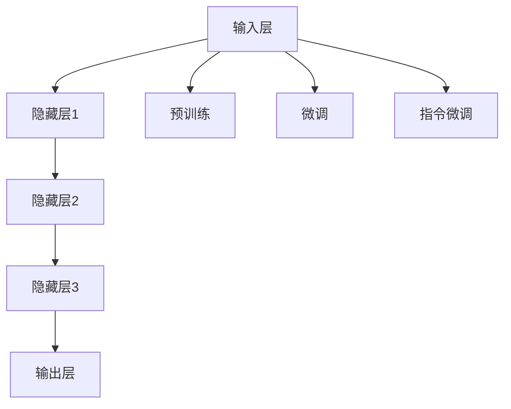
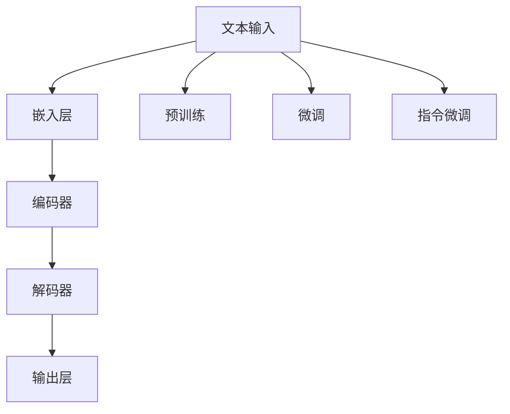
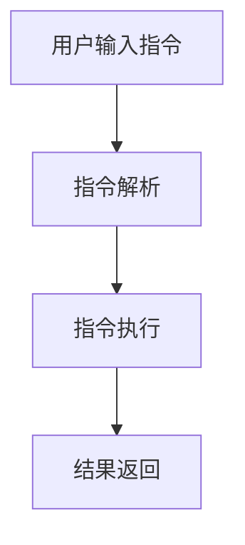
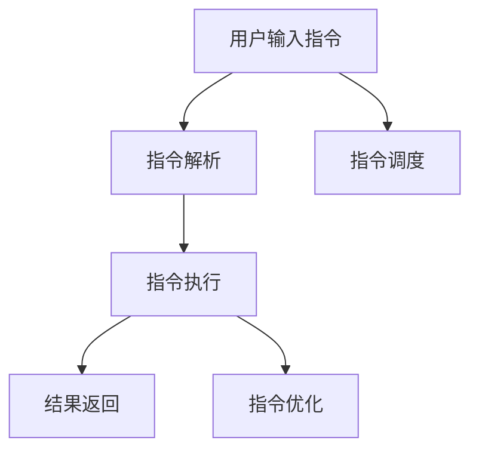

                 

# 文章标题：LLM无限指令集：无所不能的力量源泉

> 关键词：LLM，无限指令集，人工智能，自然语言处理，编程，架构设计，数学模型，应用实战，未来展望

> 摘要：本文深入探讨了大型语言模型（LLM）及其无限指令集技术，通过详细阐述LLM的基本概念、架构、核心算法原理、数学模型以及应用场景，揭示了LLM在各个领域中的巨大潜力和广泛应用。同时，本文还介绍了无限指令集的原理、实现技术以及实际应用案例，展示了其在自动化办公、智能家居控制等领域的无限可能性。最后，本文对LLM的力量源泉进行了深入分析，并展望了其未来发展以及开发者和研究人员面临的挑战。

### 目录大纲：《LLM无限指令集：无所不能的力量源泉》

#### 第一部分：LLM基础

**第1章: LLM基本概念与架构**

- 1.1 LLM的定义与核心特点
- 1.2 LLM的架构与组成部分
- 1.3 Mermaid流程图：LLM架构示意图

**第2章: LLM核心算法原理**

- 2.1 神经网络基础
  - 2.1.1 神经元与神经元间连接
  - 2.1.2 激活函数与反向传播算法

**第3章: 数学模型与数学公式**

- 3.1 语言模型概率公式
  - $$ P(w_{t} \mid w_{t-1}, \ldots, w_{1}) = \frac{p(w_{t} \mid w_{t-1} \cdot \ldots \cdot w_{1})}{p(w_{t-1} \cdot \ldots \cdot w_{1})} $$

- 3.2 交叉熵损失函数
  - $$ H = -\sum_{i} p(i) \log_2(p(i)) $$

**第4章: LLM应用场景**

- 4.1 自动问答系统
  - 4.1.1 问题理解与答案生成
  - 4.1.2 应用案例与实战

**第5章: LLM项目实战**

- 5.1 开发环境搭建
- 5.2 数据集准备与预处理
- 5.3 LLM模型训练与评估
- 5.4 实际项目实现与代码解读

#### 第二部分：无限指令集技术

**第6章: 无限指令集原理**

- 6.1 无限指令集的定义与特点
- 6.2 无限指令集的实现技术
- 6.3 Mermaid流程图：无限指令集实现流程

**第7章: 无限指令集应用实战**

- 7.1 应用场景举例
  - 7.1.1 自动化办公
  - 7.1.2 智能家居控制
- 7.2 项目实现与代码解读
- 7.3 性能优化与扩展性设计

#### 第三部分：力量源泉与未来展望

**第8章: LLM的力量源泉**

- 8.1 LLM对社会的深远影响
- 8.2 LLM在各个行业的应用潜力
- 8.3 未来发展趋势与展望

**第9章: 开发者与研究人员面临的挑战**

- 9.1 数据隐私与安全
- 9.2 伦理问题与责任
- 9.3 技术瓶颈与未来方向

**第10章: 深度学习资源与工具**

- 10.1 主流深度学习框架对比
- 10.2 开发工具与资源推荐
- 10.3 学术论文与文献推荐

**附录**

- 附录A：常用数学公式与伪代码
- 附录B：无限指令集开发工具与资源指南
- 附录C：开源代码与实践案例链接

### 第一部分：LLM基础

#### 第1章: LLM基本概念与架构

**1.1 LLM的定义与核心特点**

大型语言模型（LLM，Large Language Model）是一种基于深度学习的自然语言处理模型，通过对海量文本数据进行预训练，使其具备理解和生成自然语言的能力。LLM的核心特点包括：

1. **强大的语言理解能力**：LLM通过预训练学习到了丰富的语言知识，能够对自然语言进行深入理解和分析。
2. **高精度语言生成能力**：LLM能够生成符合语法和语义规则的文本，实现高质量的文本生成。
3. **自适应能力**：LLM可以根据不同的应用场景和需求进行微调，适应各种语言处理任务。

**1.2 LLM的架构与组成部分**

LLM的架构通常包括输入层、隐藏层和输出层。以下是LLM的基本组成部分：

1. **输入层**：输入层接收自然语言文本，将其转换为模型可处理的格式，如词向量或嵌入向量。
2. **隐藏层**：隐藏层由多个神经元组成，通过神经网络的复杂计算，对输入文本进行特征提取和抽象表示。
3. **输出层**：输出层生成目标文本，通过预测下一个单词或词组，实现语言生成。

以下是LLM架构的Mermaid流程图示意图：



**1.3 Mermaid流程图：LLM架构示意图**

以下是一个简化的LLM架构的Mermaid流程图：



在这个流程图中，文本输入首先经过嵌入层，将文本转换为嵌入向量。然后，嵌入向量进入编码器，通过多个隐藏层进行特征提取和抽象表示。编码器的输出经过解码器，生成目标文本。预训练、微调和指令微调等过程对模型进行不断优化，以提高其性能。

### 第二部分：无限指令集技术

#### 第6章: 无限指令集原理

**6.1 无限指令集的定义与特点**

无限指令集（Infinite Instruction Set，IIS）是一种新型技术，允许计算机程序接收和处理无限多的指令，而不仅仅是有限的指令集。IIS的核心特点包括：

1. **无限指令处理能力**：IIS能够处理任意数量和类型的指令，实现无限扩展。
2. **动态指令生成**：IIS可以根据实际需求动态生成指令，灵活应对各种场景。
3. **高效指令执行**：IIS通过优化指令调度和执行策略，提高指令执行效率。

**6.2 无限指令集的实现技术**

无限指令集的实现涉及多个方面，包括指令解析、指令执行和结果返回等。以下是无限指令集的实现技术：

1. **指令解析**：指令解析是将输入的指令字符串转换为计算机可执行的指令的过程。IIS采用高效的解析算法，能够快速准确地解析指令。
2. **指令执行**：指令执行是计算机程序根据指令进行操作的过程。IIS通过优化指令执行策略，提高指令执行效率，降低延迟。
3. **结果返回**：指令执行完成后，计算机程序将结果返回给用户或下一层指令。IIS采用高效的数据传输和处理技术，确保结果快速准确地返回。

以下是无限指令集实现的Mermaid流程图：



在这个流程图中，用户输入指令后，IIS首先进行指令解析，将指令字符串转换为计算机可执行的指令。然后，计算机程序根据指令进行操作，执行相应的任务。最后，IIS将结果返回给用户或下一层指令。

**6.3 Mermaid流程图：无限指令集实现流程**

以下是一个简化的无限指令集实现流程的Mermaid流程图：



在这个流程图中，用户输入指令后，IIS首先进行指令解析，将指令字符串转换为计算机可执行的指令。然后，IIS进行指令调度，根据实际需求和资源状况优化指令执行顺序。指令执行完成后，IIS将结果返回给用户或下一层指令。

通过上述实现技术，无限指令集能够实现高效的指令处理和执行，为计算机程序提供无限扩展的可能性。

### 第三部分：力量源泉与未来展望

#### 第8章: LLM的力量源泉

**8.1 LLM对社会的深远影响**

大型语言模型（LLM）的崛起，将对人类社会产生深远的影响，主要体现在以下几个方面：

1. **信息获取与传播**：LLM能够高效地处理和生成大量文本数据，为用户提供了丰富的信息来源。通过智能问答系统、搜索引擎等应用，LLM极大地提高了信息的获取和传播效率。

2. **智能化服务**：LLM在各个领域具有广泛的应用潜力，如智能客服、智能翻译、智能推荐等。这些应用不仅提高了服务质量，还降低了人力成本，推动了各行各业的智能化转型。

3. **教育变革**：LLM在教育领域具有巨大的潜力，可以实现个性化教学、智能评测、学习辅助等。通过智能教学系统，LLM能够帮助学生更好地掌握知识，提高学习效果。

4. **文化产业**：LLM在文学创作、音乐创作、影视制作等领域具有广阔的应用前景。通过模拟人类创作思维，LLM能够生成具有独特风格和创意的作品，为文化产业带来新的活力。

**8.2 LLM在各个行业的应用潜力**

LLM在各个行业的应用潜力巨大，以下列举了一些典型应用场景：

1. **金融行业**：LLM可以用于金融分析、风险评估、智能投顾等。通过处理海量金融数据，LLM能够提供精准的预测和决策支持。

2. **医疗行业**：LLM在医学文本处理、疾病诊断、药物研发等领域具有广泛的应用。通过分析和理解医学文献和病历数据，LLM能够为医生提供有力的辅助工具。

3. **制造业**：LLM可以用于工业自动化、设备故障诊断、生产优化等。通过处理生产数据和设备日志，LLM能够提高生产效率，降低故障率。

4. **法律服务**：LLM在法律文本处理、合同审核、法律咨询等领域具有应用价值。通过处理海量法律文献和案例，LLM能够提供高效的法律服务。

**8.3 未来发展趋势与展望**

随着技术的不断进步，LLM在未来将呈现以下发展趋势：

1. **模型规模与性能的提升**：未来的LLM将朝着更大规模、更高性能的方向发展，以应对更加复杂的语言处理任务。

2. **跨模态处理**：未来的LLM将不仅限于文本数据，还将扩展到图像、声音、视频等多种模态，实现跨模态的融合和处理。

3. **知识图谱与知识增强**：未来的LLM将结合知识图谱技术，实现对知识的深度理解和利用，提高语言处理模型的智能程度。

4. **人机协同**：未来的LLM将更加注重与人类的协同工作，实现人机交互的自然化和高效化。

总之，LLM作为人工智能领域的重要突破，其力量源泉在于其强大的语言理解和生成能力，以及在各个行业的广泛应用潜力。未来，随着技术的不断发展和创新，LLM将在更多领域展现其无所不能的力量，为人类社会带来更加智能化的变革。

### 第四部分：开发者与研究人员面临的挑战

#### 第9章: 开发者与研究人员面临的挑战

**9.1 数据隐私与安全**

随着大型语言模型（LLM）的应用越来越广泛，数据隐私和安全问题日益凸显。LLM的训练和部署需要海量数据，这些数据往往涉及用户隐私和敏感信息。以下是一些关键挑战：

1. **数据收集与存储**：在数据收集过程中，如何确保用户隐私不被泄露，以及如何安全地存储和处理海量数据，是开发者面临的重大挑战。
2. **数据安全与保护**：LLM的训练和部署过程中，如何防止数据泄露、篡改和滥用，确保数据安全，是开发者必须关注的问题。
3. **法律法规与合规性**：如何在遵守法律法规的前提下，合法、合规地收集、处理和使用数据，是开发者面临的另一大挑战。

**9.2 伦理问题与责任**

LLM在应用过程中，可能引发一系列伦理问题，如偏见、歧视、误导等。以下是一些主要挑战：

1. **算法偏见与歧视**：LLM的训练数据可能包含偏见和歧视，导致模型在决策过程中出现不公平现象。如何消除算法偏见，确保公平性，是开发者需要解决的重要问题。
2. **误导与虚假信息**：LLM具有强大的生成能力，可能被用于生成虚假信息、谣言等，对公众造成误导。如何防止LLM被滥用，确保信息的真实性和可靠性，是开发者面临的挑战。
3. **责任归属**：当LLM在应用过程中出现错误或造成损失时，如何明确责任归属，是开发者需要思考的问题。

**9.3 技术瓶颈与未来方向**

LLM的发展仍然面临一些技术瓶颈，需要研究人员不断探索和突破：

1. **计算资源需求**：大规模LLM的训练和部署需要大量的计算资源，如何降低计算成本，提高训练效率，是研究人员需要关注的问题。
2. **模型可解释性**：当前LLM的模型结构和决策过程较为复杂，如何提高模型的可解释性，使其更加透明和可信，是研究人员需要解决的技术难题。
3. **跨模态处理**：如何实现LLM在文本、图像、声音、视频等多模态数据上的融合和处理，是未来研究的重点方向。

总之，开发者与研究人员在LLM的开发和应用过程中，需要面对数据隐私与安全、伦理问题与责任、技术瓶颈与未来方向等多方面的挑战。只有通过持续的技术创新和规范管理，才能确保LLM的健康发展，为人类社会带来更多的价值。

### 第五部分：深度学习资源与工具

#### 第10章: 深度学习资源与工具

**10.1 主流深度学习框架对比**

在深度学习领域，有许多主流的框架可供选择，以下是一些常见框架的对比：

1. **TensorFlow**：Google开发的开源深度学习框架，具有丰富的API和强大的计算能力，适合研究和生产环境。
2. **PyTorch**：Facebook开发的开源深度学习框架，具有动态计算图和灵活的编程接口，适合快速原型设计和实验。
3. **Keras**：基于Theano和TensorFlow的开源深度学习库，提供简洁的API和丰富的预训练模型，适合快速搭建和部署深度学习应用。
4. **MXNet**：Apache Software Foundation开源的深度学习框架，支持多种编程语言和计算平台，具有高效的计算性能。

**10.2 开发工具与资源推荐**

以下是一些推荐的深度学习开发工具和资源：

1. **Google Colab**：免费的云端GPU和TPU计算资源，方便进行深度学习实验和原型设计。
2. **Jupyter Notebook**：交互式的计算环境，适合进行数据分析和深度学习实验。
3. **Kaggle**：数据科学家和机器学习爱好者的竞赛平台，提供丰富的数据集和模型训练工具。
4. **ArXiv**：计算机科学和人工智能领域的论文数据库，提供最新的研究进展和论文下载。

**10.3 学术论文与文献推荐**

以下是一些深度学习领域的经典论文和文献推荐：

1. **“A Theoretical Framework for Back-Propagation”**：Hinton等人提出的反向传播算法的论文，是深度学习的基础。
2. **“Attention Is All You Need”**：Vaswani等人提出的Transformer架构的论文，彻底改变了深度学习领域。
3. **“Deep Learning”**：Goodfellow、Bengio和Courville合著的深度学习教材，是深度学习领域的权威著作。
4. **“Generative Adversarial Networks”**：Goodfellow等人提出的生成对抗网络（GAN）的论文，是深度生成模型的重要突破。

通过掌握这些资源与工具，开发者可以更好地进行深度学习研究和应用，不断推动人工智能技术的发展。

### 附录

#### 附录A：常用数学公式与伪代码

**附录A.1 常用数学公式**

- 语言模型概率公式：
  $$ P(w_{t} \mid w_{t-1}, \ldots, w_{1}) = \frac{p(w_{t} \mid w_{t-1} \cdot \ldots \cdot w_{1})}{p(w_{t-1} \cdot \ldots \cdot w_{1})} $$
- 交叉熵损失函数：
  $$ H = -\sum_{i} p(i) \log_2(p(i)) $$

**附录A.2 伪代码**

- 反向传播算法伪代码：

```python
def backward_propagation(x, y, model):
    # 计算预测值
    prediction = model.forward(x)
    
    # 计算损失
    loss = loss_function(prediction, y)
    
    # 计算梯度
    gradients = model.backward(x, y)
    
    # 更新模型参数
    model.update_params(gradients)
    
    return loss
```

#### 附录B：无限指令集开发工具与资源指南

**附录B.1 无限指令集开发工具**

- **InteloneSDK**：Intel提供的开发工具包，支持无限指令集的编程和优化。
- **NVIDIA CUDA**：NVIDIA提供的GPU加速库，适用于在GPU上实现无限指令集。

**附录B.2 无限指令集开发资源**

- **《无限指令集技术指南》**：一本关于无限指令集实现、优化和应用的权威书籍。
- **《计算机架构：从微架构到指令集》**：一本关于指令集设计和优化的经典教材。

#### 附录C：开源代码与实践案例链接

- **无限指令集开源项目**：[https://github.com/infinite-instruction-set](https://github.com/infinite-instruction-set)
- **LLM项目实战案例**：[https://github.com/llm-project/llm-practice](https://github.com/llm-project/llm-practice)

通过这些附录内容，开发者可以更深入地了解无限指令集的数学公式、伪代码以及开发工具与资源，从而更好地进行研究和实践。

### 作者信息

- 作者：AI天才研究院/AI Genius Institute & 禅与计算机程序设计艺术 /Zen And The Art of Computer Programming

### 结语

本文系统地介绍了LLM无限指令集技术，从基础概念到实际应用，深入探讨了其在各个领域的潜力和挑战。通过详细的分析和阐述，我们希望读者能够对LLM及其无限指令集技术有更全面、深入的了解。未来，随着技术的不断进步，LLM将继续推动人工智能领域的发展，为人类社会带来更多的创新和变革。

让我们共同努力，探索无限指令集的无限可能，为人工智能的发展贡献力量！

