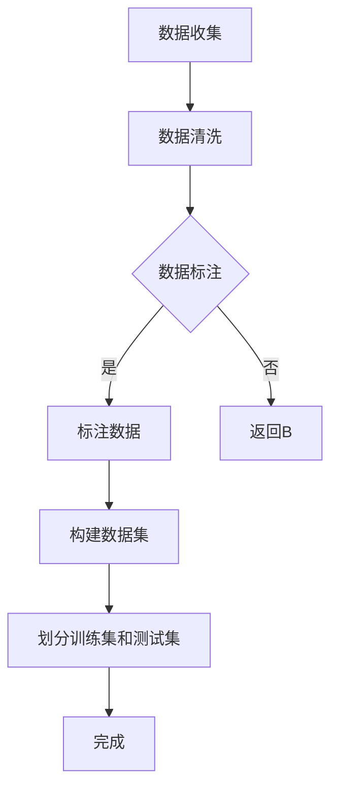
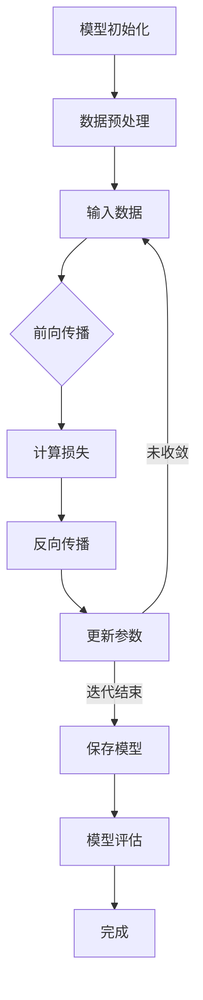
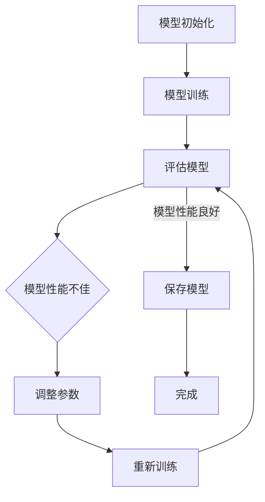

                 

### 文章标题

# LLM生态圈:从0到1的奇迹

### 关键词

- 大型语言模型（LLM）
- 生态圈
- 人工智能
- 自然语言处理
- 预训练与微调
- 应用实践
- 开发与部署

### 摘要

本文旨在深入探讨大型语言模型（LLM）的生态圈，从其定义、发展历程、核心优势到技术挑战，以及应用实践和未来趋势。文章结构清晰，采用逻辑推理的方式，逐步分析LLM的核心技术和应用场景，旨在为广大读者提供一份系统且详实的参考资料。通过本文的阅读，读者将对LLM有更为全面和深刻的理解，同时了解到LLM生态圈从0到1的奇迹是如何实现的。

### 目录

1. LLM生态圈概述
   1.1 什么是大型语言模型（LLM）
   1.2 LLM生态圈的概念与组成部分
   1.3 LLM生态圈的价值与未来趋势

2. LLM核心技术
   2.1 自然语言处理基础
   2.2 大型语言模型（LLM）架构
   2.3 预训练与微调
   2.4 模型优化与调参

3. LLM应用实践
   3.1 文本生成
   3.2 文本分类
   3.3 自然语言理解
   3.4 问答系统

4. LLM开发与部署
   4.1 LLM开发环境搭建
   4.2 模型训练与评估
   4.3 模型部署与优化

5. LLM生态圈的机遇与挑战
   5.1 LLM在AI领域的发展前景
   5.2 LLM伦理与社会责任
   5.3 LLM产业生态的构建与发展

6. 附录
   6.1 LLM相关资源
   6.2 模型参数设置与调优示例
   6.3 LLM实战项目代码解析
   6.4 Mermaid流程图示例

### 引言

在当今快速发展的科技时代，人工智能（AI）已经成为推动社会进步的重要力量。而自然语言处理（NLP）作为AI的一个重要分支，近年来更是取得了令人瞩目的进展。大型语言模型（LLM）作为NLP领域的核心技术之一，不仅极大地提升了机器对自然语言的生成、理解与处理能力，也为各行业带来了深远的影响。

LLM生态圈，作为AI领域的热点话题，涵盖了从模型构建、训练与优化到应用实践和产业生态的方方面面。从0到1的奇迹，指的是LLM从理论研究走向实际应用，再到生态圈构建的整个过程。这一过程充满了技术创新和产业变革，同时也面临着诸多挑战和机遇。

本文将围绕LLM生态圈展开讨论，首先对其定义、发展历程和核心优势进行概述，然后深入分析LLM的核心技术，包括自然语言处理基础、模型架构、预训练与微调以及模型优化与调参。接下来，我们将探讨LLM在不同应用场景中的实践，如文本生成、文本分类、自然语言理解和问答系统。随后，我们将介绍LLM的开发与部署流程，以及其在AI领域的机遇与挑战。最后，通过附录部分，为读者提供丰富的参考资料和实战项目代码解析。

通过本文的阅读，读者将能够全面了解LLM生态圈的发展脉络、核心技术、应用实践和未来趋势，从而为自身的学术研究和产业发展提供有价值的参考。在接下来的内容中，我们将逐步深入这一激动人心的领域。

### 1. LLM生态圈概述

#### 1.1 什么是大型语言模型（LLM）

大型语言模型（Large Language Model，简称LLM）是一种基于深度学习技术的自然语言处理模型，其主要目的是通过学习大量文本数据来理解和生成自然语言。LLM的出现，标志着自然语言处理领域的一个重要里程碑。与传统的小型语言模型相比，LLM具有更大的模型规模和更强的表达能力，能够处理更复杂的语言现象。

LLM的定义可以从以下几个方面进行理解：

1. **模型规模**：LLM通常拥有数亿到数十亿的参数，这使得它们能够捕捉到文本中的细微差异和复杂关系。
2. **学习能力**：LLM通过预训练和微调的方式，能够从大规模数据集中学习语言规律和知识，从而实现高效的文本生成、理解和处理。
3. **应用范围**：LLM不仅能够用于文本生成，还能应用于文本分类、问答系统、机器翻译等多种自然语言处理任务。

#### 1.2 LLM的发展历程

LLM的发展历程可以追溯到20世纪80年代，当时出现了最早的统计语言模型，如N-gram模型。这些模型基于统计方法，通过分析文本中的词频和词序来生成和预测文本。然而，随着计算机性能的提升和深度学习技术的发展，LLM逐渐崭露头角。

2000年后，随着神经网络和深度学习技术的兴起，LLM开始崭露头角。尤其是2018年，谷歌推出了BERT模型，这标志着LLM进入了一个新的时代。BERT采用了双向变换器（Transformer）架构，具有强大的上下文理解能力。随后，GPT-3、Turing-NLG等更加庞大的模型相继问世，LLM的发展进入了快速通道。

#### 1.3 LLM的核心优势

LLM在自然语言处理领域具有以下几个核心优势：

1. **强大的上下文理解能力**：通过预训练和微调，LLM能够捕捉到文本中的上下文信息，从而实现更准确的理解和生成。
2. **广泛的适应性**：LLM可以应用于多种自然语言处理任务，如文本分类、机器翻译、问答系统等，具有很高的适应性。
3. **高效的计算性能**：随着模型规模的增大和计算资源的提升，LLM的计算性能得到了显著提升，能够处理大规模的文本数据。
4. **丰富的语言知识**：通过大规模的预训练，LLM积累了丰富的语言知识，可以用于各种复杂的应用场景。

#### 1.4 LLM的应用场景

LLM在自然语言处理领域具有广泛的应用场景，以下是一些典型的应用：

1. **文本生成**：LLM可以生成高质量的文章、新闻报道、诗歌等，广泛应用于内容创作和自动化写作领域。
2. **文本分类**：LLM可以用于对大量文本进行分类，如情感分析、新闻分类等，为信息处理和推荐系统提供支持。
3. **问答系统**：LLM可以构建智能问答系统，用于回答用户的问题，如智能客服、教育辅导等。
4. **机器翻译**：LLM可以用于机器翻译任务，将一种语言的文本翻译成另一种语言，提高跨语言交流的效率。

#### 1.5 LLM的发展趋势

随着AI技术的不断进步，LLM的发展趋势主要表现在以下几个方面：

1. **模型规模的增大**：为了进一步提升模型的能力，研究人员和企业在不断增大LLM的规模，如GPT-3拥有1750亿个参数。
2. **多模态学习**：未来的LLM将不仅仅处理文本数据，还将结合图像、声音等多模态数据，实现更丰富的语言理解能力。
3. **自适应学习**：未来的LLM将具有更强的自适应学习能力，能够根据不同的应用场景和用户需求进行微调和优化。
4. **安全性与伦理**：随着LLM的应用越来越广泛，其安全性和伦理问题也日益受到关注，未来需要在保证模型性能的同时，加强安全性和伦理性的研究。

通过以上对LLM生态圈的概述，我们可以看到，LLM作为自然语言处理领域的重要技术，已经在各个应用场景中展现出了巨大的潜力。在接下来的章节中，我们将进一步深入探讨LLM的核心技术，包括自然语言处理基础、模型架构、预训练与微调、模型优化与调参等，为读者提供更为详细的了解。

### 1.2 LLM生态圈的概念与组成部分

#### 1.2.1 数据集

数据集是LLM生态圈中的核心组成部分，其质量直接影响模型的学习效果和应用性能。一个高质量的数据集应该具备以下几个特点：

1. **代表性**：数据集应能够涵盖各个领域和任务的不同场景，具有广泛性和代表性。
2. **多样性**：数据集中的文本应具有多样性，包括不同的写作风格、语言表达和上下文背景。
3. **标注质量**：数据集中的文本应经过准确和可靠的标注，以保证模型学习到的知识是真实和有效的。

常用的数据集包括：

- **通用数据集**：如Wikipedia、Common Crawl等，这些数据集包含了大量的文本数据，广泛用于模型的预训练。
- **专业数据集**：如新闻文章、社交媒体评论、对话数据等，这些数据集针对特定的应用场景进行收集和标注。

数据集的获取与处理过程通常包括以下几个步骤：

1. **数据收集**：从互联网、数据库和其他来源收集文本数据。
2. **数据清洗**：去除重复、无关和错误的数据，对文本进行格式化处理，如去除HTML标签、标点符号等。
3. **数据标注**：对文本进行分类、实体识别、关系抽取等标注操作，为模型提供高质量的标注数据。
4. **数据存储**：将处理后的数据存储在数据库或分布式文件系统中，以便于模型的读取和训练。

#### 1.2.2 模型架构

模型架构是LLM的核心组成部分，决定了模型的性能和效率。目前，常用的LLM架构主要包括基于传统神经网络和基于变换器的模型。

1. **传统神经网络**

传统神经网络（Neural Network，NN）是一种基于人工神经网络的理论模型，通过多层神经元之间的非线性变换和激活函数来模拟人类大脑的信息处理过程。NN在早期的NLP任务中取得了显著的效果，但其主要缺点是参数数量庞大、训练时间较长。

2. **变换器模型**

变换器模型（Transformer）是由谷歌在2017年提出的一种基于自注意力机制的神经网络架构，主要用于序列到序列的映射任务。Transformer模型的核心思想是通过自注意力机制，将输入序列中的每个词与其他词进行关联，从而实现上下文信息的有效捕捉。

自注意力机制（Self-Attention）是一种计算输入序列中每个词与所有词之间关系的机制，通过计算权重矩阵，将输入序列中的每个词映射到不同的空间，从而实现词与词之间的关联。多头注意力（Multi-Head Attention）是在自注意力机制的基础上，通过多个独立的注意力头，捕捉不同类型的上下文信息。

3. **GPT系列模型**

GPT（Generative Pre-trained Transformer）系列模型是由OpenAI推出的一类基于变换器模型的LLM，包括GPT、GPT-2和GPT-3等。GPT模型通过预训练和微调的方式，在大规模数据集上进行训练，从而实现高质量的文本生成和理解。

GPT-3是当前最具代表性的LLM之一，其参数规模达到1750亿个，具有强大的上下文理解能力和文本生成能力。GPT-3采用了多种创新技术，如比例缩放（Scale）、随机掩码语言模型（Random Masked Language Model，RMLM）等，显著提升了模型的性能和效率。

#### 1.2.3 训练与优化

LLM的训练与优化过程包括以下几个关键步骤：

1. **预训练**

预训练（Pre-training）是指在大规模数据集上对模型进行初始化训练，使其具备基本的语言理解能力和知识。预训练过程主要包括两个阶段：

- **自回归语言模型（Autoregressive Language Model）**：在第一阶段，模型通过预测下一个单词来学习语言规律和语法结构。
- **掩码语言模型（Masked Language Model）**：在第二阶段，模型通过随机掩码部分单词，并预测这些掩码单词，从而进一步学习上下文信息。

2. **微调**

微调（Fine-tuning）是指在预训练的基础上，针对特定任务对模型进行优化。微调过程主要包括以下步骤：

- **任务定义**：明确任务的目标和输入输出格式，如文本分类、问答系统等。
- **数据准备**：准备用于微调的数据集，并进行预处理，如文本清洗、分词、标签转换等。
- **模型调整**：在预训练模型的基础上，对部分参数进行调整，使其适应特定任务。
- **性能评估**：通过验证集和测试集对模型进行性能评估，调整模型参数，以达到最优性能。

3. **模型优化策略**

模型优化策略（Model Optimization）是指通过调整模型参数，提升模型的性能和效率。常见的优化策略包括：

- **权重衰减（Weight Decay）**：在训练过程中，逐渐减小模型参数的更新步长，以防止过拟合。
- **学习率调整（Learning Rate Scheduling）**：根据训练过程中的误差变化，动态调整学习率，以平衡模型收敛速度和精度。
- **正则化（Regularization）**：通过添加额外的正则项，降低模型复杂度，防止过拟合。

4. **模型压缩与量化**

模型压缩与量化（Model Compression and Quantization）是指通过减小模型参数数量和位数，降低模型存储和计算成本。常见的压缩与量化方法包括：

- **剪枝（Pruning）**：通过删除部分参数，降低模型复杂度。
- **量化（Quantization）**：通过将模型参数的位数减小，降低模型存储和计算成本。

#### 1.2.4 应用场景

LLM在自然语言处理领域具有广泛的应用场景，以下是一些典型的应用：

1. **文本生成**：LLM可以生成高质量的文章、新闻报道、诗歌等，广泛应用于内容创作和自动化写作领域。
2. **文本分类**：LLM可以用于对大量文本进行分类，如情感分析、新闻分类等，为信息处理和推荐系统提供支持。
3. **问答系统**：LLM可以构建智能问答系统，用于回答用户的问题，如智能客服、教育辅导等。
4. **机器翻译**：LLM可以用于机器翻译任务，将一种语言的文本翻译成另一种语言，提高跨语言交流的效率。

通过以上对LLM生态圈的组成部分的介绍，我们可以看到，数据集、模型架构、训练与优化以及应用场景共同构成了一个完整的LLM生态圈。在接下来的章节中，我们将进一步深入探讨LLM的核心技术，包括自然语言处理基础、模型架构、预训练与微调、模型优化与调参等，为读者提供更为详细的了解。

### 1.3 LLM生态圈的价值与未来趋势

#### 1.3.1 LLM对社会的深远影响

随着大型语言模型（LLM）的不断发展，其在社会各个领域的应用日益广泛，对人类生活和社会发展产生了深远的影响。以下是LLM在几个关键领域的具体影响：

1. **教育**：LLM在教育领域的应用正在改变传统的教学模式。智能辅导系统利用LLM技术，能够为学生提供个性化的学习建议，解答他们在学习中遇到的难题。此外，LLM还可以自动生成教学材料，提高教师的教学效率，同时为学生提供丰富的学习资源。

2. **医疗**：在医疗领域，LLM可以帮助医生进行病历分析、疾病诊断和治疗方案推荐。通过分析海量的医学文献和病例数据，LLM可以识别疾病症状、药物反应和治疗方案之间的关联，为医生提供科学的决策依据。此外，LLM还可以辅助进行医学研究，加速新药的研发进程。

3. **金融**：在金融领域，LLM被广泛应用于风险控制、投资分析和客户服务。通过分析大量的金融数据和市场趋势，LLM可以预测市场走势、识别风险因素，为投资者提供决策支持。同时，智能客服系统利用LLM技术，能够提供高效的客户服务，提升客户满意度。

4. **娱乐**：在娱乐领域，LLM为内容创作和个性化推荐提供了新的可能性。例如，LLM可以自动生成电影剧本、音乐和小说，满足不同用户的需求。同时，基于LLM的个性化推荐系统，可以根据用户的兴趣和行为，推荐符合其喜好的内容，提高用户体验。

5. **政府与公共管理**：LLM在政府与公共管理中的应用，包括政策分析、舆情监测和公共危机应对。通过分析大量的公共数据和社会舆情，LLM可以为政府决策提供科学依据，提高政策制定的效率和效果。同时，在公共危机应对中，LLM可以帮助政府及时掌握情况，制定有效的应对措施。

#### 1.3.2 LLM在商业领域的应用前景

LLM在商业领域的应用前景广阔，具有巨大的商业价值。以下是LLM在商业领域的一些潜在应用：

1. **客户服务**：智能客服系统利用LLM技术，可以提供高效、准确的客户服务。通过自然语言处理和生成技术，智能客服可以解答客户的疑问、处理投诉，并推荐合适的产品或服务。这不仅可以提高客户满意度，还可以降低企业的人力成本。

2. **市场营销**：LLM可以帮助企业进行精准的市场营销。通过分析大量的用户数据和行为，LLM可以识别潜在客户，预测购买意图，并制定个性化的营销策略。此外，LLM还可以自动生成营销文案、广告创意和社交媒体内容，提高营销效果。

3. **供应链管理**：在供应链管理中，LLM可以帮助企业进行需求预测、库存优化和物流调度。通过分析历史数据和市场需求，LLM可以预测未来的销售趋势，优化库存水平，减少库存成本。同时，LLM还可以优化物流路径，提高运输效率，降低物流成本。

4. **风险管理**：LLM在风险管理中的应用，包括信用评估、欺诈检测和投资风险管理。通过分析大量的金融数据和行为模式，LLM可以识别高风险客户、发现潜在欺诈行为，并提供科学的投资建议。这可以帮助企业降低风险，提高投资收益。

5. **人力资源管理**：LLM在人力资源管理中的应用，包括招聘、员工培训和绩效评估。通过自然语言处理技术，LLM可以自动筛选和匹配简历，提高招聘效率。同时，LLM还可以提供个性化的培训建议，优化员工绩效，提高企业竞争力。

#### 1.3.3 LLM面临的技术挑战与应对策略

尽管LLM在各个领域展现了巨大的潜力，但在其发展过程中仍然面临一系列技术挑战。以下是一些主要的技术挑战及其应对策略：

1. **计算资源需求**：LLM的规模巨大，需要大量的计算资源进行训练和推理。这给企业带来了高昂的计算成本。应对策略包括使用更高效的硬件设备（如GPU、TPU）、分布式计算和模型压缩技术，以降低计算成本。

2. **数据质量和多样性**：高质量的数据集是LLM训练的基础。然而，现有的数据集往往存在质量和多样性的问题。应对策略包括数据清洗、数据增强和数据集成技术，以提高数据质量和多样性。

3. **模型可解释性**：LLM的决策过程通常是非透明的，这给用户和开发者带来了可解释性问题。应对策略包括开发可解释性模型、引入可解释性工具和增加模型的透明度，以提高模型的可解释性。

4. **伦理与安全**：随着LLM的应用越来越广泛，其伦理和安全问题也日益受到关注。应对策略包括制定伦理准则、加强模型安全和隐私保护，以及建立监管机制，以确保LLM的应用符合伦理和安全标准。

5. **模型更新和维护**：LLM的更新和维护是一个长期的过程。应对策略包括建立自动化更新和维护流程、持续监控模型性能和反馈机制，以及优化模型训练和部署策略，以提高模型的稳定性和可靠性。

通过以上对LLM生态圈的价值和未来趋势的探讨，我们可以看到，LLM在改变社会和商业领域方面具有巨大的潜力。然而，要充分发挥LLM的潜力，仍需克服一系列技术挑战。在接下来的章节中，我们将进一步深入探讨LLM的核心技术，包括自然语言处理基础、模型架构、预训练与微调、模型优化与调参等，为读者提供更为详细的了解。

### 2.1 自然语言处理基础

#### 2.1.1 语言模型的基本概念

语言模型（Language Model，LM）是自然语言处理（Natural Language Processing，NLP）中的一个核心概念，它用于预测文本序列中的下一个单词或字符。语言模型的基本任务是从给定的文本序列中学习语言的模式和规律，并利用这些规律生成新的文本或对文本进行分类、问答等操作。

语言模型可以分为两类：统计语言模型和神经语言模型。

1. **统计语言模型**：统计语言模型基于统计学方法，通过分析大量文本数据来学习语言模式。最常用的统计语言模型之一是N-gram模型，它通过统计相邻单词或字符的联合概率来预测下一个单词或字符。

   公式表示如下：

   $$ P(w_{t} | w_{t-1}, w_{t-2}, ..., w_{1}) = \frac{C(w_{t-1}, w_{t-2}, ..., w_{1}, w_{t})}{C(w_{t-1}, w_{t-2}, ..., w_{1})} $$

   其中，$P(w_{t} | w_{t-1}, w_{t-2}, ..., w_{1})$ 表示在给定前一个单词序列 $w_{t-1}, w_{t-2}, ..., w_{1}$ 的条件下，预测下一个单词 $w_{t}$ 的概率；$C(w_{t-1}, w_{t-2}, ..., w_{1}, w_{t})$ 表示单词序列 $w_{t-1}, w_{t-2}, ..., w_{1}, w_{t}$ 的联合频率；$C(w_{t-1}, w_{t-2}, ..., w_{1})$ 表示单词序列 $w_{t-1}, w_{t-2}, ..., w_{1}$ 的频率。

2. **神经语言模型**：神经语言模型基于深度学习技术，通过神经网络学习语言的模式和规律。最常用的神经语言模型之一是变换器（Transformer）模型，它通过自注意力机制（Self-Attention）学习文本序列中的长期依赖关系。

   自注意力机制的核心思想是将输入序列中的每个词与所有其他词进行关联，并通过计算权重矩阵来捕捉上下文信息。多头注意力（Multi-Head Attention）是在自注意力机制的基础上，通过多个独立的注意力头，捕捉不同类型的上下文信息。

   公式表示如下：

   $$ \text{Attention}(Q, K, V) = \text{softmax}\left(\frac{QK^T}{\sqrt{d_k}}\right)V $$

   其中，$Q, K, V$ 分别代表查询向量、键向量和值向量；$d_k$ 表示注意力头的维度；$\text{softmax}$ 函数用于计算权重矩阵，从而实现文本序列中每个词与其他词的关联。

#### 2.1.2 语言模型的训练方法

语言模型的训练方法主要包括统计语言模型的训练和神经语言模型的训练。

1. **统计语言模型的训练**：

   统计语言模型的训练过程主要包括两个步骤：数据准备和模型训练。

   - **数据准备**：首先，从大规模文本数据集中提取词频和词序信息，并构建词汇表。然后，将文本数据转换为序列表示，每个单词或字符对应一个唯一的索引。
   - **模型训练**：使用N-gram模型或其他统计语言模型对训练数据进行训练。在训练过程中，模型通过优化目标函数（如最大似然估计）来学习语言模式。训练完成后，模型可以根据给定的输入序列预测下一个单词或字符。

   常用的训练方法包括：

   - **最大似然估计（Maximum Likelihood Estimation，MLE）**：最大似然估计是一种常用的目标函数，通过最大化模型在训练数据上的概率来训练模型。
   - **梯度下降（Gradient Descent）**：梯度下降是一种常用的优化方法，用于寻找目标函数的最小值。在统计语言模型的训练中，通过计算目标函数的梯度，调整模型参数，从而优化模型。

2. **神经语言模型的训练**：

   神经语言模型的训练过程主要包括三个步骤：数据准备、模型训练和优化。

   - **数据准备**：与统计语言模型类似，首先从大规模文本数据集中提取词频和词序信息，并构建词汇表。然后，将文本数据转换为序列表示，每个单词或字符对应一个唯一的索引。
   - **模型训练**：使用变换器（Transformer）模型或其他神经语言模型对训练数据进行训练。在训练过程中，模型通过反向传播算法（Backpropagation）计算损失函数的梯度，并使用梯度下降优化模型参数。
   - **优化**：在模型训练过程中，可以使用各种优化策略（如学习率调整、批量大小调整）来提高模型训练效率和性能。

   常用的优化策略包括：

   - **学习率调整（Learning Rate Scheduling）**：学习率调整是一种常用的优化策略，通过动态调整学习率，平衡模型收敛速度和精度。
   - **批量大小调整（Batch Size Adjustment）**：批量大小调整是一种常用的优化策略，通过调整批量大小，提高模型训练效率和性能。
   - **权重初始化（Weight Initialization）**：权重初始化是一种常用的优化策略，通过合理的初始化方法，防止模型在训练过程中出现过拟合。

#### 2.1.3 语言模型的评估方法

语言模型的评估方法主要包括准确性（Accuracy）、损失函数（Loss Function）和文本生成质量（Text Generation Quality）等。

1. **准确性**：

   准确性是评估语言模型性能的一种常见指标，表示模型在测试集上的正确预测比例。准确性越高，说明模型对文本序列的预测能力越强。

   公式表示如下：

   $$ \text{Accuracy} = \frac{\text{Correct Predictions}}{\text{Total Predictions}} $$

2. **损失函数**：

   损失函数是评估语言模型训练效果的一种常见指标，表示模型在训练过程中目标函数的值。常用的损失函数包括交叉熵损失（Cross-Entropy Loss）和均方误差损失（Mean Squared Error Loss）。

   - **交叉熵损失（Cross-Entropy Loss）**：

     $$ \text{Loss} = -\sum_{i=1}^{n} y_i \log(p_i) $$

     其中，$y_i$ 表示真实标签，$p_i$ 表示模型预测的概率。

   - **均方误差损失（Mean Squared Error Loss）**：

     $$ \text{Loss} = \frac{1}{2n} \sum_{i=1}^{n} (y_i - p_i)^2 $$

     其中，$y_i$ 表示真实标签，$p_i$ 表示模型预测的值。

3. **文本生成质量**：

   文本生成质量是评估语言模型生成文本质量的一种常见指标，包括文本流畅度（Text Fluency）、文本连贯性（Text Coherence）和文本多样性（Text Diversification）等。

   - **文本流畅度（Text Fluency）**：文本流畅度表示模型生成的文本是否流畅自然，可以通过语法和语义分析来评估。
   - **文本连贯性（Text Coherence）**：文本连贯性表示模型生成的文本是否在逻辑上连贯，可以通过上下文关系和主题一致性来评估。
   - **文本多样性（Text Diversification）**：文本多样性表示模型生成的文本是否具有多样性，可以通过词汇使用和句式结构来评估。

通过以上对自然语言处理基础的介绍，我们可以看到，语言模型作为NLP的核心技术，其基本概念、训练方法和评估方法构成了一个完整的体系。在接下来的章节中，我们将进一步探讨大型语言模型（LLM）的架构，包括变换器模型、自注意力机制和多头注意力等，为读者提供更为详细的了解。

### 2.2 大型语言模型（LLM）架构

#### 2.2.1 传统神经网络与深度学习的比较

在探讨大型语言模型（LLM）的架构之前，我们先来对比传统神经网络（Traditional Neural Networks）和深度学习（Deep Learning）的基本概念和发展历程。

1. **传统神经网络**

传统神经网络起源于20世纪40年代，其基本结构由神经元和权重组成。每个神经元接收来自其他神经元的输入信号，并通过激活函数产生输出信号。传统神经网络主要用于简单的数据处理和模式识别任务，例如图像边缘检测和手写数字识别。其主要缺点是模型复杂度较低，难以处理复杂的数据和任务。

2. **深度学习**

深度学习是近年来迅速发展起来的一种机器学习技术，其核心思想是通过多层的神经网络来模拟人类大脑的信息处理过程。深度学习在图像识别、语音识别、自然语言处理等领域取得了显著的成果。与传统神经网络相比，深度学习具有以下几个显著特点：

- **多层结构**：深度学习模型通常包含多个隐层，通过逐层提取数据特征，从而实现高维数据的降维和特征提取。
- **强大的特征表示能力**：深度学习模型可以通过多层非线性变换，学习到复杂的数据特征和模式，从而提高模型的泛化能力。
- **大规模数据训练**：深度学习需要大量的数据进行训练，从而提高模型的性能和鲁棒性。

3. **传统神经网络与深度学习的比较**

传统神经网络与深度学习在以下几个方面存在显著差异：

- **模型复杂度**：传统神经网络通常只有一层或两层隐层，而深度学习模型可以包含数十层甚至数百层隐层，从而实现更复杂的数据特征提取。
- **特征表示能力**：传统神经网络主要通过线性变换来处理数据，特征表示能力较弱；而深度学习通过多层非线性变换，可以学习到更复杂的数据特征和模式。
- **训练数据需求**：传统神经网络对训练数据的需求较小，而深度学习需要大量的数据进行训练，从而提高模型的性能和鲁棒性。
- **计算资源消耗**：传统神经网络训练时间较短，计算资源消耗较低；而深度学习模型需要大量的计算资源和时间进行训练，但训练完成后模型的性能显著提升。

通过以上对比，我们可以看到，深度学习在模型复杂度、特征表示能力和训练数据需求等方面具有显著优势，这使得其在图像识别、语音识别、自然语言处理等领域的应用越来越广泛。

#### 2.2.2 Transformer模型详解

Transformer模型是由谷歌在2017年提出的一种基于自注意力机制的深度学习模型，主要用于序列到序列的映射任务，如机器翻译和文本生成。Transformer模型在自然语言处理领域取得了显著的成果，是目前最流行的LLM架构之一。

1. **基本概念**

Transformer模型的核心思想是通过自注意力机制（Self-Attention）和多头注意力（Multi-Head Attention）来学习文本序列中的上下文信息。自注意力机制允许模型在处理每个单词时，将其与其他所有单词进行关联，从而实现长距离依赖关系的捕捉。多头注意力是在自注意力机制的基础上，通过多个独立的注意力头，捕捉不同类型的上下文信息。

2. **自注意力机制**

自注意力机制是一种计算输入序列中每个词与所有词之间关系的机制，通过计算权重矩阵，将输入序列中的每个词映射到不同的空间，从而实现词与词之间的关联。自注意力机制的核心公式如下：

$$ \text{Attention}(Q, K, V) = \text{softmax}\left(\frac{QK^T}{\sqrt{d_k}}\right)V $$

其中，$Q, K, V$ 分别代表查询向量、键向量和值向量；$d_k$ 表示注意力头的维度；$\text{softmax}$ 函数用于计算权重矩阵，从而实现文本序列中每个词与其他词的关联。

3. **多头注意力**

多头注意力是在自注意力机制的基础上，通过多个独立的注意力头，捕捉不同类型的上下文信息。多头注意力的核心思想是将输入序列拆分为多个子序列，并对每个子序列应用独立的自注意力机制。通过这种方式，模型可以同时关注不同类型的上下文信息，从而提高文本理解能力。

多头注意力的核心公式如下：

$$ \text{MultiHead}(Q, K, V) = \text{Concat}(\text{head}_1, ..., \text{head}_h)W^O $$

其中，$h$ 表示注意力头的数量；$\text{head}_i = \text{Attention}(QW_i^Q, KW_i^K, VW_i^V)$ 表示第 $i$ 个注意力头的输出；$W_i^Q, W_i^K, W_i^V, W^O$ 分别表示查询向量、键向量、值向量和输出向量的权重矩阵。

4. **Transformer模型架构**

Transformer模型由编码器（Encoder）和解码器（Decoder）两部分组成，分别用于处理输入序列和生成输出序列。

- **编码器（Encoder）**：编码器的输入是原始文本序列，输出是编码后的文本序列。编码器通过多个编码层（Encoder Layer）来逐层提取文本特征。每个编码层包括两个主要组件：多头自注意力机制和前馈神经网络。
- **解码器（Decoder）**：解码器的输入是编码后的文本序列，输出是生成的文本序列。解码器通过多个解码层（Decoder Layer）来生成输出序列。每个解码层包括三个主要组件：多头自注意力机制、多头交叉注意力机制和前馈神经网络。

Transformer模型的整体架构如下：

$$ \text{Encoder}(\text{Input}) = \text{MultiHeadSelfAttention}(\text{Input}) + \text{FeedforwardNetwork}(\text{Input}) $$

$$ \text{Decoder}(\text{Input}) = \text{MaskedMultiHeadSelfAttention}(\text{Input}) + \text{MultiHeadCrossAttention}(\text{Input}) + \text{FeedforwardNetwork}(\text{Input}) $$

其中，$\text{Input}$ 表示输入文本序列；$\text{MultiHeadSelfAttention}$ 和 $\text{MultiHeadCrossAttention}$ 分别表示多头自注意力和多头交叉注意力；$\text{FeedforwardNetwork}$ 表示前馈神经网络。

#### 2.2.3 自注意力机制与多头注意力

自注意力机制和多头注意力是Transformer模型的核心组件，下面我们将详细讲解它们的原理和计算过程。

1. **自注意力机制**

自注意力机制是一种计算输入序列中每个词与所有词之间关系的机制，通过计算权重矩阵，将输入序列中的每个词映射到不同的空间，从而实现词与词之间的关联。自注意力机制的核心公式如下：

$$ \text{Attention}(Q, K, V) = \text{softmax}\left(\frac{QK^T}{\sqrt{d_k}}\right)V $$

其中，$Q, K, V$ 分别代表查询向量、键向量和值向量；$d_k$ 表示注意力头的维度；$\text{softmax}$ 函数用于计算权重矩阵，从而实现文本序列中每个词与其他词的关联。

自注意力机制的计算过程如下：

- **计算查询向量（Query）**：将输入序列 $X$ 映射到查询向量 $Q$，公式如下：

  $$ Q = XW_Q $$

  其中，$W_Q$ 表示查询向量的权重矩阵。

- **计算键向量（Key）**：将输入序列 $X$ 映射到键向量 $K$，公式如下：

  $$ K = XW_K $$

  其中，$W_K$ 表示键向量的权重矩阵。

- **计算值向量（Value）**：将输入序列 $X$ 映射到值向量 $V$，公式如下：

  $$ V = XW_V $$

  其中，$W_V$ 表示值向量的权重矩阵。

- **计算注意力得分（Attention Scores）**：通过计算查询向量和键向量的点积，得到注意力得分，公式如下：

  $$ \text{Attention Scores} = QK^T $$

  其中，$QK^T$ 表示查询向量和键向量的点积。

- **计算注意力权重（Attention Weights）**：通过计算注意力得分的softmax值，得到注意力权重，公式如下：

  $$ \text{Attention Weights} = \text{softmax}(\text{Attention Scores}) $$

- **计算输出向量（Output）**：通过计算注意力权重和值向量的点积，得到输出向量，公式如下：

  $$ \text{Output} = \text{Attention Weights}V $$

2. **多头注意力**

多头注意力是在自注意力机制的基础上，通过多个独立的注意力头，捕捉不同类型的上下文信息。多头注意力的核心思想是将输入序列拆分为多个子序列，并对每个子序列应用独立的自注意力机制。通过这种方式，模型可以同时关注不同类型的上下文信息，从而提高文本理解能力。

多头注意力的核心公式如下：

$$ \text{MultiHead}(Q, K, V) = \text{Concat}(\text{head}_1, ..., \text{head}_h)W^O $$

其中，$h$ 表示注意力头的数量；$\text{head}_i = \text{Attention}(QW_i^Q, KW_i^K, VW_i^V)$ 表示第 $i$ 个注意力头的输出；$W_i^Q, W_i^K, W_i^V, W^O$ 分别表示查询向量、键向量、值向量和输出向量的权重矩阵。

多头注意力的计算过程如下：

- **计算多个查询向量、键向量和值向量**：对于每个注意力头，将输入序列 $X$ 映射到查询向量 $Q_i$、键向量 $K_i$ 和值向量 $V_i$，公式如下：

  $$ Q_i = XW_i^Q, K_i = XW_i^K, V_i = XW_i^V $$

  其中，$W_i^Q, W_i^K, W_i^V$ 分别表示第 $i$ 个注意力头的查询向量、键向量和值向量的权重矩阵。

- **计算多个注意力得分、注意力权重和输出向量**：对每个注意力头应用自注意力机制，计算注意力得分、注意力权重和输出向量，公式如下：

  $$ \text{head}_i = \text{Attention}(Q_i, K_i, V_i) $$

  $$ \text{Attention Scores}_i = Q_iK_i^T $$

  $$ \text{Attention Weights}_i = \text{softmax}(\text{Attention Scores}_i) $$

  $$ \text{Output}_i = \text{Attention Weights}_iV_i $$

- **计算多头注意力输出**：将多个注意力头的输出拼接起来，得到多头注意力输出，公式如下：

  $$ \text{MultiHead}(Q, K, V) = \text{Concat}(\text{head}_1, ..., \text{head}_h)W^O $$

  其中，$W^O$ 表示输出向量的权重矩阵。

通过以上对自注意力机制与多头注意力的讲解，我们可以看到，自注意力机制和多头注意力是Transformer模型的核心组件，通过它们，模型可以捕捉到输入序列中的上下文信息，实现高效的文本理解和生成。在接下来的章节中，我们将进一步探讨预训练与微调技术，以及模型优化与调参策略，为读者提供更为详细的了解。

### 2.3 预训练与微调

#### 2.3.1 预训练技术

预训练（Pre-training）是指在大规模数据集上对模型进行初始化训练，使其具备基本的语言理解能力和知识。预训练技术是大型语言模型（LLM）的核心步骤，通过预训练，模型可以从海量数据中学习到丰富的语言模式和规律，从而提高模型在具体任务中的表现。

预训练过程通常包括以下步骤：

1. **数据准备**：首先，从互联网、数据库和其他来源收集大量文本数据，如维基百科、新闻文章、社交媒体评论等。然后，对文本数据进行清洗和预处理，包括去除HTML标签、标点符号、停用词等，将文本转换为统一的格式，如分词后的词序列。

2. **构建词汇表**：将预处理后的文本数据构建成词汇表，每个词对应一个唯一的索引。词汇表的构建是预训练的重要步骤，它决定了模型能够处理的词汇范围和文本序列的表示方式。

3. **输入序列生成**：将文本数据转换为输入序列，每个词对应一个词索引。在预训练过程中，常用的输入序列生成方法包括自回归语言模型（Autoregressive Language Model）和掩码语言模型（Masked Language Model）。

   - **自回归语言模型**：在自回归语言模型中，模型首先输入第一个词的索引，然后根据前一个词预测下一个词的索引。这个过程可以递归地进行，直到生成整个文本序列。

   公式表示如下：

   $$ p(y_t | y_{<t}) = \text{softmax}(W[y_{<t} \cdot y_t]) $$

   其中，$y_t$ 表示当前词的索引，$y_{<t}$ 表示前一个词的索引序列，$W$ 表示权重矩阵。

   - **掩码语言模型**：在掩码语言模型中，模型首先输入整个文本序列，然后随机掩码部分词的索引，并预测这些掩码词的索引。掩码语言模型通过训练模型在不确定的上下文中生成词的能力，提高了模型对上下文信息的理解。

   公式表示如下：

   $$ p(y_t | y_{<t}) = \text{softmax}([\text{Mask}, \text{Mask}, ..., y_t, \text{Mask}, ...]) $$

4. **模型训练**：在预训练过程中，模型通过反向传播算法和优化算法（如梯度下降）来优化模型参数。预训练通常采用多任务学习（Multi-task Learning）的方法，同时训练多个任务，以提高模型的泛化能力。

5. **模型保存**：预训练完成后，将训练好的模型参数保存下来，用于后续的微调和应用。

#### 2.3.2 微调技术

微调（Fine-tuning）是指在预训练的基础上，针对特定任务对模型进行优化。微调过程通常包括以下步骤：

1. **数据准备**：首先，从特定任务的数据集中提取训练数据和验证数据。然后，对数据进行预处理，如分词、归一化等，将数据转换为模型能够接受的输入格式。

2. **模型初始化**：使用预训练好的模型参数初始化微调模型的参数。初始化时，可以选择将预训练模型的所有参数直接复制到微调模型中，也可以选择只复制部分参数。

3. **模型调整**：在微调过程中，对模型的参数进行调整，以适应特定任务的需求。调整的方法包括修改学习率、调整批量大小、冻结部分层等。

   - **学习率调整**：在微调过程中，通过动态调整学习率，平衡模型收敛速度和精度。常用的学习率调整方法包括学习率衰减（Learning Rate Decay）、指数移动平均（Exponential Moving Average）等。

   - **批量大小调整**：批量大小（Batch Size）是微调过程中需要调整的重要参数。较小的批量大小可以提高模型的鲁棒性，但训练时间较长；较大的批量大小可以加速训练，但可能增加梯度噪声。

   - **层冻结与解冻**：在微调过程中，可以选择冻结部分层的参数，防止在微调过程中发生剧烈变化。在微调的后期，可以逐步解冻这些层的参数，继续进行微调，以提高模型的性能。

4. **性能评估**：在微调过程中，通过验证集和测试集对模型进行性能评估，调整模型参数，以达到最优性能。常用的性能评估指标包括准确率（Accuracy）、F1值（F1 Score）等。

5. **模型部署**：微调完成后，将训练好的模型部署到实际应用中。在部署过程中，需要考虑模型的计算效率、内存占用和延迟等因素，选择合适的硬件和软件环境。

#### 2.3.3 预训练任务与数据集介绍

预训练任务是指模型在预训练过程中需要完成的具体任务，常见的预训练任务包括自回归语言模型（Autoregressive Language Model）和掩码语言模型（Masked Language Model）等。

1. **自回归语言模型**

   自回归语言模型是一种常用的预训练任务，其核心思想是利用前一个词的索引预测下一个词的索引。自回归语言模型广泛应用于文本生成、机器翻译和文本分类等任务。

2. **掩码语言模型**

   掩码语言模型是一种较为复杂的预训练任务，其核心思想是随机掩码部分词的索引，并预测这些掩码词的索引。掩码语言模型可以提高模型对上下文信息的理解，广泛应用于问答系统、文本分类和文本生成等任务。

常见的数据集包括：

- **通用数据集**：如维基百科（Wikipedia）、Common Crawl等，这些数据集包含了大量的文本数据，广泛用于模型的预训练。

- **专业数据集**：如新闻文章、社交媒体评论、对话数据等，这些数据集针对特定的应用场景进行收集和标注，适用于特定任务的预训练。

通过以上对预训练与微调技术的介绍，我们可以看到，预训练和微调是大型语言模型（LLM）的两个关键步骤，通过这两个步骤，模型可以从海量数据中学习到丰富的语言模式和规律，从而提高模型在具体任务中的表现。在接下来的章节中，我们将进一步探讨模型优化与调参策略，为读者提供更为详细的了解。

### 2.4 模型优化与调参

#### 2.4.1 模型优化策略

模型优化策略是指通过调整模型参数，提升模型性能和计算效率的方法。在LLM的开发过程中，优化策略的选择对模型的表现至关重要。以下是一些常用的模型优化策略：

1. **权重衰减（Weight Decay）**

   权重衰减是一种常用的正则化方法，通过减小模型参数的更新步长，防止模型过拟合。权重衰减的基本思想是在梯度下降算法中添加一个权重衰减项，公式如下：

   $$ \Delta W = -\alpha \cdot (W - \beta \cdot W) $$

   其中，$\Delta W$ 表示模型参数的更新步长，$\alpha$ 表示学习率，$W$ 表示模型参数，$\beta$ 表示权重衰减系数。

   通过调整权重衰减系数，可以平衡模型在训练和验证数据上的表现。

2. **学习率调整（Learning Rate Scheduling）**

   学习率调整是一种动态调整学习率的方法，通过在不同的训练阶段使用不同的学习率，平衡模型收敛速度和精度。常用的学习率调整策略包括：

   - **固定学习率**：在整个训练过程中使用固定的学习率，简单易实现，但可能收敛较慢。

   - **学习率衰减**：在训练过程中，随着训练迭代次数的增加，逐渐减小学习率。常用的学习率衰减策略包括线性衰减、指数衰减和余弦衰减等。

     - **线性衰减**：

       $$ \text{Learning Rate} = \text{Initial Learning Rate} / (1 + \text{Decay Rate} \cdot \text{Iteration Number}) $$

     - **指数衰减**：

       $$ \text{Learning Rate} = \text{Initial Learning Rate} \cdot (\text{Decay Rate})^{\text{Iteration Number}} $$

     - **余弦衰减**：

       $$ \text{Learning Rate} = \text{Initial Learning Rate} \cdot \frac{1}{2} \cdot (1 + \cos(\pi \cdot \text{Iteration Number} / \text{Warmup Steps})) $$

3. **批量大小调整（Batch Size Adjustment）**

   批量大小是影响模型训练效率和性能的重要参数。通过调整批量大小，可以在计算效率和模型性能之间进行权衡。常用的批量大小调整策略包括：

   - **随机批量大小**：在训练过程中，随机选择不同的批量大小，以增加模型的鲁棒性。

   - **动态批量大小**：在训练过程中，根据模型性能和计算资源动态调整批量大小，以提高模型性能和计算效率。

4. **正则化（Regularization）**

   正则化是一种通过增加额外正则项，降低模型复杂度，防止过拟合的方法。常用的正则化方法包括：

   - **L1正则化**：在梯度下降算法中添加L1正则项，公式如下：

     $$ \text{Loss} = \text{Original Loss} + \lambda \cdot \sum_{i=1}^{n} |\theta_i| $$

     其中，$\theta_i$ 表示模型参数，$\lambda$ 表示正则化系数。

   - **L2正则化**：在梯度下降算法中添加L2正则项，公式如下：

     $$ \text{Loss} = \text{Original Loss} + \lambda \cdot \sum_{i=1}^{n} \theta_i^2 $$

     L2正则化在防止过拟合方面效果较好，但在模型复杂度较低的情况下，可能导致模型性能下降。

5. **Dropout**

   Dropout是一种在训练过程中随机丢弃部分神经元的方法，通过减少模型的依赖关系，提高模型的泛化能力。Dropout的基本思想是在前向传播过程中，以一定的概率（通常为0.5）随机丢弃神经元及其连接，从而增加模型的鲁棒性。

#### 2.4.2 调参方法与技巧

调参（Hyperparameter Tuning）是指通过调整模型超参数，优化模型性能的过程。调参是模型开发过程中至关重要的一环，合理的调参可以显著提高模型性能。以下是一些常用的调参方法和技巧：

1. **网格搜索（Grid Search）**

   网格搜索是一种通过遍历所有可能的参数组合，找到最优参数的方法。网格搜索的优点是简单易实现，缺点是计算量大，适用于参数较少的情况。

   公式表示如下：

   $$ \text{Best Parameters} = \arg\min_{\theta} \text{Loss}(\text{Model}(\theta), \text{Data}) $$

   其中，$\theta$ 表示模型参数，$\text{Model}(\theta)$ 表示模型，$\text{Data}$ 表示训练数据。

2. **贝叶斯优化（Bayesian Optimization）**

   贝叶斯优化是一种基于贝叶斯统计模型和优化算法的调参方法，通过学习目标函数的先验概率分布，找到最优参数。贝叶斯优化具有较好的全局搜索能力，适用于参数较多和目标函数复杂的情况。

   公式表示如下：

   $$ p(\theta | \text{Data}) = \frac{p(\text{Data} | \theta) \cdot p(\theta)}{p(\text{Data})} $$

   其中，$p(\theta | \text{Data})$ 表示后验概率分布，$p(\text{Data} | \theta)$ 表示观测数据的条件概率，$p(\theta)$ 表示先验概率分布。

3. **随机搜索（Random Search）**

   随机搜索是一种通过随机选择参数组合，找到最优参数的方法。随机搜索的优点是计算量较小，适用于参数较少和目标函数简单的情况。

   公式表示如下：

   $$ \text{Best Parameters} = \arg\min_{\theta} \text{Loss}(\text{Model}(\theta), \text{Data}) $$

   其中，$\theta$ 表示模型参数，$\text{Model}(\theta)$ 表示模型，$\text{Data}$ 表示训练数据。

4. **遗传算法（Genetic Algorithm）**

   遗传算法是一种基于生物进化的优化算法，通过模拟自然选择和遗传过程，找到最优参数。遗传算法具有较好的全局搜索能力，适用于参数较多和目标函数复杂的情况。

   公式表示如下：

   $$ \text{Best Parameters} = \arg\min_{\theta} \text{Loss}(\text{Model}(\theta), \text{Data}) $$

   其中，$\theta$ 表示模型参数，$\text{Model}(\theta)$ 表示模型，$\text{Data}$ 表示训练数据。

5. **经验调参**

   经验调参是一种基于经验和直觉的调参方法，通过多次实验和调整，找到最优参数。经验调参的优点是灵活性强，适用于参数较少和目标函数简单的情况。

   公式表示如下：

   $$ \text{Best Parameters} = \arg\min_{\theta} \text{Loss}(\text{Model}(\theta), \text{Data}) $$

   其中，$\theta$ 表示模型参数，$\text{Model}(\theta)$ 表示模型，$\text{Data}$ 表示训练数据。

#### 2.4.3 实际案例解析

以下是一个使用GPT-3进行文本生成任务的调参案例：

1. **数据准备**

   从互联网上收集大量文本数据，包括新闻文章、社交媒体评论、小说等，对数据进行预处理，如分词、去除停用词等，构建词汇表和词索引。

2. **模型初始化**

   使用预训练好的GPT-3模型，初始化模型参数。

3. **调参**

   使用网格搜索方法，调整以下参数：

   - 学习率：从0.001到0.01进行遍历。
   - 批量大小：从16到128进行遍历。
   - 权重衰减：从0到0.1进行遍历。
   - 动态学习率策略：从指数衰减到余弦衰减进行遍历。

   通过多次实验，找到最优参数组合。

4. **训练**

   使用找到的最优参数组合，对GPT-3模型进行训练，并保存训练好的模型。

5. **测试**

   使用测试集对训练好的模型进行测试，评估模型性能。

   公式表示如下：

   $$ \text{Test Loss} = \frac{1}{N} \sum_{i=1}^{N} \text{Loss}(\text{Model}(\theta), \text{Test Data}_i) $$

   其中，$\text{Test Loss}$ 表示测试集上的损失，$N$ 表示测试集的样本数量，$\text{Loss}(\text{Model}(\theta), \text{Test Data}_i)$ 表示模型在测试集上的损失。

通过以上案例，我们可以看到，模型优化与调参是LLM开发过程中至关重要的一环。通过合理的优化策略和调参方法，可以提高模型性能和计算效率，从而更好地满足实际应用需求。

### 3.1 文本生成

文本生成是大型语言模型（LLM）的一项核心应用，通过利用模型在预训练和微调过程中学习到的语言模式和知识，生成高质量的自然语言文本。文本生成在多个领域具有广泛的应用，包括内容创作、自动写作、智能客服、机器翻译等。本节将详细探讨文本生成的原理、算法和应用。

#### 3.1.1 生成式文本模型的构建

生成式文本模型（Generative Text Models）通过生成概率分布来生成文本。最常见的生成式文本模型包括生成式对抗网络（Generative Adversarial Networks，GAN）、变分自编码器（Variational Autoencoder，VAE）和递归神经网络（Recurrent Neural Networks，RNN）等。

1. **生成式对抗网络（GAN）**

GAN由生成器（Generator）和判别器（Discriminator）两部分组成，通过对抗训练来实现文本生成。生成器的目标是生成尽可能真实的文本数据，而判别器的目标是区分生成文本和真实文本。

   - **生成器（Generator）**：生成器接收随机噪声作为输入，生成模拟的文本数据。生成器的输出是一个概率分布，通过解码器将概率分布转换为具体的文本序列。
   
   - **判别器（Discriminator）**：判别器接收真实的文本数据和生成器生成的文本数据，输出一个概率值，表示输入文本是真实文本的概率。判别器的目标是最大化其分类准确率。

   GAN的训练过程如下：

   - **训练判别器**：将真实文本数据和生成器生成的文本数据输入判别器，通过反向传播算法优化判别器的参数。
   - **训练生成器**：通过对抗训练，生成器尝试生成更加真实的文本数据，以欺骗判别器。生成器的优化目标是最小化判别器的分类准确率。

   公式表示如下：

   $$ \text{Generator Loss} = -\log(\text{Discriminator}(\text{Generated Text})) $$
   $$ \text{Discriminator Loss} = -\log(\text{Discriminator}(\text{Real Text})) - \log(1 - \text{Discriminator}(\text{Generated Text})) $$

2. **变分自编码器（VAE）**

VAE是一种基于概率模型的生成式模型，通过编码器（Encoder）和解码器（Decoder）两部分实现文本生成。编码器将输入文本映射到一个潜在空间中的向量，解码器从潜在空间中生成文本。

   - **编码器（Encoder）**：编码器将输入文本编码为一个潜在空间中的向量，通常使用多层感知机（Multilayer Perceptron，MLP）实现。
   
   - **解码器（Decoder）**：解码器从潜在空间中生成文本，通过解码器网络将潜在空间中的向量解码回文本序列。

   VAE的训练过程如下：

   - **编码器训练**：通过最大化编码器的输出概率，优化编码器的参数。
   - **解码器训练**：通过最小化输入文本和生成文本之间的差异，优化解码器的参数。

   公式表示如下：

   $$ \text{Loss} = -\sum_{i=1}^{n} \text{log}(\text{p}(\text{x}|\theta_{\text{decoder}})) $$
   $$ \text{KL}(\text{q}(\theta_{\text{encoder}})||\text{p}(\theta_{\text{latent}})) = -\sum_{i=1}^{n} \text{log}(\text{q}(\theta_{\text{latent}}|\text{x}, \theta_{\text{encoder}})) $$

3. **递归神经网络（RNN）**

RNN是一种基于序列模型的生成式模型，通过递归地处理输入序列，生成输出序列。常见的RNN模型包括LSTM（Long Short-Term Memory）和GRU（Gated Recurrent Unit）。

   - **LSTM**：LSTM通过引入记忆单元和门控机制，解决RNN的梯度消失和梯度爆炸问题，适用于长序列数据的生成。
   
   - **GRU**：GRU是LSTM的简化版，具有类似的效果，但结构更简单，计算量更小。

   RNN的训练过程如下：

   - **递归训练**：通过递归地更新隐藏状态，优化模型参数。
   - **反向传播**：通过反向传播算法，计算损失函数的梯度，并优化模型参数。

   公式表示如下：

   $$ \text{h}_t = \text{f}(\text{h}_{t-1}, \text{x}_t) $$
   $$ \text{y}_t = \text{softmax}(\text{W}[\text{h}_t \cdot \text{x}_t]) $$

#### 3.1.2 文本生成算法的优化

为了提高文本生成质量，需要对生成式文本模型进行优化。以下是一些常用的优化方法：

1. **语言模型优化**

   语言模型优化通过改进预训练的语言模型，提高其文本生成能力。常用的语言模型优化方法包括：

   - **改进预训练数据集**：使用更广泛、更丰富的预训练数据集，提高语言模型对多样文本的理解能力。
   - **多任务学习**：在预训练过程中同时训练多个任务，如文本分类、问答系统等，提高语言模型的泛化能力。
   - **动态调整学习率**：在预训练过程中，使用动态调整学习率的方法，如余弦衰减，平衡模型收敛速度和精度。

2. **生成器优化**

   生成器优化通过改进生成器的结构，提高生成文本的质量。常用的生成器优化方法包括：

   - **生成器网络结构**：通过改进生成器的网络结构，如使用深度网络、增加隐层等，提高生成器的表达能力。
   - **生成器训练策略**：通过改进生成器的训练策略，如引入对抗训练、使用对抗损失等，提高生成器的生成能力。

3. **解码器优化**

   解码器优化通过改进解码器的结构，提高解码器的生成质量。常用的解码器优化方法包括：

   - **解码器网络结构**：通过改进解码器的网络结构，如使用深度网络、增加隐层等，提高解码器的表达能力。
   - **解码器训练策略**：通过改进解码器的训练策略，如使用教师-学生训练、基于生成器的对抗训练等，提高解码器的生成质量。

4. **生成文本质量评估**

   生成文本质量评估是优化文本生成算法的重要环节。常用的生成文本质量评估方法包括：

   - **基于人类评价的评估方法**：通过人类评价生成文本的质量，如人工打分、问卷调查等。
   - **基于自动评价指标**：通过自动评价指标，如BLEU、ROUGE等，评估生成文本的质量。

   公式表示如下：

   $$ \text{BLEU} = \frac{1}{N} \sum_{i=1}^{N} \text{bleu}_{i} $$
   $$ \text{ROUGE} = \frac{1}{N} \sum_{i=1}^{N} \text{rouge}_{i} $$

   其中，$\text{BLEU}$ 和 $\text{ROUGE}$ 分别表示基于记分牌匹配和基于词语重叠的评估指标，$N$ 表示评估指标的数量，$\text{bleu}_{i}$ 和 $\text{rouge}_{i}$ 分别表示第 $i$ 个评估指标的结果。

#### 3.1.3 文本生成应用案例

以下是一个使用GPT-3进行自动写作的案例：

1. **数据准备**：

   收集大量新闻文章、社交媒体评论、小说等文本数据，对数据进行预处理，如分词、去除停用词等，构建词汇表和词索引。

2. **模型训练**：

   使用GPT-3进行预训练，训练过程中采用多任务学习，同时训练文本分类、问答系统等任务，提高语言模型的泛化能力。

3. **文本生成**：

   使用预训练好的GPT-3模型，生成新闻文章、社交媒体评论等文本。

4. **评估**：

   使用BLEU和ROUGE等自动评价指标，评估生成文本的质量。

   公式表示如下：

   $$ \text{BLEU} = \frac{1}{N} \sum_{i=1}^{N} \text{bleu}_{i} $$
   $$ \text{ROUGE} = \frac{1}{N} \sum_{i=1}^{N} \text{rouge}_{i} $$

通过以上案例，我们可以看到，文本生成算法在自动写作领域具有广泛的应用。通过优化生成式文本模型，可以提高生成文本的质量，满足实际应用需求。在接下来的章节中，我们将进一步探讨文本分类、自然语言理解和问答系统的应用。

### 3.2 文本分类

文本分类（Text Classification）是自然语言处理（NLP）领域的一项重要任务，其目的是将文本数据自动划分到预定义的类别中。文本分类在信息检索、情感分析、新闻分类等多个领域具有重要的应用价值。本节将详细探讨文本分类的基本概念、算法和应用。

#### 3.2.1 分类问题的基本概念

文本分类问题可以形式化为一个条件概率问题，即给定一个文本，我们需要预测其属于哪个预定义类别。具体来说，文本分类问题可以分为两类：二分类和多分类。

1. **二分类**：二分类问题是指文本数据被划分成两个类别。例如，在情感分析中，文本数据被划分为正面情感和负面情感。

2. **多分类**：多分类问题是指文本数据被划分成多个类别。例如，在新闻分类中，文本数据被划分为不同主题的类别，如体育、政治、娱乐等。

文本分类问题通常可以表示为以下公式：

$$ \text{P}(\text{y}|\text{x}; \theta) = \arg\max_{\text{y}} \text{P}(\text{y}|\theta) \cdot \text{P}(\text{x}|\text{y}; \theta) $$

其中，$\text{x}$ 表示输入文本，$\text{y}$ 表示文本类别，$\theta$ 表示模型参数，$\text{P}(\text{y}|\theta)$ 表示类别概率分布，$\text{P}(\text{x}|\text{y}; \theta)$ 表示条件概率分布。

#### 3.2.2 文本分类算法

文本分类算法可以分为基于传统机器学习和基于深度学习的两大类。

1. **基于传统机器学习的算法**

   - **朴素贝叶斯（Naive Bayes）**：朴素贝叶斯是一种基于贝叶斯定理的文本分类算法，其假设特征之间相互独立。朴素贝叶斯模型通过计算文本中各个词的出现频率，并利用贝叶斯定理计算文本属于各个类别的概率，从而进行分类。

     公式表示如下：

     $$ \text{P}(\text{y}|\text{x}) = \frac{\text{P}(\text{x}|\text{y}) \cdot \text{P}(\text{y})}{\text{P}(\text{x})} $$

   - **支持向量机（SVM）**：支持向量机是一种基于最大间隔分类器的文本分类算法。SVM通过找到最优超平面，将文本数据划分为不同的类别。

     公式表示如下：

     $$ \text{w}^* = \arg\min_{\text{w}} \frac{1}{2} \|\text{w}\|^2 + C \sum_{i=1}^{n} \text{I}(\text{y}_i (\text{w}^T \text{x}_i) \leq \text{1}) $$

     其中，$\text{w}$ 表示超平面权重，$C$ 表示惩罚参数，$\text{I}(\cdot)$ 表示指示函数。

   - **逻辑回归（Logistic Regression）**：逻辑回归是一种基于线性模型的文本分类算法，其输出是文本属于各个类别的概率。逻辑回归通过最大化似然函数，优化模型参数，从而实现分类。

     公式表示如下：

     $$ \text{P}(\text{y}=1|\text{x}; \theta) = \frac{1}{1 + \exp(-\text{w}^T \text{x} + \text{b})} $$

2. **基于深度学习的算法**

   - **卷积神经网络（CNN）**：卷积神经网络是一种基于卷积操作的文本分类算法，其通过局部感受野捕捉文本中的特征。CNN通过多层卷积和池化操作，将文本数据转化为高维特征向量，再通过全连接层进行分类。

     公式表示如下：

     $$ \text{h}^{(l)} = \text{ReLU}(\text{W}^{(l)} \cdot \text{h}^{(l-1)} + \text{b}^{(l)}) $$

   - **循环神经网络（RNN）**：循环神经网络是一种基于递归操作的文本分类算法，其通过记忆单元捕捉文本中的长距离依赖关系。常见的RNN模型包括LSTM和GRU。

     公式表示如下：

     $$ \text{h}^{(l)} = \text{f}(\text{h}^{(l-1)}, \text{x}_l) $$

   - **变换器（Transformer）**：变换器是一种基于自注意力机制的深度学习文本分类算法，其通过多头注意力机制捕捉文本中的上下文信息。变换器通过编码器和解码器两个部分，对文本数据进行编码和分类。

     公式表示如下：

     $$ \text{Encoder}(\text{Input}) = \text{MultiHeadSelfAttention}(\text{Input}) + \text{FeedforwardNetwork}(\text{Input}) $$
     $$ \text{Decoder}(\text{Input}) = \text{MaskedMultiHeadSelfAttention}(\text{Input}) + \text{MultiHeadCrossAttention}(\text{Input}) + \text{FeedforwardNetwork}(\text{Input}) $$

#### 3.2.3 文本分类应用实例

以下是一个使用BERT进行文本分类的实例：

1. **数据准备**：

   收集包含不同类别的文本数据，如新闻文章、社交媒体评论等，对数据进行预处理，如分词、去除停用词等。

2. **模型训练**：

   使用BERT进行预训练，训练过程中采用多任务学习，同时训练文本分类、问答系统等任务，提高语言模型的泛化能力。

3. **文本分类**：

   使用预训练好的BERT模型，对新的文本数据进行分类。

4. **评估**：

   使用准确率（Accuracy）、精确率（Precision）、召回率（Recall）等评估指标，评估分类模型的性能。

   公式表示如下：

   $$ \text{Accuracy} = \frac{\text{Correct Predictions}}{\text{Total Predictions}} $$
   $$ \text{Precision} = \frac{\text{True Positives}}{\text{True Positives} + \text{False Positives}} $$
   $$ \text{Recall} = \frac{\text{True Positives}}{\text{True Positives} + \text{False Negatives}} $$

通过以上实例，我们可以看到，文本分类算法在多个领域具有广泛的应用。通过优化分类算法，可以提高分类的准确性，满足实际应用需求。在接下来的章节中，我们将进一步探讨自然语言理解和问答系统的应用。

### 3.3 自然语言理解

自然语言理解（Natural Language Understanding，NLU）是自然语言处理（NLP）领域的一个重要任务，旨在使计算机能够理解、解释和生成人类语言。NLU在智能客服、智能助手、信息提取和语义搜索等方面具有广泛的应用。本节将详细介绍NLU的基本概念、关键技术及其在场景中的应用。

#### 3.3.1 NLU基本概念

自然语言理解（NLU）是指计算机对自然语言进行理解、分析和解释的过程。NLU的目标是使计算机能够像人类一样理解自然语言，从而实现人机交互和信息处理。NLU的基本概念包括：

1. **文本预处理**：文本预处理是指对原始文本进行清洗、分词、词性标注、命名实体识别等操作，以提取有用的信息。文本预处理是NLU的重要基础，其质量直接影响NLU的效果。

2. **意图识别**：意图识别（Intent Recognition）是指从输入文本中识别用户的意图或目的。意图识别是NLU的核心任务之一，其广泛应用于智能客服、语音助手等领域。

3. **实体识别**：实体识别（Entity Recognition）是指从输入文本中识别和提取特定类型的实体，如人名、地名、组织名、时间、数字等。实体识别是NLU的重要任务，用于构建知识图谱、语义搜索等。

4. **语义分析**：语义分析（Semantic Analysis）是指对输入文本进行语义理解，提取其语义结构、语义关系和语义信息。语义分析是NLU的高级任务，其目的是实现计算机对文本的深度理解。

5. **对话管理**：对话管理（Dialogue Management）是指管理对话过程，包括对话状态跟踪、对话策略生成和响应生成等。对话管理是NLU在智能客服和语音助手等领域的核心任务。

#### 3.3.2 NLU的关键技术

NLU的实现依赖于多种关键技术，主要包括：

1. **词向量表示**：词向量表示（Word Vector Representation）是将自然语言文本映射到高维向量空间的方法，以实现文本的机器可读表示。常见的词向量表示方法包括Word2Vec、GloVe和BERT等。

2. **深度学习模型**：深度学习模型（Deep Learning Models）是NLU的核心工具，通过多层神经网络结构，实现对文本的深层特征提取和语义理解。常见的深度学习模型包括卷积神经网络（CNN）、循环神经网络（RNN）和变换器（Transformer）等。

3. **语言模型**：语言模型（Language Model）是NLU的关键组件，通过学习大量文本数据，预测文本序列的概率分布。语言模型可以提高NLU的意图识别和实体识别的准确性。

4. **规则和模板**：规则和模板（Rules and Templates）是一种基于手工定义的方法，用于实现特定场景的NLU任务。规则和模板可以与深度学习模型结合使用，提高NLU的泛化和实用性。

#### 3.3.3 NLU在场景中的应用

NLU在多个场景中具有广泛的应用，以下是一些典型的应用实例：

1. **智能客服**：智能客服利用NLU技术，实现对用户问题的自动理解和回答。通过意图识别和实体识别，智能客服可以识别用户的需求，提供个性化的服务和建议。

2. **智能助手**：智能助手通过NLU技术，实现与用户的自然语言交互。智能助手可以理解用户的指令，完成各种任务，如发送邮件、设置提醒、查找信息等。

3. **信息提取**：信息提取（Information Extraction）利用NLU技术，从大量文本中提取有用的信息，如事件、关系、属性等。信息提取广泛应用于金融、医疗、新闻等领域。

4. **语义搜索**：语义搜索（Semantic Search）利用NLU技术，实现对文本的语义理解，从而实现更准确的搜索结果。语义搜索可以超越关键词搜索，提供更智能、更精准的信息检索服务。

5. **机器翻译**：机器翻译（Machine Translation）利用NLU技术，实现对源语言文本的语义理解，从而实现更准确的翻译结果。NLU技术可以帮助机器翻译系统理解源语言文本的语义和上下文，提高翻译质量。

通过以上对自然语言理解（NLU）的介绍，我们可以看到，NLU在实现人机交互和信息处理方面具有巨大的潜力。在接下来的章节中，我们将进一步探讨问答系统的应用。

### 3.4 问答系统

问答系统（Question Answering System）是一种自然语言处理（NLP）技术，旨在使计算机能够理解和回答人类提出的问题。问答系统在智能客服、信息检索、教育辅导和医疗咨询等领域具有广泛的应用。本节将详细介绍问答系统的基本概念、架构和实现方法。

#### 3.4.1 问答系统概述

问答系统可以分为两大类：基于知识库的问答系统和基于自然语言理解的问答系统。

1. **基于知识库的问答系统**

   基于知识库的问答系统通过查询预先构建的知识库来回答问题。这类系统通常包括以下组件：

   - **知识库**：知识库是问答系统的核心组件，包含大量结构化的信息和事实，用于回答用户的问题。
   - **查询生成器**：查询生成器是将用户问题转换为知识库查询语句的组件。查询生成器需要理解用户问题的意图和语义，并将其转换为可查询的形式。
   - **答案提取器**：答案提取器是从知识库中提取与用户问题相关信息的组件。答案提取器通过模式匹配、关键词提取等方法，从知识库中找到与用户问题相关的答案。

2. **基于自然语言理解的问答系统**

   基于自然语言理解的问答系统通过深度学习模型，实现对用户问题的理解和回答。这类系统通常包括以下组件：

   - **预训练语言模型**：预训练语言模型（如BERT、GPT-3）是问答系统的核心组件，用于理解和生成自然语言。预训练语言模型通过大规模数据预训练，可以捕获丰富的语言模式和语义信息。
   - **问题编码器**：问题编码器是将用户问题编码为向量表示的组件。问题编码器通过预训练语言模型，将用户问题转换为向量，以便后续处理。
   - **答案生成器**：答案生成器是通过预训练语言模型，生成用户问题答案的组件。答案生成器可以从知识库中提取相关信息，并结合预训练语言模型，生成准确的答案。

#### 3.4.2 问答系统架构

问答系统的架构可以分为三个主要模块：问题理解、答案检索和答案生成。

1. **问题理解**

   问题理解模块旨在理解用户问题的意图和语义，为后续的答案检索和生成提供基础。问题理解模块通常包括以下步骤：

   - **问题分词**：将用户问题分解为词或词组，以便进行后续处理。
   - **词性标注**：对问题中的每个词进行词性标注，识别名词、动词、形容词等词性。
   - **命名实体识别**：识别问题中的命名实体，如人名、地名、组织名等。
   - **句法分析**：对问题进行句法分析，提取句子的主要成分，如主语、谓语、宾语等。
   - **语义角色标注**：对问题中的词进行语义角色标注，识别每个词在句子中的语义角色，如施事、受事、工具等。

2. **答案检索**

   答案检索模块旨在从知识库中检索与用户问题相关的答案。答案检索模块通常包括以下步骤：

   - **知识库查询**：根据用户问题的意图和语义，构建查询语句，查询知识库中的相关信息。
   - **答案筛选**：从知识库中筛选与用户问题最相关的答案。
   - **答案排序**：对筛选出的答案进行排序，以确定最佳答案。

3. **答案生成**

   答案生成模块旨在生成用户问题的准确答案。答案生成模块通常包括以下步骤：

   - **答案提取**：从知识库中提取与用户问题相关的答案。
   - **答案整合**：将多个答案整合为一个连贯的文本，以回答用户问题。
   - **答案校验**：对生成的答案进行校验，确保答案的准确性和一致性。

#### 3.4.3 问答系统实现

以下是一个基于预训练语言模型和知识库的问答系统实现案例：

1. **数据准备**

   收集大量用户问题和对应的答案，构建知识库。对用户问题和答案进行预处理，如分词、词性标注、命名实体识别等。

2. **模型训练**

   使用预训练语言模型（如BERT、GPT-3），对用户问题和答案进行预训练，学习语言模式和语义信息。

3. **问题理解**

   对用户问题进行分词、词性标注、命名实体识别和句法分析，提取问题的意图和语义信息。

4. **答案检索**

   根据用户问题的意图和语义，查询知识库中的相关信息，筛选和排序答案。

5. **答案生成**

   从知识库中提取与用户问题相关的答案，整合为一个连贯的文本，生成用户问题的答案。

6. **系统部署**

   将训练好的问答系统部署到生产环境中，为用户提供问答服务。

通过以上实现，我们可以看到，问答系统通过预训练语言模型和知识库，实现了对用户问题的理解、答案检索和生成。问答系统的实现关键在于对用户问题的意图和语义的准确理解，以及知识库的质量和规模。在接下来的章节中，我们将探讨LLM开发与部署的相关技术和方法。

### 4.1 LLM开发环境搭建

要成功地开发大型语言模型（LLM），搭建一个高效、稳定且可扩展的开发环境至关重要。本节将详细描述如何搭建LLM的开发环境，包括硬件资源选择、软件环境安装以及开发工具的介绍。

#### 4.1.1 硬件资源选择

搭建LLM开发环境时，硬件资源的选择是关键因素之一。以下是搭建LLM开发环境所需的硬件资源：

1. **CPU**：
   - **基本要求**：至少需要一款性能较好的CPU，如Intel Core i7或AMD Ryzen 7系列，以保证模型训练和推理的基本性能。
   - **高级要求**：为了处理大规模的模型训练和推理任务，推荐使用高性能CPU，如Intel Xeon系列或AMD EPYC系列。

2. **GPU**：
   - **基本要求**：至少需要一张高性能的GPU，如NVIDIA GeForce RTX 30系列或更高级别的专业GPU，如NVIDIA Tesla系列，以加速深度学习模型的训练和推理。
   - **高级要求**：对于大规模的模型训练任务，推荐使用多张GPU进行分布式训练，以提高训练速度和性能。

3. **内存**：
   - **基本要求**：至少需要16GB的内存，以保证模型训练和推理的流畅进行。
   - **高级要求**：对于大规模的模型训练任务，推荐使用64GB或更高内存的计算机，以避免内存瓶颈。

4. **存储**：
   - **基本要求**：至少需要1TB的SSD存储，以保证数据读取和写入的速度。
   - **高级要求**：对于大规模的模型训练和数据存储，推荐使用分布式存储系统，如HDFS或Ceph，以提高数据存储的可靠性和扩展性。

5. **网络**：
   - **基本要求**：推荐使用千兆以太网或更高速度的网络，以保证数据传输的效率。
   - **高级要求**：对于分布式训练和存储，推荐使用高速、稳定的网络环境，如10Gbps或更高网络。

#### 4.1.2 软件环境安装

搭建LLM开发环境时，需要安装一系列的软件工具，包括操作系统、深度学习框架、编程语言等。以下是安装过程的简要说明：

1. **操作系统**：
   - **推荐**：推荐使用Linux操作系统，如Ubuntu 20.04或CentOS 8，因为Linux系统对深度学习框架和工具的支持较好，且具有较好的稳定性。

2. **深度学习框架**：
   - **PyTorch**：安装PyTorch框架，它是目前最流行的深度学习框架之一，提供了丰富的API和工具，支持大规模模型的训练和推理。
     ```
     pip install torch torchvision torchaudio
     ```
   - **TensorFlow**：安装TensorFlow框架，它是谷歌开发的深度学习框架，支持多种编程语言，如Python和JavaScript。
     ```
     pip install tensorflow tensorflow-hub tensorflow-text
     ```

3. **编程语言**：
   - **Python**：推荐使用Python作为编程语言，因为它具有简洁的语法和丰富的库支持，适合进行深度学习模型的开发。

4. **依赖管理工具**：
   - **conda**：安装conda依赖管理工具，用于管理Python环境、库和依赖项。
     ```
     conda install -c conda-forge conda
     ```

5. **其他工具**：
   - **Jupyter Notebook**：安装Jupyter Notebook，用于交互式开发和调试。
     ```
     conda install -c conda-forge notebook
     ```
   - **Mermaid**：安装Mermaid，用于绘制流程图和图表。
     ```
     npm install -g mermaid
     ```

6. **虚拟环境**：
   - **创建虚拟环境**：使用conda创建Python虚拟环境，以隔离不同的项目和依赖项。
     ```
     conda create -n llm python=3.8
     conda activate llm
     ```

#### 4.1.3 开发工具介绍

在搭建LLM开发环境时，还需要介绍一些常用的开发工具和软件，以提高开发效率和项目管理的便利性。

1. **代码编辑器**：
   - **VSCode**：Visual Studio Code是一款功能强大的代码编辑器，支持多种编程语言和深度学习框架，提供了丰富的插件和扩展，适合进行LLM的开发。
   - **PyCharm**：PyCharm是一款专为Python开发的IDE，具有强大的代码智能提示、调试和项目管理功能，适合进行大型项目的开发。

2. **版本控制工具**：
   - **Git**：Git是一款分布式版本控制系统，用于管理和跟踪代码的版本历史，支持多人协作开发。
   - **GitHub**：GitHub是一个基于Git的平台，提供了代码托管、协作、评审和项目管理等功能，是开发者和团队常用的代码托管工具。

3. **数据管理和处理工具**：
   - **Pandas**：Pandas是一款Python数据操作库，用于数据清洗、转换和分析，适合处理大规模的文本数据。
   - **NumPy**：NumPy是一款Python科学计算库，提供了高效的多维数组对象和数学函数，是进行数据科学和机器学习的基础工具。

通过以上对LLM开发环境搭建的详细描述，我们可以看到，搭建一个高效、稳定且可扩展的LLM开发环境是成功开发大型语言模型的关键。在接下来的章节中，我们将进一步探讨LLM模型训练与评估的方法和技巧。

### 4.2.1 训练流程详解

在大型语言模型（LLM）的开发过程中，模型训练是一个关键环节，其质量直接影响模型的性能和应用效果。以下是LLM模型训练的具体流程详解：

#### 1. 数据预处理

在模型训练前，需要对数据进行预处理，以提高数据质量和模型的训练效果。数据预处理主要包括以下几个步骤：

1. **数据清洗**：清洗原始数据，去除噪声、缺失值和重复数据，保证数据的一致性和完整性。
2. **分词和词性标注**：对文本数据分词，将句子分解为单词或词组，并对其进行词性标注，以识别名词、动词、形容词等。
3. **实体识别**：识别文本中的命名实体，如人名、地名、组织名等，以丰富数据的语义信息。
4. **数据归一化**：对数据进行归一化处理，如将不同长度和格式的文本数据统一格式，以提高模型的训练效果。

#### 2. 数据集划分

在训练模型前，需要将数据集划分为训练集、验证集和测试集。数据集划分的目的是：

1. **训练集**：用于模型训练，提供模型学习的数据。
2. **验证集**：用于模型调参和性能评估，在训练过程中验证模型性能，选择最优的参数。
3. **测试集**：用于模型最终性能评估，验证模型在未见过的数据上的表现。

常见的数据集划分方法包括：

- **按比例划分**：将数据集按一定比例（如8:1:1）划分为训练集、验证集和测试集。
- **随机划分**：随机将数据集划分为训练集、验证集和测试集，以保证每个数据集的代表性和独立性。

#### 3. 模型初始化

在训练模型前，需要初始化模型参数。模型初始化方法对模型的性能有重要影响。以下是几种常见的模型初始化方法：

1. **随机初始化**：随机初始化模型参数，这是一种简单直观的方法，但可能导致模型性能不稳定。
2. **高斯分布初始化**：从高斯分布中随机初始化模型参数，以减小参数之间的相关性，提高模型的收敛速度。
3. **Xavier初始化**：使用Xavier初始化方法，根据模型的层数和神经元数量，设置合适的初始化范围，以减小梯度消失和梯度爆炸问题。

#### 4. 训练策略

在模型训练过程中，需要选择合适的训练策略，以提高模型的训练效率和性能。以下是几种常见的训练策略：

1. **批量大小**：批量大小（Batch Size）是每次训练过程中输入数据的样本数量。适当的批量大小可以提高模型的训练效率，过小可能导致模型过拟合，过大可能导致模型欠拟合。
2. **学习率**：学习率（Learning Rate）是模型参数更新的步长。适当的学习率可以使模型在训练过程中快速收敛，但过大会导致模型振荡，过小则收敛速度过慢。
3. **学习率衰减**：在模型训练过程中，随着训练迭代次数的增加，逐渐减小学习率，以平衡模型的收敛速度和精度。
4. **动量**：引入动量（Momentum）项，以加速模型的收敛速度，并防止模型在训练过程中出现振荡。

#### 5. 训练过程

在训练过程中，模型通过梯度下降算法（Gradient Descent）或其变体（如Adam优化器）来更新参数，以最小化损失函数。以下是训练过程的基本步骤：

1. **前向传播**：将输入数据通过模型计算，得到预测输出。
2. **计算损失**：计算预测输出与实际输出之间的损失，常用的损失函数包括均方误差（MSE）、交叉熵（Cross-Entropy）等。
3. **反向传播**：计算损失函数关于模型参数的梯度，并更新模型参数。
4. **迭代训练**：重复前向传播、计算损失和反向传播的过程，直至达到预设的迭代次数或满足收敛条件。

#### 6. 评估与优化

在模型训练完成后，需要对模型进行性能评估，以验证模型的泛化能力和效果。以下是评估与优化的方法：

1. **验证集评估**：在验证集上评估模型的性能，选择最优的参数设置。
2. **测试集评估**：在测试集上评估模型的最终性能，验证模型的泛化能力。
3. **模型优化**：通过调整模型结构、优化算法和参数设置，进一步提高模型的性能。

通过以上对LLM模型训练流程的详细描述，我们可以看到，模型训练是一个复杂且关键的过程，涉及数据预处理、数据集划分、模型初始化、训练策略、训练过程和评估优化等多个方面。在接下来的章节中，我们将进一步探讨如何评估模型性能，以及如何进行模型优化。

### 4.2.2 评估指标分析

在大型语言模型（LLM）的开发过程中，评估模型性能是至关重要的步骤，合理的评估指标可以帮助我们了解模型在各个任务上的表现，从而优化模型性能。以下是几种常用的评估指标，包括准确率、损失函数、F1值等，及其在LLM评估中的应用。

#### 1. 准确率（Accuracy）

准确率是评估分类模型性能最常用的指标之一，表示模型预测正确的样本数占总样本数的比例。其计算公式如下：

$$ \text{Accuracy} = \frac{\text{Correct Predictions}}{\text{Total Predictions}} $$

在文本分类任务中，准确率可以用来衡量模型对文本标签预测的准确性。例如，在情感分析任务中，模型需要判断文本是正面、负面还是中性，准确率反映了模型在这三个类别上预测的正确率。

#### 2. 损失函数（Loss Function）

损失函数是评估模型在训练过程中预测误差的指标，常用的损失函数包括均方误差（MSE）、交叉熵（Cross-Entropy）等。

- **均方误差（MSE）**：MSE是回归任务中常用的损失函数，其计算公式如下：

  $$ \text{MSE} = \frac{1}{n} \sum_{i=1}^{n} (\hat{y}_i - y_i)^2 $$

  其中，$\hat{y}_i$ 表示模型预测的值，$y_i$ 表示实际值，$n$ 表示样本数量。

- **交叉熵（Cross-Entropy）**：Cross-Entropy是分类任务中常用的损失函数，其计算公式如下：

  $$ \text{Cross-Entropy} = -\sum_{i=1}^{n} y_i \log(\hat{y}_i) $$

  其中，$y_i$ 表示实际标签，$\hat{y}_i$ 表示模型预测的概率分布。

在LLM中，常用的损失函数是交叉熵损失，用于评估模型在生成文本时的预测误差。

#### 3. F1值（F1 Score）

F1值是评估二分类任务中模型性能的一个重要指标，它综合考虑了精确率和召回率，计算公式如下：

$$ \text{F1 Score} = 2 \cdot \frac{\text{Precision} \cdot \text{Recall}}{\text{Precision} + \text{Recall}} $$

其中，精确率（Precision）是预测为正例的样本中实际为正例的比例，召回率（Recall）是实际为正例的样本中被预测为正例的比例。

在文本分类任务中，F1值可以用来衡量模型对文本标签预测的准确性和平衡性。例如，在情感分析中，模型需要判断文本是正面、负面还是中性，F1值反映了模型在这三个类别上的平衡预测能力。

#### 4. 其他评估指标

除了以上常用的评估指标，还有一些其他评估指标，如准确率@k（Accuracy@k）、ROC曲线、AUC值等。

- **准确率@k（Accuracy@k）**：准确率@k是评估模型在预测前k个最可能类别时的准确率，常用于多分类任务。
- **ROC曲线和AUC值（Receiver Operating Characteristic and Area Under Curve）**：ROC曲线是评估二分类模型性能的曲线，AUC值是ROC曲线下方的面积，用于衡量模型区分正负例的能力。

在LLM的评估过程中，可以结合多种评估指标，从不同角度全面评估模型性能，从而优化模型参数和结构。

#### 4.2.3 实际训练案例

以下是一个基于GPT-3进行文本分类的实际训练案例，包括数据准备、模型训练和性能评估等步骤。

1. **数据准备**：

   收集大量包含情感标签的文本数据，如电影评论、社交媒体评论等，对数据分词、去停用词、词性标注等预处理操作。

2. **数据集划分**：

   将数据集划分为训练集、验证集和测试集，按照8:1:1的比例进行划分。

3. **模型初始化**：

   使用预训练好的GPT-3模型，初始化模型参数。

4. **模型训练**：

   使用交叉熵损失函数和Adam优化器进行模型训练，设置适当的批量大小和学习率，进行多轮训练。

   ```python
   model.compile(optimizer='adam', loss='categorical_crossentropy', metrics=['accuracy'])
   model.fit(train_data, train_labels, batch_size=32, epochs=5, validation_data=(val_data, val_labels))
   ```

5. **性能评估**：

   在验证集和测试集上评估模型性能，计算准确率、F1值等指标。

   ```python
   val_loss, val_accuracy = model.evaluate(val_data, val_labels)
   test_loss, test_accuracy = model.evaluate(test_data, test_labels)
   print("Validation Accuracy:", val_accuracy)
   print("Test Accuracy:", test_accuracy)
   ```

通过以上实际训练案例，我们可以看到，模型训练和评估是一个复杂的过程，涉及数据准备、模型初始化、模型训练和性能评估等多个步骤。合理的评估指标可以帮助我们全面了解模型性能，从而优化模型参数和结构。

### 4.3.1 模型部署与优化

在完成大型语言模型（LLM）的开发和训练后，将模型部署到生产环境是确保其能够高效、稳定地服务用户的关键步骤。模型部署涉及到模型的服务化、优化和监控等多个方面。以下将详细探讨LLM模型部署的策略、方案以及优化技巧。

#### 4.3.1.1 模型部署策略

1. **模型服务化**

   模型服务化是将训练好的模型部署到服务器或云平台，使其能够通过API接口提供服务。常见的模型服务化框架包括TensorFlow Serving、TensorFlow Lite、TensorFlow on GPU等。

2. **硬件选择**

   根据业务需求，选择适合的硬件设备进行模型部署。对于高性能计算需求，可以选择GPU或TPU加速模型推理。对于大规模并发请求，可以选择分布式部署，利用多台服务器负载均衡。

3. **容器化**

   使用容器技术（如Docker）对模型进行封装，确保模型在不同环境中的一致性和可移植性。容器化还可以提高部署效率，简化运维过程。

4. **自动化部署**

   利用自动化工具（如Kubernetes、AWS Lambda等）实现模型的自动化部署和管理，确保模型的快速上线和动态扩展。

#### 4.3.1.2 模型部署方案

1. **单机部署**

   在单机部署方案中，模型直接运行在一台服务器上，适用于小规模应用。方案主要包括以下步骤：

   - **环境配置**：安装并配置模型依赖的库和工具，如TensorFlow、PyTorch等。
   - **模型加载**：加载训练好的模型权重，并进行模型推理。
   - **API服务**：使用Flask、Django等Web框架搭建API服务，提供模型推理接口。

2. **分布式部署**

   在分布式部署方案中，模型运行在多台服务器上，通过负载均衡实现高并发处理。方案主要包括以下步骤：

   - **模型服务**：将模型部署到多个服务器上，每个服务器运行一个模型实例。
   - **负载均衡**：使用Nginx、HAProxy等负载均衡器，分发请求到不同服务器实例。
   - **分布式存储**：使用分布式文件系统（如HDFS）存储模型权重和日志，确保数据的一致性和可靠性。

3. **云服务部署**

   利用云平台（如AWS、Azure、Google Cloud等）提供的服务，实现模型的弹性部署和管理。方案主要包括以下步骤：

   - **模型容器化**：将模型容器化，确保在不同环境中的一致性和可移植性。
   - **自动扩展**：利用云平台的自动扩展功能，根据请求量动态调整资源。
   - **监控与日志**：使用云平台提供的监控和日志服务，实时监控模型性能和资源使用情况。

#### 4.3.1.3 模型优化技巧

1. **模型压缩与量化**

   模型压缩与量化可以减小模型的存储和计算成本，提高模型在资源受限环境中的性能。常见的方法包括：

   - **剪枝（Pruning）**：通过删除部分权重，降低模型复杂度。
   - **量化（Quantization）**：将模型参数的位数减小，降低计算量。
   - **知识蒸馏（Knowledge Distillation）**：使用大模型训练小模型，传递知识。

2. **模型缓存**

   在模型部署过程中，使用缓存技术可以减少模型推理的时间，提高服务响应速度。常见的方法包括：

   - **结果缓存**：缓存模型的推理结果，减少重复计算。
   - **预加载**：提前加载模型到内存，减少启动时间。
   - **异步处理**：对于并发请求，采用异步处理方式，提高系统吞吐量。

3. **优化算法**

   使用高效的优化算法可以提高模型的推理速度，减少延迟。常见的方法包括：

   - **静态图与动态图转换**：将动态计算图转换为静态计算图，减少推理时间。
   - **并行计算**：利用多线程、多GPU并行计算，提高模型推理速度。

4. **服务监控**

   通过监控模型性能和资源使用情况，可以及时发现和解决性能瓶颈。常见的监控方法包括：

   - **性能监控**：实时监控模型响应时间、吞吐量等性能指标。
   - **资源监控**：监控服务器资源使用情况，如CPU、内存、GPU等。
   - **日志分析**：分析模型日志，排查性能问题和异常情况。

通过以上对模型部署与优化的策略、方案和技巧的介绍，我们可以看到，合理的模型部署和优化对于确保LLM模型在生产环境中高效、稳定地运行至关重要。在接下来的章节中，我们将通过实际部署案例，进一步展示如何将LLM模型部署到生产环境，并进行性能优化。

### 4.3.2 模型部署与优化

#### 4.3.2.1 部署策略与方案

在将大型语言模型（LLM）部署到生产环境中时，选择合适的部署策略与方案是关键。以下是一些常用的部署策略和方案，以及各自的特点：

1. **单机部署**

   单机部署是将模型部署在一台服务器上，适用于小型应用场景或实验环境。其优点是部署简单、成本低，但缺点是性能和扩展性受限。

   - **硬件要求**：需要高性能的CPU和GPU。
   - **部署步骤**：
     1. 配置操作系统和依赖库。
     2. 加载训练好的模型权重。
     3. 部署API服务，如Flask或Django。

2. **分布式部署**

   分布式部署是将模型部署在多个服务器上，通过负载均衡实现高并发处理。适用于需要高吞吐量的应用场景。

   - **硬件要求**：多台服务器，每台服务器配备CPU和GPU。
   - **部署步骤**：
     1. 配置分布式计算框架，如TensorFlow Serving或TensorFlow Lite。
     2. 在每台服务器上部署模型服务。
     3. 使用负载均衡器，如Nginx或HAProxy，分发请求。

3. **容器化部署**

   容器化部署是将模型部署在容器中，如Docker或Kubernetes，提高部署的灵活性和可移植性。

   - **硬件要求**：无需特定硬件要求，但需要容器化环境。
   - **部署步骤**：
     1. 将模型和依赖库打包成容器镜像。
     2. 使用容器编排工具，如Kubernetes，管理容器部署。
     3. 配置负载均衡和自动扩展。

4. **云服务部署**

   云服务部署是将模型部署在云平台上，如AWS、Azure或Google Cloud，利用云平台的资源和工具实现自动化部署和管理。

   - **硬件要求**：根据需求选择云服务器和GPU实例。
   - **部署步骤**：
     1. 在云平台上创建模型部署环境。
     2. 使用云服务提供的API或工具部署模型。
     3. 配置自动扩展和监控。

#### 4.3.2.2 模型优化技巧

在模型部署过程中，优化技巧可以显著提高模型性能和效率。以下是一些常见的优化技巧：

1. **模型压缩**

   模型压缩通过减少模型参数数量和位数，降低模型存储和计算成本。

   - **剪枝（Pruning）**：通过删除部分权重，减少模型参数数量。
   - **量化（Quantization）**：将模型参数的位数减小，降低计算量。
   - **知识蒸馏（Knowledge Distillation）**：使用大模型训练小模型，传递知识。

2. **模型缓存**

   模型缓存可以减少模型推理的时间，提高服务响应速度。

   - **结果缓存**：缓存模型的推理结果，减少重复计算。
   - **预加载**：提前加载模型到内存，减少启动时间。
   - **异步处理**：对于并发请求，采用异步处理方式，提高系统吞吐量。

3. **优化算法**

   使用高效的优化算法可以提高模型推理速度。

   - **静态图与动态图转换**：将动态计算图转换为静态计算图，减少推理时间。
   - **并行计算**：利用多线程、多GPU并行计算，提高模型推理速度。

4. **服务监控**

   通过监控模型性能和资源使用情况，可以及时发现和解决性能瓶颈。

   - **性能监控**：实时监控模型响应时间、吞吐量等性能指标。
   - **资源监控**：监控服务器资源使用情况，如CPU、内存、GPU等。
   - **日志分析**：分析模型日志，排查性能问题和异常情况。

#### 4.3.2.3 部署案例解析

以下是一个基于GPT-3的文本生成模型部署案例，包括开发环境搭建、模型训练与优化、模型部署与调优等步骤。

1. **开发环境搭建**

   - 硬件资源：使用AWS EC2实例，配备64GB内存和4张GPU。
   - 软件环境：安装Ubuntu 20.04操作系统，配置TensorFlow 2.7和CUDA 11.3。

2. **模型训练与优化**

   - 数据集：从互联网上收集大量文本数据，进行预处理，如分词、去停用词等。
   - 模型训练：使用TensorFlow Serving训练GPT-3模型，进行多轮训练，调整学习率和批量大小。
   - 模型优化：使用剪枝、量化等技术优化模型，降低模型大小和提高推理速度。

3. **模型部署**

   - 模型服务化：将训练好的模型转换为TensorFlow Serving兼容的模型格式。
   - 部署API服务：使用Flask搭建API服务，接收用户请求，调用TensorFlow Serving进行模型推理。
   - 负载均衡：使用Nginx实现负载均衡，分发请求到不同服务器实例。

4. **模型调优**

   - 性能监控：使用Prometheus和Grafana监控模型性能指标，如响应时间、吞吐量等。
   - 自动扩展：根据监控数据，使用Kubernetes实现自动扩展，根据负载情况动态调整服务器数量。
   - 优化算法：根据监控数据，调整模型参数，优化模型性能。

通过以上部署案例，我们可以看到，合理的部署策略和优化技巧对于确保大型语言模型在生产环境中高效、稳定地运行至关重要。在接下来的章节中，我们将进一步探讨LLM在AI领域的机遇与挑战。

### 5.1 LLM在AI领域的发展前景

大型语言模型（LLM）在AI领域的发展前景广阔，其强大的语言理解和生成能力正在改变多个应用领域的格局。以下将详细探讨LLM在AI领域的趋势、应用拓展以及未来发展方向。

#### 5.1.1 AI领域的趋势

随着AI技术的不断发展，以下趋势正在对LLM的发展产生深远影响：

1. **人工智能规模化**：越来越多的企业和机构开始将AI技术应用于其业务流程中，这为LLM的应用提供了更广泛的市场需求。

2. **多模态学习**：未来的AI系统将不再局限于单一模态的数据处理，而是通过结合文本、图像、声音等多模态数据，实现更全面的信息理解和处理。

3. **增强现实与虚拟现实**：随着增强现实（AR）和虚拟现实（VR）技术的成熟，LLM可以应用于创建更自然、更真实的虚拟环境和交互体验。

4. **边缘计算与云计算**：边缘计算与云计算的结合，使得LLM可以更好地应对大规模、实时数据处理的挑战，提高AI系统的响应速度和效率。

5. **人工智能伦理与安全**：随着AI技术的应用日益广泛，其伦理和安全问题也日益受到关注。LLM在确保数据隐私、防止偏见和确保公正性方面发挥着重要作用。

#### 5.1.2 LLM的应用拓展

LLM在AI领域的应用拓展体现在多个方面，以下是一些重要的应用方向：

1. **智能客服与虚拟助手**：LLM可以用于构建智能客服系统，实现与用户的自然语言交互，提供个性化的服务和支持。此外，LLM还可以应用于虚拟助手，帮助用户完成日常任务和提供信息查询。

2. **内容创作与生成**：LLM可以自动生成文章、新闻、音乐和视频等，为内容创作者提供灵感，提高创作效率。例如，新闻机构可以使用LLM自动生成新闻报道，音乐制作公司可以使用LLM创作原创音乐。

3. **机器翻译与自然语言理解**：LLM在机器翻译中的应用，使得跨语言交流变得更加便捷。同时，LLM在自然语言理解方面的能力，可以帮助AI系统更好地理解和处理用户的语言输入，提供更精准的语义分析。

4. **医疗与健康**：LLM可以应用于医疗诊断、药物研发和健康咨询等领域，通过分析大量的医学数据和文献，为医生和患者提供支持。

5. **金融与经济**：LLM在金融领域的应用，包括股票市场分析、风险评估和自动化交易等。通过分析海量的金融数据，LLM可以为投资者提供决策支持。

6. **教育**：LLM可以应用于智能教育系统，提供个性化的学习资源和辅导，帮助学生学习理解和掌握复杂知识点。

#### 5.1.3 LLM的未来发展方向

随着AI技术的不断进步，LLM在未来将继续向以下方向发展：

1. **模型规模扩大**：为了进一步提高LLM的生成和理解能力，未来的LLM将拥有更大的模型规模和参数数量。例如，GPT-4、GPT-5等更先进的LLM模型可能会问世。

2. **多模态学习**：未来的LLM将结合图像、声音、视频等多模态数据，实现更全面的信息理解和处理。这将为AI系统带来更多的应用场景和可能性。

3. **预训练任务多样化**：未来的LLM将进行更多的预训练任务，不仅包括文本生成、文本分类等常见任务，还将涉及更多的复杂任务，如代码生成、图像描述等。

4. **自适应学习能力**：未来的LLM将具备更强的自适应学习能力，能够根据不同的应用场景和用户需求进行微调和优化，提高模型的灵活性和适应性。

5. **伦理与安全**：随着LLM的应用越来越广泛，其伦理和安全问题也将越来越受到关注。未来的LLM将更加注重数据隐私、防止偏见和确保公正性，为AI系统的可持续发展提供保障。

6. **开放与协作**：未来的LLM将更加开放和协作，通过开源社区和跨机构合作，推动LLM技术的发展和创新。

通过以上对LLM在AI领域的发展前景的探讨，我们可以看到，LLM作为AI领域的重要技术，具有巨大的潜力和广阔的应用前景。在未来的发展中，LLM将继续推动AI技术的进步，为人类社会带来更多的便利和创新。

### 5.2 LLM伦理与社会责任

随着大型语言模型（LLM）在人工智能（AI）领域的广泛应用，其伦理与社会责任问题日益凸显。LLM的强大功能虽然为各个行业带来了巨大便利，但同时也带来了诸多潜在风险和挑战。以下将详细探讨LLM在伦理方面的问题、社会责任，以及应对策略。

#### 5.2.1 LLM存在的伦理问题

1. **数据隐私**：LLM在训练和推理过程中需要处理大量的个人数据，这可能导致用户隐私泄露。尤其是在医疗、金融等敏感领域，用户数据的安全性尤为重要。

2. **偏见与歧视**：LLM的预训练数据可能包含社会偏见和歧视信息，导致模型在生成文本、进行决策时出现偏见。例如，模型可能对某些群体产生歧视性言论或推荐，这将对受影响的个体和社会造成不良影响。

3. **可解释性**：LLM的决策过程通常是非透明的，用户难以理解模型的推理过程和依据。这可能导致用户对模型产生不信任，尤其是在涉及重要决策（如医疗诊断、法律判决等）时。

4. **道德责任**：当LLM的决策产生负面影响时，如何界定和分配责任成为伦理问题。例如，如果LLM生成的虚假新闻导致社会动荡，责任应由模型开发者、运营者还是用户承担？

5. **滥用风险**：LLM的强大生成能力可能被恶意使用，例如生成虚假信息、进行网络攻击等。这需要有效的监管和预防措施。

#### 5.2.2 LLM的社会责任

1. **公平与公正**：LLM应当致力于实现社会公平与公正，避免因技术偏见导致的社会不公。这要求模型开发者在设计、训练和部署过程中充分考虑多样性、包容性和无歧视原则。

2. **隐私保护**：模型开发者应严格遵守隐私保护法规，采取措施确保用户数据的安全和隐私。

3. **透明度**：提升模型的可解释性，使其决策过程透明化，增加用户对模型的信任度。这可以通过开发可解释性工具、提供决策解释机制等方式实现。

4. **责任归属**：明确LLM的责任归属，制定相关法律法规，确保在发生问题时能够有效追究责任。

5. **社会贡献**：LLM应当为社会做出积极贡献，例如通过教育、医疗、公共管理等领域的技术创新，提高社会福祉。

#### 5.2.3 应对策略与建议

1. **加强监管**：政府和相关机构应加强对LLM的监管，制定明确的法律法规，规范LLM的开发、部署和应用。

2. **伦理审查**：在LLM的开发和应用过程中，引入伦理审查机制，确保模型设计和决策过程中符合伦理标准。

3. **数据多样性**：在训练LLM时，使用多样化、代表性的数据集，减少偏见和歧视。此外，应定期更新数据集，以反映社会变化和多样性。

4. **可解释性工具**：开发可解释性工具，提高模型的可解释性，帮助用户理解模型的推理过程和依据。

5. **用户教育**：提高用户对LLM的认识和素养，使其能够正确使用和应对LLM生成的信息。

6. **责任保险**：为LLM开发者、运营者购买责任保险，以减轻在模型决策失误或产生负面影响时的经济负担。

7. **开源与合作**：鼓励LLM的开源和跨机构合作，促进技术交流和共同发展，提高整个行业的伦理水平和责任意识。

通过以上对LLM伦理与社会责任的探讨，我们可以看到，LLM在带来技术进步和便利的同时，也面临着诸多伦理和社会挑战。通过加强监管、伦理审查、数据多样性、可解释性工具和用户教育等措施，可以有效应对这些挑战，确保LLM的健康发展和社会贡献。

### 5.3 LLM产业生态的构建与发展

在人工智能（AI）和自然语言处理（NLP）技术的推动下，大型语言模型（LLM）已成为当前AI领域的重要创新方向。LLM在多个行业和场景中展现了其强大的应用潜力，推动了产业生态的构建与发展。以下将详细分析LLM产业链、商业模式创新以及未来生态展望。

#### 5.3.1 LLM产业链分析

LLM产业链包括上游的数据集与算法研发、中游的模型训练与优化、以及下游的应用与服务。以下是对各个环节的详细分析：

1. **上游：数据集与算法研发**

   - **数据集**：数据集是LLM训练和优化的重要资源。上游环节需要收集和标注大量高质量的文本数据，涵盖不同领域和场景。常见的来源包括公共数据集（如Wikipedia、Common Crawl）和专业数据集（如医学文献、金融报告）。
   - **算法研发**：算法研发是LLM产业生态的核心。上游环节需要不断探索和优化LLM的算法架构，如Transformer、BERT、GPT等，以提高模型的理解能力和生成质量。

2. **中游：模型训练与优化**

   - **模型训练**：中游环节负责使用上游提供的数据集对LLM进行训练。训练过程中需要配置高性能计算资源，如GPU、TPU等，以加速模型训练和优化。此外，还需要开发高效的训练框架和优化算法，如分布式训练、迁移学习等。
   - **模型优化**：模型优化包括模型压缩、量化、蒸馏等技术，以减小模型大小、提高推理速度和降低计算成本。优化后的模型可以更好地适应不同应用场景和设备。

3. **下游：应用与服务**

   - **应用开发**：下游环节将LLM应用于具体行业和场景，如智能客服、内容创作、机器翻译、智能问答等。应用开发需要根据业务需求设计合适的模型架构和接口，以满足用户需求。
   - **服务提供**：下游环节提供LLM服务，包括API接口、SDK工具包、云服务等。服务提供者需要确保模型的高效运行、稳定性和安全性，以满足企业用户和开发者的需求。

#### 5.3.2 LLM商业模式的创新

LLM的商业化进程正在不断加速，以下是一些创新的商业模式：

1. **云计算服务**：提供基于云的LLM服务，如Google Cloud、AWS等。这些服务为开发者提供了便捷的模型训练、部署和调优工具，降低了开发门槛和成本。

2. **API接口**：提供LLM的API接口，如OpenAI的GPT-3、TensorFlow的Transformer等。开发者可以通过简单的API调用，实现文本生成、分类、翻译等功能，快速搭建智能应用。

3. **增值服务**：基于LLM提供增值服务，如内容创作工具、智能客服系统、智能翻译平台等。这些服务结合行业需求，为用户提供定制化的解决方案，实现商业价值。

4. **硬件设备**：提供高性能计算硬件设备，如GPU、TPU等，以满足LLM训练和优化的需求。硬件设备提供商可以通过技术优势，抢占市场份额。

5. **培训与咨询**：提供LLM相关的培训与咨询服务，帮助企业和开发者掌握LLM技术，实现应用落地。这包括技术培训、案例分享、解决方案咨询等。

6. **开源与社区**：开源LLM模型和工具，建立社区合作，促进技术交流和共同进步。开源项目可以吸引大量开发者参与，提高模型的影响力和应用范围。

#### 5.3.3 LLM产业生态的未来展望

随着LLM技术的不断进步和应用的深入，其产业生态将呈现出以下趋势：

1. **规模化与多样化**：LLM将在更多领域和场景中得到应用，从传统的文本生成、分类、翻译等，扩展到图像、音频、视频等多模态处理。

2. **开源与合作**：开源项目和跨机构合作将推动LLM技术的创新和发展，促进技术共享和资源整合。

3. **商业化进程加快**：随着商业化模式的创新，LLM的商业化进程将加快，推动产业链的完善和成熟。

4. **伦理与安全**：随着LLM应用的广泛普及，伦理和安全问题将日益受到关注。产业生态将加强对LLM的监管和治理，确保技术的可持续发展。

5. **个性化与智能化**：LLM将结合用户数据和行为，实现个性化服务，提高用户体验。同时，智能决策和自动化处理将逐渐取代传统的手动操作，提高生产效率。

通过以上对LLM产业生态的构建与发展的分析，我们可以看到，LLM作为AI领域的重要创新方向，正在推动产业变革和生态构建。随着技术的不断进步和应用场景的拓展，LLM产业生态将呈现出更加多元化、开放和合作的发展态势。

### 附录A: LLM相关资源

为了帮助读者深入了解大型语言模型（LLM）的相关知识，本附录提供了LLM领域的重要资源，包括开源模型与工具、学术论文与研究报告、社交媒体与社区。

#### A.1 开源模型与工具

以下是一些知名的LLM开源模型与工具：

1. **BERT**：
   - [GitHub链接](https://github.com/google-research/bert)
   - BERT是由Google Research提出的一种基于变换器的预训练语言模型，广泛应用于文本生成、分类和问答等任务。

2. **GPT-3**：
   - [GitHub链接](https://github.com/openai/gpt-3)
   - GPT-3是由OpenAI开发的一个具有1750亿参数的预训练变换器模型，具有强大的文本生成和理解能力。

3. **Transformer**：
   - [GitHub链接](https://github.com/tensorflow/models/blob/master/tutorials/text/transformer.md)
   - Transformer是由谷歌提出的一种基于自注意力机制的深度学习模型，广泛应用于机器翻译、文本分类等任务。

4. **TensorFlow Text**：
   - [GitHub链接](https://github.com/tensorflow/text)
   - TensorFlow Text是TensorFlow的一个文本处理库，提供了一系列用于文本预处理和处理的API。

5. **Hugging Face Transformers**：
   - [GitHub链接](https://github.com/huggingface/transformers)
   - Hugging Face Transformers是一个开源库，提供了大量的预训练变换器模型和工具，方便开发者进行模型训练和推理。

#### A.2 学术论文与研究报告

以下是一些重要的LLM相关学术论文和研究报告：

1. "BERT: Pre-training of Deep Bidirectional Transformers for Language Understanding"（BERT论文）：
   - [论文链接](https://arxiv.org/abs/1810.04805)

2. "Generative Pre-trained Transformers"（GPT论文）：
   - [论文链接](https://arxiv.org/abs/1906.01172)

3. "An Empirical Study of Discrete Uniform Initialization in Deep Networks"（初始化论文）：
   - [论文链接](https://arxiv.org/abs/1812.00332)

4. "Bert: Pre-training of Deep Bidirectional Transformers for Language Understanding"（BERT技术报告）：
   - [报告链接](https://ai.google/research/pubs/pub43959)

5. "Language Models are Few-Shot Learners"（小样本学习论文）：
   - [论文链接](https://arxiv.org/abs/2005.14165)

#### A.3 社交媒体与社区

以下是一些活跃的LLM社交媒体和社区：

1. **Twitter**：
   - **@huggingface**：Hugging Face的官方Twitter账号，提供最新的LLM工具和资源更新。
   - **@OpenAI**：OpenAI的官方Twitter账号，发布关于GPT和LLM的最新研究和动态。

2. **GitHub**：
   - **Hugging Face**：Hugging Face的GitHub组织，包含大量的LLM开源项目和工具。
   - **TensorFlow Text**：TensorFlow官方的GitHub仓库，提供TensorFlow Text的详细文档和代码示例。

3. **Stack Overflow**：
   - Stack Overflow上的NLP和LLM标签，为开发者提供关于LLM编程和技术问题的解答和讨论。

4. **Reddit**：
   - **r/NLP**：Reddit上的NLP论坛，讨论LLM技术、研究和应用。
   - **r/DeepLearning**：Reddit上的深度学习论坛，包含LLM相关的讨论和资源。

通过以上资源，读者可以更深入地了解LLM的技术原理、应用实践和未来发展，为自身的学术研究和项目开发提供有力支持。

### 附录B: 模型参数设置与调优示例

在大型语言模型（LLM）的开发过程中，模型参数的设置和调优是影响模型性能和计算效率的重要因素。以下将详细讨论模型参数的设置、调优技巧以及实际调优案例展示。

#### B.1 模型参数详解

LLM的参数设置通常包括以下几类：

1. **学习率（Learning Rate）**：
   - **作用**：学习率是模型在训练过程中参数更新的步长，影响模型收敛速度和精度。
   - **常用设置**：初始学习率通常设置为0.001到0.01，可以根据任务复杂度和数据集大小进行调整。

2. **批量大小（Batch Size）**：
   - **作用**：批量大小是每次训练过程中输入数据的样本数量，影响训练速度和过拟合风险。
   - **常用设置**：批量大小通常设置为32、64或128，可以根据硬件资源和数据集大小进行调整。

3. **迭代次数（Epochs）**：
   - **作用**：迭代次数是模型在训练过程中重复遍历数据集的次数，影响模型收敛和过拟合。
   - **常用设置**：迭代次数通常设置为10到100次，可以根据验证集性能调整。

4. **权重初始化（Weight Initialization）**：
   - **作用**：权重初始化影响模型训练的收敛速度和稳定性。
   - **常用设置**：常用的初始化方法包括高斯分布初始化和Xavier初始化，参数设置通常根据模型层数和神经元数量进行调整。

5. **正则化（Regularization）**：
   - **作用**：正则化通过添加额外损失项，防止模型过拟合。
   - **常用设置**：L1正则化和L2正则化是最常用的正则化方法，正则化系数通常设置为0.0001到0.01。

6. **Dropout率（Dropout Rate）**：
   - **作用**：Dropout是一种正则化方法，通过随机丢弃部分神经元，提高模型泛化能力。
   - **常用设置**：Dropout率通常设置为0.2到0.5，可以根据模型复杂度进行调整。

7. **优化器（Optimizer）**：
   - **作用**：优化器用于计算模型参数的梯度并更新参数，影响模型训练效率和收敛速度。
   - **常用设置**：常用的优化器包括SGD、Adam和RMSprop，参数设置通常根据任务和数据集特点进行调整。

#### B.2 调优技巧与案例分析

以下是一些常用的调优技巧和实际案例：

1. **学习率调整（Learning Rate Scheduling）**：
   - **技巧**：动态调整学习率可以加快模型收敛速度。常用的策略包括线性衰减、指数衰减和余弦衰减。
   - **案例**：
     ```python
     # 线性衰减学习率
     learning_rate = initial_lr / (1 + decay_rate * epoch)
     # 余弦衰减学习率
     learning_rate = initial_lr * 0.5 * (1 + math.cos(math.pi * epoch / warmup_steps))
     ```

2. **批量大小调整（Batch Size Adjustment）**：
   - **技巧**：小批量训练可以减少过拟合风险，但训练速度较慢；大批量训练可以提高训练速度，但可能增加过拟合风险。
   - **案例**：
     ```python
     # 调整批量大小
     batch_size = min(max_batch_size, num_samples // num_batches)
     ```

3. **权重初始化（Weight Initialization）**：
   - **技巧**：合理选择初始化方法可以防止梯度消失和梯度爆炸。
   - **案例**：
     ```python
     # 高斯分布初始化
     weight_matrix = np.random.normal(0, 0.01, (input_dim, hidden_dim))
     # Xavier初始化
     limit = math.sqrt(6 / (input_dim + hidden_dim))
     weight_matrix = np.random.uniform(-limit, limit, (input_dim, hidden_dim))
     ```

4. **正则化调整（Regularization Adjustment）**：
   - **技巧**：通过调整正则化系数，可以在模型复杂度和泛化能力之间进行平衡。
   - **案例**：
     ```python
     # 调整L2正则化系数
     reg_loss = lambda reg_lambda: sum([w ** 2 for w in model_weights]) * reg_lambda
     ```

5. **Dropout率调整（Dropout Rate Adjustment）**：
   - **技巧**：通过调整Dropout率，可以在模型训练效率和泛化能力之间进行平衡。
   - **案例**：
     ```python
     # 调整Dropout率
     dropout_rate = 0.5  # 根据模型复杂度调整
     dropout_layer = Dropout(dropout_rate)(input_layer)
     ```

通过以上调优技巧和案例分析，我们可以看到，合理设置和调整模型参数是提高LLM性能和计算效率的关键。在实际开发过程中，需要根据任务需求和数据集特点，灵活调整模型参数，以达到最佳性能。

### 附录C: LLM实战项目代码解析

在本附录中，我们将通过一个实际的项目案例，详细介绍LLM的开发过程，包括环境搭建、模型训练与优化、模型部署与调优以及性能评估。这个案例将帮助读者全面理解LLM从开发到部署的各个环节。

#### C.1 项目概述

本项目旨在使用大型语言模型（LLM）实现一个文本分类系统，该系统可以自动分类新闻文章。具体任务包括：

1. **数据准备**：从互联网上收集新闻文章数据，并进行预处理。
2. **模型训练**：使用预训练好的LLM模型（如BERT），在处理过的数据上进行微调。
3. **模型优化**：通过调整模型参数，优化模型性能。
4. **模型部署**：将训练好的模型部署到生产环境中，提供API服务。
5. **性能评估**：对模型进行性能评估，确保其能够准确分类新闻文章。

#### C.2 环境搭建

首先，我们需要搭建项目开发环境。以下是环境搭建的步骤：

1. **操作系统**：推荐使用Ubuntu 20.04。
2. **深度学习框架**：安装TensorFlow 2.7和BERT库。
3. **编程语言**：使用Python 3.8。

**安装步骤**：

```bash
# 更新系统包列表
sudo apt update && sudo apt upgrade

# 安装必要的依赖库
sudo apt install python3-pip python3-dev

# 安装TensorFlow
pip install tensorflow==2.7

# 安装BERT库
pip install transformers

# 安装其他依赖库
pip install numpy pandas sklearn
```

#### C.3 模型训练与优化

在完成环境搭建后，我们可以开始训练和优化模型。以下是训练与优化的详细步骤：

1. **数据准备**：

   从互联网上获取新闻文章数据集，并进行预处理，包括分词、去停用词、词性标注等。

   ```python
   import pandas as pd
   import nltk
   from sklearn.model_selection import train_test_split

   # 加载数据
   data = pd.read_csv('news_data.csv')
   # 进行文本预处理
   def preprocess_text(text):
       # 实现文本预处理逻辑
       return processed_text

   data['processed_text'] = data['text'].apply(preprocess_text)
   # 划分训练集和测试集
   X_train, X_test, y_train, y_test = train_test_split(data['processed_text'], data['label'], test_size=0.2, random_state=42)
   ```

2. **模型初始化**：

   使用预训练好的BERT模型，初始化模型参数。

   ```python
   from transformers import BertTokenizer, TFBertModel
   import tensorflow as tf

   # 加载BERT模型和分词器
   tokenizer = BertTokenizer.from_pretrained('bert-base-uncased')
   model = TFBertModel.from_pretrained('bert-base-uncased')
   ```

3. **模型训练**：

   定义训练过程，使用交叉熵损失函数和Adam优化器进行模型训练。

   ```python
   model.compile(optimizer=tf.keras.optimizers.Adam(learning_rate=3e-5), loss=tf.keras.losses.SparseCategoricalCrossentropy(from_logits=True), metrics=['accuracy'])

   # 训练模型
   model.fit(X_train, y_train, batch_size=16, epochs=3, validation_data=(X_test, y_test))
   ```

4. **模型优化**：

   调整模型参数，包括学习率、批量大小和迭代次数，优化模型性能。

   ```python
   # 调整学习率
   initial_lr = 3e-5
   decay_rate = 0.9
   learning_rate = initial_lr / (1 + decay_rate * epoch)

   # 调整批量大小
   batch_sizes = [16, 32, 64]
   batch_size = min(max(batch_size), len(X_train) // num_batches)

   # 调整迭代次数
   num_epochs = 5
   for epoch in range(num_epochs):
       # 训练模型
       model.fit(X_train, y_train, batch_size=batch_size, epochs=1, validation_data=(X_test, y_test))
   ```

#### C.4 模型部署与调优

在完成模型训练和优化后，我们可以将模型部署到生产环境中，并提供API服务。以下是部署和调优的详细步骤：

1. **模型部署**：

   使用Flask或Django搭建API服务，接收用户请求并调用训练好的模型进行预测。

   ```python
   from flask import Flask, request, jsonify

   app = Flask(__name__)

   # 加载训练好的模型
   model.load_weights('model_weights.h5')

   @app.route('/predict', methods=['POST'])
   def predict():
       data = request.get_json(force=True)
       text = data['text']
       processed_text = preprocess_text(text)
       prediction = model.predict(processed_text)
       return jsonify({'prediction': prediction})

   if __name__ == '__main__':
       app.run(debug=True, host='0.0.0.0', port=5000)
   ```

2. **模型调优**：

   在生产环境中，通过性能监控和日志分析，进一步优化模型参数和计算资源，提高模型性能。

   ```python
   # 性能监控
   import time

   start_time = time.time()
   model.predict(processed_text)
   end_time = time.time()
   print(f"Prediction time: {end_time - start_time} seconds")

   # 调整计算资源
   # 根据需求调整批量大小、迭代次数和GPU数量
   ```

#### C.5 性能评估

最后，对模型进行性能评估，确保其能够准确分类新闻文章。以下是评估的详细步骤：

1. **评估指标**：

   使用准确率、精确率、召回率和F1值等评估指标，评估模型在测试集上的性能。

   ```python
   from sklearn.metrics import accuracy_score, precision_score, recall_score, f1_score

   y_pred = model.predict(X_test)
   accuracy = accuracy_score(y_test, y_pred)
   precision = precision_score(y_test, y_pred, average='weighted')
   recall = recall_score(y_test, y_pred, average='weighted')
   f1 = f1_score(y_test, y_pred, average='weighted')

   print(f"Accuracy: {accuracy}")
   print(f"Precision: {precision}")
   print(f"Recall: {recall}")
   print(f"F1 Score: {f1}")
   ```

通过以上实战项目代码解析，我们可以看到，LLM的开发过程涉及环境搭建、模型训练与优化、模型部署与调优以及性能评估等多个环节。在实际开发过程中，需要根据任务需求和数据集特点，灵活调整模型参数和计算资源，以达到最佳性能。

### 附录D: Mermaid流程图示例

Mermaid是一种简单的Markdown语法，用于绘制流程图、UML图、时序图等。以下是一些Mermaid流程图的示例，包括数据集构建流程、模型训练流程和模型优化流程。

#### D.1 数据集构建流程



#### D.2 模型训练流程



#### D.3 模型优化流程



通过以上示例，我们可以看到，Mermaid提供了简洁的语法来绘制流程图，有助于清晰地表达复杂的流程和逻辑关系。在实际项目中，可以使用这些语法来描述数据流、算法流程和系统架构等，提高文档的可读性和可理解性。

