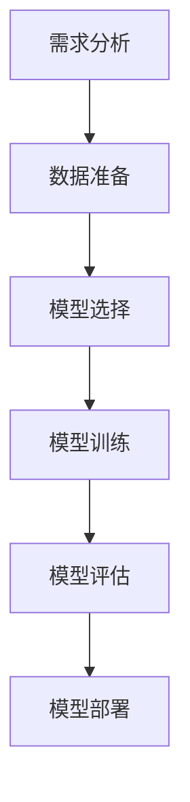
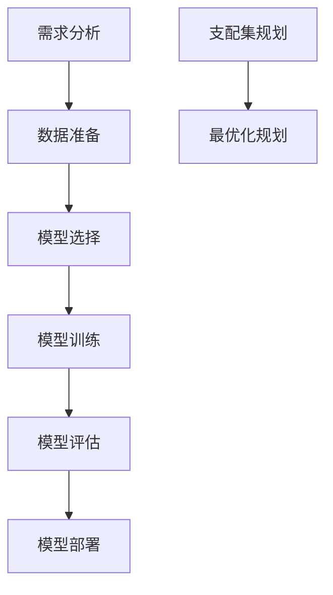
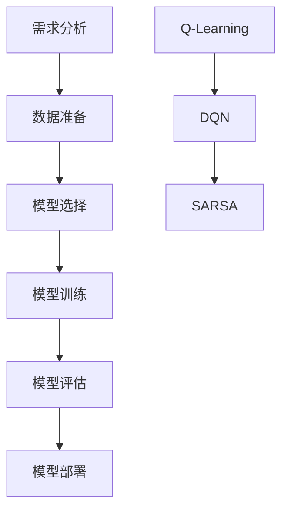
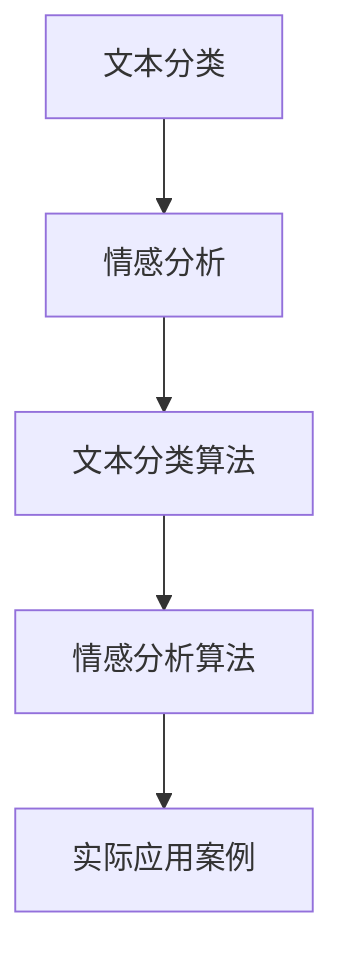
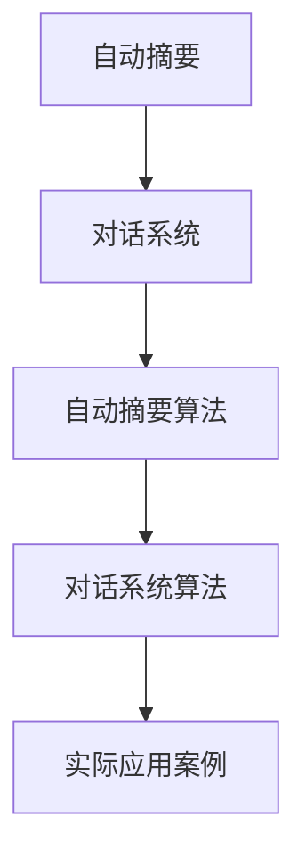
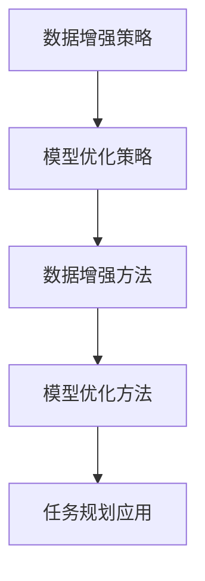
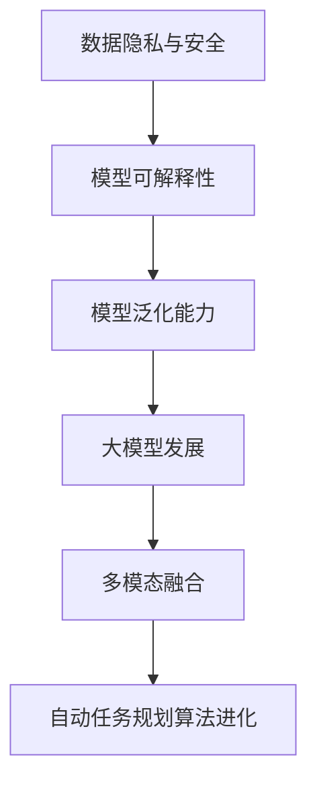

                 

# 文章标题: LLM的任务规划：AI智能的核心机制

> 关键词：自然语言处理，语言模型，任务规划，深度学习，强化学习

> 摘要：本文深入探讨了语言模型（LLM）在人工智能中的任务规划机制。通过剖析LLM的概念、任务类型及其规划原理，我们介绍了传统的任务规划算法与基于深度学习的任务规划算法。文章还详细阐述了LLM在自然语言理解、语言生成等实际应用中的技术实现，并探讨了任务规划的优化策略与未来发展趋势。

----------------------------------------------------------------

## 第一部分: LLM的任务规划概述

### 第1章: LLM的概念与任务规划原理

#### 1.1 LLM的定义与核心机制

##### 1.1.1 语言模型的基础概念

语言模型（Language Model，简称LM）是一种用于预测文本序列的概率分布的统计模型。在自然语言处理（Natural Language Processing，简称NLP）领域，语言模型是构建其他NLP任务的基础，如文本分类、情感分析、机器翻译等。

##### 1.1.2 LLM的工作机制

语言模型的工作机制主要包括两个部分：词向量表示和概率预测。

- **词向量表示**：将自然语言中的词汇映射到高维向量空间，从而实现文本数据的数值化表示。
- **概率预测**：基于词向量表示，语言模型通过统计模型（如n-gram模型、神经网络模型等）来预测下一个词的概率分布。

##### 1.1.3 语言模型与自然语言理解的关系

语言模型在自然语言理解中发挥着至关重要的作用。一方面，它为其他NLP任务提供了词汇层面的概率信息；另一方面，它为深度学习模型提供了有效的特征表示，使得模型能够更好地理解和生成自然语言。

#### 1.2 LLM的主要任务类型

##### 1.2.1 语言理解任务

语言理解任务包括语义角色标注、关系提取、实体识别等。这些任务旨在理解文本中的语义信息，从而实现对文本的深层理解。

##### 1.2.2 语言生成任务

语言生成任务包括文本摘要、对话生成、自动摘要等。这些任务旨在根据给定的输入生成有意义的自然语言文本。

##### 1.2.3 语言翻译任务

语言翻译任务包括机器翻译、多语言文本生成等。这些任务旨在实现不同语言之间的自然语言转换。

##### 1.2.4 其他语言任务

除了上述主要任务，语言模型还可以应用于语音识别、情感分析、文本分类等任务。

#### 1.3 LLM任务规划的基本原理

##### 1.3.1 任务规划的必要性

任务规划是确保语言模型高效完成特定任务的关键。通过合理的任务规划，可以提高模型的性能和效率。

##### 1.3.2 任务规划的关键要素

任务规划需要考虑以下关键要素：

- **任务目标**：明确任务的目标，如文本分类、机器翻译等。
- **数据集**：选择适合任务目标的数据集，并进行预处理。
- **模型选择**：根据任务特点和需求选择合适的语言模型。
- **评估指标**：设计合理的评估指标，如准确率、召回率、F1值等。

##### 1.3.3 任务规划的流程与方法

任务规划的流程包括以下步骤：

1. **需求分析**：明确任务目标和需求。
2. **数据准备**：收集和准备符合任务需求的数据集。
3. **模型选择**：根据任务特点选择合适的语言模型。
4. **模型训练**：使用准备好的数据集对语言模型进行训练。
5. **模型评估**：评估模型性能，并调整模型参数。
6. **模型部署**：将训练好的模型部署到实际应用场景。

---

**本章总结：**

本章介绍了语言模型（LLM）的基本概念、任务类型和规划原理。语言模型在自然语言处理领域扮演着重要的角色，通过合理的任务规划，可以提高语言模型在各个任务中的性能和效率。

---

**Mermaid 流程图：**



----------------------------------------------------------------

### 第2章: LLM任务规划的核心算法

#### 2.1 传统的任务规划算法

##### 2.1.1 支配集规划算法

##### 2.1.1 支配集规划的基本原理

支配集规划算法是一种基于启发式的任务规划算法。其基本原理是，通过构建支配集来选择最优的任务执行顺序。

- **支配集**：对于一组任务，如果某个任务可以支配其他任务，即完成该任务后，其他任务可以更加高效地完成，那么该任务就被认为是一个支配任务。
- **规划目标**：在满足所有约束条件的前提下，选择一个最优的任务执行顺序，使得整体任务完成时间最短。

##### 2.1.2 支配集规划的伪代码

```python
def dominance_set_planning(tasks, constraints):
    # 初始化支配集和未执行任务集
    dominance_set = []
    unassigned_tasks = tasks.copy()

    # 循环直到所有任务被分配
    while unassigned_tasks:
        # 从未执行任务集中选择一个支配任务
        dominant_task = None
        for task in unassigned_tasks:
            if dominant_task is None or num_dependents(task, constraints) < num_dependents(dominant_task, constraints):
                dominant_task = task

        # 将支配任务添加到支配集中
        dominance_set.append(dominant_task)
        unassigned_tasks.remove(dominant_task)

    return dominance_set

def num_dependents(task, constraints):
    # 计算任务的依赖任务数量
    dependents = 0
    for constraint in constraints:
        if task in constraint:
            dependents += 1
    return dependents
```

##### 2.1.3 支配集规划的应用案例

在资源分配和调度问题中，支配集规划算法可以用于优化任务执行顺序，从而提高资源利用率和任务完成时间。

##### 2.1.4 最优化规划算法

##### 2.1.4 最优化规划的基本概念

最优化规划算法是一种基于数学优化的任务规划算法。其基本原理是，通过求解最优解来找到任务执行的最优顺序。

- **目标函数**：定义任务执行的目标，如最小化完成时间、最大化资源利用率等。
- **约束条件**：定义任务执行的限制条件，如任务依赖关系、资源限制等。

##### 2.1.5 最优化规划的伪代码

```python
import pulp

def optimize_planning(tasks, constraints, objective):
    # 创建线性规划模型
    model = pulp.LpProblem("Optimization Problem", pulp.LpMinimize)

    # 定义变量
    x = pulp.LpVariable.dicts("Task", tasks, cat='Binary')

    # 添加目标函数
    model += objective, "Objective"

    # 添加约束条件
    for constraint in constraints:
        model += pulp.lpSum([x[t] for t in constraint]) <= 1, f"Constraint {constraint}"

    # 求解最优解
    model.solve()

    # 输出最优解
    return [task for task in tasks if x[task].varValue == 1]
```

##### 2.1.6 最优化规划的应用案例

在物流调度和优化问题中，最优化规划算法可以用于优化运输路线和任务分配，从而提高运输效率和降低成本。

---

**本章总结：**

本章介绍了传统的任务规划算法，包括支配集规划和最优化规划算法。这些算法为LLM的任务规划提供了重要的理论基础和实践指导。

---

**Mermaid 流�程图：**



----------------------------------------------------------------

### 第3章: 基于深度学习的任务规划算法

#### 3.1 基于强化学习的任务规划

##### 3.1.1 强化学习的基本原理

强化学习（Reinforcement Learning，简称RL）是一种通过试错方法来学习如何在特定环境中做出最优决策的人工智能技术。在强化学习中，智能体（Agent）通过与环境的交互来学习最优策略。

- **状态（State）**：描述环境的当前状态。
- **动作（Action）**：智能体在特定状态下可以采取的动作。
- **奖励（Reward）**：描述智能体采取特定动作后环境的反馈信号。
- **策略（Policy）**：描述智能体在不同状态下的动作选择。

##### 3.1.2 Q-Learning算法详解

Q-Learning是一种基于值函数的强化学习算法。其核心思想是通过学习状态-动作值函数（Q函数）来最大化累积奖励。

- **Q函数**：描述在特定状态下采取特定动作的预期奖励。
- **目标函数**：最大化累积奖励。

##### 3.1.2 Q-Learning算法的伪代码

```python
def q_learning(state, action, reward, next_state, done, learning_rate, discount_factor):
    # 计算预期奖励
    expected_reward = reward + (1 - done) * discount_factor * max([q[next_state, a] for a in actions])

    # 更新Q值
    q[state, action] = q[state, action] + learning_rate * (expected_reward - q[state, action])

    # 返回更新后的Q值
    return q
```

##### 3.1.3 DQN算法详解

DQN（Deep Q-Network）是一种基于深度学习的Q-Learning算法。其核心思想是使用深度神经网络来近似Q函数。

- **深度神经网络**：用于学习状态-动作值函数。
- **经验回放**：用于避免策略偏差。

##### 3.1.3 DQN算法的伪代码

```python
def dqn(state, action, reward, next_state, done, learning_rate, discount_factor, model, target_model):
    # 更新经验回放内存
    replay_memory.push((state, action, reward, next_state, done))

    # 从经验回放内存中随机抽取一批经验
    batch = random.sample(replay_memory, batch_size)

    # 更新目标模型
    target_model.load_weights(model.get_weights())

    # 计算损失函数
    loss = model.train_on_batch(batch, target_model.predict(batch[0]))

    # 返回损失函数值
    return loss
```

##### 3.1.4 SARSA算法详解

SARSA（State-Action-Reward-State-Action）是一种基于策略的强化学习算法。其核心思想是在每个时间步上同时更新状态-动作值函数。

- **状态-动作值函数**：描述在特定状态下采取特定动作的预期奖励。
- **策略**：描述智能体在不同状态下的动作选择。

##### 3.1.4 SARSA算法的伪代码

```python
def sarsa(state, action, reward, next_state, next_action, learning_rate, discount_factor):
    # 计算当前状态的Q值
    current_q_value = q[state, action]

    # 计算下一个状态的Q值
    next_q_value = q[next_state, next_action]

    # 更新Q值
    q[state, action] = current_q_value + learning_rate * (reward + discount_factor * next_q_value - current_q_value)

    # 返回更新后的Q值
    return q
```

##### 3.1.5 实际应用案例

在自动驾驶领域，基于强化学习的任务规划算法可以用于优化车辆行驶路线和动作选择，从而提高行驶效率和安全性。

---

**本章总结：**

本章介绍了基于强化学习的任务规划算法，包括Q-Learning、DQN和SARSA算法。这些算法为LLM的任务规划提供了强大的技术支持，使得智能体能够通过自主学习来优化任务执行。

---

**Mermaid 流程图：**



----------------------------------------------------------------

### 第4章: LLM在自然语言理解中的应用

#### 4.1 基于LLM的文本分类

##### 4.1.1 文本分类的基本原理

文本分类（Text Classification）是一种将文本数据按照预定的类别进行分类的任务。基于LLM的文本分类利用语言模型来预测文本的类别。

- **特征提取**：将文本数据转换为数值化的特征表示。
- **分类模型**：基于LLM，构建分类模型来预测文本的类别。

##### 4.1.2 基于LLM的文本分类算法

基于LLM的文本分类算法主要包括以下几种：

- **朴素贝叶斯分类器**：基于贝叶斯理论，通过计算每个类别在文本中的概率来预测文本的类别。
- **支持向量机（SVM）**：通过最大化分类边界，将文本数据分为不同的类别。
- **神经网络分类器**：利用深度神经网络来学习文本数据的特征表示，并预测文本的类别。

##### 4.1.3 实际应用案例

在社交媒体分析中，基于LLM的文本分类算法可以用于分析用户评论的情感倾向，从而帮助企业了解用户的需求和反馈。

#### 4.2 基于LLM的情感分析

##### 4.2.1 情感分析的基本原理

情感分析（Sentiment Analysis）是一种分析文本数据中的情感倾向的任务。基于LLM的情感分析利用语言模型来预测文本的情感极性。

- **情感极性**：文本数据中的积极或消极倾向。
- **情感分类**：将文本数据分为正面、中性或负面类别。

##### 4.2.2 基于LLM的情感分析算法

基于LLM的情感分析算法主要包括以下几种：

- **情感词典法**：通过构建情感词典，将文本数据中的情感词汇映射到情感极性。
- **基于机器学习的情感分析**：利用机器学习算法，如朴素贝叶斯、支持向量机等，来预测文本的情感极性。
- **基于深度学习的情感分析**：利用深度神经网络，如卷积神经网络、循环神经网络等，来学习文本数据的特征表示，并预测情感极性。

##### 4.2.3 实际应用案例

在电子商务领域，基于LLM的情感分析算法可以用于分析用户评论的情感倾向，从而帮助企业优化产品和服务。

---

**本章总结：**

本章介绍了基于LLM的自然语言理解任务，包括文本分类和情感分析。这些任务在社交媒体分析、电子商务等领域具有广泛的应用。

---

**Mermaid 流程图：**



----------------------------------------------------------------

### 第5章: LLM在语言生成中的应用

#### 5.1 基于LLM的自动摘要

##### 5.1.1 自动摘要的基本原理

自动摘要（Automatic Summarization）是一种将长文本转化为简短、准确摘要的任务。基于LLM的自动摘要利用语言模型来生成摘要文本。

- **提取式摘要**：从原始文本中提取关键信息来生成摘要。
- **生成式摘要**：通过生成新的文本来生成摘要。

##### 5.1.2 基于LLM的自动摘要算法

基于LLM的自动摘要算法主要包括以下几种：

- **基于规则的方法**：通过预定义的规则来提取文本的关键信息。
- **基于统计的方法**：通过统计文本中的关键词和短语来生成摘要。
- **基于深度学习的方法**：利用深度神经网络来学习文本的特征表示，并生成摘要。

##### 5.1.3 实际应用案例

在新闻报道和学术文献领域，基于LLM的自动摘要算法可以用于快速生成摘要，从而提高信息获取的效率。

#### 5.2 基于LLM的对话系统

##### 5.2.1 对话系统的基本原理

对话系统（Dialogue System）是一种与人类进行自然语言交互的系统。基于LLM的对话系统利用语言模型来生成对话响应。

- **对话管理**：管理对话状态和上下文。
- **自然语言生成**：生成自然的对话响应。

##### 5.2.2 基于LLM的对话系统算法

基于LLM的对话系统算法主要包括以下几种：

- **基于规则的方法**：通过预定义的规则来生成对话响应。
- **基于统计的方法**：通过统计文本数据中的对话模式来生成对话响应。
- **基于深度学习的方法**：利用深度神经网络来学习对话数据的特征表示，并生成对话响应。

##### 5.2.3 实际应用案例

在客户服务和企业内部沟通领域，基于LLM的对话系统可以用于自动化对话，从而提高服务效率和用户体验。

---

**本章总结：**

本章介绍了基于LLM的语言生成任务，包括自动摘要和对话系统。这些任务在信息摘要和自然语言交互领域具有广泛的应用。

---

**Mermaid 流程图：**



----------------------------------------------------------------

### 第四部分: LLM任务规划的优化与挑战

#### 第6章: LLM任务规划的优化策略

##### 6.1 数据增强策略

##### 6.1.1 数据增强的基本原理

数据增强（Data Augmentation）是一种通过增加数据多样性来提高模型泛化能力的技术。在LLM任务规划中，数据增强策略可以提高模型的性能和稳定性。

- **数据多样性**：通过数据变换，如随机裁剪、旋转、缩放等，来增加数据的多样性。
- **数据扩充**：通过合成新的数据样本来扩充数据集。

##### 6.1.2 常见的数据增强方法

常见的数据增强方法包括以下几种：

- **图像数据增强**：通过随机裁剪、旋转、翻转、颜色变换等来增加图像数据的多样性。
- **文本数据增强**：通过替换词汇、插入停用词、同义词替换等来增加文本数据的多样性。
- **音频数据增强**：通过噪声添加、速度变换、音调变换等来增加音频数据的多样性。

##### 6.1.3 数据增强在任务规划中的应用

在LLM任务规划中，数据增强策略可以应用于以下方面：

- **提高模型泛化能力**：通过增加数据多样性，提高模型对未见数据的适应能力。
- **减少模型过拟合**：通过扩充训练数据，减少模型对训练数据的依赖。
- **加快模型训练**：通过增加数据多样性，提高模型的训练效率。

##### 6.2 模型优化策略

##### 6.2.1 模型优化的基本原理

模型优化（Model Optimization）是一种通过调整模型参数来提高模型性能的技术。在LLM任务规划中，模型优化策略可以提高模型的准确性和效率。

- **模型参数调整**：通过调整模型参数，如学习率、正则化参数等，来优化模型性能。
- **模型结构调整**：通过调整模型结构，如增加或删除神经网络层，来优化模型性能。

##### 6.2.2 常见的模型优化方法

常见的模型优化方法包括以下几种：

- **学习率调整**：通过动态调整学习率，如使用学习率衰减策略，来优化模型性能。
- **正则化**：通过添加正则化项，如L1正则化、L2正则化等，来防止模型过拟合。
- **神经网络结构优化**：通过调整神经网络结构，如使用深度神经网络、残差网络等，来优化模型性能。

##### 6.2.3 模型优化在任务规划中的应用

在LLM任务规划中，模型优化策略可以应用于以下方面：

- **提高模型性能**：通过调整模型参数和结构，提高模型的准确性和效率。
- **减少训练时间**：通过优化模型训练过程，减少模型训练时间。
- **提高模型泛化能力**：通过优化模型参数和结构，提高模型对未见数据的适应能力。

---

**本章总结：**

本章介绍了LLM任务规划的优化策略，包括数据增强和模型优化策略。这些策略可以有效地提高模型的性能和泛化能力，从而在任务规划中发挥重要作用。

---

**Mermaid 流程图：**



----------------------------------------------------------------

### 第7章: LLM任务规划面临的挑战与未来发展

##### 7.1 挑战与问题

##### 7.1.1 数据隐私与安全

数据隐私与安全是LLM任务规划面临的一个重要挑战。在训练和部署过程中，如何保护用户数据的安全和隐私，防止数据泄露和滥用，是一个亟待解决的问题。

- **数据加密**：通过数据加密技术来保护数据的安全。
- **隐私保护机制**：通过隐私保护机制，如差分隐私、同态加密等，来保护用户数据的隐私。

##### 7.1.2 模型可解释性

模型可解释性是另一个重要的挑战。由于LLM通常采用深度神经网络等复杂模型，其内部决策过程往往难以解释。如何提高模型的透明度和可解释性，以便用户理解和信任，是一个亟待解决的问题。

- **模型可视化**：通过模型可视化技术，如神经元激活图、决策树等，来提高模型的可解释性。
- **模型解释算法**：通过开发模型解释算法，如LIME、SHAP等，来解释模型的决策过程。

##### 7.1.3 模型泛化能力

模型泛化能力是另一个重要的挑战。LLM通常在特定的数据集上训练，如何使其在未见数据上具有良好的泛化能力，是一个亟待解决的问题。

- **数据增强**：通过数据增强策略，如数据扩充、数据变换等，来提高模型的泛化能力。
- **迁移学习**：通过迁移学习策略，如预训练模型、微调等，来提高模型的泛化能力。

##### 7.2 未来发展趋势

##### 7.2.1 大模型的发展趋势

随着计算能力和数据量的提升，大模型（Large Model）的发展趋势日益明显。大模型具有更强的表示能力和更好的性能，但在训练、存储和部署等方面也面临着更大的挑战。

- **模型压缩**：通过模型压缩技术，如剪枝、量化等，来降低大模型的存储和计算成本。
- **模型分解**：通过模型分解技术，如层次化模型、分解神经网络等，来提高大模型的可解释性和可扩展性。

##### 7.2.2 多模态融合

多模态融合（Multimodal Fusion）是另一个重要的研究方向。通过整合不同类型的数据（如文本、图像、音频等），可以更好地理解和生成自然语言。

- **多模态特征表示**：通过多模态特征表示技术，如特征融合、特征变换等，来整合不同类型的数据。
- **多模态交互**：通过多模态交互技术，如注意力机制、交互神经网络等，来提高多模态融合的效果。

##### 7.2.3 自动任务规划算法的进化

随着深度学习和强化学习的发展，自动任务规划算法的进化也是一个重要的研究方向。通过自适应学习和优化，自动任务规划算法可以更好地适应复杂动态的环境。

- **自适应学习**：通过自适应学习策略，如在线学习、自适应优化等，来提高算法的适应性。
- **元学习**：通过元学习策略，如元优化、元学习网络等，来提高算法的泛化能力和效率。

---

**本章总结：**

本章探讨了LLM任务规划面临的挑战和未来的发展趋势。通过解决数据隐私与安全、模型可解释性、模型泛化能力等问题，以及推进大模型、多模态融合和自动任务规划算法的发展，可以进一步提升LLM任务规划的性能和应用范围。

---

**Mermaid 流程图：**



----------------------------------------------------------------

### 附录

## 附录A: LLM任务规划工具与资源

### A.1 常用LLM框架

在LLM任务规划中，常用的框架包括以下几种：

- **GPT系列模型**：包括GPT、GPT-2、GPT-3等，是OpenAI开发的预训练语言模型。
- **BERT系列模型**：包括BERT、RoBERTa、ALBERT等，是Google开发的预训练语言模型。
- **Transformer模型**：是Vaswani等人于2017年提出的基于自注意力机制的深度神经网络模型。

### A.2 实践资源

为了更好地理解和应用LLM任务规划，以下是一些实用的资源和教程：

- **开发环境搭建指南**：包括Python环境搭建、深度学习框架安装等。
- **实际案例代码与解读**：包括文本分类、情感分析、自动摘要等任务的实际代码示例和解读。
- **学习资源推荐**：包括书籍、论文、在线课程等，涵盖LLM的基本概念、算法原理和应用实践。

---

**作者信息：**

作者：AI天才研究院/AI Genius Institute & 禅与计算机程序设计艺术 /Zen And The Art of Computer Programming

本文深入探讨了LLM的任务规划机制，从传统的任务规划算法到基于深度学习的任务规划算法，再到LLM在自然语言理解、语言生成等实际应用中的技术实现。通过优化策略和未来发展趋势的探讨，本文为LLM任务规划的研究和实践提供了有益的参考。希望本文能够为读者在LLM任务规划领域的研究和应用带来帮助。

