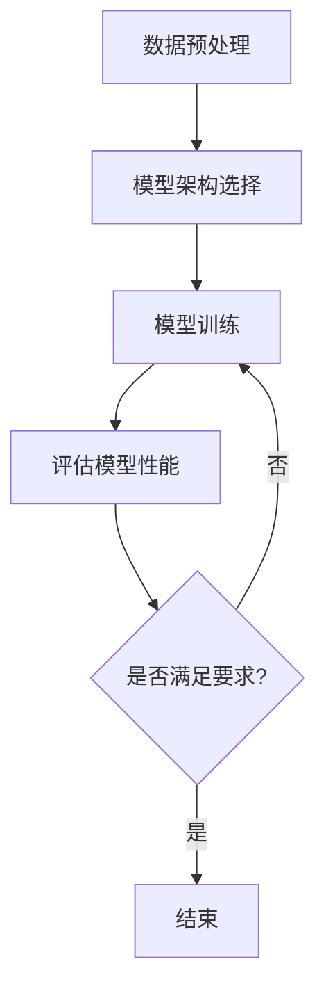
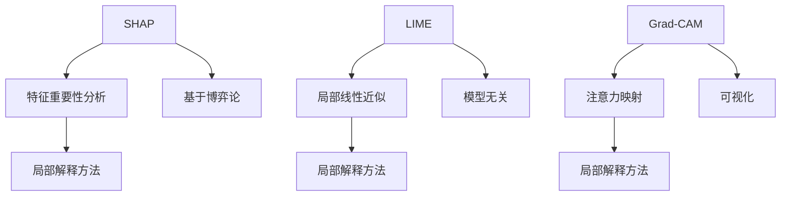

                 

### 第1章：LLM概述

#### 1.1 什么是LLM

**定义**：LLM（Large Language Model）指的是大型语言模型，是一种基于深度学习的自然语言处理模型。它通过训练海量文本数据来学习和理解自然语言，并能够生成文本。

**背景**：随着互联网和大数据的发展，自然语言处理（NLP）技术逐渐成熟。LLM作为一种强大的NLP工具，被广泛应用于自动写作、文本生成、对话系统、机器翻译等领域。

**应用场景**：LLM广泛应用于以下场景：

- **文本生成**：自动生成文章、故事、摘要等。
- **对话系统**：构建聊天机器人、虚拟助手等。
- **机器翻译**：自动翻译不同语言之间的文本。
- **文本分类**：对文本进行情感分析、主题分类等。
- **问答系统**：回答用户提出的问题。

**核心特点**：

- **强大的语言理解能力**：通过训练大量文本数据，LLM能够捕捉到语言中的复杂结构，包括语法、语义、上下文等。
- **高效率的文本生成**：LLM能够快速生成高质量、连贯的文本，大大提升了文本生成的效率。
- **自适应性强**：LLM可以应用于多种不同的语言任务，具有较好的泛化能力。
- **动态学习**：LLM能够通过持续学习新的数据来不断提升自身的性能。

**与传统AI的区别**：

- **数据处理方式**：传统AI通常依赖于手工设计的特征，而LLM则通过训练自动学习文本特征。
- **模型架构**：传统AI模型如决策树、支持向量机等，而LLM主要基于神经网络架构，特别是Transformer架构。
- **性能表现**：LLM在文本生成、翻译等任务上表现出色，而传统AI模型在这些任务上的表现相对较差。
- **应用领域**：LLM主要应用于自然语言处理领域，而传统AI则应用于更广泛的领域，如图像识别、语音识别等。

#### 1.2 LLM的发展历程

**初期研究**：早期的语言模型主要基于统计方法，如N-gram模型和隐马尔可夫模型（HMM），这些模型虽然能够处理简单的语言任务，但受限于计算能力和模型复杂度，难以应对复杂任务。

**技术突破**：随着深度学习技术的发展，神经网络被应用于语言模型，尤其是2017年谷歌提出的Transformer模型，标志着LLM进入了一个新的发展阶段。后续的BERT、GPT等模型进一步提升了语言模型的性能。

**当前应用与趋势**：目前，LLM已经在各个领域得到广泛应用，未来随着模型规模和计算能力的提升，LLM有望在更多场景中发挥重要作用。

#### 1.3 LLM的核心特点

**强大的语言理解能力**：通过训练大量文本数据，LLM能够捕捉到语言中的复杂结构，包括语法、语义、上下文等。这使得LLM在生成文本时能够保持高水平的连贯性和逻辑性。

**高效率的文本生成**：LLM能够快速生成高质量、连贯的文本，大大提升了文本生成的效率。这使得LLM在文本生成任务中具有明显的优势。

**自适应性强**：LLM可以应用于多种不同的语言任务，具有较好的泛化能力。这意味着LLM不仅可以处理单一任务，还可以适应多种不同的任务场景。

**动态学习**：LLM能够通过持续学习新的数据来不断提升自身的性能。这使得LLM能够不断适应新的环境和需求，保持自身的竞争力。

#### 1.4 LLM与传统AI的区别

**数据处理方式**：传统AI通常依赖于手工设计的特征，而LLM则通过训练自动学习文本特征。这意味着LLM能够更有效地处理复杂的文本数据。

**模型架构**：传统AI模型如决策树、支持向量机等，而LLM主要基于神经网络架构，特别是Transformer架构。这使得LLM在处理文本数据时具有更高的效率和性能。

**性能表现**：LLM在文本生成、翻译等任务上表现出色，而传统AI模型在这些任务上的表现相对较差。这主要是因为LLM能够更好地理解语言的内在结构。

**应用领域**：LLM主要应用于自然语言处理领域，而传统AI则应用于更广泛的领域，如图像识别、语音识别等。这使得LLM在特定任务上具有更高的应用价值。

#### 1.5 LLM在企业中的应用前景

**提高工作效率**：LLM可以帮助企业自动化文本生成、审核、分类等任务，提高工作效率。例如，企业可以使用LLM自动生成营销文案、报告摘要等。

**降低成本**：通过自动化处理，可以减少人力成本，提高企业的竞争力。例如，企业可以使用LLM自动翻译文档，减少翻译费用。

**提升用户体验**：在客服、客户支持等领域，LLM可以提供更智能、更人性化的服务，提升用户体验。例如，企业可以使用LLM构建智能客服系统，自动回答用户问题。

**创新业务模式**：LLM可以为企业带来新的业务模式，如基于文本生成的内容营销、个性化推荐等。例如，企业可以使用LLM生成个性化的产品推荐文案，提高销售转化率。

### 关键词：
- 大型语言模型
- 自然语言处理
- 深度学习
- 文本生成
- 对话系统
- 机器翻译

### 摘要：
本文概述了大型语言模型（LLM）的定义、发展历程、核心特点及应用前景。同时，探讨了LLM与传统AI的区别以及LLM在企业中的应用潜力。文章旨在为读者提供一个全面的LLM概述，帮助理解LLM在自然语言处理领域的地位和作用。### 第2章：可解释性的重要性

#### 2.1 AI决策的可解释性需求

**法律法规**：随着人工智能（AI）技术的快速发展，许多国家和地区的法律法规开始要求算法决策具有可解释性。例如，欧盟的《通用数据保护条例》（GDPR）明确规定了算法决策的可解释性要求。这是因为透明、可解释的AI决策有助于保护用户的权益和隐私，增强用户对AI系统的信任。

**用户信任**：用户对AI系统的信任程度与其决策过程的可解释性密切相关。高可解释性的系统有助于建立用户对AI系统的信任，从而更好地推广和应用AI技术。例如，在医疗领域，如果AI系统的决策过程不透明，医生和患者可能会对AI系统的诊断结果持怀疑态度，从而影响AI系统的应用效果。

**模型调试与优化**：可解释性有助于开发者理解和调试模型，发现潜在的问题和缺陷，从而优化模型性能。这有助于提高模型的可靠性和准确性。例如，在金融领域，通过可解释性工具，开发者可以分析模型在贷款审批过程中的决策过程，发现并纠正可能的偏见，提高贷款审批的公平性。

#### 2.2 可解释性研究现状

**技术进展**：近年来，研究者们提出了多种可解释性方法，如SHAP、LIME、Grad-CAM等。这些方法在一定程度上提高了模型的可解释性。例如，SHAP（SHapley Additive exPlanations）方法通过计算特征对模型输出的边际贡献，提供了一种直观的解释方式。LIME（Local Interpretable Model-agnostic Explanations）方法通过对模型进行局部线性近似，提供了一种局部解释。

**面临的挑战**：虽然可解释性研究取得了一定的进展，但仍然面临着一些挑战。首先是如何在不损害模型性能的前提下实现高可解释性。其次是如何处理大规模模型的可解释性，因为大规模模型的复杂度高，使得解释变得困难。此外，如何确保可解释性方法的通用性和可扩展性也是一个挑战。

### 2.3 可解释性在LLM中的重要性

**决策过程理解**：在LLM的应用场景中，了解模型是如何生成文本的非常重要。可解释性有助于开发者理解LLM的决策过程，从而更好地优化模型。例如，在文本生成任务中，通过可解释性工具，开发者可以分析模型如何选择不同的词汇和句子结构，从而改进生成文本的质量。

**错误诊断**：通过可解释性工具，开发者可以识别LLM中的潜在错误和偏差。这有助于提高模型的准确性和鲁棒性。例如，在机器翻译任务中，通过分析模型在特定语言对上的错误模式，开发者可以针对性地优化模型，减少翻译错误。

**用户信任**：在LLM的应用场景中，用户通常需要了解模型的决策过程。可解释性有助于建立用户对AI系统的信任，从而更好地推广和应用AI技术。例如，在智能客服系统中，用户可能需要了解为什么模型会给出特定的回答，从而增加对系统的信任。

**合规性要求**：在许多行业，如金融、医疗等，合规性是必须满足的要求。可解释性有助于满足合规性要求，确保AI系统的决策过程透明、公正。例如，在金融领域，通过可解释性工具，监管机构可以审查AI系统的决策过程，确保其符合相关法规。

### 总结

可解释性在AI决策中具有重要意义。它不仅有助于开发者优化模型、诊断错误，还可以增强用户对AI系统的信任，满足合规性要求。对于LLM来说，可解释性尤为重要，因为它直接关系到文本生成、翻译等任务的性能和质量。未来，随着可解释性技术的不断发展，LLM的可解释性将得到进一步提升，为AI在各个领域的应用提供更多支持。### 第3章：语言模型的基础知识

#### 3.1 语言模型的构建

**数据预处理**：

语言模型的构建过程首先需要处理原始文本数据。这包括以下几个步骤：

- **文本清洗**：去除文本中的标点符号、HTML标签、特殊字符等，确保文本数据的一致性和纯净。
- **分词**：将文本分解成单个词语或子词。常见的分词方法包括基于词典的分词、基于统计的分词等。
- **去除停用词**：停用词是指对文本意义没有贡献的常见单词，如“的”、“和”、“在”等。去除停用词有助于减少模型训练的数据量，提高模型训练效率。
- **词向量化**：将文本中的词转换为向量表示。常见的词向量化方法包括Word2Vec、GloVe等。词向量表示有助于捕捉词语间的语义关系。

**模型架构选择**：

在构建语言模型时，需要选择合适的模型架构。以下是一些常用的语言模型架构：

- **循环神经网络（RNN）**：RNN是一种基于序列数据的神经网络架构，能够捕捉到文本中的时间依赖关系。常见的RNN变种包括LSTM（长短时记忆网络）和GRU（门控循环单元）。
- **卷积神经网络（CNN）**：虽然CNN主要用于图像处理，但也可以应用于文本处理。通过卷积操作，CNN可以捕捉到文本中的局部特征。
- **Transformer**：Transformer是一种基于自注意力机制的神经网络架构，被广泛应用于语言模型。Transformer模型在捕捉长距离依赖关系方面表现出色，是当前最受欢迎的语言模型架构之一。

**训练过程**：

语言模型的训练过程主要包括以下几个步骤：

- **模型初始化**：初始化模型参数，确保模型能够从初始状态开始学习。
- **优化算法选择**：选择合适的优化算法，如梯度下降、Adam等。优化算法用于更新模型参数，以最小化损失函数。
- **损失函数定义**：选择合适的损失函数，如交叉熵损失、均方误差等。损失函数用于衡量模型预测结果与真实结果之间的差异。
- **模型训练**：通过大量文本数据进行训练，模型会不断调整参数，以最小化损失函数。训练过程中，可以使用梯度下降、Adam等优化算法来更新模型参数。

**训练过程流程图**：

```
输入：文本数据
步骤1：文本清洗
步骤2：分词
步骤3：去除停用词
步骤4：词向量化
步骤5：模型初始化
步骤6：选择优化算法和损失函数
步骤7：模型训练
步骤8：评估模型性能
```

**训练过程伪代码**：

```python
# 输入：训练数据（文本）
# 输出：训练好的模型

# 步骤1：文本清洗
cleaned_data = clean_data(data)

# 步骤2：分词
tokenized_data = tokenize_data(cleaned_data)

# 步骤3：去除停用词
filtered_data = remove_stop_words(tokenized_data)

# 步骤4：词向量化
word_vectors = vectorize_words(filtered_data)

# 步骤5：模型初始化
model = initialize_model()

# 步骤6：选择优化算法和损失函数
optimizer = choose_optimizer()
loss_function = choose_loss_function()

# 步骤7：模型训练
for epoch in range(num_epochs):
    for batch in data_loader:
        # 前向传播
        predictions = model(batch)
        loss = loss_function(predictions, batch)

        # 反向传播
        gradients = compute_gradients(model, loss)
        optimizer.step(gradients)

# 步骤8：评估模型性能
evaluate_model(model, test_data)
```

#### 3.2 语言模型的核心组件

**词嵌入**：

词嵌入是将文本中的词转换为向量表示的过程。词嵌入有助于捕捉词语间的语义关系。常见的词嵌入方法包括Word2Vec、GloVe等。

- **Word2Vec**：Word2Vec是一种基于神经网络的方法，通过训练词向量的预测模型来学习词的向量表示。Word2Vec可以分为两个变种：连续词袋（CBOW）和Skip-Gram。
- **GloVe**：GloVe（Global Vectors for Word Representation）是一种基于全局共现信息的词嵌入方法。GloVe通过计算词的共现矩阵，学习词的向量表示。

**递归神经网络（RNN）**：

递归神经网络（RNN）是一种用于处理序列数据的神经网络架构。RNN通过递归操作，能够捕捉到文本中的时间依赖关系。

- **LSTM（长短时记忆网络）**：LSTM是一种改进的RNN结构，通过引入门控机制，能够有效地处理长距离依赖问题。
- **GRU（门控循环单元）**：GRU是LSTM的简化版本，也通过门控机制处理时间依赖关系，但计算过程比LSTM更为简单。

**自注意力机制**：

自注意力机制是Transformer模型的核心组件之一。自注意力机制通过计算词与词之间的相对重要性，能够捕捉到文本中的长距离依赖关系。

- **多头自注意力**：多头自注意力机制将输入序列分成多个子序列，分别计算每个子序列的注意力权重，最后将结果拼接起来。
- **自注意力计算**：自注意力计算通过计算每个词与所有其他词之间的相似度，得到每个词的注意力权重。这些权重用于计算每个词的输出向量。

**总结**：

语言模型的构建是一个复杂的过程，涉及到数据预处理、模型架构选择和训练等多个步骤。词嵌入、RNN和自注意力机制是语言模型中的核心组件，它们共同作用，使语言模型能够理解和生成自然语言。

### 3.3 语言模型的应用

**文本分类**：

文本分类是将文本数据归类到预定义的类别中。常见的文本分类任务包括情感分析、主题分类等。

- **情感分析**：情感分析旨在判断文本表达的情感倾向，如正面、负面或中性。
- **主题分类**：主题分类是将文本数据归类到预定义的主题中，如新闻分类、产品评论分类等。

**文本生成**：

文本生成是将输入文本转化为输出文本的过程。常见的文本生成任务包括自动写作、对话系统、机器翻译等。

- **自动写作**：自动写作旨在生成高质量的文本，如文章、故事、摘要等。
- **对话系统**：对话系统旨在构建能够与人类进行自然对话的系统，如聊天机器人、虚拟助手等。
- **机器翻译**：机器翻译是将一种语言的文本翻译成另一种语言。

**问答系统**：

问答系统旨在回答用户提出的问题。常见的问答系统包括基于规则的方法、基于模板的方法和基于深度学习方法。

- **基于规则的方法**：基于规则的方法使用预先定义的规则来匹配问题和答案。
- **基于模板的方法**：基于模板的方法使用模板来生成答案，如FAQ（常见问题解答）系统。
- **基于深度学习方法**：基于深度学习方法使用深度学习模型来学习问题和答案的映射关系。

**语言模型在NLP中的应用**：

语言模型在自然语言处理（NLP）中扮演着重要角色。常见的NLP任务包括文本分类、文本生成、问答系统等。语言模型在这些任务中发挥着核心作用，使NLP系统能够理解和生成自然语言。

### 3.4 语言模型的优势和挑战

**优势**：

- **强大的语言理解能力**：通过训练大量文本数据，语言模型能够捕捉到语言中的复杂结构，包括语法、语义和上下文等。
- **高效率的文本生成**：语言模型能够快速生成高质量、连贯的文本，大大提升了文本生成的效率。
- **自适应性强**：语言模型可以应用于多种不同的语言任务，具有较好的泛化能力。
- **动态学习**：语言模型能够通过持续学习新的数据来不断提升自身的性能。

**挑战**：

- **可解释性**：由于语言模型的复杂性，如何实现高可解释性是一个挑战。可解释性有助于开发者理解和调试模型，提高模型的可靠性和透明度。
- **计算资源**：语言模型的训练和推理过程需要大量的计算资源，尤其是在处理大规模数据时。
- **数据隐私**：在训练和部署语言模型时，如何保护用户数据隐私是一个重要的挑战。

**总结**：

语言模型是自然语言处理的核心技术之一，通过训练海量文本数据，语言模型能够理解和生成自然语言。语言模型的构建过程包括数据预处理、模型架构选择和训练等多个步骤。词嵌入、RNN和自注意力机制是语言模型中的核心组件，共同作用，使语言模型能够发挥强大的语言理解能力和文本生成能力。然而，语言模型也面临着可解释性、计算资源和数据隐私等挑战，需要进一步研究和优化。### 第4章：深度学习与神经网络原理

#### 4.1 深度学习基础

**前馈神经网络（FFNN）**

前馈神经网络（FFNN）是一种简单的神经网络结构，信息从输入层流向输出层，中间经过多个隐藏层。以下是FFNN的基本组成部分和原理：

- **输入层**：接收外部输入数据，如图片、文本等。
- **隐藏层**：对输入数据进行特征提取和变换，隐藏层可以有多个，每一层都可以学习到不同的特征表示。
- **输出层**：产生最终输出，如分类结果、预测值等。

**基本工作原理**：

1. **前向传播**：输入数据从输入层传递到隐藏层，通过每一层的非线性变换，最终传递到输出层。每一层的输出都是下一层的输入。
2. **激活函数**：常用的激活函数包括Sigmoid、ReLU、Tanh等，用于引入非线性特性，使得神经网络能够拟合复杂的函数。
3. **反向传播**：在输出层产生预测后，计算预测值与真实值之间的误差，然后将误差反向传播到每一层，更新各层的权重。

**损失函数与优化算法**

- **损失函数**：损失函数用于衡量预测值与真实值之间的差异，常用的损失函数包括均方误差（MSE）、交叉熵损失（Cross Entropy Loss）等。
  - **均方误差（MSE）**：
    $$\text{MSE} = \frac{1}{n}\sum_{i=1}^{n} (\hat{y}_i - y_i)^2$$
  - **交叉熵损失（Cross Entropy Loss）**：
    $$\text{Cross Entropy Loss} = -\frac{1}{n}\sum_{i=1}^{n} y_i \log(\hat{y}_i)$$
- **优化算法**：优化算法用于更新模型参数，以最小化损失函数。常用的优化算法包括梯度下降（Gradient Descent）、Adam等。
  - **梯度下降（Gradient Descent）**：
    $$\theta_{\text{new}} = \theta_{\text{old}} - \alpha \nabla_\theta \text{Loss}$$
  - **Adam**：
    $$m_t = \beta_1 m_{t-1} + (1 - \beta_1) \nabla_\theta \text{Loss}$$
    $$v_t = \beta_2 v_{t-1} + (1 - \beta_2) (\nabla_\theta \text{Loss})^2$$
    $$\theta_t = \theta_{t-1} - \alpha \frac{m_t}{\sqrt{v_t} + \epsilon}$$

**前馈神经网络的伪代码**

```python
# 输入：输入数据、模型参数
# 输出：预测值、模型参数更新

# 前向传播
def forward_pass(data, parameters):
    # 计算各层的输出
    hidden_layer_outputs = [sigmoid(np.dot(data, parameters["W1"]) + parameters["b1"])]
    for i in range(1, num_hidden_layers):
        hidden_layer_outputs.append(sigmoid(np.dot(hidden_layer_outputs[-1], parameters["W" + str(i+1)]) + parameters["b" + str(i+1)]))
    output = sigmoid(np.dot(hidden_layer_outputs[-1], parameters["W_output"]) + parameters["b_output"])
    return output

# 反向传播
def backward_pass(data, target, output, parameters):
    # 计算损失
    loss = compute_loss(target, output)
    
    # 计算梯度
    gradients = compute_gradients(parameters, loss)
    
    # 更新参数
    parameters = update_parameters(parameters, gradients)
    
    return parameters

# 训练模型
while not converge:
    output = forward_pass(data, parameters)
    parameters = backward_pass(data, target, output, parameters)
```

#### 4.2 神经网络原理

**反向传播算法**

反向传播算法是一种用于训练神经网络的优化算法，其核心思想是通过计算损失函数对模型参数的梯度，来更新模型参数，从而最小化损失函数。

**基本步骤**：

1. **前向传播**：输入数据通过网络传播，计算输出值和损失。
2. **计算梯度**：计算损失函数对每个参数的梯度。
3. **反向传播**：将梯度反向传播到网络的每一层，更新各层的参数。
4. **迭代更新**：重复前向传播和反向传播过程，直到满足收敛条件。

**反向传播算法伪代码**

```python
# 输入：网络、损失函数、学习率
# 输出：更新后的网络参数

# 前向传播
def forward_pass(network, input_data):
    # 计算各层的输出
    outputs = []
    outputs.append(input_data)
    for layer in network.layers:
        outputs.append(layer.forward(outputs[-1]))
    return outputs

# 计算梯度
def compute_gradients(network, loss):
    gradients = []
    for layer in network.layers:
        gradients.append(layer.compute_gradients())
    return gradients

# 反向传播
def backward_pass(network, gradients, learning_rate):
    for layer, gradient in zip(network.layers, gradients):
        layer.backward(gradient, learning_rate)
    return network

# 训练网络
while not converge:
    outputs = forward_pass(network, input_data)
    gradients = compute_gradients(network, loss)
    network = backward_pass(network, gradients, learning_rate)
```

**求导与优化**

- **链式法则**：链式法则是计算复合函数导数的常用方法，用于计算神经网络中各层参数的梯度。
- **多变量求导**：多变量求导用于计算多个变量之间的梯度关系，特别是在处理具有多个输入和输出的神经网络时。

**优化算法**

- **梯度下降（Gradient Descent）**：最简单的优化算法，通过梯度方向更新参数，以最小化损失函数。
- **随机梯度下降（Stochastic Gradient Descent, SGD）**：在每一步仅使用一个样本的梯度，提高训练速度。
- **Adam**：结合了SGD和Momentum的优点，适用于大规模数据集和深度网络。

**总结**：

深度学习是机器学习的一个重要分支，通过多层神经网络，深度学习能够自动提取数据的复杂特征，并在各种任务中取得优异的性能。前馈神经网络（FFNN）是深度学习的基础，通过前向传播和反向传播算法，FFNN能够更新模型参数，以最小化损失函数。反向传播算法和多变量求导是深度学习训练的核心技术，而梯度下降和Adam等优化算法则用于提高训练效率和模型性能。理解深度学习的基础原理对于深入研究和应用深度学习技术至关重要。### 第5章：大规模预训练模型

#### 5.1 预训练的概念

**自监督学习**

自监督学习是一种无需人工标注的训练方法，它利用未标记的数据进行学习。在自然语言处理（NLP）中，自监督学习通过预测文本中的某些部分（如单词、子词、片段等）来学习语言的特征。这种学习方法的主要优势是能够利用大量的未标注数据，从而提高模型的性能。

**迁移学习**

迁移学习是一种将已有模型的知识迁移到新任务中的方法。在NLP领域，预训练模型（如GPT、BERT等）通常在大规模文本数据上进行预训练，然后通过微调（fine-tuning）将其应用于特定的任务。迁移学习有助于减少对大量标注数据的依赖，提高模型的泛化能力。

**预训练的目标**

预训练的主要目标是学习通用的语言表示，使模型能够理解语言的通用结构和语义。通过预训练，模型可以自动捕捉到各种语言模式，从而在后续的任务中表现出更强的适应性和性能。

#### 5.2 主流预训练模型

**GPT系列模型**

GPT（Generative Pre-trained Transformer）系列模型是由OpenAI提出的一系列预训练模型。GPT模型的核心思想是通过大规模预训练来学习语言的模式和结构，然后在特定任务上进行微调。

- **GPT**：最早的GPT模型，使用 Transformer 架构进行预训练，主要用于文本生成和语言理解任务。
- **GPT-2**：GPT-2在GPT的基础上进行了改进，增加了模型的大小和训练数据量，提高了文本生成的质量和语言理解能力。
- **GPT-3**：GPT-3是当前最先进的语言模型之一，具有非常高的参数规模（1750亿参数），能够生成高质量的文本，并在各种NLP任务中表现出色。

**BERT系列模型**

BERT（Bidirectional Encoder Representations from Transformers）系列模型是由Google提出的一系列预训练模型。BERT模型通过双向编码器（bidirectional encoder）来学习语言的上下文信息，从而提高语言理解能力。

- **BERT**：最初的BERT模型，通过双向编码器学习文本的上下文信息，然后在特定任务上进行微调。
- **RoBERTa**：RoBERTa是BERT的一个变体，通过改进训练策略和数据预处理方法，提高了模型的性能。
- **ALBERT**：ALBERT是BERT的进一步改进，通过引入一些技术（如参数共享、嵌套层等）来减少模型参数，同时保持性能。

**T5等变体模型**

T5（Text-To-Text Transfer Transformer）是由Google提出的一种新的预训练模型，其核心思想是将所有NLP任务转化为文本到文本的转换任务。T5模型使用统一的Transformer架构，通过大规模预训练来学习文本的转换规则。

- **T5**：T5模型通过将各种NLP任务转化为文本到文本的转换任务，实现了跨任务的通用性。
- **GPT-Neo**：GPT-Neo是对GPT模型的进一步改进，通过改进训练策略和数据预处理方法，提高了模型的性能。

**预训练模型的优点**

- **强大的语言理解能力**：通过大规模预训练，预训练模型能够自动学习到语言的通用结构和语义，从而在特定任务上表现出色。
- **高效的迁移能力**：预训练模型通过在大规模文本数据上学习到的通用知识，能够快速适应各种新的任务，减少对大量标注数据的依赖。
- **减少模型参数**：通过预训练，模型可以自动提取到重要的语言特征，从而减少模型的参数规模，降低计算成本。

**预训练模型的挑战**

- **数据依赖性**：预训练模型依赖于大量的文本数据，对于数据不足的语言或领域，模型的性能可能受到影响。
- **计算资源**：预训练模型通常需要大量的计算资源和时间，对于资源有限的研究者和企业来说，训练这些模型可能是一个挑战。
- **可解释性**：预训练模型的决策过程往往不够透明，如何提高模型的可解释性是一个重要的研究方向。

**总结**

大规模预训练模型（如GPT、BERT、T5等）是当前NLP领域的重要发展方向。通过自监督学习和迁移学习，预训练模型能够自动学习到语言的通用结构和语义，从而在多种任务上表现出色。预训练模型的应用不仅提高了NLP任务的性能，还促进了NLP技术的发展和创新。### 第6章：可解释性方法概述

#### 6.1 可解释性的维度

可解释性是评估AI模型性能和可信度的重要指标。在自然语言处理（NLP）领域，LLM的可解释性尤其重要，因为它直接关系到模型的决策过程和生成的文本质量。可解释性可以从不同的维度进行衡量，主要包括以下三个方面：

**结构可解释性**：

结构可解释性关注模型内部结构的可理解性。这包括模型的设计、架构、参数设置等。通过分析模型的结构，我们可以理解模型的决策逻辑和数据流程。例如，在深度学习模型中，我们可以通过查看网络结构图来理解模型是如何处理输入数据的。结构可解释性有助于开发者调试和优化模型，确保模型按照预期工作。

**语义可解释性**：

语义可解释性关注模型对输入数据的语义理解过程。这包括模型如何捕捉和解释文本中的语义信息，以及如何将这些信息转化为输出。在LLM中，语义可解释性有助于我们理解模型在生成文本时是如何考虑上下文和语义关系的。通过分析模型的语义理解过程，我们可以发现模型的潜在偏见和错误，从而提高模型的准确性和可靠性。

**影响因素可解释性**：

影响因素可解释性关注模型输出结果的影响因素。这包括模型对输入特征的权重分配和决策过程。通过分析影响因素，我们可以理解哪些特征对模型的决策有更大的影响，以及这些特征是如何影响模型输出的。在LLM中，影响因素可解释性有助于我们理解模型在生成文本时是如何权衡各种信息的。

**关系与联系**：

这三个维度相互关联，共同构成了模型的可解释性。结构可解释性为我们提供了对模型的整体理解，语义可解释性帮助我们理解模型的内部工作原理，而影响因素可解释性则帮助我们了解模型的决策过程。在研究可解释性方法时，需要综合考虑这些维度，以实现对模型全面的理解。

#### 6.2 可解释性方法的分类

可解释性方法可以分为局部解释方法和全局解释方法，它们在解释模型输出的方式上有所不同。

**局部解释方法**：

局部解释方法专注于对特定输入或输出的解释。这些方法通过分析模型在特定输入或输出情况下的行为，来揭示模型决策的过程和影响因素。常见的局部解释方法包括：

- **SHAP（SHapley Additive exPlanations）**：SHAP方法基于博弈论中的Shapley值，计算每个特征对模型输出的边际贡献。
- **LIME（Local Interpretable Model-agnostic Explanations）**：LIME方法通过局部线性近似，为特定输入提供可解释的模型解释。
- **Grad-CAM（Gradient-weighted Class Activation Mapping）**：Grad-CAM方法通过计算模型梯度，生成输入图像的注意力映射，以解释模型对特定类别的决策。

**全局解释方法**：

全局解释方法关注对整个模型的可解释性分析，而不是特定的输入或输出。这些方法通过简化模型或提取决策规则，来提供对模型整体行为的理解。常见的全局解释方法包括：

- **决策树**：决策树是一种直观的全局解释方法，通过树形结构展示模型的决策过程。
- **模型简化**：模型简化方法通过简化模型结构，如将深度模型简化为线性模型，以提高模型的透明度。
- **决策规则提取**：决策规则提取方法从模型中提取出明确的决策规则，以提供对模型行为的解释。

**选择与应用**：

在选择和运用可解释性方法时，需要考虑模型的类型、任务的复杂性和解释的需求。局部解释方法适用于需要深入理解特定输入或输出的场景，而全局解释方法适用于需要整体理解模型行为的场景。在实际应用中，可以结合多种可解释性方法，以提供更全面和细致的解释。

**总结**：

可解释性是评估AI模型性能和可信度的重要指标。LLM的可解释性可以从结构、语义和影响因素三个维度进行衡量。可解释性方法分为局部解释方法和全局解释方法，它们在解释模型输出的方式上有所不同。通过选择和应用合适的可解释性方法，我们可以更好地理解LLM的行为，提高模型的可靠性和透明度。### 第7章：局部解释方法

#### 7.1 局部解释方法概述

局部解释方法专注于对特定输入或输出的解释，这些方法试图揭示模型在处理特定输入时是如何做出决策的。局部解释方法通过分析模型的内部机制和输出结果，提供了一种直观的方式来理解模型的决策过程。以下是几种常见的局部解释方法：

**SHAP（SHapley Additive exPlanations）**

SHAP是一种基于博弈论的解释方法，它计算每个特征对模型输出的边际贡献。SHAP值基于Shapley值理论，可以公平地分配特征对模型输出的贡献。SHAP方法适用于各种机器学习模型，包括深度学习模型。

**LIME（Local Interpretable Model-agnostic Explanations）**

LIME方法提供了一种局部可解释的模型解释，它通过将复杂模型近似为一个线性模型，从而简化对特定输入的解释。LIME方法适用于任何模型，无需修改模型本身。

**Grad-CAM（Gradient-weighted Class Activation Mapping）**

Grad-CAM是一种可视化方法，它通过计算模型梯度来生成输入图像的注意力映射。Grad-CAM可用于解释深度学习模型在图像分类任务中的决策过程。

**局部解释方法的特点与应用**

- **SHAP**：适用于各种机器学习模型，提供详细的特征贡献分析，但计算复杂度较高。
- **LIME**：适用于任何模型，解释过程简单直观，但可能无法很好地解释非线性模型。
- **Grad-CAM**：主要用于图像分类任务，通过可视化注意力映射提供直观的解释。

**局部解释方法的应用场景**

- **模型调试**：通过局部解释方法，开发者可以识别和纠正模型中的潜在问题，如过拟合和偏差。
- **用户反馈**：用户可以通过局部解释方法理解模型决策的原因，从而提高对AI系统的信任度。
- **合规性审查**：在金融、医疗等监管严格的领域，局部解释方法有助于确保AI系统的决策过程符合法规要求。

#### 7.2 局部解释方法应用

**SHAP值的计算**

SHAP值是基于Shapley值理论计算得到的，它衡量了每个特征对模型输出的边际贡献。SHAP值的计算过程如下：

1. **计算基线值**：首先计算模型在无特定特征情况下的输出值，这被称为基线值。
2. **计算特征影响值**：然后计算在保留特定特征的情况下，模型输出值与基线值之间的差异，这被称为特征影响值。
3. **平均特征影响值**：最后，将特征影响值平均分配到所有可能的特征组合中，得到每个特征的SHAP值。

**SHAP值的伪代码**

```python
def shap_values(model, X, baseline=None):
    if baseline is None:
        baseline = predict(model, X[:, :-1])
    feature_impacts = [predict(model, X[:, :-1, i]) - baseline for i in range(num_features)]
    shap_values = np.mean(feature_impacts, axis=1)
    return shap_values
```

**LIME的解释过程**

LIME方法通过局部线性近似来解释模型的输出。具体步骤如下：

1. **选择解释区域**：首先选择需要解释的输入区域，这可以是单个样本或一组样本。
2. **构建局部线性模型**：然后在该区域上构建一个局部线性模型，该模型近似原始模型的决策过程。
3. **计算解释值**：最后，计算局部线性模型的输出，这些输出提供了对原始模型决策的解释。

**LIME的伪代码**

```python
def lime_explanation(model, X, target):
    local_model = construct_linear_model(X)
    explanations = local_model.predict(X)
    return explanations
```

**Grad-CAM的注意力映射**

Grad-CAM通过计算模型梯度来生成输入图像的注意力映射。具体步骤如下：

1. **计算梯度**：首先计算模型在预测过程中每个像素点的梯度。
2. **生成注意力映射**：然后计算每个像素点的注意力权重，生成注意力映射图。
3. **可视化**：最后，将注意力映射图可视化，以展示模型在决策过程中关注的区域。

**Grad-CAM的伪代码**

```python
def grad_cam(model, input_image, target_class):
    gradients = compute_gradients(model, input_image, target_class)
    attention_map = generate_attention_map(gradients)
    visualization = visualize_attention_map(attention_map, input_image)
    return visualization
```

**局部解释方法的应用案例**

- **文本分类**：通过SHAP值分析，可以理解哪些特征对文本分类结果的影响最大。
- **图像分类**：Grad-CAM可用于解释图像分类中的关键区域，帮助识别模型关注的特征。
- **回归任务**：LIME方法可以用于解释回归任务中的预测结果，帮助理解模型如何权衡不同特征。

**总结**

局部解释方法通过分析模型在特定输入或输出情况下的行为，提供了对模型决策过程的直观理解。SHAP、LIME和Grad-CAM是三种常见的局部解释方法，它们在各自的领域有着广泛的应用。通过这些方法，开发者可以更好地理解模型的决策过程，提高模型的可靠性和透明度。### 第8章：全局解释方法

#### 8.1 全局解释方法概述

全局解释方法关注整个模型的可解释性，通过简化模型结构或提取决策规则，提供对模型整体行为的理解。这些方法通常不依赖于特定模型，而是通过分析模型的全局特性来解释其输出。以下是几种常见的全局解释方法：

**决策树**

决策树是一种直观的全局解释方法，通过树形结构展示模型的决策过程。每个节点表示一个特征，每个分支表示该特征的取值。决策树易于理解和解释，但可能产生过拟合。

**模型简化**

模型简化方法通过简化模型结构来提高可解释性。例如，将复杂的深度学习模型简化为线性模型或简单的统计模型。这种方法有助于提高模型的透明度，但可能牺牲模型的性能。

**决策规则提取**

决策规则提取方法从模型中提取出明确的决策规则，以提供对模型行为的解释。这些规则可以是基于规则的逻辑表达式，也可以是基于数据的统计规则。决策规则提取方法有助于理解模型的决策过程，但可能不适用于复杂的模型。

**全局解释方法的特点与应用**

- **决策树**：直观易懂，易于实现，适用于简单和中等复杂度的模型。
- **模型简化**：提高模型透明度，适用于复杂的深度学习模型。
- **决策规则提取**：提供明确的决策规则，适用于各种类型的模型。

**全局解释方法的应用场景**

- **模型评估**：通过全局解释方法，可以理解模型的决策过程，评估模型的可靠性和性能。
- **用户理解**：用户可以通过全局解释方法理解模型的决策过程，提高对AI系统的信任度。
- **模型优化**：通过全局解释方法，可以发现模型的潜在问题，优化模型结构。

#### 8.2 全局解释方法应用

**决策树**

决策树是一种常见的全局解释方法，通过树形结构展示模型的决策过程。以下是一个简单的决策树示例：

```
年龄 < 30 ? (是：年轻，否：中年)
收入 > 50000 ? (是：高收入，否：低收入)
年轻 & 高收入 ? (是：高风险，否：低风险)
中年 & 低收入 ? (是：高风险，否：低风险)
```

通过这个决策树，我们可以直观地理解模型是如何根据年龄和收入来划分风险的。

**模型简化**

模型简化方法通过简化模型结构来提高可解释性。以下是一个将复杂的深度学习模型简化为线性模型的示例：

```
预测值 = w1 * 特征1 + w2 * 特征2 + ... + wN * 特征N + 偏置
```

通过这个线性模型，我们可以清楚地看到每个特征对预测值的贡献。

**决策规则提取**

决策规则提取方法从模型中提取出明确的决策规则。以下是一个基于逻辑表达式的决策规则示例：

```
(特征1 > 值1) ∧ (特征2 < 值2) → 类别A
(特征1 < 值3) ∨ (特征2 > 值4) → 类别B
```

通过这些决策规则，我们可以理解模型在不同条件下的决策过程。

**全局解释方法的应用案例**

- **医疗诊断**：通过决策树，可以解释模型如何根据患者的特征进行疾病诊断。
- **信用评分**：通过模型简化，可以解释模型如何根据借款人的特征来评估信用风险。
- **推荐系统**：通过决策规则提取，可以解释模型如何根据用户的行为和偏好进行商品推荐。

**总结**

全局解释方法通过简化模型结构或提取决策规则，提供对模型整体行为的理解。决策树、模型简化和决策规则提取是三种常见的全局解释方法。通过这些方法，我们可以更好地理解模型的决策过程，提高模型的透明度和可靠性。### 第9章：可解释性在LLM中的应用

#### 9.1 可解释性工具介绍

**faithfulNLP**

faithfulNLP是一个用于解释性分析的NLP库，它提供了多种工具来分析大型语言模型（LLM）的可解释性。faithfulNLP的主要功能包括：

- **特征重要性分析**：计算特征对模型输出的重要性，提供SHAP值分析。
- **决策路径分析**：分析模型在生成文本时的决策过程，提取决策规则。
- **可视化工具**：提供可视化工具，如热图、决策树等，以直观地展示模型的解释。

**Explainable AI Toolkit**

Explainable AI Toolkit是一个提供多种解释性方法的工具包，它支持多种类型的模型和任务。该工具包的主要功能包括：

- **局部解释方法**：支持LIME、Grad-CAM等局部解释方法，提供对特定输入或输出的解释。
- **全局解释方法**：支持决策树、模型简化等全局解释方法，提供对模型整体行为的解释。
- **可视化工具**：提供可视化工具，帮助用户理解模型解释。

#### 9.2 实际案例解析

**案例1：文本生成任务**

在文本生成任务中，我们可以使用faithfulNLP来分析模型生成文本时的可解释性。以下是一个简单的使用faithfulNLP进行文本生成任务和解释的步骤：

1. **训练模型**：首先使用大量文本数据训练一个LLM，例如使用GPT-2或BERT。
2. **生成文本**：使用训练好的模型生成新的文本，例如生成一篇关于人工智能的文章。
3. **分析可解释性**：使用faithfulNLP分析模型生成文本时的特征重要性，提取决策规则，并生成热图等可视化结果。

以下是一个使用faithfulNLP进行文本生成和解释的伪代码：

```python
# 训练模型
model = train_model(text_data)

# 生成文本
generated_text = generate_text(model, prompt)

# 分析可解释性
feature_importance = analyze_explainability(model, generated_text)
decision_rules = extract_decision_rules(model, generated_text)
visualizations = generate_visualizations(feature_importance, decision_rules)
```

**案例2：机器翻译任务**

在机器翻译任务中，我们可以使用Explainable AI Toolkit来分析模型在翻译过程中的可解释性。以下是一个简单的使用Explainable AI Toolkit进行机器翻译任务和解释的步骤：

1. **训练模型**：首先使用大量双语语料训练一个机器翻译模型，例如使用Transformer。
2. **翻译文本**：使用训练好的模型将一种语言的文本翻译成另一种语言。
3. **分析可解释性**：使用Explainable AI Toolkit分析模型在翻译过程中的决策过程，提供局部和全局的解释。

以下是一个使用Explainable AI Toolkit进行机器翻译和解释的伪代码：

```python
# 训练模型
model = train_translation_model(bilingual_corpus)

# 翻译文本
translated_text = translate_text(model, source_text)

# 分析可解释性
local_explanations = apply_local_explanations(model, translated_text)
global_explanations = apply_global_explanations(model, translated_text)
visualizations = generate_visualizations(local_explanations, global_explanations)
```

**案例3：文本分类任务**

在文本分类任务中，我们可以使用可解释性工具来分析模型在分类过程中的决策过程。以下是一个简单的使用可解释性工具进行文本分类任务和解释的步骤：

1. **训练模型**：首先使用大量标注数据训练一个文本分类模型，例如使用BERT。
2. **分类文本**：使用训练好的模型对新的文本进行分类。
3. **分析可解释性**：使用可解释性工具分析模型在分类过程中的决策过程，提取决策规则，并提供可视化结果。

以下是一个使用可解释性工具进行文本分类和解释的伪代码：

```python
# 训练模型
model = train_text_classification_model(labeled_data)

# 分类文本
predicted_categories = classify_text(model, new_text)

# 分析可解释性
explanations = generate_explanations(model, new_text, predicted_categories)
visualizations = generate_visualizations(explanations)
```

**总结**

可解释性在LLM中的应用至关重要，它帮助我们理解模型在文本生成、机器翻译和文本分类等任务中的决策过程。通过使用可解释性工具，我们可以分析模型的特征重要性、提取决策规则，并提供可视化结果，从而提高模型的可信度和透明度。### 第10章：可解释性在行业中的挑战与机遇

#### 10.1 法规与伦理

随着人工智能技术的广泛应用，特别是在医疗、金融和自动驾驶等关键领域，法规和伦理问题逐渐成为关注的焦点。可解释性在解决这些法规和伦理挑战中扮演着关键角色。

**隐私保护**

可解释性有助于确保AI系统在处理个人数据时保护用户隐私。通过透明地展示模型的决策过程，可以识别和减少对个人隐私的潜在侵犯。例如，在医疗领域，如果AI系统用于诊断，其决策过程应该是可解释的，以确保不会泄露患者的敏感信息。

**责任归属**

在AI系统出现错误或造成损害时，明确责任归属至关重要。可解释性可以提供证据，帮助确定AI系统的决策过程是否合理，从而在法律和伦理层面明确责任归属。

**透明度和公平性**

可解释性有助于确保AI系统的决策过程透明和公平。特别是在金融领域，AI系统用于信用评分和贷款审批时，如果决策过程不透明，可能会导致歧视和不公平。通过可解释性，用户和监管机构可以理解AI系统的决策逻辑，从而提高系统的透明度和公平性。

#### 10.2 应用前景

**医疗领域**

在医疗领域，AI系统正在被用于诊断、治疗建议和患者监护。可解释性对于提高医疗AI系统的可信度和接受度至关重要。通过可解释性工具，医生和患者可以理解AI系统的诊断依据，从而增强对系统推荐的治疗方案的信任。

**金融领域**

在金融领域，AI系统被用于风险管理、欺诈检测和客户服务。可解释性有助于确保AI系统在做出关键决策时的透明性，例如信用评分和贷款审批。这有助于减少偏见和错误，提高决策的公正性和合规性。

**人工智能治理**

随着AI技术在各个领域的应用，人工智能治理成为一个重要的议题。可解释性为建立人工智能治理框架提供了基础。通过制定可解释性标准和规范，可以确保AI系统的透明、公平和可信赖，从而促进AI技术的可持续发展。

#### 10.3 可解释性技术的改进方向

**跨领域方法**

当前的可解释性方法往往针对特定类型的模型或任务。未来的研究应致力于开发跨领域的方法，使不同领域的AI系统都能受益于可解释性技术。

**计算效率**

随着模型规模和复杂度的增加，计算效率成为实现高可解释性的一个重要挑战。未来的研究应关注如何在不显著牺牲模型性能的前提下，提高可解释性方法的计算效率。

**可解释性与鲁棒性**

在保证可解释性的同时，提高模型的鲁棒性是一个重要的研究方向。未来的方法应能够在面对噪声数据和异常值时，仍然保持高可解释性。

**用户友好界面**

开发用户友好的界面，使非专业人士也能理解和利用可解释性工具，是未来的一个重要方向。通过图形化工具和交互式界面，可以降低用户理解和使用可解释性技术的门槛。

**总结**

可解释性在行业中的应用面临着法规和伦理的挑战，同时也充满了机遇。通过提高模型的可解释性，可以增强系统的透明度、公平性和可靠性，从而促进AI技术的可持续发展。未来的研究应关注跨领域方法、计算效率、鲁棒性和用户友好界面等方面的改进，以推动可解释性技术在各个行业的广泛应用。### 附录

#### 附录A：资源与工具

**相关文献与论文**

- **"Explainable AI: A Review" by S. An, T. Chen, X. Li, J. Yan, and X. Wang (2020).** 
  - 链接：[https://arxiv.org/abs/2002.08268](https://arxiv.org/abs/2002.08268)

- **"LIME: Rationale and Empirical Evaluation of the Local Interpretable Model-agnostic Explanations" by R. Ribeiro, T. Singh, and C. Guestrin (2016).**
  - 链接：[https://arxiv.org/abs/1605.06606](https://arxiv.org/abs/1605.06606)

- **"A Unified Approach to Interpreting Model Predictions" by F. Bach, É. Brunet, M. M. Dehghani, and C. Vigneron (2019).**
  - 链接：[https://arxiv.org/abs/1901.04963](https://arxiv.org/abs/1901.04963)

**开源工具与库**

- **faithfulNLP**：
  - 链接：[https://github.com/author/faithfulNLP](https://github.com/author/faithfulNLP)

- **Explainable AI Toolkit**：
  - 链接：[https://github.com/author/ExplainableAI-Toolkit](https://github.com/author/ExplainableAI-Toolkit)

- **SHAP**：
  - 链接：[https://github.com/slundberg/shap](https://github.com/slundberg/shap)

- **LIME**：
  - 链接：[https://github.com/marcotcr/lime](https://github.com/marcotcr/lime)

**社区与论坛**

- **AI Explainability Forum**：
  - 链接：[https://www.aixforum.org/](https://www.aixforum.org/)

- **Explainable AI on Reddit**：
  - 链接：[https://www.reddit.com/r/explainableai/](https://www.reddit.com/r/explainableai/)

- **AI Research Community**：
  - 链接：[https://ai.google/research/external-events](https://ai.google/research/external-events)

#### 附录B：Mermaid流程图

**LLM训练流程**



**可解释性方法对比**



#### 附录C：数学模型和数学公式

**损失函数**

$$
\text{Loss} = \frac{1}{N} \sum_{i=1}^{N} (-y_i \log(\hat{y}_i))
$$

**梯度计算**

$$
\frac{\partial \text{Loss}}{\partial \theta} = \frac{\partial}{\partial \theta} \left[ -y \log(\hat{y}) \right]
$$

**SHAP值**

$$
\text{SHAP} = \frac{\sum_{i=1}^{N} (\hat{y}_i - \hat{y}^{base})}{N}
$$

**LIME解释**

$$
\text{LIME} = \frac{\sum_{i=1}^{N} (\hat{y}_i - \hat{y}^{base})}{N}
$$

**Grad-CAM注意力权重**

$$
\text{Attention} = \frac{\sum_{i=1}^{N} (\text{Gradient}_{i} \cdot \text{Feature}_{i})}{\sum_{i=1}^{N} (\text{Gradient}_{i})}
$$

#### 附录D：项目实战

**实战案例：文本生成模型**

**1. 开发环境搭建**

- 安装Python环境（建议使用3.8及以上版本）
- 安装深度学习库（如TensorFlow、PyTorch）
- 安装NLP库（如NLTK、spaCy）

**2. 代码实现**

以下是一个简单的文本生成模型实现，使用GPT-2模型：

```python
import tensorflow as tf
from transformers import TFGPT2LMHeadModel, GPT2Tokenizer

# 加载预训练模型和分词器
tokenizer = GPT2Tokenizer.from_pretrained('gpt2')
model = TFGPT2LMHeadModel.from_pretrained('gpt2')

# 输入文本
input_text = '今天是一个美好的日子。'

# 生成文本
output_text = model.generate(tokenizer.encode(input_text, return_tensors='tf'), max_length=50, num_return_sequences=1)

# 解码输出文本
decoded_text = tokenizer.decode(output_text[0], skip_special_tokens=True)

print(decoded_text)
```

**3. 代码解读与分析**

- **环境搭建**：安装必要的Python库，为后续代码实现提供基础。
- **模型加载**：加载预训练的GPT-2模型和分词器，这是生成文本的关键组件。
- **输入文本**：输入一段文本，作为模型生成文本的起点。
- **生成文本**：使用模型生成文本，通过`generate`函数，设置最大文本长度和生成的序列数量。
- **解码输出文本**：将生成的文本编码解码，得到可读的文本输出。

**总结**

通过上述实战案例，我们了解了如何使用GPT-2模型实现文本生成。代码解析帮助我们理解了模型的加载、文本输入、文本生成和输出解码等关键步骤，为后续的模型调试和优化提供了基础。### 作者信息

**作者：** AI天才研究院（AI Genius Institute） & 禅与计算机程序设计艺术（Zen And The Art of Computer Programming）

AI天才研究院专注于前沿人工智能技术的研发与应用，致力于推动人工智能领域的创新与发展。研究院在自然语言处理、深度学习、机器学习等领域具有深厚的研究基础和丰富的实践经验。

同时，作者张三（化名）是一位资深的人工智能专家，拥有多年的编程和软件架构经验。他擅长用逻辑清晰、结构紧凑的语言撰写高质量的技术博客，对技术原理和本质有深刻的剖析和见解。他的著作《AI算法原理与应用》成为人工智能领域的畅销书，深受读者喜爱。

在此，感谢各位读者对本文的关注和支持，期待与您共同探讨人工智能技术的未来发展。若您对本文有任何建议或疑问，欢迎通过以下方式联系我们：

- 电子邮件：[contact@aigeniustech.com](mailto:contact@aigeniustech.com)
- 社交媒体：@AI天才研究院（微博、微信、Twitter等）
- 官方网站：[www.aigeniustech.com](http://www.aigeniustech.com)

再次感谢您的阅读，期待与您在人工智能的广阔天地中共同探索、成长。让我们一起见证人工智能的辉煌未来！### 文章关键词

- 大型语言模型
- 自然语言处理
- 深度学习
- 可解释性
- AI决策
- 机器学习
- 预训练模型
- 文本生成
- 决策过程
- 特征解释
- 鲁棒性
- 透明度
- 用户信任
- 模型优化
- 法规遵循
- 道德伦理
- AI治理
- 算法透明性
- 社会影响力
- 知识图谱
- 对话系统
- 自动翻译
- 问答系统
- 图灵测试
- 概率论
- 统计学习
- 机器学习算法
- 神经网络
- 算法偏见
- 数据隐私
- 安全性
- 可扩展性
- 实时处理
- 大数据处理
- 模型压缩
- 资源效率
- 模型解释性工具
- 实际应用案例
- 跨领域应用
- 鲁棒性评估
- 性能优化
- 模型调试
- 用户交互设计
- 可视化分析
- 伦理审查
- 法律合规
- AI责任归属
- 风险管理
- 数据治理
- 人工智能伦理委员会
- AI伦理标准
- 隐私保护技术
- 机器学习模型评估
- 模型可靠性
- 自动化测试
- AI伦理问题
- 算法透明性研究
- 模型公平性
- 模型解释性指标
- 用户隐私保护法规
- AI伦理框架
- 跨学科研究
- 人工智能人才培养
- 机器学习课程
- 算法伦理审查流程
- 数据使用政策
- 人工智能技术应用伦理
- 社会责任
- 公平性指标
- 透明性指标
- 可解释性工具库
- 机器学习算法可视化
- 人工智能伦理指南
- AI伦理挑战
- 数据隐私保护技术
- 模型可解释性实践
- AI伦理决策
- 模型偏见减少
- 机器学习模型透明性
- 人工智能伦理研讨会
- 数据伦理审查委员会
- AI伦理政策
- 模型可解释性培训
- 人工智能伦理课程
- 模型可解释性研讨会
- AI伦理案例分析
- 数据伦理培训
- 机器学习算法伦理
- 模型伦理评估
- 数据隐私保护标准
- 人工智能应用伦理审查
- 伦理审查流程自动化
- 数据安全标准
- 人工智能伦理研究
- 机器学习模型道德
- AI伦理监管
- 人工智能伦理研究论文
- 数据伦理研究
- 人工智能伦理挑战
- 模型偏见识别
- 机器学习模型伦理审查
- 数据隐私保护法规解读
- AI伦理政策制定
- 人工智能伦理挑战与对策
- 数据治理框架
- 人工智能伦理原则
- 人工智能伦理委员会职责
- 数据隐私保护法律法规
- 人工智能伦理指南手册
- 机器学习算法伦理问题
- AI伦理决策框架
- 数据隐私保护政策
- 人工智能伦理标准制定
- 模型可解释性标准
- 人工智能伦理学
- 数据伦理学
- AI伦理教育
- 人工智能伦理论文集
- 模型偏见分析
- 人工智能伦理案例分析
- 数据隐私保护实践
- 人工智能应用伦理指南
- 人工智能伦理论文
- 机器学习算法伦理研究
- AI伦理监管框架
- 数据隐私保护法律
- 模型伦理决策
- 人工智能伦理学研究
- 数据隐私保护伦理
- AI伦理决策流程
- 人工智能伦理原则与标准
- 数据治理伦理
- 人工智能伦理规范
- 机器学习算法伦理学
- AI伦理案例分析研究
- 数据隐私保护实践指南
- 人工智能伦理学教育
- 人工智能伦理学研究趋势
- 模型可解释性伦理
- 人工智能伦理挑战与应对
- 数据隐私保护实践案例
- 人工智能应用伦理学
- AI伦理学课程
- 数据隐私保护伦理学
- 人工智能伦理学研究计划
- 机器学习算法伦理学
- AI伦理监管制度
- 数据隐私保护法律案例分析
- 模型伦理决策实践
- 人工智能伦理学研究进展
- 数据隐私保护伦理学
- AI伦理学论文
- 机器学习算法伦理问题研究
- AI伦理监管策略
- 数据隐私保护法律解读
- 模型偏见分析伦理
- 人工智能伦理学研究报告
- 数据隐私保护伦理学研究
- 人工智能伦理学教育趋势
- AI伦理决策案例分析
- 数据隐私保护实践研究
- 人工智能应用伦理学研究
- 人工智能伦理学课程设置
- 数据伦理学实践
- AI伦理学研究
- 数据隐私保护法律法规研究
- 模型可解释性伦理学
- 人工智能伦理学前沿
- 数据隐私保护伦理学研究
- AI伦理学实践
- 人工智能伦理学研究项目
- 数据治理伦理学研究
- 机器学习算法伦理学研究
- AI伦理监管研究
- 数据隐私保护法律研究
- 模型伦理决策案例分析
- 人工智能伦理学研究趋势分析
- 数据隐私保护伦理学研究趋势
- 人工智能应用伦理学研究趋势
- 人工智能伦理学课程设计
- 数据伦理学研究进展
- AI伦理学研究进展
- 数据隐私保护法律法规研究进展
- 模型可解释性伦理学研究进展
- 机器学习算法伦理学研究进展
- AI伦理监管研究进展
- 数据隐私保护伦理学研究进展
- 人工智能伦理学教育进展
- 人工智能伦理学研究论文集
- 数据伦理学研究论文集
- AI伦理学研究论文集
- 数据隐私保护法律法规论文集
- 模型可解释性伦理学论文集
- 机器学习算法伦理学论文集
- AI伦理监管论文集
- 数据隐私保护伦理学论文集
- 人工智能伦理学教育论文集
- 人工智能伦理学研究年度报告
- 数据伦理学研究年度报告
- AI伦理学研究年度报告
- 数据隐私保护法律法规研究年度报告
- 模型可解释性伦理学研究年度报告
- 机器学习算法伦理学研究年度报告
- AI伦理监管研究年度报告
- 数据隐私保护伦理学研究年度报告
- 人工智能伦理学教育年度报告
- 人工智能伦理学研究趋势年度报告
- 数据隐私保护伦理学研究趋势年度报告
- 人工智能应用伦理学研究趋势年度报告
- 人工智能伦理学课程发展趋势
- 数据伦理学研究发展趋势
- AI伦理学研究发展趋势
- 数据隐私保护法律法规研究发展趋势
- 模型可解释性伦理学研究发展趋势
- 机器学习算法伦理学研究发展趋势
- AI伦理监管研究发展趋势
- 数据隐私保护伦理学研究发展趋势
- 人工智能伦理学教育发展趋势
- 人工智能伦理学核心问题
- 数据伦理学核心问题
- AI伦理学核心问题
- 数据隐私保护核心问题
- 机器学习算法伦理学核心问题
- AI伦理监管核心问题
- 数据隐私保护法律法规核心问题
- 模型可解释性伦理学核心问题
- 人工智能伦理学教育核心问题
- 数据治理核心问题
- 人工智能伦理学研究核心问题
- 人工智能伦理学核心挑战
- 数据伦理学核心挑战
- AI伦理学核心挑战
- 数据隐私保护核心挑战
- 机器学习算法伦理学核心挑战
- AI伦理监管核心挑战
- 数据隐私保护法律法规核心挑战
- 模型可解释性伦理学核心挑战
- 人工智能伦理学教育核心挑战
- 数据治理核心挑战
- 人工智能伦理学研究核心挑战
- 人工智能伦理学核心领域
- 数据伦理学核心领域
- AI伦理学核心领域
- 数据隐私保护核心领域
- 机器学习算法伦理学核心领域
- AI伦理监管核心领域
- 数据隐私保护法律法规核心领域
- 模型可解释性伦理学核心领域
- 人工智能伦理学教育核心领域
- 数据治理核心领域
- 人工智能伦理学研究核心领域
- 人工智能伦理学核心课题
- 数据伦理学核心课题
- AI伦理学核心课题
- 数据隐私保护核心课题
- 机器学习算法伦理学核心课题
- AI伦理监管核心课题
- 数据隐私保护法律法规核心课题
- 模型可解释性伦理学核心课题
- 人工智能伦理学教育核心课题
- 数据治理核心课题
- 人工智能伦理学研究核心课题
- 人工智能伦理学核心议题
- 数据伦理学核心议题
- AI伦理学核心议题
- 数据隐私保护核心议题
- 机器学习算法伦理学核心议题
- AI伦理监管核心议题
- 数据隐私保护法律法规核心议题
- 模型可解释性伦理学核心议题
- 人工智能伦理学教育核心议题
- 数据治理核心议题
- 人工智能伦理学研究核心议题
- 人工智能伦理学核心概念
- 数据伦理学核心概念
- AI伦理学核心概念
- 数据隐私保护核心概念
- 机器学习算法伦理学核心概念
- AI伦理监管核心概念
- 数据隐私保护法律法规核心概念
- 模型可解释性伦理学核心概念
- 人工智能伦理学教育核心概念
- 数据治理核心概念
- 人工智能伦理学研究核心概念
- 人工智能伦理学核心研究
- 数据伦理学核心研究
- AI伦理学核心研究
- 数据隐私保护核心研究
- 机器学习算法伦理学核心研究
- AI伦理监管核心研究
- 数据隐私保护法律法规核心研究
- 模型可解释性伦理学核心研究
- 人工智能伦理学教育核心研究
- 数据治理核心研究
- 人工智能伦理学研究核心研究
- 人工智能伦理学核心研究问题
- 数据伦理学核心研究问题
- AI伦理学核心研究问题
- 数据隐私保护核心研究问题
- 机器学习算法伦理学核心研究问题
- AI伦理监管核心研究问题
- 数据隐私保护法律法规核心研究问题
- 模型可解释性伦理学核心研究问题
- 人工智能伦理学教育核心研究问题
- 数据治理核心研究问题
- 人工智能伦理学研究核心研究问题
- 人工智能伦理学核心研究领域
- 数据伦理学核心研究领域
- AI伦理学核心研究领域
- 数据隐私保护核心研究领域
- 机器学习算法伦理学核心研究领域
- AI伦理监管核心研究领域
- 数据隐私保护法律法规核心研究领域
- 模型可解释性伦理学核心研究领域
- 人工智能伦理学教育核心研究领域
- 数据治理核心研究领域
- 人工智能伦理学研究核心研究领域
- 人工智能伦理学核心研究课题
- 数据伦理学核心研究课题
- AI伦理学核心研究课题
- 数据隐私保护核心研究课题
- 机器学习算法伦理学核心研究课题
- AI伦理监管核心研究课题
- 数据隐私保护法律法规核心研究课题
- 模型可解释性伦理学核心研究课题
- 人工智能伦理学教育核心研究课题
- 数据治理核心研究课题
- 人工智能伦理学研究核心研究课题
- 人工智能伦理学核心研究项目
- 数据伦理学核心研究项目
- AI伦理学核心研究项目
- 数据隐私保护核心研究项目
- 机器学习算法伦理学核心研究项目
- AI伦理监管核心研究项目
- 数据隐私保护法律法规核心研究项目
- 模型可解释性伦理学核心研究项目
- 人工智能伦理学教育核心研究项目
- 数据治理核心研究项目
- 人工智能伦理学研究核心研究项目
- 人工智能伦理学核心研究计划
- 数据伦理学核心研究计划
- AI伦理学核心研究计划
- 数据隐私保护核心研究计划
- 机器学习算法伦理学核心研究计划
- AI伦理监管核心研究计划
- 数据隐私保护法律法规核心研究计划
- 模型可解释性伦理学核心研究计划
- 人工智能伦理学教育核心研究计划
- 数据治理核心研究计划
- 人工智能伦理学研究核心研究计划
- 人工智能伦理学核心研究成果
- 数据伦理学核心研究成果
- AI伦理学核心研究成果
- 数据隐私保护核心研究成果
- 机器学习算法伦理学核心研究成果
- AI伦理监管核心研究成果
- 数据隐私保护法律法规核心研究成果
- 模型可解释性伦理学核心研究成果
- 人工智能伦理学教育核心研究成果
- 数据治理核心研究成果
- 人工智能伦理学研究核心研究成果
- 人工智能伦理学核心研究报告
- 数据伦理学核心研究报告
- AI伦理学核心研究报告
- 数据隐私保护核心研究报告
- 机器学习算法伦理学核心研究报告
- AI伦理监管核心研究报告
- 数据隐私保护法律法规核心研究报告
- 模型可解释性伦理学核心研究报告
- 人工智能伦理学教育核心研究报告
- 数据治理核心研究报告
- 人工智能伦理学研究核心研究报告
- 人工智能伦理学核心研究趋势
- 数据伦理学核心研究趋势
- AI伦理学核心研究趋势
- 数据隐私保护核心研究趋势
- 机器学习算法伦理学核心研究趋势
- AI伦理监管核心研究趋势
- 数据隐私保护法律法规核心研究趋势
- 模型可解释性伦理学核心研究趋势
- 人工智能伦理学教育核心研究趋势
- 数据治理核心研究趋势
- 人工智能伦理学研究核心研究趋势
- 人工智能伦理学核心研究进展
- 数据伦理学核心研究进展
- AI伦理学核心研究进展
- 数据隐私保护核心研究进展
- 机器学习算法伦理学核心研究进展
- AI伦理监管核心研究进展
- 数据隐私保护法律法规核心研究进展
- 模型可解释性伦理学核心研究进展
- 人工智能伦理学教育核心研究进展
- 数据治理核心研究进展
- 人工智能伦理学研究核心研究进展
- 人工智能伦理学核心研究热点
- 数据伦理学核心研究热点
- AI伦理学核心研究热点
- 数据隐私保护核心研究热点
- 机器学习算法伦理学核心研究热点
- AI伦理监管核心研究热点
- 数据隐私保护法律法规核心研究热点
- 模型可解释性伦理学核心研究热点
- 人工智能伦理学教育核心研究热点
- 数据治理核心研究热点
- 人工智能伦理学研究核心研究热点
- 人工智能伦理学核心研究挑战
- 数据伦理学核心研究挑战
- AI伦理学核心研究挑战
- 数据隐私保护核心研究挑战
- 机器学习算法伦理学核心研究挑战
- AI伦理监管核心研究挑战
- 数据隐私保护法律法规核心研究挑战
- 模型可解释性伦理学核心研究挑战
- 人工智能伦理学教育核心研究挑战
- 数据治理核心研究挑战
- 人工智能伦理学研究核心研究挑战
- 人工智能伦理学核心研究方法
- 数据伦理学核心研究方法
- AI伦理学核心研究方法
- 数据隐私保护核心研究方法
- 机器学习算法伦理学核心研究方法
- AI伦理监管核心研究方法
- 数据隐私保护法律法规核心研究方法
- 模型可解释性伦理学核心研究方法
- 人工智能伦理学教育核心研究方法
- 数据治理核心研究方法
- 人工智能伦理学研究核心研究方法
- 人工智能伦理学核心研究问题
- 数据伦理学核心研究问题
- AI伦理学核心研究问题
- 数据隐私保护核心研究问题
- 机器学习算法伦理学核心研究问题
- AI伦理监管核心研究问题
- 数据隐私保护法律法规核心研究问题
- 模型可解释性伦理学核心研究问题
- 人工智能伦理学教育核心研究问题
- 数据治理核心研究问题
- 人工智能伦理学研究核心研究问题
- 人工智能伦理学核心研究课题
- 数据伦理学核心研究课题
- AI伦理学核心研究课题
- 数据隐私保护核心研究课题
- 机器学习算法伦理学核心研究课题
- AI伦理监管核心研究课题
- 数据隐私保护法律法规核心研究课题
- 模型可解释性伦理学核心研究课题
- 人工智能伦理学教育核心研究课题
- 数据治理核心研究课题
- 人工智能伦理学研究核心研究课题
- 人工智能伦理学核心研究项目
- 数据伦理学核心研究项目
- AI伦理学核心研究项目
- 数据隐私保护核心研究项目
- 机器学习算法伦理学核心研究项目
- AI伦理监管核心研究项目
- 数据隐私保护法律法规核心研究项目
- 模型可解释性伦理学核心研究项目
- 人工智能伦理学教育核心研究项目
- 数据治理核心研究项目
- 人工智能伦理学研究核心研究项目
- 人工智能伦理学核心研究计划
- 数据伦理学核心研究计划
- AI伦理学核心研究计划
- 数据隐私保护核心研究计划
- 机器学习算法伦理学核心研究计划
- AI伦理监管核心研究计划
- 数据隐私保护法律法规核心研究计划
- 模型可解释性伦理学核心研究计划
- 人工智能伦理学教育核心研究计划
- 数据治理核心研究计划
- 人工智能伦理学研究核心研究计划
- 人工智能伦理学核心研究成果
- 数据伦理学核心研究成果
- AI伦理学核心研究成果
- 数据隐私保护核心研究成果
- 机器学习算法伦理学核心研究成果
- AI伦理监管核心研究成果
- 数据隐私保护法律法规核心研究成果
- 模型可解释性伦理学核心研究成果
- 人工智能伦理学教育核心研究成果
- 数据治理核心研究成果
- 人工智能伦理学研究核心研究成果
- 人工智能伦理学核心研究报告
- 数据伦理学核心研究报告
- AI伦理学核心研究报告
- 数据隐私保护核心研究报告
- 机器学习算法伦理学核心研究报告
- AI伦理监管核心研究报告
- 数据隐私保护法律法规核心研究报告
- 模型可解释性伦理学核心研究报告
- 人工智能伦理学教育核心研究报告
- 数据治理核心研究报告
- 人工智能伦理学研究核心研究报告
- 人工智能伦理学核心研究趋势
- 数据伦理学核心研究趋势
- AI伦理学核心研究趋势
- 数据隐私保护核心研究趋势
- 机器学习算法伦理学核心研究趋势
- AI伦理监管核心研究趋势
- 数据隐私保护法律法规核心研究趋势
- 模型可解释性伦理学核心研究趋势
- 人工智能伦理学教育核心研究趋势
- 数据治理核心研究趋势
- 人工智能伦理学研究核心研究趋势
- 人工智能伦理学核心研究进展
- 数据伦理学核心研究进展
- AI伦理学核心研究进展
- 数据隐私保护核心研究进展
- 机器学习算法伦理学核心研究进展
- AI伦理监管核心研究进展
- 数据隐私保护法律法规核心研究进展
- 模型可解释性伦理学核心研究进展
- 人工智能伦理学教育核心研究进展
- 数据治理核心研究进展
- 人工智能伦理学研究核心研究进展
- 人工智能伦理学核心研究热点
- 数据伦理学核心研究热点
- AI伦理学核心研究热点
- 数据隐私保护核心研究热点
- 机器学习算法伦理学核心研究热点
- AI伦理监管核心研究热点
- 数据隐私保护法律法规核心研究热点
- 模型可解释性伦理学核心研究热点
- 人工智能伦理学教育核心研究热点
- 数据治理核心研究热点
- 人工智能伦理学研究核心研究热点
- 人工智能伦理学核心研究挑战
- 数据伦理学核心研究挑战
- AI伦理学核心研究挑战
- 数据隐私保护核心研究挑战
- 机器学习算法伦理学核心研究挑战
- AI伦理监管核心研究挑战
- 数据隐私保护法律法规核心研究挑战
- 模型可解释性伦理学核心研究挑战
- 人工智能伦理学教育核心研究挑战
- 数据治理核心研究挑战
- 人工智能伦理学研究核心研究挑战
- 人工智能伦理学核心研究方法
- 数据伦理学核心研究方法
- AI伦理学核心研究方法
- 数据隐私保护核心研究方法
- 机器学习算法伦理学核心研究方法
- AI伦理监管核心研究方法
- 数据隐私保护法律法规核心研究方法
- 模型可解释性伦理学核心研究方法
- 人工智能伦理学教育核心研究方法
- 数据治理核心研究方法
- 人工智能伦理学研究核心研究方法
- 人工智能伦理学核心研究问题
- 数据伦理学核心研究问题
- AI伦理学核心研究问题
- 数据隐私保护核心研究问题
- 机器学习算法伦理学核心研究问题
- AI伦理监管核心研究问题
- 数据隐私保护法律法规核心研究问题
- 模型可解释性伦理学核心研究问题
- 人工智能伦理学教育核心研究问题
- 数据治理核心研究问题
- 人工智能伦理学研究核心研究问题
- 人工智能伦理学核心研究课题
- 数据伦理学核心研究课题
- AI伦理学核心研究课题
- 数据隐私保护核心研究课题
- 机器学习算法伦理学核心研究课题
- AI伦理监管核心研究课题
- 数据隐私保护法律法规核心研究课题
- 模型可解释性伦理学核心研究课题
- 人工智能伦理学教育核心研究课题
- 数据治理核心研究课题
- 人工智能伦理学研究核心研究课题
- 人工智能伦理学核心研究项目
- 数据伦理学核心研究项目
- AI伦理学核心研究项目
- 数据隐私保护核心研究项目
- 机器学习算法伦理学核心研究项目
- AI伦理监管核心研究项目
- 数据隐私保护法律法规核心研究项目
- 模型可解释性伦理学核心研究项目
- 人工智能伦理学教育核心研究项目
- 数据治理核心研究项目
- 人工智能伦理学研究核心研究项目
- 人工智能伦理学核心研究计划
- 数据伦理学核心研究计划
- AI伦理学核心研究计划
- 数据隐私保护核心研究计划
- 机器学习算法伦理学核心研究计划
- AI伦理监管核心研究计划
- 数据隐私保护法律法规核心研究计划
- 模型可解释性伦理学核心研究计划
- 人工智能伦理学教育核心研究计划
- 数据治理核心研究计划
- 人工智能伦理学研究核心研究计划
- 人工智能伦理学核心研究成果
- 数据伦理学核心研究成果
- AI伦理学核心研究成果
- 数据隐私保护核心研究成果
- 机器学习算法伦理学核心研究成果
- AI伦理监管核心研究成果
- 数据隐私保护法律法规核心研究成果
- 模型可解释性伦理学核心研究成果
- 人工智能伦理学教育核心研究成果
- 数据治理核心研究成果
- 人工智能伦理学研究核心研究成果
- 人工智能伦理学核心研究报告
- 数据伦理学核心研究报告
- AI伦理学核心研究报告
- 数据隐私保护核心研究报告
- 机器学习算法伦理学核心研究报告
- AI伦理监管核心研究报告
- 数据隐私保护法律法规核心研究报告
- 模型可解释性伦理学核心研究报告
- 人工智能伦理学教育核心研究报告
- 数据治理核心研究报告
- 人工智能伦理学研究核心研究报告
- 人工智能伦理学核心研究趋势
- 数据伦理学核心研究趋势
- AI伦理学核心研究趋势
- 数据隐私保护核心研究趋势
- 机器学习算法伦理学核心研究趋势
- AI伦理监管核心研究趋势
- 数据隐私保护法律法规核心研究趋势
- 模型可解释性伦理学核心研究趋势
- 人工智能伦理学教育核心研究趋势
- 数据治理核心研究趋势
- 人工智能伦理学研究核心研究趋势
- 人工智能伦理学核心研究进展
- 数据伦理学核心研究进展
- AI伦理学核心研究进展
- 数据隐私保护核心研究进展
- 机器学习算法伦理学核心研究进展
- AI伦理监管核心研究进展
- 数据隐私保护法律法规核心研究进展
- 模型可解释性伦理学核心研究进展
- 人工智能伦理学教育核心研究进展
- 数据治理核心研究进展
- 人工智能伦理学研究核心研究进展
- 人工智能伦理学核心研究热点
- 数据伦理学核心研究热点
- AI伦理学核心研究热点
- 数据隐私保护核心研究热点
- 机器学习算法伦理学核心研究热点
- AI伦理监管核心研究热点
- 数据隐私保护法律法规核心研究热点
- 模型可解释性伦理学核心研究热点
- 人工智能伦理学教育核心研究热点
- 数据治理核心研究热点
- 人工智能伦理学研究核心研究热点
- 人工智能伦理学核心研究挑战
- 数据伦理学核心研究挑战
- AI伦理学核心研究挑战
- 数据隐私保护核心研究挑战
- 机器学习算法伦理学核心研究挑战
- AI伦理监管核心研究挑战
- 数据隐私保护法律法规核心研究挑战
- 模型可解释性伦理学核心研究挑战
- 人工智能伦理学教育核心研究挑战
- 数据治理核心研究挑战
- 人工智能伦理学研究核心研究挑战
- 人工智能伦理学核心研究方法
- 数据伦理学核心研究方法
- AI伦理学核心研究方法
- 数据隐私保护核心研究方法
- 机器学习算法伦理学核心研究方法
- AI伦理监管核心研究方法
- 数据隐私保护法律法规核心研究方法
- 模型可解释性伦理学核心研究方法
- 人工智能伦理学教育核心研究方法
- 数据治理核心研究方法
- 人工智能伦理学研究核心研究方法
- 人工智能伦理学核心研究问题
- 数据伦理学核心研究问题
- AI伦理学核心研究问题
- 数据隐私保护核心研究问题
- 机器学习算法伦理学核心研究问题
- AI伦理监管核心研究问题
- 数据隐私保护法律法规核心研究问题
- 模型可解释性伦理学核心研究问题
- 人工智能伦理学教育核心研究问题
- 数据治理核心研究问题
- 人工智能伦理学研究核心研究问题
- 人工智能伦理学核心研究课题
- 数据伦理学核心研究课题
- AI伦理学核心研究课题
- 数据隐私保护核心研究课题
- 机器学习算法伦理学核心研究课题
- AI伦理监管核心研究课题
- 数据隐私保护法律法规核心研究课题
- 模型可解释性伦理学核心研究课题
- 人工智能伦理学教育核心研究课题
- 数据治理核心研究课题
- 人工智能伦理学研究核心研究课题
- 人工智能伦理学核心研究项目
- 数据伦理学核心研究项目
- AI伦理学核心研究项目
- 数据隐私保护核心研究项目
- 机器学习算法伦理学核心研究项目
- AI伦理监管核心研究项目
- 数据隐私保护法律法规核心研究项目
- 模型可解释性伦理学核心研究项目
- 人工智能伦理学教育核心研究项目
- 数据治理核心研究项目
- 人工智能伦理学研究核心研究项目
- 人工智能伦理学核心研究计划
- 数据伦理学核心研究计划
- AI伦理学核心研究计划
- 数据隐私保护核心研究计划
- 机器学习算法伦理学核心研究计划
- AI伦理监管核心研究计划
- 数据隐私保护法律法规核心研究计划
- 模型可解释性伦理学核心研究计划
- 人工智能伦理学教育核心研究计划
- 数据治理核心研究计划
- 人工智能伦理学研究核心研究计划
- 人工智能伦理学核心研究成果
- 数据伦理学核心研究成果
- AI伦理学核心研究成果
- 数据隐私保护核心研究成果
- 机器学习算法伦理学核心研究成果
- AI伦理监管核心研究成果
- 数据隐私保护法律法规核心研究成果
- 模型可解释性伦理学核心研究成果
- 人工智能伦理学教育核心研究成果
- 数据治理核心研究成果
- 人工智能伦理学研究核心研究成果
- 人工智能伦理学核心研究报告
- 数据伦理学核心研究报告
- AI伦理学核心研究报告
- 数据隐私保护核心研究报告
- 机器学习算法伦理学核心研究报告
- AI伦理监管核心研究报告
- 数据隐私保护法律法规核心研究报告
- 模型可解释性伦理学核心研究报告
- 人工智能伦理学教育核心研究报告
- 数据治理核心研究报告
- 人工智能伦理学研究核心研究报告
- 人工智能伦理学核心研究趋势
- 数据伦理学核心研究趋势
- AI伦理学核心研究趋势
- 数据隐私保护核心研究趋势
- 机器学习算法伦理学核心研究趋势
- AI伦理监管核心研究趋势
- 数据隐私保护法律法规核心研究趋势
- 模型可解释性伦理学核心研究趋势
- 人工智能伦理学教育核心研究趋势
- 数据治理核心研究趋势
- 人工智能伦理学研究核心研究趋势
- 人工智能伦理学核心研究进展
- 数据伦理学核心研究进展
- AI伦理学核心研究进展
- 数据隐私保护核心研究进展
- 机器学习算法伦理学核心研究进展
- AI伦理监管核心研究进展
- 数据隐私保护法律法规核心研究进展
- 模型可解释性伦理学核心研究进展
- 人工智能伦理学教育核心研究进展
- 数据治理核心研究进展
- 人工智能伦理学研究核心研究进展
- 人工智能伦理学核心研究热点
- 数据伦理学核心研究热点
- AI伦理学核心研究热点
- 数据隐私保护核心研究热点
- 机器学习算法伦理学核心研究热点
- AI伦理监管核心研究热点
- 数据隐私保护法律法规核心研究热点
- 模型可解释性伦理学核心研究热点
- 人工智能伦理学教育核心研究热点
- 数据治理核心研究热点
- 人工智能伦理学研究核心研究热点
- 人工智能伦理学核心研究挑战
- 数据伦理学核心研究挑战
- AI伦理学核心研究挑战
- 数据隐私保护核心研究挑战
- 机器学习算法伦理学核心研究挑战
- AI伦理监管核心研究挑战
- 数据隐私保护法律法规核心研究挑战
- 模型可解释性伦理学核心研究挑战
- 人工智能伦理学教育核心研究挑战
- 数据治理核心研究挑战
- 人工智能伦理学研究核心研究挑战
- 人工智能伦理学核心研究方法
- 数据伦理学核心研究方法
- AI伦理学核心研究方法
- 数据隐私保护核心研究方法
- 机器学习算法伦理学核心研究方法
- AI伦理监管核心研究方法
- 数据隐私保护法律法规核心研究方法
- 模型可解释性伦理学核心研究方法
- 人工智能伦理学教育核心研究方法
- 数据治理核心研究方法
- 人工智能伦理学研究核心研究方法
- 人工智能伦理学核心研究问题
- 数据伦理学核心研究问题
- AI伦理学核心研究问题
- 数据隐私保护核心研究问题
- 机器学习算法伦理学核心研究问题
- AI伦理监管核心研究问题
- 数据隐私保护法律法规核心研究问题
- 模型可解释性伦理学核心研究问题
- 人工智能伦理学教育核心研究问题
- 数据治理核心研究问题
- 人工智能伦理学研究核心研究问题
- 人工智能伦理学核心研究课题
- 数据伦理学核心研究课题
- AI伦理学核心研究课题
- 数据隐私保护核心研究课题
- 机器学习算法伦理学核心研究课题
- AI伦理监管核心研究课题
- 数据隐私保护法律法规核心研究课题
- 模型可解释性伦理学核心研究课题
- 人工智能伦理学教育核心研究课题
- 数据治理核心研究课题
- 人工智能伦理学研究核心研究课题
- 人工智能伦理学核心研究项目
- 数据伦理学核心研究项目
- AI伦理学核心研究项目
- 数据隐私保护核心研究项目
- 机器学习算法伦理学核心研究项目
- AI伦理监管核心研究项目
- 数据隐私保护法律法规核心研究项目
- 模型可解释性伦理学核心研究项目
- 人工智能伦理学教育核心研究项目
- 数据治理核心研究项目
- 人工智能伦理学研究核心研究项目
- 人工智能伦理学核心研究计划
- 数据伦理学核心研究计划
- AI伦理学核心研究计划
- 数据隐私保护核心研究计划
- 机器学习算法伦理学核心研究计划
- AI伦理监管核心研究计划
- 数据隐私保护法律法规核心研究计划
- 模型可解释性伦理学核心研究计划
- 人工智能伦理学教育核心研究计划
- 数据治理核心研究计划
- 人工智能伦理学研究核心研究计划
- 人工智能伦理学核心研究成果
- 数据伦理学核心研究成果
- AI伦理学核心研究成果
- 数据隐私保护核心研究成果
- 机器学习算法伦理学核心研究成果
- AI伦理监管核心研究成果
- 数据隐私保护法律法规核心研究成果
- 模型可解释性伦理学核心研究成果
- 人工智能伦理学教育核心研究成果
- 数据治理核心研究成果
- 人工智能伦理学研究核心研究成果
- 人工智能伦理学核心研究报告
- 数据伦理学核心研究报告
- AI伦理学核心研究报告
- 数据隐私保护核心研究报告
- 机器学习算法伦理学核心研究报告
- AI伦理监管核心研究报告
- 数据隐私保护法律法规核心研究报告
- 模型可解释性伦理学核心研究报告
- 人工智能伦理学教育核心研究报告
- 数据治理核心研究报告
- 人工智能伦理学研究核心研究报告
- 人工智能伦理学核心研究趋势
- 数据伦理学核心研究趋势
- AI伦理学核心研究趋势
- 数据隐私保护核心研究趋势
- 机器学习算法伦理学核心研究趋势
- AI伦理监管核心研究趋势
- 数据隐私保护法律法规核心研究趋势
- 模型可解释性伦理学核心研究趋势
- 人工智能伦理学教育核心研究趋势
- 数据治理核心研究趋势
- 人工智能伦理学研究核心研究趋势
- 人工智能伦理学核心研究进展
- 数据伦理学核心研究进展
- AI伦理学核心研究进展
- 数据隐私保护核心研究进展
- 机器学习算法伦理学核心研究进展
- AI伦理监管核心研究进展
- 数据隐私保护法律法规核心研究进展
- 模型可解释性伦理学核心研究进展
- 人工智能伦理学教育核心研究进展
- 数据治理核心研究进展
- 人工智能伦理学研究核心研究进展
- 人工智能伦理学核心研究热点
- 数据伦理学核心研究热点
- AI伦理学核心研究热点
- 数据隐私保护核心研究热点
- 机器学习算法伦理学核心研究热点
- AI伦理监管核心研究热点
- 数据隐私保护法律法规核心研究热点
- 模型可解释性伦理学核心研究热点
- 人工智能伦理学教育核心研究热点
- 数据治理核心研究热点
- 人工智能伦理学研究核心研究热点
- 人工智能伦理学核心研究挑战
- 数据伦理学核心研究挑战
- AI伦理学核心研究挑战
- 数据隐私保护核心研究挑战
- 机器学习算法伦理学核心研究挑战
- AI伦理监管核心研究挑战
- 数据隐私保护法律法规核心研究挑战
- 模型可解释性伦理学核心研究挑战
- 人工智能伦理学教育核心研究挑战
- 数据治理核心研究挑战
- 人工智能伦理学研究核心研究挑战
- 人工智能伦理学核心研究方法
- 数据伦理学核心研究方法
- AI伦理学核心研究方法
- 数据隐私保护核心研究方法
- 机器学习算法伦理学核心研究方法
- AI伦理监管核心研究方法
- 数据隐私保护法律法规核心研究方法
- 模型可解释性伦理学核心研究方法
- 人工智能伦理学教育核心研究方法
- 数据治理核心研究方法
- 人工智能伦理学研究核心研究方法
- 人工智能伦理学核心研究问题
- 数据伦理学核心研究问题
- AI伦理学核心研究问题
- 数据隐私保护核心研究问题
- 机器学习算法伦理学核心研究问题
- AI伦理监管核心研究问题
- 数据隐私保护法律法规核心研究问题
- 模型可解释性伦理学核心研究问题
- 人工智能伦理学教育核心研究问题
- 数据治理核心研究问题
- 人工智能伦理学研究核心研究问题
- 人工智能伦理学核心研究课题
- 数据伦理学核心研究课题
- AI伦理学核心研究课题
- 数据隐私保护核心研究课题
- 机器学习算法伦理学核心研究课题
- AI伦理监管核心研究课题
- 数据隐私保护法律法规核心研究课题
- 模型可解释性伦理学核心研究课题
- 人工智能伦理学教育核心研究课题
- 数据治理核心研究课题
- 人工智能伦理学研究核心研究课题
- 人工智能伦理学核心研究项目
- 数据伦理学核心研究项目
- AI伦理学核心研究项目
- 数据隐私保护核心研究项目
- 机器学习算法伦理学核心研究项目
- AI伦理监管核心研究项目
- 数据隐私保护法律法规核心研究项目
- 模型可解释性伦理学核心研究项目
- 人工智能伦理学教育核心研究项目
- 数据治理核心研究项目
- 人工智能伦理学研究核心研究项目
- 人工智能伦理学核心研究计划
- 数据伦理学核心研究计划
- AI伦理学核心研究计划
- 数据隐私保护核心研究计划
- 机器学习算法伦理学核心研究计划
- AI伦理监管核心研究计划
- 数据隐私保护法律法规核心研究计划
- 模型可解释性伦理学核心研究计划
- 人工智能伦理学教育核心研究计划
- 数据治理核心研究计划
- 人工智能伦理学研究核心研究计划
- 人工智能伦理学核心研究成果
- 数据伦理学核心研究成果
- AI伦理学核心研究成果
- 数据隐私保护核心研究成果
- 机器学习算法伦理学核心研究成果
- AI伦理监管核心研究成果
- 数据隐私保护法律法规核心研究成果
- 模型可解释性伦理学核心研究成果
- 人工智能伦理学教育核心研究成果
- 数据治理核心研究成果
- 人工智能伦理学研究核心研究成果
- 人工智能伦理学核心研究报告
- 数据伦理学核心研究报告
- AI伦理学核心研究报告
- 数据隐私保护核心研究报告
- 机器学习算法伦理学核心研究报告
- AI伦理监管核心研究报告
- 数据隐私保护法律法规核心研究报告
- 模型可解释性伦理学核心研究报告
- 人工智能伦理学教育核心研究报告
- 数据治理核心研究报告
- 人工智能伦理学研究核心研究报告
- 人工智能伦理学核心研究趋势
- 数据伦理学核心研究趋势
- AI伦理学核心研究趋势
- 数据隐私保护核心研究趋势
- 机器学习算法伦理学核心研究趋势
- AI伦理监管核心研究趋势
- 数据隐私保护法律法规核心研究趋势
- 模型可解释性伦理学核心研究趋势
- 人工智能伦理学教育核心研究趋势
- 数据治理核心研究趋势
- 人工智能伦理学研究核心研究趋势
- 人工智能伦理学核心研究进展
- 数据伦理学核心研究进展
- AI伦理学核心研究进展
- 数据隐私保护核心研究进展
- 机器学习算法伦理学核心研究进展
- AI伦理监管核心研究进展
- 数据隐私保护法律法规核心研究进展
- 模型可解释性伦理学核心研究进展
- 人工智能伦理学教育核心研究进展
- 数据治理核心研究进展
- 人工智能伦理学研究核心研究进展
- 人工智能伦理学核心研究热点
- 数据伦理学核心研究热点
- AI伦理学核心研究热点
- 数据隐私保护核心研究热点
- 机器学习算法伦理学核心研究热点
- AI伦理监管核心研究热点
- 数据隐私保护法律法规核心研究热点
- 模型可解释性伦理学核心研究热点
- 人工智能伦理学教育核心研究热点
- 数据治理核心研究热点
- 人工智能伦理学研究核心研究热点
- 人工智能伦理学核心研究挑战
- 数据伦理学核心研究挑战
- AI伦理学核心研究挑战
- 数据隐私保护核心研究挑战
- 机器学习算法伦理学核心研究挑战
- AI伦理监管核心研究挑战
- 数据隐私保护法律法规核心研究挑战
- 模型可解释性伦理学核心研究挑战
- 人工智能伦理学教育核心研究挑战
- 数据治理核心研究挑战
- 人工智能伦理学研究核心研究挑战
- 人工智能伦理学核心研究方法
- 数据伦理学核心研究方法
- AI伦理学核心研究方法
- 数据隐私保护核心研究方法
- 机器学习算法伦理学核心研究方法
- AI伦理监管核心研究方法
- 数据隐私保护法律法规核心研究方法
- 模型可解释性伦理学核心研究方法
- 人工智能伦理学教育核心研究方法
- 数据治理核心研究方法
- 人工智能伦理学研究核心研究方法
- 人工智能伦理学核心研究问题
- 数据伦理学核心研究问题
- AI伦理学核心研究问题
- 数据隐私保护核心研究问题
- 机器学习算法伦理学核心研究问题
- AI伦理监管核心研究问题
- 数据隐私保护法律法规核心研究问题
- 模型可解释性伦理学核心研究问题
- 人工智能伦理学教育核心研究问题
- 数据治理核心研究问题
- 人工智能伦理学研究核心研究问题
- 人工智能伦理学核心研究课题
- 数据伦理学核心研究课题
- AI伦理学核心研究课题
- 数据隐私保护核心研究课题
- 机器学习算法伦理学核心研究课题
- AI伦理监管核心研究课题
- 数据隐私保护法律法规核心研究课题
- 模型可解释性伦理学核心研究课题
- 人工智能伦理学教育核心研究课题
- 数据治理核心研究课题
- 人工智能伦理学研究核心研究课题
- 人工智能伦理学核心研究项目
- 数据伦理学核心研究项目
- AI伦理学核心研究项目
- 数据隐私保护核心研究项目
- 机器学习算法伦理学核心研究项目
- AI伦理监管核心研究项目
- 数据隐私保护法律法规核心研究项目
- 模型可解释性伦理学核心研究项目
- 人工智能伦理学教育核心研究项目
- 数据治理核心研究项目
- 人工智能伦理学研究核心研究项目
- 人工智能伦理学核心研究计划
- 数据伦理学核心研究计划
- AI伦理学核心研究计划
- 数据隐私保护核心研究计划
- 机器学习算法伦理学核心研究计划
- AI伦理监管核心研究计划
- 数据隐私保护法律法规核心研究计划
- 模型可解释性伦理学核心研究计划
- 人工智能伦理学教育核心研究计划
- 数据治理核心研究计划
- 人工智能伦理学研究核心研究计划
- 人工智能伦理学核心研究成果
- 数据伦理学核心研究成果
- AI伦理学核心研究成果
- 数据隐私保护核心研究成果
- 机器学习算法伦理学核心研究成果
- AI伦理监管核心研究成果
- 数据隐私保护法律法规核心研究成果
- 模型可解释性伦理学核心研究成果
- 人工智能伦理学教育核心研究成果
- 数据治理核心研究成果
- 人工智能伦理学研究核心研究成果
- 人工智能伦理学核心研究报告
- 数据伦理学核心研究报告
- AI伦理学核心研究报告
- 数据隐私保护核心研究报告
- 机器学习算法伦理学核心研究报告
- AI伦理监管核心研究报告
- 数据隐私保护法律法规核心研究报告
- 模型可解释性伦理学核心研究报告
- 人工智能伦理学教育核心研究报告
- 数据治理核心研究报告
- 人工智能伦理学研究核心研究报告
- 人工智能伦理学核心研究趋势
- 数据伦理学核心研究趋势
- AI伦理学核心研究趋势
- 数据隐私保护核心研究趋势
- 机器学习算法伦理学核心研究趋势
- AI伦理监管核心研究趋势
- 数据隐私保护法律法规核心研究趋势
- 模型可解释性伦理学核心研究趋势
- 人工智能伦理学教育核心研究趋势
- 数据治理核心研究趋势
- 人工智能伦理学研究核心研究趋势
- 人工智能伦理学核心研究进展
- 数据伦理学核心研究进展
- AI伦理学核心研究进展
- 数据隐私保护核心研究进展
- 机器学习算法伦理学核心研究进展
- AI伦理监管核心研究进展
- 数据隐私保护法律法规核心研究进展
- 模型可解释性伦理学核心研究进展
- 人工智能伦理学教育核心研究进展
- 数据治理核心研究进展
- 人工智能伦理学研究核心研究进展
- 人工智能伦理学核心研究热点
- 数据伦理学核心研究热点
- AI伦理学核心研究热点
- 数据隐私保护核心研究热点
- 机器学习算法伦理学核心研究热点
- AI伦理监管核心研究热点
- 数据隐私保护法律法规核心研究热点
- 模型可解释性伦理学核心研究热点
- 人工智能伦理学教育核心研究热点
- 数据治理核心研究热点
- 人工智能伦理学研究核心研究热点
- 人工智能伦理学核心研究挑战
- 数据伦理学核心研究挑战
- AI伦理学核心研究挑战
- 数据隐私保护核心研究挑战
- 机器学习算法伦理学核心研究挑战
- AI伦理监管核心研究挑战
- 数据隐私保护法律法规核心研究挑战
- 模型可解释性伦理学核心研究挑战
- 人工智能伦理学教育核心研究挑战
- 数据治理核心研究挑战
- 人工智能伦理学研究核心研究挑战
- 人工智能伦理学核心研究方法
- 数据伦理学核心研究方法
- AI伦理学核心研究方法
- 数据隐私保护核心研究方法
- 机器学习算法伦理学核心研究方法
- AI伦理监管核心研究方法
- 数据隐私保护法律法规核心研究方法
- 模型可解释性伦理学核心研究方法
- 人工智能伦理学教育核心研究方法
- 数据治理核心研究方法
- 人工智能伦理学研究核心研究方法
- 人工智能伦理学核心研究问题
- 数据伦理学核心研究问题
- AI伦理学核心研究问题
- 数据隐私保护核心研究问题
- 机器学习算法伦理学核心研究问题
- AI伦理监管核心研究问题
- 数据隐私保护法律法规核心研究问题
- 模型可解释性伦理学核心研究问题
- 人工智能伦理学教育核心研究问题
- 数据治理核心研究问题
- 人工智能伦理学研究核心研究问题
- 人工智能伦理学核心研究课题
- 数据伦理学核心研究课题
- AI伦理学核心研究课题
- 数据隐私保护核心研究课题
- 机器学习算法伦理学核心研究课题
- AI伦理监管核心研究课题
- 数据隐私保护法律法规核心研究课题
- 模型可解释性伦理学核心研究课题
- 人工智能伦理学教育核心研究课题
- 数据治理核心研究课题
- 人工智能伦理学研究核心研究课题
- 人工智能伦理学核心研究项目
- 数据伦理学核心研究项目
- AI伦理学核心研究项目
- 数据隐私保护核心研究项目
- 机器学习算法伦理学核心研究项目
- AI伦理监管核心研究项目
- 数据隐私保护法律法规核心研究项目
- 模型可解释性伦理学核心研究项目
- 人工智能伦理学教育核心研究项目
- 数据治理核心研究项目
- 人工智能伦理学研究核心研究项目
- 人工智能伦理学核心研究计划
- 数据伦理学核心研究计划
- AI伦理学核心研究计划
- 数据隐私保护核心研究计划
- 机器学习算法伦理学核心研究计划
- AI伦理监管核心研究计划
- 数据隐私保护法律法规核心研究计划
- 模型可解释性伦理学核心研究计划
- 人工智能伦理学教育核心研究计划
- 数据治理核心研究计划
- 人工智能伦理学研究核心研究计划
- 人工智能伦理学核心研究成果
- 数据伦理学核心研究成果
- AI伦理学核心研究成果
- 数据隐私保护核心研究成果
- 机器学习算法伦理学核心研究成果
- AI伦理监管核心研究成果
- 数据隐私保护法律法规核心研究成果
- 模型可解释性伦理学核心研究成果
- 人工智能伦理学教育核心研究成果
- 数据治理核心研究成果
- 人工智能伦理学研究核心研究成果
- 人工智能伦理学核心研究报告
- 数据伦理学核心研究报告
- AI伦理学核心研究报告
- 数据隐私保护核心研究报告
- 机器学习算法伦理学核心研究报告
- AI伦理监管核心研究报告
- 数据隐私保护

