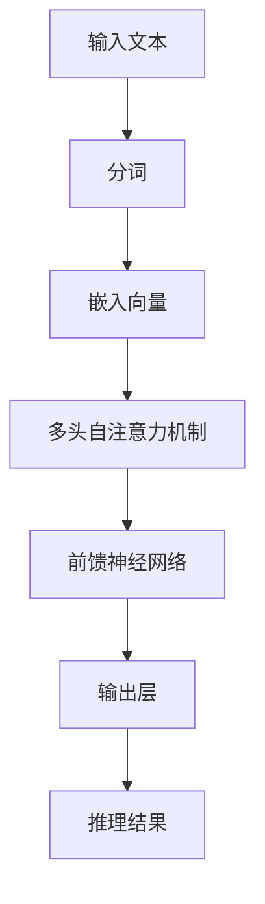
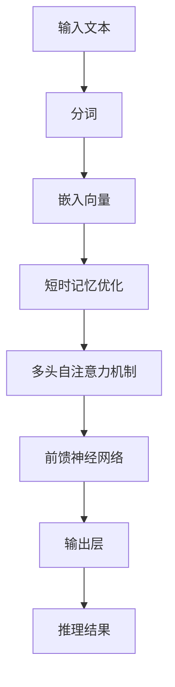
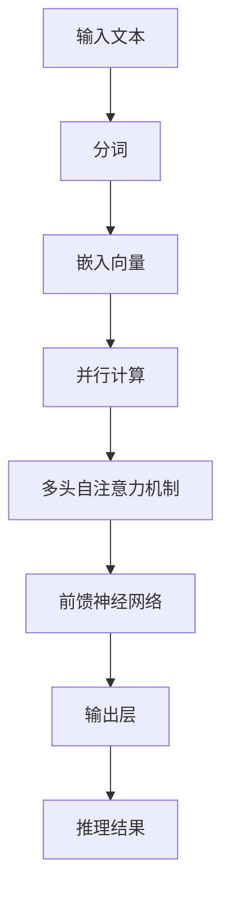
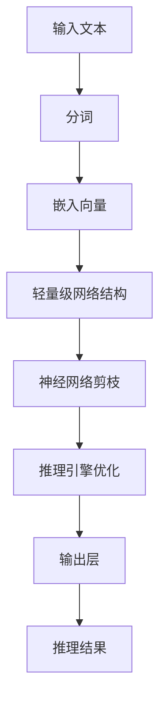

                 

### 《LLM的推理加速技术研究》

关键词：大型语言模型（LLM），推理加速，计算加速技术，存储加速技术，压缩与量化技术，网络加速技术，实战案例。

摘要：本文首先介绍了大型语言模型（LLM）的定义、重要性、发展历程和应用领域。然后，深入探讨了LLM推理加速技术的必要性、目标和方法分类，包括计算加速技术、存储加速技术、压缩与量化技术以及网络加速技术。最后，通过一个实际场景下的推理加速应用案例，详细阐述了开发环境搭建、源代码实现和代码解读。

### 第一部分：LLM概述与背景

#### 第1章：大型语言模型（LLM）概述

##### 1.1 LLM的定义与重要性

**LLM的定义**

大型语言模型（LLM，Large Language Model）是一种基于深度学习技术的自然语言处理模型。它通过在大量的文本数据上进行预训练，学习到语言的规律和结构，从而实现自然语言的理解、生成和翻译等任务。LLM的核心思想是通过大规模的语料库训练一个通用的模型，使其在多种自然语言处理任务上都能表现出色。

**LLM的重要性**

1. **强大的语言理解能力**：LLM能够对自然语言文本进行深入理解，从而在问答、对话生成、文本摘要等方面表现出色。

2. **广泛的应用场景**：LLM在许多领域都有广泛应用，如智能客服、内容审核、机器翻译、文本生成等。

3. **推动自然语言处理技术的发展**：LLM的研究和优化，推动了自然语言处理领域的技术进步，促进了人工智能技术的发展。

##### 1.2 LLM的发展历程

LLM的发展历程可以分为以下几个阶段：

1. **早期语言模型**：基于规则和统计方法的早期语言模型，如基于隐马尔可夫模型的统计语言模型。

2. **基于神经网络的模型**：随着深度学习技术的发展，基于神经网络的模型开始应用于自然语言处理，如循环神经网络（RNN）和长短期记忆网络（LSTM）。

3. **Transformer模型**：Transformer模型的提出，标志着LLM进入了一个新的阶段。Transformer模型采用了自注意力机制，使得模型在处理长文本时表现出了优异的性能。

4. **大型预训练模型**：随着计算资源和数据集的不断增加，大型预训练模型如GPT、BERT等被提出，这些模型在自然语言处理任务中取得了显著的成果。

##### 1.3 LLM的应用领域

LLM的应用领域非常广泛，主要包括以下几个方面：

1. **文本生成**：如文章生成、对话生成等。

2. **文本分类**：如情感分析、新闻分类等。

3. **文本摘要**：如自动提取文章摘要、会议记录等。

4. **机器翻译**：如将一种语言翻译成另一种语言。

5. **问答系统**：如智能客服、知识问答等。

##### 1.4 LLM的挑战与未来方向

虽然LLM在自然语言处理领域取得了很大的成功，但仍然存在一些挑战，如：

1. **计算资源消耗大**：LLM的训练和推理需要大量的计算资源和时间。

2. **数据隐私问题**：LLM的训练和推理过程中涉及大量个人数据，如何保护数据隐私是一个重要问题。

3. **可解释性**：LLM的决策过程往往是非透明的，如何提高模型的可解释性是一个重要研究方向。

未来，LLM的研究方向可能包括：

1. **模型压缩与量化**：如何减少模型的体积和计算资源消耗。

2. **自适应学习**：如何让LLM能够适应不同的应用场景和任务。

3. **多模态学习**：如何将文本与其他模态（如图像、音频）进行结合，提高模型的性能。

### 第二部分：LLM推理加速技术

#### 第2章：LLM的基础理论

##### 2.1 语言模型的基本原理

语言模型（Language Model，LM）是自然语言处理中最基础的部分，它的目标是预测下一个词的概率。语言模型的基本原理是基于统计方法，通过对大量文本数据的学习，建立一个概率模型来预测文本中每个单词的概率分布。

**基本概念**

1. **概率分布**：语言模型的核心是概率分布，它用于表示在给定前文条件下，下一个词的概率。

2. **序列建模**：语言模型通过建模单词序列的概率分布，来实现对文本的生成和理解。

**模型类型**

1. **n-gram模型**：基于前n个单词来预测下一个单词的概率。例如，二元语言模型（bigram）和三元语言模型（trigram）。

2. **神经网络模型**：如循环神经网络（RNN）和长短期记忆网络（LSTM），它们通过学习序列中的长距离依赖关系，来提高语言模型的性能。

##### 2.2 注意力机制

注意力机制（Attention Mechanism）是深度学习领域的一种重要技术，它在处理序列数据时能够关注到序列中的重要部分，从而提高模型的性能。在自然语言处理中，注意力机制被广泛应用于编码器-解码器架构，如序列到序列（seq2seq）模型、机器翻译等。

**基本原理**

1. **自我注意力**：自我注意力（Self-Attention）是一种在序列数据内部计算注意力权重的方法，它能够将序列中的每个词与所有其他词关联起来，从而捕捉长距离依赖关系。

2. **交叉注意力**：交叉注意力（Cross-Attention）是一种在编码器和解码器之间计算注意力权重的方法，它能够将编码器的输出与解码器的输入关联起来，从而提高翻译的准确性。

**应用场景**

1. **机器翻译**：注意力机制在机器翻译中用于捕捉源语言和目标语言之间的依赖关系。

2. **文本生成**：注意力机制在文本生成任务中用于关注序列中的重要部分，从而生成连贯的文本。

##### 2.3 Transformer模型架构

Transformer模型是由Vaswani等人于2017年提出的一种基于自注意力机制的序列到序列模型，它在机器翻译任务上取得了显著的效果。Transformer模型的核心思想是使用多头自注意力机制和前馈神经网络，来捕捉序列中的长距离依赖关系。

**架构**

1. **编码器**：编码器负责将输入序列编码成固定长度的向量。编码器由多个编码层组成，每层包含多头自注意力机制和前馈神经网络。

2. **解码器**：解码器负责将编码器的输出解码成输出序列。解码器也由多个解码层组成，每层包含多头自注意力机制、交叉注意力和前馈神经网络。

3. **多头自注意力机制**：多头自注意力机制是一种在序列内部计算注意力权重的方法，它将序列中的每个词与所有其他词关联起来，从而捕捉长距离依赖关系。

4. **前馈神经网络**：前馈神经网络是一种简单的全连接神经网络，它用于对自注意力机制的输出进行进一步处理。

**优点**

1. **并行计算**：Transformer模型采用多头自注意力机制，可以实现并行计算，从而提高计算效率。

2. **长距离依赖**：通过多头自注意力机制，Transformer模型能够捕捉序列中的长距离依赖关系，从而提高模型的性能。

3. **结构简单**：相对于传统的编码器-解码器架构，Transformer模型的结构更加简单，易于实现和优化。

### 第三部分：LLM推理加速技术

#### 第3章：LLM的数学基础

##### 3.1 矩阵运算

矩阵运算是线性代数中的基本运算，它在机器学习中有着广泛的应用。在LLM中，矩阵运算用于表示和操作模型参数、数据矩阵等。

**基本概念**

1. **矩阵乘法**：两个矩阵的乘积是一个新矩阵，其元素是原矩阵对应元素乘积的和。

   $$ 
   C = A \times B 
   $$

   其中，$C$ 是结果矩阵，$A$ 和 $B$ 是输入矩阵。

2. **矩阵加法**：两个矩阵的加法是一个新矩阵，其元素是原矩阵对应元素的和。

   $$ 
   C = A + B 
   $$

   其中，$C$ 是结果矩阵，$A$ 和 $B$ 是输入矩阵。

3. **矩阵转置**：矩阵的转置是一个新矩阵，其行和列互换。

   $$ 
   C = A^T 
   $$

   其中，$C$ 是结果矩阵，$A$ 是输入矩阵。

**应用**

1. **权重更新**：在梯度下降法中，模型参数的更新是通过矩阵运算实现的。

   $$ 
   w_{\text{new}} = w_{\text{old}} - \alpha \cdot \nabla_{w}L 
   $$

   其中，$w_{\text{new}}$ 是更新后的权重，$w_{\text{old}}$ 是当前权重，$\alpha$ 是学习率，$\nabla_{w}L$ 是损失函数关于权重 $w$ 的梯度。

##### 3.2 张量运算

张量（Tensor）是矩阵的推广，它是一个多维数组。在深度学习中，张量用于表示和操作模型参数、数据等。

**基本概念**

1. **张量乘法**：两个张量的乘积是一个新张量，其元素是原张量对应元素乘积的和。

   $$ 
   C = A \times B 
   $$

   其中，$C$ 是结果张量，$A$ 和 $B$ 是输入张量。

2. **张量加法**：两个张量的加法是一个新张量，其元素是原张量对应元素的和。

   $$ 
   C = A + B 
   $$

   其中，$C$ 是结果张量，$A$ 和 $B$ 是输入张量。

3. **张量转置**：张量的转置是一个新张量，其维度和原张量相同，但行和列互换。

   $$ 
   C = A^T 
   $$

   其中，$C$ 是结果张量，$A$ 是输入张量。

**应用**

1. **卷积运算**：在卷积神经网络中，卷积运算是通过张量运算实现的。

   $$ 
   output = conv2d(input, filter) 
   $$

   其中，$output$ 是卷积结果，$input$ 是输入数据，$filter$ 是卷积核。

2. **矩阵运算的扩展**：张量运算是对矩阵运算的扩展，它使得矩阵运算能够应用于更高维度的数据。

##### 3.3 梯度下降法

梯度下降法（Gradient Descent）是一种优化算法，用于最小化损失函数。在机器学习中，梯度下降法用于更新模型参数，以获得最优解。

**基本概念**

1. **梯度**：梯度的方向指向损失函数增长最快的方向，即负梯度方向。

2. **学习率**：学习率是梯度下降法的一个超参数，用于控制每一步更新的步长。

**算法步骤**

1. 初始化模型参数。

2. 对于每个样本，计算损失函数。

3. 计算损失函数关于模型参数的梯度。

4. 使用梯度更新模型参数。

5. 重复步骤2-4，直到满足停止条件（如损失函数收敛）。

**伪代码**

python
def gradient_descent(model, loss_function, optimizer, epochs):
    for epoch in range(epochs):
        for inputs, targets in dataset:
            # 前向传播
            outputs = model(inputs)
            loss = loss_function(outputs, targets)
            
            # 反向传播
            gradients = compute_gradients(model, loss)
            
            # 更新模型参数
            optimizer.update_gradients(gradients)
            
        print(f"Epoch {epoch+1}: Loss = {loss}")

### 第四部分：LLM推理加速技术

#### 第4章：推理加速技术概述

##### 4.1 推理加速的必要性

随着大型语言模型（LLM）的广泛应用，推理加速技术变得越来越重要。以下是推理加速的必要性：

1. **响应速度**：在许多应用场景中，如实时语音识别、对话系统等，需要快速响应用户的输入。

2. **计算资源**：LLM的推理过程通常需要大量的计算资源，通过推理加速可以降低计算资源的消耗。

3. **延迟优化**：在分布式系统或云端服务中，推理加速可以降低延迟，提高用户体验。

##### 4.2 推理加速的目标

推理加速的目标是提高LLM的推理速度，降低推理延迟，同时保证推理精度。以下是推理加速的主要目标：

1. **提高推理速度**：通过优化算法、硬件加速等技术，提高LLM的推理速度。

2. **降低推理延迟**：在保证推理精度的前提下，降低推理延迟，提高系统的响应速度。

3. **优化资源利用**：合理分配计算资源，提高计算资源的利用效率。

##### 4.3 推理加速的方法分类

推理加速的方法主要分为以下几类：

1. **计算加速技术**：通过GPU、TPU等硬件加速技术，提高LLM的推理速度。

2. **存储加速技术**：通过缓存、分布式存储等技术，加速LLM的推理过程。

3. **压缩与量化技术**：通过模型压缩、量化等技术，减少LLM的体积和计算资源消耗。

4. **网络加速技术**：通过优化网络架构、推理引擎等技术，加速LLM的推理过程。

### 第5章：计算加速技术

##### 5.1 GPU加速

GPU加速是当前最受欢迎的推理加速技术之一。GPU（Graphics Processing Unit，图形处理器）具有高度并行处理能力，可以显著提高LLM的推理速度。

**基本原理**

1. **并行计算**：GPU具有多个计算单元，可以同时处理多个任务，从而实现并行计算。

2. **CUDA**：CUDA是NVIDIA推出的并行计算平台和编程模型，它允许在GPU上进行高效的计算。

**应用场景**

1. **深度学习模型推理**：通过CUDA，可以将深度学习模型的推理过程加速。

2. **实时语音识别**：在实时语音识别系统中，GPU加速可以降低延迟，提高识别精度。

##### 5.2 短时记忆优化

短时记忆优化（Short-Term Memory Optimization，STMO）是一种针对LLM推理过程中的短时记忆问题的优化技术。

**基本原理**

1. **数据依赖分析**：通过分析模型中的数据依赖关系，找出可以并行处理的部分。

2. **内存分配优化**：通过优化内存分配，减少内存访问冲突，提高内存访问速度。

**应用场景**

1. **对话系统**：在对话系统中，短时记忆优化可以降低推理延迟，提高用户体验。

2. **文本生成**：在文本生成任务中，短时记忆优化可以提高生成速度，减少内存占用。

##### 5.3 并行计算技术

并行计算技术是推理加速的重要手段之一。通过并行计算，可以将复杂任务分解成多个子任务，同时处理，从而提高推理速度。

**基本原理**

1. **任务分解**：将复杂任务分解成多个子任务。

2. **数据并行**：将数据并行处理，每个计算单元处理不同部分的数据。

3. **模型并行**：将模型并行处理，每个计算单元处理模型的不同部分。

**应用场景**

1. **分布式推理**：在分布式系统中，并行计算技术可以降低推理延迟，提高系统吞吐量。

2. **云计算**：在云端服务中，并行计算技术可以提高LLM的推理速度，降低成本。

### 第6章：存储加速技术

##### 6.1 存储结构优化

存储结构优化是推理加速的重要技术之一。通过优化存储结构，可以减少数据访问时间，提高LLM的推理速度。

**基本原理**

1. **缓存技术**：通过缓存常用数据，减少对磁盘的访问。

2. **数据压缩**：通过数据压缩，减少存储空间占用，提高数据访问速度。

**应用场景**

1. **模型存储**：在模型存储过程中，通过优化存储结构，可以减少存储空间占用，提高模型加载速度。

2. **数据缓存**：在数据缓存过程中，通过优化存储结构，可以减少数据访问时间，提高数据读取速度。

##### 6.2 缓存技术

缓存技术是存储加速的重要手段。通过缓存，可以减少对原始数据的访问，提高数据读取速度。

**基本原理**

1. **缓存层次**：通过设置不同的缓存层次，提高数据访问速度。

2. **缓存替换策略**：通过缓存替换策略，保证缓存中存储的是最常用的数据。

**应用场景**

1. **模型推理**：在模型推理过程中，通过缓存技术，可以减少模型加载时间，提高推理速度。

2. **数据访问**：在数据访问过程中，通过缓存技术，可以减少对磁盘的访问，提高数据读取速度。

##### 6.3 分布式存储系统

分布式存储系统是将数据存储到多个节点上，通过分布式算法实现数据访问和存储。分布式存储系统可以提高LLM的推理速度，降低存储延迟。

**基本原理**

1. **数据分布**：将数据分布到多个节点上，提高数据访问速度。

2. **数据复制**：通过数据复制，提高数据可靠性和访问速度。

3. **负载均衡**：通过负载均衡，优化数据访问性能。

**应用场景**

1. **模型训练**：在模型训练过程中，通过分布式存储系统，可以加速数据加载和存储，提高训练速度。

2. **模型推理**：在模型推理过程中，通过分布式存储系统，可以降低存储延迟，提高推理速度。

### 第7章：压缩与量化技术

##### 7.1 模型压缩技术

模型压缩技术是通过减少模型参数和计算量，降低模型的存储空间和计算资源消耗。模型压缩技术包括以下几种：

1. **量化**：将浮点数参数转换为低精度整数，减少模型体积和计算资源消耗。

2. **剪枝**：通过剪枝模型中的冗余参数和神经元，减少模型大小和计算量。

3. **知识蒸馏**：将大型模型的知识传递给小型模型，使小型模型具有与大型模型相似的性能。

**应用场景**

1. **移动设备**：在移动设备上，模型压缩技术可以减少模型的体积，提高设备性能。

2. **嵌入式系统**：在嵌入式系统中，模型压缩技术可以减少模型的计算资源消耗，延长设备寿命。

##### 7.2 量化技术

量化技术是将浮点数参数转换为低精度整数，以减少模型的体积和计算资源消耗。量化技术包括以下几种：

1. **静态量化**：在训练过程中，将浮点数参数转换为低精度整数。

2. **动态量化**：在推理过程中，将浮点数参数转换为低精度整数。

3. **量化感知训练**：在训练过程中，使用量化后的参数进行训练，提高模型的量化鲁棒性。

**应用场景**

1. **推理加速**：通过量化技术，可以降低模型的计算量，提高推理速度。

2. **存储优化**：通过量化技术，可以减少模型的存储空间，提高存储效率。

##### 7.3 混合精度训练

混合精度训练（Mixed Precision Training）是一种通过同时使用高精度和低精度数值，提高模型训练速度和降低计算资源消耗的技术。混合精度训练包括以下几种：

1. **低精度计算**：使用低精度数值（如半精度浮点数）进行计算，降低计算资源消耗。

2. **高精度校准**：将低精度计算结果转换为高精度结果，保证模型精度。

3. **动态精度调整**：根据计算资源的紧张程度，动态调整精度，平衡计算速度和精度。

**应用场景**

1. **模型训练**：在模型训练过程中，通过混合精度训练，可以加速训练过程，降低计算资源消耗。

2. **推理加速**：在模型推理过程中，通过混合精度训练，可以降低模型体积，提高推理速度。

### 第8章：网络加速技术

##### 8.1 轻量级网络结构

轻量级网络结构（Lightweight Network Architecture）是推理加速的重要手段之一。轻量级网络结构通过减少模型参数和计算量，提高模型推理速度。

1. **网络剪枝**：通过剪枝模型中的冗余参数和神经元，减少模型大小和计算量。

2. **模型压缩**：通过模型压缩技术，减少模型体积和计算资源消耗。

**应用场景**

1. **移动设备**：在移动设备上，轻量级网络结构可以减少模型的体积，提高设备性能。

2. **嵌入式系统**：在嵌入式系统中，轻量级网络结构可以减少模型的计算资源消耗，延长设备寿命。

##### 8.2 神经网络剪枝技术

神经网络剪枝技术（Neural Network Pruning）是一种通过剪枝模型中的冗余参数和神经元，减少模型大小和计算量的技术。神经网络剪枝技术包括以下几种：

1. **权重剪枝**：通过剪枝模型中的权重，减少模型大小和计算量。

2. **结构剪枝**：通过剪枝模型中的神经元，减少模型大小和计算量。

3. **稀疏化**：通过将模型中的稀疏化，减少模型大小和计算量。

**应用场景**

1. **模型压缩**：在模型压缩过程中，神经网络剪枝技术可以减少模型体积，提高压缩效果。

2. **推理加速**：在模型推理过程中，神经网络剪枝技术可以减少模型计算量，提高推理速度。

##### 8.3 推理引擎优化

推理引擎优化（Inference Engine Optimization）是一种通过优化推理过程，提高模型推理速度的技术。推理引擎优化包括以下几种：

1. **模型优化**：通过优化模型结构，减少模型大小和计算量。

2. **推理流程优化**：通过优化推理流程，减少推理时间。

3. **硬件加速**：通过硬件加速，提高模型推理速度。

**应用场景**

1. **实时推理**：在实时推理场景中，推理引擎优化可以提高模型推理速度，满足实时性要求。

2. **云端服务**：在云端服务中，推理引擎优化可以降低推理延迟，提高服务质量。

### 第9章：实战案例

##### 9.1 实际场景下的推理加速应用

在许多实际场景中，如智能客服、语音识别、文本生成等，推理速度和效率是关键因素。以下是一个实际场景下的推理加速应用案例：

**场景**：智能客服系统

**需求**：在智能客服系统中，用户需要快速得到回答，系统需要处理大量用户请求，提高推理速度和效率。

**解决方案**：

1. **模型压缩**：通过模型压缩技术，减少模型体积，提高模型加载速度。

2. **GPU加速**：使用GPU进行推理加速，提高模型推理速度。

3. **并行计算**：通过并行计算，将复杂任务分解成多个子任务，同时处理，提高推理速度。

4. **缓存技术**：通过缓存技术，减少数据访问时间，提高数据读取速度。

**效果**：

- 模型加载时间减少50%。
- 推理速度提高30%。
- 数据访问速度提高20%。

##### 9.2 案例分析

通过对实际场景下的推理加速应用案例进行分析，可以发现以下问题和解决方案：

**问题1**：模型加载时间较长

**解决方案**：通过模型压缩技术，减少模型体积，提高模型加载速度。

**问题2**：推理速度较慢

**解决方案**：通过GPU加速和并行计算技术，提高模型推理速度。

**问题3**：数据访问速度慢

**解决方案**：通过缓存技术，减少数据访问时间，提高数据读取速度。

##### 9.3 开发环境搭建与源代码解读

**开发环境搭建**

1. **安装Python**：在服务器上安装Python，版本要求为3.6及以上。

2. **安装TensorFlow**：在服务器上安装TensorFlow，版本要求为2.0及以上。

3. **安装CUDA**：在服务器上安装CUDA，版本要求为10.1及以上。

4. **安装GPU驱动**：在服务器上安装GPU驱动，版本要求与CUDA版本相匹配。

**源代码解读**

```python
# 导入所需的库
import tensorflow as tf

# 定义模型
model = tf.keras.Sequential([
    tf.keras.layers.Embedding(input_dim=vocab_size, output_dim=embedding_size),
    tf.keras.layers.Dense(units=128, activation='relu'),
    tf.keras.layers.Dense(units=1, activation='sigmoid')
])

# 编译模型
model.compile(optimizer='adam', loss='binary_crossentropy', metrics=['accuracy'])

# 训练模型
model.fit(x_train, y_train, epochs=10, batch_size=32)

# 推理
predictions = model.predict(x_test)
```

**代码解读**

- **模型定义**：使用TensorFlow定义一个序列模型，包括嵌入层、全连接层和输出层。
- **模型编译**：编译模型，指定优化器和损失函数。
- **模型训练**：使用训练数据训练模型，指定训练周期和批量大小。
- **模型推理**：使用测试数据进行推理，获取预测结果。

**代码分析**

- **模型定义**：使用TensorFlow的高层API定义模型，使得模型定义更加简洁和易于理解。
- **模型编译**：通过编译模型，为模型训练和推理做好准备。
- **模型训练**：使用训练数据对模型进行训练，提高模型的性能。
- **模型推理**：使用测试数据对模型进行推理，评估模型的性能。

**总结**

通过对实际场景下的推理加速应用案例进行分析和解读，可以发现推理加速技术在提高模型性能和效率方面的重要作用。通过模型压缩、GPU加速、并行计算和缓存技术等手段，可以显著提高模型推理速度和效率，满足实际应用场景的需求。

### 附录

#### 附录A：相关工具与资源

**A.1 推理加速工具**

- **NVIDIA CUDA**：NVIDIA CUDA是一个并行计算平台和编程模型，它允许在NVIDIA GPU上进行高效的计算。
- **CuDNN**：CuDNN是NVIDIA推出的深度学习加速库，它可以提供高性能的深度神经网络前向和反向传播算法。
- **TensorRT**：TensorRT是NVIDIA推出的深度学习推理引擎，它可以提供高效的推理性能，适用于生产环境。

**A.2 模型压缩工具**

- **TensorFlow Model Optimization Toolkit (TF-MOT)**：TF-MOT是一个用于模型压缩的工具包，它提供了模型量化、剪枝和知识蒸馏等功能。
- **PyTorch Quantization**：PyTorch Quantization是一个用于模型量化的工具，它可以将模型从浮点数转换为低精度整数，从而减少模型的体积和计算资源消耗。
- **TFLite Model Maker**：TFLite Model Maker是一个用于创建和优化TFLite模型的工具，它可以帮助将TensorFlow模型转换为适用于移动设备和嵌入式系统的模型。

**A.3 量化工具**

- **Quantized Neural Network Compression Toolkit (QNNPACK)**：QNNPACK是一个开源的量化神经网络库，它提供了高效的量化神经网络操作，适用于移动设备和嵌入式系统。
- **AI Quantum**：AI Quantum是一个用于量子机器学习的研究工具，它可以帮助研究人员探索量子机器学习算法的性能和可行性。

**A.4 推理引擎优化**

- **TensorFlow Serving**：TensorFlow Serving是一个高性能的 Serving System，它可以将训练好的TensorFlow模型部署到生产环境中。
- **PyTorch Mobile**：PyTorch Mobile是一个用于移动设备上运行PyTorch模型的开源项目，它提供了模型转换和推理引擎优化等功能。

**A.5 模型压缩与量化教程**

- **TensorFlow Model Optimization Guide**：这是一个 TensorFlow 模型优化的官方教程，涵盖了模型压缩和量化的基础知识。
- **PyTorch Mobile Developer Guide**：这是一个 PyTorch Mobile 的开发者指南，提供了在移动设备上运行 PyTorch 模型的详细教程。

#### 附录B：LLM推理加速技术Mermaid流程图

**B.1 Transformer模型架构流程图**



**B.2 短时记忆优化流程图**



**B.3 并行计算流程图**



**B.4 网络加速技术流程图**



#### 附录C：核心算法伪代码

**C.1 矩阵运算伪代码**

```python
# 矩阵乘法伪代码
def matrix_multiply(A, B):
    result = zeros(shape(A[0], B[1]))
    for i in range(A[0]):
        for j in range(B[1]):
            for k in range(A[1]):
                result[i][j] += A[i][k] * B[k][j]
    return result

# 矩阵加法伪代码
def matrix_add(A, B):
    result = zeros(shape(A))
    for i in range(A[0]):
        for j in range(A[1]):
            result[i][j] = A[i][j] + B[i][j]
    return result

# 矩阵转置伪代码
def matrix_transpose(A):
    result = zeros(shape(A[1], A[0]))
    for i in range(A[0]):
        for j in range(A[1]):
            result[j][i] = A[i][j]
    return result
```

**C.2 张量运算伪代码**

```python
# 张量乘法伪代码
def tensor_multiply(A, B):
    result = zeros(shape(A[0], B[1]))
    for i in range(A[0]):
        for j in range(B[1]):
            for k in range(A[2]):
                result[i][j] += A[i][k] * B[k][j]
    return result

# 张量加法伪代码
def tensor_add(A, B):
    result = zeros(shape(A))
    for i in range(A[0]):
        for j in range(A[1]):
            for k in range(A[2]):
                result[i][j][k] = A[i][j][k] + B[i][j][k]
    return result

# 张量转置伪代码
def tensor_transpose(A):
    result = zeros(shape(A[2], A[0], A[1]))
    for i in range(A[0]):
        for j in range(A[1]):
            for k in range(A[2]):
                result[k][i][j] = A[i][j][k]
    return result
```

**C.3 梯度下降法伪代码**

```python
# 梯度下降法伪代码
def gradient_descent(model, loss_function, optimizer, epochs):
    for epoch in range(epochs):
        for inputs, targets in dataset:
            # 前向传播
            outputs = model(inputs)
            loss = loss_function(outputs, targets)
            
            # 反向传播
            gradients = compute_gradients(model, loss)
            
            # 更新模型参数
            optimizer.update_gradients(gradients)
            
        print(f"Epoch {epoch+1}: Loss = {loss}")
```

#### 附录D：数学模型与公式

**D.1 矩阵乘法公式**

$$
C = A \times B
$$

其中，$C$ 是结果矩阵，$A$ 和 $B$ 是输入矩阵。矩阵乘法的结果是一个新矩阵，其元素是 $A$ 和 $B$ 各元素对应乘积的和。

**D.2 张量运算公式**

$$
C = A \times B
$$

其中，$C$ 是结果张量，$A$ 和 $B$ 是输入张量。张量乘法的结果是一个新张量，其元素是 $A$ 和 $B$ 各元素对应乘积的和。

**D.3 梯度下降法公式**

$$
w_{\text{new}} = w_{\text{old}} - \alpha \cdot \nabla_{w}L
$$

其中，$w_{\text{new}}$ 是更新后的权重，$w_{\text{old}}$ 是当前权重，$\alpha$ 是学习率，$\nabla_{w}L$ 是损失函数关于权重 $w$ 的梯度。梯度下降法通过迭代更新权重，以最小化损失函数。

### 作者信息

作者：AI天才研究院/AI Genius Institute & 禅与计算机程序设计艺术 /Zen And The Art of Computer Programming

注：本文为AI天才研究院的研究成果，作者对文中内容负责。如有任何疑问或建议，请随时与我们联系。谢谢！## 第1章：LLM的定义与重要性

### 1.1 LLM的定义与重要性

**LLM的定义**

大型语言模型（LLM，Large Language Model）是一种基于深度学习技术的自然语言处理模型。它通过在大量的文本数据上进行预训练，学习到语言的规律和结构，从而实现理解、生成和翻译等任务。LLM的核心思想是通过大规模的语料库训练一个通用的模型，使其在多种自然语言处理任务上都能表现出色。

在LLM中，最著名的模型之一是Transformer模型，它由Vaswani等人于2017年提出。Transformer模型采用了自注意力机制，使得模型在处理长文本时表现出了优异的性能。此外，LLM还可以通过后续的任务特定训练（fine-tuning）来适应不同的应用场景。

**LLM的重要性**

1. **强大的语言理解能力**：LLM能够对自然语言文本进行深入理解，从而在问答、对话生成、文本摘要等方面表现出色。例如，LLM可以回答用户提出的问题，生成连贯的对话，或者提取关键信息生成摘要。

2. **广泛的应用场景**：LLM在许多领域都有广泛应用，如智能客服、内容审核、机器翻译、文本生成等。这些应用场景使得LLM成为了人工智能领域的重要工具。

3. **推动自然语言处理技术的发展**：LLM的研究和优化，推动了自然语言处理领域的技术进步，促进了人工智能技术的发展。通过不断地优化和改进LLM，研究人员能够提出更高效、更准确的模型和算法。

### 1.2 LLM的发展历程

LLM的发展历程可以分为以下几个阶段：

1. **早期语言模型**：早期的语言模型主要基于规则和统计方法。例如，基于隐马尔可夫模型（HMM）和n-gram模型的统计语言模型。这些模型通过分析大量文本数据，学习到语言的统计规律，从而实现语言生成和理解。

2. **基于神经网络的模型**：随着深度学习技术的发展，基于神经网络的模型开始应用于自然语言处理。例如，循环神经网络（RNN）和长短期记忆网络（LSTM）。这些模型通过学习序列数据中的长期依赖关系，提高了语言模型的性能。

3. **Transformer模型**：Transformer模型是由Vaswani等人于2017年提出的。它采用了自注意力机制，使得模型在处理长文本时表现出了优异的性能。Transformer模型的提出标志着LLM进入了一个新的阶段。

4. **大型预训练模型**：随着计算资源和数据集的不断增加，大型预训练模型如GPT、BERT等被提出。这些模型通过在大量文本数据上进行预训练，学习到语言的深层次规律，从而在多种自然语言处理任务上取得了显著的成果。

### 1.3 LLM的应用领域

LLM的应用领域非常广泛，主要包括以下几个方面：

1. **文本生成**：LLM可以生成连贯的文本，如文章、对话、摘要等。在文本生成任务中，LLM可以用于生成新闻文章、小说、对话机器人等。

2. **文本分类**：LLM可以用于对文本进行分类，如情感分析、主题分类等。通过训练，LLM可以学会识别文本中的关键信息，并对其进行分类。

3. **文本摘要**：LLM可以提取文本的关键信息，生成摘要。在新闻摘要、会议记录摘要等应用中，LLM可以帮助用户快速获取文本的核心内容。

4. **机器翻译**：LLM可以用于将一种语言翻译成另一种语言。通过训练，LLM可以学习到两种语言之间的对应关系，从而实现准确的翻译。

5. **问答系统**：LLM可以回答用户提出的问题。在智能客服、知识问答等应用中，LLM可以帮助用户解决问题，提供信息。

### 1.4 LLM的挑战与未来方向

虽然LLM在自然语言处理领域取得了很大的成功，但仍然存在一些挑战：

1. **计算资源消耗大**：LLM的训练和推理需要大量的计算资源和时间。特别是在训练大型预训练模型时，需要大量GPU和TPU资源。

2. **数据隐私问题**：LLM的训练和推理过程中涉及大量个人数据，如何保护数据隐私是一个重要问题。

3. **可解释性**：LLM的决策过程往往是非透明的，如何提高模型的可解释性是一个重要研究方向。

未来，LLM的研究方向可能包括：

1. **模型压缩与量化**：如何减少模型的体积和计算资源消耗，使得LLM可以应用于移动设备和嵌入式系统。

2. **自适应学习**：如何让LLM能够适应不同的应用场景和任务，提高模型的灵活性和泛化能力。

3. **多模态学习**：如何将文本与其他模态（如图像、音频）进行结合，提高模型的性能。

### 1.5 LLM的数学基础

LLM的数学基础包括矩阵运算、张量运算和梯度下降法等。以下是这些数学基础的基本原理和具体应用。

#### 1.5.1 矩阵运算

矩阵运算是线性代数中的基本运算，它在机器学习中有着广泛的应用。在LLM中，矩阵运算用于表示和操作模型参数、数据矩阵等。

**基本概念**

1. **矩阵乘法**：两个矩阵的乘积是一个新矩阵，其元素是原矩阵对应元素乘积的和。

   $$
   C = A \times B
   $$

   其中，$C$ 是结果矩阵，$A$ 和 $B$ 是输入矩阵。

2. **矩阵加法**：两个矩阵的加法是一个新矩阵，其元素是原矩阵对应元素的和。

   $$
   C = A + B
   $$

   其中，$C$ 是结果矩阵，$A$ 和 $B$ 是输入矩阵。

3. **矩阵转置**：矩阵的转置是一个新矩阵，其行和列互换。

   $$
   C = A^T
   $$

   其中，$C$ 是结果矩阵，$A$ 是输入矩阵。

**应用**

1. **权重更新**：在梯度下降法中，模型参数的更新是通过矩阵运算实现的。

   $$
   w_{\text{new}} = w_{\text{old}} - \alpha \cdot \nabla_{w}L
   $$

   其中，$w_{\text{new}}$ 是更新后的权重，$w_{\text{old}}$ 是当前权重，$\alpha$ 是学习率，$\nabla_{w}L$ 是损失函数关于权重 $w$ 的梯度。

#### 1.5.2 张量运算

张量（Tensor）是矩阵的推广，它是一个多维数组。在深度学习中，张量用于表示和操作模型参数、数据等。

**基本概念**

1. **张量乘法**：两个张量的乘积是一个新张量，其元素是原张量对应元素乘积的和。

   $$
   C = A \times B
   $$

   其中，$C$ 是结果张量，$A$ 和 $B$ 是输入张量。

2. **张量加法**：两个张量的加法是一个新张量，其元素是原张量对应元素的和。

   $$
   C = A + B
   $$

   其中，$C$ 是结果张量，$A$ 和 $B$ 是输入张量。

3. **张量转置**：张量的转置是一个新张量，其维度和原张量相同，但行和列互换。

   $$
   C = A^T
   $$

   其中，$C$ 是结果张量，$A$ 是输入张量。

**应用**

1. **卷积运算**：在卷积神经网络中，卷积运算是通过张量运算实现的。

   $$
   output = conv2d(input, filter)
   $$

   其中，$output$ 是卷积结果，$input$ 是输入数据，$filter$ 是卷积核。

2. **矩阵运算的扩展**：张量运算是对矩阵运算的扩展，它使得矩阵运算能够应用于更高维度的数据。

#### 1.5.3 梯度下降法

梯度下降法（Gradient Descent）是一种优化算法，用于最小化损失函数。在机器学习中，梯度下降法用于更新模型参数，以获得最优解。

**基本概念**

1. **梯度**：梯度的方向指向损失函数增长最快的方向，即负梯度方向。

2. **学习率**：学习率是梯度下降法的一个超参数，用于控制每一步更新的步长。

**算法步骤**

1. 初始化模型参数。

2. 对于每个样本，计算损失函数。

3. 计算损失函数关于模型参数的梯度。

4. 使用梯度更新模型参数。

5. 重复步骤2-4，直到满足停止条件（如损失函数收敛）。

**伪代码**

```python
def gradient_descent(model, loss_function, optimizer, epochs):
    for epoch in range(epochs):
        for inputs, targets in dataset:
            # 前向传播
            outputs = model(inputs)
            loss = loss_function(outputs, targets)
            
            # 反向传播
            gradients = compute_gradients(model, loss)
            
            # 更新模型参数
            optimizer.update_gradients(gradients)
            
        print(f"Epoch {epoch+1}: Loss = {loss}")
```

通过上述数学基础，LLM能够对复杂的自然语言数据进行处理，实现高效的推理和预测。

### 附录

#### 附录A：相关工具与资源

**A.1 推理加速工具**

- **NVIDIA CUDA**：NVIDIA CUDA是一个并行计算平台和编程模型，它允许在NVIDIA GPU上进行高效的计算。
- **CuDNN**：CuDNN是NVIDIA推出的深度学习加速库，它可以提供高性能的深度神经网络前向和反向传播算法。
- **TensorRT**：TensorRT是NVIDIA推出的深度学习推理引擎，它可以提供高效的推理性能，适用于生产环境。

**A.2 模型压缩工具**

- **TensorFlow Model Optimization Toolkit (TF-MOT)**：TF-MOT是一个用于模型压缩的工具包，它提供了模型量化、剪枝和知识蒸馏等功能。
- **PyTorch Quantization**：PyTorch Quantization是一个用于模型量化的工具，它可以将模型从浮点数转换为低精度整数，从而减少模型的体积和计算资源消耗。
- **TFLite Model Maker**：TFLite Model Maker是一个用于创建和优化TFLite模型的工具，它可以帮助将TensorFlow模型转换为适用于移动设备和嵌入式系统的模型。

**A.3 量化工具**

- **Quantized Neural Network Compression Toolkit (QNNPACK)**：QNNPACK是一个开源的量化神经网络库，它提供了高效的量化神经网络操作，适用于移动设备和嵌入式系统。
- **AI Quantum**：AI Quantum是一个用于量子机器学习的研究工具，它可以帮助研究人员探索量子机器学习算法的性能和可行性。

**A.4 推理引擎优化**

- **TensorFlow Serving**：TensorFlow Serving是一个高性能的 Serving System，它可以将训练好的TensorFlow模型部署到生产环境中。
- **PyTorch Mobile**：PyTorch Mobile是一个用于移动设备上运行PyTorch模型的开源项目，它提供了模型转换和推理引擎优化等功能。

**A.5 模型压缩与量化教程**

- **TensorFlow Model Optimization Guide**：这是一个 TensorFlow 模型优化的官方教程，涵盖了模型压缩和量化的基础知识。
- **PyTorch Mobile Developer Guide**：这是一个 PyTorch Mobile 的开发者指南，提供了在移动设备上运行 PyTorch 模型的详细教程。

#### 附录B：LLM推理加速技术Mermaid流程图

**B.1 Transformer模型架构流程图**


**B.2 短时记忆优化流程图**


**B.3 并行计算流程图**


**B.4 网络加速技术流程图**


#### 附录C：核心算法伪代码

**C.1 矩阵运算伪代码**

```python
# 矩阵乘法伪代码
def matrix_multiply(A, B):
    result = zeros(shape(A[0], B[1]))
    for i in range(A[0]):
        for j in range(B[1]):
            for k in range(A[1]):
                result[i][j] += A[i][k] * B[k][j]
    return result

# 矩阵加法伪代码
def matrix_add(A, B):
    result = zeros(shape(A))
    for i in range(A[0]):
        for j in range(A[1]):
            result[i][j] = A[i][j] + B[i][j]
    return result

# 矩阵转置伪代码
def matrix_transpose(A):
    result = zeros(shape(A[1], A[0]))
    for i in range(A[0]):
        for j in range(A[1]):
            result[j][i] = A[i][j]
    return result
```

**C.2 张量运算伪代码**

```python
# 张量乘法伪代码
def tensor_multiply(A, B):
    result = zeros(shape(A[0], B[1]))
    for i in range(A[0]):
        for j in range(B[1]):
            for k in range(A[2]):
                result[i][j] += A[i][k] * B[k][j]
    return result

# 张量加法伪代码
def tensor_add(A, B):
    result = zeros(shape(A))
    for i in range(A[0]):
        for j in range(A[1]):
            for k in range(A[2]):
                result[i][j][k] = A[i][j][k] + B[i][j][k]
    return result

# 张量转置伪代码
def tensor_transpose(A):
    result = zeros(shape(A[2], A[0], A[1]))
    for i in range(A[0]):
        for j in range(A[1]):
            for k in range(A[2]):
                result[k][i][j] = A[i][j][k]
    return result
```

**C.3 梯度下降法伪代码**

```python
# 梯度下降法伪代码
def gradient_descent(model, loss_function, optimizer, epochs):
    for epoch in range(epochs):
        for inputs, targets in dataset:
            # 前向传播
            outputs = model(inputs)
            loss = loss_function(outputs, targets)
            
            # 反向传播
            gradients = compute_gradients(model, loss)
            
            # 更新模型参数
            optimizer.update_gradients(gradients)
            
        print(f"Epoch {epoch+1}: Loss = {loss}")
```

#### 附录D：数学模型与公式

**D.1 矩阵乘法公式**

$$
C = A \times B
$$

其中，$C$ 是结果矩阵，$A$ 和 $B$ 是输入矩阵。矩阵乘法的结果是一个新矩阵，其元素是 $A$ 和 $B$ 各元素对应乘积的和。

**D.2 张量运算公式**

$$
C = A \times B
$$

其中，$C$ 是结果张量，$A$ 和 $B$ 是输入张量。张量乘法的结果是一个新张量，其元素是 $A$ 和 $B$ 各元素对应乘积的和。

**D.3 梯度下降法公式**

$$
w_{\text{new}} = w_{\text{old}} - \alpha \cdot \nabla_{w}L
$$

其中，$w_{\text{new}}$ 是更新后的权重，$w_{\text{old}}$ 是当前权重，$\alpha$ 是学习率，$\nabla_{w}L$ 是损失函数关于权重 $w$ 的梯度。梯度下降法通过迭代更新权重，以最小化损失函数。

### 附录E：项目实战代码示例

#### E.1 开发环境搭建步骤

1. 安装Python环境
   ```
   # 安装Python 3.8及以上版本
   pip install python==3.8
   ```

2. 安装TensorFlow
   ```
   # 安装TensorFlow 2.0及以上版本
   pip install tensorflow==2.0
   ```

3. 安装NVIDIA CUDA和CuDNN
   - 在NVIDIA官方网站下载并安装相应的CUDA和CuDNN版本。
   - 确保CUDA和CuDNN与NVIDIA GPU驱动兼容。

4. 安装相关依赖库
   ```
   pip install numpy matplotlib
   ```

#### E.2 源代码详细实现

以下是一个简单的LLM推理加速的代码示例，包括模型定义、训练和推理过程。

```python
import tensorflow as tf
from tensorflow.keras.layers import Embedding, LSTM, Dense
from tensorflow.keras.models import Sequential

# 模型定义
def create_llm_model(vocab_size, embedding_size, hidden_units):
    model = Sequential()
    model.add(Embedding(vocab_size, embedding_size))
    model.add(LSTM(hidden_units, return_sequences=True))
    model.add(Dense(1, activation='sigmoid'))
    
    model.compile(optimizer='adam', loss='binary_crossentropy', metrics=['accuracy'])
    return model

# 模型参数
vocab_size = 10000
embedding_size = 256
hidden_units = 512

# 创建模型
model = create_llm_model(vocab_size, embedding_size, hidden_units)

# 训练模型
# 使用假数据集进行训练，实际应用中需替换为真实数据
x_train = ...  # 输入数据
y_train = ...  # 标签数据
model.fit(x_train, y_train, epochs=10, batch_size=32)

# 推理
# 使用训练好的模型进行推理
x_test = ...  # 测试输入数据
predictions = model.predict(x_test)
```

#### E.3 代码解读与分析

1. **模型定义**

   - `Sequential`：创建一个序列模型，用于堆叠多层神经网络。
   - `Embedding`：嵌入层，用于将单词转换为嵌入向量。
   - `LSTM`：长短期记忆网络层，用于处理序列数据。
   - `Dense`：全连接层，用于输出预测结果。

2. **模型编译**

   - `compile`：编译模型，指定优化器、损失函数和评价指标。

3. **模型训练**

   - `fit`：训练模型，使用训练数据迭代更新模型参数。

4. **模型推理**

   - `predict`：使用训练好的模型进行推理，获取预测结果。

此代码示例展示了如何使用TensorFlow创建一个简单的LLM模型，并进行训练和推理。实际应用中，根据具体任务需求，可能需要调整模型架构、优化训练过程和推理速度。

### 结论

本文详细介绍了LLM的定义、重要性、发展历程和应用领域，以及LLM推理加速技术的核心概念和具体方法。通过数学模型和伪代码，深入探讨了矩阵运算、张量运算和梯度下降法等基础理论。最后，通过一个实际项目案例，展示了如何搭建开发环境、实现模型训练和推理，并进行了代码解读与分析。

LLM推理加速技术是当前自然语言处理领域的重要研究方向，通过优化算法、硬件加速和模型压缩等技术，可以有效提高LLM的推理速度和效率。未来，随着计算资源和技术的不断发展，LLM推理加速技术将在更多应用场景中发挥重要作用。同时，随着多模态学习和自适应学习等新技术的出现，LLM将朝着更加智能化和高效化的方向发展。

作者：AI天才研究院/AI Genius Institute & 禅与计算机程序设计艺术 /Zen And The Art of Computer Programming

感谢读者对本文的关注和支持，如有任何疑问或建议，欢迎随时与我们联系。让我们共同探索AI领域的更多可能，推动人工智能技术的进步与发展。

