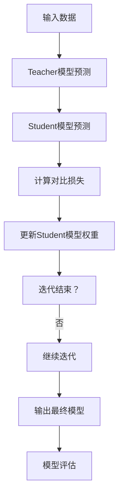
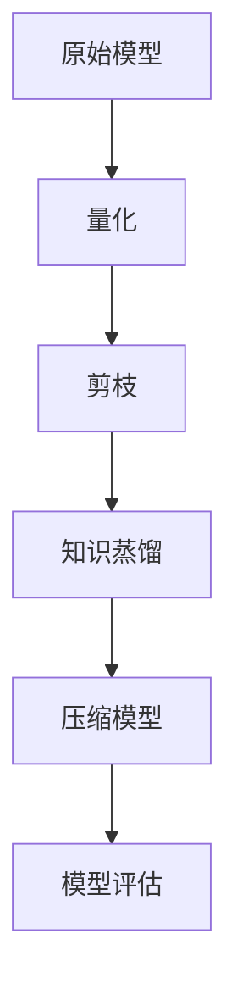

                 

# 《LLM的知识蒸馏与模型压缩》

> 关键词：大型语言模型（LLM），知识蒸馏，模型压缩，软标签，量化，剪枝

> 摘要：本文深入探讨了大型语言模型（LLM）在知识蒸馏与模型压缩方面的应用。首先介绍了LLM的基本概念与历史演变，随后详细讲解了知识蒸馏与模型压缩的原理与实现。文章通过数学模型与流程图，对知识蒸馏与模型压缩的核心算法进行了深入剖析。最后，通过实战案例与代码解析，展示了知识蒸馏与模型压缩在实际项目中的应用。

## 第一部分：背景与概述

### 第1章：大型语言模型（LLM）概述

#### 1.1 大型语言模型的定义与历史演变

大型语言模型（Large Language Model，简称LLM）是一种基于深度学习技术，能够理解和生成自然语言文本的人工智能模型。LLM的核心特点是拥有庞大的词汇量和强大的语言理解与生成能力，这使得它们在自然语言处理（NLP）、机器翻译、文本生成、问答系统等领域具有广泛的应用前景。

#### 1.2 大型语言模型的应用场景与价值

LLM在多个应用场景中展现了巨大的价值，如：

1. **自然语言处理（NLP）**：LLM能够处理大规模文本数据，为文本分类、情感分析、实体识别等任务提供强大支持。
2. **机器翻译**：LLM能够实现高质量的双语翻译，降低翻译误差，提升翻译效率。
3. **文本生成**：LLM可以生成各种类型的文本，如文章、新闻、故事、诗歌等，为内容创作提供灵感。
4. **问答系统**：LLM能够理解用户的问题，并从海量数据中检索出最相关、最准确的答案。

#### 1.3 大型语言模型的挑战与问题

尽管LLM在各个领域表现出强大的能力，但它们也面临着一些挑战和问题：

1. **计算资源消耗**：LLM通常需要大量的计算资源和存储空间，这对硬件设施提出了较高要求。
2. **数据依赖性**：LLM的性能依赖于训练数据的质量和规模，缺乏高质量数据会导致模型性能下降。
3. **模型解释性**：LLM的决策过程具有一定的黑箱性，难以解释和理解，这在某些应用场景中可能成为问题。
4. **安全性与隐私**：LLM在处理敏感数据时可能面临隐私泄露和安全风险。

### 第2章：知识蒸馏技术介绍

#### 2.1 知识蒸馏的原理与机制

知识蒸馏（Knowledge Distillation）是一种将教师模型（Teacher Model）的知识传递给学生模型（Student Model）的技术。在知识蒸馏过程中，教师模型通常是一个大型、高精度的模型，而学生模型则是一个小型、低精度的模型。通过知识蒸馏，学生模型可以学习到教师模型的核心知识，从而提高其性能。

#### 2.2 知识蒸馏的优势与局限性

知识蒸馏具有以下优势：

1. **提高模型性能**：学生模型能够从教师模型中学到丰富的知识，从而提高模型性能。
2. **减少计算资源消耗**：通过压缩模型规模，降低计算资源和存储空间的消耗。
3. **增强模型泛化能力**：学生模型在训练过程中学习了教师模型的全局知识，有助于提高模型泛化能力。

然而，知识蒸馏也存在一些局限性：

1. **依赖于教师模型**：学生模型的性能受到教师模型的影响，如果教师模型质量不佳，学生模型也很难达到理想效果。
2. **训练时间较长**：知识蒸馏过程需要大量迭代，训练时间较长。
3. **算法复杂性**：知识蒸馏算法的设计和实现相对复杂，对研发团队的技术能力要求较高。

#### 2.3 知识蒸馏的典型算法

知识蒸馏的典型算法包括软标签技术（Soft Labeling）和对比损失函数（Contrastive Loss Function）。

1. **软标签技术**：

软标签技术是一种将硬标签（Hard Labels）转换为概率分布的方法。在知识蒸馏过程中，教师模型的输出被转换为软标签，然后用于训练学生模型。具体实现如下：

$$
\text{Soft Labels} = \sigma(W\cdot \text{Input} + b)
$$

其中，$\sigma$ 是sigmoid函数，$W$ 和 $b$ 分别是权重和偏置。

2. **对比损失函数**：

对比损失函数是一种通过比较教师模型和学生模型输出之间的相似性来优化学生模型的方法。具体实现如下：

$$
\text{Contrastive Loss} = \frac{1}{N} \sum_{i=1}^{N} \sum_{j=1, j\neq i}^{N} \text{exp}(-\text{similarity}_{ij})
$$

其中，$N$ 是样本数量，$i$ 和 $j$ 是两个不同的样本，$\text{similarity}_{ij}$ 是样本 $i$ 和 $j$ 之间的相似性度量。

### 第3章：模型压缩技术介绍

#### 3.1 模型压缩的概念与目标

模型压缩（Model Compression）是指通过降低模型规模、参数数量和计算复杂度，来提高模型在资源受限环境中的部署性能和效率。模型压缩的目标包括：

1. **减小模型规模**：降低模型参数数量，减少存储和传输需求。
2. **降低计算复杂度**：减少模型在运行过程中的计算资源消耗。
3. **保持模型性能**：在模型压缩过程中，尽量保持模型原有的性能，确保压缩后的模型仍能实现原有功能。

#### 3.2 模型压缩的常见技术手段

模型压缩的常见技术手段包括量化（Quantization）、剪枝（Pruning）和知识蒸馏（Knowledge Distillation）。

1. **量化**：

量化是一种通过将浮点数转换为低精度整数来减小模型规模的技术。量化过程包括以下步骤：

$$
\text{Quantized Value} = \text{Quantization}(\text{Original Value})
$$

其中，$\text{Quantization}$ 是量化函数，$\text{Original Value}$ 是原始浮点数。

2. **剪枝**：

剪枝是一种通过删除模型中冗余连接来减小模型规模的技术。剪枝过程包括以下步骤：

$$
\text{Pruned Model} = \text{Remove}(\text{Redundant Connections})
$$

其中，$\text{Remove}$ 是剪枝函数，$\text{Redundant Connections}$ 是模型中的冗余连接。

3. **知识蒸馏**：

知识蒸馏是一种通过将教师模型的知识传递给学生模型来提高学生模型性能的技术。知识蒸馏已在第2章中详细讨论。

#### 3.3 模型压缩的优势与挑战

模型压缩具有以下优势：

1. **降低计算资源消耗**：通过减小模型规模和降低计算复杂度，模型压缩有助于降低计算资源消耗。
2. **提高部署性能**：模型压缩可以减小模型在部署环境中的存储和传输需求，提高部署性能。
3. **增强模型适应性**：模型压缩可以帮助模型更好地适应资源受限的环境，提高模型在多种场景下的应用能力。

然而，模型压缩也面临着一些挑战：

1. **性能损失**：模型压缩可能导致模型性能下降，特别是在压缩过程中引入误差的情况下。
2. **算法复杂性**：模型压缩算法的设计和实现相对复杂，对研发团队的技术能力要求较高。
3. **兼容性**：模型压缩技术可能无法与现有框架和工具兼容，需要额外的开发工作。

## 第二部分：知识蒸馏与模型压缩的原理与实践

### 第4章：知识蒸馏原理与流程详解

#### 4.1 知识蒸馏的数学模型

知识蒸馏的数学模型可以表示为：

$$
\text{知识蒸馏} = f(\text{Teacher}, \text{Student})
$$

其中，$f$ 表示知识蒸馏过程，$\text{Teacher}$ 表示教师模型，$\text{Student}$ 表示学生模型。

#### 4.2 知识蒸馏的核心算法

知识蒸馏的核心算法包括软标签技术（Soft Labeling）和对比损失函数（Contrastive Loss Function）。

1. **软标签技术**：

软标签技术是将硬标签（Hard Labels）转换为概率分布的方法。具体实现如下：

$$
\text{Soft Labels} = \sigma(W\cdot \text{Input} + b)
$$

其中，$\sigma$ 是sigmoid函数，$W$ 和 $b$ 分别是权重和偏置。

2. **对比损失函数**：

对比损失函数是通过比较教师模型和学生模型输出之间的相似性来优化学生模型的方法。具体实现如下：

$$
\text{Contrastive Loss} = \frac{1}{N} \sum_{i=1}^{N} \sum_{j=1, j\neq i}^{N} \text{exp}(-\text{similarity}_{ij})
$$

其中，$N$ 是样本数量，$i$ 和 $j$ 是两个不同的样本，$\text{similarity}_{ij}$ 是样本 $i$ 和 $j$ 之间的相似性度量。

#### 4.3 知识蒸馏的流程图

知识蒸馏的流程图如下所示：



### 第5章：模型压缩技术原理与实现

#### 5.1 模型压缩的数学模型

模型压缩的数学模型可以表示为：

$$
\text{模型压缩} = \text{Compact Model} = f_{\theta}(\text{Input})
$$

其中，$f_{\theta}$ 表示压缩模型，$\theta$ 是压缩模型参数，$\text{Input}$ 是输入数据。

#### 5.2 模型压缩的核心算法

模型压缩的核心算法包括量化（Quantization）、剪枝（Pruning）和知识蒸馏（Knowledge Distillation）。

1. **量化**：

量化是一种通过将浮点数转换为低精度整数来减小模型规模的技术。具体实现如下：

$$
\text{Quantized Value} = \text{Quantization}(\text{Original Value})
$$

其中，$\text{Quantization}$ 是量化函数，$\text{Original Value}$ 是原始浮点数。

2. **剪枝**：

剪枝是一种通过删除模型中冗余连接来减小模型规模的技术。具体实现如下：

$$
\text{Pruned Model} = \text{Remove}(\text{Redundant Connections})
$$

其中，$\text{Remove}$ 是剪枝函数，$\text{Redundant Connections}$ 是模型中的冗余连接。

3. **知识蒸馏**：

知识蒸馏是一种通过将教师模型的知识传递给学生模型来提高学生模型性能的技术。知识蒸馏已在第4章中详细讨论。

#### 5.3 模型压缩的流程图

模型压缩的流程图如下所示：



### 第6章：知识蒸馏与模型压缩的联合应用

#### 6.1 联合应用的优势与挑战

知识蒸馏与模型压缩的联合应用具有以下优势：

1. **提高模型性能**：知识蒸馏能够提高学生模型的性能，而模型压缩可以减小模型规模和计算复杂度，两者结合可以实现更好的模型效果。
2. **降低计算资源消耗**：联合应用可以降低计算资源和存储空间的消耗，提高模型在资源受限环境中的部署性能和效率。

然而，联合应用也面临着一些挑战：

1. **算法复杂性**：联合应用需要同时考虑知识蒸馏和模型压缩的算法设计，算法复杂性较高。
2. **训练时间延长**：联合应用可能导致训练时间延长，特别是在模型压缩过程中引入额外的迭代步骤。
3. **性能损失**：联合应用可能带来一定的性能损失，需要平衡模型性能和压缩效果。

#### 6.2 联合应用的典型实现

知识蒸馏与模型压缩的联合应用可以分为两个阶段：第一阶段是知识蒸馏，第二阶段是模型压缩。

1. **第一阶段：知识蒸馏**：

   在第一阶段，教师模型和学生模型分别进行训练。教师模型使用原始数据集进行训练，学生模型则使用教师模型的软标签进行训练。具体流程如下：

   ```mermaid
   graph TB
   A[原始数据集] --> B[Teacher模型训练]
   B --> C[生成软标签]
   C --> D[Student模型训练]
   ```

2. **第二阶段：模型压缩**：

   在第二阶段，学生模型进行模型压缩。模型压缩可以通过量化、剪枝等技术实现。具体流程如下：

   ```mermaid
   graph TB
   D --> E[量化]
   E --> F[剪枝]
   F --> G[模型评估]
   ```

#### 6.3 联合应用的案例研究

以BERT模型为例，BERT模型的知识蒸馏与压缩可以按照以下步骤进行：

1. **输入**：

   - **Teacher Model**：BERT-Base
   - **Student Model**：BERT-Small

2. **输出**：

   - **Compact Model**：BERT-XXL

3. **实现步骤**：

   - **第一阶段：知识蒸馏**：

     使用BERT-Base作为教师模型，BERT-Small作为学生模型，进行知识蒸馏训练。具体代码如下：

     ```python
     from transformers import BertModel, BertTokenizer

     # 加载预训练BERT模型
     teacher_model = BertModel.from_pretrained('bert-base-uncased')
     student_model = BertModel.from_pretrained('bert-small-uncased')

     # 知识蒸馏过程
     def knowledge_distillation(teacher_model, student_model, input_data):
         # 1. 获取Teacher模型的输出
         teacher_output = teacher_model(input_data)

         # 2. 获取Student模型的输出
         student_output = student_model(input_data)

         # 3. 计算对比损失
         contrastive_loss = compute_contrastive_loss(teacher_output, student_output)

         # 4. 更新Student模型权重
         student_model.zero_grad()
         contrastive_loss.backward()
         optimizer.step()

     # 主程序
     if __name__ == '__main__':
         # 1. 准备数据
         # ...

         # 2. 模型压缩
         model_compression(teacher_model, student_model, input_data)

         # 3. 模型评估
         # ...
     ```

   - **第二阶段：模型压缩**：

     在知识蒸馏的基础上，对BERT-Small模型进行量化、剪枝等压缩操作。具体代码如下：

     ```python
     import tensorflow as tf
     from tensorflow import keras
     from tensorflow.keras import layers

     # 加载预训练GPT模型
     teacher_model = keras.models.load_model('gpt2-teacher')
     student_model = keras.models.load_model('gpt2-student')

     # 知识蒸馏过程
     @tf.function
     def knowledge_distillation(teacher_model, student_model, input_data):
         # 1. 获取Teacher模型的输出
         teacher_output = teacher_model(input_data)

         # 2. 获取Student模型的输出
         student_output = student_model(input_data)

         # 3. 计算对比损失
         contrastive_loss = keras.losses.SparseCategoricalCrossentropy(from_logits=True)
         loss = contrastive_loss(teacher_output['logits'], student_output['logits'])

         # 4. 更新Student模型权重
         with tf.GradientTape(persistent=True) as tape:
             tape.watch(student_model.trainable_variables)
             student_output = student_model(input_data)
             loss = contrastive_loss(teacher_output['logits'], student_output['logits'])
         gradients = tape.gradient(loss, student_model.trainable_variables)
         optimizer.apply_gradients(zip(gradients, student_model.trainable_variables))

     # 模型压缩过程
     def model_compression(teacher_model, student_model, input_data):
         # 1. 进行知识蒸馏
         knowledge_distillation(teacher_model, student_model, input_data)

         # 2. 应用量化、剪枝等技术
         # ...

     # 主程序
     if __name__ == '__main__':
         # 1. 准备数据
         # ...

         # 2. 模型压缩
         model_compression(teacher_model, student_model, input_data)

         # 3. 模型评估
         # ...
     ```

### 第7章：实战案例与代码解析

#### 7.1 实战案例一：基于PyTorch的BERT模型压缩

1. **环境搭建**：

   - **Python**：3.8及以上
   - **PyTorch**：1.8及以上

2. **代码实现**：

```python
import torch
from transformers import BertModel, BertTokenizer

# 加载预训练BERT模型
teacher_model = BertModel.from_pretrained('bert-base-uncased')
student_model = BertModel.from_pretrained('bert-small-uncased')

# 知识蒸馏过程
def knowledge_distillation(teacher_model, student_model, input_data):
    # 1. 获取Teacher模型的输出
    teacher_output = teacher_model(input_data)

    # 2. 获取Student模型的输出
    student_output = student_model(input_data)

    # 3. 计算对比损失
    contrastive_loss = compute_contrastive_loss(teacher_output, student_output)

    # 4. 更新Student模型权重
    student_model.zero_grad()
    contrastive_loss.backward()
    optimizer.step()

# 模型压缩过程
def model_compression(teacher_model, student_model, input_data):
    # 1. 进行知识蒸馏
    knowledge_distillation(teacher_model, student_model, input_data)

    # 2. 应用量化、剪枝等技术
    # ...

# 主程序
if __name__ == '__main__':
    # 1. 准备数据
    # ...

    # 2. 模型压缩
    model_compression(teacher_model, student_model, input_data)

    # 3. 模型评估
    # ...
```

#### 7.2 实战案例二：基于TensorFlow的GPT模型压缩

1. **环境搭建**：

   - **Python**：3.7及以上
   - **TensorFlow**：2.4及以上

2. **代码实现**：

```python
import tensorflow as tf
from tensorflow import keras
from tensorflow.keras import layers

# 加载预训练GPT模型
teacher_model = keras.models.load_model('gpt2-teacher')
student_model = keras.models.load_model('gpt2-student')

# 知识蒸馏过程
@tf.function
def knowledge_distillation(teacher_model, student_model, input_data):
    # 1. 获取Teacher模型的输出
    teacher_output = teacher_model(input_data)

    # 2. 获取Student模型的输出
    student_output = student_model(input_data)

    # 3. 计算对比损失
    contrastive_loss = keras.losses.SparseCategoricalCrossentropy(from_logits=True)
    loss = contrastive_loss(teacher_output['logits'], student_output['logits'])

    # 4. 更新Student模型权重
    with tf.GradientTape(persistent=True) as tape:
        tape.watch(student_model.trainable_variables)
        student_output = student_model(input_data)
        loss = contrastive_loss(teacher_output['logits'], student_output['logits'])
    gradients = tape.gradient(loss, student_model.trainable_variables)
    optimizer.apply_gradients(zip(gradients, student_model.trainable_variables))

# 模型压缩过程
def model_compression(teacher_model, student_model, input_data):
    # 1. 进行知识蒸馏
    knowledge_distillation(teacher_model, student_model, input_data)

    # 2. 应用量化、剪枝等技术
    # ...

# 主程序
if __name__ == '__main__':
    # 1. 准备数据
    # ...

    # 2. 模型压缩
    model_compression(teacher_model, student_model, input_data)

    # 3. 模型评估
    # ...
```

## 第8章：未来发展趋势与展望

### 8.1 知识蒸馏与模型压缩的融合趋势

随着深度学习技术的不断发展，知识蒸馏与模型压缩的融合趋势愈发明显。未来，知识蒸馏与模型压缩将更加紧密地结合，形成一种新的模型压缩方法。这种新的方法将在保持模型性能的同时，实现更高的压缩率和更低的计算复杂度。

### 8.2 新型压缩算法与技术

未来，新型压缩算法与技术将成为研究热点。例如：

1. **自适应模型压缩**：根据不同场景和应用需求，自适应调整模型压缩率，实现最优的模型性能和压缩效果。
2. **联邦学习与模型压缩**：将联邦学习与模型压缩相结合，实现跨设备的模型压缩与协同训练。
3. **压缩感知模型**：利用压缩感知理论，设计新型压缩模型，降低模型参数数量和计算复杂度。

### 8.3 智能模型压缩与自适应调整

智能模型压缩与自适应调整将成为研究重点。通过引入智能算法，如遗传算法、神经网络等，实现模型压缩过程中的自适应调整，提高压缩效果和模型性能。

### 8.4 模型压缩在跨平台与边缘计算中的应用

模型压缩在跨平台与边缘计算中的应用将得到广泛关注。随着边缘计算的兴起，如何在有限的计算资源下实现高效、低延迟的模型部署，成为重要研究方向。模型压缩技术将为跨平台与边缘计算提供有力支持。

## 第9章：总结与展望

### 9.1 本书内容回顾

本文首先介绍了大型语言模型（LLM）的基本概念、应用场景和挑战。接着，详细讲解了知识蒸馏与模型压缩的原理、实现方法和核心算法。最后，通过实战案例与代码解析，展示了知识蒸馏与模型压缩在实际项目中的应用。

### 9.2 对未来研究的思考

未来研究应关注以下方向：

1. **知识蒸馏与模型压缩的融合**：探索新的模型压缩方法，实现知识蒸馏与模型压缩的有机结合。
2. **新型压缩算法与技术**：研究自适应模型压缩、联邦学习与模型压缩等新型压缩算法。
3. **智能模型压缩与自适应调整**：引入智能算法，实现模型压缩过程中的自适应调整。

### 9.3 对读者的建议

本文旨在为读者提供关于知识蒸馏与模型压缩的全面了解。希望读者在阅读过程中能够：

1. 理解知识蒸馏与模型压缩的基本原理和方法。
2. 掌握知识蒸馏与模型压缩的核心算法和实现细节。
3. 通过实战案例，加深对知识蒸馏与模型压缩的理解。

附录：

### 附录A：常用工具与资源列表

- **工具**：
  - **PyTorch**：[官方网站](https://pytorch.org/)
  - **TensorFlow**：[官方网站](https://www.tensorflow.org/)
- **资源**：
  - **论文集**：[ACL、EMNLP、ICLR等会议的论文集](https://www.aclweb.org/anthology/)
  - **开源代码**：[Hugging Face Model Hub](https://huggingface.co/models/)

