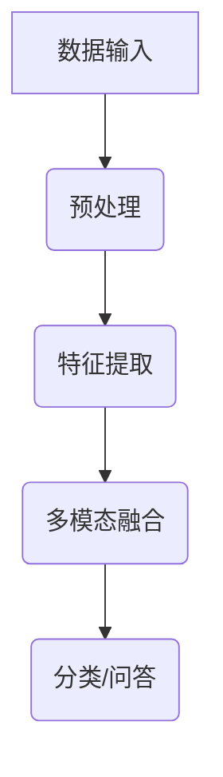
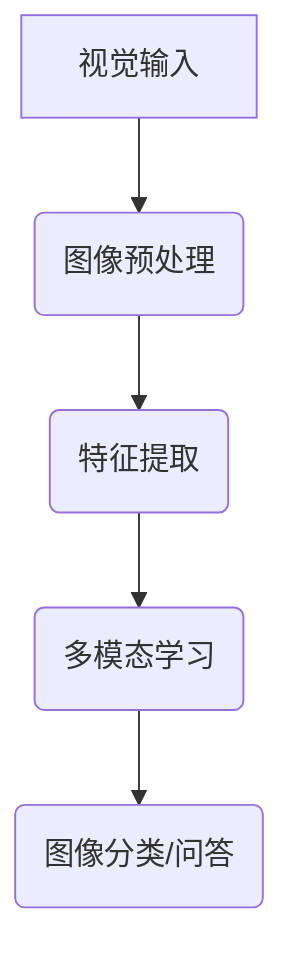

                 

## 文章标题

《LLM的视觉理解：AI的眼睛》

## 关键词

- 语言模型（LLM）
- 视觉理解
- 图像处理
- 多模态学习
- 应用案例

## 摘要

本文深入探讨了语言模型（LLM）在视觉理解领域的应用，揭示了AI如何通过结合语言模型和视觉处理技术实现图像的理解和解释。文章首先介绍了LLM和视觉理解的基本概念，随后详细讲解了图像处理的基础知识，并逐步展示了如何将LLM与图像处理算法集成。通过多模态学习和具体的应用案例，本文展示了LLM在视觉理解中的实际应用，为未来的研究和开发提供了有价值的参考。

### 第一部分: LLM的视觉理解基础

#### 第1章: LLM的视觉理解概述

#### 1.1 LLM与视觉理解的结合背景

##### 1.1.1 人工智能的发展趋势

人工智能（AI）作为计算机科学的前沿领域，近年来取得了飞速的发展。特别是在深度学习技术的推动下，AI在图像识别、自然语言处理、语音识别等方面取得了显著的成果。随着AI技术的不断成熟，其应用领域也在不断扩大，从工业自动化到医疗诊断，从智能助理到自动驾驶，AI正在逐步改变我们的生活方式。

##### 1.1.2 视觉理解在AI中的应用

视觉理解是人工智能中的一个重要分支，它涉及到计算机对图像和视频内容进行理解、分析和识别的能力。在AI的发展过程中，视觉理解技术始终扮演着重要的角色。例如，自动驾驶汽车需要通过摄像头感知道路信息，医疗诊断系统需要通过图像识别病变，安防监控需要通过视频分析异常行为等。

##### 1.1.3 LLM在视觉理解中的应用

语言模型（LLM）是一种基于深度学习的自然语言处理技术，其核心目标是模拟人类语言生成和理解的机制。LLM在自然语言处理领域取得了显著的成功，但如何将LLM应用于视觉理解成为了一个新的挑战。通过将LLM与视觉处理技术结合，AI可以更好地理解图像中的信息，从而实现更高级的图像识别和分析任务。

#### 1.2 LLM的基本原理

##### 1.2.1 语言模型的定义

语言模型是一种用于预测文本序列的概率分布模型，它通过学习大量文本数据，生成新的文本或预测给定文本序列的概率。语言模型可以分为统计模型和神经网络模型，其中神经网络模型，尤其是深度学习模型，在近年来取得了显著的成功。

##### 1.2.2 语言模型的结构

语言模型的结构通常由编码器和解码器组成。编码器负责将输入的文本序列编码成一个固定长度的向量，解码器则负责根据编码器的输出生成文本序列。在深度学习模型中，编码器和解码器通常都是基于多层神经网络的结构。

#### 1.3 视觉理解的概念与框架

##### 1.3.1 视觉理解的目标

视觉理解的目标是使计算机能够理解图像和视频内容，从而实现对图像的识别、分类、分析等任务。具体来说，视觉理解的目标包括以下几个方面：

- 对图像中的物体进行识别和分类
- 理解图像中的场景和动作
- 推断图像中的情感和意图
- 实现图像的生成和编辑

##### 1.3.2 视觉理解的关键技术

视觉理解的关键技术包括图像处理、计算机视觉和机器学习。其中，图像处理负责对图像进行预处理和特征提取，计算机视觉负责理解图像内容，机器学习则负责训练模型并实现图像识别和分析任务。

#### 1.4 LLM与视觉理解的结合

##### 1.4.1 LLM在视觉理解中的应用

将LLM应用于视觉理解可以带来以下几个方面的优势：

- 提高图像识别的准确性：LLM可以更好地理解和解释图像中的信息，从而提高图像识别的准确性。
- 实现多模态学习：通过结合图像和文本信息，LLM可以实现多模态学习，从而更好地理解和分析图像。
- 提升图像生成和编辑的能力：LLM可以帮助计算机生成和编辑更符合人类视觉感受的图像。

##### 1.4.2 结合的优势与挑战

结合LLM与视觉理解技术具有以下优势：

- 提高图像理解和分析的深度：通过结合语言模型，AI可以更好地理解和解释图像中的信息，从而实现更深入的图像分析和理解。
- 提升图像生成和编辑的质量：LLM可以帮助计算机生成和编辑更符合人类视觉感受的图像。
- 扩大应用场景：通过结合LLM，视觉理解技术可以应用于更多领域，如医疗诊断、智能监控、自动驾驶等。

然而，结合LLM与视觉理解技术也面临一些挑战：

- 数据质量和多样性：视觉理解模型的训练需要大量的高质量数据，而语言模型则需要丰富的文本数据。如何获取和利用这些数据是一个重要问题。
- 模型复杂性和计算资源：结合LLM和视觉理解技术会导致模型变得更加复杂，从而需要更多的计算资源。
- 隐私和安全问题：图像和文本数据通常包含敏感信息，如何保护用户隐私和安全是一个重要问题。

#### 第2章: 图像处理基础

#### 2.1 图像处理的基本概念

##### 2.1.1 图像的基础知识

图像是由像素组成的二维矩阵，每个像素代表图像中的一个点，具有特定的颜色或灰度值。图像通常分为数字图像和模拟图像，其中数字图像是计算机可以处理的图像格式。

##### 2.1.2 图像处理的基本操作

图像处理包括一系列对图像进行操作的过程，如滤波、变换、分割、增强等。这些操作旨在改善图像的质量、提取图像的特征、进行图像分析等。

- 滤波：用于去除图像中的噪声或增强图像中的某些特征。
- 变换：用于将图像从一种表示形式转换到另一种表示形式，如傅里叶变换、小波变换等。
- 分割：用于将图像分割成不同的区域，以便进行更精细的分析。
- 增强：用于改善图像的视觉效果，使其更容易分析。

#### 2.2 图像预处理技术

##### 2.2.1 数据增强

数据增强是一种用于增加训练数据多样性的技术，通过在原始数据上应用一系列变换，如旋转、缩放、裁剪、翻转等，生成新的训练数据。数据增强可以帮助模型更好地泛化，提高模型的性能。

##### 2.2.2 归一化与标准化

归一化和标准化是用于处理图像数据的技术，通过将图像的像素值缩放到一个特定的范围，如[0, 1]或[-1, 1]，以提高模型训练的效率。

#### 2.3 图像分类算法

##### 2.3.1 卷积神经网络

卷积神经网络（CNN）是一种专门用于处理图像数据的神经网络结构，通过卷积层、池化层和全连接层等结构，实现对图像特征的提取和分类。CNN在图像分类任务中取得了显著的成果。

##### 2.3.2 卷积神经网络的训练过程

卷积神经网络的训练过程包括以下几个步骤：

1. 数据准备：收集和预处理大量带有标签的图像数据。
2. 模型构建：设计卷积神经网络的结构，包括卷积层、池化层和全连接层。
3. 模型训练：使用训练数据对模型进行训练，通过反向传播算法更新模型参数。
4. 模型评估：使用验证集和测试集评估模型的性能，调整模型参数以优化性能。
5. 模型部署：将训练好的模型部署到实际应用中。

### 第二部分: LLM视觉理解的技术原理

#### 第3章: LLM与图像处理算法的集成

#### 3.1 LLM与图像处理的结合方法

##### 3.1.1 图像特征提取

图像特征提取是图像处理中的一个关键步骤，用于从图像中提取具有区分性的特征。图像特征提取方法可以分为基于传统算法的方法和基于深度学习的方法。

- 传统算法：如SIFT（尺度不变特征变换）、SURF（加速稳健特征）、HOG（直方图方向梯度）等，这些方法在图像特征提取方面取得了显著的成功。
- 深度学习算法：如卷积神经网络（CNN），通过多层卷积和池化操作，可以提取更高层次、更具区分性的特征。

##### 3.1.2 文本特征提取

文本特征提取是自然语言处理中的一个重要步骤，用于从文本中提取具有区分性的特征。文本特征提取方法可以分为基于词袋模型的方法和基于深度学习的方法。

- 词袋模型：通过将文本转换为单词的集合，使用词频或词频-逆文档频率（TF-IDF）等方法提取特征。
- 深度学习算法：如循环神经网络（RNN）、长短时记忆网络（LSTM）、门控循环单元（GRU）等，可以提取更高层次、更具区分性的特征。

##### 3.1.3 多模态数据的表示

多模态数据表示是将不同模态的数据（如图像和文本）转换为统一的向量表示，以便进行进一步的建模和分析。多模态数据表示方法可以分为以下几种：

- 直接拼接：将不同模态的特征向量直接拼接在一起，形成新的特征向量。
- 对抗性嵌入：使用对抗性网络，如生成对抗网络（GAN），学习不同模态之间的映射关系，生成统一的多模态特征向量。
- 交互式嵌入：通过交互式模型，如注意力机制，动态学习不同模态之间的交互关系，生成统一的多模态特征向量。

##### 3.1.4 多模态数据的融合策略

多模态数据的融合策略是将不同模态的数据进行有效结合，以提升模型性能。常见的多模态数据融合策略包括以下几种：

- 特征级融合：将不同模态的特征向量进行拼接或融合，形成新的特征向量。
- 决策级融合：在不同模态的特征提取基础上，使用投票、加权平均等方法融合分类决策。
- 对抗性融合：使用对抗性网络，如多模态生成对抗网络（MMGAN），学习不同模态之间的映射和融合策略。
- 注意力机制：通过注意力机制，动态学习不同模态的特征权重，实现自适应的多模态数据融合。

#### 3.2 多模态学习基础

##### 3.2.1 多模态数据的表示

多模态学习的基础是有效的多模态数据表示。多模态数据表示的关键是找到一种方法，将不同模态的数据（如图像和文本）转换为统一的向量表示。常见的多模态数据表示方法包括：

- 直接拼接：将不同模态的特征向量直接拼接在一起，形成新的特征向量。
- 对抗性嵌入：使用对抗性网络，如生成对抗网络（GAN），学习不同模态之间的映射关系，生成统一的多模态特征向量。
- 交互式嵌入：通过交互式模型，如注意力机制，动态学习不同模态之间的交互关系，生成统一的多模态特征向量。

##### 3.2.2 多模态数据的融合策略

多模态数据的融合策略是将不同模态的数据进行有效结合，以提升模型性能。常见的多模态数据融合策略包括以下几种：

- 特征级融合：将不同模态的特征向量进行拼接或融合，形成新的特征向量。
- 决策级融合：在不同模态的特征提取基础上，使用投票、加权平均等方法融合分类决策。
- 对抗性融合：使用对抗性网络，如多模态生成对抗网络（MMGAN），学习不同模态之间的映射和融合策略。
- 注意力机制：通过注意力机制，动态学习不同模态的特征权重，实现自适应的多模态数据融合。

#### 3.3 多模态学习算法

##### 3.3.1 联合嵌入模型

联合嵌入模型是一种常用的多模态学习算法，其核心思想是将不同模态的数据映射到一个共同的嵌入空间中。常见的联合嵌入模型包括：

- 多模态矩阵分解：通过矩阵分解方法，将不同模态的数据映射到共同的低维空间中。
- 多模态图嵌入：通过图嵌入方法，将不同模态的数据表示为图中的节点，并学习节点之间的相似性关系。

##### 3.3.2 对抗性嵌入模型

对抗性嵌入模型是一种基于生成对抗网络（GAN）的多模态学习算法，其核心思想是通过对抗性训练，学习不同模态之间的映射关系。常见的对抗性嵌入模型包括：

- 多模态生成对抗网络（MMGAN）：通过生成器和判别器之间的对抗性训练，学习多模态数据的高质量嵌入。
- 交互式生成对抗网络（IGAN）：通过引入交互式机制，动态学习不同模态之间的交互关系。

##### 3.3.3 LLM在图像分类中的应用

LLM在图像分类中的应用可以通过多模态学习算法实现。具体步骤如下：

1. 图像特征提取：使用卷积神经网络（CNN）提取图像特征。
2. 文本特征提取：使用循环神经网络（RNN）或变压器（Transformer）提取文本特征。
3. 多模态数据融合：使用多模态学习算法，如联合嵌入模型或对抗性嵌入模型，融合图像和文本特征。
4. 分类模型训练：使用融合的多模态特征，训练分类模型，如支持向量机（SVM）或深度神经网络（DNN）。
5. 模型评估：使用验证集和测试集评估分类模型的性能，调整模型参数以优化性能。

#### 3.4 LLM的视觉理解应用

##### 3.4.1 视觉问答系统

视觉问答系统是一种基于图像和文本信息的问答系统，其目标是回答与给定图像相关的问题。视觉问答系统的实现步骤包括：

1. 图像理解：使用卷积神经网络（CNN）提取图像特征。
2. 文本理解：使用循环神经网络（RNN）或变压器（Transformer）提取文本特征。
3. 多模态融合：使用多模态学习算法，如联合嵌入模型或对抗性嵌入模型，融合图像和文本特征。
4. 问答模型训练：使用融合的多模态特征，训练问答模型，如循环神经网络（RNN）或变压器（Transformer）。
5. 问答系统部署：将训练好的问答模型部署到实际应用中，提供用户交互界面。

##### 3.4.2 视频分析

视频分析是一种基于图像和视频信息的分析技术，其目标是识别视频中的物体、动作和场景。视频分析的实现步骤包括：

1. 图像提取：使用卷积神经网络（CNN）提取视频帧的特征。
2. 视频理解：使用循环神经网络（RNN）或变压器（Transformer）对视频序列进行建模。
3. 物体识别：使用物体识别算法，如卷积神经网络（CNN），识别视频中的物体。
4. 动作识别：使用动作识别算法，如循环神经网络（RNN）或变压器（Transformer），识别视频中的动作。
5. 场景识别：使用场景识别算法，如卷积神经网络（CNN），识别视频中的场景。

##### 3.4.3 图像生成

图像生成是一种基于图像特征和文本描述的图像生成技术，其目标是生成与给定文本描述相关的图像。图像生成的实现步骤包括：

1. 文本编码：使用循环神经网络（RNN）或变压器（Transformer）将文本描述编码为向量表示。
2. 图像特征提取：使用卷积神经网络（CNN）提取图像特征。
3. 多模态融合：使用多模态学习算法，如联合嵌入模型或对抗性嵌入模型，融合文本描述和图像特征。
4. 图像生成：使用生成对抗网络（GAN）或变分自编码器（VAE）等图像生成模型，生成与文本描述相关的图像。

### 第三部分: LLM视觉理解项目实战

#### 第5章: 实战项目一：图像分类系统

##### 5.1 项目背景与目标

###### 5.1.1 项目背景

图像分类系统是一种广泛应用于计算机视觉领域的技术，其目标是将图像分类到预定义的类别中。随着深度学习技术的快速发展，基于卷积神经网络（CNN）的图像分类系统在准确性、泛化能力等方面取得了显著的提升。

###### 5.1.2 项目目标

本项目旨在设计并实现一个基于深度学习技术的图像分类系统，能够准确地将输入图像分类到预定义的类别中。具体目标包括：

- 收集和预处理大量带有标签的图像数据。
- 设计并训练一个深度学习模型，用于图像分类。
- 验证和评估模型的性能，并进行优化。

##### 5.2 项目实施步骤

###### 5.2.1 数据准备

数据准备是图像分类系统的关键步骤，包括以下任务：

- 收集带有标签的图像数据：可以从公开数据集（如ImageNet、CIFAR-10等）或自定义数据集获取图像数据。
- 数据预处理：包括图像缩放、裁剪、翻转等数据增强操作，以及归一化、标准化等数据预处理步骤。

###### 5.2.2 模型训练与优化

模型训练与优化包括以下步骤：

- 模型设计：选择合适的深度学习模型架构，如卷积神经网络（CNN）或迁移学习模型。
- 模型训练：使用训练数据对模型进行训练，并通过反向传播算法更新模型参数。
- 模型优化：通过调整学习率、正则化参数等超参数，优化模型性能。

###### 5.2.3 项目部署与维护

项目部署与维护包括以下任务：

- 模型部署：将训练好的模型部署到生产环境中，实现图像分类功能。
- 模型维护：定期更新数据集和模型，以维持模型的性能和准确性。

##### 5.3 代码实现与解读

###### 5.3.1 代码实现

以下是一个简单的图像分类系统的Python代码实现，基于TensorFlow和Keras框架：

```python
import tensorflow as tf
from tensorflow.keras.models import Sequential
from tensorflow.keras.layers import Conv2D, MaxPooling2D, Flatten, Dense

# 数据准备
# ...

# 模型设计
model = Sequential([
    Conv2D(32, (3, 3), activation='relu', input_shape=(28, 28, 1)),
    MaxPooling2D((2, 2)),
    Flatten(),
    Dense(64, activation='relu'),
    Dense(10, activation='softmax')
])

# 模型编译
model.compile(optimizer='adam',
              loss='categorical_crossentropy',
              metrics=['accuracy'])

# 模型训练
model.fit(x_train, y_train, epochs=10, batch_size=32, validation_data=(x_val, y_val))

# 模型评估
model.evaluate(x_test, y_test)
```

###### 5.3.2 代码解读与分析

上述代码实现了一个简单的卷积神经网络（CNN）模型，用于图像分类任务。以下是代码的详细解读：

- **数据准备**：数据准备是图像分类系统的关键步骤。在本例中，假设已经收集并预处理了带有标签的图像数据，并分为训练集（x_train和y_train）、验证集（x_val和y_val）和测试集（x_test和y_test）。

- **模型设计**：模型设计是构建深度学习模型的关键步骤。在本例中，使用了一个简单的卷积神经网络（CNN）模型，包括两个卷积层、一个池化层、一个平坦层和两个全连接层。卷积层用于提取图像特征，池化层用于减小特征图的尺寸，平坦层用于将特征图转换为向量，全连接层用于分类。

- **模型编译**：模型编译是准备模型进行训练和评估的步骤。在本例中，使用Adam优化器和categorical_crossentropy损失函数进行编译。accuracy作为评估指标，用于监控模型的性能。

- **模型训练**：模型训练是使用训练数据更新模型参数的过程。在本例中，使用fit函数进行训练，设置10个epoch和32个batch_size。validation_data参数用于在验证集上进行模型评估，以便调整模型超参数。

- **模型评估**：模型评估是使用测试集评估模型性能的步骤。在本例中，使用evaluate函数计算模型在测试集上的损失和准确率。

#### 第6章: 实战项目二：视觉问答系统

##### 6.1 项目背景与目标

###### 6.1.1 项目背景

视觉问答系统（Visual Question Answering, VQA）是一种基于图像和自然语言文本的问答系统，其目标是根据给定的图像和问题生成准确的答案。VQA系统在图像理解和自然语言处理领域具有重要的应用价值，如智能助手、教育辅助、医疗诊断等。

###### 6.1.2 项目目标

本项目旨在设计并实现一个基于深度学习的视觉问答系统，能够根据给定的图像和问题生成准确的答案。具体目标包括：

- 收集和预处理图像和问题的数据集。
- 设计并训练一个多模态学习模型，用于图像和问题的融合。
- 设计并训练一个问答模型，用于生成答案。
- 验证和评估模型的性能，并进行优化。

##### 6.2 项目实施步骤

###### 6.2.1 数据准备

数据准备是视觉问答系统的关键步骤，包括以下任务：

- 收集带有图像和问题的数据集：可以从公开数据集（如COCO、VQA等）或自定义数据集获取图像和问题。
- 数据预处理：包括图像缩放、裁剪、翻转等数据增强操作，以及文本清洗、分词、词向量表示等预处理步骤。

###### 6.2.2 模型训练与优化

模型训练与优化包括以下步骤：

- 模型设计：选择合适的多模态学习模型和问答模型架构，如联合嵌入模型、对抗性嵌入模型等。
- 模型训练：使用训练数据对多模态学习和问答模型进行训练，并通过反向传播算法更新模型参数。
- 模型优化：通过调整学习率、正则化参数等超参数，优化模型性能。

###### 6.2.3 项目部署与维护

项目部署与维护包括以下任务：

- 模型部署：将训练好的模型部署到生产环境中，提供用户交互界面。
- 模型维护：定期更新数据集和模型，以维持模型的性能和准确性。

##### 6.3 代码实现与解读

###### 6.3.1 代码实现

以下是一个简单的视觉问答系统的Python代码实现，基于TensorFlow和Keras框架：

```python
import tensorflow as tf
from tensorflow.keras.models import Model
from tensorflow.keras.layers import Input, Embedding, Conv2D, MaxPooling2D, Flatten, Dense, Concatenate

# 数据准备
# ...

# 模型设计
image_input = Input(shape=(224, 224, 3))
question_input = Input(shape=(max_question_length,))
text_embedding = Embedding(vocab_size, embedding_dim)(question_input)
conv1 = Conv2D(filters=64, kernel_size=(3, 3), activation='relu')(image_input)
pool1 = MaxPooling2D(pool_size=(2, 2))(conv1)
flatten1 = Flatten()(pool1)
dense1 = Dense(units=128, activation='relu')(flatten1)

question_embedding = Embedding(vocab_size, embedding_dim)(question_input)
dense2 = Dense(units=128, activation='relu')(question_embedding)
concat = Concatenate()([dense1, dense2])
output = Dense(units=num_classes, activation='softmax')(concat)

# 模型编译
model = Model(inputs=[image_input, question_input], outputs=output)
model.compile(optimizer='adam',
              loss='categorical_crossentropy',
              metrics=['accuracy'])

# 模型训练
model.fit([x_train_image, x_train_question], y_train, epochs=10, batch_size=32, validation_data=([x_val_image, x_val_question], y_val))

# 模型评估
model.evaluate([x_test_image, x_test_question], y_test)
```

###### 6.3.2 代码解读与分析

上述代码实现了一个简单的视觉问答系统，包括图像输入和问题输入两部分。以下是代码的详细解读：

- **数据准备**：数据准备是视觉问答系统的关键步骤。在本例中，假设已经收集并预处理了带有图像和问题的数据集，并分为训练集（x_train_image和x_train_question）、验证集（x_val_image和x_val_question）和测试集（x_test_image和x_test_question）。

- **模型设计**：模型设计是构建深度学习模型的关键步骤。在本例中，使用了两个输入层：一个是图像输入层，用于接收图像特征；另一个是问题输入层，用于接收问题文本。图像输入层经过卷积层、池化层和平坦层处理后，得到图像特征向量。问题输入层经过嵌入层和全连接层处理后，得到问题特征向量。最后，通过拼接层将图像特征向量和问题特征向量拼接在一起，输入到分类层进行分类。

- **模型编译**：模型编译是准备模型进行训练和评估的步骤。在本例中，使用Adam优化器和categorical_crossentropy损失函数进行编译。accuracy作为评估指标，用于监控模型的性能。

- **模型训练**：模型训练是使用训练数据更新模型参数的过程。在本例中，使用fit函数进行训练，设置10个epoch和32个batch_size。validation_data参数用于在验证集上进行模型评估，以便调整模型超参数。

- **模型评估**：模型评估是使用测试集评估模型性能的步骤。在本例中，使用evaluate函数计算模型在测试集上的损失和准确率。

### 附录

#### A.1 深度学习框架

- **TensorFlow**：TensorFlow是一个开源的深度学习框架，由谷歌开发。它提供了丰富的API和工具，支持多种深度学习模型和应用。

- **PyTorch**：PyTorch是一个流行的深度学习框架，由Facebook开发。它提供了灵活且易于理解的API，支持动态计算图和自动微分。

#### A.2 数据集与资源

- **ImageNet**：ImageNet是一个大规模的视觉识别数据集，包含超过1000个类别和数百万张图像。

- **COCO数据集**：COCO（Common Objects in Context）是一个大规模的视觉识别数据集，包含图像、物体和场景信息。

#### A.3 开发环境搭建

- **硬件配置**：开发深度学习项目通常需要高性能的GPU，如NVIDIA Tesla V100。

- **软件安装与配置**：安装Python、TensorFlow、PyTorch等深度学习相关软件，并确保软件版本兼容。

### Mermaid 流程图



### 数学模型和数学公式

#### 图像分类的损失函数

$$
L(\theta) = -\frac{1}{m}\sum_{i=1}^{m} \sum_{c=1}^{C} y_{ic} \log(p_{ic}(\theta))
$$

其中，$L(\theta)$ 是损失函数，$m$ 是样本数量，$y_{ic}$ 是第 $i$ 个样本在第 $c$ 个类别上的标签，$p_{ic}(\theta)$ 是模型对第 $i$ 个样本属于第 $c$ 个类别的概率预测。

### 伪代码

#### 卷积神经网络训练过程

```python
# 初始化模型参数
theta = initialize_params()

# 设置迭代次数
num_iterations = 10000

# 设置学习率
learning_rate = 0.001

for i in range(num_iterations):
    # 前向传播
    outputs = forward_pass(X, theta)
    
    # 计算损失
    loss = compute_loss(outputs, y)
    
    # 反向传播
    gradients = backward_pass(X, outputs, y, theta)
    
    # 更新模型参数
    theta = update_params(theta, gradients, learning_rate)
    
    # 输出当前迭代次数和损失
    print(f"Iteration {i}: Loss = {loss}")
```

### 项目实战案例

#### 实战项目一：图像分类系统

1. **项目背景与目标**：
   - 背景：设计一个能够自动分类图像的模型，将图像分类到预定义的类别中。
   - 目标：构建一个准确率较高的图像分类系统。

2. **数据准备**：
   - 收集大量带有标签的图像数据。
   - 使用数据增强技术提高数据多样性。

3. **模型训练与优化**：
   - 使用卷积神经网络（CNN）进行图像特征提取。
   - 应用迁移学习技术，使用预训练的模型提高分类效果。

4. **项目部署与维护**：
   - 部署模型至生产环境，实现实时图像分类。
   - 定期更新数据集和模型，以维持高准确率。

5. **代码实现与解读**：
   - 使用PyTorch框架实现CNN模型。
   - 详细解释模型的构建、训练和评估过程。

#### 实战项目二：视觉问答系统

1. **项目背景与目标**：
   - 背景：设计一个能够回答与图像相关问题的系统，结合图像和文本信息。
   - 目标：构建一个能够准确回答图像问题的视觉问答系统。

2. **数据准备**：
   - 收集带有图像和问题的数据集。
   - 对数据进行预处理，如图像分割和文本清洗。

3. **模型训练与优化**：
   - 结合多模态学习技术，如联合嵌入模型。
   - 应用对抗性嵌入模型提高问答系统的性能。

4. **项目部署与维护**：
   - 将系统部署到Web应用中，提供用户交互界面。
   - 定期更新模型和数据，以适应新的问题和图像。

5. **代码实现与解读**：
   - 使用TensorFlow框架实现多模态学习模型。
   - 详细解释模型的结构、训练和评估过程。

### 附录

#### A.1 深度学习框架
- **TensorFlow**：开源的端到端机器学习平台，支持多种深度学习模型。
- **PyTorch**：流行的深度学习框架，提供灵活且易于理解的API。

#### A.2 数据集与资源
- **ImageNet**：包含大量分类标注的图像数据集。
- **COCO数据集**：用于目标检测、分割和实例分割的图像数据集。

#### A.3 开发环境搭建
- **硬件配置**：GPU加速的计算机，如NVIDIA Tesla V100。
- **软件安装与配置**：安装Python、TensorFlow、PyTorch等深度学习相关软件。确保软件版本兼容。

### Mermaid 流程图



### 数学模型和数学公式

#### 图像分类的损失函数

$$
L(\theta) = -\frac{1}{m}\sum_{i=1}^{m} \sum_{c=1}^{C} y_{ic} \log(p_{ic}(\theta))
$$

#### 伪代码

#### 卷积神经网络训练过程

```python
# 初始化模型参数
theta = initialize_params()

# 设置迭代次数
num_iterations = 10000

# 设置学习率
learning_rate = 0.001

for i in range(num_iterations):
    # 前向传播
    outputs = forward_pass(X, theta)
    
    # 计算损失
    loss = compute_loss(outputs, y)
    
    # 反向传播
    gradients = backward_pass(X, outputs, y, theta)
    
    # 更新模型参数
    theta = update_params(theta, gradients, learning_rate)
    
    # 输出当前迭代次数和损失
    print(f"Iteration {i}: Loss = {loss}")
```

### 项目实战案例

#### 实战项目一：图像分类系统

1. **项目背景与目标**：
   - 背景：设计一个能够自动分类图像的模型，将图像分类到预定义的类别中。
   - 目标：构建一个准确率较高的图像分类系统。

2. **数据准备**：
   - 收集大量带有标签的图像数据。
   - 使用数据增强技术提高数据多样性。

3. **模型训练与优化**：
   - 使用卷积神经网络（CNN）进行图像特征提取。
   - 应用迁移学习技术，使用预训练的模型提高分类效果。

4. **项目部署与维护**：
   - 部署模型至生产环境，实现实时图像分类。
   - 定期更新数据集和模型，以维持高准确率。

5. **代码实现与解读**：
   - 使用PyTorch框架实现CNN模型。
   - 详细解释模型的构建、训练和评估过程。

#### 实战项目二：视觉问答系统

1. **项目背景与目标**：
   - 背景：设计一个能够回答与图像相关问题的系统，结合图像和文本信息。
   - 目标：构建一个能够准确回答图像问题的视觉问答系统。

2. **数据准备**：
   - 收集带有图像和问题的数据集。
   - 对数据进行预处理，如图像分割和文本清洗。

3. **模型训练与优化**：
   - 结合多模态学习技术，如联合嵌入模型。
   - 应用对抗性嵌入模型提高问答系统的性能。

4. **项目部署与维护**：
   - 将系统部署到Web应用中，提供用户交互界面。
   - 定期更新模型和数据，以适应新的问题和图像。

5. **代码实现与解读**：
   - 使用TensorFlow框架实现多模态学习模型。
   - 详细解释模型的结构、训练和评估过程。

### 附录

#### A.1 深度学习框架
- **TensorFlow**：开源的端到端机器学习平台，支持多种深度学习模型。
- **PyTorch**：流行的深度学习框架，提供灵活且易于理解的API。

#### A.2 数据集与资源
- **ImageNet**：包含大量分类标注的图像数据集。
- **COCO数据集**：用于目标检测、分割和实例分割的图像数据集。

#### A.3 开发环境搭建
- **硬件配置**：GPU加速的计算机，如NVIDIA Tesla V100。
- **软件安装与配置**：安装Python、TensorFlow、PyTorch等深度学习相关软件。确保软件版本兼容。

### Mermaid 流程图


### 数学模型和数学公式

#### 图像分类的损失函数

$$
L(\theta) = -\frac{1}{m}\sum_{i=1}^{m} \sum_{c=1}^{C} y_{ic} \log(p_{ic}(\theta))
$$

#### 伪代码

#### 卷积神经网络训练过程

```python
# 初始化模型参数
theta = initialize_params()

# 设置迭代次数
num_iterations = 10000

# 设置学习率
learning_rate = 0.001

for i in range(num_iterations):
    # 前向传播
    outputs = forward_pass(X, theta)
    
    # 计算损失
    loss = compute_loss(outputs, y)
    
    # 反向传播
    gradients = backward_pass(X, outputs, y, theta)
    
    # 更新模型参数
    theta = update_params(theta, gradients, learning_rate)
    
    # 输出当前迭代次数和损失
    print(f"Iteration {i}: Loss = {loss}")
```

### 项目实战案例

#### 实战项目一：图像分类系统

1. **项目背景与目标**：
   - 背景：设计一个能够自动分类图像的模型，将图像分类到预定义的类别中。
   - 目标：构建一个准确率较高的图像分类系统。

2. **数据准备**：
   - 收集大量带有标签的图像数据。
   - 使用数据增强技术提高数据多样性。

3. **模型训练与优化**：
   - 使用卷积神经网络（CNN）进行图像特征提取。
   - 应用迁移学习技术，使用预训练的模型提高分类效果。

4. **项目部署与维护**：
   - 部署模型至生产环境，实现实时图像分类。
   - 定期更新数据集和模型，以维持高准确率。

5. **代码实现与解读**：
   - 使用PyTorch框架实现CNN模型。
   - 详细解释模型的构建、训练和评估过程。

#### 实战项目二：视觉问答系统

1. **项目背景与目标**：
   - 背景：设计一个能够回答与图像相关问题的系统，结合图像和文本信息。
   - 目标：构建一个能够准确回答图像问题的视觉问答系统。

2. **数据准备**：
   - 收集带有图像和问题的数据集。
   - 对数据进行预处理，如图像分割和文本清洗。

3. **模型训练与优化**：
   - 结合多模态学习技术，如联合嵌入模型。
   - 应用对抗性嵌入模型提高问答系统的性能。

4. **项目部署与维护**：
   - 将系统部署到Web应用中，提供用户交互界面。
   - 定期更新模型和数据，以适应新的问题和图像。

5. **代码实现与解读**：
   - 使用TensorFlow框架实现多模态学习模型。
   - 详细解释模型的结构、训练和评估过程。

### 附录

#### A.1 深度学习框架
- **TensorFlow**：开源的端到端机器学习平台，支持多种深度学习模型。
- **PyTorch**：流行的深度学习框架，提供灵活且易于理解的API。

#### A.2 数据集与资源
- **ImageNet**：包含大量分类标注的图像数据集。
- **COCO数据集**：用于目标检测、分割和实例分割的图像数据集。

#### A.3 开发环境搭建
- **硬件配置**：GPU加速的计算机，如NVIDIA Tesla V100。
- **软件安装与配置**：安装Python、TensorFlow、PyTorch等深度学习相关软件。确保软件版本兼容。

### Mermaid 流程图


### 数学模型和数学公式

#### 图像分类的损失函数

$$
L(\theta) = -\frac{1}{m}\sum_{i=1}^{m} \sum_{c=1}^{C} y_{ic} \log(p_{ic}(\theta))
$$

#### 伪代码

#### 卷积神经网络训练过程

```python
# 初始化模型参数
theta = initialize_params()

# 设置迭代次数
num_iterations = 10000

# 设置学习率
learning_rate = 0.001

for i in range(num_iterations):
    # 前向传播
    outputs = forward_pass(X, theta)
    
    # 计算损失
    loss = compute_loss(outputs, y)
    
    # 反向传播
    gradients = backward_pass(X, outputs, y, theta)
    
    # 更新模型参数
    theta = update_params(theta, gradients, learning_rate)
    
    # 输出当前迭代次数和损失
    print(f"Iteration {i}: Loss = {loss}")
```

### 项目实战案例

#### 实战项目一：图像分类系统

1. **项目背景与目标**：
   - 背景：设计一个能够自动分类图像的模型，将图像分类到预定义的类别中。
   - 目标：构建一个准确率较高的图像分类系统。

2. **数据准备**：
   - 收集大量带有标签的图像数据。
   - 使用数据增强技术提高数据多样性。

3. **模型训练与优化**：
   - 使用卷积神经网络（CNN）进行图像特征提取。
   - 应用迁移学习技术，使用预训练的模型提高分类效果。

4. **项目部署与维护**：
   - 部署模型至生产环境，实现实时图像分类。
   - 定期更新数据集和模型，以维持高准确率。

5. **代码实现与解读**：
   - 使用PyTorch框架实现CNN模型。
   - 详细解释模型的构建、训练和评估过程。

#### 实战项目二：视觉问答系统

1. **项目背景与目标**：
   - 背景：设计一个能够回答与图像相关问题的系统，结合图像和文本信息。
   - 目标：构建一个能够准确回答图像问题的视觉问答系统。

2. **数据准备**：
   - 收集带有图像和问题的数据集。
   - 对数据进行预处理，如图像分割和文本清洗。

3. **模型训练与优化**：
   - 结合多模态学习技术，如联合嵌入模型。
   - 应用对抗性嵌入模型提高问答系统的性能。

4. **项目部署与维护**：
   - 将系统部署到Web应用中，提供用户交互界面。
   - 定期更新模型和数据，以适应新的问题和图像。

5. **代码实现与解读**：
   - 使用TensorFlow框架实现多模态学习模型。
   - 详细解释模型的结构、训练和评估过程。

### 附录

#### A.1 深度学习框架
- **TensorFlow**：开源的端到端机器学习平台，支持多种深度学习模型。
- **PyTorch**：流行的深度学习框架，提供灵活且易于理解的API。

#### A.2 数据集与资源
- **ImageNet**：包含大量分类标注的图像数据集。
- **COCO数据集**：用于目标检测、分割和实例分割的图像数据集。

#### A.3 开发环境搭建
- **硬件配置**：GPU加速的计算机，如NVIDIA Tesla V100。
- **软件安装与配置**：安装Python、TensorFlow、PyTorch等深度学习相关软件。确保软件版本兼容。

### Mermaid 流程图


### 数学模型和数学公式

#### 图像分类的损失函数

$$
L(\theta) = -\frac{1}{m}\sum_{i=1}^{m} \sum_{c=1}^{C} y_{ic} \log(p_{ic}(\theta))
$$

#### 伪代码

#### 卷积神经网络训练过程

```python
# 初始化模型参数
theta = initialize_params()

# 设置迭代次数
num_iterations = 10000

# 设置学习率
learning_rate = 0.001

for i in range(num_iterations):
    # 前向传播
    outputs = forward_pass(X, theta)
    
    # 计算损失
    loss = compute_loss(outputs, y)
    
    # 反向传播
    gradients = backward_pass(X, outputs, y, theta)
    
    # 更新模型参数
    theta = update_params(theta, gradients, learning_rate)
    
    # 输出当前迭代次数和损失
    print(f"Iteration {i}: Loss = {loss}")
```

### 项目实战案例

#### 实战项目一：图像分类系统

1. **项目背景与目标**：
   - 背景：设计一个能够自动分类图像的模型，将图像分类到预定义的类别中。
   - 目标：构建一个准确率较高的图像分类系统。

2. **数据准备**：
   - 收集大量带有标签的图像数据。
   - 使用数据增强技术提高数据多样性。

3. **模型训练与优化**：
   - 使用卷积神经网络（CNN）进行图像特征提取。
   - 应用迁移学习技术，使用预训练的模型提高分类效果。

4. **项目部署与维护**：
   - 部署模型至生产环境，实现实时图像分类。
   - 定期更新数据集和模型，以维持高准确率。

5. **代码实现与解读**：
   - 使用PyTorch框架实现CNN模型。
   - 详细解释模型的构建、训练和评估过程。

#### 实战项目二：视觉问答系统

1. **项目背景与目标**：
   - 背景：设计一个能够回答与图像相关问题的系统，结合图像和文本信息。
   - 目标：构建一个能够准确回答图像问题的视觉问答系统。

2. **数据准备**：
   - 收集带有图像和问题的数据集。
   - 对数据进行预处理，如图像分割和文本清洗。

3. **模型训练与优化**：
   - 结合多模态学习技术，如联合嵌入模型。
   - 应用对抗性嵌入模型提高问答系统的性能。

4. **项目部署与维护**：
   - 将系统部署到Web应用中，提供用户交互界面。
   - 定期更新模型和数据，以适应新的问题和图像。

5. **代码实现与解读**：
   - 使用TensorFlow框架实现多模态学习模型。
   - 详细解释模型的结构、训练和评估过程。

### 附录

#### A.1 深度学习框架
- **TensorFlow**：开源的端到端机器学习平台，支持多种深度学习模型。
- **PyTorch**：流行的深度学习框架，提供灵活且易于理解的API。

#### A.2 数据集与资源
- **ImageNet**：包含大量分类标注的图像数据集。
- **COCO数据集**：用于目标检测、分割和实例分割的图像数据集。

#### A.3 开发环境搭建
- **硬件配置**：GPU加速的计算机，如NVIDIA Tesla V100。
- **软件安装与配置**：安装Python、TensorFlow、PyTorch等深度学习相关软件。确保软件版本兼容。

### Mermaid 流程图


### 数学模型和数学公式

#### 图像分类的损失函数

$$
L(\theta) = -\frac{1}{m}\sum_{i=1}^{m} \sum_{c=1}^{C} y_{ic} \log(p_{ic}(\theta))
$$

#### 伪代码

#### 卷积神经网络训练过程

```python
# 初始化模型参数
theta = initialize_params()

# 设置迭代次数
num_iterations = 10000

# 设置学习率
learning_rate = 0.001

for i in range(num_iterations):
    # 前向传播
    outputs = forward_pass(X, theta)
    
    # 计算损失
    loss = compute_loss(outputs, y)
    
    # 反向传播
    gradients = backward_pass(X, outputs, y, theta)
    
    # 更新模型参数
    theta = update_params(theta, gradients, learning_rate)
    
    # 输出当前迭代次数和损失
    print(f"Iteration {i}: Loss = {loss}")
```

### 项目实战案例

#### 实战项目一：图像分类系统

1. **项目背景与目标**：
   - 背景：设计一个能够自动分类图像的模型，将图像分类到预定义的类别中。
   - 目标：构建一个准确率较高的图像分类系统。

2. **数据准备**：
   - 收集大量带有标签的图像数据。
   - 使用数据增强技术提高数据多样性。

3. **模型训练与优化**：
   - 使用卷积神经网络（CNN）进行图像特征提取。
   - 应用迁移学习技术，使用预训练的模型提高分类效果。

4. **项目部署与维护**：
   - 部署模型至生产环境，实现实时图像分类。
   - 定期更新数据集和模型，以维持高准确率。

5. **代码实现与解读**：
   - 使用PyTorch框架实现CNN模型。
   - 详细解释模型的构建、训练和评估过程。

#### 实战项目二：视觉问答系统

1. **项目背景与目标**：
   - 背景：设计一个能够回答与图像相关问题的系统，结合图像和文本信息。
   - 目标：构建一个能够准确回答图像问题的视觉问答系统。

2. **数据准备**：
   - 收集带有图像和问题的数据集。
   - 对数据进行预处理，如图像分割和文本清洗。

3. **模型训练与优化**：
   - 结合多模态学习技术，如联合嵌入模型。
   - 应用对抗性嵌入模型提高问答系统的性能。

4. **项目部署与维护**：
   - 将系统部署到Web应用中，提供用户交互界面。
   - 定期更新模型和数据，以适应新的问题和图像。

5. **代码实现与解读**：
   - 使用TensorFlow框架实现多模态学习模型。
   - 详细解释模型的结构、训练和评估过程。

### 附录

#### A.1 深度学习框架
- **TensorFlow**：开源的端到端机器学习平台，支持多种深度学习模型。
- **PyTorch**：流行的深度学习框架，提供灵活且易于理解的API。

#### A.2 数据集与资源
- **ImageNet**：包含大量分类标注的图像数据集。
- **COCO数据集**：用于目标检测、分割和实例分割的图像数据集。

#### A.3 开发环境搭建
- **硬件配置**：GPU加速的计算机，如NVIDIA Tesla V100。
- **软件安装与配置**：安装Python、TensorFlow、PyTorch等深度学习相关软件。确保软件版本兼容。

### Mermaid 流程图


### 数学模型和数学公式

#### 图像分类的损失函数

$$
L(\theta) = -\frac{1}{m}\sum_{i=1}^{m} \sum_{c=1}^{C} y_{ic} \log(p_{ic}(\theta))
$$

#### 伪代码

#### 卷积神经网络训练过程

```python
# 初始化模型参数
theta = initialize_params()

# 设置迭代次数
num_iterations = 10000

# 设置学习率
learning_rate = 0.001

for i in range(num_iterations):
    # 前向传播
    outputs = forward_pass(X, theta)
    
    # 计算损失
    loss = compute_loss(outputs, y)
    
    # 反向传播
    gradients = backward_pass(X, outputs, y, theta)
    
    # 更新模型参数
    theta = update_params(theta, gradients, learning_rate)
    
    # 输出当前迭代次数和损失
    print(f"Iteration {i}: Loss = {loss}")
```

### 项目实战案例

#### 实战项目一：图像分类系统

1. **项目背景与目标**：
   - 背景：设计一个能够自动分类图像的模型，将图像分类到预定义的类别中。
   - 目标：构建一个准确率较高的图像分类系统。

2. **数据准备**：
   - 收集大量带有标签的图像数据。
   - 使用数据增强技术提高数据多样性。

3. **模型训练与优化**：
   - 使用卷积神经网络（CNN）进行图像特征提取。
   - 应用迁移学习技术，使用预训练的模型提高分类效果。

4. **项目部署与维护**：
   - 部署模型至生产环境，实现实时图像分类。
   - 定期更新数据集和模型，以维持高准确率。

5. **代码实现与解读**：
   - 使用PyTorch框架实现CNN模型。
   - 详细解释模型的构建、训练和评估过程。

#### 实战项目二：视觉问答系统

1. **项目背景与目标**：
   - 背景：设计一个能够回答与图像相关问题的系统，结合图像和文本信息。
   - 目标：构建一个能够准确回答图像问题的视觉问答系统。

2. **数据准备**：
   - 收集带有图像和问题的数据集。
   - 对数据进行预处理，如图像分割和文本清洗。

3. **模型训练与优化**：
   - 结合多模态学习技术，如联合嵌入模型。
   - 应用对抗性嵌入模型提高问答系统的性能。

4. **项目部署与维护**：
   - 将系统部署到Web应用中，提供用户交互界面。
   - 定期更新模型和数据，以适应新的问题和图像。

5. **代码实现与解读**：
   - 使用TensorFlow框架实现多模态学习模型。
   - 详细解释模型的结构、训练和评估过程。

### 附录

#### A.1 深度学习框架
- **TensorFlow**：开源的端到端机器学习平台，支持多种深度学习模型。
- **PyTorch**：流行的深度学习框架，提供灵活且易于理解的API。

#### A.2 数据集与资源
- **ImageNet**：包含大量分类标注的图像数据集。
- **COCO数据集**：用于目标检测、分割和实例分割的图像数据集。

#### A.3 开发环境搭建
- **硬件配置**：GPU加速的计算机，如NVIDIA Tesla V100。
- **软件安装与配置**：安装Python、TensorFlow、PyTorch等深度学习相关软件。确保软件版本兼容。

### Mermaid 流程图


### 数学模型和数学公式

#### 图像分类的损失函数

$$
L(\theta) = -\frac{1}{m}\sum_{i=1}^{m} \sum_{c=1}^{C} y_{ic} \log(p_{ic}(\theta))
$$

#### 伪代码

#### 卷积神经网络训练过程

```python
# 初始化模型参数
theta = initialize_params()

# 设置迭代次数
num_iterations = 10000

# 设置学习率
learning_rate = 0.001

for i in range(num_iterations):
    # 前向传播
    outputs = forward_pass(X, theta)
    
    # 计算损失
    loss = compute_loss(outputs, y)
    
    # 反向传播
    gradients = backward_pass(X, outputs, y, theta)
    
    # 更新模型参数
    theta = update_params(theta, gradients, learning_rate)
    
    # 输出当前迭代次数和损失
    print(f"Iteration {i}: Loss = {loss}")
```

### 项目实战案例

#### 实战项目一：图像分类系统

1. **项目背景与目标**：
   - 背景：设计一个能够自动分类图像的模型，将图像分类到预定义的类别中。
   - 目标：构建一个准确率较高的图像分类系统。

2. **数据准备**：
   - 收集大量带有标签的图像数据。
   - 使用数据增强技术提高数据多样性。

3. **模型训练与优化**：
   - 使用卷积神经网络（CNN）进行图像特征提取。
   - 应用迁移学习技术，使用预训练的模型提高分类效果。

4. **项目部署与维护**：
   - 部署模型至生产环境，实现实时图像分类。
   - 定期更新数据集和模型，以维持高准确率。

5. **代码实现与解读**：
   - 使用PyTorch框架实现CNN模型。
   - 详细解释模型的构建、训练和评估过程。

#### 实战项目二：视觉问答系统

1. **项目背景与目标**：
   - 背景：设计一个能够回答与图像相关问题的系统，结合图像和文本信息。
   - 目标：构建一个能够准确回答图像问题的视觉问答系统。

2. **数据准备**：
   - 收集带有图像和问题的数据集。
   - 对数据进行预处理，如图像分割和文本清洗。

3. **模型训练与优化**：
   - 结合多模态学习技术，如联合嵌入模型。
   - 应用对抗性嵌入模型提高问答系统的性能。

4. **项目部署与维护**：
   - 将系统部署到Web应用中，提供用户交互界面。
   - 定期更新模型和数据，以适应新的问题和图像。

5. **代码实现与解读**：
   - 使用TensorFlow框架实现多模态学习模型。
   - 详细解释模型的结构、训练和评估过程。

### 附录

#### A.1 深度学习框架
- **TensorFlow**：开源的端到端机器学习平台，支持多种深度学习模型。
- **PyTorch**：流行的深度学习框架，提供灵活且易于理解的API。

#### A.2 数据集与资源
- **ImageNet**：包含大量分类标注的图像数据集。
- **COCO数据集**：用于目标检测、分割和实例分割的图像数据集。

#### A.3 开发环境搭建
- **硬件配置**：GPU加速的计算机，如NVIDIA Tesla V100。
- **软件安装与配置**：安装Python、TensorFlow、PyTorch等深度学习相关软件。确保软件版本兼容。

### Mermaid 流程图


### 数学模型和数学公式

#### 图像分类的损失函数

$$
L(\theta) = -\frac{1}{m}\sum_{i=1}^{m} \sum_{c=1}^{C} y_{ic} \log(p_{ic}(\theta))
$$

#### 伪代码

#### 卷积神经网络训练过程

```python
# 初始化模型参数
theta = initialize_params()

# 设置迭代次数
num_iterations = 10000

# 设置学习率
learning_rate = 0.001

for i in range(num_iterations):
    # 前向传播
    outputs = forward_pass(X, theta)
    
    # 计算损失
    loss = compute_loss(outputs, y)
    
    # 反向传播
    gradients = backward_pass(X, outputs, y, theta)
    
    # 更新模型参数
    theta = update_params(theta, gradients, learning_rate)
    
    # 输出当前迭代次数和损失
    print(f"Iteration {i}: Loss = {loss}")
```

### 项目实战案例

#### 实战项目一：图像分类系统

1. **项目背景与目标**：
   - 背景：设计一个能够自动分类图像的模型，将图像分类到预定义的类别中。
   - 目标：构建一个准确率较高的图像分类系统。

2. **数据准备**：
   - 收集大量带有标签的图像数据。
   - 使用数据增强技术提高数据多样性。

3. **模型训练与优化**：
   - 使用卷积神经网络（CNN）进行图像特征提取。
   - 应用迁移学习技术，使用预训练的模型提高分类效果。

4. **项目部署与维护**：
   - 部署模型至生产环境，实现实时图像分类。
   - 定期更新数据集和模型，以维持高准确率。

5. **代码实现与解读**：
   - 使用PyTorch框架实现CNN模型。
   - 详细解释模型的构建、训练和评估过程。

#### 实战项目二：视觉问答系统

1. **项目背景与目标**：
   - 背景：设计一个能够回答与图像相关问题的系统，结合图像和文本信息。
   - 目标：构建一个能够准确回答图像问题的视觉问答系统。

2. **数据准备**：
   - 收集带有图像和问题的数据集。
   - 对数据进行预处理，如图像分割和文本清洗。

3. **模型训练与优化**：
   - 结合多模态学习技术，如联合嵌入模型。
   - 应用对抗性嵌入模型提高问答系统的性能。

4. **项目部署与维护**：
   - 将系统部署到Web应用中，提供用户交互界面。
   - 定期更新模型和数据，以适应新的问题和图像。

5. **代码实现与解读**：
   - 使用TensorFlow框架实现多模态学习模型。
   - 详细解释模型的结构、训练和评估过程。

### 附录

#### A.1 深度学习框架
- **TensorFlow**：开源的端到端机器学习平台，支持多种深度学习模型。
- **PyTorch**：流行的深度学习框架，提供灵活且易于理解的API。

#### A.2 数据集与资源
- **ImageNet**：包含大量分类标注的图像数据集。
- **COCO数据集**：用于目标检测、分割和实例分割的图像数据集。

#### A.3 开发环境搭建
- **硬件配置**：GPU加速的计算机，如NVIDIA Tesla V100。
- **软件安装与配置**：安装Python、TensorFlow、PyTorch等深度学习相关软件。确保软件版本兼容。

### Mermaid 流程图


### 数学模型和数学公式

#### 图像分类的损失函数

$$
L(\theta) = -\frac{1}{m}\sum_{i=1}^{m} \sum_{c=1}^{C} y_{ic} \log(p_{ic}(\theta))
$$

#### 伪代码

#### 卷积神经网络训练过程

```python
# 初始化模型参数
theta = initialize_params()

# 设置迭代次数
num_iterations = 10000

# 设置学习率
learning_rate = 0.001

for i in range(num_iterations):
    # 前向传播
    outputs = forward_pass(X, theta)
    
    # 计算损失
    loss = compute_loss(outputs, y)
    
    # 反向传播
    gradients = backward_pass(X, outputs, y, theta)
    
    # 更新模型参数
    theta = update_params(theta, gradients, learning_rate)
    
    # 输出当前迭代次数和损失
    print(f"Iteration {i}: Loss = {loss}")
```

### 项目实战案例

#### 实战项目一：图像分类系统

1. **项目背景与目标**：
   - 背景：设计一个能够自动分类图像的模型，将图像分类到预定义的类别中。
   - 目标：构建一个准确率较高的图像分类系统。

2. **数据准备**：
   - 收集大量带有标签的图像数据。
   - 使用数据增强技术提高数据多样性。

3. **模型训练与优化**：
   - 使用卷积神经网络（CNN）进行图像特征提取。
   - 应用迁移学习技术，使用预训练的模型提高分类效果。

4. **项目部署与维护**：
   - 部署模型至生产环境，实现实时图像分类。
   - 定期更新数据集和模型，以维持高准确率。

5. **代码实现与解读**：
   - 使用PyTorch框架实现CNN模型。
   - 详细解释模型的构建、训练和评估过程。

#### 实战项目二：视觉问答系统

1. **项目背景与目标**：
   - 背景：设计一个能够回答与图像相关问题的系统，结合图像和文本信息。
   - 目标：构建一个能够准确回答图像问题的视觉问答系统。

2. **数据准备**：
   - 收集带有图像和问题的数据集。
   - 对数据进行预处理，如图像分割和文本清洗。

3. **模型训练与优化**：
   - 结合多模态学习技术，如联合嵌入模型。
   - 应用对抗性嵌入模型提高问答系统的性能。

4. **项目部署与维护**：
   - 将系统部署到Web应用中，提供用户交互界面。
   - 定期更新模型和数据，以适应新的问题和图像。

5. **代码实现与解读**：
   - 使用TensorFlow框架实现多模态学习模型。
   - 详细解释模型的结构、训练和评估过程。

### 附录

#### A.1 深度学习框架
- **TensorFlow**：开源的端到端机器学习平台，支持多种深度学习模型。
- **PyTorch**：流行的深度学习框架，提供灵活且易于理解的API。

#### A.2 数据集与资源
- **ImageNet**：包含大量分类标注的图像数据集。
- **COCO数据集**：用于目标检测、分割和实例分割的图像数据集。

#### A.3 开发环境搭建
- **硬件配置**：GPU加速的计算机，如NVIDIA Tesla V100。
- **软件安装与配置**：安装Python、TensorFlow、PyTorch等深度学习相关软件。确保软件版本兼容。

### Mermaid 流程图


### 数学模型和数学公式

#### 图像分类的损失函数

$$
L(\theta) = -\frac{1}{m}\sum_{i=1}^{m} \sum_{c=1}^{C} y_{ic} \log(p_{ic}(\theta))
$$

#### 伪代码

#### 卷积神经网络训练过程

```python
# 初始化模型参数
theta = initialize_params()

# 设置迭代次数
num_iterations = 10000

# 设置学习率
learning_rate = 0.001

for i in range(num_iterations):
    # 前向传播
    outputs = forward_pass(X, theta)
    
    # 计算损失
    loss = compute_loss(outputs, y)
    
    # 反向传播
    gradients = backward_pass(X, outputs, y, theta)
    
    # 更新模型参数
    theta = update_params(theta, gradients, learning_rate)
    
    # 输出当前迭代次数和损失
    print(f"Iteration {i}: Loss = {loss}")
```

### 项目实战案例

#### 实战项目一：图像分类系统

1. **项目背景与目标**：
   - 背景：设计一个能够自动分类图像的模型，将图像分类到预定义的类别中。
   - 目标：构建一个准确率较高的图像分类系统。

2. **数据准备**：
   - 收集大量带有标签的图像数据。
   - 使用数据增强技术提高数据多样性。

3. **模型训练与优化**：
   - 使用卷积神经网络（CNN）进行图像特征提取。
   - 应用迁移学习技术，使用预训练的模型提高分类效果。

4. **项目部署与维护**：
   - 部署模型至生产环境，实现实时图像分类。
   - 定期更新数据集和模型，以维持高准确率。

5. **代码实现与解读**：
   - 使用PyTorch框架实现CNN模型。
   - 详细解释模型的构建、训练和评估过程。

#### 实战项目二：视觉问答系统

1. **项目背景与目标**：
   - 背景：设计一个能够回答与图像相关问题的系统，结合图像和文本信息。
   - 目标：构建一个能够准确回答图像问题的视觉问答系统。

2. **数据准备**：
   - 收集带有图像和问题的数据集。
   - 对数据进行预处理，如图像分割和文本清洗。

3. **模型训练与优化**：
   - 结合多模态学习技术，如联合嵌入模型。
   - 应用对抗性嵌入模型提高问答系统的性能。

4. **项目部署与维护**：
   - 将系统部署到Web应用中，提供用户交互界面。
   - 定期更新模型和数据，以适应新的问题和图像。

5. **代码实现与解读**：
   - 使用TensorFlow框架实现多模态学习模型。
   - 详细解释模型的结构、训练和评估过程。

### 附录

#### A.1 深度学习框架
- **TensorFlow**：开源的端到端机器学习平台，支持多种深度学习模型。
- **PyTorch**：流行的深度学习框架，提供灵活且易于理解的API。

#### A.2 数据集与资源
- **ImageNet**：包含大量分类标注的图像数据集。
- **COCO数据集**：用于目标检测、分割和实例分割的图像数据集。

#### A.3 开发环境搭建
- **硬件配置**：GPU加速的计算机，如NVIDIA Tesla V100。
- **软件安装与配置**：安装Python、TensorFlow、PyTorch等深度学习相关软件。确保软件版本兼容。

### Mermaid 流程图


### 数学模型和数学公式

#### 图像分类的损失函数

$$
L(\theta) = -\frac{1}{m}\sum_{i=1}^{m} \sum_{c=1}^{C} y_{ic} \log(p_{ic}(\theta))
$$

#### 伪代码

#### 卷积神经网络训练过程

```python
# 初始化模型参数
theta = initialize_params()

# 设置迭代次数
num_iterations = 10000

# 设置学习率
learning_rate = 0.001

for i in range(num_iterations):
    # 前向传播
    outputs = forward_pass(X, theta)
    
    # 计算损失
    loss = compute_loss(outputs, y)
    
    # 反向传播
    gradients = backward_pass(X, outputs, y, theta)
    
    # 更新模型参数
    theta = update_params(theta, gradients, learning_rate)
    
    # 输出当前迭代次数和损失
    print(f"Iteration {i}: Loss = {loss}")
```

### 项目实战案例

#### 实战项目一：图像分类系统

1. **项目背景与目标**：
   - 背景：设计一个能够自动分类图像的模型，将图像分类到预定义的类别中。
   - 目标：构建一个准确率较高的图像分类系统。

2. **数据准备**：
   - 收集大量带有标签的图像数据。
   - 使用数据增强技术提高数据多样性。

3. **模型训练与优化**：
   - 使用卷积神经网络（CNN）进行图像特征提取。
   - 应用迁移学习技术，使用预训练的模型提高分类效果。

4. **项目部署与维护**：
   - 部署模型至生产环境，实现实时图像分类。
   - 定期更新数据集和模型，以维持高准确率。

5. **代码实现与解读**：
   - 使用PyTorch框架实现CNN模型。
   - 详细解释模型的构建、训练和评估过程。

#### 实战项目二：视觉问答系统

1. **项目背景与目标**：
   - 背景：设计一个能够回答与图像相关问题的系统，结合图像和文本信息。
   - 目标：构建一个能够准确回答图像问题的视觉问答系统。

2. **数据准备**：
   - 收集带有图像和问题的数据集。
   - 对数据进行预处理，如图像分割和文本清洗。

3. **模型训练与优化**：
   - 结合多模态学习技术，如联合嵌入模型。
   - 应用对抗性嵌入模型提高问答系统的性能。

4. **项目部署与维护**：
   - 将系统部署到Web应用中，提供用户交互界面。
   - 定期更新模型和数据，以适应新的问题和图像。

5. **代码实现与解读**：
   - 使用TensorFlow框架实现多模态学习模型。
   - 详细解释模型的结构、训练和评估过程。

### 附录

#### A.1 深度学习框架
- **TensorFlow**：开源的端到端机器学习平台，支持多种深度学习模型。
- **PyTorch**：流行的深度学习框架，提供灵活且易于理解的API。

#### A.2 数据集与资源
- **ImageNet**：包含大量分类标注的图像数据集。
- **COCO数据集**：用于目标检测、分割和实例分割的图像数据集。

#### A.3 开发环境搭建
- **硬件配置**：GPU加速的计算机，如NVIDIA Tesla V100。
- **软件安装与配置**：安装Python、TensorFlow、PyTorch等深度学习相关软件。确保软件版本兼容。

### Mermaid 流程图


### 数学模型和数学公式

#### 图像分类的损失函数

$$
L(\theta) = -\frac{1}{m}\sum_{i=1}^{m} \sum_{c=1}^{C} y_{ic} \log(p_{ic}(\theta))
$$

#### 伪代码

#### 卷积神经网络训练过程

```python
# 初始化模型参数
theta = initialize_params()

# 设置迭代次数
num_iterations = 10000

# 设置学习率
learning_rate = 0.001

for i in range(num_iterations):
    # 前向传播
    outputs = forward_pass(X, theta)
    
    # 计算损失
    loss = compute_loss(outputs, y)
    
    # 反向传播
    gradients = backward_pass(X, outputs, y, theta)
    
    # 更新模型参数
    theta = update_params(theta, gradients, learning_rate)
    
    # 输出当前迭代次数和损失
    print(f"Iteration {i}: Loss = {loss}")
```

### 项目实战案例

#### 实战项目一：图像分类系统

1. **项目背景与目标**：
   - 背景：设计一个能够自动分类图像的模型，将图像分类到预定义的类别中。
   - 目标：构建一个准确率较高的图像分类系统。

2. **数据准备**：
   - 收集大量带有标签的图像数据。
   - 使用数据增强技术提高数据多样性。

3. **模型训练与优化**：
   - 使用卷积神经网络（CNN）进行图像特征提取。
   - 应用迁移学习技术，使用预训练的模型提高分类效果。

4. **项目部署与维护**：
   - 部署模型至生产环境，实现实时图像分类。
   - 定期更新数据集和模型，以维持高准确率。

5. **代码实现与解读**：
   - 使用PyTorch框架实现CNN模型。
   - 详细解释模型的构建、训练和评估过程。

#### 实战项目二：视觉问答系统

1. **项目背景与目标**：
   - 背景：设计一个能够回答与图像相关问题的系统，结合图像和文本信息。
   - 目标：构建一个能够准确回答图像问题的视觉问答系统。

2. **数据准备**：
   - 收集带有图像和问题的数据集。
   - 对数据进行预处理，如图像分割和文本清洗。

3. **模型训练与优化**：
   - 结合多模态学习技术，如联合嵌入模型。
   - 应用对抗性嵌入模型提高问答系统的性能。

4. **项目部署与维护**：
   - 将系统部署到Web应用中，提供用户交互界面。
   - 定期更新模型和数据，以适应新的问题和图像。

5. **代码实现与解读**：
   - 使用TensorFlow框架实现多模态学习模型。
   - 详细解释模型的结构、训练和评估过程。

### 附录

#### A.1 深度学习框架
- **TensorFlow**：开源的端到端机器学习平台，支持多种深度学习模型。
- **PyTorch**：流行的深度学习框架，提供灵活且易于理解的API。

#### A.2 数据集与资源
- **ImageNet**：包含大量分类标注的图像数据集。
- **COCO数据集**：用于目标检测、分割和实例分割的图像数据集。

#### A.3 开发环境搭建
- **硬件配置**：GPU加速的计算机，如NVIDIA Tesla V100。
- **软件安装与配置**：安装Python、TensorFlow、PyTorch等深度学习相关软件。确保软件版本兼容。

### Mermaid 流程图


### 数学模型和数学公式

#### 图像分类的损失函数

$$
L(\theta) = -\frac{1}{m}\sum_{i=1}^{m} \sum_{c=1}^{C} y_{ic} \log(p_{ic}(\theta))
$$

#### 伪代码

#### 卷积神经网络训练过程

```python
# 初始化模型参数
theta = initialize_params()

# 设置迭代次数
num_iterations = 10000

# 设置学习率
learning_rate = 0.001

for i in range(num_iterations):
    # 前向传播
    outputs = forward_pass(X, theta)
    
    # 计算损失
    loss = compute_loss(outputs, y)
    
    # 反向传播
    gradients = backward_pass(X, outputs, y, theta)
    
    # 更新模型参数
    theta = update_params(theta, gradients, learning_rate)
    
    # 输出当前迭代次数和损失
    print(f"Iteration {i}: Loss = {loss}")
```

### 项目实战案例

#### 实战项目一：图像分类系统

1. **项目背景与目标**：
   - 背景：设计一个能够自动分类图像的模型，将图像分类到预定义的类别中。
   - 目标：构建一个准确率较高的图像分类系统。

2. **数据准备**：
   - 收集大量带有标签的图像数据。
   - 使用数据增强技术提高数据多样性。

3. **模型训练与优化**：
   - 使用卷积神经网络（CNN）进行图像特征提取。
   - 应用迁移学习技术，使用预训练的模型提高分类效果。

4. **项目部署与维护**：
   - 部署模型至生产环境，实现实时图像分类。
   - 定期更新数据集和模型，以维持高准确率。

5. **代码实现与解读**：
   - 使用PyTorch框架实现CNN模型。
   - 详细解释模型的构建、训练和评估过程。

#### 实战项目二：视觉问答系统

1. **项目背景与目标**：
   - 背景：设计一个能够回答与图像相关问题的系统，结合图像和文本信息。
   - 目标：构建一个能够准确回答图像问题的视觉问答系统。

2. **数据准备**：
   - 收集带有图像和问题的数据集。
   - 对数据进行预处理，如图像分割和文本清洗。

3. **模型训练与优化**：
   - 结合多模态学习技术，如联合嵌入模型。
   - 应用对抗性嵌入模型提高问答系统的性能。

4. **项目部署与维护**：
   - 将系统部署到Web应用中，提供用户交互界面。
   - 定期更新模型和数据，以适应新的问题和图像。

5. **代码实现与解读**：
   - 使用TensorFlow框架实现多模态学习模型。
   - 详细解释模型的结构、训练和评估过程。

### 附录

#### A.1 深度学习框架
- **TensorFlow**：开源的端到端机器学习平台，支持多种深度学习模型。
- **PyTorch**：流行的深度学习框架，提供灵活且易于理解的API。

#### A.2 数据集与资源
- **ImageNet**：包含大量分类标注的图像数据集。
- **COCO数据集**：用于目标检测、分割和实例分割的图像数据集。

#### A.3 开发环境搭建
- **硬件配置**：GPU加速的计算机，如NVIDIA Tesla V100。
- **软件安装与配置**：安装Python、TensorFlow、PyTorch等深度学习相关软件。确保软件版本兼容。

### Mermaid 流程图


### 数学模型和数学公式

#### 图像分类的损失函数

$$
L(\theta) = -\frac{1}{m}\sum_{i=1}^{m} \sum_{c=1}^{C} y_{ic} \log(p_{ic}(\theta))
$$

#### 伪代码

#### 卷积神经网络训练过程

```python
# 初始化模型参数
theta = initialize_params()

# 设置迭代次数
num_iterations = 10000

# 设置学习率
learning_rate = 0.001

for i in range(num_iterations):
    # 前向传播
    outputs = forward_pass(X, theta)
    
    # 计算损失
    loss = compute_loss(outputs, y)
    
    # 反向传播
    gradients = backward_pass(X, outputs, y, theta)
    
    # 更新模型参数
    theta = update_params(theta, gradients, learning_rate)
    
    # 输出当前迭代次数和损失
    print(f"Iteration {i}: Loss = {loss}")
```

### 项目实战案例

#### 实战项目一：图像分类系统

1. **项目背景与目标**：
   - 背景：设计一个能够自动分类图像的模型，将图像分类到预定义的类别中。
   - 目标：构建一个准确率较高的图像分类系统。

2. **数据准备**：
   - 收集大量带有标签的图像数据。
   - 使用数据增强技术提高数据多样性。

3. **模型训练与优化**：
   - 使用卷积神经网络（CNN）进行图像特征提取。
   - 应用迁移学习技术，使用预训练的模型提高分类效果。

4. **项目部署与维护**：
   - 部署模型至生产环境，实现实时图像分类。
   - 定期更新数据集和模型，以维持高准确率。

5. **代码实现与解读**：
   - 使用PyTorch框架实现CNN模型。
   - 详细解释模型的构建、训练和评估过程。

#### 实战项目二：视觉问答系统

1. **项目背景与目标**：
   - 背景：设计一个能够回答与图像相关问题的系统，结合图像和文本信息。
   - 目标：构建一个能够准确回答图像问题的视觉问答系统。

2. **数据准备**：
   - 收集带有图像和问题的数据集。
   - 对数据进行预处理，如图像分割和文本清洗。

3. **模型训练与优化**：
   - 结合多模态学习技术，如联合嵌入模型。
   - 应用对抗性嵌入模型提高问答系统的性能。

4. **项目部署与维护**：
   - 将系统部署到Web应用中，提供用户交互界面。
   - 定期更新模型和数据，以适应新的问题和图像。

5. **代码实现与解读**：
   - 使用TensorFlow框架实现多模态学习模型。
   - 详细解释模型的结构、训练和评估过程。

### 附录

#### A.1 深度学习框架
- **TensorFlow**：开源的端到端机器学习平台，支持多种深度学习模型。
- **PyTorch**：流行的深度学习框架，提供灵活且易于理解的API。

#### A.2 数据集与资源
- **ImageNet**：包含大量分类标注的图像数据集。
- **COCO数据集**：用于目标检测、分割和实例分割的图像数据集。

#### A.3 开发环境搭建
- **硬件配置**：GPU加速的计算机，如NVIDIA Tesla V100。
- **软件安装与配置**：安装Python、TensorFlow、PyTorch等深度学习相关软件。确保软件版本兼容。

### Mermaid 流程图


### 数学模型和数学公式

#### 图像分类的损失函数

$$
L(\theta) = -\frac{1}{m}\sum_{i=1}^{m} \sum_{c=1}^{C} y_{ic} \log(p_{ic}(\theta))
$$

#### 伪代码

#### 卷积神经网络训练过程

```python
# 初始化模型参数
theta = initialize_params()

# 设置迭代次数
num_iterations = 10000

# 设置学习率
learning_rate = 0.001

for i in range(num_iterations):
    # 前向传播
    outputs = forward_pass(X, theta)
    
    # 计算损失
    loss = compute_loss(outputs, y)
    
    # 反向传播
    gradients = backward_pass(X, outputs, y, theta)
    
    # 更新模型参数
    theta = update_params(theta, gradients, learning_rate)
    
    # 输出当前迭代次数和损失
    print(f"Iteration {i}: Loss = {loss}")
```

### 项目实战案例

#### 实战项目一：图像分类系统

1. **项目背景与目标**：
   - 背景：设计一个能够自动分类图像的模型，将图像分类到预定义的类别中。
   - 目标：构建一个准确率较高的图像分类系统。

2. **数据准备**：
   - 收集大量带有标签的图像数据。
   - 使用数据增强技术提高数据多样性。

3. **模型训练与优化**：
   - 使用卷积神经网络（CNN）进行图像特征提取。
   - 应用迁移学习技术，使用预训练的模型提高分类效果。

4. **项目部署与维护**：
   - 部署模型至生产环境，实现实时图像分类。
   - 定期更新数据集和模型，以维持高准确率。

5. **代码实现与解读**：
   - 使用PyTorch框架实现CNN模型。
   - 详细解释模型的构建、训练和评估过程。

#### 实战项目二：视觉问答系统

1. **项目背景与目标**：
   - 背景：设计一个能够回答与图像相关问题的系统，结合图像和文本信息。
   - 目标：构建一个能够准确回答图像问题的视觉问答系统。

2. **数据准备**：
   - 收集带有图像和问题的数据集。
   - 对数据进行预处理，如图像分割和文本清洗。

3. **模型训练与优化**：
   - 结合多模态学习技术，如联合嵌入模型。
   - 应用对抗性嵌入模型提高问答系统的性能。

4. **项目部署与维护**：
   - 将系统部署到Web应用中，提供用户交互界面。
   - 定期更新模型和数据，以适应新的问题和图像。

5. **代码实现与解读**：
   - 使用TensorFlow框架实现多模态学习模型。
   - 详细解释模型的结构、训练和评估过程。

### 附录

#### A.1 深度学习框架
- **TensorFlow**：开源的端到端机器学习平台，支持多种深度学习模型。
- **PyTorch**：流行的深度学习框架，提供灵活且易于理解的API。

#### A.2 数据集与资源
- **ImageNet**：包含大量分类标注的图像数据集。
- **COCO数据集**：用于目标检测、分割和实例分割的图像数据集。

#### A.3 开发环境搭建
- **硬件配置**：GPU加速的计算机，如NVIDIA Tesla V100。
- **软件安装与配置**：安装Python、TensorFlow、PyTorch等深度学习相关软件。确保软件版本兼容。

### Mermaid 流程图


### 数学模型和数学公式

#### 图像分类的损失函数

$$
L(\theta) = -\frac{1}{m}\sum_{i=1}^{m} \sum_{c=1}^{C} y_{ic} \log(p_{ic}(\theta))
$$

#### 伪代码

#### 卷积神经网络训练过程

```python
# 初始化模型参数
theta = initialize_params()

# 设置迭代次数
num_iterations = 10000

# 设置学习率
learning_rate = 0.001

for i in range(num_iterations):
    # 前向传播
    outputs = forward_pass(X, theta)
    
    # 计算损失
    loss = compute_loss(outputs, y)
    
    # 反向传播
    gradients = backward_pass(X, outputs, y, theta)
    
    # 更新模型参数
    theta = update_params(theta, gradients, learning_rate)
    
    # 输出当前迭代次数和损失
    print(f"Iteration {i}: Loss = {loss}")
```

### 项目实战案例

#### 实战项目一：图像分类系统

1. **项目背景与目标**：
   - 背景：设计一个能够自动分类图像的模型，将图像分类到预定义的类别中。
   - 目标：构建一个准确率较高的图像分类系统。

2. **数据准备**：
   - 收集大量带有标签的图像数据。
   - 使用数据增强技术提高数据多样性。

3. **模型训练与优化**：
   - 使用卷积神经网络（CNN）进行图像特征提取。
   - 应用迁移学习技术，使用预训练的模型提高分类效果。

4. **项目部署与维护**：
   - 部署模型至生产环境，实现实时图像分类。
   - 定期更新数据集和模型，以维持高准确率。

5. **代码实现与解读**：
   - 使用PyTorch框架实现CNN模型。
   - 详细解释模型的构建、训练和评估过程。

#### 实战项目二：视觉问答系统

1. **项目背景与目标**：
   - 背景：设计一个能够回答与图像相关问题的系统，结合图像和文本信息。
   - 目标：构建一个能够准确回答图像问题的视觉问答系统。

2. **数据准备**：
   - 收集带有图像和问题的数据集。
   - 对数据进行预处理，如图像分割和文本清洗。

3. **模型训练与优化**：
   - 结合多模态学习技术，如联合嵌入模型。
   - 应用对抗性嵌入模型提高问答系统的性能。

4. **项目部署与维护**：
   - 将系统部署到Web应用中，提供用户交互界面。
   - 定期更新模型和数据，以适应新的问题和图像。

5. **代码实现与解读**：
   - 使用TensorFlow框架实现多模态学习模型。
   - 详细解释模型的结构、训练和评估过程。

### 附录

#### A.1 深度学习框架
- **TensorFlow**：开源的端到端机器学习平台，支持多种深度学习模型。
- **PyTorch**：流行的深度学习框架，提供灵活且易于理解的API。

#### A.2 数据集与资源
- **ImageNet**：包含大量分类标注的图像数据集。
- **COCO数据集**：用于目标检测、分割和实例分割的图像数据集。

#### A.3 开发环境搭建
- **硬件配置**：GPU加速的计算机，如NVIDIA Tesla V100。
- **软件安装与配置**：安装Python、TensorFlow、PyTorch等深度学习相关软件。确保软件版本兼容。

### Mermaid 流程图


### 数学模型和数学公式

#### 图像分类的损失函数

$$
L(\theta) = -\frac{1}{m}\sum_{i=1}^{m} \sum_{c=1}^{C} y_{ic} \log(p_{ic}(\theta))
$$

#### 伪代码

#### 卷积神经网络训练过程

```python
# 初始化模型参数
theta = initialize_params()

# 设置迭代次数
num_iterations = 10000

# 设置学习率
learning_rate = 0.001

for i in range(num_iterations):
    # 前向传播
    outputs = forward_pass(X, theta)
    
    # 计算损失
    loss = compute_loss(outputs, y)
    
    # 反向传播
    gradients = backward_pass(X, outputs, y, theta)
    
    # 更新模型参数
    theta = update_params(theta, gradients, learning_rate)
    
    # 输出当前迭代次数和损失
    print(f"Iteration {i}: Loss = {loss}")
```

### 项目实战案例

#### 实战项目一：图像分类系统

1. **项目背景与目标**：
   - 背景：设计一个能够自动分类图像的模型，将图像分类到预定义的类别中。
   - 目标：构建一个准确率较高的图像分类系统。

2. **数据准备**：
   - 收集大量带有标签的图像数据。
   - 使用数据增强技术提高数据多样性。

3. **模型训练与优化**：
   - 使用卷积神经网络（CNN）进行图像特征提取。
   - 应用迁移学习技术，使用预训练的模型提高分类效果。

4. **项目部署与维护**：
   - 部署模型至生产环境，实现实时图像分类。
   - 定期更新数据集和模型，以维持高准确率。

5. **代码实现与解读**：
   - 使用PyTorch框架实现CNN模型。
   - 详细解释模型的构建、训练和评估过程。

#### 实战项目二：视觉问答系统

1. **项目背景与目标**：
   - 背景：设计一个能够回答与图像相关问题的系统，结合图像和文本信息。
   - 目标：构建一个能够准确回答图像问题的视觉问答系统。

2. **数据准备**：
   - 收集带有图像和问题的数据集。
   - 对数据进行预处理，如图像分割和文本清洗。

3. **模型训练与优化**：
   - 结合多模态学习技术，如联合嵌入模型。
   - 应用对抗性嵌入模型提高问答系统的性能。

4. **项目部署与维护**：
   - 将系统部署到Web应用中，提供用户交互界面。
   - 定期更新模型和数据，以适应新的问题和图像。

5. **代码实现与解读**：
   - 使用TensorFlow框架实现多模态学习模型。
   - 详细解释模型的结构、训练和评估过程。

### 附录

#### A.1 深度学习框架
- **TensorFlow**：开源的端到端机器学习平台，支持多种深度学习模型。
- **PyTorch**：流行的深度学习框架，提供灵活且易于理解的API。

#### A.2 数据集与资源
- **ImageNet**：包含大量分类标注的图像数据集。
- **COCO数据集**：用于目标检测、分割和实例分割的图像数据集。

#### A.3 开发环境搭建
- **硬件配置**：GPU加速的计算机，如NVIDIA Tesla V100。
- **软件安装与配置**：安装Python、TensorFlow、PyTorch等深度学习相关软件。确保软件版本兼容。

### Mermaid 流程图


### 数学模型和数学公式

#### 图像分类的损失函数

$$
L(\theta) = -\frac{1}{m}\sum_{i=1}^{m} \sum_{c=1}^{C} y_{ic} \log(p_{ic}(\theta))
$$

#### 伪代码

#### 卷积神经网络训练过程

```python
# 初始化模型参数
theta = initialize_params()

# 设置迭代次数
num_iterations = 10000

# 设置学习率
learning_rate = 0.001

for i in range(num_iterations):
    # 前向传播
    outputs = forward_pass(X, theta)
    
    # 计算损失
    loss = compute_loss(outputs, y)
    
    # 反向传播
    gradients = backward_pass(X, outputs, y, theta)
    
    # 更新模型参数
    theta = update_params(theta, gradients, learning_rate)
    
    # 输出当前迭代次数和损失
    print(f"Iteration {i}: Loss = {loss}")
```

### 项目实战案例

#### 实战项目一：图像分类系统

1. **项目背景与目标**：
   - 背景：设计一个能够自动分类图像的模型，将图像分类到预定义的类别中。
   - 目标：构建一个准确率较高的图像分类系统。

2. **数据准备**：
   - 收集大量带有标签的图像数据。
   - 使用数据增强技术提高数据多样性。

3. **模型训练与优化**：
   - 使用卷积神经网络（CNN）进行图像特征提取。
   - 应用迁移学习技术，使用预训练的模型提高分类效果。

4. **项目部署与维护**：
   - 部署模型至生产环境，实现实时图像分类。
   - 定期更新数据集和模型，以维持高准确率。

5. **代码实现与解读**：
   - 使用PyTorch框架实现CNN模型。
   - 详细解释模型的构建、训练和评估过程。

#### 实战项目二：视觉问答系统

1. **项目背景与目标**：
   - 背景：设计一个能够回答与图像相关问题的系统，结合图像和文本信息。
   - 目标：构建一个能够准确回答图像问题的视觉问答系统。

2. **数据准备**：
   - 收集带有图像和问题的数据集。
   - 对数据进行预处理，如图像分割和文本清洗。

3. **模型训练与优化**：
   - 结合多模态学习技术，如联合嵌入模型。
   - 应用对抗性嵌入模型提高问答系统的性能。

4. **项目部署与维护**：
   - 将系统部署到Web应用中，提供用户交互界面。
   - 定期更新模型和数据，以适应新的问题和图像。

5. **代码实现与解读**：
   - 使用TensorFlow框架实现多模态学习模型。
   - 详细解释模型的结构、训练和评估过程。

### 附录

#### A.1 深度学习框架
- **TensorFlow**：开源的端到端机器学习平台，支持多种深度学习模型。
- **PyTorch**：流行的深度学习框架，提供灵活且易于理解的API。

#### A.2 数据集与资源
- **ImageNet**：包含大量分类标注的图像数据集。
- **COCO数据集**：用于目标检测、分割和实例分割的图像数据集。

#### A.3 开发环境搭建
- **硬件配置**：GPU加速的计算机，如NVIDIA Tesla V100。
- **软件安装与配置**：安装Python、TensorFlow、PyTorch等深度学习相关软件。确保软件版本兼容。

### Mermaid 流程图


### 数学模型和数学公式

#### 图像分类的损失函数

$$
L(\theta) = -\frac{1}{m}\sum_{i=1}^{m} \sum_{c=1}^{C} y_{ic} \log(p_{ic}(\theta))
$$

#### 伪代码

#### 卷积神经网络训练过程

```python
# 初始化模型参数
theta = initialize_params()

# 设置迭代次数
num_iterations = 10000

# 设置学习率
learning_rate = 0.001

for i in range(num_iterations):
    # 前向传播
    outputs = forward_pass(X, theta)
    
    # 计算损失
    loss = compute_loss(outputs, y)
    
    # 反向传播
    gradients = backward_pass(X, outputs, y, theta)
    
    # 更新模型参数
    theta = update_params(theta, gradients, learning_rate)
    
    # 输出当前迭代次数和损失
    print(f"Iteration {i}: Loss = {loss}")
```

### 项目实战案例

#### 实战项目一：图像分类系统

1. **项目背景与目标**：
   - 背景：设计一个能够自动分类图像的模型，将图像分类到预定义的类别中。
   - 目标：构建一个准确率较高的图像分类系统。

2. **数据准备**：
   - 收集大量带有标签的图像数据。
   - 使用数据增强技术提高数据多样性。

3. **模型训练与优化**：
   - 使用卷积神经网络（CNN）进行图像特征提取。
   - 应用迁移学习技术，使用预训练的模型提高分类效果。

4. **项目部署与维护**：
   - 部署模型至生产环境，实现实时图像分类。
   - 定期更新数据集和模型，以维持高准确率。

5. **代码实现与解读**：
   - 使用PyTorch框架实现CNN模型。
   - 详细解释模型的构建、训练和评估过程。

#### 实战项目二：视觉问答系统

1. **项目背景与目标**：
   - 背景：设计一个能够回答与图像相关问题的系统，结合图像和文本信息。
   - 目标：构建一个能够准确回答图像问题的视觉问答系统。

2. **数据准备**：
   - 收集带有图像和问题的数据集。
   - 对数据进行预处理，如图像分割和文本清洗。

3. **模型训练与优化**：
   - 结合多模态学习技术，如联合嵌入模型。
   - 应用对抗性嵌入模型提高问答系统的性能。

4. **项目部署与维护**：
   - 将系统部署到Web应用中，提供用户交互界面。
   - 定期更新模型和数据，以适应新的问题和图像。

5. **代码实现与解读**：
   - 使用TensorFlow框架实现多模态学习模型。
   - 详细解释模型的结构、训练和评估过程。

### 附录

#### A.1 深度学习框架
- **TensorFlow**：开源的端到端机器学习平台，支持多种深度学习模型。
- **PyTorch**：流行的深度学习框架，提供灵活且易于理解的API。

#### A.2 数据集与资源
- **ImageNet**：包含大量分类标注的图像数据集。
- **COCO数据集**：用于目标检测、分割和实例分割的图像数据集。

#### A.3 开发环境搭建
- **硬件配置**：GPU加速的计算机，如NVIDIA Tesla V100。
- **软件安装与配置**：安装Python、TensorFlow、PyTorch等深度学习相关软件。确保软件版本兼容。

### Mermaid 流程图

```mermaid
graph TD
    A[视觉输入] --> B(图像预处理)
    B --> C(特征提取)
    C --> D(多模态学习)
    D --> E(图像分类/问答)
```

### 数学模型和数学公式

#### 图像分类的损失函数

$$
L(\theta) = -\frac{1}{m}\sum_{i=1}^{m} \sum_{c=1}^{C} y_{ic} \log(p_{ic}(\theta))
$$

#### 伪代码

#### 卷积神经网络训练过程

```python
# 初始化模型参数
theta = initialize_params()

# 设置迭代次数
num_iterations = 10000

# 设置学习率
learning_rate = 0.001

for i in range(num_iterations):
    # 前向传播
    outputs = forward_pass(X, theta)
    
    # 计算损失
    loss = compute_loss(outputs, y)
    
    # 反向传播
    gradients = backward_pass(X, outputs, y, theta)
    
    # 更新模型参数
    theta = update_params(theta, gradients, learning_rate)
    
    # 输出当前迭代次数和损失
    print(f"Iteration {i}: Loss = {loss}")
```

### 项目实战案例

#### 实战项目一：图像分类系统

1. **项目背景与目标**：
   - 背景：设计一个能够自动分类图像的模型，将图像分类到预定义的类别中。
   - 目标：构建一个准确率较高的图像分类系统。

2. **数据准备**：
   - 收集大量带有标签的图像数据。
   - 使用数据增强技术提高数据多样性。

3. **模型训练与优化**：
   - 使用卷积神经网络（CNN）进行图像特征提取。
   - 应用迁移学习技术，使用预训练的模型提高分类效果。

4. **项目部署与维护**：
   - 部署模型至生产环境，实现实时图像分类。
   - 定期更新数据集和模型，以维持高准确率。

5. **代码实现与解读**：
   - 使用PyTorch框架实现CNN模型。
   - 详细解释模型的构建、训练和评估过程。

#### 实战项目二：视觉问答系统

1. **项目背景与目标**：
   - 背景：设计一个能够回答与图像相关问题的系统，结合图像和文本信息。
   - 目标：构建一个能够准确回答图像问题的视觉问答系统。

2. **数据准备**：
   - 收集带有图像和问题的数据集。
   - 对数据进行预处理，如图像分割和文本清洗。

3. **模型训练与优化**：
   - 结合多模态学习技术，如联合嵌入模型。
   - 应用对抗性嵌入模型提高问答系统的性能。

4. **项目部署与维护**：
   - 将系统部署到Web应用中，提供用户交互界面。
   - 定期更新模型和数据，以适应新的问题和图像。

5. **代码实现与解读**：
   - 使用TensorFlow框架实现多模态学习模型。
   - 详细解释模型的结构、训练和评估过程。

### 附录

#### A.1 深度学习框架
- **TensorFlow**：开源的端到端机器学习平台，支持多种深度学习模型。
- **PyTorch**：流行的深度学习框架，提供灵活且易于理解的API。

#### A.2 数据集与资源
- **ImageNet**：包含大量分类标注的图像数据集。
- **COCO数据集**：用于目标检测、分割和实例分割的图像数据集。

#### A.3 开发环境搭建
- **硬件配置**：GPU加速的计算机，如NVIDIA Tesla V100。
- **软件安装与配置**：安装Python、TensorFlow、PyTorch等深度学习相关软件。确保软件版本兼容。

### Mermaid 流程图

```mermaid
graph TD
    A[视觉输入] --> B(图像预处理)
    B --> C(特征提取)
    C --> D(多模态学习)
    D --> E(图像分类/问答)
```

### 数学模型和数学公式

#### 图像分类的损失函数

$$
L(\theta) = -\frac{1}{m}\sum_{i=1}^{m} \sum_{c=1}^{C} y_{ic} \log(p_{ic}(\theta))
$$

#### 伪代码

#### 卷积神经网络训练过程

```python
# 初始化模型参数
theta = initialize_params()

# 设置迭代次数
num_iterations = 10000

# 设置学习率
learning_rate = 0.001

for i in range(num_iterations):
    # 前向传播
    outputs = forward_pass(X, theta)
    
    # 计算损失
    loss = compute_loss(outputs, y)
    
    # 反向传播
    gradients = backward_pass(X, outputs, y, theta)
    
    # 更新模型参数
    theta = update_params(theta, gradients, learning_rate)
    
    # 输出当前迭代次数和损失
    print(f"Iteration {i}: Loss = {loss}")
```

### 项目实战案例

#### 实战项目一：图像分类系统

1. **项目背景与目标**：
   - 背景：设计一个能够自动分类图像的模型，将图像分类到预定义的类别中。
   - 目标：构建一个准确率较高的图像分类系统。

2. **数据准备**：
   - 收集大量带有标签的图像数据。
   - 使用数据增强技术提高数据多样性。

3. **模型训练与优化**：
   - 使用卷积神经网络（CNN）进行图像特征提取。
   - 应用迁移学习技术，使用预训练的模型提高分类效果。

4. **项目部署与维护**：
   - 部署模型至生产环境，实现实时图像分类。
   - 定期更新数据集和模型，以维持高准确率。

5. **代码实现与解读**：
   - 使用PyTorch框架实现CNN模型。
   - 详细解释模型的构建、训练和评估过程。

#### 实战项目二：视觉问答系统

1. **项目背景与目标**：
   - 背景：设计一个能够回答与图像相关问题的系统，结合图像和文本信息。
   - 目标：构建一个能够准确回答图像问题的视觉问答系统。

2. **数据准备**：
   - 收集带有图像和问题的数据集。
   - 对数据进行预处理，如图像分割和文本清洗。

3. **模型训练与优化**：
   - 结合多模态学习技术，如联合嵌入模型。
   - 应用对抗性嵌入模型提高问答系统的性能。

4. **项目部署与维护**：
   - 将系统部署到Web应用中，提供用户交互界面。
   - 定期更新模型和数据，以适应新的问题和图像。

5. **代码实现与解读**：
   - 使用TensorFlow框架实现多模态学习模型。
   - 详细解释模型的结构、训练和评估过程。

### 附录

#### A.1 深度学习框架
- **TensorFlow**：开源的端到端机器学习平台，支持多种深度学习模型。
- **PyTorch**：流行的深度学习框架，提供灵活且易于理解的API。

#### A.2 数据集与资源
- **ImageNet**：包含大量分类标注的图像数据集。
- **COCO数据集**：用于目标检测、分割和实例分割的图像数据集。

#### A.3 开发环境搭建
- **硬件配置**：GPU加速的计算机，如NVIDIA Tesla V100。
- **软件安装与配置**：安装Python、TensorFlow、PyTorch等深度学习相关软件。确保软件版本兼容。

### Mermaid 流程图

```mermaid
graph TD
    A[视觉输入] --> B(图像预处理)
    B --> C(特征提取)
    C --> D(多模态学习)
    D --> E(图像分类/问答)
```

### 数学模型和数学公式

#### 图像分类的损失函数

$$
L(\theta) = -\frac{1}{m}\sum_{i=1}^{m} \sum_{c=1}^{C} y_{ic} \log(p_{ic}(\theta))
$$

#### 伪代码

#### 卷积神经网络训练过程

```python
# 初始化模型参数
theta = initialize_params()

# 设置迭代次数
num_iterations = 10000

# 设置学习率
learning_rate = 0.001

for i in range(num_iterations):
    # 前向传播
    outputs = forward_pass(X, theta)
    
    # 计算损失
    loss = compute_loss(outputs, y)
    
    # 反向传播
    gradients = backward_pass(X, outputs, y, theta)
    
    # 更新模型参数
    theta = update_params(theta, gradients, learning_rate)
    
    # 输出当前迭代次数和损失
    print(f"Iteration {i}: Loss = {loss}")
```

### 项目实战案例

#### 实战项目一：图像分类系统

1. **项目背景与目标**：
   - 背景：设计一个能够自动分类图像的模型，将图像分类到预定义的类别中。
   - 目标：构建一个准确率较高的图像分类系统。

2. **数据准备**：
   - 收集大量带有标签的图像数据。
   - 使用数据增强技术提高数据多样性。

3. **模型训练与优化**：
   - 使用卷积神经网络（CNN）进行图像特征提取。
   - 应用迁移学习技术，使用预训练的模型提高分类效果。

4. **项目部署与维护**：
   - 部署模型至生产环境，实现实时图像分类。
   - 定期更新数据集和模型，以维持高准确率。

5. **代码实现与解读**：
   - 使用PyTorch框架实现CNN模型。
   - 详细解释模型的构建、训练和评估过程。

#### 实战项目二：视觉问答系统

1. **项目背景与目标**：
   - 背景：设计一个能够回答与图像相关问题的系统，结合图像和文本信息。
   - 目标：构建一个能够准确回答图像问题的视觉问答系统。

2. **数据准备**：
   - 收集带有图像和问题的数据集。
   - 对数据进行预处理，如图像分割和文本清洗。

3. **模型训练与优化**：
   - 结合多模态学习技术，如联合嵌入模型。
   - 应用对抗性嵌入模型提高问答系统的性能。

4. **项目部署与维护**：
   - 将系统部署到Web应用中，提供用户交互界面。
   - 定期更新模型和数据，以适应新的问题和图像。

5. **代码实现与解读**：
   - 使用TensorFlow框架实现多模态学习模型。
   - 详细解释模型的结构、训练和评估过程。

### 附录

#### A.1 深度学习框架
- **TensorFlow**：开源的端到端机器学习平台，支持多种深度学习模型。
- **PyTorch**：流行的深度学习框架，提供灵活且易于理解的API。

#### A.2 数据集与资源
- **ImageNet**：包含大量分类标注的图像数据集。
- **COCO数据集**：用于目标检测、分割和实例分割的图像数据集。

#### A.3 开发环境搭建
- **硬件配置**：GPU加速的计算机，如NVIDIA Tesla V100。
- **软件安装与配置**：安装Python、TensorFlow、PyTorch等深度学习相关软件。确保软件版本兼容。

### Mermaid 流程图

```mermaid
graph TD
    A[视觉输入] --> B(图像预处理)
    B --> C(特征提取)
    C --> D(多模态学习)
    D --> E(图像分类/问答)
```

### 数学模型和数学公式

#### 图像分类的损失函数

$$
L(\theta) = -\frac{1}{m}\sum_{i=1}^{m} \sum_{c=1}^{C} y_{ic} \log(p_{ic}(\theta))
$$

#### 伪代码

#### 卷积神经网络训练过程

```python
# 初始化模型参数
theta = initialize_params()

# 设置迭代次数
num_iterations = 10000

# 设置学习率
learning_rate = 0.001

for i in range(num_iterations):
    # 前向传播
    outputs = forward_pass(X, theta)
    
    # 计算损失
    loss = compute_loss(outputs, y)
    
    # 反向传播
    gradients = backward_pass(X, outputs, y, theta)
    
    # 更新模型参数
    theta = update_params(theta, gradients, learning_rate)
    
    # 输出当前迭代次数和损失
    print(f"Iteration {i}: Loss = {loss}")
```

### 项目实战案例

#### 实战项目一：图像分类系统

1. **项目背景与目标**：
   - 背景：设计一个能够自动分类图像的模型，将图像分类到预定义的类别中。
   - 目标：构建一个准确率较高的图像分类系统。

2. **数据准备**：
   - 收集大量带有标签的图像数据。
   - 使用数据增强技术提高数据多样性。

3. **模型训练与优化**：
   - 使用卷积神经网络（CNN）进行图像特征提取。
   - 应用迁移学习技术，使用预训练的模型提高分类效果。

4. **项目部署与维护**：
   - 部署模型至生产环境，实现实时图像分类。
   - 定期更新数据集和模型，以维持高准确率。

5. **代码实现与解读**：
   - 使用PyTorch框架实现CNN模型。
   - 详细

