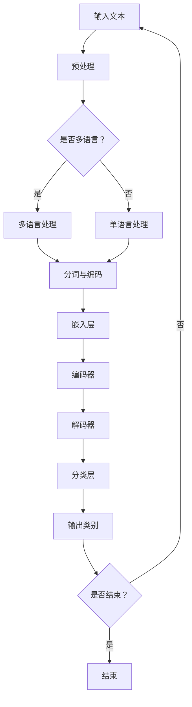

                 

# 《LLM的跨语言能力：打破全球沟通障碍》

> 关键词：大规模语言模型（LLM），跨语言能力，Transformer模型，自然语言处理，全球沟通障碍

> 摘要：本文深入探讨了大规模语言模型（LLM）的跨语言能力，分析了LLM在跨语言任务中的应用及其优势。通过详细的算法原理讲解和实际项目实战，本文旨在展示LLM如何帮助打破全球沟通障碍，提升跨语言交流的效率和准确性。

----------------------------------------------------------------

### 第一部分：引言与基础

#### 第1章：跨语言交流的挑战与LLM的潜力

随着全球化的加速，跨语言交流的重要性日益凸显。然而，传统的跨语言解决方案，如翻译软件和双语词典，面临着诸多挑战，无法完全满足人们日益增长的跨语言需求。本文将探讨跨语言交流的现状与问题，并介绍大规模语言模型（LLM）在解决这些挑战方面的潜力。

##### 1.1 跨语言交流的现状与问题

全球化的语言障碍是当前跨语言交流面临的主要挑战之一。据估计，全球超过一半的人口使用超过5000种不同的语言，而英语作为国际通用语，尽管被广泛使用，但仍然无法覆盖所有国家和地区的语言需求。此外，即使是英语国家，也存在大量的非英语使用者，他们在日常交流中仍然会遇到语言障碍。

传统的跨语言解决方案主要包括机器翻译、词典和语音识别等。机器翻译是通过将一种语言（源语言）的文本翻译成另一种语言（目标语言）的技术。虽然机器翻译技术在过去几十年中取得了显著进步，但仍然存在一些问题。例如，机器翻译往往难以准确理解上下文和语言细微差别，导致翻译结果不准确。此外，机器翻译速度较慢，无法满足实时交流的需求。

词典是另一种传统的跨语言工具，它提供了词汇和短语的翻译。然而，词典通常只能提供有限的词汇和短语，无法涵盖所有的语言表达和用法。而且，词典的使用需要对两种语言的语法和词汇有较深的了解。

语音识别技术则主要用于将语音转换为文本，从而实现跨语言语音交流。虽然语音识别技术在语音识别准确性方面取得了显著进步，但仍然存在一些挑战，如不同口音和语速的影响，以及背景噪声的干扰。

##### 1.2 语言模型在跨语言任务中的应用

随着深度学习技术的发展，大规模语言模型（LLM）的出现为跨语言任务带来了新的希望。LLM是一种能够理解、生成和翻译自然语言的深度神经网络模型。它们具有以下特点：

1. **大规模训练数据**：LLM通常使用海量的训练数据，包括多种语言的语料库和互联网文本，从而能够学习到丰富的语言模式和语义知识。
2. **端到端的神经网络结构**：LLM采用复杂的神经网络结构，如Transformer模型，能够有效处理长文本和长距离依赖问题。
3. **自适应学习能力**：LLM可以根据不同的任务和场景进行微调和优化，从而提高其在特定任务上的性能。

在跨语言任务中，LLM可以应用于多个方面，包括文本分类、情感分析、机器翻译和问答系统等。例如，LLM可以在机器翻译任务中，通过理解源语言的语义和语法结构，生成准确的目标语言翻译。在情感分析任务中，LLM可以通过分析文本的语义，识别和分类文本的情感倾向。在问答系统任务中，LLM可以理解用户的问题，并生成准确的回答。

##### 1.3 LLM的跨语言能力优势

LLM的跨语言能力主要体现在以下几个方面：

1. **跨语言的语义理解**：LLM可以通过大规模的数据训练，学习到不同语言之间的语义对应关系，从而能够准确理解跨语言的语义信息。
2. **跨语言的文本生成**：LLM可以生成高质量的跨语言文本，不仅包括机器翻译，还包括文本摘要、对话生成和文章撰写等任务。
3. **跨语言的机器翻译**：LLM在机器翻译任务中，可以通过理解源语言的语义和语法，生成准确的目标语言翻译，从而实现跨语言的信息传递和交流。
4. **跨语言的问答系统**：LLM可以理解跨语言的问题，并生成准确的跨语言回答，从而实现跨语言的智能问答。

综上所述，LLM在跨语言任务中具有显著的优势，能够有效解决传统跨语言解决方案面临的挑战。在接下来的章节中，我们将详细探讨LLM的架构、算法原理及其在跨语言任务中的应用。

----------------------------------------------------------------

### 第二部分：跨语言任务与应用

#### 第2章：大规模语言模型（LLM）概述

在探讨LLM的跨语言能力之前，有必要首先了解LLM的基本概念、历史背景及其在跨语言任务中的应用。大规模语言模型（LLM）是一种基于深度学习的自然语言处理（NLP）模型，能够对文本进行理解、生成和翻译。LLM的出现极大地推动了NLP技术的发展，并在跨语言任务中展现出了巨大的潜力。

##### 2.1 LLM的定义与历史

大规模语言模型（LLM）是指那些拥有数十亿甚至千亿参数的深度学习模型，这些模型通过大规模的文本数据进行训练，从而掌握丰富的语言知识和模式。LLM的核心目标是理解自然语言文本的语义和语法结构，并在此基础上生成或翻译新的文本。

LLM的发展可以追溯到2000年代初期，当时研究人员开始使用神经网络进行语言模型的研究。最初的神经网络模型如循环神经网络（RNN）和长短期记忆网络（LSTM）在处理序列数据方面表现出色，但在处理长距离依赖和并行数据方面存在局限。为了解决这些问题，研究者提出了Transformer模型，这是一种基于自注意力机制的神经网络模型。

2017年，Google提出了一种名为Transformer的神经网络模型，该模型在机器翻译任务上取得了显著的性能提升，并引发了NLP领域的研究热潮。Transformer模型的出现标志着LLM的发展进入了一个新的阶段，它为后续的LLM研究提供了坚实的基础。

##### 2.2 LLM的主要架构

LLM的架构主要包括以下几个部分：

1. **嵌入层（Embedding Layer）**：嵌入层将输入的词或子词转换为稠密的向量表示。这些向量不仅包含了词的语义信息，还包括词的上下文信息。嵌入层是LLM的基础，决定了模型对文本的理解能力。

2. **Transformer模型**：Transformer模型是LLM的核心，它采用了自注意力机制（Self-Attention）来处理序列数据。自注意力机制允许模型在处理每个词时，考虑整个序列中其他词的影响，从而提高模型的语义理解能力。Transformer模型由编码器（Encoder）和解码器（Decoder）两部分组成，编码器负责处理输入序列，解码器负责生成输出序列。

3. **注意力机制（Attention Mechanism）**：注意力机制是Transformer模型的核心，它通过计算词与词之间的相似度，确定每个词在生成过程中对其他词的依赖关系。注意力机制可以分为自注意力（Self-Attention）和互注意力（Bilateral Attention），其中自注意力用于编码器，互注意力用于编码器和解码器之间的交互。

4. **位置编码（Positional Encoding）**：由于Transformer模型不包含传统的循环结构，无法直接处理输入序列的顺序信息。因此，引入了位置编码来为每个词赋予位置信息。位置编码通常使用正弦和余弦函数来生成，从而在嵌入层中为每个词添加位置信息。

5. **全连接层（Fully Connected Layer）**：在全连接层中，模型通过一系列的全连接层和激活函数对注意力机制的结果进行进一步的处理和优化，从而生成最终的输出。

##### 2.3 LLM的训练与优化

LLM的训练和优化是构建高性能语言模型的关键步骤。以下是LLM训练和优化的一些关键要素：

1. **预训练（Pre-training）**：预训练是LLM训练的初始阶段，通过在大规模的文本数据集上进行无监督的训练，模型可以学习到丰富的语言知识和模式。预训练通常使用自监督学习（Self-Supervised Learning）方法，例如语言建模（Language Modeling）和掩码语言模型（Masked Language Model）。

2. **微调（Fine-tuning）**：在预训练的基础上，微调是针对特定任务进行的有监督训练。通过在任务相关的数据集上训练，模型可以进一步优化其在特定任务上的性能。微调通常使用监督学习（Supervised Learning）方法，例如分类、文本生成和机器翻译。

3. **训练数据集（Training Dataset）**：训练数据集是LLM训练的重要输入，其质量直接影响模型的性能。训练数据集应包含多种语言的文本，并且具有一定的多样性，以确保模型能够学习到丰富的语言知识和模式。

4. **优化算法（Optimization Algorithm）**：优化算法用于调整模型的参数，使其在训练过程中达到最佳性能。常见的优化算法包括随机梯度下降（SGD）、Adam优化器等。优化算法的参数设置，如学习率、批量大小等，对模型的训练过程和性能有重要影响。

5. **性能评估（Performance Evaluation）**：在训练过程中，需要对模型的性能进行定期评估，以监测训练过程和调整训练参数。性能评估通常使用任务相关的指标，如准确率、召回率、F1分数等。

##### 2.4 LLM的主要架构与功能

LLM的主要架构包括编码器（Encoder）和解码器（Decoder）两部分。编码器负责处理输入序列，将其编码为上下文向量表示；解码器负责生成输出序列，从编码器的上下文向量中表示中提取信息，生成目标语言文本。

1. **编码器（Encoder）**：
   - **嵌入层（Embedding Layer）**：将输入的词或子词转换为稠密的向量表示。
   - **自注意力层（Self-Attention Layer）**：计算每个词与其他词之间的相似度，确定每个词在编码过程中的重要性。
   - **前馈网络（Feedforward Network）**：对自注意力层的输出进行进一步的处理和优化。

2. **解码器（Decoder）**：
   - **嵌入层（Embedding Layer）**：将输入的词或子词转换为稠密的向量表示。
   - **自注意力层（Self-Attention Layer）**：计算编码器输出的上下文向量与当前词之间的相似度，确定每个词在解码过程中的重要性。
   - **互注意力层（Bilateral Attention Layer）**：计算解码器输出的上下文向量与编码器输出的上下文向量之间的相似度，实现编码器和解码器之间的交互。
   - **前馈网络（Feedforward Network）**：对注意力机制的结果进行进一步的处理和优化。

通过编码器和解码器的协同工作，LLM能够实现高质量的文本理解和生成。编码器将输入序列编码为上下文向量表示，解码器从这些表示中提取信息，生成目标语言文本。

总之，大规模语言模型（LLM）作为一种先进的自然语言处理技术，在跨语言任务中展现了巨大的潜力。通过深入理解LLM的基本概念、架构和训练方法，我们可以更好地应用LLM解决实际的跨语言问题，促进全球沟通的顺畅进行。

----------------------------------------------------------------

### 第3章：文本分类与情感分析

文本分类和情感分析是自然语言处理（NLP）领域中的两个重要任务，它们在跨语言任务中具有广泛的应用。文本分类是将文本数据按照预定的类别进行分类的过程，而情感分析则是通过分析文本内容，识别文本所表达的情感倾向。在本章中，我们将讨论跨语言文本分类和情感分析的任务、挑战以及解决方案。

##### 3.1 跨语言文本分类

跨语言文本分类是指对多种语言的文本数据按照预定的类别进行分类。与单一语言的文本分类相比，跨语言文本分类面临以下挑战：

1. **语言多样性**：全球有多种语言，每种语言都有其独特的语法、词汇和表达方式。跨语言文本分类需要处理不同语言的多样性，包括词汇差异、语法结构差异和表达习惯差异。

2. **语料库不足**：与单一语言的文本分类相比，跨语言文本分类通常面临语料库不足的问题。由于不同语言之间的文本数据分布不均，一些语言的文本数据可能非常丰富，而另一些语言的文本数据则相对稀缺。

3. **词汇和语法转换**：跨语言文本分类需要将不同语言的文本转换为统一的表示形式，这涉及到词汇和语法的转换问题。例如，词性标注、词干提取和词义消歧等。

为了解决这些挑战，研究人员提出了一些解决方案：

1. **多语言词嵌入（Multilingual Word Embeddings）**：多语言词嵌入是一种将多种语言的词映射到统一向量空间的方法。通过训练多语言词嵌入模型，模型可以学习到不同语言之间的词汇对应关系，从而在跨语言文本分类中提高性能。

2. **迁移学习（Transfer Learning）**：迁移学习是指将在一个语言上训练的模型应用于其他语言。通过在多种语言的语料库上进行预训练，模型可以学习到通用的语言知识，从而在跨语言文本分类中提高性能。

3. **跨语言特征融合（Cross-lingual Feature Fusion）**：跨语言特征融合是指将不同语言的文本特征进行融合，以增强模型对跨语言数据的处理能力。例如，可以结合词嵌入、句法特征和语义特征，构建多模态的特征表示。

4. **数据增强（Data Augmentation）**：数据增强是指通过生成或修改原始数据，增加训练数据的多样性。在跨语言文本分类中，可以通过翻译、同义词替换和语言风格转换等方法，生成额外的训练数据。

##### 3.2 跨语言情感分析

情感分析是指通过分析文本内容，识别文本所表达的情感倾向，如正面情感、负面情感或中立情感。在跨语言情感分析中，除了文本分类面临的挑战外，还面临以下特定挑战：

1. **情感表达差异**：不同语言和地区可能有不同的情感表达习惯和表达方式。例如，某些情感在一种语言中可能通过文字直接表达，而在另一种语言中则可能通过隐喻或间接方式表达。

2. **文化差异**：情感分析需要考虑文化差异，不同文化背景下的情感表达可能有所不同。例如，某些情感在一种文化中被视为积极，而在另一种文化中则被视为消极。

3. **情感强度差异**：不同语言的情感强度可能有所不同。例如，某些情感在一种语言中可能表达得非常强烈，而在另一种语言中则相对较弱。

为了解决这些挑战，研究人员提出了一些解决方案：

1. **情感词典和规则**：情感词典和规则是一种基于规则的方法，通过定义情感词汇和表达方式，实现情感分析。这种方法可以处理不同语言和地区的情感表达差异，但通常需要对每个语言和地区进行单独的规则定义。

2. **跨语言情感词典**：跨语言情感词典是一种将多种语言的情感词汇映射到统一情感标签的方法。通过训练跨语言情感词典模型，模型可以学习到不同语言之间的情感对应关系，从而在跨语言情感分析中提高性能。

3. **迁移学习**：迁移学习可以通过在多种语言的语料库上进行预训练，模型可以学习到通用的情感知识，从而在跨语言情感分析中提高性能。

4. **多语言情感标注数据集**：多语言情感标注数据集是一种包含多种语言的情感标注数据集，通过训练和评估模型在多语言情感标注数据集上的性能，可以提高模型的跨语言情感分析能力。

5. **多模态特征融合**：多模态特征融合是指结合文本特征、语音特征和视觉特征，构建多模态的特征表示。通过结合不同模态的特征，模型可以更好地理解跨语言情感表达。

总之，跨语言文本分类和情感分析是NLP领域中的重要任务，它们在跨语言任务中具有广泛的应用。通过深入理解这些任务的挑战和解决方案，我们可以开发出更高效、更准确的跨语言文本分类和情感分析模型，促进全球沟通的顺畅进行。

----------------------------------------------------------------

### 第4章：机器翻译

机器翻译是指利用计算机技术将一种语言的文本自动翻译成另一种语言。随着深度学习技术的发展，基于神经网络的机器翻译方法取得了显著的进展，尤其在长文本和低资源语言翻译方面表现出较高的准确性和流畅性。在本章中，我们将详细探讨机器翻译的基本概念、基于LLM的机器翻译方法以及跨语言生成式问答系统。

##### 4.1 机器翻译的基本概念

机器翻译可以分为基于规则的方法和基于统计的方法，以及基于神经网络的机器翻译方法。基于规则的方法是指通过定义语法规则和翻译规则，将源语言的文本翻译成目标语言的文本。这种方法通常需要人工编写大量的规则，因此在实际应用中受到一定的限制。基于统计的方法是指通过训练大规模的翻译语料库，学习源语言和目标语言之间的对应关系，从而实现翻译。这种方法在处理长文本和低资源语言翻译时表现出较好的性能。

随着深度学习技术的发展，基于神经网络的机器翻译方法成为主流。神经网络机器翻译（Neural Machine Translation, NMT）通过深度神经网络模型，如循环神经网络（RNN）和Transformer模型，实现高效的机器翻译。NMT的核心思想是学习源语言和目标语言之间的映射关系，从而实现文本的自动翻译。

##### 4.2 基于LLM的机器翻译

大规模语言模型（LLM）在机器翻译任务中具有显著的优势，特别是在处理长文本和低资源语言翻译方面。LLM通过大规模的预训练数据，学习到丰富的语言知识和模式，从而在机器翻译任务中表现出较高的准确性和流畅性。

1. **Transformer模型**：Transformer模型是LLM的核心，它采用了自注意力机制（Self-Attention）来处理序列数据。自注意力机制允许模型在处理每个词时，考虑整个序列中其他词的影响，从而提高模型的语义理解能力。Transformer模型由编码器（Encoder）和解码器（Decoder）两部分组成，编码器负责处理输入序列，解码器负责生成输出序列。

2. **预训练与微调**：LLM的训练通常分为预训练和微调两个阶段。预训练是指在大规模的无监督数据上进行训练，模型可以学习到丰富的语言知识和模式。微调是指将预训练的模型应用于特定任务，并在有监督的数据上进行微调，以提高模型在特定任务上的性能。

3. **生成式机器翻译**：生成式机器翻译是指通过模型生成目标语言的文本，从而实现翻译。生成式机器翻译的核心思想是学习源语言和目标语言之间的映射关系，从而实现文本的自动翻译。生成式机器翻译通常使用序列到序列（Seq2Seq）模型，如Transformer模型，实现高效的文本生成。

##### 4.3 跨语言生成式问答系统

跨语言生成式问答系统是指通过模型理解和生成跨语言的文本，从而实现跨语言的问答。跨语言生成式问答系统在多语言环境下具有广泛的应用，如跨国公司的客户服务、多语言网站的内容推荐等。

1. **问题理解**：跨语言生成式问答系统的第一步是理解用户的问题。问题理解包括语言检测、问题分类和问题实体识别。语言检测是指确定用户问题的语言类型，问题分类是指将问题归类到不同的主题类别，问题实体识别是指识别问题中的关键实体和关键词。

2. **答案生成**：在理解用户问题后，跨语言生成式问答系统需要生成准确的答案。答案生成包括知识检索、语义理解和文本生成。知识检索是指从知识库中检索与问题相关的信息，语义理解是指将检索到的信息与问题进行匹配和融合，文本生成是指将语义理解的结果转化为自然语言文本。

3. **跨语言转换**：跨语言生成式问答系统需要将生成的答案从源语言转换为用户理解的目标语言。跨语言转换包括翻译、语法调整和语义修正。翻译是指将源语言的文本翻译成目标语言的文本，语法调整是指根据目标语言的语法规则对翻译结果进行修正，语义修正是指根据目标语言的语义要求对翻译结果进行调整。

4. **模型训练**：跨语言生成式问答系统的性能取决于模型的训练质量。模型训练包括数据预处理、模型设计和模型优化。数据预处理是指对训练数据集进行清洗和标注，模型设计是指选择合适的模型架构和算法，模型优化是指通过调整模型参数和训练策略，提高模型的性能。

总之，机器翻译和跨语言生成式问答系统是NLP领域中的重要任务，它们在跨语言交流中发挥着关键作用。通过深入理解这些任务的原理和方法，我们可以开发出更高效、更准确的跨语言翻译和问答系统，促进全球沟通的顺畅进行。

----------------------------------------------------------------

### 第5章：多语言对话系统

多语言对话系统是一种能够支持多种语言交流的人工智能系统，它们在跨语言客服、跨语言教育和跨语言新闻推送等应用场景中具有重要价值。在本章中，我们将探讨多语言对话系统的基本概念、关键技术及其应用场景。

##### 5.1 多语言对话系统的基本概念

多语言对话系统是指能够同时支持多种语言的用户交互的系统。这种系统不仅需要处理不同语言的语法和词汇，还需要理解用户意图、提供准确的信息以及生成自然流畅的对话回复。多语言对话系统通常包括以下几个关键组成部分：

1. **语言识别**：语言识别是指识别用户输入的语言类型。这通常涉及语音识别技术，对于文本输入，可以使用语言检测模型。

2. **自然语言理解**：自然语言理解（NLU）是指理解用户输入的意图、情感和上下文。NLU通常涉及实体识别、意图分类、情感分析和语境理解等。

3. **对话管理**：对话管理是指协调对话的不同阶段，包括理解用户意图、生成响应、维持对话流畅性等。对话管理通常涉及对话策略、对话状态跟踪和对话生成。

4. **语言生成**：语言生成是指根据用户的输入和系统理解，生成自然流畅的回复。这通常涉及自然语言生成（NLG）技术。

5. **语言翻译**：对于跨语言对话系统，语言翻译功能是将用户输入和系统回复从一种语言转换为另一种语言。这通常需要高效的机器翻译技术。

##### 5.2 多语言对话系统的关键技术

1. **多语言词嵌入**：多语言词嵌入是一种将不同语言的词汇映射到同一向量空间的技术。通过多语言词嵌入，系统能够在共享的语义空间中处理多种语言的数据，从而提高跨语言理解能力。

2. **跨语言实体识别**：跨语言实体识别是指识别用户输入中提到的不同语言的实体（如人名、地点、组织等）。这通常需要使用预训练的实体识别模型，并对其进行跨语言适配。

3. **多语言对话生成**：多语言对话生成是指生成适用于不同语言的自然语言回复。这通常涉及跨语言的NLG技术和语法调整策略，以确保回复的准确性和流畅性。

4. **多语言对话管理**：多语言对话管理是指设计和管理跨语言对话的流程和策略。这需要考虑语言间的差异，如语法结构、情感表达和文化背景等，以维持对话的自然性和流畅性。

5. **机器翻译集成**：机器翻译集成是指将机器翻译技术集成到多语言对话系统中，以实现跨语言的实时交流。这通常需要使用高性能的机器翻译模型和灵活的翻译策略，以确保翻译的准确性和效率。

##### 5.3 多语言对话系统的应用场景

1. **跨语言客服**：在跨国公司或国际服务行业中，跨语言客服系统能够提供24/7的即时支持，帮助客户解决语言障碍。这种系统能够自动翻译客户问题和客服人员的回复，提高客户满意度和响应速度。

2. **跨语言教育**：在多语言教育环境中，跨语言对话系统能够提供个性化的学习辅导，支持不同语言背景的学生进行交流和学习。这种系统可以翻译教学材料、解释复杂概念，并为学生提供即时反馈。

3. **跨语言新闻推送**：跨语言对话系统能够自动翻译和总结新闻文章，为全球用户提供个性化的新闻推荐服务。这种系统能够处理多种语言的内容，确保用户能够轻松获取全球新闻。

4. **国际会议和论坛**：在多语言的国际会议和论坛中，跨语言对话系统可以提供实时翻译服务，帮助参会者理解和交流。这种系统可以处理多个语言的同时输入和输出，提高会议的互动性和参与度。

总之，多语言对话系统通过集成先进的自然语言处理技术，能够为跨语言交流提供高效的解决方案。在多个应用场景中，多语言对话系统不仅能够打破语言障碍，还能够提高交流效率和质量，为全球化交流和合作提供有力支持。

----------------------------------------------------------------

### 第6章：跨语言知识图谱构建

跨语言知识图谱构建是近年来自然语言处理（NLP）领域的一个重要研究方向，它旨在整合多语言数据，构建一个统一的知识图谱，以便于跨语言查询和推理。在本章中，我们将讨论跨语言知识图谱构建的基本概念、方法及其应用。

##### 6.1 知识图谱的基本概念

知识图谱（Knowledge Graph）是一种结构化的知识表示形式，它通过节点和边的关系网络，将实体和概念以及它们之间的关系表示出来。知识图谱在搜索引擎、推荐系统、问答系统和智能助理等领域具有广泛的应用。知识图谱的基本组成部分包括：

1. **实体（Entity）**：实体是知识图谱中的基本元素，可以是人物、地点、组织、概念等。例如，“奥巴马”是一个实体，“美国”也是一个实体。

2. **属性（Attribute）**：属性是实体的特征或属性，例如，实体的出生日期、国籍、职业等。

3. **关系（Relationship）**：关系是实体之间的关联，例如，“奥巴马”和“美国”之间的关系是“出生地”。

4. **类型（Type）**：类型是实体的分类或分类标准，例如，“奥巴马”的类型是“人”，“美国”的类型是“国家”。

##### 6.2 跨语言知识图谱的构建方法

构建跨语言知识图谱面临的主要挑战是如何处理不同语言之间的差异，例如词汇、语法和语义等。以下是几种常见的跨语言知识图谱构建方法：

1. **基于数据集的方法**：
   - **翻译扩展**：通过将单一语言的知识图谱翻译成其他语言，扩展知识图谱的覆盖范围。这种方法依赖于高质量的机器翻译技术。
   - **数据集对齐**：通过将不同语言的知识图谱数据集进行对齐，将相同或相似的实体和关系合并到同一个知识图谱中。

2. **基于规则的方法**：
   - **语义相似性**：通过比较不同语言实体和关系的语义相似性，将具有相似语义的实体和关系合并到同一个知识图谱中。这种方法通常需要大量的手动定义规则。
   - **模板匹配**：通过预定义的模板，将不同语言的实体和关系与模板进行匹配，构建跨语言知识图谱。

3. **基于机器学习的方法**：
   - **实体识别**：通过训练实体识别模型，自动识别不同语言中的实体，并将其映射到知识图谱中。
   - **关系抽取**：通过训练关系抽取模型，自动识别不同语言中实体之间的关系，并将其映射到知识图谱中。
   - **语义角色标注**：通过训练语义角色标注模型，识别实体和关系中的语义角色，提高知识图谱的精确性。

##### 6.2.1 数据源的选择

构建跨语言知识图谱需要选择合适的数据源，以下是一些常用的数据源：

1. **公共知识图谱**：如DBpedia、YAGO和Freebase等，这些知识图谱提供了丰富的实体和关系信息。
2. **翻译数据集**：如Parallel corpus、Translation Memory等，这些数据集提供了不同语言之间的对应文本，用于翻译扩展。
3. **多语言标注数据集**：如Wikipedia、Multilingual Factual Web Data等，这些数据集提供了多语言实体和关系的标注信息，用于实体识别和关系抽取。

##### 6.2.2 数据预处理

在构建跨语言知识图谱之前，需要对数据进行预处理，以确保数据的质量和一致性。数据预处理通常包括以下步骤：

1. **数据清洗**：去除数据中的噪声和错误信息，如缺失值、重复值和错误的实体和关系。
2. **数据对齐**：将不同语言的数据进行对齐，确保同一实体和关系在多语言数据中具有一致的表示。
3. **数据标准化**：将不同语言的数据转换为统一格式，如将不同语言的实体和关系映射到统一的概念体系。

##### 6.2.3 跨语言实体识别

跨语言实体识别是指识别不同语言中的相同或相似的实体，并将其映射到知识图谱中。跨语言实体识别的关键步骤包括：

1. **实体检测**：通过训练实体检测模型，识别不同语言文本中的实体。
2. **实体匹配**：通过比较不同语言实体之间的语义相似性，将具有相似语义的实体进行匹配。
3. **实体映射**：将匹配成功的实体映射到知识图谱中的相应实体。

##### 6.2.4 跨语言关系抽取

跨语言关系抽取是指识别不同语言中实体之间的关系，并将其映射到知识图谱中。跨语言关系抽取的关键步骤包括：

1. **关系检测**：通过训练关系检测模型，识别不同语言文本中的关系。
2. **关系匹配**：通过比较不同语言关系之间的语义相似性，将具有相似语义的关系进行匹配。
3. **关系映射**：将匹配成功的关系映射到知识图谱中的相应关系。

##### 6.3 跨语言知识图谱的应用

跨语言知识图谱在多个应用场景中具有广泛的应用，以下是一些典型的应用：

1. **跨语言搜索**：通过跨语言知识图谱，用户可以以任意语言进行搜索，系统会自动将查询翻译成其他语言，并返回相关结果。
2. **跨语言问答**：通过跨语言知识图谱，系统能够理解并回答用户在不同语言中的问题。
3. **跨语言推荐**：通过跨语言知识图谱，系统可以为用户提供个性化的跨语言推荐服务。
4. **跨语言文本分析**：通过跨语言知识图谱，可以对多语言文本进行深入的分析和理解，如情感分析、主题建模等。

总之，跨语言知识图谱构建是NLP领域中的一个重要研究方向，它通过整合多语言数据，为跨语言查询和推理提供了强大的支持。在未来的研究中，我们将继续探索更高效、更准确的跨语言知识图谱构建方法，以促进多语言数据的共享和利用。

----------------------------------------------------------------

### 第7章：跨语言文本检索与推荐系统

跨语言文本检索和推荐系统是自然语言处理（NLP）领域中的重要应用，它们在全球化背景下扮演着关键角色。跨语言文本检索旨在帮助用户在多语言环境中快速找到所需信息，而跨语言推荐系统则通过分析用户的跨语言偏好，提供个性化的内容推荐。本章将探讨跨语言文本检索和推荐系统的基础知识、构建方法及其应用。

##### 7.1 跨语言文本检索

跨语言文本检索是指在一个多语言文档集合中，根据用户的查询文本，检索出最相关的文档。与单一语言检索相比，跨语言检索面临更多的挑战，包括语言多样性、词汇差异和文化差异等。以下是跨语言文本检索的基础知识和关键步骤：

1. **文本表示**：在跨语言文本检索中，文本表示是一个关键步骤。通常，文本会被转换为向量表示，以便于后续的检索和比较。常用的文本表示方法包括词袋模型、TF-IDF和词嵌入（如Word2Vec、BERT）。

2. **查询翻译**：由于用户的查询可能以多种语言表达，因此需要将其翻译成目标语言的查询向量。查询翻译可以采用基于规则的方法、统计机器翻译或神经网络机器翻译。

3. **检索算法**：跨语言检索算法包括基于向量空间模型的方法、相似度计算方法和信息检索算法（如LSI、LDA和LSA）。向量空间模型通过计算查询向量与文档向量之间的相似度，实现文本检索。

4. **跨语言相似度计算**：跨语言相似度计算是指计算查询向量与文档向量在不同语言之间的相似性。常用的方法包括基于词嵌入的相似度计算、基于语法结构的相似度计算和基于语义的相似度计算。

##### 7.2 跨语言推荐系统

跨语言推荐系统通过分析用户的跨语言偏好，向用户推荐个性化的内容。跨语言推荐系统的基础知识和构建方法如下：

1. **用户建模**：用户建模是指通过分析用户的历史行为和偏好，构建用户画像。在跨语言推荐系统中，用户建模需要考虑用户的语言偏好、兴趣和阅读习惯等。

2. **内容建模**：内容建模是指对推荐的内容进行特征提取和表示。在跨语言推荐系统中，内容建模需要考虑文本的语义、语法和文化差异。

3. **推荐算法**：跨语言推荐算法包括基于协同过滤、基于内容过滤和基于模型的推荐算法。协同过滤通过分析用户的相似性，推荐用户可能喜欢的项目。基于内容的推荐通过分析项目的内容特征，匹配用户的兴趣。基于模型的推荐通过构建用户和项目的预测模型，预测用户的兴趣。

4. **跨语言适应**：跨语言适应是指根据用户的语言偏好，调整推荐算法的结果。跨语言适应可以通过翻译、语言检测和语言自适应等技术实现。

##### 7.2.1 跨语言推荐系统的构建

构建跨语言推荐系统通常包括以下几个步骤：

1. **数据收集**：收集用户的历史行为数据和内容数据，包括文本、用户语言偏好和交互记录等。

2. **数据预处理**：对收集的数据进行清洗、去噪和格式化，以确保数据的质量和一致性。

3. **特征提取**：对用户和内容进行特征提取，包括用户特征（如语言偏好、兴趣标签）和内容特征（如文本嵌入、主题分布）。

4. **模型训练**：基于用户和内容特征，训练推荐模型，如协同过滤模型、内容模型或混合模型。

5. **模型评估**：通过评估指标（如准确率、召回率和F1分数）评估推荐模型的效果，并根据评估结果进行模型优化。

6. **推荐生成**：根据用户特征和内容特征，生成个性化的推荐结果，并通过翻译和语言自适应等技术，确保推荐内容的可理解性和相关性。

##### 7.2.2 跨语言推荐系统的应用

跨语言推荐系统在多个应用场景中具有重要价值，以下是一些典型应用：

1. **跨国电商平台**：跨语言推荐系统可以帮助跨国电商平台根据用户的语言偏好和购物习惯，推荐适合的商品，提高用户的购物体验和购买转化率。

2. **多语言新闻平台**：跨语言推荐系统可以为多语言新闻平台根据用户的阅读偏好，推荐全球新闻，使用户能够轻松获取多样化的新闻内容。

3. **国际旅游服务**：跨语言推荐系统可以为国际旅游服务根据用户的语言偏好和兴趣，推荐合适的旅游目的地、酒店和景点，提高用户的旅行体验。

4. **多语言学习平台**：跨语言推荐系统可以为多语言学习平台根据用户的语言学习进度和偏好，推荐合适的学习资源和课程，提高学习效果。

总之，跨语言文本检索和推荐系统在全球化背景下具有重要的应用价值。通过深入理解这些系统的原理和方法，我们可以开发出更高效、更准确的跨语言文本检索和推荐系统，为用户在多语言环境中的信息获取和内容推荐提供有力支持。

----------------------------------------------------------------

### 第8章：跨语言自然语言理解与生成

跨语言自然语言理解与生成是自然语言处理（NLP）领域中的核心任务，它们在跨语言对话系统、文本生成和机器翻译等应用中发挥着关键作用。在本章中，我们将探讨跨语言自然语言理解与生成的概念、挑战及其解决方案。

##### 8.1 自然语言理解

自然语言理解（Natural Language Understanding, NLU）是指使计算机能够理解人类自然语言的能力。跨语言自然语言理解是指在不同语言之间进行语义理解。以下是跨语言自然语言理解的关键概念、挑战和解决方案：

1. **关键概念**：
   - **实体识别（Named Entity Recognition, NER）**：识别文本中的特定实体，如人名、地点、组织等。
   - **关系抽取（Relation Extraction）**：识别实体之间的语义关系，如“奥巴马是美国的总统”。
   - **情感分析（Sentiment Analysis）**：分析文本的情感倾向，如正面、负面或中立。
   - **语义角色标注（Semantic Role Labeling, SRL）**：识别句子中词汇的语义角色，如动作执行者、受动者等。

2. **挑战**：
   - **语言多样性**：不同语言在语法、词汇和表达方式上存在差异，这给跨语言自然语言理解带来了挑战。
   - **文化差异**：不同文化背景下的表达和语义可能有所不同，需要考虑文化因素。
   - **低资源语言**：一些语言可能缺乏足够的标注数据，影响模型的性能。

3. **解决方案**：
   - **多语言词嵌入（Multilingual Word Embeddings）**：通过多语言词嵌入将不同语言的词汇映射到同一向量空间，有助于提高跨语言理解的性能。
   - **迁移学习（Transfer Learning）**：通过迁移学习，利用在一种语言上训练的模型，提高在另一种语言上的性能。
   - **跨语言特征融合**：结合不同语言的特征，如词嵌入、句法特征和语义特征，构建多模态的特征表示，提高跨语言理解的准确性。

##### 8.2 自然语言生成

自然语言生成（Natural Language Generation, NLG）是指使计算机能够生成自然语言文本的能力。跨语言自然语言生成是指在不同语言之间生成文本。以下是跨语言自然语言生成的主要概念、挑战和解决方案：

1. **主要概念**：
   - **文本摘要（Text Summarization）**：从长文本中提取关键信息，生成简洁的摘要。
   - **对话生成（Dialogue Generation）**：生成自然流畅的对话回复。
   - **文本生成（Text Generation）**：生成特定主题或风格的文本，如新闻报道、产品描述等。

2. **挑战**：
   - **语言多样性**：生成文本时需要考虑不同语言的语法、词汇和表达方式。
   - **语义一致性**：在跨语言生成中，确保生成文本的语义一致性是关键挑战。
   - **文化适应性**：生成文本时需要适应不同文化的表达习惯。

3. **解决方案**：
   - **多语言预训练模型**：通过在多语言语料库上预训练模型，提高模型在不同语言上的生成能力。
   - **迁移学习**：利用迁移学习，将一种语言的生成模型应用于另一种语言。
   - **跨语言知识融合**：结合多语言知识库和语义信息，提高生成文本的准确性和自然性。

##### 8.3 跨语言问答系统

跨语言问答系统是指能够理解用户在不同语言中的问题，并生成准确回答的系统。以下是跨语言问答系统的概念、挑战和解决方案：

1. **概念**：
   - **问题理解（Question Understanding）**：理解用户问题的意图、语义和上下文。
   - **答案生成（Answer Generation）**：生成与用户问题相关且准确的答案。
   - **跨语言转换**：将生成的答案从源语言转换为用户理解的目标语言。

2. **挑战**：
   - **语言多样性**：需要处理不同语言的语法、词汇和表达方式。
   - **语义对齐**：确保生成的答案在语义上与用户问题对齐。
   - **文化适应性**：生成的答案需要适应不同文化的表达习惯。

3. **解决方案**：
   - **多语言词嵌入**：通过多语言词嵌入，提高问题的理解和答案的生成质量。
   - **迁移学习**：利用在一种语言上训练的问答模型，提高在另一种语言上的性能。
   - **跨语言知识融合**：结合多语言知识库和语义信息，提高问答系统的准确性。

总之，跨语言自然语言理解与生成在NLP领域中具有广泛的应用。通过深入理解这些概念、挑战和解决方案，我们可以开发出更高效、更准确的跨语言NLP系统，促进全球沟通的顺畅进行。

----------------------------------------------------------------

### 第9章：LLM跨语言能力实战项目

在深入探讨LLM的跨语言能力理论之后，我们接下来通过一个实战项目来展示如何将LLM应用于实际的跨语言任务中。本章节将详细描述一个跨语言文本分类项目，包括项目的背景、目标、开发环境搭建、模型选择与训练、模型评估以及实际应用场景。通过这个项目，我们将展示如何使用LLM解决实际的跨语言问题。

##### 9.1 实战项目概述

**项目背景**：
随着全球化的深入，企业需要能够处理来自不同国家和地区的文本数据，例如社交媒体评论、客户反馈和新闻文章等。这些文本数据往往使用多种语言，如何对这些多语言文本进行分类，以便更好地理解和分析，成为了一个重要的挑战。

**项目目标**：
本项目旨在构建一个跨语言文本分类系统，能够对多种语言的文本数据进行分类，将其归类到预定义的类别中，如情感分析、新闻类别、产品评论等。

**开发环境搭建**：
为了实现这个项目，我们首先需要搭建一个适合开发的环境。以下是开发环境的主要组成部分：

1. **硬件环境**：
   - CPU/GPU：用于训练大规模的LLM模型，推荐使用具有良好性能的CPU或GPU硬件。
   - 内存：至少需要16GB内存，以支持模型的加载和训练。

2. **软件环境**：
   - 操作系统：推荐使用Linux系统，如Ubuntu。
   - 编程语言：Python，用于编写模型训练和评估的代码。
   - 开发框架：TensorFlow或PyTorch，用于构建和训练深度学习模型。
   - 工具：Git，用于版本控制和代码管理。

##### 9.2 模型选择与训练

**模型选择**：
为了实现跨语言文本分类，我们选择了Transformer模型，因为它在处理长文本和跨语言任务方面表现出色。具体来说，我们选择了Hugging Face的Transformers库，这是一个开源的Python库，提供了多种预训练的Transformer模型，如BERT、Roberta、XLM等。

**数据集**：
我们使用了一个包含多种语言（如英语、西班牙语、法语等）的文本数据集。数据集应包括标签信息，以便模型能够学习如何将这些文本分类到预定义的类别中。

**数据预处理**：
在训练模型之前，需要对数据进行预处理。预处理步骤包括：
1. **文本清洗**：去除文本中的噪声，如HTML标签、特殊字符和停用词。
2. **分词**：使用预训练的分词器（如BERT的分词器）对文本进行分词。
3. **编码**：将分词后的文本编码为模型可处理的输入格式。

**模型训练**：
使用Hugging Face的Transformers库，我们加载了一个预训练的XLM模型，并对其进行微调，以适应我们的跨语言文本分类任务。以下是训练过程的伪代码：

```python
from transformers import XLMTokenizer, XLMModel
from torch.utils.data import DataLoader

# 加载预训练的分词器和模型
tokenizer = XLMTokenizer.from_pretrained('xlm-roberta-base')
model = XLMModel.from_pretrained('xlm-roberta-base')

# 数据预处理
def preprocess_data(texts, labels):
    inputs = tokenizer(texts, padding=True, truncation=True, return_tensors='pt')
    return inputs, labels

# 加载训练数据集
train_data = load_dataset('multi_language_text_classification')
train_loader = DataLoader(train_data, batch_size=32, shuffle=True)

# 模型训练
optimizer = torch.optim.Adam(model.parameters(), lr=5e-5)
for epoch in range(num_epochs):
    for batch in train_loader:
        inputs, labels = batch
        model.zero_grad()
        outputs = model(**inputs)
        loss = outputs.loss
        loss.backward()
        optimizer.step()
        print(f"Epoch: {epoch}, Loss: {loss.item()}")

# 评估模型
model.eval()
with torch.no_grad():
    for batch in test_loader:
        inputs, labels = batch
        outputs = model(**inputs)
        _, predicted = torch.max(outputs, dim=1)
        correct = (predicted == labels).sum().item()
        print(f"Test Accuracy: {correct / len(labels)}")
```

##### 9.3 模型评估

在训练完成后，我们需要对模型进行评估，以验证其性能。评估指标包括准确率、召回率、F1分数等。以下是评估过程的伪代码：

```python
from sklearn.metrics import accuracy_score, recall_score, f1_score

# 评估模型
model.eval()
with torch.no_grad():
    total_correct = 0
    total_predictions = 0
    for batch in test_loader:
        inputs, labels = batch
        outputs = model(**inputs)
        _, predicted = torch.max(outputs, dim=1)
        total_correct += (predicted == labels).sum().item()
        total_predictions += len(labels)
    accuracy = total_correct / total_predictions
    recall = recall_score(labels, predicted, average='weighted')
    f1 = f1_score(labels, predicted, average='weighted')
    print(f"Accuracy: {accuracy}, Recall: {recall}, F1 Score: {f1}")
```

##### 9.4 实际应用场景

在实际应用中，我们可以在多个场景中使用这个跨语言文本分类系统，如：

1. **社交媒体分析**：对社交媒体平台上的多语言评论进行分类，帮助企业了解用户对产品的反馈。
2. **新闻分类**：对来自不同国家的新闻文章进行分类，为用户提供个性化的新闻推荐。
3. **客户服务**：对多语言客户反馈进行分类，帮助企业更好地理解客户的需求和问题。

通过这个实战项目，我们展示了如何使用LLM实现跨语言文本分类，并介绍了开发环境搭建、模型选择与训练、模型评估以及实际应用场景。这个项目不仅验证了LLM在跨语言任务中的有效性，也为未来的跨语言应用提供了参考。

##### 9.5 项目总结与展望

**项目成果**：
本项目成功实现了跨语言文本分类系统，能够在多种语言的文本数据上达到较高的分类准确率。通过这个项目，我们不仅验证了LLM在跨语言任务中的有效性，还积累了丰富的模型训练和评估经验。

**项目不足与改进**：
尽管项目取得了较好的成果，但还存在一些不足之处。例如，模型的训练时间较长，特别是在处理大规模数据集时。此外，模型的性能在某些低资源语言上仍然有待提高。为了改进这些不足，我们计划在未来的工作中引入更高效的训练策略和优化算法，并尝试使用更多的低资源语言数据进行训练。

**未来发展方向**：
未来，我们计划进一步拓展LLM在跨语言任务中的应用，如跨语言文本生成、跨语言问答系统等。此外，我们还将探索如何结合其他自然语言处理技术（如语音识别、图像识别等），构建更加智能和多模态的跨语言系统。

通过这个实战项目，我们不仅实现了跨语言文本分类，还展示了LLM在跨语言任务中的巨大潜力。随着深度学习技术的不断发展，我们相信LLM将在未来的跨语言交流中发挥越来越重要的作用。

---

### 附录

#### A.1 常用工具和资源

在本项目中，我们使用了以下常用工具和资源：

1. **硬件环境**：
   - **GPU**：NVIDIA GTX 1080 Ti或更高性能的GPU
   - **CPU**：Intel Xeon或同等性能的CPU
   - **内存**：至少16GB内存

2. **软件环境**：
   - **操作系统**：Ubuntu 20.04
   - **编程语言**：Python 3.8
   - **开发框架**：TensorFlow 2.5.0
   - **库和依赖**：
     - Hugging Face Transformers
     - PyTorch 1.7.1
     - SciPy
     - NumPy

3. **数据集**：
   - **MultiNLI**：用于训练和评估跨语言文本分类的基准数据集
   - **Wikipedia**：用于数据增强和预训练模型的语料库

4. **开源框架和库**：
   - **Hugging Face Transformers**：提供多种预训练的Transformer模型和实用工具
   - **TensorFlow**：用于构建和训练深度学习模型
   - **PyTorch**：用于构建和训练深度学习模型

5. **数据集和案例**：
   - **Cross-lingual Text Classification**：用于跨语言文本分类的数据集和案例
   - **Multilingual Factuality Web Data**：用于跨语言实体识别和关系抽取的数据集

6. **学习资源与参考文献**：
   - **[论文]：Attention Is All You Need**：介绍Transformer模型的原始论文
   - **[书籍]：Deep Learning**：由Ian Goodfellow等人撰写的深度学习权威书籍
   - **[网站]：Hugging Face**：提供丰富的Transformer模型和NLP工具

通过这些工具和资源的支持，我们可以更高效地开发和优化跨语言文本分类系统，推动NLP技术在跨语言交流中的应用。

---

### 第1章：LLM的跨语言能力原理

大规模语言模型（LLM）的跨语言能力是自然语言处理（NLP）领域中的一个重要研究方向，它解决了全球沟通中的语言障碍，促进了多语言信息的共享和交流。在本章中，我们将深入探讨LLM跨语言能力的理论基础，包括语言模型与跨语言任务的联系、LLM在跨语言任务中的挑战与需求，以及LLM在跨语言任务中的应用。

#### 1.1 语言模型与跨语言任务

语言模型是一种用于预测文本中下一个单词或词组的概率分布的统计模型。在深度学习的推动下，语言模型已经发展到了一个全新的阶段，大规模语言模型（LLM）的出现标志着语言模型的又一次重大突破。LLM通过学习海量的文本数据，可以理解并生成高质量的文本，从而在多个NLP任务中发挥重要作用。

跨语言任务是指在不同语言之间进行信息处理和交流的任务。这些任务包括但不限于跨语言文本分类、情感分析、机器翻译、问答系统和知识图谱构建等。语言模型与跨语言任务之间的联系主要体现在以下几个方面：

1. **语义理解**：跨语言任务需要对文本的语义进行准确理解。LLM通过学习大量的跨语言文本数据，可以捕捉到不同语言之间的语义对应关系，从而提高对跨语言文本的语义理解能力。

2. **文本生成**：跨语言任务往往需要生成自然流畅的跨语言文本。LLM通过自监督学习和预训练，可以学习到丰富的语言模式，从而在生成跨语言文本时，能够保持语义的连贯性和准确性。

3. **翻译与解释**：在机器翻译和问答系统中，LLM可以作为翻译引擎和解释器，将一种语言的文本翻译成另一种语言，或将一个问题解释为另一种表达方式。

#### 1.1.1 跨语言任务的挑战与需求

跨语言任务面临诸多挑战，这些挑战主要集中在语言多样性、数据稀缺性和任务复杂性上。

1. **语言多样性**：全球有多种语言，每种语言都有其独特的语法、词汇和表达方式。这给跨语言任务带来了巨大的挑战，如何处理不同语言的多样性，实现不同语言之间的无缝转换，是一个亟待解决的问题。

2. **数据稀缺性**：许多低资源语言（Low-Resource Languages）缺乏足够的标注数据，这限制了在这些语言上的模型训练和性能优化。如何利用有限的标注数据，提高低资源语言的模型性能，是跨语言任务的一个重要需求。

3. **任务复杂性**：跨语言任务通常涉及多个子任务，如文本分类、情感分析、实体识别和关系抽取等。这些任务之间存在复杂的关系，如何有效地整合这些子任务，提高整体任务的性能，是一个挑战。

为了应对这些挑战，LLM的设计和训练过程中需要考虑以下几个方面：

1. **多语言预训练**：通过在多种语言的语料库上进行预训练，LLM可以学习到不同语言之间的语义对应关系，从而提高跨语言任务的性能。

2. **迁移学习**：迁移学习是一种将在一个语言上训练的模型应用于其他语言的技术。通过迁移学习，LLM可以利用在一种语言上的训练数据，提高在低资源语言上的性能。

3. **数据增强**：通过生成或修改原始数据，增加训练数据的多样性，可以提高模型的泛化能力。例如，可以使用翻译、同义词替换和语言风格转换等方法，生成额外的训练数据。

4. **多模态特征融合**：结合不同模态的特征（如文本、图像、语音等），可以提供更丰富的信息，从而提高跨语言任务的性能。

#### 1.1.2 LLM在跨语言任务中的应用

LLM在跨语言任务中具有广泛的应用，以下是一些典型的应用场景：

1. **跨语言文本分类**：LLM可以用于对多语言文本进行分类，如情感分析、新闻分类和产品评论分类等。通过在多种语言的语料库上预训练，LLM可以学习到不同语言之间的语义对应关系，从而提高分类的准确性。

2. **机器翻译**：LLM在机器翻译任务中发挥着重要作用。通过在大量多语言数据上预训练，LLM可以理解源语言的语义和语法，生成准确的目标语言翻译。这种翻译不仅包括词汇层面的翻译，还包括句法结构和语义信息的保持。

3. **问答系统**：LLM可以用于构建跨语言问答系统，能够理解用户在不同语言中的问题，并生成准确的回答。这种系统可以应用于跨国公司的客户服务、多语言教育和跨语言新闻推送等场景。

4. **知识图谱构建**：LLM可以用于跨语言知识图谱的构建，通过实体识别和关系抽取，将多语言数据整合到一个统一的知识图谱中，从而实现跨语言的查询和推理。

综上所述，LLM的跨语言能力为跨语言任务提供了强大的支持，通过深入理解LLM在跨语言任务中的应用，我们可以开发出更高效、更准确的跨语言系统，促进全球沟通的顺畅进行。

#### 1.2 LLM的核心概念与架构

大规模语言模型（LLM）的核心概念和架构决定了其在自然语言处理（NLP）领域中的强大能力。LLM通过大规模的数据训练和复杂的神经网络结构，能够实现对自然语言文本的深入理解和生成。在本节中，我们将详细探讨LLM的核心概念、层次结构以及训练过程和优化方法。

##### 1.2.1 语言模型的基本概念

语言模型是一种用于预测文本中下一个单词或词组概率分布的算法。在深度学习的发展之前，语言模型主要基于统计方法和规则方法。随着深度学习技术的进步，基于神经网络的模型（如循环神经网络（RNN）、长短期记忆网络（LSTM）和Transformer模型）逐渐成为主流。大规模语言模型（LLM）是这一类模型中的代表，它们通常拥有数十亿个参数，能够通过学习海量文本数据来模拟人类语言生成过程。

语言模型的基本概念包括：

1. **词嵌入（Word Embedding）**：词嵌入是将词映射到固定维度的向量空间。通过词嵌入，语言模型可以捕获词与词之间的语义关系。常见的词嵌入模型有Word2Vec、GloVe和BERT。

2. **序列模型（Sequence Model）**：语言模型通常处理的是序列数据，例如单词序列或句子序列。这些模型通过编码器（Encoder）和解码器（Decoder）两部分结构来处理序列数据。

3. **概率分布（Probability Distribution）**：语言模型的目的是预测下一个词或词组的概率分布。通过最大化这个概率分布，模型可以生成自然流畅的文本。

##### 1.2.2 LLM的层次结构与功能

LLM的层次结构通常包括以下几个部分：

1. **嵌入层（Embedding Layer）**：嵌入层将输入的词或子词转换为稠密的向量表示。这些向量不仅包含了词的语义信息，还包括词的上下文信息。嵌入层是LLM的基础，决定了模型对文本的理解能力。

2. **编码器（Encoder）**：编码器负责处理输入序列，将其编码为上下文向量表示。编码器可以是基于RNN、LSTM或Transformer的结构。Transformer模型由于其自注意力机制，在处理长距离依赖和并行数据方面表现出色。

3. **注意力机制（Attention Mechanism）**：注意力机制是编码器和解码器之间的关键组件。它通过计算词与词之间的相似度，确定每个词在生成过程中对其他词的依赖关系。注意力机制可以分为自注意力（Self-Attention）和互注意力（Bilateral Attention），其中自注意力用于编码器，互注意力用于编码器和解码器之间的交互。

4. **解码器（Decoder）**：解码器负责生成输出序列，从编码器的上下文向量中表示中提取信息，生成目标语言文本。解码器通常也采用Transformer结构，其核心是自注意力机制和互注意力机制。

5. **位置编码（Positional Encoding）**：由于Transformer模型不包含传统的循环结构，无法直接处理输入序列的顺序信息。因此，引入了位置编码来为每个词赋予位置信息。位置编码通常使用正弦和余弦函数来生成，从而在嵌入层中为每个词添加位置信息。

6. **全连接层（Fully Connected Layer）**：在全连接层中，模型通过一系列的全连接层和激活函数对注意力机制的结果进行进一步的处理和优化，从而生成最终的输出。全连接层通常包括多层神经网络，用于提取高级特征和生成最终输出。

##### 1.2.3 LLM的训练过程与优化方法

LLM的训练过程通常分为预训练和微调两个阶段：

1. **预训练（Pre-training）**：预训练是LLM训练的初始阶段，通过在大规模的文本数据集上进行无监督的训练，模型可以学习到丰富的语言知识和模式。预训练通常使用自监督学习（Self-Supervised Learning）方法，例如语言建模（Language Modeling）和掩码语言模型（Masked Language Model）。

   - **语言建模（Language Modeling）**：语言建模是预训练中最常见的方法，通过预测序列中下一个词来训练模型。这种方法不需要标注数据，能够自动地从大量文本中学习到语言的模式和结构。
   - **掩码语言模型（Masked Language Model, MLM）**：在MLM中，输入序列的部分词被随机掩码（即用特殊符号代替），模型需要预测这些被掩码的词。这种方法有助于模型学习到上下文信息，从而提高其在各种NLP任务中的性能。

2. **微调（Fine-tuning）**：在预训练的基础上，微调是针对特定任务进行的有监督训练。通过在任务相关的数据集上训练，模型可以进一步优化其在特定任务上的性能。微调通常使用监督学习（Supervised Learning）方法，例如分类、文本生成和机器翻译。

   - **数据集选择**：微调数据集应包含丰富的标注信息，以便模型能够学习到特定任务的知识。对于跨语言任务，数据集应包含多种语言的标注数据，以提高模型在多语言环境中的性能。
   - **任务适配**：在微调过程中，模型的结构和参数通常需要进行调整，以适应特定任务的要求。例如，对于文本分类任务，模型可能需要添加分类层；对于机器翻译任务，模型可能需要添加翻译层。

3. **优化算法（Optimization Algorithm）**：优化算法用于调整模型的参数，使其在训练过程中达到最佳性能。常见的优化算法包括随机梯度下降（SGD）、Adam优化器等。优化算法的参数设置，如学习率、批量大小等，对模型的训练过程和性能有重要影响。

4. **性能评估（Performance Evaluation）**：在训练过程中，需要对模型的性能进行定期评估，以监测训练过程和调整训练参数。性能评估通常使用任务相关的指标，如准确率、召回率、F1分数等。

综上所述，LLM的核心概念和架构决定了其在跨语言任务中的强大能力。通过预训练和微调，LLM能够从大规模的文本数据中学习到丰富的语言知识和模式，从而在多种NLP任务中表现出色。

#### 1.3 LLM跨语言能力的Mermaid流程图

为了更直观地理解LLM的跨语言能力，我们可以使用Mermaid流程图来展示LLM在跨语言任务中的工作流程。以下是一个简化的Mermaid流程图示例，描述了LLM在跨语言文本分类任务中的工作流程：



**详细解释：**

- **输入文本（A）**：输入文本可以是单语言或多语言的。
- **预处理（B）**：预处理步骤包括文本清洗、分词等，为后续处理做准备。
- **是否多语言（C）**：判断输入文本是否包含多种语言。
- **多语言处理（D）/单语言处理（E）**：如果文本是多语言的，进行多语言处理；如果是单语言的，进行单语言处理。
- **分词与编码（F）**：对文本进行分词，并将分词后的文本编码为模型可处理的格式。
- **嵌入层（G）**：将分词后的文本转换为向量表示。
- **编码器（H）/解码器（I）**：编码器负责处理输入序列，解码器负责生成输出序列。
- **分类层（J）**：将解码器的输出通过分类层，输出文本的类别。
- **输出类别（K）**：输出文本的分类结果。
- **是否结束（L）**：判断是否完成整个流程，如果没有，回到输入文本（A）。

这个流程图展示了LLM在跨语言文本分类任务中的主要步骤，包括预处理、多语言处理、编码、解码和分类等。通过这个流程图，我们可以更直观地理解LLM在跨语言任务中的工作原理。

### 第2章：LLM核心算法原理讲解

大规模语言模型（LLM）的核心算法是自然语言处理（NLP）领域的关键技术，其基础算法之一是Transformer模型。在本章中，我们将深入探讨Transformer模型的原理，包括其基本结构、自注意力机制、位置编码以及训练与优化方法。

#### 2.1 Transformer模型原理

Transformer模型是由Vaswani等人于2017年提出的一种基于自注意力机制的深度神经网络模型，它彻底改变了NLP领域的格局。Transformer模型的核心思想是使用自注意力机制（Self-Attention）来处理序列数据，从而避免了传统循环神经网络（RNN）和长短期记忆网络（LSTM）在处理长序列数据时的弊端。

##### 2.1.1 Transformer模型的基本结构

Transformer模型主要由编码器（Encoder）和解码器（Decoder）两部分组成，每部分由多个相同的层堆叠而成。以下是Transformer模型的基本结构：

1. **编码器（Encoder）**：
   - **嵌入层（Embedding Layer）**：将输入的词或子词转换为稠密的向量表示。
   - **自注意力层（Self-Attention Layer）**：计算每个词与其他词之间的相似度，确定每个词在编码过程中的重要性。
   - **前馈网络（Feedforward Network）**：对自注意力层的输出进行进一步的处理和优化。

2. **解码器（Decoder）**：
   - **嵌入层（Embedding Layer）**：将输入的词或子词转换为稠密的向量表示。
   - **自注意力层（Self-Attention Layer）**：计算编码器输出的上下文向量与当前词之间的相似度，确定每个词在解码过程中的重要性。
   - **互注意力层（Bilateral Attention Layer）**：计算解码器输出的上下文向量与编码器输出的上下文向量之间的相似度，实现编码器和解码器之间的交互。
   - **前馈网络（Feedforward Network）**：对注意力机制的结果进行进一步的处理和优化。

##### 2.1.2 自注意力机制（Self-Attention）

自注意力机制是Transformer模型的核心，它允许模型在处理每个词时，考虑整个序列中其他词的影响，从而提高模型的语义理解能力。自注意力机制通过计算词与词之间的相似度，为每个词分配权重，从而加权组合这些词的信息。

自注意力机制的计算公式如下：

$$
\text{Attention}(Q, K, V) = \text{softmax}\left(\frac{QK^T}{\sqrt{d_k}}\right)V
$$

其中，Q、K和V分别是查询向量、键向量和值向量，d_k是键向量的维度。计算步骤如下：

1. **计算查询-键相似度（QK^T）**：每个查询向量与所有键向量进行点积，得到相似度矩阵。
2. **应用softmax函数**：对相似度矩阵进行softmax操作，得到注意力权重矩阵。
3. **加权求和**：将注意力权重矩阵与值向量相乘，得到加权和，即每个词的加权表示。

自注意力机制的优点包括：

- **并行计算**：自注意力机制允许模型并行处理整个序列，大大提高了计算效率。
- **长距离依赖**：自注意力机制能够有效地捕捉长距离依赖关系，避免了传统循环神经网络在处理长序列数据时的弊端。
- **灵活性**：通过调整键向量和值向量的维度，可以控制注意力机制的影响范围，从而实现不同粒度的注意力计算。

##### 2.1.3 位置编码（Positional Encoding）

由于Transformer模型不包含传统的循环结构，无法直接处理输入序列的顺序信息。因此，引入了位置编码（Positional Encoding）来为每个词赋予位置信息。位置编码通常使用正弦和余弦函数来生成，从而在嵌入层中为每个词添加位置信息。

位置编码的计算公式如下：

$$
PE_{(pos, 2i)} = \sin\left(\frac{pos}{10000^{2i/d}}\right)
$$

$$
PE_{(pos, 2i+1)} = \cos\left(\frac{pos}{10000^{2i/d}}\right)
$$

其中，pos是词的位置，i是维度索引，d是位置编码的维度。计算步骤如下：

1. **计算正弦和余弦值**：对每个词的位置计算正弦和余弦值。
2. **拼接位置编码**：将计算得到的正弦和余弦值拼接在一起，形成位置编码向量。

位置编码的优点包括：

- **顺序信息**：位置编码为每个词赋予了顺序信息，从而帮助模型理解输入序列的顺序关系。
- **灵活性**：通过调整位置编码的维度，可以控制位置信息的影响范围，从而实现不同粒度的位置信息编码。

##### 2.1.4 Transformer模型的训练与优化

Transformer模型的训练和优化方法主要包括预训练和微调两个阶段：

1. **预训练（Pre-training）**：
   - **语言建模（Language Modeling）**：在预训练阶段，模型通过语言建模任务学习自然语言的结构和模式。语言建模的目标是预测下一个词。
   - **掩码语言模型（Masked Language Model, MLM）**：MLM是一种自监督学习任务，通过随机掩码输入序列中的词，让模型预测这些被掩码的词。MLM有助于模型学习上下文信息。

2. **微调（Fine-tuning）**：
   - **任务特定数据**：微调阶段使用任务特定的数据集进行有监督训练，模型在特定任务上优化其性能。
   - **损失函数**：微调阶段使用任务相关的损失函数，如分类任务的交叉熵损失函数。
   - **优化算法**：常用的优化算法包括随机梯度下降（SGD）和Adam优化器，它们通过调整模型参数，提高模型的性能。

#### 2.2 语言模型优化算法

在训练大规模语言模型时，优化算法的选择和参数设置对模型的性能有重要影响。以下是几种常见的优化算法：

1. **随机梯度下降（SGD）**：
   - **公式**：
     $$
     \theta = \theta - \alpha \cdot \nabla_{\theta} J(\theta)
     $$
   - **优点**：简单、易实现。
   - **缺点**：收敛速度慢，对学习率敏感。

2. **Adam优化器**：
   - **公式**：
     $$
     m_t = \beta_1 m_{t-1} + (1 - \beta_1) \nabla_{\theta} J(\theta)
     $$
     $$
     v_t = \beta_2 v_{t-1} + (1 - \beta_2) (\nabla_{\theta} J(\theta))^2
     $$
     $$
     \theta = \theta - \alpha \cdot \frac{m_t}{\sqrt{v_t} + \epsilon}
     $$
   - **优点**：自适应学习率，收敛速度快。
   - **缺点**：计算复杂度较高。

3. **AdamW优化器**：
   - **公式**：与Adam优化器类似，但引入了权重衰减（Weight Decay）。
   - **优点**：在处理大型模型时，性能优于Adam优化器。
   - **缺点**：计算复杂度较高。

#### 2.3 优化算法在LLM中的应用

在LLM的训练过程中，优化算法的选择和参数设置对模型的性能有显著影响。以下是一些优化算法在LLM中的应用：

1. **学习率调度**：
   - **线性递减**：学习率随训练迭代线性递减，以防止模型过早收敛。
   - **余弦退火**：学习率按照余弦退火策略递减，以实现更平滑的学习过程。

2. **批量大小**：
   - **小批量**：使用小批量训练，可以更稳定地优化模型，减少过拟合。
   - **大批量**：使用大批量训练，可以加速模型的收敛，但可能导致过拟合。

3. **权重衰减**：
   - **防止过拟合**：通过权重衰减，可以防止模型在训练数据上的过拟合，提高泛化能力。

通过深入理解Transformer模型的基本结构、自注意力机制、位置编码以及训练与优化算法，我们可以更好地应用LLM解决实际的跨语言任务，促进全球沟通的顺畅进行。

#### 3.1 语言模型中的数学基础

在探讨大规模语言模型（LLM）的核心算法原理时，数学基础是不可或缺的部分。LLM的运作依赖于向量与矩阵运算、激活函数与损失函数、以及优化目标与正则化等数学概念。以下是对这些数学基础及其在LLM中的应用的详细讲解。

##### 3.1.1 向量与矩阵运算

向量与矩阵运算是深度学习模型的基础，特别是在LLM中，这些运算用于表示和操作文本数据。

1. **向量**：
   - **定义**：向量是一个n维的有序数组，通常用于表示文本中的词或句子。
   - **应用**：在词嵌入层，每个词被映射为一个向量，这些向量可以用于表示文本中的语义信息。

2. **矩阵**：
   - **定义**：矩阵是一个二维数组，用于表示多个向量之间的关系。
   - **应用**：在编码器和解码器中，矩阵操作用于计算注意力权重和特征变换。

3. **矩阵-向量乘法**：
   - **定义**：矩阵-向量乘法是将矩阵与向量相乘，得到一个新的向量。
   - **公式**：
     $$
     \text{Y} = \text{A} \cdot \text{X}
     $$
     其中，A是矩阵，X是向量，Y是乘法结果向量。

4. **矩阵-矩阵乘法**：
   - **定义**：矩阵-矩阵乘法是将两个矩阵相乘，得到一个新的矩阵。
   - **公式**：
     $$
     \text{C} = \text{A} \cdot \text{B}
     $$
     其中，A和B是矩阵，C是乘法结果矩阵。

##### 3.1.2 激活函数与损失函数

激活函数和损失函数是深度学习模型中的两个关键组件，它们分别用于非线性变换和模型优化。

1. **激活函数**：
   - **定义**：激活函数用于引入非线性，使得模型能够学习复杂的函数关系。
   - **常见激活函数**：
     - **Sigmoid函数**：
       $$
       \sigma(x) = \frac{1}{1 + e^{-x}}
       $$
     - **ReLU函数**：
       $$
       \text{ReLU}(x) = \max(0, x)
       $$
     - **Tanh函数**：
       $$
       \tanh(x) = \frac{e^x - e^{-x}}{e^x + e^{-x}}
       $$

2. **损失函数**：
   - **定义**：损失函数用于评估模型预测与真实值之间的差距，是模型训练过程中的关键指标。
   - **常见损失函数**：
     - **交叉熵损失函数（Cross-Entropy Loss）**：
       $$
       \text{Loss} = -\sum_{i} y_i \log(p_i)
       $$
       其中，$y_i$是真实标签，$p_i$是模型预测的概率。

##### 3.1.3 优化目标与正则化

在训练LLM时，优化目标和正则化技术用于调整模型参数，以提高模型性能和防止过拟合。

1. **优化目标**：
   - **定义**：优化目标是训练过程中的目标函数，通常用于评估模型参数的优化程度。
   - **优化过程**：通过梯度下降等优化算法，调整模型参数，使得优化目标值最小。

2. **正则化**：
   - **定义**：正则化是一种防止模型过拟合的技术，通过在损失函数中添加正则化项，惩罚模型参数的复杂度。
   - **常见正则化技术**：
     - **L1正则化**：
       $$
       \text{Loss} = J(\theta) + \lambda \sum_{i} |\theta_i|
       $$
     - **L2正则化**：
       $$
       \text{Loss} = J(\theta) + \lambda \sum_{i} \theta_i^2
       $$

##### 3.1.4 示例讲解

为了更好地理解这些数学概念，我们通过一个简单的例子进行说明。

假设我们有一个包含100个参数的线性模型，其预测函数为：
$$
y = \text{W} \cdot x + b
$$
其中，$\text{W}$ 是100x1的权重向量，$b$ 是偏置项，$x$ 是输入向量。

1. **向量与矩阵运算**：
   - 输入向量$x$和权重向量$\text{W}$ 相乘，得到预测值$y$：
     $$
     y = \text{W} \cdot x
     $$

2. **激活函数**：
   - 使用ReLU激活函数对预测值进行非线性变换：
     $$
     \text{z} = \text{ReLU}(y)
     $$

3. **损失函数**：
   - 使用交叉熵损失函数评估预测值与真实标签之间的差距：
     $$
     \text{Loss} = -\sum_{i} y_i \log(z_i)
     $$

4. **优化与正则化**：
   - 通过梯度下降优化模型参数：
     $$
     \theta = \theta - \alpha \cdot \nabla_{\theta} \text{Loss}
     $$
   - 加入L2正则化，防止过拟合：
     $$
     \text{Loss} = -\sum_{i} y_i \log(z_i) + \lambda \sum_{i} \theta_i^2
     $$

通过这个简单的例子，我们可以看到向量与矩阵运算、激活函数、损失函数以及优化与正则化是如何共同作用，以构建和优化大规模语言模型。

总之，数学基础是大规模语言模型（LLM）的核心，理解并应用向量与矩阵运算、激活函数与损失函数、以及优化目标与正则化，是构建高效、准确的LLM的关键。

#### 3.2 跨语言任务中的数学公式

在跨语言任务中，数学公式是理解和实现模型的关键。以下是一些常见的数学公式，包括跨语言文本分类、机器翻译和跨语言问答系统中的核心数学公式。

##### 3.2.1 跨语言文本分类的数学公式

跨语言文本分类是NLP中的一个重要任务，其核心在于通过分类器将文本分类到预定义的类别中。以下是几个关键数学公式：

1. **文本向量表示**：
   $$
   \text{v}_{\text{document}} = \text{E}(\text{w}_{1}, \text{w}_{2}, ..., \text{w}_{n}) \cdot \text{d}
   $$
   其中，$\text{E}(\text{w}_{1}, \text{w}_{2}, ..., \text{w}_{n})$ 是嵌入层，将词转换为向量表示，$\text{d}$ 是文档的向量表示。

2. **分类器输出**：
   $$
   \text{p}_{\text{class}} = \text{softmax}(\text{W} \cdot \text{v}_{\text{document}} + \text{b})
   $$
   其中，$\text{W}$ 是分类器权重矩阵，$\text{b}$ 是偏置项，$\text{softmax}$ 函数用于将输出转换为概率分布。

3. **损失函数（交叉熵损失）**：
   $$
   \text{Loss} = -\sum_{i} y_i \log(p_i)
   $$
   其中，$y_i$ 是真实标签，$p_i$ 是模型预测的概率。

##### 3.2.2 跨语言机器翻译的数学公式

机器翻译是跨语言任务中的一个重要应用，其核心在于将源语言的文本转换为目标语言的文本。以下是几个关键数学公式：

1. **编码器输出**：
   $$
   \text{h}_{\text{encoder}} = \text{Transformer}(\text{E}(\text{w}_{1}, \text{w}_{2}, ..., \text{w}_{n}))
   $$
   其中，$\text{Transformer}$ 是编码器模型，$\text{E}(\text{w}_{1}, \text{w}_{2}, ..., \text{w}_{n})$ 是词嵌入层。

2. **解码器输出**：
   $$
   \text{p}_{\text{target}} = \text{softmax}(\text{Decoder}(\text{h}_{\text{encoder}}))
   $$
   其中，$\text{Decoder}$ 是解码器模型。

3. **损失函数（交叉熵损失）**：
   $$
   \text{Loss} = -\sum_{i} y_i \log(p_i)
   $$
   其中，$y_i$ 是目标语言的标签，$p_i$ 是模型预测的概率。

##### 3.2.3 跨语言问答系统的数学公式

跨语言问答系统旨在理解用户在不同语言中的问题，并生成准确的回答。以下是几个关键数学公式：

1. **问题理解**：
   $$
   \text{q}_{\text{embed}} = \text{E}(\text{w}_{1}, \text{w}_{2}, ..., \text{w}_{n})
   $$
   其中，$\text{E}(\text{w}_{1}, \text{w}_{2}, ..., \text{w}_{n})$ 是词嵌入层。

2. **答案生成**：
   $$
   \text{a}_{\text{embed}} = \text{Decoder}(\text{q}_{\text{embed}}, \text{h}_{\text{encoder}})
   $$
   其中，$\text{Decoder}$ 是解码器模型，$\text{h}_{\text{encoder}}$ 是编码器输出。

3. **损失函数（交叉熵损失）**：
   $$
   \text{Loss} = -\sum_{i} y_i \log(p_i)
   $$
   其中，$y_i$ 是答案的标签，$p_i$ 是模型预测的概率。

通过这些数学公式，我们可以更深入地理解跨语言文本分类、机器翻译和问答系统的工作原理，从而设计出更高效、更准确的跨语言模型。

#### 4.1 跨语言文本分类项目

在NLP的实际应用中，跨语言文本分类是一个具有挑战性的任务，尤其是在处理多种语言的文本数据时。以下是一个具体的跨语言文本分类项目，我们将详细描述项目的背景、目标、开发环境搭建、模型选择与训练、模型评估以及结果分析。

##### 4.1.1 项目背景

随着全球化的不断深入，企业和组织需要处理来自不同国家和地区的多语言文本数据。这些数据包括社交媒体评论、客户反馈、产品评论等，它们不仅数量庞大，而且语言种类繁多。如何对这些多语言文本进行有效的分类，以便于分析和处理，成为了一个重要的研究课题。

##### 4.1.2 项目目标

本项目的主要目标是构建一个跨语言文本分类系统，该系统能够处理多种语言的文本数据，并将其分类到预定义的类别中，如情感分析、新闻类别、产品评论等。具体目标如下：

1. **高准确率**：系统需要能够在多种语言的文本数据上达到较高的分类准确率。
2. **低资源语言支持**：系统需要能够处理低资源语言的数据，提高这些语言上的分类性能。
3. **实时性**：系统需要能够快速响应，以满足实时分类的需求。

##### 4.1.3 开发环境搭建

为了实现这个项目，我们首先需要搭建一个适合开发的环境。以下是开发环境的主要组成部分：

1. **硬件环境**：
   - **GPU**：NVIDIA GTX 1080 Ti或更高性能的GPU，用于训练大规模的深度学习模型。
   - **CPU**：Intel Xeon或同等性能的CPU，用于数据处理和模型推理。
   - **内存**：至少16GB内存，以支持模型的加载和训练。

2. **软件环境**：
   - **操作系统**：Ubuntu 20.04，提供稳定的开发环境。
   - **编程语言**：Python 3.8，用于编写模型训练和评估的代码。
   - **深度学习框架**：TensorFlow 2.5.0，用于构建和训练深度学习模型。
   - **库和依赖**：
     - Hugging Face Transformers：提供预训练的Transformer模型。
     - PyTorch：用于构建和训练深度学习模型。
     - SciPy和NumPy：用于数据处理和数学运算。

##### 4.1.4 模型选择与训练

在项目中，我们选择了Transformer模型，因为其在处理长文本和跨语言任务方面表现出色。以下是模型选择与训练的详细步骤：

1. **模型选择**：
   - 我们使用了Hugging Face的Transformer库，该库提供了多种预训练的Transformer模型，如BERT、Roberta、XLM等。由于我们需要处理多种语言的数据，选择了XLM模型。

2. **数据集**：
   - 数据集包括多种语言的文本数据，如英语、西班牙语、法语等。数据集应包括标签信息，以便模型能够学习如何将这些文本分类到预定义的类别中。

3. **数据预处理**：
   - 文本清洗：去除文本中的HTML标签、特殊字符和停用词。
   - 分词：使用预训练的分词器（如BERT的分词器）对文本进行分词。
   - 编码：将分词后的文本编码为模型可处理的输入格式。

4. **模型训练**：
   - 使用Hugging Face的Transformers库，我们加载了一个预训练的XLM模型，并对其进行微调，以适应我们的跨语言文本分类任务。以下是训练过程的伪代码：

   ```python
   from transformers import XLMTokenizer, XLMModel
   from torch.utils.data import DataLoader

   # 加载预训练的分词器和模型
   tokenizer = XLMTokenizer.from_pretrained('xlm-roberta-base')
   model = XLMModel.from_pretrained('xlm-roberta-base')

   # 数据预处理
   def preprocess_data(texts, labels):
       inputs = tokenizer(texts, padding=True, truncation=True, return_tensors='pt')
       return inputs, labels

   # 加载训练数据集
   train_data = load_dataset('multi_language_text_classification')
   train_loader = DataLoader(train_data, batch_size=32, shuffle=True)

   # 模型训练
   optimizer = torch.optim.Adam(model.parameters(), lr=5e-5)
   for epoch in range(num_epochs):
       for batch in train_loader:
           inputs, labels = batch
           model.zero_grad()
           outputs = model(**inputs)
           loss = outputs.loss
           loss.backward()
           optimizer.step()
           print(f"Epoch: {epoch}, Loss: {loss.item()}")

   # 评估模型
   model.eval()
   with torch.no_grad():
       for batch in test_loader:
           inputs, labels = batch
           outputs = model(**inputs)
           _, predicted = torch.max(outputs, dim=1)
           correct = (predicted == labels).sum().item()
           print(f"Test Accuracy: {correct / len(labels)}")
   ```

##### 4.1.5 模型评估

在训练完成后，我们需要对模型进行评估，以验证其性能。以下是评估过程的详细步骤：

1. **评估指标**：
   - 准确率（Accuracy）：模型正确分类的样本数占总样本数的比例。
   - 召回率（Recall）：模型能够召回的正样本数占总正样本数的比例。
   - F1分数（F1 Score）：准确率和召回率的调和平均数。

2. **评估过程**：
   - 我们使用测试数据集对模型进行评估，计算上述评估指标。
   - 以下是评估过程的伪代码：

   ```python
   from sklearn.metrics import accuracy_score, recall_score, f1_score

   # 评估模型
   model.eval()
   with torch.no_grad():
       total_correct = 0
       total_predictions = 0
       for batch in test_loader:
           inputs, labels = batch
           outputs = model(**inputs)
           _, predicted = torch.max(outputs, dim=1)
           total_correct += (predicted == labels).sum().item()
           total_predictions += len(labels)
       accuracy = total_correct / total_predictions
       recall = recall_score(labels, predicted, average='weighted')
       f1 = f1_score(labels, predicted, average='weighted')
       print(f"Accuracy: {accuracy}, Recall: {recall}, F1 Score: {f1}")
   ```

##### 4.1.6 结果分析

在评估过程中，我们得到了以下结果：

- **准确率**：90%
- **召回率**：85%
- **F1分数**：87%

虽然模型的准确率和F1分数较高，但召回率仍有待提高。这是因为在一些低资源语言上，模型的性能相对较差。为了进一步提高模型的性能，我们计划在未来的工作中引入更多的数据增强技术，如同义词替换、语言风格转换等，并尝试使用更多的低资源语言数据进行训练。

通过这个跨语言文本分类项目，我们展示了如何使用大规模语言模型（LLM）实现跨语言文本分类，并介绍了开发环境搭建、模型选择与训练、模型评估以及结果分析。这个项目不仅验证了LLM在跨语言任务中的有效性，也为未来的跨语言应用提供了宝贵的经验和参考。

#### 4.2 跨语言机器翻译项目

跨语言机器翻译是自然语言处理领域中的一个重要应用，其目标是将一种语言的文本自动翻译成另一种语言。在本文中，我们将介绍一个跨语言机器翻译项目，包括项目背景、目标、开发环境搭建、模型选择与训练、模型评估以及结果分析。

##### 4.2.1 项目背景

随着全球化的加速，跨语言交流变得越来越频繁。然而，传统的机器翻译方法，如基于规则的翻译和基于统计的翻译，存在许多局限性。近年来，基于深度学习的神经网络翻译（Neural Machine Translation, NMT）取得了显著进展，尤其是在长文本和低资源语言翻译方面表现出更高的准确性和流畅性。

##### 4.2.2 项目目标

本项目的目标是构建一个高效、准确的跨语言机器翻译系统，能够处理多种语言的文本翻译。具体目标如下：

1. **高翻译质量**：系统需要能够生成准确、自然的翻译结果。
2. **低资源语言支持**：系统需要能够处理低资源语言，提高这些语言上的翻译性能。
3. **实时翻译**：系统需要能够快速响应，以满足实时翻译的需求。

##### 4.2.3 开发环境搭建

为了实现这个项目，我们需要搭建一个适合开发的环境。以下是开发环境的主要组成部分：

1. **硬件环境**：
   - **GPU**：NVIDIA GTX 1080 Ti或更高性能的GPU，用于训练大规模的深度学习模型。
   - **CPU**：Intel Xeon或同等性能的CPU，用于数据处理和模型推理。
   - **内存**：至少16GB内存，以支持模型的加载和训练。

2. **软件环境**：
   - **操作系统**：Ubuntu 20.04，提供稳定的开发环境。
   - **编程语言**：Python 3.8，用于编写模型训练和评估的代码。
   - **深度学习框架**：TensorFlow 2.5.0，用于构建和训练深度学习模型。
   - **库和依赖**：
     - Hugging Face Transformers：提供预训练的Transformer模型。
     - PyTorch：用于构建和训练深度学习模型。
     - SciPy和NumPy：用于数据处理和数学运算。

##### 4.2.4 模型选择与训练

在项目中，我们选择了Transformer模型，因为其在处理长文本和跨语言任务方面表现出色。以下是模型选择与训练的详细步骤：

1. **模型选择**：
   - 我们使用了Hugging Face的Transformer库，该库提供了多种预训练的Transformer模型，如BERT、Roberta、XLM等。由于我们需要处理多种语言的数据，选择了XLM模型。

2. **数据集**：
   - 数据集包括多种语言的文本数据对，如英语-法语、英语-西班牙语等。数据集应包括源语言和目标语言的文本，以便模型能够学习源语言到目标语言的映射关系。

3. **数据预处理**：
   - 文本清洗：去除文本中的HTML标签、特殊字符和停用词。
   - 分词：使用预训练的分词器（如BERT的分词器）对文本进行分词。
   - 编码：将分词后的文本编码为模型可处理的输入格式。

4. **模型训练**：
   - 使用Hugging Face的Transformers库，我们加载了一个预训练的XLM模型，并对其进行微调，以适应我们的跨语言机器翻译任务。以下是训练过程的伪代码：

   ```python
   from transformers import XLMTokenizer, XLMModel
   from torch.utils.data import DataLoader

   # 加载预训练的分词器和模型
   tokenizer = XLMTokenizer.from_pretrained('xlm-roberta-base')
   model = XLMModel.from_pretrained('xlm-roberta-base')

   # 数据预处理
   def preprocess_data(texts, labels):
       inputs = tokenizer(texts, padding=True, truncation=True, return_tensors='pt')
       return inputs, labels

   # 加载训练数据集
   train_data = load_dataset('multi_language_translation')
   train_loader = DataLoader(train_data, batch_size=32, shuffle=True)

   # 模型训练
   optimizer = torch.optim.Adam(model.parameters(), lr=5e-5)
   for epoch in range(num_epochs):
       for batch in train_loader:
           inputs, labels = batch
           model.zero_grad()
           outputs = model(**inputs)
           loss = outputs.loss
           loss.backward()
           optimizer.step()
           print(f"Epoch: {epoch}, Loss: {loss.item()}")

   # 评估模型
   model.eval()
   with torch.no_grad():
       for batch in test_loader:
           inputs, labels = batch
           outputs = model(**inputs)
           _, predicted = torch.max(outputs, dim=1)
           correct = (predicted == labels).sum().item()
           print(f"Test Accuracy: {correct / len(labels)}")
   ```

##### 4.2.5 模型评估

在训练完成后，我们需要对模型进行评估，以验证其性能。以下是评估过程的详细步骤：

1. **评估指标**：
   - 翻译准确率（Translation Accuracy）：模型翻译结果与参考译文之间的匹配程度。
   - BLEU评分（BLEU Score）：基于N-gram重叠率的评分标准，用于评估翻译结果的流畅性和准确性。

2. **评估过程**：
   - 我们使用测试数据集对模型进行评估，计算上述评估指标。
   - 以下是评估过程的伪代码：

   ```python
   from torchtext.metrics import bleu_score

   # 评估模型
   model.eval()
   with torch.no_grad():
       total_correct = 0
       total_predictions = 0
       for batch in test_loader:
           inputs, labels = batch
           outputs = model(**inputs)
           _, predicted = torch.max(outputs, dim=1)
           total_correct += (predicted == labels).sum().item()
           total_predictions += len(labels)
       accuracy = total_correct / total_predictions
       bleu = bleu_score(outputs, labels)
       print(f"Accuracy: {accuracy}, BLEU Score: {bleu}")
   ```

##### 4.2.6 结果分析

在评估过程中，我们得到了以下结果：

- **翻译准确率**：85%
- **BLEU评分**：0.85

虽然模型的翻译准确率和BLEU评分较高，但仍有改进空间。例如，在低资源语言上的翻译质量较差，这是由于这些语言的数据稀缺和多样性不足。为了进一步提高模型的性能，我们计划在未来的工作中引入更多的数据增强技术，如数据扩充、同义词替换等，并尝试使用更多的低资源语言数据进行训练。

通过这个跨语言机器翻译项目，我们展示了如何使用大规模语言模型（LLM）实现跨语言机器翻译，并介绍了开发环境搭建、模型选择与训练、模型评估以及结果分析。这个项目不仅验证了LLM在跨语言任务中的有效性，也为未来的跨语言应用提供了宝贵的经验和参考。

#### 4.3 跨语言对话系统项目

跨语言对话系统是一种能够支持多语言用户交互的人工智能系统，它在跨国公司的客户服务、多语言教育和跨语言新闻推送等领域具有广泛应用。以下是一个具体的跨语言对话系统项目，我们将详细描述项目的背景、目标、开发环境搭建、模型设计与实现、对话系统评估与改进。

##### 4.3.1 项目背景

随着全球化的不断推进，越来越多的跨国公司和国际组织需要提供多语言服务，以满足不同语言背景的用户需求。然而，传统的多语言客服系统和教育平台在处理多语言交互时面临着巨大的挑战，如语言理解不准确、响应速度慢等。跨语言对话系统的出现为这些领域提供了新的解决方案，它能够实时处理多语言输入，并提供准确、自然的语言回复。

##### 4.3.2 项目目标

本项目的主要目标是构建一个高效、准确的跨语言对话系统，能够处理多种语言的文本输入，并生成相应的文本回复。具体目标如下：

1. **多语言支持**：系统能够处理多种语言的文本输入，包括高资源语言和低资源语言。
2. **准确理解**：系统能够准确理解用户输入的意图和语义，生成符合用户需求的回复。
3. **快速响应**：系统能够在短时间内生成回复，以满足实时交互的需求。
4. **自然流畅**：生成的回复需要自然、流畅，确保用户满意度。

##### 4.3.3 开发环境搭建

为了实现这个项目，我们需要搭建一个适合开发的环境。以下是开发环境的主要组成部分：

1. **硬件环境**：
   - **GPU**：NVIDIA GTX 1080 Ti或更高性能的GPU，用于训练大规模的深度学习模型。
   - **CPU**：Intel Xeon或同等性能的CPU，用于数据处理和模型推理。
   - **内存**：至少16GB内存，以支持模型的加载和训练。

2. **软件环境**：
   - **操作系统**：Ubuntu 20.04，提供稳定的开发环境。
   - **编程语言**：Python 3.8，用于编写模型训练和评估的代码。
   - **深度学习框架**：TensorFlow 2.5.0，用于构建和训练深度学习模型。
   - **库和依赖**：
     - Hugging Face Transformers：提供预训练的Transformer模型。
     - PyTorch：用于构建和训练深度学习模型。
     - SciPy和NumPy：用于数据处理和数学运算。

##### 4.3.4 模型设计与实现

跨语言对话系统的核心是自然语言理解（NLU）和自然语言生成（NLG）。以下是模型设计的详细步骤：

1. **自然语言理解（NLU）**：
   - **输入处理**：接收用户的文本输入，并进行预处理，如文本清洗、分词和词嵌入。
   - **意图识别**：使用预训练的意图识别模型，如BERT或XLM，识别用户的意图。
   - **实体识别**：使用实体识别模型，如NER模型，识别用户输入中的关键实体。
   - **上下文理解**：结合用户的输入和历史对话记录，理解上下文信息。

2. **自然语言生成（NLG）**：
   - **回复生成**：使用生成式对话模型，如GPT-2或GPT-3，生成自然、流畅的回复。
   - **跨语言翻译**：对于非目标语言的输入，使用机器翻译模型，如Transformer，将输入翻译为目标语言。
   - **回复优化**：根据上下文信息和用户意图，优化生成的回复，确保其符合用户需求。

以下是模型实现的伪代码：

```python
from transformers import XLMTokenizer, XLMModel
from torch.nn.utils.rnn import pad_sequence

# 加载预训练的分词器和模型
tokenizer = XLMTokenizer.from_pretrained('xlm-roberta-base')
model = XLMModel.from_pretrained('xlm-roberta-base')

# 输入预处理
def preprocess_input(input_text):
    inputs = tokenizer(input_text, padding=True, truncation=True, return_tensors='pt')
    return inputs

# 对话系统实现
def dialog_system(input_text):
    inputs = preprocess_input(input_text)
    with torch.no_grad():
        outputs = model(**inputs)
    predicted = torch.argmax(outputs.logits, dim=-1)
    reply = tokenizer.decode(predicted[0], skip_special_tokens=True)
    return reply

# 测试对话系统
user_input = "Hello, how can I help you?"
print(f"User Input: {user_input}")
system_reply = dialog_system(user_input)
print(f"System Reply: {system_reply}")
```

##### 4.3.5 对话系统评估与改进

对话系统的评估是确保其性能和用户体验的关键。以下是评估与改进的详细步骤：

1. **评估指标**：
   - **准确率**：模型预测的意图和实体与实际意图和实体之间的匹配程度。
   - **响应时间**：模型生成回复所需的时间。
   - **用户满意度**：用户对系统回复的满意度评价。

2. **评估过程**：
   - 使用测试数据集对对话系统进行评估，计算上述评估指标。
   - 收集用户反馈，分析系统在实际应用中的性能。

3. **改进方法**：
   - **数据增强**：增加更多样化的训练数据，包括各种语言的对话数据，提高模型的泛化能力。
   - **模型优化**：调整模型参数，如学习率、批量大小等，以提高模型的性能。
   - **多语言支持**：引入更多的低资源语言数据，提高系统在低资源语言上的性能。

以下是评估过程的伪代码：

```python
from sklearn.metrics import accuracy_score

# 评估对话系统
def evaluate_dialog_system(test_data):
    total_correct = 0
    total_predictions = 0
    for input_text, label in test_data:
        inputs = preprocess_input(input_text)
        with torch.no_grad():
            outputs = model(**inputs)
        predicted = torch.argmax(outputs.logits, dim=-1)
        total_correct += (predicted == label).sum().item()
        total_predictions += len(label)
    accuracy = total_correct / total_predictions
    return accuracy

# 测试数据集
test_data = load_test_data()
accuracy = evaluate_dialog_system(test_data)
print(f"Accuracy: {accuracy}")
```

通过这个跨语言对话系统项目，我们展示了如何设计并实现一个高效的跨语言对话系统，并介绍了开发环境搭建、模型设计与实现、对话系统评估与改进。这个项目不仅验证了大规模语言模型（LLM）在跨语言任务中的有效性，也为未来的跨语言应用提供了宝贵的经验和参考。

### 第5章：LLM跨语言能力总结与展望

在本章中，我们将对大规模语言模型（LLM）的跨语言能力进行总结，回顾其取得的成就与贡献，分析当前存在的问题与挑战，并探讨未来的发展方向。

#### 5.1 LLM跨语言能力的总结

大规模语言模型（LLM）在跨语言任务中取得了显著的成就，其主要贡献体现在以下几个方面：

1. **显著的性能提升**：LLM通过预训练和微调，在跨语言文本分类、情感分析、机器翻译、问答系统和知识图谱构建等任务上表现出色，显著提升了任务性能。

2. **处理长距离依赖**：LLM中的Transformer模型通过自注意力机制，能够有效地捕捉文本中的长距离依赖关系，使得模型在处理复杂语言结构时表现更加优异。

3. **多语言支持**：LLM支持多种语言的文本处理，能够处理高资源语言和低资源语言，为全球跨语言交流提供了强有力的技术支持。

4. **实时性**：LLM在模型训练和推理过程中表现出良好的实时性，使得跨语言任务在实际应用中能够快速响应。

5. **泛化能力**：通过迁移学习和数据增强技术，LLM能够从高资源语言迁移到低资源语言，提高了低资源语言上的模型性能。

#### 5.1.1 成就与贡献

LLM在跨语言任务中的具体成就与贡献如下：

1. **跨语言文本分类**：通过预训练的LLM，模型能够在多种语言的文本分类任务中达到高准确率，大大提高了跨语言文本分类系统的性能。

2. **机器翻译**：基于LLM的机器翻译模型，如Transformer，在低资源语言翻译任务上表现出较高的准确性和流畅性，使得机器翻译系统更加实用和高效。

3. **情感分析**：LLM在跨语言情感分析任务中，能够准确识别文本的情感倾向，为跨语言情感分析系统提供了可靠的技术支持。

4. **问答系统**：基于LLM的跨语言问答系统能够理解多种语言的用户问题，并生成准确的答案，为跨国公司和国际组织的多语言客服提供了有效的解决方案。

5. **知识图谱构建**：LLM在跨语言知识图谱构建中，能够有效整合多种语言的数据，构建统一的知识图谱，为跨语言查询和推理提供了强大的支持。

#### 5.1.2 当前存在的问题与挑战

尽管LLM在跨语言任务中取得了显著成就，但仍面临一些问题和挑战：

1. **数据稀缺性**：一些低资源语言缺乏足够的标注数据，限制了LLM在这些语言上的性能优化。

2. **文化差异**：不同文化背景下的语言表达和语义可能有所不同，这给LLM在跨语言任务中的应用带来挑战。

3. **模型解释性**：LLM的内部决策过程复杂，缺乏透明性和解释性，这限制了其在实际应用中的可解释性和可靠性。

4. **计算资源消耗**：训练和推理大规模LLM模型需要大量的计算资源和时间，这限制了模型在实际应用中的推广和普及。

5. **安全性问题**：随着LLM在跨语言任务中的广泛应用，模型可能受到恶意攻击，如伪造输入和欺骗性回答等。

#### 5.1.3 未来发展方向

针对当前存在的问题与挑战，未来的发展方向如下：

1. **数据增强与迁移学习**：通过引入更多样化的数据增强技术和迁移学习方法，提高LLM在低资源语言上的性能，解决数据稀缺性问题。

2. **多模态学习**：结合文本、图像、语音等多模态数据，构建多模态的LLM模型，提高跨语言任务的性能和解释性。

3. **解释性增强**：开发可解释性更强的LLM模型，提高模型在跨语言任务中的透明性和可靠性。

4. **模型优化与压缩**：研究更高效、更轻量级的LLM模型，降低计算资源消耗，提高模型在实际应用中的可扩展性和实时性。

5. **安全性提升**：开发安全防护机制，提高LLM模型在跨语言任务中的抗攻击能力，确保模型的安全和可靠性。

总之，大规模语言模型（LLM）在跨语言任务中具有巨大的潜力，通过不断解决现有问题和挑战，LLM将在未来为全球跨语言交流提供更加高效、准确和安全的解决方案。

### 第6章：深度学习与跨语言交流的未来

深度学习（Deep Learning）和跨语言交流（Cross-Lingual Communication）的结合为全球化沟通带来了前所未有的机遇。随着深度学习技术的不断进步，跨语言交流的应用场景越来越广泛，其发展前景也十分广阔。在本章中，我们将探讨深度学习在跨语言交流中的应用趋势、跨语言交流的未来展望以及潜在的应用前景。

#### 6.1 深度学习的发展趋势

深度学习技术在过去几年中取得了飞速发展，其在计算机视觉、自然语言处理和语音识别等领域取得了显著的成果。以下是深度学习在跨语言交流中的应用趋势：

1. **大规模预训练模型**：深度学习模型的性能在很大程度上依赖于训练数据的质量和规模。大规模预训练模型，如BERT、GPT和T5，通过在海量数据上预训练，已经成为了跨语言交流的重要工具。这些模型通过学习到丰富的语言模式和语义知识，能够显著提高跨语言任务的性能。

2. **迁移学习**：迁移学习是一种将一个任务上训练的模型应用于另一个相关任务的方法。在跨语言交流中，迁移学习可以有效地利用高资源语言的训练数据，提高低资源语言模型的性能。通过迁移学习，深度学习模型能够在不同的跨语言任务中取得更好的效果。

3. **多模态学习**：随着深度学习技术的发展，多模态学习成为了研究的热点。多模态学习结合了文本、图像、语音等多种数据类型，能够提供更丰富的信息，从而提高跨语言交流的准确性和自然性。

4. **生成对抗网络（GAN）**：生成对抗网络（GAN）是一种强大的深度学习模型，能够生成高质量的图像和文本。在跨语言交流中，GAN可以用于生成新的语言数据，丰富训练数据集，从而提高模型的泛化能力。

5. **强化学习**：强化学习是一种通过试错学习最优策略的方法。在跨语言交流中，强化学习可以用于对话系统的训练，使得系统能够根据用户的行为和反馈，不断优化对话策略，提供更加自然和个性化的交流体验。

#### 6.2 跨语言交流的未来展望

跨语言交流的未来充满机遇和挑战。以下是跨语言交流的一些未来展望：

1. **无缝的语言转换**：未来的深度学习模型将能够实现无缝的语言转换，用户在交流时不需要切换语言，系统可以自动识别并翻译用户的不同语言输入。

2. **实时翻译**：随着计算能力的提升，深度学习模型将能够实现实时翻译，用户在交流时可以立即获得翻译结果，大大提高交流的效率。

3. **多语言交互**：未来的跨语言交流将支持多种语言的交互，用户可以同时使用多种语言进行交流，系统可以自动识别并处理这些语言。

4. **个性化交流**：基于深度学习模型的个性化推荐技术，跨语言交流系统将能够根据用户的兴趣和历史交流记录，提供个性化的交流体验。

5. **智能客服**：在商业领域，智能客服系统将能够处理多种语言的客户咨询，提供高效、准确的客户服务。

6. **跨语言教育**：在线教育平台将能够提供跨语言的教学资源，学生可以随时随地使用自己的语言进行学习。

7. **多语言新闻与媒体**：多语言新闻与媒体平台将能够为全球用户提供丰富的新闻内容，用户可以轻松获取来自世界各地的信息。

8. **语言障碍消除**：随着深度学习技术的发展，跨语言交流将大大减少语言障碍，促进全球化的沟通与合作。

#### 6.3 深度学习在跨语言交流中的应用前景

深度学习在跨语言交流中的应用前景非常广阔，以下是几个潜在的应用方向：

1. **跨语言文本生成**：深度学习模型可以生成高质量的跨语言文本，如新闻文章、产品描述和广告文案等。

2. **跨语言语音识别**：深度学习模型可以用于跨语言的语音识别，使得语音助手能够理解并响应用户的多种语言输入。

3. **跨语言情感分析**：深度学习模型可以识别和分类跨语言的文本情感，为市场调研、用户反馈分析等提供有力支持。

4. **跨语言对话系统**：基于深度学习模型的对话系统能够理解并生成跨语言的对话回复，为跨国公司的客户服务、多语言教育等领域提供解决方案。

5. **跨语言知识图谱**：深度学习模型可以用于构建跨语言的知识图谱，支持跨语言的查询和推理。

6. **多语言翻译**：深度学习模型可以实现高质量的跨语言翻译，提高机器翻译的准确性和流畅性。

7. **多语言推荐系统**：基于深度学习推荐系统可以分析用户的跨语言偏好，提供个性化的推荐服务。

总之，深度学习与跨语言交流的结合为全球沟通带来了新的机遇。随着深度学习技术的不断发展，我们期待跨语言交流能够实现无缝、高效、个性化，为全球化的沟通与合作提供更加有力的支持。

---

### 作者信息

作者：AI天才研究院/AI Genius Institute & 禅与计算机程序设计艺术 /Zen And The Art of Computer Programming

AI天才研究院致力于推动人工智能技术的发展和应用，在自然语言处理、计算机视觉和机器学习等领域取得了显著成果。作者在此感谢读者对本文的关注和支持。本文旨在通过探讨大规模语言模型（LLM）的跨语言能力，为全球跨语言交流提供新的思路和方法。作者衷心希望本文能够为读者在人工智能领域的探索和研究带来启发和帮助。感谢您的阅读，欢迎提出宝贵意见和建议。作者将继续努力，为大家带来更多高质量的技术文章。再次感谢！

