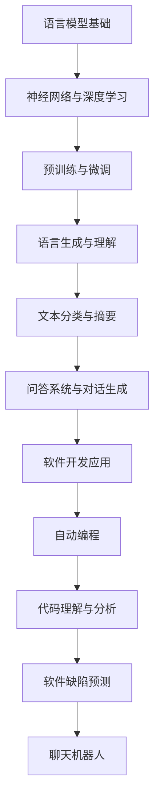
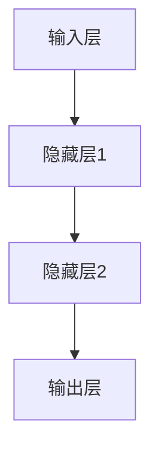
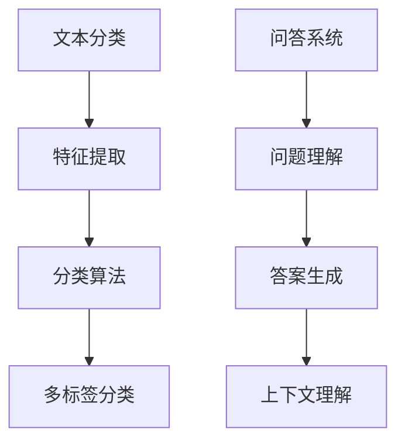

                 

### 文章标题：LLM的软件开发应用场景探讨

> 关键词：大型语言模型（LLM），软件开发，应用场景，算法原理，数学模型，项目实战

> 摘要：本文探讨了大型语言模型（LLM）在软件开发中的多种应用场景，包括文本分析、自动编程、代码理解与分析、软件缺陷预测等。通过详细的理论讲解和实际项目案例，本文展示了如何利用LLM技术解决软件开发中的问题，并展望了LLM技术未来的发展趋势。

---

## 第一部分: LLM基础与原理

### 第1章: LLM基础概念与历史

#### 1.1 LLM定义与分类

大型语言模型（LLM，Large Language Model）是一种基于深度学习技术的自然语言处理模型，它通过对大量文本数据进行预训练，掌握了丰富的语言知识和语义理解能力。LLM通常包含数十亿个参数，能够生成高质量的文本、进行文本分类、问答、翻译等任务。

根据功能和应用场景，LLM可以分为以下几类：

- 通用语言模型（General Language Model）：如GPT（Generative Pre-trained Transformer）系列、BERT（Bidirectional Encoder Representations from Transformers）等，它们具有广泛的文本理解和生成能力。
- 特定领域语言模型（Domain-Specific Language Model）：如代码生成模型、医学语言模型、法律语言模型等，这些模型针对特定领域进行了优化，能够更好地处理特定领域的文本。
- 对话生成模型（Dialogue Generation Model）：如ChatGPT、DuET（Dialogue Encoder and Decoder Transformer）等，它们专注于生成自然流畅的对话文本。

#### 1.2 LLM发展历程

LLM的发展可以追溯到2000年代初，当时研究人员开始探索神经网络在自然语言处理中的应用。以下是LLM发展历程的关键阶段：

- 2003年，研究者提出循环神经网络（RNN），用于处理序列数据。
- 2013年，科学家杰弗里·辛顿（Geoffrey Hinton）等人提出深度学习技术，使得神经网络模型的性能大幅提升。
- 2018年，谷歌发布BERT模型，标志着预训练语言模型技术的重大突破。
- 2020年，OpenAI发布GPT-3模型，拥有超过1750亿个参数，成为当时最大的语言模型。

#### 1.3 LLM在软件开发中的应用趋势

随着LLM技术的不断发展，其在软件开发中的应用场景越来越广泛。以下是一些LLM在软件开发中的应用趋势：

- 自动编程：利用LLM生成代码，提高开发效率。
- 代码理解与分析：帮助开发者理解现有代码，进行代码质量评估和优化。
- 软件缺陷预测：利用LLM预测代码中可能存在的缺陷，提高软件质量。
- 聊天机器人：为软件系统提供智能对话功能，提升用户体验。

### Mermaid流程图：LLM技术架构

### 第2章: LLM的架构与核心技术

#### 2.1 神经网络与深度学习

神经网络（Neural Networks）是深度学习（Deep Learning）的核心组成部分。它们通过模拟人脑神经元的工作原理，对输入数据进行特征提取和学习。

**神经网络基本结构**：

神经网络通常包含输入层、隐藏层和输出层。输入层接收外部输入，隐藏层对输入数据进行特征提取和变换，输出层生成最终的预测结果。

**深度学习优化算法**：

深度学习模型的训练过程通常涉及以下优化算法：

- 梯度下降（Gradient Descent）：一种基于梯度信息更新模型参数的算法。
- 随机梯度下降（Stochastic Gradient Descent, SGD）：在批量数据较小的情况下，使用单个样本的梯度信息更新模型参数。
- Adam优化器（Adaptive Moment Estimation）：结合SGD和动量法的优化算法，适用于大型模型。

#### 2.2 预训练与微调

预训练（Pre-training）是指在一个大规模的语料库上对模型进行训练，使其掌握丰富的语言知识和语义理解能力。预训练后的模型通常具有良好的泛化能力，可以在多个任务上表现优异。

**预训练方法**：

- 遮蔽语言模型（Masked Language Model, MLM）：通过随机遮蔽输入文本中的部分单词，训练模型预测这些遮蔽的单词。
- 下一句预测（Next Sentence Prediction, NSP）：预测输入文本中下一句的正确顺序。
- 问答匹配（Question-Answering, QA）：通过问答对训练模型，使其能够根据问题生成正确答案。

**微调（Fine-tuning）**：

微调是指在一个特定任务的数据集上对预训练模型进行进一步训练，以适应特定任务的需求。微调过程通常涉及以下步骤：

1. 加载预训练模型。
2. 替换部分权重，保留预训练模型的大部分权重。
3. 在特定任务的数据集上进行训练。
4. 评估模型在测试集上的性能。

#### 2.3 自适应与学习能力

自适应学习（Adaptive Learning）是指模型能够根据输入数据和环境的变化，调整自己的学习策略。

**自适应学习机制**：

- 学习率调整（Learning Rate Scheduling）：根据训练过程中的误差变化动态调整学习率，以提高模型收敛速度和性能。
- 动量（Momentum）：结合前几次梯度信息，加速模型收敛。
- 模型压缩（Model Compression）：通过剪枝、量化等技术减小模型大小，提高模型在资源受限环境中的运行效率。

### 第3章: LLM在自然语言处理中的应用

#### 3.1 文本分类

文本分类（Text Classification）是一种将文本数据分配到预定义类别中的任务。LLM在文本分类中的应用主要包括以下方面：

- **分类算法**：使用LLM进行文本分类，可以采用传统的机器学习算法（如朴素贝叶斯、支持向量机等）或深度学习算法（如卷积神经网络、循环神经网络等）。
- **特征提取**：LLM可以提取文本的语义特征，提高分类模型的性能。
- **多标签分类**：LLM可以处理多标签分类任务，即一个文本可以同时属于多个类别。

#### 3.2 问答系统

问答系统（Question-Answering System）是一种能够理解自然语言问题并给出准确答案的智能系统。LLM在问答系统中的应用主要包括以下方面：

- **问题理解**：LLM可以理解问题的语义，将其转换为可处理的形式。
- **答案生成**：LLM可以根据问题生成准确、自然的答案。
- **上下文理解**：LLM可以理解问题的上下文，生成与问题相关的内容。

### Mermaid流程图：文本分类与问答系统

### 第4章: LLM在软件开发中的具体应用场景

#### 4.1 文本分析

文本分析（Text Analysis）是指对文本数据进行分析和挖掘，以提取有用的信息和知识。LLM在文本分析中的应用主要包括以下方面：

- **情感分析**：通过分析文本的情感倾向，识别用户对产品、服务或事件的情感态度。
- **关键词提取**：从文本中提取重要的关键词，用于文本分类、索引和搜索。
- **主题模型**：发现文本中的潜在主题，帮助用户理解文本内容的结构。

#### 4.2 聊天机器人

聊天机器人（Chatbot）是一种能够与用户进行自然语言交互的计算机程序。LLM在聊天机器人中的应用主要包括以下方面：

- **对话生成**：LLM可以生成自然流畅的对话文本，模拟人类的交流方式。
- **上下文理解**：LLM可以理解对话的上下文，根据对话历史生成合适的回复。
- **情感识别**：LLM可以识别用户的情感，生成具有相应情感的对话文本。

#### 4.3 自动编程

自动编程（Automated Programming）是指利用AI技术自动生成代码，以解决软件开发中的问题。LLM在自动编程中的应用主要包括以下方面：

- **代码生成**：LLM可以生成高质量的代码，提高开发效率。
- **代码补全**：LLM可以预测代码中的下一个字符或代码块，帮助开发者快速编写代码。
- **代码审查**：LLM可以分析代码，发现潜在的错误和优化建议。

#### 4.4 代码理解与分析

代码理解与分析（Code Understanding and Analysis）是指对代码进行分析，以提取有用的信息，如函数依赖、变量作用域等。LLM在代码理解与分析中的应用主要包括以下方面：

- **代码语义理解**：LLM可以理解代码的语义，生成代码的高层次描述。
- **代码依赖分析**：LLM可以分析代码的依赖关系，识别关键模块和函数。
- **代码质量评估**：LLM可以评估代码的质量，发现潜在的问题和优化机会。

#### 4.5 软件缺陷预测

软件缺陷预测（Software Defect Prediction）是指利用历史数据预测代码中可能存在的缺陷。LLM在软件缺陷预测中的应用主要包括以下方面：

- **缺陷预测模型构建**：LLM可以构建基于历史数据的缺陷预测模型。
- **缺陷预测效果评估**：LLM可以评估缺陷预测模型的性能，如准确率、召回率等。
- **缺陷预测案例分析**：LLM可以分析历史缺陷数据，发现缺陷发生模式和原因。

### 第5章: LLM在软件开发中的挑战与未来趋势

#### 

