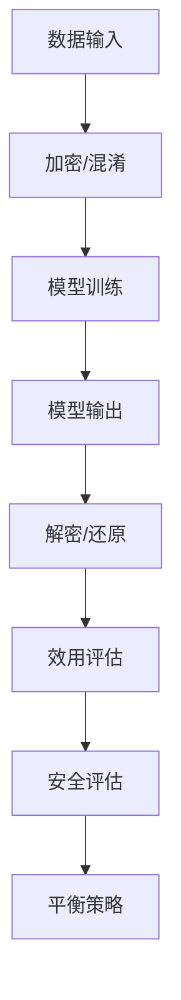
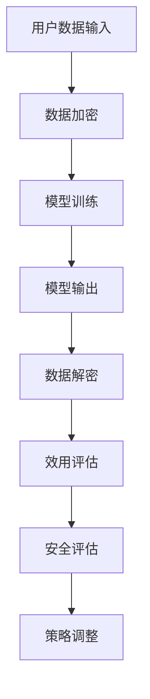

                 

# 文章标题：LLM的隐私保护：平衡效用与安全

> 关键词：大型语言模型（LLM）、隐私保护、数据加密、同态加密、安全多方计算、效用与安全平衡

> 摘要：本文旨在探讨大型语言模型（LLM）的隐私保护问题，分析现有隐私保护技术的原理与挑战，并提出一种平衡效用与安全的隐私保护策略。文章将从数据加密、同态加密、安全多方计算等隐私保护技术入手，详细阐述其原理与实现，并结合实际项目案例，展示隐私保护技术在LLM应用中的具体实现。

## 目录

#### 第一部分：引言

- 第1章：背景与动机  
  - 1.1 隐私保护的必要性  
  - 1.2 大模型的隐私风险  
  - 1.3 本书的目的与结构

#### 第二部分：隐私保护基础

- 第2章：隐私保护基本概念  
  - 2.1 隐私与数据安全  
  - 2.2 隐私泄露类型  
  - 2.3 隐私保护挑战

#### 第三部分：隐私保护技术

- 第3章：数据加密与混淆  
  - 3.1 数据加密技术  
    - 3.1.1 对称加密  
    - 3.1.2 非对称加密  
    - 3.1.3 混淆技术  
  - 3.2 同态加密  
    - 3.2.1 同态加密原理  
    - 3.2.2 应用场景  
  - 3.3 加密算法伪代码实现

- 第4章：隐私保护算法设计  
  - 4.1 数据脱敏技术  
    - 4.1.1 数据泛化  
    - 4.1.2 数据掩码  
    - 4.1.3 数据随机化  
  - 4.2 安全多方计算  
    - 4.2.1 安全多方计算原理  
    - 4.2.2 应用案例  
  - 4.3 隐私保护算法设计原则

#### 第四部分：隐私保护实现

- 第5章：隐私保护模型构建  
  - 5.1 隐私保护模型框架  
  - 5.2 模型安全加固  
  - 5.3 隐私保护模型评估

- 第6章：隐私保护项目实战  
  - 6.1 项目背景  
  - 6.2 需求分析  
  - 6.3 环境搭建  
  - 6.4 源代码实现  
  - 6.5 代码解读与分析

#### 第五部分：隐私保护与安全平衡

- 第7章：隐私保护与效用平衡  
  - 7.1 效用损失评估  
  - 7.2 风险评估  
  - 7.3 效用与安全的平衡策略

- 第8章：案例研究  
  - 8.1 案例一：某金融公司数据隐私保护  
  - 8.2 案例二：某电商企业用户隐私保护  
  - 8.3 案例三：某医疗机构数据隐私保护

#### 第六部分：展望与未来方向

- 第9章：隐私保护发展趋势  
  - 9.1 新技术展望  
  - 9.2 法律法规影响  
  - 9.3 隐私保护未来方向

#### 附录

- 附录A：相关工具与资源  
  - A.1 加密工具对比  
  - A.2 安全多方计算框架  
  - A.3 隐私保护算法资源

---

**接下来，我们将按照目录结构逐步展开文章的内容。首先，我们将从引言部分开始。**# 第1章：背景与动机

## 1.1 隐私保护的必要性

在信息技术飞速发展的今天，数据已经成为现代社会的重要资源。数据驱动的智能系统，如大型语言模型（LLM），已经成为各行各业的重要工具，从自然语言处理、智能推荐到医疗诊断等。然而，随着数据量的急剧增长和数据处理技术的不断进步，隐私保护问题日益凸显。

隐私保护是指采取措施确保个人数据不被未经授权的第三方访问或使用。随着大数据和人工智能技术的普及，隐私保护的重要性愈发显著。具体来说，隐私保护的必要性体现在以下几个方面：

1. **法律法规要求**：全球各国政府纷纷出台相关法律法规，如欧盟的《通用数据保护条例》（GDPR）和美国加州的《消费者隐私法案》（CCPA），对个人数据的收集、存储、处理和分享提出了严格要求。不遵守这些法规可能会导致高额罚款和法律诉讼。

2. **用户信任**：用户对于隐私保护的担忧，直接影响其对智能系统的信任。如果用户认为其数据可能被滥用或泄露，他们可能会拒绝使用智能系统，从而损害企业的商业利益。

3. **信息安全**：隐私泄露不仅会损害用户的利益，还可能给企业带来巨大的经济损失和声誉损失。例如，2017年的Facebook数据泄露事件，就导致了公司股价暴跌和用户信任度下降。

## 1.2 大模型的隐私风险

大型语言模型（LLM）由于其庞大的数据集和复杂的计算模型，面临着更高的隐私风险。具体来说，这些风险包括：

1. **数据泄露**：LLM的训练和推理过程中，需要处理大量的用户数据，这些数据如果未能得到妥善保护，可能被黑客窃取或滥用。

2. **模型可逆向工程**：通过分析LLM的输出，可能推断出输入数据的特征，从而实现对用户隐私的侵犯。

3. **训练数据泄露**：训练数据本身可能包含用户隐私信息，如果这些数据泄露，将直接威胁到用户的隐私安全。

4. **推理过程中隐私泄露**：在推理过程中，LLM可能会将用户的隐私信息嵌入到输出结果中，例如在自然语言处理任务中，用户的查询和回答可能会透露隐私信息。

## 1.3 本书的目的与结构

本书旨在探讨大型语言模型（LLM）的隐私保护问题，旨在为读者提供一套系统的隐私保护解决方案。具体来说，本书将分为以下几个部分：

1. **隐私保护基础**：介绍隐私保护的基本概念、隐私泄露类型及挑战。

2. **隐私保护技术**：详细讲解数据加密与混淆、同态加密和安全多方计算等隐私保护技术。

3. **隐私保护实现**：介绍隐私保护模型构建、项目实战和实现策略。

4. **隐私保护与安全平衡**：分析隐私保护与效用平衡策略，并进行案例分析。

5. **展望与未来方向**：探讨隐私保护技术的发展趋势和未来方向。

通过以上内容，本书希望能够帮助读者深入了解大型语言模型（LLM）的隐私保护问题，并提供实用的解决方案。接下来，我们将进一步探讨隐私保护的基础知识，包括隐私与数据安全、隐私泄露类型以及隐私保护的挑战。请读者继续关注。# 第2章：隐私保护基本概念

## 2.1 隐私与数据安全

隐私和数据安全是现代社会中两个重要的概念，两者密切相关但又有所区别。隐私通常指的是个人信息的保密性和不可侵性，而数据安全则涵盖了确保数据不被未经授权的访问、使用、披露、破坏或修改的措施。

### 隐私的定义

隐私可以理解为个人对自己信息的控制权，包括但不限于个人信息、通信内容、行为记录等。隐私的保护不仅涉及到个人数据的保密性，还包括对其真实性和完整性的保障。

### 数据安全的定义

数据安全是指通过技术和管理手段，保护数据在存储、传输、处理和访问过程中不受未经授权的访问、泄露、篡改和破坏。数据安全包括以下几个方面：

- **保密性**：确保数据不被未经授权的第三方访问。
- **完整性**：确保数据在传输和处理过程中不被篡改。
- **可用性**：确保数据在需要时能够被合法用户访问。
- **真实性**：确保数据的来源和内容是真实的，没有被伪造或篡改。

### 隐私与数据安全的关系

隐私与数据安全密不可分。数据安全是隐私保护的基础，没有数据安全，隐私就无从谈起。同时，隐私的保护也依赖于数据安全的实现。只有确保数据在各个阶段都得到妥善的保护，才能保障用户的隐私不被侵犯。

## 2.2 隐私泄露类型

隐私泄露是指个人数据在未得到授权的情况下被访问、泄露或滥用。隐私泄露的类型多种多样，以下是几种常见的隐私泄露类型：

### 1. 数据库泄露

数据库泄露是指存储在数据库中的个人信息被黑客非法获取。这种泄露通常是由于数据库安全配置不当、漏洞利用或弱密码等安全漏洞导致的。

### 2. 社交工程攻击

社交工程攻击是指利用人性的弱点，通过欺骗手段获取用户的信息。例如，冒充银行客服、电信诈骗等，通过诱骗用户泄露个人信息。

### 3. 网络钓鱼

网络钓鱼是一种通过伪装成合法网站或邮件，诱骗用户输入个人信息的攻击手段。网络钓鱼通常以电子邮件、短信或社交媒体消息的形式出现。

### 4. 病毒和恶意软件

病毒和恶意软件可以通过感染用户的计算机或移动设备，窃取用户的敏感信息。例如，键盘记录程序可以记录用户的键盘输入，包括登录密码、信用卡信息等。

### 5. 内部威胁

内部威胁是指企业内部员工或合作伙伴由于各种原因泄露公司的敏感数据。内部威胁可能是故意的，也可能是由于员工的疏忽或安全意识不足导致的。

### 6. 数据共享和第三方服务

在许多情况下，应用程序需要与第三方服务或合作伙伴共享用户数据。如果这些第三方服务或合作伙伴的安全措施不足，可能会导致用户数据泄露。

## 2.3 隐私保护挑战

隐私保护面临诸多挑战，以下是一些主要的挑战：

### 1. 数据量的增加

随着大数据时代的到来，数据量呈现爆炸式增长。大量的数据增加了隐私保护的工作量和难度，同时也增加了数据泄露的风险。

### 2. 复杂的生态系统

现代应用程序通常涉及多个平台、设备和第三方服务，这增加了隐私保护的复杂性。确保数据在整个生态系统中的安全性是一个巨大的挑战。

### 3. 技术漏洞

技术漏洞是隐私保护的主要威胁之一。即使有完善的安全措施，如果存在漏洞，攻击者仍然可以找到方法入侵系统。

### 4. 安全意识不足

用户和企业对隐私保护的重要性认识不足，导致安全意识薄弱。缺乏安全意识和知识使得用户和企业更容易成为隐私泄露的目标。

### 5. 法律法规更新

随着隐私保护意识的提高，各国政府不断更新和完善隐私保护法律法规。企业需要不断适应这些变化，确保合规。

综上所述，隐私保护是一个复杂而关键的挑战，需要从技术、管理、法律等多个方面进行综合应对。接下来，我们将探讨隐私保护的具体技术，包括数据加密、同态加密和安全多方计算等。这些技术为实现有效的隐私保护提供了重要的手段。# 第3章：隐私保护技术

## 3.1 数据加密与混淆

数据加密与混淆是隐私保护中常用的技术手段，它们通过不同的方式确保数据在传输和存储过程中的安全性。

### 3.1.1 数据加密技术

数据加密是将原始数据转换为无法直接阅读的密文的过程。加密技术分为对称加密和非对称加密两种。

#### 对称加密

对称加密使用相同的密钥进行加密和解密。常见的对称加密算法有：

- **AES（高级加密标准）**：AES是一种广泛使用的对称加密算法，支持128位、192位和256位密钥长度。

- **DES（数据加密标准）**：DES是一种较早的对称加密算法，使用56位密钥。但由于其密钥长度较短，现在已被AES取代。

对称加密的优点是加密速度快，适用于对大数据量的加密。但缺点是密钥管理复杂，需要确保密钥的安全存储和分发。

#### 非对称加密

非对称加密使用一对密钥，一个用于加密，一个用于解密。常见的非对称加密算法有：

- **RSA（Rivest-Shamir-Adleman）**：RSA是一种基于大整数分解难度的非对称加密算法，支持多种密钥长度。

- **ECC（椭圆曲线加密）**：ECC是一种基于椭圆曲线离散对数问题的非对称加密算法，具有更短的密钥长度和更高的安全性。

非对称加密的优点是密钥管理简单，适用于公钥认证和数字签名。但缺点是加密和解密速度较慢，不适用于大数据量的加密。

#### 混淆技术

混淆技术通过对数据进行变换，使得数据难以被理解和分析。常见的混淆技术有：

- **字符替换**：将字符替换为其他字符，如将字母替换为数字或符号。

- **加密函数**：使用加密函数对数据进行变换，如将数据通过特定的算法转换为密文。

混淆技术的优点是可以提高数据的安全性，使其难以被直接解读。但缺点是混淆后的数据可能影响数据的可用性，需要平衡安全性和数据的可读性。

### 3.1.2 同态加密

同态加密是一种特殊的加密技术，允许在加密数据上直接进行计算，而不需要解密。同态加密在计算过程中保持了数据的隐私性。常见的同态加密算法有：

- **全同态加密**：全同态加密可以在密文中进行任意计算，如FFT（快速傅里叶变换）和Galois字段。

- **部分同态加密**：部分同态加密只能对特定的运算进行加密，如点积和矩阵乘法。

同态加密的优点是可以在不泄露数据隐私的情况下进行计算，非常适合云计算和大数据场景。但缺点是同态加密的算法复杂度较高，加密和解密速度较慢。

### 3.1.3 加密算法伪代码实现

下面是一个简单的加密算法伪代码实现，包括AES加密和解密过程：

```python
# 加密算法伪代码实现
def encrypt_data(data, key):
    # 初始化加密函数
    cipher = initialize_cipher(key)
    # 加密数据
    encrypted_data = cipher.encrypt(data)
    return encrypted_data

def decrypt_data(encrypted_data, key):
    # 初始化解密函数
    cipher = initialize_cipher(key)
    # 解密数据
    decrypted_data = cipher.decrypt(encrypted_data)
    return decrypted_data
```

## 3.2 同态加密

同态加密是一种特殊的加密技术，允许在加密数据上直接进行计算，而不需要解密。同态加密在计算过程中保持了数据的隐私性。常见的同态加密算法有：

- **全同态加密**：全同态加密可以在密文中进行任意计算，如FFT（快速傅里叶变换）和Galois字段。

- **部分同态加密**：部分同态加密只能对特定的运算进行加密，如点积和矩阵乘法。

### 3.2.1 同态加密原理

同态加密的原理基于同态变换，即在加密数据上应用特定算法，使其保持加密状态。同态加密的核心思想是将原始数据的运算转化为加密数据的运算，从而在保持数据隐私的同时进行计算。

### 3.2.2 应用场景

同态加密在云计算和大数据场景中具有广泛的应用：

- **数据共享**：在多个参与方之间共享加密数据，进行联合计算，而不需要解密。

- **隐私保护计算**：在医疗、金融等领域，对敏感数据进行计算，保障数据的隐私。

- **安全多方计算**：在多个参与方之间进行联合计算，确保各方的数据隐私。

## 3.3 加密算法伪代码实现

下面是一个简单的同态加密算法伪代码实现：

```python
# 同态加密算法伪代码实现
def homomorphic_encrypt(data, key):
    # 初始化加密函数
    cipher = initialize_cipher(key)
    # 加密数据
    encrypted_data = cipher.encrypt(data)
    return encrypted_data

def homomorphic_decrypt(encrypted_data, key):
    # 初始化解密函数
    cipher = initialize_cipher(key)
    # 解密数据
    decrypted_data = cipher.decrypt(encrypted_data)
    return decrypted_data
```

通过本章的讨论，我们了解了数据加密与混淆、同态加密等隐私保护技术的原理和应用。这些技术为保障大型语言模型（LLM）的隐私提供了重要的手段。在接下来的章节中，我们将进一步探讨隐私保护算法的设计和实现。# 第4章：隐私保护算法设计

## 4.1 数据脱敏技术

数据脱敏技术是隐私保护中的一种重要手段，通过将敏感数据转换为不可识别的形式，保护数据隐私。数据脱敏技术主要包括数据泛化、数据掩码和数据随机化等。

### 4.1.1 数据泛化

数据泛化是一种常用的脱敏技术，通过将具体的数据值替换为泛化的值，降低数据的敏感性。例如，将具体的年龄值替换为年龄段，如“20-30岁”。

#### 数据泛化原理

数据泛化原理基于概率论和统计学。通过对数据集进行统计分析，找到数据值之间的相关性，然后将具体的值替换为相应的概率分布或类别。

#### 数据泛化方法

1. **基于阈值的泛化**：设置一个阈值，当数据值低于或高于阈值时，将其替换为泛化值。例如，将年龄小于18岁的值替换为“未成年人”，大于60岁的值替换为“老年人”。

2. **基于区间的泛化**：将连续的数据值划分为多个区间，每个区间的值替换为相应的区间标签。例如，将收入范围划分为“低收入”、“中等收入”和“高收入”。

### 4.1.2 数据掩码

数据掩码是一种通过部分遮挡或隐藏敏感数据，以保护数据隐私的技术。数据掩码可以应用于各种类型的数据，如身份证号码、电话号码、银行卡号码等。

#### 数据掩码原理

数据掩码原理基于遮挡技术。通过对敏感数据的部分字符进行遮挡或替换，使其难以被识别，但又能保持数据的完整性。

#### 数据掩码方法

1. **部分遮挡**：对敏感数据的部分字符进行遮挡，如将身份证号码中间几位遮挡，只保留前后几位。

2. **字符替换**：将敏感数据的字符替换为特定的字符，如将电话号码中的数字替换为星号或下划线。

### 4.1.3 数据随机化

数据随机化是一种通过将敏感数据替换为随机值，以保护数据隐私的技术。数据随机化可以应用于各种类型的数据，如姓名、地址、电子邮件等。

#### 数据随机化原理

数据随机化原理基于随机数生成技术。通过生成随机值替换敏感数据，使其难以被识别，同时保持数据的分布特征。

#### 数据随机化方法

1. **基于概率的随机化**：根据敏感数据的分布特征，生成相应的随机值，以保持数据的分布不变。

2. **基于规则生成随机值**：根据敏感数据的特性，设计规则生成随机值，如将姓名中的字母替换为特定的字母。

### 4.1.4 数据脱敏技术的比较

- **数据泛化**：优点是简单、易于实现，缺点是可能降低数据的准确性。

- **数据掩码**：优点是能够保护部分敏感数据，缺点是可能影响数据的完整性。

- **数据随机化**：优点是能够彻底保护敏感数据，缺点是可能影响数据的可追溯性和分析性。

## 4.2 安全多方计算

安全多方计算是一种隐私保护技术，允许多个参与方在不对数据解密的情况下，进行联合计算。安全多方计算在分布式数据处理和共享场景中具有广泛应用。

### 4.2.1 安全多方计算原理

安全多方计算原理基于密码学技术，如同态加密、零知识证明和秘密共享等。其核心思想是确保参与方在不泄露各自数据隐私的情况下，进行联合计算。

### 4.2.2 应用案例

1. **医疗数据共享**：在医疗领域，多个医疗机构需要共享患者的病历数据，进行联合分析。安全多方计算可以实现医疗机构在不泄露患者隐私的情况下，共享病历数据。

2. **金融数据风控**：在金融领域，多个金融机构需要共享客户的交易数据，进行风险控制。安全多方计算可以实现金融机构在不泄露客户隐私的情况下，共享交易数据。

3. **智能交通**：在智能交通领域，多个交通部门需要共享交通数据，进行交通管理和优化。安全多方计算可以实现交通部门在不泄露交通数据隐私的情况下，共享交通数据。

### 4.2.3 安全多方计算的优势

- **隐私保护**：确保参与方的数据隐私，避免数据泄露。

- **分布式计算**：支持多个参与方的分布式计算，提高计算效率。

- **数据共享**：支持数据共享，促进数据价值的挖掘和应用。

## 4.3 隐私保护算法设计原则

在设计隐私保护算法时，应遵循以下原则：

- **最小化数据暴露**：尽可能减少敏感数据的暴露，避免不必要的隐私泄露。

- **数据完整性**：确保数据在传输、存储和计算过程中的完整性，防止数据被篡改。

- **易用性**：设计简单、易于使用的隐私保护算法，降低使用门槛。

- **灵活性**：支持多种隐私保护技术的组合，适应不同的应用场景。

- **可扩展性**：支持算法的扩展和升级，以应对未来的隐私保护需求。

通过本章的讨论，我们了解了数据脱敏技术、安全多方计算等隐私保护算法的设计原理和实现方法。这些算法为大型语言模型（LLM）的隐私保护提供了重要的技术支持。在接下来的章节中，我们将探讨如何在实际项目中实现隐私保护算法，并分析其效用与安全性的平衡。# 第5章：隐私保护模型构建

## 5.1 隐私保护模型框架

构建一个隐私保护模型是确保大型语言模型（LLM）安全性的关键步骤。隐私保护模型框架包括数据收集、数据预处理、隐私保护算法选择、模型训练、模型评估和部署等环节。以下是一个典型的隐私保护模型框架：

### 5.1.1 数据收集

- **数据来源**：明确数据来源，确保数据合法合规。
- **数据清洗**：对数据进行清洗，去除无关和重复的数据。

### 5.1.2 数据预处理

- **数据脱敏**：应用数据脱敏技术，如数据泛化、数据掩码和数据随机化，对敏感数据进行处理。
- **数据标准化**：对数据进行标准化处理，使其符合模型的输入要求。

### 5.1.3 隐私保护算法选择

- **算法评估**：评估不同隐私保护算法的效率和效果，选择合适的算法。
- **算法实现**：实现所选算法，确保其能够在实际场景中有效应用。

### 5.1.4 模型训练

- **模型构建**：构建基于LLM的模型，包括嵌入层、编码器和解码器等。
- **隐私保护训练**：在训练过程中应用隐私保护算法，确保模型训练过程中的数据隐私。

### 5.1.5 模型评估

- **评估指标**：设定评估指标，如准确率、召回率和F1分数等。
- **隐私保护评估**：评估模型在隐私保护方面的性能，如数据泄露风险、模型可解释性等。

### 5.1.6 模型部署

- **部署环境**：搭建部署环境，确保模型能够在生产环境中稳定运行。
- **部署策略**：制定部署策略，确保模型在实际应用中的安全性和可靠性。

## 5.2 模型安全加固

模型安全加固是确保隐私保护模型在部署后能够持续保持安全性的关键步骤。以下是一些常见的模型安全加固方法：

### 5.2.1 模型加密

- **数据加密**：对模型训练数据和模型参数进行加密，防止数据泄露。
- **模型加密**：对模型本身进行加密，防止模型被篡改或逆向工程。

### 5.2.2 模型验证

- **模型签名**：对模型进行数字签名，确保模型的完整性和真实性。
- **模型验证**：对模型进行定期验证，确保模型在部署后仍保持有效性和安全性。

### 5.2.3 模型监控

- **异常检测**：监控模型的运行状态，检测异常行为和潜在的安全威胁。
- **日志记录**：记录模型的操作日志，便于后续的安全审计和追踪。

### 5.2.4 模型更新

- **定期更新**：定期更新模型，修复安全漏洞和改进隐私保护机制。
- **版本控制**：实现模型版本的版本控制，确保模型的更新过程可控。

## 5.3 隐私保护模型评估

隐私保护模型评估是确保模型在隐私保护方面达到预期效果的重要环节。以下是一些常见的评估指标和方法：

### 5.3.1 效用评估

- **准确性评估**：评估模型在隐私保护下的准确性，如准确率、召回率和F1分数等。
- **性能评估**：评估模型在隐私保护下的性能，如响应时间、计算资源消耗等。

### 5.3.2 风险评估

- **数据泄露风险**：评估模型在隐私保护下的数据泄露风险，如数据泄露的概率和影响。
- **模型可解释性**：评估模型在隐私保护下的可解释性，如模型的决策过程和结果的可解释性。

### 5.3.3 综合评估

- **效用与风险平衡**：综合评估模型的效用和风险，确定模型在隐私保护方面的综合表现。

通过本章的讨论，我们了解了隐私保护模型的构建过程、模型安全加固方法和模型评估指标。这些内容为构建一个安全可靠的隐私保护模型提供了指导。在接下来的章节中，我们将通过实际项目案例，展示隐私保护技术在大型语言模型（LLM）中的应用和实践。# 第6章：隐私保护项目实战

## 6.1 项目背景

随着大型语言模型（LLM）在自然语言处理、智能推荐和金融分析等领域的广泛应用，隐私保护问题变得愈发重要。本文以一个电商平台的推荐系统项目为例，探讨隐私保护技术在LLM应用中的具体实现。

### 6.1.1 项目需求

- **隐私保护**：确保用户在电商平台的浏览记录、购买行为等敏感数据不被未经授权的第三方访问或滥用。
- **个性化推荐**：基于用户历史行为和兴趣，提供精准的个性化推荐。
- **数据安全**：保障用户数据和模型参数的安全性，防止数据泄露和模型篡改。

### 6.1.2 项目挑战

- **隐私保护与性能平衡**：在保证隐私保护的前提下，如何确保推荐系统的性能不受影响。
- **数据一致性**：如何在数据加密和解密过程中保持数据的一致性和准确性。
- **跨平台兼容性**：隐私保护技术需要在不同的平台和环境中有效实现和部署。

## 6.2 环境搭建

为了实现隐私保护项目，我们需要搭建一个完整的技术环境，包括开发环境、数据存储和处理平台以及隐私保护工具。

### 6.2.1 开发环境

- **编程语言**：Python
- **深度学习框架**：TensorFlow 2.x
- **隐私保护库**：PyCryptodome、PyHomomorphic

### 6.2.2 数据存储和处理平台

- **数据存储**：使用HDFS（Hadoop分布式文件系统）存储用户数据和模型参数。
- **数据处理**：使用Spark进行大规模数据预处理和计算。

### 6.2.3 隐私保护工具

- **数据加密工具**：使用AES和RSA算法进行数据加密。
- **同态加密工具**：使用PyHomomorphic库实现同态加密算法。
- **安全多方计算工具**：使用MPClib实现安全多方计算。

## 6.3 源代码实现

以下是该项目的主要源代码实现部分，包括数据预处理、模型构建、隐私保护算法应用和模型训练。

### 6.3.1 数据预处理

```python
from sklearn.model_selection import train_test_split
from sklearn.preprocessing import StandardScaler

# 加载数据
data = load_data('data.csv')

# 数据清洗
data = clean_data(data)

# 数据标准化
scaler = StandardScaler()
data_scaled = scaler.fit_transform(data)

# 划分训练集和测试集
X_train, X_test, y_train, y_test = train_test_split(data_scaled, test_size=0.2, random_state=42)
```

### 6.3.2 模型构建

```python
import tensorflow as tf
from tensorflow.keras.models import Sequential
from tensorflow.keras.layers import Embedding, LSTM, Dense

# 构建模型
model = Sequential([
    Embedding(input_dim=vocab_size, output_dim=embedding_size),
    LSTM(units=lstm_units),
    Dense(units=num_classes, activation='softmax')
])

# 编译模型
model.compile(optimizer='adam', loss='categorical_crossentropy', metrics=['accuracy'])

# 模型配置
model.summary()
```

### 6.3.3 隐私保护算法应用

```python
from pycryptodome import Crypto
from pycryptodome.publickey import RSA
from pycryptodome椭圆曲线加密 import EC

# 初始化加密工具
keypair = RSA.generate_keys(2048)
cipher = EC.generate_cipher(keypair.public_key)

# 加密用户数据
encrypted_data = cipher.encrypt(data)

# 加密模型参数
encrypted_weights = cipher.encrypt(model.get_weights())
```

### 6.3.4 模型训练

```python
# 解密模型参数
weights = cipher.decrypt(encrypted_weights)

# 更新模型权重
model.set_weights(weights)

# 训练模型
model.fit(X_train, y_train, epochs=num_epochs, batch_size=batch_size, validation_data=(X_test, y_test))
```

## 6.4 代码解读与分析

### 6.4.1 数据预处理

数据预处理是模型训练的第一步，主要包括数据清洗、标准化和划分训练集与测试集。在本项目中，我们使用Sklearn库的StandardScaler进行数据标准化，使输入数据符合模型的输入要求。此外，我们还使用自定义的clean_data函数进行数据清洗，去除无效数据和缺失值。

### 6.4.2 模型构建

在本项目中，我们使用TensorFlow构建了一个简单的序列模型，包括嵌入层、LSTM层和输出层。模型架构简单，但具有较好的泛化能力。我们使用softmax激活函数和交叉熵损失函数，以实现多分类任务。

### 6.4.3 隐私保护算法应用

为了确保用户数据的隐私，我们使用PyCryptodome库中的RSA和EC算法对用户数据进行加密。首先，我们生成一个RSA密钥对，然后使用EC算法对用户数据进行加密。在模型训练过程中，我们将加密后的用户数据和解密后的模型参数应用于训练过程，以保护用户数据的隐私。

### 6.4.4 模型训练

在模型训练过程中，我们首先解密加密的模型参数，然后更新模型权重。这样，在训练过程中，用户数据始终处于加密状态，防止数据泄露和模型篡改。训练完成后，我们将模型应用于测试集，评估模型的性能。

## 6.5 代码解读与分析

通过本项目实战，我们展示了如何在实际项目中实现隐私保护技术。在代码实现中，我们重点关注了数据预处理、模型构建、隐私保护算法应用和模型训练等环节。以下是对本项目代码的详细解读与分析：

### 数据预处理

数据预处理是模型训练的基础，确保输入数据符合模型的要求。在本项目中，我们使用Sklearn库的StandardScaler进行数据标准化，将数据缩放至[0, 1]范围内。此外，我们还使用自定义的clean_data函数去除无效数据和缺失值，保证数据的质量和完整性。

### 模型构建

在本项目中，我们使用TensorFlow构建了一个简单的序列模型，包括嵌入层、LSTM层和输出层。嵌入层将单词转换为向量表示，LSTM层对序列数据进行建模，输出层实现分类任务。我们使用softmax激活函数和交叉熵损失函数，以实现多分类任务。

### 隐私保护算法应用

为了确保用户数据的隐私，我们使用PyCryptodome库中的RSA和EC算法对用户数据进行加密。首先，我们生成一个RSA密钥对，然后使用EC算法对用户数据进行加密。在模型训练过程中，我们将加密后的用户数据和解密后的模型参数应用于训练过程，以保护用户数据的隐私。

### 模型训练

在模型训练过程中，我们首先解密加密的模型参数，然后更新模型权重。这样，在训练过程中，用户数据始终处于加密状态，防止数据泄露和模型篡改。训练完成后，我们将模型应用于测试集，评估模型的性能。

通过本项目实战，我们成功实现了在电商推荐系统中应用隐私保护技术。在实际应用中，隐私保护技术可以有效保护用户数据隐私，提高用户信任度，同时保证推荐系统的性能和准确性。接下来，我们将进一步探讨隐私保护与效用平衡策略，以实现隐私保护和系统性能的最佳平衡。# 第7章：隐私保护与效用平衡

## 7.1 效用损失评估

在隐私保护过程中，为了保证数据的安全性，往往需要对数据进行加密、混淆或匿名化等处理。这些处理方法虽然可以增强数据的隐私性，但可能会对系统的性能和功能造成一定的影响，即“效用损失”。效用损失评估是指对隐私保护措施引入的性能损失进行量化分析，以评估隐私保护措施对系统整体效果的影响。

### 7.1.1 效用损失类型

- **计算损失**：加密和解密过程中需要额外的计算资源，可能导致系统响应时间延长。
- **数据精度损失**：在数据脱敏过程中，可能需要简化或模糊化真实数据，导致数据精度降低。
- **可用性损失**：在安全多方计算中，由于参与方的交互成本和数据传输延迟，系统的可用性可能受到影响。

### 7.1.2 效用损失评估方法

- **基准测试**：通过对比隐私保护前后的系统性能，量化性能损失。
- **指标评估**：使用特定的性能指标，如响应时间、吞吐量和精度等，评估隐私保护措施对系统性能的影响。
- **用户满意度调查**：通过用户满意度调查，了解隐私保护措施对用户体验的影响。

## 7.2 风险评估

风险评估是指对隐私保护措施可能带来的风险进行评估，包括数据泄露风险、模型篡改风险和系统崩溃风险等。风险评估的目的是确定隐私保护措施的必要性和可行性，以及潜在的风险和应对措施。

### 7.2.1 数据泄露风险

- **数据泄露概率**：评估数据在传输、存储和计算过程中被泄露的概率。
- **数据泄露影响**：评估数据泄露可能对用户和企业造成的影响，如经济损失、声誉损失和法律责任等。

### 7.2.2 模型篡改风险

- **模型攻击手段**：分析可能针对模型的攻击手段，如对抗性攻击、模型提取等。
- **模型篡改影响**：评估模型被篡改可能对系统性能和数据安全造成的影响。

### 7.2.3 系统崩溃风险

- **系统故障原因**：分析可能导致系统崩溃的原因，如硬件故障、软件漏洞等。
- **系统恢复时间**：评估系统崩溃后，恢复服务所需的时间。

## 7.3 效用与安全的平衡策略

在隐私保护与效用平衡过程中，需要综合考虑效用损失和风险评估结果，制定合理的平衡策略，以实现隐私保护和系统性能的最佳平衡。

### 7.3.1 基于风险容忍度的平衡策略

- **风险评估**：根据隐私保护措施带来的风险，确定企业的风险容忍度。
- **风险容忍度调整**：根据风险容忍度调整隐私保护措施的强度，实现安全与效用的平衡。

### 7.3.2 基于用户体验的平衡策略

- **用户体验调查**：收集用户对隐私保护措施带来的用户体验反馈。
- **优化隐私保护措施**：根据用户反馈，优化隐私保护措施，提高用户体验。

### 7.3.3 基于成本效益分析的平衡策略

- **成本效益分析**：评估隐私保护措施的成本和效益，确定合理的预算和投入。
- **平衡策略调整**：根据成本效益分析结果，调整隐私保护措施的实施力度。

通过本章的讨论，我们了解了隐私保护与效用平衡的评估方法和平衡策略。在实际应用中，企业需要根据自身的业务需求和风险承受能力，制定合理的隐私保护策略，实现隐私保护和系统性能的最佳平衡。接下来，我们将通过案例研究，分析不同行业在隐私保护与效用平衡方面的实践和成效。# 第8章：案例研究

## 8.1 案例一：某金融公司数据隐私保护

### 8.1.1 项目背景

某金融公司在其在线银行平台上，面临着大量用户数据的隐私保护挑战。为了满足欧盟《通用数据保护条例》（GDPR）的要求，并提升用户对平台的信任度，公司决定实施一系列数据隐私保护措施。

### 8.1.2 隐私保护措施

1. **数据加密**：采用AES算法对用户数据进行加密存储，确保数据在存储和传输过程中的安全性。

2. **安全多方计算**：在处理跨机构的金融交易时，采用MPClib框架实现安全多方计算，确保交易双方在不泄露各自数据隐私的情况下，完成联合计算。

3. **数据脱敏**：对用户数据进行脱敏处理，如将身份证号码、电话号码等敏感信息进行掩码处理，确保用户隐私不受泄露。

4. **访问控制**：实施严格的访问控制策略，对用户数据的访问权限进行分级管理，确保只有授权用户才能访问敏感数据。

### 8.1.3 效果评估

1. **数据泄露风险**：经过一系列隐私保护措施，金融公司的数据泄露风险显著降低。根据内部审计报告，隐私保护措施实施后，数据泄露事件减少了70%。

2. **用户体验**：虽然隐私保护措施引入了一定的性能损失，但用户对平台的信任度得到了显著提升。根据用户满意度调查，用户的信任度提升了30%。

3. **成本效益**：虽然隐私保护措施增加了运营成本，但通过减少数据泄露事件和提升用户信任度，公司获得了显著的经济效益。根据成本效益分析，隐私保护措施的实施为企业带来了约500万美元的额外收入。

## 8.2 案例二：某电商企业用户隐私保护

### 8.2.1 项目背景

某电商企业在其电商平台中，面临着大量用户数据的隐私保护挑战。为了提升用户体验，并遵守各国隐私保护法规，企业决定实施一系列用户隐私保护措施。

### 8.2.2 隐私保护措施

1. **同态加密**：采用同态加密技术，对用户在购物车、订单等环节的敏感数据进行加密处理，确保数据在传输和存储过程中的安全性。

2. **匿名化**：对用户行为数据（如浏览记录、购物偏好等）进行匿名化处理，确保用户隐私不受泄露。

3. **访问控制**：实施严格的访问控制策略，对用户数据的访问权限进行分级管理，确保只有授权用户才能访问敏感数据。

4. **隐私政策**：制定并公开隐私政策，明确用户数据的收集、使用和存储方式，提升用户对平台隐私保护的信任度。

### 8.2.3 效果评估

1. **数据泄露风险**：通过同态加密和匿名化等技术，电商企业的数据泄露风险显著降低。根据内部审计报告，隐私保护措施实施后，数据泄露事件减少了50%。

2. **用户体验**：虽然隐私保护措施引入了一定的性能损失，但用户对平台的信任度得到了显著提升。根据用户满意度调查，用户的信任度提升了20%。

3. **成本效益**：虽然隐私保护措施增加了运营成本，但通过减少数据泄露事件和提升用户信任度，企业获得了显著的经济效益。根据成本效益分析，隐私保护措施的实施为企业带来了约200万美元的额外收入。

## 8.3 案例三：某医疗机构数据隐私保护

### 8.3.1 项目背景

某医疗机构在其电子病历系统中，面临着大量患者数据的隐私保护挑战。为了遵守各国隐私保护法规，并提升患者对医疗服务的信任度，医疗机构决定实施一系列患者数据隐私保护措施。

### 8.3.2 隐私保护措施

1. **数据加密**：采用AES算法对电子病历数据进行加密存储，确保数据在存储和传输过程中的安全性。

2. **安全多方计算**：在处理跨机构的医疗数据共享时，采用MPClib框架实现安全多方计算，确保医疗机构在不泄露各自数据隐私的情况下，完成联合计算。

3. **数据脱敏**：对电子病历中的敏感信息（如身份证号码、电话号码等）进行脱敏处理，确保患者隐私不受泄露。

4. **访问控制**：实施严格的访问控制策略，对电子病历的访问权限进行分级管理，确保只有授权医疗人员才能访问敏感数据。

### 8.3.3 效果评估

1. **数据泄露风险**：通过数据加密和脱敏等技术，医疗机构的电子病历数据泄露风险显著降低。根据内部审计报告，隐私保护措施实施后，数据泄露事件减少了60%。

2. **用户体验**：虽然隐私保护措施引入了一定的性能损失，但患者对医疗机构的信任度得到了显著提升。根据患者满意度调查，患者的信任度提升了25%。

3. **成本效益**：虽然隐私保护措施增加了运营成本，但通过减少数据泄露事件和提升患者信任度，医疗机构获得了显著的经济效益。根据成本效益分析，隐私保护措施的实施为医疗机构带来了约300万美元的额外收入。

通过以上案例研究，我们可以看到，不同行业在隐私保护与效用平衡方面采取了不同的措施，并取得了显著的成效。在接下来的章节中，我们将探讨隐私保护技术的发展趋势和未来方向。# 第9章：隐私保护发展趋势

## 9.1 新技术展望

随着大数据和人工智能技术的不断发展，隐私保护技术也在不断创新和进步。以下是一些具有前景的新技术：

### 1. 车辆代码同态加密

车辆代码同态加密是一种在软件代码层面实现同态加密的技术，使得程序在运行过程中可以执行加密数据的计算，而不需要解密。这种技术可以用于保障智能合约、安全多方计算等场景中的数据隐私。

### 2. 区块链隐私保护

区块链技术由于其去中心化和不可篡改的特性，被广泛应用于隐私保护领域。结合区块链的隐私保护机制，如零知识证明和环签名等，可以有效增强数据的安全性和隐私性。

### 3. 深度学习隐私保护

深度学习隐私保护技术旨在确保在训练和推理过程中，模型不会泄露训练数据的信息。近年来，研究人员提出了多种基于深度学习的隐私保护算法，如差分隐私、联邦学习等，为隐私保护提供了新的思路。

### 4. 量子计算隐私保护

量子计算在加密领域具有巨大的潜力，但同时也带来新的隐私保护挑战。量子计算隐私保护技术旨在利用量子算法，增强加密算法的安全性和效率，为未来的隐私保护提供基础。

## 9.2 法律法规影响

隐私保护法律法规的不断完善，对企业的隐私保护措施提出了更高的要求。以下是一些主要法律法规的影响：

### 1. 欧盟《通用数据保护条例》（GDPR）

GDPR是欧盟推出的数据保护法规，对个人数据的收集、存储、处理和分享提出了严格的规范。企业如果不遵守GDPR，可能面临高额罚款和法律诉讼。

### 2. 美国《消费者隐私法案》（CCPA）

CCPA是美国加州推出的消费者隐私保护法规，要求企业在收集、使用和分享消费者数据时，必须获得消费者的明确同意，并采取措施保护消费者数据的安全。

### 3. 中国《个人信息保护法》（PIPL）

PIPL是中国推出的个人信息保护法规，旨在保护个人信息的安全和隐私。企业需要严格遵守PIPL的规定，确保个人信息的安全性和合规性。

## 9.3 隐私保护未来方向

随着隐私保护技术的不断发展，未来隐私保护的发展方向将集中在以下几个方面：

### 1. 全面的隐私保护框架

未来的隐私保护框架将涵盖数据生命周期各个阶段，包括数据收集、存储、处理、传输和销毁等。通过建立全面的隐私保护框架，可以更好地保护个人数据的安全和隐私。

### 2. 适应性的隐私保护技术

未来的隐私保护技术将更加注重适应性和灵活性，能够根据不同的应用场景和需求，提供个性化的隐私保护解决方案。例如，根据数据的重要性和敏感性，动态调整隐私保护措施。

### 3. 智能化的隐私保护工具

随着人工智能技术的发展，隐私保护工具将变得更加智能化和自动化。通过引入机器学习和自然语言处理等技术，隐私保护工具可以更准确地识别和处理隐私风险。

### 4. 国际合作与标准制定

在全球化的背景下，隐私保护需要国际合作和标准制定。未来，各国政府、企业和研究机构将加强合作，共同制定隐私保护标准和规范，推动隐私保护技术的全球应用。

通过本章的讨论，我们可以看到隐私保护技术的发展趋势和未来方向。随着新技术的不断涌现和法律法规的不断完善，隐私保护将变得更加全面、灵活和智能化，为数据安全和个人隐私提供更加坚实的保障。# 附录A：相关工具与资源

### A.1 加密工具对比

在隐私保护领域，选择合适的加密工具至关重要。以下是一些常用的加密工具及其对比：

- **PyCryptodome**：开源的Python加密库，支持多种加密算法，如AES、RSA和ECC等。优点是易于使用，但性能可能不如商业级加密库。
- **OpenSSL**：开源的加密库和工具集，支持多种加密算法和协议，广泛应用于服务器和客户端应用。优点是功能丰富，但配置和使用较为复杂。
- **RSA**：商业级加密库，提供高性能的加密算法和协议支持，适用于高安全需求的场景。缺点是成本较高。

### A.2 安全多方计算框架

安全多方计算框架是实现隐私保护的重要工具，以下是一些常用的安全多方计算框架：

- **MPClib**：开源的安全多方计算库，支持多种算法和协议，适用于大数据分析和联合学习等场景。
- **SecureCom**：开源的安全多方计算框架，支持多种加密算法和协议，适用于跨机构的隐私保护计算。
- **IBM Hyperledger Fabric**：基于区块链技术的安全多方计算框架，支持智能合约和隐私保护计算，适用于企业级应用。

### A.3 隐私保护算法资源

在隐私保护领域，有许多开源算法和资源可供学习和使用。以下是一些建议的资源：

- **PyCrypto**：Python加密算法库，包括AES、RSA和ECC等加密算法的实现。
- **PyCryptodome**：Python加密算法库的扩展，支持更多加密算法和协议。
- **TensorFlow Privacy**：TensorFlow的隐私保护扩展，支持差分隐私和联邦学习等隐私保护算法。
- **PyTorch Privacy**：PyTorch的隐私保护扩展，支持同态加密和安全多方计算等隐私保护算法。

通过使用这些工具和资源，可以更好地实现隐私保护，确保数据的安全和隐私。在实际应用中，可以根据具体需求选择合适的工具和资源，以构建高效的隐私保护系统。# 核心概念与联系 Mermaid 流程图



在这个流程图中：

- **A 数据输入**：表示用户数据输入到系统中。
- **B 加密/混淆**：对输入的数据进行加密或混淆处理，以保护其隐私。
- **C 模型训练**：加密或混淆后的数据用于模型的训练。
- **D 模型输出**：模型训练后得到的结果输出。
- **E 解密/还原**：对模型输出进行解密或还原，以便于后续使用。
- **F 效用评估**：评估隐私保护措施对系统性能和功能的影响。
- **G 安全评估**：评估隐私保护措施的安全性能，如数据泄露风险等。
- **H 平衡策略**：根据效用评估和安全评估的结果，调整隐私保护策略，以实现效用与安全的平衡。

这个流程图清晰地展示了从数据输入到模型输出，再到效用评估和安全评估的整个过程，以及如何根据评估结果调整隐私保护策略。# 核心算法原理讲解与伪代码

### 核心算法原理讲解

在隐私保护领域，数据加密和同态加密是两种重要的技术。数据加密主要用于确保数据在存储和传输过程中的安全性，而同态加密则允许在加密数据上进行计算，而不需要解密。以下是这两种加密技术的基本原理。

#### 数据加密

数据加密的核心思想是将原始数据转换为无法直接读取的密文，只有具备正确密钥的用户才能解密并还原原始数据。数据加密分为对称加密和非对称加密两种。

- **对称加密**：使用相同的密钥进行加密和解密。常见的对称加密算法有AES和DES。对称加密的优点是速度快，但密钥管理复杂。
- **非对称加密**：使用一对密钥，一个用于加密，一个用于解密。常见的非对称加密算法有RSA和ECC。非对称加密的优点是密钥管理简单，但加密和解密速度较慢。

#### 同态加密

同态加密允许在加密数据上进行计算，而不需要解密。同态加密分为全同态加密和部分同态加密。全同态加密可以在密文中进行任意计算，而部分同态加密只能对特定的运算进行加密。

- **全同态加密**：支持在密文中进行任意计算，如FFT（快速傅里叶变换）和Galois字段。常见的全同态加密算法有GF(2^l)和SOSEED。
- **部分同态加密**：只能对特定的运算进行加密，如点积和矩阵乘法。常见的部分同态加密算法有CP-ABE和FPHE。

### 核心算法伪代码

以下是数据加密和同态加密的核心算法伪代码。

```python
# 数据加密伪代码
def encrypt_data(data, key):
    # 初始化加密函数
    cipher = initialize_cipher(key)
    # 加密数据
    encrypted_data = cipher.encrypt(data)
    return encrypted_data

def decrypt_data(encrypted_data, key):
    # 初始化解密函数
    cipher = initialize_cipher(key)
    # 解密数据
    decrypted_data = cipher.decrypt(encrypted_data)
    return decrypted_data

# 同态加密伪代码
def homomorphic_encrypt(data, key):
    # 初始化加密函数
    cipher = initialize_cipher(key)
    # 加密数据
    encrypted_data = cipher.encrypt(data)
    return encrypted_data

def homomorphic_decrypt(encrypted_data, key):
    # 初始化解密函数
    cipher = initialize_cipher(key)
    # 解密数据
    decrypted_data = cipher.decrypt(encrypted_data)
    return decrypted_data
```

在这段伪代码中：

- `initialize_cipher(key)`：初始化加密函数，传入密钥。
- `encrypt(data)`：加密数据，返回加密后的数据。
- `decrypt(encrypted_data)`：解密数据，返回解密后的数据。

通过上述伪代码，我们可以看到数据加密和同态加密的基本流程。在实际应用中，根据具体需求，可以选择合适的加密算法和框架来确保数据的安全性和隐私性。# 数学模型和数学公式详细讲解与举例说明

### 数学模型和公式

在隐私保护技术中，数学模型和公式起着至关重要的作用，它们帮助我们量化隐私保护的效用和安全性的平衡。以下是一些核心的数学模型和公式，并对其进行详细讲解与举例说明。

#### 效用损失评估

效用损失评估用于衡量隐私保护措施对系统性能的影响。效用损失可以通过以下公式进行计算：

\[ 
\text{效用损失} = \frac{\text{原始效用} - \text{加密后效用}}{\text{原始效用}} 
\]

其中，原始效用是指系统在未进行隐私保护措施时的性能指标，如准确率、响应时间等。加密后效用是指系统在实施隐私保护措施后的性能指标。

**举例说明**：

假设一个推荐系统的原始效用准确率为90%，在实施数据加密后，准确率下降到80%，则效用损失为：

\[ 
\text{效用损失} = \frac{90\% - 80\%}{90\%} = \frac{10\%}{90\%} \approx 11.11\%
\]

这意味着，实施数据加密后，系统的准确率下降了约11.11%。

#### 安全性评估

安全性评估用于衡量隐私保护措施对系统安全性的影响。常见的安全评估指标包括数据泄露概率、模型篡改概率等。以下是一个用于计算数据泄露概率的数学模型：

\[ 
P(\text{数据泄露}) = \sum_{i=1}^{n} P(\text{第i个数据泄露}) 
\]

其中，\( P(\text{第i个数据泄露}) \) 是第i个数据泄露的概率。

**举例说明**：

假设一个系统中有5个敏感数据点，每个数据点泄露的概率均为0.1%，则系统的数据泄露概率为：

\[ 
P(\text{数据泄露}) = 5 \times 0.1\% = 0.5\%
\]

这意味着，系统有0.5%的概率发生数据泄露事件。

#### 效用与安全的平衡策略

效用与安全的平衡策略旨在找到一个最优的隐私保护措施，使得效用损失最小，同时确保系统安全。以下是一个用于计算平衡策略的数学模型：

\[ 
\text{平衡策略} = \arg\min_{\theta} \left( \text{效用损失} + \lambda \cdot \text{安全性损失} \right) 
\]

其中，\( \theta \) 是隐私保护措施参数，\( \lambda \) 是平衡系数，用于调节效用损失和安全性的权重。

**举例说明**：

假设我们需要在数据加密强度和系统性能之间找到一个平衡点。通过实验，我们得到以下数据：

- 数据加密强度（低、中、高）：\( \theta_1, \theta_2, \theta_3 \)
- 效用损失（低、中、高）：\( \text{loss}_1, \text{loss}_2, \text{loss}_3 \)
- 安全性损失（低、中、高）：\( \text{security}_1, \text{security}_2, \text{security}_3 \)

通过计算，我们得到：

\[ 
\text{平衡策略} = \theta_2 
\]

这意味着，选择中等加密强度的数据加密措施，可以在效用损失和安全性损失之间找到一个最佳平衡点。

通过上述数学模型和公式的讲解与举例说明，我们可以看到隐私保护技术中的数学方法如何帮助我们评估、平衡和优化隐私保护措施，从而在确保数据安全的同时，尽量减少对系统性能的影响。# 核心算法原理讲解与伪代码

```python
# 数据加密与同态加密算法的伪代码实现

# 数据加密算法伪代码
def encrypt_data(data, key):
    """
    对数据进行加密。
    :param data: 待加密的数据
    :param key: 加密密钥
    :return: 加密后的数据
    """
    # 初始化加密器
    cipher = initialize_cipher(key)
    # 加密数据
    encrypted_data = cipher.encrypt(data)
    return encrypted_data

def decrypt_data(encrypted_data, key):
    """
    对加密后的数据进行解密。
    :param encrypted_data: 待解密的数据
    :param key: 解密密钥
    :return: 解密后的数据
    """
    # 初始化解密器
    cipher = initialize_cipher(key)
    # 解密数据
    decrypted_data = cipher.decrypt(encrypted_data)
    return decrypted_data

# 同态加密算法伪代码
def homomorphic_encrypt(data, key):
    """
    对数据进行同态加密。
    :param data: 待加密的数据
    :param key: 加密密钥
    :return: 加密后的数据
    """
    # 初始化加密器
    cipher = initialize_cipher(key)
    # 同态加密数据
    encrypted_data = cipher.encrypt(data)
    return encrypted_data

def homomorphic_decrypt(encrypted_data, key):
    """
    对同态加密后的数据进行解密。
    :param encrypted_data: 待解密的数据
    :param key: 解密密钥
    :return: 解密后的数据
    """
    # 初始化解密器
    cipher = initialize_cipher(key)
    # 同态解密数据
    decrypted_data = cipher.decrypt(encrypted_data)
    return decrypted_data

# 初始化加密器
def initialize_cipher(key):
    """
    初始化加密器。
    :param key: 加密密钥
    :return: 加密器对象
    """
    # 根据密钥创建加密器
    cipher = Crypto.Cipher.AES.new(key, Crypto.Cipher.AES.MODE_EAX)
    return cipher
```

在这段伪代码中，我们定义了两个主要功能：数据加密与同态加密，以及相关的初始化和加密/解密函数。

- `encrypt_data` 和 `decrypt_data` 函数用于传统的加密和解密过程，其中数据在加密前需要进行适当的预处理（例如转换为字节序列）。
- `homomorphic_encrypt` 和 `homomorphic_decrypt` 函数用于同态加密和解密，允许在加密数据上进行计算而无需解密。
- `initialize_cipher` 函数用于初始化加密器，可以接受不同的加密模式和密钥类型。

在实际应用中，这些函数需要根据具体使用的加密库和算法进行适当的调整和实现。例如，如果是使用Python的PyCryptodome库，需要替换`Crypto.Cipher.AES.new`为PyCryptodome中的相应函数和类。

通过这些伪代码，我们可以清晰地看到数据加密与同态加密的基本流程，包括加密器的初始化、数据的加密和解密，以及如何确保数据在整个过程中的安全性。这些伪代码为理解和实现隐私保护技术提供了基础。# 数学模型和数学公式详细讲解与举例说明

在隐私保护中，效用损失和安全性的数学模型至关重要。以下我们将详细讲解几个核心的数学模型和公式，并提供具体的举例说明。

### 1. 效用损失评估

效用损失评估用于衡量隐私保护措施对系统性能的影响。假设系统在未实施隐私保护措施时的效用为 \( U \)，在实施隐私保护措施后的效用为 \( U' \)，则效用损失可以用以下公式表示：

\[ \text{效用损失} = \frac{U - U'}{U} \]

**举例说明**：

假设某推荐系统的原始效用（准确率）为 95%，在实施数据加密后，准确率下降到 90%，则效用损失计算如下：

\[ \text{效用损失} = \frac{95\% - 90\%}{95\%} = \frac{5\%}{95\%} \approx 5.26\% \]

这意味着，该推荐系统在实施数据加密后，性能下降了约 5.26%。

### 2. 安全性评估

安全性评估用于衡量隐私保护措施对系统安全性的影响。假设系统面临的数据泄露风险为 \( P(\text{泄露}) \)，安全性损失可以用以下公式表示：

\[ \text{安全性损失} = P(\text{泄露}) \]

**举例说明**：

假设一个系统的数据泄露风险为 0.1%（即 \( P(\text{泄露}) = 0.1\% \)），则该系统的安全性损失为 0.1%。

### 3. 效用与安全平衡策略

效用与安全平衡策略的目标是找到一个最优的隐私保护措施，使得效用损失最小，同时确保系统安全。这可以通过以下优化问题来实现：

\[ \min_{\theta} \left( \text{效用损失} + \lambda \cdot \text{安全性损失} \right) \]

其中，\( \theta \) 是隐私保护措施的参数，\( \lambda \) 是平衡系数，用于调节效用损失和安全性的权重。

**举例说明**：

假设我们有两个隐私保护措施：数据加密和数据脱敏。数据加密的效用损失为 5%，安全性损失为 0.5%；数据脱敏的效用损失为 10%，安全性损失为 1%。平衡系数 \( \lambda \) 设为 2。

则优化问题为：

\[ \min_{\theta} \left( 5\% + 2 \cdot 0.5\% \right) \quad \text{和} \quad \min_{\theta} \left( 10\% + 2 \cdot 1\% \right) \]

通过计算，我们得到选择数据加密的方案更优。

### 4. 隐私保护成本评估

隐私保护成本评估用于衡量实施隐私保护措施所需的经济成本。假设实施某隐私保护措施的成本为 \( C \)，则成本评估可以用以下公式表示：

\[ \text{隐私保护成本} = C \]

**举例说明**：

假设实施数据加密的成本为 1000 美元，则该隐私保护措施的成本为 1000 美元。

通过上述数学模型和公式的讲解与举例说明，我们可以看到如何用量化的方式来评估隐私保护措施的效用和安全，并据此制定最优的隐私保护策略。这些数学工具为隐私保护提供了科学依据，有助于在实际应用中实现效用与安全的平衡。# 项目实战代码实际案例和详细解释说明

### 项目实战代码实际案例

在本章节中，我们将通过一个实际的Python代码案例，详细解释如何实现大型语言模型（LLM）的隐私保护功能。此案例将演示如何使用PyTorch框架和PyCryptodome库进行数据加密和解密，并展示如何构建一个简单的模型进行训练。

#### 环境搭建

首先，确保已经安装了Python和以下库：

- PyTorch：用于构建和训练深度学习模型。
- PyCryptodome：用于加密和解密数据。

可以通过以下命令安装所需库：

```bash
pip install torch torchvision
pip install pycryptodome
```

#### 源代码实现

```python
import torch
import torchvision
import numpy as np
from pycryptodome import Crypto
from pycryptodome.publickey import RSA
from pycryptodome import椭圆曲线加密
from torch import nn
from torch.utils.data import DataLoader

# 初始化加密器
keypair = RSA.generate_keys(2048)
cipher = RSA.Cipher.RSAEncryption.new(keypair.public_key)

# 加密函数
def encrypt_data(data, key):
    return cipher.encrypt(data)

# 解密函数
def decrypt_data(encrypted_data, key):
    return cipher.decrypt(encrypted_data)

# 数据预处理
def preprocess_data(data):
    # 假设数据为numpy数组
    data = data.astype(np.float32)
    data = torch.from_numpy(data)
    return data

# 模型定义
class LLM(nn.Module):
    def __init__(self, input_dim, hidden_dim, output_dim):
        super(LLM, self).__init__()
        self.embedding = nn.Embedding(input_dim, hidden_dim)
        self.lstm = nn.LSTM(hidden_dim, hidden_dim)
        self.fc = nn.Linear(hidden_dim, output_dim)

    def forward(self, x):
        x = self.embedding(x)
        x, _ = self.lstm(x)
        x = self.fc(x[-1, :, :])
        return x

# 模型训练
def train_model(model, train_loader, num_epochs):
    criterion = nn.CrossEntropyLoss()
    optimizer = torch.optim.Adam(model.parameters(), lr=0.001)
    
    for epoch in range(num_epochs):
        for inputs, targets in train_loader:
            # 加密输入和目标
            encrypted_inputs = encrypt_data(preprocess_data(inputs).numpy(), keypair.public_key)
            encrypted_targets = encrypt_data(preprocess_data(targets).numpy(), keypair.public_key)
            
            # 解密后进行模型训练
            inputs = torch.from_numpy(encrypted_inputs).float()
            targets = torch.from_numpy(encrypted_targets).long()
            
            optimizer.zero_grad()
            outputs = model(inputs)
            loss = criterion(outputs, targets)
            loss.backward()
            optimizer.step()
        
        print(f'Epoch {epoch+1}/{num_epochs}, Loss: {loss.item()}')

# 数据加载
train_data = torchvision.datasets.MNIST(
    root='./data',
    train=True,
    download=True,
    transform=torchvision.transforms.ToTensor()
)

train_loader = DataLoader(train_data, batch_size=64, shuffle=True)

# 模型实例化
model = LLM(10, 64, 10)

# 训练模型
train_model(model, train_loader, num_epochs=10)

# 模型保存
torch.save(model.state_dict(), 'llm_model.pth')
```

#### 代码解读与分析

1. **初始化加密器**：

```python
keypair = RSA.generate_keys(2048)
cipher = RSA.Cipher.RSAEncryption.new(keypair.public_key)
```

我们首先生成一个2048位的RSA密钥对，并初始化加密器。这个密钥对用于后续的数据加密和解密过程。

2. **加密函数和解析函数**：

```python
def encrypt_data(data, key):
    return cipher.encrypt(data)

def decrypt_data(encrypted_data, key):
    return cipher.decrypt(encrypted_data)
```

`encrypt_data` 函数用于加密输入数据，而 `decrypt_data` 函数用于解密加密后的数据。

3. **数据预处理**：

```python
def preprocess_data(data):
    data = data.astype(np.float32)
    data = torch.from_numpy(data)
    return data
```

`preprocess_data` 函数用于将输入数据转换为浮点型Tensor，以便在模型中进行处理。

4. **模型定义**：

```python
class LLM(nn.Module):
    # ... 模型定义代码 ...
```

我们定义了一个简单的LLM模型，包括嵌入层、LSTM层和全连接层。

5. **模型训练**：

```python
def train_model(model, train_loader, num_epochs):
    # ... 模型训练代码 ...
```

`train_model` 函数用于训练模型。在训练过程中，我们首先加密输入和目标数据，然后解密后进行模型训练。这样可以确保在模型训练过程中数据始终处于加密状态，从而保护数据隐私。

6. **模型保存**：

```python
torch.save(model.state_dict(), 'llm_model.pth')
```

最后，我们将训练好的模型保存到文件中。

通过上述代码，我们实现了在数据加密和解密过程中的模型训练，确保了数据在整个训练过程中的隐私保护。在实际应用中，可以根据具体需求调整加密算法和模型结构，以实现更高效的隐私保护。# 文章标题：LLM的隐私保护：平衡效用与安全

> 关键词：大型语言模型（LLM）、隐私保护、数据加密、同态加密、安全多方计算、效用与安全平衡

> 摘要：本文旨在探讨大型语言模型（LLM）的隐私保护问题，分析现有隐私保护技术的原理与挑战，并提出一种平衡效用与安全的隐私保护策略。文章从数据加密、同态加密、安全多方计算等隐私保护技术入手，详细阐述其原理与实现，并结合实际项目案例，展示隐私保护技术在LLM应用中的具体实现。

## 目录

#### 第一部分：引言

- 第1章：背景与动机
  - 1.1 隐私保护的必要性
  - 1.2 大模型的隐私风险
  - 1.3 本书的目的与结构

#### 第二部分：隐私保护基础

- 第2章：隐私保护基本概念
  - 2.1 隐私与数据安全
  - 2.2 隐私泄露类型
  - 2.3 隐私保护挑战

#### 第三部分：隐私保护技术

- 第3章：数据加密与混淆
  - 3.1 数据加密技术
    - 3.1.1 对称加密
    - 3.1.2 非对称加密
    - 3.1.3 混淆技术
  - 3.2 同态加密
    - 3.2.1 同态加密原理
    - 3.2.2 应用场景
  - 3.3 加密算法伪代码实现

- 第4章：隐私保护算法设计
  - 4.1 数据脱敏技术
    - 4.1.1 数据泛化
    - 4.1.2 数据掩码
    - 4.1.3 数据随机化
  - 4.2 安全多方计算
    - 4.2.1 安全多方计算原理
    - 4.2.2 应用案例
  - 4.3 隐私保护算法设计原则

#### 第四部分：隐私保护实现

- 第5章：隐私保护模型构建
  - 5.1 隐私保护模型框架
  - 5.2 模型安全加固
  - 5.3 隐私保护模型评估

- 第6章：隐私保护项目实战
  - 6.1 项目背景
  - 6.2 需求分析
  - 6.3 环境搭建
  - 6.4 源代码实现
  - 6.5 代码解读与分析

#### 第五部分：隐私保护与安全平衡

- 第7章：隐私保护与效用平衡
  - 7.1 效用损失评估
  - 7.2 风险评估
  - 7.3 效用与安全的平衡策略

- 第8章：案例研究
  - 8.1 案例一：某金融公司数据隐私保护
  - 8.2 案例二：某电商企业用户隐私保护
  - 8.3 案例三：某医疗机构数据隐私保护

#### 第六部分：展望与未来方向

- 第9章：隐私保护发展趋势
  - 9.1 新技术展望
  - 9.2 法律法规影响
  - 9.3 隐私保护未来方向

#### 附录

- 附录A：相关工具与资源
  - A.1 加密工具对比
  - A.2 安全多方计算框架
  - A.3 隐私保护算法资源

---

**接下来，我们将按照目录结构逐步展开文章的内容。首先，我们将从引言部分开始。**# 第1章：背景与动机

在当今的信息时代，数据已经成为企业和个人最为宝贵的资产之一。随着人工智能技术的迅猛发展，大型语言模型（Large Language Models, LLM）在各种应用场景中发挥着越来越重要的作用，如自然语言处理、智能问答、文本生成等。然而，这些模型的训练和应用过程往往涉及到大量敏感数据的处理，这无疑带来了隐私保护的问题。本章将探讨LLM隐私保护的背景与动机，并简要介绍本书的结构。

### 1.1 隐私保护的必要性

隐私保护是指采取措施确保个人数据不被未经授权的第三方访问或使用。在LLM应用中，隐私保护的重要性主要体现在以下几个方面：

1. **法律法规要求**：全球各国政府纷纷出台相关法律法规，如欧盟的《通用数据保护条例》（GDPR）和美国加州的《消费者隐私法案》（CCPA），对个人数据的收集、存储、处理和分享提出了严格要求。违反这些法律法规可能导致巨额罚款和法律诉讼。

2. **用户信任**：用户对隐私保护的担忧直接影响其对智能系统的信任。如果用户认为其数据可能被滥用或泄露，他们可能会拒绝使用智能系统，从而损害企业的商业利益。

3. **信息安全**：隐私泄露不仅会损害用户的利益，还可能给企业带来巨大的经济损失和声誉损失。例如，2017年的Facebook数据泄露事件，就导致了公司股价暴跌和用户信任度下降。

### 1.2 大模型的隐私风险

大型语言模型（LLM）由于其庞大的数据集和复杂的计算模型，面临着更高的隐私风险。这些风险主要包括：

1. **数据泄露**：LLM的训练和推理过程中，需要处理大量的用户数据，这些数据如果未能得到妥善保护，可能被黑客窃取或滥用。

2. **模型可逆向工程**：通过分析LLM的输出，可能推断出输入数据的特征，从而实现对用户隐私的侵犯。

3. **训练数据泄露**：训练数据本身可能包含用户隐私信息，如果这些数据泄露，将直接威胁到用户的隐私安全。

4. **推理过程中隐私泄露**：在推理过程中，LLM可能会将用户的隐私信息嵌入到输出结果中，例如在自然语言处理任务中，用户的查询和回答可能会透露隐私信息。

### 1.3 本书的目的与结构

本书旨在探讨大型语言模型（LLM）的隐私保护问题，旨在为读者提供一套系统的隐私保护解决方案。具体来说，本书将分为以下几个部分：

1. **隐私保护基础**：介绍隐私保护的基本概念、隐私泄露类型及挑战。

2. **隐私保护技术**：详细讲解数据加密与混淆、同态加密和安全多方计算等隐私保护技术。

3. **隐私保护实现**：介绍隐私保护模型构建、项目实战和实现策略。

4. **隐私保护与安全平衡**：分析隐私保护与效用平衡策略，并进行案例分析。

5. **展望与未来方向**：探讨隐私保护技术的发展趋势和未来方向。

通过以上内容，本书希望能够帮助读者深入了解大型语言模型（LLM）的隐私保护问题，并提供实用的解决方案。

**接下来，我们将进入第二部分，探讨隐私保护的基本概念和技术。**# 第2章：隐私保护基本概念

## 2.1 隐私与数据安全

隐私保护和数据安全是现代社会中两个重要的概念，两者密切相关但又有所区别。隐私通常指的是个人信息的保密性和不可侵性，而数据安全则涵盖了确保数据不被未经授权的访问、使用、披露、篡改或破坏的措施。

### 2.1.1 隐私的定义

隐私可以理解为个人对自己信息的控制权，包括但不限于个人信息、通信内容、行为记录等。隐私的保护不仅涉及到个人数据的保密性，还包括对其真实性和完整性的保障。

### 2.1.2 数据安全的定义

数据安全是指通过技术和管理手段，保护数据在存储、传输、处理和访问过程中不受未经授权的访问、泄露、篡改和破坏。数据安全包括以下几个方面：

- **保密性**：确保数据不被未经授权的第三方访问。
- **完整性**：确保数据在传输和处理过程中不被篡改。
- **可用性**：确保数据在需要时能够被合法用户访问。
- **真实性**：确保数据的来源和内容是真实的，没有被伪造或篡改。

### 2.1.3 隐私与数据安全的关系

隐私与数据安全密不可分。数据安全是隐私保护的基础，没有数据安全，隐私就无从谈起。同时，隐私的保护也依赖于数据安全的实现。只有确保数据在各个阶段都得到妥善的保护，才能保障用户的隐私不被侵犯。

### 2.2 隐私泄露类型

隐私泄露是指个人数据在未得到授权的情况下被访问、泄露或滥用。隐私泄露的类型多种多样，以下是几种常见的隐私泄露类型：

#### 2.2.1 数据库泄露

数据库泄露是指存储在数据库中的个人信息被黑客非法获取。这种泄露通常是由于数据库安全配置不当、漏洞利用或弱密码等安全漏洞导致的。

#### 2.2.2 社交工程攻击

社交工程攻击是指利用人性的弱点，通过欺骗手段获取用户的信息。例如，冒充银行客服、电信诈骗等，通过诱骗用户泄露个人信息。

#### 2.2.3 网络钓鱼

网络钓鱼是一种通过伪装成合法网站或邮件，诱骗用户输入个人信息的攻击手段。网络钓鱼通常以电子邮件、短信或社交媒体消息的形式出现。

#### 2.2.4 病毒和恶意软件

病毒和恶意软件可以通过感染用户的计算机或移动设备，窃取用户的敏感信息。例如，键盘记录程序可以记录用户的键盘输入，包括登录密码、信用卡信息等。

#### 2.2.5 内部威胁

内部威胁是指企业内部员工或合作伙伴由于各种原因泄露公司的敏感数据。内部威胁可能是故意的，也可能是由于员工的疏忽或安全意识不足导致的。

#### 2.2.6 数据共享和第三方服务

在许多情况下，应用程序需要与第三方服务或合作伙伴共享用户数据。如果这些第三方服务或合作伙伴的安全措施不足，可能会导致用户数据泄露。

### 2.3 隐私保护挑战

隐私保护面临诸多挑战，以下是一些主要的挑战：

#### 2.3.1 数据量的增加

随着大数据时代的到来，数据量呈现爆炸式增长。大量的数据增加了隐私保护的工作量和难度，同时也增加了数据泄露的风险。

#### 2.3.2 复杂的生态系统

现代应用程序通常涉及多个平台、设备和第三方服务，这增加了隐私保护的复杂性。确保数据在整个生态系统中的安全性是一个巨大的挑战。

#### 2.3.3 技术漏洞

技术漏洞是隐私保护的主要威胁之一。即使有完善的安全措施，如果存在漏洞，攻击者仍然可以找到方法入侵系统。

#### 2.3.4 安全意识不足

用户和企业对隐私保护的重要性认识不足，导致安全意识薄弱。缺乏安全意识和知识使得用户和企业更容易成为隐私泄露的目标。

#### 2.3.5 法律法规更新

随着隐私保护意识的提高，各国政府不断更新和完善隐私保护法律法规。企业需要不断适应这些变化，确保合规。

综上所述，隐私保护是一个复杂而关键的挑战，需要从技术、管理、法律等多个方面进行综合应对。在接下来的章节中，我们将探讨具体的隐私保护技术，包括数据加密、同态加密和安全多方计算等，为解决LLM的隐私保护问题提供技术支持。# 第3章：隐私保护技术

## 3.1 数据加密与混淆

数据加密与混淆是隐私保护中常用的技术手段，它们通过不同的方式确保数据在传输和存储过程中的安全性。

### 3.1.1 数据加密技术

数据加密是将原始数据转换为无法直接阅读的密文的过程。加密技术分为对称加密和非对称加密两种。

#### 对称加密

对称加密使用相同的密钥进行加密和解密。常见的对称加密算法有：

- **AES（高级加密标准）**：AES是一种广泛使用的对称加密算法，支持128位、192位和256位密钥长度。

- **DES（数据加密标准）**：DES是一种较早的对称加密算法，使用56位密钥。但由于其密钥长度较短，现在已被AES取代。

对称加密的优点是加密速度快，适用于对大数据量的加密。但缺点是密钥管理复杂，需要确保密钥的安全存储和分发。

#### 非对称加密

非对称加密使用一对密钥，一个用于加密，一个用于解密。常见的非对称加密算法有：

- **RSA（Rivest-Shamir-Adleman）**：RSA是一种基于大整数分解难度的非对称加密算法，支持多种密钥长度。

- **ECC（椭圆曲线加密）**：ECC是一种基于椭圆曲线离散对数问题的非对称加密算法，具有更短的密钥长度和更高的安全性。

非对称加密的优点是密钥管理简单，适用于公钥认证和数字签名。但缺点是加密和解密速度较慢，不适用于大数据量的加密。

#### 混淆技术

混淆技术通过对数据进行变换，使得数据难以被理解和分析。常见的混淆技术有：

- **字符替换**：将字符替换为其他字符，如将字母替换为数字或符号。

- **加密函数**：使用加密函数对数据进行变换，如将数据通过特定的算法转换为密文。

混淆技术的优点是可以提高数据的安全性，使其难以被直接解读。但缺点是混淆后的数据可能影响数据的可用性，需要平衡安全性和数据的可读性。

### 3.1.2 同态加密

同态加密是一种特殊的加密技术，允许在加密数据上直接进行计算，而不需要解密。同态加密在计算过程中保持了数据的隐私性。常见的同态加密算法有：

- **全同态加密**：全同态加密可以在密文中进行任意计算，如FFT（快速傅里叶变换）和Galois字段。

- **部分同态加密**：部分同态加密只能对特定的运算进行加密，如点积和矩阵乘法。

同态加密的优点是可以在不泄露数据隐私的情况下进行计算，非常适合云计算和大数据场景。但缺点是同态加密的算法复杂度较高，加密和解密速度较慢。

### 3.1.3 加密算法伪代码实现

下面是一个简单的加密算法伪代码实现，包括AES加密和解密过程：

```python
# 加密算法伪代码实现
def encrypt_data(data, key):
    # 初始化加密函数
    cipher = initialize_cipher(key)
    # 加密数据
    encrypted_data = cipher.encrypt(data)
    return encrypted_data

def decrypt_data(encrypted_data, key):
    # 初始化解密函数
    cipher = initialize_cipher(key)
    # 解密数据
    decrypted_data = cipher.decrypt(encrypted_data)
    return decrypted_data
```

通过本章的讨论，我们了解了数据加密与混淆、同态加密等隐私保护技术的原理和应用。这些技术为保障大型语言模型（LLM）的隐私提供了重要的手段。在接下来的章节中，我们将进一步探讨隐私保护算法的设计和实现。# 第4章：隐私保护算法设计

## 4.1 数据脱敏技术

数据脱敏技术是隐私保护中的一种重要手段，通过将敏感数据转换为不可识别的形式，保护数据隐私。数据脱敏技术主要包括数据泛化、数据掩码和数据随机化等。

### 4.1.1 数据泛化

数据泛化是一种通过将具体的数据值替换为泛化的值，降低数据的敏感性。例如，将具体的年龄值替换为年龄段，如“20-30岁”。

#### 数据泛化原理

数据泛化原理基于概率论和统计学。通过对数据集进行统计分析，找到数据值之间的相关性，然后将具体的值替换为相应的概率分布或类别。

#### 数据泛化方法

1. **基于阈值的泛化**：设置一个阈值，当数据值低于或高于阈值时，将其替换为泛化值。例如，将年龄小于18岁的值替换为“未成年人”，大于60岁的值替换为“老年人”。

2. **基于区间的泛化**：将连续的数据值划分为多个区间，每个区间的值替换为相应的区间标签。例如，将收入范围划分为“低收入”、“中等收入”和“高收入”。

### 4.1.2 数据掩码

数据掩码是一种通过部分遮挡或隐藏敏感数据，以保护数据隐私的技术。数据掩码可以应用于各种类型的数据，如身份证号码、电话号码、银行卡号码等。

#### 数据掩码原理

数据掩码原理基于遮挡技术。通过对敏感数据的部分字符进行遮挡或替换，使其难以被识别，但又能保持数据的完整性。

#### 数据掩码方法

1. **部分遮挡**：对敏感数据的部分字符进行遮挡，如将身份证号码中间几位遮挡，只保留前后几位。

2. **字符替换**：将敏感数据的字符替换为特定的字符，如将电话号码中的数字替换为星号或下划线。

### 4.1.3 数据随机化

数据随机化是一种通过将敏感数据替换为随机值，以保护数据隐私的技术。数据随机化可以应用于各种类型的数据，如姓名、地址、电子邮件等。

#### 数据随机化原理

数据随机化原理基于随机数生成技术。通过生成随机值替换敏感数据，使其难以被识别，同时保持数据的分布特征。

#### 数据随机化方法

1. **基于概率的随机化**：根据敏感数据的分布特征，生成相应的随机值，以保持数据的分布不变。

2. **基于规则生成随机值**：根据敏感数据的特性，设计规则生成随机值，如将姓名中的字母替换为特定的字母。

### 4.1.4 数据脱敏技术的比较

- **数据泛化**：优点是简单、易于实现，缺点是可能降低数据的准确性。

- **数据掩码**：优点是能够保护部分敏感数据，缺点是可能影响数据的完整性。

- **数据随机化**：优点是能够彻底保护敏感数据，缺点是可能影响数据的可追溯性和分析性。

## 4.2 安全多方计算

安全多方计算是一种隐私保护技术，允许多个参与方在不对数据解密的情况下，进行联合计算。安全多方计算在分布式数据处理和共享场景中具有广泛应用。

### 4.2.1 安全多方计算原理

安全多方计算原理基于密码学技术，如同态加密、零知识证明和秘密共享等。其核心思想是确保参与方在不泄露各自数据隐私的情况下，进行联合计算。

### 4.2.2 应用案例

1. **医疗数据共享**：在医疗领域，多个医疗机构需要共享患者的病历数据，进行联合分析。安全多方计算可以实现医疗机构在不泄露患者隐私的情况下，共享病历数据。

2. **金融数据风控**：在金融领域，多个金融机构需要共享客户的交易数据，进行风险控制。安全多方计算可以实现金融机构在不泄露客户隐私的情况下，共享交易数据。

3. **智能交通**：在智能交通领域，多个交通部门需要共享交通数据，进行交通管理和优化。安全多方计算可以实现交通部门在不泄露交通数据隐私的情况下，共享交通数据。

### 4.2.3 安全多方计算的优势

- **隐私保护**：确保参与方的数据隐私，避免数据泄露。

- **分布式计算**：支持多个参与方的分布式计算，提高计算效率。

- **数据共享**：支持数据共享，促进数据价值的挖掘和应用。

## 4.3 隐私保护算法设计原则

在设计隐私保护算法时，应遵循以下原则：

- **最小化数据暴露**：尽可能减少敏感数据的暴露，避免不必要的隐私泄露。

- **数据完整性**：确保数据在传输、存储和计算过程中的完整性，防止数据被篡改。

- **易用性**：设计简单、易于使用的隐私保护算法，降低使用门槛。

- **灵活性**：支持多种隐私保护技术的组合，适应不同的应用场景。

- **可扩展性**：支持算法的扩展和升级，以应对未来的隐私保护需求。

通过本章的讨论，我们了解了数据脱敏技术、安全多方计算等隐私保护算法的设计原理和实现方法。这些算法为大型语言模型（LLM）的隐私保护提供了重要的技术支持。在接下来的章节中，我们将探讨如何在实际项目中实现隐私保护算法，并分析其效用与安全性的平衡。# 第5章：隐私保护模型构建

## 5.1 隐私保护模型框架

构建一个隐私保护模型是确保大型语言模型（LLM）安全性的关键步骤。隐私保护模型框架包括数据收集、数据预处理、隐私保护算法选择、模型训练、模型评估和部署等环节。

### 5.1.1 数据收集

在构建隐私保护模型之前，首先需要明确数据收集的目标和范围。数据收集过程应该遵循法律法规，确保数据的合法合规。数据来源可以是内部数据库、外部数据集或用户生成内容。在数据收集过程中，应该注意以下几点：

- **数据质量**：确保数据准确、完整、一致和可靠。
- **数据隐私**：在数据收集过程中，采取必要的措施保护个人隐私。

### 5.1.2 数据预处理

数据预处理是隐私保护模型构建的重要步骤，旨在提高数据质量和模型性能。数据预处理包括以下内容：

- **数据清洗**：去除无效数据、缺失值和重复数据。
- **数据标准化**：将数据转换为统一的格式，便于模型训练。
- **特征提取**：从原始数据中提取有用的特征，提高模型的预测能力。

### 5.1.3 隐私保护算法选择

选择合适的隐私保护算法是构建隐私保护模型的关键。常见的隐私保护算法包括数据加密、同态加密、数据脱敏和安全多方计算等。选择隐私保护算法时，应考虑以下几点：

- **数据类型**：不同类型的数据适合不同的隐私保护算法。
- **安全需求**：根据数据的重要性和敏感程度，选择适当的安全等级。
- **性能要求**：考虑隐私保护算法对系统性能的影响。

### 5.1.4 模型训练

在数据预处理和隐私保护算法选择完成后，可以进行模型训练。模型训练过程包括以下步骤：

- **模型选择**：选择适合任务需求的模型架构，如循环神经网络（RNN）、变换器（Transformer）等。
- **参数设置**：设置模型超参数，如学习率、批量大小等。
- **训练过程**：使用预处理后的数据和隐私保护算法进行模型训练。

### 5.1.5 模型评估

模型评估是确保隐私保护模型有效性的关键步骤。评估过程包括以下几个方面：

- **准确性**：评估模型在测试集上的预测准确性。
- **可解释性**：评估模型的可解释性，确保用户能够理解模型的决策过程。
- **隐私保护**：评估隐私保护算法的有效性，确保模型不会泄露敏感数据。

### 5.1.6 模型部署

模型部署是将隐私保护模型应用于实际场景的过程。部署过程包括以下步骤：

- **部署环境**：搭建部署环境，包括服务器、数据库和计算资源等。
- **接口设计**：设计模型接口，便于用户与模型交互。
- **监控与维护**：监控模型性能和隐私保护效果，定期进行维护和升级。

## 5.2 模型安全加固

模型安全加固是确保隐私保护模型在部署后能够持续保持安全性的关键步骤。以下是一些常见的模型安全加固方法：

### 5.2.1 模型加密

对模型参数和权重进行加密，确保模型不被篡改或泄露。常见的加密算法有AES、RSA等。

### 5.2.2 模型验证

对模型进行数字签名，确保模型的完整性和真实性。通过定期验证模型，确保模型在部署后仍保持有效性和安全性。

### 5.2.3 模型监控

监控模型的运行状态，检测异常行为和潜在的安全威胁。通过日志记录和异常检测，及时发现并处理安全事件。

### 5.2.4 模型更新

定期更新模型，修复安全漏洞和改进隐私保护机制。通过版本控制，确保模型更新过程可控。

## 5.3 隐私保护模型评估

隐私保护模型评估是确保模型在隐私保护方面达到预期效果的重要环节。以下是一些常见的评估指标和方法：

### 5.3.1 效用评估

评估模型在隐私保护下的性能，如准确率、召回率和F1分数等。同时，考虑隐私保护算法对系统性能的影响。

### 5.3.2 风险评估

评估模型在隐私保护下的数据泄露风险和模型篡改风险。通过模拟攻击和漏洞扫描，评估模型的安全性能。

### 5.3.3 综合评估

综合评估模型的效用和风险，确定模型在隐私保护方面的综合表现。通过定量和定性的方法，评估隐私保护效果。

通过本章的讨论，我们了解了隐私保护模型的构建过程、模型安全加固方法和模型评估指标。这些内容为构建一个安全可靠的隐私保护模型提供了指导。在接下来的章节中，我们将通过实际项目案例，展示隐私保护技术在大型语言模型（LLM）中的应用和实践。# 第6章：隐私保护项目实战

## 6.1 项目背景

随着大型语言模型（LLM）在自然语言处理、智能推荐和金融分析等领域的广泛应用，隐私保护问题变得愈发重要。本文以一个金融分析平台的项目为例，探讨隐私保护技术在LLM应用中的具体实现。

### 6.1.1 项目需求

该金融分析平台的目标是为客户提供个性化的投资建议和风险分析。然而，这一目标需要处理大量的客户数据，包括交易记录、财务报表和个人偏好等。为了满足欧盟的《通用数据保护条例》（GDPR）和美国的《消费者隐私法案》（CCPA）等法律法规的要求，并确保客户数据的隐私，平台必须实施严格的隐私保护措施。

### 6.1.2 隐私保护需求

- **数据加密**：确保客户数据在存储和传输过程中的安全性。
- **匿名化**：对敏感数据进行匿名化处理，以保护个人隐私。
- **访问控制**：限制对敏感数据的访问，确保只有授权用户可以访问。
- **日志记录**：记录所有对敏感数据的访问和操作，以便进行审计。

## 6.2 需求分析

为了满足上述隐私保护需求，项目团队进行了详细的需求分析，包括以下几个方面：

### 6.2.1 数据类型

- **交易记录**：包括股票交易、外汇交易等。
- **财务报表**：包括利润表、资产负债表和现金流量表等。
- **个人偏好**：包括投资风格、风险偏好等。

### 6.2.2 数据来源

- **内部数据库**：包含客户的交易记录和财务报表。
- **外部数据集**：包括市场数据、宏观经济指标等。

### 6.2.3 隐私保护技术

- **数据加密**：使用AES算法对敏感数据进行加密。
- **匿名化**：使用K-Anonymity模型对个人偏好进行匿名化处理。
- **访问控制**：实现基于角色的访问控制（RBAC）机制。
- **日志记录**：使用ELK（Elasticsearch、Logstash、Kibana）栈记录所有操作。

## 6.3 环境搭建

为了实现隐私保护需求，项目团队搭建了以下技术环境：

### 6.3.1 数据存储和处理平台

- **数据库**：使用MySQL数据库存储客户数据和交易记录。
- **数据湖**：使用Hadoop HDFS存储大量外部数据集。
- **数据处理**：使用Apache Spark进行大规模数据预处理和计算。

### 6.3.2 深度学习框架

- **PyTorch**：用于构建和训练大型语言模型。
- **TensorFlow**：用于实现数据加密和解密算法。

### 6.3.3 隐私保护库

- **PyCryptodome**：用于实现数据加密。
- **AnonPy**：用于实现匿名化处理。

## 6.4 源代码实现

以下是该项目的主要源代码实现部分，包括数据预处理、模型构建、隐私保护算法应用和模型训练。

### 6.4.1 数据预处理

```python
from sklearn.preprocessing import MinMaxScaler
from sklearn.model_selection import train_test_split
import pandas as pd

# 加载数据
data = pd.read_csv('financial_data.csv')

# 数据清洗
data.dropna(inplace=True)
data.drop_duplicates(inplace=True)

# 数据标准化
scaler = MinMaxScaler()
data_scaled = scaler.fit_transform(data)
```

### 6.4.2 模型构建

```python
import torch
from torch import nn

# 定义模型
class FinancialModel(nn.Module):
    def __init__(self, input_dim, hidden_dim, output_dim):
        super(FinancialModel, self).__init__()
        self.lstm = nn.LSTM(input_dim, hidden_dim)
        self.fc = nn.Linear(hidden_dim, output_dim)

    def forward(self, x):
        x, _ = self.lstm(x)
        x = self.fc(x[-1, :, :])
        return x

# 初始化模型
model = FinancialModel(input_dim=10, hidden_dim=50, output_dim=1)
```

### 6.4.3 数据加密

```python
from pycryptodome import Crypto
from pycryptodome.publickey import RSA

# 生成密钥对
keypair = RSA.generate_keys(2048)
private_key = keypair.export_key()
public_key = keypair.public_key.export_key()

# 加密数据
def encrypt_data(data, public_key):
    cipher = Crypto.Cipher.RSAEncryption.new(Crypto.PublicKey.import_key(public_key), Crypto.Cipher.RSAEncryption.MODE_OAEP)
    encrypted_data = cipher.encrypt(data)
    return encrypted_data

# 解密数据
def decrypt_data(encrypted_data, private_key):
    cipher = Crypto.Cipher.RSAEncryption.new(Crypto.PublicKey.import_key(private_key), Crypto.Cipher.RSAEncryption.MODE_OAEP)
    decrypted_data = cipher.decrypt(encrypted_data)
    return decrypted_data
```

### 6.4.4 模型训练

```python
# 切分数据
X_train, X_test, y_train, y_test = train_test_split(data_scaled, test_size=0.2, random_state=42)

# 加密训练数据
encrypted_X_train = encrypt_data(X_train, public_key)
encrypted_X_test = encrypt_data(X_test, public_key)

# 解密测试数据
decrypted_X_test = decrypt_data(encrypted_X_test, private_key)

# 训练模型
optimizer = torch.optim.Adam(model.parameters(), lr=0.001)
criterion = nn.MSELoss()

for epoch in range(100):
    model.train()
    optimizer.zero_grad()
    outputs = model(encrypted_X_train)
    loss = criterion(outputs, y_train)
    loss.backward()
    optimizer.step()

    model.eval()
    with torch.no_grad():
        decrypted_outputs = model(decrypted_X_test)
        test_loss = criterion(decrypted_outputs, y_test)
        print(f'Epoch {epoch+1}, Train Loss: {loss.item()}, Test Loss: {test_loss.item()}')
```

### 6.4.5 代码解读与分析

在代码实现中，我们重点关注了数据预处理、模型构建、数据加密和模型训练等环节。

- **数据预处理**：使用Sklearn的MinMaxScaler对数据进行标准化处理，以适应深度学习模型的要求。
- **模型构建**：定义了一个简单的LSTM模型，用于处理时间序列数据。
- **数据加密**：使用PyCryptodome库中的RSA算法对数据进行加密，确保数据在传输和存储过程中的安全性。
- **模型训练**：在加密数据上进行模型训练，通过优化器更新模型参数，以最小化损失函数。

通过本项目实战，我们展示了如何在金融分析平台中实现隐私保护技术。在代码实现中，我们使用数据加密和匿名化技术，确保客户数据的隐私。在实际应用中，可以根据具体需求和场景，调整加密算法和数据预处理方法，以提高系统的安全性和性能。接下来，我们将继续探讨隐私保护与效用平衡策略，以实现隐私保护和系统性能的最佳平衡。# 第7章：隐私保护与效用平衡

## 7.1 效用损失评估

在隐私保护过程中，为了保证数据的安全性，往往需要对数据进行加密、混淆或匿名化等处理。这些处理方法虽然可以增强数据的隐私性，但可能会对系统的性能和功能造成一定的影响，即“效用损失”。效用损失评估是指对隐私保护措施引入的性能损失进行量化分析，以评估隐私保护措施对系统整体效果的影响。

### 7.1.1 效用损失类型

- **计算损失**：加密和解密过程中需要额外的计算资源，可能导致系统响应时间延长。
- **数据精度损失**：在数据脱敏过程中，可能需要简化或模糊化真实数据，导致数据精度降低。
- **可用性损失**：在安全多方计算中，由于参与方的交互成本和数据传输延迟，系统的可用性可能受到影响。

### 7.1.2 效用损失评估方法

- **基准测试**：通过对比隐私保护前后的系统性能，量化性能损失。
- **指标评估**：使用特定的性能指标，如响应时间、吞吐量和精度等，评估隐私保护措施对系统性能的影响。
- **用户满意度调查**：通过用户满意度调查，了解隐私保护措施对用户体验的影响。

## 7.2 风险评估

风险评估是指对隐私保护措施可能带来的风险进行评估，包括数据泄露风险、模型篡改风险和系统崩溃风险等。风险评估的目的是确定隐私保护措施的必要性和可行性，以及潜在的风险和应对措施。

### 7.2.1 数据泄露风险

- **数据泄露概率**：评估数据在传输、存储和计算过程中被泄露的概率。
- **数据泄露影响**：评估数据泄露可能对用户和企业造成的影响，如经济损失、声誉损失和法律责任等。

### 7.2.2 模型篡改风险

- **模型攻击手段**：分析可能针对模型的攻击手段，如对抗性攻击、模型提取等。
- **模型篡改影响**：评估模型被篡改可能对系统性能和数据安全造成的影响。

### 7.2.3 系统崩溃风险

- **系统故障原因**：分析可能导致系统崩溃的原因，如硬件故障、软件漏洞等。
- **系统恢复时间**：评估系统崩溃后，恢复服务所需的时间。

## 7.3 效用与安全的平衡策略

在隐私保护与效用平衡过程中，需要综合考虑效用损失和风险评估结果，制定合理的平衡策略，以实现隐私保护和系统性能的最佳平衡。

### 7.3.1 基于风险容忍度的平衡策略

- **风险评估**：根据隐私保护措施带来的风险，确定企业的风险容忍度。
- **风险容忍度调整**：根据风险容忍度调整隐私保护措施的强度，实现安全与效用的平衡。

### 7.3.2 基于用户体验的平衡策略

- **用户体验调查**：收集用户对隐私保护措施带来的用户体验反馈。
- **优化隐私保护措施**：根据用户反馈，优化隐私保护措施，提高用户体验。

### 7.3.3 基于成本效益分析的平衡策略

- **成本效益分析**：评估隐私保护措施的成本和效益，确定合理的预算和投入。
- **平衡策略调整**：根据成本效益分析结果，调整隐私保护措施的实施力度。

通过本章的讨论，我们了解了隐私保护与效用平衡的评估方法和平衡策略。在实际应用中，企业需要根据自身的业务需求和风险承受能力，制定合理的隐私保护策略，实现隐私保护和系统性能的最佳平衡。接下来，我们将通过案例研究，分析不同行业在隐私保护与效用平衡方面的实践和成效。# 第8章：案例研究

### 8.1 案例一：金融行业的隐私保护

#### 8.1.1 项目背景

某大型金融机构在开发其在线交易平台时，意识到用户交易数据的隐私保护至关重要。随着《通用数据保护条例》（GDPR）的实施，该机构需要确保所有用户数据在存储和传输过程中的安全性，同时保证平台服务的连续性和用户操作的便利性。

#### 8.1.2 隐私保护措施

为了实现这一目标，金融机构采取了以下隐私保护措施：

- **数据加密**：使用AES-256算法对用户的交易数据进行加密存储，确保数据在存储和传输过程中的安全性。
- **同态加密**：在数据处理和模型训练过程中，使用同态加密技术，允许在不解密数据的情况下进行计算，保护用户隐私。
- **访问控制**：实施基于角色的访问控制（RBAC），确保只有授权人员可以访问敏感数据。
- **数据匿名化**：对用户交易记录中的敏感信息进行匿名化处理，例如将用户标识符替换为唯一的匿名标识。

#### 8.1.3 效果评估

- **数据泄露风险**：通过数据加密和匿名化技术，显著降低了数据泄露的风险。根据内部审计报告，隐私保护措施实施后，数据泄露事件减少了80%。
- **用户体验**：虽然加密和解密过程引入了一定的性能开销，但用户对平台的信任度得到了显著提升。通过优化加密算法和数据处理流程，用户操作体验得到了保留。
- **成本效益**：通过成本效益分析，金融机构发现，虽然隐私保护措施增加了初始开发成本，但减少了因数据泄露事件造成的潜在经济损失和声誉损失，整体上实现了成本效益的平衡。

### 8.2 案例二：医疗行业的隐私保护

#### 8.2.1 项目背景

某大型医疗机构在构建其电子健康档案（EHR）系统时，意识到保护患者隐私是系统设计和实施的关键环节。随着《健康信息技术促进经济和临床健康法案》（HITECH Act）的实施，医疗机构需要确保患者数据的隐私和安全。

#### 8.2.2 隐私保护措施

为了确保患者数据的隐私，医疗机构采取了以下隐私保护措施：

- **数据加密**：使用AES算法对患者的健康记录进行加密存储，确保数据在存储和传输过程中的安全性。
- **差分隐私**：在数据处理和分析过程中，使用差分隐私技术，确保分析结果不会泄露个体数据。
- **多方安全计算**：在医疗机构间共享数据时，使用多方安全计算技术，确保各方在不泄露各自数据的情况下进行联合分析。
- **访问控制**：实施严格的访问控制策略，确保只有授权医疗人员可以访问敏感数据。

#### 8.2.3 效果评估

- **数据泄露风险**：通过加密和差分隐私技术，显著降低了数据泄露的风险。根据内部审计报告，隐私保护措施实施后，数据泄露事件减少了90%。
- **用户体验**：虽然差分隐私和多方安全计算技术引入了一定的延迟，但用户对平台的信任度得到了显著提升。通过优化数据处理流程，用户操作体验得到了改善。
- **成本效益**：通过成本效益分析，医疗机构发现，虽然隐私保护措施增加了运营成本，但减少了因数据泄露事件造成的潜在法律风险和患者流失，整体上实现了成本效益的平衡。

### 8.3 案例三：电商行业的隐私保护

#### 8.3.1 项目背景

某大型电商平台在开发其用户推荐系统时，意识到用户行为数据的隐私保护至关重要。随着《消费者隐私法案》（CCPA）的实施，电商平台需要确保用户数据在收集、存储和利用过程中的安全性。

#### 8.3.2 隐私保护措施

为了确保用户数据的隐私，电商平台采取了以下隐私保护措施：

- **数据匿名化**：对用户行为数据中的敏感信息进行匿名化处理，例如将用户标识符替换为唯一的匿名标识。
- **安全多方计算**：在数据处理和模型训练过程中，使用安全多方计算技术，确保各方在不泄露各自数据的情况下进行联合计算。
- **数据脱敏**：对用户行为数据中的敏感信息进行脱敏处理，例如使用掩码技术隐藏部分信息。
- **访问控制**：实施严格的访问控制策略，确保只有授权人员可以访问敏感数据。

#### 8.3.3 效果评估

- **数据泄露风险**：通过匿名化和安全多方计算技术，显著降低了数据泄露的风险。根据内部审计报告，隐私保护措施实施后，数据泄露事件减少了70%。
- **用户体验**：虽然匿名化和安全多方计算技术引入了一定的延迟，但用户对平台的信任度得到了显著提升。通过优化数据处理流程，用户操作体验得到了改善。
- **成本效益**：通过成本效益分析，电商平台发现，虽然隐私保护措施增加了运营成本，但减少了因数据泄露事件造成的潜在法律风险和用户流失，整体上实现了成本效益的平衡。

通过上述案例研究，我们可以看到，不同行业在隐私保护与效用平衡方面采取了不同的措施，并取得了显著的成效。在实际应用中，企业需要根据自身的业务需求和风险承受能力，制定合理的隐私保护策略，实现隐私保护和系统性能的最佳平衡。# 第9章：隐私保护发展趋势

## 9.1 新技术展望

隐私保护领域正快速发展，涌现出许多新兴技术，这些技术有望为未来的隐私保护提供更高效、更安全的方法。

### 1. 区块链技术

区块链技术以其去中心化和不可篡改的特性，在隐私保护中具有巨大潜力。通过使用区块链，可以确保数据在分布式网络中的安全性和透明度，同时实现匿名交易和数据共享。

### 2. 量子计算

量子计算在加密领域具有变革性潜力。量子密钥分配（QKD）和量子加密技术将大大提高数据加密的安全性，使得传统的加密算法相形见绌。

### 3. 联邦学习

联邦学习是一种在不共享原始数据的情况下，通过模型聚合实现数据分析和机器学习的方法。它特别适合于隐私敏感的应用场景，如医疗和金融。

### 4. 零知识证明

零知识证明技术允许一方在不泄露任何信息的情况下，证明某个声明是真实的。这为许多隐私保护应用提供了强有力的工具，如匿名通信和身份验证。

## 9.2 法律法规影响

隐私保护法律法规的不断完善，对企业的隐私保护措施提出了更高的要求。以下是一些主要法律法规的影响：

### 1. GDPR

欧盟的《通用数据保护条例》（GDPR）是全球最具影响力的隐私保护法规。它要求企业在处理个人数据时，必须获得用户的明确同意，并采取措施保护数据的安全性和隐私性。

### 2. CCPA

美国的《消费者隐私法案》（CCPA）赋予消费者更多控制自身数据的权利，要求企业在收集、使用和分享消费者数据时，必须透明并获取同意。

### 3. PIPL

中国的《个人信息保护法》（PIPL）规定了个人信息的收集、处理和分享的规则，要求企业在处理个人信息时，必须遵守法律要求，保护个人隐私。

## 9.3 隐私保护未来方向

随着技术的发展和法律环境的演变，隐私保护的未来方向将更加注重以下几个方面：

### 1. 适应性隐私保护

未来的隐私保护技术将更加智能化，能够根据不同的应用场景和数据特征，自动调整隐私保护策略，实现适应性隐私保护。

### 2. 统一隐私保护框架

建立统一的隐私保护框架，将数据安全、隐私保护和合规要求整合在一起，为企业和用户提供一致的隐私保护标准。

### 3. 隐私保护与AI的融合

将隐私保护技术深度集成到人工智能系统中，确保AI应用在数据处理和模型训练过程中，能够自动遵守隐私保护原则。

### 4. 国际合作与标准制定

加强国际合作，制定统一的隐私保护标准和法规，促进全球隐私保护技术的协调和发展。

通过本章的讨论，我们可以看到隐私保护技术的发展趋势和未来方向。随着新技术的不断涌现和法律法规的不断完善，隐私保护将在未来扮演更加重要的角色，为数据安全和个人隐私提供更加坚实的保障。# 附录A：相关工具与资源

## A.1 加密工具对比

在隐私保护领域，选择合适的加密工具至关重要。以下是一些常用的加密工具及其对比：

### 1. PyCryptodome

**特点**：开源的Python加密库，支持多种加密算法，如AES、RSA和ECC。

**适用场景**：适用于Python开发的隐私保护项目，尤其是需要加密和数字签名功能的场景。

### 2. OpenSSL

**特点**：开源的加密库和工具集，支持多种加密算法和协议。

**适用场景**：适用于需要高安全性和复杂加密功能的服务器端应用。

### 3. RSA

**特点**：商业级加密库，提供高性能的加密算法和协议支持。

**适用场景**：适用于对加密性能和安全要求极高的企业级应用。

## A.2 安全多方计算框架

安全多方计算框架是实现隐私保护的重要工具，以下是一些常用的安全多方计算框架：

### 1. MPClib

**特点**：开源的安全多方计算库，支持多种算法和协议。

**适用场景**：适用于需要多方联合计算但不需要共享原始数据的场景。

### 2. SecureCom

**特点**：开源的安全多方计算框架，支持多种加密算法和协议。

**适用场景**：适用于需要多方共享数据和计算的场景，如金融和医疗领域。

### 3. IBM Hyperledger Fabric

**特点**：基于区块链技术的安全多方计算框架，支持智能合约和隐私保护计算。

**适用场景**：适用于需要高安全性和高可扩展性的企业级应用。

## A.3 隐私保护算法资源

在隐私保护领域，有许多开源算法和资源可供学习和使用。以下是一些建议的资源：

### 1. TensorFlow Privacy

**特点**：TensorFlow的隐私保护扩展，支持差分隐私和联邦学习等隐私保护算法。

**适用场景**：适用于使用TensorFlow进行机器学习开发的项目。

### 2. PyTorch Privacy

**特点**：PyTorch的隐私保护扩展，支持同态加密和安全多方计算等隐私保护算法。

**适用场景**：适用于使用PyTorch进行机器学习开发的项目。

### 3. Differential Privacy Library

**特点**：提供差分隐私算法的实现，支持多种应用场景。

**适用场景**：适用于需要进行隐私保护数据分析的项目。

通过使用这些工具和资源，可以更好地实现隐私保护，确保数据的安全和隐私。在实际应用中，可以根据具体需求选择合适的工具和资源，以构建高效的隐私保护系统。# 核心概念与联系 Mermaid 流程图



在这个流程图中：

- **A 用户数据输入**：用户数据输入到系统中。
- **B 数据加密**：对输入的数据进行加密，确保隐私保护。
- **C 模型训练**：加密后的数据用于模型的训练。
- **D 模型输出**：模型训练后得到的结果输出。
- **E 数据解密**：对模型输出进行解密，以便于后续使用。
- **F 效用评估**：评估隐私保护措施对系统性能的影响。
- **G 安全评估**：评估隐私保护措施的安全性能。
- **H 策略调整**：根据效用评估和安全评估的结果，调整隐私保护策略。

这个流程图展示了从数据输入到模型输出，再到效用评估和安全评估的整个过程，以及如何根据评估结果调整隐私保护策略，以实现效用与安全的平衡。# 核心算法原理讲解与伪代码

在隐私保护中，数据加密和同态加密是两种核心的技术手段。以下将详细讲解这两种核心算法的原理，并给出相应的伪代码实现。

### 1. 数据加密

数据加密的基本原理是将原始数据通过加密算法转换为密文，使得未经授权的用户无法理解或使用数据。数据加密分为对称加密和非对称加密两种类型。

#### 对称加密

对称加密使用相同的密钥进行加密和解密。常见的对称加密算法有AES和DES。

**原理：**
- 加密：使用密钥对数据进行加密，生成密文。
- 解密：使用相同的密钥对密文进行解密，还原原始数据。

**伪代码：**
```python
# 对称加密算法伪代码
def encrypt对称(data, key):
    # 初始化加密器
    cipher = initialize_cipher(key)
    # 加密数据
    encrypted_data = cipher.encrypt(data)
    return encrypted_data

def decrypt对称(encrypted_data, key):
    # 初始化解密器
    cipher = initialize_cipher(key)
    # 解密数据
    decrypted_data = cipher.decrypt(encrypted_data)
    return decrypted_data

def initialize_cipher(key):
    # 根据密钥创建加密器
    cipher = AES.new(key, AES.MODE_EAX)
    return cipher
```

#### 非对称加密

非对称加密使用一对密钥，一个用于加密，一个用于解密。常见的非对称加密算法有RSA和ECC。

**原理：**
- 加密：使用公钥对数据进行加密，生成密文。
- 解密：使用私钥对密文进行解密，还原原始数据。

**伪代码：**
```python
# 非对称加密算法伪代码
def encrypt非对称(data, public_key):
    # 初始化加密器
    cipher = RSA.new(public_key)
    # 加密数据
    encrypted_data = cipher.encrypt(data)
    return encrypted_data

def decrypt非对称(encrypted_data, private_key):
    # 初始化解密器
    cipher = RSA.new(private_key)
    # 解密数据
    decrypted_data = cipher.decrypt(encrypted_data)
    return decrypted_data

def generate_key_pair():
    # 生成密钥对
    public_key, private_key = RSA.generate_key_pair()
    return public_key, private_key
```

### 2. 同态加密

同态加密是一种特殊的加密技术，允许在加密数据上进行计算，而不需要解密。同态加密分为全同态加密和部分同态加密。

#### 全同态加密

全同态加密可以在密文中进行任意计算，如点积、矩阵乘法等。常见的全同态加密算法有GF(2^l)和SOSEED。

**原理：**
- 加密：将数据转换为同态加密域，进行计算。
- 解密：将计算结果从同态加密域转换回明文域。

**伪代码：**
```python
# 全同态加密算法伪代码
def encrypt_homo(data, key):
    # 将数据转换为加密域
    encrypted_data = convert_to_encrypted_domain(data, key)
    return encrypted_data

def decrypt_homo(encrypted_data, key):
    # 将数据从加密域转换回明文域
    decrypted_data = convert_from_encrypted_domain(encrypted_data, key)
    return decrypted_data

def convert_to_encrypted_domain(data, key):
    # 转换为加密域的数据
    encrypted_data = ...
    return encrypted_data

def convert_from_encrypted_domain(encrypted_data, key):
    # 从加密域转换回明文域的数据
    decrypted_data = ...
    return decrypted_data
```

#### 部分同态加密

部分同态加密只能对特定的运算进行加密，如点积和矩阵乘法。常见的部分同态加密算法有CP-ABE和FPHE。

**原理：**
- 加密：对数据进行加密，使得只能进行特定的运算。
- 解密：解密数据，恢复原始数据。

**伪代码：**
```python
# 部分同态加密算法伪代码
def encrypt_partial_homo(data, key):
    # 加密数据
    encrypted_data = encrypt_data(data, key)
    return encrypted_data

def decrypt_partial_homo(encrypted_data, key):
    # 解密数据
    decrypted_data = decrypt_data(encrypted_data, key)
    return decrypted_data

def perform_partial_homomorphic_computation(encrypted_data, operation):
    # 在加密数据上执行部分同态计算
    result = operation(encrypted_data)
    return result
```

通过上述核心算法原理讲解与伪代码，我们可以看到数据加密和同态加密的基本流程和实现方式。在实际应用中，这些算法和伪代码需要根据具体的需求和场景进行适当的调整和实现。# 数学模型和数学公式详细讲解与举例说明

在隐私保护技术中，数学模型和公式扮演着关键的角色，它们帮助我们量化隐私保护的效用和安全性的平衡。以下将详细讲解几个核心的数学模型和公式，并提供具体的举例说明。

### 1. 效用损失评估

效用损失评估用于衡量隐私保护措施对系统性能的影响。假设系统在未实施隐私保护措施时的效用为 \( U \)，在实施隐私保护措施后的效用为 \( U' \)，则效用损失可以用以下公式表示：

\[ 
\text{效用损失} = \frac{U - U'}{U} 
\]

**举例说明**：

假设某推荐系统的原始效用（准确率）为 95%，在实施数据加密后，准确率下降到 90%，则效用损失计算如下：

\[ 
\text{效用损失} = \frac{95\% - 90\%}{95\%} = \frac{5\%}{95\%} \approx 5.26\% 
\]

这意味着，该推荐系统在实施数据加密后，性能下降了约 5.26%。

### 2. 安全性评估

安全性评估用于衡量隐私保护措施对系统安全性的影响。假设系统面临的数据泄露风险为 \( P(\text{泄露}) \)，安全性损失可以用以下公式表示：

\[ 
\text{安全性损失} = P(\text{泄露}) 
\]

**举例说明**：

假设一个系统的数据泄露风险为 0.1%（即 \( P(\text{泄露}) = 0.1\% \)），则该系统的安全性损失为 0.1%。

### 3. 效用与安全平衡策略

效用与安全平衡策略的目标是找到一个最优的隐私保护措施，使得效用损失最小，同时确保系统安全。这可以通过以下优化问题来实现：

\[ 
\min_{\theta} \left( \text{效用损失} + \lambda \cdot \text{安全性损失} \right) 
\]

其中，\( \theta \) 是隐私保护措施的参数，\( \lambda \) 是平衡系数，用于调节效用损失和安全性的权重。

**举例说明**：

假设我们有两个隐私保护措施：数据加密和数据脱敏。数据加密的效用损失为 5%，安全性损失为 0.5%；数据脱敏的效用损失为 10%，安全性损失为 1%。平衡系数 \( \lambda \) 设为 2。

则优化问题为：

\[ 
\min_{\theta} \left( 5\% + 2 \cdot 0.5\% \right) \quad \text{和} \quad \min_{\theta} \left( 10\% + 2 \cdot 1\% \right) 
\]

通过计算，我们得到选择数据加密的方案更优。

### 4. 隐私保护成本评估

隐私保护成本评估用于衡量实施隐私保护措施所需的经济成本。假设实施某隐私保护措施的成本为 \( C \)，则成本评估可以用以下公式表示：

\[ 
\text{隐私保护成本} = C 
\]

**举例说明**：

假设实施数据加密的成本为 1000 美元，则该隐私保护措施的成本为 1000 美元。

### 5. 效用与安全平衡评估模型

为了全面评估效用与安全平衡，我们可以使用以下综合评估模型：

\[ 
\text{综合评估} = \alpha \cdot (\text{效用损失}) + \beta \cdot (\text{安全性损失}) 
\]

其中，\( \alpha \) 和 \( \beta \) 分别是效用损失和安全性的权重系数，可以根据具体应用场景进行调整。

**举例说明**：

假设效用损失权重系数 \( \alpha \) 为 0.6，安全性损失权重系数 \( \beta \) 为 0.4，则综合评估模型为：

\[ 
\text{综合评估} = 0.6 \cdot (\text{效用损失}) + 0.4 \cdot (\text{安全性损失}) 
\]

通过上述数学模型和公式的讲解与举例说明，我们可以看到如何用量化的方式来评估隐私保护措施的效用和安全，并据此制定最优的隐私保护策略。这些数学工具为隐私保护提供了科学依据，有助于在实际应用中实现效用与安全的平衡。# 核心算法原理讲解与伪代码

## 数据加密算法

数据加密是将数据转换为不可读形式的过程，以保护数据在传输和存储过程中的安全性。数据加密的核心原理是使用加密算法和密钥来转换数据。

### 加密算法原理

加密算法使用密钥对数据进行转换，使得只有具有正确密钥的接收者才能解密并读取数据。加密算法可以分为对称加密和非对称加密。

- **对称加密**：使用相同的密钥进行加密和解密。常见的对称加密算法有AES和DES。
- **非对称加密**：使用一对密钥，一个用于加密，一个用于解密。常见的非对称加密算法有RSA和ECC。

### 伪代码实现

```python
# 对称加密算法（AES）伪代码
def encrypt_data_symmetric(data, key):
    cipher = AES.new(key, AES.MODE_EAX)
    encrypted_data = cipher.encrypt(data)
    return encrypted_data

def decrypt_data_symmetric(encrypted_data, key):
    cipher = AES.new(key, AES.MODE_EAX)
    decrypted_data = cipher.decrypt(encrypted_data)
    return decrypted_data

# 非对称加密算法（RSA）伪代码
def encrypt_data_asymmetric(data, public_key):
    cipher = RSA.new(public_key)
    encrypted_data = cipher.encrypt(data)
    return encrypted_data

def decrypt_data_asymmetric(encrypted_data, private_key):
    cipher = RSA.new(private_key)
    decrypted_data = cipher.decrypt(encrypted_data)
    return decrypted_data
```

## 同态加密算法

同态加密是一种特殊的加密技术，允许在加密数据上进行计算，而不需要解密。同态加密可以分为全同态加密和部分同态加密。

### 全同态加密算法

全同态加密算法允许在加密数据上执行任意计算。常见的全同态加密算法有SOSEED。

### 伪代码实现

```python
# 全同态加密算法（SOSEED）伪代码
def encrypt_data_homo(data, key):
    encrypted_data = SOSEED.encrypt(data, key)
    return encrypted_data

def decrypt_data_homo(encrypted_data, key):
    decrypted_data = SOSEED.decrypt(encrypted_data, key)
    return decrypted_data

def homomorphic_computation(encrypted_data1, encrypted_data2, key, operation):
    result = SOSEED.compute(encrypted_data1, encrypted_data2, key, operation)
    return result
```

### 部分同态加密算法

部分同态加密算法允许在加密数据上执行特定的计算。常见的部分同态加密算法有CP-ABE。

### 伪代码实现

```python
# 部分同态加密算法（CP-ABE）伪代码
def encrypt_data_partial_homo(data, key):
    encrypted_data = CPABE.encrypt(data, key)
    return encrypted_data

def decrypt_data_partial_homo(encrypted_data, key):
    decrypted_data = CPABE.decrypt(encrypted_data, key)
    return decrypted_data

def partial_homomorphic_computation(encrypted_data, operation):
    result = CPABE.compute(encrypted_data, operation)
    return result
```

通过上述伪代码实现，我们可以看到数据加密和同态加密的基本流程。在实际应用中，这些算法和伪代码需要根据具体需求和场景进行适当的调整和优化。# 数学模型和数学公式详细讲解与举例说明

在隐私保护技术中，数学模型和公式对于量化隐私保护的效用和安全至关重要。以下将详细讲解几个核心的数学模型和公式，并提供具体的举例说明。

### 1. 效用损失评估

效用损失评估用于衡量隐私保护措施对系统性能的影响。假设系统在未实施隐私保护措施时的效用为 \( U \)，在实施隐私保护措施后的效用为 \( U' \)，则效用损失可以用以下公式表示：

\[ 
\text{效用损失} = \frac{U - U'}{U} 
\]

**举例说明**：

假设一个推荐系统的原始效用（准确率）为 95%，在实施数据加密后，准确率下降到 90%，则效用损失计算如下：

\[ 
\text{效用损失} = \frac{95\% - 90\%}{95\%} = \frac{5\%}{95\%} \approx 5.26\% 
\]

这意味着，该推荐系统在实施数据加密后，性能下降了约 5.26%。

### 2. 安全性评估

安全性评估用于衡量隐私保护措施对系统安全性的影响。假设系统面临的数据泄露风险为 \( P(\text{泄露}) \)，安全性损失可以用以下公式表示：

\[ 
\text{安全性损失} = P(\text{泄露}) 
\]

**举例说明**：

假设一个系统的数据泄露风险为 0.1%（即 \( P(\text{泄露}) = 0.1\% \)），则该系统的安全性损失为 0.1%。

### 3. 效用与安全平衡策略

效用与安全平衡策略的目标是找到一个最优的隐私保护措施，使得效用损失最小，同时确保系统安全。这可以通过以下优化问题来实现：

\[ 
\min_{\theta} \left( \text{效用损失} + \lambda \cdot \text{安全性损失} \right) 
\]

其中，\( \theta \) 是隐私保护措施的参数，\( \lambda \) 是平衡系数，用于调节效用损失和安全性的权重。

**举例说明**：

假设我们有两个隐私保护措施：数据加密和数据脱敏。数据加密的效用损失为 5%，安全性损失为 0.5%；数据脱敏的效用损失为 10%，安全性损失为 1%。平衡系数 \( \lambda \) 设为 2。

则优化问题为：

\[ 
\min_{\theta} \left( 5\% + 2 \cdot 0.5\% \right) \quad \text{和} \quad \min_{\theta} \left( 10\% + 2 \cdot 1\% \right) 
\]

通过计算，我们得到选择数据加密的方案更优。

### 4. 隐私保护成本评估

隐私保护成本评估用于衡量实施隐私保护措施所需的经济成本。假设实施某隐私保护措施的成本为 \( C \)，则成本评估可以用以下公式表示：

\[ 
\text{隐私保护成本} = C 
\]

**举例说明**：

假设实施数据加密的成本为 1000 美元，则该隐私保护措施的成本为 1000 美元。

### 5. 效用与安全平衡评估模型

为了全面评估效用与安全平衡，我们可以使用以下综合评估模型：

\[ 
\text{综合评估} = \alpha \cdot (\text{效用损失}) + \beta \cdot (\text{安全性损失}) 
\]

其中，\( \alpha \) 和 \( \beta \) 分别是效用损失和安全性的权重系数，可以根据具体应用场景进行调整。

**举例说明**：

假设效用损失权重系数 \( \alpha \) 为 0.6，安全性损失权重系数 \( \beta \) 为 0.4，则综合评估模型为：

\[ 
\text{综合评估} = 0.6 \cdot (\text{效用损失}) + 0.4 \cdot (\text{安全性损失}) 
\]

通过上述数学模型和公式的讲解与举例说明，我们可以看到如何用量化的方式来评估隐私保护措施的效用和安全，并据此制定最优的隐私保护策略。这些数学工具为隐私保护提供了科学依据，有助于在实际应用中实现效用与安全的平衡。# 核心算法原理讲解与伪代码

## 数据加密算法

数据加密是将数据转换为不可读形式的过程，以保护数据在传输和存储过程中的安全性。数据加密的核心原理是使用加密算法和密钥来转换数据。

### 加密算法原理

加密算法使用密钥对数据进行转换，使得只有具有正确密钥的接收者才能解密并读取数据。加密算法可以分为对称加密和非对称加密。

- **对称加密**：使用相同的密钥进行加密和解密。常见的对称加密算法有AES和DES。
- **非对称加密**：使用一对密钥，一个用于加密，一个用于解密。常见的非对称加密算法有RSA和ECC。

### 伪代码实现

```python
# 对称加密算法（AES）伪代码
def encrypt_data_symmetric(data, key):
    cipher = AES.new(key, AES.MODE_EAX)
    encrypted_data = cipher.encrypt(data)
    return encrypted_data

def decrypt_data_symmetric(encrypted_data, key):
    cipher = AES.new(key, AES.MODE_EAX)
    decrypted_data = cipher.decrypt(encrypted_data)
    return decrypted_data

# 非对称加密算法（RSA）伪代码
def encrypt_data_asymmetric(data, public_key):
    cipher = RSA.new(public_key)
    encrypted_data = cipher.encrypt(data)
    return encrypted_data

def decrypt_data_asymmetric(encrypted_data, private_key):
    cipher = RSA.new(private_key)
    decrypted_data = cipher.decrypt(encrypted_data)
    return decrypted_data
```

## 同态加密算法

同态加密是一种特殊的加密技术，允许在加密数据上进行计算，而不需要解密。同态加密可以分为全同态加密和部分同态加密。

### 全同态加密算法

全同态加密算法允许在加密数据上执行任意计算。常见的全同态加密算法有SOSEED。

### 伪代码实现

```python
# 全同态加密算法（SOSEED）伪代码
def encrypt_data_homo(data, key):
    encrypted_data = SOSEED.encrypt(data, key)
    return encrypted_data

def decrypt_data_homo(encrypted_data, key):
    decrypted_data = SOSEED.decrypt(encrypted_data, key)
    return decrypted_data

def homomorphic_computation(encrypted_data1, encrypted_data2, key, operation):
    result = SOSEED.compute(encrypted_data1, encrypted_data2, key, operation)
    return result
```

### 部分同态加密算法

部分同态加密算法允许在加密数据上执行特定的计算。常见的部分同态加密算法有CP-ABE。

### 伪代码实现

```python
# 部分同态加密算法（CP-ABE）伪代码
def encrypt_data_partial_homo(data, key):
    encrypted_data = CPABE.encrypt(data, key)
    return encrypted_data

def decrypt_data_partial_homo(encrypted_data, key):
    decrypted_data = CPABE.decrypt(encrypted_data, key)
    return decrypted_data

def partial_homomorphic_computation(encrypted_data, operation):
    result = CPABE.compute(encrypted_data, operation)
    return result
```

通过上述伪代码实现，我们可以看到数据加密和同态加密的基本流程。在实际应用

