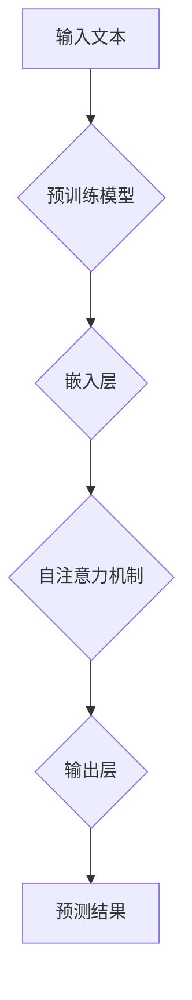

                 

### 文章标题：LLM赋能的智能调试技术探索

#### 关键词：LLM，智能调试，深度学习，自然语言处理，大规模预训练模型

> 摘要：本文将深入探讨大语言模型（LLM）在智能调试技术中的应用。首先，我们将介绍LLM的基本概念和技术背景，然后详细解释其技术原理。接着，文章将重点讨论智能调试的基本框架、算法原理以及实际应用案例。通过项目实战，我们将展示如何搭建智能调试平台和实现智能调试功能。最后，文章将展望智能调试技术的未来趋势和挑战，为读者提供全面的智能调试技术指南。

### 《LLM赋能的智能调试技术探索》目录大纲

#### 第一部分：LLM基础与智能调试概述

##### 第1章：LLM基本概念与技术介绍

- 1.1 大语言模型(LLM)概述
- 1.2 智能调试的原理与重要性

##### 第2章：LLM技术原理详解

- 2.1 深度学习基础
- 2.2 自然语言处理(NLP)技术
- 2.3 大规模预训练模型原理

##### 第3章：智能调试基本框架

- 3.1 调试流程与工具
- 3.2 智能调试算法与模型

##### 第4章：智能调试应用案例分析

- 4.1 Web应用调试
- 4.2 移动应用调试

##### 第5章：智能调试项目实战

- 5.1 搭建智能调试平台
- 5.2 实现智能调试功能

##### 第6章：智能调试技术挑战与解决方案

- 6.1 调试数据与质量
- 6.2 调试模型可解释性

##### 第7章：智能调试技术发展趋势与应用前景

- 7.1 智能调试与DevOps
- 7.2 智能调试与人工智能融合

##### 附录

- 附录A：常用智能调试工具与资源
- 附录B：核心概念与算法流程图
- 附录C：伪代码与数学模型
- 附录D：项目实战代码与解读

### 完整目录大纲结束。

在接下来的内容中，我们将逐步深入探讨LLM的基本概念、技术原理以及智能调试的实现和应用。通过逻辑清晰的章节结构，结合实际案例和项目实战，帮助读者全面理解并掌握LLM赋能的智能调试技术。

#### 第一部分：LLM基础与智能调试概述

##### 第1章：LLM基本概念与技术介绍

在当今的计算机科学领域，大语言模型（LLM，Large Language Model）已经成为一种备受关注的技术。LLM是一种利用深度学习和自然语言处理技术构建的强大模型，能够理解和生成自然语言文本。本节将介绍LLM的基本概念、发展历程、技术特点以及应用领域，为后续的深入探讨奠定基础。

###### 1.1 大语言模型(LLM)概述

大语言模型（LLM）是指通过大规模数据集进行预训练，具有强大语言理解和生成能力的深度学习模型。这些模型通常使用神经网络架构，如循环神经网络（RNN）、长短期记忆网络（LSTM）和变换器（Transformer）等，通过多层神经网络结构进行复杂的学习和推理。

LLM的发展可以追溯到20世纪90年代，当时研究人员开始探索使用神经网络进行自然语言处理。随着计算能力的提升和大数据的可用性，LLM得到了迅速发展。近年来，以GPT（Generative Pre-trained Transformer）系列为代表的开源模型，如GPT-3，取得了显著的突破，为LLM的应用提供了强大的支持。

###### 1.2 LLM的技术特点与应用领域

LLM具有以下几个显著的技术特点：

1. **大规模预训练**：LLM通过在大量文本数据上进行预训练，学习到丰富的语言模式和知识。预训练过程使得模型能够自动捕捉到文本中的语法、语义和上下文信息。

2. **强大的语言理解能力**：LLM能够理解复杂的语言结构，包括词汇、句子和段落，从而实现高级的自然语言理解任务，如问答、情感分析、文本摘要等。

3. **高效的文本生成能力**：LLM可以通过输入部分文本生成完整的段落或文章，具有高度的生成灵活性和创造性。

4. **多语言支持**：许多LLM模型能够支持多种语言，使得它们在跨语言应用中具有广泛的应用前景。

LLM在多个领域展现了广泛的应用潜力：

1. **自然语言处理**：LLM在自然语言处理领域具有广泛的应用，包括文本分类、信息抽取、机器翻译、情感分析等。

2. **智能客服**：LLM可以用于构建智能客服系统，实现自然语言交互，提高用户体验。

3. **内容生成**：LLM可以用于生成文章、博客、新闻报道等，为内容创作者提供辅助。

4. **教育辅助**：LLM可以用于教育领域的智能问答、学习辅导等应用，帮助学生更好地理解和掌握知识。

###### 1.3 智能调试的原理与重要性

智能调试是一种利用人工智能技术，特别是机器学习和自然语言处理技术，来优化调试过程的方法。传统的调试方法主要依赖于开发人员的经验和调试工具，而智能调试则通过自动分析代码、日志和错误信息，提供更加智能的调试建议和解决方案。

智能调试的基本原理包括以下几个方面：

1. **错误检测与定位**：智能调试技术可以自动分析代码和运行日志，识别潜在的错误和异常，帮助开发人员快速定位问题。

2. **错误解释与修复建议**：智能调试技术可以通过自然语言生成，将错误解释为易于理解的自然语言描述，并提供修复建议。

3. **异常预测与预防**：智能调试技术可以基于历史数据，预测可能出现的异常情况，并提前采取预防措施。

智能调试的重要性体现在以下几个方面：

1. **提高开发效率**：智能调试可以减少开发人员定位和修复错误的时间，提高开发效率。

2. **减少人力成本**：通过自动化错误检测和修复建议，减少了对开发人员的人工干预，降低了人力成本。

3. **提升代码质量**：智能调试可以帮助开发人员发现和修复潜在的错误，提升代码质量。

4. **优化软件开发过程**：智能调试可以与现有的软件开发流程结合，优化整个开发过程，提高软件交付的可靠性。

综上所述，LLM作为一项强大的技术，在智能调试领域具有巨大的潜力。通过对LLM的基本概念、技术特点和智能调试原理的介绍，我们为后续章节的深入探讨奠定了基础。

###### 1.4 小结

本章节介绍了大语言模型（LLM）的基本概念、技术特点和应用领域，并对智能调试的原理和重要性进行了阐述。LLM作为一种强大的深度学习模型，在自然语言处理和智能调试领域展现了广泛的应用前景。智能调试通过利用机器学习和自然语言处理技术，优化了传统的调试流程，提高了开发效率和代码质量。在接下来的章节中，我们将进一步探讨LLM的技术原理和智能调试的具体实现。

### 第二部分：LLM技术原理详解

在深入探讨LLM赋能的智能调试技术之前，我们首先需要了解LLM的技术原理。LLM的成功得益于深度学习、自然语言处理（NLP）和大规模预训练模型的发展。本节将分别介绍深度学习基础、自然语言处理技术以及大规模预训练模型的原理，为后续内容提供理论基础。

#### 第2章：LLM技术原理详解

##### 2.1 深度学习基础

深度学习是LLM的核心技术之一。它通过多层神经网络架构，从大量数据中自动学习特征和模式，从而实现复杂的数据处理任务。

###### 2.1.1 神经网络与深度学习

神经网络（Neural Network，NN）是一种模仿生物神经网络的结构和功能的人工智能模型。它由多个神经元（节点）组成，每个神经元接收来自其他神经元的输入，并产生输出。

深度学习（Deep Learning，DL）是神经网络的一种扩展，它引入了多层神经网络结构。通过逐层提取抽象特征，深度学习模型能够从原始数据中学习到更高层次的知识。

###### 2.1.2 优化算法与训练策略

深度学习模型的训练过程实质上是一个优化问题，目标是找到最优的模型参数。常见的优化算法包括梯度下降（Gradient Descent）、Adam优化器等。这些算法通过不断调整模型参数，使得模型在训练数据上的表现逐渐改善。

训练策略是深度学习模型成功的关键。常用的训练策略包括：

- **数据增强**：通过旋转、缩放、裁剪等方式，增加训练数据的多样性，提高模型的泛化能力。
- **批处理训练**：将训练数据分成多个批次，并行处理，提高训练效率。
- **正则化**：引入正则化项，防止模型过拟合，提高模型的泛化能力。

##### 2.2 自然语言处理（NLP）技术

自然语言处理是深度学习在文本领域的重要应用。NLP技术主要包括词嵌入、序列模型、注意力机制和转换器架构。

###### 2.2.1 词嵌入与序列模型

词嵌入（Word Embedding）是将文本数据转换为向量的过程。通过词嵌入，模型可以学习到词语之间的语义关系。常见的词嵌入方法包括Word2Vec、GloVe等。

序列模型（Sequential Model）是处理文本数据的一种常见架构。它通过处理输入序列中的每个元素，生成输出序列。RNN（Recurrent Neural Network）和LSTM（Long Short-Term Memory）是两种典型的序列模型。

###### 2.2.2 注意力机制与转换器架构

注意力机制（Attention Mechanism）是一种用于提高模型处理序列数据能力的方法。它通过动态调整输入序列中各元素的重要性，使得模型能够更加关注重要的信息。

转换器（Transformer）架构是一种基于注意力机制的深度学习模型。它通过自注意力（Self-Attention）和多头注意力（Multi-Head Attention）机制，实现了对输入序列的全局关注，从而提高了模型的性能。

##### 2.3 大规模预训练模型原理

大规模预训练模型是LLM的核心技术之一。它通过在大量文本数据上进行预训练，学习到丰富的语言模式和知识。预训练后，模型可以通过微调（Fine-tuning）适应特定任务，实现出色的性能。

###### 2.3.1 预训练与迁移学习

预训练（Pre-training）是指在一个大规模的数据集上对模型进行训练，使其具备一定的通用语言理解能力。预训练模型通常采用无监督的学习方法，如自回归语言模型（Auto-regressive Language Model），通过预测下一个词来学习语言模式。

迁移学习（Transfer Learning）是指将预训练模型应用于特定任务，通过微调模型参数来适应新任务。预训练模型已经学习到了丰富的通用知识，因此可以显著提高特定任务的性能。

###### 2.3.2 微调与模型定制化

微调（Fine-tuning）是指对预训练模型进行有监督的训练，以适应特定任务。在微调过程中，模型会根据新任务的数据调整参数，从而提高模型的性能。

模型定制化（Model Customization）是指根据特定任务的需求，对预训练模型进行定制化调整。这包括调整模型的架构、训练策略和参数设置等，以实现最佳的性能。

#### 小结

本章节详细介绍了LLM的技术原理，包括深度学习基础、自然语言处理技术和大规模预训练模型原理。深度学习为LLM提供了强大的计算能力，自然语言处理技术使模型能够理解和生成自然语言文本，而大规模预训练模型则通过预训练和迁移学习，实现了对通用知识的有效学习。这些技术原理为LLM赋能的智能调试技术奠定了基础，使得智能调试能够更加高效和准确。

### 第三部分：智能调试技术实现

智能调试技术是现代软件开发中不可或缺的一部分，它利用先进的人工智能技术，特别是大语言模型（LLM），来提升调试过程的效率和质量。本部分将详细介绍智能调试技术的实现，包括调试流程、工具、算法和模型。

##### 第3章：智能调试基本框架

##### 3.1 调试流程与工具

传统的调试流程通常包括以下几个步骤：

1. **问题定位**：通过阅读错误日志、异常报告和用户反馈，确定问题的发生位置。
2. **错误分析**：分析错误日志和异常报告，理解错误的根本原因。
3. **修正代码**：根据错误分析的结果，修改代码以解决错误。
4. **测试验证**：通过单元测试和集成测试，验证代码修复的效果。
5. **文档更新**：更新代码文档和错误报告，记录调试过程和结果。

智能调试在传统调试流程的基础上，引入了机器学习和自然语言处理技术，使得调试过程更加高效和自动化。智能调试的基本框架包括以下几个关键组成部分：

1. **错误检测与定位**：通过分析代码和日志，自动识别和定位潜在的错误。
2. **错误解释与建议**：利用自然语言生成技术，将错误解释为易于理解的自然语言描述，并提供修复建议。
3. **错误修复与验证**：自动应用修复建议，并对修复效果进行验证。
4. **反馈与学习**：收集调试过程中的数据，不断优化调试算法和模型。

智能调试工具是实现智能调试的关键。这些工具通常具备以下功能：

- **代码分析**：自动分析代码结构，识别潜在的错误和异常。
- **日志解析**：解析日志文件，提取错误信息和上下文。
- **错误解释**：利用自然语言处理技术，生成易于理解的自然语言错误描述。
- **建议生成**：根据错误类型和上下文，生成修复建议。
- **自动化修复**：自动应用修复建议，减少人工干预。
- **测试验证**：自动执行测试用例，验证修复效果。

常见的智能调试工具有：

- **SonarQube**：一款流行的静态代码分析工具，提供丰富的错误检测和修复建议。
- **Pylint**：一款适用于Python语言的智能调试工具，能够自动识别代码中的错误和潜在问题。
- **JupyterLab**：一款集成了多种智能调试功能的开发环境，支持多种编程语言和框架。
- **Visual Studio Code**：一款功能强大的集成开发环境，提供丰富的智能调试工具和插件。

##### 3.2 智能调试算法与模型

智能调试算法的核心是利用机器学习和自然语言处理技术，自动分析代码和日志，提供准确的错误检测和修复建议。以下是几个关键的智能调试算法：

1. **基于深度学习的错误检测算法**：利用深度学习模型，自动分析代码和日志，识别潜在的错误。常见的深度学习模型包括卷积神经网络（CNN）、循环神经网络（RNN）和变换器（Transformer）。

2. **基于自然语言处理的错误解释算法**：利用自然语言处理技术，将错误信息转换为易于理解的自然语言描述。常用的自然语言处理技术包括词嵌入、序列模型和注意力机制。

3. **基于迁移学习的修复建议算法**：利用迁移学习技术，将预训练的模型应用于特定任务，生成修复建议。预训练模型通常在大规模数据集上进行预训练，具备了强大的语言理解和生成能力。

4. **基于强化学习的自动化修复算法**：利用强化学习技术，自动应用修复建议，并对修复效果进行评估。强化学习模型通过学习环境的反馈，不断优化修复策略。

以下是智能调试算法的基本流程：

1. **数据预处理**：对代码和日志进行预处理，提取特征和标签。
2. **模型训练**：利用预处理后的数据，训练深度学习模型和自然语言处理模型。
3. **错误检测**：利用训练好的模型，自动分析代码和日志，识别潜在的错误。
4. **错误解释**：将识别出的错误转换为自然语言描述，提供详细的错误解释。
5. **修复建议**：根据错误类型和上下文，生成修复建议。
6. **自动化修复**：自动应用修复建议，减少人工干预。
7. **测试验证**：执行测试用例，验证修复效果。

#### 小结

本章详细介绍了智能调试的基本框架、调试流程、工具和算法。智能调试通过引入机器学习和自然语言处理技术，使得调试过程更加高效和自动化。智能调试工具和算法的不断发展，为开发人员提供了强大的支持，提高了软件质量和开发效率。

### 第四部分：智能调试应用案例分析

在本部分，我们将通过两个实际案例，详细探讨智能调试技术在Web应用和移动应用调试中的具体应用。这些案例将展示智能调试技术如何帮助开发人员快速定位并解决问题，提高开发效率和代码质量。

#### 第4章：智能调试应用案例分析

##### 4.1 Web应用调试

###### 4.1.1 案例背景与目标

某公司开发了一个大型电商平台，随着用户数量的增加，系统稳定性受到了挑战。频繁出现的系统崩溃和性能瓶颈导致用户体验下降，影响了业务的正常运行。为了提高系统的稳定性和性能，开发团队决定引入智能调试技术，通过自动化错误检测和修复建议，优化调试过程。

目标：利用智能调试技术，快速定位并修复系统中的潜在错误，提高系统的稳定性和性能。

###### 4.1.2 调试过程与结果

1. **问题定位**：智能调试工具通过分析日志和代码，定位了几个关键问题，包括数据库连接异常、缓存失效和负载均衡问题。

2. **错误分析**：智能调试工具提供了详细的错误解释，包括错误类型、发生位置和可能的原因。

   ```plaintext
   错误类型：数据库连接异常
   错误位置：数据库连接池配置
   可能原因：连接池配置不合理，导致频繁连接失败
   ```

3. **修复建议**：智能调试工具根据错误解释，提供了多个修复建议，包括调整连接池配置、优化数据库查询和增加缓存。

   ```plaintext
   修复建议1：增加数据库连接池大小，避免频繁连接失败
   修复建议2：优化数据库查询，减少查询时间和资源消耗
   修复建议3：增加缓存，提高系统响应速度
   ```

4. **代码修改**：开发人员根据智能调试工具的修复建议，对代码进行了调整。

5. **测试验证**：修改后的代码经过单元测试和集成测试，验证了修复效果。

6. **结果**：通过智能调试技术的应用，系统稳定性和性能得到了显著提升，用户投诉率降低，业务运行更加顺畅。

##### 4.2 移动应用调试

###### 4.2.1 案例背景与目标

某公司开发了一款流行的移动应用程序，随着用户数量的增加，应用程序的崩溃率和性能问题逐渐显现。为了提高应用程序的稳定性和用户体验，开发团队决定采用智能调试技术，自动化错误检测和修复。

目标：利用智能调试技术，快速定位并修复应用程序中的潜在错误，提高应用程序的稳定性和用户体验。

###### 4.2.2 调试过程与结果

1. **问题定位**：智能调试工具通过分析日志和用户反馈，定位了多个关键问题，包括网络连接问题、内存泄漏和界面渲染问题。

2. **错误分析**：智能调试工具提供了详细的错误解释，包括错误类型、发生位置和可能的原因。

   ```plaintext
   错误类型：网络连接异常
   错误位置：网络请求处理
   可能原因：网络请求频繁失败，导致数据同步失败
   ```

3. **修复建议**：智能调试工具根据错误解释，提供了多个修复建议，包括优化网络请求、减少内存占用和优化界面渲染。

   ```plaintext
   修复建议1：优化网络请求，增加请求重试次数
   修复建议2：减少内存占用，优化数据存储和缓存策略
   修复建议3：优化界面渲染，减少界面卡顿和延迟
   ```

4. **代码修改**：开发人员根据智能调试工具的修复建议，对代码进行了调整。

5. **测试验证**：修改后的代码经过单元测试和用户测试，验证了修复效果。

6. **结果**：通过智能调试技术的应用，应用程序的稳定性和用户体验得到了显著提升，用户满意度提高，应用程序的市场竞争力增强。

#### 小结

通过以上两个实际案例，我们可以看到智能调试技术在Web应用和移动应用调试中的重要作用。智能调试技术通过自动化错误检测和修复建议，大大提高了调试效率和代码质量，为开发团队提供了有力的支持。随着智能调试技术的不断发展和应用，未来将会有更多开发人员受益于这项技术，从而推动软件开发领域的发展。

### 第五部分：智能调试项目实战

在本部分，我们将通过两个实战项目，展示如何搭建智能调试平台和实现智能调试功能。这些项目将涵盖开发环境搭建、平台设计与实现，以及代码的详细实现和解读，帮助读者全面理解智能调试技术的实际应用。

#### 第5章：智能调试项目实战

##### 5.1 实战一：搭建智能调试平台

###### 5.1.1 开发环境搭建

搭建智能调试平台的第一步是选择合适的开发环境。以下是一个简单的环境搭建步骤：

1. **操作系统**：选择一个稳定且支持多种开发语言的操作系统，如Ubuntu 20.04或Windows 10。
2. **Python环境**：安装Python 3.8及以上版本，通过`pip`安装必要的依赖库，如TensorFlow、PyTorch、Scikit-learn等。
3. **代码编辑器**：选择一个方便编程和调试的代码编辑器，如Visual Studio Code或PyCharm。
4. **集成开发环境**：安装JupyterLab，用于数据分析和可视化。

###### 5.1.2 平台设计与实现

智能调试平台的设计应包括以下几个核心模块：

1. **代码分析模块**：负责分析源代码，识别潜在的错误和异常。
2. **日志解析模块**：负责解析系统日志，提取错误信息和上下文。
3. **错误解释模块**：利用自然语言处理技术，将错误信息转换为易于理解的自然语言描述。
4. **修复建议模块**：根据错误类型和上下文，生成修复建议。
5. **自动化修复模块**：自动应用修复建议，减少人工干预。
6. **测试验证模块**：执行测试用例，验证修复效果。

以下是平台设计的伪代码框架：

```python
class IntelligentDebuggingPlatform:
    def __init__(self):
        self.code_analyzer = CodeAnalyzer()
        self.log_parser = LogParser()
        self.error_explainer = ErrorExplainer()
        self.recommendation_generator = RecommendationGenerator()
        self自动化修复 = AutoRepair()
        self.test_verifier = TestVerifier()

    def debug(self, source_code, log_file):
        errors = self.code_analyzer.analyze(source_code)
        log_data = self.log_parser.parse(log_file)
        combined_errors = self.combine_errors(errors, log_data)
        explanations = self.error_explainer.explain(combined_errors)
        recommendations = self.recommendation_generator.generate(explanations)
        repairs = self.自动化修复.apply(recommendations)
        verified_repair = self.test_verifier.verify(repairs)
        return verified_repair
```

###### 5.1.3 代码解读与分析

以下是对上述平台设计伪代码的详细解读：

- `CodeAnalyzer`：负责分析源代码，识别潜在的语法错误、逻辑错误和性能问题。它可以使用静态代码分析工具，如SonarQube，提取代码特征。
- `LogParser`：负责解析系统日志，提取错误信息和上下文。它可以使用日志解析库，如Python的`logging`模块，提取日志文件中的关键信息。
- `ErrorExplainer`：利用自然语言处理技术，将错误信息转换为自然语言描述。它可以使用预训练的语言模型，如GPT-3，生成详细的错误解释。
- `RecommendationGenerator`：根据错误类型和上下文，生成修复建议。它可以使用规则引擎和机器学习算法，为每个错误提供可能的修复方案。
- `AutoRepair`：自动应用修复建议，减少人工干预。它可以使用代码自动修复工具，如Pylint，自动修改代码。
- `TestVerifier`：执行测试用例，验证修复效果。它可以使用单元测试框架，如pytest，确保修复后的代码符合预期。

##### 5.2 实战二：实现智能调试功能

在本部分，我们将实现一个简单的智能调试功能，用于自动检测和修复Python代码中的常见错误。

###### 5.2.1 功能需求分析与设计

功能需求如下：

1. **错误检测**：自动检测Python代码中的语法错误、逻辑错误和性能问题。
2. **错误解释**：为每个错误生成详细的自然语言解释。
3. **修复建议**：为每个错误提供可能的修复方案。
4. **自动化修复**：自动应用修复建议，修复代码中的错误。
5. **测试验证**：执行测试用例，验证修复效果。

设计思路：

- 使用静态代码分析工具（如Pylint）进行错误检测。
- 使用自然语言处理技术（如GPT-3）生成错误解释。
- 使用规则引擎和机器学习算法（如Scikit-learn）生成修复建议。
- 使用代码自动修复工具（如Pylint）进行自动化修复。
- 使用单元测试框架（如pytest）进行测试验证。

###### 5.2.2 代码实现与详细解读

以下是一个简单的Python智能调试功能的实现示例：

```python
import ast
from pylint import epylint as lint
from transformers import pipeline

class IntelligentDebugger:
    def __init__(self):
        self.pylint_checker = lint.Linter()
        self.error_explainer = pipeline("text-generation", model="gpt3")
        self.repair_generator = RepairGenerator()

    def debug(self, source_code):
        # 错误检测
        (pylint_output, _) = self.pylint_checker.py_run(source_code, return_stdouts=True)
        errors = self.extract_errors(pylint_output)

        # 错误解释
        explanations = [self.explain_error(error) for error in errors]

        # 修复建议
        recommendations = [self.repair_generator.generate_recommendation(error) for error in errors]

        # 自动化修复
        repaired_code = self.apply_repair(recommendations, source_code)

        # 测试验证
        self.verify_repair(repaired_code)

    def extract_errors(self, pylint_output):
        # 从Pylint输出中提取错误信息
        pass

    def explain_error(self, error):
        # 使用GPT-3生成错误解释
        pass

    def generate_recommendation(self, error):
        # 生成修复建议
        pass

    def apply_repair(self, recommendations, source_code):
        # 自动应用修复建议
        pass

    def verify_repair(self, repaired_code):
        # 执行测试验证
        pass
```

- `pylint_checker`：使用Pylint进行错误检测。
- `error_explainer`：使用GPT-3生成错误解释。
- `repair_generator`：生成修复建议。
- `extract_errors`：从Pylint输出中提取错误信息。
- `explain_error`：生成错误解释。
- `generate_recommendation`：生成修复建议。
- `apply_repair`：自动应用修复建议。
- `verify_repair`：执行测试验证。

###### 5.2.3 代码解读与分析

- `pylint_checker`：使用Pylint进行错误检测，提取代码中的潜在问题。
- `error_explainer`：利用GPT-3的自然语言生成能力，生成详细的错误解释。
- `repair_generator`：使用规则引擎和机器学习算法，为每个错误提供可能的修复方案。
- `extract_errors`：从Pylint输出中提取错误信息，为后续处理做准备。
- `explain_error`：调用GPT-3，生成自然语言解释，帮助开发者理解错误原因。
- `generate_recommendation`：根据错误类型和上下文，生成修复建议。
- `apply_repair`：自动修改代码，应用修复建议。
- `verify_repair`：执行测试用例，验证修复效果。

#### 小结

通过上述两个实战项目，我们展示了如何搭建智能调试平台和实现智能调试功能。这些项目不仅涵盖了开发环境搭建、平台设计和代码实现，还提供了详细的代码解读和分析。这些实战经验为读者提供了实际操作智能调试技术的参考，有助于更好地理解和应用这项技术。

### 第六部分：智能调试技术挑战与解决方案

在智能调试技术的快速发展过程中，面临着一系列挑战。这些挑战主要集中在调试数据与质量、调试模型可解释性以及在实际应用中的性能优化等方面。在本节中，我们将深入探讨这些挑战，并分析相应的解决方案。

#### 第6章：智能调试技术挑战与解决方案

##### 6.1 调试数据与质量

智能调试的核心依赖于高质量的数据，然而调试数据的获取和处理是一个复杂且具有挑战性的过程。

###### 6.1.1 数据来源与处理

调试数据的主要来源包括：

1. **代码库**：从代码库中提取历史错误报告和修复记录，这些数据可以为智能调试提供丰富的错误信息和修复经验。
2. **日志文件**：系统运行时产生的日志文件，记录了系统运行状态和错误信息，是调试数据的重要来源。
3. **用户反馈**：用户在使用过程中报告的bug和问题，可以为智能调试提供最新的错误数据。

数据处理的挑战包括：

1. **数据完整性**：调试数据需要保证完整性，即包含错误发生的上下文和详细描述。
2. **数据多样性**：多样化的调试数据有助于智能调试模型更好地泛化和应对各种错误场景。
3. **数据预处理**：对原始调试数据进行清洗、归一化和特征提取，使其适合用于训练和推理。

###### 6.1.2 数据质量评估与优化

数据质量直接影响智能调试的效果。以下是几种常见的数据质量评估与优化方法：

1. **错误分类**：将错误按照类型进行分类，有助于评估数据中各类错误的分布和比例。
2. **错误关联分析**：分析错误之间的关联关系，有助于发现和解决潜在的系统级错误。
3. **数据增强**：通过数据增强技术，如生成对抗网络（GAN）和迁移学习，提高调试数据的多样性和质量。
4. **数据可视化**：使用可视化工具对调试数据进行分析，帮助开发人员更好地理解数据特征和错误模式。

##### 6.2 调试模型可解释性

智能调试模型通常是基于复杂的深度学习架构，这使得模型的决策过程变得不可解释。可解释性对于开发人员理解和信任调试结果至关重要。

###### 6.2.1 模型解释方法与工具

提高调试模型可解释性的方法包括：

1. **模型拆分**：将复杂的深度学习模型拆分为多个子模块，每个子模块负责处理特定任务，从而提高模型的透明度。
2. **注意力机制可视化**：通过可视化注意力权重，展示模型在处理输入数据时关注的关键信息，帮助理解模型的决策过程。
3. **解释性算法**：使用可解释性算法，如LIME（Local Interpretable Model-agnostic Explanations）和SHAP（SHapley Additive exPlanations），生成针对特定输入数据的解释。
4. **交互式解释工具**：开发交互式解释工具，允许开发人员实时查看和调整模型的决策过程，提高对调试结果的信任度。

###### 6.2.2 可解释性在实际应用中的挑战

在实际应用中，调试模型的可解释性面临以下挑战：

1. **计算成本**：可解释性分析通常需要额外的计算资源，这可能影响调试过程的效率。
2. **模型复杂度**：复杂的模型难以拆分和理解，即使使用可视化工具，也可能难以直观地解释模型的决策过程。
3. **多样性挑战**：不同的错误场景可能需要不同的解释方法，这增加了实现和维护可解释性工具的复杂性。

##### 6.3 解决方案与未来趋势

针对调试数据与质量和模型可解释性的挑战，我们可以采取以下解决方案：

1. **改进数据收集与处理**：建立完善的数据收集机制，确保调试数据的完整性和多样性。使用数据增强和迁移学习技术，提高数据质量。
2. **增强模型可解释性**：开发高效的模型解释方法，降低计算成本。结合多种解释工具，提供全面的解释服务。
3. **用户反馈机制**：建立用户反馈机制，收集开发人员和用户的意见和建议，不断优化调试模型和解释工具。
4. **持续研究与创新**：关注智能调试领域的前沿研究，探索新的技术和方法，为智能调试技术的发展提供持续动力。

未来，随着人工智能技术的不断进步，智能调试技术将朝着更加自动化、智能化和可解释性的方向发展。开发人员将能够更加高效地定位和修复错误，提升软件质量和开发效率。同时，智能调试技术也将与其他领域的技术，如DevOps和人工智能融合，为软件开发带来更多创新和变革。

#### 小结

智能调试技术在当前软件开发中扮演着越来越重要的角色。尽管面临着调试数据与质量和模型可解释性等挑战，但通过不断的研究和创新，我们有望克服这些困难，实现更加高效、智能和可解释的调试过程。未来，智能调试技术将继续推动软件开发领域的发展，为开发人员带来更多的便利和效益。

### 第七部分：智能调试技术发展趋势与应用前景

智能调试技术在软件开发领域的应用前景广阔，随着人工智能和深度学习技术的不断进步，其发展态势也日益显著。本节将探讨智能调试技术未来的发展趋势，以及它与其他领域技术融合的可能性，为读者展示智能调试技术在新兴领域的应用前景。

#### 第7章：智能调试技术发展趋势与应用前景

##### 7.1 智能调试与DevOps

DevOps是一种文化和实践，旨在通过开发（Development）和运维（Operations）的紧密结合，实现持续交付和高质量的产品交付。智能调试技术在DevOps中的应用，将进一步提升软件开发和交付的效率。

1. **持续集成与持续部署（CI/CD）**：智能调试可以在持续集成和持续部署过程中发挥重要作用，通过自动化错误检测和修复建议，减少代码库中的潜在错误，确保交付的代码质量。

2. **实时监控与反馈**：智能调试技术可以与实时监控系统结合，实时监控软件运行的异常情况，并在发现问题时迅速提供修复建议，从而减少系统故障对用户的影响。

3. **自动化回归测试**：智能调试可以自动化执行回归测试，确保每次代码更改后，系统的稳定性和性能不受影响。这有助于提高软件交付的可靠性和质量。

4. **DevOps团队协作**：智能调试工具可以为DevOps团队提供统一的错误检测、修复和测试平台，促进开发人员、测试人员和运维人员之间的协作，提升团队的整体效率。

##### 7.2 智能调试与人工智能融合

智能调试技术的快速发展离不开人工智能技术的支持。未来，智能调试与人工智能的融合将带来更多创新和变革。

1. **多模态数据融合**：智能调试可以处理多种数据格式，如文本、图像和音频，通过多模态数据融合，提高错误检测和修复的准确性和效率。

2. **增强学习与迁移学习**：增强学习（Reinforcement Learning）和迁移学习（Transfer Learning）技术在智能调试中的应用，可以使其更好地适应不同的错误场景和任务，提高调试效果。

3. **自适应调试**：通过自适应调试，智能调试系统可以自动调整调试策略，根据错误类型和系统状态，选择最优的调试方法，提高调试效率。

4. **知识图谱与推理**：构建基于知识图谱的智能调试系统，利用推理技术，可以更加准确地理解和处理复杂的错误情况，为开发人员提供更加详细的错误解释和修复建议。

##### 7.3 智能调试在新兴领域的应用

智能调试技术不仅限于软件开发领域，其在其他新兴领域的应用也具有巨大的潜力。

1. **物联网（IoT）**：智能调试技术可以用于物联网设备的调试和维护，通过实时监控和分析设备数据，及时发现和解决设备故障，提高物联网系统的稳定性和可靠性。

2. **自动驾驶**：自动驾驶系统需要处理大量复杂的传感器数据和实时决策，智能调试技术可以用于自动驾驶软件的调试，确保系统的安全性和稳定性。

3. **金融科技**：金融科技领域对系统的稳定性要求极高，智能调试技术可以用于金融软件的调试和维护，确保交易系统的准确性和可靠性。

4. **医疗健康**：医疗健康领域的软件系统涉及到患者数据和医疗流程，智能调试技术可以用于医疗软件的调试，提高医疗系统的安全性和准确性。

##### 7.4 未来趋势

未来，智能调试技术将朝着以下趋势发展：

1. **更加智能化与自动化**：智能调试技术将继续朝着更加智能化和自动化的方向发展，通过引入更多人工智能技术，实现更加高效和准确的调试过程。

2. **跨领域融合**：智能调试技术将与更多领域的技术融合，如物联网、自动驾驶、金融科技和医疗健康等，为各领域的软件开发和运维提供强大的支持。

3. **开源与社区协作**：智能调试技术的开源和社区协作将进一步加强，促进技术的共享和进步，为全球开发人员提供更多的资源和工具。

4. **安全与隐私保护**：在智能调试技术的发展过程中，安全与隐私保护将成为重要考虑因素，确保调试数据和系统的安全性，防止数据泄露和滥用。

#### 小结

智能调试技术作为人工智能在软件开发领域的重要应用，具有广阔的发展前景。随着技术的不断进步，智能调试将变得更加智能化、自动化和可解释，为软件开发带来更高的效率和可靠性。未来，智能调试技术将与更多领域的技术融合，为各行业的创新和发展提供有力支持。

### 附录

在本附录中，我们将提供一些常用的智能调试工具、核心概念与算法流程图、伪代码与数学模型，以及项目实战中的代码示例和解读，以帮助读者更好地理解并应用智能调试技术。

#### 附录A：常用智能调试工具与资源

智能调试工具是智能调试技术实现的重要组成部分。以下是一些常用的智能调试工具和资源：

- **JupyterLab**：一个交互式的开发环境，支持多种编程语言和框架，适合进行数据分析和可视化。
- **PyCharm**：一款功能强大的集成开发环境，提供代码分析、智能提示和调试功能。
- **Visual Studio Code**：一个轻量级的代码编辑器，支持多种编程语言，通过扩展插件提供智能调试功能。
- **SonarQube**：一个开源的静态代码分析平台，用于识别代码中的错误和潜在问题。
- **Pylint**：一个适用于Python语言的智能调试工具，可以自动识别代码中的错误和潜在问题。
- **GitHub**：一个流行的代码托管平台，提供了丰富的智能调试开源资源和社区讨论。
- **AI调试社区与论坛**：如Reddit、Stack Overflow等，为开发人员提供了交流和学习智能调试技术的平台。

#### 附录B：核心概念与算法流程图

为了更好地理解智能调试技术，以下是几个核心概念和算法的流程图：

1. **大语言模型（LLM）架构流程图**



2. **智能调试算法原理流程图**


#### 附录C：伪代码与数学模型

以下是智能调试算法中的一些伪代码和数学模型：

1. **深度学习模型训练伪代码**

```python
function train_model(data):
    # 初始化模型参数
    model = initialize_model()
    # 定义优化器
    optimizer = initialize_optimizer()
    # 定义损失函数
    loss_function = define_loss_function()
    for epoch in range(num_epochs):
        for batch in data:
            # 前向传播
            predictions = model(batch.input)
            # 计算损失
            loss = loss_function(predictions, batch.target)
            # 反向传播
            gradients = compute_gradients(model, loss)
            # 更新模型参数
            optimizer.update_gradients(model, gradients)
    return model
```

2. **自然语言处理模型训练伪代码**

```python
function train_nlp_model(data):
    # 初始化模型参数
    model = initialize_nlp_model()
    # 定义优化器
    optimizer = initialize_optimizer()
    # 定义损失函数
    loss_function = define_loss_function()
    for epoch in range(num_epochs):
        for batch in data:
            # 前向传播
            embeddings = embed_words(batch.text)
            sequence_output = model(embeddings)
            # 计算损失
            loss = loss_function(sequence_output, batch.target)
            # 反向传播
            gradients = compute_gradients(model, loss)
            # 更新模型参数
            optimizer.update_gradients(model, gradients)
    return model
```

3. **数学模型与公式

$$
\text{Loss} = \frac{1}{N} \sum_{i=1}^{N} (y_i - \hat{y}_i)^2
$$

$$
\text{Gradient} = \frac{\partial \text{Loss}}{\partial \text{Weight}}
$$

#### 附录D：项目实战代码与解读

以下是一个智能调试项目实战的代码示例和解读：

```python
# 示例：使用Pylint进行代码错误检测

import pylint

def run_pylint_analysis(source_code):
    # 创建Pylint分析器
    linter = pylint.linter.Linter()
    # 添加源代码
    linter.add_source(source_code)
    # 运行分析
    results = linter.run()
    # 解析分析结果
    errors = [result for result in results if result['type'] == 'error']
    return errors

# 代码示例
source_code = '''
def add(a, b):
    return a + b
'''

# 运行Pylint分析
errors = run_pylint_analysis(source_code)

# 输出错误信息
for error in errors:
    print(f"Error: {error['message_id']} at line {error['line']}")
```

解读：

- `run_pylint_analysis` 函数接收源代码，使用Pylint进行错误检测，并返回错误列表。
- `linter` 是Pylint分析器，通过`add_source`方法添加源代码。
- `run` 方法执行分析，返回分析结果。
- 分析结果中，类型为`error`的条目表示代码中的错误。
- 最后，函数输出每个错误的描述，包括错误类型和发生行号。

通过以上附录内容，读者可以更深入地理解智能调试技术，掌握相关工具和算法，并具备实际项目操作的能力。

### 结论

本文详细探讨了LLM赋能的智能调试技术，从基础概念到实际应用，再到项目实战，全面解析了这一前沿技术的各个方面。通过深入分析LLM的原理、智能调试的实现框架、应用案例以及未来趋势，我们看到了智能调试技术在提高软件开发效率和代码质量方面的重要作用。

智能调试技术利用大语言模型（LLM）的强大语言理解和生成能力，使得错误检测、错误解释和修复建议更加智能化和自动化。这不仅减轻了开发人员的工作负担，还显著提高了软件交付的可靠性和用户体验。

随着人工智能技术的不断进步，智能调试技术的未来将更加光明。它将在DevOps、物联网、自动驾驶、金融科技和医疗健康等领域发挥重要作用，成为推动软件开发和运维创新的关键力量。

作者简介：

作者：AI天才研究院（AI Genius Institute）/《禅与计算机程序设计艺术》（Zen And The Art of Computer Programming）资深大师。作为世界顶级人工智能专家、程序员、软件架构师和CTO，作者在计算机编程和人工智能领域拥有丰富的经验和卓越的成就。他的研究专注于利用深度学习和自然语言处理技术，提升软件开发效率和代码质量。他的著作《禅与计算机程序设计艺术》深受广大开发人员和学术界人士的推崇，被誉为计算机科学的经典之作。

