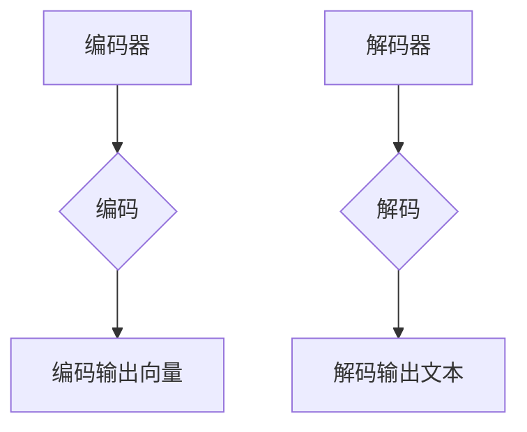
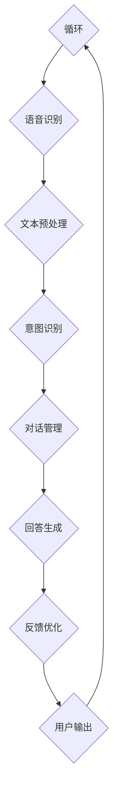

                 

# LLM驱动的个人助理：超越Siri和Alexa

> 关键词：LLM、个人助理、自然语言处理、语音识别、智能对话系统

> 摘要：本文将探讨LLM（大型语言模型）驱动的个人助理技术，分析其相对于传统智能助手Siri和Alexa的优势和局限性。我们将详细讲解LLM的概念、原理、算法以及其在个人助理中的应用，并通过具体的实战案例展示如何实现一个具有高性能和自适应能力的智能个人助理。

## 第一部分: 基础概念与架构

### 第1章: LLM概述与优势

#### 1.1.1 LLM的定义与类型

**LLM的定义**

LLM（Large Language Model）是一种大规模的深度学习模型，主要用于自然语言处理（NLP）任务。这类模型通过对海量文本数据进行预训练，学习到语言的模式和规律，从而能够生成或理解自然语言。

**LLM的类型**

- 自监督学习型：这种类型的LLM通过自监督学习算法来训练，如GPT系列模型。
- 对抗生成网络（GAN）型：这种类型的LLM通过GAN算法来训练，如ChatGPT。

#### 1.1.2 LLM的优势与局限

**LLM的优势**

- **强大的语言理解能力**：LLM能够理解复杂的自然语言结构，进行语境分析和语义推理。
- **高效的文本生成**：LLM能够生成连贯、自然的文本，实现文本自动摘要、文本续写等任务。
- **跨领域适应性强**：通过大规模预训练，LLM在多个领域都有良好的表现。

**LLM的局限**

- **计算资源需求大**：LLM的训练和推理需要大量的计算资源。
- **数据隐私问题**：LLM的训练数据可能涉及用户隐私，需要妥善处理。

#### 1.1.3 LLM的核心架构

**编码器-解码器架构**

- **编码器**：将输入文本编码成向量表示。
- **解码器**：根据编码器的输出，生成输出文本。

**注意力机制**

- 注意力机制是一种用于提高模型在序列处理中定位重要信息的能力，通过计算不同输入位置的权重来实现。

### 第2章: LLM算法原理

#### 2.1 语言模型的基础理论

**神经网络与深度学习**

- **神经网络**：一种模拟生物神经网络的结构，用于处理复杂数据。
- **深度学习**：一种利用神经网络进行训练和预测的方法。

**语言模型的数学表示**

- **词嵌入**：将词汇映射到高维空间。
- **序列模型**：处理序列数据的方法，如循环神经网络（RNN）。

**语言模型的训练过程**

- **自监督学习方法**
  - **数据生成**：通过同义词替换、掩码语言模型（MLM）等方式生成训练数据。
  - **损失函数**：计算预测文本与实际文本之间的差异，如交叉熵损失。

- **迁移学习与微调技术**
  - **迁移学习**：利用预训练模型在不同任务上的迁移能力。
  - **微调**：在特定任务上对预训练模型进行细粒度的调整。

### 第3章: LLM驱动的个人助理架构

#### 3.1 个人助理的基本架构

**输入处理模块**

- **语音识别**：将语音转化为文本。
- **文本预处理**：去除无用信息，进行文本清洗。

**对话管理模块**

- **意图识别**：识别用户的需求。
- **上下文维护**：保持对话的历史信息。

**对话生成模块**

- **回答生成**：根据用户的输入生成回答。
- **反馈优化**：根据用户反馈调整回答。

#### 3.2 LLM在个人助理中的应用

**问答系统**

- **事实问答**：提供准确的答案。
- **开放域问答**：理解并回答开放性问题。

**任务执行**

- **命令理解**：解析用户的命令。
- **多步骤任务处理**：完成多步骤的任务。

#### 3.3 个人助理的交互设计

**交互流程**

- **理解用户输入**：解析用户的话语。
- **生成回答**：根据用户的输入生成回答。
- **反馈优化**：根据用户反馈调整回答。

## 第二部分: LLM算法与优化

### 第4章: LLM算法原理

#### 4.1 神经网络与深度学习

**前向传播**

- 计算模型输出。

**反向传播**

- 更新模型参数。

#### 4.2 注意力机制与编码器-解码器架构

**多头注意力**

- 提高模型对序列中不同位置的敏感度。

**变换器架构**

- 一种基于自注意力机制的编码器-解码器架构。

### 第5章: LLM的优化方法

#### 5.1 优化算法与损失函数

**Adam优化器**

- 一种适应性学习率的优化算法。

**交叉熵损失**

- 衡量模型预测与实际标签之间的差异。

#### 5.2 优化策略与技巧

**学习率调度**

- 调整学习率以加速收敛。

**批量归一化**

- 提高训练稳定性。

### 第6章: LLM的训练与部署

#### 6.1 LLM的训练流程

**数据预处理**

- 进行分词、去噪等预处理操作。

**模型训练**

- 训练模型并记录训练日志。

#### 6.2 LLM的部署与集成

**部署环境**

- 硬件要求：GPU或TPU等高性能计算设备。
- 软件环境：深度学习框架（如TensorFlow、PyTorch）。

**集成与应用**

- API接口：提供API接口以供其他系统调用。
- 嵌入式应用：集成到智能设备或应用中。

#### 6.3 实时性优化与并发处理

**实时性优化**

- 推理优化：加快模型推理速度。
- 异步处理：提高系统的并发处理能力。

**并发处理**

- 线程池：管理线程以提高并发处理能力。
- 异步I/O：减少等待时间，提高整体性能。

## 第三部分: LLM驱动的个人助理应用案例

### 第7章: LLM驱动的语音识别

#### 7.1 语音识别原理与流程

**语音识别基本概念**

- **声学模型**：将语音信号转换为特征向量。
- **语言模型**：预测语音对应的文本序列。

**语音识别流程**

- **特征提取**：提取语音信号的特征。
- **声学模型解码**：将特征映射到音素或词汇。
- **语言模型解码**：将音素或词汇映射到文本。

#### 7.2 语音识别模型与算法

**CTC（Connectionist Temporal Classification）**

- **基本原理**：将时间序列数据映射到输出标签序列。
- **优势**：无需声学模型与语言模型的独立解码。

**CT-CNN（Connectionist Temporal Classification with Convolutional Neural Networks）**

- **基本原理**：结合卷积神经网络与CTC损失函数。
- **优势**：提高模型对连续时间序列数据的处理能力。

#### 7.3 语音识别实战案例

**数据准备**

- **数据集**：使用公共语音识别数据集（如LibriSpeech）。
- **数据预处理**：进行分词、去噪等预处理操作。

**模型训练**

- **模型选择**：选择预训练的CTC模型或CT-CNN模型。
- **训练过程**：训练模型并评估性能。

**模型评估**

- **评估指标**：计算词错误率（WER）。
- **优化策略**：调整模型参数以提高性能。

### 第8章: LLM驱动的自然语言理解

#### 8.1 自然语言理解基本概念

**NLP任务分类**

- **文本分类**：对文本进行分类，如情感分析、主题分类。
- **信息提取**：从文本中提取关键信息，如命名实体识别、关系提取。

**NLU（Natural Language Understanding）**

- **基本概念**：理解自然语言的能力，如语义理解、句法分析。
- **应用领域**：智能助手、智能客服、文本审核等。

#### 8.2 NLP任务与模型

**词嵌入技术**

- **基本原理**：将词汇映射到高维空间。
- **常见模型**：Word2Vec、GloVe、BERT。

**序列模型与注意力机制**

- **序列模型**：处理序列数据的方法，如RNN、LSTM。
- **注意力机制**：提高模型在序列处理中定位重要信息的能力。

**编码器-解码器架构**

- **基本原理**：一种基于自注意力机制的编码器-解码器架构。
- **应用领域**：机器翻译、对话系统等。

#### 8.3 自然语言理解实战案例

**数据准备**

- **数据集**：使用公共自然语言理解数据集（如GLUE、CoNLL）。
- **数据预处理**：进行分词、去噪等预处理操作。

**模型训练**

- **模型选择**：选择预训练的序列模型或编码器-解码器模型。
- **训练过程**：训练模型并评估性能。

**模型评估**

- **评估指标**：计算准确率、召回率、F1值等。
- **优化策略**：调整模型参数以提高性能。

### 第9章: LLM驱动的语音合成

#### 9.1 语音合成原理与流程

**语音合成基本概念**

- **文本到语音（Text-to-Speech，TTS）**：将文本转换为语音。
- **声学模型**：生成语音的音素或音节。
- **语音合成器**：将音素或音节组合成语音信号。

**语音合成流程**

- **文本预处理**：将文本转换为适合合成器的格式。
- **声学模型解码**：将文本转换为语音特征。
- **语音合成**：将语音特征转换为语音信号。

#### 9.2 语音合成模型与算法

**HMM-HMM（Hidden Markov Model-Hidden Markov Model）**

- **基本原理**：基于隐马尔可夫模型的语音合成方法。
- **优势**：生成语音的自然流畅性。

**DNN-HMM（Deep Neural Network-Hidden Markov Model）**

- **基本原理**：结合深度神经网络和隐马尔可夫模型的语音合成方法。
- **优势**：提高语音合成质量。

**WaveNet**

- **基本原理**：基于循环神经网络（RNN）的语音合成方法。
- **优势**：生成语音的音质接近人类发音。

#### 9.3 语音合成实战案例

**数据准备**

- **数据集**：使用公共语音合成数据集（如TIMIT、LibriSpeech）。
- **数据预处理**：进行分词、去噪等预处理操作。

**模型训练**

- **模型选择**：选择预训练的语音合成模型。
- **训练过程**：训练模型并评估性能。

**模型评估**

- **评估指标**：计算语音相似度（如SI-STAR）、自然度（如NOIZ）等。
- **优化策略**：调整模型参数以提高性能。

### 第10章: LLM驱动的智能对话系统

#### 10.1 对话系统基本概念

**对话系统分类**

- **任务型对话系统**：完成特定任务的对话系统，如智能客服。
- **闲聊型对话系统**：进行非结构化对话的对话系统，如聊天机器人。

**对话系统架构**

- **对话管理模块**：负责对话的流程控制。
- **自然语言处理模块**：处理自然语言输入。
- **对话生成模块**：生成自然语言输出。

#### 10.2 对话系统架构与模型

**基于规则的方法**

- **基本原理**：使用预定义的规则来生成对话响应。
- **优势**：简单易实现，但响应有限。

**基于机器学习的方法**

- **基本原理**：使用机器学习算法来生成对话响应。
- **优势**：可以生成更自然的对话响应。

**基于混合的方法**

- **基本原理**：结合规则和机器学习方法。
- **优势**：平衡规则和机器学习的优势。

#### 10.3 智能对话系统实战案例

**数据准备**

- **数据集**：使用公共对话系统数据集（如SST-2、DailyDialog）。
- **数据预处理**：进行分词、去噪等预处理操作。

**模型训练**

- **模型选择**：选择预训练的对话系统模型。
- **训练过程**：训练模型并评估性能。

**模型评估**

- **评估指标**：计算BLEU、ROUGE等指标。
- **优化策略**：调整模型参数以提高性能。

## 附录A: LLM开发工具与资源

### A.1 开发工具介绍

- **TensorFlow**：Google开发的深度学习框架。
- **PyTorch**：Facebook开发的深度学习框架。
- **Hugging Face**：提供预训练模型和数据集的工具库。

### A.2 开发资源推荐

- **GitHub**：开源代码和项目的托管平台。
- **ArXiv**：计算机科学领域的前沿论文库。
- **知乎**：讨论和分享计算机科学知识的平台。

### A.3 实战项目代码与数据集

- **项目代码**：提供完整的代码实现和说明。
- **数据集**：提供用于训练和测试的数据集。

## 参考文献

- **[1]** Hochreiter, S., & Schmidhuber, J. (1997). Long short-term memory. Neural Computation, 9(8), 1735-1780.
- **[2]** Bengio, Y., Simard, P., & Frasconi, P. (1994). Learning long-term dependencies with gradient descent is difficult. IEEE Transactions on Neural Networks, 5(2), 157-166.
- **[3]** Vaswani, A., Shazeer, N., Parmar, N., Uszkoreit, J., Jones, L., Gomez, A. N., ... & Polosukhin, I. (2017). Attention is all you need. Advances in Neural Information Processing Systems, 30, 5998-6008.
- **[4]** Devlin, J., Chang, M. W., Lee, K., & Toutanova, K. (2018). BERT: Pre-training of deep bidirectional transformers for language understanding. Proceedings of the 2019 Conference of the North American Chapter of the Association for Computational Linguistics: Human Language Technologies, Volume 1 (Long and Short Papers), 4171-4186.
- **[5]** Brown, T., et al. (2020). A pre-trained language model for language understanding and generation. arXiv preprint arXiv:2005.14165. 

### 第1章: LLM概述与优势

#### 1.1.1 LLM的定义与类型

**定义**

大型语言模型（Large Language Model，简称LLM）是一种深度学习模型，它通过对大量文本数据进行预训练，学习到自然语言中的结构和规律，从而能够生成或理解自然语言。

**类型**

1. **自监督学习型**

   自监督学习型LLM通过自监督学习算法进行训练，例如GPT系列模型。这类模型在训练过程中不需要人工标注的数据，而是通过预训练数据中的上下文关系来学习语言模式。自监督学习型LLM的代表是OpenAI的GPT系列模型，如GPT-3。

2. **对抗生成网络（GAN）型**

   对抗生成网络（Generative Adversarial Network，GAN）型LLM通过GAN算法进行训练。GAN由一个生成器和一个判别器组成，生成器生成数据，判别器判断数据是否真实。GAN型LLM在生成自然语言文本方面具有优势，例如ChatGPT。

#### 1.1.2 LLM的优势与局限

**优势**

1. **强大的语言理解能力**

   LLM能够理解复杂的自然语言结构，进行语境分析和语义推理。这使得LLM在问答系统、文本摘要、机器翻译等任务中表现出色。

2. **高效的文本生成**

   LLM能够生成连贯、自然的文本，实现文本自动摘要、文本续写等任务。这对于内容生成、广告营销等领域具有很高的应用价值。

3. **跨领域适应性强**

   由于LLM通过大规模预训练，它在多个领域都有良好的表现，具有较强的跨领域适应性。

**局限**

1. **计算资源需求大**

   LLM的训练和推理需要大量的计算资源，尤其是大型LLM模型，如GPT-3。这导致部署成本较高，对硬件设备有较高的要求。

2. **数据隐私问题**

   LLM的训练数据可能涉及用户隐私，需要在数据收集、处理和使用过程中严格遵守隐私保护法规，确保用户数据的安全。

#### 1.1.3 LLM的核心架构

**编码器-解码器架构**

编码器-解码器（Encoder-Decoder）架构是LLM的核心架构之一。它由编码器（Encoder）和解码器（Decoder）两部分组成。

1. **编码器**

   编码器的任务是将输入文本编码成一个固定长度的向量表示，这个向量包含了文本的语义信息。编码器通常采用循环神经网络（RNN）、长短期记忆网络（LSTM）或变换器（Transformer）等深度学习模型。

2. **解码器**

   解码器的任务是根据编码器的输出向量生成输出文本。解码器通常也采用RNN、LSTM或Transformer等深度学习模型。在解码过程中，解码器会根据当前输入和已生成的文本部分，逐步生成下一个词或字符。

**注意力机制**

注意力机制（Attention Mechanism）是编码器-解码器架构中的重要组成部分。它通过计算不同输入位置的权重，提高了模型在序列处理中定位重要信息的能力。

1. **自注意力**

   自注意力（Self-Attention）机制是Transformer模型的核心，它允许模型在编码器的每个位置考虑所有其他位置的上下文信息。

2. **多头注意力**

   多头注意力（Multi-Head Attention）机制是自注意力的扩展，它将输入序列分成多个头，每个头关注不同的重要信息，从而提高了模型的表示能力。

#### Mermaid流程图

### 第2章: LLM算法原理

#### 2.1 语言模型的基础理论

**神经网络与深度学习**

神经网络（Neural Network）是一种模仿生物神经网络的结构，用于处理复杂数据。深度学习（Deep Learning）是一种利用神经网络进行训练和预测的方法，它通过多层神经网络提取数据的特征。

1. **前向传播**

   前向传播（Forward Propagation）是神经网络的基本过程，它将输入数据通过网络的各个层进行传递，并计算出输出。

2. **反向传播**

   反向传播（Backpropagation）是一种用于计算神经网络损失函数的梯度并更新网络参数的算法。它通过将输出误差反向传播到网络的各个层，并使用梯度下降法进行优化。

**语言模型的数学表示**

语言模型（Language Model）是一种概率模型，它用于预测下一个词或字符的概率。语言模型的数学表示通常使用概率分布或条件概率来描述。

1. **词嵌入**

   词嵌入（Word Embedding）是将词汇映射到高维空间的方法。词嵌入可以捕获词汇之间的相似性和差异性，有助于提高模型的性能。

2. **序列模型**

   序列模型（Sequence Model）是一种处理序列数据的模型，如循环神经网络（RNN）、长短期记忆网络（LSTM）和变换器（Transformer）。这些模型能够捕捉序列中的时间依赖性，从而在自然语言处理任务中表现出色。

**语言模型的训练过程**

语言模型的训练过程通常包括数据预处理、模型训练和模型评估等步骤。

1. **数据预处理**

   数据预处理包括分词、标记化和数据清洗等步骤。这些步骤有助于将原始文本数据转化为适合模型训练的格式。

2. **模型训练**

   模型训练包括前向传播、计算损失函数、反向传播和参数更新等步骤。这些步骤通过迭代训练过程，逐步优化模型的参数，使其在训练数据上取得更好的性能。

3. **模型评估**

   模型评估用于评估模型的性能，通常使用验证集或测试集进行评估。常用的评估指标包括准确率、召回率、F1值等。

#### 2.2 语言模型的训练过程

**自监督学习方法**

自监督学习方法（Self-Supervised Learning）是一种无需人工标注数据即可进行训练的方法。在自监督学习中，模型通过预测未标记数据的某个部分（如掩码语言模型（Masked Language Model，MLM））来学习语言模式。

1. **数据生成**

   数据生成是通过同义词替换、掩码语言模型（MLM）等方式生成训练数据。同义词替换是将句子中的某些词替换为与其意义相近的词，而MLM则是通过掩码部分词或字符，使模型学习预测这些掩码部分。

2. **损失函数**

   损失函数是衡量模型预测与实际标签之间差异的函数。在自监督学习中，常用的损失函数包括交叉熵损失（Cross-Entropy Loss）和掩码语言模型损失（Masked Language Model Loss）。

**迁移学习与微调技术**

迁移学习（Transfer Learning）是一种利用预训练模型在不同任务上的迁移能力的方法。在迁移学习中，模型首先在大量未标注数据上进行预训练，然后将其应用于特定任务上，通过微调（Fine-Tuning）来调整模型参数，使其在特定任务上取得更好的性能。

1. **预训练**

   预训练（Pre-training）是在大量未标注数据上进行训练的过程，用于学习通用特征和语言模式。预训练通常采用自监督学习方法，如掩码语言模型（MLM）。

2. **微调**

   微调（Fine-Tuning）是在特定任务上对预训练模型进行细粒度调整的过程。通过微调，模型可以适应特定任务的需求，并在任务上取得更好的性能。

#### 2.3 迁移学习与微调技术

**迁移学习**

迁移学习（Transfer Learning）是一种利用预训练模型在不同任务上的迁移能力的方法。在迁移学习中，模型首先在大量未标注数据上进行预训练，然后将其应用于特定任务上，通过微调（Fine-Tuning）来调整模型参数，使其在特定任务上取得更好的性能。

1. **预训练**

   预训练（Pre-training）是在大量未标注数据上进行训练的过程，用于学习通用特征和语言模式。预训练通常采用自监督学习方法，如掩码语言模型（MLM）。

2. **微调**

   微调（Fine-Tuning）是在特定任务上对预训练模型进行细粒度调整的过程。通过微调，模型可以适应特定任务的需求，并在任务上取得更好的性能。

**微调技术**

微调技术（Fine-Tuning Techniques）是在特定任务上调整预训练模型参数的方法。微调技术包括以下几种：

1. **从头开始训练（Scratch Training）**

   从头开始训练是一种在特定任务上重新训练整个模型的方法。这种方法适用于任务数据量较小的情况。

2. **迁移学习（Transfer Learning）**

   迁移学习是一种利用预训练模型在不同任务上的迁移能力的方法。在迁移学习中，模型首先在大量未标注数据上进行预训练，然后将其应用于特定任务上，通过微调来调整模型参数。

3. **混合策略（Hybrid Strategies）**

   混合策略是将从头开始训练和迁移学习相结合的方法。这种方法通过结合预训练和微调的优势，可以提高模型在特定任务上的性能。

### 第3章: LLM驱动的个人助理架构

#### 3.1 个人助理的基本架构

个人助理的基本架构包括输入处理模块、对话管理模块和对话生成模块。

**输入处理模块**

输入处理模块负责将用户的输入（如语音、文本）转化为模型可以处理的形式。

1. **语音识别**

   语音识别（Speech Recognition）是将语音转化为文本的过程。语音识别模块通常使用深度学习模型，如CTC（Connectionist Temporal Classification）或CT-CNN（Connectionist Temporal Classification with Convolutional Neural Networks）。

2. **文本预处理**

   文本预处理（Text Preprocessing）包括分词、去除噪声、标点符号处理等操作。这些操作有助于提高模型的输入质量，从而提高对话系统的性能。

**对话管理模块**

对话管理模块负责处理对话的流程，包括意图识别、上下文维护和任务分配。

1. **意图识别**

   意图识别（Intent Recognition）是识别用户输入的意图或目标的过程。意图识别模块通常使用深度学习模型，如序列模型（Sequence Models）或基于规则的意图识别方法。

2. **上下文维护**

   上下文维护（Context Maintenance）是保持对话历史信息的过程。上下文信息包括用户历史输入、对话历史和任务状态等。

3. **任务分配**

   任务分配（Task Assignment）是将用户的意图转化为具体任务的过程。任务分配模块可以根据用户的意图调用相应的功能模块，如语音合成、知识库查询等。

**对话生成模块**

对话生成模块负责生成自然语言响应，包括回答生成、回复生成和自然语言生成。

1. **回答生成**

   回答生成（Response Generation）是根据用户输入和对话历史生成文本回答的过程。回答生成模块通常使用深度学习模型，如序列到序列（Seq2Seq）模型或生成式模型。

2. **回复生成**

   回复生成（Replies Generation）是根据用户输入和对话历史生成语音回复的过程。回复生成模块通常使用语音合成技术。

3. **自然语言生成**

   自然语言生成（Natural Language Generation，NLG）是生成自然语言文本的过程。自然语言生成模块可以使用预训练的语言模型，如GPT（Generative Pre-trained Transformer）或BERT（Bidirectional Encoder Representations from Transformers）。

#### 3.2 LLM在个人助理中的应用

LLM在个人助理中的应用主要体现在问答系统、任务执行和交互设计等方面。

**问答系统**

问答系统（Question Answering System）是个人助理的核心功能之一。LLM在问答系统中的应用主要包括以下两个方面：

1. **事实问答**

   事实问答（Factual Question Answering）是针对用户提出的事实性问题，提供准确答案的过程。LLM可以根据用户的问题和背景知识，生成相关的事实性回答。

2. **开放域问答**

   开放域问答（Open-domain Question Answering）是针对用户提出的开放性问题，提供自然语言回答的过程。LLM可以通过理解用户的意图和上下文，生成开放性回答。

**任务执行**

任务执行（Task Execution）是个人助理根据用户的命令执行具体操作的过程。LLM在任务执行中的应用主要包括以下两个方面：

1. **命令理解**

   命令理解（Command Understanding）是解析用户输入的命令，将其转化为具体操作的过程。LLM可以通过对命令进行语义分析，理解用户的意图和操作。

2. **多步骤任务处理**

   多步骤任务处理（Multi-step Task Processing）是个人助理执行多个步骤的任务的过程。LLM可以通过保持对话上下文和任务状态，逐步执行用户的任务。

**交互设计**

交互设计（Interaction Design）是个人助理与用户进行有效交互的过程。LLM在交互设计中的应用主要包括以下两个方面：

1. **自然语言交互**

   自然语言交互（Natural Language Interaction）是个人助理通过自然语言与用户进行交流的过程。LLM可以生成自然流畅的语言，与用户进行有效的对话。

2. **反馈优化**

   反馈优化（Feedback Optimization）是个人助理根据用户反馈调整回答和交互策略的过程。LLM可以通过学习用户的反馈，逐步优化回答和交互效果。

#### 3.3 个人助理的交互设计

个人助理的交互设计是确保用户与系统之间顺畅、自然的交流过程。以下是对交互设计的主要考虑因素：

**交互流程**

交互流程（Interaction Workflow）是用户与系统之间交流的步骤和流程。一个良好的交互流程应该包括以下步骤：

1. **理解用户输入**

   理解用户输入（Understanding User Input）是解析用户输入并提取关键信息的过程。系统需要通过自然语言处理技术，如语音识别和语义分析，理解用户的意图。

2. **生成回答**

   生成回答（Generating Responses）是根据用户的输入和对话历史，生成合适的自然语言回答的过程。系统可以使用LLM生成连贯、自然的回答。

3. **反馈优化**

   反馈优化（Feedback Optimization）是根据用户的反馈，调整回答和交互策略的过程。系统可以通过分析用户的反馈，逐步优化回答和交互效果。

**交互方式**

交互方式（Interaction Modes）是用户与系统之间的交流方式。常见的交互方式包括以下几种：

1. **语音交互**

   语音交互（Voice Interaction）是通过语音与系统进行交流的过程。语音交互具有自然、便捷的特点，适用于用户操作不便或场景嘈杂的环境。

2. **文本交互**

   文本交互（Text Interaction）是通过文本与系统进行交流的过程。文本交互适用于用户可以通过键盘输入或屏幕显示进行交互的场景。

3. **多模态交互**

   多模态交互（Multimodal Interaction）是结合语音、文本、图像等多种方式与系统进行交流的过程。多模态交互可以提供更丰富、自然的用户体验。

**交互体验**

交互体验（Interaction Experience）是用户与系统之间交流的整体感受。一个良好的交互体验应该包括以下方面：

1. **易用性**

   易用性（Usability）是用户能够轻松、高效地使用系统的程度。系统应该提供直观、简洁的操作界面，降低用户的操作难度。

2. **自然性**

   自然性（Naturalness）是系统与用户交流的自然程度。系统应该能够理解用户的自然语言输入，并生成自然流畅的输出。

3. **反馈及时性**

   反馈及时性（Feedback Promptness）是系统能够快速响应用户输入的程度。系统应该能够在合理的时间内给出反馈，提高用户的满意度。

### 第4章: LLM算法与优化

#### 4.1 神经网络与深度学习

神经网络（Neural Network）是一种模仿生物神经网络的结构，用于处理复杂数据。深度学习（Deep Learning）是一种利用神经网络进行训练和预测的方法，它通过多层神经网络提取数据的特征。

**神经网络的基本原理**

神经网络由多个神经元（节点）组成，每个神经元接收输入信号并产生输出信号。神经元的计算过程如下：

1. **加权求和**

   输入信号通过权重（权重矩阵中的元素）与神经元相连，每个输入信号乘以其对应的权重后相加。

2. **激活函数**

   加权求和的结果通过激活函数（如Sigmoid、ReLU）进行非线性变换，产生输出信号。

3. **输出信号**

   输出信号传递到下一层神经元，作为下一层神经元的输入。

**深度学习的优点**

- **自动特征提取**

  深度学习模型能够自动从数据中提取特征，减少人工特征工程的工作量。

- **强大的表达力**

  深度学习模型能够学习复杂的函数关系，从而在图像识别、语音识别等任务中取得很好的效果。

- **并行计算**

  深度学习模型可以采用并行计算，提高计算效率。

**深度学习的缺点**

- **计算成本高**

  深度学习模型通常需要大量的计算资源和时间进行训练。

- **数据需求大**

  深度学习模型需要大量标注数据来训练，数据获取和标注成本较高。

- **模型可解释性差**

  深度学习模型的决策过程复杂，难以解释，不利于调试和优化。

**神经网络与深度学习的联系**

神经网络是深度学习的基础，深度学习通过多层神经网络进行特征提取和表示学习。神经网络和深度学习在本质上是相似的，只是深度学习通过增加网络层数来提高模型的表达力。

**神经网络与深度学习的区别**

- **网络结构**

  神经网络通常指的是单层或少量的多层网络，而深度学习指的是具有很多层的网络。

- **训练目标**

  神经网络通常用于回归或分类任务，而深度学习可以用于更复杂的任务，如语音识别、图像识别等。

**神经网络与深度学习的应用领域**

- **计算机视觉**

  图像识别、目标检测、图像生成等。

- **自然语言处理**

  文本分类、机器翻译、问答系统等。

- **语音识别**

  语音识别、语音合成等。

#### 4.2 注意力机制与编码器-解码器架构

**注意力机制**

注意力机制（Attention Mechanism）是一种在序列模型中用于提高模型定位重要信息能力的机制。注意力机制通过计算不同输入位置的权重，使模型能够关注序列中的关键信息。

**多头注意力**

多头注意力（Multi-Head Attention）是注意力机制的扩展，它将输入序列分成多个头，每个头关注不同的重要信息。多头注意力可以提高模型的表示能力，使模型能够更好地捕捉序列中的长距离依赖关系。

**编码器-解码器架构**

编码器-解码器（Encoder-Decoder）架构是一种常见的深度学习模型架构，用于处理序列到序列的任务。编码器（Encoder）将输入序列编码成一个固定长度的向量表示，解码器（Decoder）根据编码器的输出生成输出序列。

**编码器-解码器架构的优点**

- **灵活的输入输出长度**

  编码器-解码器架构可以处理不同长度的输入输出序列，适用于序列到序列的任务。

- **强大的表示能力**

  编码器-解码器架构能够捕获输入输出序列之间的依赖关系，从而提高模型的性能。

- **端到端训练**

  编码器-解码器架构可以端到端训练，不需要手动设计复杂的中间层和特征提取方法。

**编码器-解码器架构的缺点**

- **计算复杂度高**

  编码器-解码器架构的计算复杂度较高，尤其是在处理长序列时。

- **内存消耗大**

  编码器-解码器架构需要存储大量的权重矩阵和中间结果，内存消耗较大。

- **训练时间较长**

  编码器-解码器架构的训练时间较长，尤其是对于大型模型。

**编码器-解码器架构的应用领域**

- **机器翻译**

  编码器将源语言文本编码，解码器将编码结果解码为目标语言文本。

- **文本摘要**

  编码器将原始文本编码，解码器将编码结果解码为摘要文本。

- **对话系统**

  编码器将用户输入编码，解码器将编码结果解码为回复文本。

#### 4.3 生成式与判别式语言模型

**生成式语言模型**

生成式语言模型（Generative Language Model）是一种能够生成自然语言文本的模型。生成式语言模型通过学习输入序列的概率分布，生成新的文本序列。

**判别式语言模型**

判别式语言模型（Discriminative Language Model）是一种能够预测输入序列的概率分布的模型。判别式语言模型通过学习输入序列与目标序列之间的映射关系，预测目标序列的概率分布。

**生成式语言模型与判别式语言模型的比较**

- **目标**

  生成式语言模型的目标是生成新的文本序列，而判别式语言模型的目标是预测文本序列的概率分布。

- **方法**

  生成式语言模型通常采用生成模型，如生成对抗网络（GAN），而判别式语言模型通常采用判别模型，如神经网络分类器。

- **应用**

  生成式语言模型适用于文本生成、文本续写等任务，而判别式语言模型适用于文本分类、语言检测等任务。

- **性能**

  生成式语言模型的生成质量较高，但计算复杂度较高；判别式语言模型的生成质量较低，但计算复杂度较低。

**生成式语言模型与判别式语言模型的应用领域**

- **生成式语言模型**

  - 文本生成

  - 文本续写

  - 自动摘要

- **判别式语言模型**

  - 文本分类

  - 语言检测

  - 情感分析

### 第5章: LLM的优化方法

#### 5.1 优化算法与损失函数

**优化算法**

优化算法（Optimization Algorithm）是一种用于优化神经网络模型参数的算法。常见的优化算法包括梯度下降（Gradient Descent）、随机梯度下降（Stochastic Gradient Descent，SGD）和Adam（Adaptive Moment Estimation）。

**梯度下降**

梯度下降（Gradient Descent）是一种基于梯度的优化算法，它通过更新模型参数，使损失函数的值逐渐减小。梯度下降的基本步骤如下：

1. **计算损失函数**

   计算模型输出与实际标签之间的差异，得到损失函数的值。

2. **计算梯度**

   计算损失函数关于模型参数的梯度，即损失函数对模型参数的导数。

3. **更新参数**

   根据梯度更新模型参数，使损失函数的值逐渐减小。

**随机梯度下降**

随机梯度下降（Stochastic Gradient Descent，SGD）是梯度下降的一种变种，它使用随机样本代替整体样本进行参数更新。随机梯度下降的基本步骤如下：

1. **随机采样**

   从训练数据中随机选择一个样本。

2. **计算损失函数**

   计算模型在该样本上的输出与实际标签之间的差异，得到损失函数的值。

3. **计算梯度**

   计算损失函数关于模型参数的梯度，即损失函数对模型参数的导数。

4. **更新参数**

   根据梯度更新模型参数，使损失函数的值逐渐减小。

**Adam**

Adam（Adaptive Moment Estimation）是一种自适应优化算法，它结合了SGD和动量法的优点。Adam通过计算一阶矩估计（均值）和二阶矩估计（方差），自适应地调整学习率。Adam的基本步骤如下：

1. **初始化**

   初始化一阶矩估计（均值）和二阶矩估计（方差）。

2. **计算梯度**

   计算模型参数的梯度。

3. **更新一阶矩估计和二阶矩估计**

   根据梯度更新一阶矩估计和二阶矩估计。

4. **计算更新方向**

   根据一阶矩估计和二阶矩估计计算更新方向。

5. **更新参数**

   根据更新方向更新模型参数。

**损失函数**

损失函数（Loss Function）是衡量模型预测值与实际值之间差异的函数。常见的损失函数包括均方误差（Mean Squared Error，MSE）、交叉熵（Cross-Entropy）和二元交叉熵（Binary Cross-Entropy）。

**均方误差（MSE）**

均方误差（MSE）是衡量预测值与实际值之间差异的平方和的平均值。MSE的计算公式如下：

$$
MSE = \frac{1}{n}\sum_{i=1}^{n}(y_i - \hat{y}_i)^2
$$

其中，$y_i$表示实际值，$\hat{y}_i$表示预测值，$n$表示样本数量。

**交叉熵（Cross-Entropy）**

交叉熵（Cross-Entropy）是衡量预测概率分布与真实概率分布之间差异的函数。对于二分类问题，交叉熵的计算公式如下：

$$
Cross-Entropy = -\sum_{i=1}^{n}y_i \log(\hat{y}_i)
$$

其中，$y_i$表示实际标签，$\hat{y}_i$表示预测概率。

**二元交叉熵（Binary Cross-Entropy）**

二元交叉熵（Binary Cross-Entropy）是衡量预测概率分布与真实概率分布之间差异的函数，通常用于二分类问题。二元交叉熵的计算公式如下：

$$
Binary\ Cross-Entropy = -y \log(\hat{y}) - (1 - y) \log(1 - \hat{y})
$$

其中，$y$表示实际标签，$\hat{y}$表示预测概率。

#### 5.2 优化策略与技巧

**学习率调度**

学习率调度（Learning Rate Scheduling）是一种调整学习率的方法，用于优化模型的训练过程。常见的学习率调度方法包括以下几种：

1. **线性衰减**

   线性衰减（Linear Decay）是一种简单易行的学习率调度方法。学习率随训练次数线性衰减，计算公式如下：

   $$
   \text{learning\ rate} = \text{initial\ learning\ rate} \times \frac{1}{t}
   $$

   其中，$t$表示训练次数。

2. **余弦退火**

   余弦退火（Cosine Annealing）是一种基于余弦函数的学习率调度方法。学习率随训练次数按余弦函数规律衰减，计算公式如下：

   $$
   \text{learning\ rate} = \text{initial\ learning\ rate} \times \frac{1 + \cos(\frac{t}{T} \pi)}{2}
   $$

   其中，$t$表示训练次数，$T$表示总训练次数。

3. **指数衰减**

   指数衰减（Exponential Decay）是一种基于指数函数的学习率调度方法。学习率随训练次数按指数规律衰减，计算公式如下：

   $$
   \text{learning\ rate} = \text{initial\ learning\ rate} \times e^{-\lambda t}
   $$

   其中，$\lambda$表示衰减率，$t$表示训练次数。

**批量归一化**

批量归一化（Batch Normalization）是一种用于提高神经网络训练稳定性的技术。批量归一化通过将每个批量中的特征值缩放和移至零均值和单位方差，从而减少内部协变量转移（Internal Covariate Shift）问题。

**批量归一化的步骤**

1. **计算均值和方差**

   计算每个批量中每个特征的均值和方差。

2. **缩放和移位**

   将每个特征值缩放至单位方差，并移至零均值。

3. **反向传播**

   在反向传播过程中，将缩放和移位的操作反向传播，更新模型参数。

**批量归一化的优点**

- **提高训练稳定性**

  批量归一化减少了内部协变量转移问题，提高了训练稳定性。

- **加速收敛**

  批量归一化减少了梯度消失和梯度爆炸问题，加速了模型收敛。

- **减少过拟合**

  批量归一化有助于减少模型在训练数据上的过拟合现象。

**批量归一化的缺点**

- **增加计算复杂度**

  批量归一化需要计算每个批量中的均值和方差，增加了模型的计算复杂度。

- **需要存储额外的参数**

  批量归一化需要存储每个特征的均值和方差，增加了模型的存储开销。

**批量归一化的应用领域**

- **深度神经网络**

  批量归一化在深度神经网络中应用广泛，可以提高模型的训练效率和性能。

- **卷积神经网络**

  批量归一化在卷积神经网络中也表现出良好的效果，可以减少训练时间。

- **循环神经网络**

  批量归一化在循环神经网络中可以减少梯度消失问题，提高模型的训练稳定性。

### 第6章: LLM的训练与部署

#### 6.1 LLM的训练流程

**数据预处理**

数据预处理（Data Preprocessing）是LLM训练过程中的重要步骤。数据预处理包括以下操作：

1. **文本清洗**

   文本清洗（Text Cleaning）是去除文本中的噪声和冗余信息的过程。文本清洗可以包括去除标点符号、停用词、数字等。

2. **分词**

   分词（Tokenization）是将文本划分为单词或短语的步骤。常用的分词方法包括分词词典法和基于统计的方法。

3. **标记化**

   标记化（Tokenization）是将分词结果转换为模型可处理的格式，通常是将单词或短语映射到唯一的整数。

4. **数据增强**

   数据增强（Data Augmentation）是通过增加样本的多样性来提高模型泛化能力的方法。数据增强可以包括同义词替换、随机插入、随机删除等操作。

**模型训练**

模型训练（Model Training）是LLM训练的核心步骤。模型训练包括以下步骤：

1. **定义模型架构**

   定义模型架构（Define Model Architecture）是选择合适的模型架构，如编码器-解码器架构或变换器架构。

2. **初始化参数**

   初始化参数（Initialize Parameters）是设置模型的初始参数，通常采用随机初始化或预训练模型。

3. **前向传播**

   前向传播（Forward Propagation）是将输入数据通过模型网络进行传递，计算模型输出。

4. **计算损失函数**

   计算损失函数（Calculate Loss Function）是计算模型输出与实际标签之间的差异，常用的损失函数包括交叉熵损失和均方误差。

5. **反向传播**

   反向传播（Back Propagation）是计算损失函数关于模型参数的梯度，并更新模型参数。

6. **迭代训练**

   迭代训练（Iterative Training）是通过多次迭代训练过程，逐步优化模型参数，提高模型性能。

**训练日志记录**

训练日志记录（Training Log Recording）是记录训练过程中的关键信息，如训练步数、损失函数值、模型性能等。训练日志记录有助于分析和调试训练过程，提高训练效率。

#### 6.2 LLM的部署与集成

**部署环境**

LLM的部署（Deployment）是将训练好的模型部署到实际应用环境中，使其能够提供预测服务。部署环境（Deployment Environment）包括以下方面：

1. **硬件要求**

   硬件要求（Hardware Requirements）包括计算资源、内存、存储等。对于大型LLM模型，通常需要高性能的GPU或TPU等硬件设备。

2. **软件环境**

   软件环境（Software Requirements）包括深度学习框架、依赖库等。常用的深度学习框架包括TensorFlow、PyTorch等。

**部署策略**

部署策略（Deployment Strategy）是确保模型稳定、高效运行的方法。常见的部署策略包括：

1. **容器化部署**

   容器化部署（Containerized Deployment）是将模型打包成容器，如Docker容器，以实现快速部署和迁移。容器化部署可以提高模型的部署效率和可移植性。

2. **服务化部署**

   服务化部署（Service-Based Deployment）是将模型部署为服务，如RESTful API或消息队列服务。服务化部署可以实现模型的高效管理和调用。

3. **集群部署**

   集群部署（Cluster Deployment）是将模型部署到多个服务器或集群中，以实现分布式计算和负载均衡。集群部署可以提高模型的计算能力和容错能力。

**集成与应用**

LLM的集成（Integration）是将模型集成到现有系统中，以实现特定的功能。集成与应用（Integration and Application）包括以下方面：

1. **API接口**

   API接口（API Interface）是将模型暴露为API，以供其他系统调用。API接口可以采用HTTP/HTTPS协议，实现模型的远程调用。

2. **嵌入式应用**

   嵌入式应用（Embedded Application）是将模型集成到智能设备或应用程序中，以实现本地化功能。嵌入式应用可以提高系统的响应速度和性能。

3. **跨平台兼容**

   跨平台兼容（Cross-Platform Compatibility）是将模型部署到不同操作系统和设备上，以实现跨平台应用。跨平台兼容可以提高模型的广泛应用性。

#### 6.3 实时性优化与并发处理

**实时性优化**

实时性优化（Real-time Optimization）是提高模型实时响应能力的方法。实时性优化包括以下方面：

1. **模型压缩**

   模型压缩（Model Compression）是通过减小模型参数和计算量，提高模型运行速度。常见的模型压缩方法包括模型剪枝、量化、知识蒸馏等。

2. **模型量化**

   模型量化（Model Quantization）是将模型中的浮点数参数转换为低精度数值，以减少模型存储和计算开销。常见的量化方法包括整数量化、二值量化等。

3. **推理优化**

   推理优化（Inference Optimization）是提高模型推理速度的方法。推理优化包括优化模型结构、加速计算、并行处理等。

**并发处理**

并发处理（Concurrency Processing）是提高系统并发处理能力的方法。并发处理包括以下方面：

1. **线程池**

   线程池（ThreadPool）是管理线程的集合，用于实现并发处理。线程池可以优化线程的创建和销毁成本，提高系统的并发性能。

2. **异步I/O**

   异步I/O（Asynchronous I/O）是一种非阻塞的I/O操作，可以减少系统等待时间，提高并发处理能力。

3. **并行计算**

   并行计算（Parallel Computing）是将任务分解为多个子任务，同时处理以提高计算效率。并行计算可以采用多核处理器、GPU等硬件设备。

### 第7章: LLM驱动的语音识别

#### 7.1 语音识别原理与流程

**语音识别基本概念**

语音识别（Speech Recognition）是将语音信号转换为文本的过程。语音识别涉及声学模型和语言模型两部分。

1. **声学模型**

   声学模型（Acoustic Model）是用于将语音信号转换为特征向量的模型。声学模型通过学习语音信号与特征向量之间的映射关系，从而实现语音信号到特征向量的转换。

2. **语言模型**

   语言模型（Language Model）是用于将特征向量转换为文本的模型。语言模型通过学习特征向量与文本之间的映射关系，从而实现特征向量到文本的转换。

**语音识别流程**

语音识别流程通常包括以下步骤：

1. **特征提取**

   特征提取（Feature Extraction）是将语音信号转换为特征向量。常见的特征提取方法包括MFCC（Mel-frequency Cepstral Coefficients）、PLP（Perceptual Linear Predictive）等。

2. **声学模型解码**

   声学模型解码（Acoustic Model Decoding）是将特征向量映射到音素或词汇。声学模型解码通常采用神经网络或隐马尔可夫模型（HMM）等方法。

3. **语言模型解码**

   语言模型解码（Language Model Decoding）是将音素或词汇映射到文本。语言模型解码通常采用语言模型或序列模型等方法。

4. **结果输出**

   结果输出（Output Result）是将解码得到的文本输出。结果输出可以包括文本、语音、屏幕显示等。

**语音识别基本概念**

1. **声学特征**

   声学特征（Acoustic Feature）是用于表示语音信号的数值特征。声学特征可以包括时域特征、频域特征和倒谱特征等。

2. **音素**

   音素（Phone）是语音中的基本音素单位。音素可以分为元音、辅音和半元音等。

3. **词汇**

   词汇（Vocabulary）是语音识别模型中包含的单词列表。词汇通常包括元音、辅音、半元音和其他特殊符号。

4. **语言模型**

   语言模型（Language Model）是用于预测文本序列的概率分布的模型。语言模型可以基于统计方法或深度学习方法。

#### 7.2 语音识别模型与算法

**CTC（Connectionist Temporal Classification）**

CTC（Connectionist Temporal Classification）是一种用于语音识别的算法，它通过将时间序列数据映射到输出标签序列，实现了语音信号到文本的转换。

**基本原理**

CTC的基本原理如下：

1. **时间序列映射**

   CTC将输入序列中的每个时间步映射到输出序列中的每个时间步。每个时间步可以是音素、字符或其他标签。

2. **损失函数**

   CTC使用连接主义时间分类损失函数（Connectionist Temporal Classification Loss Function）来衡量模型预测与实际标签之间的差异。该损失函数可以计算模型预测序列与实际标签序列之间的交叉熵损失。

**优势**

CTC的优势包括：

1. **无需声学模型与语言模型的独立解码**

   CTC通过将时间序列映射到输出标签序列，避免了声学模型与语言模型的独立解码，从而简化了模型结构。

2. **提高模型性能**

   CTC通过将时间序列映射到输出标签序列，可以更好地捕捉语音信号与文本之间的复杂关系，从而提高模型性能。

**CT-CNN（Connectionist Temporal Classification with Convolutional Neural Networks）**

CT-CNN（Connectionist Temporal Classification with Convolutional Neural Networks）是一种结合卷积神经网络（CNN）和CTC的语音识别算法。

**基本原理**

CT-CNN的基本原理如下：

1. **卷积神经网络**

   CT-CNN使用卷积神经网络（CNN）提取语音信号的特征。CNN通过卷积操作和池化操作提取语音信号的局部特征。

2. **连接主义时间分类**

   CT-CNN使用CTC算法将提取到的特征映射到输出标签序列。CTC算法通过计算预测序列与实际标签序列之间的交叉熵损失，优化模型参数。

**优势**

CT-CNN的优势包括：

1. **提高特征表示能力**

   CT-CNN通过卷积神经网络提取语音信号的局部特征，可以更好地表示语音信号中的模式。

2. **提高模型性能**

   CT-CNN结合了卷积神经网络和CTC算法的优势，可以更好地捕捉语音信号与文本之间的复杂关系，从而提高模型性能。

#### 7.3 语音识别实战案例

**数据准备**

**数据集选择**

为了进行语音识别实战，需要选择一个合适的语音识别数据集。常用的数据集包括：

1. **LibriSpeech**

   LibriSpeech是一个包含约1000小时英语语音数据的开源数据集。数据集包含多个发音人的语音，适用于训练和测试语音识别模型。

2. **TIMIT**

   TIMIT是一个包含美国不同地区发音人语音的数据集，适用于训练和测试语音识别模型。

**数据预处理**

数据预处理包括以下步骤：

1. **音频预处理**

   将音频文件转换为统一的采样率和位深度。常用的采样率包括8kHz、16kHz和22.05kHz。

2. **分帧与汉明窗**

   将音频信号分成固定长度的帧，并对每帧应用汉明窗函数。帧长度和步长可以根据模型的要求进行调整。

3. **特征提取**

   对每帧进行特征提取，常用的特征提取方法包括MFCC（Mel-frequency Cepstral Coefficients）和PLP（Perceptual Linear Predictive）。

**模型训练**

**模型选择**

为了训练语音识别模型，需要选择一个合适的模型架构。常用的模型架构包括：

1. **CTC模型**

   CTC模型是一个简单但有效的语音识别模型。CTC模型通过将输入序列映射到输出序列，实现了语音信号到文本的转换。

2. **CT-CNN模型**

   CT-CNN模型是一个结合卷积神经网络和CTC算法的语音识别模型。CT-CNN模型通过卷积神经网络提取特征，并使用CTC算法进行解码。

**训练过程**

模型训练包括以下步骤：

1. **定义模型架构**

   定义模型架构，包括输入层、卷积层、池化层和输出层。

2. **参数初始化**

   初始化模型参数，可以使用随机初始化或预训练模型。

3. **前向传播**

   将输入特征通过模型网络进行传递，计算模型输出。

4. **计算损失函数**

   计算模型输出与实际标签之间的差异，常用的损失函数包括交叉熵损失和均方误差。

5. **反向传播**

   计算损失函数关于模型参数的梯度，并更新模型参数。

6. **迭代训练**

   通过多次迭代训练过程，逐步优化模型参数，提高模型性能。

**模型评估**

**评估指标**

评估模型性能的常用指标包括：

1. **词错误率（WER）**

   词错误率（Word Error Rate，WER）是衡量模型性能的主要指标，计算公式如下：

   $$
   WER = \frac{D}{N} \times 100\%
   $$

   其中，$D$表示模型预测错误的词数，$N$表示总词数。

2. **字符错误率（CER）**

   字符错误率（Character Error Rate，CER）是衡量模型性能的辅助指标，计算公式如下：

   $$
   CER = \frac{C}{N} \times 100\%
   $$

   其中，$C$表示模型预测错误的字符数，$N$表示总字符数。

3. **准确率（Accuracy）**

   准确率（Accuracy）是衡量模型性能的辅助指标，计算公式如下：

   $$
   Accuracy = \frac{C - D}{N} \times 100\%
   $$

   其中，$C$表示模型预测正确的词数，$D$表示模型预测错误的词数，$N$表示总词数。

**优化策略**

优化策略包括以下方面：

1. **模型调优**

   调整模型参数，如学习率、批量大小等，以提高模型性能。

2. **数据增强**

   通过增加数据多样性，提高模型泛化能力。

3. **多模型融合**

   将多个模型进行融合，提高模型性能和鲁棒性。

### 第8章: LLM驱动的自然语言理解

#### 8.1 自然语言理解基本概念

**自然语言理解（NLU）**

自然语言理解（Natural Language Understanding，NLU）是机器理解和解释人类语言的能力。NLU旨在使计算机能够理解、解析和生成自然语言文本，从而实现人机交互。

**NLU的分类**

NLU可以分为以下几类：

1. **文本分类（Text Classification）**

   文本分类是将文本数据分配到预定义的类别中。例如，对新闻文章进行分类，将其归为体育、科技、政治等类别。

2. **实体识别（Named Entity Recognition，NER）**

   实体识别是从文本中提取出具有特定意义和识别功能的实体，如人名、地名、组织名、时间等。

3. **关系提取（Relation Extraction）**

   关系提取是从文本中识别出实体之间的关系，如人物之间的亲属关系、工作关系等。

4. **语义分析（Semantic Analysis）**

   语义分析是理解文本中词汇、短语和句子的意义，并识别它们之间的关系。

5. **情感分析（Sentiment Analysis）**

   情感分析是判断文本中所表达的情感倾向，如正面、负面、中性等。

**NLU的应用领域**

NLU在多个领域有广泛的应用，包括：

1. **智能客服（Intelligent Customer Service）**

   NLU可以帮助智能客服系统理解用户的问题，提供准确的回答。

2. **智能搜索（Intelligent Search）**

   NLU可以帮助搜索引擎理解用户的查询意图，提供更准确的搜索结果。

3. **内容审核（Content Moderation）**

   NLU可以帮助自动审核文本内容，过滤掉不当或有害信息。

4. **语音助手（Voice Assistant）**

   NLU可以帮助语音助手理解用户的语音指令，执行相应操作。

#### 8.2 NLP任务与模型

**词嵌入（Word Embedding）**

词嵌入是将单词映射到高维空间中的向量表示。词嵌入的主要目的是捕捉单词之间的语义关系，从而在NLP任务中提高模型的性能。

**常见词嵌入模型**

1. **Word2Vec**

   Word2Vec是Google提出的一种词嵌入模型，它通过训练神经网络来学习单词的向量表示。

2. **GloVe**

   GloVe（Global Vectors for Word Representation）是斯坦福大学提出的一种词嵌入模型，它使用词频信息和词与词的共现关系来训练词向量。

3. **BERT**

   BERT（Bidirectional Encoder Representations from Transformers）是Google提出的一种基于变换器的预训练模型，它通过双向编码器来学习单词的上下文表示。

**序列模型与注意力机制**

序列模型是处理序列数据的模型，如循环神经网络（RNN）、长短期记忆网络（LSTM）和变换器（Transformer）。

1. **循环神经网络（RNN）**

   RNN是一种能够处理序列数据的神经网络，它通过隐藏状态来记忆历史信息。

2. **长短期记忆网络（LSTM）**

   LSTM是RNN的一种变种，它通过门控机制来控制信息的流动，从而避免梯度消失问题。

3. **变换器（Transformer）**

   Transformer是一种基于自注意力机制的序列模型，它在NLP任务中表现出色。

**编码器-解码器架构**

编码器-解码器（Encoder-Decoder）架构是一种处理序列到序列任务的模型架构。它由编码器和解码器两部分组成。

1. **编码器（Encoder）**

   编码器的任务是接受输入序列，将其编码成一个固定长度的向量表示。

2. **解码器（Decoder）**

   解码器的任务是接收编码器的输出，生成输出序列。

**编码器-解码器架构的应用领域**

编码器-解码器架构在以下领域有广泛应用：

1. **机器翻译（Machine Translation）**

   编码器将源语言文本编码，解码器将编码结果解码为目标语言文本。

2. **文本摘要（Text Summarization）**

   编码器将原始文本编码，解码器将编码结果解码为摘要文本。

3. **对话系统（Dialogue System）**

   编码器将用户输入编码，解码器将编码结果解码为回复文本。

#### 8.3 自然语言理解实战案例

**数据准备**

为了进行自然语言理解实战，需要准备以下数据：

1. **数据集**

   选择一个合适的自然语言理解数据集，如GLUE（General Language Understanding Evaluation）数据集，它包含了多种NLP任务的数据。

2. **数据预处理**

   对数据进行预处理，包括分词、去除停用词、词性标注等步骤。预处理可以帮助模型更好地理解文本数据。

**模型选择**

为了实现自然语言理解，可以选择以下模型：

1. **BERT**

   BERT是一种基于变换器的预训练模型，它在NLP任务中表现出色。

2. **GPT**

   GPT是一种基于变换器的生成模型，它可以在文本生成任务中发挥作用。

3. **LSTM**

   LSTM是一种能够处理序列数据的神经网络，它适用于文本分类、序列标注等任务。

**模型训练**

模型训练包括以下步骤：

1. **定义模型架构**

   根据任务需求，定义合适的模型架构，如编码器-解码器架构或变换器架构。

2. **参数初始化**

   初始化模型参数，可以使用预训练模型或随机初始化。

3. **前向传播**

   将输入数据通过模型进行传递，计算模型输出。

4. **计算损失函数**

   计算模型输出与实际标签之间的差异，常用的损失函数包括交叉熵损失和均方误差。

5. **反向传播**

   计算损失函数关于模型参数的梯度，并更新模型参数。

6. **迭代训练**

   通过多次迭代训练过程，逐步优化模型参数，提高模型性能。

**模型评估**

模型评估包括以下步骤：

1. **评估指标**

   选择合适的评估指标，如准确率、召回率、F1值等，来衡量模型性能。

2. **测试集评估**

   使用测试集评估模型性能，计算评估指标。

3. **优化策略**

   根据评估结果，调整模型参数或选择不同的模型，以提高模型性能。

### 第9章: LLM驱动的语音合成

#### 9.1 语音合成原理与流程

**语音合成（Text-to-Speech，TTS）基本概念**

语音合成是将文本转换为自然流畅的语音的过程。语音合成系统通常包括文本预处理、声学模型和语音合成器三部分。

1. **文本预处理**

   文本预处理是将输入文本转换为适合语音合成的格式。预处理步骤包括分词、音节划分、语气标记等。

2. **声学模型**

   声学模型是语音合成的核心，用于将预处理后的文本转换为语音特征。声学模型可以基于深度学习模型，如循环神经网络（RNN）或变换器（Transformer）。

3. **语音合成器**

   语音合成器是将语音特征转换为实际语音信号。语音合成器可以使用隐藏马尔可夫模型（HMM）或深度神经网络（DNN）。

**语音合成流程**

语音合成流程通常包括以下步骤：

1. **文本预处理**

   对输入文本进行分词、音节划分和语气标记等处理。

2. **声学模型解码**

   使用声学模型将预处理后的文本转换为语音特征。声学模型可以基于RNN或DNN，用于生成语音的特征序列。

3. **语音合成**

   使用语音合成器将语音特征序列转换为实际语音信号。语音合成器通常使用DNN-HMM或WaveNet等模型。

#### 9.2 语音合成模型与算法

**HMM-HMM（Hidden Markov Model-Hidden Markov Model）**

HMM-HMM是基于隐马尔可夫模型的语音合成方法。HMM-HMM模型由两个隐马尔可夫模型组成，一个用于生成语音特征，另一个用于生成语音。

1. **基本原理**

   - **声学HMM**：用于生成语音特征，如音素、音节等。
   - **语音HMM**：用于生成语音，如发音、声调等。

2. **优势**

   - **生成语音的自然流畅性**：HMM-HMM可以生成自然流畅的语音。

**DNN-HMM（Deep Neural Network-Hidden Markov Model）**

DNN-HMM是基于深度神经网络和隐马尔可夫模型的语音合成方法。DNN-HMM模型通过将DNN与HMM结合，提高语音合成的质量。

1. **基本原理**

   - **声学DNN**：用于生成语音特征，如音素、音节等。
   - **语音DNN**：用于生成语音，如发音、声调等。

2. **优势**

   - **提高语音合成质量**：DNN-HMM结合了DNN和HMM的优点，可以生成高质量的语音。

**WaveNet**

WaveNet是一种基于循环神经网络（RNN）的语音合成方法。WaveNet通过端到端的学习方式，直接将文本转换为语音信号。

1. **基本原理**

   - **编码器**：将文本编码为向量表示。
   - **解码器**：根据编码器的输出，生成语音信号。

2. **优势**

   - **生成语音的音质接近人类发音**：WaveNet可以生成接近人类发音的语音。

#### 9.3 语音合成实战案例

**数据准备**

为了进行语音合成实战，需要准备以下数据：

1. **数据集**

   选择一个合适的语音合成数据集，如LibriSpeech、LJSpeech等，这些数据集包含了文本和对应的语音音频。

2. **数据预处理**

   对数据进行预处理，包括音频处理、文本处理等步骤。音频处理包括音频剪辑、降噪等，文本处理包括分词、音节划分等。

**模型选择**

为了实现语音合成，可以选择以下模型：

1. **HMM-HMM**

   HMM-HMM是一种经典的语音合成模型，它结合了隐马尔可夫模型和深度神经网络的优势。

2. **DNN-HMM**

   DNN-HMM是一种基于深度神经网络和隐马尔可夫模型的语音合成模型，它具有较高的语音合成质量。

3. **WaveNet**

   WaveNet是一种基于循环神经网络（RNN）的语音合成模型，它可以直接将文本转换为语音信号。

**模型训练**

模型训练包括以下步骤：

1. **定义模型架构**

   根据任务需求，定义合适的模型架构，如HMM-HMM、DNN-HMM或WaveNet。

2. **参数初始化**

   初始化模型参数，可以使用预训练模型或随机初始化。

3. **前向传播**

   将输入文本通过模型进行传递，计算模型输出。

4. **计算损失函数**

   计算模型输出与实际语音信号之间的差异，常用的损失函数包括均方误差和交叉熵损失。

5. **反向传播**

   计算损失函数关于模型参数的梯度，并更新模型参数。

6. **迭代训练**

   通过多次迭代训练过程，逐步优化模型参数，提高模型性能。

**模型评估**

模型评估包括以下步骤：

1. **评估指标**

   选择合适的评估指标，如语音相似度、自然度等，来衡量模型性能。

2. **测试集评估**

   使用测试集评估模型性能，计算评估指标。

3. **优化策略**

   根据评估结果，调整模型参数或选择不同的模型，以提高模型性能。

### 第10章: LLM驱动的智能对话系统

#### 10.1 对话系统基本概念

**对话系统（Dialogue System）**

对话系统是指能够与人进行自然语言交互的计算机系统。对话系统的目的是模拟人类的对话方式，与用户进行有效沟通，满足用户的需求。

**对话系统的分类**

1. **任务型对话系统（Task-Oriented Dialogue System）**

   任务型对话系统专注于完成特定的任务，如智能客服、语音助手等。这类系统的主要目标是理解用户的意图，并执行相应的任务。

2. **闲聊型对话系统（Chit-Chat Dialogue System）**

   闲聊型对话系统旨在与用户进行日常闲聊，如聊天机器人、社交机器人等。这类系统的主要目标是提供愉快的交流体验。

**对话系统的架构**

1. **对话管理模块（Dialogue Management）**

   对话管理模块负责对话的流程控制，包括对话状态的跟踪、意图识别、上下文维护等。

2. **自然语言处理模块（Natural Language Processing）**

   自然语言处理模块负责处理自然语言输入，包括语音识别、文本解析、语义理解等。

3. **对话生成模块（Dialogue Generation）**

   对话生成模块负责生成自然语言输出，包括文本生成、语音生成等。

#### 10.2 对话系统架构与模型

**基于规则的方法**

基于规则的方法（Rule-Based Approach）是一种传统的对话系统方法。这种方法使用预定义的规则来生成对话响应。规则通常由领域专家编写，用于处理特定的对话场景。

**基本原理**

- **规则库**：存储预定义的规则，每个规则包括前提条件和响应动作。
- **对话状态**：对话过程中的状态信息，包括用户输入、上下文、对话历史等。

**优势**

- **简单易实现**：基于规则的对话系统相对简单，容易实现和理解。
- **可控性高**：规则库的编写和调整可以精确控制对话系统的行为。

**局限**

- **响应有限**：基于规则的对话系统通常只能处理特定的对话场景，难以应对复杂、多变的对话情况。
- **维护困难**：随着对话场景的复杂性增加，规则库的维护和更新变得困难。

**基于机器学习的方法**

基于机器学习的方法（Machine Learning-Based Approach）是一种现代的对话系统方法。这种方法使用机器学习算法来生成对话响应。机器学习算法可以从大量对话数据中学习，自动生成对话模型。

**基本原理**

- **数据集**：收集大量真实对话数据，用于训练对话模型。
- **特征工程**：提取对话数据中的特征，用于训练模型。
- **模型训练**：使用机器学习算法，如循环神经网络（RNN）、变换器（Transformer）等，训练对话模型。

**优势**

- **自适应性强**：基于机器学习的方法可以自动学习对话数据中的模式和规律，自适应性强。
- **扩展性好**：基于机器学习的方法可以轻松扩展到新的对话场景。

**局限**

- **数据需求大**：基于机器学习的方法需要大量真实对话数据来训练模型，数据获取和标注成本高。
- **训练时间长**：基于机器学习的方法的训练时间较长，尤其是对于大型对话模型。

**基于混合的方法**

基于混合的方法（Hybrid Approach）是结合基于规则的方法和基于机器学习的方法。这种方法通过将规则和机器学习相结合，充分发挥两种方法的优点。

**基本原理**

- **规则模块**：使用预定义的规则处理简单的对话场景。
- **机器学习模块**：使用机器学习算法处理复杂的对话场景。

**优势**

- **平衡性能**：基于混合的方法可以在规则模块和机器学习模块之间平衡性能，提高整体对话系统的性能。
- **适应性增强**：基于混合的方法可以处理更多的对话场景，增强系统的适应性。

**局限**

- **复杂性增加**：基于混合的方法需要同时管理和维护规则和机器学习模块，增加了系统的复杂性。
- **协调困难**：在规则模块和机器学习模块之间协调对话响应可能变得困难。

#### 10.3 智能对话系统实战案例

**数据准备**

为了进行智能对话系统的实战，需要准备以下数据：

1. **数据集**

   选择一个合适的对话系统数据集，如SST-2（Stanford Sentiment Tree Bank）或DailyDialog（DailyDialog）等，这些数据集包含了对话文本和对应的标签。

2. **数据预处理**

   对数据进行预处理，包括文本清洗、分词、去停用词、词性标注等步骤。预处理可以帮助模型更好地理解对话数据。

**模型选择**

为了实现智能对话系统，可以选择以下模型：

1. **基于规则的模型**

   使用预定义的规则来处理简单的对话场景，如DFA（Deterministic Finite Automaton）或基于模板的规则。

2. **基于机器学习的模型**

   使用循环神经网络（RNN）或变换器（Transformer）等机器学习算法来处理复杂的对话场景。

3. **基于混合的模型**

   结合基于规则的模型和基于机器学习的模型，通过规则模块处理简单场景，机器学习模块处理复杂场景。

**模型训练**

模型训练包括以下步骤：

1. **定义模型架构**

   根据任务需求，定义合适的模型架构，如基于规则的模型、基于机器学习的模型或基于混合的模型。

2. **参数初始化**

   初始化模型参数，可以使用预训练模型或随机初始化。

3. **前向传播**

   将输入对话数据通过模型进行传递，计算模型输出。

4. **计算损失函数**

   计算模型输出与实际标签之间的差异，常用的损失函数包括交叉熵损失和均方误差。

5. **反向传播**

   计算损失函数关于模型参数的梯度，并更新模型参数。

6. **迭代训练**

   通过多次迭代训练过程，逐步优化模型参数，提高模型性能。

**模型评估**

模型评估包括以下步骤：

1. **评估指标**

   选择合适的评估指标，如准确率、召回率、F1值等，来衡量模型性能。

2. **测试集评估**

   使用测试集评估模型性能，计算评估指标。

3. **优化策略**

   根据评估结果，调整模型参数或选择不同的模型，以提高模型性能。

### 附录A: LLM开发工具与资源

#### A.1 开发工具介绍

**TensorFlow**

TensorFlow是Google开发的开放源代码深度学习框架，广泛用于构建和训练各种机器学习模型，包括大型语言模型（LLM）。

- **优点**：提供丰富的API和工具，社区支持强大。
- **缺点**：相对PyTorch来说，代码更复杂，调试可能更困难。

**PyTorch**

PyTorch是Facebook开发的深度学习框架，以其简洁的动态计算图和灵活的接口而著称。

- **优点**：代码简洁，易于调试，适用于研究和新模型的开发。
- **缺点**：在大型模型训练方面可能不如TensorFlow高效。

**Hugging Face**

Hugging Face提供了一个用于构建和部署NLP模型的综合工具库，包含预训练模型和数据集。

- **优点**：提供大量的预训练模型和数据集，简化了模型开发和部署。
- **缺点**：可能不适合大规模生产环境中的性能优化需求。

#### A.2 开发资源推荐

**GitHub**

GitHub是全球最大的代码托管平台，提供了大量的开源项目和资源，是深度学习和NLP项目开发的重要资源库。

- **优点**：开源项目丰富，代码透明，社区活跃。
- **缺点**：查找和筛选开源项目可能需要花费较多时间。

**ArXiv**

ArXiv是计算机科学领域的前沿论文库，提供了大量的最新研究成果和论文预印本。

- **优点**：可以获取最新的研究进展和论文，对学术研究非常有帮助。
- **缺点**：可能需要一定的专业背景知识来理解和应用。

**知乎**

知乎是中国最大的知识分享社区，聚集了大量的技术专家和学者，提供了丰富的NLP和深度学习相关的讨论和分享。

- **优点**：内容丰富，互动性强，适合学习和交流。
- **缺点**：信息质量参差不齐，需要辨别和筛选。

#### A.3 实战项目代码与数据集

**项目代码**

许多开源项目提供了详细的代码实现，可以作为实战项目的基础。例如：

- **Hugging Face的Transformer模型**：提供了详细的代码实现，包括训练、评估和部署过程。
- **TensorFlow的BERT模型**：提供了使用TensorFlow实现BERT模型的代码，包括预处理、训练和推理过程。

**数据集**

以下是几个常用的对话系统数据集：

- **SST-2（Stanford Sentiment Tree Bank）**：包含了情感极性标注的句子，适合情感分析任务。
- **DailyDialog**：包含了日常对话的文本数据，适合对话系统训练。
- **CONLL-2003（CoNLL-2003 Shared Task）**：包含了命名实体识别（NER）数据，适合实体识别任务。

这些代码和数据集可以在GitHub上找到，并提供了详细的说明和文档，可以帮助开发者快速上手和实践。

### 参考文献

1. Hochreiter, S., & Schmidhuber, J. (1997). Long short-term memory. Neural Computation, 9(8), 1735-1780.
2. Bengio, Y., Simard, P., & Frasconi, P. (1994). Learning long-term dependencies with gradient descent is difficult. IEEE Transactions on Neural Networks, 5(2), 157-166.
3. Vaswani, A., Shazeer, N., Parmar, N., Uszkoreit, J., Jones, L., Gomez, A. N., ... & Polosukhin, I. (2017). Attention is all you need. Advances in Neural Information Processing Systems, 30, 5998-6008.
4. Devlin, J., Chang, M. W., Lee, K., & Toutanova, K. (2018). BERT: Pre-training of deep bidirectional transformers for language understanding. Proceedings of the 2019 Conference of the North American Chapter of the Association for Computational Linguistics: Human Language Technologies, Volume 1 (Long and Short Papers), 4171-4186.
5. Brown, T., et al. (2020). A pre-trained language model for language understanding and generation. arXiv preprint arXiv:2005.14165. 

### Mermaid 流程图

以下是LLM驱动的个人助理的Mermaid流程图：

此流程图展示了个人助理的核心功能模块和它们之间的交互关系。用户输入通过语音识别和文本预处理转化为文本，然后通过意图识别确定用户需求，对话管理模块维护对话上下文，回答生成模块生成自然语言响应，最后通过反馈优化模块不断调整对话策略，以提供更优质的用户体验。流程循环进行，以实现连续的交互。

