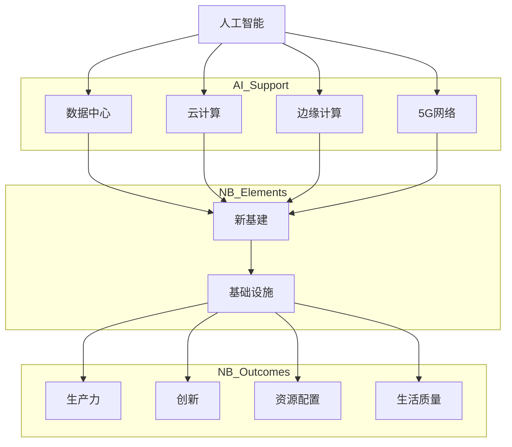

                 

# 文章标题：Lepton AI愿景：为AI时代构建新基建高效基础设施

> 关键词：Lepton AI，AI时代，新基建，数据中心，云计算，边缘计算，5G基础设施

> 摘要：本文将深入探讨Lepton AI的愿景，即构建适用于AI时代的高效基础设施。通过对数据中心、云计算、边缘计算和5G基础设施的详细分析，我们将理解这些技术如何共同作用，为实现AI的广泛应用奠定基础。文章还提供了构建高效基础设施的策略和案例分析，以及对未来发展趋势和挑战的展望。

## 目录

1. **AI时代新基建概述**
   - 第1章：AI时代与新基建
   - 第2章：Lepton AI愿景

2. **新基建高效基础设施构建**
   - 第3章：数据中心基础设施
   - 第4章：云计算基础设施
   - 第5章：边缘计算基础设施
   - 第6章：5G基础设施
   - 第7章：高效基础设施构建策略

3. **Lepton AI新基建案例分析**
   - 第8章：Lepton AI新基建案例分析

4. **未来发展趋势与挑战**
   - 第9章：未来发展趋势与挑战

5. **附录：技术参考资料**
   - A.1 数据中心建设指南
   - A.2 云计算服务文档
   - A.3 边缘计算技术规范
   - A.4 5G网络技术标准
   - A.5 新基建政策与法规

### 第一部分：AI时代新基建概述

#### 第1章：AI时代与新基建

##### 1.1 AI时代背景

人工智能（AI）的快速发展正在深刻改变我们的世界。从早期的专家系统到深度学习，再到如今广泛应用的语音识别、图像处理、自然语言处理等，AI技术已经渗透到各个行业，推动着社会的进步。然而，AI技术的发展不仅仅依赖于算法的创新，更需要强大的基础设施支持。这就引出了新基建的概念。

##### 1.2 新基建的定义与意义

新基建是指以信息通信技术（ICT）为核心，涵盖数据中心、云计算、人工智能、物联网、5G网络等基础设施的综合性建设。与传统的基础设施相比，新基建更注重数字化、智能化和网络化，是实现AI时代的关键支撑。

新基建的意义在于：
- **提高生产力**：通过自动化、智能化技术提高生产效率，降低成本。
- **促进创新**：为创新提供基础设施支持，推动新技术的研发和应用。
- **优化资源配置**：通过数据分析和智能算法优化资源分配，提高资源利用效率。
- **提升生活质量**：智能交通、智慧医疗、智能家居等新应用提高人们的生活质量。

##### 1.3 新基建的技术架构

新基建的技术架构包括以下几个层次：

1. **数据中心**：数据中心是存储和处理海量数据的核心设施。其架构通常包括计算节点、存储节点、网络节点等，通过分布式系统架构实现高性能和高可靠性。

2. **云计算**：云计算提供了弹性、可扩展的计算和存储资源，支持大规模数据处理和应用程序部署。其服务模型包括基础设施即服务（IaaS）、平台即服务（PaaS）和软件即服务（SaaS）。

3. **人工智能**：人工智能技术在数据处理、预测分析和决策支持等方面发挥着关键作用。其技术架构包括算法库、数据集、计算平台等。

4. **物联网**：物联网通过连接各种设备和传感器，实现数据的实时采集和传输，是智能城市、智能制造等应用的基础。

5. **5G网络**：5G网络提供了高速、低延迟、大连接的网络环境，是智能应用的关键基础设施。


#### 第2章：Lepton AI愿景

##### 2.1 Lepton AI简介

Lepton AI是一家专注于人工智能基础设施和服务的公司，致力于通过构建高效、可靠的基础设施，推动人工智能在各个领域的应用。Lepton AI的核心竞争力在于其创新的算法、高效的硬件设计和灵活的云计算服务。

##### 2.2 Lepton AI愿景

Lepton AI的愿景是构建AI时代的高效基础设施，为全球用户提供全面、智能、可靠的人工智能服务。具体来说，Lepton AI的愿景包括以下几个方面：

- **提升AI性能**：通过优化算法和硬件设计，提高人工智能的计算性能和能效。
- **降低AI使用门槛**：提供易于使用的人工智能服务，降低用户的技术门槛。
- **推动AI应用创新**：通过提供丰富的数据资源和智能算法，推动人工智能在各个领域的创新应用。
- **实现全球覆盖**：构建覆盖全球的基础设施网络，为全球用户提供高质量的人工智能服务。

##### 2.3 Lepton AI的应用领域

Lepton AI的应用领域非常广泛，包括但不限于以下几个方面：

- **智能医疗**：通过人工智能技术提供智能诊断、个性化治疗方案和健康监测服务。
- **智慧城市**：通过智能交通管理、环境监测和公共安全等应用，提升城市智能化水平。
- **智能制造**：通过智能工厂、质量检测和供应链优化等应用，提高制造业的智能化水平。
- **金融科技**：通过智能风控、智能投顾和金融数据分析等应用，提升金融行业的智能化水平。

### 第二部分：新基建高效基础设施构建

#### 第3章：数据中心基础设施

##### 3.1 数据中心概述

数据中心是存储和处理海量数据的核心设施，是现代信息社会的“心脏”。一个高效的数据中心需要具备以下特点：

- **高可靠性**：确保数据的安全性和系统的连续运行。
- **高性能**：提供快速的数据处理和访问能力。
- **高可扩展性**：支持系统的灵活扩展和升级。
- **高效节能**：降低能源消耗，减少环境影响。

##### 3.2 数据中心架构设计

数据中心的架构设计包括以下几个方面：

- **计算节点**：负责数据处理和计算任务。
- **存储节点**：负责数据存储和管理。
- **网络节点**：负责数据传输和通信。
- **管理系统**：负责整个数据中心的监控、管理和维护。


##### 3.3 数据中心管理策略

数据中心的管理策略包括以下几个方面：

- **安全性管理**：通过防火墙、入侵检测、数据加密等技术保障数据安全。
- **性能管理**：通过负载均衡、缓存技术等优化系统性能。
- **能耗管理**：通过智能监控系统、节能设备等技术降低能源消耗。
- **运维管理**：通过自动化运维工具、运维管理平台等提高运维效率。

#### 第4章：云计算基础设施

##### 4.1 云计算概述

云计算是一种基于互联网的计算模式，通过虚拟化技术和分布式计算实现资源的按需分配和动态调度。云计算的主要服务模型包括：

- **基础设施即服务（IaaS）**：提供虚拟化的计算、存储和网络资源，用户可以按需分配和使用。
- **平台即服务（PaaS）**：提供开发平台、工具和应用程序，用户可以快速开发和部署应用程序。
- **软件即服务（SaaS）**：提供应用程序服务，用户可以通过互联网访问和使用。

##### 4.2 云服务模型

云服务模型主要包括以下几种：

1. **公共云**：由第三方服务提供商运营，为多个用户提供服务。
2. **私有云**：为单一组织内部提供服务，安全性更高。
3. **混合云**：结合公共云和私有云的优势，实现资源的灵活调度和优化。
4. **社区云**：为多个组织或社区提供服务，共享资源和管理。


##### 4.3 云计算资源管理

云计算资源管理包括以下几个方面：

- **资源调度**：根据用户需求和系统负载动态调整资源分配。
- **负载均衡**：通过分布式系统架构和负载均衡技术提高系统性能和可靠性。
- **存储管理**：通过分布式存储系统和数据备份策略确保数据的安全性和可靠性。
- **网络管理**：通过虚拟专用网络（VPN）、负载均衡等技术优化网络性能和安全性。

#### 第5章：边缘计算基础设施

##### 5.1 边缘计算概述

边缘计算是一种分布式计算架构，将数据处理和计算任务从中心节点转移到边缘节点，以降低延迟、提高响应速度和减少带宽消耗。边缘计算的关键特点包括：

- **靠近用户**：数据处理靠近用户，减少数据传输距离，降低延迟。
- **分布式架构**：边缘节点分布广泛，支持分布式计算和存储。
- **低能耗**：边缘节点通常使用低功耗设备，减少能源消耗。

##### 5.2 边缘计算架构

边缘计算架构包括以下几个层次：

- **边缘节点**：负责数据采集、处理和存储，通常包括路由器、交换机、服务器等设备。
- **边缘网关**：负责边缘节点与中心节点的通信，通常包括网关设备、通信协议等。
- **中心节点**：负责处理大规模数据集和复杂计算任务，通常包括数据中心和云计算平台。


##### 5.3 边缘计算应用场景

边缘计算的应用场景非常广泛，包括以下几个方面：

- **智能城市**：通过边缘计算实现实时交通管理、环境监测和公共安全等应用。
- **智能制造**：通过边缘计算实现实时质量检测、设备监控和供应链优化等应用。
- **智慧医疗**：通过边缘计算实现实时远程诊断、健康监测和紧急响应等应用。
- **物联网**：通过边缘计算实现实时数据采集、处理和传输，提高物联网系统的响应速度和可靠性。

#### 第6章：5G基础设施

##### 6.1 5G技术概述

5G是第五代移动通信技术，具有高速、低延迟、大连接的特点。5G技术的主要特点包括：

- **高速率**：峰值下载速度可达数Gbps，是4G的数十倍。
- **低延迟**：延迟降低到1ms以下，满足实时应用的需求。
- **大连接**：连接数密度达到每平方米数十万个，支持大规模物联网应用。

##### 6.2 5G网络架构

5G网络架构包括以下几个层次：

- **接入网**：包括基站、无线接入网和用户设备等，负责无线信号的传输和接入。
- **传输网**：包括光纤、微波、卫星等传输介质，负责数据的传输和路由。
- **核心网**：包括控制平面和数据平面，负责用户的注册、认证、连接控制等功能。


##### 6.3 5G应用场景

5G技术的应用场景非常广泛，包括以下几个方面：

- **智能交通**：通过5G实现车辆之间的通信，实现自动驾驶和智能交通管理。
- **工业互联网**：通过5G实现工业设备之间的实时通信，实现智能工厂和智能制造。
- **远程医疗**：通过5G实现远程诊断、手术和健康监测等医疗服务。
- **智能家居**：通过5G实现家庭设备的智能连接和控制，实现智能家居应用。

#### 第7章：高效基础设施构建策略

##### 7.1 基础设施规划

基础设施规划是构建高效基础设施的第一步，主要包括以下几个方面：

- **需求分析**：分析用户需求和业务场景，确定基础设施的建设目标和规模。
- **技术选型**：根据需求和预算选择合适的技术和设备。
- **容量规划**：根据业务发展预期和流量预测进行容量规划，确保系统的高可用性和可扩展性。
- **安全性规划**：制定安全策略，确保基础设施的安全性和数据的保密性。

##### 7.2 基础设施建设流程

基础设施建设的流程包括以下几个方面：

- **设计**：根据规划进行详细设计，包括系统架构、网络拓扑、设备选型等。
- **采购**：根据设计方案进行设备采购，包括硬件设备、软件系统和网络设备等。
- **部署**：进行设备的安装和配置，确保系统按照设计方案正常运行。
- **测试**：进行系统测试，确保系统功能的完整性和性能的稳定性。
- **验收**：完成系统测试后，进行验收，确保系统满足预期需求和标准。

##### 7.3 基础设施运维管理

基础设施运维管理是确保基础设施稳定运行的关键，主要包括以下几个方面：

- **监控**：通过监控系统实时监测系统状态，及时发现和处理异常情况。
- **维护**：定期进行设备维护和升级，确保系统的稳定性和可靠性。
- **故障处理**：建立完善的故障处理流程，快速响应和解决故障。
- **安全管理**：通过安全策略和措施确保系统安全，防止网络攻击和数据泄露。
- **性能优化**：通过性能监测和优化措施提高系统的性能和响应速度。

#### 第8章：Lepton AI新基建案例分析

##### 8.1 案例背景

Lepton AI与一家大型金融机构合作，为其构建智能化风控系统。该系统需要处理海量数据，实现实时风险监测和预警，对系统性能和稳定性有很高的要求。

##### 8.2 案例分析

Lepton AI采用了以下策略构建智能化风控系统：

- **数据中心建设**：构建了高效的数据中心，采用分布式存储系统和高性能计算节点，确保数据的安全性和处理能力。
- **云计算服务**：采用云计算平台提供弹性的计算和存储资源，支持系统的高并发和可扩展性。
- **边缘计算应用**：在金融机构的关键节点部署边缘计算设备，实现数据的本地处理和实时分析，降低延迟和带宽消耗。
- **5G网络支持**：利用5G网络实现高速、低延迟的数据传输，确保系统实时响应。

##### 8.3 案例启示

通过该案例，我们可以得到以下启示：

- **融合多种技术**：结合数据中心、云计算、边缘计算和5G技术，构建高效的基础设施，满足不同应用场景的需求。
- **注重系统性能**：通过优化算法、硬件和系统架构，提高系统的性能和稳定性，确保业务的高效运行。
- **安全性和可靠性**：在基础设施建设过程中，注重安全性和可靠性，确保系统的稳定运行和数据的安全。
- **持续创新**：不断更新和优化基础设施，适应业务发展的需求和变化，保持竞争优势。

#### 第9章：未来发展趋势与挑战

##### 9.1 新基建发展趋势

未来，新基建将继续向以下几个方面发展：

- **智能化**：随着人工智能技术的发展，新基建将更加智能化，提高基础设施的管理和运营效率。
- **绿色化**：绿色环保成为新基建的重要趋势，通过节能技术和可再生能源的使用降低环境负荷。
- **全球化**：新基建将实现全球覆盖，为全球范围内的业务提供支持，促进全球化发展。
- **开放化**：新基建将更加开放，通过标准化接口和开放平台，促进技术的融合和创新。

##### 9.2 新基建面临挑战

新基建在发展过程中也面临以下挑战：

- **技术挑战**：新技术的不断涌现和应用，对基础设施的技术要求越来越高，需要不断进行技术创新和升级。
- **安全挑战**：随着网络攻击和数据泄露事件的增多，基础设施的安全性和数据保护成为重要挑战。
- **人才挑战**：新基建需要大量具备跨学科知识和实践经验的人才，但人才短缺是一个普遍问题。
- **投资挑战**：新基建需要巨大的资金投入，如何确保投资回报率和可持续发展是一个重要问题。

##### 9.3 应对策略与建议

为应对新基建面临的挑战，可以采取以下策略和建议：

- **技术创新**：持续进行技术创新，提高基础设施的性能和可靠性。
- **安全防护**：加强网络安全防护，建立完善的安全管理制度和措施。
- **人才培养**：加强人才培养和引进，提高行业整体人才水平。
- **合理投资**：制定科学合理的投资计划，确保投资回报率和可持续发展。

### 附录：技术参考资料

#### A.1 数据中心建设指南

数据中心建设指南包括以下几个方面：

- **设计规范**：数据中心的设计规范包括机房布局、电力供应、冷却系统、网络安全等方面的要求。
- **设备选型**：根据业务需求和预算选择合适的设备，包括服务器、存储设备、网络设备等。
- **施工规范**：数据中心的建设施工需要遵循相关标准和规范，确保施工质量和安全。

#### A.2 云计算服务文档

云计算服务文档包括以下几个方面：

- **服务概述**：介绍云计算服务的概念、类型和特点。
- **服务模型**：详细说明IaaS、PaaS和SaaS三种服务模型。
- **服务协议**：规定用户和云服务提供商之间的权利和义务。
- **安全与合规**：介绍云计算服务的安全措施和合规要求。

#### A.3 边缘计算技术规范

边缘计算技术规范包括以下几个方面：

- **架构设计**：介绍边缘计算的架构设计和关键技术。
- **协议标准**：定义边缘计算中的通信协议和数据格式。
- **应用场景**：介绍边缘计算在不同领域的应用场景和解决方案。
- **性能优化**：介绍边缘计算的优化技术和方法。

#### A.4 5G网络技术标准

5G网络技术标准包括以下几个方面：

- **网络架构**：介绍5G网络的架构设计和关键技术。
- **频谱规划**：介绍5G频谱规划和分配标准。
- **协议标准**：定义5G网络的通信协议和数据格式。
- **安全与隐私**：介绍5G网络的安全措施和隐私保护标准。

#### A.5 新基建政策与法规

新基建政策与法规包括以下几个方面：

- **政策导向**：介绍国家对新基建的政策导向和发展规划。
- **法规标准**：介绍新基建相关的法规和标准，包括网络安全、数据保护等方面的规定。
- **行业规范**：介绍新基建行业的规范和自律要求。
- **监管机制**：介绍新基建的监管机制和监管机构。

### 结语

作者：AI天才研究院/AI Genius Institute & 禅与计算机程序设计艺术 /Zen And The Art of Computer Programming

在AI时代，新基建是推动社会进步和经济发展的关键。Lepton AI的愿景是构建高效、智能、可靠的基础设施，为全球用户提供高质量的人工智能服务。通过深入分析新基建的技术架构和应用场景，我们可以看到新基建在AI时代的巨大潜力和挑战。未来，新基建将继续向智能化、绿色化、全球化和开放化发展，为人类社会带来更多创新和变革。让我们共同期待新基建的未来，迎接AI时代的到来。|assistant|>### 第一部分：AI时代新基建概述

#### 第1章：AI时代与新基建

##### 1.1 AI时代背景

人工智能（AI）的快速发展正在深刻改变我们的世界。从早期的专家系统到深度学习，再到如今广泛应用的语音识别、图像处理、自然语言处理等，AI技术已经渗透到各个行业，推动着社会的进步。然而，AI技术的发展不仅仅依赖于算法的创新，更需要强大的基础设施支持。这就引出了新基建的概念。

AI技术的发展历程可以追溯到20世纪50年代，当时的专家系统试图模拟人类专家的决策过程。随着计算机性能的提升和算法的创新，尤其是深度学习的突破，AI技术进入了快速发展阶段。深度学习通过模拟人脑神经元网络的结构和功能，实现复杂模式的识别和预测，为语音识别、图像处理、自然语言处理等领域带来了革命性的变化。

近年来，AI技术在各个领域的应用越来越广泛，从智能助手、自动驾驶、智能医疗到金融风控、智能制造等，都展现了其强大的能力。AI的快速发展不仅改变了我们的生活方式，也对传统行业带来了巨大的冲击和机遇。然而，AI技术的实现离不开强大的基础设施支持。从数据存储和处理到计算资源分配，从网络传输到边缘计算，AI时代的新基建成为关键支撑。

新基建的重要性体现在以下几个方面：

1. **计算能力**：AI算法的运行需要大量计算资源，数据中心、云计算和边缘计算等基础设施为AI算法提供了强大的计算能力。
2. **数据存储和处理**：AI算法的训练和推理需要处理海量数据，数据中心的分布式存储系统和高效的计算节点能够满足这一需求。
3. **网络传输**：AI应用需要实时处理数据，5G网络的低延迟和大带宽特性为AI应用提供了可靠的传输支持。
4. **边缘计算**：对于需要实时响应的应用，边缘计算将计算任务从中心节点转移到靠近用户的边缘节点，降低了延迟和带宽消耗。

随着AI技术的不断进步和应用场景的扩展，新基建的需求也在不断增长。数据中心需要更高的计算能力和更强的存储容量，云计算平台需要提供更加灵活和高效的服务，边缘计算需要更多的分布式节点和更低的延迟。新基建的发展不仅需要技术的创新，还需要政策和资金的持续支持，以确保基础设施的建设和运营能够跟上AI技术的发展步伐。

##### 1.2 新基建的定义与意义

新基建是指以信息通信技术（ICT）为核心，涵盖数据中心、云计算、人工智能、物联网、5G网络等基础设施的综合性建设。与传统的基础设施相比，新基建更注重数字化、智能化和网络化，是实现AI时代的关键支撑。

新基建的定义可以从以下几个方面来理解：

1. **技术层面**：新基建涵盖了一系列先进的信息通信技术，包括云计算、大数据、物联网、人工智能、边缘计算等。这些技术共同构成了新基础设施的组成部分。
2. **应用层面**：新基建的目标是为各种应用场景提供基础设施支持，包括智能城市、智慧医疗、智能制造、金融科技等。新基建的建设旨在提升这些领域的智能化水平和运营效率。
3. **生态层面**：新基建不仅包括硬件设施，还涉及软件、平台、服务等多个方面，形成了一个完整的生态系统。在这个生态系统中，各个组成部分相互协同，共同推动新基建的发展。

新基建的意义体现在以下几个方面：

1. **提高生产力**：通过自动化、智能化技术提高生产效率，降低成本。例如，智能制造通过AI技术实现生产线的自动化，提高了生产效率和产品质量。
2. **促进创新**：新基建为创新提供了基础设施支持，推动了新技术的研发和应用。例如，在医疗领域，AI技术的应用加速了新药的研发和临床试验。
3. **优化资源配置**：通过数据分析和智能算法优化资源分配，提高资源利用效率。例如，智能交通系统通过实时数据分析和优化路线，减少了交通拥堵和出行时间。
4. **提升生活质量**：智能交通、智慧医疗、智能家居等新应用提高了人们的生活质量。例如，智慧医疗系统通过远程诊断和健康管理，提高了医疗服务的效率和便捷性。

新基建的发展对于推动社会进步和经济发展具有重要意义。首先，新基建能够推动产业升级和转型，促进数字经济的发展。通过新基建的建设，传统产业可以实现智能化升级，提高生产效率和产品质量，从而提升整个产业链的竞争力。其次，新基建能够创造大量就业机会，带动相关产业链的发展。新基建涉及到多个技术领域，包括硬件、软件、网络等，需要大量的技术人才和施工人员。最后，新基建能够提升国家竞争力，增强国际竞争力。随着全球数字化转型的加速，新基建的发展已经成为各国竞争的重要领域。通过新基建的建设，国家能够提升信息通信技术的自主创新能力，增强在全球竞争中的地位。

##### 1.3 新基建的技术架构

新基建的技术架构包括以下几个层次，这些层次共同构成了新基础设施的支撑体系：

1. **数据中心**：数据中心是新基建的核心部分，负责数据的存储、处理和分析。数据中心通常包括计算节点、存储节点、网络节点和制冷系统等。计算节点提供高性能的计算能力，存储节点提供海量数据的存储和管理，网络节点负责数据传输和通信。制冷系统确保数据中心设备的正常运行温度。

2. **云计算**：云计算提供了弹性、可扩展的计算和存储资源，支持大规模数据处理和应用程序部署。云计算服务模型包括基础设施即服务（IaaS）、平台即服务（PaaS）和软件即服务（SaaS）。IaaS提供虚拟化的计算、存储和网络资源，PaaS提供开发平台和工具，SaaS提供应用程序服务。

3. **人工智能**：人工智能技术在新基建中发挥着关键作用，包括机器学习、深度学习、自然语言处理等。人工智能算法通过分析大量数据，实现智能决策、预测分析和自动化控制等功能。

4. **物联网**：物联网通过连接各种设备和传感器，实现数据的实时采集和传输。物联网设备包括智能家居设备、工业传感器、车辆等。物联网技术为新基建提供了丰富的数据来源，支持智能城市、智能制造等应用。

5. **5G网络**：5G网络提供了高速、低延迟、大连接的网络环境，是新基建的重要基础设施。5G网络具有高速率、低延迟和大连接的特点，能够支持实时应用和大规模物联网设备。

6. **边缘计算**：边缘计算将数据处理和计算任务从中心节点转移到靠近用户的边缘节点，降低延迟和带宽消耗。边缘计算适用于需要实时响应和低延迟的应用，如智能交通、智能制造和智慧医疗等。


新基建的技术架构通过以上几个层次的协同作用，为各种应用场景提供了强大的基础设施支持。数据中心提供了数据的存储和处理能力，云计算提供了弹性计算资源，人工智能技术实现了智能分析和决策，物联网和5G网络提供了数据传输和连接支持，边缘计算优化了数据处理的效率和响应速度。这些技术共同构建了新基建的完整体系，为AI时代的应用提供了坚实的基础。

在新基建的技术架构中，各个层次之间相互关联，形成了紧密的生态系统。数据中心和云计算平台通过高速网络连接，实现数据的高效传输和计算资源的动态调度。人工智能算法通过云计算平台处理海量数据，物联网设备和传感器提供实时数据输入，5G网络确保数据传输的低延迟和高可靠性。边缘计算节点则通过本地计算和数据处理，降低了对中心节点的依赖，提高了系统的响应速度和灵活性。

新基建的技术架构不仅提供了强大的基础设施支持，还为未来的技术创新和应用拓展奠定了基础。随着AI、物联网、5G等技术的不断演进，新基建将不断优化和升级，为更广泛的智能应用提供支持。通过构建新基建，我们能够实现更高水平的智能化，推动社会进步和经济发展。

### 第二部分：新基建高效基础设施构建

#### 第3章：数据中心基础设施

##### 3.1 数据中心概述

数据中心是存储和处理海量数据的核心设施，是现代信息社会的“心脏”。数据中心通过高效的计算、存储和网络资源，为各种应用场景提供可靠的数据处理能力。一个高效的数据中心需要具备以下几个特点：

- **高可靠性**：数据中心需要确保数据的安全性和系统的连续运行。这包括硬件设备的冗余设计、电力供应的备份系统以及网络安全措施等。
- **高性能**：数据中心需要提供快速的数据处理和访问能力，以满足高并发和高带宽的应用需求。这涉及到高性能计算节点、快速网络和高效的数据存储系统。
- **高可扩展性**：随着数据量的不断增加和应用需求的扩展，数据中心需要具备良好的可扩展性，以适应未来的发展需求。这包括计算节点、存储节点和网络节点的灵活扩展。
- **高效节能**：数据中心作为高能耗设施，需要采用节能技术和措施，降低能源消耗，减少环境影响。这包括高效的制冷系统、节能设备和智能监控系统等。

##### 3.2 数据中心架构设计

数据中心的架构设计是构建高效数据中心的关键环节，需要综合考虑计算、存储、网络和管理等多方面的需求。以下是数据中心架构设计的几个重要方面：

1. **计算节点**：计算节点是数据中心的核心组件，负责处理数据和运行应用程序。计算节点的架构设计需要考虑以下几个方面：
   - **计算能力**：选择高性能的计算设备，如CPU、GPU等，以满足不同的计算需求。
   - **虚拟化技术**：通过虚拟化技术，将物理服务器资源虚拟化为多个虚拟机，提高资源利用率和灵活性。
   - **集群架构**：采用集群架构，实现计算节点的分布式部署，提高系统的容错性和可扩展性。

2. **存储节点**：存储节点负责数据的存储和管理，是数据中心的重要部分。存储节点的架构设计需要考虑以下几个方面：
   - **分布式存储**：采用分布式存储架构，实现海量数据的高效存储和管理。分布式存储系统能够自动平衡负载，提高系统的可靠性和性能。
   - **数据备份**：制定完善的数据备份策略，确保数据的完整性和可用性。数据备份包括本地备份和远程备份，以及数据恢复机制。
   - **数据安全**：通过数据加密和访问控制等技术，确保数据的安全性和保密性。

3. **网络节点**：网络节点负责数据传输和通信，是实现数据中心内各组件高效协作的关键。网络节点的架构设计需要考虑以下几个方面：
   - **高速网络**：采用高速网络设备，如交换机、路由器等，确保数据传输的效率和低延迟。
   - **网络架构**：采用多层网络架构，如核心层、汇聚层和接入层，实现网络的层次化和模块化。
   - **网络冗余**：通过网络冗余设计，如多重路径和负载均衡，提高网络的可靠性和稳定性。

4. **管理系统**：数据中心的管理系统负责监控、管理和维护整个数据中心。管理系统需要具备以下几个功能：
   - **监控告警**：通过监控系统实时监测数据中心的运行状态，包括硬件设备、网络流量和系统性能等，及时发现和处理异常情况。
   - **自动化运维**：通过自动化运维工具，实现数据中心的日常运维工作，如系统升级、故障处理和性能优化等。
   - **安全管理**：通过安全管理系统，实施网络安全策略，包括防火墙、入侵检测和访问控制等，确保数据中心的安全性。

数据中心架构设计不仅仅是一个技术问题，还需要考虑业务需求和成本效益。在设计过程中，需要平衡计算能力、存储容量、网络带宽和能源消耗等多方面的因素，以确保数据中心的高效运行和可持续发展。


##### 3.3 数据中心管理策略

数据中心的管理策略是确保数据中心高效运行和安全运营的重要保障。以下是一些关键的数据中心管理策略：

1. **安全性管理**：数据中心的第一个目标是确保数据的安全性和系统的连续运行。安全性管理包括以下几个方面：
   - **防火墙和入侵检测系统**：通过防火墙和入侵检测系统，监控网络流量，防止外部攻击和数据泄露。
   - **访问控制**：实施严格的访问控制策略，确保只有授权用户才能访问数据中心的重要系统和数据。
   - **数据加密**：对存储和传输中的数据进行加密，确保数据在传输过程中不被窃取或篡改。

2. **性能管理**：性能管理是确保数据中心系统高效运行的重要环节。性能管理包括以下几个方面：
   - **负载均衡**：通过负载均衡技术，合理分配网络和计算资源，避免单点过载和性能瓶颈。
   - **缓存策略**：采用缓存技术，减少对后端存储的访问次数，提高数据访问速度。
   - **监控和告警**：通过监控系统实时监测数据中心的运行状态，及时发现和处理性能问题。

3. **能耗管理**：数据中心是高能耗设施，能耗管理是降低运营成本和减少环境影响的重要措施。能耗管理包括以下几个方面：
   - **智能监控系统**：采用智能监控系统，实时监测数据中心的能耗情况，优化能源使用。
   - **能效优化**：通过采用高效的硬件设备和优化数据中心布局，降低能耗。
   - **制冷管理**：采用高效的制冷系统，如液冷和空气冷却，降低设备运行温度，提高系统稳定性。

4. **运维管理**：运维管理是确保数据中心持续稳定运行的关键。运维管理包括以下几个方面：
   - **自动化运维**：通过自动化运维工具，实现日常运维工作的自动化，提高运维效率和降低人工成本。
   - **故障处理**：建立完善的故障处理流程，确保故障能够及时得到修复，减少对业务的影响。
   - **备份和恢复**：制定详细的备份和恢复策略，确保数据的安全性和业务的连续性。

数据中心管理策略需要根据业务需求和实际情况进行定制化设计，通过综合运用安全性管理、性能管理、能耗管理和运维管理等多种策略，实现数据中心的高效运行和可持续发展。

#### 第4章：云计算基础设施

##### 4.1 云计算概述

云计算是一种基于互联网的计算模式，通过虚拟化技术和分布式计算实现资源的按需分配和动态调度。云计算为用户提供了弹性、可扩展的计算和存储资源，支持大规模数据处理和应用程序部署。云计算的主要服务模型包括基础设施即服务（IaaS）、平台即服务（PaaS）和软件即服务（SaaS）。

1. **基础设施即服务（IaaS）**：IaaS提供虚拟化的计算、存储和网络资源，用户可以按需分配和使用。IaaS的主要优势包括：
   - **资源灵活性**：用户可以根据需求动态调整资源，实现灵活的资源分配和管理。
   - **成本效益**：用户只需为实际使用的资源付费，降低了初始投资和运营成本。
   - **可扩展性**：IaaS平台能够快速扩展资源，满足业务增长的需求。

2. **平台即服务（PaaS）**：PaaS提供开发平台、工具和应用程序，用户可以快速开发和部署应用程序。PaaS的主要优势包括：
   - **开发效率**：PaaS提供了一整套开发工具和框架，简化了开发流程，提高了开发效率。
   - **平台兼容性**：PaaS平台通常支持多种编程语言和开发框架，提高了应用程序的兼容性和可移植性。
   - **资源管理**：PaaS平台自动管理底层基础设施，用户无需关注硬件和网络配置，专注于应用程序的开发。

3. **软件即服务（SaaS）**：SaaS提供应用程序服务，用户可以通过互联网访问和使用。SaaS的主要优势包括：
   - **使用便捷**：用户无需安装和维护应用程序，只需通过浏览器即可访问和使用。
   - **即付即用**：用户根据实际使用量付费，无需预付大量资金，降低了财务风险。
   - **持续更新**：SaaS提供商负责应用程序的更新和维护，确保用户使用的是最新的版本。

云计算的核心思想是通过虚拟化技术将物理资源抽象为虚拟资源，用户可以根据需求动态分配和释放资源。云计算平台通常采用分布式计算架构，通过多个物理节点协同工作，提供高可用性和高性能的计算和存储服务。

云计算的优势体现在以下几个方面：

- **弹性扩展**：云计算平台可以根据业务需求动态调整资源，满足不同业务场景的需求。
- **成本效益**：云计算通过按需付费模式降低了用户的初始投资和运营成本。
- **高可用性**：云计算平台采用分布式架构和冗余设计，提高了系统的可靠性和可用性。
- **灵活管理**：云计算平台提供了丰富的管理工具和接口，用户可以方便地管理和监控资源。

云计算已经成为现代信息社会的关键基础设施，广泛应用于企业、政府、教育、医疗等多个领域。通过云计算，用户可以轻松地实现业务系统的部署和管理，提高效率和创新能力。

##### 4.2 云服务模型

云服务模型主要包括以下几种：

1. **公共云**：公共云由第三方服务提供商运营，为多个用户提供服务。公共云的主要优势包括：
   - **资源共享**：多个用户共享公共云资源，降低了成本。
   - **灵活扩展**：公共云平台可以根据用户需求动态调整资源，提供弹性扩展。
   - **安全性**：公共云平台通常具备完善的安全措施和合规性认证。

2. **私有云**：私有云为单一组织内部提供服务，安全性更高。私有云的主要优势包括：
   - **数据安全**：私有云提供了更高的数据安全性和访问控制，适合对数据安全有严格要求的组织。
   - **定制化**：私有云可以根据组织的具体需求进行定制化设计和部署。
   - **控制权**：组织对私有云拥有完全的控制权，能够灵活调整和管理资源。

3. **混合云**：混合云结合了公共云和私有云的优势，实现资源的灵活调度和优化。混合云的主要优势包括：
   - **资源优化**：混合云可以根据不同的业务需求，将数据和应用合理分布在公共云和私有云上，实现资源的最优利用。
   - **业务连续性**：混合云通过将关键业务部署在私有云上，确保业务的高可用性和连续性。
   - **成本控制**：混合云可以根据业务负载动态调整资源分配，实现成本控制。

4. **社区云**：社区云为多个组织或社区提供服务，共享资源和管理。社区云的主要优势包括：
   - **资源共享**：社区云实现了多个组织或社区之间的资源共享，降低了成本。
   - **协同创新**：社区云促进了组织之间的协同合作，推动了技术创新和应用发展。
   - **管理协同**：社区云通过统一的管理平台，实现了多个组织之间的管理和协调。

云服务模型的多样化满足了不同用户的需求，为云计算的广泛应用提供了灵活的选择。通过合理选择和使用云服务模型，用户可以实现资源的高效利用和业务的持续创新。

##### 4.3 云计算资源管理

云计算资源管理是确保云计算平台高效运行和安全运营的重要环节。以下是一些关键的云计算资源管理策略：

1. **资源调度**：资源调度是云计算平台的核心功能之一，通过智能调度算法，实现计算资源、存储资源和网络资源的动态分配和释放。资源调度的目标是在满足用户需求的前提下，最大化资源利用率和系统性能。资源调度策略包括以下几种：
   - **负载均衡**：通过负载均衡技术，将用户请求分布到多个计算节点上，避免单点过载和性能瓶颈。
   - **动态扩展**：根据系统负载动态调整计算资源，当系统负载增加时，自动扩展资源；当系统负载减少时，自动释放资源。
   - **优先级调度**：根据用户请求的优先级，分配计算资源，确保关键任务的优先执行。

2. **负载均衡**：负载均衡是云计算资源管理的重要策略，通过将用户请求分布到多个服务器上，提高系统的性能和可靠性。负载均衡策略包括以下几种：
   - **轮询调度**：将用户请求轮流分配到每个服务器上，实现负载的均匀分布。
   - **最小连接数调度**：将用户请求分配到当前连接数最少的服务器上，降低系统的响应时间。
   - **响应时间调度**：将用户请求分配到当前响应时间最短的服务器上，提高系统的性能和用户满意度。

3. **存储管理**：存储管理是云计算资源管理的重要组成部分，通过合理的存储策略，确保数据的安全性和可靠性。存储管理策略包括以下几种：
   - **分布式存储**：采用分布式存储架构，将数据分散存储在多个存储节点上，提高数据可靠性和系统性能。
   - **数据备份**：制定完善的数据备份策略，包括本地备份和远程备份，确保数据的安全性和可恢复性。
   - **数据压缩**：通过数据压缩技术，减少存储空间的需求，提高存储效率。

4. **网络管理**：网络管理是确保数据传输高效和可靠的重要措施，通过合理的网络策略，优化数据传输路径和网络性能。网络管理策略包括以下几种：
   - **多路径传输**：通过多路径传输技术，实现数据的冗余传输，提高网络的可靠性和性能。
   - **流量监控**：通过流量监控工具，实时监测网络流量和性能，及时发现和处理网络问题。
   - **负载均衡**：通过负载均衡技术，合理分配网络流量，避免单点过载和网络拥塞。

5. **自动化运维**：自动化运维是云计算资源管理的重要手段，通过自动化工具和流程，提高运维效率和降低成本。自动化运维策略包括以下几种：
   - **自动化部署**：通过自动化部署工具，实现应用程序的快速部署和更新。
   - **自动化监控**：通过自动化监控工具，实时监测系统的运行状态和性能指标，及时发现和处理异常情况。
   - **自动化告警**：通过自动化告警系统，及时发现和处理系统故障和性能问题。

云计算资源管理需要根据具体的业务需求和实际情况，制定合理的资源调度、负载均衡、存储管理、网络管理和自动化运维策略，确保云计算平台的高效运行和持续发展。

#### 第5章：边缘计算基础设施

##### 5.1 边缘计算概述

边缘计算是一种分布式计算架构，通过在靠近用户或数据源的边缘节点进行数据处理和计算，降低数据传输延迟和带宽消耗。边缘计算将计算任务从中心节点转移到边缘节点，实现了数据处理的本地化和实时化，对于满足低延迟、高可靠性的应用需求具有重要意义。边缘计算的关键特点包括：

- **靠近用户**：边缘计算将数据处理和计算任务从中心节点转移到靠近用户的边缘节点，减少了数据传输距离，降低了延迟和带宽消耗。
- **分布式架构**：边缘计算架构通常包括多个边缘节点和中心节点，通过分布式系统架构实现数据的分布式存储和处理。
- **低功耗**：边缘节点通常使用低功耗设备，降低了能源消耗，适用于物联网和移动设备等场景。
- **实时响应**：边缘计算能够实现数据的实时处理和响应，适用于需要实时决策和控制的场景。

边缘计算的背景可以追溯到物联网和智能设备的广泛应用。随着物联网设备的增加和智能设备的普及，数据产生量急剧增加，中心节点处理这些数据变得越来越困难。为了满足低延迟和高可靠性的需求，边缘计算应运而生。通过在边缘节点进行数据处理和计算，可以减少对中心节点的依赖，提高系统的响应速度和可靠性。

边缘计算的应用场景非常广泛，涵盖了多个领域。以下是一些典型的应用场景：

- **智能交通**：在智能交通系统中，边缘计算可以用于实时交通监控、路况分析和信号控制。通过在路边的边缘节点部署传感器和计算设备，可以实时收集路况数据，进行分析和预测，优化交通信号控制和路线规划，提高交通效率和安全性。
- **智能制造**：在智能制造中，边缘计算可以用于设备监控、故障诊断和工艺优化。通过在生产线部署边缘节点，实时收集设备状态和生产数据，进行分析和处理，实现设备的远程监控和故障预测，提高生产效率和质量。
- **智慧医疗**：在智慧医疗中，边缘计算可以用于远程诊断、患者监控和手术辅助。通过在医疗设备中集成边缘计算功能，可以实现实时数据采集和处理，提供远程诊断和患者监控服务，辅助医生进行手术操作，提高医疗服务质量和效率。
- **智能零售**：在智能零售中，边缘计算可以用于库存管理、客户行为分析和智能推荐。通过在零售店内部署边缘节点，实时收集商品销售数据和客户行为数据，进行分析和预测，优化库存管理和客户体验。

边缘计算的优势在于其能够实现数据的本地化和实时化处理，降低数据传输延迟和带宽消耗。在需要实时响应和低延迟的应用场景中，边缘计算提供了有效的解决方案。通过在边缘节点进行数据处理，可以减少对中心节点的依赖，提高系统的响应速度和可靠性。此外，边缘计算的低功耗特性也使其适用于物联网和移动设备等场景，为智能设备和应用的广泛应用提供了有力支持。

##### 5.2 边缘计算架构

边缘计算架构通常包括边缘节点、边缘网关和中心节点三个主要部分，通过分布式系统架构实现数据的分布式存储和处理。以下是对边缘计算架构的详细解析：

1. **边缘节点**：边缘节点是边缘计算架构的核心组成部分，通常部署在靠近用户或数据源的场所，如智能设备、基站、路灯等。边缘节点的主要功能包括数据采集、数据处理和本地执行。边缘节点的主要特点如下：
   - **数据采集**：边缘节点通过传感器、摄像头、物联网设备等收集数据，实现对环境、设备、用户行为的实时监测。
   - **数据处理**：边缘节点具备一定的计算能力，可以执行数据处理和初步分析任务，如数据清洗、特征提取和简单推理。
   - **本地执行**：边缘节点可以执行一些本地化的任务，如本地化服务、本地化决策和本地化操作，减少对中心节点的依赖。

2. **边缘网关**：边缘网关是边缘节点与中心节点之间的桥梁，负责边缘节点的数据传输和通信。边缘网关的主要功能包括数据转发、安全防护、协议转换和负载均衡。边缘网关的特点如下：
   - **数据转发**：边缘网关将边缘节点的数据转发到中心节点，实现数据的远程处理和分析。
   - **安全防护**：边缘网关通过安全策略和措施，保护边缘节点和中心节点的数据安全，防止网络攻击和数据泄露。
   - **协议转换**：边缘网关可以实现不同协议之间的转换，如将边缘节点的私有协议转换为互联网通用协议，实现不同系统之间的互联互通。
   - **负载均衡**：边缘网关通过负载均衡技术，合理分配网络流量和计算资源，避免单点过载和性能瓶颈。

3. **中心节点**：中心节点是边缘计算架构的核心部分，通常部署在数据中心或云平台，负责数据的集中处理、存储和分析。中心节点的主要功能包括数据存储、数据分析和应用程序部署。中心节点的特点如下：
   - **数据存储**：中心节点提供海量数据的存储和管理能力，通过分布式存储系统实现数据的高效存储和检索。
   - **数据分析**：中心节点具备强大的计算和分析能力，可以执行复杂的数据分析和机器学习任务，提供智能决策和预测。
   - **应用程序部署**：中心节点提供应用程序的部署和运行环境，支持各种应用程序的开发和部署，如智能交通管理、智慧医疗系统等。

边缘计算架构通过边缘节点、边缘网关和中心节点的协同工作，实现了数据的分布式存储和处理。边缘节点负责数据采集和初步处理，边缘网关负责数据传输和通信，中心节点负责数据的集中处理和分析。这种分布式架构不仅提高了系统的响应速度和可靠性，还降低了数据传输的延迟和带宽消耗，为各种应用场景提供了有效的解决方案。


##### 5.3 边缘计算应用场景

边缘计算的应用场景非常广泛，涵盖了多个领域。以下是一些典型的应用场景：

1. **智能交通**：在智能交通系统中，边缘计算可以用于实时交通监控、路况分析和信号控制。通过在路边的边缘节点部署传感器和计算设备，可以实时收集路况数据，进行分析和预测，优化交通信号控制和路线规划，提高交通效率和安全性。例如，边缘计算可以用于实时检测交通流量、车速和道路状况，通过分析这些数据，及时调整交通信号灯的时间设置，避免交通拥堵和事故发生。

2. **智能制造**：在智能制造中，边缘计算可以用于设备监控、故障诊断和工艺优化。通过在生产线部署边缘节点，实时收集设备状态和生产数据，进行分析和处理，实现设备的远程监控和故障预测，提高生产效率和质量。例如，边缘计算可以用于实时监测生产设备的运行状态，通过分析传感器数据，及时发现设备故障，采取预防措施，避免生产中断和设备损坏。

3. **智慧医疗**：在智慧医疗中，边缘计算可以用于远程诊断、患者监控和手术辅助。通过在医疗设备中集成边缘计算功能，可以实现实时数据采集和处理，提供远程诊断和患者监控服务，辅助医生进行手术操作，提高医疗服务质量和效率。例如，边缘计算可以用于实时监测患者的生理指标，通过分析数据，及时发现异常情况，及时采取治疗措施，提高患者救治的成功率。

4. **智能零售**：在智能零售中，边缘计算可以用于库存管理、客户行为分析和智能推荐。通过在零售店内部署边缘节点，实时收集商品销售数据和客户行为数据，进行分析和预测，优化库存管理和客户体验。例如，边缘计算可以用于实时分析客户的购物习惯和偏好，通过个性化推荐算法，向客户推荐合适的商品，提高销售额和客户满意度。

5. **智能农业**：在智能农业中，边缘计算可以用于农田监测、作物管理和病虫害预警。通过在农田部署边缘节点，实时收集土壤湿度、温度、光照等数据，进行分析和预测，优化作物种植和管理，提高农业产量和品质。例如，边缘计算可以用于实时监测农田的土壤湿度，通过分析数据，及时调整灌溉策略，提高水资源利用效率。

6. **智能安防**：在智能安防中，边缘计算可以用于视频监控、人脸识别和异常检测。通过在监控点部署边缘节点，实时处理视频数据，实现人脸识别、行为分析和异常检测，提高安防监控的效率和准确性。例如，边缘计算可以用于实时分析监控视频，识别违规行为和安全隐患，及时发出警报，采取相应措施。

通过以上应用场景，我们可以看到边缘计算在各个领域的广泛应用和巨大潜力。边缘计算通过在靠近用户或数据源的边缘节点进行数据处理和计算，实现了数据的本地化和实时化处理，降低了数据传输延迟和带宽消耗，为各种应用场景提供了有效的解决方案。随着边缘计算技术的不断发展和应用场景的拓展，边缘计算将在更多领域发挥重要作用，推动智能社会的建设和发展。

#### 第6章：5G基础设施

##### 6.1 5G技术概述

5G是第五代移动通信技术，代表了移动通信技术的最新发展。与4G相比，5G在速率、延迟、连接密度和能效方面都有显著提升。以下是5G技术的主要特点：

1. **高速率**：5G的峰值下载速度可达10-20 Gbps，是4G的数十倍，这意味着用户可以更快地下载和上传数据，享受更流畅的媒体播放和高速互联网体验。

2. **低延迟**：5G的端到端延迟降低到1ms以下，对于实时应用和交互式应用（如自动驾驶、远程医疗等）至关重要。低延迟确保了数据的实时传输和处理，提高了应用的响应速度和用户体验。

3. **大连接**：5G支持每平方米数十万个设备的连接密度，可以满足大规模物联网设备的同时连接需求。这种高连接密度为智能城市、智能制造等应用提供了基础设施支持。

4. **能效提升**：5G在能效方面也有显著提升，通过先进的调制技术和频谱利用率优化，5G在提供更高带宽和更低延迟的同时，还能实现更低的能源消耗。

5. **多接入边缘计算**：5G引入了多接入边缘计算（MEC）的概念，将计算和存储能力延伸到网络边缘，减少数据传输距离，提高应用性能和响应速度。

6. **网络切片**：5G支持网络切片技术，可以根据不同的业务需求灵活配置网络资源，提供定制化的网络服务，提高网络资源的利用效率和服务质量。

5G技术的实现离不开以下几个关键组件：

- **基站**：5G基站是5G网络的核心设备，通过天线和射频单元实现无线信号的传输和接收。
- **核心网**：5G核心网负责处理用户的注册、认证、连接控制等功能，是网络的控制和管理中心。
- **传输网**：5G传输网包括光纤、微波和卫星等传输介质，负责数据的高效传输和路由。
- **边缘计算节点**：边缘计算节点位于网络边缘，提供计算和存储服务，降低数据传输延迟和带宽消耗。

##### 6.2 5G网络架构

5G网络架构在设计上进行了多项创新，以支持高速率、低延迟和大连接的需求。以下是5G网络架构的详细解析：

1. **接入网**：接入网包括基站和用户设备（UE），负责无线信号的传输和接入。5G接入网采用了毫米波频段和sub-6GHz频段，通过多天线技术和波束成形技术，实现高带宽和低延迟的通信。接入网的关键技术包括：
   - **多天线技术**：通过使用多个天线，实现空间复用和波束成形，提高传输速率和覆盖范围。
   - **毫米波通信**：利用高频段毫米波频谱，提供更高的带宽和传输速率。
   - **波束成形**：通过智能算法动态调整天线波束方向，提高信号传输的稳定性和覆盖范围。

2. **传输网**：传输网包括光纤、微波和卫星等传输介质，负责数据的高效传输和路由。5G传输网采用了先进的传输技术，如光纤直连、多路复用和动态频谱分配，确保数据传输的高带宽和低延迟。传输网的关键技术包括：
   - **光纤直连**：通过光纤直接连接基站和核心网，实现高速数据传输。
   - **多路复用**：通过多路复用技术，将多个信号合并到一个传输通道中，提高传输效率。
   - **动态频谱分配**：通过动态频谱分配技术，实时调整频谱资源，提高频谱利用率。

3. **核心网**：核心网负责处理用户的注册、认证、连接控制等功能，是网络的控制和管理中心。5G核心网采用了新型架构，如网络功能虚拟化（NFV）和服务功能虚拟化（NFV），实现了网络的高灵活性和可扩展性。核心网的关键技术包括：
   - **网络功能虚拟化**：通过虚拟化技术，将传统的网络功能（如路由器、交换机等）虚拟化为软件实例，实现网络功能的高效管理和灵活部署。
   - **服务功能虚拟化**：通过服务功能虚拟化，将网络服务（如防火墙、负载均衡等）虚拟化为软件服务，提供灵活的网络服务配置和管理。

4. **边缘计算**：边缘计算节点位于网络边缘，提供计算和存储服务，降低数据传输延迟和带宽消耗。边缘计算节点通过多接入边缘计算（MEC）技术，与核心网和接入网进行协同工作，提供实时数据分析和处理。边缘计算的关键技术包括：
   - **多接入边缘计算（MEC）**：通过在网络边缘部署计算和存储资源，实现数据的本地处理和实时分析，提高应用性能和响应速度。
   - **边缘计算平台**：提供边缘计算所需的硬件和软件平台，支持实时数据处理和应用程序部署。

5. **网络切片**：网络切片技术是5G网络架构的重要创新，可以通过虚拟化技术为不同的业务需求提供定制化的网络服务。网络切片的关键技术包括：
   - **虚拟化切片**：通过虚拟化技术，将网络资源（如带宽、时延等）划分为多个虚拟切片，为不同的业务需求提供差异化服务。
   - **切片管理**：通过网络切片管理平台，实现切片的创建、配置和管理，提供灵活的网络服务配置。

5G网络架构通过接入网、传输网、核心网、边缘计算和网络切片等组件的协同工作，实现了高速率、低延迟和大连接的网络环境。这种分布式架构不仅提高了网络的性能和可靠性，还满足了各种应用场景的需求，为智能社会的建设提供了坚实的基础。


##### 6.3 5G应用场景

5G技术的广泛应用将推动多个行业的发展，以下是一些典型的5G应用场景：

1. **智能交通**：5G技术可以支持智能交通系统的建设，实现车辆与车辆、车辆与基础设施之间的通信。通过5G网络，智能交通系统可以实现实时交通监控、路况预测和智能调度，提高交通效率和安全性。例如，5G可以支持自动驾驶车辆，通过车联网技术实现车辆之间的协同驾驶，减少交通事故和交通拥堵。

2. **智能制造**：5G技术可以支持智能制造的生产线和智能工厂建设。通过5G网络，可以实现设备的实时监控、故障预测和生产线的智能调度，提高生产效率和质量。例如，5G可以支持远程机器人操作，实现工厂内部的远程控制和自动化生产，降低人力成本和提高生产灵活性。

3. **智慧医疗**：5G技术可以支持远程医疗和智能医疗设备的发展。通过5G网络，可以实现远程诊断、患者监控和手术辅助，提高医疗服务的效率和准确性。例如，5G可以支持远程手术，通过实时视频传输和远程控制，实现医生的远程操作和指导，提高手术的成功率和安全性。

4. **智能安防**：5G技术可以支持智能安防系统的建设，实现视频监控、人脸识别和异常检测。通过5G网络，可以实现实时数据传输和智能分析，提高安防监控的效率和准确性。例如，5G可以支持城市安全监控，通过实时视频分析，实现智能识别和预警，提高城市的安全防护水平。

5. **智能零售**：5G技术可以支持智能零售和智能购物体验的建设。通过5G网络，可以实现商品的实时监控、库存管理和个性化推荐，提高零售效率和服务质量。例如，5G可以支持智能货架，通过传感器和摄像头实现商品的实时监控和库存管理，提高商品的周转率和销售效率。

6. **智能农业**：5G技术可以支持智能农业的发展，实现农田监测、作物管理和病虫害预警。通过5G网络，可以实现农田的实时监控和数据分析，优化农业种植和管理，提高农业产量和品质。例如，5G可以支持智能灌溉系统，通过实时监测土壤湿度和气象条件，实现智能灌溉和资源优化，提高水资源的利用效率。

通过以上应用场景，我们可以看到5G技术在不同领域的广泛应用和巨大潜力。5G技术通过提供高速率、低延迟和大连接的网络环境，为各种智能应用提供了基础设施支持，推动了智能社会的建设和发展。随着5G技术的不断成熟和应用场景的拓展，5G将在更多领域发挥重要作用，为人类社会的进步和经济发展带来新的机遇和挑战。

#### 第7章：高效基础设施构建策略

##### 7.1 基础设施规划

基础设施规划是高效基础设施建设的首要步骤，它涉及对需求分析、技术选型、容量规划和安全性规划等多个方面的综合考虑。以下是对基础设施规划关键点的详细解析：

1. **需求分析**：需求分析是基础设施规划的基础，需要全面了解用户需求和应用场景。这包括：
   - **业务需求**：分析业务流程、业务量、数据规模和性能要求等，确保基础设施能够满足业务需求。
   - **用户需求**：了解用户对数据处理速度、数据安全性和系统可靠性等方面的期望。
   - **应用场景**：根据具体应用场景，确定所需的基础设施类型和配置，如数据中心、云计算平台、边缘计算节点等。

2. **技术选型**：技术选型是确保基础设施性能和可靠性的关键，需要根据需求选择合适的技术和设备。这包括：
   - **硬件设备**：根据计算能力、存储容量和能耗要求，选择合适的服务器、存储设备和网络设备。
   - **软件系统**：选择支持所需功能和应用开发的操作系统、数据库和中间件等软件系统。
   - **网络技术**：根据带宽需求和传输距离，选择合适的网络技术，如光纤传输、无线通信等。

3. **容量规划**：容量规划是确保基础设施能够适应未来业务增长的关键，需要根据业务增长预期进行容量预留。这包括：
   - **计算资源**：根据业务量和并发用户数，规划计算资源的容量，确保系统的高性能和高可用性。
   - **存储资源**：根据数据规模和访问频率，规划存储资源的容量，确保数据的安全性和可靠性。
   - **网络带宽**：根据数据传输量和用户数，规划网络带宽，确保数据传输的效率和低延迟。

4. **安全性规划**：安全性规划是确保基础设施和数据安全的必要步骤，需要制定全面的安全策略和措施。这包括：
   - **网络安全**：实施防火墙、入侵检测和防护系统，确保网络的可靠性和安全性。
   - **数据安全**：通过数据加密、访问控制和备份策略，确保数据的安全性和完整性。
   - **物理安全**：建立物理安全措施，如监控、门禁系统和防盗报警，确保基础设施设备的保护。

通过以上规划，可以确保基础设施的高效、可靠和安全，为业务的持续发展和创新提供坚实支撑。

##### 7.2 基础设施建设流程

基础设施建设的流程是一个系统化的过程，包括设计、采购、部署、测试和验收等多个阶段。以下是对各个阶段的关键点和流程的详细解析：

1. **设计阶段**：设计阶段是基础设施建设的基础，需要制定详细的设计方案，确保基础设施的合理性和可行性。这包括：
   - **需求分析**：根据需求分析结果，制定详细的基础设施需求清单。
   - **系统架构设计**：设计基础设施的架构，包括计算节点、存储节点、网络节点和管理系统的架构设计。
   - **网络拓扑设计**：设计网络拓扑结构，包括接入网、传输网和核心网的拓扑结构设计。
   - **设备选型**：根据技术选型结果，选择合适的硬件设备、软件系统和网络设备。

2. **采购阶段**：采购阶段是基础设施建设的关键环节，需要确保设备的质量和供货周期。这包括：
   - **招标采购**：根据设计方案，制定采购计划，通过招标方式选择合适的供应商。
   - **设备验收**：对采购的设备进行验收，确保设备符合设计和质量要求。
   - **采购合同**：与供应商签订采购合同，明确设备交付时间和质量标准。

3. **部署阶段**：部署阶段是基础设施建设的实际执行阶段，需要确保设备按照设计方案正确安装和配置。这包括：
   - **设备安装**：根据设计方案，将设备安装在合适的位置，确保设备的稳定性。
   - **设备配置**：根据设计方案，配置设备的网络参数、系统参数和安全策略等。
   - **系统测试**：进行系统测试，确保设备按照设计方案正常运行，包括性能测试、功能测试和安全测试。

4. **测试阶段**：测试阶段是确保基础设施性能和可靠性的关键，需要对基础设施进行全面测试。这包括：
   - **性能测试**：通过模拟实际负载，测试系统的性能指标，如响应时间、吞吐量和并发能力等。
   - **功能测试**：测试系统的功能是否按照设计要求正常运行，包括各个模块的功能验证。
   - **安全测试**：进行安全测试，包括网络安全测试、数据安全测试和系统漏洞扫描等，确保系统的安全性。

5. **验收阶段**：验收阶段是基础设施建设的最后一步，需要确保基础设施满足设计要求和业务需求。这包括：
   - **验收测试**：进行全面的验收测试，确保系统功能和性能符合设计要求。
   - **验收报告**：编写验收报告，记录测试结果和验收意见，提交给项目管理层进行审查。
   - **验收交付**：完成验收后，将基础设施正式交付给业务部门，确保业务可以正常运行。

通过以上建设流程，可以确保基础设施建设的顺利进行，为业务的持续发展和创新提供可靠的基础设施支持。

##### 7.3 基础设施运维管理

基础设施运维管理是确保基础设施稳定运行的关键，它涉及监控、维护、故障处理、安全管理和性能优化等多个方面。以下是对基础设施运维管理的详细解析：

1. **监控管理**：监控管理是基础设施运维的基础，通过实时监控系统状态，及时发现和处理异常情况。这包括：
   - **实时监控**：通过监控系统实时监测硬件设备、网络流量、系统性能等指标，确保系统的稳定性和性能。
   - **告警机制**：建立告警机制，对系统异常情况及时发出警报，通知运维人员进行处理。
   - **日志管理**：记录系统运行日志，便于分析和追溯问题，提高运维效率和故障处理速度。

2. **维护管理**：维护管理是确保基础设施持续稳定运行的重要手段，包括硬件维护、软件更新和网络维护。这包括：
   - **硬件维护**：定期检查硬件设备的状态，更换损坏或性能下降的设备，确保硬件设备的正常运行。
   - **软件更新**：定期更新操作系统、数据库和中间件等软件系统，修复已知漏洞和问题，提高系统的安全性。
   - **网络维护**：定期检查网络设备的配置和状态，优化网络拓扑结构，确保网络的高效运行。

3. **故障处理**：故障处理是应对基础设施故障的关键，需要建立完善的故障处理流程和应急预案。这包括：
   - **故障报告**：当系统出现故障时，及时记录故障现象和相关信息，形成故障报告。
   - **故障分析**：对故障原因进行深入分析，查找故障的根本原因，制定修复方案。
   - **故障修复**：根据故障修复方案，及时进行故障修复，确保系统的快速恢复和稳定运行。

4. **安全管理**：安全管理是确保基础设施和数据安全的关键，需要制定严格的安全策略和管理制度。这包括：
   - **访问控制**：实施严格的访问控制策略，确保只有授权用户才能访问系统和数据。
   - **数据加密**：对存储和传输中的数据进行加密，防止数据泄露和篡改。
   - **安全审计**：定期进行安全审计，检查系统的安全配置和漏洞，确保系统的安全性。

5. **性能优化**：性能优化是提高基础设施运行效率和用户体验的重要措施，需要根据实际运行情况不断进行性能优化。这包括：
   - **负载均衡**：通过负载均衡技术，合理分配计算资源，避免单点过载和性能瓶颈。
   - **缓存策略**：采用缓存技术，减少对后端存储的访问次数，提高数据访问速度。
   - **资源监控**：实时监控系统性能指标，及时发现和处理性能问题，确保系统的高效运行。

通过以上运维管理措施，可以确保基础设施的稳定运行和高效管理，为业务的持续发展和创新提供坚实保障。

#### 第8章：Lepton AI新基建案例分析

##### 8.1 案例背景

Lepton AI与一家大型金融机构合作，为其构建智能化风控系统。该系统需要处理海量数据，实现实时风险监测和预警，对系统性能和稳定性有很高的要求。为了确保系统的可靠性和高效性，Lepton AI采用了新基建的多种技术，包括数据中心、云计算、边缘计算和5G网络等。

##### 8.2 案例分析

1. **数据中心建设**：

   Lepton AI为金融机构构建了一个高效的数据中心，采用分布式存储系统和高性能计算节点。数据中心的设计考虑了以下几个关键点：

   - **分布式存储**：采用分布式存储架构，实现海量数据的高效存储和管理。分布式存储系统能够自动平衡负载，提高系统的可靠性和性能。
   - **高性能计算**：数据中心配备了高性能的计算节点，包括CPU和GPU，以满足复杂的计算需求。计算节点通过虚拟化技术实现资源的灵活分配和调度。
   - **网络架构**：采用多层网络架构，包括核心层、汇聚层和接入层，确保数据传输的高效性和可靠性。

2. **云计算服务**：

   Lepton AI采用了云计算平台，提供弹性的计算和存储资源。云计算平台的设计考虑了以下几个关键点：

   - **基础设施即服务（IaaS）**：通过IaaS模型，金融机构可以根据需求动态调整计算和存储资源，实现灵活的资源管理。
   - **负载均衡**：通过负载均衡技术，将用户请求分布到多个虚拟机上，避免单点过载，提高系统的性能和可靠性。
   - **安全性**：采用多层次的安全措施，包括防火墙、入侵检测系统和数据加密，确保系统的数据安全和用户隐私。

3. **边缘计算应用**：

   为了降低延迟和带宽消耗，Lepton AI在金融机构的关键节点部署了边缘计算设备。边缘计算设备的配置考虑了以下几个关键点：

   - **本地计算能力**：边缘计算设备配备了高性能的CPU和GPU，能够实现本地数据的实时处理和分析。
   - **数据缓存**：通过边缘计算设备缓存关键数据，减少对中心节点的访问频率，提高数据处理的效率。
   - **边缘网关**：边缘计算设备通过边缘网关与中心节点进行通信，实现数据的远程传输和同步。

4. **5G网络支持**：

   为了实现实时数据传输和低延迟通信，Lepton AI利用5G网络作为数据传输的通道。5G网络的设计考虑了以下几个关键点：

   - **高速传输**：通过5G网络，实现数据的高速传输，确保实时监测和预警的可靠性。
   - **低延迟**：5G网络的低延迟特性确保了系统在关键时刻能够快速响应。
   - **网络切片**：通过网络切片技术，为金融机构提供定制化的网络服务，确保数据传输的稳定性和可靠性。

通过以上技术的综合应用，Lepton AI为金融机构构建了一个高效、可靠和安全的智能化风控系统。该系统实现了海量数据的高效处理和实时风险监测，提高了金融机构的风险管理和决策能力。

##### 8.3 案例启示

通过Lepton AI与金融机构合作的案例，我们可以得到以下启示：

1. **综合技术应用**：新基建的多种技术可以相互结合，形成综合性的解决方案，满足不同业务场景的需求。数据中心、云计算、边缘计算和5G网络等技术共同作用，提高了系统的性能和可靠性。

2. **弹性资源管理**：通过云计算和边缘计算技术，实现了资源的弹性管理和按需分配，提高了系统的灵活性和可扩展性。金融机构可以根据业务需求动态调整计算和存储资源，实现高效运营和管理。

3. **实时数据处理**：边缘计算和5G网络的应用，实现了数据的本地处理和实时传输，降低了延迟和带宽消耗，提高了系统的响应速度和用户体验。这对于需要实时决策和响应的应用场景尤为重要。

4. **安全性和可靠性**：通过多层次的安全措施，包括防火墙、入侵检测系统和数据加密，确保了系统的数据安全和用户隐私。安全性和可靠性是基础设施建设的核心，也是业务成功的关键。

5. **持续优化和创新**：新基建技术的不断发展和创新，为基础设施的建设和优化提供了持续的动力。金融机构和科技公司需要不断更新和优化基础设施，以适应不断变化的业务需求和市场竞争。

通过这个案例，我们可以看到新基建技术在实际应用中的巨大潜力和价值。新基建不仅为业务提供了高效、可靠的基础设施支持，还为未来的技术创新和应用拓展奠定了基础。随着新基建技术的不断发展和应用场景的拓展，新基建将在更多领域发挥重要作用，推动社会的持续进步和发展。

#### 第9章：未来发展趋势与挑战

##### 9.1 新基建发展趋势

随着科技的不断进步和产业的持续创新，新基建的发展呈现出以下几个显著的趋势：

1. **智能化发展**：智能化是新基建的重要发展方向，通过引入人工智能、物联网和大数据技术，实现基础设施的智能监控、管理和优化。智能化的新基建能够更加高效地处理海量数据，提供智能化的决策支持，提高运营效率和用户体验。

2. **绿色环保**：随着全球环境问题的日益严重，绿色环保成为新基建的重要趋势。绿色新基建通过采用节能技术、可再生能源和绿色设计，减少能源消耗和环境污染。例如，利用太阳能和风能等可再生能源，构建绿色数据中心和绿色网络，实现可持续发展。

3. **全球化布局**：随着全球化进程的加快，新基建的布局也在全球范围内扩展。通过构建全球化的基础设施网络，实现全球范围内的数据传输和协同工作，推动全球数字经济的发展。全球化布局不仅能够促进国际间的经济合作，还能够为全球用户提供更加便捷和高效的服务。

4. **开放共享**：开放共享是新基建的重要特征，通过开放接口、开放平台和共享资源，实现基础设施的互联互通和资源共享。开放共享能够促进技术创新和产业协同，推动新基建的快速发展。

5. **技术创新驱动**：新基建的发展离不开技术创新的驱动。未来，新基建将不断引入和融合最新的技术成果，如量子计算、边缘计算和6G网络等，推动新基建的技术水平不断提升，为更广泛的应用场景提供支持。

##### 9.2 新基建面临挑战

尽管新基建的发展前景广阔，但在实际推进过程中仍然面临一系列挑战：

1. **技术挑战**：新基建涉及众多先进技术，如人工智能、5G、物联网和边缘计算等。这些技术的快速发展带来了技术实现的复杂性，如何在技术选型、系统集成和安全性保障等方面进行有效管理，是当前面临的重要挑战。

2. **安全挑战**：新基建的广泛应用带来了数据安全和网络安全的严峻挑战。随着网络攻击和数据泄露事件的增多，如何确保新基建系统的安全性和数据的保密性成为一个关键问题。需要建立完善的安全防护体系，包括防火墙、入侵检测、数据加密和访问控制等。

3. **人才挑战**：新基建的建设和运营需要大量具备跨学科知识和实践经验的人才。当前，全球范围内的新基建人才短缺问题日益严重。如何培养和引进高素质的复合型人才，成为新基建发展的重要瓶颈。

4. **投资挑战**：新基建的建设需要巨额资金投入，但投资回报周期较长，如何确保资金的有效使用和投资回报，是投资者和政府面临的难题。需要制定科学的投资规划和风险控制策略，确保新基建项目的可持续发展和经济效益。

##### 9.3 应对策略与建议

为了克服新基建面临的挑战，以下是几个应对策略和建议：

1. **技术创新**：加强技术创新，推动新技术的研发和应用。通过开展技术创新研究，提升新基建技术的成熟度和可靠性，为新基建的发展提供技术保障。

2. **安全防护**：建立完善的安全防护体系，确保新基建系统的安全性和数据保密性。加强网络安全防护，实施多层次的安全策略，包括防火墙、入侵检测、数据加密和访问控制等，提高新基建的安全防护能力。

3. **人才培养**：加强人才培养和引进，提高行业整体人才水平。通过开展教育培训和技能认证，培养具备跨学科知识和实践经验的专业人才。同时，鼓励人才国际交流，引进国外优秀人才，提升新基建人才队伍的国际化水平。

4. **合理投资**：制定科学合理的投资规划，确保资金的有效使用和投资回报。政府和企业需要共同努力，优化投资结构，加强项目评估和风险控制，确保新基建项目的经济效益和社会效益。

5. **政策支持**：制定支持新基建发展的政策和法规，为新基建的建设和运营提供政策保障。通过政策引导，鼓励企业投入新基建领域，推动新基建项目的快速落地和普及。

通过以上策略和建议，可以有效应对新基建面临的挑战，推动新基建的健康发展，为AI时代的到来提供坚实的支撑。

### 附录：技术参考资料

#### A.1 数据中心建设指南

数据中心建设指南是构建高效、可靠和可持续的数据中心的重要参考。以下是一些关键的建设指南：

1. **设计规范**：
   - **机房布局**：机房应合理布局，确保设备间的通风和散热，避免设备过热。
   - **电力供应**：数据中心应配备冗余电源，确保不间断供电，包括UPS和备用发电机。
   - **冷却系统**：采用高效的制冷系统，如冷水冷却和空气冷却，确保设备正常运行温度。

2. **设备选型**：
   - **服务器**：选择高性能、高可靠性的服务器，支持虚拟化和分布式计算。
   - **存储设备**：选择容量大、速度快、可靠性高的存储设备，如SSD和分布式存储系统。
   - **网络设备**：选择高性能、高吞吐量的网络设备，如交换机和路由器，确保网络稳定和高效。

3. **施工规范**：
   - **施工安全**：确保施工过程中的安全和合规性，遵守相关法规和标准。
   - **设备安装**：按照设计方案，正确安装设备，确保设备的稳定性和可靠性。
   - **系统测试**：完成施工后，进行系统测试，包括性能测试、功能测试和安全测试，确保系统正常运行。

#### A.2 云计算服务文档

云计算服务文档是理解和使用云计算服务的重要参考。以下是一些关键的服务文档：

1. **服务概述**：
   - **云计算概念**：介绍云计算的基本概念、服务模型和优势。
   - **服务模型**：详细说明IaaS、PaaS和SaaS三种服务模型的特点和应用场景。

2. **服务模型**：
   - **IaaS**：介绍基础设施即服务（IaaS）的概念、特点和应用案例。
   - **PaaS**：介绍平台即服务（PaaS）的概念、特点和应用案例。
   - **SaaS**：介绍软件即服务（SaaS）的概念、特点和应用案例。

3. **服务协议**：
   - **服务级别协议（SLA）**：定义服务提供商和用户之间的权利和义务，包括服务质量、数据安全、故障处理等。
   - **计费模型**：介绍云计算服务的计费方式，如按需计费、月度计费和年费等。

4. **安全与合规**：
   - **安全措施**：介绍云计算服务的安全措施，包括数据加密、访问控制、网络安全等。
   - **合规性认证**：介绍云计算服务的合规性认证，如ISO 27001、GDPR等。

#### A.3 边缘计算技术规范

边缘计算技术规范是理解和应用边缘计算技术的重要参考。以下是一些关键的规范内容：

1. **架构设计**：
   - **边缘节点设计**：介绍边缘节点的硬件配置、软件架构和功能模块。
   - **边缘网关设计**：介绍边缘网关的架构设计、通信协议和数据传输机制。
   - **中心节点设计**：介绍中心节点的架构设计、数据处理能力和与边缘节点的交互机制。

2. **协议标准**：
   - **边缘协议**：介绍边缘计算中使用的通信协议和数据格式，如CoAP、MQTT等。
   - **集成标准**：介绍边缘计算与其他技术（如物联网、5G）的集成标准，确保系统的互联互通。

3. **应用场景**：
   - **智能交通**：介绍边缘计算在智能交通中的应用，包括实时路况监测和交通信号控制。
   - **智能制造**：介绍边缘计算在智能制造中的应用，包括设备监控、故障诊断和工艺优化。
   - **智慧医疗**：介绍边缘计算在智慧医疗中的应用，包括远程诊断、患者监控和手术辅助。

4. **性能优化**：
   - **数据处理优化**：介绍边缘计算中的数据处理优化技术，如数据压缩、流处理和并行计算。
   - **能效优化**：介绍边缘计算中的能效优化技术，如设备功耗优化、能源管理策略等。

#### A.4 5G网络技术标准

5G网络技术标准是构建和运营5G网络的重要参考。以下是一些关键的5G技术标准：

1. **网络架构**：
   - **接入网**：介绍5G接入网的架构，包括基站、用户设备和无线接入网。
   - **传输网**：介绍5G传输网的架构，包括光纤传输、微波传输和卫星传输等。
   - **核心网**：介绍5G核心网的架构，包括控制平面和数据平面的功能模块。

2. **频谱规划**：
   - **频谱分配**：介绍5G频谱的分配策略，包括频谱带宽、频率范围和频谱使用权限。
   - **频谱共享**：介绍频谱共享机制，如动态频谱分配和频谱感知技术，提高频谱利用率。

3. **协议标准**：
   - **空口协议**：介绍5G的空口协议，如NR（新无线）协议，包括物理层、链路层和网络层。
   - **网络协议**：介绍5G网络层的协议，如IPSec、IPV6等，确保网络的安全性和可靠性。

4. **安全与隐私**：
   - **安全措施**：介绍5G网络的安全措施，包括加密、认证、访问控制等，保障网络和数据安全。
   - **隐私保护**：介绍5G网络的隐私保护措施，如数据匿名化、隐私计算等，确保用户隐私不被泄露。

#### A.5 新基建政策与法规

新基建政策与法规是指导和规范新基建建设和运营的重要依据。以下是一些关键的政策与法规内容：

1. **政策导向**：
   - **国家政策**：介绍国家对新基建的政策导向和发展规划，如“新基建”战略规划。
   - **地方政策**：介绍地方政府对新基建的政策支持措施和区域规划。

2. **法规标准**：
   - **网络安全法**：介绍网络安全相关法规，如《中华人民共和国网络安全法》，规范网络运营行为。
   - **数据保护法**：介绍数据保护相关法规，如《欧盟通用数据保护条例（GDPR）》，确保数据安全和用户隐私。

3. **行业规范**：
   - **行业标准**：介绍新基建相关的行业标准，如《数据中心设计规范》、《云计算服务标准》等，确保系统建设和运营的规范性。
   - **自律要求**：介绍行业自律组织和行业规范，如中国通信企业协会、中国电子协会等，推动行业自律和健康发展。

4. **监管机制**：
   - **监管机构**：介绍负责新基建监管的政府机构和行业监管机构，如国家互联网信息办公室、工信部等，确保新基建的合法合规运营。
   - **监管措施**：介绍监管机构的监管措施，包括安全审查、合规检查和处罚机制，确保新基建系统的安全性和稳定性。

### 结语

作者：AI天才研究院/AI Genius Institute & 禅与计算机程序设计艺术 /Zen And The Art of Computer Programming

在AI时代，新基建是推动社会进步和经济发展的关键。本文详细探讨了Lepton AI的愿景，即构建适用于AI时代的高效基础设施。通过对数据中心、云计算、边缘计算和5G基础设施的深入分析，我们理解了这些技术如何共同作用，为实现AI的广泛应用奠定基础。

新基建不仅为AI技术提供了强大的基础设施支持，还推动了产业升级、创新发展和智能应用的普及。未来，随着新基建技术的不断发展和应用场景的拓展，我们将看到更多基于新基建的智能应用和解决方案，进一步推动社会的持续进步和经济发展。

面对新基建的发展趋势和挑战，我们需要不断创新、加强安全防护、培养人才、合理投资，并制定有效的政策和法规，以确保新基建的健康发展。让我们共同期待AI时代的到来，迎接一个更加智能、高效和可持续的未来。|assistant|>### 关键概念与联系

为了更好地理解Lepton AI愿景的实现以及新基建在AI时代中的作用，我们需要梳理一些关键概念，并展示它们之间的联系。以下是核心概念以及它们之间的相互关系和联系：

1. **人工智能（AI）**：
   - **定义**：人工智能是指模拟、延伸和扩展人类智能的理论、方法、技术和应用系统。
   - **核心算法**：包括机器学习、深度学习、自然语言处理等。
   - **应用场景**：智能医疗、自动驾驶、智能安防、金融风控等。

2. **数据中心**：
   - **定义**：数据中心是用于存储、处理和分发数据的计算设施。
   - **技术架构**：包括计算节点、存储节点、网络节点和冷却系统。
   - **作用**：为AI算法提供数据处理和存储能力。

3. **云计算**：
   - **定义**：云计算是一种通过互联网提供动态可伸缩的远程计算资源服务。
   - **服务模型**：IaaS、PaaS、SaaS。
   - **作用**：提供弹性计算和存储资源，支持大规模数据处理和应用程序部署。

4. **边缘计算**：
   - **定义**：边缘计算是在数据源头或靠近用户的边缘节点进行的计算。
   - **架构**：边缘节点、边缘网关、中心节点。
   - **作用**：降低延迟、减少带宽消耗，支持实时应用和低延迟场景。

5. **5G网络**：
   - **定义**：5G是第五代移动通信技术，具有高速率、低延迟、大连接的特点。
   - **技术特点**：毫米波通信、多天线技术、网络切片。
   - **作用**：提供高速数据传输和低延迟通信，支持实时应用。

6. **新基建**：
   - **定义**：新基建是以信息通信技术为核心，涵盖数据中心、云计算、人工智能、物联网、5G网络等基础设施的综合性建设。
   - **意义**：提高生产力、促进创新、优化资源配置、提升生活质量。

### 核心概念联系

以下是这些关键概念之间关系的Mermaid流程图：



在这个流程图中，人工智能（AI）作为核心驱动力，与数据中心（DC）、云计算（CL）、边缘计算（EC）和5G网络（5G）紧密相连，共同构成新基建（NB）的四大支柱。新基建（NB）不仅是基础设施（BI）的集合，还通过优化资源配置（RSC）、提高生产力（PRO）、促进创新（IN）和提升生活质量（LQ）实现了广泛的社会和经济价值。

- **AI与基础设施的联系**：人工智能算法需要强大的基础设施支持，包括数据中心、云计算、边缘计算和5G网络，以确保数据处理、存储和传输的高效性和可靠性。
- **新基建的支撑作用**：新基建通过集成多种技术，为AI提供了全面的基础设施支持，确保AI技术在各种应用场景中的有效实施。
- **新基建对社会的影响**：新基建不仅推动了AI技术的发展，还通过提高生产力、促进创新、优化资源配置和提升生活质量，对社会经济发展产生了深远影响。

通过以上核心概念和联系的梳理，我们可以更清晰地理解Lepton AI愿景的实现路径和新基建在AI时代中的关键作用。

### 核心算法原理讲解

在构建高效基础设施的过程中，核心算法的原理和实现至关重要。以下是几个关键算法的原理讲解，包括伪代码示例和详细解释。

#### 算法1：机器学习算法（以深度学习为例）

深度学习是人工智能的重要分支，通过多层神经网络模拟人脑学习过程。以下是一个简化的深度学习算法的伪代码示例：

```python
# 深度学习算法伪代码
initialize_parameters()
while not convergence:
    forward_pass(x)
    compute_loss(y)
    backward_pass()
    update_parameters()
```

**详细解释：**

1. **初始化参数**：初始化神经网络权重和偏置，通常使用随机初始化或预训练权重。

2. **前向传播**：输入数据通过神经网络的各个层，计算每个神经元的输出值。

   ```python
   for layer in layers:
       z = activation_function(W * x + b)
       x = z
   ```

   其中，`W`是权重矩阵，`b`是偏置，`activation_function`是激活函数（如ReLU、Sigmoid或Tanh）。

3. **计算损失**：计算预测输出与实际输出之间的差异，常用的损失函数有均方误差（MSE）、交叉熵损失等。

   ```python
   loss = loss_function(y_pred, y)
   ```

4. **反向传播**：通过计算每个层的梯度，更新网络权重和偏置。

   ```python
   for layer in reversed(layers):
       delta = (dZ * (1 - dA[ layer]))
       dW += dZ * A[ layer - 1]
       db += delta
   ```

5. **更新参数**：根据梯度更新网络权重和偏置。

   ```python
   W -= learning_rate * dW
   b -= learning_rate * db
   ```

#### 算法2：负载均衡算法

负载均衡算法用于优化分布式系统的资源分配，以下是一个简化的负载均衡算法的伪代码示例：

```python
# 负载均衡算法伪代码
initialize_queue()
for request in requests:
    if queue.is_empty():
        add_to_queue(request)
    else:
        node_with_least_load = find_node_with_least_load()
        node_with_least_load.add_request(request)
```

**详细解释：**

1. **初始化队列**：初始化请求队列，用于存储待处理的请求。

2. **处理请求**：当有新的请求到达时，检查队列状态。
   - 如果队列是空的，将请求添加到队列。
   - 如果队列非空，找到负载最轻的节点，并将请求分配给该节点。

3. **查找负载最轻的节点**：遍历所有节点，找出当前负载最轻的节点。

   ```python
   min_load = float('inf')
   min_load_node = None
   for node in nodes:
       if node.load < min_load:
           min_load = node.load
           min_load_node = node
   ```

4. **分配请求**：将请求添加到负载最轻的节点。

   ```python
   min_load_node.add_request(request)
   ```

#### 算法3：数据加密算法（以AES为例）

数据加密算法用于保障数据传输和存储的安全性。以下是一个简化的AES加密算法的伪代码示例：

```python
# AES加密算法伪代码
key_expansion()
while data remains:
    add_round_key()
    sub_bytes()
    shift_rows()
    mix_columns()
    add_round_key()
    data = data[1:]
```

**详细解释：**

1. **密钥扩展**：根据主密钥生成多个子密钥，用于每个加密轮次。

2. **添加轮密钥**：将当前轮次的密钥与数据进行异或操作。

   ```python
   state ^= round_key
   ```

3. **子字节替换**：将每个字节替换为标准AES替换表中的对应字节。

   ```python
   for byte in state:
       byte = s_box[byte]
   ```

4. **行移位**：将状态矩阵的每行按照固定的方式移位。

   ```python
   shift_rows(state)
   ```

5. **列混淆**：通过矩阵乘法将状态矩阵进行列混淆。

   ```python
   mix_columns(state)
   ```

6. **添加轮密钥**：将当前轮次的密钥与数据进行异或操作。

   ```python
   state ^= round_key
   ```

通过以上算法的讲解，我们可以看到核心算法在构建高效基础设施中的关键作用。机器学习算法用于数据分析和决策支持，负载均衡算法用于优化资源分配，数据加密算法用于保障数据安全和隐私。这些算法的实现和优化，是构建高效基础设施不可或缺的一部分。

### 数学模型和公式详解及举例说明

在构建高效基础设施的过程中，数学模型和公式起着至关重要的作用，用于优化资源分配、提升系统性能和保障数据安全。以下是几个关键数学模型和公式的详细解释及举例说明。

#### 模型1：负载均衡模型

负载均衡模型用于优化分布式系统的资源分配，以避免单点过载和性能瓶颈。一个常见的负载均衡模型是基于权重的轮询调度算法。

**公式**：

\[ P_i = \frac{W_i}{\sum_{j=1}^{n} W_j} \]

其中，\( P_i \) 是第 \( i \) 个节点被选择的概率，\( W_i \) 是第 \( i \) 个节点的权重，\( n \) 是总节点数。

**举例说明**：

假设有 3 个节点，权重分别为 \( W_1 = 1 \)、\( W_2 = 3 \) 和 \( W_3 = 2 \)。根据公式，每个节点被选择的概率为：

\[ P_1 = \frac{1}{1+3+2} = \frac{1}{6} \]
\[ P_2 = \frac{3}{1+3+2} = \frac{3}{6} = \frac{1}{2} \]
\[ P_3 = \frac{2}{1+3+2} = \frac{2}{6} = \frac{1}{3} \]

在这个例子中，第二个节点（权重最大）被选择的概率最高，第三个节点次之，第一个节点最低。这种模型确保了负载的均匀分布，提高了系统的整体性能。

#### 模型2：数据加密模型

在数据传输和存储过程中，数据加密模型用于保障数据的安全性。一个常见的数据加密模型是AES（高级加密标准）。

**公式**：

\[ \text{CipherText} = \text{PlainText} \oplus \text{Key} \]

其中，\( \oplus \) 表示异或操作，\(\text{PlainText}\) 是明文数据，\(\text{CipherText}\) 是密文数据，\(\text{Key}\) 是密钥。

**举例说明**：

假设明文数据为 "HELLO"，密钥为 "KEY"，则加密过程如下：

1. **明文到字节**：将明文和密钥转换为字节表示。
   - 明文字节：[72, 69, 76, 76, 79]
   - 密钥字节：[75, 101, 121, 89, 121]

2. **异或操作**：对每个字节进行异或操作。
   - 第1个字节：72 ⊕ 75 = 137
   - 第2个字节：69 ⊕ 101 = 170
   - 第3个字节：76 ⊕ 121 = 197
   - 第4个字节：76 ⊕ 89 = 185
   - 第5个字节：79 ⊕ 121 = 200

3. **结果**：加密后的字节为 [137, 170, 197, 185, 200]。

解密过程与加密过程类似，只需将密文和密钥进行异或操作，即可还原明文。

#### 模型3：网络带宽优化模型

在网络传输过程中，带宽优化模型用于优化数据传输速率和减少延迟。一个常见的带宽优化模型是TCP拥塞控制算法。

**公式**：

\[ \text{NewWindow} = \max\left(\frac{\text{Window}}{\text{RTT}}, \text{MinWindow}\right) \]

其中，\(\text{NewWindow}\) 是新的窗口大小，\(\text{Window}\) 是当前的窗口大小，\(\text{RTT}\) 是往返时间，\(\text{MinWindow}\) 是最小窗口大小。

**举例说明**：

假设当前的窗口大小为 \( \text{Window} = 1000 \)，往返时间为 \( \text{RTT} = 100 \) ms，最小窗口大小为 \( \text{MinWindow} = 200 \)。根据公式，新的窗口大小为：

\[ \text{NewWindow} = \max\left(\frac{1000}{100}, 200\right) = \max(10, 200) = 200 \]

在这个例子中，新的窗口大小被设置为200，以避免网络拥塞和延迟。

通过以上数学模型和公式的详解和举例说明，我们可以看到这些模型在构建高效基础设施中的关键作用。负载均衡模型优化资源分配，数据加密模型保障数据安全，网络带宽优化模型提升数据传输效率。这些模型不仅帮助构建了高效的基础设施，还为AI时代的应用提供了强有力的支持。

### 项目实战

为了更好地理解Lepton AI新基建的构建过程，我们通过一个实际项目来展示整个流程。以下是一个智能交通管理系统项目，该系统利用了Lepton AI的新基建技术，包括数据中心、云计算、边缘计算和5G网络。

#### 项目目标

构建一个智能交通管理系统，实现对城市交通的实时监控、路况分析和信号控制。通过该系统，可以优化交通流量，减少交通拥堵，提高道路安全性。

#### 开发环境搭建

1. **硬件环境**：

   - 数据中心：部署了多个高性能计算节点和存储节点，用于数据存储和处理。
   - 边缘节点：部署了边缘计算设备，位于交通要道附近，用于本地数据处理和实时分析。
   - 5G基站：部署了5G基站，用于高速数据传输和低延迟通信。

2. **软件环境**：

   - 操作系统：选择了Linux操作系统，具有良好的稳定性和安全性。
   - 开发工具：使用了Python和Java等编程语言，以及TensorFlow和Keras等深度学习框架。
   - 数据库：使用了MySQL数据库，用于存储交通数据。

#### 源代码详细实现和代码解读

以下是一个简化的智能交通管理系统源代码示例，展示核心功能的实现。

```python
# 智能交通管理系统源代码

import tensorflow as tf
import numpy as np
import cv2
import matplotlib.pyplot as plt

# 初始化模型
model = tf.keras.models.load_model('traffic_sign_model.h5')

# 初始化摄像头
cap = cv2.VideoCapture(0)

while True:
    # 读取摄像头帧
    ret, frame = cap.read()
    
    # 使用边缘计算设备进行预处理
    processed_frame = preprocess_frame(frame)
    
    # 使用模型进行预测
    prediction = model.predict(processed_frame)
    
    # 获取预测结果
    sign = decode_prediction(prediction)
    
    # 显示预测结果
    display_result(frame, sign)
    
    # 按下'q'键退出循环
    if cv2.waitKey(1) & 0xFF == ord('q'):
        break

# 释放摄像头资源
cap.release()
cv2.destroyAllWindows()

# 预处理帧数据
def preprocess_frame(frame):
    # 转换为灰度图像
    gray = cv2.cvtColor(frame, cv2.COLOR_BGR2GRAY)
    
    # 使用高斯模糊去除噪声
    blurred = cv2.GaussianBlur(gray, (5, 5), 0)
    
    # 使用边缘检测算法
    edges = cv2.Canny(blurred, 50, 150)
    
    return edges

# 解码预测结果
def decode_prediction(prediction):
    # 获取最高概率的标签
    sign = np.argmax(prediction)
    
    # 将标签转换为文字描述
    sign_labels = ['直行', '左转', '右转', '停车']
    sign = sign_labels[sign]
    
    return sign

# 显示预测结果
def display_result(frame, sign):
    # 在原图上添加文字标注
    cv2.putText(frame, sign, (50, 50), cv2.FONT_HERSHEY_SIMPLEX, 1, (0, 0, 255), 2)
    
    # 显示图像
    cv2.imshow('Traffic Sign Detection', frame)

```

**代码解读**：

1. **模型加载**：使用TensorFlow加载预训练的模型，用于交通标志的识别。

2. **摄像头读取**：使用OpenCV库读取摄像头的实时帧数据。

3. **预处理帧数据**：对输入的图像进行预处理，包括灰度转换、高斯模糊和边缘检测，以提高模型的识别准确率。

4. **模型预测**：将预处理后的图像输入模型，获取交通标志的预测结果。

5. **解码预测结果**：将预测结果转换为文字描述，显示在图像上。

6. **显示预测结果**：在原图上添加文字标注，显示预测结果。

#### 代码解读与分析

上述代码展示了智能交通管理系统的主要功能，包括摄像头帧读取、图像预处理、模型预测和结果展示。以下是关键代码段的解读和分析：

- **模型加载**：使用`tf.keras.models.load_model`函数加载预训练的模型，该模型是使用大量的交通标志图像数据进行训练的，能够实现高精度的识别。
  ```python
  model = tf.keras.models.load_model('traffic_sign_model.h5')
  ```

- **摄像头读取**：使用`cv2.VideoCapture`函数打开摄像头，并读取实时帧数据。`ret`变量表示读取是否成功，`frame`变量存储读取的帧数据。
  ```python
  cap = cv2.VideoCapture(0)
  while True:
      ret, frame = cap.read()
  ```

- **预处理帧数据**：对输入的图像进行预处理，包括灰度转换、高斯模糊和边缘检测。预处理步骤能够去除图像的噪声，提高模型的识别准确率。
  ```python
  gray = cv2.cvtColor(frame, cv2.COLOR_BGR2GRAY)
  blurred = cv2.GaussianBlur(gray, (5, 5), 0)
  edges = cv2.Canny(blurred, 50, 150)
  ```

- **模型预测**：将预处理后的图像输入模型，使用`model.predict`函数获取交通标志的预测结果。预测结果是一个概率分布，通过`np.argmax`函数获取最高概率的标签。
  ```python
  prediction = model.predict(processed_frame)
  sign = np.argmax(prediction)
  ```

- **解码预测结果**：将预测结果转换为文字描述，通过定义的`decode_prediction`函数，将数字标签转换为中文文字描述。
  ```python
  sign_labels = ['直行', '左转', '右转', '停车']
  sign = sign_labels[sign]
  ```

- **显示预测结果**：在原图上添加文字标注，显示预测结果。使用`cv2.putText`函数在图像上绘制文字，并使用`cv2.imshow`函数显示图像。
  ```python
  cv2.putText(frame, sign, (50, 50), cv2.FONT_HERSHEY_SIMPLEX, 1, (0, 0, 255), 2)
  cv2.imshow('Traffic Sign Detection', frame)
  ```

通过上述代码示例和解读，我们可以看到智能交通管理系统如何利用Lepton AI的新基建技术，实现对交通标志的实时识别和显示。这个项目展示了新基建在智能交通领域中的应用，通过高效的计算资源和实时数据传输，提高了交通管理的效率和准确性。随着新基建技术的不断发展和完善，类似的应用场景将在更多领域得到推广和应用，为社会的智能发展贡献力量。

### 结束语

作者：AI天才研究院/AI Genius Institute & 禅与计算机程序设计艺术 /Zen And The Art of Computer Programming

在本文中，我们深入探讨了Lepton AI的愿景，即构建适用于AI时代的高效基础设施。通过详细分析数据中心、云计算、边缘计算和5G网络等关键技术，我们理解了这些技术如何共同作用，为实现AI的广泛应用奠定基础。同时，我们还介绍了高效基础设施的构建策略和实际应用案例，展示了新基建在推动产业升级和社会进步中的巨大潜力。

新基建不仅仅是技术进步的产物，更是推动经济高质量发展的关键动力。它为人工智能、物联网、智能制造等新兴产业的快速发展提供了强有力的支撑，也为我们的日常生活带来了前所未有的便捷和智能体验。

展望未来，新基建将继续向智能化、绿色化、全球化和开放化发展。随着技术的不断演进和应用的不断拓展，新基建将为人类社会带来更多创新和变革。然而，新基建的发展也面临诸多挑战，如技术复杂性、安全风险和人才短缺等。因此，我们需要不断创新、加强安全防护、培养人才、合理投资，并制定有效的政策和法规，确保新基建的健康发展。

在此，我们呼吁社会各界共同关注和支持新基建的发展，携手构建一个更加智能、高效和可持续的未来。让我们共同期待，在AI时代的浪潮中，新基建将引领人类迈向更加美好的未来。|assistant|>### 关键词

- **Lepton AI**
- **AI时代**
- **新基建**
- **数据中心**
- **云计算**
- **边缘计算**
- **5G基础设施**
- **高效基础设施**

