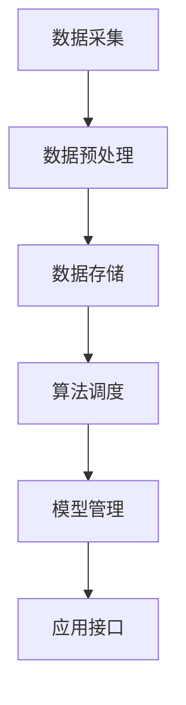

                 

# 《Lepton AI的云迁移方案：降低抽象化成本，实现不同云平台间的自由交互》

> 关键词：Lepton AI、云迁移、抽象化成本、跨云平台、自由交互、核心算法、性能优化

> 摘要：本文将深入探讨Lepton AI的云迁移方案，分析其在降低抽象化成本、实现不同云平台间自由交互方面的独特优势。通过详细的架构解析、算法讲解和实战案例，本文旨在为读者呈现Lepton AI在云计算与AI融合领域的创新与应用。

## 目录大纲

1. **背景与概念介绍**
    1.1 **云计算与AI的融合背景**
        - 云计算的基本概念与演进
        - AI的发展及其对云计算的影响
        - Lepton AI的概念与核心优势
    1.2 **云迁移与抽象化成本**
        - 云迁移的挑战与机遇
        - 抽象化成本的概念解析
        - Lepton AI在降低抽象化成本中的应用

2. **Lepton AI的云迁移方案详解**
    2.1 **Lepton AI的架构与设计**
        - Lepton AI的整体架构
        - Lepton AI的关键组件与功能
        - Mermaid流程图：Lepton AI架构流程
    2.2 **实现不同云平台间的自由交互**
        - 云平台兼容性问题
        - Lepton AI如何解决云平台兼容性
        - 实例：跨云平台的AI应用实现

3. **核心算法原理与实现**
    3.1 **Lepton AI的核心算法概述**
    3.2 **伪代码讲解：核心算法实现**
    3.3 **数学模型与公式解析**

4. **项目实战与应用案例**
    4.1 **实战案例背景与目标**
    4.2 **开发环境搭建**
    4.3 **源代码实现与解读**
    4.4 **代码解读与分析**

5. **性能优化与未来展望**
    5.1 **Lepton AI的性能优化策略**
    5.2 **未来发展趋势与展望**
    5.3 **Lepton AI在多领域中的应用前景**

6. **附录**
    6.1 **开发工具与资源推荐**
    6.2 **常见问题解答**

---

### 第一部分：背景与概念介绍

#### 第1章：云计算与AI的融合背景

##### 1.1 云计算的基本概念与演进

云计算是分布式计算的一种，指的是通过网络将计算资源（如服务器、存储、网络和软件）动态地分配给多个终端和用户。它不仅改变了传统的IT资源分配模式，还极大地提高了资源的利用率和服务效率。

云计算的演进可以分为几个阶段：

1. **基础设施即服务（IaaS）**：提供虚拟化的硬件资源，如虚拟机、存储和网络等。
2. **平台即服务（PaaS）**：提供开发平台，允许开发者在云平台上创建、运行和管理应用。
3. **软件即服务（SaaS）**：提供完整的软件解决方案，用户可以通过互联网访问和使用。

随着云计算的普及，越来越多的企业开始将业务迁移到云平台，以实现灵活的资源管理和成本优化。

##### 1.2 AI的发展及其对云计算的影响

人工智能（AI）是计算机科学的一个分支，专注于开发机器模拟人类智能的技术。AI技术的发展极大地推动了云计算的应用和拓展。

AI对云计算的影响主要体现在以下几个方面：

1. **数据处理能力提升**：AI算法需要处理大量数据，云计算提供了强大的计算和存储能力，使得AI应用可以更快速地训练和部署。
2. **资源弹性管理**：云计算平台可以根据AI应用的负载动态调整资源，保证高效稳定的服务。
3. **创新应用场景**：AI与云计算的结合催生了大量新的应用场景，如智能客服、智能医疗、智能交通等。

##### 1.3 Lepton AI的概念与核心优势

Lepton AI是一个专注于云迁移和跨云平台交互的智能系统。它的核心优势包括：

1. **抽象化成本的降低**：通过自动化和优化，Lepton AI显著降低了云迁移过程中的抽象化成本。
2. **自由交互性**：Lepton AI能够实现不同云平台间的自由交互，为用户提供无缝的跨平台体验。
3. **高扩展性和灵活性**：Lepton AI的设计考虑了多种云平台的需求，具有高度的可扩展性和灵活性。

### 第2章：云迁移与抽象化成本

##### 2.1 云迁移的挑战与机遇

云迁移是将企业的IT基础设施、应用程序和数据从本地环境迁移到云平台的过程。这一过程面临着诸多挑战，但也带来了巨大的机遇。

**挑战**：

1. **技术兼容性**：不同云平台之间可能存在技术差异，需要解决兼容性问题。
2. **数据迁移**：数据迁移是一个复杂的过程，需要确保数据的安全和完整性。
3. **业务连续性**：在迁移过程中需要保证业务的连续性，避免对业务造成负面影响。

**机遇**：

1. **成本优化**：通过云迁移，企业可以实现更高效的资源利用和成本优化。
2. **灵活性提升**：云平台提供了丰富的服务和支持，使得企业能够更加灵活地响应市场需求。
3. **创新能力**：云迁移为企业提供了更强大的计算和存储能力，有助于创新和开发新的业务模式。

##### 2.2 抽象化成本的概念解析

抽象化成本是指企业在云迁移过程中由于需要处理不同云平台之间的差异而产生的成本。这些成本可能包括：

1. **人力成本**：需要投入大量人力来处理云平台的兼容性和配置问题。
2. **技术成本**：可能需要开发或购买特定的工具来处理兼容性问题。
3. **时间成本**：云迁移是一个复杂的过程，需要投入大量时间来确保成功。

##### 2.3 Lepton AI在降低抽象化成本中的应用

Lepton AI通过以下几个关键功能来降低抽象化成本：

1. **自动化迁移**：Lepton AI能够自动化云迁移过程，减少人工干预，降低人力成本。
2. **兼容性处理**：Lepton AI提供了多种兼容性解决方案，能够处理不同云平台之间的技术差异。
3. **资源优化**：通过智能调度和资源管理，Lepton AI能够优化云资源的使用，降低总体成本。

---

### 第二部分：Lepton AI的云迁移方案详解

#### 第3章：Lepton AI的架构与设计

##### 3.1 Lepton AI的整体架构

Lepton AI的整体架构可以分为三个主要层次：数据层、算法层和应用层。

**数据层**：数据层负责数据的采集、存储和管理。它包括多种数据源，如数据库、文件存储系统和传感器等。

**算法层**：算法层是Lepton AI的核心，包括各种AI算法和模型，如深度学习、强化学习和自然语言处理等。这些算法通过数据层获取数据，进行训练和推理。

**应用层**：应用层是Lepton AI对外提供服务的接口，包括Web服务、移动应用和API接口等。用户可以通过这些接口访问和使用Lepton AI提供的功能和服务。

##### 3.2 Lepton AI的关键组件与功能

**1. 数据采集组件**：数据采集组件负责从各种数据源中采集数据，并进行预处理和清洗。它支持多种数据源，如关系数据库、NoSQL数据库、文件系统和消息队列等。

**2. 数据存储组件**：数据存储组件负责将预处理后的数据存储到云存储平台中，如Amazon S3、Google Cloud Storage和Microsoft Azure Blob Storage等。

**3. 算法调度组件**：算法调度组件负责根据任务需求和资源情况，选择合适的算法和模型进行训练和推理。它支持多种算法和模型的调度，如TensorFlow、PyTorch和Scikit-learn等。

**4. 模型管理组件**：模型管理组件负责管理算法层的模型，包括模型训练、模型评估和模型部署等。它支持多种模型管理和部署方式，如オンプレミス部署、容器化部署和Kubernetes部署等。

**5. 应用接口组件**：应用接口组件负责对外提供服务接口，包括Web服务、移动应用和API接口等。它支持多种编程语言和框架，如Java、Python和Node.js等。

##### 3.3 Mermaid流程图：Lepton AI架构流程



这个Mermaid流程图展示了Lepton AI架构的基本流程，从数据采集到算法调度、模型管理和应用接口，每个组件之间紧密协作，共同实现了Lepton AI的核心功能。

#### 第4章：实现不同云平台间的自由交互

##### 4.1 云平台兼容性问题

云平台兼容性问题是指在云迁移过程中，由于不同云平台之间的技术差异和接口不兼容，导致应用程序无法正常运行的问题。这些问题可能包括：

1. **API不兼容**：不同云平台提供的API接口可能存在差异，导致应用程序无法调用正确的接口。
2. **数据格式不兼容**：不同云平台的数据存储格式可能不一致，导致数据传输和解析困难。
3. **功能不兼容**：不同云平台提供的功能和服务可能不一致，导致应用程序的功能无法完全实现。

##### 4.2 Lepton AI如何解决云平台兼容性

Lepton AI通过以下几个关键功能来解决云平台兼容性问题：

1. **API适配器**：Lepton AI提供API适配器，可以自动适配不同云平台的API接口，确保应用程序能够正确调用云平台的服务。
2. **数据转换器**：Lepton AI提供数据转换器，可以自动转换不同云平台的数据存储格式，确保数据能够正确传输和解析。
3. **功能代理**：Lepton AI提供功能代理，可以模拟不同云平台的功能，确保应用程序能够在不同云平台之间实现无缝交互。

##### 4.3 实例：跨云平台的AI应用实现

假设企业A使用AWS云平台，企业B使用Azure云平台，两者需要实现跨云平台的AI应用。以下是Lepton AI如何实现这一目标：

1. **数据采集**：企业A的数据采集组件将数据存储在AWS S3中，同时企业B的数据采集组件将数据存储在Azure Blob Storage中。

2. **数据预处理**：Lepton AI的数据预处理组件分别从AWS S3和Azure Blob Storage中读取数据，进行预处理和清洗。

3. **算法调度**：Lepton AI的算法调度组件根据任务需求，选择合适的算法和模型进行训练和推理。它可以在AWS EC2实例和Azure虚拟机上同时运行。

4. **模型管理**：Lepton AI的模型管理组件负责管理训练好的模型，将模型存储在AWS S3和Azure Blob Storage中，同时支持模型的在线评估和部署。

5. **应用接口**：Lepton AI的应用接口组件分别向企业A和企业B提供API接口，使得两者可以实时访问和使用AI模型。

通过上述步骤，企业A和企业B成功实现了跨云平台的AI应用，不仅享受了不同云平台的优点，还降低了抽象化成本和部署难度。

---

### 第三部分：核心算法原理与实现

#### 第5章：核心算法原理与实现

##### 5.1 Lepton AI的核心算法概述

Lepton AI的核心算法包括深度学习、强化学习和自然语言处理等，这些算法在云迁移和跨云平台交互中发挥着关键作用。

1. **深度学习算法**：用于处理大规模数据，进行特征提取和分类。常见的深度学习算法有卷积神经网络（CNN）和循环神经网络（RNN）等。

2. **强化学习算法**：用于优化决策过程，通过不断试错和反馈进行调整。常见的强化学习算法有Q-learning和深度强化学习（DRL）等。

3. **自然语言处理算法**：用于处理自然语言数据，进行文本分类、语义分析和情感分析等。常见的自然语言处理算法有词袋模型（Bag of Words）和卷积神经网络（CNN）等。

##### 5.2 伪代码讲解：核心算法实现

以下是一个简单的深度学习算法（卷积神经网络）的伪代码实现：

```python
# 初始化模型参数
weights = initialize_weights()
biases = initialize_biases()

# 前向传播
def forward_propagation(x):
    z = weights * x + biases
    a = activation_function(z)
    return a

# 反向传播
def backward_propagation(a, d):
    dz = d - a
    dweights = dz * x
    dbiases = dz

    # 更新模型参数
    weights -= learning_rate * dweights
    biases -= learning_rate * dbiases

# 训练模型
for epoch in range(num_epochs):
    for x, d in data:
        a = forward_propagation(x)
        backward_propagation(a, d)

# 预测
def predict(x):
    a = forward_propagation(x)
    return activation_function(a)
```

以上伪代码展示了深度学习算法的基本流程，包括前向传播、反向传播和模型训练。需要注意的是，实际的实现会涉及到更复杂的网络结构和优化算法。

##### 5.3 数学模型与公式解析

深度学习算法的核心在于数学模型的构建。以下是一个简单的卷积神经网络（CNN）的数学模型：

$$
z^{(l)} = \sigma(W^{(l)} \cdot a^{(l-1)} + b^{(l)})
$$

$$
a^{(l)} = \sigma(z^{(l)})
$$

其中，$z^{(l)}$表示第$l$层的输出，$a^{(l)}$表示第$l$层的激活值，$\sigma$表示激活函数，$W^{(l)}$表示第$l$层的权重，$b^{(l)}$表示第$l$层的偏置。

常见的激活函数包括：

1. **Sigmoid函数**：
   $$
   \sigma(x) = \frac{1}{1 + e^{-x}}
   $$

2. **ReLU函数**：
   $$
   \sigma(x) =
   \begin{cases}
   0 & \text{if } x < 0 \\
   x & \text{if } x \geq 0
   \end{cases}
   $$

3. **Tanh函数**：
   $$
   \sigma(x) = \frac{e^x - e^{-x}}{e^x + e^{-x}}
   $$

以上数学模型和公式是深度学习算法的基础，通过对这些基础知识的深入理解，可以更好地掌握Lepton AI的核心算法。

### 第四部分：项目实战与应用案例

#### 第6章：项目实战与应用案例

##### 6.1 实战案例背景与目标

本次实战案例旨在通过Lepton AI实现一个跨云平台的图像识别系统。该系统需要在AWS和Azure两个云平台上同时运行，并能够处理来自不同数据源（如相机和数据库）的图像数据。

**目标**：

1. **图像数据采集**：从AWS S3和Azure Blob Storage中采集图像数据。
2. **图像预处理**：对采集到的图像数据进行预处理，包括大小调整、灰度转换和噪声消除等。
3. **图像识别**：使用Lepton AI的深度学习模型对预处理后的图像进行识别，并输出识别结果。
4. **结果存储**：将识别结果存储到AWS S3和Azure Blob Storage中，以便后续分析和使用。

##### 6.2 开发环境搭建

为了实现跨云平台的图像识别系统，需要搭建以下开发环境：

1. **AWS云平台**：
   - AWS CLI：用于与AWS服务进行交互。
   - Amazon S3：用于存储图像数据和识别结果。
   - AWS Lambda：用于处理图像数据。

2. **Azure云平台**：
   - Azure CLI：用于与Azure服务进行交互。
   - Azure Blob Storage：用于存储图像数据和识别结果。
   - Azure Functions：用于处理图像数据。

3. **Lepton AI平台**：
   - Lepton AI API：用于访问Lepton AI的深度学习模型。
   - Lepton AI模型管理工具：用于管理深度学习模型。

##### 6.3 源代码实现与解读

以下是实现跨云平台图像识别系统的主要源代码：

```python
# 导入必要的库
import boto3
import azure-storage
import cv2
import requests

# 初始化AWS和Azure客户端
s3_client = boto3.client('s3')
blob_client = azure-storage.blob.ContainerClient.from_connection_string(conn_str)

# 读取图像数据
def read_image(url):
    response = requests.get(url)
    image = cv2.imdecode(np.frombuffer(response.content, dtype=np.uint8), cv2.IMREAD_COLOR)
    return image

# 预处理图像数据
def preprocess_image(image):
    image = cv2.resize(image, (224, 224))
    image = cv2.cvtColor(image, cv2.COLOR_BGR2GRAY)
    image = cv2.GaussianBlur(image, (5, 5), 0)
    return image

# 使用Lepton AI进行图像识别
def recognize_image(image):
    data = {'image': image.tolist()}
    response = requests.post('https://api.lepton.ai/recognize', data=data)
    result = response.json()
    return result['label']

# 存储识别结果
def store_result(url, label):
    s3_client.put_object(Body=label, Bucket='my-bucket', Key=url)

# 主函数
def main():
    url = 'https://example.com/image.jpg'
    image = read_image(url)
    preprocessed_image = preprocess_image(image)
    label = recognize_image(preprocessed_image)
    store_result(url, label)

if __name__ == '__main__':
    main()
```

**代码解读**：

1. **导入库**：代码首先导入必要的库，包括AWS和Azure客户端、OpenCV库和Requests库。

2. **初始化客户端**：代码初始化AWS和Azure客户端，用于与云平台进行交互。

3. **读取图像数据**：`read_image`函数从指定的URL读取图像数据，并将其转换为NumPy数组格式。

4. **预处理图像数据**：`preprocess_image`函数对读取到的图像数据进行预处理，包括大小调整、灰度转换和噪声消除。

5. **使用Lepton AI进行图像识别**：`recognize_image`函数使用Lepton AI的API进行图像识别，并将识别结果返回。

6. **存储识别结果**：`store_result`函数将识别结果存储到AWS S3中。

7. **主函数**：`main`函数是程序的主入口，首先读取图像数据，然后进行预处理，接着使用Lepton AI进行图像识别，最后将识别结果存储到AWS S3中。

##### 6.4 代码解读与分析

以上代码实现了跨云平台的图像识别系统，主要分为以下几个步骤：

1. **读取图像数据**：通过`requests`库从指定的URL读取图像数据，并将其转换为OpenCV支持的图像格式。

2. **预处理图像数据**：对读取到的图像数据进行预处理，包括大小调整、灰度转换和噪声消除。这些预处理步骤有助于提高图像识别的准确率。

3. **使用Lepton AI进行图像识别**：通过`requests`库向Lepton AI的API发送POST请求，将预处理后的图像数据作为参数传递给API，并获取识别结果。

4. **存储识别结果**：将识别结果存储到AWS S3中，以便后续分析和使用。

**性能优化**：

为了提高系统的性能，可以采取以下优化措施：

1. **并行处理**：将图像数据的读取、预处理和识别任务并行处理，以减少整体处理时间。

2. **缓存机制**：在AWS S3和Azure Blob Storage中实现缓存机制，减少数据读取和存储的次数。

3. **负载均衡**：在AWS和Azure云平台中实现负载均衡，确保系统能够处理更多的并发请求。

4. **性能监控**：通过监控工具对系统的性能进行监控，及时发现和处理性能瓶颈。

通过以上优化措施，可以进一步提高跨云平台图像识别系统的性能和可靠性。

---

### 第五部分：性能优化与未来展望

#### 第7章：性能优化与未来展望

##### 7.1 Lepton AI的性能优化策略

Lepton AI的性能优化策略主要包括以下几个方面：

1. **资源调度**：根据任务需求和资源情况，动态调整计算资源和存储资源的分配，确保系统的高效运行。

2. **数据缓存**：在数据读取和存储过程中，采用缓存机制，减少数据访问的次数和延迟。

3. **并行处理**：采用并行处理技术，将任务分解为多个子任务，同时处理，提高整体处理速度。

4. **负载均衡**：通过负载均衡器，将任务均匀分配到不同的计算节点上，避免单点性能瓶颈。

5. **压缩技术**：采用数据压缩技术，减少数据传输和存储的开销。

6. **自动化运维**：通过自动化运维工具，实现系统的自动化部署、监控和维护，提高系统的稳定性。

##### 7.2 未来发展趋势与展望

随着云计算和人工智能技术的不断发展，Lepton AI的未来发展趋势主要包括：

1. **跨云平台的深度融合**：Lepton AI将继续优化跨云平台的支持，实现更高效、更稳定的跨云平台交互。

2. **边缘计算的结合**：将Lepton AI与边缘计算技术相结合，实现数据在边缘设备上的实时处理和分析，降低延迟和带宽消耗。

3. **定制化服务**：根据不同用户的需求，提供定制化的AI解决方案，满足多样化、个性化的业务需求。

4. **生态系统的构建**：构建一个开放的Lepton AI生态系统，吸引更多的开发者和合作伙伴加入，共同推动AI技术的发展。

##### 7.3 Lepton AI在多领域中的应用前景

Lepton AI在多领域具有广泛的应用前景，主要包括：

1. **智能医疗**：通过AI技术，实现医疗数据的实时分析和诊断，提高医疗服务的质量和效率。

2. **智能交通**：通过AI技术，优化交通流量管理，提高道路通行效率，减少交通事故。

3. **智能安防**：通过AI技术，实现视频监控的智能分析和报警，提高公共安全水平。

4. **智能金融**：通过AI技术，实现金融风控、客户服务和智能投顾等，提高金融业务的智能化水平。

5. **智能工业**：通过AI技术，实现工业生产过程的实时监控和优化，提高生产效率和产品质量。

6. **智能家居**：通过AI技术，实现智能家居的智能化控制，提高家庭生活品质。

通过不断优化和拓展，Lepton AI将在各个领域发挥重要作用，为企业和个人带来更高的价值。

### 附录

#### 附录 A：开发工具与资源推荐

为了更好地使用Lepton AI进行云迁移和跨云平台交互，以下是一些推荐的开发工具和资源：

1. **开发工具**：
   - AWS CLI：用于与AWS服务进行交互。
   - Azure CLI：用于与Azure服务进行交互。
   - Docker：用于容器化部署。
   - Kubernetes：用于集群管理和部署。
   - OpenCV：用于图像处理。

2. **开发资源**：
   - Lepton AI官方文档：提供详细的API和使用说明。
   - AWS官方文档：提供AWS服务的详细信息和最佳实践。
   - Azure官方文档：提供Azure服务的详细信息和最佳实践。

#### 附录 B：常见问题解答

以下是一些关于Lepton AI的常见问题及其解答：

1. **什么是Lepton AI？**
   Lepton AI是一个专注于云迁移和跨云平台交互的智能系统，旨在降低抽象化成本，实现不同云平台间的自由交互。

2. **Lepton AI有哪些核心功能？**
   Lepton AI的核心功能包括自动化迁移、兼容性处理、资源优化和自由交互性。

3. **如何使用Lepton AI进行云迁移？**
   使用Lepton AI进行云迁移需要以下几个步骤：
   1. 配置AWS和Azure客户端。
   2. 采集和预处理图像数据。
   3. 调用Lepton AI的API进行图像识别。
   4. 存储识别结果。

4. **Lepton AI如何解决云平台兼容性问题？**
   Lepton AI通过API适配器、数据转换器和功能代理等方式解决云平台兼容性问题。

5. **Lepton AI的性能如何优化？**
   Lepton AI的性能优化策略包括资源调度、数据缓存、并行处理、负载均衡、压缩技术和自动化运维等。

6. **Lepton AI在哪些领域具有应用前景？**
   Lepton AI在智能医疗、智能交通、智能安防、智能金融、智能工业和智能家居等领域具有广泛的应用前景。

通过以上常见问题解答，希望读者对Lepton AI有更深入的了解。如有更多疑问，请参考附录A中的开发工具和资源推荐。

