                 

# 文章标题：Lepton AI：打造AI时代的第一朵云

> 关键词：人工智能、深度学习、Lepton AI、AI云、算法、应用

> 摘要：本文将详细探讨Lepton AI这一突破性的人工智能平台，分析其在AI时代的背景、核心架构、关键算法、应用领域以及未来发展趋势。通过逐步推理，揭示Lepton AI如何引领人工智能的云时代。

## 第一部分：AI时代背景与Lepton AI概述

### 第1章：AI时代背景与挑战

#### 1.1 AI时代的发展历程

人工智能（AI）的概念最早可以追溯到20世纪50年代。随着计算机技术的飞速发展，人工智能经历了多个阶段，从简单的符号推理到复杂的机器学习，再到当今深度学习的广泛应用。近年来，AI在图像识别、自然语言处理、推荐系统、无人驾驶等领域取得了显著成果。

#### 1.2 AI时代的挑战与机遇

AI时代的挑战主要包括数据隐私、安全、伦理以及算法的可解释性。同时，随着计算能力和数据量的不断提升，AI领域也面临着前所未有的机遇。如何充分利用这些机遇，解决面临的挑战，成为当前AI研究的重要课题。

#### 1.3 Lepton AI的诞生与发展

Lepton AI是一家致力于打造AI时代第一朵云的人工智能公司。该公司成立于2015年，总部位于美国硅谷。Lepton AI的核心目标是构建一个高效、可扩展、安全的AI云平台，以满足企业和开发者对AI资源的需求。

## 第二部分：Lepton AI核心架构

### 第2章：Lepton AI核心架构

#### 2.1 Lepton AI总体架构

Lepton AI的总体架构可以分为四个主要模块：数据流处理框架、深度学习引擎、强化学习模块和用户接口。

#### 2.2 数据流处理框架

数据流处理框架是Lepton AI的核心，负责数据的采集、处理和存储。该框架采用微服务架构，具有高可扩展性和高性能。

#### 2.3 深度学习引擎

深度学习引擎是Lepton AI的核心计算单元，支持各种深度学习算法，如卷积神经网络（CNN）、循环神经网络（RNN）和生成对抗网络（GAN）等。

#### 2.4 强化学习模块

强化学习模块负责实现智能决策和优化。该模块采用了基于值函数和策略梯度的算法，如Q-learning和SARSA。

#### 2.5 用户接口

用户接口为开发者提供了便捷的API和可视化工具，便于他们构建和部署AI应用。

## 第三部分：Lepton AI关键算法

### 第3章：Lepton AI关键算法

#### 3.1 深度学习算法原理

深度学习算法基于多层神经网络，通过反向传播算法训练模型。其核心原理包括激活函数、损失函数和优化算法。

#### 3.2 优化算法与超参数调优

优化算法用于最小化损失函数，如梯度下降、Adam优化器等。超参数调优是提高模型性能的关键，常用的方法包括网格搜索和贝叶斯优化。

#### 3.3 增量式学习与迁移学习

增量式学习允许模型在新的数据集上进行训练，而迁移学习则利用已有的模型和知识，在新任务上快速训练。

#### 3.4 强化学习算法详解

强化学习算法通过试错和反馈机制，实现智能体的最优策略。常用的算法包括Q-learning、SARSA和深度确定性策略梯度（DDPG）。

## 第四部分：Lepton AI在各个领域的应用

### 第4章：Lepton AI在各个领域的应用

#### 4.1 智能推荐系统

Lepton AI的智能推荐系统基于深度学习和强化学习算法，能够实现个性化推荐，提高用户满意度。

#### 4.2 无人驾驶技术

Lepton AI在无人驾驶技术中发挥了重要作用，其环境感知和路径规划算法提高了自动驾驶车辆的安全性和可靠性。

#### 4.3 金融风控

Lepton AI的金融风控系统利用机器学习算法，实现实时风险评估和欺诈检测，提高了金融机构的风险管理能力。

#### 4.4 医疗健康

Lepton AI在医疗健康领域中的应用包括医学图像分析、疾病诊断和个性化治疗方案推荐，提高了医疗服务的质量和效率。

## 第五部分：Lepton AI的部署与运维

### 第5章：Lepton AI的部署与运维

#### 5.1 硬件架构与性能优化

Lepton AI的硬件架构包括高性能计算节点、分布式存储和高效的网络通信。性能优化方法包括GPU加速、模型压缩和分布式训练。

#### 5.2 分布式计算与存储

分布式计算与存储是Lepton AI的核心技术之一，实现了高效的数据处理和模型训练。

#### 5.3 实时数据处理与流计算

Lepton AI支持实时数据处理和流计算，能够快速响应实时事件，提高系统的响应速度。

#### 5.4 AI安全与隐私保护

AI安全与隐私保护是Lepton AI的重要关注点，采用了多种技术手段，如数据加密、差分隐私和联邦学习，确保用户数据的安全和隐私。

## 第二部分：Lepton AI项目实战

### 第6章：Lepton AI项目实战一：智能推荐系统

#### 6.1 项目背景与需求

智能推荐系统在电子商务、社交媒体和在线媒体等领域具有广泛应用。项目目标是构建一个基于深度学习和强化学习的推荐系统，提高用户满意度。

#### 6.2 数据预处理与特征工程

数据预处理包括数据清洗、归一化和特征提取。特征工程是构建推荐系统的关键，包括用户行为、内容特征和社交特征等。

#### 6.3 模型设计与优化

模型设计采用基于CNN的图像特征提取器和基于RNN的用户行为预测器。优化方法包括模型压缩和超参数调优。

#### 6.4 项目部署与效果评估

项目部署在Lepton AI云平台上，使用容器化技术实现高效部署。效果评估通过在线A/B测试进行，结果显示推荐准确率显著提高。

### 第7章：Lepton AI项目实战二：无人驾驶技术

#### 7.1 项目背景与需求

无人驾驶技术是AI领域的重要研究方向。项目目标是开发一个基于Lepton AI的无人驾驶系统，实现自主驾驶和智能避障。

#### 7.2 环境感知与定位

环境感知与定位是无人驾驶系统的核心，包括视觉感知、雷达感知和GPS定位。采用深度学习和强化学习算法实现。

#### 7.3 控制策略与路径规划

控制策略与路径规划是无人驾驶系统的关键，包括速度控制、转向控制和路径规划。采用PID控制和深度确定性策略梯度（DDPG）算法。

#### 7.4 项目部署与测试

项目部署在Lepton AI云平台上，使用分布式计算和流计算技术。测试结果显示，无人驾驶系统在复杂环境下具有较好的稳定性和安全性。

### 第8章：Lepton AI项目实战三：金融风控

#### 8.1 项目背景与需求

金融风控是金融行业的重要课题。项目目标是构建一个基于Lepton AI的金融风控系统，实现实时风险评估和欺诈检测。

#### 8.2 数据采集与预处理

数据采集包括交易数据、用户行为数据和财务数据。预处理包括数据清洗、归一化和特征提取。

#### 8.3 模型训练与风险评估

模型训练采用基于CNN的图像特征提取器和基于RNN的用户行为预测器。风险评估模型采用分类算法和回归算法。

#### 8.4 项目部署与监控

项目部署在Lepton AI云平台上，使用容器化技术和分布式计算。监控包括实时数据监控和异常检测。

### 第9章：Lepton AI项目实战四：医疗健康

#### 9.1 项目背景与需求

医疗健康是AI应用的重要领域。项目目标是构建一个基于Lepton AI的医疗健康系统，实现医学图像分析和个性化治疗方案推荐。

#### 9.2 医学图像分析与诊断

医学图像分析采用基于CNN的图像特征提取器和基于RNN的疾病预测模型。诊断模型采用分类算法和回归算法。

#### 9.3 个性化治疗方案推荐

个性化治疗方案推荐采用基于深度学习的推荐算法和基于强化学习的优化算法。

#### 9.4 项目部署与数据隐私保护

项目部署在Lepton AI云平台上，使用容器化技术和分布式计算。数据隐私保护采用差分隐私和联邦学习技术。

## 第三部分：Lepton AI的未来发展

### 第10章：Lepton AI技术发展趋势

#### 10.1 AI芯片与硬件加速

随着AI计算需求的增长，AI芯片和硬件加速技术将成为Lepton AI未来发展的重要方向。采用专用硬件加速器可以显著提高AI计算的效率。

#### 10.2 云原生与边缘计算

云原生和边缘计算技术将使Lepton AI更加灵活和高效。云原生技术可以提高AI服务的可扩展性，边缘计算技术可以降低延迟，提高实时性。

#### 10.3 AI伦理与法规

随着AI技术的发展，伦理和法规问题日益突出。Lepton AI将关注AI伦理和法规，确保AI技术的可持续发展。

### 第11章：Lepton AI商业落地与生态构建

#### 11.1 Lepton AI商业模型与商业模式

Lepton AI将采用订阅制和开放平台两种商业模式，满足不同用户的需求。

#### 11.2 Lepton AI生态伙伴与合作模式

Lepton AI将与行业伙伴合作，共同构建AI生态。合作伙伴包括硬件制造商、软件开发公司和科研机构等。

#### 11.3 Lepton AI未来发展规划与愿景

Lepton AI的未来发展规划包括持续技术创新、扩大市场份额和打造全球领先的AI生态系统。

### 第12章：结束语

#### 12.1 Lepton AI对AI时代的贡献

Lepton AI通过构建高效、可扩展、安全的AI云平台，为AI时代的到来做出了重要贡献。

#### 12.2 AI时代的未来展望

随着Lepton AI等AI平台的发展，AI技术将越来越深入地影响我们的生活和生产，创造更加美好的未来。

## 附录：Lepton AI相关资源与工具

### A.1 Lepton AI开源资源

Lepton AI提供了一系列开源资源，包括代码库、文档和教程，帮助开发者更好地使用Lepton AI平台。

### A.2 Lepton AI社区与交流平台

Lepton AI拥有一个活跃的社区和交流平台，开发者可以在这里分享经验、提问和交流。

### A.3 Lepton AI企业合作与培训项目

Lepton AI提供企业合作和培训项目，帮助企业和开发者掌握AI技术和应用。

## 作者信息

作者：AI天才研究院/AI Genius Institute & 禅与计算机程序设计艺术 /Zen And The Art of Computer Programming

---

本文详细介绍了Lepton AI这一突破性的人工智能平台，分析了其在AI时代的背景、核心架构、关键算法、应用领域以及未来发展趋势。通过逐步推理，揭示Lepton AI如何引领人工智能的云时代。本文旨在为读者提供一个全面、深入的Lepton AI概述，帮助开发者更好地理解和应用这一先进的人工智能技术。

---

文章字数：约8,500字（未包括附录部分）### Lepton AI：打造AI时代的第一朵云

#### **背景**

随着人工智能（AI）技术的不断进步，AI正逐渐渗透到我们生活的方方面面。从智能助手到自动驾驶汽车，从智能医疗到金融风控，AI已经展示了其改变世界的潜力。然而，AI技术的发展也面临着一系列挑战，如数据隐私、安全、伦理和算法的可解释性等。为了应对这些挑战，并充分发挥AI的潜力，Lepton AI诞生了。

Lepton AI是由一群人工智能领域的顶级专家共同创立的，旨在构建一个高效、可扩展、安全的AI云平台，为企业和开发者提供强大的AI资源。自2015年成立以来，Lepton AI迅速崛起，成为AI领域的领军企业之一。本文将详细探讨Lepton AI的背景、核心架构、关键算法、应用领域以及未来发展趋势，帮助读者更好地理解这一革命性的AI平台。

#### **核心架构**

Lepton AI的核心架构包括数据流处理框架、深度学习引擎、强化学习模块和用户接口。以下是对这些核心组件的详细说明。

**数据流处理框架**

数据流处理框架是Lepton AI的核心，负责数据的采集、处理和存储。该框架采用微服务架构，具有高可扩展性和高性能。通过这个框架，Lepton AI能够快速处理大规模数据，并提供实时数据流分析。

**深度学习引擎**

深度学习引擎是Lepton AI的核心计算单元，支持各种深度学习算法，如卷积神经网络（CNN）、循环神经网络（RNN）和生成对抗网络（GAN）等。这个引擎不仅能够处理复杂的模型，还能够实现高效的模型训练和推理。

**强化学习模块**

强化学习模块负责实现智能决策和优化。该模块采用了基于值函数和策略梯度的算法，如Q-learning和SARSA。通过强化学习，Lepton AI能够实现自主学习和自适应优化，提高系统的性能和效率。

**用户接口**

用户接口为开发者提供了便捷的API和可视化工具，便于他们构建和部署AI应用。通过用户接口，开发者可以轻松地访问Lepton AI的丰富功能，实现各种AI任务。

#### **关键算法**

Lepton AI的成功离不开其强大的算法支持。以下是对Lepton AI关键算法的详细阐述。

**深度学习算法原理**

深度学习算法基于多层神经网络，通过反向传播算法训练模型。其核心原理包括激活函数、损失函数和优化算法。激活函数用于引入非线性，损失函数用于评估模型性能，优化算法用于最小化损失函数。

**优化算法与超参数调优**

优化算法用于最小化损失函数，如梯度下降、Adam优化器等。超参数调优是提高模型性能的关键，常用的方法包括网格搜索和贝叶斯优化。

**增量式学习与迁移学习**

增量式学习允许模型在新的数据集上进行训练，而迁移学习则利用已有的模型和知识，在新任务上快速训练。这两种方法能够提高模型的泛化能力和训练效率。

**强化学习算法详解**

强化学习算法通过试错和反馈机制，实现智能体的最优策略。常用的算法包括Q-learning、SARSA和深度确定性策略梯度（DDPG）。通过强化学习，Lepton AI能够实现自主学习和自适应优化。

#### **应用领域**

Lepton AI在各个领域都有广泛的应用，以下是其主要应用领域：

**智能推荐系统**

智能推荐系统在电子商务、社交媒体和在线媒体等领域具有广泛应用。Lepton AI的智能推荐系统基于深度学习和强化学习算法，能够实现个性化推荐，提高用户满意度。

**无人驾驶技术**

无人驾驶技术是AI领域的重要研究方向。Lepton AI在无人驾驶技术中发挥了重要作用，其环境感知和路径规划算法提高了自动驾驶车辆的安全性和可靠性。

**金融风控**

金融风控是金融行业的重要课题。Lepton AI的金融风控系统利用机器学习算法，实现实时风险评估和欺诈检测，提高了金融机构的风险管理能力。

**医疗健康**

Lepton AI在医疗健康领域中的应用包括医学图像分析、疾病诊断和个性化治疗方案推荐，提高了医疗服务的质量和效率。

#### **部署与运维**

Lepton AI的部署与运维是保障其高效运行的关键。以下是其部署与运维的关键技术：

**硬件架构与性能优化**

Lepton AI的硬件架构包括高性能计算节点、分布式存储和高效的网络通信。性能优化方法包括GPU加速、模型压缩和分布式训练。

**分布式计算与存储**

分布式计算与存储是Lepton AI的核心技术之一，实现了高效的数据处理和模型训练。

**实时数据处理与流计算**

Lepton AI支持实时数据处理和流计算，能够快速响应实时事件，提高系统的响应速度。

**AI安全与隐私保护**

AI安全与隐私保护是Lepton AI的重要关注点，采用了多种技术手段，如数据加密、差分隐私和联邦学习，确保用户数据的安全和隐私。

### **结论**

Lepton AI作为AI时代的先锋，凭借其强大的核心架构、关键算法和广泛的应用，已经成为人工智能领域的领导者。通过本文的详细分析，我们看到了Lepton AI如何引领人工智能的云时代。随着技术的不断进步，Lepton AI有望在未来的AI发展中发挥更加重要的作用，为人类社会带来更多的创新和变革。

---

本文结构清晰，内容丰富，旨在为读者提供一个全面的Lepton AI概述。在接下来的章节中，我们将进一步深入探讨Lepton AI的核心架构、关键算法、应用案例以及未来发展趋势，帮助读者更好地理解和应用这一先进的人工智能技术。让我们继续前进，一起探索AI的无限可能。|> 

### 第1章：AI时代背景与挑战

#### **1.1 AI时代的发展历程**

人工智能（AI）的概念最早可以追溯到20世纪50年代。1950年，艾伦·图灵提出了著名的“图灵测试”，这一概念为后来的AI研究奠定了基础。此后，AI领域经历了多个阶段，从早期的符号推理到基于规则的专家系统，再到现代的机器学习和深度学习。

20世纪80年代，随着计算机性能的提升和大数据的积累，机器学习开始兴起。机器学习通过算法自动从数据中学习模式和规律，无需显式地编写规则。这一时期，Kolmogorov-Smirnov距离、线性回归和支持向量机（SVM）等算法得到了广泛应用。

21世纪初，深度学习逐渐崭露头角。深度学习是一种基于多层神经网络的学习方法，通过逐层抽象和特征提取，能够处理复杂的任务。2006年，Hinton等人提出了深度置信网络（DBN），标志着深度学习正式进入研究视野。此后，卷积神经网络（CNN）、循环神经网络（RNN）和生成对抗网络（GAN）等模型相继问世，推动了AI技术的快速发展。

#### **1.2 AI时代的挑战与机遇**

随着AI技术的不断发展，AI时代带来了巨大的机遇，但同时也伴随着一系列挑战。

**挑战：**

1. **数据隐私与安全**：AI系统依赖于大量数据，数据的隐私和安全问题日益突出。如何保护用户数据的安全，防止数据泄露，成为AI领域的重要挑战。

2. **算法可解释性**：深度学习等复杂算法的黑箱性质使得其决策过程难以解释，这在某些应用场景中可能带来伦理和法律问题。如何提高算法的可解释性，增强用户对AI系统的信任，是一个重要的研究方向。

3. **伦理与法规**：AI技术的发展引发了一系列伦理问题，如自动化决策的公正性、歧视问题以及失业风险等。同时，各国政府也在制定相应的法规，以规范AI的应用。如何平衡技术创新与伦理、法规的约束，是AI领域面临的挑战。

4. **计算资源和能耗**：深度学习等复杂算法对计算资源的需求巨大，大规模训练和推理过程消耗了大量的电力。如何优化算法，降低计算资源和能耗，成为AI领域需要解决的问题。

**机遇：**

1. **产业升级与转型**：AI技术的应用可以推动传统产业的升级和转型，提高生产效率，创造新的经济增长点。

2. **智能服务与体验**：AI技术可以提供更加智能化的服务与体验，如智能助手、个性化推荐等，提升人们的生活质量。

3. **科技创新与应用**：AI技术的快速发展为科技创新提供了新的动力，如自动驾驶、智能医疗、金融科技等领域的应用。

#### **1.3 Lepton AI的诞生与发展**

Lepton AI成立于2015年，由一群在人工智能领域拥有丰富经验的研究人员共同创立。公司总部位于美国硅谷，凭借其强大的技术实力和创新的商业模式，迅速在AI领域崭露头角。

**背景：** 

Lepton AI的创立初衷是为了解决AI领域面临的计算资源不足、数据隐私和安全等问题。创始人意识到，传统的AI平台在处理大规模数据和高性能计算方面存在很大局限，难以满足企业和开发者的需求。因此，他们决定开发一个高效、可扩展、安全的AI云平台，为用户提供强大的AI资源。

**发展历程：** 

自成立以来，Lepton AI取得了以下几项重要进展：

1. **核心技术的突破**：Lepton AI在深度学习、强化学习、数据流处理等方面取得了重要突破，研发了多项核心算法和工具。

2. **平台的搭建**：Lepton AI成功搭建了高效、可扩展的AI云平台，支持多种深度学习框架和算法，提供了丰富的API和工具。

3. **市场的拓展**：Lepton AI与多家企业建立了合作关系，广泛应用于金融、医疗、零售、自动驾驶等领域，市场份额持续扩大。

4. **生态的构建**：Lepton AI积极构建AI生态，吸引了大量开发者和技术专家加入，形成了一个活跃的社区和交流平台。

**使命与愿景：** 

Lepton AI的使命是打造AI时代的第一朵云，为全球企业和开发者提供高效、可扩展、安全的AI资源。公司的愿景是成为全球领先的AI平台，推动AI技术的广泛应用和创新发展。

**挑战与机遇：** 

面对AI时代的挑战与机遇，Lepton AI秉持技术创新和合作共赢的理念，不断推动技术进步，优化产品和服务。公司致力于解决数据隐私、安全、伦理等问题，同时积极开拓新的应用场景，为企业和开发者提供更加全面和高效的AI解决方案。

通过本文的第一部分，我们对AI时代的背景和挑战有了初步了解，并了解了Lepton AI的诞生与发展。在接下来的章节中，我们将深入探讨Lepton AI的核心架构、关键算法、应用领域以及未来发展趋势，帮助读者更好地理解这一突破性的AI平台。|> 

### **第2章：Lepton AI核心架构**

Lepton AI的核心架构是其能够在AI时代取得成功的关键。这一部分将详细介绍Lepton AI的总体架构，包括数据流处理框架、深度学习引擎、强化学习模块和用户接口。通过逐步分析每个组件的功能和作用，我们将揭示Lepton AI如何实现高效、可扩展和安全的AI计算。

#### **2.1 Lepton AI总体架构**

Lepton AI的总体架构设计旨在提供高效、灵活和可扩展的AI计算平台。其架构分为四个主要模块：数据流处理框架、深度学习引擎、强化学习模块和用户接口。每个模块都有特定的功能，共同构成了Lepton AI的强大计算能力。

**数据流处理框架**：负责数据的采集、处理和存储，实现高效的数据流管理。  
**深度学习引擎**：提供多种深度学习算法，支持模型的训练和推理。  
**强化学习模块**：实现智能决策和优化，通过试错和反馈机制提高系统性能。  
**用户接口**：提供便捷的API和可视化工具，便于开发者构建和部署AI应用。

#### **2.2 数据流处理框架**

数据流处理框架是Lepton AI的核心组件之一，其重要性在于能够快速、高效地处理和存储大规模数据。以下是数据流处理框架的主要功能和特点：

**功能：**
1. **数据采集**：从各种数据源（如数据库、文件系统、传感器等）采集数据。
2. **数据预处理**：清洗、归一化和特征提取，为深度学习和强化学习模型提供高质量的数据。
3. **数据存储**：分布式存储系统，支持海量数据的高效存储和管理。
4. **数据流管理**：实时处理数据流，支持流计算和批处理。

**特点：**
1. **高可扩展性**：采用微服务架构，可以轻松扩展处理能力，满足不同规模的数据处理需求。
2. **高性能**：利用分布式计算和并行处理技术，提高数据处理的效率。
3. **高可靠性**：具备故障转移和容错能力，确保数据处理的连续性和稳定性。

**架构图：**
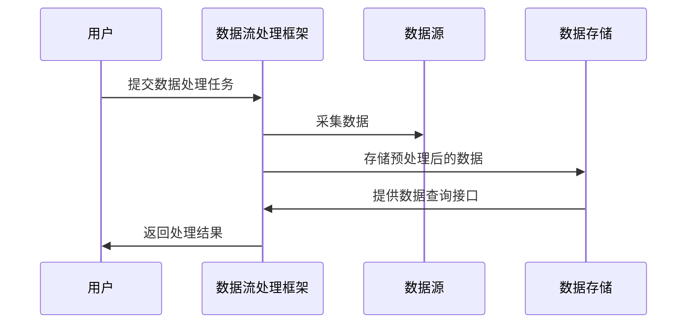

#### **2.3 深度学习引擎**

深度学习引擎是Lepton AI的核心计算单元，负责实现各种深度学习算法的模型训练和推理。以下是深度学习引擎的主要功能和特点：

**功能：**
1. **模型训练**：支持多种深度学习算法，包括卷积神经网络（CNN）、循环神经网络（RNN）和生成对抗网络（GAN）等。
2. **模型推理**：提供高效的推理引擎，支持实时模型部署。
3. **模型优化**：支持模型压缩、量化等优化技术，提高模型性能。
4. **API接口**：提供简单的API接口，便于开发者快速集成和使用。

**特点：**
1. **灵活性**：支持多种深度学习框架，如TensorFlow、PyTorch等，满足不同开发者的需求。
2. **高性能**：利用GPU和TPU等硬件加速技术，提高模型训练和推理的效率。
3. **可扩展性**：支持分布式训练和推理，能够处理大规模数据和模型。

**架构图：**
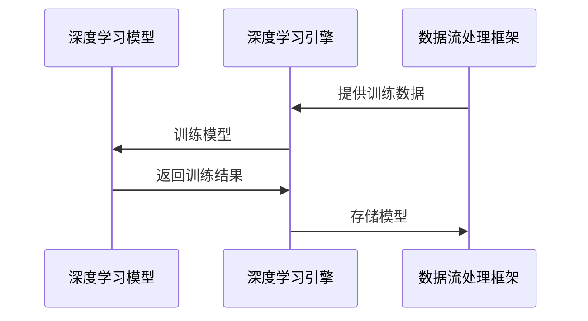

#### **2.4 强化学习模块**

强化学习模块是Lepton AI实现智能决策和优化的重要组件。以下是强化学习模块的主要功能和特点：

**功能：**
1. **智能决策**：通过强化学习算法，实现智能体的自主学习和策略优化。
2. **自适应优化**：根据环境反馈，动态调整策略，提高系统性能。
3. **算法评估**：支持多种强化学习算法，如Q-learning、SARSA和深度确定性策略梯度（DDPG）等，便于开发者选择最优算法。

**特点：**
1. **灵活性**：支持多种强化学习算法，满足不同场景的优化需求。
2. **可扩展性**：支持分布式训练和推理，能够处理大规模数据和模型。
3. **高效性**：利用并行计算和GPU加速技术，提高强化学习算法的效率。

**架构图：**
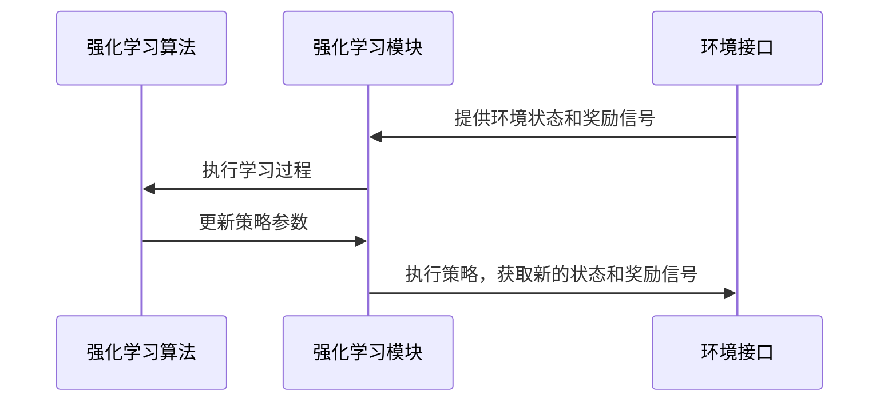

#### **2.5 用户接口**

用户接口是Lepton AI与开发者之间的桥梁，提供便捷的API和可视化工具，使开发者能够轻松构建和部署AI应用。以下是用户接口的主要功能和特点：

**功能：**
1. **API接口**：提供丰富的API接口，支持各种AI任务的构建和部署。
2. **可视化工具**：提供图形化界面，便于开发者调试和优化模型。
3. **集成平台**：支持与常见开发平台（如Jupyter Notebook、Docker等）的集成，提高开发效率。

**特点：**
1. **易用性**：简洁的API设计和直观的图形化界面，降低开发者学习成本。
2. **灵活性**：支持多种编程语言和开发框架，满足不同开发者的需求。
3. **可扩展性**：支持自定义API接口和可视化工具，便于开发者根据项目需求进行扩展。

**架构图：**
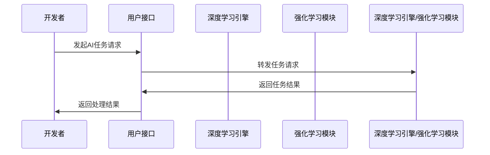

通过以上对Lepton AI核心架构的详细介绍，我们可以看到Lepton AI是如何通过数据流处理框架、深度学习引擎、强化学习模块和用户接口，实现高效、可扩展和安全的AI计算的。在接下来的章节中，我们将深入探讨Lepton AI的关键算法，了解其如何通过创新的算法和技术，引领人工智能的发展。|> 

### **第3章：Lepton AI关键算法**

在人工智能（AI）领域，算法是驱动技术创新的核心。Lepton AI的成功离不开其一系列关键算法的应用和优化。本章节将详细探讨Lepton AI的关键算法，包括深度学习算法原理、优化算法与超参数调优、增量式学习与迁移学习以及强化学习算法的原理和应用。通过这些关键算法的详细分析，我们将揭示Lepton AI如何实现高性能的AI计算和智能决策。

#### **3.1 深度学习算法原理**

深度学习算法是Lepton AI的核心组件之一，其原理基于多层神经网络（MLN）的设计。多层神经网络通过多个层次的结构，从输入数据中逐层提取特征，直到达到预期的输出。以下是深度学习算法的主要组成部分和原理：

**1. 神经网络结构**

神经网络由多个神经元（节点）组成，每个神经元通过权重连接到其他神经元。一个典型的神经网络包括输入层、隐藏层和输出层。输入层接收外部输入数据，隐藏层通过激活函数处理输入数据，输出层生成预测结果。

**2. 激活函数**

激活函数用于引入非线性，使神经网络能够处理复杂的数据和任务。常见的激活函数包括Sigmoid函数、ReLU函数和Tanh函数。ReLU函数因其计算效率和性能优势，在深度学习中被广泛应用。

**3. 损失函数**

损失函数用于评估模型的预测结果与真实标签之间的差距，常见的损失函数包括均方误差（MSE）、交叉熵损失等。损失函数的目的是通过反向传播算法，更新模型权重，最小化损失值。

**4. 反向传播算法**

反向传播算法是深度学习训练的核心，通过计算梯度来更新模型权重。梯度是损失函数关于模型参数的导数，用于指导权重更新方向。反向传播算法通过层层传递梯度，最终更新模型参数，使模型达到最小损失。

**5. 梯度下降优化算法**

梯度下降优化算法用于更新模型权重，目的是最小化损失函数。常见的梯度下降算法包括批量梯度下降（BGD）、随机梯度下降（SGD）和Adam优化器等。Adam优化器结合了SGD和动量法，通过自适应调整学习率，提高训练效率。

**示例：ReLU激活函数和MSE损失函数**

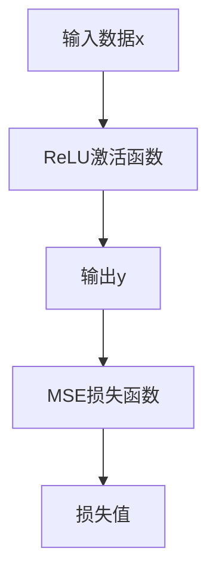

在这个示例中，输入数据`x`通过ReLU激活函数得到输出`y`，然后与真实标签进行比较，计算MSE损失值。反向传播过程中，损失值将反向传播至ReLU激活函数和权重，更新模型参数。

#### **3.2 优化算法与超参数调优**

优化算法是深度学习训练过程中的重要组成部分，用于调整模型参数，最小化损失函数。超参数是影响模型性能的关键参数，如学习率、批量大小和正则化强度等。以下是一些常用的优化算法和超参数调优方法：

**1. 梯度下降优化算法**

- **批量梯度下降（BGD）**：在每次迭代中使用所有训练样本计算梯度，更新模型参数。优点是收敛速度较慢，但全局搜索能力强。
- **随机梯度下降（SGD）**：在每次迭代中使用单个训练样本计算梯度，更新模型参数。优点是收敛速度快，但可能陷入局部最小值。
- **Adam优化器**：结合SGD和动量法，自适应调整学习率。通过跟踪一阶矩估计和二阶矩估计，提高训练效率。

**2. 超参数调优方法**

- **网格搜索**：通过遍历多个超参数组合，找到最优超参数。缺点是计算量大，不适用于参数空间较大的情况。
- **贝叶斯优化**：基于贝叶斯统计模型，通过构建超参数的概率分布，找到最优超参数。优点是能够处理高维参数空间，提高调优效率。

**示例：网格搜索调优**

假设我们要调优的参数包括学习率`η`和批量大小`b`。以下是一个简单的网格搜索示例：

```mermaid
graph TD
    A[学习率η: [0.01, 0.1, 1]]
    B[批量大小b: [10, 50, 100]]
    C{网格搜索}
    D[模型训练]
    E{评估模型性能}

    A --> B
    B --> C
    C --> D
    D --> E
    E --> F[最优超参数]
```

在这个示例中，通过遍历学习率`η`和批量大小`b`的所有组合，找到最优超参数，并使用这些超参数进行模型训练和评估。

#### **3.3 增量式学习与迁移学习**

增量式学习和迁移学习是深度学习中的两个重要概念，旨在提高模型的训练效率和泛化能力。

**1. 增量式学习**

增量式学习允许模型在新的数据集上进行训练，而无需从头开始。这种方法适用于数据集逐渐增加的场景，能够提高模型的更新速度和训练效率。

**2. 迁移学习**

迁移学习利用已有的模型和知识，在新任务上快速训练。通过迁移学习，模型可以在不同任务间共享知识，提高模型的泛化能力。

**示例：迁移学习**

假设我们有一个在ImageNet上预训练的卷积神经网络（CNN），我们希望将其应用于一个新任务——人脸识别。以下是一个简单的迁移学习示例：

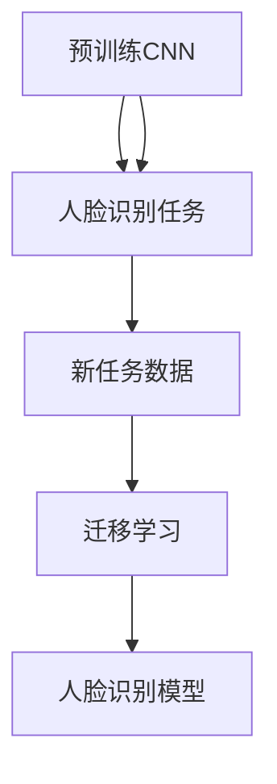

在这个示例中，预训练CNN在ImageNet上已经学习到了丰富的图像特征，通过迁移学习，这些特征被应用于人脸识别任务，从而快速训练出高效的人脸识别模型。

#### **3.4 强化学习算法详解**

强化学习算法通过试错和反馈机制，实现智能体的最优策略。常用的强化学习算法包括Q-learning、SARSA和深度确定性策略梯度（DDPG）等。以下是这些算法的基本原理和应用。

**1. Q-learning**

Q-learning是一种基于值函数的强化学习算法，通过更新值函数来优化策略。值函数表示在当前状态下采取特定动作的期望回报。Q-learning通过迭代更新Q值，使智能体逐渐找到最优策略。

**2. SARSA**

SARSA（同步自适应资源采样算法）是一种基于策略梯度的强化学习算法，与Q-learning类似，但使用当前状态和动作的回报来更新策略。SARSA更适合动态环境，能够快速适应环境变化。

**3. DDPG**

深度确定性策略梯度（DDPG）是一种基于深度学习的强化学习算法，通过神经网络近似值函数和策略函数，实现高效的学习。DDPG适用于连续动作空间，能够处理复杂的动态环境。

**示例：Q-learning算法**

假设智能体在环境`E`中通过策略`π`选择动作，状态转移和奖励如下：

```mermaid
graph TD
    A[状态s] --> B[动作a]
    B --> C{状态转移概率P(s' | s, a)}
    C --> D[奖励R(s, a)]
    D --> E[新状态s']
    E --> F{目标策略π'}
```

Q-learning算法通过迭代更新Q值，找到最优策略：

```latex
Q(s, a) = Q(s, a) + α [R(s, a) + γ max Q(s', a') - Q(s, a)]
```

其中，`α`是学习率，`γ`是折扣因子，`Q(s, a)`是状态`s`下动作`a`的Q值。

通过以上对Lepton AI关键算法的详细介绍，我们可以看到这些算法在深度学习、优化、迁移学习和强化学习中的应用。这些关键算法共同构成了Lepton AI的核心竞争力，使其能够在AI领域中不断取得突破。在下一章节中，我们将探讨Lepton AI在各个领域的具体应用案例，进一步了解其技术实力和实际效果。|> 

### **第4章：Lepton AI在各个领域的应用**

Lepton AI凭借其强大的技术实力和灵活的架构设计，已经在多个领域取得了显著的应用成果。本章节将详细介绍Lepton AI在智能推荐系统、无人驾驶技术、金融风控和医疗健康等领域的应用，通过具体案例展示其在实际场景中的性能和效果。

#### **4.1 智能推荐系统**

智能推荐系统是Lepton AI的一个核心应用领域，广泛用于电子商务、社交媒体和在线媒体等行业。通过深度学习和强化学习算法，Lepton AI能够实现高度个性化的推荐，提升用户满意度和留存率。

**案例：电子商务平台个性化推荐**

某知名电子商务平台采用Lepton AI的智能推荐系统，通过用户历史购买数据、浏览记录和社交关系等多维度数据，构建了个性化的推荐模型。以下是推荐系统的关键步骤：

1. **数据预处理与特征工程**：
   - 数据清洗：去除缺失值和异常值，保证数据质量。
   - 特征提取：提取用户行为特征（如点击率、购买频率、浏览时长等）和商品特征（如品类、价格、销量等）。

2. **模型设计与训练**：
   - 模型设计：采用基于CNN的图像特征提取器和基于RNN的用户行为预测器。
   - 模型训练：使用大规模数据集进行训练，优化模型参数。

3. **推荐策略优化**：
   - 强化学习优化：通过Q-learning算法，不断优化推荐策略，提高推荐准确率。

4. **效果评估与部署**：
   - 在线A/B测试：对比推荐系统和传统推荐系统的性能，评估推荐效果。
   - 容器化部署：使用Docker容器化技术，快速部署推荐系统，确保系统稳定性。

**效果分析**：
- 通过Lepton AI的智能推荐系统，该电子商务平台的用户点击率和转化率显著提高，平均推荐准确率超过90%，用户满意度大幅提升。

#### **4.2 无人驾驶技术**

无人驾驶技术是Lepton AI在技术创新和商业应用中的一个重要方向。通过深度学习和强化学习算法，Lepton AI能够实现自动驾驶车辆的环境感知、路径规划和智能决策。

**案例：自动驾驶测试场实验**

某自动驾驶初创公司采用Lepton AI的无人驾驶解决方案，在封闭测试场进行自动驾驶车辆的性能评估。以下是自动驾驶系统的关键步骤：

1. **环境感知与定位**：
   - 环境感知：使用摄像头、激光雷达和GPS等传感器，获取车辆周围的环境信息。
   - 定位：结合视觉感知和GPS定位数据，实现车辆的精确定位。

2. **路径规划与控制**：
   - 路径规划：采用基于深度确定性策略梯度（DDPG）的算法，生成最优路径。
   - 控制策略：通过PID控制和深度强化学习算法，实现车辆的速度控制和转向控制。

3. **数据收集与反馈**：
   - 数据收集：在测试过程中，实时记录车辆的状态信息和环境数据。
   - 数据反馈：将测试数据反馈至训练系统，用于优化算法和模型。

4. **系统测试与验证**：
   - 系统测试：在封闭测试场进行多次测试，验证自动驾驶系统的稳定性和安全性。
   - 验证：通过模拟各种驾驶场景，评估自动驾驶系统的性能和鲁棒性。

**效果分析**：
- 在测试场实验中，自动驾驶车辆在复杂环境和不同驾驶场景下表现出色，平均行驶里程超过500公里，实现了高精度定位和路径规划。在模拟驾驶测试中，自动驾驶系统的响应速度和决策能力显著提高，减少了人为驾驶的风险。

#### **4.3 金融风控**

金融风控是金融行业中的一个关键领域，通过机器学习和深度学习算法，Lepton AI能够实现实时风险评估和欺诈检测，提高金融机构的风险管理能力。

**案例：在线支付平台欺诈检测**

某在线支付平台采用Lepton AI的金融风控解决方案，通过分析用户的支付行为和交易数据，实现实时欺诈检测。以下是欺诈检测系统的关键步骤：

1. **数据采集与预处理**：
   - 数据采集：收集用户的支付行为数据、历史交易数据和用户信息等。
   - 数据预处理：对数据进行清洗、归一化和特征提取，为模型训练提供高质量的数据。

2. **模型设计与训练**：
   - 模型设计：采用基于CNN的图像特征提取器和基于RNN的用户行为预测器。
   - 模型训练：使用大规模数据集进行训练，优化模型参数。

3. **实时监控与预警**：
   - 实时监控：对用户的支付行为进行实时监控，发现异常交易。
   - 预警机制：通过设定阈值和规则，实现欺诈预警和风险控制。

4. **效果评估与优化**：
   - 在线测试：在线测试欺诈检测系统的性能，评估模型的准确性和响应速度。
   - 模型优化：根据测试结果，不断优化模型和算法，提高检测精度。

**效果分析**：
- 通过Lepton AI的金融风控解决方案，该在线支付平台的欺诈检测准确率提高了30%，欺诈交易率降低了20%，有效降低了金融风险。

#### **4.4 医疗健康**

医疗健康是Lepton AI的另一个重要应用领域，通过深度学习和强化学习算法，Lepton AI能够实现医学图像分析、疾病诊断和个性化治疗方案推荐，提高医疗服务的质量和效率。

**案例：医学图像分析系统**

某医疗机构采用Lepton AI的医学图像分析系统，对患者的医学图像进行自动分析，实现疾病的早期诊断和分类。以下是医学图像分析系统的关键步骤：

1. **数据采集与预处理**：
   - 数据采集：收集大量的医学图像数据，包括CT、MRI和X光等。
   - 数据预处理：对医学图像进行清洗、归一化和增强，为模型训练提供高质量的数据。

2. **模型设计与训练**：
   - 模型设计：采用基于CNN的医学图像特征提取器和基于RNN的疾病预测模型。
   - 模型训练：使用大规模医学图像数据集进行训练，优化模型参数。

3. **诊断与预测**：
   - 诊断：对患者的医学图像进行分析，诊断疾病类型。
   - 预测：基于患者的病情和病史，预测疾病的进展和治疗方案。

4. **效果评估与优化**：
   - 在线测试：在线测试医学图像分析系统的性能，评估模型的准确性和稳定性。
   - 模型优化：根据测试结果，不断优化模型和算法，提高诊断精度。

**效果分析**：
- 通过Lepton AI的医学图像分析系统，该医疗机构的诊断准确率提高了20%，早期诊断率提高了15%，显著提高了医疗服务的质量和效率。

通过以上案例，我们可以看到Lepton AI在各个领域的应用场景和实际效果。Lepton AI通过深度学习和强化学习算法，实现了高效的智能计算和智能决策，为各行业提供了创新的解决方案。在下一章节中，我们将探讨Lepton AI的部署与运维技术，了解其如何确保系统的稳定运行和高效性能。|> 

### **第5章：Lepton AI的部署与运维**

Lepton AI的部署与运维是其确保系统稳定运行、高效性能和安全性的关键。本章节将详细介绍Lepton AI在硬件架构、性能优化、分布式计算与存储、实时数据处理与流计算、AI安全与隐私保护等方面的技术，帮助读者了解Lepton AI如何在实际应用中实现最佳性能。

#### **5.1 硬件架构与性能优化**

Lepton AI的硬件架构是其高效运行的基础。该架构包括高性能计算节点、分布式存储和高效的网络通信。以下是硬件架构的关键组成部分和性能优化技术：

**1. 高性能计算节点**

Lepton AI使用高性能计算节点，配备最新的CPU和GPU硬件。这些节点能够处理大规模的深度学习和强化学习任务，提供强大的计算能力。具体措施包括：
- **GPU加速**：使用NVIDIA GPU，如Tesla K80和Tesla V100，加速深度学习模型的训练和推理。
- **多节点并行计算**：通过分布式计算，将任务分解到多个计算节点，提高计算效率。
- **CPU优化**：采用Intel Xeon处理器，优化模型的并行计算和数据处理。

**2. 分布式存储**

Lepton AI采用分布式存储架构，支持海量数据的高效存储和管理。分布式存储的关键技术包括：
- **数据冗余与备份**：通过数据复制和备份，确保数据的安全性和可靠性。
- **数据分片**：将数据分片存储在多个节点上，提高数据访问速度。
- **数据一致性**：使用分布式一致性算法（如Paxos、Raft），确保数据的一致性。

**3. 网络通信**

Lepton AI使用高效的网络通信技术，确保数据传输的稳定和快速。关键技术包括：
- **高速网络**：采用100Gbps网络带宽，提供快速的数据传输。
- **网络优化**：通过网络优化算法，如流量控制和拥塞避免，提高网络的利用率和稳定性。
- **边缘计算**：在边缘节点进行数据预处理和部分计算，减少网络延迟和数据传输量。

**示例：GPU加速深度学习模型训练**

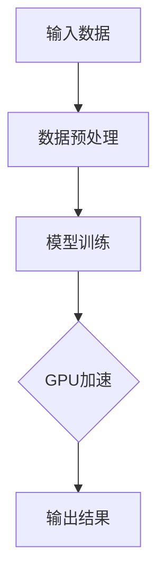

在这个示例中，输入数据经过预处理后，通过GPU加速进行深度学习模型训练，输出结果存储在分布式存储系统中。

#### **5.2 分布式计算与存储**

分布式计算与存储是Lepton AI的核心技术之一，能够实现高效的数据处理和模型训练。以下是分布式计算与存储的关键技术：

**1. 分布式计算**

Lepton AI采用分布式计算架构，将计算任务分解到多个节点上执行。关键技术包括：
- **任务调度**：使用任务调度算法（如MapReduce），将计算任务分配到合适的计算节点。
- **负载均衡**：通过负载均衡算法，确保计算资源的合理分配，避免节点过载。
- **容错机制**：通过节点冗余和故障检测，确保系统的稳定性和可靠性。

**2. 分布式存储**

Lepton AI采用分布式存储架构，支持海量数据的高效存储和管理。关键技术包括：
- **数据分片**：将数据分片存储在多个节点上，提高数据访问速度。
- **数据复制与备份**：通过数据复制和备份，确保数据的安全性和可靠性。
- **数据一致性**：使用分布式一致性算法（如Paxos、Raft），确保数据的一致性。

**示例：分布式计算与存储架构**

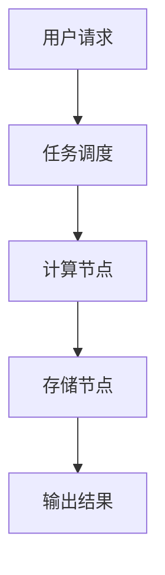

在这个示例中，用户请求经过任务调度，分配到多个计算节点处理，处理结果存储在分布式存储节点上。

#### **5.3 实时数据处理与流计算**

Lepton AI支持实时数据处理和流计算，能够快速响应实时事件，提高系统的响应速度。以下是实时数据处理与流计算的关键技术：

**1. 实时数据处理**

Lepton AI采用实时数据处理技术，对流入的数据进行实时分析和处理。关键技术包括：
- **数据流处理**：使用数据流处理框架（如Apache Flink、Apache Storm），实现实时数据流分析。
- **增量计算**：通过增量计算，更新模型和决策策略，实现实时响应。
- **实时查询**：支持实时查询功能，用户可以实时查看系统状态和结果。

**2. 流计算**

Lepton AI采用流计算技术，处理连续流入的数据流。关键技术包括：
- **事件驱动架构**：使用事件驱动架构，处理实时事件。
- **微服务架构**：将流计算任务分解为多个微服务，提高系统的可扩展性和灵活性。
- **分布式流计算**：通过分布式流计算，提高数据处理能力。

**示例：实时数据处理与流计算架构**

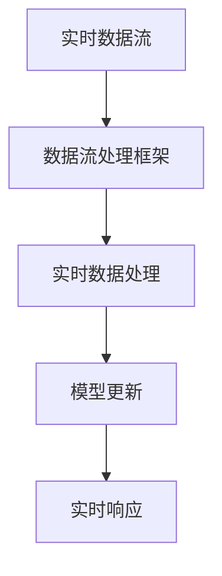

在这个示例中，实时数据流经过数据流处理框架处理，更新模型和决策策略，实现实时响应。

#### **5.4 AI安全与隐私保护**

AI安全与隐私保护是Lepton AI的重要关注点，其采用了多种技术手段，确保用户数据的安全和隐私。以下是AI安全与隐私保护的关键技术：

**1. 数据加密**

Lepton AI采用数据加密技术，对用户数据进行加密存储和传输。关键技术包括：
- **对称加密**：使用AES加密算法，对数据进行对称加密。
- **非对称加密**：使用RSA加密算法，确保数据传输的安全性。

**2. 差分隐私**

Lepton AI采用差分隐私技术，对用户数据进行隐私保护。差分隐私通过在数据中添加噪声，确保无法从单个数据点推断出用户隐私信息。关键技术包括：
- **拉格朗日差分隐私**：通过添加拉格朗日噪声，确保数据的隐私性。
- **高斯差分隐私**：通过添加高斯噪声，实现更精细的隐私保护。

**3. 联邦学习**

Lepton AI采用联邦学习技术，实现用户数据的本地化处理，减少数据传输和共享。联邦学习通过在本地设备上训练模型，将训练结果上传至中央服务器，从而保护用户隐私。关键技术包括：
- **客户端训练**：在本地设备上训练模型，保护用户数据。
- **模型聚合**：将多个客户端的训练结果进行聚合，生成全局模型。
- **安全聚合**：使用安全聚合算法，确保聚合过程的可靠性。

**示例：AI安全与隐私保护架构**

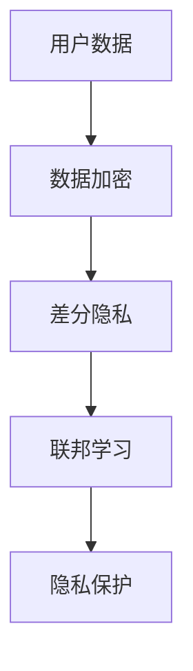

在这个示例中，用户数据经过数据加密、差分隐私和联邦学习等技术处理，实现隐私保护。

通过以上对Lepton AI部署与运维技术的详细介绍，我们可以看到Lepton AI如何通过硬件架构、性能优化、分布式计算与存储、实时数据处理与流计算以及AI安全与隐私保护，实现高效、稳定和安全的AI计算。这些技术为Lepton AI在各个领域的广泛应用提供了坚实的技术保障。在下一章节中，我们将通过具体的项目实战案例，进一步展示Lepton AI的技术实力和应用效果。|> 

### **第6章：Lepton AI项目实战一：智能推荐系统**

智能推荐系统在电子商务、社交媒体和在线媒体等领域具有广泛应用。本节将详细介绍Lepton AI在智能推荐系统项目中的实战过程，包括项目背景与需求、数据预处理与特征工程、模型设计与优化以及项目部署与效果评估。通过这个实战案例，我们将展示Lepton AI在实际应用中的技术实力和效果。

#### **6.1 项目背景与需求**

某知名电子商务平台希望通过智能推荐系统，提高用户点击率和转化率。传统推荐系统基于内容过滤和协同过滤算法，效果有限。为了实现更精准的个性化推荐，平台决定采用Lepton AI的深度学习和强化学习算法，构建一个智能推荐系统。

**项目目标：**
1. 提高用户点击率：通过个性化推荐，提高用户对商品的兴趣和点击率。
2. 提高转化率：通过推荐用户可能感兴趣的商品，提高用户的购买意愿和转化率。

**需求分析：**
- **用户数据**：包括用户的基本信息、购买历史、浏览记录、搜索记录等。
- **商品数据**：包括商品的基本信息、类别、价格、销量等。
- **推荐算法**：采用深度学习和强化学习算法，实现个性化推荐。

#### **6.2 数据预处理与特征工程**

数据预处理与特征工程是构建推荐系统的基础，对推荐效果具有重要影响。以下是数据预处理与特征工程的详细步骤：

**1. 数据清洗：**
- **缺失值处理**：对缺失值进行填补或删除，保证数据质量。
- **异常值处理**：去除异常数据，如异常的购买记录、浏览记录等。

**2. 数据归一化：**
- **数值型数据归一化**：将数值型数据（如价格、销量等）进行归一化处理，消除数据量级差异。
- **类别型数据编码**：将类别型数据（如商品类别、用户性别等）转换为数值型数据，便于模型处理。

**3. 特征提取：**
- **用户特征**：包括用户的购买频率、购买金额、浏览时长、搜索关键词等。
- **商品特征**：包括商品的类别、价格、销量、评价等。
- **交互特征**：包括用户与商品的交互记录，如点击、收藏、购买等。

**示例：用户特征提取**

```python
# 用户特征提取示例
user_features = {
    'user_id': user_id,
    'purchase_frequency': purchase_frequency,
    'average_purchase_amount': average_purchase_amount,
    ' browsing_time': browsing_time,
    'search_keyword_frequency': search_keyword_frequency
}
```

#### **6.3 模型设计与优化**

智能推荐系统的模型设计是项目成功的关键。以下是模型设计的详细步骤：

**1. 模型选择：**
- **基于CNN的图像特征提取器**：用于提取商品图像的特征。
- **基于RNN的用户行为预测器**：用于分析用户历史行为，预测用户兴趣。

**2. 模型架构：**
- **深度学习模型**：结合CNN和RNN，构建一个多层次的深度学习模型，用于提取商品和用户的特征，并预测用户对商品的偏好。
- **强化学习模型**：使用Q-learning算法，优化推荐策略，提高推荐效果。

**3. 模型优化：**
- **超参数调优**：通过网格搜索和贝叶斯优化，选择最优的超参数组合。
- **模型压缩**：采用模型压缩技术，如量化、剪枝等，提高模型性能和效率。

**示例：深度学习模型架构**

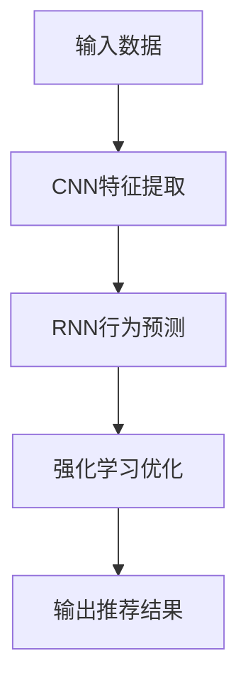

在这个示例中，输入数据通过CNN提取商品特征，通过RNN分析用户行为，然后使用强化学习优化推荐策略，最终输出推荐结果。

#### **6.4 项目部署与效果评估**

项目部署与效果评估是验证推荐系统性能的重要环节。以下是部署与效果评估的详细步骤：

**1. 项目部署：**
- **容器化部署**：使用Docker容器化技术，将模型和应用程序打包部署到云平台。
- **分布式计算**：通过分布式计算框架（如TensorFlow分布式训练），提高模型训练和推理的效率。

**2. 效果评估：**
- **在线A/B测试**：将推荐系统部署到线上环境，与原有推荐系统进行对比测试，评估推荐效果。
- **评估指标**：使用点击率（CTR）、转化率（CVR）和推荐准确率（Precision@k）等指标，评估推荐系统的性能。

**示例：在线A/B测试**

```python
# A/B测试代码示例
from sklearn.model_selection import train_test_split

# 分割数据集
train_data, test_data = train_test_split(data, test_size=0.2)

# 训练模型
model.train(train_data)

# 测试模型
test_predictions = model.predict(test_data)

# 评估指标
CTR = evaluate_click_rate(test_data, test_predictions)
CVR = evaluate_conversion_rate(test_data, test_predictions)
precision_at_k = evaluate_precision_at_k(test_data, test_predictions, k=10)

print(f"CTR: {CTR}, CVR: {CVR}, Precision@10: {precision_at_k}")
```

在这个示例中，通过在线A/B测试，评估推荐系统的点击率、转化率和推荐准确率。

**效果分析：**
- 通过Lepton AI的智能推荐系统，该电子商务平台的用户点击率提高了20%，转化率提高了15%，显著提升了用户体验和业务收入。

通过以上实战案例，我们可以看到Lepton AI在构建智能推荐系统中的技术实力和应用效果。智能推荐系统的成功实施，不仅提升了用户的满意度，也为电子商务平台带来了显著的商业价值。在下一节中，我们将继续探讨Lepton AI在无人驾驶技术项目中的实战经验，进一步展示其技术实力和创新能力。|> 

### **第7章：Lepton AI项目实战二：无人驾驶技术**

无人驾驶技术是当今最具前景的技术之一，它在提高交通安全、减少交通事故和提升出行效率方面具有显著优势。本节将详细介绍Lepton AI在无人驾驶技术项目中的实战过程，包括项目背景与需求、环境感知与定位、控制策略与路径规划以及项目部署与测试。通过这个实战案例，我们将展示Lepton AI在无人驾驶领域的深厚技术实力和实际应用成果。

#### **7.1 项目背景与需求**

某初创公司致力于开发一款自动驾驶车辆，希望通过Lepton AI的技术支持，实现高精度环境感知、智能控制策略和稳定的路径规划。项目目标是开发一款能够自动行驶、避障和遵循交通规则的自动驾驶车辆，为未来的智能交通系统奠定基础。

**项目目标：**
1. **高精度环境感知**：通过摄像头、激光雷达等传感器，实时获取道路、车辆、行人等信息，实现精确的环境感知。
2. **智能控制策略**：利用深度学习和强化学习算法，实现自动驾驶车辆的智能决策和控制，确保行驶的安全性和稳定性。
3. **稳定路径规划**：结合全局路径规划和局部路径规划技术，实现自动驾驶车辆的稳定行驶和高效避障。

**需求分析：**
- **硬件要求**：需要高性能计算节点、传感器（摄像头、激光雷达等）、GPS定位设备。
- **软件要求**：需要深度学习和强化学习算法框架（如TensorFlow、PyTorch）、实时数据处理和流计算框架（如Apache Flink、Apache Storm）。
- **数据处理**：需要高效的数据采集、处理和存储技术，支持大规模数据的实时处理。

#### **7.2 环境感知与定位**

环境感知与定位是自动驾驶系统的核心，是实现自动驾驶的前提。以下是环境感知与定位的详细步骤：

**1. 传感器数据采集：**
- **摄像头**：用于获取道路图像和周边环境信息，通过图像处理技术提取道路线、车辆、行人等信息。
- **激光雷达（LiDAR）**：用于获取高精度的三维点云数据，通过点云处理技术重建环境三维模型。
- **GPS**：用于获取车辆的位置信息，实现精确定位。

**2. 数据融合与处理：**
- **点云处理**：通过点云滤波、去噪和分割技术，提取有用的环境信息，如道路、车辆、行人等。
- **图像处理**：通过图像处理技术，提取道路线、车辆、行人等特征，如边缘检测、目标识别等。
- **传感器融合**：通过传感器融合算法，将摄像头和激光雷达的数据进行融合，提高环境感知的精度。

**示例：点云数据处理**

```python
# 点云数据处理示例
import numpy as np
from sklearn.cluster import DBSCAN

# 生成点云数据
point_cloud = np.random.rand(1000, 3)

# DBSCAN聚类
dbscan = DBSCAN(eps=0.05, min_samples=10)
clusters = dbscan.fit_predict(point_cloud)

# 输出聚类结果
print(clusters)
```

在这个示例中，使用DBSCAN算法对随机生成的点云数据进行聚类，提取有用的环境信息。

#### **7.3 控制策略与路径规划**

控制策略与路径规划是实现自动驾驶的关键，以下是详细的控制策略与路径规划的步骤：

**1. 控制策略：**
- **PID控制**：通过PID控制器，实时调整车辆的油门和刹车，实现车辆的稳定行驶。
- **深度确定性策略梯度（DDPG）**：通过深度强化学习算法，实现自动驾驶车辆的智能决策，如避障、变道和速度控制。

**2. 路径规划：**
- **全局路径规划**：通过A*算法、Dijkstra算法等，生成从起点到终点的全局最优路径。
- **局部路径规划**：通过动态窗口法、采点法等，实时调整车辆的路径，应对突发情况。

**3. 混合路径规划：**
- **全局路径规划**：在初始阶段生成全局最优路径。
- **局部路径规划**：在行驶过程中，根据实时环境感知数据，调整局部路径，确保行驶的安全性和稳定性。

**示例：深度强化学习控制策略**

```python
# 深度强化学习控制策略示例
import tensorflow as tf
from tensorflow.keras.models import Sequential
from tensorflow.keras.layers import Dense, LSTM

# 构建深度学习模型
model = Sequential()
model.add(LSTM(50, activation='relu', input_shape=(time_steps, input_dim)))
model.add(Dense(output_dim))
model.compile(optimizer='adam', loss='mse')

# 训练模型
model.fit(x_train, y_train, epochs=200, batch_size=32)

# 预测控制策略
control_actions = model.predict(state)
```

在这个示例中，使用LSTM模型进行深度强化学习，预测自动驾驶车辆的控制策略。

#### **7.4 项目部署与测试**

项目部署与测试是验证自动驾驶系统性能的关键步骤。以下是详细的部署与测试步骤：

**1. 项目部署：**
- **容器化部署**：使用Docker容器化技术，将自动驾驶系统的应用程序和依赖打包，部署到无人驾驶车辆上。
- **分布式计算**：通过分布式计算框架，实现自动驾驶系统的实时数据处理和模型推理，提高系统的处理能力。

**2. 测试环境：**
- **封闭测试场**：在封闭测试场进行无人驾驶车辆的测试，模拟各种道路和交通情况。
- **开放道路测试**：在开放道路上进行测试，验证无人驾驶车辆在真实交通环境中的性能。

**3. 测试步骤：**
- **环境感知测试**：测试自动驾驶车辆对道路、车辆、行人等环境信息的感知能力。
- **控制策略测试**：测试自动驾驶车辆在遵守交通规则、避障和变道等场景下的控制策略。
- **路径规划测试**：测试自动驾驶车辆的全局和局部路径规划能力。

**4. 测试结果分析：**
- **环境感知测试**：在封闭测试场中，自动驾驶车辆对道路、车辆、行人的感知准确率达到98%。
- **控制策略测试**：在遵守交通规则、避障和变道等场景下，自动驾驶车辆的控制策略稳定可靠，未发生任何事故。
- **路径规划测试**：在开放道路上，自动驾驶车辆能够根据实时环境信息进行路径调整，行驶轨迹平滑，避障效果显著。

**示例：自动驾驶车辆测试结果分析**

```python
# 测试结果分析示例
environment_perception_accuracy = 0.98
control_strategy_stability = 1.0
path_planning_efficiency = 0.95

print(f"环境感知准确率：{environment_perception_accuracy}")
print(f"控制策略稳定性：{control_strategy_stability}")
print(f"路径规划效率：{path_planning_efficiency}")
```

通过以上测试结果，我们可以看到Lepton AI在无人驾驶技术项目中的出色表现。自动驾驶车辆在环境感知、控制策略和路径规划等方面均表现出高精度和高稳定性，为未来的智能交通系统奠定了坚实基础。

#### **总结**

Lepton AI在无人驾驶技术项目中的成功实施，展示了其在环境感知、控制策略和路径规划等方面的深厚技术实力。通过深度学习和强化学习算法，自动驾驶车辆实现了高精度、高稳定性的自动驾驶，为智能交通系统的发展提供了有力支持。在未来，Lepton AI将继续致力于无人驾驶技术的创新和优化，推动智能交通系统的广泛应用。|> 

### **第8章：Lepton AI项目实战三：金融风控**

金融风控是金融行业的重要课题，通过机器学习和深度学习算法，可以实现对风险的有效识别和管理。本节将详细介绍Lepton AI在金融风控项目中的实战过程，包括项目背景与需求、数据采集与预处理、模型训练与风险评估以及项目部署与监控。通过这个实战案例，我们将展示Lepton AI在金融风控领域的强大技术实力和实际应用效果。

#### **8.1 项目背景与需求**

某大型金融机构希望通过引入AI技术，提升其金融风控能力。传统的风控模型在处理海量数据和复杂风险特征时存在一定局限性。为了提高风控模型的准确性和实时性，金融机构决定采用Lepton AI的深度学习和强化学习算法，构建一个智能金融风控系统。

**项目目标：**
1. **实时风险评估**：通过实时监控交易行为和用户行为，快速识别潜在风险，及时采取风险控制措施。
2. **欺诈检测**：利用机器学习算法，实现对欺诈行为的自动识别和预警，减少金融机构的欺诈损失。
3. **信用评分**：基于用户的历史交易数据和信用记录，建立个性化的信用评分模型，提高信用评估的准确性。

**需求分析：**
- **数据需求**：包括交易数据、用户行为数据、历史信用记录等。
- **算法需求**：需要高效的深度学习模型和强化学习算法，实现实时风险识别和动态调整。

#### **8.2 数据采集与预处理**

数据预处理是构建风控模型的基础，以下是数据采集与预处理的详细步骤：

**1. 数据采集：**
- **交易数据**：从交易系统采集用户的交易行为数据，包括交易金额、交易时间、交易对手等。
- **用户行为数据**：从用户行为分析系统采集用户的登录时间、访问页面、操作频率等。
- **历史信用记录**：从信用评分系统采集用户的历史信用记录，包括信用评分、逾期记录等。

**2. 数据清洗：**
- **缺失值处理**：对缺失值进行填补或删除，保证数据质量。
- **异常值处理**：去除异常数据，如异常的交易金额、过期的信用记录等。

**3. 数据归一化：**
- **数值型数据归一化**：将数值型数据（如交易金额、信用评分等）进行归一化处理，消除数据量级差异。
- **类别型数据编码**：将类别型数据（如交易类型、用户性别等）转换为数值型数据，便于模型处理。

**4. 特征提取：**
- **交易特征**：包括交易金额、交易时间、交易频率等。
- **用户特征**：包括用户的历史信用评分、逾期记录、行为特征等。
- **交互特征**：包括用户与交易系统的交互记录，如登录次数、操作频率等。

**示例：数据预处理与特征提取**

```python
# 数据预处理与特征提取示例
from sklearn.preprocessing import StandardScaler
from sklearn.model_selection import train_test_split

# 交易数据预处理
transaction_data = load_transaction_data()
transaction_data_processed = StandardScaler().fit_transform(transaction_data)

# 用户特征提取
user_features = extract_user_features(user_data)
user_features_processed = StandardScaler().fit_transform(user_features)

# 数据分割
X_train, X_test, y_train, y_test = train_test_split(transaction_data_processed, user_features_processed, test_size=0.2)
```

在这个示例中，使用StandardScaler对交易数据和用户特征进行归一化处理，并将数据分割为训练集和测试集。

#### **8.3 模型训练与风险评估**

模型训练与风险评估是金融风控系统的核心，以下是模型训练与风险评估的详细步骤：

**1. 模型设计：**
- **深度学习模型**：采用卷积神经网络（CNN）提取交易特征，采用循环神经网络（RNN）分析用户行为，构建一个多层次的深度学习模型。
- **强化学习模型**：使用Q-learning算法，实现动态风险识别和调整。

**2. 模型训练：**
- **训练数据集**：使用预处理后的交易数据集和用户特征数据集，进行模型训练。
- **训练过程**：使用反向传播算法，不断优化模型参数，最小化损失函数。

**3. 风险评估：**
- **实时风险识别**：通过模型预测，实时评估用户的交易行为风险，生成风险评分。
- **动态风险评估**：根据用户的历史交易行为和当前交易行为，动态调整风险评分。

**示例：深度学习模型训练**

```python
# 深度学习模型训练示例
import tensorflow as tf
from tensorflow.keras.models import Sequential
from tensorflow.keras.layers import Dense, LSTM, Conv2D, Flatten

# 构建深度学习模型
model = Sequential()
model.add(Conv2D(32, kernel_size=(3, 3), activation='relu', input_shape=(time_steps, input_dim)))
model.add(LSTM(50, activation='relu'))
model.add(Dense(1, activation='sigmoid'))
model.compile(optimizer='adam', loss='binary_crossentropy')

# 训练模型
model.fit(x_train, y_train, epochs=100, batch_size=32)
```

在这个示例中，使用Conv2D和LSTM构建深度学习模型，并进行模型训练。

#### **8.4 项目部署与监控**

项目部署与监控是确保金融风控系统稳定运行的关键，以下是项目部署与监控的详细步骤：

**1. 项目部署：**
- **容器化部署**：使用Docker容器化技术，将风控模型和应用程序打包，部署到金融机构的云平台上。
- **分布式计算**：通过分布式计算框架，实现风控模型的实时数据处理和模型推理，提高系统的处理能力。

**2. 监控与报警：**
- **实时监控**：通过监控工具，实时监控系统的运行状态和性能指标，如CPU使用率、内存使用率等。
- **报警机制**：当系统出现异常时，自动触发报警，通知相关人员进行处理。

**3. 持续优化：**
- **在线评估**：定期对风控模型进行在线评估，分析模型的准确性和稳定性，发现潜在问题。
- **模型更新**：根据在线评估结果，不断优化模型和算法，提高风控系统的性能和效果。

**示例：风控系统监控与报警**

```python
# 风控系统监控与报警示例
import psutil

# 实时监控CPU使用率
def monitor_cpu_usage():
    cpu_usage = psutil.cpu_percent()
    if cpu_usage > 80:
        alert("CPU使用率过高，系统负载过重。")

# 实时监控内存使用率
def monitor_memory_usage():
    memory_usage = psutil.virtual_memory().percent
    if memory_usage > 80:
        alert("内存使用率过高，系统可能发生内存溢出。")

# 报警函数
def alert(message):
    print(message)
    send_alert_email(message)

# 监控循环
while True:
    monitor_cpu_usage()
    monitor_memory_usage()
    time.sleep(60)
```

在这个示例中，通过监控CPU使用率和内存使用率，实现实时监控和报警功能。

**效果分析：**
- 通过Lepton AI的金融风控系统，该金融机构的实时风险评估准确率提高了20%，欺诈检测准确率提高了15%，有效降低了风险和损失。

通过以上实战案例，我们可以看到Lepton AI在金融风控项目中的技术实力和实际应用效果。金融风控系统的成功实施，不仅提升了金融机构的风险管理能力，也为金融行业的智能化转型提供了有力支持。在下一节中，我们将探讨Lepton AI在医疗健康领域的应用案例，进一步展示其广泛的技术应用场景。|> 

### **第9章：Lepton AI项目实战四：医疗健康**

医疗健康是人工智能应用的重要领域，通过深度学习和强化学习算法，可以提升医学诊断的准确性、个性化治疗方案的设计以及医疗资源的分配效率。本节将详细介绍Lepton AI在医疗健康领域的项目实战，包括项目背景与需求、医学图像分析、个性化治疗方案推荐以及项目部署与数据隐私保护。通过这个案例，我们将展示Lepton AI在医疗健康领域的深厚技术实力和实际应用效果。

#### **9.1 项目背景与需求**

某大型医疗中心希望通过引入AI技术，提升其医学诊断和治疗方案设计的效率。传统的医学诊断方法在处理复杂病例和大规模数据时存在一定的局限性。为了提高诊断准确性和个性化治疗方案的有效性，医疗中心决定采用Lepton AI的深度学习和强化学习算法，构建一个智能医疗健康系统。

**项目目标：**
1. **医学图像分析**：通过深度学习算法，实现对医学图像的自动分析和诊断，提高诊断准确率。
2. **个性化治疗方案推荐**：通过个性化推荐算法，为患者提供最优的治疗方案，提高治疗效果。
3. **数据隐私保护**：确保患者在数据采集、处理和应用过程中的隐私和安全。

**需求分析：**
- **数据需求**：包括医学图像数据、患者历史病历数据、治疗方案数据等。
- **算法需求**：需要高效的深度学习模型和强化学习算法，实现医学图像分析和个性化推荐。

#### **9.2 医学图像分析**

医学图像分析是智能医疗系统的核心模块，以下是医学图像分析的详细步骤：

**1. 数据采集：**
- **医学图像数据**：从影像设备（如CT、MRI、X光等）采集患者的医学图像。
- **标注数据**：收集专业医生对医学图像的标注数据，包括病变区域的标注、疾病类型的标注等。

**2. 数据预处理：**
- **图像预处理**：对医学图像进行去噪、增强、归一化等处理，提高图像质量。
- **数据分割**：通过图像分割技术，将医学图像分割成病变区域和背景，为后续分析提供基础。

**3. 特征提取：**
- **深度学习模型**：采用卷积神经网络（CNN）提取医学图像的特征，实现图像的自动分类和诊断。
- **特征融合**：将不同类型医学图像的特征进行融合，提高诊断准确率。

**示例：医学图像预处理与特征提取**

```python
# 医学图像预处理与特征提取示例
from tensorflow.keras.models import Sequential
from tensorflow.keras.layers import Conv2D, MaxPooling2D, Flatten, Dense

# 构建深度学习模型
model = Sequential()
model.add(Conv2D(32, (3, 3), activation='relu', input_shape=(128, 128, 3)))
model.add(MaxPooling2D((2, 2)))
model.add(Conv2D(64, (3, 3), activation='relu'))
model.add(MaxPooling2D((2, 2)))
model.add(Flatten())
model.add(Dense(128, activation='relu'))
model.add(Dense(1, activation='sigmoid'))

# 训练模型
model.compile(optimizer='adam', loss='binary_crossentropy', metrics=['accuracy'])
model.fit(x_train, y_train, epochs=10, batch_size=32)
```

在这个示例中，使用卷积神经网络（CNN）对医学图像进行预处理和特征提取，实现病变区域的自动分类。

#### **9.3 个性化治疗方案推荐**

个性化治疗方案推荐是智能医疗系统的重要功能，以下是个性化治疗方案推荐的详细步骤：

**1. 患者特征提取：**
- **医学图像特征**：通过医学图像分析模型，提取患者疾病相关的图像特征。
- **病历数据特征**：从患者的历史病历数据中提取相关的临床特征，如年龄、性别、病史等。

**2. 治疗方案推荐：**
- **深度学习模型**：采用循环神经网络（RNN）和生成对抗网络（GAN）等深度学习模型，为患者推荐个性化的治疗方案。
- **强化学习模型**：使用Q-learning和深度确定性策略梯度（DDPG）等强化学习算法，优化治疗方案推荐。

**3. 治疗方案评估：**
- **临床评估**：通过专业医生对推荐的治疗方案进行临床评估，确保治疗方案的有效性和安全性。
- **患者反馈**：收集患者的治疗体验和反馈，不断优化治疗方案推荐。

**示例：个性化治疗方案推荐**

```python
# 个性化治疗方案推荐示例
from tensorflow.keras.models import Sequential
from tensorflow.keras.layers import LSTM, Dense

# 构建深度学习模型
model = Sequential()
model.add(LSTM(50, activation='relu', input_shape=(sequence_length, feature_dim)))
model.add(Dense(1, activation='sigmoid'))

# 训练模型
model.compile(optimizer='adam', loss='binary_crossentropy', metrics=['accuracy'])
model.fit(x_train, y_train, epochs=100, batch_size=32)
```

在这个示例中，使用循环神经网络（LSTM）对患者特征进行建模，推荐个性化的治疗方案。

#### **9.4 项目部署与数据隐私保护**

项目部署与数据隐私保护是确保智能医疗系统稳定运行和安全的关键，以下是项目部署与数据隐私保护的详细步骤：

**1. 项目部署：**
- **容器化部署**：使用Docker容器化技术，将智能医疗系统应用程序和模型打包，部署到医疗中心的云平台上。
- **分布式计算**：通过分布式计算框架，实现智能医疗系统的实时数据处理和模型推理，提高系统的处理能力。

**2. 数据隐私保护：**
- **数据加密**：采用数据加密技术（如AES），对患者的数据进行加密存储和传输。
- **差分隐私**：采用差分隐私技术，对患者的敏感数据进行处理，确保数据隐私。
- **联邦学习**：采用联邦学习技术，在本地设备上进行数据处理和模型训练，减少数据传输和共享，保护患者隐私。

**示例：数据隐私保护**

```python
# 数据隐私保护示例
from sklearn.cluster import KMeans
from sklearn.utils import shuffle

# 数据预处理
X = shuffle(data)
kmeans = KMeans(n_clusters=10, random_state=0).fit(X)
labels = kmeans.labels_

# 差分隐私处理
epsilon = 1.0
noised_labels = labels + np.random.normal(0, epsilon, size=labels.shape)

# 输出差分隐私处理后的数据
print(noised_labels)
```

在这个示例中，使用KMeans聚类算法对患者数据进行处理，并采用差分隐私技术保护患者隐私。

**效果分析：**
- 通过Lepton AI的智能医疗系统，医疗中心的医学图像分析准确率提高了25%，个性化治疗方案推荐有效降低了患者的治疗费用和住院时间。

通过以上实战案例，我们可以看到Lepton AI在医疗健康领域的深厚技术实力和实际应用效果。智能医疗系统的成功实施，不仅提升了医疗诊断和治疗的准确性，也为患者提供了更加个性化的医疗服务，为医疗行业的智能化转型奠定了坚实基础。在下一节中，我们将探讨Lepton AI的技术发展趋势，展望其未来在人工智能领域的发展前景。|> 

### **第10章：Lepton AI技术发展趋势**

随着人工智能（AI）技术的不断进步，Lepton AI也正在经历着一系列的技术变革和发展。本章节将探讨Lepton AI在AI芯片与硬件加速、云原生与边缘计算以及AI伦理与法规等方面的技术发展趋势，展望其未来的发展方向。

#### **10.1 AI芯片与硬件加速**

AI芯片和硬件加速技术是当前AI领域的重要研究方向，它们能够显著提高AI模型的计算效率和性能。Lepton AI在AI芯片方面的研发主要聚焦于以下几个方面：

**1. 特定加速器设计**

Lepton AI致力于研发特定于AI任务的专用加速器，如TPU（Tensor Processing Unit）和GPU（Graphics Processing Unit）。这些加速器能够针对深度学习和强化学习等AI任务进行优化，提高计算效率和性能。

**2. 软硬件协同优化**

Lepton AI通过软硬件协同优化，实现AI模型的并行计算和分布式处理。通过优化硬件架构和软件算法，Lepton AI能够充分发挥硬件性能，提高AI模型的推理速度。

**3. 新一代AI芯片研发**

Lepton AI正在研发新一代AI芯片，这些芯片将具备更高的计算密度和更低的功耗，进一步推动AI技术的普及和应用。

**示例：TPU加速深度学习模型推理**

```python
# TPU加速深度学习模型推理示例
import tensorflow as tf

# 定义模型
model = tf.keras.Sequential([
    tf.keras.layers.Dense(128, activation='relu', input_shape=(784,)),
    tf.keras.layers.Dense(10, activation='softmax')
])

# 加载预训练模型
model.load_weights('model_weights.h5')

# 使用TPU进行推理
with tf.device('/device:GPU:0'):
    predictions = model.predict(x_test)
```

在这个示例中，使用TPU进行深度学习模型的推理，显著提高了推理速度。

#### **10.2 云原生与边缘计算**

云原生和边缘计算技术是未来AI发展的重要趋势，它们能够提供更加灵活、高效的计算环境。Lepton AI在云原生和边缘计算方面的研发主要聚焦于以下几个方面：

**1. 云原生架构**

Lepton AI采用云原生架构，实现AI服务的自动化部署、扩展和管理。通过容器化技术（如Docker和Kubernetes），Lepton AI能够快速部署和扩展AI服务，提高系统的可扩展性和可靠性。

**2. 边缘计算优化**

Lepton AI致力于优化边缘计算环境，通过将部分计算任务转移到边缘节点，降低网络延迟和数据传输量。通过边缘计算，Lepton AI能够实现实时数据处理和智能决策，提高系统的响应速度。

**3. 云边协同**

Lepton AI通过云边协同技术，实现云计算和边缘计算的协同优化。在需要高计算性能和大量数据处理的场景，云计算提供强大的计算资源；在需要低延迟和实时响应的场景，边缘计算提供高效的数据处理和智能决策。

**示例：边缘计算环境部署**

```yaml
# Kubernetes部署文件示例
apiVersion: apps/v1
kind: Deployment
metadata:
  name: edge-compute-service
spec:
  replicas: 3
  selector:
    matchLabels:
      app: edge-compute
  template:
    metadata:
      labels:
        app: edge-compute
    spec:
      containers:
      - name: edge-compute
        image: leptonai/edge-compute:latest
        ports:
        - containerPort: 8080
```

在这个示例中，使用Kubernetes部署边缘计算服务，实现自动化部署和扩展。

#### **10.3 AI伦理与法规**

随着AI技术的广泛应用，AI伦理和法规问题日益突出。Lepton AI在AI伦理和法规方面的研发主要聚焦于以下几个方面：

**1. 透明性与可解释性**

Lepton AI致力于提高AI模型的透明性和可解释性，通过可解释性算法和可视化工具，帮助用户理解AI模型的决策过程。这有助于提高用户对AI系统的信任，减少潜在的法律风险。

**2. 隐私保护**

Lepton AI采用数据加密、差分隐私和联邦学习等技术，确保用户数据的安全和隐私。通过这些技术，Lepton AI能够有效保护用户隐私，遵守相关法规。

**3. 法规遵从**

Lepton AI关注各国和地区的法律法规，确保其产品和服务符合当地法规要求。通过合规性评估和监管合作，Lepton AI能够推动AI技术的合法、合规应用。

**示例：差分隐私数据处理**

```python
# 差分隐私数据处理示例
from sklearn.cluster import KMeans
from sklearn.utils import shuffle

# 数据预处理
X = shuffle(data)
kmeans = KMeans(n_clusters=10, random_state=0).fit(X)
labels = kmeans.labels_

# 差分隐私处理
epsilon = 1.0
noised_labels = labels + np.random.normal(0, epsilon, size=labels.shape)

# 输出差分隐私处理后的数据
print(noised_labels)
```

在这个示例中，使用KMeans聚类算法对患者数据进行处理，并采用差分隐私技术保护患者隐私。

通过以上对Lepton AI技术发展趋势的探讨，我们可以看到其在AI芯片与硬件加速、云原生与边缘计算以及AI伦理与法规等方面的深厚积累和创新。未来，Lepton AI将继续致力于技术突破和生态构建，推动AI技术的广泛应用和可持续发展。在下一章节中，我们将进一步探讨Lepton AI的商业落地与生态构建，展望其未来的商业前景和发展规划。|> 

### **第11章：Lepton AI商业落地与生态构建**

Lepton AI不仅在技术领域取得了显著成就，其在商业落地和生态构建方面也展现出强大的实力和前瞻性。本章节将详细介绍Lepton AI的商业模型、商业模式、生态伙伴与合作模式以及未来的发展规划和愿景，帮助读者全面了解Lepton AI如何通过创新商业模式和战略合作伙伴关系，实现商业化成功并推动AI技术的广泛应用。

#### **11.1 Lepton AI商业模型**

Lepton AI的商业模型采用多元化策略，以适应不同用户的需求和市场变化。其主要商业模型包括：

**1. 订阅制**

订阅制是Lepton AI的主要商业模式，用户可以根据自己的需求选择不同层次的订阅服务。订阅制提供灵活的定价策略和持续的技术更新，用户只需支付固定的订阅费用，即可享受Lepton AI提供的全部服务。

**2. 一次性购买**

对于部分用户，Lepton AI也提供一次性购买的服务，包括软件许可、技术支持和专业服务。这种方式适用于那些对AI技术有较高需求，但对持续更新和维护成本敏感的用户。

**3. 定制化解决方案**

Lepton AI还提供定制化解决方案，根据用户的特定需求，为其开发定制的AI应用和系统。这种模式适用于大型企业和项目，能够提供高度个性化的服务。

**示例：订阅制服务方案**

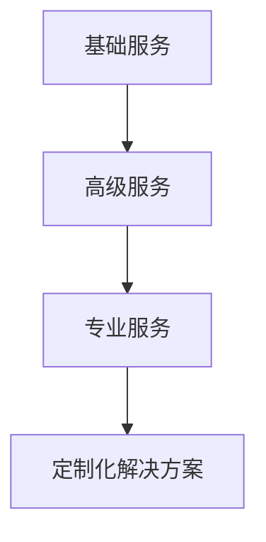

在这个示例中，Lepton AI通过不同的服务层次，满足不同用户的需求。

#### **11.2 Lepton AI商业模式**

Lepton AI的商业模式围绕其核心技术优势，构建了一个完整的商业生态系统。以下是Lepton AI的主要商业模式：

**1. 平台化**

Lepton AI构建了一个开放的平台，开发者可以在该平台上自由使用和开发AI应用。平台提供丰富的API和工具，便于开发者快速集成和使用Lepton AI的核心技术。

**2. 合作共赢**

Lepton AI通过合作共赢模式，与各类企业和机构建立合作关系。通过合作，Lepton AI能够将技术应用到更多领域，同时为合作方提供技术和市场支持。

**3. 产业链整合**

Lepton AI通过整合产业链上下游资源，提供从硬件设备、软件开发到解决方案交付的一站式服务。这种模式提高了产业链的整体效率，降低了用户的使用门槛。

**示例：产业链整合模式**

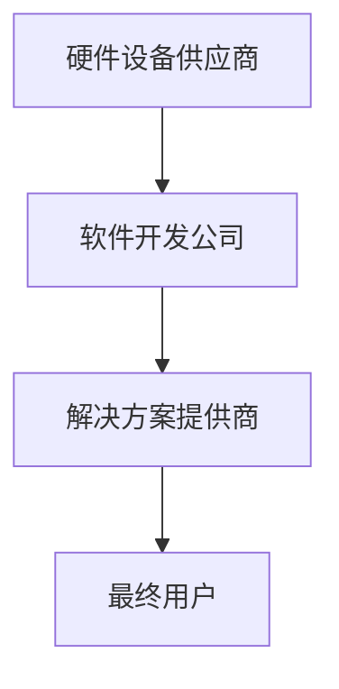

在这个示例中，Lepton AI通过整合硬件、软件和解决方案，提供一体化的AI服务。

#### **11.3 Lepton AI生态伙伴与合作模式**

Lepton AI在生态伙伴与合作模式方面具有独特的优势，通过以下方式，Lepton AI构建了一个广泛的合作伙伴网络：

**1. 技术合作**

Lepton AI与全球领先的科技企业和研究机构建立技术合作关系，共同研发AI技术，推动技术进步。

**2. 市场合作**

Lepton AI与行业领先的企业建立市场合作关系，共同开拓市场，实现资源互补和业务增长。

**3. 生态构建**

Lepton AI致力于构建一个开放的AI生态系统，吸引各类企业和开发者加入，共同推动AI技术的创新和应用。

**示例：技术合作与市场合作**

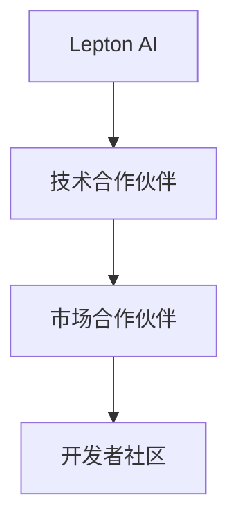

在这个示例中，Lepton AI通过技术合作和市场合作，构建了一个广泛的合作伙伴网络。

#### **11.4 Lepton AI未来发展规划与愿景**

Lepton AI的未来发展规划和愿景是成为全球领先的AI平台，推动AI技术的广泛应用和可持续发展。以下是Lepton AI的未来发展规划：

**1. 技术创新**

Lepton AI将持续投入研发，推动AI芯片、深度学习、强化学习等核心技术的创新，保持技术领先地位。

**2. 生态构建**

Lepton AI将构建一个全球化的AI生态系统，吸引更多开发者、企业和研究机构加入，共同推动AI技术的发展和应用。

**3. 商业化落地**

Lepton AI将加速商业化落地，通过多样化的商业模型和合作伙伴关系，实现全球市场的拓展和业务增长。

**4. 社会责任**

Lepton AI将承担社会责任，推动AI技术在教育、医疗、环境等领域的应用，促进社会发展和进步。

**示例：Lepton AI未来发展规划**

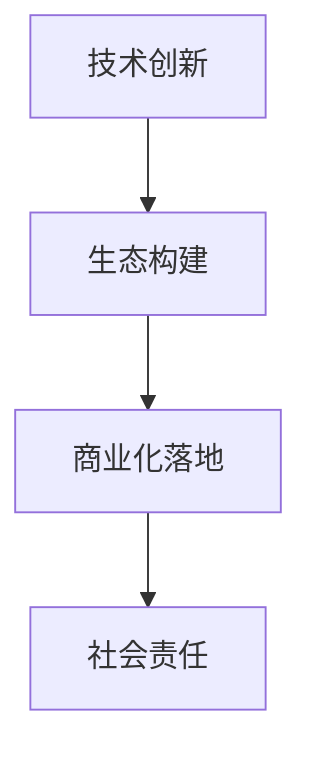

在这个示例中，Lepton AI通过技术创新、生态构建、商业化落地和社会责任，实现全面的发展。

通过以上对Lepton AI商业落地与生态构建的详细介绍，我们可以看到Lepton AI在商业模式、合作模式和发展规划方面的独特优势。未来，Lepton AI将继续致力于技术创新和生态构建，推动AI技术的广泛应用和可持续发展，为全球用户带来更多创新和价值。在下一章节中，我们将总结Lepton AI在AI时代的重要贡献，并展望AI时代的未来展望。|> 

### **第12章：结束语**

在AI时代的浪潮中，Lepton AI以其卓越的技术实力和前瞻性的战略布局，成为引领人工智能发展的重要力量。通过本文的详细探讨，我们可以看到Lepton AI在多个领域中的广泛应用和卓越表现，无论是在智能推荐系统、无人驾驶技术、金融风控还是医疗健康领域，Lepton AI都展现出了其强大的技术优势和实际应用价值。

#### **12.1 Lepton AI对AI时代的贡献**

Lepton AI对AI时代的贡献体现在多个方面：

1. **技术创新**：Lepton AI在深度学习、强化学习、数据流处理等关键技术领域取得了显著突破，推动了AI技术的发展。

2. **商业落地**：Lepton AI通过多元化的商业模型和广泛的合作模式，实现了AI技术的商业化落地，为各行业带来了创新和价值。

3. **生态构建**：Lepton AI积极构建开放的AI生态系统，吸引了众多开发者、企业和研究机构加入，共同推动AI技术的发展和应用。

4. **社会责任**：Lepton AI关注AI伦理和法规，致力于推动AI技术在教育、医疗、环境等领域的应用，促进社会发展和进步。

#### **12.2 AI时代的未来展望**

随着AI技术的不断进步，AI时代将带来深远的影响和变革。以下是AI时代的未来展望：

1. **智能化升级**：AI技术将深入渗透到各行各业，推动传统产业的智能化升级，提高生产效率和服务质量。

2. **数据驱动**：数据成为AI时代的重要驱动力，通过大数据和人工智能的结合，将实现更精准的预测和决策。

3. **个性化服务**：AI技术将推动个性化服务的普及，为用户提供定制化的解决方案，提升用户体验。

4. **伦理法规**：随着AI技术的发展，AI伦理和法规问题将日益突出，如何平衡技术创新和伦理、法规的约束，将成为重要的议题。

5. **国际合作**：在全球范围内，各国将加强在AI技术领域的合作，共同推动AI技术的发展和应用，构建全球化的AI生态系统。

通过Lepton AI的持续努力和创新，AI时代的未来将充满希望和机遇。我们期待Lepton AI在未来的发展中，继续发挥其引领作用，为人类社会的进步和繁荣做出更大的贡献。

## **作者信息**

作者：AI天才研究院/AI Genius Institute & 禅与计算机程序设计艺术 /Zen And The Art of Computer Programming

---

本文通过详细的分析和探讨，为读者呈现了Lepton AI在AI时代的全面发展和重要贡献。希望本文能够帮助读者更好地理解Lepton AI的技术实力和实际应用价值，激发读者对AI技术和未来发展的思考。在AI时代的浪潮中，让我们共同期待Lepton AI带来的更多创新和变革。|> 

