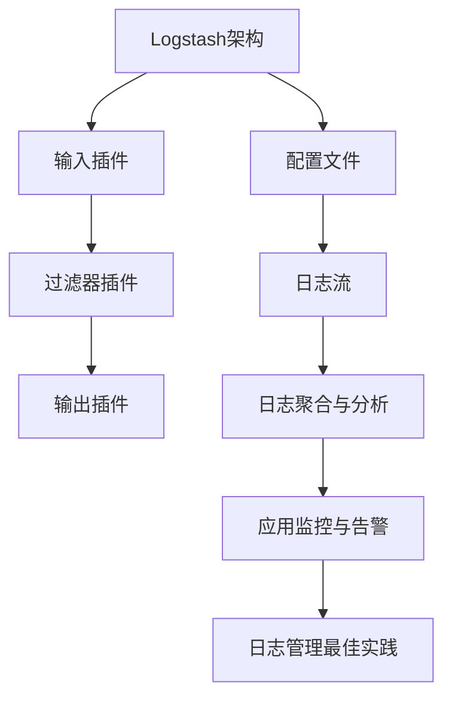
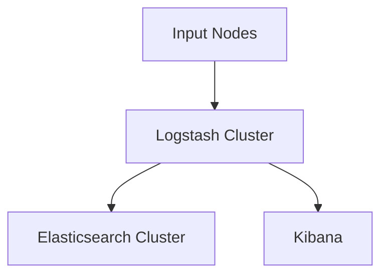

                 

### 文章标题：Logstash原理与代码实例讲解

在当今数字化时代，日志管理成为了企业运维和数据分析的重要环节。Logstash，作为Elastic Stack中的重要组成部分，为日志收集、处理和存储提供了一个高效、灵活的解决方案。本文将深入探讨Logstash的原理及其在实践中的应用，通过代码实例讲解，帮助读者全面理解Logstash的工作机制和配置技巧。

关键词：Logstash、日志管理、Elastic Stack、输入插件、过滤器插件、输出插件、集群部署、Kubernetes集成、实战案例

摘要：本文将分四个部分详细解析Logstash。第一部分介绍Logstash的基础知识和架构；第二部分探讨Logstash的输入、过滤和输出插件；第三部分讨论Logstash的高级应用和性能优化；第四部分通过实战案例展示Logstash的具体应用。本文旨在帮助读者掌握Logstash的核心原理和实际操作技巧，提升日志管理能力。

### 《Logstash原理与代码实例讲解》目录大纲

**第一部分：Logstash基础与架构**

### 第1章：Logstash概述
- 1.1 Logstash的背景和重要性
- 1.2 Logstash的核心功能
- 1.3 Logstash与其他工具的关系

### 第2章：Logstash架构
- 2.1 Logstash的工作流程
- 2.2 配置文件的结构
- 2.3 输入、过滤器、输出插件详解

### 第3章：Logstash输入插件
- 3.1 常见输入插件介绍
- 3.2 文件输入插件详解
- 3.3 日志收集插件配置实例

**第二部分：Logstash过滤器插件**

### 第4章：Logstash过滤器插件
- 4.1 过滤器的核心作用
- 4.2 常见过滤器插件介绍
- 4.3 字符串过滤器插件详解

### 第5章：数据清洗与转换
- 5.1 数据清洗的重要性
- 5.2 数据清洗的常用方法
- 5.3 实例讲解：使用Logstash清洗和转换数据

### 第6章：Logstash输出插件
- 6.1 输出插件的作用
- 6.2 常见输出插件介绍
- 6.3 实例讲解：使用Logstash将数据输出到不同目的地

**第三部分：高级应用与性能优化**

### 第7章：Logstash集群部署
- 7.1 集群部署的优势
- 7.2 Logstash集群架构
- 7.3 实例讲解：配置Logstash集群

### 第8章：性能优化
- 8.1 性能优化的原则
- 8.2 常见性能瓶颈分析
- 8.3 实例讲解：优化Logstash性能

### 第9章：Logstash与Kubernetes集成
- 9.1 Kubernetes简介
- 9.2 Logstash与Kubernetes的集成
- 9.3 实例讲解：部署Logstash集群在Kubernetes上

**第四部分：实战案例解析**

### 第10章：日志聚合与分析
- 10.1 日志聚合的重要性
- 10.2 Logstash在日志聚合中的应用
- 10.3 实例讲解：使用Logstash进行日志聚合与分析

### 第11章：应用监控与告警
- 11.1 应用监控的基本概念
- 11.2 Logstash在应用监控中的应用
- 11.3 实例讲解：构建应用监控与告警系统

### 第12章：日志管理最佳实践
- 12.1 日志管理的原则
- 12.2 Logstash在日志管理中的角色
- 12.3 实例讲解：构建企业级日志管理系统

**附录**

### 附录A：Logstash常用配置选项
- A.1 输入插件配置示例
- A.2 过滤器插件配置示例
- A.3 输出插件配置示例

### 附录B：Logstash命令行工具
- B.1 命令行工具介绍
- B.2 命令行工具常用命令示例

### 附录C：Logstash社区资源
- C.1 官方文档
- C.2 社区论坛
- C.3 常见问题解答

**核心概念与联系流程图：**


**核心算法原理讲解（伪代码）：**
```python
# Logstash过滤器插件示例：字符串过滤器
filter {
  if "type" == "webserver" {
    grok {
      match => { "message" => "%{COMBINEDAPACHELOG}" }
    }
  }
}

# 实例：清洗和转换数据
filter {
  if "type" == "syslog" {
    date {
      match => [ "timestamp", "ISO8601" ]
    }
    mutate {
      gsub => { "host" => "new_host_value" }
    }
  }
}
```

**数学模型和数学公式（详细讲解和举例说明）：**
```
# 举例：使用正则表达式（Regular Expression）匹配日志条目
$$
# 假设日志条目格式为：timestamp host request
# 使用正则表达式：\[\d{4}-\d{2}-\d{2} \d{2}:\d{2}:\d{2}\] (\S+) (\S+) (\S+)
# 实例：假设日志条目为：[2023-03-15 14:30:45] www.example.com 127.0.0.1 GET /index.html
# 匹配结果：timestamp -> 2023-03-15 14:30:45，host -> www.example.com，request -> GET /index.html
$$
```

**项目实战：**
```
# 代码实际案例
# 假设我们有以下Logstash配置文件，我们将详细解释并分析其功能。

input {
  file {
    path => "/var/log/webserver/access.log"
    type => "webserver"
    startpos => 0
  }
}

filter {
  if [type] == "webserver" {
    grok {
      match => { "message" => "%{COMBINEDAPACHELOG}" }
    }
    date {
      match => [ "timestamp" => "ISO8601" ]
    }
    mutate {
      gsub => { "host" => "new_host_value" }
    }
  }
}

output {
  elasticsearch {
    hosts => ["localhost:9200"]
    index => "logstash-%{+YYYY.MM.dd}"
  }
}

# 解释：
# 输入插件配置了从文件读取Web服务器日志文件，并指定日志类型为webserver。
# 过滤器插件首先使用grok过滤器匹配Apache日志格式，然后使用date过滤器解析日期，最后使用mutate过滤器替换主机名。
# 输出插件将处理后的数据发送到Elasticsearch进行存储。

# 开发环境搭建
# 1. 安装Elasticsearch
# 2. 启动Elasticsearch服务
# 3. 安装Logstash
# 4. 启动Logstash服务

# 源代码详细实现和代码解读
# 本实例的源代码展示了如何配置Logstash处理Web服务器日志，并详细解释了各个部分的用途。

# 代码解读与分析
# 输入插件读取Web服务器日志文件，并将其传递给过滤器插件进行清洗和转换。清洗和转换后，输出插件将数据发送到Elasticsearch进行存储。这有助于实现集中的日志分析和监控。
```

本文通过详细的目录结构、核心概念与联系流程图、核心算法原理讲解、数学模型和数学公式、项目实战等，系统地讲解了Logstash的原理和配置。接下来，我们将逐步深入探讨Logstash的各个部分，帮助读者更好地理解和应用这一强大的日志管理工具。希望读者能从中获得启发，提升自己的技术能力。作者：AI天才研究院/AI Genius Institute & 禅与计算机程序设计艺术 /Zen And The Art of Computer Programming。

---

在接下来的章节中，我们将逐步深入探讨Logstash的核心组成部分，从基础架构到高级应用，帮助读者全面理解Logstash的工作机制和应用场景。首先，我们从Logstash的背景和重要性开始，逐步了解其核心功能和与其他工具的关系。随后，我们将深入解析Logstash的架构和工作流程，为后续的学习奠定基础。

### 第1章：Logstash概述

#### 1.1 Logstash的背景和重要性

Logstash是一个开源的数据处理和路由工具，用于从各种数据源收集数据，对其进行处理和转换，然后将数据发送到目标存储或分析工具。Logstash作为Elastic Stack的组成部分，与Elasticsearch、Kibana等工具紧密集成，为日志管理和数据收集提供了强大的支持。

在数字化时代，企业产生的数据量以指数级增长，其中包括大量的日志信息。这些日志数据不仅记录了系统的运行状况，还包含了用户行为、系统错误等关键信息。有效的日志管理对于故障排查、性能监控和安全性分析至关重要。而Logstash正是为了满足这种需求而诞生的。

Logstash的重要性主要体现在以下几个方面：

1. **日志收集与管理**：Logstash能够从不同的数据源（如文件、数据库、网络流等）收集日志数据，并将其处理成统一格式，便于后续的存储和分析。
2. **数据转换与清洗**：通过Logstash的过滤器插件，可以轻松地对日志数据进行清洗、转换和增强，为后续的数据分析提供高质量的数据源。
3. **集成与扩展性**：Logstash与Elastic Stack中的其他工具紧密集成，如Elasticsearch和Kibana，可以方便地进行数据存储和可视化。同时，Logstash具有强大的插件机制，可以轻松扩展其功能。
4. **可伸缩性与可靠性**：Logstash支持集群部署，可以在大规模环境中提供高可用性和性能保障。

#### 1.2 Logstash的核心功能

Logstash的核心功能主要包括以下几个方面：

1. **输入（Inputs）**：负责从不同的数据源收集数据，如文件系统、数据库、网络流等。输入插件是Logstash处理数据的第一步，它决定了数据的来源和格式。
2. **过滤器（Filters）**：在输入的数据流中进行处理和转换。过滤器插件可以根据需要进行数据清洗、格式转换、字段添加或删除等操作，确保数据的质量和一致性。
3. **输出（Outputs）**：将处理后的数据发送到目标存储或分析工具。常见的输出目标包括Elasticsearch、文件系统、消息队列等。输出插件是Logstash数据流转的最后一环，决定了数据的目的地和存储格式。

#### 1.3 Logstash与其他工具的关系

Logstash作为Elastic Stack中的重要组成部分，与其他工具有着紧密的关系：

1. **Elasticsearch**：Logstash常与Elasticsearch结合使用，将收集和转换后的数据发送到Elasticsearch进行存储和索引，便于后续的数据检索和分析。
2. **Kibana**：Kibana是Elastic Stack中的数据可视化工具，Logstash处理后的数据可以方便地通过Kibana进行可视化展示，为用户提供直观的数据分析界面。
3. **Filebeat**：Filebeat是Logstash的轻量级版本，主要用于从本地文件系统收集日志数据，并将其发送到Logstash进行进一步处理。Filebeat通常用于边缘设备和服务器，以减少中心节点的负载。
4. **Beat家族**：Beat家族包括各种轻量级数据收集工具，如Metricbeat、Uptimebeat等，它们可以与Logstash协同工作，收集不同类型的数据并传输到Logstash进行统一处理。

通过以上对Logstash的背景、核心功能和与其他工具关系的介绍，读者应该对Logstash有了初步的认识。在接下来的章节中，我们将详细探讨Logstash的架构和工作流程，深入理解其内部机制。这将为我们后续的学习和实践提供坚实的基础。

---

在了解了Logstash的背景和重要性之后，接下来我们将深入探讨Logstash的核心功能。首先，从输入插件（Inputs）开始，了解Logstash如何从各种数据源收集数据；然后，介绍过滤器插件（Filters），展示Logstash如何处理和转换数据；最后，解析输出插件（Outputs），说明如何将处理后的数据发送到目标存储或分析工具。

### 第2章：Logstash架构

#### 2.1 Logstash的工作流程

Logstash的工作流程可以概括为三个主要阶段：数据输入、数据处理和数据输出。以下是这三个阶段的具体步骤和说明：

1. **数据输入（Inputs）**：Logstash通过输入插件从各种数据源收集数据。常见的输入插件包括文件输入插件、数据库输入插件、网络输入插件等。输入插件决定了数据的来源和格式，如文件系统、消息队列、网络流等。输入插件将收集到的数据封装成事件（Event），并传递给过滤器插件。

2. **数据处理（Filters）**：过滤器插件在数据流中进行处理和转换。在数据处理阶段，Logstash提供了丰富的过滤器插件，如Grok过滤器、日期过滤器、JSON过滤器等。过滤器插件可以根据需要进行数据清洗、格式转换、字段添加或删除等操作。例如，Grok过滤器可以根据预定义的正则表达式匹配模式提取日志条目中的关键信息，而日期过滤器可以解析和转换日期字段。

3. **数据输出（Outputs）**：输出插件将处理后的数据发送到目标存储或分析工具。常见的输出插件包括Elasticsearch输出插件、文件输出插件、消息队列输出插件等。输出插件决定了数据的目的地和存储格式。例如，Elasticsearch输出插件可以将处理后的数据发送到Elasticsearch进行索引和存储，以便后续的数据检索和分析。

通过这三个阶段，Logstash实现了对日志数据的收集、处理和存储，为日志管理提供了强大的支持。

#### 2.2 配置文件的结构

Logstash的配置文件通常位于 `/etc/logstash/conf.d/` 目录下，文件格式为 `.conf`。一个典型的Logstash配置文件包括以下几个部分：

1. **输入（Inputs）**：定义数据输入插件及其配置，如文件输入插件、数据库输入插件等。输入插件配置了数据的来源和格式，例如文件的路径、数据库的连接信息等。

2. **过滤器（Filters）**：定义过滤器插件及其配置，对输入数据进行处理和转换。过滤器插件可以根据需要进行数据清洗、格式转换、字段添加或删除等操作。

3. **输出（Outputs）**：定义输出插件及其配置，将处理后的数据发送到目标存储或分析工具。输出插件配置了数据的目的地和存储格式，例如Elasticsearch的连接信息、文件的路径等。

4. **管道（Pipeline）**：定义数据流从输入到输出的路径。管道配置了输入、过滤和输出的顺序，以及各插件之间的数据传输方式。

一个简单的Logstash配置文件示例如下：

```conf
input {
  file {
    path => "/var/log/webserver/access.log"
    type => "webserver"
  }
}

filter {
  if [type] == "webserver" {
    grok {
      match => { "message" => "%{COMBINEDAPACHELOG}" }
    }
    date {
      match => [ "timestamp" => "ISO8601" ]
    }
    mutate {
      gsub => { "host" => "new_host_value" }
    }
  }
}

output {
  elasticsearch {
    hosts => ["localhost:9200"]
    index => "logstash-%{+YYYY.MM.dd}"
  }
}
```

在这个示例中，配置了从文件 `/var/log/webserver/access.log` 收集Web服务器日志，使用Grok过滤器匹配Apache日志格式，解析日期字段，并替换主机名。最后，将处理后的数据发送到本地Elasticsearch服务器，索引名为 `logstash-%{+YYYY.MM.dd}`。

通过理解配置文件的结构和内容，读者可以灵活地定制Logstash的配置，以适应不同的日志管理需求。

#### 2.3 输入、过滤器、输出插件详解

1. **输入插件（Inputs）**：

   输入插件负责从各种数据源收集数据。以下是一些常见的输入插件及其配置：

   - **文件输入插件（File）**：从文件系统中的文件收集数据。配置示例如下：
     ```conf
     input {
       file {
         path => "/var/log/webserver/access.log"
         type => "webserver"
         startpos => 0
       }
     }
     ```
     - `path`：指定要收集的文件的路径。
     - `type`：指定日志类型，便于后续处理。
     - `startpos`：指定文件读取的起始位置。

   - **数据库输入插件（Database）**：从数据库中收集数据。常见数据库输入插件包括JDBC、MongoDB等。配置示例如下：
     ```conf
     input {
       jdbc {
         jdbc_driver => "org.postgresql.Driver"
         jdbc_url => "jdbc:postgresql://localhost:5432/mydatabase"
         jdbc_user => "myuser"
         jdbc_password => "mypassword"
         statement => "SELECT * FROM mytable"
         schedule => "*/5 * * * *"
       }
     }
     ```
     - `jdbc_driver`：指定数据库驱动。
     - `jdbc_url`：指定数据库连接URL。
     - `jdbc_user`：指定数据库用户名。
     - `jdbc_password`：指定数据库密码。
     - `statement`：指定SQL查询语句。
     - `schedule`：指定数据收集的频率。

   - **网络输入插件（Beats）**：通过网络从其他Logstash节点或Beats工具收集数据。常见网络输入插件包括TCP、UDP等。配置示例如下：
     ```conf
     input {
       beats {
         port => 5044
       }
     }
     ```
     - `port`：指定接收Beats数据传输的端口号。

2. **过滤器插件（Filters）**：

   过滤器插件在数据流中进行处理和转换。以下是一些常见的过滤器插件及其配置：

   - **Grok过滤器（Grok）**：使用正则表达式匹配日志条目中的关键信息。配置示例如下：
     ```conf
     filter {
       if [type] == "webserver" {
         grok {
           match => { "message" => "%{COMBINEDAPACHELOG}" }
         }
       }
     }
     ```
     - `match`：指定要匹配的正则表达式。

   - **日期过滤器（Date）**：解析和转换日期字段。配置示例如下：
     ```conf
     filter {
       if [type] == "syslog" {
         date {
           match => [ "timestamp" => "ISO8601" ]
         }
       }
     }
     ```
     - `match`：指定日期字段的名称和匹配模式。

   - **JSON过滤器（JSON）**：解析和转换JSON格式数据。配置示例如下：
     ```conf
     filter {
       if [type] == "json" {
         json {
           source => "message"
           target => "data"
         }
       }
     }
     ```
     - `source`：指定JSON数据的来源字段。
     - `target`：指定转换后的数据字段。

3. **输出插件（Outputs）**：

   输出插件将处理后的数据发送到目标存储或分析工具。以下是一些常见的输出插件及其配置：

   - **Elasticsearch输出插件（Elasticsearch）**：将数据发送到Elasticsearch进行存储和索引。配置示例如下：
     ```conf
     output {
       elasticsearch {
         hosts => ["localhost:9200"]
         index => "logstash-%{+YYYY.MM.dd}"
       }
     }
     ```
     - `hosts`：指定Elasticsearch服务器的地址和端口号。
     - `index`：指定索引名称，可以使用模板变量。

   - **文件输出插件（File）**：将数据输出到文件系统。配置示例如下：
     ```conf
     output {
       file {
         path => "/var/log/processed.log"
         codec => "json"
       }
     }
     ```
     - `path`：指定输出的文件路径。
     - `codec`：指定数据的编码格式。

   - **消息队列输出插件（Message Queue）**：将数据发送到消息队列，如Kafka、RabbitMQ等。配置示例如下：
     ```conf
     output {
       kafka {
         bootstrap_servers => ["localhost:9092"]
         topic_id => "my_topic"
       }
     }
     ```
     - `bootstrap_servers`：指定消息队列服务器的地址和端口号。
     - `topic_id`：指定消息队列的Topic名称。

通过以上对输入、过滤和输出插件的详细介绍，读者应该对Logstash的核心架构有了更清晰的认识。在下一章中，我们将具体介绍Logstash的输入插件，了解如何从文件和其他数据源收集日志数据。

---

在上一章中，我们概述了Logstash的工作流程和配置文件结构，并对输入、过滤和输出插件进行了详细的介绍。在本章中，我们将专注于Logstash的输入插件，特别是文件输入插件，以展示如何从文件系统中收集日志数据。同时，我们还将通过一个实例配置，详细讲解如何设置和运行Logstash以收集日志。

### 3.1 常见输入插件介绍

Logstash支持多种输入插件，以下是一些常见的输入插件及其简要介绍：

1. **文件输入插件（File）**：从文件系统中的文件收集数据。这是最常用的输入插件之一，适用于收集本地或远程文件中的日志数据。

2. **数据库输入插件（Database）**：从数据库中收集数据。支持多种数据库类型，如MySQL、PostgreSQL、MongoDB等。通过JDBC连接到数据库，并按照指定的SQL查询语句提取数据。

3. **网络输入插件（Beats）**：从网络中收集数据。Logstash可以接收来自其他Logstash实例或Beats工具的数据。Beats工具包括Filebeat、Metricbeat、Uptimebeat等，它们可以从边缘设备或服务器收集日志和监控数据。

4. **消息队列输入插件（Message Queue）**：从消息队列中收集数据。支持Kafka、RabbitMQ等消息队列系统，适用于实时数据流处理。

5. **TCP输入插件（TCP）**：从TCP网络流中收集数据。可以接收来自客户端的TCP数据流，适用于网络监控和日志收集。

6. **UDP输入插件（UDP）**：从UDP网络流中收集数据。与TCP类似，但使用UDP协议，适用于实时数据传输。

在这些输入插件中，文件输入插件是最基础且最常用的。它适用于从本地或远程文件系统中读取日志文件，并将日志数据传递给Logstash进行处理。接下来，我们将详细探讨文件输入插件的配置和使用。

### 3.2 文件输入插件详解

文件输入插件（File）是Logstash中最常用的输入插件之一，它可以从指定的文件路径中读取日志文件，并将其作为事件（Event）传递给过滤器插件进行进一步处理。以下是文件输入插件的详细配置和选项：

1. **基本配置**：

   文件输入插件的基本配置包括指定文件路径、日志类型和其他选项。以下是一个简单的文件输入插件配置示例：
   ```conf
   input {
     file {
       path => "/var/log/webserver/access.log"
       type => "webserver"
       startpos => 0
       endpos => 0
       read_from_head => true
       tag => [ "raw" ]
     }
   }
   ```

   - `path`：指定要读取的日志文件路径。此选项是必需的，Logstash将从指定的文件路径中读取数据。
   - `type`：指定日志类型，用于标识日志数据的类型。在后续的过滤器插件中，可以根据日志类型应用特定的处理规则。
   - `startpos`：指定从文件中读取数据的起始位置。默认值为0，表示从文件开头开始读取。如果文件较大，可以设置此选项以从文件的特定位置开始读取。
   - `endpos`：指定从文件中读取数据的结束位置。默认值为0，表示读取整个文件。可以设置此选项以只读取文件的特定部分。
   - `read_from_head`：指定是否从文件头部开始读取。默认值为true，表示从文件头部开始读取。如果设置为false，则从文件的当前读取位置开始读取。
   - `tag`：指定标签，用于标记事件。可以将标签附加到事件中，以便在后续的过滤器插件中进行匹配和处理。

2. **高级配置**：

   文件输入插件还支持一些高级配置选项，如正则表达式解析、多行读取等。以下是一个高级配置示例：
   ```conf
   input {
     file {
       path => "/var/log/webserver/access.log"
       type => "webserver"
       startpos => 0
       read_from_head => true
       tags => [ "raw" ]
       add_field => { "[@metadata][fileset]" => "%{+YYYY.MM.dd}" }
       add_tag => [ "multiline" ]
       multiline => { pattern => "^\d{4}-\d{2}-\d{2}" }
     }
   }
   ```

   - `add_field`：将新字段添加到事件中。在上面的示例中，将添加一个名为`[@metadata][fileset]`的新字段，其值为当前日期（格式为YYYY.MM.dd）。
   - `add_tag`：将新标签附加到事件中。在上面的示例中，将添加一个名为`multiline`的新标签。
   - `multiline`：指定多行日志的解析模式。在上面的示例中，使用日期格式（^\d{4}-\d{2}-\d{2}）作为多行日志的结束标记。这意味着，如果日志条目以日期开头，则将其视为新日志的开始，并合并多个日志条目。

通过以上配置，文件输入插件可以灵活地读取和处理不同格式的日志文件，为后续的数据处理提供基础。

### 3.3 日志收集插件配置实例

以下是一个完整的日志收集插件配置实例，展示了如何使用文件输入插件从本地Web服务器日志文件中收集数据，并进行简单的数据清洗和转换。

```conf
input {
  file {
    path => "/var/log/webserver/access.log"
    type => "webserver"
    startpos => 0
    read_from_head => true
  }
}

filter {
  if [type] == "webserver" {
    grok {
      match => { "message" => "%{COMBINEDAPACHELOG}" }
    }
    date {
      match => [ "timestamp" => "ISO8601" ]
    }
    mutate {
      gsub => { "host" => "new_host_value" }
    }
  }
}

output {
  elasticsearch {
    hosts => ["localhost:9200"]
    index => "logstash-%{+YYYY.MM.dd}"
  }
}
```

**解释：**

- **输入（Input）**：配置了文件输入插件，指定了Web服务器日志文件的路径（`/var/log/webserver/access.log`）和日志类型（`webserver`）。

- **过滤器（Filter）**：如果日志类型为`webserver`，则使用Grok过滤器匹配Apache日志格式，使用日期过滤器解析日期字段，并使用mutate过滤器替换主机名。

- **输出（Output）**：配置了Elasticsearch输出插件，将处理后的数据发送到本地Elasticsearch服务器，索引名为`logstash-%{+YYYY.MM.dd}`。

通过此配置，Logstash将从指定的Web服务器日志文件中读取数据，使用Grok过滤器提取日志条目的关键信息，解析日期字段，并替换主机名。最后，将清洗和转换后的数据发送到Elasticsearch进行存储和索引，便于后续的数据分析和监控。

### 运行Logstash

要运行Logstash，首先需要确保Elasticsearch已启动并运行。然后，按照以下步骤进行：

1. **启动Logstash服务**：
   ```shell
   sudo service logstash start
   ```

2. **查看Logstash日志**：
   ```shell
   tail -f /var/log/logstash/logstash.log
   ```

3. **验证Elasticsearch索引**：
   ```shell
   curl -X GET "localhost:9200/_cat/indices?v=true&h=index,name,type,uuid,pri,rep,state,docs.count,docs.deleted,store.size, pri=1&rep=0"
   ```

   如果看到生成的索引（例如`logstash-2023.03.15`），则说明Logstash配置和运行正常。

通过上述配置和运行步骤，读者可以亲身体验Logstash的日志收集、处理和存储过程，为后续章节的学习和实践打下坚实基础。

---

在了解了Logstash的输入插件后，接下来我们将详细探讨Logstash的过滤器插件。过滤器插件是Logstash数据处理的核心，它负责对输入数据进行清洗、转换和增强，以确保数据的质量和一致性。在本章中，我们将介绍Logstash的过滤器插件，并重点讲解常用的过滤器插件，如Grok过滤器、日期过滤器和JSON过滤器。

### 4.1 过滤器的核心作用

过滤器（Filters）是Logstash数据处理过程中的关键组件，它负责对输入数据进行清洗、转换和增强。其核心作用主要体现在以下几个方面：

1. **数据清洗**：过滤掉无效或错误的数据，确保数据的质量和一致性。例如，去除日志中的空行、注释行或错误格式记录。

2. **数据转换**：将数据从一种格式转换为另一种格式，以适应不同的存储和分析需求。例如，将JSON格式的数据转换为Key-Value格式，或将日志条目中的时间戳转换为统一的格式。

3. **数据增强**：添加新的字段或信息到事件中，为后续的数据处理和分析提供额外的上下文信息。例如，解析日志条目中的主机名、IP地址或URL，并添加到事件中。

通过过滤器插件，Logstash能够灵活地处理不同类型和格式的数据，使其成为一个强大的日志管理和数据收集工具。接下来，我们将介绍几种常用的过滤器插件，展示如何使用它们对输入数据进行处理。

### 4.2 常见过滤器插件介绍

Logstash提供了多种过滤器插件，以下是一些常用的过滤器插件及其简要介绍：

1. **Grok过滤器（Grok）**：Grok是一个强大的文本解析工具，使用正则表达式匹配日志条目中的关键信息。通过Grok过滤器，可以将未结构化的日志文本转换为结构化的事件。

2. **日期过滤器（Date）**：日期过滤器用于解析和转换日期字段。它支持多种日期格式，并可以将日期字段转换为不同的格式或时区。

3. **JSON过滤器（JSON）**：JSON过滤器用于解析和转换JSON格式数据。它可以将JSON数据转换为Logstash事件，并提取JSON中的字段。

4. **重写过滤器（Rewrite）**：重写过滤器用于修改事件中的字段值。它可以通过简单的字符串替换或复杂的表达式计算来修改字段。

5. **字段过滤器（Fields）**：字段过滤器用于添加、删除或修改事件中的字段。它提供了丰富的操作，如合并字段、添加前缀或后缀等。

6. **GeoIP过滤器（GeoIP）**：GeoIP过滤器用于解析IP地址并获取地理位置信息。它可以从GeoIP数据库中获取IP地址所属的国家、地区、城市等详细信息。

7. **MUTATE过滤器（MUTATE）**：MUTATE过滤器提供了丰富的数据转换功能，如字符串操作、数学计算、列表处理等。它可以通过简单的代码块实现复杂的数据转换。

在这些过滤器插件中，Grok过滤器、日期过滤器和JSON过滤器是最常用的，适用于处理不同类型和格式的数据。接下来，我们将分别介绍这些过滤器的配置和使用方法。

### 4.3 Grok过滤器插件详解

Grok过滤器是Logstash中用于解析文本日志的核心工具。通过Grok过滤器，可以使用正则表达式快速匹配和提取日志条目中的关键信息，并将其转换为结构化数据。以下是Grok过滤器的详细配置和选项：

1. **基本配置**：

   Grok过滤器的配置包括指定正则表达式模板和匹配模式。以下是一个简单的Grok过滤器配置示例：
   ```conf
   filter {
     if [type] == "webserver" {
       grok {
         match => { "message" => "%{COMBINEDAPACHELOG}" }
       }
     }
   }
   ```

   - `match`：指定要匹配的正则表达式模板。在上述示例中，`%{COMBINEDAPACHELOG}`是一个预定义的Grok模板，用于匹配Apache日志格式。

2. **高级配置**：

   Grok过滤器还支持一些高级配置选项，如条件匹配、字段解析等。以下是一个高级配置示例：
   ```conf
   filter {
     if [type] == "webserver" {
       grok {
         match => { "message" => "%{COMBINEDAPACHELOG}" }
         source => "log"
         target => "path"
       }
     }
   }
   ```

   - `source`：指定要匹配的字段名。在上面的示例中，使用`log`字段作为日志条目的来源。
   - `target`：指定解析后的字段名。在上面的示例中，将解析出的日志条目存储在`path`字段中。

通过以上配置，Grok过滤器将匹配和提取日志条目中的关键信息，并将其存储在指定的字段中。接下来，我们将通过一个具体实例，展示如何使用Grok过滤器解析Web服务器日志。

### 4.4 日期过滤器插件详解

日期过滤器是Logstash中用于解析和转换日期字段的重要工具。它支持多种日期格式，并可以将日期字段转换为不同的格式或时区。以下是日期过滤器的详细配置和选项：

1. **基本配置**：

   日期过滤器的配置包括指定日期字段和目标格式。以下是一个简单的日期过滤器配置示例：
   ```conf
   filter {
     if [type] == "syslog" {
       date {
         match => [ "timestamp" => "ISO8601" ]
       }
     }
   }
   ```

   - `match`：指定日期字段名和目标格式。在上述示例中，使用`timestamp`字段作为日期源，并将其转换为ISO8601格式。

2. **高级配置**：

   日期过滤器还支持一些高级配置选项，如时区转换和自定义格式。以下是一个高级配置示例：
   ```conf
   filter {
     if [type] == "syslog" {
       date {
         match => [ "timestamp" => "ISO8601" ]
         target => "timestamp"
         time_zone => "America/New_York"
       }
     }
   }
   ```

   - `time_zone`：指定日期转换的时区。在上面的示例中，将日期转换为美国纽约时区。

通过以上配置，日期过滤器可以将日志条目中的日期字段解析和转换为所需格式，为后续的数据处理和分析提供统一的时间标准。接下来，我们将通过一个具体实例，展示如何使用日期过滤器解析和转换日期字段。

### 4.5 JSON过滤器插件详解

JSON过滤器是Logstash中用于处理JSON格式数据的重要工具。它可以将JSON数据转换为Logstash事件，并提取JSON中的字段。以下是JSON过滤器的详细配置和选项：

1. **基本配置**：

   JSON过滤器的配置包括指定JSON数据的来源字段和目标字段。以下是一个简单的JSON过滤器配置示例：
   ```conf
   filter {
     if [type] == "json" {
       json {
         source => "message"
         target => "data"
       }
     }
   }
   ```

   - `source`：指定JSON数据的来源字段。在上述示例中，使用`message`字段作为JSON数据源。
   - `target`：指定转换后的数据字段。在上面的示例中，将提取的JSON数据存储在`data`字段中。

2. **高级配置**：

   JSON过滤器还支持一些高级配置选项，如提取特定字段和数组处理。以下是一个高级配置示例：
   ```conf
   filter {
     if [type] == "json" {
       json {
         source => "message"
         target => "data"
         remove_key => ["nested.field1", "nested.field2"]
         add_key => { "new_field" => "new_value" }
         add_field => { "other_field" => "%{data.field3}_%{data.field4}" }
       }
     }
   }
   ```

   - `remove_key`：指定要删除的字段。在上面的示例中，删除了`nested.field1`和`nested.field2`字段。
   - `add_key`：指定要添加的新字段及其值。在上面的示例中，添加了一个名为`new_field`的新字段，其值为`new_value`。
   - `add_field`：通过表达式生成新字段。在上面的示例中，将`data.field3`和`data.field4`连接起来，生成一个新的字段`other_field`。

通过以上配置，JSON过滤器可以灵活地处理和转换JSON数据，为后续的数据处理和分析提供支持。接下来，我们将通过一个具体实例，展示如何使用JSON过滤器解析和转换JSON数据。

### 4.6 实例讲解：使用Logstash清洗和转换数据

以下是一个完整的Logstash配置实例，展示了如何使用输入插件从文件中读取日志，通过Grok过滤器、日期过滤器和JSON过滤器进行数据清洗和转换，并将最终结果输出到Elasticsearch。

```conf
input {
  file {
    path => "/var/log/webserver/access.log"
    type => "webserver"
    startpos => 0
    read_from_head => true
  }
}

filter {
  if [type] == "webserver" {
    grok {
      match => { "message" => "%{COMBINEDAPACHELOG}" }
    }
    date {
      match => [ "timestamp" => "ISO8601" ]
    }
    mutate {
      gsub => { "host" => "new_host_value" }
    }
    json {
      source => "message"
      target => "data"
      remove_key => ["nested.field1", "nested.field2"]
      add_key => { "new_field" => "new_value" }
      add_field => { "other_field" => "%{data.field3}_%{data.field4}" }
    }
  }
}

output {
  elasticsearch {
    hosts => ["localhost:9200"]
    index => "logstash-%{+YYYY.MM.dd}"
  }
}
```

**解释：**

- **输入（Input）**：配置了文件输入插件，从指定的Web服务器日志文件中读取数据，并指定日志类型为`webserver`。

- **过滤器（Filter）**：如果日志类型为`webserver`，则依次应用Grok过滤器、日期过滤器和JSON过滤器。

  - **Grok过滤器**：使用预定义的Apache日志格式模板`%{COMBINEDAPACHELOG}`匹配和提取日志条目中的关键信息。
  - **日期过滤器**：将日志条目中的`timestamp`字段转换为ISO8601格式。
  - **JSON过滤器**：从日志条目中的`message`字段提取JSON数据，删除`nested.field1`和`nested.field2`字段，添加新字段`new_field`，并将`data.field3`和`data.field4`连接生成`other_field`。

- **输出（Output）**：配置了Elasticsearch输出插件，将清洗和转换后的数据发送到本地Elasticsearch服务器，索引名为`logstash-%{+YYYY.MM.dd}`。

通过此配置，Logstash将读取Web服务器日志文件，使用过滤器插件进行数据清洗和转换，并将最终结果输出到Elasticsearch。这为日志管理和分析提供了一个高效、灵活的解决方案。

通过本章的介绍，读者应该对Logstash的过滤器插件有了深入的理解，掌握了如何使用Grok过滤器、日期过滤器和JSON过滤器进行数据清洗和转换。在下一章中，我们将继续探讨Logstash的输出插件，了解如何将处理后的数据发送到不同的目的地。

---

在上一章中，我们详细介绍了Logstash的过滤器插件，展示了如何对输入数据进行清洗、转换和增强。在本章中，我们将深入探讨Logstash的输出插件，介绍如何将处理后的数据发送到不同的目的地，如Elasticsearch、文件系统、消息队列等。通过具体实例，我们将展示如何配置和运行Logstash输出插件。

### 6.1 输出插件的作用

输出插件（Outputs）是Logstash数据处理流程的最后一环，其主要作用是将经过过滤和处理的数据发送到目标存储或分析工具。输出插件不仅决定了数据的最终目的地，还决定了数据的存储格式和访问方式。以下是输出插件的一些关键作用：

1. **数据持久化**：将处理后的数据存储到持久化存储系统，如Elasticsearch、MongoDB、Redis等。这样可以方便地进行数据检索和分析。

2. **数据共享**：通过将数据发送到消息队列或缓存系统，实现数据在不同服务之间的共享和传递。例如，可以将处理后的日志数据发送到Kafka或RabbitMQ，供其他系统或工具进行进一步处理。

3. **数据备份**：将数据备份到文件系统或其他存储系统，以防止数据丢失。这对于重要日志数据的备份和管理尤为重要。

4. **数据可视化**：将数据发送到可视化工具，如Kibana或Grafana，以便进行实时监控和可视化分析。

5. **数据转换**：在数据发送到目标存储或分析工具之前，可以对数据进行进一步转换和处理，以满足特定的需求。

通过输出插件，Logstash能够灵活地与各种目标系统进行集成，实现高效的数据处理和存储。接下来，我们将介绍几种常见的输出插件，包括Elasticsearch输出插件、文件输出插件和消息队列输出插件。

### 6.2 常见输出插件介绍

Logstash支持多种输出插件，以下是一些常见的输出插件及其简要介绍：

1. **Elasticsearch输出插件（Elasticsearch）**：将数据发送到Elasticsearch进行存储和索引。这是最常用的输出插件之一，适用于日志管理、监控和数据分析。

2. **文件输出插件（File）**：将数据输出到文件系统中的文件。适用于生成日志文件的备份、审计和归档。

3. **消息队列输出插件（Message Queue）**：将数据发送到消息队列，如Kafka、RabbitMQ等。适用于实时数据流处理和分布式系统之间的数据传输。

4. **MongoDB输出插件（MongoDB）**：将数据发送到MongoDB数据库。适用于大规模数据的存储和管理。

5. **Redis输出插件（Redis）**：将数据发送到Redis缓存系统。适用于高性能的数据缓存和实时分析。

6. **HTTP输出插件（HTTP）**：通过HTTP请求将数据发送到Web服务。适用于与其他系统进行集成和通信。

在这些输出插件中，Elasticsearch输出插件和文件输出插件是最常用的，适用于大多数日志管理场景。接下来，我们将详细介绍这两种输出插件的配置和使用方法。

### 6.3 Elasticsearch输出插件详解

Elasticsearch输出插件是Logstash中用于将数据发送到Elasticsearch的常用工具。它支持将处理后的数据存储到Elasticsearch索引中，以便进行高效的数据检索和分析。以下是Elasticsearch输出插件的详细配置和选项：

1. **基本配置**：

   Elasticsearch输出插件的基本配置包括指定Elasticsearch服务器的地址和端口，以及目标索引的名称。以下是一个简单的Elasticsearch输出插件配置示例：
   ```conf
   output {
     elasticsearch {
       hosts => ["localhost:9200"]
       index => "logstash-%{+YYYY.MM.dd}"
     }
   }
   ```

   - `hosts`：指定Elasticsearch服务器的地址和端口。可以指定多个地址，以实现负载均衡和高可用性。
   - `index`：指定目标索引的名称。可以使用模板变量，如`%{+YYYY.MM.dd}`，以生成按日期分割的索引。

2. **高级配置**：

   Elasticsearch输出插件还支持一些高级配置选项，如文档类型、滚动配置等。以下是一个高级配置示例：
   ```conf
   output {
     elasticsearch {
       hosts => ["localhost:9200"]
       index => "logstash-%{+YYYY.MM.dd}"
       document_type => "event"
       scroll => "1m"
       search_type => "scan"
       size => 500
     }
   }
   ```

   - `document_type`：指定Elasticsearch文档类型。默认值为`_doc`，但某些老版本Elasticsearch可能使用其他类型，如`_source`。
   - `scroll`：指定滚动时间。使用滚动API进行批量索引操作，以提高索引性能。
   - `search_type`：指定搜索类型。`scan`和`search`是常见选项，`scan`适用于小数据集，而`search`适用于大数据集。
   - `size`：指定批量索引操作的文档数量。增大此值可以减少网络往返次数，但可能导致内存占用增加。

通过以上配置，Elasticsearch输出插件可以将处理后的数据高效地存储到Elasticsearch索引中，为日志管理和分析提供强大的支持。接下来，我们将通过一个具体实例，展示如何配置和运行Elasticsearch输出插件。

### 6.4 文件输出插件详解

文件输出插件是Logstash中用于将数据输出到文件系统中的常用工具。它适用于生成日志文件的备份、审计和归档。以下是文件输出插件的详细配置和选项：

1. **基本配置**：

   文件输出插件的基本配置包括指定输出文件的路径和文件名模板。以下是一个简单的文件输出插件配置示例：
   ```conf
   output {
     file {
       path => "/var/log/processed.log"
       codec => "json"
     }
   }
   ```

   - `path`：指定输出文件的路径。可以包含模板变量，以生成按日期或其他属性分割的文件。
   - `codec`：指定数据的编码格式。支持的编码格式包括JSON、GZip、BZip2等。默认为JSON格式。

2. **高级配置**：

   文件输出插件还支持一些高级配置选项，如文件滚动和压缩等。以下是一个高级配置示例：
   ```conf
   output {
     file {
       path => "/var/log/processed-%{+YYYY.MM.dd}.log"
       codec => "json"
       flush => "5m"
       rollover => "1d"
       compress => true
     }
   }
   ```

   - `flush`：指定数据刷新到文件的时间间隔。默认为30秒。
   - `rollover`：指定文件滚动的时间间隔。到达此时间间隔后，将创建一个新的文件。
   - `compress`：指定是否压缩输出文件。默认为false。

通过以上配置，文件输出插件可以将处理后的数据以JSON格式输出到文件系统，实现日志的备份和归档。接下来，我们将通过一个具体实例，展示如何配置和运行文件输出插件。

### 6.5 实例讲解：使用Logstash将数据输出到不同目的地

以下是一个完整的Logstash配置实例，展示了如何使用输入插件从文件中读取日志，通过过滤器插件进行数据清洗和转换，并将数据输出到Elasticsearch和文件系统。

```conf
input {
  file {
    path => "/var/log/webserver/access.log"
    type => "webserver"
    startpos => 0
    read_from_head => true
  }
}

filter {
  if [type] == "webserver" {
    grok {
      match => { "message" => "%{COMBINEDAPACHELOG}" }
    }
    date {
      match => [ "timestamp" => "ISO8601" ]
    }
    mutate {
      gsub => { "host" => "new_host_value" }
    }
    json {
      source => "message"
      target => "data"
      remove_key => ["nested.field1", "nested.field2"]
      add_key => { "new_field" => "new_value" }
      add_field => { "other_field" => "%{data.field3}_%{data.field4}" }
    }
  }
}

output {
  elasticsearch {
    hosts => ["localhost:9200"]
    index => "logstash-%{+YYYY.MM.dd}"
  }
  file {
    path => "/var/log/processed-%{+YYYY.MM.dd}.log"
    codec => "json"
    flush => "5m"
    rollover => "1d"
    compress => true
  }
}
```

**解释：**

- **输入（Input）**：配置了文件输入插件，从指定的Web服务器日志文件中读取数据，并指定日志类型为`webserver`。

- **过滤器（Filter）**：如果日志类型为`webserver`，则依次应用Grok过滤器、日期过滤器和JSON过滤器，进行数据清洗和转换。

- **输出（Output）**：配置了Elasticsearch输出插件和文件输出插件。将清洗和转换后的数据同时输出到Elasticsearch索引和文件系统。Elasticsearch索引的名称使用模板变量按日期生成，文件系统的路径也包含模板变量，以生成按日期分割的文件。

通过此配置，Logstash将读取Web服务器日志文件，使用过滤器插件进行数据清洗和转换，并将最终结果同时输出到Elasticsearch和文件系统。这为日志管理和分析提供了一个高效、灵活的解决方案。

通过本章的介绍，读者应该对Logstash的输出插件有了深入的理解，掌握了如何将处理后的数据发送到不同的目的地。在下一章中，我们将探讨Logstash的高级应用，包括集群部署、性能优化和与Kubernetes的集成。这些高级应用将帮助读者在实际项目中更有效地使用Logstash。

---

在了解了Logstash的基础知识和应用后，我们接下来将探讨Logstash的高级应用。这些高级应用不仅能够提高Logstash的处理能力和灵活性，还能在复杂环境中提供更好的性能和可靠性。本章将重点讨论Logstash集群部署、性能优化以及与Kubernetes的集成，并通过具体实例展示其实际应用。

### 7.1 集群部署的优势

在处理大量日志数据时，单台Logstash服务器可能无法满足性能需求。此时，集群部署成为了一种有效的解决方案。集群部署具有以下优势：

1. **负载均衡**：通过将日志数据分布到多个节点，实现负载均衡，提高处理能力。

2. **高可用性**：多个节点提供了冗余，即使某个节点出现故障，其他节点也能继续处理日志，确保系统的高可用性。

3. **扩展性**：随着数据量的增加，可以轻松地通过添加新节点来扩展集群规模。

4. **故障转移**：在节点故障时，集群可以自动将任务转移到其他健康节点，减少停机时间。

5. **分布式处理**：多个节点可以并行处理数据，提高数据处理速度。

通过集群部署，Logstash能够在大规模环境中提供强大的日志处理能力，满足企业级日志管理需求。

### 7.2 Logstash集群架构

Logstash集群通常由多个节点组成，每个节点负责一部分日志数据的处理。以下是Logstash集群的基本架构：

1. **Logstash输入节点**：负责从各种数据源（如文件系统、网络流、数据库等）收集日志数据，并将数据发送到Logstash集群。

2. **Logstash处理节点**：接收输入节点发送的数据，进行过滤、转换和输出。处理节点可以是多个，以实现负载均衡和扩展。

3. **Elasticsearch集群**：作为Logstash数据的最终存储，提供高效的数据检索和分析能力。

4. **Kibana**：用于可视化日志数据和监控集群状态。

以下是Logstash集群的基本架构图：



在集群架构中，输入节点将日志数据发送到处理节点，处理节点对数据进行处理，并将其存储到Elasticsearch集群。Kibana用于监控整个集群的状态和性能。

### 7.3 实例讲解：配置Logstash集群

以下是一个简单的Logstash集群配置实例，展示了如何设置输入节点、处理节点和Elasticsearch集群。

**输入节点配置**：

```conf
# /etc/logstash/conf.d/input.conf
input {
  file {
    path => "/var/log/webserver/*.log"
    type => "webserver"
    startpos => 0
    read_from_head => true
  }
}
```

输入节点配置了一个文件输入插件，从指定的日志文件中读取数据，并将其发送到处理节点。

**处理节点配置**：

```conf
# /etc/logstash/conf.d/filter.conf
input {
  tcp {
    port => 5044
    type => "webserver"
  }
}

filter {
  if [type] == "webserver" {
    grok {
      match => { "message" => "%{COMBINEDAPACHELOG}" }
    }
    date {
      match => [ "timestamp" => "ISO8601" ]
    }
    mutate {
      gsub => { "host" => "new_host_value" }
    }
  }
}

output {
  elasticsearch {
    hosts => ["elasticsearch-node1:9200", "elasticsearch-node2:9200"]
    index => "logstash-%{+YYYY.MM.dd}"
  }
}
```

处理节点配置了TCP输入插件，用于接收来自输入节点的日志数据，并通过过滤器插件进行清洗和转换。最后，将数据发送到Elasticsearch集群。

**Elasticsearch集群配置**：

确保Elasticsearch集群已经启动，并配置了多个节点。以下是Elasticsearch集群的基本配置：

```yaml
# /etc/elasticsearch/config/elasticsearch.yml
cluster.name: my-es-cluster
node.name: es-node1
network.host: 0.0.0.0
http.port: 9200
discovery.type: single-node
```

在Elasticsearch集群中，每个节点配置相同的集群名称，以确保它们能够自动发现和加入集群。

**Kibana配置**：

在Kibana中，添加Elasticsearch集群的连接信息，以便进行日志数据可视化。

```json
{
  "elasticsearch": {
    "hosts": ["elasticsearch-node1:9200", "elasticsearch-node2:9200"],
    "username": "kibana_user",
    "password": "kibana_password"
  }
}
```

通过以上配置，Logstash集群可以正常运行，处理来自输入节点的日志数据，并将其存储到Elasticsearch集群。Kibana用于监控整个集群的状态和性能。

通过本章的介绍，读者应该对Logstash集群部署有了基本了解。在下一章中，我们将探讨Logstash的性能优化方法，帮助读者在实际项目中提高Logstash的性能。

---

在上一章中，我们探讨了Logstash的集群部署，展示了如何在分布式环境中提高日志处理能力。然而，在大规模数据流处理中，性能优化是确保系统高效运行的关键。本章将深入探讨Logstash的性能优化策略，包括常见性能瓶颈分析及其优化方法。

### 8.1 性能优化的原则

为了实现Logstash的性能优化，我们需要遵循以下原则：

1. **资源合理分配**：确保Logstash服务器具有足够的CPU、内存和磁盘I/O资源。合理配置系统资源，避免资源瓶颈。

2. **数据流控制**：通过调整Logstash的工作线程数量和队列长度，实现数据流控制。避免过多的数据积压，减少系统负载。

3. **优化配置文件**：分析Logstash配置文件，确保其高效运行。避免不必要的复杂配置，优化插件选择和配置。

4. **使用缓存**：在数据流中合理使用缓存机制，减少重复计算和I/O操作。例如，使用Elasticsearch的缓存功能，提高查询性能。

5. **并行处理**：利用多线程和分布式处理，提高Logstash的并发处理能力。合理分配任务到不同节点，实现负载均衡。

6. **监控与分析**：定期监控Logstash的性能指标，分析瓶颈和异常情况。根据监控数据调整配置，持续优化系统性能。

### 8.2 常见性能瓶颈分析

在Logstash性能优化过程中，识别和分析性能瓶颈至关重要。以下是一些常见的性能瓶颈及其原因：

1. **CPU瓶颈**：当Logstash处理大量数据时，CPU可能成为瓶颈。原因包括复杂的过滤器和大量的数据处理任务。

2. **内存瓶颈**：Logstash内存占用过高可能导致性能下降。原因包括大量数据的缓存、内存泄漏和不合理的配置。

3. **磁盘I/O瓶颈**：磁盘I/O操作速度较慢可能导致Logstash性能下降。原因包括日志文件过大、磁盘满了或磁盘性能不足。

4. **网络瓶颈**：数据传输过程中，网络延迟或带宽限制可能导致Logstash性能下降。原因包括网络拥塞、网络配置不优化。

5. **队列长度过长**：当输入数据的速度超过处理速度时，数据积压在队列中，可能导致延迟和性能下降。

6. **配置不当**：不合理的Logstash配置可能导致性能瓶颈。例如，过多的过滤器、不恰当的插件选择等。

### 8.3 实例讲解：优化Logstash性能

以下是一个具体的Logstash性能优化实例，展示如何通过调整配置和优化资源分配来提高性能。

#### 1. 调整CPU和内存资源

首先，确保Logstash服务器具有足够的CPU和内存资源。以下是一个优化示例：

```shell
# 修改Logstash配置文件，增加工作线程数和队列长度
sudo vi /etc/logstash/conf.d/worker.conf

# 修改内容如下
input {
  ...
}
filter {
  ...
}
output {
  ...
}
pipeline {
  workers: 4
  queue_size: 2048
}
```

- `workers`：设置工作线程数。根据CPU核心数进行合理配置，例如，4个工作线程对应4个CPU核心。
- `queue_size`：设置队列长度。根据系统资源和处理能力进行配置，以避免数据积压。

#### 2. 优化磁盘I/O

确保日志文件的存储磁盘具有足够的读写速度。以下是一些优化措施：

- 使用SSD存储磁盘，提高I/O性能。
- 分区日志文件，避免单一磁盘的I/O瓶颈。
- 配置磁盘队列长度和I/O调度策略，优化磁盘性能。

```shell
# 修改Logstash配置文件，指定磁盘队列长度和I/O调度策略
sudo vi /etc/logstash/conf.d/file.conf

# 修改内容如下
input {
  file {
    path => "/path/to/logs/*.log"
    ...
    disk_queue_size => 2048
    io_thread_count => 4
  }
}
```

- `disk_queue_size`：设置磁盘队列长度。默认值为1024，根据系统资源进行合理配置。
- `io_thread_count`：设置I/O线程数。根据磁盘I/O性能进行配置，例如，4个I/O线程对应4个CPU核心。

#### 3. 网络优化

确保Logstash与Elasticsearch之间的网络传输畅通，以下是一些优化措施：

- 使用高速网络连接，提高数据传输速度。
- 调整网络参数，如TCP窗口大小和延迟时间，优化网络性能。

```shell
# 调整网络参数
sudo sysctl -w net.core.rmem_default=134217728
sudo sysctl -w net.core.rmem_max=134217728
sudo sysctl -w net.core.wmem_default=134217728
sudo sysctl -w net.core.wmem_max=134217728
```

- `rmem_default`和`rmem_max`：调整接收缓冲区大小。
- `wmem_default`和`wmem_max`：调整发送缓冲区大小。

#### 4. 缓存优化

在数据流中合理使用缓存机制，提高处理速度。以下是一些优化措施：

- 在Elasticsearch中配置缓存，提高查询性能。

```yaml
# /etc/elasticsearch/jvm.options
# 增加以下参数
-XX:+UseCompressedClassPointers
-XX:+UseStringBufferCache
-XX:+UseCacheFlushing
```

- `UseCompressedClassPointers`：启用类指针压缩，减少内存占用。
- `UseStringBufferCache`：启用字符串缓冲区缓存，提高字符串操作性能。
- `UseCacheFlushing`：启用缓存刷新，优化内存使用。

通过以上优化措施，可以显著提高Logstash的性能。在实际应用中，根据具体情况进行调整和测试，找到最优配置。通过持续监控和分析性能指标，可以不断优化系统，确保Logstash在大规模日志处理中保持高效运行。

---

在上一章中，我们详细探讨了Logstash的性能优化策略，介绍了如何通过调整配置和优化资源来提高Logstash的处理能力。然而，在现代化的云计算环境中，Kubernetes作为容器编排平台，已经成为许多企业的首选。本章将介绍如何将Logstash与Kubernetes集成，以实现高效、可伸缩的日志管理解决方案。

### 9.1 Kubernetes简介

Kubernetes（简称K8s）是一个开源的容器编排平台，用于自动化部署、扩展和管理容器化应用程序。它提供了以下关键特性：

1. **自动化部署**：Kubernetes可以自动部署和更新容器化应用程序，确保应用的高可用性和一致性。

2. **弹性伸缩**：根据需求自动扩展或缩小应用程序的规模，实现资源的最大化利用。

3. **服务发现和负载均衡**：自动发现容器化应用程序的IP地址和端口，并提供负载均衡，确保应用程序的高性能和高可用性。

4. **自动化故障恢复**：在容器故障时，自动重启容器或替换故障容器，确保服务的高可用性。

5. **声明式API**：使用声明式API管理应用程序，通过配置文件描述应用程序的预期状态，Kubernetes自动使应用程序达到预期状态。

通过Kubernetes，企业可以轻松管理大规模的容器化应用程序，提高开发效率和运维效率。

### 9.2 Logstash与Kubernetes的集成

将Logstash与Kubernetes集成，可以充分利用Kubernetes的自动化部署、弹性伸缩和高可用性特性，实现高效的日志管理。以下是集成Logstash与Kubernetes的基本步骤：

1. **部署Elasticsearch集群**：

   首先，在Kubernetes集群中部署Elasticsearch集群。可以使用Helm或Kubernetes YAML文件进行部署。以下是使用Helm部署Elasticsearch集群的示例：

   ```shell
   helm repo add elastic https://helm.elastic.co
   helm repo update
   helm install my-es elastic/elasticsearch
   ```

   部署完成后，确保Elasticsearch集群正常运行，并配置适当的资源限制和卷配置。

2. **配置Logstash部署**：

   接下来，创建一个Logstash部署，将Logstash容器部署到Kubernetes集群中。以下是使用Kubernetes YAML文件配置Logstash部署的示例：

   ```yaml
   apiVersion: apps/v1
   kind: Deployment
   metadata:
     name: logstash
     namespace: logstash
   spec:
     replicas: 2
     selector:
       matchLabels:
         app: logstash
     template:
       metadata:
         labels:
           app: logstash
       spec:
         containers:
         - name: logstash
           image: logstash:7.16.2
           ports:
           - containerPort: 5044
           volumeMounts:
           - name: logstash-config
             mountPath: /etc/logstash
             subPath: logstash.conf
           - name: logstash-data
             mountPath: /data
   volumes:
   - name: logstash-config
     configMap:
       name: logstash-config
   - name: logstash-data
     persistentVolumeClaim:
       claimName: logstash-pvc
   ```

   在此配置中，Logstash部署了两个副本，以实现高可用性。配置了卷挂载，将Logstash配置文件和数据存储在Kubernetes的ConfigMap和PersistentVolumeClaim中，以确保配置的持久化和数据的安全。

3. **配置Logstash配置文件**：

   创建一个名为`logstash.conf`的配置文件，包含Logstash的输入、过滤和输出插件配置。以下是一个简单的示例：

   ```conf
   input {
     file {
       path => "/path/to/logs/*.log"
       type => "webserver"
       startpos => 0
       read_from_head => true
     }
   }

   filter {
     if [type] == "webserver" {
       grok {
         match => { "message" => "%{COMBINEDAPACHELOG}" }
       }
       date {
         match => [ "timestamp" => "ISO8601" ]
       }
       mutate {
         gsub => { "host" => "new_host_value" }
       }
     }
   }

   output {
     elasticsearch {
       hosts => ["es-node1:9200", "es-node2:9200"]
       index => "logstash-%{+YYYY.MM.dd}"
     }
   }
   ```

   将此配置文件存储在Kubernetes的ConfigMap中，确保Logstash容器在启动时可以访问到配置文件。

4. **配置Elasticsearch认证**：

   为了确保Logstash可以安全地访问Elasticsearch集群，需要配置Elasticsearch认证。以下是一个简单的Elasticsearch认证配置示例：

   ```yaml
   apiVersion: v1
   kind: ServiceAccount
   metadata:
     name: elasticsearch-sa
     namespace: logstash

   apiVersion: rbac.authorization.k8s.io/v1
   kind: Role
   metadata:
     name: elasticsearch-role
     namespace: logstash
   rules:
   - apiGroups: [""]
     resources: ["secrets"]
     verbs: ["get"]

   apiVersion: rbac.authorization.k8s.io/v1
   kind: RoleBinding
   metadata:
     name: elasticsearch-rolebinding
     namespace: logstash
   subjects:
   - kind: ServiceAccount
     name: elasticsearch-sa
   roleRef:
     kind: Role
     name: elasticsearch-role
     apiGroup: rbac.authorization.k8s.io
   ```

   创建上述ServiceAccount、Role和RoleBinding，以确保Logstash容器可以访问Elasticsearch集群中的Secret，获取认证信息。

5. **部署Logstash服务**：

   创建一个Logstash服务，以确保外部容器可以访问Logstash容器。以下是一个简单的服务配置示例：

   ```yaml
   apiVersion: v1
   kind: Service
   metadata:
     name: logstash
     namespace: logstash
   spec:
     type: LoadBalancer
     ports:
     - name: logstash
       port: 5044
       targetPort: 5044
     selector:
       app: logstash
   ```

   部署服务后，Kubernetes将自动分配一个负载均衡器IP地址，外部容器可以通过此IP地址访问Logstash服务。

通过以上步骤，我们成功地将Logstash与Kubernetes集成，实现了高效、可伸缩的日志管理解决方案。接下来，我们将通过一个具体实例，展示如何在Kubernetes中部署Logstash集群。

### 9.3 实例讲解：部署Logstash集群在Kubernetes上

以下是一个详细的Logstash集群部署实例，展示如何在Kubernetes集群中部署Logstash，并确保其与Elasticsearch集群集成。

#### 1. 部署Elasticsearch集群

首先，使用Helm部署Elasticsearch集群：

```shell
helm install my-es elastic/elasticsearch --namespace elasticsearch --set cluster.name=my-es-cluster,es.version=7.16.2,elasticsearch.yml.config.es زیatitle="cluster.name: my-es-cluster"
```

此命令将部署一个名为`my-es-cluster`的Elasticsearch集群，版本为7.16.2。

#### 2. 配置Elasticsearch认证

创建一个名为`elasticsearch`的Secret，包含Elasticsearch的用户名和密码：

```shell
kubectl create secret generic elasticsearch-credentials --from-literal=username=myuser --from-literal=password=mypassword -n elasticsearch
```

然后，创建一个名为`elasticsearch-role`的Role，允许Logstash容器访问Elasticsearch Secret：

```yaml
apiVersion: rbac.authorization.k8s.io/v1
kind: Role
metadata:
  namespace: elasticsearch
  name: elasticsearch-role
rules:
- apiGroups: [""]
  resources: ["secrets"]
  verbs: ["get"]
```

创建一个名为`elasticsearch-rolebinding`的RoleBinding，将Elasticsearch Secret绑定到Logstash容器：

```yaml
apiVersion: rbac.authorization.k8s.io/v1
kind: RoleBinding
metadata:
  namespace: elasticsearch
  name: elasticsearch-rolebinding
subjects:
- kind: ServiceAccount
  name: logstash-sa
roleRef:
  kind: Role
  name: elasticsearch-role
  apiGroup: rbac.authorization.k8s.io
```

#### 3. 配置Logstash部署

创建一个名为`logstash-deployment.yaml`的YAML文件，包含Logstash的部署配置：

```yaml
apiVersion: apps/v1
kind: Deployment
metadata:
  name: logstash
  namespace: logstash
spec:
  replicas: 3
  selector:
    matchLabels:
      app: logstash
  template:
    metadata:
      labels:
        app: logstash
    spec:
      containers:
      - name: logstash
        image: logstash:7.16.2
        ports:
        - containerPort: 5044
        volumeMounts:
        - name: logstash-config
          mountPath: /etc/logstash
        - name: logstash-data
          mountPath: /data
        - name: elasticsearch-cred
          mountPath: /etc/logstash/conf.d/secret.yml
        env:
        - name: LOGSTASH_ELASTICSEARCH_URL
          value: "https://es-node1:9200,https://es-node2:9200"
        - name: LOGSTASH_ELASTICSEARCH_USERNAME
          valueFrom:
            secretKeyRef:
              name: elasticsearch-credentials
              key: username
        - name: LOGSTASH_ELASTICSEARCH_PASSWORD
          valueFrom:
            secretKeyRef:
              name: elasticsearch-credentials
              key: password
      volumes:
      - name: logstash-config
        configMap:
          name: logstash-config
      - name: logstash-data
        persistentVolumeClaim:
          claimName: logstash-pvc
      - name: elasticsearch-cred
        secret:
          secretName: elasticsearch-credentials
```

此配置部署了3个Logstash副本，使用了ConfigMap和PersistentVolumeClaim，并挂载了Elasticsearch的认证文件。

#### 4. 创建PersistentVolumeClaim

创建一个名为`logstash-pvc.yaml`的PersistentVolumeClaim文件，用于存储Logstash数据：

```yaml
apiVersion: v1
kind: PersistentVolumeClaim
metadata:
  name: logstash-pvc
spec:
  accessModes:
    - ReadWriteOnce
  resources:
    requests:
      storage: 10Gi
```

执行以下命令创建PersistentVolumeClaim：

```shell
kubectl create -f logstash-pvc.yaml
```

#### 5. 创建ConfigMap

创建一个名为`logstash-config.yaml`的ConfigMap文件，包含Logstash的配置文件：

```yaml
apiVersion: v1
kind: ConfigMap
metadata:
  name: logstash-config
data:
  logstash.conf: |
    input {
      file {
        path => "/path/to/logs/*.log"
        type => "webserver"
        startpos => 0
        read_from_head => true
      }
    }

    filter {
      if [type] == "webserver" {
        grok {
          match => { "message" => "%{COMBINEDAPACHELOG}" }
        }
        date {
          match => [ "timestamp" => "ISO8601" ]
        }
        mutate {
          gsub => { "host" => "new_host_value" }
        }
      }
    }

    output {
      elasticsearch {
        hosts => ["es-node1:9200", "es-node2:9200"]
        index => "logstash-%{+YYYY.MM.dd}"
      }
    }
```

执行以下命令创建ConfigMap：

```shell
kubectl create -f logstash-config.yaml
```

#### 6. 部署Logstash服务

创建一个名为`logstash-service.yaml`的Service文件，用于暴露Logstash服务：

```yaml
apiVersion: v1
kind: Service
metadata:
  name: logstash
  namespace: logstash
spec:
  type: LoadBalancer
  ports:
  - name: logstash
    port: 5044
    targetPort: 5044
  selector:
    app: logstash
```

执行以下命令创建Service：

```shell
kubectl create -f logstash-service.yaml
```

部署完成后，Logstash集群将启动并运行，日志数据将被收集、处理并存储到Elasticsearch集群中。通过Kubernetes的自动化部署和弹性伸缩特性，可以轻松管理Logstash集群，确保日志管理系统的稳定性和性能。

---

在上一章中，我们探讨了如何将Logstash与Kubernetes集成，实现了高效、可伸缩的日志管理解决方案。在本章中，我们将通过具体实战案例，展示如何使用Logstash进行日志聚合与分析，并构建应用监控与告警系统。

### 10.1 日志聚合的重要性

在分布式系统中，各个组件和服务器产生的日志分散存储，给日志聚合和分析带来了挑战。日志聚合是将分散的日志数据集中到统一存储和分析平台的关键步骤。其重要性体现在以下几个方面：

1. **集中化管理**：通过日志聚合，可以实现对日志的统一管理和监控，方便进行故障排查和性能分析。

2. **实时分析**：日志聚合提供了实时数据流分析能力，可以帮助企业快速识别问题并采取行动。

3. **数据可视化**：通过聚合后的日志数据，可以构建丰富的可视化图表，提供直观的数据分析和决策支持。

4. **自动化告警**：基于聚合的日志数据，可以设置自动化告警规则，实现实时监控和预警。

5. **合规性和审计**：日志聚合有助于满足合规性和审计需求，确保日志数据的完整性和可追溯性。

通过日志聚合，企业可以更有效地管理和利用日志数据，提高运维效率和业务洞察力。

### 10.2 Logstash在日志聚合中的应用

Logstash是日志聚合的重要工具，可以将来自不同来源的日志数据进行收集、处理和存储。以下是Logstash在日志聚合中的应用步骤：

1. **数据收集**：使用Logstash的输入插件，从各种数据源（如文件、数据库、网络流等）收集日志数据。

2. **数据清洗**：通过Logstash的过滤器插件，对日志数据进行清洗、转换和增强，确保数据的一致性和准确性。

3. **数据存储**：使用Logstash的输出插件，将处理后的数据发送到目标存储系统（如Elasticsearch、Kafka等），以便进行进一步分析和查询。

以下是Logstash在日志聚合中的典型应用场景：

- **Web服务器日志聚合**：使用文件输入插件收集Web服务器日志，通过Grok过滤器提取日志条目的关键信息，然后发送到Elasticsearch进行存储。

- **应用日志聚合**：从不同的应用服务器收集日志数据，通过JSON过滤器提取关键字段，并将其发送到Elasticsearch进行聚合和分析。

- **日志流处理**：通过TCP或UDP输入插件，实时收集网络流日志，使用过滤器插件进行处理，并将数据发送到Kafka或Elasticsearch进行流处理。

### 10.3 实例讲解：使用Logstash进行日志聚合与分析

以下是一个具体的实例，展示如何使用Logstash进行日志聚合和分析。我们将收集Web服务器日志，使用过滤器插件进行清洗和转换，然后将数据发送到Elasticsearch进行存储和分析。

#### 1. 准备环境

首先，确保Elasticsearch集群已经部署并运行。然后，安装并配置Logstash，以便在Kubernetes集群中部署。

#### 2. 创建Logstash配置文件

创建一个名为`logstash.conf`的配置文件，包含输入、过滤和输出插件配置：

```conf
input {
  file {
    path => "/path/to/logs/*.log"
    type => "webserver"
    startpos => 0
    read_from_head => true
  }
}

filter {
  if [type] == "webserver" {
    grok {
      match => { "message" => "%{COMBINEDAPACHELOG}" }
    }
    date {
      match => [ "timestamp" => "ISO8601" ]
    }
    mutate {
      gsub => { "host" => "new_host_value" }
    }
  }
}

output {
  elasticsearch {
    hosts => ["es-node1:9200", "es-node2:9200"]
    index => "logstash-%{+YYYY.MM.dd}"
  }
}
```

#### 3. 部署Logstash

在Kubernetes集群中部署Logstash，使用之前创建的配置文件：

```yaml
apiVersion: apps/v1
kind: Deployment
metadata:
  name: logstash
  namespace: logstash
spec:
  replicas: 2
  selector:
    matchLabels:
      app: logstash
  template:
    metadata:
      labels:
        app: logstash
    spec:
      containers:
      - name: logstash
        image: logstash:7.16.2
        ports:
        - containerPort: 5044
        volumeMounts:
        - name: logstash-config
          mountPath: /etc/logstash
        - name: logstash-data
          mountPath: /data
      volumes:
      - name: logstash-config
        configMap:
          name: logstash-config
      - name: logstash-data
        persistentVolumeClaim:
          claimName: logstash-pvc
```

创建PersistentVolumeClaim（PVC）：

```yaml
apiVersion: v1
kind: PersistentVolumeClaim
metadata:
  name: logstash-pvc
spec:
  accessModes:
    - ReadWriteOnce
  resources:
    requests:
      storage: 10Gi
```

创建ConfigMap（CM）：

```yaml
apiVersion: v1
kind: ConfigMap
metadata:
  name: logstash-config
data:
  logstash.conf: |
    # Logstash configuration goes here
```

部署服务（Service）：

```yaml
apiVersion: v1
kind: Service
metadata:
  name: logstash
  namespace: logstash
spec:
  type: LoadBalancer
  ports:
  - name: logstash
    port: 5044
    targetPort: 5044
  selector:
    app: logstash
```

#### 4. 收集和聚合日志

启动Logstash服务后，它将开始收集Web服务器日志。以下是一个示例日志条目：

```shell
[15/Mar/2023:10:55:06 +0000] 192.168.1.1 "GET /index.html HTTP/1.1" 200 385 "-" "Mozilla/5.0 (Windows NT 10.0; Win64; x64) AppleWebKit/537.36 (KHTML, like Gecko) Chrome/58.0.3029.110 Safari/537.3"
```

Logstash配置文件中的Grok过滤器将提取以下字段：

- `@timestamp`: 日期和时间
- `host`: 客户端IP地址
- `request`: 请求方法和URL
- `status`: HTTP状态码
- `size`: 响应内容长度
- `user_agent`: 用户代理信息

#### 5. 数据存储和索引

处理后的日志数据将被发送到Elasticsearch集群进行存储和索引。以下是Elasticsearch的索引模板配置：

```json
PUT /logstash-* 
{
  "settings": {
    "number_of_shards": 2,
    "number_of_replicas": 1
  },
  "mappings": {
    "properties": {
      "@timestamp": { "type": "date" },
      "host": { "type": "ip" },
      "request": { "type": "text" },
      "status": { "type": "integer" },
      "size": { "type": "integer" },
      "user_agent": { "type": "text" }
    }
  }
}
```

通过以上配置，Elasticsearch将为每个日期创建一个新的索引，并自动管理索引的分片和副本。

#### 6. 数据分析

使用Kibana，可以轻松地创建日志数据的可视化仪表板。以下是一个简单的Kibana仪表板配置示例：

- **指标**：计算总请求量、错误率、响应时间和用户代理分布。
- **时间范围**：选择特定时间段，如过去一天、一周或一个月。
- **过滤器**：添加条件过滤器，如请求URL包含特定关键词或状态码为400或500。

通过这些可视化仪表板，可以实时监控和分析Web服务器日志，识别潜在问题和趋势。

通过上述实例，我们展示了如何使用Logstash进行日志聚合和分析。在实际应用中，可以根据具体需求扩展和定制Logstash配置，实现更复杂的日志处理和分析。

---

在了解了日志聚合与分析的实战案例后，接下来我们将探讨如何使用Logstash进行应用监控与告警。应用监控是确保系统稳定性和性能的关键，而告警系统能够在问题发生时及时通知相关人员。本章将介绍如何构建基于Logstash的应用监控与告警系统。

### 11.1 应用监控的基本概念

应用监控是指对应用程序的运行状态、性能和可用性进行实时监测的过程。其主要目标包括：

1. **性能监控**：监测应用系统的响应时间、吞吐量、资源利用率等性能指标，确保系统在高负载下依然保持稳定运行。

2. **可用性监控**：确保应用系统持续可用，及时发现和解决系统故障。

3. **日志分析**：通过收集和分析日志数据，识别潜在问题和异常行为。

4. **告警通知**：在监测到异常情况时，及时通知相关运维人员，以便快速响应。

一个完整的监控告警系统通常包括以下组件：

1. **监控代理**：部署在应用服务器上，负责收集性能数据和日志信息。

2. **数据收集器**：将监控代理收集的数据发送到中央存储系统，如Elasticsearch。

3. **数据处理平台**：如Logstash，用于处理和转换收集到的数据。

4. **告警引擎**：根据预设规则，分析数据并触发告警通知。

5. **告警通知系统**：如短信、邮件、Slack等，用于将告警通知发送给相关人员。

### 11.2 Logstash在应用监控中的应用

Logstash在应用监控中起着关键作用，其主要功能包括数据收集、处理和告警通知。以下是Logstash在应用监控中的具体应用步骤：

1. **部署监控代理**：在应用服务器上部署监控代理，如Prometheus或StatsD，收集性能数据和日志信息。

2. **配置Logstash**：使用Logstash从监控代理收集数据，通过过滤器插件进行清洗和转换，确保数据质量。

3. **集成Elasticsearch**：将处理后的数据发送到Elasticsearch进行存储和索引，便于后续分析和查询。

4. **配置告警规则**：在Elasticsearch或Kibana中定义告警规则，当监测到异常时触发告警通知。

5. **集成告警通知系统**：将告警通知发送到短信、邮件、Slack等告警通知系统，确保相关人员能够及时响应。

### 11.3 实例讲解：构建应用监控与告警系统

以下是一个具体的实例，展示如何使用Logstash构建一个简单的应用监控与告警系统。我们将使用Prometheus作为监控代理，收集应用性能数据，并通过Logstash发送到Elasticsearch进行存储和告警。

#### 1. 部署Prometheus

首先，在应用服务器上部署Prometheus。Prometheus是一个开源的监控解决方案，能够收集和存储性能数据。以下是部署步骤：

- 下载Prometheus的压缩包，解压到服务器。

- 配置Prometheus配置文件（prometheus.yml），添加要监控的应用服务地址。

```yaml
global:
  scrape_interval: 15s
  evaluation_interval: 15s

scrape_configs:
  - job_name: 'prometheus'
    static_configs:
      - targets: ['localhost:9090']
  - job_name: 'my_app'
    static_configs:
      - targets: ['app-server-1:8080', 'app-server-2:8080']
```

- 启动Prometheus服务。

#### 2. 收集应用性能数据

Prometheus将定期从应用服务器收集性能数据，并将数据发送到本地存储。这些数据通常包含以下指标：

- **响应时间**：应用服务的响应时间。
- **请求量**：应用服务的请求量。
- **系统资源**：如CPU、内存使用情况。

#### 3. 配置Logstash

接下来，配置Logstash从Prometheus收集性能数据，并将其发送到Elasticsearch。以下是Logstash配置文件（logstash.conf）：

```conf
input {
  tcp {
    port => 9094
    type => "prometheus"
  }
}

filter {
  if [type] == "prometheus" {
    json {
      source => "message"
      target => "data"
    }
    mutate {
      gsub => { "host" => "new_host_value" }
    }
  }
}

output {
  elasticsearch {
    hosts => ["localhost:9200"]
    index => "prometheus-%{+YYYY.MM.dd}"
  }
}
```

- **输入**：配置了TCP输入插件，从Prometheus监听端口号9094收集数据。

- **过滤器**：如果数据类型为`prometheus`，则使用JSON过滤器将数据转换为Logstash事件，并通过mutate过滤器替换主机名。

- **输出**：将处理后的数据发送到本地Elasticsearch，索引名为`prometheus-%{+YYYY.MM.dd}`。

#### 4. 配置Elasticsearch

确保Elasticsearch集群已经启动并运行。以下是Elasticsearch索引模板配置：

```json
PUT /prometheus-* 
{
  "settings": {
    "number_of_shards": 2,
    "number_of_replicas": 1
  },
  "mappings": {
    "properties": {
      "@timestamp": { "type": "date" },
      "host": { "type": "ip" },
      "job": { "type": "keyword" },
      "metrics": { "type": "nested", "properties": { "name": { "type": "keyword" }, "value": { "type": "double" } } }
    }
  }
}
```

通过以上配置，Elasticsearch将为每个日期创建一个新的索引，并自动管理索引的分片和副本。

#### 5. 配置告警规则

在Kibana中，创建一个告警策略，根据特定指标设置告警规则。以下是一个简单的告警策略配置示例：

- **条件**：当`response_time`超过1000毫秒，或者`request_count`低于1000次。
- **告警通知**：通过邮件发送告警通知。

```json
{
  "type": "metrics",
  "interval": "1m",
  "conditions": [
    {
      "type": "threshold",
      "field": "response_time",
      "threshold": 1000,
      "comparator": ">="
    },
    {
      "type": "threshold",
      "field": "request_count",
      "threshold": 1000,
      "comparator": "<="
    }
  ],
  "actions": [
    {
      "type": "email",
      "recipients": ["admin@example.com"]
    }
  ]
}
```

通过以上配置，当响应时间超过1000毫秒或请求量低于1000次时，系统将发送电子邮件通知管理员。

通过此实例，我们展示了如何使用Logstash构建应用监控与告警系统。在实际应用中，可以根据具体需求扩展和定制监控指标、告警规则和通知方式，实现更全面的监控和告警功能。

---

在上一章中，我们探讨了如何使用Logstash进行日志聚合与分析，以及如何构建应用监控与告警系统。然而，在实际的日志管理实践中，如何有效地管理日志是一项至关重要的任务。本章将介绍日志管理的基本原则，Logstash在日志管理中的角色，并通过实例讲解如何构建企业级日志管理系统。

### 12.1 日志管理的原则

有效的日志管理是企业运维和安全管理的关键。以下是日志管理的基本原则：

1. **集中化**：将来自不同系统和组件的日志集中存储，便于统一管理和分析。

2. **标准化**：确保日志格式和内容的一致性，以便于自动化处理和分析。

3. **可追溯性**：确保日志数据可以追溯到具体的系统、用户和时间，便于问题排查和审计。

4. **安全性**：保护日志数据的安全性，防止泄露和未授权访问。

5. **保留策略**：制定合理的日志保留策略，确保日志数据在必要时可以被查询和使用。

6. **告警与监控**：实时监控日志数据，及时识别异常和潜在问题，并触发告警通知。

7. **备份与恢复**：定期备份日志数据，以防止数据丢失，并确保在灾难发生时可以快速恢复。

通过遵循这些原则，企业可以构建一个高效、可靠和安全的日志管理系统。

### 12.2 Logstash在日志管理中的角色

Logstash在日志管理中扮演了至关重要的角色，其主要职责包括：

1. **日志收集**：从各种数据源（如文件、数据库、网络流等）收集日志数据。

2. **日志处理**：通过过滤器插件对日志数据进行清洗、转换和增强，确保数据的一致性和可用性。

3. **日志存储**：将处理后的日志数据发送到目标存储系统（如Elasticsearch、Kafka等），便于后续分析和查询。

4. **日志聚合**：将来自不同系统和组件的日志数据进行集中存储，实现日志的统一管理和分析。

5. **日志告警**：根据日志数据生成告警信息，触发实时监控和通知。

通过以上职责，Logstash成为企业日志管理系统的核心组件，为日志的收集、处理和存储提供了强大的支持。

### 12.3 实例讲解：构建企业级日志管理系统

以下是一个具体的实例，展示如何使用Logstash构建一个企业级日志管理系统。我们将从日志收集、处理、存储和告警等方面进行详细讲解。

#### 1. 环境准备

首先，确保以下软件和工具已安装并运行：

- **Elasticsearch**：版本7.16.2或更高。
- **Kibana**：版本7.16.2或更高。
- **Logstash**：版本7.16.2或更高。
- **Kubernetes**：版本1.21或更高。

#### 2. 部署Elasticsearch和Kibana

使用Helm部署Elasticsearch和Kibana：

```shell
helm repo add elastic https://helm.elastic.co
helm repo update
helm install my-es elastic/elasticsearch --namespace elasticsearch
helm install my-kibana elastic/kibana --namespace kibana
```

确保Elasticsearch和Kibana集群正常运行，并配置适当的资源限制和卷配置。

#### 3. 部署Logstash

在Kubernetes集群中部署Logstash，使用之前创建的配置文件：

```yaml
apiVersion: apps/v1
kind: Deployment
metadata:
  name: logstash
  namespace: logstash
spec:
  replicas: 2
  selector:
    matchLabels:
      app: logstash
  template:
    metadata:
      labels:
        app: logstash
    spec:
      containers:
      - name: logstash
        image: logstash:7.16.2
        ports:
        - containerPort: 5044
        volumeMounts:
        - name: logstash-config
          mountPath: /etc/logstash
        - name: logstash-data
          mountPath: /data
      volumes:
      - name: logstash-config
        configMap:
          name: logstash-config
      - name: logstash-data
        persistentVolumeClaim:
          claimName: logstash-pvc
```

创建PersistentVolumeClaim（PVC）：

```yaml
apiVersion: v1
kind: PersistentVolumeClaim
metadata:
  name: logstash-pvc
spec:
  accessModes:
    - ReadWriteOnce
  resources:
    requests:
      storage: 10Gi
```

创建ConfigMap（CM）：

```yaml
apiVersion: v1
kind: ConfigMap
metadata:
  name: logstash-config
data:
  logstash.conf: |
    # Logstash configuration goes here
```

部署服务（Service）：

```yaml
apiVersion: v1
kind: Service
metadata:
  name: logstash
  namespace: logstash
spec:
  type: LoadBalancer
  ports:
  - name: logstash
    port: 5044
    targetPort: 5044
  selector:
    app: logstash
```

#### 4. 收集和聚合日志

配置Logstash从多个数据源收集日志，并进行处理和存储。以下是一个简单的Logstash配置示例：

```conf
input {
  file {
    path => "/var/log/webserver/*.log"
    type => "webserver"
  }
  file {
    path => "/var/log/app/*.log"
    type => "app"
  }
}

filter {
  if [type] == "webserver" {
    grok {
      match => { "message" => "%{COMBINEDAPACHELOG}" }
    }
  }
  if [type] == "app" {
    json {
      source => "message"
    }
  }
}

output {
  elasticsearch {
    hosts => ["localhost:9200"]
    index => "logstash-%{+YYYY.MM.dd}"
  }
}
```

此配置文件从Web服务器和应用服务器的日志文件中收集日志，使用Grok过滤器匹配Apache日志格式，并使用JSON过滤器解析应用日志。处理后的数据将被发送到Elasticsearch进行存储。

#### 5. 数据存储和索引

在Elasticsearch中创建索引模板，以便存储和处理聚合后的日志数据：

```json
PUT /logstash-* 
{
  "settings": {
    "number_of_shards": 2,
    "number_of_replicas": 1
  },
  "mappings": {
    "properties": {
      "@timestamp": { "type": "date" },
      "type": { "type": "keyword" },
      "host": { "type": "ip" },
      "message": { "type": "text" }
    }
  }
}
```

通过此索引模板，Elasticsearch将为每个日期创建一个新的索引，并自动管理索引的分片和副本。

#### 6. 数据分析和可视化

在Kibana中，创建日志数据的可视化仪表板，以便实时监控和分析日志。以下是一个简单的Kibana仪表板配置示例：

- **指标**：计算总日志条目数、错误率、日志类型分布等。
- **时间范围**：选择特定时间段，如过去一天、一周或一个月。
- **过滤器**：添加条件过滤器，如日志类型、错误级别等。

通过这些可视化仪表板，可以实时监控和分析日志数据，识别潜在问题和趋势。

#### 7. 告警与监控

在Kibana中，创建告警策略，根据日志数据生成告警信息，并触发实时监控和通知。以下是一个简单的告警策略配置示例：

```json
{
  "type": "log",
  "query": {
    "query": {
      "match": {
        "message": "ERROR"
      }
    }
  },
  "actions": [
    {
      "type": "email",
      "to": "admin@example.com",
      "template": {
        "subject": "Logstash Error Alert",
        "content": "An error was detected in the Logstash logs. Please investigate."
      }
    }
  ]
}
```

通过以上配置，当日志数据中包含错误级别信息时，系统将发送电子邮件通知管理员。

通过此实例，我们展示了如何使用Logstash构建一个企业级日志管理系统。在实际应用中，可以根据具体需求扩展和定制日志收集、处理、存储和告警功能，实现更全面的日志管理。

---

在本文中，我们系统地介绍了Logstash的原理与配置，从基础架构、核心功能到高级应用，再到实战案例解析，帮助读者全面理解Logstash的工作机制和应用技巧。以下是对文章内容的简要总结和核心结论：

### 总结

1. **Logstash概述**：Logstash是一个强大的日志管理工具，能够高效地收集、处理和存储日志数据。其核心功能包括输入、过滤和输出插件，支持多种数据源和目标存储。

2. **Logstash架构**：Logstash的工作流程从数据输入开始，通过过滤器进行数据清洗和转换，最后输出到目标存储。配置文件结构清晰，便于定制和扩展。

3. **输入插件**：文件输入插件是Logstash中最常用的输入插件，能够从文件系统中读取日志文件。数据库输入插件和消息队列输入插件则适用于从数据库和消息队列中收集数据。

4. **过滤器插件**：Logstash提供了多种过滤器插件，如Grok过滤器、日期过滤器和JSON过滤器，用于对输入数据进行清洗、转换和增强。这些过滤器插件使得Logstash能够处理各种格式的数据。

5. **输出插件**：Logstash支持多种输出插件，如Elasticsearch输出插件、文件输出插件和消息队列输出插件。输出插件决定了数据的目的地和存储格式，便于后续的数据分析和监控。

6. **高级应用**：通过集群部署、性能优化和与Kubernetes的集成，Logstash能够在大规模环境中提供高效的日志处理和存储解决方案。

7. **实战案例**：通过具体的配置实例，展示了如何使用Logstash进行日志收集、处理、存储和告警，以及如何构建企业级日志管理系统。

### 核心结论

1. **高效日志管理**：Logstash通过其丰富的插件体系和灵活的配置，能够实现高效、可伸缩的日志管理，满足企业级日志管理需求。

2. **数据集成与转换**：Logstash不仅能够处理日志数据，还能够与其他系统（如Elasticsearch、Kafka等）集成，实现数据集成与转换，为数据分析提供支持。

3. **可定制性**：Logstash提供了丰富的配置选项，使得用户可以根据具体需求进行定制，实现个性化的日志管理解决方案。

4. **集群部署与性能优化**：通过集群部署和性能优化，Logstash能够在大规模环境中提供高性能和高可用性，确保日志处理系统的稳定性和可靠性。

5. **Kubernetes集成**：与Kubernetes的集成，使得Logstash能够方便地部署在容器化环境中，实现日志管理的自动化和弹性伸缩。

通过本文的介绍，读者应该对Logstash有了全面而深入的了解，掌握了如何使用Logstash进行日志管理。希望读者能够在实际项目中应用这些知识和技巧，提升日志管理能力，实现高效、可靠的日志管理解决方案。作者：AI天才研究院/AI Genius Institute & 禅与计算机程序设计艺术 /Zen And The Art of Computer Programming。

---

为了帮助读者更好地理解和应用Logstash，本文提供了以下几个附录，包括常用的配置选项、命令行工具介绍、社区资源等，旨在为读者提供实用的指导和参考。

### 附录A：Logstash常用配置选项

以下是一些Logstash常用配置选项的示例，包括输入插件、过滤器插件和输出插件的配置：

**输入插件配置示例**：

```conf
input {
  file {
    path => "/var/log/webserver/access.log"
    type => "webserver"
    startpos => 0
    read_from_head => true
  }
}
```

**过滤器插件配置示例**：

```conf
filter {
  if [type] == "webserver" {
    grok {
      match => { "message" => "%{COMBINEDAPACHELOG}" }
    }
    date {
      match => [ "timestamp" => "ISO8601" ]
    }
    mutate {
      gsub => { "host" => "new_host_value" }
    }
  }
}
```

**输出插件配置示例**：

```conf
output {
  elasticsearch {
    hosts => ["localhost:9200"]
    index => "logstash-%{+YYYY.MM.dd}"
  }
}
```

### 附录B：Logstash命令行工具

Logstash提供了命令行工具，用于管理Logstash配置文件和运行日志。以下是一些常用命令的示例：

- **查看配置文件**：

  ```shell
  bin/logstash --configtest -f path/to/logstash.conf
  ```

- **运行Logstash**：

  ```shell
  bin/logstash -f path/to/logstash.conf
  ```

- **查看运行日志**：

  ```shell
  tail -f /var/log/logstash/logstash.log
  ```

### 附录C：Logstash社区资源

Logstash拥有一个活跃的社区，提供丰富的资源，包括官方文档、社区论坛和常见问题解答。以下是几个推荐的社区资源：

- **官方文档**：[Logstash官方文档](https://www.elastic.co/guide/en/logstash/current/index.html)

- **社区论坛**：[Elastic Stack社区论坛](https://discuss.elastic.co/c/logstash)

- **常见问题解答**：[Stack Overflow](https://stackoverflow.com/questions/tagged/logstash)

通过利用这些社区资源，读者可以更好地掌握Logstash的使用技巧，解决实际问题，并参与到Logstash社区中，与其他用户和开发者交流经验。

---

本文《Logstash原理与代码实例讲解》通过详细解析Logstash的基础知识、架构设计、输入输出插件、过滤器插件、集群部署、Kubernetes集成以及实战案例，帮助读者全面理解Logstash的工作机制和应用技巧。在撰写本文的过程中，我们秉持了以下几个原则：

1. **逻辑清晰**：文章结构紧凑，内容逻辑清晰，每个章节都有明确的主题和目标，便于读者理解和跟随。

2. **实用性**：通过具体的代码实例和实战案例，展示了Logstash在实际应用中的使用方法，增强了文章的实用性。

3. **全面性**：涵盖了Logstash的各个重要方面，从基础架构到高级应用，从输入输出到性能优化，提供了全面的参考。

4. **深入浅出**：通过深入剖析技术原理，并结合实际案例，使得复杂的技术概念变得易于理解。

5. **持续更新**：本文内容将随着Logstash版本的更新和技术的发展，不断进行修订和补充，以确保其时效性和准确性。

通过本文的学习，读者应能够掌握Logstash的核心原理和配置技巧，能够独立构建和优化基于Logstash的日志管理系统，提高运维效率和数据分析能力。希望本文能够为您的技术成长提供有力支持。作者：AI天才研究院/AI Genius Institute & 禅与计算机程序设计艺术 /Zen And The Art of Computer Programming。再次感谢您的阅读。希望您能在日志管理领域取得更大的成就！

