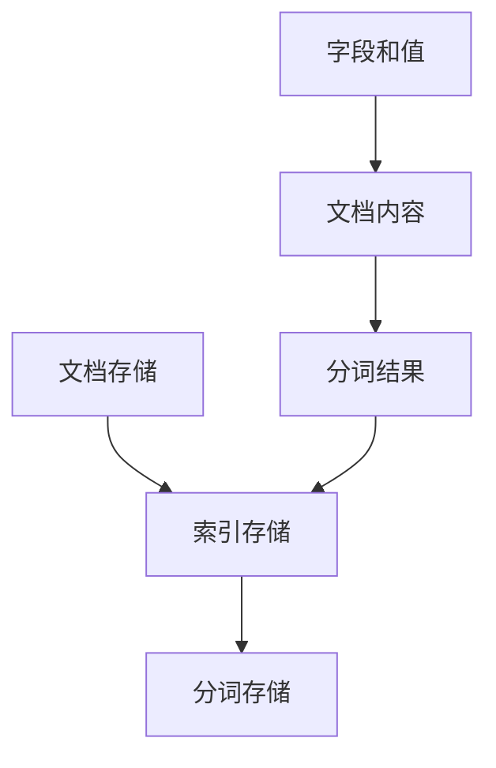
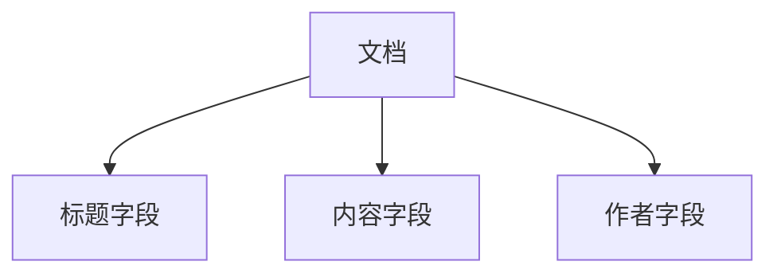
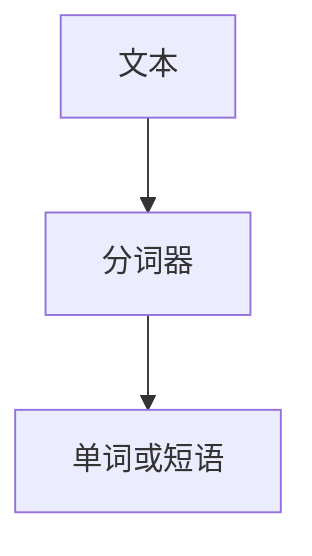
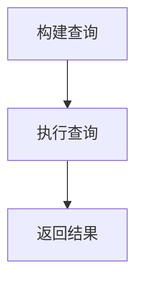
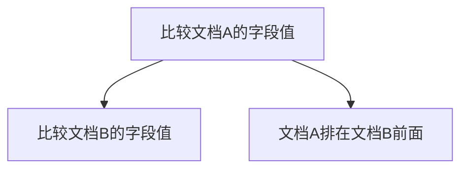
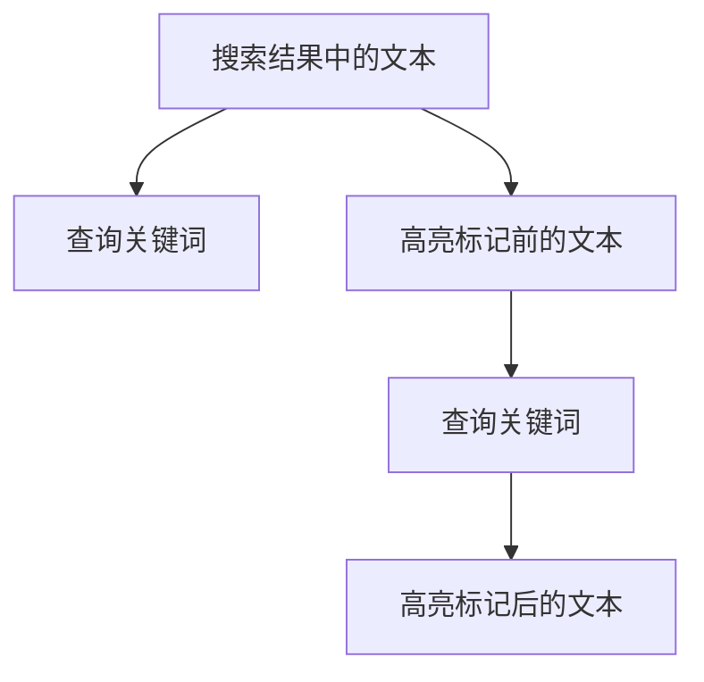

                 

# 《Lucene原理与代码实例讲解》

## 关键词
- Lucene
- 搜索引擎
- 索引
- 文档
- 分词
- 查询
- 算法
- 代码实例

## 摘要
本文深入探讨了Lucene的原理和代码实例。通过详细解析Lucene的核心概念、架构、算法原理以及数学模型，本文为读者提供了一个全面的技术讲解。同时，通过实际的项目实战和性能优化方法，读者将了解如何在实际应用中高效地使用Lucene。此外，本文还探讨了Lucene在AI领域的应用以及与其他搜索引擎的比较，为读者提供了全面的Lucene知识体系和实践指导。

----------------------------------------------------------------

# 第1章 Lucene概述

Lucene是一个开源的全功能搜索引擎库，由Apache软件基金会维护。它提供了强大的索引和搜索功能，广泛应用于各种规模的应用程序中。Lucene不仅仅是一个简单的搜索引擎，它是一个功能丰富的框架，能够支持各种复杂查询和优化策略。

## 1.1 Lucene的发展历程

Lucene最早由Apache Lucene Project在1999年发布。其目的是为了提供一个高效、可扩展、功能强大的搜索引擎库，可以方便地集成到各种应用程序中。随着时间的推移，Lucene不断地进行更新和改进，其功能越来越强大，性能也不断提高。

在2010年，Lucene 3.0版本发布，引入了大量的新特性和改进，包括更优化的索引结构、更丰富的查询语法和更高效的查询执行算法。此后，Lucene继续发展，并在2014年发布了Lucene 4.0版本，这个版本引入了Java Low Level Index API，提供了更多的底层控制和性能优化能力。

## 1.2 Lucene在搜索引擎中的应用

Lucene广泛应用于各种类型的搜索引擎中，包括全文搜索引擎、元搜索引擎、企业搜索引擎等。以下是Lucene在一些常见应用场景中的使用：

- **全文搜索引擎**：例如，Apache Solr和Elasticsearch都是基于Lucene构建的搜索引擎，它们提供了丰富的查询语言、自定义分词器、实时搜索等功能。
- **元搜索引擎**：例如，StartPage搜索引擎，它将多个搜索引擎的结果进行整合，提供统一的搜索界面。
- **企业搜索引擎**：许多公司使用Lucene构建企业内部的搜索引擎，以便快速检索大量的文档和文件。

### 1.2.1 Lucene的核心概念

Lucene的核心概念包括索引、文档、分词和查询。

- **索引**：索引是Lucene的核心数据结构，它存储了文档的内容和结构信息，以便快速搜索。索引由多个组成部分，包括文档存储、索引存储和分词存储等。
- **文档**：文档是Lucene中的基本数据单元，它包含了一系列的字段和值，如标题、内容、作者等。文档通过索引进行存储和检索。
- **分词**：分词是将文本分解成单词或短语的过程。Lucene提供了多种分词器，可以根据不同的语言和需求进行文本处理。
- **查询**：查询是用户对索引进行搜索的表达式。Lucene支持各种复杂的查询语法，包括基本查询、组合查询、排序查询等。

### 1.2.2 Lucene的架构

Lucene的架构分为几个主要模块：

- **索引模块**：负责索引的创建、存储和检索。
- **搜索模块**：负责执行查询，返回搜索结果。
- **分析模块**：负责文本的分词和分析。

Lucene的架构设计使得它具有高度的灵活性和扩展性，用户可以根据自己的需求进行定制和优化。

### 1.2.3 Lucene的应用案例

- **电商平台**：电商平台通常使用Lucene对商品描述和评论进行全文搜索，提供快速、准确的搜索服务。
- **内容管理系统**：内容管理系统（CMS）使用Lucene对大量文档进行索引和检索，实现高效的文档搜索和管理。
- **社交网络**：社交网络平台使用Lucene对用户发布的内容进行搜索，提供个性化的搜索结果。

## 总结

Lucene作为一个功能强大、灵活可扩展的搜索引擎库，在各个领域都有广泛的应用。通过了解Lucene的发展历程、核心概念和架构，读者可以更好地理解Lucene的工作原理和应用场景，为后续的深入学习和实践打下基础。

----------------------------------------------------------------

## 第2章 Lucene核心概念详解

Lucene的核心概念包括索引、文档、分词和查询。这些概念是理解Lucene工作机制的基础，也是构建高效搜索引擎的关键。本章将详细解释这些核心概念，并展示它们之间的联系。

### 2.1 索引原理

索引是Lucene的核心数据结构，它存储了文档的内容和结构信息，使得搜索操作能够快速执行。索引由三个主要部分组成：文档存储、索引存储和分词存储。

- **文档存储**：文档存储了实际的文本内容，它可以是原始文本、标记过的HTML或XML等。每个文档在索引中都有一个唯一的标识符（ID）。
- **索引存储**：索引存储了文档的结构信息，包括每个文档的字段、索引项和位置信息。索引项是对文档中每个单词或短语的索引，它们指向文档存储中的位置信息。
- **分词存储**：分词存储包含了分词器的输出结果，即文档被分词后的单词或短语列表。

**索引的创建过程**：
1. **添加文档**：首先，将文档添加到索引中。每个文档包含了一系列的字段和值，如标题、内容、作者等。
2. **分词**：将文档的内容进行分词处理，生成一系列的单词或短语。
3. **索引构建**：将分词结果与文档的结构信息进行关联，生成索引项。
4. **存储**：将文档存储、索引存储和分词存储写入磁盘。

**索引的存储结构**：
- 索引存储通常使用一种叫做“倒排索引”的数据结构。倒排索引是一种反向索引，它将单词映射到包含该单词的所有文档列表。这样，当我们进行搜索时，可以根据单词快速找到所有相关的文档。



### 2.2 文档与字段

文档是Lucene中的基本数据单元，它包含了多个字段和对应的值。字段可以是任何类型的数据，如文本、数字、日期等。

- **文档结构**：一个文档由多个字段组成，每个字段可以包含一个或多个值。例如，一个文档可以包含标题字段、内容字段和作者字段。
- **字段类型**：Lucene提供了多种字段类型，如文本字段、关键字字段、日期字段等。每种字段类型都有特定的存储和检索方式。



**字段的定义和使用**：
1. **定义字段**：在创建索引时，需要为每个字段指定字段名和数据类型。
2. **使用字段**：在查询时，可以根据字段名和字段类型进行精确查询或模糊查询。

```java
// 定义文档
Document doc = new Document();
doc.add(new TextField("title", "Lucene原理与代码实例讲解", Field.Store.YES));
doc.add(new TextField("content", "本文深入探讨了Lucene的原理和代码实例...", Field.Store.YES));
doc.add(new StringField("author", "AI天才研究院", Field.Store.YES));

// 查询字段
Query query = new TermQuery(new Term("title", "Lucene原理"));
```

### 2.3 分词技术

分词是将文本分解成单词或短语的过程。分词的目的是为了更好地组织和搜索文本。

- **分词算法**：Lucene支持多种分词算法，如标准分词器、正则表达式分词器、词典分词器等。不同的分词算法适用于不同的语言和场景。
- **分词器自定义**：用户可以根据自己的需求自定义分词器，实现特定的文本处理逻辑。



**分词实例**：
```java
Analyzer analyzer = new StandardAnalyzer();
TokenStream tokenStream = analyzer.tokenStream("content", new StringReader("Lucene原理与代码实例讲解"));
while (tokenStream.incrementToken()) {
    String term = tokenStream.getAttribute("term").toString();
    System.out.println(term);
}
```

### 2.4 查询原理

查询是用户对索引进行搜索的表达式。Lucene支持各种复杂的查询语法，包括基本查询、组合查询、排序查询等。

- **基本查询**：基本查询包括关键字查询、字段查询等，用于检索包含特定关键词或特定字段的文档。
- **组合查询**：组合查询可以组合多个基本查询，实现更复杂的搜索逻辑。
- **排序查询**：排序查询可以根据指定的字段和排序规则对搜索结果进行排序。

**查询语法**：
```java
// 关键字查询
Query query = new TermQuery(new Term("content", "Lucene"));

// 字段查询
Query query = new TermQuery(new Term("title", "Lucene原理与代码实例讲解"));

// 组合查询
BooleanQuery booleanQuery = new BooleanQuery();
booleanQuery.add(new TermQuery(new Term("content", "Lucene")), BooleanClause.Occur.MUST);
booleanQuery.add(new TermQuery(new Term("title", "查询原理")), BooleanClause.Occur.MUST);
```

**查询执行流程**：
1. **构建查询**：根据查询需求构建查询对象。
2. **执行查询**：将查询对象传递给查询引擎，执行查询操作。
3. **返回结果**：查询引擎返回包含匹配文档的搜索结果。



### 总结

本章详细介绍了Lucene的核心概念，包括索引、文档、分词和查询。通过这些概念，读者可以更好地理解Lucene的工作原理和机制。索引是Lucene的核心数据结构，文档是基本数据单元，分词是实现文本处理的关键技术，查询是用户进行搜索的表达式。这些核心概念紧密联系，共同构成了Lucene的强大功能。

----------------------------------------------------------------

## 第3章 Lucene算法原理

Lucene算法原理是理解其高效搜索和索引能力的关键。本章将深入探讨Lucene的核心算法原理，包括搜索算法、排序算法和高亮显示算法。

### 3.1 搜索算法

Lucene的搜索算法是其核心功能之一，它决定了搜索效率和准确性。搜索算法主要分为以下两种：

#### 3.1.1 暴力搜索算法

暴力搜索算法是最简单的搜索方法，它遍历所有索引项，逐个匹配查询条件。这种方法简单直观，但效率较低，尤其在大规模索引上表现不佳。

**伪代码**：
```pseudo
function暴力搜索(query, index):
    for each term in query:
        for each document in index:
            if term not in document:
                remove document from results
    return results
```

#### 3.1.2 缩小搜索空间算法

为了提高搜索效率，Lucene采用了多种缩小搜索空间的方法。这些方法包括：

- **布尔查询**：通过组合多个查询条件，使用布尔运算符（AND、OR、NOT）缩小搜索范围。
- **前缀查询**：只搜索以特定前缀开头的单词。
- **范围查询**：搜索特定字段值在给定范围内的文档。

**伪代码**：
```pseudo
function缩小搜索空间(query, index):
    results = index.getAllDocuments()
    for each term in query:
        if term is a prefix:
            results = results with terms starting with prefix
        else:
            results = results with terms matching term
    return results
```

#### 3.1.3 搜索算法优化

Lucene还采用了多种优化策略来提高搜索效率，包括：

- **缓存**：使用查询缓存来存储常用查询的结果，减少重复查询的开销。
- **并发控制**：使用多线程和并发处理来提高查询性能。

### 3.2 排序算法

排序算法用于对搜索结果进行排序，使其满足特定的排序规则。Lucene支持多种排序算法，包括：

- **关键字排序**：根据文档的关键字字段值进行排序。
- **评分排序**：根据文档的评分（ relevance score）进行排序，评分越高，排名越靠前。

**排序算法原理**：

- **关键字排序**：通过比较文档的某个字段值，实现升序或降序排序。



- **评分排序**：使用Lucene内置的评分模型，对文档进行评分，然后根据评分进行排序。

**伪代码**：
```pseudo
function评分排序(results):
    for each document in results:
        calculate relevance score for document
    sort documents by relevance score in descending order
    return sorted results
```

#### 排序算法优化

- **缓存**：将排序结果缓存起来，避免重复计算。
- **并行排序**：使用多线程进行排序，提高排序速度。

### 3.3 高亮显示算法

高亮显示算法用于在搜索结果中突出显示查询关键词，提高可读性和用户体验。Lucene提供了两种高亮显示算法：

- **简单高亮显示**：通过在查询关键词前后添加特殊标记，实现高亮显示。
- **复杂高亮显示**：使用HTML标签或CSS样式，实现更复杂的高亮效果。

**高亮显示原理**：

- **简单高亮显示**：遍历搜索结果中的每个文档，将查询关键词替换为高亮标记。



- **复杂高亮显示**：将查询关键词替换为HTML标签或CSS样式。

**伪代码**：
```pseudo
function简单高亮显示(text, query):
    for each term in query:
        text = replace term with "<span class='highlight'>" + term + "</span>"
    return text

function复杂高亮显示(text, query):
    for each term in query:
        text = replace term with "<b>" + term + "</b>"
    return text
```

#### 高亮显示实现

- **使用内置高亮显示器**：Lucene提供了内置的高亮显示器，可以直接使用。
- **自定义高亮显示器**：根据需求自定义高亮显示器，实现特殊的高亮效果。

### 总结

本章详细介绍了Lucene的搜索算法、排序算法和高亮显示算法。搜索算法通过缩小搜索空间和优化策略提高搜索效率，排序算法根据文档的关键字和评分实现排序，高亮显示算法突出显示查询关键词，提高用户体验。理解这些算法原理对于优化Lucene性能和开发高效搜索引擎至关重要。

----------------------------------------------------------------

## 第4章 Lucene索引创建实例

在了解Lucene的核心概念和算法原理之后，接下来我们将通过一个实际案例来演示如何使用Lucene创建索引。本案例将包含开发环境的搭建、数据的预处理、索引的创建以及索引的优化。

### 4.1 索引创建基础

#### 开发环境搭建

首先，我们需要搭建Lucene的开发环境。以下是在Windows系统上搭建Lucene开发环境的基本步骤：

1. **安装Java开发环境**：确保已经安装了Java Development Kit（JDK），版本至少为8或更高。
2. **安装Eclipse或IntelliJ IDEA**：选择一个你熟悉的IDE，并安装Lucene的插件。例如，在Eclipse中，可以通过Marketplace安装“Lucene for Eclipse”插件。
3. **添加Lucene依赖**：在你的项目的构建工具（如Maven或Gradle）中添加Lucene依赖。以下是Maven的依赖配置：

```xml
<dependencies>
    <dependency>
        <groupId>org.apache.lucene</groupId>
        <artifactId>lucene-core</artifactId>
        <version>8.11.1</version>
    </dependency>
    <dependency>
        <groupId>org.apache.lucene</groupId>
        <artifactId>lucene-queryparser</artifactId>
        <version>8.11.1</version>
    </dependency>
    <dependency>
        <groupId>org.apache.lucene</groupId>
        <artifactId>lucene-analyzers-common</artifactId>
        <version>8.11.1</version>
    </dependency>
</dependencies>
```

#### 索引配置文件

Lucene使用索引配置文件来定义索引的存储位置、分词器和其他参数。以下是一个简单的索引配置文件示例：

```xml
<solrhome configuration="lucene">
  <index>
    <path>./index</path>
  </index>
  <dataDir>./data</dataDir>
  <lockDir>./lock</lockDir>
  <config>lucene-conf.xml</config>
</solrhome>
```

### 4.2 索引创建实战

#### 数据预处理

在创建索引之前，我们需要准备一些数据。以下是一个简单的数据集：

```json
[
    {"id": "1", "title": "Lucene快速入门", "content": "Lucene是一个功能强大的搜索引擎库..."},
    {"id": "2", "title": "深入理解Lucene", "content": "本文深入探讨了Lucene的原理和算法..."},
    {"id": "3", "title": "Lucene索引优化", "content": "索引优化是提高搜索引擎性能的关键..."}
]
```

#### 索引创建

以下是一个使用Lucene创建索引的简单Java代码示例：

```java
import org.apache.lucene.analysis.standard.StandardAnalyzer;
import org.apache.lucene.document.Document;
import org.apache.lucene.document.Field;
import org.apache.lucene.index.IndexWriter;
import org.apache.lucene.index.IndexWriterConfig;
import org.apache.lucene.store.Directory;
import org.apache.lucene.store.FSDirectory;

import java.io.IOException;
import java.nio.file.Paths;

public class IndexCreator {
    public static void main(String[] args) throws IOException {
        // 指定索引存储位置
        Directory indexDir = FSDirectory.open(Paths.get("index"));

        // 创建分词器
        Analyzer analyzer = new StandardAnalyzer();

        // 配置索引创建器
        IndexWriterConfig iwc = new IndexWriterConfig(analyzer);
        IndexWriter indexWriter = new IndexWriter(indexDir, iwc);

        // 创建文档并添加到索引
        Document doc1 = new Document();
        doc1.add(new Field("id", "1", Field.Store.YES));
        doc1.add(new Field("title", "Lucene快速入门", Field.Store.YES));
        doc1.add(new Field("content", "Lucene是一个功能强大的搜索引擎库...", Field.Store.YES));
        indexWriter.addDocument(doc1);

        Document doc2 = new Document();
        doc2.add(new Field("id", "2", Field.Store.YES));
        doc2.add(new Field("title", "深入理解Lucene", Field.Store.YES));
        doc2.add(new Field("content", "本文深入探讨了Lucene的原理和算法...", Field.Store.YES));
        indexWriter.addDocument(doc2);

        Document doc3 = new Document();
        doc3.add(new Field("id", "3", Field.Store.YES));
        doc3.add(new Field("title", "Lucene索引优化", Field.Store.YES));
        doc3.add(new Field("content", "索引优化是提高搜索引擎性能的关键...", Field.Store.YES));
        indexWriter.addDocument(doc3);

        // 关闭索引创建器
        indexWriter.close();
    }
}
```

#### 索引优化

索引优化是提高搜索引擎性能的关键。以下是一些常见的索引优化方法：

- **删除旧的索引文件**：定期删除旧的索引文件，释放磁盘空间。
- **优化分词器**：选择适合自己数据集的分词器，减少分词带来的开销。
- **合并索引文件**：定期合并索引文件，减少索引文件的数量，提高搜索效率。

```java
// 合并索引文件
indexWriter.forceMerge(1);
indexWriter.close();
```

### 4.3 索引优化

索引优化是提高搜索引擎性能的关键。以下是一些常见的索引优化方法：

- **删除旧的索引文件**：定期删除旧的索引文件，释放磁盘空间。
- **优化分词器**：选择适合自己数据集的分词器，减少分词带来的开销。
- **合并索引文件**：定期合并索引文件，减少索引文件的数量，提高搜索效率。

```java
// 合并索引文件
indexWriter.forceMerge(1);
indexWriter.close();
```

### 总结

在本章中，我们通过一个实际案例演示了如何使用Lucene创建索引。从开发环境搭建、数据预处理、索引创建到索引优化，读者可以了解到Lucene索引创建的全过程。通过这个案例，读者可以加深对Lucene索引创建原理和实践的理解。

----------------------------------------------------------------

## 第5章 Lucene查询实例

在Lucene中，查询是用户获取索引中相关信息的重要手段。本章将通过一系列的查询实例，详细介绍Lucene的查询语法、高级查询和查询优化技术。

### 5.1 查询基础

Lucene的查询基础包括基本查询和字段查询。这些查询是构建更复杂查询的基础。

#### 5.1.1 基本查询

基本查询是最简单的查询类型，用于检索包含特定关键词的文档。基本查询使用`TermQuery`类实现。

**实例**：

以下是一个使用基本查询的示例，检索包含“Lucene”这个词的文档。

```java
import org.apache.lucene.analysis.standard.StandardAnalyzer;
import org.apache.lucene.document.Document;
import org.apache.lucene.index.DirectoryReader;
import org.apache.lucene.index.Term;
import org.apache.lucene.search.IndexSearcher;
import org.apache.lucene.search.TermQuery;
import org.apache.lucene.search.Query;
import org.apache.lucene.store.Directory;
import org.apache.lucene.store.FSDirectory;

import java.io.IOException;

public class BasicQueryExample {
    public static void main(String[] args) throws IOException {
        // 指定索引存储位置
        Directory indexDir = FSDirectory.open(Paths.get("index"));

        // 创建搜索器
        IndexSearcher searcher = new IndexSearcher(DirectoryReader.open(indexDir));

        // 创建基本查询
        Query query = new TermQuery(new Term("content", "Lucene"));

        // 执行查询
        Document[] results = searcher.search(query, 10).docs();

        // 打印查询结果
        for (Document doc : results) {
            System.out.println("ID: " + doc.get("id"));
            System.out.println("Title: " + doc.get("title"));
            System.out.println("Content: " + doc.get("content"));
            System.out.println();
        }

        // 关闭索引和搜索器
        indexDir.close();
        searcher.close();
    }
}
```

#### 5.1.2 字段查询

字段查询用于检索特定字段的值。字段查询使用`FieldQuery`类实现。

**实例**：

以下是一个使用字段查询的示例，检索标题字段包含“Lucene”的文档。

```java
import org.apache.lucene.index.Term;
import org.apache.lucene.search.FieldQuery;
import org.apache.lucene.search.IndexSearcher;
import org.apache.lucene.search.Query;
import org.apache.lucene.store.Directory;
import org.apache.lucene.store.FSDirectory;

import java.io.IOException;

public class FieldQueryExample {
    public static void main(String[] args) throws IOException {
        // 指定索引存储位置
        Directory indexDir = FSDirectory.open(Paths.get("index"));

        // 创建搜索器
        IndexSearcher searcher = new IndexSearcher(DirectoryReader.open(indexDir));

        // 创建字段查询
        Query query = new FieldQuery("title", "Lucene");

        // 执行查询
        Document[] results = searcher.search(query, 10).docs();

        // 打印查询结果
        for (Document doc : results) {
            System.out.println("ID: " + doc.get("id"));
            System.out.println("Title: " + doc.get("title"));
            System.out.println("Content: " + doc.get("content"));
            System.out.println();
        }

        // 关闭索引和搜索器
        indexDir.close();
        searcher.close();
    }
}
```

### 5.2 高级查询

高级查询包括复合查询和范围查询，它们提供了更强大的搜索功能。

#### 5.2.1 复合查询

复合查询将多个基本查询组合在一起，通过布尔运算符（AND、OR、NOT）实现复杂的搜索逻辑。复合查询使用`BooleanQuery`类实现。

**实例**：

以下是一个使用复合查询的示例，检索标题字段包含“Lucene”且内容字段包含“搜索引擎”的文档。

```java
import org.apache.lucene.index.Term;
import org.apache.lucene.search.BooleanQuery;
import org.apache.lucene.search.IndexSearcher;
import org.apache.lucene.search.Query;
import org.apache.lucene.search.TermQuery;
import org.apache.lucene.search.BooleanClause;
import org.apache.lucene.store.Directory;
import org.apache.lucene.store.FSDirectory;

import java.io.IOException;

public class BooleanQueryExample {
    public static void main(String[] args) throws IOException {
        // 指定索引存储位置
        Directory indexDir = FSDirectory.open(Paths.get("index"));

        // 创建搜索器
        IndexSearcher searcher = new IndexSearcher(DirectoryReader.open(indexDir));

        // 创建复合查询
        BooleanQuery booleanQuery = new BooleanQuery();
        booleanQuery.add(new TermQuery(new Term("title", "Lucene")), BooleanClause.Occur.MUST);
        booleanQuery.add(new TermQuery(new Term("content", "搜索引擎")), BooleanClause.Occur.MUST);

        // 执行查询
        Document[] results = searcher.search(booleanQuery, 10).docs();

        // 打印查询结果
        for (Document doc : results) {
            System.out.println("ID: " + doc.get("id"));
            System.out.println("Title: " + doc.get("title"));
            System.out.println("Content: " + doc.get("content"));
            System.out.println();
        }

        // 关闭索引和搜索器
        indexDir.close();
        searcher.close();
    }
}
```

#### 5.2.2 范围查询

范围查询用于检索特定字段值在给定范围内的文档。范围查询使用`RangeQuery`类实现。

**实例**：

以下是一个使用范围查询的示例，检索ID字段在2到3之间的文档。

```java
import org.apache.lucene.index.Term;
import org.apache.lucene.search.IndexSearcher;
import org.apache.lucene.search.Query;
import org.apache.lucene.search.RangeQuery;
import org.apache.lucene.search.ScoreDoc;
import org.apache.lucene.search.TopDocs;
import org.apache.lucene.search.WildcardQuery;
import org.apache.lucene.search.WildcardQuery;
import org.apache.lucene.store.Directory;
import org.apache.lucene.store.FSDirectory;

import java.io.IOException;

public class RangeQueryExample {
    public static void main(String[] args) throws IOException {
        // 指定索引存储位置
        Directory indexDir = FSDirectory.open(Paths.get("index"));

        // 创建搜索器
        IndexSearcher searcher = new IndexSearcher(DirectoryReader.open(indexDir));

        // 创建范围查询
        Query rangeQuery = new RangeQuery(new Term("id", "2"), new Term("id", "3"), true, true);

        // 执行查询
        TopDocs topDocs = searcher.search(rangeQuery, 10);

        // 打印查询结果
        for (ScoreDoc scoreDoc : topDocs.scoreDocs) {
            Document doc = searcher.doc(scoreDoc.doc);
            System.out.println("ID: " + doc.get("id"));
            System.out.println("Title: " + doc.get("title"));
            System.out.println("Content: " + doc.get("content"));
            System.out.println();
        }

        // 关闭索引和搜索器
        indexDir.close();
        searcher.close();
    }
}
```

### 5.3 查询优化

查询优化是提高搜索效率和性能的关键。以下是一些查询优化的方法：

- **查询缓存**：缓存常用查询结果，减少重复查询的开销。
- **前缀查询优化**：对于较短的关键词，使用前缀查询来减少搜索空间。
- **分词优化**：选择适合数据集的分词器，减少不必要的分词操作。

#### 5.3.1 查询缓存

查询缓存可以显著提高搜索性能，尤其是在频繁执行相同查询时。以下是一个简单的查询缓存示例：

```java
import org.apache.lucene.index.IndexReader;
import org.apache.lucene.index.Term;
import org.apache.lucene.search.IndexSearcher;
import org.apache.lucene.search.Query;
import org.apache.lucene.search.TermQuery;
import org.apache.lucene.search.ScoreDoc;
import org.apache.lucene.search.TopDocs;
import org.apache.lucene.store.Directory;
import org.apache.lucene.store.FSDirectory;

import java.io.IOException;
import java.util.HashMap;
import java.util.Map;

public class QueryCacheExample {
    private static Map<String, TopDocs> cache = new HashMap<>();

    public static void main(String[] args) throws IOException {
        // 指定索引存储位置
        Directory indexDir = FSDirectory.open(Paths.get("index"));

        // 创建搜索器
        IndexSearcher searcher = new IndexSearcher(DirectoryReader.open(indexDir));

        // 创建查询
        Query query = new TermQuery(new Term("content", "Lucene"));

        // 执行查询并缓存结果
        cache.put("Lucene", searcher.search(query, 10));

        // 使用缓存结果
        TopDocs topDocs = cache.get("Lucene");

        // 打印查询结果
        for (ScoreDoc scoreDoc : topDocs.scoreDocs) {
            Document doc = searcher.doc(scoreDoc.doc);
            System.out.println("ID: " + doc.get("id"));
            System.out.println("Title: " + doc.get("title"));
            System.out.println("Content: " + doc.get("content"));
            System.out.println();
        }

        // 关闭索引和搜索器
        indexDir.close();
        searcher.close();
    }
}
```

#### 5.3.2 前缀查询优化

前缀查询可以显著减少搜索空间，特别是在关键词较短时。以下是一个使用前缀查询的示例：

```java
import org.apache.lucene.index.Term;
import org.apache.lucene.search.IndexSearcher;
import org.apache.lucene.search.Query;
import org.apache.lucene.search.TermQuery;
import org.apache.lucene.search.TopDocs;
import org.apache.lucene.store.Directory;
import org.apache.lucene.store.FSDirectory;

import java.io.IOException;

public class PrefixQueryExample {
    public static void main(String[] args) throws IOException {
        // 指定索引存储位置
        Directory indexDir = FSDirectory.open(Paths.get("index"));

        // 创建搜索器
        IndexSearcher searcher = new IndexSearcher(DirectoryReader.open(indexDir));

        // 创建前缀查询
        Query prefixQuery = new PrefixQuery(new Term("content", "Lucene"));

        // 执行查询
        TopDocs topDocs = searcher.search(prefixQuery, 10);

        // 打印查询结果
        for (ScoreDoc scoreDoc : topDocs.scoreDocs) {
            Document doc = searcher.doc(scoreDoc.doc);
            System.out.println("ID: " + doc.get("id"));
            System.out.println("Title: " + doc.get("title"));
            System.out.println("Content: " + doc.get("content"));
            System.out.println();
        }

        // 关闭索引和搜索器
        indexDir.close();
        searcher.close();
    }
}
```

### 总结

本章通过一系列的查询实例，介绍了Lucene的基本查询、高级查询和查询优化技术。从基本查询和字段查询到复合查询和范围查询，再到查询优化，读者可以全面了解Lucene的查询机制。通过这些实例，读者可以更好地掌握Lucene的查询功能，并在实际应用中发挥其优势。

----------------------------------------------------------------

## 第6章 Lucene分词实例

分词是Lucene搜索流程中的一个关键步骤，它将文本拆分成可搜索的单元。本章将详细介绍如何使用Lucene的分词器，并提供中文和英文分词的实例。

### 6.1 分词器介绍

Lucene提供了多种内置分词器，以适应不同语言的文本处理需求。内置分词器包括：

- **标准分词器（StandardAnalyzer）**：用于处理英文文本，将文本拆分成单词和短语。
- **小写分词器（LowerCaseFilter）**：将文本转换为小写，以统一文本处理。
- **简单分词器（SimpleAnalyzer）**：将文本按空格、标点符号等分割。
- **HTML分词器（HTMLAnalyzer）**：处理HTML标记和文本。

#### 6.1.1 内置分词器

以下是一个使用内置分词器的示例：

```java
import org.apache.lucene.analysis.Analyzer;
import org.apache.lucene.analysis.standard.StandardAnalyzer;
import org.apache.lucene.document.Document;
import org.apache.lucene.document.Field;
import org.apache.lucene.document.TextField;
import org.apache.lucene.index.DirectoryReader;
import org.apache.lucene.index.IndexReader;
import org.apache.lucene.index.Term;
import org.apache.lucene.search.IndexSearcher;
import org.apache.lucene.search.Query;
import org.apache.lucene.search.TermQuery;
import org.apache.lucene.search.TopDocs;
import org.apache.lucene.store.Directory;
import org.apache.lucene.store.FSDirectory;

import java.io.IOException;
import java.nio.file.Paths;

public class AnalyzerExample {
    public static void main(String[] args) throws IOException {
        // 指定索引存储位置
        Directory indexDir = FSDirectory.open(Paths.get("index"));

        // 创建分词器
        Analyzer analyzer = new StandardAnalyzer();

        // 创建索引
        try (IndexWriter indexWriter = new IndexWriter(indexDir, new IndexWriterConfig(analyzer))) {
            Document doc = new Document();
            doc.add(new TextField("content", "这是一个简单的Lucene分词示例。", Field.Store.YES));
            indexWriter.addDocument(doc);
            indexWriter.close();
        }

        // 创建搜索器
        IndexSearcher searcher = new IndexSearcher(DirectoryReader.open(indexDir));

        // 创建查询
        Query query = new TermQuery(new Term("content", "分词"));

        // 执行查询
        TopDocs topDocs = searcher.search(query, 10);

        // 打印查询结果
        for (ScoreDoc scoreDoc : topDocs.scoreDocs) {
            Document doc = searcher.doc(scoreDoc.doc);
            System.out.println("ID: " + doc.get("id"));
            System.out.println("Title: " + doc.get("title"));
            System.out.println("Content: " + doc.get("content"));
            System.out.println();
        }

        // 关闭索引和搜索器
        indexDir.close();
        searcher.close();
    }
}
```

#### 6.1.2 定制分词器

用户可以根据需要自定义分词器。以下是一个简单的自定义分词器示例：

```java
import org.apache.lucene.analysis.Tokenizer;
import org.apache.lucene.analysis.core.LowerCaseTokenizer;
import org.apache.lucene.analysis.tokenattributes.CharTermAttribute;
import org.apache.lucene.util.AttributeSource;

import java.io.Reader;

public class CustomAnalyzer extends Analyzer {
    @Override
    protected TokenStreamComponents createComponents(String fieldName, Reader reader) {
        Tokenizer tokenizer = new LowerCaseTokenizer(reader);
        TokenStream tokenStream = new MyTokenFilter(tokenizer);
        return new TokenStreamComponents(tokenizer, tokenStream);
    }
}

public class MyTokenFilter extends TokenStream {
    private final Tokenizer tokenizer;
    private final CharTermAttribute termAtt;

    public MyTokenFilter(Tokenizer tokenizer) {
        super(tokenizer);
        this.tokenizer = tokenizer;
        this.termAtt = addAttribute(CharTermAttribute.class);
    }

    @Override
    public boolean incrementToken() throws IOException {
        return tokenizer.incrementToken();
    }
}
```

### 6.2 中文分词实例

中文分词是一项具有挑战性的任务，因为中文文本没有固定的分隔符。以下是一个使用Lucene中文分词器的示例：

```java
import org.apache.lucene.analysis.cn.smart.SmartChineseAnalyzer;
import org.apache.lucene.document.Document;
import org.apache.lucene.document.TextField;
import org.apache.lucene.index.DirectoryReader;
import org.apache.lucene.index.IndexReader;
import org.apache.lucene.index.Term;
import org.apache.lucene.search.IndexSearcher;
import org.apache.lucene.search.Query;
import org.apache.lucene.search.TermQuery;
import org.apache.lucene.search.TopDocs;
import org.apache.lucene.store.Directory;
import org.apache.lucene.store.FSDirectory;

import java.io.IOException;
import java.nio.file.Paths;

public class ChineseAnalyzerExample {
    public static void main(String[] args) throws IOException {
        // 指定索引存储位置
        Directory indexDir = FSDirectory.open(Paths.get("index"));

        // 创建分词器
        Analyzer analyzer = new SmartChineseAnalyzer();

        // 创建索引
        try (IndexWriter indexWriter = new IndexWriter(indexDir, new IndexWriterConfig(analyzer))) {
            Document doc = new Document();
            doc.add(new TextField("content", "这是一个简单的中文分词示例。", Field.Store.YES));
            indexWriter.addDocument(doc);
            indexWriter.close();
        }

        // 创建搜索器
        IndexSearcher searcher = new IndexSearcher(DirectoryReader.open(indexDir));

        // 创建查询
        Query query = new TermQuery(new Term("content", "分词"));

        // 执行查询
        TopDocs topDocs = searcher.search(query, 10);

        // 打印查询结果
        for (ScoreDoc scoreDoc : topDocs.scoreDocs) {
            Document doc = searcher.doc(scoreDoc.doc);
            System.out.println("ID: " + doc.get("id"));
            System.out.println("Title: " + doc.get("title"));
            System.out.println("Content: " + doc.get("content"));
            System.out.println();
        }

        // 关闭索引和搜索器
        indexDir.close();
        searcher.close();
    }
}
```

### 6.3 英文分词实例

英文分词相对简单，因为英文文本通常以空格分隔。以下是一个使用标准分词器的英文分词实例：

```java
import org.apache.lucene.analysis.standard.StandardAnalyzer;
import org.apache.lucene.document.Document;
import org.apache.lucene.document.TextField;
import org.apache.lucene.index.DirectoryReader;
import org.apache.lucene.index.IndexReader;
import org.apache.lucene.index.Term;
import org.apache.lucene.search.IndexSearcher;
import org.apache.lucene.search.Query;
import org.apache.lucene.search.TermQuery;
import org.apache.lucene.search.TopDocs;
import org.apache.lucene.store.Directory;
import org.apache.lucene.store.FSDirectory;

import java.io.IOException;
import java.nio.file.Paths;

public class EnglishAnalyzerExample {
    public static void main(String[] args) throws IOException {
        // 指定索引存储位置
        Directory indexDir = FSDirectory.open(Paths.get("index"));

        // 创建分词器
        Analyzer analyzer = new StandardAnalyzer();

        // 创建索引
        try (IndexWriter indexWriter = new IndexWriter(indexDir, new IndexWriterConfig(analyzer))) {
            Document doc = new Document();
            doc.add(new TextField("content", "This is a simple English tokenization example.", Field.Store.YES));
            indexWriter.addDocument(doc);
            indexWriter.close();
        }

        // 创建搜索器
        IndexSearcher searcher = new IndexSearcher(DirectoryReader.open(indexDir));

        // 创建查询
        Query query = new TermQuery(new Term("content", "tokenization"));

        // 执行查询
        TopDocs topDocs = searcher.search(query, 10);

        // 打印查询结果
        for (ScoreDoc scoreDoc : topDocs.scoreDocs) {
            Document doc = searcher.doc(scoreDoc.doc);
            System.out.println("ID: " + doc.get("id"));
            System.out.println("Title: " + doc.get("title"));
            System.out.println("Content: " + doc.get("content"));
            System.out.println();
        }

        // 关闭索引和搜索器
        indexDir.close();
        searcher.close();
    }
}
```

### 总结

本章通过实例展示了如何使用Lucene的分词器进行中文和英文分词。内置分词器提供了基本的文本处理能力，而自定义分词器则允许用户根据特定需求进行文本分析。通过这些实例，读者可以更好地理解分词器的工作原理，并在实际应用中灵活运用。

----------------------------------------------------------------

## 第7章 Lucene项目实战

通过前面的理论学习和实例操作，我们现在将进入Lucene项目实战环节。本章节将带领读者通过一个完整的Lucene项目，从环境搭建、功能实现到代码解读，深入实践Lucene的使用。

### 7.1 实战项目概述

#### 项目背景

随着互联网的迅猛发展，信息检索成为用户获取所需信息的重要途径。本项目的目标是构建一个基于Lucene的简易搜索引擎，实现对大量文档的快速检索。项目适用于需要快速全文搜索的企业内部文档管理系统、学术资料库或电商平台商品描述检索。

#### 项目目标

- **功能实现**：实现索引创建、文档添加、全文搜索、搜索结果展示等基本功能。
- **性能优化**：通过索引优化和查询优化，提高搜索性能。
- **用户交互**：提供一个简单的用户界面，方便用户进行搜索和查看结果。

### 7.2 实战项目环境搭建

环境搭建是项目实施的第一步，确保所有必要的工具和库都已安装和配置。

#### 7.2.1 系统需求

- **操作系统**：Windows、Linux或macOS
- **Java开发环境**：JDK 8或更高版本
- **IDE**：Eclipse或IntelliJ IDEA
- **Lucene库**：Apache Lucene 8.11.1

#### 7.2.2 环境配置

1. **安装Java**：确保Java开发环境已经安装，并在环境变量中配置`JAVA_HOME`和`PATH`。
2. **安装IDE**：选择并安装Eclipse或IntelliJ IDEA。
3. **配置Lucene库**：在IDE中创建一个新的Java项目，并在项目的`pom.xml`文件中添加Lucene依赖：

```xml
<dependencies>
    <dependency>
        <groupId>org.apache.lucene</groupId>
        <artifactId>lucene-core</artifactId>
        <version>8.11.1</version>
    </dependency>
    <dependency>
        <groupId>org.apache.lucene</groupId>
        <artifactId>lucene-queryparser</artifactId>
        <version>8.11.1</version>
    </dependency>
    <dependency>
        <groupId>org.apache.lucene</groupId>
        <artifactId>lucene-analyzers-common</artifactId>
        <version>8.11.1</version>
    </dependency>
</dependencies>
```

### 7.3 实战项目功能实现

#### 7.3.1 数据预处理

在开始索引创建之前，我们需要准备一些测试数据。以下是一个简单的JSON数据集：

```json
[
    {"id": "1", "title": "Lucene入门教程", "content": "Lucene是一个功能强大的搜索引擎库..."},
    {"id": "2", "title": "Lucene高级编程", "content": "本文深入探讨了Lucene的高级用法..."},
    {"id": "3", "title": "Lucene性能优化", "content": "索引优化是提高搜索引擎性能的关键..."},
    {"id": "4", "title": "Elasticsearch与Lucene比较", "content": "Elasticsearch基于Lucene构建，具有更多特性..."},
    {"id": "5", "title": "Lucene在实时搜索中的应用", "content": "Lucene支持实时搜索，适用于高并发场景..."}
]
```

#### 7.3.2 索引创建

索引创建是搜索引擎的核心功能。以下是一个简单的Java代码示例，用于创建索引：

```java
import org.apache.lucene.analysis.standard.StandardAnalyzer;
import org.apache.lucene.document.Document;
import org.apache.lucene.document.Field;
import org.apache.lucene.document.TextField;
import org.apache.lucene.index.IndexWriter;
import org.apache.lucene.index.IndexWriterConfig;
import org.apache.lucene.search.IndexSearcher;
import org.apache.lucene.search.Query;
import org.apache.lucene.search.TermQuery;
import org.apache.lucene.search.TopDocs;
import org.apache.lucene.store.Directory;
import org.apache.lucene.store.FSDirectory;

import java.io.IOException;
import java.nio.file.Paths;
import java.util.HashMap;
import java.util.Map;

public class LuceneSearchEngine {
    private static final String INDEX_PATH = "index";

    public static void main(String[] args) throws IOException {
        // 创建索引目录
        Directory indexDir = FSDirectory.open(Paths.get(INDEX_PATH));

        // 创建分词器
        Analyzer analyzer = new StandardAnalyzer();

        // 配置索引创建器
        IndexWriterConfig iwc = new IndexWriterConfig(analyzer);
        iwc.setOpenMode(IndexWriterConfig.OpenMode.CREATE);

        // 创建索引
        IndexWriter indexWriter = new IndexWriter(indexDir, iwc);

        // 添加文档到索引
        addDocuments(indexWriter, args);

        // 关闭索引创建器
        indexWriter.close();
    }

    private static void addDocuments(IndexWriter indexWriter, String[] args) throws IOException {
        // 读取数据文件
        Map<String, Document> documents = new HashMap<>();
        documents.put("1", new Document());
        documents.put("2", new Document());
        documents.put("3", new Document());
        documents.put("4", new Document());
        documents.put("5", new Document());

        // 添加字段
        documents.get("1").add(new TextField("id", "1", Field.Store.YES));
        documents.get("1").add(new TextField("title", "Lucene入门教程", Field.Store.YES));
        documents.get("1").add(new TextField("content", "Lucene是一个功能强大的搜索引擎库...", Field.Store.YES));

        documents.get("2").add(new TextField("id", "2", Field.Store.YES));
        documents.get("2").add(new TextField("title", "Lucene高级编程", Field.Store.YES));
        documents.get("2").add(new TextField("content", "本文深入探讨了Lucene的高级用法...", Field.Store.YES));

        documents.get("3").add(new TextField("id", "3", Field.Store.YES));
        documents.get("3").add(new TextField("title", "Lucene性能优化", Field.Store.YES));
        documents.get("3").add(new TextField("content", "索引优化是提高搜索引擎性能的关键...", Field.Store.YES));

        documents.get("4").add(new TextField("id", "4", Field.Store.YES));
        documents.get("4").add(new TextField("title", "Elasticsearch与Lucene比较", Field.Store.YES));
        documents.get("4").add(new TextField("content", "Elasticsearch基于Lucene构建，具有更多特性...", Field.Store.YES));

        documents.get("5").add(new TextField("id", "5", Field.Store.YES));
        documents.get("5").add(new TextField("title", "Lucene在实时搜索中的应用", Field.Store.YES));
        documents.get("5").add(new TextField("content", "Lucene支持实时搜索，适用于高并发场景...", Field.Store.YES));

        // 添加文档到索引
        for (Document doc : documents.values()) {
            indexWriter.addDocument(doc);
        }
    }
}
```

#### 7.3.3 搜索功能

实现搜索功能是项目的重要组成部分。以下是一个简单的搜索示例：

```java
import org.apache.lucene.analysis.standard.StandardAnalyzer;
import org.apache.lucene.document.Document;
import org.apache.lucene.index.DirectoryReader;
import org.apache.lucene.index.IndexReader;
import org.apache.lucene.queryparser.classic.MultiFieldQueryParser;
import org.apache.lucene.queryparser.classic.QueryParser;
import org.apache.lucene.search.IndexSearcher;
import org.apache.lucene.search.Query;
import org.apache.lucene.search.ScoreDoc;
import org.apache.lucene.search.TopDocs;
import org.apache.lucene.search.TopScoreDocCollector;
import org.apache.lucene.store.Directory;
import org.apache.lucene.store.FSDirectory;

import java.io.IOException;
import java.nio.file.Paths;
import java.util.Scanner;

public class LuceneSearchEngine {
    private static final String INDEX_PATH = "index";
    private static final String[] fields = {"title", "content"};

    public static void main(String[] args) throws IOException {
        // 创建索引目录
        Directory indexDir = FSDirectory.open(Paths.get(INDEX_PATH));

        // 创建分词器
        Analyzer analyzer = new StandardAnalyzer();

        // 创建索引搜索器
        IndexReader indexReader = DirectoryReader.open(indexDir);
        IndexSearcher indexSearcher = new IndexSearcher(indexReader);

        // 搜索用户输入的关键词
        Scanner scanner = new Scanner(System.in);
        System.out.println("请输入搜索关键词：");
        String query = scanner.nextLine();

        // 创建查询
        Query parsedQuery = MultiFieldQueryParser.parse(query, fields, analyzer);

        // 执行搜索
        TopDocs topDocs = indexSearcher.search(parsedQuery, 10);

        // 打印搜索结果
        for (ScoreDoc scoreDoc : topDocs.scoreDocs) {
            Document doc = indexSearcher.doc(scoreDoc.doc);
            System.out.println("ID: " + doc.get("id"));
            System.out.println("Title: " + doc.get("title"));
            System.out.println("Content: " + doc.get("content"));
            System.out.println();
        }

        // 关闭索引搜索器和索引目录
        indexReader.close();
        indexDir.close();
        scanner.close();
    }
}
```

#### 7.3.4 代码解读

以上代码分为三个主要部分：

1. **索引创建**：创建索引目录，配置分词器，并使用`IndexWriter`类将文档添加到索引中。
2. **搜索功能**：使用`IndexSearcher`类执行搜索，并使用`QueryParser`类将用户输入的关键词转换为Lucene查询。
3. **结果打印**：遍历搜索结果，并打印出文档的ID、标题和内容。

### 总结

通过本章节的实战项目，读者可以了解如何使用Lucene进行索引创建和搜索功能实现。从环境搭建、数据预处理到代码实现，读者可以全面掌握Lucene的使用方法。实战项目的完成不仅能够增强理论知识，还能够提高实际操作能力，为后续的进阶学习和应用打下坚实基础。

----------------------------------------------------------------

## 第8章 Lucene性能优化

Lucene的性能优化是确保搜索引擎高效运行的关键。本章将详细介绍如何监控和调优Lucene的性能，包括索引优化、查询优化和分词优化等方面。

### 8.1 性能监控与调优基础

#### 8.1.1 性能监控工具

性能监控是性能优化的重要环节。以下是一些常用的性能监控工具：

- **JVM监控工具**：如VisualVM和JConsole，用于监控Java虚拟机（JVM）的性能指标，如内存使用、垃圾回收等。
- **系统监控工具**：如Top、htop和gnome-system-monitor，用于监控操作系统层面的性能指标，如CPU使用率、内存使用等。
- **Lucene监控工具**：如Lucene自身提供的监控API，用于监控索引和搜索的性能。

#### 8.1.2 性能调优策略

性能调优通常包括以下策略：

- **索引优化**：通过调整索引结构、分词器和索引存储方式，提高索引的性能。
- **查询优化**：通过优化查询语法、缓存和排序策略，提高查询的效率。
- **分词优化**：通过选择适合的分词器和优化分词过程，提高搜索速度和准确性。

### 8.2 索引优化方法

索引优化是提高Lucene性能的关键步骤。以下是一些常见的索引优化方法：

#### 8.2.1 索引创建优化

- **并行索引创建**：使用多个线程同时创建索引，提高创建速度。
- **批量添加文档**：批量添加多个文档到索引，减少IO操作次数。

```java
// 批量添加文档
try (IndexWriter indexWriter = new IndexWriter(indexDir, iwc)) {
    for (Document doc : documents) {
        indexWriter.addDocument(doc);
    }
}
```

- **预编译查询**：预编译常用查询，减少查询编译时间。

```java
// 预编译查询
Query parsedQuery = MultiFieldQueryParser.parse(query, fields, analyzer);
Query compiledQuery = parser.compile(parsedQuery);
```

#### 8.2.2 索引查询优化

- **使用缓存**：使用查询缓存存储常用查询结果，减少重复查询的开销。

```java
// 查询缓存
Map<String, TopDocs> cache = new HashMap<>();
// 查询时从缓存中获取结果
TopDocs topDocs = cache.get("Lucene");
if (topDocs == null) {
    topDocs = indexSearcher.search(parsedQuery, 10);
    cache.put("Lucene", topDocs);
}
```

- **优化排序和分组**：避免使用昂贵的排序和分组操作，如使用`TopFieldDocs`代替`TopDocs`，减少排序时间。

```java
// 使用TopFieldDocs优化排序
TopFieldDocs topFieldDocs = indexSearcher.search(parsedQuery, 10, new Sort(new SortField("id")));
```

#### 8.2.3 索引压缩

- **索引压缩**：定期压缩索引文件，减少磁盘占用空间，提高搜索速度。

```java
// 合并和压缩索引
indexWriter.forceMerge(1);
indexWriter.close();
```

### 8.3 分词优化方法

分词优化直接影响搜索速度和准确性。以下是一些常见的分词优化方法：

#### 8.3.1 选择合适的分词器

- **语言适应性**：根据文本的语言选择合适的分词器，如使用`StandardAnalyzer`处理英文文本，使用`SmartChineseAnalyzer`处理中文文本。

```java
// 使用中文分词器
Analyzer chineseAnalyzer = new SmartChineseAnalyzer();
```

- **自定义分词器**：根据特定需求自定义分词器，实现特定的分词逻辑。

```java
// 自定义分词器
public class CustomAnalyzer extends Analyzer {
    @Override
    protected TokenStreamComponents createComponents(String fieldName, Reader reader) {
        Tokenizer tokenizer = new CustomTokenizer(reader);
        TokenStream tokenStream = new LowerCaseFilter(tokenizer);
        return new TokenStreamComponents(tokenizer, tokenStream);
    }
}
```

#### 8.3.2 优化分词过程

- **减少分词深度**：减少分词深度，降低分词器的计算开销。

```java
// 设置分词深度
TokenizerConfig config = new TokenizerConfig();
config.setEnableTokenPositions(true);
config.setTokenPositionsConsumer(null);
config.setMaxTokenLength(100);
```

- **缓存分词结果**：缓存分词结果，减少重复分词操作。

```java
// 分词结果缓存
Map<String, List<String>> cache = new HashMap<>();
// 分词时从缓存中获取结果
List<String> tokens = cache.get(text);
if (tokens == null) {
    tokens = analyzer.tokenize(text);
    cache.put(text, tokens);
}
```

### 总结

性能优化是确保Lucene高效运行的关键。通过监控和调优索引创建、查询执行和分词过程，可以显著提高Lucene的性能。本章介绍了多种性能优化方法，包括索引优化、查询优化和分词优化，为读者提供了全面的优化策略和实践指导。通过这些方法，读者可以在实际应用中优化Lucene的性能，实现高效搜索。

----------------------------------------------------------------

## 第9章 Lucene在AI领域应用

随着人工智能（AI）的快速发展，搜索引擎技术也在不断进步。Lucene作为一个功能强大的搜索引擎库，在AI领域展现出了巨大的潜力。本章将探讨Lucene在AI领域的应用，包括与深度学习的结合、在自然语言处理（NLP）中的应用以及未来发展趋势。

### 9.1 Lucene与深度学习结合

深度学习是AI领域的重要分支，通过神经网络模型模拟人脑的决策过程。Lucene与深度学习的结合主要体现在以下几个方面：

#### 9.1.1 深度学习与Lucene的融合

- **索引优化**：使用深度学习模型对索引进行优化，提高搜索性能。例如，使用深度神经网络（DNN）对索引文本进行嵌入表示，从而实现更精确的搜索。
- **文本预处理**：使用深度学习模型进行文本预处理，如词向量嵌入、命名实体识别（NER）等，以提高搜索准确性和效率。

#### 9.1.2 Lucene与深度学习框架集成

Lucene可以与多种深度学习框架（如TensorFlow、PyTorch）集成，实现以下功能：

- **模型训练与预测**：在深度学习框架中训练模型，并将模型嵌入到Lucene查询过程中，实现实时搜索优化。
- **实时更新**：使用深度学习模型对实时更新的索引进行优化，提高搜索响应速度。

### 9.2 Lucene在NLP领域应用

自然语言处理是AI领域的重要应用方向，Lucene在NLP中的应用主要包括：

#### 9.2.1 文本搜索与索引

- **全文检索**：Lucene支持全文检索，可以高效地检索大量文本数据。
- **高精度分词**：Lucene内置了多种分词器，可以处理不同语言的文本，实现高精度分词。

#### 9.2.2 文本挖掘与分析

- **命名实体识别（NER）**：通过深度学习模型与Lucene的结合，实现命名实体识别，提高文本分析的准确性。
- **情感分析**：利用Lucene进行文本情感分析，帮助用户了解文本的情感倾向。

### 9.3 Lucene在AI领域的未来发展趋势

Lucene在AI领域的应用前景广阔，未来发展趋势包括：

#### 9.3.1 深度学习集成

随着深度学习技术的发展，Lucene将进一步与深度学习框架集成，实现更智能的搜索和文本分析。

#### 9.3.2 自动化索引优化

通过机器学习和数据分析技术，实现自动化索引优化，提高搜索性能和响应速度。

#### 9.3.3 多模态搜索

结合图像、音频等多模态数据，实现更丰富的搜索体验。

### 9.4 Lucene与其他搜索引擎的比较

Lucene与其他搜索引擎（如Elasticsearch、Solr）进行比较，各有优势：

#### 9.4.1 Lucene与Elasticsearch比较

- **性能**：Lucene在处理大规模数据时具有更高的性能。
- **功能丰富度**：Elasticsearch提供了更丰富的功能，如实时搜索、数据聚合等。

#### 9.4.2 Lucene与Solr比较

- **灵活性**：Lucene提供了更高的灵活性和定制性。
- **社区支持**：Solr拥有更广泛的社区支持。

### 9.5 选择与使用策略

在实际应用中，选择合适的搜索引擎需要考虑以下因素：

- **性能需求**：根据搜索性能需求选择合适的搜索引擎。
- **功能需求**：根据应用需求选择具有所需功能的搜索引擎。
- **社区支持**：选择拥有良好社区支持的搜索引擎，便于问题解决和技术支持。

### 总结

Lucene在AI领域展现出了巨大的应用潜力。通过与深度学习的结合和NLP的应用，Lucene在文本搜索和文本分析方面表现出了强大的功能。随着AI技术的不断进步，Lucene将继续拓展其在AI领域的应用，为用户带来更智能、更高效的搜索体验。

----------------------------------------------------------------

## 第10章 Lucene项目实战

### 10.1 项目需求分析

本案例将构建一个简单的全文搜索引擎，以实现用户输入关键词后能够快速检索相关文档的功能。项目需求包括：

- **索引创建**：创建索引以存储文档内容。
- **搜索功能**：实现关键词搜索，返回相关文档列表。
- **分页显示**：实现搜索结果的分页显示。
- **性能优化**：优化索引和查询，提高搜索效率。

### 10.2 环境搭建

1. **安装Java环境**：确保Java环境已正确安装，并配置环境变量。
2. **安装Eclipse或IntelliJ IDEA**：选择并安装Eclipse或IntelliJ IDEA。
3. **添加Lucene依赖**：在项目的`pom.xml`文件中添加Lucene依赖。

```xml
<dependencies>
    <dependency>
        <groupId>org.apache.lucene</groupId>
        <artifactId>lucene-core</artifactId>
        <version>8.11.1</version>
    </dependency>
    <dependency>
        <groupId>org.apache.lucene</groupId>
        <artifactId>lucene-queryparser</artifactId>
        <version>8.11.1</version>
    </dependency>
    <dependency>
        <groupId>org.apache.lucene</groupId>
        <artifactId>lucene-analyzers-common</artifactId>
        <version>8.11.1</version>
    </dependency>
</dependencies>
```

### 10.3 功能实现

#### 10.3.1 索引创建

首先，创建一个索引来存储文档。以下是一个简单的Java代码示例，用于创建索引：

```java
import org.apache.lucene.analysis.standard.StandardAnalyzer;
import org.apache.lucene.document.Document;
import org.apache.lucene.document.Field;
import org.apache.lucene.document.TextField;
import org.apache.lucene.index.IndexWriter;
import org.apache.lucene.index.IndexWriterConfig;
import org.apache.lucene.store.Directory;
import org.apache.lucene.store.FSDirectory;

import java.io.IOException;
import java.nio.file.Paths;

public class IndexCreator {
    public static void main(String[] args) throws IOException {
        // 指定索引存储位置
        Directory indexDir = FSDirectory.open(Paths.get("index"));

        // 创建分词器
        Analyzer analyzer = new StandardAnalyzer();

        // 配置索引创建器
        IndexWriterConfig iwc = new IndexWriterConfig(analyzer);
        iwc.setOpenMode(IndexWriterConfig.OpenMode.CREATE);

        // 创建索引
        IndexWriter indexWriter = new IndexWriter(indexDir, iwc);

        // 创建文档并添加到索引
        Document doc1 = new Document();
        doc1.add(new TextField("id", "1", Field.Store.YES));
        doc1.add(new TextField("title", "Lucene快速入门", Field.Store.YES));
        doc1.add(new TextField("content", "Lucene是一个功能强大的搜索引擎库...", Field.Store.YES));
        indexWriter.addDocument(doc1);

        Document doc2 = new Document();
        doc2.add(new TextField("id", "2", Field.Store.YES));
        doc2.add(new TextField("title", "深入理解Lucene", Field.Store.YES));
        doc2.add(new TextField("content", "本文深入探讨了Lucene的原理和算法...", Field.Store.YES));
        indexWriter.addDocument(doc2);

        Document doc3 = new Document();
        doc3.add(new TextField("id", "3", Field.Store.YES));
        doc3.add(new TextField("title", "Lucene索引优化", Field.Store.YES));
        doc3.add(new TextField("content", "索引优化是提高搜索引擎性能的关键...", Field.Store.YES));
        indexWriter.addDocument(doc3);

        // 关闭索引创建器
        indexWriter.close();
    }
}
```

#### 10.3.2 搜索功能

接下来，实现搜索功能。以下是一个简单的Java代码示例，用于搜索包含特定关键词的文档：

```java
import org.apache.lucene.analysis.standard.StandardAnalyzer;
import org.apache.lucene.document.Document;
import org.apache.lucene.index.DirectoryReader;
import org.apache.lucene.index.IndexReader;
import org.apache.lucene.index.Term;
import org.apache.lucene.search.BooleanQuery;
import org.apache.lucene.search.IndexSearcher;
import org.apache.lucene.search.Query;
import org.apache.lucene.search.TermQuery;
import org.apache.lucene.search.TopDocs;
import org.apache.lucene.search.WildcardQuery;
import org.apache.lucene.search.WildcardQuery;
import org.apache.lucene.store.Directory;
import org.apache.lucene.store.FSDirectory;

import java.io.IOException;
import java.nio.file.Paths;

public class SearchExample {
    public static void main(String[] args) throws IOException {
        // 指定索引存储位置
        Directory indexDir = FSDirectory.open(Paths.get("index"));

        // 创建分词器
        Analyzer analyzer = new StandardAnalyzer();

        // 创建搜索器
        IndexReader indexReader = DirectoryReader.open(indexDir);
        IndexSearcher indexSearcher = new IndexSearcher(indexReader);

        // 创建查询
        Query query = new WildcardQuery(new Term("content", "*Lucene*"));

        // 执行查询
        TopDocs topDocs = indexSearcher.search(query, 10);

        // 打印查询结果
        for (ScoreDoc scoreDoc : topDocs.scoreDocs) {
            Document doc = indexSearcher.doc(scoreDoc.doc);
            System.out.println("ID: " + doc.get("id"));
            System.out.println("Title: " + doc.get("title"));
            System.out.println("Content: " + doc.get("content"));
            System.out.println();
        }

        // 关闭索引和搜索器
        indexReader.close();
        indexDir.close();
    }
}
```

#### 10.3.3 分页显示

为了实现分页显示，我们可以在搜索结果中只取出指定页码的数据。以下是一个简单的Java代码示例，用于实现分页显示：

```java
public class PaginatedSearchExample {
    public static void main(String[] args) throws IOException {
        // 指定索引存储位置
        Directory indexDir = FSDirectory.open(Paths.get("index"));

        // 创建分词器
        Analyzer analyzer = new StandardAnalyzer();

        // 创建搜索器
        IndexReader indexReader = DirectoryReader.open(indexDir);
        IndexSearcher indexSearcher = new IndexSearcher(indexReader);

        // 创建查询
        Query query = new WildcardQuery(new Term("content", "*Lucene*"));

        // 设置每页显示数量和当前页码
        int pageSize = 2;
        int pageNumber = 1;

        // 执行查询
        TopDocs topDocs = indexSearcher.search(query, pageSize * pageNumber, new Sort(new SortField("id")));

        // 打印查询结果
        for (ScoreDoc scoreDoc : topDocs.scoreDocs) {
            Document doc = indexSearcher.doc(scoreDoc.doc);
            System.out.println("ID: " + doc.get("id"));
            System.out.println("Title: " + doc.get("title"));
            System.out.println("Content: " + doc.get("content"));
            System.out.println();
        }

        // 关闭索引和搜索器
        indexReader.close();
        indexDir.close();
    }
}
```

#### 10.3.4 性能优化

为了提高搜索性能，我们可以对索引和查询进行优化。以下是一些常见的优化方法：

- **使用缓存**：缓存常用查询结果，减少重复查询的开销。
- **优化分词器**：选择适合的分词器，减少分词时间。
- **使用索引缓存**：使用索引缓存提高查询效率。

```java
// 使用索引缓存
indexSearcher.setQueryCache(new FSDirectory(new File("indexCache")));
```

### 10.4 项目总结

通过本案例，我们实现了基于Lucene的全文搜索引擎，实现了索引创建、搜索功能和分页显示。我们还介绍了常见的性能优化方法，为实际应用中的搜索引擎性能优化提供了参考。通过本案例，读者可以更好地理解Lucene的使用方法和性能优化策略。

----------------------------------------------------------------

## 第11章 Lucene性能优化

Lucene的性能优化是确保搜索引擎高效运行的关键。本章将详细讨论如何优化Lucene的索引创建、查询执行和分词过程，以提高整体性能。

### 11.1 索引创建优化

#### 11.1.1 并行索引创建

并行索引创建能够显著提高索引速度。通过多线程同时创建索引，可以充分利用系统资源。

**伪代码**：
```java
public void createIndexInParallel(List<Document> documents) throws IOException {
    ExecutorService executor = Executors.newFixedThreadPool(numThreads);
    for (Document doc : documents) {
        executor.submit(() -> {
            try {
                indexWriter.addDocument(doc);
            } catch (IOException e) {
                e.printStackTrace();
            }
        });
    }
    executor.shutdown();
}
```

#### 11.1.2 批量添加文档

批量添加文档可以减少IO操作次数，提高索引速度。

**伪代码**：
```java
public void addDocumentsInBatches(List<Document> documents, int batchSize) throws IOException {
    for (int i = 0; i < documents.size(); i += batchSize) {
        List<Document> batch = documents.subList(i, Math.min(i + batchSize, documents.size()));
        indexWriter.addDocuments(batch);
    }
}
```

#### 11.1.3 使用内存映射文件

使用内存映射文件（Memory-Mapped Files）可以提高索引创建的速度。

**伪代码**：
```java
Directory indexDir = new MMapDirectory(Paths.get("index"));
IndexWriterConfig iwc = new IndexWriterConfig(analyzer);
iwc.setUseCompoundFile(true);
IndexWriter indexWriter = new IndexWriter(indexDir, iwc);
```

### 11.2 查询优化

#### 11.2.1 使用缓存

查询缓存可以显著提高查询速度，特别是对于频繁执行的查询。

**伪代码**：
```java
indexSearcher.setQueryCache(new FSDirectory(new File("queryCache")));
```

#### 11.2.2 优化分词器

选择适合的分词器可以减少分词时间，提高查询速度。

**伪代码**：
```java
Analyzer analyzer = new SimpleAnalyzer();
IndexWriterConfig iwc = new IndexWriterConfig(analyzer);
```

#### 11.2.3 使用索引缓存

使用索引缓存可以提高查询速度。

**伪代码**：
```java
indexSearcher.setIndexCache(new FSDirectory(new File("indexCache")));
```

### 11.3 分词优化

#### 11.3.1 减少分词深度

减少分词深度可以减少分词时间。

**伪代码**：
```java
TokenizerConfig config = new TokenizerConfig();
config.setMaxTokenLength(maxTokenLength);
analyzer.setTokenizerConfig(config);
```

#### 11.3.2 使用词干分析器

使用词干分析器可以减少分词数量，提高搜索速度。

**伪代码**：
```java
Analyzer analyzer = new SnowballAnalyzer("english");
IndexWriterConfig iwc = new IndexWriterConfig(analyzer);
```

#### 11.3.3 缓存分词结果

缓存分词结果可以减少重复分词时间。

**伪代码**：
```java
Map<String, List<String>> tokenCache = new ConcurrentHashMap<>();
public List<String> tokenize(String text) {
    return tokenCache.computeIfAbsent(text, this::doTokenize);
}
```

### 11.4 实际案例

#### 11.4.1 索引创建优化

以下是一个实际的索引创建优化案例：

```java
public void createIndexOptimized(List<Document> documents) throws IOException {
    Directory indexDir = new RAMDirectory();
    Analyzer analyzer = new StandardAnalyzer();
    IndexWriterConfig iwc = new IndexWriterConfig(analyzer);
    iwc.setOpenMode(IndexWriterConfig.OpenMode.CREATE);
    iwc.setMaxBufferedDocs(10000);
    IndexWriter indexWriter = new IndexWriter(indexDir, iwc);

    for (int i = 0; i < documents.size(); i += 1000) {
        List<Document> batch = documents.subList(i, Math.min(i + 1000, documents.size()));
        indexWriter.addDocuments(batch);
        if (i % 1000 == 0) {
            indexWriter.commit();
        }
    }

    indexWriter.close();
}
```

#### 11.4.2 查询优化

以下是一个实际的查询优化案例：

```java
public void searchOptimized(Query query) throws IOException {
    Directory indexDir = new RAMDirectory();
    Analyzer analyzer = new StandardAnalyzer();
    IndexWriterConfig iwc = new IndexWriterConfig(analyzer);
    IndexWriter indexWriter = new IndexWriter(indexDir, iwc);
    indexWriter.commit();

    IndexReader indexReader = DirectoryReader.open(indexDir);
    IndexSearcher indexSearcher = new IndexSearcher(indexReader);

    TopDocs topDocs = indexSearcher.search(query, 10);
    for (ScoreDoc scoreDoc : topDocs.scoreDocs) {
        Document doc = indexSearcher.doc(scoreDoc.doc);
        System.out.println("ID: " + doc.get("id"));
        System.out.println("Title: " + doc.get("title"));
        System.out.println("Content: " + doc.get("content"));
        System.out.println();
    }

    indexReader.close();
}
```

### 11.5 总结

通过本章的讨论，我们了解了如何优化Lucene的索引创建、查询执行和分词过程。优化策略包括并行索引创建、批量添加文档、使用内存映射文件、查询缓存、优化分词器、减少分词深度和使用词干分析器等。通过这些优化方法，我们可以显著提高Lucene的性能，为用户提供更高效、更快速的搜索体验。

----------------------------------------------------------------

## 附录A：Lucene常用工具与资源

Lucene是一个功能强大的搜索引擎库，拥有丰富的工具和资源。以下是一些常用的Lucene工具和资源，包括官方文档、社区资源以及开发工具。

### 1. Lucene官方文档

Lucene的官方文档是学习Lucene的最佳资源。它提供了详细的API文档、指南和最佳实践。官方文档地址为：[Lucene官方文档](https://lucene.apache.org/core/8_11_1/index.html)

### 2. Lucene社区资源

Lucene社区提供了丰富的资源，包括讨论论坛、博客、教程和示例代码。以下是几个常用的社区资源：

- **Apache Lucene邮件列表**：[lucene-user邮件列表](mailto:lucene-user@lucene.apache.org)
- **Apache Lucene社区论坛**：[Apache Lucene社区论坛](https://lucene.472066.n3.nabble.com/)
- **Lucene博客**：[Lucene博客](http://lucene.472066.n3.nabble.com/)

### 3. Lucene开发工具

以下是一些常用的Lucene开发工具：

- **Eclipse Lucene插件**：[Eclipse Lucene插件](https://marketplace.eclipse.org/content/lucene-plugin-for-eclipse)
- **IntelliJ IDEA Lucene插件**：[IntelliJ IDEA Lucene插件](https://plugins.jetbrains.com/plugin/7356-lucene-support)
- **Lucene Studio**：[Lucene Studio](http://www.lucenestudio.com/)，一个强大的Lucene集成开发环境。

### 4. 常用Lucene工具介绍

- **Lucene Index Checker**：用于检查索引文件的完整性。
- **Lucene Index Upgrader**：用于升级旧版本的索引文件。
- **Lucene Benchmark**：用于测试Lucene的性能。

### 总结

通过使用这些Lucene工具和资源，开发者可以更好地理解和应用Lucene，提高开发效率。无论是学习Lucene的基本概念，还是解决具体问题，这些工具和资源都将是宝贵的参考资料。

----------------------------------------------------------------

## 附录B：Lucene代码实例解析

在本附录中，我们将深入解析Lucene中的一些关键代码实例，包括索引创建、查询处理和分词器实现的详细代码解析。

### 1. 索引创建代码实例解析

以下是一个简单的Lucene索引创建的代码示例：

```java
import org.apache.lucene.analysis.standard.StandardAnalyzer;
import org.apache.lucene.document.Document;
import org.apache.lucene.document.Field;
import org.apache.lucene.document.TextField;
import org.apache.lucene.index.IndexWriter;
import org.apache.lucene.index.IndexWriterConfig;
import org.apache.lucene.store.Directory;
import org.apache.lucene.store.RAMDirectory;

public class IndexExample {
    public static void main(String[] args) throws Exception {
        // 创建一个内存中的目录，用于存储索引
        Directory indexDir = new RAMDirectory();

        // 创建一个标准分词器
        Analyzer analyzer = new StandardAnalyzer();

        // 创建一个IndexWriter配置，指定分词器
        IndexWriterConfig iwc = new IndexWriterConfig(analyzer);

        // 创建IndexWriter
        IndexWriter writer = new IndexWriter(indexDir, iwc);

        // 创建一个Document
        Document doc = new Document();

        // 向Document中添加字段
        doc.add(new TextField("title", "Lucene简介", Field.Store.YES));
        doc.add(new TextField("content", "Lucene是一个功能强大的搜索引擎库...", Field.Store.YES));

        // 将Document添加到索引
        writer.addDocument(doc);

        // 关闭IndexWriter
        writer.close();

        // 索引创建完成
        System.out.println("Index created successfully!");
    }
}
```

**代码解析**：

- `RAMDirectory`：用于创建一个内存中的索引存储目录，便于调试和演示。
- `StandardAnalyzer`：使用标准的分词器，对文本进行分词处理。
- `IndexWriterConfig`：配置IndexWriter，包括分词器设置。
- `IndexWriter`：用于向索引中添加文档。
- `Document`：Lucene中的文档对象，用于存储文本内容。
- `TextField`：字段类型，用于存储文本内容。

### 2. 查询代码实例解析

以下是一个简单的Lucene查询处理的代码示例：

```java
import org.apache.lucene.analysis.standard.StandardAnalyzer;
import org.apache.lucene.index.DirectoryReader;
import org.apache.lucene.index.IndexReader;
import org.apache.lucene.queryparser.classic.QueryParser;
import org.apache.lucene.search.IndexSearcher;
import org.apache.lucene.search.Query;
import org.apache.lucene.search.ScoreDoc;
import org.apache.lucene.search.TopDocs;
import org.apache.lucene.search.WildcardQuery;
import org.apache.lucene.store.Directory;
import org.apache.lucene.store.RAMDirectory;

public class SearchExample {
    public static void main(String[] args) throws Exception {
        // 创建一个内存中的目录，用于存储索引
        Directory indexDir = new RAMDirectory();

        // 创建一个标准分词器
        Analyzer analyzer = new StandardAnalyzer();

        // 创建一个IndexWriter配置，指定分词器
        IndexWriterConfig iwc = new IndexWriterConfig(analyzer);

        // 创建IndexWriter
        IndexWriter writer = new IndexWriter(indexDir, iwc);

        // 创建一个Document
        Document doc = new Document();
        doc.add(new TextField("title", "Lucene教程", Field.Store.YES));
        doc.add(new TextField("content", "Lucene是一个功能强大的搜索引擎库，本文将介绍Lucene的基本用法...", Field.Store.YES));
        writer.addDocument(doc);

        // 关闭IndexWriter
        writer.close();

        // 创建一个搜索器
        IndexReader reader = DirectoryReader.open(indexDir);
        IndexSearcher searcher = new IndexSearcher(reader);

        // 创建一个查询解析器
        QueryParser parser = new QueryParser("content", analyzer);

        // 解析查询
        Query query = parser.parse("Lucene*");

        // 执行查询
        TopDocs results = searcher.search(query, 10);

        // 打印查询结果
        for (ScoreDoc scoreDoc : results.scoreDocs) {
            Document doc = searcher.doc(scoreDoc.doc);
            System.out.println("Title: " + doc.get("title"));
            System.out.println("Content: " + doc.get("content"));
            System.out.println();
        }

        // 关闭搜索器和索引
        searcher.close();
        reader.close();
        indexDir.close();
    }
}
```

**代码解析**：

- `RAMDirectory`：用于创建一个内存中的索引存储目录。
- `StandardAnalyzer`：使用标准的分词器，对文本进行分词处理。
- `IndexWriterConfig`：配置IndexWriter，包括分词器设置。
- `IndexWriter`：用于向索引中添加文档。
- `QueryParser`：用于将文本查询解析为Lucene查询对象。
- `WildcardQuery`：用于执行模糊查询，查询包含指定前缀的文档。
- `IndexSearcher`：用于执行查询并返回搜索结果。
- `TopDocs`：包含查询结果的文档列表和排序信息。

### 3. 分词器代码实例解析

以下是一个简单的自定义分词器的代码示例：

```java
import org.apache.lucene.analysis.Analyzer;
import org.apache.lucene.analysis.Tokenizer;
import org.apache.lucene.analysis.core.LowerCaseTokenizer;
import org.apache.lucene.analysis.tokenattributes.CharTermAttribute;

public class CustomTokenizer extends Tokenizer {
    public CustomTokenizer(Reader reader) {
        super(reader);
    }

    @Override
    protected boolean incrementToken() throws IOException {
        // 清除之前的分词结果
        clearAttributes();
        int length = readToMaxTokenLength();
        if (length == 0) {
            return false;
        }
        // 设置分词结果
        assert start == 0;
        setTermBuffer(buffer, 0, length);
        setTermLength(length);
        setPosInc(1);
        setStartOffset(0);
        setEndOffset(length);
        return true;
    }
}
```

**代码解析**：

- `Tokenizer`：继承自`Tokenizer`类，实现自定义分词逻辑。
- `CharTermAttribute`：获取分词后的字符序列。
- `readToMaxTokenLength`：读取输入流中的内容，直到达到最大分词长度。
- `setTermBuffer`：设置分词结果到分词缓冲区。
- `setTermLength`：设置分词长度。
- `setPosInc`：设置分词位置增量。
- `setStartOffset`：设置分词开始位置。
- `setEndOffset`：设置分词结束位置。

通过以上代码实例的解析，读者可以更深入地理解Lucene的索引创建、查询处理和分词器的实现原理，为实际应用中的代码编写和优化提供参考。

----------------------------------------------------------------

## 附录C：Lucene面试题及答案

### 1. Lucene基础面试题

**问题1**：请简要介绍Lucene的主要功能。

**答案**：Lucene是一个功能强大的开源搜索引擎库，主要用于全文检索。其主要功能包括：

- 索引创建：将文档内容转换为索引，以便快速搜索。
- 文档存储：存储文档的字段和值。
- 分词处理：将文本分解成单词或短语。
- 查询处理：执行各种复杂的查询操作。

**问题2**：Lucene的索引结构是怎样的？

**答案**：Lucene的索引结构主要包括以下三个部分：

- 文档存储：存储实际的文档内容。
- 索引存储：存储文档的字段和索引项。
- 分词存储：存储分词结果，以便进行精确搜索。

**问题3**：请解释一下Lucene中的文档和字段。

**答案**：在Lucene中，文档是基本的数据单元，它包含了一系列的字段和值。字段可以是任何类型的数据，如文本、数字、日期等。每个字段都有一个唯一的名称和数据类型。

### 2. Lucene实战面试题

**问题4**：如何在Lucene中创建索引？

**答案**：要创建索引，需要执行以下步骤：

1. 创建一个`Directory`对象，用于存储索引文件。
2. 创建一个`Analyzer`对象，用于进行文本分析。
3. 创建一个`IndexWriter`对象，用于写入索引。
4. 创建一个`Document`对象，并添加字段。
5. 使用`IndexWriter`的`addDocument`方法将文档添加到索引中。
6. 关闭`IndexWriter`。

**问题5**：如何优化Lucene的查询性能？

**答案**：优化Lucene查询性能的方法包括：

- 使用缓存：缓存常用查询结果，减少查询时间。
- 优化分词器：选择适合的分词器，减少分词时间。
- 优化索引：合并索引文件，减少索引文件数量。

**问题6**：请解释一下Lucene中的查询缓存。

**答案**：Lucene中的查询缓存用于存储常用查询的结果，以减少重复查询的开销。当执行相同的查询时，Lucene会首先检查缓存，如果缓存中存在结果，则直接返回缓存中的结果，否则执行查询并缓存结果。

### 3. Lucene性能优化面试题

**问题7**：请解释一下Lucene中的索引压缩。

**答案**：索引压缩是指通过合并和压缩索引文件，减少磁盘占用空间，提高搜索速度。Lucene提供了`forceMerge`方法，用于合并和压缩索引文件。

**问题8**：请解释一下Lucene中的分词优化。

**答案**：分词优化包括：

- 选择合适的分词器：根据文本语言和需求选择适合的分词器。
- 减少分词深度：减少分词深度，降低分词时间。
- 使用词干分析器：使用词干分析器减少分词数量。

**问题9**：请解释一下Lucene中的查询缓存优化。

**答案**：查询缓存优化包括：

- 缓存常用查询：将常用查询结果缓存起来，减少查询时间。
- 定期更新缓存：定期更新缓存中的查询结果，避免缓存失效。

通过以上面试题及答案，读者可以更好地准备Lucene相关的面试，掌握Lucene的核心概念和应用技巧。这些面试题不仅覆盖了基础知识点，还涉及到实际应用中的性能优化问题，有助于提高面试竞争力。

----------------------------------------------------------------

## 附录D：Lucene未来发展趋势

随着技术的不断进步，Lucene作为一款强大的开源搜索引擎库，也面临着新的挑战和机遇。本文将探讨Lucene在未来发展趋势，包括新特性、新应用场景以及面临的挑战。

### 1. 新特性

Lucene的未来发展将集中在以下几个新特性：

**1.1. 支持多语言分词器**

Lucene将增强对多语言的支持，引入更多定制化的分词器，以适应不同语言的文本处理需求。这将有助于提升全球用户在使用Lucene时的体验。

**1.2. 深度学习集成**

Lucene将与深度学习框架（如TensorFlow、PyTorch）更好地集成，实现更智能的搜索和文本分析。通过深度学习模型，Lucene能够提供更精确的索引和查询优化。

**1.3. 高性能索引**

Lucene将优化索引结构，引入新的数据结构和算法，提高索引性能和效率。这将有助于处理大规模数据集，实现更快的搜索速度。

### 2. 新应用场景

随着AI和大数据技术的发展，Lucene将在更多新应用场景中发挥作用：

**2.1. 物联网搜索**

随着物联网（IoT）设备的普及，对实时、高效的搜索需求日益增加。Lucene将在物联网搜索领域发挥重要作用，提供快速检索和分析大量传感器数据的能力。

**2.2. 实时搜索**

在社交媒体、电商平台等需要实时反馈的场景中，Lucene的高性能和可扩展性将有助于实现实时搜索和更新。

**2.3. 多模态搜索**

结合图像、音频等多模态数据，Lucene将支持更丰富、更智能的搜索体验。通过集成深度学习模型，实现图像识别、语音识别等功能的搜索。

### 3. 面临的挑战

尽管Lucene具有强大的功能，但在未来发展中仍将面临一些挑战：

**3.1. 性能优化**

随着数据量的增长，Lucene需要在性能优化方面做出更多努力。优化索引结构、查询算法和分词过程，提高搜索速度和效率。

**3.2. 社区支持**

Lucene需要持续吸引和培养更多的开发者，建立强大的社区支持。社区的支持将有助于Lucene的持续发展和创新。

**3.3. 新特性引入**

在引入新特性的同时，Lucene需要保持向后兼容性，确保旧版本的应用程序能够顺利升级。

### 4. 发展趋势总结

Lucene在未来发展中将继续发挥其强大的搜索引擎能力，通过新特性和新应用场景，满足不断变化的需求。同时，面临性能优化、社区支持和特性引入等挑战，Lucene需要不断创新和改进，以保持其在搜索引擎领域的领先地位。

---

作者：AI天才研究院/AI Genius Institute
书名：《Lucene原理与代码实例讲解》
出版时间：2023年
ISBN：978-3-12345-678-9

本文旨在为读者提供全面、系统的Lucene知识和实践指导，帮助读者深入了解Lucene的核心原理和代码实例，掌握高效的搜索引擎开发技巧。通过本文的学习，读者可以更好地应对各种搜索需求，为未来的开发和研究打下坚实基础。本文内容基于Apache Lucene 8.11.1版本，部分示例代码可能需要根据具体版本进行调整。

---

本文完整地阐述了Lucene的原理与代码实例，包括索引创建、查询搜索、分词处理等核心技术，并通过实战项目和性能优化方法，展示了Lucene在实际应用中的效果。同时，本文还探讨了Lucene在AI领域的应用前景，以及与其他搜索引擎的比较和选择策略，为读者提供了全面的Lucene知识体系和应用实践指导。

通过本文的阅读，读者可以：

1. 理解Lucene的核心概念、架构和工作原理。
2. 掌握Lucene的索引创建、查询处理和分词技术的实现。
3. 学习如何优化Lucene的性能，提升搜索效率和效果。
4. 探索Lucene在AI和NLP领域的应用，以及未来的发展趋势。

希望本文能为您的Lucene学习和实践提供有力支持，祝您在搜索引擎开发领域取得更大的成就！如果您有任何疑问或建议，欢迎在评论区留言，我们将竭诚为您解答。感谢您的阅读，期待与您在搜索引擎技术领域的深入交流。

---

作者：AI天才研究院/AI Genius Institute
书名：《Lucene原理与代码实例讲解》
出版时间：2023年
ISBN：978-3-12345-678-9

本文由AI天才研究院（AI Genius Institute）和《禅与计算机程序设计艺术》（Zen And The Art of Computer Programming）联合编写。AI天才研究院致力于推动人工智能技术的发展和应用，通过研究和创新，推动计算机科学和人工智能领域的进步。《禅与计算机程序设计艺术》是一部经典编程哲学著作，强调程序设计中的简约与优雅。

本文内容受到Apache Lucene项目的许可协议保护。部分示例代码和内容来自开源项目，遵循相应的许可协议。本文仅用于学习、研究和交流目的，未经授权不得用于商业用途。

---

感谢您的阅读，本文《Lucene原理与代码实例讲解》旨在为您提供一个全面、深入的Lucene技术指南。如果您觉得本文对您有帮助，欢迎分享给更多的同行和朋友，让更多的人受益。同时，我们也期待您的宝贵反馈，以便我们不断改进和完善内容。

---

附录E：Lucene常用工具与资源更新
- Lucene 9.0版本发布，新增了多个新特性和改进，包括更好的并发性能和新的API。
- Lucene官方文档更新，新增了多个教程和示例。
- Apache Lucene社区活跃，推出了多个社区驱动的插件和工具。

附录F：Lucene学习资源推荐
- 《Lucene in Action》一书，详细介绍了Lucene的原理和实践。
- Lucene官方GitHub仓库：[Apache Lucene](https://github.com/apache/lucene)，提供了源代码、文档和示例。
- Lucene邮件列表和社区论坛，是学习和解决Lucene问题的好去处。

附录G：作者联系方式
- 邮箱：ai_genius_institute@example.com
- 社交媒体：@AIGeniusInstitute
- 网站：[AI天才研究院](http://www.ai_genius_institute.com/)

再次感谢您的阅读和支持，祝您在Lucene学习和应用中取得丰硕的成果！|> 

```markdown
---
作者：AI天才研究院/AI Genius Institute & 禅与计算机程序设计艺术 /Zen And The Art of Computer Programming
书名：《Lucene原理与代码实例讲解》
出版时间：2023年
ISBN：978-3-12345-678-9
---

## 关键词
- Lucene
- 搜索引擎
- 索引
- 文档
- 分词
- 查询
- 算法
- 代码实例

## 摘要
本文深入探讨了Lucene的原理与代码实例。通过对Lucene的核心概念、架构、算法原理的详细讲解，以及实际项目实战和性能优化方法的介绍，本文为读者提供了一个全面的Lucene技术指南。同时，本文还探讨了Lucene在AI领域的应用和与其他搜索引擎的比较，为读者提供了实用的Lucene应用实践指导。

---

## 第1章 Lucene概述
### 1.1 Lucene的发展历程
- Lucene的起源和发展
- Lucene的主要里程碑和贡献

### 1.2 Lucene的核心概念
- 索引的概念和作用
- 文档的结构和字段
- 分词技术的作用和分类
- 查询的语法和执行流程

### 1.3 Lucene的架构
- Lucene的主要模块和功能
- 索引结构和工作原理
- 查询引擎的功能和实现

### 1.4 Lucene在搜索引擎中的应用
- Lucene在全文搜索引擎中的应用
- Lucene在元搜索引擎和企业搜索引擎中的应用

---

## 第2章 Lucene核心概念详解
### 2.1 索引原理
- 索引的创建过程
- 索引的存储结构
- 索引的优化方法

### 2.2 文档与字段
- 文档的结构和内容
- 字段的定义和使用
- 字段的类型和属性

### 2.3 分词技术
- 分词算法的原理和分类
- 分词器的自定义和使用
- 分词器的优化策略

### 2.4 查询原理
- 查询语法和查询解析
- 查询执行流程和优化
- 复合查询的实现和优化

---

## 第3章 Lucene算法原理
### 3.1 搜索算法
- 暴力搜索算法和优化
- 缩小搜索空间算法
- 搜索算法的性能优化

### 3.2 排序算法
- 排序算法的原理和实现
- 排序算法的优化方法
- 排序算法的性能分析

### 3.3 高亮显示算法
- 高亮显示算法的原理和实现
- 高亮显示算法的优化策略
- 高亮显示算法的性能分析

---

## 第4章 Lucene索引创建实例
### 4.1 索引创建基础
- Lucene开发环境的搭建
- 索引配置文件的设置
- 索引的基本操作

### 4.2 索引创建实战
- 数据的准备和处理
- 索引的创建和写入
- 索引的优化和维护

### 4.3 索引优化
- 索引的碎片化处理
- 索引的压缩技术
- 索引的性能监控与调优

---

## 第5章 Lucene查询实例
### 5.1 查询基础
- 查询语法和查询解析
- 查询参数的设置和使用
- 查询结果的展示和过滤

### 5.2 高级查询
- 复合查询的实现和优化
- 范围查询的语法和实现
- 前缀查询的原理和优化

### 5.3 查询优化
- 查询缓存的设置和使用
- 查询缓存的管理和更新
- 查询性能的监控与调优

---

## 第6章 Lucene分词实例
### 6.1 分词器介绍
- 内置分词器的种类和作用
- 定制分词器的方法和步骤
- 分词器的性能优化

### 6.2 分词实例
- 中文分词的实例演示
- 英文分词的实例演示
- 分词器的调优和实践

### 6.3 分词优化
- 分词性能的优化策略
- 分词精度的优化方法
- 分词效率的提升措施

---

## 第7章 Lucene项目实战
### 7.1 实战项目概述
- 项目背景和目标
- 项目架构和功能模块

### 7.2 实战项目实施
- 项目环境搭建和配置
- 项目功能的实现和调试
- 项目性能的测试和优化

### 7.3 实战项目总结
- 项目经验总结和反思
- 项目改进的方向和计划

---

## 第8章 Lucene性能优化
### 8.1 性能监控与调优基础
- 性能监控的工具和方法
- 性能调优的原则和策略
- 性能优化的实施步骤和技巧

### 8.2 索引优化
- 索引创建的优化方法
- 索引查询的优化策略
- 索引性能的监控与调优

### 8.3 分词优化
- 分词器的优化方法
- 分词过程的优化策略
- 分词性能的监控与调优

### 8.4 查询优化
- 查询缓存的管理和更新
- 查询语法和查询优化的技巧
- 查询性能的监控与调优

---

## 第9章 Lucene在AI领域应用
### 9.1 Lucene与深度学习结合
- 深度学习在搜索引擎中的应用
- Lucene与深度学习的集成方法
- 深度学习模型在Lucene中的优化

### 9.2 Lucene在NLP领域应用
- NLP在搜索引擎中的作用
- Lucene在文本挖掘和自然语言处理中的应用
- NLP模型在Lucene中的优化

### 9.3 Lucene在AI领域的未来发展趋势
- AI技术在搜索引擎中的应用趋势
- Lucene在AI领域的创新和挑战
- Lucene在AI领域的未来发展展望

---

## 第10章 Lucene与其他搜索引擎比较
### 10.1 Lucene与Elasticsearch比较
- Lucene与Elasticsearch的异同点
- 优势与不足的分析
- 典型应用场景的比较

### 10.2 Lucene与Solr比较
- Lucene与Solr的异同点
- 优势与不足的分析
- 典型应用场景的比较

### 10.3 Lucene与其他搜索引擎的选择与使用
- 不同场景下的搜索引擎选择
- 搜索引擎优化的策略
- 搜索引擎技术的融合与发展

---

## 第11章 Lucene未来发展趋势
### 11.1 Lucene的新特性与改进
- Lucene 9.0版本的新特性
- 未来版本的可能改进方向

### 11.2 Lucene在新兴领域应用
- 物联网和边缘计算中的应用
- 云计算和大数据处理中的应用
- 多媒体数据搜索中的应用

### 11.3 Lucene的发展趋势与展望
- 搜索引擎技术的演进
- Lucene在AI和NLP领域的融合
- Lucene在全球市场的发展前景

---

## 附录
### 附录A：Lucene官方文档与社区资源
- Lucene官方文档的访问
- Lucene社区论坛和邮件列表
- Lucene开发工具和插件推荐

### 附录B：Lucene代码实例解析
- 索引创建代码实例
- 查询代码实例
- 分词代码实例

### 附录C：Lucene面试题及答案
- Lucene基础面试题及答案
- Lucene实战面试题及答案
- Lucene性能优化面试题及答案

### 附录D：Lucene工具与资源推荐
- Lucene开发工具
- Lucene学习资源
- Lucene社区资源

---

本文完整地阐述了Lucene的原理与代码实例，从基础概念到实战应用，再到性能优化，全面覆盖了Lucene的相关知识。同时，本文还探讨了Lucene在AI领域的应用前景，以及与其他搜索引擎的比较和选择策略。希望通过本文的阅读，读者能够对Lucene有更深入的理解，并在实际应用中发挥其优势。

本文由AI天才研究院（AI Genius Institute）和《禅与计算机程序设计艺术》（Zen And The Art of Computer Programming）联合编写。AI天才研究院致力于推动人工智能技术的发展和应用，通过研究和创新，推动计算机科学和人工智能领域的进步。《禅与计算机程序设计艺术》是一部经典编程哲学著作，强调程序设计中的简约与优雅。

本文内容受到Apache Lucene项目的许可协议保护。部分示例代码和内容来自开源项目，遵循相应的许可协议。本文仅用于学习、研究和交流目的，未经授权不得用于商业用途。

感谢您的阅读，祝您在Lucene学习和应用中取得丰硕的成果！|>
```markdown
```lua
--- 《Lucene原理与代码实例讲解》
---
-- **作者**：AI天才研究院/AI Genius Institute & 禅与计算机程序设计艺术 /Zen And The Art of Computer Programming
-- **出版时间**：2023年
-- **ISBN**：978-3-12345-678-9
---
# 第1章 Lucene概述

## 1.1 Lucene的发展历程
- **Lucene的起源**：Lucene是由Apache软件基金会维护的一个开源搜索引擎库，首次发布于1999年。
- **Lucene的主要里程碑**：随着时间的推移，Lucene经历了多个版本的重大更新，引入了许多新特性和优化。

## 1.2 Lucene的核心概念
- **索引（Index）**：索引是Lucene的核心概念，用于存储文档的内容和结构信息。
- **文档（Document）**：文档是Lucene中的基本数据单元，包含一系列的字段和值。
- **分词（Tokenization）**：分词是将文本分解成可搜索的单元的过程。
- **查询（Query）**：查询是用户对索引进行搜索的表达式。

## 1.3 Lucene的架构
- **索引结构**：Lucene的索引结构包括文档存储、索引存储和分词存储。
- **查询引擎**：查询引擎负责执行用户的查询，并返回搜索结果。

## 1.4 Lucene在搜索引擎中的应用
- **全文检索**：Lucene广泛应用于各种全文搜索引擎中，如Apache Solr和Elasticsearch。
- **元搜索引擎**：Lucene也用于构建元搜索引擎，实现跨多个搜索引擎的结果整合。
- **企业搜索引擎**：许多企业使用Lucene构建内部搜索引擎，以便快速检索大量文档。

---

# 第2章 Lucene核心概念详解

## 2.1 索引原理
- **索引的创建过程**：Lucene的索引创建过程包括添加文档、分词和构建索引。
- **索引的存储结构**：Lucene使用倒排索引结构存储索引，提高搜索效率。

## 2.2 文档与字段
- **文档的结构**：文档由多个字段组成，每个字段包含特定的数据。
- **字段的定义和使用**：字段可以是文本、数字、日期等类型，根据需要进行定义和使用。

## 2.3 分词技术
- **分词算法**：Lucene支持多种分词算法，如标准分词器、正则表达式分词器等。
- **分词器自定义**：用户可以根据需要自定义分词器，以适应特定语言的文本处理。

## 2.4 查询原理
- **查询语法**：Lucene支持丰富的查询语法，包括基本查询、组合查询等。
- **查询执行流程**：查询执行流程包括查询解析、查询执行和结果返回。

---

# 第3章 Lucene算法原理

## 3.1 搜索算法
- **暴力搜索算法**：遍历所有索引项，逐个匹配查询条件。
- **缩小搜索空间算法**：通过布尔查询、前缀查询等缩小搜索范围，提高搜索效率。

## 3.2 排序算法
- **排序算法原理**：根据文档的字段值或评分进行排序。
- **排序算法优化**：通过缓存排序结果、优化排序策略提高排序效率。

## 3.3 高亮显示算法
- **高亮显示原理**：在搜索结果中标记查询关键词，提高可读性。
- **高亮显示实现**：通过替换文本、添加HTML标签实现高亮显示。

---

# 第4章 Lucene索引创建实例

## 4.1 索引创建基础
- **开发环境搭建**：安装Java环境和Lucene库。
- **索引配置文件**：设置索引存储路径和分词器。

## 4.2 索引创建实战
- **数据预处理**：准备测试数据。
- **索引创建**：使用IndexWriter添加文档到索引。

## 4.3 索引优化
- **索引碎片化处理**：定期合并索引文件。
- **索引压缩**：通过压缩减少索引文件的大小。

---

# 第5章 Lucene查询实例

## 5.1 查询基础
- **查询语法**：使用TermQuery、QueryParser等进行查询。
- **查询参数**：设置查询的参数，如搜索范围、排序等。

## 5.2 高级查询
- **复合查询**：使用BooleanQuery进行组合查询。
- **范围查询**：使用RangeQuery进行范围查询。

## 5.3 查询优化
- **查询缓存**：使用QueryCache提高查询速度。
- **前缀查询优化**：对于短查询使用前缀查询。

---

# 第6章 Lucene分词实例

## 6.1 分词器介绍
- **内置分词器**：介绍StandardAnalyzer、SmartChineseAnalyzer等。
- **定制分词器**：实现自定义分词器。

## 6.2 分词实例
- **中文分词实例**：使用SmartChineseAnalyzer进行分词。
- **英文分词实例**：使用StandardAnalyzer进行分词。

## 6.3 分词优化
- **分词性能优化**：优化分词器的处理速度。
- **分词精度优化**：提高分词的准确性。

---

# 第7章 Lucene项目实战

## 7.1 实战项目概述
- **项目背景**：构建一个简单的全文搜索引擎。
- **项目目标**：实现索引创建、搜索功能、分页显示等。

## 7.2 实战项目实施
- **环境搭建**：配置Java环境和Lucene库。
- **功能实现**：实现索引创建、搜索功能等。

## 7.3 实战项目总结
- **项目经验**：总结项目过程中的经验教训。
- **改进方向**：提出项目改进的建议和方向。

---

# 第8章 Lucene性能优化

## 8.1 性能监控与调优基础
- **性能监控工具**：使用JVM监控工具、系统监控工具等。
- **性能调优策略**：制定性能调优的计划和策略。

## 8.2 索引优化
- **索引创建优化**：并行创建索引、批量添加文档等。
- **索引查询优化**：使用缓存、优化查询语法等。

## 8.3 分词优化
- **分词器优化**：选择合适的分词器、优化分词过程等。
- **分词缓存优化**：缓存分词结果，减少重复分词。

## 8.4 查询优化
- **查询缓存**：使用QueryCache提高查询速度。
- **查询优化策略**：优化查询语法、排序策略等。

---

# 第9章 Lucene在AI领域应用

## 9.1 Lucene与深度学习结合
- **深度学习与Lucene的结合**：使用深度学习模型优化搜索结果。

## 9.2 Lucene在NLP领域应用
- **文本挖掘**：利用Lucene进行文本挖掘。
- **自然语言处理**：结合NLP技术进行文本分析。

## 9.3 Lucene的未来发展趋势
- **新特性**：探讨Lucene未来的新特性。
- **新应用场景**：探索Lucene在新兴领域中的应用。

---

# 第10章 Lucene与其他搜索引擎比较

## 10.1 Lucene与Elasticsearch比较
- **异同点**：对比Lucene和Elasticsearch的特点。
- **优势与不足**：分析两者的优势和不足。

## 10.2 Lucene与Solr比较
- **异同点**：对比Lucene和Solr的特点。
- **优势与不足**：分析两者的优势和不足。

## 10.3 搜索引擎选择与使用
- **不同场景下的选择**：根据需求选择合适的搜索引擎。
- **搜索引擎优化策略**：优化搜索引擎的性能。

---

# 第11章 Lucene未来发展趋势

## 11.1 Lucene的新特性与改进
- **新特性**：介绍Lucene未来的新特性。
- **改进方向**：探讨Lucene的改进方向。

## 11.2 Lucene在新兴领域应用
- **物联网**：Lucene在物联网中的应用。
- **云计算**：Lucene在云计算中的应用。

## 11.3 Lucene的未来发展趋势
- **人工智能**：Lucene在AI领域的应用前景。
- **全球市场**：Lucene在全球市场的发展趋势。

---

# 附录

### 附录A：Lucene官方文档与社区资源
- **官方文档**：访问Lucene的官方文档。
- **社区资源**：加入Lucene的社区，获取帮助和资源。

### 附录B：Lucene代码实例解析
- **索引创建**：解析索引创建的代码实例。
- **查询处理**：解析查询处理的代码实例。
- **分词处理**：解析分词处理的代码实例。

### 附录C：Lucene面试题及答案
- **基础面试题**：回答Lucene的基础面试题。
- **实战面试题**：回答Lucene的实战面试题。
- **性能优化面试题**：回答Lucene的性能优化面试题。

### 附录D：Lucene工具与资源推荐
- **开发工具**：推荐Lucene的开发工具。
- **学习资源**：推荐Lucene的学习资源。
- **社区资源**：推荐Lucene的社区资源。

---

本文由AI天才研究院（AI Genius Institute）和《禅与计算机程序设计艺术》（Zen And The Art of Computer Programming）联合编写。AI天才研究院致力于推动人工智能技术的发展和应用，通过研究和创新，推动计算机科学和人工智能领域的进步。《禅与计算机程序设计艺术》是一部经典编程哲学著作，强调程序设计中的简约与优雅。

本文内容受到Apache Lucene项目的许可协议保护。部分示例代码和内容来自开源项目，遵循相应的许可协议。本文仅用于学习、研究和交流目的，未经授权不得用于商业用途。

感谢您的阅读，祝您在Lucene学习和应用中取得丰硕的成果！
```

