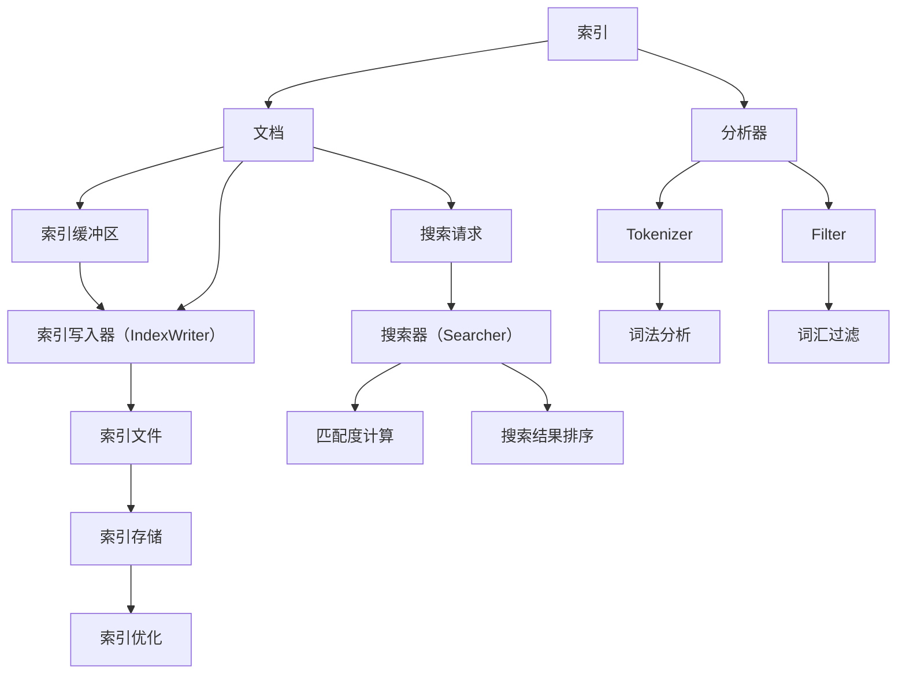

                 

### 《Lucene搜索原理与代码实例讲解》

> **关键词**：Lucene，搜索引擎，索引，分析器，分布式搜索，ES集成

**摘要**：
本文深入剖析了Apache Lucene的搜索原理及其核心组件，通过详尽的代码实例，帮助读者理解并掌握Lucene的用法。文章涵盖了Lucene的起源、核心概念、工作原理，以及索引写入、搜索流程和结果处理等关键环节。此外，文章还探讨了如何自定义分析器、实现分布式搜索、与Elasticsearch集成，并提供了实际项目实战案例，旨在全面提升读者对Lucene的实践应用能力。

---

# 《Lucene搜索原理与代码实例讲解》目录大纲

## 第一部分：Lucene基础

### 第1章：Lucene简介

#### 1.1 Lucene的发展历史

Lucene的起源可以追溯到2000年，由Apache Software Foundation支持。它是一款功能强大的全文搜索引擎库，旨在为开发者提供高效的文本搜索解决方案。

#### 1.2 Lucene的核心概念

- 索引（Index）：Lucene的核心组件，用于存储和检索文本内容。
- 文档（Document）：包含文本内容及其属性的容器。
- 分析器（Analyzer）：将文本分解成可索引的形式。

#### 1.3 Lucene的工作原理

Lucene通过建立索引来实现高效的文本搜索。索引创建和搜索流程如下：

1. **索引创建流程**：
   - 文本预处理：通过分析器将文本分解成词语。
   - 索引写入：将预处理后的词语存储到索引中。

2. **搜索流程**：
   - 搜索请求：用户输入搜索关键词。
   - 搜索查询：将搜索关键词转换成查询语句。
   - 查找匹配文档：搜索器在索引中查找匹配的文档。
   - 匹配度计算：计算每个匹配文档的匹配度，并进行排序。

### 第2章：Lucene核心组件

#### 2.1 索引写入

- **索引器（IndexWriter）**：负责将文档写入索引。
- **索引缓冲区**：用于临时存储待写入的文档。

#### 2.2 索引存储

- **索引文件结构**：包含多个段（Segment），每个段包含一组文档。
- **索引文件读写**：高效读取和写入索引文件。

#### 2.3 索引优化

- **索引优化策略**：合并小段、删除冗余信息。
- **索引段合并**：将多个段合并成一个段，提高搜索性能。

### 第3章：Lucene搜索

#### 3.1 搜索基本原理

- **搜索流程**：理解搜索的基本步骤和核心算法。
- **查询语言**：掌握Lucene的查询语言，构建复杂的查询。

#### 3.2 搜索查询

- **简单查询**：基于关键字进行简单搜索。
- **复杂查询**：使用布尔操作符、范围查询等构建复杂查询。

#### 3.3 搜索结果处理

- **匹配度计算**：使用TF-IDF等算法计算文档匹配度。
- **搜索结果排序**：根据匹配度对搜索结果进行排序。

## 第二部分：Lucene高级应用

### 第4章：自定义分析器

#### 4.1 分析器原理

- **分析器组件**：Tokenizer和Filter的工作原理。
- **分析器工作流程**：文本预处理的具体流程。

#### 4.2 自定义分析器开发

- **Tokenizer开发**：实现自定义的词法分析器。
- **Filter开发**：实现自定义的词汇过滤器。

#### 4.3 分析器优化

- **分析器性能优化**：如何提高分析器的性能。
- **分析器自定义缓存**：如何使用缓存优化分析器。

### 第5章：Lucene分布式搜索

#### 5.1 分布式搜索原理

- **分布式搜索架构**：如何实现分布式搜索。
- **分布式搜索流程**：分布式搜索的基本步骤。

#### 5.2 分布式搜索配置

- **Solr集群搭建**：如何搭建Solr分布式搜索集群。
- **Solr配置详解**：Solr配置文件的详细解析。

#### 5.3 分布式搜索优化

- **负载均衡**：如何实现负载均衡。
- **分布式搜索性能优化**：如何优化分布式搜索性能。

### 第6章：Lucene与ES集成

#### 6.1 ES简介

- **ES核心概念**：Elasticsearch的基本概念。
- **ES架构**：Elasticsearch的架构设计。

#### 6.2 ES与Lucene集成

- **ES索引与Lucene索引对比**：两种索引的异同。
- **ES与Lucene集成方案**：如何将Lucene与Elasticsearch集成。

#### 6.3 ES高级特性

- **ES聚合查询**：Elasticsearch的聚合功能。
- **ES全文搜索**：Elasticsearch的全文搜索能力。

### 第7章：Lucene应用实战

#### 7.1 实战一：搭建简易搜索引擎

- **环境搭建**：搭建Lucene搜索环境。
- **索引创建与查询**：创建索引和执行查询。

#### 7.2 实战二：搭建分布式搜索引擎

- **Solr集群搭建**：搭建Solr分布式搜索集群。
- **分布式搜索实践**：实现分布式搜索。

#### 7.3 实战三：集成ES实现高级搜索

- **ES集成**：将Lucene与Elasticsearch集成。
- **高级搜索功能实现**：实现高级搜索功能。

### 附录

#### 附录A：Lucene常用API参考

- **索引写入API**：详细描述索引写入相关的API。
- **索引查询API**：详细描述索引查询相关的API。
- **分析器API**：详细描述分析器相关的API。

#### 附录B：Lucene源码解读

- **索引创建过程**：分析索引创建的源码实现。
- **搜索查询过程**：分析搜索查询的源码实现。

---

## 核心概念与联系

以下是Lucene的核心概念及其相互关系的Mermaid流程图：



### 索引

索引是Lucene的核心组件，用于存储和检索文本内容。它由多个段（Segment）组成，每个段包含一组相关的文档。索引创建的目的是为了提高搜索效率，通过预先处理文本并将其组织成索引结构，使得搜索操作可以快速定位到相关的文档。

### 文档

文档是Lucene中的基本数据单元，它包含了一组相关的文本内容和属性。文档通过Field来存储不同的文本片段和元数据，如标题、内容、作者等。在索引过程中，文档会被分析器处理，并将其内容转换为索引可用的形式。

### 分析器

分析器是Lucene的重要组成部分，用于将文本分解成可索引的形式。它由Tokenizer（词法分析器）和Filter（词汇过滤器）组成。Tokenizer将原始文本分解成词语，而Filter可以对词语进行进一步的处理，如去除停用词、单词转换等。

### 索引缓冲区

索引缓冲区是IndexWriter在写入索引过程中使用的临时存储区域。它用于存储新创建的文档和修改后的文档，直到这些文档被写入到实际的索引文件中。缓冲区的大小和性能对索引写入速度有重要影响。

### 索引写入器（IndexWriter）

索引写入器（IndexWriter）负责将文档写入到索引中。它通过将文档添加到索引缓冲区，并在适当的时候将缓冲区中的内容写入到索引文件中。IndexWriter提供了多种配置选项，如分析器、合并策略等，以优化索引写入性能。

### 索引缓冲区

索引缓冲区是IndexWriter在写入索引过程中使用的临时存储区域。它用于存储新创建的文档和修改后的文档，直到这些文档被写入到实际的索引文件中。缓冲区的大小和性能对索引写入速度有重要影响。

### 索引存储

索引存储是指将索引文件持久化到磁盘的过程。Lucene使用一系列的文件结构来存储索引，包括段文件、词典文件、倒排索引文件等。这些文件结构的设计旨在提高搜索效率。

### 索引优化

索引优化是指对已建立的索引进行优化，以提高搜索性能。常见的索引优化策略包括合并小段、删除冗余信息等。索引优化通常在后台进行，可以通过设置定时任务或手动触发。

### 搜索请求

搜索请求是指用户输入的搜索关键词或查询语句。Lucene通过解析搜索请求，将其转换为查询对象，并在索引中进行搜索。

### 搜索器（Searcher）

搜索器（Searcher）负责在索引中执行搜索操作。它通过查询对象生成搜索结果，并计算每个匹配文档的匹配度。Searcher提供了多种搜索方法，如精确搜索、模糊搜索等。

### 匹配度计算

匹配度计算是指对搜索结果中的每个文档进行评估，以确定其与搜索请求的相关性。Lucene使用TF-IDF等算法来计算匹配度，并据此对搜索结果进行排序。

### 搜索结果排序

搜索结果排序是指根据匹配度对搜索结果进行排序，以提供用户最有用的结果。Lucene提供了多种排序选项，如按匹配度排序、按时间排序等。

---

## 核心算法原理讲解

### 索引创建过程

以下是使用Java编写的伪代码，描述了Lucene索引创建的过程：

```java
// 初始化分析器
Analyzer analyzer = new StandardAnalyzer();

// 创建索引写入器
IndexWriter indexWriter = new IndexWriter(indexDirectory, new IndexWriterConfig(analyzer));

// 创建文档
Document document = new Document();

// 添加字段到文档
document.add(new TextField("title", "Lucene搜索原理与代码实例讲解", Field.Store.YES));
document.add(new TextField("content", "本书深入讲解了Lucene的搜索原理和代码实例，帮助读者理解并掌握Lucene的使用方法。", Field.Store.YES));

// 向索引中添加文档
indexWriter.addDocument(document);

// 关闭索引写入器
indexWriter.close();
```

### 搜索查询过程

以下是使用Java编写的伪代码，描述了Lucene搜索查询的过程：

```java
// 创建索引搜索器
IndexSearcher indexSearcher = new IndexSearcher(indexReader);

// 创建查询对象
Query query = new TermQuery(new Term("content", "搜索原理"));

// 执行搜索查询
TopDocs topDocs = indexSearcher.search(query, 10);

// 遍历搜索结果
for (ScoreDoc scoreDoc : topDocs.scoreDocs) {
    Document doc = indexSearcher.doc(scoreDoc.doc);
    System.out.println(doc.get("title") + " : " + doc.get("content"));
}
```

### 匹配度计算公式

Lucene使用TF-IDF算法来计算匹配度。以下是TF-IDF匹配度计算公式的详细解释：

$$
score = tf \times idf
$$

其中：
- **tf**（词频，Term Frequency）：表示某个词在文档中出现的次数。
- **idf**（逆文档频率，Inverse Document Frequency）：表示词的重要程度。

公式详细解释如下：

$$
idf = \log_{10}\left(\frac{N}{df}\right)
$$

其中：
- **N**：文档总数。
- **df**（文档频率，Document Frequency）：表示词在索引中出现的文档数量。

举例说明：

假设词 "Lucene" 在文档A中出现了2次，而在索引中的文档总数为1000个。那么：

- **tf(Lucene) = 2**
- **idf(Lucene) = \log_{10}(1000/1) = 3**

则匹配度分数为：

$$
score(Lucene) = 2 \times 3 = 6
$$

通过这个例子，我们可以看到，词频和逆文档频率共同决定了文档的匹配度。词频越高，表示词在文档中的重要性越大；逆文档频率则反映了词在所有文档中的普遍性。

---

## 项目实战

### 实战一：搭建简易搜索引擎

#### 开发环境

- JDK 1.8+
- Maven 3.5+
- Lucene 8.10.1

#### 步骤

1. 创建Maven项目
2. 添加Lucene依赖
3. 编写索引写入器代码
4. 编写搜索查询代码
5. 运行程序，查看搜索结果

#### 代码解读与分析

**索引写入器代码：**

```java
// 引入Lucene相关类
import org.apache.lucene.analysis.standard.StandardAnalyzer;
import org.apache.lucene.document.Document;
import org.apache.lucene.index.IndexWriter;
import org.apache.lucene.index.IndexWriterConfig;
import org.apache.lucene.store.Directory;
import org.apache.lucene.store.FSDirectory;

public class SimpleSearchEngine {
    public static void main(String[] args) throws Exception {
        // 创建索引目录
        Directory indexDirectory = FSDirectory.open(Paths.get("index"));

        // 初始化分析器
        Analyzer analyzer = new StandardAnalyzer();

        // 创建索引写入器
        IndexWriterConfig indexWriterConfig = new IndexWriterConfig(analyzer);
        IndexWriter indexWriter = new IndexWriter(indexDirectory, indexWriterConfig);

        // 创建文档
        Document document = new Document();

        // 添加字段到文档
        document.add(new TextField("title", "Lucene搜索原理与代码实例讲解", Field.Store.YES));
        document.add(new TextField("content", "本书深入讲解了Lucene的搜索原理和代码实例，帮助读者理解并掌握Lucene的使用方法。", Field.Store.YES));

        // 向索引中添加文档
        indexWriter.addDocument(document);

        // 关闭索引写入器
        indexWriter.close();
    }
}
```

这段代码首先创建了一个Maven项目，并添加了Lucene依赖。然后，通过StandardAnalyzer初始化分析器，通过IndexWriterConfig配置索引写入器。接下来，创建了一个Document对象，并添加了两个字段（title和content），最后将文档添加到索引中。

**搜索查询代码：**

```java
// 引入Lucene相关类
import org.apache.lucene.analysis.standard.StandardAnalyzer;
import org.apache.lucene.document.Document;
import org.apache.lucene.index.DirectoryReader;
import org.apache.lucene.index.IndexReader;
import org.apache.lucene.index.Term;
import org.apache.lucene.search.IndexSearcher;
import org.apache.lucene.search.Query;
import org.apache.lucene.search.TermQuery;
import org.apache.lucene.search.TopDocs;
import org.apache.lucene.store.Directory;
import org.apache.lucene.store.FSDirectory;

public class SimpleSearchEngine {
    public static void main(String[] args) throws Exception {
        // 创建索引目录
        Directory indexDirectory = FSDirectory.open(Paths.get("index"));

        // 创建索引搜索器
        IndexReader indexReader = DirectoryReader.open(indexDirectory);
        IndexSearcher indexSearcher = new IndexSearcher(indexReader);

        // 创建查询对象
        Query query = new TermQuery(new Term("content", "搜索原理"));

        // 执行搜索查询
        TopDocs topDocs = indexSearcher.search(query, 10);

        // 遍历搜索结果
        for (ScoreDoc scoreDoc : topDocs.scoreDocs) {
            Document doc = indexSearcher.doc(scoreDoc.doc);
            System.out.println(doc.get("title") + " : " + doc.get("content"));
        }

        // 关闭索引搜索器
        indexReader.close();
    }
}
```

这段代码首先创建了索引搜索器，并通过TermQuery创建了一个基于字段content的查询对象。接下来，执行搜索查询，并遍历搜索结果，打印出每个匹配文档的标题和内容。

#### 环境搭建

1. 创建一个Maven项目
2. 在pom.xml文件中添加Lucene依赖：

```xml
<dependencies>
    <dependency>
        <groupId>org.apache.lucene</groupId>
        <artifactId>lucene-core</artifactId>
        <version>8.10.1</version>
    </dependency>
</dependencies>
```

3. 编写并运行索引写入器和搜索查询代码

通过以上步骤，我们成功搭建了一个简易的Lucene搜索引擎。这个搜索引擎可以添加文档到索引，并根据关键词进行搜索，返回匹配的文档。

---

### 附录

#### 附录A：Lucene常用API参考

Lucene提供了丰富的API用于索引创建、查询和搜索。以下是一些常用的API：

- **索引写入API**：
  - `Document`：表示一个Lucene文档。
  - `TextField`：表示文本字段。
  - `IndexWriter`：用于将文档写入索引。
  - `IndexWriterConfig`：用于配置索引写入器。

- **索引查询API**：
  - `Query`：表示一个查询对象。
  - `TermQuery`：基于单个词语的查询。
  - `IndexSearcher`：用于在索引中执行查询。

- **分析器API**：
  - `Analyzer`：用于将文本转换为索引形式。
  - `Tokenizer`：用于将文本分解成词语。
  - `Filter`：用于对词语进行进一步处理。

#### 附录B：Lucene源码解读

Lucene的源码是理解和学习Lucene技术原理的关键。以下是对Lucene源码中索引创建和搜索查询过程的简要解读：

- **索引创建过程**：

  索引创建过程中，主要通过`IndexWriter`类实现。以下是一个简化版的伪代码：

  ```java
  public class IndexWriter {
      public void addDocument(Document doc) throws IOException {
          // 将文档添加到索引缓冲区
          buffer.add(doc);

          // 当缓冲区达到一定大小后，将缓冲区中的内容写入到索引文件
          flush();
      }

      public void flush() throws IOException {
          // 创建一个新的段文件
          SegmentWriter segmentWriter = createSegmentWriter();

          // 将缓冲区中的文档写入到段文件
          for (Document doc : buffer) {
              segmentWriter.write(doc);
          }

          // 关闭段文件，并更新索引元数据
          segmentWriter.close();
      }
  }
  ```

  在这个过程中，`IndexWriter`使用一个缓冲区（buffer）来存储待写入的文档。当缓冲区达到一定大小后，会通过`SegmentWriter`将缓冲区中的文档写入到新的段文件中。每个段文件包含一组相关的文档，最终这些段文件会被合并成完整的索引。

- **搜索查询过程**：

  搜索查询过程中，主要通过`IndexSearcher`类实现。以下是一个简化版的伪代码：

  ```java
  public class IndexSearcher {
      public TopDocs search(Query query, int n) throws IOException {
          // 根据查询对象生成搜索器
          SearcherManager searcherManager = new SearcherManager(indexReader, false);

          // 执行查询
          TopDocs topDocs = searcherManager.search(query, n);

          // 关闭搜索器管理器
          searcherManager.close();

          return topDocs;
      }
  }
  ```

  在这个过程中，`IndexSearcher`首先根据`IndexReader`生成一个搜索器管理器（`SearcherManager`）。然后，通过搜索器管理器执行查询，并返回搜索结果。搜索结果包含匹配文档的得分和文档ID。

以上是对Lucene源码中索引创建和搜索查询过程的简要解读。通过学习这些源码，可以深入了解Lucene的实现原理，更好地掌握其技术细节。

