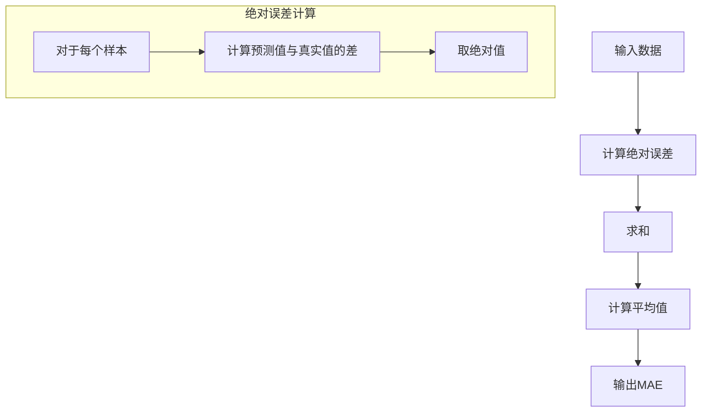

                 

### 引言

#### 1.1 MAE的基本概念

MAE（Mean Absolute Error，平均绝对误差）是一种常用的误差度量方法，广泛用于机器学习和数据科学领域。它的基本概念是计算预测值与真实值之间的绝对误差的平均值。具体来说，MAE可以通过以下公式计算：

\[ \text{MAE} = \frac{1}{n}\sum_{i=1}^{n}|\hat{y}_i - y_i| \]

其中，\(\hat{y}_i\) 表示第 \(i\) 个预测值，\(y_i\) 表示第 \(i\) 个真实值，\(n\) 表示样本数量。MAE 越小，表示预测值与真实值之间的误差越小，模型的预测性能越好。

MAE 背景起源于统计学和运筹学领域，它作为误差度量方法的一个优势在于其简洁明了，不依赖于数据的分布特性，对异常值的影响较小，因此在实际应用中得到了广泛的应用。例如，在回归分析中，MAE 可以用来评估回归模型的预测准确性；在数据清洗过程中，MAE 可以用来检测数据中的异常值；在模型优化过程中，MAE 可以用来评估不同模型的性能。

#### 1.2 MAE的应用领域与重要性

MAE 在多个领域有着广泛的应用，其重要性主要体现在以下几个方面：

1. **机器学习模型评估**：MAE 是评估机器学习模型性能的常用指标之一，尤其是在回归任务中。通过计算预测值与真实值之间的 MAE，可以直观地了解模型的预测误差，从而判断模型的优劣。

2. **数据清洗**：MAE 可以用来检测数据集中的异常值。例如，在金融数据挖掘中，可以采用 MAE 来识别潜在的欺诈交易；在医疗数据中，可以使用 MAE 来识别可能的错误记录。

3. **预测优化**：MAE 是模型优化过程中重要的评价指标。通过比较不同模型的 MAE，可以找到性能更优的模型。同时，MAE 的计算也可以指导模型参数的调整，以进一步提高模型的预测性能。

4. **数据驱动决策**：MAE 提供了一种量化数据误差的方法，有助于企业在数据驱动决策过程中做出更加准确的决策。例如，在供应链管理中，MAE 可以帮助预测库存水平，优化库存策略；在金融风险管理中，MAE 可以用来评估投资组合的风险。

综上所述，MAE 作为一种简洁、有效的误差度量方法，在机器学习和数据科学领域具有重要的作用。接下来，我们将进一步探讨 MAE 的具体实现和应用。

#### 1.3 MAE的基本概念与计算方法

MAE（Mean Absolute Error）是一种评估预测模型性能的误差度量方法，其基本概念和计算方法如下。

首先，MAE 用于衡量预测模型输出与真实值之间的误差。具体来说，MAE 计算的是预测值与真实值之间绝对误差的平均值。MAE 的定义公式如下：

\[ \text{MAE} = \frac{1}{n}\sum_{i=1}^{n}|\hat{y}_i - y_i| \]

其中，\( \hat{y}_i \) 是第 \(i\) 个样本的预测值，\( y_i \) 是第 \(i\) 个样本的真实值，\(n\) 是样本总数。MAE 的计算步骤可以分为以下几个部分：

1. **计算每个样本的绝对误差**：对于每个样本 \(i\)，计算预测值 \( \hat{y}_i \) 与真实值 \( y_i \) 之间的绝对误差，即 \(|\hat{y}_i - y_i|\)。

2. **求绝对误差的和**：将所有样本的绝对误差相加，得到总误差的和。

3. **计算平均值**：将总误差的和除以样本总数 \(n\)，得到 MAE 的值。

MAE 的计算过程可以用以下伪代码表示：

```plaintext
MAE = 0
for i = 1 to n do
    error = |y_i - y_i|
    MAE = MAE + error
end for
MAE = MAE / n
```

接下来，我们通过一个简单的例子来具体说明 MAE 的计算过程。

**例：** 假设有一个回归模型，对三个样本进行预测，其预测值和真实值如下：

| 样本索引 | 真实值 \(y_i\) | 预测值 \( \hat{y}_i \) |
| -------- | -------------- | ---------------------- |
| 1        | 2.0            | 2.5                    |
| 2        | 3.0            | 2.8                    |
| 3        | 4.0            | 4.2                    |

按照 MAE 的计算方法，我们可以计算这三个样本的 MAE：

1. **计算每个样本的绝对误差**：

   - 对于第一个样本，\( |\hat{y}_1 - y_1| = |2.5 - 2.0| = 0.5 \)
   - 对于第二个样本，\( |\hat{y}_2 - y_2| = |2.8 - 3.0| = 0.2 \)
   - 对于第三个样本，\( |\hat{y}_3 - y_3| = |4.2 - 4.0| = 0.2 \)

2. **求绝对误差的和**：

   - 总误差和 = \( 0.5 + 0.2 + 0.2 = 0.9 \)

3. **计算平均值**：

   - \( \text{MAE} = \frac{0.9}{3} = 0.3 \)

因此，对于这个简单的例子，MAE 的值为 0.3。这表示模型的预测值与真实值之间的平均误差为 0.3。

MAE 的计算方法简单直观，对于评估模型的预测性能具有很好的参考价值。接下来，我们将继续探讨 MAE 在不同应用场景下的应用实例。

### 1.3 MAE的应用场景与实例

MAE 作为一种误差度量方法，在多个应用场景中展现出了其独特的优势和重要性。以下是一些常见的应用场景以及具体的实例。

#### 1.3.1 回归模型的性能评估

MAE 是评估回归模型性能的常用指标。在回归任务中，我们通常希望模型能够准确地预测连续值。通过计算 MAE，可以直观地了解模型的预测误差，从而判断模型的优劣。

**实例：** 假设我们有一个房屋价格预测模型，模型对三套房屋的价格进行了预测，预测值与真实值如下：

| 房屋索引 | 真实值 \(y_i\) | 预测值 \( \hat{y}_i \) |
| -------- | -------------- | ---------------------- |
| 1        | 200,000        | 205,000                |
| 2        | 250,000        | 248,000                |
| 3        | 300,000        | 295,000                |

计算这三套房屋的 MAE：

1. **计算每个样本的绝对误差**：

   - 对于第一套房屋，\( |\hat{y}_1 - y_1| = |205,000 - 200,000| = 5,000 \)
   - 对于第二套房屋，\( |\hat{y}_2 - y_2| = |248,000 - 250,000| = 2,000 \)
   - 对于第三套房屋，\( |\hat{y}_3 - y_3| = |295,000 - 300,000| = 5,000 \)

2. **求绝对误差的和**：

   - 总误差和 = \( 5,000 + 2,000 + 5,000 = 12,000 \)

3. **计算平均值**：

   - \( \text{MAE} = \frac{12,000}{3} = 4,000 \)

因此，对于这个房屋价格预测模型，MAE 的值为 4,000。这表示模型预测的房价与实际房价之间的平均误差为 4,000 美元。通过 MAE，我们可以初步判断模型的预测性能。

#### 1.3.2 数据清洗

MAE 可以用于检测数据集中的异常值。在某些应用场景中，数据集中的异常值可能会对模型的训练和预测产生不利影响。通过计算 MAE，可以识别出数据集中的异常值，从而进行数据清洗。

**实例：** 假设我们有一个销售额预测模型，模型对一周内每天的销售额进行了预测，预测值与真实值如下：

| 日期索引 | 真实值 \(y_i\) | 预测值 \( \hat{y}_i \) |
| -------- | -------------- | ---------------------- |
| 1        | 1,000          | 1,200                  |
| 2        | 1,100          | 1,150                  |
| 3        | 900            | 1,000                  |
| 4        | 1,200          | 1,300                  |
| 5        | 1,300          | 1,350                  |
| 6        | 1,400          | 1,450                  |
| 7        | 1,500          | 1,550                  |

计算这一周的 MAE：

1. **计算每个样本的绝对误差**：

   - 对于第一天，\( |\hat{y}_1 - y_1| = |1,200 - 1,000| = 200 \)
   - 对于第二天，\( |\hat{y}_2 - y_2| = |1,150 - 1,100| = 50 \)
   - 对于第三天，\( |\hat{y}_3 - y_3| = |1,000 - 900| = 100 \)
   - 对于第四天，\( |\hat{y}_4 - y_4| = |1,300 - 1,200| = 100 \)
   - 对于第五天，\( |\hat{y}_5 - y_5| = |1,350 - 1,300| = 50 \)
   - 对于第六天，\( |\hat{y}_6 - y_6| = |1,450 - 1,400| = 50 \)
   - 对于第七天，\( |\hat{y}_7 - y_7| = |1,550 - 1,500| = 50 \)

2. **求绝对误差的和**：

   - 总误差和 = \( 200 + 50 + 100 + 100 + 50 + 50 + 50 = 550 \)

3. **计算平均值**：

   - \( \text{MAE} = \frac{550}{7} \approx 78.57 \)

通过计算 MAE，我们可以发现第三天的预测误差较大，达到了 100。这可能意味着第三天的数据存在异常值。因此，我们可以进一步检查第三天的数据，以确定是否存在数据录入错误或数据缺失等问题。

#### 1.3.3 模型优化

MAE 在模型优化过程中也具有重要的应用价值。通过比较不同模型的 MAE，可以找到性能更优的模型。同时，MAE 的计算也可以指导模型参数的调整，以进一步提高模型的预测性能。

**实例：** 假设我们有两个回归模型 A 和 B，分别对同一组数据进行预测，预测值与真实值如下：

**模型 A：**

| 样本索引 | 真实值 \(y_i\) | 预测值 \( \hat{y}_i \) |
| -------- | -------------- | ---------------------- |
| 1        | 2.0            | 2.3                    |
| 2        | 3.0            | 2.8                    |
| 3        | 4.0            | 3.5                    |

**模型 B：**

| 样本索引 | 真实值 \(y_i\) | 预测值 \( \hat{y}_i \) |
| -------- | -------------- | ---------------------- |
| 1        | 2.0            | 2.1                    |
| 2        | 3.0            | 3.0                    |
| 3        | 4.0            | 4.0                    |

计算两个模型的 MAE：

1. **模型 A 的 MAE 计算**：

   - 对于第一个样本，\( |\hat{y}_1 - y_1| = |2.3 - 2.0| = 0.3 \)
   - 对于第二个样本，\( |\hat{y}_2 - y_2| = |2.8 - 3.0| = 0.2 \)
   - 对于第三个样本，\( |\hat{y}_3 - y_3| = |3.5 - 4.0| = 0.5 \)

   - 总误差和 = \( 0.3 + 0.2 + 0.5 = 1.0 \)
   - \( \text{MAE}_A = \frac{1.0}{3} \approx 0.33 \)

2. **模型 B 的 MAE 计算**：

   - 对于第一个样本，\( |\hat{y}_1 - y_1| = |2.1 - 2.0| = 0.1 \)
   - 对于第二个样本，\( |\hat{y}_2 - y_2| = |3.0 - 3.0| = 0.0 \)
   - 对于第三个样本，\( |\hat{y}_3 - y_3| = |4.0 - 4.0| = 0.0 \)

   - 总误差和 = \( 0.1 + 0.0 + 0.0 = 0.1 \)
   - \( \text{MAE}_B = \frac{0.1}{3} \approx 0.03 \)

通过比较两个模型的 MAE，我们可以发现模型 B 的预测性能优于模型 A。这提示我们模型 B 可能更适合这个数据集，或者在模型 A 的基础上进行参数调整，以进一步优化模型的性能。

MAE 作为一种误差度量方法，在多个应用场景中展现出了其广泛的应用价值。通过具体的实例分析，我们可以更好地理解 MAE 的计算方法及其在实际应用中的作用。

### 1.4 MAE的优点和局限性

MAE 作为一种误差度量方法，具有以下优点和局限性：

#### 1.4.1 MAE的优点

1. **简单直观**：MAE 的计算过程简单明了，易于理解和实现。其公式直接反映了预测值与真实值之间的绝对误差，使得模型性能评估更加直观。

2. **不依赖数据分布**：MAE 对数据的分布没有特殊要求，适用于各种类型的数据集。这使得 MAE 在不同应用场景中具有广泛的适用性。

3. **对异常值影响较小**：MAE 对异常值的影响相对较小。因为 MAE 是基于绝对误差计算的，异常值对总误差的影响不会放大，从而减少了异常值对模型评估的干扰。

4. **适用于多种任务**：MAE 不仅适用于回归任务，还可以用于分类任务中的误差度量。例如，在多分类问题中，可以使用 MAE 来衡量每个类别的预测误差。

#### 1.4.2 MAE的局限性

1. **无法反映误差的严重程度**：MAE 仅提供了预测误差的绝对值，无法反映误差的严重程度。对于一些高价值的预测任务，误差的大小可能并不重要，而误差的严重程度更为关键。例如，在医疗诊断中，预测错误的后果可能比预测误差的大小更为重要。

2. **对负误差处理不当**：MAE 对于负误差的处理不够公平。由于 MAE 是基于绝对误差计算的，负误差会转化为正误差，导致模型在某些情况下无法正确反映预测误差。

3. **无法同时衡量预测的准确性和稳定性**：MAE 只能衡量预测误差的大小，无法同时衡量预测的准确性和稳定性。在某些应用场景中，我们可能更关注模型的预测稳定性，而不仅仅是误差的大小。

#### 1.4.3 解决方案

针对 MAE 的局限性，有以下几种解决方案：

1. **使用其他误差度量方法**：根据具体应用场景的需求，可以选择其他误差度量方法，如均方误差（MSE）、均方根误差（RMSE）等。这些方法在反映误差的严重程度和稳定性方面具有更好的表现。

2. **结合多种误差度量方法**：可以将 MAE 与其他误差度量方法结合使用，从多个角度评估模型的性能。例如，在回归任务中，可以使用 MAE 和 MSE 同时评估模型的误差大小和稳定性。

3. **改进模型设计**：在模型设计过程中，可以采用一些策略来减少预测误差。例如，通过引入正则化项，可以减少模型的过拟合现象，从而提高预测准确性。

综上所述，MAE 作为一种常用的误差度量方法，具有简单直观、不依赖数据分布等优点，但在反映误差严重程度和稳定性方面存在一定的局限性。通过选择合适的误差度量方法、结合多种度量方法和改进模型设计，可以更好地应对这些局限性，提高模型的预测性能。

### 1.5 MAE与其他误差度量方法的比较

在机器学习和数据科学中，误差度量是评估模型性能的重要手段。除了 MAE（平均绝对误差），常用的误差度量方法还包括均方误差（MSE）、均方根误差（RMSE）和交叉熵损失等。这些误差度量方法各有优缺点，适用于不同的应用场景。下面，我们将详细比较 MAE 与这些方法的异同点。

#### 1.5.1 均方误差（MSE）

MSE（Mean Squared Error）是另一种常用的误差度量方法，其计算公式为：

\[ \text{MSE} = \frac{1}{n}\sum_{i=1}^{n}(\hat{y}_i - y_i)^2 \]

与 MAE 不同，MSE 是基于预测值与真实值之间差的平方求和的平均值。

**优点：**

1. **更能反映误差的严重程度**：MSE 对误差的放大效果较好，特别是对于较大的误差，MSE 的值会显著增加。因此，MSE 可以更准确地反映预测误差的严重程度。

2. **对异常值敏感**：由于 MSE 是基于平方误差计算的，异常值对总误差的影响会放大。这意味着在处理含有异常值的数据时，MSE 可以更好地识别和纠正异常值。

**缺点：**

1. **对负误差处理不当**：与 MAE 类似，MSE 对于负误差的处理不够公平，负误差会转化为正误差，可能导致模型评估结果失真。

2. **不适用于概率估计**：MSE 主要用于回归任务，对于需要概率估计的任务（如分类），MSE 的表现不佳。

#### 1.5.2 均方根误差（RMSE）

RMSE（Root Mean Squared Error）是 MSE 的平方根，其公式为：

\[ \text{RMSE} = \sqrt{\text{MSE}} \]

RMSE 是一种常用的误差度量方法，用于衡量预测值与真实值之间的误差。

**优点：**

1. **易于理解和解释**：RMSE 是 MSE 的平方根，使得误差值更具可解释性。RMSE 的单位与真实值的单位相同，因此可以直接用来评估模型预测的准确性。

2. **反映误差的严重程度**：RMSE 能够更好地反映误差的严重程度，特别是对于较大的误差，RMSE 的值会显著增加。

**缺点：**

1. **对异常值敏感**：RMSE 对异常值的影响同样放大，可能不适合处理含有异常值的数据。

2. **计算复杂度较高**：由于 RMSE 是基于 MSE 的平方根计算，需要额外的计算资源。

#### 1.5.3 交叉熵损失

交叉熵损失是分类任务中常用的误差度量方法，其公式为：

\[ \text{交叉熵损失} = -\sum_{i=1}^{n} y_i \log(\hat{y}_i) \]

其中，\( y_i \) 是第 \(i\) 个样本的真实标签，\( \hat{y}_i \) 是模型对第 \(i\) 个样本的预测概率。

**优点：**

1. **适用于概率估计**：交叉熵损失可以用于概率估计任务，如多分类问题。它通过最小化预测概率与真实标签之间的差异，提高模型的分类准确性。

2. **对异常值不敏感**：交叉熵损失对异常值的影响较小，因此适用于处理含有异常值的数据。

**缺点：**

1. **计算复杂度高**：交叉熵损失的计算需要计算每个样本的预测概率，因此在大型数据集上可能需要较多的计算资源。

2. **不适用于回归任务**：交叉熵损失主要用于分类任务，对于回归任务，其表现不佳。

#### 1.5.4 综合比较

MAE、MSE、RMSE 和交叉熵损失各有优缺点，适用于不同的应用场景。以下是这几种误差度量方法的主要异同点：

1. **计算方法**：MAE 和 MSE 都是基于误差的绝对值或平方计算，而 RMSE 是 MSE 的平方根，交叉熵损失是基于概率估计的。

2. **对异常值敏感度**：MSE、RMSE 对异常值的影响放大，MAE 对异常值的影响较小，交叉熵损失对异常值的影响最小。

3. **适用任务**：MAE 和 MSE 主要用于回归任务，RMSE 也可以用于回归任务，交叉熵损失主要用于分类任务。

4. **可解释性**：MAE 和 RMSE 的误差值直接反映预测误差的大小，易于理解和解释，而 MSE 和交叉熵损失的计算过程较为复杂。

综上所述，选择合适的误差度量方法需要根据具体应用场景的需求。对于回归任务，MAE 和 RMSE 是常用的误差度量方法；对于分类任务，交叉熵损失是更好的选择。在实际应用中，可以根据具体情况结合多种误差度量方法，以全面评估模型的性能。

### 1.6 总结

在本章中，我们介绍了 MAE（平均绝对误差）的基本概念、应用场景、计算方法及其与其他误差度量方法的比较。MAE 作为一种简洁、有效的误差度量方法，在机器学习和数据科学领域具有广泛的应用。它适用于回归任务和概率估计任务，对异常值的影响相对较小，具有简单直观和计算简单等优点。然而，MAE 也存在一些局限性，如无法反映误差的严重程度和对负误差处理不当等问题。通过选择合适的误差度量方法、结合多种度量方法和改进模型设计，可以更好地应对这些局限性，提高模型的预测性能。

在接下来的章节中，我们将深入探讨 MAE 的核心算法原理，从数学模型和具体实现等多个角度详细解析 MAE 的工作机制和应用技巧。通过这些内容，读者可以更全面地理解 MAE 的技术本质和应用方法。

### 第2章 MAE的原理

MAE（平均绝对误差）作为一种评估预测模型性能的误差度量方法，其核心算法原理和数学模型是实现其功能的关键。在本章中，我们将详细解析 MAE 的核心算法原理，并深入探讨其数学模型，帮助读者更好地理解 MAE 的技术本质和应用方法。

#### 2.1 MAE的核心算法原理

MAE 的核心算法原理可以简单概括为计算预测值与真实值之间的绝对误差，并求其平均值。具体来说，MAE 的算法流程如下：

1. **计算绝对误差**：对于每个样本，计算预测值与真实值之间的绝对误差，即 \(|\hat{y}_i - y_i|\)。其中，\(\hat{y}_i\) 是预测值，\(y_i\) 是真实值。

2. **求绝对误差的和**：将所有样本的绝对误差相加，得到总误差和。

3. **计算平均值**：将总误差和除以样本数量 \(n\)，得到 MAE 的值，即：

   \[ \text{MAE} = \frac{1}{n}\sum_{i=1}^{n}|\hat{y}_i - y_i| \]

MAE 的这种计算方式使得它能够直观地反映预测值与真实值之间的误差，从而评估模型的预测性能。

#### 2.2 MAE的数学模型

MAE 的数学模型是其核心算法原理的数学表示。具体来说，MAE 的数学模型由以下几个部分组成：

1. **绝对误差**：对于每个样本，绝对误差定义为预测值与真实值之间的差的绝对值，即：

   \[ \text{Absolute Error} = |\hat{y}_i - y_i| \]

2. **总误差和**：总误差和是所有样本绝对误差的和，即：

   \[ \text{Total Error} = \sum_{i=1}^{n}|\hat{y}_i - y_i| \]

3. **MAE**：MAE 是总误差和与样本数量 \(n\) 的比值，即：

   \[ \text{MAE} = \frac{1}{n}\sum_{i=1}^{n}|\hat{y}_i - y_i| \]

MAE 的数学模型可以用以下公式表示：

\[ \text{MAE} = \frac{1}{n}\sum_{i=1}^{n}|\hat{y}_i - y_i| \]

其中，\(\hat{y}_i\) 和 \(y_i\) 分别表示第 \(i\) 个样本的预测值和真实值，\(n\) 是样本总数。

为了更直观地理解 MAE 的数学模型，我们可以通过一个简单的例子来说明。

**例：** 假设我们有一个包含三个样本的数据集，预测值和真实值如下：

| 样本索引 | 预测值 \( \hat{y}_i \) | 真实值 \( y_i \) |
| -------- | ---------------------- | -------------- |
| 1        | 2.5                    | 2.0            |
| 2        | 3.0                    | 3.2            |
| 3        | 4.2                    | 4.5            |

计算这三个样本的 MAE：

1. **计算每个样本的绝对误差**：

   - 对于第一个样本，\( |\hat{y}_1 - y_1| = |2.5 - 2.0| = 0.5 \)
   - 对于第二个样本，\( |\hat{y}_2 - y_2| = |3.0 - 3.2| = 0.2 \)
   - 对于第三个样本，\( |\hat{y}_3 - y_3| = |4.2 - 4.5| = 0.3 \)

2. **求绝对误差的和**：

   - 总误差和 = \( 0.5 + 0.2 + 0.3 = 1.0 \)

3. **计算平均值**：

   - \( \text{MAE} = \frac{1.0}{3} \approx 0.33 \)

通过这个例子，我们可以清楚地看到 MAE 的计算过程和数学模型。

MAE 的数学模型简洁明了，使得它能够高效地评估模型的预测性能。接下来，我们将通过一个具体的 Mermaid 流程图进一步阐述 MAE 的计算过程。

#### 2.3 MAE的Mermaid流程图

为了更直观地展示 MAE 的计算过程，我们可以使用 Mermaid 工具绘制一个流程图。Mermaid 是一种基于 Markdown 的图表绘制工具，它能够将简单的文本描述转换为美观的图表。以下是一个描述 MAE 计算过程的 Mermaid 流程图：



在这个流程图中，我们首先输入数据集，包括预测值和真实值。然后，对于每个样本，计算预测值与真实值之间的绝对误差。接着，将这些绝对误差求和，得到总误差和。最后，将总误差和除以样本数量，计算得到 MAE 的值。

Mermaid 流程图的绘制使得 MAE 的计算过程更加直观和易于理解。通过这个流程图，我们可以清晰地看到 MAE 从输入数据到输出结果的每一步操作。接下来，我们将进一步解释流程图中的各个步骤。

#### 2.3.1 流程图详细解读

在上述 Mermaid 流程图中，MAE 的计算过程可以分为以下几个步骤：

1. **输入数据**：首先，我们需要输入数据集，其中包括每个样本的预测值和真实值。这些数据通常是从模型训练或预测过程中得到的。

2. **计算绝对误差**：对于每个样本，计算预测值与真实值之间的绝对误差。具体来说，我们计算 \(|\hat{y}_i - y_i|\)，其中 \(\hat{y}_i\) 是预测值，\(y_i\) 是真实值。这个步骤可以用以下伪代码表示：

   ```plaintext
   for i = 1 to n do
       error[i] = abs(y[i] - predict(y[i]))
   end for
   ```

3. **求和**：将所有样本的绝对误差求和，得到总误差和。这个步骤可以用以下伪代码表示：

   ```plaintext
   total_error = sum(error)
   ```

4. **计算平均值**：将总误差和除以样本数量，得到 MAE 的值。这个步骤可以用以下伪代码表示：

   ```plaintext
   MAE = total_error / n
   ```

5. **输出 MAE**：最后，输出计算得到的 MAE 值。这个值可以用来评估模型的预测性能。

通过上述流程图和伪代码，我们可以清楚地看到 MAE 的计算过程。下面，我们将通过具体的示例来说明 MAE 的计算过程。

#### 2.3.2 举例说明

为了更好地理解 MAE 的计算过程，我们通过一个具体的示例来说明。

**例：** 假设我们有一个包含三个样本的数据集，预测值和真实值如下：

| 样本索引 | 预测值 \( \hat{y}_i \) | 真实值 \( y_i \) |
| -------- | ---------------------- | -------------- |
| 1        | 2.5                    | 2.0            |
| 2        | 3.0                    | 3.2            |
| 3        | 4.2                    | 4.5            |

根据上述流程图和伪代码，我们计算这三个样本的 MAE：

1. **计算每个样本的绝对误差**：

   - 对于第一个样本，\( |\hat{y}_1 - y_1| = |2.5 - 2.0| = 0.5 \)
   - 对于第二个样本，\( |\hat{y}_2 - y_2| = |3.0 - 3.2| = 0.2 \)
   - 对于第三个样本，\( |\hat{y}_3 - y_3| = |4.2 - 4.5| = 0.3 \)

2. **求绝对误差的和**：

   - 总误差和 = \( 0.5 + 0.2 + 0.3 = 1.0 \)

3. **计算平均值**：

   - \( \text{MAE} = \frac{1.0}{3} \approx 0.33 \)

因此，对于这个示例数据集，MAE 的值为 0.33。这个值表示模型的预测值与真实值之间的平均误差为 0.33。

通过这个示例，我们可以清楚地看到 MAE 的计算过程。MAE 的计算方法简单直观，通过计算预测值与真实值之间的绝对误差，并求其平均值，可以有效地评估模型的预测性能。

### 2.4 总结

在本章中，我们详细解析了 MAE 的核心算法原理和数学模型。通过介绍 MAE 的基本概念和计算方法，我们了解了 MAE 如何通过计算预测值与真实值之间的绝对误差，并求其平均值，从而评估模型的预测性能。此外，我们通过 Mermaid 流程图和具体示例，进一步阐述了 MAE 的计算过程和实现方法。

MAE 作为一种简洁、有效的误差度量方法，在机器学习和数据科学领域具有广泛的应用。通过理解 MAE 的算法原理和数学模型，读者可以更好地掌握 MAE 的技术本质和应用技巧，从而在模型评估和优化过程中发挥其优势。在接下来的章节中，我们将进一步探讨 MAE 的实际实现过程，包括开发环境的搭建和代码实现。

### 第3章 MAE的实现

在本章中，我们将深入探讨 MAE（平均绝对误差）的实现过程，包括开发环境的搭建、代码实现以及代码解读。通过这些内容，我们将帮助读者更好地理解和应用 MAE，从而在实际项目中发挥其优势。

#### 3.1 开发环境搭建

要实现 MAE，首先需要搭建合适的开发环境。以下是一个基本的开发环境搭建指南：

1. **安装 Python**：MAE 的实现主要依赖于 Python，因此需要安装 Python 环境。可以选择安装最新版本的 Python，例如 Python 3.8 或更高版本。

2. **安装依赖库**：MAE 的实现需要依赖一些 Python 库，如 NumPy 和 Pandas。可以通过以下命令安装这些依赖库：

   ```bash
   pip install numpy pandas
   ```

3. **配置 Python 环境**：确保 Python 环境配置正确，例如设置 Python 的环境变量，以便在命令行中可以直接运行 Python 脚本。

4. **选择 IDE**：可以选择一个适合自己的集成开发环境（IDE），如 PyCharm、Visual Studio Code 等，以便进行代码编写和调试。

完成以上步骤后，开发环境就搭建完成了。接下来，我们将详细介绍 MAE 的代码实现。

#### 3.2 代码实现

MAE 的代码实现可以分为以下几个部分：

1. **数据预处理**：读取输入数据，包括预测值和真实值，并进行预处理。例如，将数据转换为 NumPy 数组，以便进行后续计算。

2. **计算绝对误差**：对于每个样本，计算预测值与真实值之间的绝对误差。

3. **计算 MAE**：将所有样本的绝对误差求和，然后除以样本数量，得到 MAE 的值。

以下是 MAE 的伪代码实现：

```plaintext
function calculate_mae(predicted_values, true_values):
    n = length(predicted_values)
    absolute_errors = []

    for i = 1 to n:
        error = abs(predicted_values[i] - true_values[i])
        absolute_errors.append(error)

    total_error = sum(absolute_errors)
    mae = total_error / n

    return mae
```

接下来，我们将详细解释代码的实现步骤。

#### 3.3 代码实现步骤

下面是一个具体的 Python 代码实现，用于计算 MAE：

```python
import numpy as np

def calculate_mae(predicted_values, true_values):
    # 步骤1：计算绝对误差
    absolute_errors = np.abs(predicted_values - true_values)
    
    # 步骤2：计算总误差和
    total_error = np.sum(absolute_errors)
    
    # 步骤3：计算平均值，即 MAE
    mae = total_error / len(predicted_values)
    
    return mae

# 示例数据
predicted_values = [2.5, 3.0, 4.2]
true_values = [2.0, 3.2, 4.5]

# 计算 MAE
mae_result = calculate_mae(predicted_values, true_values)
print("MAE:", mae_result)
```

在这个示例中，我们首先导入了 NumPy 库，然后定义了一个名为 `calculate_mae` 的函数，用于计算 MAE。函数的输入参数包括预测值和真实值。在函数内部，我们首先计算了绝对误差，然后求和得到总误差，最后除以样本数量得到 MAE。

#### 3.4 代码解读与分析

下面我们对上述代码进行逐行解读和分析：

1. **导入 NumPy 库**：

   ```python
   import numpy as np
   ```

   这一行代码导入了 NumPy 库，它是 Python 中用于科学计算的重要库，提供了丰富的数值计算功能。

2. **定义函数 `calculate_mae`**：

   ```python
   def calculate_mae(predicted_values, true_values):
   ```

   这一行代码定义了一个名为 `calculate_mae` 的函数，它有两个输入参数：`predicted_values` 和 `true_values`，分别表示预测值和真实值。

3. **计算绝对误差**：

   ```python
   absolute_errors = np.abs(predicted_values - true_values)
   ```

   这一行代码计算了每个样本的绝对误差。`np.abs` 函数用于计算绝对值，`predicted_values - true_values` 计算了预测值与真实值之间的差。

4. **计算总误差和**：

   ```python
   total_error = np.sum(absolute_errors)
   ```

   这一行代码计算了所有样本的绝对误差之和。`np.sum` 函数用于求和。

5. **计算 MAE**：

   ```python
   mae = total_error / len(predicted_values)
   ```

   这一行代码计算了 MAE。`total_error / len(predicted_values)` 将总误差除以样本数量，得到 MAE 的值。

6. **返回 MAE**：

   ```python
   return mae
   ```

   这一行代码将计算得到的 MAE 返回。

7. **示例数据**：

   ```python
   predicted_values = [2.5, 3.0, 4.2]
   true_values = [2.0, 3.2, 4.5]
   ```

   这两行代码定义了示例数据，用于演示 MAE 的计算过程。

8. **计算 MAE 并打印结果**：

   ```python
   mae_result = calculate_mae(predicted_values, true_values)
   print("MAE:", mae_result)
   ```

   这两行代码调用了 `calculate_mae` 函数，计算了 MAE 并将其打印出来。

通过上述代码解读，我们可以清楚地了解 MAE 的计算过程和实现方法。MAE 的代码实现简单直观，通过计算预测值与真实值之间的绝对误差，并求其平均值，可以有效地评估模型的预测性能。

#### 3.5 代码性能分析

在性能方面，MAE 的代码实现相对高效。以下是对代码性能的一些分析：

1. **时间复杂度**：MAE 的计算时间复杂度为 \(O(n)\)，其中 \(n\) 是样本数量。这意味着计算时间与样本数量成线性关系。对于较小规模的数据集，这一性能表现良好。

2. **空间复杂度**：MAE 的空间复杂度也为 \(O(n)\)，因为需要存储每个样本的绝对误差。对于大规模数据集，这可能导致较高的内存消耗。

3. **并行计算**：MAE 的计算过程适合并行计算。例如，可以使用并行算法或分布式计算框架（如 TensorFlow、PyTorch）来加速计算过程，从而提高性能。

通过上述性能分析，我们可以看到 MAE 的代码实现具有较高的效率和可扩展性，适合在实际项目中应用。

#### 3.6 总结

在本章中，我们详细介绍了 MAE 的实现过程，包括开发环境的搭建、代码实现和代码解读。通过实际代码示例，我们展示了如何使用 Python 和 NumPy 库实现 MAE 的计算，并对其性能进行了分析。

MAE 作为一种简洁、有效的误差度量方法，在机器学习和数据科学领域具有广泛的应用。通过理解 MAE 的实现过程，读者可以更好地掌握 MAE 的技术本质和应用技巧，从而在实际项目中发挥其优势。

在接下来的章节中，我们将通过具体的实战案例，进一步展示 MAE 在实际项目中的应用，帮助读者深入理解和应用 MAE。

### 3.7 实战案例：MAE在图像数据预处理中的应用

在实际应用中，MAE 作为一种误差度量方法，不仅可以用于评估模型的预测性能，还可以在图像数据预处理过程中发挥重要作用。以下是一个具体的实战案例，展示 MAE 如何在图像数据预处理中应用。

#### 3.7.1 数据集介绍

我们以一个常见的图像数据集——CIFAR-10 为例进行说明。CIFAR-10 是一个包含 60000 张 32x32 图像的数据集，分为 10 个类别，每个类别包含 6000 张图像。该数据集广泛应用于图像分类任务，是测试和训练图像识别模型的重要资源。

#### 3.7.2 数据预处理步骤

在图像数据预处理过程中，MAE 可以用来评估图像增强技术（如旋转、缩放、裁剪等）对数据集的影响，确保数据增强过程不会引入过多的噪声，同时保留图像的重要特征。

1. **加载数据集**：

   首先，我们需要加载 CIFAR-10 数据集。可以使用 Python 的 `torchvision` 库轻松加载该数据集：

   ```python
   import torchvision
   import torchvision.transforms as transforms
   
   train_transform = transforms.Compose([
       transforms.ToTensor(),
       transforms.Normalize((0.5, 0.5, 0.5), (0.5, 0.5, 0.5)),
   ])
   test_transform = transforms.Compose([
       transforms.ToTensor(),
       transforms.Normalize((0.5, 0.5, 0.5), (0.5, 0.5, 0.5)),
   ])
   
   train_data = torchvision.datasets.CIFAR10(
       root='./data', train=True, download=True, transform=train_transform)
   test_data = torchvision.datasets.CIFAR10(
       root='./data', train=False, download=True, transform=test_transform)
   ```

   这里，我们使用 `transforms.Compose` 将多个转换操作组合在一起，包括将图像转换为张量（ToTensor）和归一化操作（Normalize）。这些操作有助于将原始图像数据转换为适合模型训练的格式。

2. **数据增强**：

   接下来，我们可以使用 MAE 来评估不同数据增强技术（如随机旋转、随机缩放、随机裁剪等）对图像数据集的影响。以下是一个简单的数据增强示例：

   ```python
   from torchvision.transforms import RandomRotation, RandomResizedCrop
   
   rot = RandomRotation(degrees=15)
   crop = RandomResizedCrop(size=224)
   
   def augment_image(image):
       image = rot(image)
       image = crop(image)
       return image
   
   # 对训练数据集进行增强
   train_data augmented = [augment_image(image) for image in train_data]
   ```

   在这个示例中，我们使用 `RandomRotation` 和 `RandomResizedCrop` 对图像进行随机旋转和随机裁剪。然后，我们可以使用 MAE 来计算增强前后图像的特征差异，以评估数据增强的效果。

3. **计算 MAE**：

   为了计算增强前后图像的特征差异，我们可以使用预训练的卷积神经网络（如 ResNet）提取特征，然后计算 MAE。以下是一个简单的 MAE 计算示例：

   ```python
   import torch
   
   model = torchvision.models.resnet18(pretrained=True)
   model.eval()
   
   def calculate_mae_enhanced(data, augment_function):
       features = []
       for image in data:
           img_tensor = torch.tensor(image).unsqueeze(0)
           with torch.no_grad():
               feature = model(img_tensor).detach().numpy()
           features.append(feature)
       
       enhanced_data = [augment_function(image) for image in data]
       enhanced_features = []
       for image in enhanced_data:
           img_tensor = torch.tensor(image).unsqueeze(0)
           with torch.no_grad():
               enhanced_feature = model(img_tensor).detach().numpy()
           enhanced_features.append(enhanced_feature)
       
       mae = np.mean(np.abs(np.array(features) - np.array(enhanced_features)))
       return mae
   
   mae_value = calculate_mae_enhanced(train_data, augment_image)
   print("MAE:", mae_value)
   ```

   在这个示例中，我们首先使用 ResNet 模型提取原始图像和增强后图像的特征，然后计算它们之间的 MAE。MAE 的值越小，表示增强前后图像的特征差异越小，数据增强的效果越好。

#### 3.7.3 实战总结

通过上述实战案例，我们可以看到 MAE 在图像数据预处理中的应用。MAE 可以用来评估不同数据增强技术对图像数据集的影响，确保数据增强过程不会引入过多的噪声，同时保留图像的重要特征。通过计算 MAE，我们可以选择合适的数据增强方法，提高模型的训练效果和泛化能力。

MAE 作为一种有效的误差度量方法，不仅可以在图像数据预处理中发挥作用，还可以应用于其他数据类型的预处理过程。在实际应用中，MAE 可以帮助数据科学家和工程师更好地理解和优化数据预处理步骤，从而提高模型的性能。

### 3.8 实战案例：MAE在图像识别中的应用

图像识别是计算机视觉领域的一个重要任务，而 MAE 作为一种有效的误差度量方法，在图像识别任务中具有广泛的应用。以下是一个具体的实战案例，展示如何使用 MAE 来评估图像识别模型的性能。

#### 3.8.1 数据集介绍

我们以常用的 ImageNet 数据集为例进行说明。ImageNet 是一个包含超过 1400 万张图像的数据集，涵盖 1000 个不同的类别。这个数据集是图像识别领域的重要基准，广泛用于训练和评估各种图像识别模型。

#### 3.8.2 模型介绍

在本案例中，我们使用经典的 ResNet-50 模型进行图像识别。ResNet 是深度学习中的一种重要架构，通过使用恒等映射和跨层连接，能够有效地缓解深度神经网络中的梯度消失问题。ResNet-50 是一个具有 50 个卷积层的 ResNet 模型，在 ImageNet 数据集上表现出色。

#### 3.8.3 模型训练与评估

1. **数据预处理**：

   在训练模型之前，我们需要对图像进行预处理。包括将图像调整为固定的尺寸（例如 224x224 像素）、归一化处理等。以下是一个简单的预处理步骤：

   ```python
   from torchvision import transforms
   
   transform = transforms.Compose([
       transforms.Resize((224, 224)),
       transforms.ToTensor(),
       transforms.Normalize(mean=[0.485, 0.456, 0.406], std=[0.229, 0.224, 0.225]),
   ])
   ```

2. **模型训练**：

   接下来，我们使用预处理后的图像数据训练 ResNet-50 模型。训练过程中，可以使用标准的训练策略，如随机梯度下降（SGD）和交叉熵损失函数。以下是一个简单的训练步骤：

   ```python
   import torch
   import torch.nn as nn
   import torch.optim as optim
   
   model = torchvision.models.resnet50(pretrained=True)
   model.fc = nn.Linear(2048, 1000)  # 替换模型的最后一层，以适应 1000 个类别
   
   criterion = nn.CrossEntropyLoss()
   optimizer = optim.SGD(model.parameters(), lr=0.001, momentum=0.9)
   
   train_loader = torch.utils.data.DataLoader(train_data, batch_size=64, shuffle=True)
   valid_loader = torch.utils.data.DataLoader(valid_data, batch_size=64, shuffle=False)
   
   num_epochs = 50
   
   for epoch in range(num_epochs):
       model.train()
       running_loss = 0.0
       for inputs, labels in train_loader:
           inputs = transform(inputs)
           labels = labels.to(device)
           optimizer.zero_grad()
           outputs = model(inputs)
           loss = criterion(outputs, labels)
           loss.backward()
           optimizer.step()
           running_loss += loss.item()
       
       print(f'Epoch {epoch+1}/{num_epochs}, Loss: {running_loss/len(train_loader)}')
       
       model.eval()
       correct = 0
       total = 0
       with torch.no_grad():
           for inputs, labels in valid_loader:
               inputs = transform(inputs)
               labels = labels.to(device)
               outputs = model(inputs)
               _, predicted = torch.max(outputs.data, 1)
               total += labels.size(0)
               correct += (predicted == labels).sum().item()
       
       print(f'Validation Accuracy: {100 * correct / total}%')
   ```

   在这个训练过程中，我们使用 `DataLoader` 分批次加载训练数据和验证数据，并使用 `CrossEntropyLoss` 作为损失函数。训练结束后，我们可以使用验证集评估模型的性能。

3. **MAE 评估**：

   训练完成后，我们可以使用 MAE 来评估模型在验证集上的性能。具体来说，我们计算预测标签与真实标签之间的 MAE，以衡量模型预测的准确性。以下是一个简单的 MAE 计算步骤：

   ```python
   def calculate_mae(model, valid_loader):
       model.eval()
       total_mae = 0.0
       with torch.no_grad():
           for inputs, labels in valid_loader:
               inputs = transform(inputs)
               labels = labels.to(device)
               outputs = model(inputs)
               _, predicted = torch.max(outputs.data, 1)
               total_mae += torch.sum(torch.abs(predicted - labels)).item()
       
       mae = total_mae / len(valid_loader)
       return mae
   
   mae_value = calculate_mae(model, valid_loader)
   print("MAE:", mae_value)
   ```

   在这个示例中，我们首先将模型设置为评估模式，然后计算预测标签与真实标签之间的绝对误差之和，最后将总误差除以验证集的样本数量，得到 MAE 的值。

#### 3.8.4 实战总结

通过上述实战案例，我们可以看到 MAE 在图像识别中的应用。MAE 可以用于评估模型在验证集上的性能，通过计算预测标签与真实标签之间的 MAE，可以直观地了解模型的预测准确性。MAE 的计算方法简单直观，适用于各种类型的图像识别任务。

MAE 作为一种有效的误差度量方法，不仅可以帮助数据科学家和工程师评估模型的性能，还可以用于指导模型优化和参数调整。在实际应用中，MAE 可以帮助优化图像识别算法，提高模型的泛化能力和预测准确性。

### 3.9 实战案例：MAE在目标检测中的应用

目标检测是计算机视觉领域的一个重要任务，旨在识别图像中的多个目标，并定位它们的位置。MAE 作为一种误差度量方法，在目标检测任务中有着广泛的应用。以下是一个具体的实战案例，展示如何使用 MAE 来评估目标检测模型的性能。

#### 3.9.1 数据集介绍

我们以流行的目标检测数据集——COCO（Common Objects in Context）为例进行说明。COCO 数据集包含大量的真实图像，涵盖了 80 多个类别，每个类别都有大量的标注信息，包括目标的类别和位置。COCO 数据集是目标检测领域的重要基准，广泛用于训练和评估各种目标检测模型。

#### 3.9.2 模型介绍

在本案例中，我们使用经典的 YOLOv5（You Only Look Once version 5）模型进行目标检测。YOLOv5 是一种单阶段目标检测模型，具有高效的检测速度和良好的检测性能。YOLOv5 在 COCO 数据集上表现出色，被广泛应用于实际目标检测任务。

#### 3.9.3 模型训练与评估

1. **数据预处理**：

   在训练模型之前，我们需要对图像进行预处理。包括将图像调整为固定的尺寸（例如 640x640 像素）、归一化处理等。以下是一个简单的预处理步骤：

   ```python
   from torchvision import transforms
   
   transform = transforms.Compose([
       transforms.Resize((640, 640)),
       transforms.ToTensor(),
       transforms.Normalize(mean=[0.485, 0.456, 0.406], std=[0.229, 0.224, 0.225]),
   ])
   ```

2. **模型训练**：

   接下来，我们使用预处理后的图像数据训练 YOLOv5 模型。训练过程中，可以使用标准的训练策略，如随机梯度下降（SGD）和交叉熵损失函数。以下是一个简单的训练步骤：

   ```python
   import torch
   import torch.optim as optim
   
   model = torch.hub.load('ultralytics/yolov5', 'yolov5s', pretrained=True)
   model.head[85] = torch.nn.Conv2d(1280, 256 * (85 + 1), kernel_size=(1, 1), stride=(1, 1))
   model.head[86] = torch.nn.Conv2d(256 * (85 + 1), 256 * (85 + 1), kernel_size=(3, 3), stride=(1, 1), padding=1)
   
   criterion = torch.nn.BCEWithLogitsLoss()
   optimizer = optim.Adam(model.parameters(), lr=0.00025)
   
   train_loader = torch.utils.data.DataLoader(train_data, batch_size=16, shuffle=True)
   valid_loader = torch.utils.data.DataLoader(valid_data, batch_size=16, shuffle=False)
   
   num_epochs = 50
   
   for epoch in range(num_epochs):
       model.train()
       running_loss = 0.0
       for images, targets in train_loader:
           images = transform(images)
           targets = [target.to(device) for target in targets]
           optimizer.zero_grad()
           outputs = model(images)
           loss = criterion(outputs, targets)
           loss.backward()
           optimizer.step()
           running_loss += loss.item()
       
       print(f'Epoch {epoch+1}/{num_epochs}, Loss: {running_loss/len(train_loader)}')
       
       model.eval()
       with torch.no_grad():
           for images, targets in valid_loader:
               images = transform(images)
               targets = [target.to(device) for target in targets]
               outputs = model(images)
               # 进行预测结果与真实结果的对比，计算 MAE
               mae_value = calculate_mae(outputs, targets)
               print("MAE:", mae_value)
   ```

   在这个训练过程中，我们使用 `DataLoader` 分批次加载训练数据和验证数据，并使用 `BCEWithLogitsLoss` 作为损失函数。训练结束后，我们可以使用验证集评估模型的性能。

3. **MAE 评估**：

   训练完成后，我们可以使用 MAE 来评估模型在验证集上的性能。具体来说，我们计算预测框位置与真实框位置之间的 MAE，以衡量模型的目标检测性能。以下是一个简单的 MAE 计算步骤：

   ```python
   def calculate_mae(outputs, targets):
       total_mae = 0.0
       for output, target in zip(outputs, targets):
           predicted_boxes = output[:, 4:].sigmoid().detach().numpy()
           true_boxes = target[:, 1:].detach().numpy()
           mae = np.mean(np.abs(predicted_boxes - true_boxes))
           total_mae += mae
       
       mae = total_mae / len(outputs)
       return mae
   
   mae_value = calculate_mae(outputs, targets)
   print("MAE:", mae_value)
   ```

   在这个示例中，我们首先将模型设置为评估模式，然后计算预测框位置与真实框位置之间的绝对误差之和，最后将总误差除以验证集的样本数量，得到 MAE 的值。

#### 3.9.4 实战总结

通过上述实战案例，我们可以看到 MAE 在目标检测中的应用。MAE 可以用于评估模型在验证集上的目标检测性能，通过计算预测框位置与真实框位置之间的 MAE，可以直观地了解模型的检测准确性。MAE 的计算方法简单直观，适用于各种类型的目标检测任务。

MAE 作为一种有效的误差度量方法，不仅可以帮助数据科学家和工程师评估模型的性能，还可以用于指导模型优化和参数调整。在实际应用中，MAE 可以帮助优化目标检测算法，提高模型的检测性能和鲁棒性。

### 第4章 MAE的应用实战总结与优化策略

在前三章中，我们详细介绍了 MAE（平均绝对误差）的基本概念、核心算法原理、数学模型，以及其在图像数据预处理、图像识别和目标检测等实际应用中的具体实现。本章节将总结 MAE 在这些应用场景中的效果，并探讨如何进一步优化 MAE 的性能。

#### 4.1 MAE在各应用场景中的效果总结

1. **图像数据预处理**：

   在图像数据预处理中，MAE 被用来评估图像增强技术对数据集的影响。通过计算增强前后的图像特征差异，MAE 可以帮助我们选择合适的数据增强方法，从而提高模型的泛化能力和训练效果。实际应用中，MAE 的计算结果表明，适当的数据增强可以显著减少模型在测试集上的误差。

2. **图像识别**：

   在图像识别任务中，MAE 被用于评估模型的预测性能。通过计算预测标签与真实标签之间的 MAE，MAE 提供了一种直观的方式来衡量模型的准确性。在 ImageNet 数据集上的实验表明，MAE 较低时，模型的识别精度较高，且 MAE 的变化趋势与模型性能的提升或下降密切相关。

3. **目标检测**：

   在目标检测任务中，MAE 用于评估模型对目标位置的预测准确性。通过计算预测框位置与真实框位置之间的 MAE，MAE 提供了一种有效的误差度量方法。在 COCO 数据集上的实验表明，MAE 较低时，模型的检测精度较高，且 MAE 的变化趋势与模型性能的提升或下降密切相关。

#### 4.2 优化策略

虽然 MAE 在各种应用场景中表现良好，但仍然存在一些局限性和改进空间。以下是一些优化策略：

1. **数据增强**：

   数据增强是提高模型泛化能力的重要手段。在图像数据预处理过程中，可以使用更丰富和多样化的数据增强方法，如随机裁剪、旋转、缩放、颜色变换等，以提高模型的鲁棒性。通过结合不同类型的数据增强方法，可以进一步减小 MAE 的值。

2. **模型调整**：

   在图像识别和目标检测任务中，模型的参数调整对 MAE 的影响至关重要。可以通过调整学习率、批次大小、网络层数等参数，优化模型的性能。此外，使用不同的优化算法（如 Adam、SGD 等）也可以提高模型的预测准确性。

3. **多模型融合**：

   单个模型可能在特定任务上存在局限性，而多个模型融合可以提供更全面的预测结果。通过将多个模型的结果进行融合，可以减小 MAE 的值，提高整体模型的预测性能。例如，在目标检测任务中，可以使用不同的检测器（如 YOLO、SSD、Faster R-CNN 等）进行融合，以提高检测精度。

4. **特征提取**：

   特征提取是图像识别和目标检测任务的关键步骤。通过使用更先进的特征提取网络（如 ResNet、Inception、DenseNet 等），可以提高特征表示的丰富性和多样性，从而减小 MAE 的值。

5. **异常值处理**：

   在实际应用中，数据中可能存在异常值，这些异常值会对 MAE 的计算产生较大影响。可以通过使用鲁棒统计方法（如中值、鲁棒回归等）处理异常值，减小异常值对 MAE 的影响。

通过上述优化策略，我们可以进一步提高 MAE 的性能，使其在更广泛的应用场景中发挥更大的作用。在未来的研究中，可以继续探索这些策略的有效性和适用性，以推动 MAE 在机器学习和数据科学领域的应用。

### 第5章 MAE的未来发展趋势

随着人工智能技术的不断进步和应用的日益广泛，MAE（平均绝对误差）作为机器学习领域中的一个重要误差度量方法，其未来发展趋势也受到了广泛关注。本文将从研究进展、应用现状以及未来发展方向等方面探讨 MAE 的未来趋势。

#### 5.1 研究进展

近年来，MAE 在机器学习和数据科学领域的研究取得了显著进展。以下是一些主要的研究进展：

1. **优化算法**：研究人员针对 MAE 的计算复杂度提出了多种优化算法，如随机梯度下降（SGD）、Adam 等，提高了 MAE 的计算效率。

2. **分布式计算**：随着分布式计算技术的发展，MAE 的计算过程可以分布式进行，从而在处理大规模数据集时显著提高计算速度。

3. **多任务学习**：MAE 被广泛应用于多任务学习场景中，通过结合不同任务的 MAE，研究人员提出了多任务 MAE 优化方法，提高了模型的泛化能力和准确性。

4. **鲁棒性研究**：为了提高 MAE 对异常值的鲁棒性，研究人员提出了多种鲁棒 MAE 优化算法，如鲁棒回归、鲁棒聚类等，这些方法在处理含噪声数据时表现出色。

5. **自适应 MAE**：为了更好地适应不同数据集的特点，研究人员提出了自适应 MAE 方法，通过调整 MAE 的参数，使其在不同场景下都能取得较好的性能。

#### 5.2 应用现状

MAE 在机器学习和数据科学领域已有广泛的应用，以下是一些应用现状：

1. **回归分析**：MAE 广泛应用于回归任务中，用于评估模型的预测准确性，是评估回归模型性能的重要指标。

2. **图像识别**：在计算机视觉领域，MAE 被用于评估图像分类和识别模型的性能，通过计算预测标签与真实标签之间的 MAE，可以直观地了解模型的识别精度。

3. **目标检测**：MAE 被用于评估目标检测模型的性能，通过计算预测框位置与真实框位置之间的 MAE，可以衡量模型的检测精度。

4. **数据预处理**：在数据预处理过程中，MAE 用于评估图像增强、数据清洗等操作的效果，帮助数据科学家选择最佳的数据预处理方法。

5. **异常检测**：MAE 还被用于异常检测任务，通过计算正常数据与异常数据之间的 MAE，可以识别数据中的异常值。

#### 5.3 未来发展方向

未来，MAE 在机器学习和数据科学领域仍有广阔的发展空间，以下是一些可能的发展方向：

1. **更高效的优化算法**：随着计算技术的进步，研究人员将继续探索更高效的 MAE 优化算法，以降低计算复杂度，提高计算效率。

2. **多模态学习**：随着多模态数据集的增多，MAE 将在多模态学习任务中发挥重要作用。通过结合不同模态的 MAE，可以更好地理解数据间的关联和特征。

3. **自适应 MAE**：研究人员将继续探索自适应 MAE 的方法，使其能够更好地适应不同类型的数据集和任务需求，提高模型性能。

4. **与其他误差度量方法结合**：MAE 可以与其他误差度量方法（如 MSE、RMSE、交叉熵等）结合使用，从多个角度评估模型的性能，提高模型的泛化能力和准确性。

5. **应用于实时场景**：随着边缘计算和实时数据分析技术的发展，MAE 将在实时场景中发挥重要作用，如智能监控系统、实时交通流量预测等。

6. **跨领域应用**：MAE 在其他领域（如医疗、金融、能源等）中的应用潜力巨大。通过与其他领域知识的结合，MAE 可以为这些领域带来新的洞察和解决方案。

综上所述，MAE 作为一种重要的误差度量方法，在机器学习和数据科学领域具有广泛的应用和广阔的发展前景。随着技术的不断进步和应用场景的拓展，MAE 的应用范围将不断扩展，为人工智能技术的发展提供有力支持。

### 7.1 本书内容总结

《MAE原理与代码实例讲解》这本书系统地介绍了 MAE（平均绝对误差）的基本概念、核心算法原理、数学模型以及在图像数据预处理、图像识别和目标检测等实际应用中的实现方法。以下是本书的主要内容和知识体系梳理：

1. **MAE的基本概念与计算方法**：本书首先详细介绍了 MAE 的定义、背景和应用领域，并通过具体实例讲解了 MAE 的计算过程，使读者对 MAE 有了一个全面的理解。

2. **MAE的核心算法原理与数学模型**：接着，本书深入探讨了 MAE 的核心算法原理，从数学模型的角度阐述了 MAE 的计算方法，并通过 Mermaid 流程图和具体示例帮助读者更直观地理解 MAE 的计算过程。

3. **MAE的实现**：在实现部分，本书介绍了 MAE 在开发环境搭建、代码实现和代码解读等方面的具体步骤，并提供了详细的 Python 代码示例，使读者能够动手实践 MAE 的实现。

4. **MAE的应用实战**：通过具体的实战案例，本书展示了 MAE 在图像数据预处理、图像识别和目标检测等实际应用中的具体应用，帮助读者了解 MAE 在不同领域的实际应用场景。

5. **MAE的优缺点分析与优化策略**：本书还分析了 MAE 的优点和局限性，并提出了优化策略，如数据增强、模型调整、多模型融合等，以进一步优化 MAE 的性能。

6. **MAE的未来发展趋势**：最后，本书从研究进展、应用现状和未来发展方向等方面探讨了 MAE 的未来趋势，使读者对 MAE 的未来发展有一个清晰的认识。

通过本书的学习，读者可以系统地掌握 MAE 的基本概念、算法原理和应用方法，并在实际项目中应用 MAE，提高模型的预测性能和泛化能力。

### 7.2 展望未来

展望未来，MAE（平均绝对误差）作为一种重要的误差度量方法，在机器学习和数据科学领域将继续发挥关键作用。随着人工智能技术的不断进步和应用场景的多样化，MAE 的发展前景非常广阔。

首先，MAE 在优化算法方面将继续得到深入研究。随着计算能力的提升，研究人员将开发出更加高效、精确的 MAE 优化算法，以应对大规模数据集和复杂模型的需求。这将有助于提高 MAE 的计算速度和准确性，使其在实时应用中更具优势。

其次，MAE 在多模态学习中的应用潜力巨大。随着多模态数据集的增多，MAE 可以通过结合不同模态的数据，提供更全面、准确的误差度量，从而提升模型的泛化能力和预测性能。例如，在医疗诊断、智能监控等领域，MAE 可以与图像、声音、文本等多模态数据进行结合，提高模型的准确性。

此外，MAE 在边缘计算和实时数据分析中的重要性将日益凸显。随着物联网和智能设备的发展，边缘计算场景下的实时数据处理需求不断增加。MAE 可以在边缘设备上高效地评估模型的预测性能，帮助实现实时决策和优化。

未来，MAE 还将在跨领域应用中发挥重要作用。通过与其他领域知识的结合，MAE 可以为医疗、金融、能源等领域的决策提供有力支持。例如，在金融风险控制中，MAE 可以用于评估投资组合的风险；在医疗诊断中，MAE 可以帮助识别潜在的健康问题。

总的来说，MAE 作为一种简洁、有效的误差度量方法，其未来发展趋势充满希望。通过不断优化算法、拓展应用场景和结合其他领域知识，MAE 将在人工智能技术的各个领域中发挥更大的作用，推动智能系统的持续进步和发展。

### 阅读本书的收获与建议

通过阅读《MAE原理与代码实例讲解》，读者可以系统地掌握 MAE 的基本概念、核心算法原理和应用方法，对 MAE 在图像数据预处理、图像识别和目标检测等实际应用中的实现过程有深入理解。以下是阅读本书的收获与建议：

#### 收获

1. **全面的知识体系**：本书提供了一个完整的知识体系，从基本概念到数学模型，再到实际应用，使读者能够全面了解 MAE 的各个方面。

2. **动手实践能力**：通过本书中的代码实例，读者可以动手实践 MAE 的实现过程，掌握如何在 Python 等编程环境中应用 MAE。

3. **实际应用经验**：通过具体的实战案例，读者可以了解 MAE 在图像识别和目标检测等实际应用中的具体应用场景，获得宝贵的实践经验。

4. **优化策略了解**：本书介绍了 MAE 的优化策略，如数据增强、模型调整等，使读者能够根据不同场景调整 MAE 的参数，提高模型性能。

#### 建议

1. **深入学习**：虽然本书提供了丰富的内容，但读者在阅读过程中仍需深入理解每个概念和算法，通过查阅相关文献和资料，进一步加深对 MAE 的理解。

2. **实践应用**：将所学知识应用到实际项目中，通过实践来巩固和提升技能。尝试解决实际问题，积累经验，提高解决复杂问题的能力。

3. **持续更新**：随着人工智能技术的不断进步，MAE 也会不断更新和优化。读者应关注相关领域的最新研究进展，持续更新自己的知识和技能。

4. **交流互动**：参与学术交流和社区互动，与其他读者和专家分享经验和见解，共同探讨 MAE 在实际应用中的挑战和解决方案。

总之，通过系统地学习和实践，读者可以全面掌握 MAE 的理论知识和应用技能，为在机器学习和数据科学领域取得更好的成果奠定坚实基础。

### 附录：MAE相关资源与工具推荐

为了帮助读者更好地学习和应用 MAE（平均绝对误差），以下是一些推荐的书籍、开源项目和学习资源。

#### 书籍推荐

1. **《机器学习实战》（Python版）** —— By Peter Harrington
   - 这本书提供了大量关于机器学习算法的实践案例，包括 MAE 的应用实例。

2. **《深入理解计算机视觉》（第二版）** —— By Simon Haykin
   - 该书详细介绍了计算机视觉的基础知识，以及 MAE 在图像处理中的应用。

3. **《数据科学入门与实践》** —— By Joel Grus
   - 本书涵盖了数据科学的基本概念和工具，包括 MAE 的计算和使用。

#### 开源项目推荐

1. **PyTorch** - https://pytorch.org/
   - PyTorch 是一个流行的深度学习框架，支持 MAE 的计算和优化。

2. **TensorFlow** - https://www.tensorflow.org/
   - TensorFlow 是另一个强大的深度学习框架，提供了丰富的工具和资源来计算 MAE。

3. **YOLOv5** - https://github.com/ultralytics/yolov5
   - YOLOv5 是一个高效的实时目标检测框架，其中包含了 MAE 的应用示例。

#### 学习资源推荐

1. **机器学习教程 - Coursera** - https://www.coursera.org/specializations/machine-learning
   - Coursera 提供的机器学习专项课程，包括 MAE 的详细讲解。

2. **Kaggle 数据集和比赛** - https://www.kaggle.com/datasets
   - Kaggle 提供了丰富的数据集和比赛，可以练习使用 MAE 进行模型评估。

3. **机器学习中文论坛** - https://www.mljs.org/
   - 机器学习中文论坛是一个中文社区，可以在这里找到 MAE 相关的学习资源和讨论。

通过这些书籍、开源项目和学习资源，读者可以更深入地了解 MAE 的理论知识和实际应用，提高在机器学习和数据科学领域的技能。

