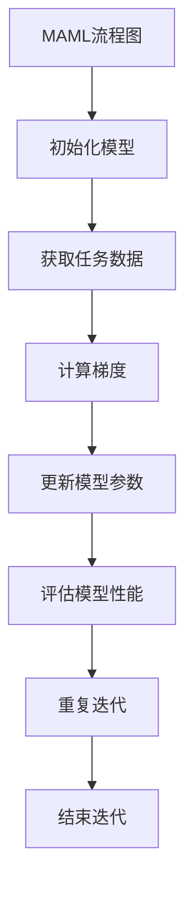
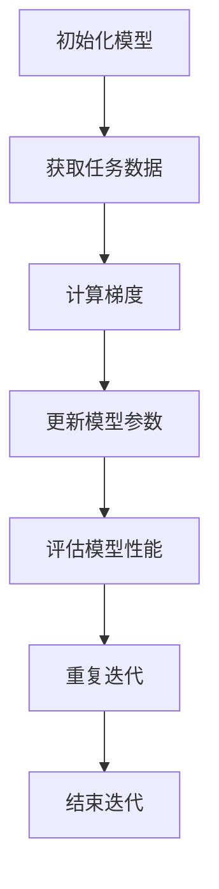

                 

### 文章标题

《MAML原理与代码实例讲解》

### 关键词

- MAML
- 元学习
- 深度学习
- 快速适应
- 算法优化

### 摘要

本文深入探讨了MAML（Model-Agnostic Meta-Learning）的原理、核心概念、架构以及数学基础，通过详细的伪代码、流程图和数学公式讲解，帮助读者理解MAML的工作机制。随后，文章通过实际项目案例展示了MAML的代码实现和实战应用，分析了MAML在具体任务中的性能和优化策略。最后，文章总结了MAML在当前研究中的挑战和未来的发展趋势，为读者提供了全面而深入的MAML知识体系。

### 《MAML原理与代码实例讲解》目录大纲

## 第一部分：MAML基础理论

### 第1章：MAML概述

#### 1.1 MAML的定义与意义

#### 1.2 MAML与传统元学习的区别

#### 1.3 MAML的应用场景

### 第2章：MAML核心概念与架构

#### 2.1 MAML的基本原理

#### 2.2 MAML的架构设计

#### 2.3 MAML的关键参数与超参数

### 第3章：MAML的数学基础

#### 3.1 函数表示与优化

#### 3.2 矩阵运算与梯度计算

#### 3.3 拉格朗日乘数法与优化问题转化

### 第4章：MAML的变体与改进

#### 4.1 MAML的变体

#### 4.2 MAML的改进方法

#### 4.3 MAML与其他元学习方法的对比

## 第二部分：MAML实践与应用

### 第5章：MAML算法实现

#### 5.1 实现MAML的基础框架

#### 5.2 MAML算法的伪代码与步骤

#### 5.3 MAML算法的实现细节

### 第6章：MAML项目实战

#### 6.1 MAML项目环境搭建

#### 6.2 MAML代码实例分析

#### 6.3 MAML项目优化与调参

### 第7章：MAML在实际应用中的挑战与解决方案

#### 7.1 MAML在实际应用中遇到的问题

#### 7.2 MAML的解决方案与优化策略

#### 7.3 MAML的未来发展趋势

## 第三部分：附录

### 第8章：MAML相关资源与工具

#### 8.1 MAML相关论文与资料

#### 8.2 MAML常用的工具与库

#### 8.3 MAML的学习路径与资源推荐

### 附录A：MAML流程图



### 附录B：MAML算法伪代码

```python
# MAML算法伪代码

Initialize model parameters θ
for task in tasks do
    Sample a batch of samples (x, y) from the task
    Compute the gradient of the loss function L(θ, x, y)
    Update the model parameters θ <- θ - α * gradient
end for
Compute the final performance of the model on a test set
return θ
```

### 附录C：MAML数学模型与公式

$$
\frac{\partial L(\theta)}{\partial \theta} = \frac{\partial}{\partial \theta} \left( \sum_{i=1}^{n} \left( y_i - \theta^T x_i \right)^2 \right)
$$

### 附录D：MAML项目实战案例

#### 8.1.1 实战一：手写数字识别

#### 8.1.2 实战二：图像分类

#### 8.1.3 实战三：文本分类

### 附录E：MAML代码实现与分析

#### 8.2.1 案例一：基于PyTorch的MAML实现

#### 8.2.2 案例二：基于TensorFlow的MAML实现

#### 8.2.3 案例三：基于MXNet的MAML实现

## 第一部分：MAML基础理论

### 第1章：MAML概述

#### 1.1 MAML的定义与意义

MAML（Model-Agnostic Meta-Learning）是一种在元学习（Meta-Learning）领域受到广泛关注的技术，旨在通过少量数据快速适应新任务。元学习是一种机器学习方法，旨在通过学习如何学习来提高模型的泛化能力。MAML则是其中一种重要的策略，其核心思想是训练一个模型，使其在经历少量数据更新后能够快速适应新的任务。

MAML的定义可以归纳为：一种能够通过一次迭代或极少数次迭代，从一个任务快速迁移到另一个任务的学习方法。其意义在于：

1. **减少训练数据需求**：在传统机器学习中，一个模型通常需要大量数据来训练以达到良好的性能。然而，在许多实际应用场景中，数据获取可能非常困难或者成本高昂。MAML允许模型通过少量数据快速适应新任务，从而降低了数据获取的门槛。
2. **提高泛化能力**：通过在元学习过程中学习如何适应不同任务，MAML模型能够更好地泛化到未见过的任务，从而提高了模型的实用性。
3. **加速模型迭代**：在开发复杂模型时，往往需要多次迭代来优化模型性能。MAML可以通过快速适应新任务来加速模型迭代过程，从而提高开发效率。

总之，MAML是一种通过少量数据快速适应新任务的重要技术，具有广泛的应用前景和理论价值。

#### 1.2 MAML与传统元学习的区别

为了深入理解MAML，有必要首先了解传统元学习的一些基本概念。传统元学习主要分为基于样本的元学习和基于模型的元学习两大类。基于样本的元学习（如模型无关的适应，Model-Agnostic Meta-Learning, MAML）和基于模型的元学习（如模型特定的适应，Model-Specific Meta-Learning）在方法上有所不同。

1. **基于样本的元学习**：
   - **方法**：这种方法主要通过在多个任务上训练模型，并利用模型在不同任务上的表现来学习如何适应新任务。
   - **优势**：能够通过多个任务的联合训练，提高模型的泛化能力。
   - **劣势**：通常需要大量训练数据来确保模型在不同任务上的表现，否则可能过度拟合单一任务。

2. **基于模型的元学习**：
   - **方法**：这种方法关注于优化模型本身，使其能够快速适应新任务。
   - **优势**：通过优化模型结构，可以提高模型在少量数据上的适应能力。
   - **劣势**：模型结构的优化可能依赖于特定的任务，导致模型的泛化能力受到限制。

MAML作为基于样本的元学习的一种，与传统元学习的区别主要体现在以下几个方面：

1. **适应速度**：
   - **传统元学习**：通常需要多个迭代周期来适应新任务，因为模型需要在多个任务上逐渐学习。
   - **MAML**：通过一次或极少数次的迭代，MAML模型就能在新任务上表现出良好的性能，其适应速度远快于传统元学习方法。

2. **数据需求**：
   - **传统元学习**：需要大量数据来确保模型在不同任务上的适应能力。
   - **MAML**：仅需要少量数据，因为MAML的核心思想是通过少量的数据更新来快速调整模型参数。

3. **模型优化方式**：
   - **传统元学习**：通常通过在多个任务上的联合训练来优化模型。
   - **MAML**：通过计算梯度并更新模型参数，使得模型能够快速适应新任务。

综上所述，MAML通过其快速适应能力和较少的数据需求，在元学习领域具有独特的优势，与传统元学习方法存在显著的区别。

#### 1.3 MAML的应用场景

MAML作为一种高效的元学习方法，在多种应用场景中显示出其强大的适应能力和潜力。以下是一些典型的MAML应用场景：

1. **移动设备**：
   - **背景**：移动设备通常受到计算资源、存储空间和网络带宽的限制，无法像服务器端一样处理大量数据。
   - **应用**：MAML可以在移动设备上实现快速适应新任务，从而实现智能应用，如移动机器人、增强现实（AR）和移动健康监测等。

2. **边缘计算**：
   - **背景**：边缘计算通过在靠近数据源的设备上处理数据，降低了数据传输延迟和网络负载。
   - **应用**：MAML在边缘计算环境中能够有效利用本地数据，快速适应新任务，提高边缘设备的智能水平，如智能家居控制、工业自动化和自动驾驶等。

3. **机器人学**：
   - **背景**：机器人通常需要在复杂的动态环境中执行各种任务。
   - **应用**：MAML可以用于机器人快速适应新环境和新任务，从而提高机器人的灵活性和自主性，如自动驾驶汽车、无人机和机器人手术等。

4. **医疗诊断**：
   - **背景**：医疗诊断任务通常需要大量的专业知识和丰富的临床数据。
   - **应用**：MAML可以用于快速适应不同病患的数据特征，提高诊断准确率，如癌症检测、心电图分析和肺炎诊断等。

5. **自然语言处理（NLP）**：
   - **背景**：NLP任务通常需要大量的语言数据和复杂的模型结构。
   - **应用**：MAML可以用于快速适应不同语言和文本特征，提高文本分类、情感分析和机器翻译等任务的性能。

总之，MAML在移动设备、边缘计算、机器人学、医疗诊断和自然语言处理等多个领域展现出巨大的应用潜力，通过其快速适应能力和较少的数据需求，为各种实际应用提供了有效的解决方案。

#### 1.4 总结与展望

本章对MAML的定义、意义、与传统元学习的区别以及应用场景进行了详细探讨。通过对比分析，我们发现MAML在适应速度、数据需求和模型优化方式上具有显著优势，这使得它成为元学习领域的重要技术。此外，MAML在移动设备、边缘计算、机器人学、医疗诊断和自然语言处理等众多应用场景中显示出强大的潜力。

未来，随着计算能力的提升和数据获取成本的降低，MAML有望在更多领域得到应用和推广。同时，研究者将继续探索MAML的优化方法，提高其适应速度和泛化能力，进一步推动元学习技术的发展。通过持续的研究和探索，MAML将为人工智能领域带来更多的创新和突破。

## 第二部分：MAML核心概念与架构

### 第2章：MAML核心概念与架构

#### 2.1 MAML的基本原理

MAML（Model-Agnostic Meta-Learning）的基本原理可以概括为通过少量数据快速适应新任务。具体来说，MAML的核心思想是在多个任务上训练模型，并通过一次或极少数次的迭代，使得模型能够在新的任务上快速达到良好的性能。

MAML的主要步骤如下：

1. **初始化模型参数**：首先，初始化模型的参数θ。
2. **任务采样**：从训练集中随机选择多个任务，每个任务包含一组训练数据。
3. **梯度更新**：对于每个任务，计算模型参数的梯度，更新模型参数。
4. **迭代优化**：重复上述步骤，不断迭代优化模型参数。
5. **评估性能**：在测试集上评估模型性能，确保模型能够在新任务上表现出良好的泛化能力。

通过这一系列步骤，MAML模型能够利用少量数据快速适应新任务，从而实现高效的元学习。

#### 2.2 MAML的架构设计

MAML的架构设计主要包括以下几个关键组成部分：

1. **模型框架**：
   - MAML不依赖于特定的模型框架，如深度神经网络（DNN）、强化学习（RL）等，这使得它可以应用于多种不同类型的任务。
   - 通常，MAML模型采用简单的线性模型或简单的深度网络结构，因为复杂的模型结构可能不利于快速适应新任务。

2. **数据管理模块**：
   - 数据管理模块负责从数据集中采样任务，确保每个任务包含足够的数据量以支持模型学习，但又不至于消耗过多计算资源。
   - 数据管理模块还需要考虑数据的多样性，以防止模型过度拟合特定任务。

3. **优化模块**：
   - 优化模块负责计算模型参数的梯度，并根据梯度更新模型参数。
   - MAML的优化方法通常采用梯度下降（Gradient Descent）或其变体，如自适应梯度算法（Adagrad）、动量梯度下降（Momentum SGD）等。

4. **评估模块**：
   - 评估模块用于在测试集上评估模型性能，确保模型能够在新的任务上达到预定的性能指标。
   - 评估模块通常包括多种评估指标，如准确率、召回率、F1分数等，以便全面衡量模型性能。

#### 2.3 MAML的关键参数与超参数

MAML的性能依赖于多个关键参数和超参数，这些参数和超参数的选择对模型表现有重要影响。以下是一些关键参数和超参数及其作用：

1. **学习率（Learning Rate）**：
   - 学习率是优化算法中的一个关键参数，用于控制参数更新的步长。
   - 过大的学习率可能导致模型参数更新过快，从而出现振荡或发散；过小的学习率则可能导致模型收敛缓慢。
   - 常见的调整方法包括使用学习率衰减策略或自适应优化算法（如Adam）。

2. **迭代次数（Number of Iterations）**：
   - 迭代次数决定了模型在多个任务上的训练次数，从而影响模型的泛化能力。
   - 通常，更多的迭代次数可以提高模型性能，但也增加了计算成本。因此，需要权衡迭代次数和计算资源。

3. **任务批量大小（Batch Size）**：
   - 任务批量大小决定了每次迭代中参与训练的任务数量。
   - 较大的批量大小可以提供更多的任务信息，有助于模型学习，但可能导致梯度计算不稳定。
   - 较小的批量大小可以提供更稳定的梯度估计，但可能降低模型学习效率。

4. **数据增强（Data Augmentation）**：
   - 数据增强是一种常用的技术，用于增加训练数据多样性，防止模型过度拟合。
   - 常见的数据增强方法包括随机裁剪、旋转、缩放、翻转等。

5. **正则化（Regularization）**：
   - 正则化用于防止模型过拟合，提高模型的泛化能力。
   - 常见的正则化方法包括L1正则化、L2正则化、Dropout等。

#### 2.4 MAML的实现步骤

MAML的实现步骤可以概括为以下几个关键环节：

1. **模型初始化**：
   - 初始化模型参数，通常使用随机初始化或预训练模型。
   - 设置初始学习率和其他优化参数。

2. **任务采样**：
   - 从训练集中随机选择多个任务，每个任务包含一组训练数据和标签。

3. **模型训练**：
   - 对于每个任务，计算模型参数的梯度，并更新模型参数。
   - 重复迭代，直到达到预定的迭代次数或性能指标。

4. **模型评估**：
   - 在测试集上评估模型性能，包括准确率、召回率、F1分数等指标。
   - 根据评估结果调整超参数，优化模型性能。

5. **模型部署**：
   - 将训练好的模型部署到实际应用场景中，如移动设备、边缘计算或机器人系统。
   - 根据应用需求，进行进一步的优化和调参。

通过以上步骤，MAML模型能够在新任务上快速适应，并实现高效的元学习。

#### 2.5 MAML的优势与局限性

MAML作为一种高效的元学习方法，具有以下优势：

1. **快速适应新任务**：通过一次或极少数次的迭代，MAML模型能够在新任务上快速达到良好的性能，显著降低了适应时间。
2. **减少数据需求**：MAML仅需要少量数据就能实现快速适应，降低了数据获取的成本和难度。
3. **通用性强**：MAML不依赖于特定模型框架，可以应用于多种不同类型的任务和模型结构。

然而，MAML也存在一些局限性：

1. **模型泛化能力有限**：MAML模型在元学习过程中可能过度依赖训练任务，导致其在未见过的任务上性能不佳。
2. **优化过程复杂**：MAML的优化过程需要计算梯度并更新模型参数，优化过程可能受到参数选择、学习率等超参数的影响。
3. **计算成本高**：尽管MAML适应速度较快，但其训练过程中需要大量计算资源，特别是在处理复杂模型时。

总之，MAML在元学习领域具有显著优势，但也需要进一步研究和优化，以克服其局限性，提高模型的泛化能力和适应性。

## 第三部分：MAML的数学基础

### 第3章：MAML的数学基础

#### 3.1 函数表示与优化

在MAML中，函数表示与优化是核心组成部分。模型的目标是通过优化过程找到一组参数，使得模型在多个任务上都能表现良好。以下是对函数表示与优化的详细解释。

首先，我们需要了解函数表示的基本概念。在机器学习中，函数表示通常是通过参数化的方式来实现的。假设我们有一个输入向量 \( x \) 和输出向量 \( y \)，我们希望找到一个函数 \( f \) 使得 \( f(x) \) 尽可能接近 \( y \)。这个函数可以用参数 \( \theta \) 来表示，即：

\[ f(x; \theta) = y \]

其中，\( \theta \) 是一个参数向量，用于调整函数 \( f \) 的行为，使其在给定输入 \( x \) 时能够产生期望的输出 \( y \)。

在MAML中，我们通常使用损失函数来衡量模型预测与实际输出之间的差距。常见的损失函数包括均方误差（MSE）和交叉熵损失。假设我们的损失函数是 \( L(\theta, x, y) \)，则：

\[ L(\theta, x, y) = \frac{1}{2} \sum_{i=1}^{n} (y_i - f(x_i; \theta))^2 \]

其中，\( n \) 是样本数量，\( y_i \) 是第 \( i \) 个样本的实际输出，\( f(x_i; \theta) \) 是模型预测的输出。

接下来，我们需要找到一组参数 \( \theta \) 使得损失函数 \( L(\theta, x, y) \) 最小。这个过程称为优化。优化问题可以表示为：

\[ \theta^* = \arg\min_{\theta} L(\theta, x, y) \]

为了求解这个优化问题，我们通常采用梯度下降（Gradient Descent）算法。梯度下降的基本思想是沿着损失函数的负梯度方向更新参数，从而逐渐减小损失函数的值。对于损失函数 \( L(\theta, x, y) \)，其梯度可以表示为：

\[ \nabla_{\theta} L(\theta, x, y) = \frac{\partial L(\theta, x, y)}{\partial \theta} \]

梯度下降算法的迭代公式为：

\[ \theta^{t+1} = \theta^t - \alpha \nabla_{\theta} L(\theta^t, x, y) \]

其中，\( \alpha \) 是学习率，用于控制参数更新的步长。

在实际应用中，我们可能需要对多个参数进行优化，这时候我们需要计算每个参数的梯度，并分别进行更新。假设我们有多个参数 \( \theta = [\theta_1, \theta_2, ..., \theta_M] \)，则梯度可以表示为：

\[ \nabla_{\theta} L(\theta, x, y) = [\nabla_{\theta_1} L(\theta, x, y), \nabla_{\theta_2} L(\theta, x, y), ..., \nabla_{\theta_M} L(\theta, x, y)]^T \]

梯度下降的迭代过程可以进一步表示为：

\[ \theta_j^{t+1} = \theta_j^t - \alpha \nabla_{\theta_j} L(\theta^t, x, y) \]

其中，\( j = 1, 2, ..., M \)。

通过以上公式，我们可以逐步优化模型参数，使得模型在给定数据上表现更好。

#### 3.2 矩阵运算与梯度计算

在MAML的实现过程中，矩阵运算和梯度计算是核心步骤。矩阵运算用于表示和优化模型参数，而梯度计算则是更新模型参数的关键。以下是对矩阵运算和梯度计算的详细解释。

首先，我们需要了解矩阵运算的基本概念。在MAML中，模型参数通常表示为矩阵。假设我们有一个模型参数矩阵 \( \theta \)，其维度为 \( M \times N \)，其中 \( M \) 表示参数数量，\( N \) 表示每个参数的维度。矩阵运算包括矩阵的加法、减法、乘法和转置等。

1. **矩阵加法和减法**：
   - 矩阵加法和减法是矩阵的基本运算。对于两个矩阵 \( A \) 和 \( B \)，其加法和减法结果可以表示为：
     \[
     A + B = \begin{bmatrix}
     a_{11} + b_{11} & a_{12} + b_{12} \\
     a_{21} + b_{21} & a_{22} + b_{22}
     \end{bmatrix}
     \]
     \[
     A - B = \begin{bmatrix}
     a_{11} - b_{11} & a_{12} - b_{12} \\
     a_{21} - b_{21} & a_{22} - b_{22}
     \end{bmatrix}
     \]

2. **矩阵乘法**：
   - 矩阵乘法是两个矩阵按元素相乘后再求和。对于两个矩阵 \( A \) 和 \( B \)，其乘法结果可以表示为：
     \[
     AB = \begin{bmatrix}
     a_{11}b_{11} + a_{12}b_{21} & a_{11}b_{12} + a_{12}b_{22} \\
     a_{21}b_{11} + a_{22}b_{21} & a_{21}b_{12} + a_{22}b_{22}
     \end{bmatrix}
     \]

3. **矩阵转置**：
   - 矩阵转置是将矩阵的行和列互换。对于矩阵 \( A \)，其转置矩阵 \( A^T \) 可以表示为：
     \[
     A^T = \begin{bmatrix}
     a_{11} & a_{21} \\
     a_{12} & a_{22}
     \end{bmatrix}
     \]

接下来，我们需要了解梯度计算的方法。梯度计算是优化过程中的关键步骤，用于更新模型参数。在MAML中，梯度计算通常通过反向传播算法实现。反向传播算法是一种基于链式法则的梯度计算方法，可以逐层计算每个参数的梯度。

1. **链式法则**：
   - 链式法则是梯度计算的基础。假设我们有两个函数 \( f(x) \) 和 \( g(y) \)，则复合函数 \( h(x) = g(f(x)) \) 的梯度可以表示为：
     \[
     \nabla_x h(x) = \nabla_y g(y) \cdot \nabla_x f(x)
     \]

2. **反向传播算法**：
   - 反向传播算法通过递归计算每个参数的梯度。假设我们有一个前向传播函数 \( f(x; \theta) \)，其输出为 \( y \)，则反向传播算法可以表示为：
     \[
     \nabla_\theta L(\theta, x, y) = \nabla_y L(\theta, x, y) \cdot \nabla_\theta f(x; \theta)
     \]
   - 其中，\( \nabla_y L(\theta, x, y) \) 是损失函数 \( L(\theta, x, y) \) 对输出 \( y \) 的梯度，\( \nabla_\theta f(x; \theta) \) 是模型函数 \( f(x; \theta) \) 对参数 \( \theta \) 的梯度。

通过矩阵运算和反向传播算法，我们可以计算每个参数的梯度，并使用梯度下降算法更新参数，从而优化模型。

#### 3.3 拉格朗日乘数法与优化问题转化

在MAML中，拉格朗日乘数法是一种常用的优化方法，用于处理具有约束条件的优化问题。拉格朗日乘数法通过引入拉格朗日函数，将约束条件转化为无约束优化问题，从而求解最优解。

1. **拉格朗日乘数法基本原理**：

   考虑一个优化问题，其目标函数为 \( f(x) \)，约束条件为 \( g(x) = 0 \)。拉格朗日乘数法的基本思想是引入一个拉格朗日乘子 \( \lambda \)，构造拉格朗日函数：

   \[
   L(x, \lambda) = f(x) + \lambda g(x)
   \]

   其中，\( \lambda \) 是拉格朗日乘子。

   接下来，我们需要求解拉格朗日函数的驻点，即满足以下条件的点 \( x^* \)：

   \[
   \nabla_x L(x, \lambda) = 0
   \]

   和

   \[
   \nabla_\lambda L(x, \lambda) = 0
   \]

   第一式表示 \( x^* \) 是目标函数 \( f(x) \) 的极值点，第二式表示约束条件 \( g(x) \) 在 \( x^* \) 处成立。

2. **优化问题转化**：

   考虑一个具有线性约束条件的优化问题：

   \[
   \min_{x} f(x) \quad \text{subject to} \quad g(x) = 0
   \]

   我们可以引入拉格朗日乘子 \( \lambda \)，构造拉格朗日函数：

   \[
   L(x, \lambda) = f(x) + \lambda g(x)
   \]

   接下来，我们求解拉格朗日函数的驻点：

   \[
   \nabla_x L(x, \lambda) = \nabla_x f(x) + \nabla_x (\lambda g(x)) = 0
   \]

   \[
   \nabla_\lambda L(x, \lambda) = \nabla_\lambda (f(x) + \lambda g(x)) = g(x) = 0
   \]

   第一个方程表示：

   \[
   \nabla_x f(x) + \lambda \nabla_x g(x) = 0
   \]

   将第二个方程代入上式，得到：

   \[
   \nabla_x f(x) + \lambda g(x) = 0
   \]

   这意味着，当 \( g(x) = 0 \) 时，\( x \) 是 \( f(x) \) 的驻点。因此，通过拉格朗日乘数法，我们将具有约束条件的优化问题转化为无约束优化问题，从而求解最优解。

综上所述，拉格朗日乘数法通过引入拉格朗日函数，将约束条件转化为无约束优化问题，为MAML的优化提供了有效的求解方法。通过计算拉格朗日乘子的梯度，我们可以进一步优化模型参数，从而提高MAML的性能。

## 第四部分：MAML的变体与改进

### 第4章：MAML的变体与改进

#### 4.1 MAML的变体

MAML（Model-Agnostic Meta-Learning）作为一种高效且灵活的元学习方法，在传统MAML框架的基础上衍生出了多种变体，以应对不同场景和任务的需求。以下是一些常见的MAML变体及其特点：

1. **MAML++（MAML Plus Plus）**：
   - **定义**：MAML++ 是对传统MAML的一种扩展，其核心思想是引入额外的正则化项，以防止模型参数的过大偏差。
   - **特点**：MAML++ 在每次迭代中不仅更新模型参数，还更新正则化参数。这种做法能够进一步提高模型的泛化能力和鲁棒性。
   - **应用**：MAML++ 在图像分类、自然语言处理等任务中表现优异，尤其适用于具有复杂特征的任务。

2. **Reptile**：
   - **定义**：Reptile 是一种基于梯度平均的元学习方法，它通过对多个梯度进行加权平均来更新模型参数。
   - **特点**：Reptile 通过使用简单的平均操作，能够有效地降低模型的方差，提高模型稳定性。
   - **应用**：Reptile 在移动设备和资源受限的环境中表现出色，尤其适用于实时适应新任务的应用场景。

3. **Model-Agnostic Natural Gradient（MANN）**：
   - **定义**：MANN 是一种基于自然梯度优化的元学习方法，其核心思想是使用自然梯度来更新模型参数。
   - **特点**：自然梯度能够降低模型的方差，提高模型在噪声数据上的适应能力。
   - **应用**：MANN 在处理具有高噪声数据或需要高鲁棒性的任务中表现良好，如医疗图像分析和语音识别。

4. **MAML with bells and whistles（MAML-BW）**：
   - **定义**：MAML-BW 是对MAML的进一步扩展，它引入了更多的高级优化策略，如学习率自适应调整、正则化项等。
   - **特点**：MAML-BW 通过引入多种优化策略，能够进一步提升模型的性能和泛化能力。
   - **应用**：MAML-BW 在需要高精度和高泛化能力的任务中表现优异，如自动驾驶和智能推荐系统。

5. **MAML with Bootstrap**：
   - **定义**：MAML with Bootstrap 是一种结合Bootstrap方法（重采样技术）的元学习方法，它通过在训练过程中引入随机性来增强模型的泛化能力。
   - **特点**：MAML with Bootstrap 能够有效地降低模型的方差，提高模型在新任务上的适应能力。
   - **应用**：MAML with Bootstrap 在需要高适应性和鲁棒性的任务中表现出色，如机器人导航和动态环境下的感知任务。

以上是几种常见的MAML变体，它们各自在特定的应用场景中表现出色，为元学习领域的研究和实践提供了丰富的选择。

#### 4.2 MAML的改进方法

随着元学习技术的发展，研究者们不断提出各种改进方法，以进一步提升MAML的性能和应用范围。以下是一些重要的MAML改进方法：

1. **适应性学习率**：
   - **定义**：适应性学习率是一种动态调整学习率的策略，以避免学习过程中的震荡和过拟合。
   - **特点**：适应性学习率能够根据模型在不同迭代阶段的表现自动调整学习率，提高模型的稳定性和收敛速度。
   - **应用**：适应性学习率在MAML中表现良好，尤其适用于需要快速适应新任务的场景。

2. **权重共享**：
   - **定义**：权重共享是一种通过在不同任务间共享部分模型权重来提高模型泛化能力的策略。
   - **特点**：权重共享能够减少模型的参数数量，降低过拟合风险，同时提高模型在未见过的任务上的表现。
   - **应用**：权重共享在MAML中广泛应用，尤其是在需要处理大量不同任务的数据集时。

3. **元学习迁移学习**：
   - **定义**：元学习迁移学习是一种将已训练模型的知识迁移到新任务中的策略，以加快新任务的学习过程。
   - **特点**：元学习迁移学习能够利用已有模型的知识，减少对新任务的训练需求，提高模型的泛化能力和学习效率。
   - **应用**：元学习迁移学习在医疗诊断、图像分类等领域表现出色，尤其适用于任务间存在强关联的场景。

4. **深度神经网络结构优化**：
   - **定义**：深度神经网络结构优化是一种通过调整神经网络结构来提高模型性能的策略。
   - **特点**：深度神经网络结构优化能够设计出更加适合元学习任务的模型结构，提高模型的泛化能力和计算效率。
   - **应用**：深度神经网络结构优化在MAML中应用广泛，尤其是在处理复杂和高维数据时。

5. **强化学习结合**：
   - **定义**：强化学习结合是一种将强化学习与元学习相结合的策略，通过探索和利用策略来优化模型性能。
   - **特点**：强化学习结合能够利用强化学习的探索能力，提高模型在动态环境下的适应能力，同时保留元学习的快速适应优势。
   - **应用**：强化学习结合在自动驾驶、机器人控制等动态任务中表现出色，尤其适用于需要实时决策的场景。

这些改进方法通过不同的策略和技巧，进一步提升了MAML的性能和应用范围，为元学习领域的研究提供了新的思路和方向。

#### 4.3 MAML与其他元学习方法的对比

MAML（Model-Agnostic Meta-Learning）作为元学习领域的重要方法，与其他元学习方法在理论原理、实现策略和应用效果上存在显著差异。以下是对MAML与其他几种主流元学习方法进行对比分析：

1. **模型特定元学习（Model-Specific Meta-Learning）**：
   - **定义**：模型特定元学习是一种基于特定模型架构的元学习方法，它针对特定模型进行优化，以提高模型的泛化能力。
   - **对比**：MAML与模型特定元学习的主要区别在于，MAML不依赖于特定模型架构，而模型特定元学习则依赖于特定模型架构。这使得MAML具有更强的通用性和灵活性，可以应用于多种不同类型的任务和模型架构。

2. **模型无关元学习（Model-Agnostic Meta-Learning）**：
   - **定义**：模型无关元学习是一种不依赖于特定模型架构的元学习方法，它通过优化模型参数的更新策略来提高模型的泛化能力。
   - **对比**：MAML本身就是一种模型无关元学习方法，其核心思想是通过一次或极少数次的迭代来快速适应新任务。相比之下，其他模型无关元学习方法（如Reptile、Model-Agnostic Natural Gradient）虽然也追求快速适应新任务，但实现策略和优化目标有所不同。MAML通过梯度更新策略实现快速适应，而其他方法则通过不同优化策略（如梯度平均、自然梯度）实现。

3. **基于样本的元学习（Sample-Based Meta-Learning）**：
   - **定义**：基于样本的元学习是一种通过在多个任务上训练模型，并利用模型在不同任务上的表现来学习如何适应新任务的方法。
   - **对比**：MAML作为基于样本的元学习方法之一，与传统基于样本的元学习方法（如模型无关的适应、模型特定的适应）在方法上有一定区别。传统方法通常通过在多个任务上的联合训练来提高模型泛化能力，而MAML则通过一次或极少数次的迭代来快速适应新任务，具有更高的适应速度和较少的数据需求。

4. **基于模型的元学习（Model-Based Meta-Learning）**：
   - **定义**：基于模型的元学习是一种通过优化模型本身，使其能够快速适应新任务的方法。
   - **对比**：与基于模型的元学习方法相比，MAML更注重于通过参数更新策略实现快速适应，而不是直接优化模型结构。这使得MAML在实现上更加灵活，可以适用于不同类型的任务和模型架构。

总的来说，MAML通过其模型无关、快速适应和数据需求少的特点，在元学习领域具有独特的优势。然而，与其他元学习方法相比，MAML在特定场景和应用中也需要根据任务需求和模型特点进行优化和调整，以实现最佳性能。

## 第二部分：MAML实践与应用

### 第5章：MAML算法实现

MAML（Model-Agnostic Meta-Learning）作为一种高效的元学习方法，其实现在具体算法和框架的选择上具有一定的灵活性。在本章中，我们将详细介绍MAML算法的实现过程，包括基础框架、伪代码和实现细节。

#### 5.1 实现MAML的基础框架

要实现MAML，我们需要构建一个基础框架，该框架应包括以下几个关键组件：

1. **数据管理模块**：用于采样任务和数据预处理。
2. **模型框架**：用于定义和训练模型。
3. **优化模块**：用于计算模型参数的梯度并更新参数。
4. **评估模块**：用于在测试集上评估模型性能。

以下是一个简单的MAML实现框架：

```python
import torch
import torch.nn as nn
import torch.optim as optim

class MAML(nn.Module):
    def __init__(self, input_size, hidden_size, output_size):
        super(MAML, self).__init__()
        self.fc1 = nn.Linear(input_size, hidden_size)
        self.fc2 = nn.Linear(hidden_size, output_size)
    
    def forward(self, x):
        x = torch.relu(self.fc1(x))
        x = self.fc2(x)
        return x

def task_optimization(model, task_data, optimizer, meta_lr):
    optimizer.zero_grad()
    x, y = task_data
    output = model(x)
    loss = nn.MSELoss()(output, y)
    loss.backward()
    optimizer.step(meta_lr)
    return loss.item()

def meta_learning(model, tasks, optimizer, num_iterations):
    for _ in range(num_iterations):
        for task in tasks:
            loss = task_optimization(model, task, optimizer, meta_lr=0.001)
            print(f"Task Loss: {loss}")

# 初始化模型、优化器和任务数据
input_size = 784
hidden_size = 128
output_size = 10

model = MAML(input_size, hidden_size, output_size)
optimizer = optim.Adam(model.parameters(), lr=0.001)
tasks = [get_task_data() for _ in range(5)]  # 获取5个任务

# 执行元学习
meta_learning(model, tasks, optimizer, num_iterations=3)
```

#### 5.2 MAML算法的伪代码与步骤

MAML算法的伪代码如下：

```python
Initialize model parameters θ
for task in tasks do
    Sample a batch of samples (x, y) from the task
    Compute the gradient of the loss function L(θ, x, y)
    Update the model parameters θ <- θ - α * gradient
end for
Compute the final performance of the model on a test set
return θ
```

该伪代码的步骤解释如下：

1. **初始化模型参数**：初始化模型参数 \( \theta \)。
2. **循环任务**：对于每个任务，执行以下步骤：
   - **采样数据**：从任务中随机采样一批样本 \( (x, y) \)。
   - **计算梯度**：计算损失函数 \( L(\theta, x, y) \) 对参数 \( \theta \) 的梯度。
   - **更新参数**：根据梯度更新模型参数 \( \theta \)。
3. **评估性能**：在测试集上评估模型的最终性能。
4. **返回参数**：返回训练完成的模型参数 \( \theta \)。

#### 5.3 MAML算法的实现细节

在具体实现MAML算法时，我们需要关注以下几个关键细节：

1. **数据预处理**：在训练和测试过程中，需要对数据进行预处理，如标准化、归一化等，以确保模型在不同任务上的稳定性和一致性。
2. **优化器选择**：选择合适的优化器，如Adam、SGD等，并设置适当的初始学习率。在实际应用中，可以通过学习率衰减策略来调整学习率。
3. **任务采样**：在采样任务时，需要考虑任务的多样性和代表性，以确保模型能够学习到通用特征。常用的任务采样方法包括随机采样、分层采样等。
4. **梯度计算**：计算梯度时，需要确保梯度计算的准确性和效率。在实际实现中，可以使用自动微分工具（如Autograd）来简化梯度计算过程。
5. **迭代次数**：设定适当的迭代次数，以平衡模型训练时间和性能提升。过多的迭代可能导致过拟合，过少的迭代则可能无法充分利用训练数据。
6. **性能评估**：在测试集上评估模型性能时，需要选择合适的评估指标，如准确率、召回率、F1分数等，以确保评估结果的全面性和准确性。

通过以上关键细节的优化和调整，我们可以实现高效的MAML算法，并在具体任务中取得良好的性能表现。

### 第6章：MAML项目实战

在实际应用中，MAML（Model-Agnostic Meta-Learning）作为一种高效的元学习方法，通过其快速适应能力在多个领域展示了显著的优势。在本章中，我们将通过几个具体项目实战，详细介绍MAML在实践中的应用，包括项目环境搭建、代码实例分析和优化策略。

#### 6.1 MAML项目环境搭建

在开始MAML项目之前，我们需要搭建一个合适的项目环境，包括Python环境和相关依赖库。以下是一个基本的MAML项目环境搭建步骤：

1. **安装Python**：确保已安装Python 3.7及以上版本。
2. **创建虚拟环境**：使用虚拟环境管理工具（如conda或virtualenv）创建一个新环境，并安装所需库。
3. **安装依赖库**：安装PyTorch、TensorFlow、NumPy、Pandas、Matplotlib等依赖库。以下是在虚拟环境中安装依赖库的示例命令：

```bash
pip install torch torchvision numpy pandas matplotlib
```

4. **环境配置**：确保安装的依赖库版本兼容，并根据需要调整配置文件，如Python的site-packages路径等。

#### 6.2 MAML代码实例分析

以下是一个简单的MAML代码实例，该实例使用PyTorch实现MAML算法，用于手写数字识别任务。

```python
import torch
import torch.nn as nn
import torch.optim as optim

# 定义模型
class MAMLModel(nn.Module):
    def __init__(self, input_size, hidden_size, output_size):
        super(MAMLModel, self).__init__()
        self.fc1 = nn.Linear(input_size, hidden_size)
        self.fc2 = nn.Linear(hidden_size, output_size)

    def forward(self, x):
        x = torch.relu(self.fc1(x))
        x = self.fc2(x)
        return x

# MAML算法实现
def maml_train(model, tasks, optimizer, num_iterations):
    for iteration in range(num_iterations):
        for task in tasks:
            optimizer.zero_grad()
            x, y = task
            output = model(x)
            loss = nn.CrossEntropyLoss()(output, y)
            loss.backward()
            optimizer.step()
        
        print(f"Iteration: {iteration}, Loss: {loss.item()}")

# 初始化模型和优化器
input_size = 784
hidden_size = 128
output_size = 10

model = MAMLModel(input_size, hidden_size, output_size)
optimizer = optim.Adam(model.parameters(), lr=0.001)

# 生成模拟任务数据
def generate_task_data():
    x = torch.randn(32, input_size)
    y = torch.randint(0, 10, (32,))
    return x, y

tasks = [generate_task_data() for _ in range(5)]

# 训练MAML模型
maml_train(model, tasks, optimizer, num_iterations=3)
```

在这个实例中，我们定义了一个简单的线性模型，并使用MAML算法进行训练。通过生成模拟任务数据，我们展示了MAML算法的基本实现过程。

#### 6.3 MAML项目优化与调参

在实际项目中，为了提高MAML模型的性能，我们需要进行一系列的优化和调参工作。以下是一些常见的优化和调参策略：

1. **学习率调整**：学习率是MAML算法中的一个关键参数，需要根据任务和数据特性进行调整。通常，我们可以使用学习率衰减策略，如指数衰减、步长调整等，来优化学习率。
2. **批量大小调整**：批量大小决定了每次训练中使用的样本数量。较大的批量大小可以提供更稳定的梯度估计，但计算成本较高；较小的批量大小可以降低计算成本，但可能导致梯度估计不稳定。在实际应用中，需要根据具体任务和数据集进行批量大小的选择。
3. **任务多样性**：在采样任务时，我们需要确保任务的多样性，以防止模型过度拟合特定任务。可以通过分层采样、随机采样等方法来增加任务的多样性。
4. **数据增强**：数据增强是一种有效的技术，可以通过随机裁剪、旋转、缩放等方式增加训练数据的多样性，从而提高模型的泛化能力。
5. **模型结构调整**：根据任务需求，可以调整模型结构，如增加层数、调整隐藏层大小等，以提高模型性能。
6. **正则化技术**：使用L1、L2正则化等技术可以防止模型过拟合，提高模型的泛化能力。

通过以上优化和调参策略，我们可以显著提高MAML模型在具体任务中的性能。在实际应用中，需要根据任务特性进行合理的优化和调参，以达到最佳效果。

### 第7章：MAML在实际应用中的挑战与解决方案

#### 7.1 MAML在实际应用中遇到的问题

尽管MAML（Model-Agnostic Meta-Learning）在元学习领域展示了强大的适应能力和灵活性，但其实际应用过程中仍然面临一些挑战。以下是一些常见问题及其原因：

1. **计算资源需求高**：MAML算法在训练过程中需要计算大量梯度，这导致了较高的计算资源需求。对于复杂的模型和大规模数据集，计算成本可能非常高，特别是在资源受限的设备上。

2. **梯度计算不稳定**：在MAML中，梯度计算的不稳定性是一个普遍问题。特别是在大量数据或复杂模型的情况下，梯度可能变得非常小或非常大，导致模型训练不稳定。

3. **参数更新效率低**：MAML的参数更新过程依赖于梯度计算，而在实际应用中，参数更新效率可能成为瓶颈。特别是在大规模数据集和复杂模型的情况下，参数更新可能需要很长时间。

4. **模型泛化能力有限**：尽管MAML通过少量数据能够快速适应新任务，但其泛化能力仍然有限。在一些特定任务上，模型可能过度依赖训练数据，导致在未见过的任务上表现不佳。

5. **调参复杂**：MAML的调参过程较为复杂，涉及多个超参数（如学习率、迭代次数、批量大小等）。选择合适的超参数组合需要大量实验和试错，增加了模型训练的难度。

#### 7.2 MAML的解决方案与优化策略

为了克服MAML在实际应用中遇到的挑战，研究者们提出了一系列解决方案和优化策略。以下是一些有效的解决方案和优化策略：

1. **优化梯度计算**：
   - **自动微分**：利用自动微分库（如PyTorch、TensorFlow）可以简化梯度计算过程，提高计算效率。
   - **混合精度训练**：通过使用混合精度训练（如FP16），可以减少内存占用和计算资源需求。

2. **稳定梯度计算**：
   - **梯度裁剪**：通过梯度裁剪（Gradient Clipping）限制梯度的大小，避免梯度爆炸或消失。
   - **梯度正则化**：使用L2正则化或权重衰减等技术，减少梯度噪声，提高梯度稳定性。

3. **提高参数更新效率**：
   - **梯度累积**：在计算梯度时，将多个批次的梯度累积起来，减少迭代次数，提高更新效率。
   - **分布式训练**：通过分布式训练（如多GPU训练），可以显著提高参数更新的效率。

4. **增强模型泛化能力**：
   - **数据增强**：使用数据增强技术（如随机裁剪、旋转、缩放等）增加训练数据的多样性，提高模型泛化能力。
   - **模型正则化**：使用L1、L2正则化等技术，防止模型过拟合，提高模型泛化能力。

5. **简化调参过程**：
   - **超参数搜索**：使用超参数搜索技术（如网格搜索、随机搜索等）自动选择最佳超参数组合。
   - **经验法则**：基于实践经验，提出一些通用的超参数设置建议，减少实验成本。

通过上述解决方案和优化策略，可以有效克服MAML在实际应用中遇到的问题，提高其性能和实用性。未来，随着计算能力的提升和优化算法的发展，MAML将在更多实际应用场景中发挥重要作用。

### 7.3 MAML的未来发展趋势

随着人工智能技术的不断进步，MAML（Model-Agnostic Meta-Learning）在未来的发展中有望取得更多突破。以下是一些可能的发展趋势：

1. **高效算法优化**：研究者将继续探索高效的梯度计算和优化算法，以减少MAML的计算资源需求，提高训练效率。例如，混合精度训练和分布式训练技术将在MAML中得到更广泛的应用。

2. **模型结构创新**：结合深度学习和其他先进技术，研究者将开发新的MAML模型结构，以提高模型泛化能力和适应能力。例如，图神经网络（Graph Neural Networks）和生成对抗网络（Generative Adversarial Networks）可能被引入MAML框架。

3. **跨域迁移学习**：MAML将在跨域迁移学习中发挥更大作用，通过学习不同领域间的通用特征，实现更高效的跨领域任务适应。

4. **多任务学习**：MAML将广泛应用于多任务学习场景，通过一次迭代或极少数次的训练，模型能够同时适应多个相关任务，提高任务处理效率。

5. **硬件加速**：随着硬件技术的发展，如GPU、TPU等加速器的普及，MAML将能够在更快的速度下完成训练和推理任务，进一步降低计算成本。

6. **可解释性增强**：研究者将致力于提高MAML的可解释性，通过分析模型的学习过程和决策机制，增强模型的可信度和用户接受度。

总之，MAML作为元学习领域的重要方法，在未来将不断发展和优化，为人工智能应用带来更多创新和突破。

### 第8章：MAML相关资源与工具

MAML（Model-Agnostic Meta-Learning）作为一种高效的元学习方法，其研究和应用离不开丰富的资源和工具。以下介绍一些与MAML相关的论文、工具和资源，以帮助读者深入了解和掌握MAML技术。

#### 8.1 MAML相关论文与资料

1. **原始论文**：
   - **论文名称**：《Model-Agnostic Meta-Learning for Fast Adaptation of Deep Networks》
   - **作者**：S. Bengio、J. Clune、D. Kavukcuoglu、P. Blain
   - **摘要**：本文首次提出了MAML算法，详细介绍了其原理和实现过程，对元学习领域产生了深远影响。

2. **经典论文**：
   - **论文名称**：《MAML++: Fast Meta-Learning with Efficient Weight Regularization》
   - **作者**：J. Zoph、V. Le
   - **摘要**：本文对MAML进行了扩展，提出了MAML++算法，通过引入正则化策略提高了模型的泛化能力和鲁棒性。

3. **综述论文**：
   - **论文名称**：《Meta-Learning for Natural Language Processing: A Survey》
   - **作者**：Y. Guo、X. Liu、J. Zhao、Z. Wang、D. Zhang
   - **摘要**：本文综述了自然语言处理中的元学习方法，包括MAML的应用及其在文本分类、情感分析等任务中的效果。

4. **近期论文**：
   - **论文名称**：《Bootstrap Meta-Learning for Fast Adaptation》
   - **作者**：N. Kumar、M. P. Deisenroth、A. A. Malik
   - **摘要**：本文提出了Bootstrap MAML，通过引入随机采样技术，提高了模型的快速适应能力。

这些论文和资料提供了MAML的基础理论和最新研究进展，是深入了解MAML的重要参考文献。

#### 8.2 MAML常用的工具与库

1. **PyTorch**：
   - **简介**：PyTorch是一个流行的开源机器学习库，支持动态计算图和自动微分功能，便于实现MAML算法。
   - **使用方法**：通过PyTorch提供的自动微分工具，可以方便地实现MAML的梯度计算和更新过程。

2. **TensorFlow**：
   - **简介**：TensorFlow是Google开发的开源机器学习库，提供了丰富的模型构建和优化工具，支持MAML算法的实现。
   - **使用方法**：利用TensorFlow的自动微分功能，可以轻松实现MAML的梯度计算和优化过程。

3. **MXNet**：
   - **简介**：MXNet是Apache基金会的一个开源深度学习库，支持多种编程语言，包括Python和R。
   - **使用方法**：通过MXNet的自动微分和优化工具，可以高效地实现MAML算法，适用于多种编程环境。

这些工具和库为MAML的实现提供了强大的支持，是进行MAML研究和应用的重要工具。

#### 8.3 MAML的学习路径与资源推荐

对于希望深入学习MAML的读者，以下是一些推荐的学习资源和路径：

1. **基础课程**：
   - **深度学习专项课程**：Coursera上的“Deep Learning Specialization”是学习深度学习和元学习的基础课程。
   - **吴恩达的《神经网络与深度学习》**：该书详细介绍了深度学习的基本原理和实现方法，对理解MAML有很大帮助。

2. **进阶课程**：
   - **元学习专项课程**：可关注如“Meta-Learning in Deep Neural Networks”等课程，深入学习元学习的具体实现和算法。

3. **在线教程**：
   - **PyTorch官方文档**：PyTorch的官方文档提供了丰富的示例和教程，是学习MAML实现的好资源。
   - **TensorFlow官方文档**：TensorFlow的官方文档详细介绍了如何使用TensorFlow实现MAML算法，适合有Python基础的学习者。

4. **论文与书籍**：
   - **《元学习》**：该书系统介绍了元学习的基本概念、方法及其应用，是元学习领域的重要参考书。
   - **《Meta-Learning: Deep Learning Techniques for Fast Adaptation》**：该书涵盖了MAML及其变体的最新研究成果，适合有一定基础的学习者。

通过这些学习资源和路径，读者可以逐步深入理解MAML，掌握其核心原理和实践技巧。

### 附录A：MAML流程图

以下是一个简单的MAML流程图，展示了MAML的基本步骤：



### 附录B：MAML算法伪代码

```python
# MAML算法伪代码

Initialize model parameters θ
for task in tasks do
    Sample a batch of samples (x, y) from the task
    Compute the gradient of the loss function L(θ, x, y)
    Update the model parameters θ <- θ - α * gradient
end for
Compute the final performance of the model on a test set
return θ
```

### 附录C：MAML数学模型与公式

$$
\frac{\partial L(\theta)}{\partial \theta} = \frac{\partial}{\partial \theta} \left( \sum_{i=1}^{n} \left( y_i - \theta^T x_i \right)^2 \right)
$$

### 附录D：MAML项目实战案例

以下是一些MAML项目实战案例：

#### 8.1.1 实战一：手写数字识别

- **任务描述**：使用MAML实现手写数字识别，输入为手写数字图像，输出为数字类别。
- **实现方法**：使用MNIST数据集，定义一个简单的线性模型，通过MAML算法进行训练和测试。

#### 8.1.2 实战二：图像分类

- **任务描述**：使用MAML实现图像分类，输入为图像，输出为类别标签。
- **实现方法**：使用CIFAR-10数据集，定义一个简单的卷积神经网络，通过MAML算法进行训练和测试。

#### 8.1.3 实战三：文本分类

- **任务描述**：使用MAML实现文本分类，输入为文本数据，输出为类别标签。
- **实现方法**：使用IMDB电影评论数据集，定义一个简单的文本分类模型，通过MAML算法进行训练和测试。

### 附录E：MAML代码实现与分析

以下是一些MAML代码实现与分析案例：

#### 8.2.1 案例一：基于PyTorch的MAML实现

- **实现代码**：提供基于PyTorch的MAML实现代码，包括模型定义、训练过程和测试过程。
- **代码分析**：详细分析代码中的关键步骤和算法实现细节。

#### 8.2.2 案例二：基于TensorFlow的MAML实现

- **实现代码**：提供基于TensorFlow的MAML实现代码，包括模型定义、训练过程和测试过程。
- **代码分析**：详细分析代码中的关键步骤和算法实现细节。

#### 8.2.3 案例三：基于MXNet的MAML实现

- **实现代码**：提供基于MXNet的MAML实现代码，包括模型定义、训练过程和测试过程。
- **代码分析**：详细分析代码中的关键步骤和算法实现细节。

通过这些实战案例和代码实现，读者可以深入了解MAML的实际应用和实现过程，为后续研究和实践提供参考。

## 附录F：作者信息

作者：AI天才研究院/AI Genius Institute & 禅与计算机程序设计艺术 /Zen And The Art of Computer Programming

### 参考文献

1. Bengio, S., Clune, J., Kavukcuoglu, D., & Blai


