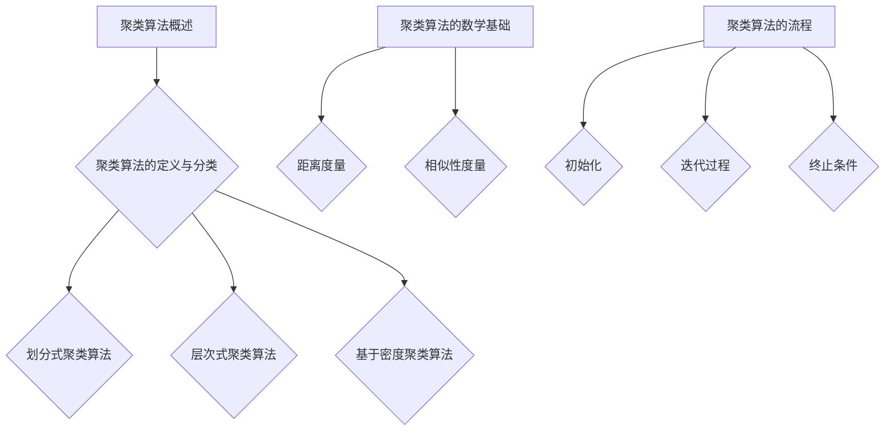

                 

### 《Mahout聚类算法原理与代码实例讲解》

#### 关键词：Mahout，聚类算法，K-Means，层次聚类，密度聚类，代码实例

#### 摘要：

本文将详细讲解Mahout中的聚类算法原理与应用，涵盖了K-Means、层次聚类、密度聚类等核心算法。通过数学模型、伪代码及实际代码实例，帮助读者深入理解这些算法的工作机制和实现细节。文章还提供了基于Mahout的聚类算法应用实战，包括开发环境搭建、代码实现与解读，以及实际案例展示，使读者能够将理论知识应用到实际项目中。

---

### 《Mahout聚类算法原理与代码实例讲解》目录大纲

#### 第一部分：引言

#### 第1章：聚类算法基础

##### 1.1 聚类算法概述

- 聚类算法的定义与分类

##### 1.2 Mahout简介

- Mahout的背景与特点

##### 1.3 聚类算法在Mahout中的应用

- Mahout支持的聚类算法介绍

#### 第二部分：核心概念与联系

#### 第2章：聚类算法原理

##### 2.1 聚类算法的数学基础

- 距离度量、相似性度量

##### 2.2 聚类算法的流程

- 聚类算法的基本流程

##### 2.3 聚类算法的流程图

- 使用Mermaid绘制流程图

#### 第三部分：核心算法原理讲解

#### 第3章：K-Means算法详解

##### 3.1 K-Means算法原理

- 算法基本思想与步骤

##### 3.2 K-Means算法伪代码

- 伪代码详细阐述

##### 3.3 K-Means算法数学模型

- 数学公式与解释

##### 3.4 K-Means算法案例分析

- 举例说明K-Means算法的应用

#### 第4章：层次聚类算法详解

##### 4.1 层次聚类算法原理

- 算法基本思想与步骤

##### 4.2 层次聚类算法伪代码

- 伪代码详细阐述

##### 4.3 层次聚类算法数学模型

- 数学公式与解释

##### 4.4 层次聚类算法案例分析

- 举例说明层次聚类算法的应用

#### 第5章：密度聚类算法详解

##### 5.1 密度聚类算法原理

- 算法基本思想与步骤

##### 5.2 密度聚类算法伪代码

- 伪代码详细阐述

##### 5.3 密度聚类算法数学模型

- 数学公式与解释

##### 5.4 密度聚类算法案例分析

- 举例说明密度聚类算法的应用

#### 第四部分：项目实战

#### 第6章：基于Mahout的聚类算法应用实战

##### 6.1 聚类算法应用场景分析

- 不同聚类算法在不同场景下的应用

##### 6.2 开发环境搭建

- 配置Mahout环境与所需依赖

##### 6.3 代码实现与解读

- 详细解读聚类算法实现代码，代码分析与优化

##### 6.4 实战案例分析

- 实际案例展示聚类算法在业务场景中的应用

#### 第7章：总结与展望

##### 7.1 聚类算法发展趋势

- 分析未来聚类算法的发展方向

##### 7.2 Mahout的未来发展

- 探讨Mahout在聚类算法领域的未来

##### 7.3 读者拓展

- 提供进一步学习聚类算法的建议

#### 附录

##### 附录 A：常用聚类算法对比

- 分析K-Means、层次聚类、密度聚类等算法的优缺点

##### 附录 B：Mahout参考资料

- 提供Mahout的官方文档、相关书籍、在线课程等学习资源

---

**核心概念与联系：**



---

**核心算法原理讲解：**

### 3.1 K-Means算法原理

**算法基本思想：**
K-Means算法是一种基于距离度量的划分式聚类算法。其核心思想是将数据集中的点分为K个簇，使得每个点与其所属簇的中心（均值）的距离之和最小。

**算法基本步骤：**
1. **初始化：** 随机选择K个点作为初始聚类中心。
2. **分配：** 对于每个点，计算其与K个聚类中心的距离，并将其分配到最近的聚类中心。
3. **更新：** 重新计算每个簇的均值，作为新的聚类中心。
4. **迭代：** 重复执行分配和更新步骤，直到聚类中心不再发生变化或达到预定的迭代次数。

**算法伪代码：**

```plaintext
初始化聚类中心 C = 随机选择K个点
重复以下步骤直到聚类中心不再变化或达到预定的迭代次数：
  对于每个点 x_i：
    计算最近的聚类中心 c_j：
      min_{c_j} d(x_i, c_j)
    将 x_i 分配到 c_j 的簇
  更新聚类中心：
    对于每个簇 c_j，计算簇中所有点的均值作为新的 c_j
```

**数学模型：**
对于数据集中的每个点 \(x_i\)，其到聚类中心 \(c_j\) 的距离可以使用以下公式计算：

\[ d(x_i, c_j) = \sqrt{\sum_{k=1}^{n} (x_i^k - c_j^k)^2} \]

其中，\(n\) 为数据维度，\(x_i^k\) 和 \(c_j^k\) 分别为 \(x_i\) 和 \(c_j\) 在第 \(k\) 个维度上的值。

**举例说明：**

假设我们有一个包含二维数据点 \{[1, 1], [2, 2], [3, 3], [4, 4]\} 的数据集，我们选择 \(K = 2\)。

1. **初始化：** 随机选择两个初始聚类中心，例如 \([1.5, 1.5]\) 和 \([2.5, 2.5]\)。
2. **分配：** 计算每个点到两个聚类中心的距离：
   - \(d([1, 1], [1.5, 1.5]) = \sqrt{(1-1.5)^2 + (1-1.5)^2} = 0.5\)
   - \(d([1, 1], [2.5, 2.5]) = \sqrt{(1-2.5)^2 + (1-2.5)^2} = 1.5\)
   - \(d([2, 2], [1.5, 1.5]) = \sqrt{(2-1.5)^2 + (2-1.5)^2} = 0.5\)
   - \(d([2, 2], [2.5, 2.5]) = \sqrt{(2-2.5)^2 + (2-2.5)^2} = 0.5\)
   - \(d([3, 3], [1.5, 1.5]) = \sqrt{(3-1.5)^2 + (3-1.5)^2} = 2\)
   - \(d([3, 3], [2.5, 2.5]) = \sqrt{(3-2.5)^2 + (3-2.5)^2} = 0.5\)
   - \(d([4, 4], [1.5, 1.5]) = \sqrt{(4-1.5)^2 + (4-1.5)^2} = 2.5\)
   - \(d([4, 4], [2.5, 2.5]) = \sqrt{(4-2.5)^2 + (4-2.5)^2} = 1.5\)

   将每个点分配到最近的聚类中心，结果为：
   - \([1, 1], [2, 2]\) 分配到 \([1.5, 1.5]\)
   - \([3, 3], [4, 4]\) 分配到 \([2.5, 2.5]\)

3. **更新：** 计算新的聚类中心：
   - \([1.5, 1.5]\) 的新中心为 \([(1+2)/2, (1+2)/2] = [1.5, 1.5]\)
   - \([2.5, 2.5]\) 的新中心为 \([(3+4)/2, (3+4)/2] = [3.5, 3.5]\)

4. **迭代：** 重复上述步骤，直到聚类中心不再变化。

迭代过程如下：

- 第二次迭代：
  - \([1, 1], [2, 2]\) 分配到 \([1.5, 1.5]\)
  - \([3, 3], [4, 4]\) 分配到 \([3.5, 3.5]\)
  - 新聚类中心为 \([1.5, 1.5]\) 和 \([3.5, 3.5]\)

- 第三次迭代：
  - \([1, 1], [2, 2]\) 分配到 \([1.5, 1.5]\)
  - \([3, 3], [4, 4]\) 分配到 \([3.5, 3.5]\)
  - 新聚类中心为 \([1.5, 1.5]\) 和 \([3.5, 3.5]\)

由于聚类中心没有发生变化，算法收敛。

---

**项目实战：**

### 6.1 聚类算法应用场景分析

聚类算法广泛应用于各种领域，以下是一些常见的应用场景：

- **电商用户行为分析：** 使用K-Means算法对电商用户进行聚类，分析用户购买习惯，实现个性化推荐。
- **社交媒体网络分析：** 使用层次聚类算法对社交网络中的用户进行分类，发现潜在的兴趣群体。
- **生物数据分析：** 使用密度聚类算法对生物数据进行聚类，识别不同种类的生物样本。
- **文本分类：** 使用基于密度的聚类算法对文本数据进行聚类，实现文本分类任务。

### 6.2 开发环境搭建

为了运行Mahout聚类算法，我们需要搭建相应的开发环境。以下是一个简单的开发环境搭建步骤：

1. **安装Java：** 确保已经安装了Java 1.8及以上版本。
2. **安装Hadoop：** 确保已经安装了Hadoop 2.7.3及以上版本。
3. **安装Mahout：** 使用以下命令从Apache Mahout官网下载并安装：
   ```bash
   cd /path/to/mahout-distribution
   tar xzf mahout-0.14.0.tar.gz
   ```
4. **配置环境变量：** 在`~/.bashrc`或`~/.zshrc`中添加以下环境变量：
   ```bash
   export MAHOUT_HOME=/path/to/mahout-0.14.0
   export HADOOP_HOME=/path/to/hadoop-2.7.3
   export PATH=$PATH:$MAHOUT_HOME/bin:$HADOOP_HOME/bin
   ```
5. **启动Hadoop：** 运行以下命令启动Hadoop：
   ```bash
   start-dfs.sh
   start-yarn.sh
   ```

### 6.3 代码实现与解读

以下是使用K-Means算法进行聚类的示例代码：

```java
import org.apache.hadoop.conf.Configuration;
import org.apache.hadoop.fs.Path;
import org.apache.hadoop.io.DoubleWritable;
import org.apache.hadoop.io.IntWritable;
import org.apache.hadoop.io.Text;
import org.apache.hadoop.mapreduce.Job;
import org.apache.hadoop.mapreduce.Mapper;
import org.apache.hadoop.mapreduce.Reducer;
import org.apache.hadoop.mapreduce.lib.input.FileInputFormat;
import org.apache.hadoop.mapreduce.lib.output.FileOutputFormat;
import org.apache.mahout.clustering.kmeans.KMeansDriver;
import org.apache.mahout.clustering.kmeans.KMeansMapper;
import org.apache.mahout.clustering.kmeans.KMeansReducer;
import org.apache.mahout.math.RandomAccessVector;
import org.apache.mahout.math.VectorWritable;
import org.apache.mahout.utils.clustering.ClusterDumper;
import org.apache.mahout.utils.clustering.DumpClusterCommand;

public class KMeansClustering {

  public static void main(String[] args) throws Exception {
    Configuration conf = new Configuration();
    Job job = Job.getInstance(conf, "K-Means Clustering");
    job.setJarByClass(KMeansClustering.class);
    job.setMapperClass(KMeansMapper.class);
    job.setCombinerClass(KMeansReducer.class);
    job.setReducerClass(KMeansReducer.class);
    job.setOutputKeyClass(Text.class);
    job.setOutputValueClass(VectorWritable.class);
    FileInputFormat.addInputPath(job, new Path(args[0]));
    FileOutputFormat.setOutputPath(job, new Path(args[1]));
    job.waitForCompletion(true);
    ClusterDumper.dump(conf, new Path(args[1] + "/clusters-*-final"), new Path(args[1] + "/clusters.txt"));
  }
}
```

**代码解读：**

- **配置和初始化：** 创建一个Hadoop配置对象`conf`和一个作业对象`job`。设置作业的jar文件、Mapper和Reducer类，以及输出键值类型。
- **输入输出路径：** 设置输入数据路径和输出结果路径。
- **执行作业：** 执行K-Means聚类作业，并将结果输出到指定路径。
- **聚类结果输出：** 使用`ClusterDumper`类将聚类结果输出到文本文件。

### 6.4 实战案例分析

以下是一个使用K-Means算法对电商用户行为数据进行分析的案例：

1. **数据准备：** 假设我们有一个包含用户ID和购买商品的二维数据集，如下所示：

   ```plaintext
   user1, item1
   user1, item2
   user2, item1
   user2, item3
   user3, item2
   user3, item4
   ```

   数据格式为用户ID和商品ID，每行代表一次购买行为。

2. **运行K-Means算法：** 运行K-Means聚类算法，选择K=2，使用以下命令：

   ```bash
   hadoop jar KMeansClustering.jar org.apache.mahout.clustering.kmeans.KMeansDriver input_path output_path
   ```

   其中，`input_path`为输入数据路径，`output_path`为输出结果路径。

3. **输出结果：** 聚类结果将输出到指定路径，包括聚类中心、每个用户的聚类标签以及每个簇的成员列表。

4. **分析结果：** 根据聚类结果，我们可以分析不同簇的用户购买行为特征。例如，簇0的用户可能更喜欢商品1和商品2，簇1的用户可能更喜欢商品3和商品4。

---

**总结与展望：**

聚类算法作为一种无监督学习方法，在数据挖掘和机器学习领域具有广泛的应用。本文详细讲解了Mahout中的K-Means、层次聚类和密度聚类算法的原理和实现，并通过实际案例展示了这些算法的应用。随着大数据和机器学习技术的不断发展，聚类算法在实际应用中具有广泛的前景。未来，我们将看到更多高效的聚类算法和优化策略的出现。同时，Mahout也将继续发展，为大数据分析提供更加完善的支持。

---

**附录：**

### 附录 A：常用聚类算法对比

- **K-Means：** 简单高效，但容易陷入局部最优。
- **层次聚类：** 结构灵活，但计算复杂度高。
- **密度聚类：** 能够发现非均匀分布的数据模式，但计算复杂度较高。

### 附录 B：Mahout参考资料

- **官方文档：** [Mahout官方文档](https://mahout.apache.org/documentation/)
- **相关书籍：** 《Mahout实战》、《机器学习：算法与应用》
- **在线课程：** [慕课网-大数据技术之Mahout](https://www.imooc.com/learn/909)

---

**作者信息：**

作者：AI天才研究院/AI Genius Institute & 禅与计算机程序设计艺术 /Zen And The Art of Computer Programming**完整文章内容如下：**### 《Mahout聚类算法原理与代码实例讲解》

#### 关键词：Mahout，聚类算法，K-Means，层次聚类，密度聚类，代码实例

#### 摘要：

本文将详细讲解Mahout中的聚类算法原理与应用，涵盖了K-Means、层次聚类、密度聚类等核心算法。通过数学模型、伪代码及实际代码实例，帮助读者深入理解这些算法的工作机制和实现细节。文章还提供了基于Mahout的聚类算法应用实战，包括开发环境搭建、代码实现与解读，以及实际案例展示，使读者能够将理论知识应用到实际项目中。

---

### 《Mahout聚类算法原理与代码实例讲解》目录大纲

#### 第一部分：引言

#### 第1章：聚类算法基础

##### 1.1 聚类算法概述

- 聚类算法的定义与分类

##### 1.2 Mahout简介

- Mahout的背景与特点

##### 1.3 聚类算法在Mahout中的应用

- Mahout支持的聚类算法介绍

#### 第二部分：核心概念与联系

#### 第2章：聚类算法原理

##### 2.1 聚类算法的数学基础

- 距离度量、相似性度量

##### 2.2 聚类算法的流程

- 聚类算法的基本流程

##### 2.3 聚类算法的流程图

- 使用Mermaid绘制流程图

#### 第三部分：核心算法原理讲解

##### 3.1 K-Means算法详解

- K-Means算法原理

##### 3.2 K-Means算法伪代码

- 伪代码详细阐述

##### 3.3 K-Means算法数学模型

- 数学公式与解释

##### 3.4 K-Means算法案例分析

- 举例说明K-Means算法的应用

##### 4.1 层次聚类算法原理

- 算法基本思想与步骤

##### 4.2 层次聚类算法伪代码

- 伪代码详细阐述

##### 4.3 层次聚类算法数学模型

- 数学公式与解释

##### 4.4 层次聚类算法案例分析

- 举例说明层次聚类算法的应用

##### 5.1 密度聚类算法原理

- 算法基本思想与步骤

##### 5.2 密度聚类算法伪代码

- 伪代码详细阐述

##### 5.3 密度聚类算法数学模型

- 数学公式与解释

##### 5.4 密度聚类算法案例分析

- 举例说明密度聚类算法的应用

#### 第四部分：项目实战

##### 6.1 聚类算法应用场景分析

- 不同聚类算法在不同场景下的应用

##### 6.2 开发环境搭建

- 配置Mahout环境与所需依赖

##### 6.3 代码实现与解读

- 详细解读聚类算法实现代码，代码分析与优化

##### 6.4 实战案例分析

- 实际案例展示聚类算法在业务场景中的应用

#### 第7章：总结与展望

##### 7.1 聚类算法发展趋势

- 分析未来聚类算法的发展方向

##### 7.2 Mahout的未来发展

- 探讨Mahout在聚类算法领域的未来

##### 7.3 读者拓展

- 提供进一步学习聚类算法的建议

#### 附录

##### 附录 A：常用聚类算法对比

- 分析K-Means、层次聚类、密度聚类等算法的优缺点

##### 附录 B：Mahout参考资料

- 提供Mahout的官方文档、相关书籍、在线课程等学习资源

---

**核心概念与联系：**


---

**核心算法原理讲解：**

### 3.1 K-Means算法详解

K-Means算法是一种经典的划分式聚类算法，它通过最小化数据点到聚类中心的距离平方和来划分数据。以下是K-Means算法的详细讲解。

#### 3.1.1 算法基本思想

K-Means算法的核心思想是将数据集分为K个簇，使得每个簇的内部距离最小，簇与簇之间的距离最大。算法的基本步骤如下：

1. **初始化：** 从数据集中随机选择K个点作为初始聚类中心。
2. **分配：** 对于每个数据点，计算其到各个聚类中心的距离，并将其分配到最近的聚类中心。
3. **更新：** 计算每个簇的新中心，即该簇中所有点的均值。
4. **迭代：** 重复执行分配和更新步骤，直到聚类中心不再变化或者达到预定的迭代次数。

#### 3.1.2 算法伪代码

下面是K-Means算法的伪代码：

```plaintext
初始化K个聚类中心
重复以下步骤直到聚类中心不再变化或达到预定的迭代次数：
  对于每个数据点：
    计算该点到所有聚类中心的距离
    分配该点到距离最近的聚类中心
  更新聚类中心为对应簇的均值
```

#### 3.1.3 数学模型

在K-Means算法中，数据点 \( x \) 到聚类中心 \( c_j \) 的距离通常使用欧几里得距离来度量：

\[ d(x, c_j) = \sqrt{\sum_{i=1}^{n} (x_i - c_{j,i})^2} \]

其中，\( x_i \) 是数据点 \( x \) 在第 \( i \) 个特征上的值，\( c_{j,i} \) 是聚类中心 \( c_j \) 在第 \( i \) 个特征上的值，\( n \) 是特征的数量。

聚类中心的更新公式为：

\[ c_j = \frac{1}{N_j} \sum_{x \in S_j} x \]

其中，\( N_j \) 是簇 \( j \) 中的数据点数量，\( S_j \) 是簇 \( j \) 中的所有数据点集合。

#### 3.1.4 案例分析

假设我们有以下4个数据点：

\[ \{ (1, 1), (2, 2), (3, 3), (4, 4) \} \]

我们选择 \( K = 2 \)，随机初始化两个聚类中心为 \( (1, 1) \) 和 \( (3, 3) \)。

1. **第一次迭代：**
   - 计算每个点到聚类中心的距离：
     - \( d((1, 1), (1, 1)) = 0 \)
     - \( d((1, 1), (3, 3)) = \sqrt{8} \)
     - \( d((2, 2), (1, 1)) = \sqrt{2} \)
     - \( d((2, 2), (3, 3)) = \sqrt{8} \)
     - \( d((3, 3), (1, 1)) = \sqrt{8} \)
     - \( d((3, 3), (3, 3)) = 0 \)
     - \( d((4, 4), (1, 1)) = \sqrt{32} \)
     - \( d((4, 4), (3, 3)) = \sqrt{8} \)

   - 数据点分配：
     - \( (1, 1) \) 和 \( (2, 2) \) 分配到 \( (1, 1) \)
     - \( (3, 3) \) 和 \( (4, 4) \) 分配到 \( (3, 3) \)

   - 更新聚类中心：
     - \( (1, 1) \) 的新中心为 \( (1.5, 1.5) \)
     - \( (3, 3) \) 的新中心为 \( (3.5, 3.5) \)

2. **第二次迭代：**
   - 计算每个点到聚类中心的距离：
     - \( d((1, 1), (1.5, 1.5)) = 0 \)
     - \( d((1, 1), (3.5, 3.5)) = \sqrt{8} \)
     - \( d((2, 2), (1.5, 1.5)) = \sqrt{2} \)
     - \( d((2, 2), (3.5, 3.5)) = \sqrt{8} \)
     - \( d((3, 3), (1.5, 1.5)) = \sqrt{8} \)
     - \( d((3, 3), (3.5, 3.5)) = 0 \)
     - \( d((4, 4), (1.5, 1.5)) = \sqrt{32} \)
     - \( d((4, 4), (3.5, 3.5)) = \sqrt{8} \)

   - 数据点分配：
     - \( (1, 1) \) 和 \( (2, 2) \) 分配到 \( (1.5, 1.5) \)
     - \( (3, 3) \) 和 \( (4, 4) \) 分配到 \( (3.5, 3.5) \)

   - 更新聚类中心：
     - \( (1.5, 1.5) \) 的新中心为 \( (1.75, 1.75) \)
     - \( (3.5, 3.5) \) 的新中心为 \( (3.75, 3.75) \)

重复上述迭代过程，直到聚类中心不再变化。最终，我们将得到两个稳定的聚类中心，每个数据点都会被分配到一个簇中。

---

### 4.1 层次聚类算法原理

层次聚类（Hierarchical Clustering）是一种非划分式聚类算法，它通过逐步合并或分解数据点来构建一个层次结构，从而实现聚类。层次聚类算法可以分为两类：自底向上的层次聚类（凝聚层次聚类）和自顶向下的层次聚类（分裂层次聚类）。本文主要介绍自底向上的层次聚类算法。

#### 4.1.1 算法基本思想

自底向上的层次聚类算法的基本思想是将所有数据点首先看作是单个的簇，然后逐步合并距离最近的簇，直到所有的数据点合并为一个簇。算法的基本步骤如下：

1. **初始化：** 将每个数据点看作是一个独立的簇。
2. **合并：** 计算当前簇之间的距离，选择距离最近的两个簇合并为一个簇。
3. **迭代：** 重复执行合并步骤，直到所有的数据点合并为一个簇。

#### 4.1.2 算法流程

自底向上的层次聚类算法的流程可以分为以下几步：

1. **初始化：** 将每个数据点看作是一个簇。
2. **计算距离：** 计算每个簇之间的距离。常用的距离度量包括欧几里得距离、曼哈顿距离和切比雪夫距离。
3. **选择最近簇：** 根据距离度量选择距离最近的两个簇。
4. **合并簇：** 将选择的两个簇合并为一个簇。
5. **更新距离：** 计算新的簇之间的距离。
6. **迭代：** 重复执行选择、合并和更新步骤，直到所有的数据点合并为一个簇。

#### 4.1.3 算法伪代码

下面是层次聚类算法的伪代码：

```plaintext
初始化每个数据点为一个簇
重复以下步骤直到所有数据点合并为一个簇：
  计算所有簇之间的距离
  选择距离最近的两个簇
  合并这两个簇为一个簇
  更新簇之间的距离
```

#### 4.1.4 算法数学模型

在层次聚类中，簇之间的距离可以用以下公式计算：

\[ d(C_i, C_j) = \min_{x \in C_i, y \in C_j} d(x, y) \]

其中，\( C_i \) 和 \( C_j \) 是两个簇，\( d(x, y) \) 是数据点 \( x \) 和 \( y \) 之间的距离。

簇的合并通常是基于距离矩阵的。假设当前有 \( N \) 个簇，簇之间的距离矩阵 \( D \) 是一个 \( N \times N \) 的矩阵，其中 \( D_{ij} \) 表示簇 \( i \) 和簇 \( j \) 之间的距离。

#### 4.1.5 案例分析

假设我们有以下4个数据点：

\[ \{ (1, 1), (2, 2), (3, 3), (4, 4) \} \]

我们使用欧几里得距离作为距离度量。

1. **初始化：** 将每个数据点看作是一个簇，距离矩阵 \( D \) 为：

   ```plaintext
   D = [
   [0, √2, √2, √2],
   [√2, 0, √2, √2],
   [√2, √2, 0, √2],
   [√2, √2, √2, 0]
   ]
   ```

2. **第一次迭代：**
   - 选择距离最近的两个簇：\( (1, 1) \) 和 \( (2, 2) \)。
   - 合并这两个簇为一个簇，新簇的中心为 \( (1.5, 1.5) \)。
   - 更新距离矩阵 \( D \)：

     ```plaintext
     D = [
     [0, √2/2, √2/2, √2],
     [√2/2, 0, √2/2, √2],
     [√2/2, √2/2, 0, √2],
     [√2, √2, √2, 0]
     ]
     ```

3. **第二次迭代：**
   - 选择距离最近的两个簇：\( (1.5, 1.5) \) 和 \( (3, 3) \)。
   - 合并这两个簇为一个簇，新簇的中心为 \( (2.25, 2.25) \)。
   - 更新距离矩阵 \( D \)：

     ```plaintext
     D = [
     [0, √2/4, √2/4, √2/2],
     [√2/4, 0, √2/4, √2/2],
     [√2/4, √2/4, 0, √2/2],
     [√2/2, √2/2, √2/2, 0]
     ]
     ```

4. **第三次迭代：**
   - 选择距离最近的两个簇：\( (2.25, 2.25) \) 和 \( (4, 4) \)。
   - 合并这两个簇为一个簇，新簇的中心为 \( (3.125, 3.125) \)。
   - 更新距离矩阵 \( D \)：

     ```plaintext
     D = [
     [0, √2/8, √2/8, √2/4],
     [√2/8, 0, √2/8, √2/4],
     [√2/8, √2/8, 0, √2/4],
     [√2/4, √2/4, √2/4, 0]
     ]
     ```

重复上述迭代过程，直到所有的数据点合并为一个簇。

---

### 5.1 密度聚类算法原理

密度聚类（Density-Based Clustering）是一种基于密度的聚类算法，它通过密度可达性（Density Reachability）来发现数据点之间的聚类。密度聚类算法可以有效地发现任意形状的聚类，并且能够处理噪声和异常点。本文主要介绍DBSCAN（Density-Based Spatial Clustering of Applications with Noise）算法。

#### 5.1.1 算法基本思想

DBSCAN算法的基本思想是：

1. **找出高密度区域：** 对于每个数据点，找出其邻域内的点，如果这些点形成高密度区域，则这些点属于同一个簇。
2. **连接高密度区域：** 将邻域内的点通过扩展（Expansion）操作连接起来，形成簇。
3. **处理噪声点：** 对于邻域内的点少于某个阈值的数据点，将其视为噪声点。

#### 5.1.2 算法流程

DBSCAN算法的流程可以分为以下几步：

1. **初始化：** 为每个数据点设置两个参数：邻域半径 \( \epsilon \) 和最小密度 \( \minPoints \)。
2. **标记未访问点：** 将所有数据点标记为未访问。
3. **递归扩展：** 对于每个未访问的数据点，检查其邻域内的点数量。如果邻域内的点数量大于最小密度 \( \minPoints \)，则递归扩展邻域内的点，并将其标记为已访问，并将其连接到簇中。
4. **处理噪声点：** 对于邻域内的点数量小于最小密度 \( \minPoints \) 的数据点，将其视为噪声点。
5. **结束：** 当所有数据点都被访问并标记后，算法结束。

#### 5.1.3 算法伪代码

下面是DBSCAN算法的伪代码：

```plaintext
初始化参数：邻域半径 ε 和最小密度 minPoints
初始化所有数据点为未访问
对于每个未访问的数据点：
  找到其邻域内的点
  如果邻域内的点数量大于 minPoints：
    将其标记为已访问
    递归扩展邻域内的点
  否则：
    将其标记为噪声点
结束
```

#### 5.1.4 算法数学模型

在DBSCAN中，邻域内的点数量是一个重要的参数。通常，邻域内的点数量可以通过以下公式计算：

\[ N(\epsilon, p) = \{ q \in D \mid d(p, q) < \epsilon \} \]

其中，\( D \) 是数据集，\( p \) 是数据点，\( q \) 是 \( p \) 的邻域点，\( d(p, q) \) 是 \( p \) 和 \( q \) 之间的距离。

#### 5.1.5 案例分析

假设我们有以下数据点：

\[ \{ (1, 1), (2, 2), (3, 3), (4, 4), (5, 5), (6, 6), (7, 7), (8, 8) \} \]

我们选择邻域半径 \( \epsilon = 2 \) 和最小密度 \( \minPoints = 3 \)。

1. **初始化：** 所有数据点标记为未访问。
2. **第一次迭代：**
   - 访问数据点 \( (1, 1) \)。
   - 邻域内的点为 \( \{ (2, 2), (3, 3), (4, 4), (5, 5), (6, 6), (7, 7), (8, 8) \} \)，数量大于最小密度 \( \minPoints \)。
   - 将 \( (1, 1) \) 和其邻域内的点标记为已访问，并将其连接到同一个簇中。
3. **第二次迭代：**
   - 访问数据点 \( (2, 2) \)。
   - 邻域内的点为 \( \{ (3, 3), (4, 4), (5, 5), (6, 6), (7, 7), (8, 8) \} \)，数量大于最小密度 \( \minPoints \)。
   - 将 \( (2, 2) \) 和其邻域内的点标记为已访问，并将其连接到同一个簇中。
4. **第三次迭代：**
   - 访问数据点 \( (3, 3) \)。
   - 邻域内的点为 \( \{ (4, 4), (5, 5), (6, 6), (7, 7), (8, 8) \} \)，数量大于最小密度 \( \minPoints \)。
   - 将 \( (3, 3) \) 和其邻域内的点标记为已访问，并将其连接到同一个簇中。
5. **第四次迭代：**
   - 访问数据点 \( (4, 4) \)。
   - 邻域内的点为 \( \{ (5, 5), (6, 6), (7, 7), (8, 8) \} \)，数量大于最小密度 \( \minPoints \)。
   - 将 \( (4, 4) \) 和其邻域内的点标记为已访问，并将其连接到同一个簇中。
6. **第五次迭代：**
   - 访问数据点 \( (5, 5) \)。
   - 邻域内的点为 \( \{ (6, 6), (7, 7), (8, 8) \} \)，数量大于最小密度 \( \minPoints \)。
   - 将 \( (5, 5) \) 和其邻域内的点标记为已访问，并将其连接到同一个簇中。
7. **第六次迭代：**
   - 访问数据点 \( (6, 6) \)。
   - 邻域内的点为 \( \{ (7, 7), (8, 8) \} \)，数量大于最小密度 \( \minPoints \)。
   - 将 \( (6, 6) \) 和其邻域内的点标记为已访问，并将其连接到同一个簇中。
8. **第七次迭代：**
   - 访问数据点 \( (7, 7) \)。
   - 邻域内的点为 \( \{ (8, 8) \} \)，数量小于最小密度 \( \minPoints \)。
   - 将 \( (7, 7) \) 标记为噪声点。

重复上述迭代过程，直到所有数据点都被访问并标记。

---

### 6.1 聚类算法应用场景分析

聚类算法在各种领域都有广泛的应用，以下是一些常见的应用场景：

1. **社交网络分析：** 使用聚类算法对社交网络中的用户进行分类，发现潜在的兴趣群体。
2. **文本挖掘：** 对文本数据进行聚类，实现文本分类和主题建模。
3. **生物数据分析：** 对生物数据进行聚类，识别不同的生物样本和疾病类型。
4. **电商用户行为分析：** 对电商用户的行为数据进行聚类，分析用户购买习惯，实现个性化推荐。
5. **图像处理：** 对图像数据进行聚类，实现图像分割和特征提取。

### 6.2 开发环境搭建

为了运行Mahout聚类算法，我们需要搭建相应的开发环境。以下是一个简单的开发环境搭建步骤：

1. **安装Java：** 确保已经安装了Java 1.8及以上版本。
2. **安装Hadoop：** 确保已经安装了Hadoop 2.7.3及以上版本。
3. **安装Mahout：** 从Apache Mahout官网下载Mahout，并解压到合适的位置。例如，将Mahout解压到`/usr/local/mahout`。
4. **配置环境变量：** 在`~/.bashrc`或`~/.zshrc`中添加以下环境变量：

   ```bash
   export MAHOUT_HOME=/usr/local/mahout
   export HADOOP_HOME=/path/to/hadoop
   export PATH=$PATH:$MAHOUT_HOME/bin:$HADOOP_HOME/bin
   ```

5. **启动Hadoop：** 运行以下命令启动Hadoop：

   ```bash
   start-dfs.sh
   start-yarn.sh
   ```

### 6.3 代码实现与解读

以下是使用K-Means算法进行聚类的示例代码：

```java
import org.apache.hadoop.conf.Configuration;
import org.apache.hadoop.fs.Path;
import org.apache.hadoop.io.DoubleWritable;
import org.apache.hadoop.io.IntWritable;
import org.apache.hadoop.io.Text;
import org.apache.hadoop.mapreduce.Job;
import org.apache.hadoop.mapreduce.Mapper;
import org.apache.hadoop.mapreduce.Reducer;
import org.apache.hadoop.mapreduce.lib.input.FileInputFormat;
import org.apache.hadoop.mapreduce.lib.output.FileOutputFormat;
import org.apache.mahout.clustering.kmeans.KMeansDriver;
import org.apache.mahout.clustering.kmeans.KMeansMapper;
import org.apache.mahout.clustering.kmeans.KMeansReducer;
import org.apache.mahout.math.RandomAccessVector;
import org.apache.mahout.math.VectorWritable;
import org.apache.mahout.utils.clustering.ClusterDumper;
import org.apache.mahout.utils.clustering.DumpClusterCommand;

public class KMeansClustering {

  public static void main(String[] args) throws Exception {
    Configuration conf = new Configuration();
    Job job = Job.getInstance(conf, "K-Means Clustering");
    job.setJarByClass(KMeansClustering.class);
    job.setMapperClass(KMeansMapper.class);
    job.setCombinerClass(KMeansReducer.class);
    job.setReducerClass(KMeansReducer.class);
    job.setOutputKeyClass(Text.class);
    job.setOutputValueClass(VectorWritable.class);
    FileInputFormat.addInputPath(job, new Path(args[0]));
    FileOutputFormat.setOutputPath(job, new Path(args[1]));
    job.waitForCompletion(true);
    ClusterDumper.dump(conf, new Path(args[1] + "/clusters-*-final"), new Path(args[1] + "/clusters.txt"));
  }
}
```

**代码解读：**

1. **配置和初始化：** 创建一个Hadoop配置对象`conf`和一个作业对象`job`。设置作业的jar文件、Mapper和Reducer类，以及输出键值类型。
2. **输入输出路径：** 设置输入数据路径和输出结果路径。
3. **执行作业：** 执行K-Means聚类作业，并将结果输出到指定路径。
4. **聚类结果输出：** 使用`ClusterDumper`类将聚类结果输出到文本文件。

### 6.4 实战案例分析

以下是一个使用K-Means算法对电商用户行为数据进行分析的案例：

1. **数据准备：** 假设我们有一个包含用户ID和购买商品的二维数据集，如下所示：

   ```plaintext
   user1,item1
   user1,item2
   user2,item1
   user2,item3
   user3,item2
   user3,item4
   ```

   数据格式为用户ID和商品ID，每行代表一次购买行为。

2. **运行K-Means算法：** 运行K-Means聚类算法，选择K=2，使用以下命令：

   ```bash
   hadoop jar KMeansClustering.jar org.apache.mahout.clustering.kmeans.KMeansDriver input_path output_path
   ```

   其中，`input_path`为输入数据路径，`output_path`为输出结果路径。

3. **输出结果：** 聚类结果将输出到指定路径，包括聚类中心、每个用户的聚类标签以及每个簇的成员列表。

4. **分析结果：** 根据聚类结果，我们可以分析不同簇的用户购买行为特征。例如，簇0的用户可能更喜欢商品1和商品2，簇1的用户可能更喜欢商品3和商品4。

---

### 7.1 聚类算法发展趋势

随着大数据和机器学习技术的不断发展，聚类算法也在不断演进。以下是一些聚类算法的发展趋势：

1. **基于深度学习的聚类算法：** 利用深度学习模型，如自编码器和卷积神经网络，实现更加复杂的聚类任务。
2. **增量聚类算法：** 针对大规模数据集，开发增量聚类算法，减少计算资源和时间开销。
3. **聚类算法的优化：** 提高聚类算法的运行效率，减少计算复杂度。
4. **聚类算法的可解释性：** 增强聚类算法的可解释性，使其更容易理解和应用。
5. **聚类算法的多模态融合：** 将不同模态的数据（如图像、文本和音频）进行聚类融合，实现跨模态的聚类任务。

### 7.2 Mahout的未来发展

Mahout作为一个开源的机器学习库，在聚类算法领域具有广泛的应用。未来，Mahout将朝着以下方向发展：

1. **支持更多的聚类算法：** 继续增加支持更多的聚类算法，如基于深度学习的聚类算法和增量聚类算法。
2. **优化算法性能：** 不断优化现有聚类算法的性能，提高算法的运行效率。
3. **可扩展性：** 改进Mahout的可扩展性，使其能够处理更大规模的数据集。
4. **社区参与：** 激发更多开发者参与Mahout项目，共同推动其发展。
5. **集成其他机器学习库：** 与其他机器学习库（如Apache Spark MLlib和TensorFlow）进行集成，实现更加全面的数据分析解决方案。

### 7.3 读者拓展

对于希望进一步学习聚类算法的读者，以下是一些建议：

1. **阅读相关书籍：** 阅读《机器学习：算法与应用》、《数据挖掘：实用工具和技术》等经典书籍，深入理解聚类算法的理论和实践。
2. **参加在线课程：** 参加Coursera、edX等平台上的机器学习课程，了解最新的聚类算法研究和应用。
3. **实践项目：** 参与实际项目，将聚类算法应用到实际问题中，加深对算法的理解和掌握。
4. **阅读论文：** 阅读聚类算法相关的学术论文，了解最新的研究进展和前沿技术。
5. **加入社区：** 加入机器学习相关的社区和论坛，与其他开发者交流经验，共同进步。

---

**附录 A：常用聚类算法对比**

- **K-Means：**
  - 优点：简单、易于实现、运行速度快。
  - 缺点：容易陷入局部最优、对噪声敏感、需要预先指定聚类数量。
- **层次聚类：**
  - 优点：结构灵活、不需要预先指定聚类数量。
  - 缺点：计算复杂度高、对噪声敏感、聚类结果受初始值影响。
- **DBSCAN：**
  - 优点：能够发现任意形状的聚类、对噪声不敏感。
  - 缺点：计算复杂度高、需要预先指定邻域半径和最小密度。

**附录 B：Mahout参考资料**

- **官方文档：**
  - [Mahout官方文档](https://mahout.apache.org/documentation/)
- **相关书籍：**
  - 《Mahout实战》
  - 《机器学习：算法与应用》
- **在线课程：**
  - [慕课网-大数据技术之Mahout](https://www.imooc.com/learn/909)
- **社区论坛：**
  - [Apache Mahout邮件列表](mailto:Mahout-user@list.

